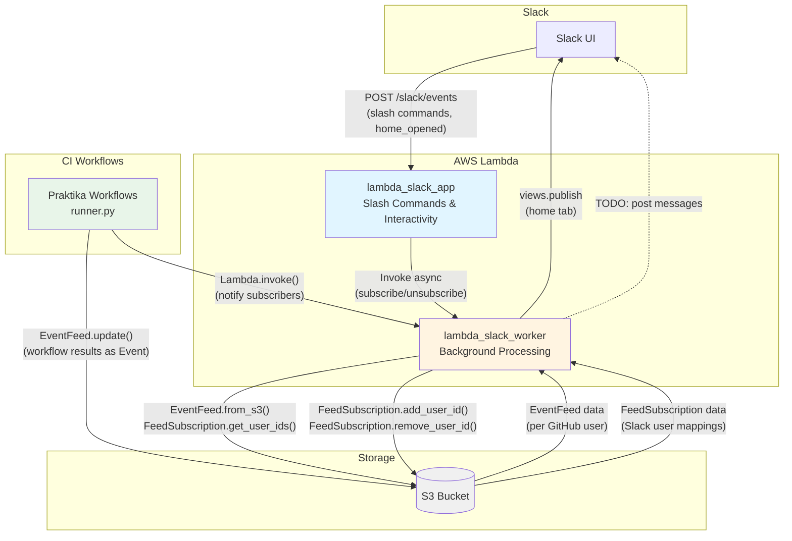

# Praktika Native Cloud Infrastructure Components

This directory contains cloud components provided natively by praktika.

## Components

### Slack App

The Slack app integration consists of two AWS Lambda functions that work together to provide real-time CI/CD notifications and interactive features.

#### Lambda Functions

##### [lambda_slack_app.py](lambda_slack_app.py)
Main Lambda function that handles synchronous Slack interactions:
- **Slash commands**: `/praktika-ci subscribe <github_login>`, `/praktika-ci unsubscribe`
- **Interactive components**: Home tab app opened events
- **Request verification**: Validates Slack request signatures
- **User management**: Invokes worker Lambda to handle subscriptions

##### [lambda_slack_worker.py](lambda_slack_worker.py)
Background worker Lambda that handles asynchronous processing:
- **Subscription management**: Add/remove Slack user IDs to/from FeedSubscription in S3
- **Home view publishing**: Renders EventFeed data into Slack home tab view
- **Event aggregation**: Displays PR status, CI status, job results summary
- **S3 operations**: Reads EventFeed and FeedSubscription data
- **Included modules**: `praktika/event.py` (Event, EventFeed, FeedSubscription classes)

#### Architecture



#### Data Flow

1. **User subscribes** (Slack → Lambda App → Lambda Worker → S3)
   - User runs `/praktika-ci subscribe maxknv` in Slack
   - `lambda_slack_app` validates and invokes `lambda_slack_worker` with action="subscribe"
   - Worker calls `FeedSubscription.add_user_id()` to store mapping in S3
   - Worker loads `EventFeed.from_s3()` and publishes home view to Slack

2. **CI workflow completes** (Workflow → S3 → Lambda Worker → Slack)
   - Workflow calls `Result.to_event()` to convert workflow result to Event
   - `EventFeed.update()` saves Event to S3 at `{s3_path}/{github_login}.json.gz`
   - Workflow invokes `lambda_slack_worker` with action="update"
   - Worker reads EventFeed, finds subscribed users, publishes updated home view

3. **Home view display** (Slack → Lambda App → Lambda Worker → Slack)
   - User opens Slack app home tab (triggers `app_home_opened` event)
   - `lambda_slack_app` invokes `lambda_slack_worker` with action="update"
   - Worker loads EventFeed and renders PR status, CI status, job results summary
   - Worker calls Slack API `views.publish` to update home tab

#### S3 Data Structure

```
s3://{bucket}/{prefix}/
├── {github_login}.json.gz          # EventFeed: List of Events per GitHub user
├── gh_{github_login}.json          # FeedSubscription: Slack user_ids subscribed to this GitHub user
└── slack_{slack_user_id}.json      # Reverse lookup: Which GitHub user this Slack user subscribed to
```

#### Event Data Model

```python
Event:
  - type: "running" | "completed"
  - pr_number, pr_status, pr_title
  - ci_status: "pending" | "running" | "success" | "failure"
  - result: dict  # Top-level workflow Result.to_dict()
    - status, start_time, duration
    - results: list[dict]  # Individual job results
    - ext: {"report_url": str}
    - links: [PR_URL, RUN_URL]
```

#### Setup

##### Enable in Your Project

Add Slack app Lambdas to your cloud infrastructure configuration:

```python
from praktika import CloudInfrastructure

CLOUD = CloudInfrastructure.Config(
    name="my_cloud_infra",
    lambda_functions=[*CloudInfrastructure.SLACK_APP_LAMBDAS]
)
```

##### Deploy

```bash
praktika deploy
```

##### Environment Variables (AWS Parameter Store)

Required secrets (automatically fetched during deployment):
- `praktika_slack_app_signing_secret` → `SIGN_SECRET`
- `praktika_slack_app_token` → `SLACK_BOT_TOKEN`
- `EVENTS_S3_PATH` → S3 bucket/prefix for EventFeed and FeedSubscription data

##### Enable in Workflow

```python
from praktika import Workflow

workflow = Workflow.Config(
    name="MyWorkflow",
    enable_slack_feed=True,  # Enable Event publishing and Lambda invocation
    # ...
)
```

## Planned Native Components

Future native components under consideration:

- **Auto Scaling Groups**: Pre-configured ASG templates for CI/CD runners with optimal instance types and scaling policies
- **S3 Buckets**: Standard bucket configurations for:
  - Build artifacts storage
  - HTML reports and logs
  - Runner AMI/container images
- **IAM Roles & Policies**: Common permission sets for CI/CD workflows
