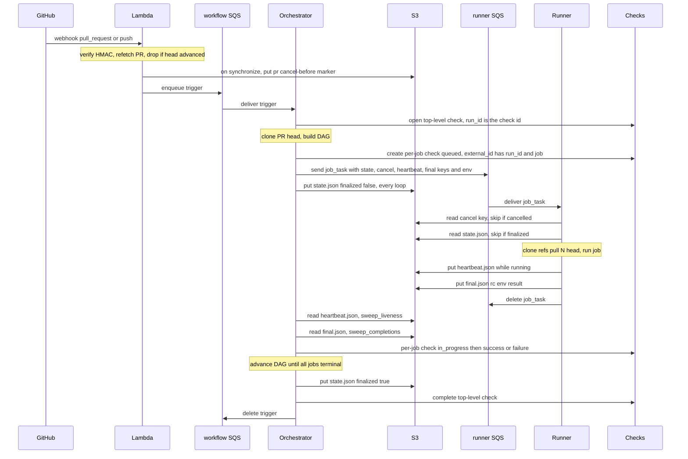
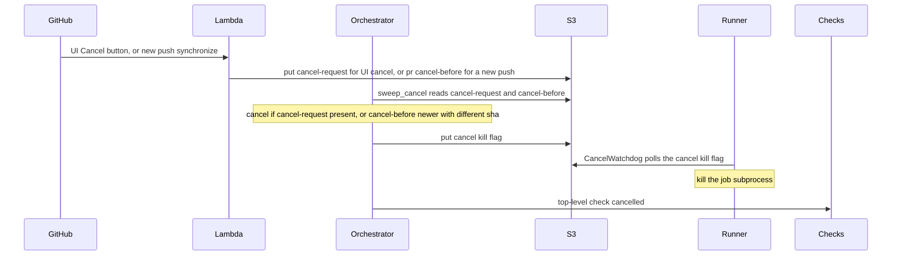
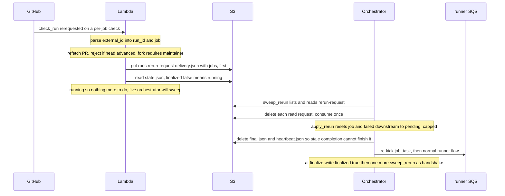
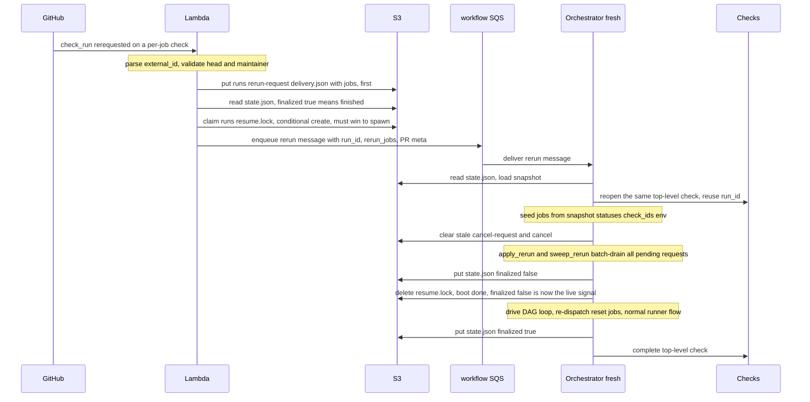

# CI Engine — lifecycle & flow {#ci-engine-lifecycle}

How the pieces talk. **SQS carries forward dispatch only** (two hops); **everything
that flows back — completion, liveness, cancel, re-run, run state — goes through
S3.** GitHub Checks is the only channel to the user.

See also [PROTOCOL.md](./PROTOCOL.md) (contracts).

## Components

| Component | Runs on | Consumes | Produces |
|---|---|---|---|
| **Lambda** (`gh-trigger`) | AWS Lambda | GitHub webhooks | workflow-trigger SQS; S3 cancel/rerun/throttle markers; GitHub gate checks |
| **Orchestrator** | EC2 ASG `praktika-workflow-orchestrator[-base]` | workflow-trigger SQS | per-runner-type SQS (`job_task`); S3 run state; GitHub checks |
| **Runner** | EC2 ASG `praktika-<runner-type>` (`…-base`, `pr-…`, `…-bedrock`) | per-runner-type SQS | S3 heartbeat/final (GitHub check transitions are owned by the orchestrator) |

Both orchestrator and runner run the **same** `praktika-controller` poller; its
`praktika_role` instance tag (`workflow_orchestrator` vs `job_runner`) picks the role.

## SQS queues (forward dispatch only)

| Queue | Producer → Consumer | Message |
|---|---|---|
| `praktika_clickhouse_workflows` (workflow-trigger) | Lambda → Orchestrator | `pull_request` / `push` trigger, or `rerun` (finished-run resume) |
| `praktika-<runner-type>` | Orchestrator → Runner | `job_task` |

There is **no** per-run SQS queue (retired). Everything else is S3.

## S3 objects — who writes, who reads

Bucket: `Settings.S3_ARTIFACT_BUCKET` (e.g. `praktika-artifacts-eu-north-1`).

| Key | Writer | Reader | Purpose |
|---|---|---|---|
| `runs/<run_id>/state.json` | Orchestrator (each loop + finalized at end) | Lambda (running-vs-finished routing), resume Orchestrator (seed), Runner (finalized guard) | DAG snapshot: per-job status/check_id/rc/rerun_count, env, `finalized` |
| `runs/<run_id>/<job>/final.json` | Runner (on job exit) | Orchestrator (`sweep_completions`) | `rc`, `environment`, `result` — job completion (replaces SQS completions) |
| `runs/<run_id>/<job>/heartbeat.json` | Runner (every `heartbeat_interval_s`) | Orchestrator (`sweep_liveness`) | `ts`, `phase`, `instance_id`, `attempt` — liveness |
| `runs/<run_id>/cancel` (kill flag) | Orchestrator (`cancel_unfinished_jobs`) | Runner (`CancelWatchdog` + pre-clone guard) | tells running runners to kill the job subprocess |
| `runs/<run_id>/cancel-request` | Lambda (UI Cancel button) | Orchestrator (`sweep_cancel`) | manual cancel of one run |
| `pr/<pr>/cancel-before-<scope>` | Lambda (`synchronize` / new push) | Orchestrator (`sweep_cancel`) | `ts` + `head_sha`; older in-scope runs self-cancel |
| `runs/<run_id>/rerun-request/<delivery>.json` | Lambda (every partial re-run) | Orchestrator (`sweep_rerun`, consume-once) | `jobs` to reset + re-run; single request log both running and resume paths drain |
| `runs/<run_id>/resume.lock` | Lambda (conditional `IfNoneMatch`, finished-run partial re-run) | resume Orchestrator (delete after `finalized=false`) | per-run boot-lease: serializes spawning one resume; no TTL (SQS redelivery recovers a crashed boot) |
| `external-pr-approvals/<repo>/pr/<n>.json` | Lambda (gate approve/store) | Lambda | fork-PR approval state |

## Normal run (push / PR)

## Cancel

## Partial re-run — running workflow

## Partial re-run — finished workflow (resume)

## Liveness & recovery (S3-only, no SQS completions)

- **Runner dies mid-job** — its `job_task` isn't deleted, so SQS redelivers after
  `visibility_timeout`; a fresh runner re-runs it, writing the same
  `heartbeat`/`final` keys. `sweep_liveness` rides through via the heartbeat timers.
- **Orchestrator dies** — the workflow-trigger message redelivers; a fresh
  orchestrator re-processes and picks up any already-written `final.json` from S3.
- **Guards before a runner does work** — skip if `runs/<run_id>/cancel` exists
  (cancelled), or if `state.json.finalized` is true (no orchestrator will consume
  the result).
