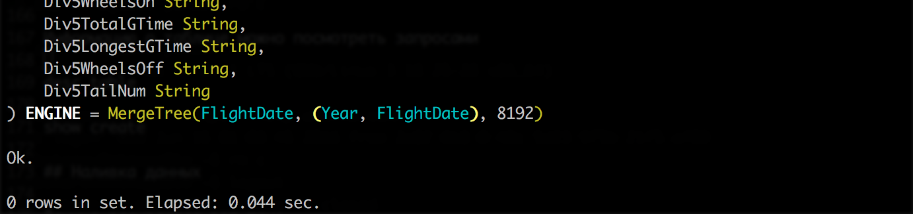
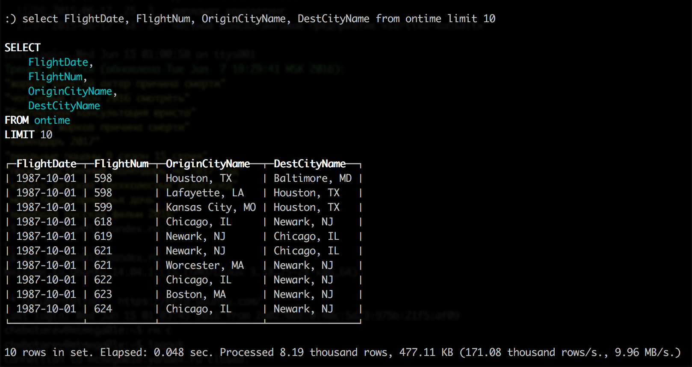
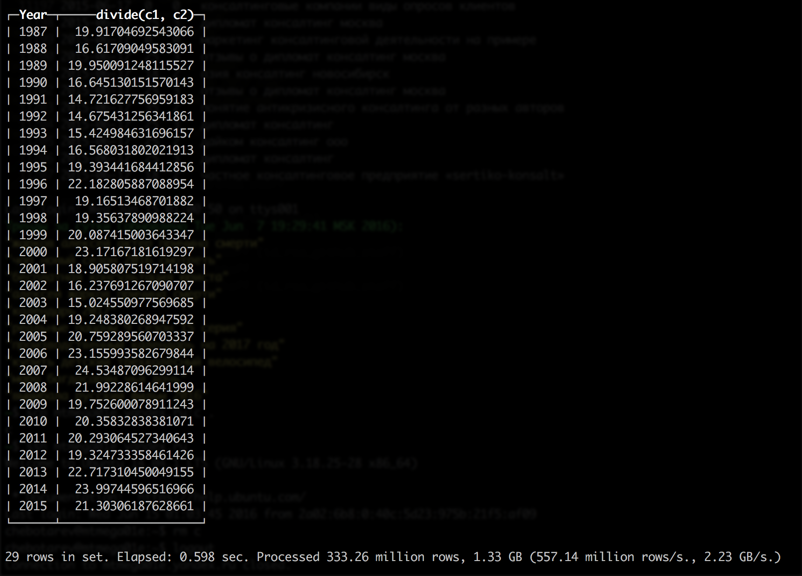
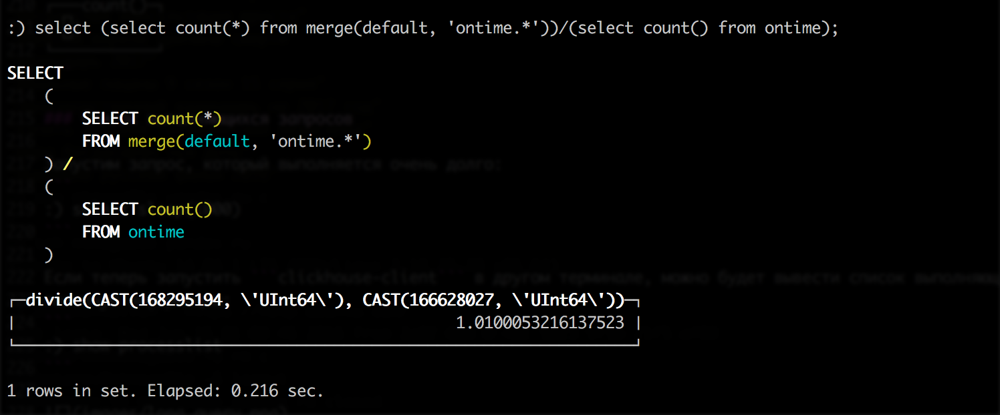
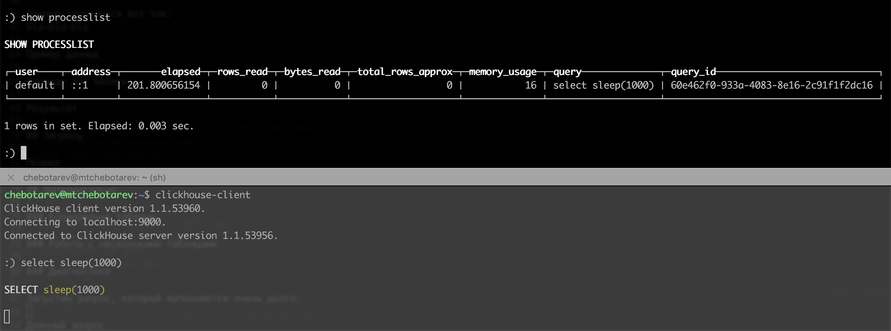

## Введение

Для начала, возьмём какую-нибудь машину, например, создадим виртуальный инстанс в Openstack со следующими характеристиками:
```
RAM             61GB
VCPUs           16 VCPU
Disk            40GB
Ephemeral Disk  100GB
```

ОС:
```
$ lsb_release -a
No LSB modules are available.
Distributor ID:	Ubuntu
Description:	Ubuntu 16.04 LTS
Release:	16.04
Codename:	xenial
```

Будем работать с открытыми данными базы данных On Time, предоставленной Министерством транспорта США (United States Department of
Transportation). Информация о ней, структура таблицы, а также примеры запросов приведены здесь:
```
https://github.com/yandex/ClickHouse/blob/master/doc/example_datasets/1_ontime.txt
```

## Сборка

При сборке ClickHouse будем использовать инструкцию, расположенную по адресу: 
```
https://github.com/yandex/ClickHouse/blob/master/doc/build.md
```

Установим необходимые пакеты. После этого выполним следующую команду из директории с исходными кодами ClickHouse:
```
~/ClickHouse$ ./release --standalone
```

Сборка успешно завершена:


Установим пакеты и запустим ClickHouse:
```
sudo apt-get install ../clickhouse-server-base_1.1.53960_amd64.deb ../clickhouse-server-common_1.1.53960_amd64.deb
sudo apt-get install ../clickhouse-client_1.1.53960_amd64.deb
sudo service clickhouse-server start
```

## Создание таблицы

Перед тем, как загружать данные базы данных On Time в ClickHouse, запустим консольный клиент ClickHouse, для того, чтобы создать таблицу с
необходимыми полями:
```
$ clickhouse-client
```

Таблица создаётся следующим запросом:
```
:) create table `ontime` (
  `Year` UInt16,
  `Quarter` UInt8,
  `Month` UInt8,
  `DayofMonth` UInt8,
  `DayOfWeek` UInt8,
  `FlightDate` Date,
  `UniqueCarrier` FixedString(7),
  `AirlineID` Int32,
  `Carrier` FixedString(2),
  `TailNum` String,
  `FlightNum` String,
  `OriginAirportID` Int32,
  `OriginAirportSeqID` Int32,
  `OriginCityMarketID` Int32,
  `Origin` FixedString(5),
  `OriginCityName` String,
  `OriginState` FixedString(2),
  `OriginStateFips` String,
  `OriginStateName` String,
  `OriginWac` Int32,
  `DestAirportID` Int32,
  `DestAirportSeqID` Int32,
  `DestCityMarketID` Int32,
  `Dest` FixedString(5),
  `DestCityName` String,
  `DestState` FixedString(2),
  `DestStateFips` String,
  `DestStateName` String,
  `DestWac` Int32,
  `CRSDepTime` Int32,
  `DepTime` Int32,
  `DepDelay` Int32,
  `DepDelayMinutes` Int32,
  `DepDel15` Int32,
  `DepartureDelayGroups` String,
  `DepTimeBlk` String,
  `TaxiOut` Int32,
  `WheelsOff` Int32,
  `WheelsOn` Int32,
  `TaxiIn` Int32,
  `CRSArrTime` Int32,
  `ArrTime` Int32,
  `ArrDelay` Int32,
  `ArrDelayMinutes` Int32,
  `ArrDel15` Int32,
  `ArrivalDelayGroups` Int32,
  `ArrTimeBlk` String,
  `Cancelled` UInt8,
  `CancellationCode` FixedString(1),
  `Diverted` UInt8,
  `CRSElapsedTime` Int32,
  `ActualElapsedTime` Int32,
  `AirTime` Int32,
  `Flights` Int32,
  `Distance` Int32,
  `DistanceGroup` UInt8,
  `CarrierDelay` Int32,
  `WeatherDelay` Int32,
  `NASDelay` Int32,
  `SecurityDelay` Int32,
  `LateAircraftDelay` Int32,
  `FirstDepTime` String,
  `TotalAddGTime` String,
  `LongestAddGTime` String,
  `DivAirportLandings` String,
  `DivReachedDest` String,
  `DivActualElapsedTime` String,
  `DivArrDelay` String,
  `DivDistance` String,
  `Div1Airport` String,
  `Div1AirportID` Int32,
  `Div1AirportSeqID` Int32,
  `Div1WheelsOn` String,
  `Div1TotalGTime` String,
  `Div1LongestGTime` String,
  `Div1WheelsOff` String,
  `Div1TailNum` String,
  `Div2Airport` String,
  `Div2AirportID` Int32,
  `Div2AirportSeqID` Int32,
  `Div2WheelsOn` String,
  `Div2TotalGTime` String,
  `Div2LongestGTime` String,
  `Div2WheelsOff` String,
  `Div2TailNum` String,
  `Div3Airport` String,
  `Div3AirportID` Int32,
  `Div3AirportSeqID` Int32,
  `Div3WheelsOn` String,
  `Div3TotalGTime` String,
  `Div3LongestGTime` String,
  `Div3WheelsOff` String,
  `Div3TailNum` String,
  `Div4Airport` String,
  `Div4AirportID` Int32,
  `Div4AirportSeqID` Int32,
  `Div4WheelsOn` String,
  `Div4TotalGTime` String,
  `Div4LongestGTime` String,
  `Div4WheelsOff` String,
  `Div4TailNum` String,
  `Div5Airport` String,
  `Div5AirportID` Int32,
  `Div5AirportSeqID` Int32,
  `Div5WheelsOn` String,
  `Div5TotalGTime` String,
  `Div5LongestGTime` String,
  `Div5WheelsOff` String,
  `Div5TailNum` String
) ENGINE = MergeTree(FlightDate, (Year, FlightDate), 8192)
``` 


Информацию о таблице можно посмотреть следующими запросами:
```
:) desc ontime
```

```
:) show create ontime
```

## Наливка данных

Загрузим данные:
```
for s in `seq 1987 2015`; do
	for m in `seq 1 12`; do
		wget http://tsdata.bts.gov/PREZIP/On_Time_On_Time_Performance_${s}_${m}.zip
	done
done
```

Теперь необходимо загрузить данные в ClickHouse:
```
for i in *.zip; do
	echo $i
	unzip -cq $i '*.csv' | sed 's/\.00//g' | clickhouse-client --query="insert into ontime format CSVWithNames"
done
```

## Работа с данными

Проверим, что в таблице что-то есть:
```
:) select FlightDate, FlightNum, OriginCityName, DestCityName from ontime limit 10; 
```



Теперь придумаем более сложный запрос. Например, выведем процент задержанных больше чем на 10 минут полётов за каждый год:
```
select Year, c1/c2
from
(
	select
		Year,
		count(*)*100 as c1
	from ontime
	where DepDelay > 10
	group by Year
)
any inner join
(
	select
		Year,
		count(*) as c2
	from ontime
	group by Year
) using (Year)
order by Year;
```



## Дополнительно

### Копирование таблицы

Предположим, нам нужно скопировать 1% записей из таблицы (самых удачливых) ```ontime``` в новую таблицу ```ontime_ltd```. Для этого выполним запросы:
```
:) create table ontime_ltd as ontime;
:) insert into ontime_ltd select * from ontime where rand() % 100 = 42;
```

### Работа с несколькими таблицами

Если необходимо выполнять запросы над многими таблицами сразу, воспользуемся функцией ```merge(database, regexp)```:
```
:) select (select count(*) from merge(default, 'ontime.*'))/(select count() from ontime);
```



### Список выполняющихся запросов

В целях диагностики часто бывает нужно узнать, что именно в данный момент делает ClickHouse. Запустим запрос, который выполняется очень долго:
```
:) select sleep(1000);
```

Если теперь запустить ```clickhouse-client``` в другом терминале, можно будет вывести список запросов, а также некоторую
полезную информацию о них:
```
:) show processlist;
```


