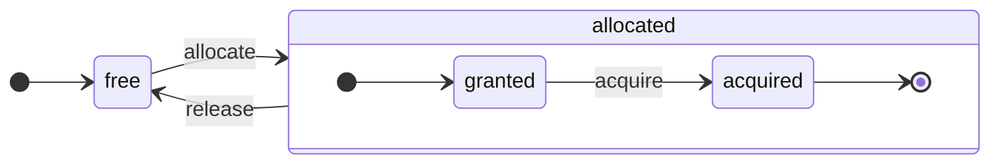

ClickHouse هو DBMS موجَّه بالأعمدة بحق. تُخزَّن البيانات حسب الأعمدة، وأثناء التنفيذ تُعالَج على شكل مصفوفات (متجهات أو دفعات من الأعمدة).
وكلما أمكن، تُنفَّذ العمليات على المصفوفات بدلًا من القيم المفردة.
ويُسمّى هذا &quot;التنفيذ المتجهي للاستعلامات&quot;، وهو يساعد على خفض تكلفة معالجة البيانات الفعلية.

هذه الفكرة ليست جديدة.
فهي تعود إلى `APL` (لغة برمجة، 1957) وما تفرّع عنها: `A +` (لهجة APL)، و`J` (1990)، و`K` (1993)، و`Q` (لغة برمجة من Kx Systems، 2003).
تُستخدم برمجة المصفوفات في معالجة البيانات العلمية. كما أن هذه الفكرة ليست جديدة أيضًا في قواعد البيانات العلائقية. فعلى سبيل المثال، تُستخدم في نظام `VectorWise` (المعروف أيضًا باسم Actian Vector Analytic Database من Actian Corporation).

يوجد نهجان مختلفان لتسريع معالجة الاستعلامات: التنفيذ المتجهي للاستعلامات وتوليد الشيفرة وقت التشغيل. أما النهج الثاني فيزيل جميع مستويات التوجيه غير المباشر والإرسال الديناميكي. وليس أيٌّ من هذين النهجين أفضل من الآخر على نحو مطلق. فقد يكون توليد الشيفرة وقت التشغيل أفضل عندما يدمج عددًا كبيرًا من العمليات، مما يتيح الاستفادة الكاملة من وحدات تنفيذ CPU وخط الأنابيب. وقد يكون التنفيذ المتجهي للاستعلامات أقل عملية لأنه يتضمن متجهات مؤقتة يجب كتابتها إلى ذاكرة التخزين المؤقت ثم قراءتها مرة أخرى. وإذا لم تتسع ذاكرة التخزين المؤقت L2 للبيانات المؤقتة، فقد يصبح ذلك مشكلة. لكن التنفيذ المتجهي للاستعلامات يتيح الاستفادة بسهولة أكبر من قدرات SIMD في CPU. وتُظهر [ورقة بحثية](http://15721.courses.cs.cmu.edu/spring2016/papers/p5-sompolski.pdf) كتبها أصدقاؤنا أن الجمع بين النهجين أفضل. يستخدم ClickHouse التنفيذ المتجهي للاستعلامات، ويقدّم دعمًا أوليًا محدودًا لتوليد الشيفرة وقت التشغيل.

  ## الأعمدة

تُستخدم واجهة `IColumn` لتمثيل الأعمدة في الذاكرة (أو بالأدق، كتل من الأعمدة). وتوفّر هذه الواجهة طرقًا مساعدة لتنفيذ مختلف العوامل العلائقية. ومعظم العمليات غير قابلة للتغيير: فهي لا تعدّل العمود الأصلي، بل تُنشئ عمودًا جديدًا بعد تعديله. على سبيل المثال، تقبل الطريقة `IColumn :: filter` قناع بايت للتصفية. وتُستخدم مع العاملين العلائقيين `WHERE` و`HAVING`. ومن الأمثلة الأخرى: الطريقة `IColumn :: permute` لدعم `ORDER BY`، والطريقة `IColumn :: cut` لدعم `LIMIT`.

تتولى تطبيقات `IColumn` المختلفة (`ColumnUInt8` و`ColumnString` وما إلى ذلك) مسؤولية تخطيط الأعمدة في الذاكرة. ويكون هذا التخطيط عادةً على شكل مصفوفة متجاورة. وبالنسبة إلى الأعمدة من نوع الأعداد الصحيحة، تكون مجرد مصفوفة متجاورة واحدة، مثل `std :: vector`. أما أعمدة `String` و`Array`، فتتكون من متجهين: أحدهما يضم جميع عناصر المصفوفة مرتبةً بشكل متجاور، والآخر يضم الإزاحات إلى بداية كل مصفوفة. وهناك أيضًا `ColumnConst` الذي لا يخزّن في الذاكرة سوى قيمة واحدة، لكنه يبدو كأنه عمود.

  ## الحقل

ومع ذلك، يمكن أيضًا العمل مع القيم الفردية. ولتمثيل قيمة مفردة، يُستخدم `Field`. و`Field` ليس سوى union مميَّز لـ `UInt64` و`Int64` و`Float64` و`String` و`Array`. يوفّر `IColumn` الطريقة `operator []` للحصول على القيمة رقم n على هيئة `Field`، والطريقة `insert` لإلحاق `Field` بنهاية عمود. هذه الطرق ليست فعّالة جدًا، لأنها تتطلب التعامل مع كائنات `Field` مؤقتة تمثّل قيمة مفردة. وهناك طرق أكثر كفاءة، مثل `insertFrom` و`insertRangeFrom` وما إلى ذلك.

لا يحتوي `Field` على معلومات كافية عن نوع بيانات معيّن في جدول. فعلى سبيل المثال، تُمثَّل الأنواع `UInt8` و`UInt16` و`UInt32` و`UInt64` جميعها على أنها `UInt64` داخل `Field`.

  ## التجريدات المُسرِّبة

يوفّر `IColumn` طرقًا للتحويلات العلائقية الشائعة للبيانات، لكنها لا تلبّي جميع الاحتياجات. على سبيل المثال، لا يوفّر `ColumnUInt64` طريقة لحساب مجموع عمودين، ولا يوفّر `ColumnString` طريقة لإجراء بحث عن سلسلة فرعية. لذا تُنفَّذ هذه العمليات الكثيرة خارج `IColumn`.

يمكن تنفيذ وظائف مختلفة على الأعمدة بطريقة عامة لكنها غير فعّالة، باستخدام طرق `IColumn` لاستخراج قيم `Field`، أو بطريقة متخصصة تستفيد من معرفة التخطيط الداخلي لذاكرة البيانات في تنفيذ معيّن لـ `IColumn`. ويتم ذلك بتحويل الدوال إلى نوع `IColumn` محدد والتعامل مباشرةً مع التمثيل الداخلي. فعلى سبيل المثال، يوفّر `ColumnUInt64` الطريقة `getData` التي تُرجع مرجعًا إلى مصفوفته الداخلية، ثم تقرأ عملية منفصلة هذه المصفوفة مباشرةً أو تملؤها. ولدينا &quot;تجريدات مُسرِّبة&quot; لإتاحة تخصيصات فعّالة لعمليات متنوعة.

  ## أنواع البيانات

يتولى `IDataType` مسؤولية التسلسل وإلغاء التسلسل: قراءة وكتابة دفعات من الأعمدة أو القيم المفردة بصيغة ثنائية أو نصية. ويتوافق `IDataType` مباشرةً مع أنواع البيانات في الجداول. على سبيل المثال، هناك `DataTypeUInt32` و`DataTypeDateTime` و`DataTypeString` وما إلى ذلك.

ترتبط `IDataType` و`IColumn` ببعضهما ارتباطًا مرنًا فقط. إذ يمكن تمثيل أنواع بيانات مختلفة في الذاكرة من خلال تطبيقات `IColumn` نفسها. على سبيل المثال، يُمثَّل كل من `DataTypeUInt32` و`DataTypeDateTime` بواسطة `ColumnUInt32` أو `ColumnConstUInt32`. بالإضافة إلى ذلك، يمكن تمثيل نوع البيانات نفسه بواسطة تطبيقات مختلفة من `IColumn`. على سبيل المثال، يمكن تمثيل `DataTypeUInt8` بواسطة `ColumnUInt8` أو `ColumnConstUInt8`.

لا يخزّن `IDataType` سوى البيانات الوصفية. فعلى سبيل المثال، لا يخزّن `DataTypeUInt8` أي شيء على الإطلاق (باستثناء المؤشر الافتراضي `vptr`)، بينما لا يخزّن `DataTypeFixedString` سوى `N` (حجم السلاسل ذات الطول الثابت).

يحتوي `IDataType` على طرق مساعدة لتنسيقات بيانات متنوعة. ومن الأمثلة على ذلك طرق تسلسل قيمة مع احتمال إحاطتها بعلامات اقتباس، أو تسلسل قيمة بتنسيق JSON، أو تسلسل قيمة كجزء من تنسيق XML. ولا توجد مطابقة مباشرة مع تنسيقات البيانات. فعلى سبيل المثال، يمكن لتنسيقي البيانات المختلفين `Pretty` و`TabSeparated` استخدام طريقة المساعدة نفسها `serializeTextEscaped` من الواجهة `IDataType`.

  ## الكتلة

`Block` هي حاوية تمثل مجموعة فرعية (جزءًا) من جدول في الذاكرة. وهي ببساطة مجموعة من الثلاثيات: `(IColumn, IDataType, column name)`. أثناء تنفيذ الاستعلام، تُعالَج البيانات بواسطة كائنات `Block`. فإذا كان لدينا `Block`، فهذا يعني أن لدينا البيانات (في الكائن `IColumn`)، ولدينا معلومات عن نوعها (في `IDataType`) تُخبرنا بكيفية التعامل مع ذلك العمود، ولدينا أيضًا اسم العمود. وقد يكون هذا الاسم هو اسم العمود الأصلي من الجدول، أو اسمًا اصطناعيًا أُسنِد للحصول على نتائج مؤقتة للحسابات.

عندما نحسب دالةً ما على الأعمدة في كتلة، نضيف عمودًا آخر بنتيجتها إلى الكتلة، ولا نلمس الأعمدة الخاصة بوسائط الدالة لأن العمليات غير قابلة للتغيير. لاحقًا، يمكن إزالة الأعمدة غير اللازمة من الكتلة، لكن لا يمكن تعديلها. وهذا مفيد للتخلّص من التعبيرات الفرعية المشتركة.

تُنشأ الكتل لكل جزء بيانات مُعالَج. لاحظ أنه بالنسبة إلى النوع نفسه من الحسابات، تبقى أسماء الأعمدة وأنواعها كما هي عبر الكتل المختلفة، ولا تتغير إلا بيانات الأعمدة. ومن الأفضل فصل بيانات الكتلة عن رأس الكتلة، لأن أحجام الكتل الصغيرة تفرض عبئًا إضافيًا مرتفعًا من السلاسل النصية المؤقتة عند نسخ `shared_ptrs` وأسماء الأعمدة.

  ## المعالجات

اطّلع على الوصف في [https://github.com/ClickHouse/ClickHouse/blob/master/src/Processors/IProcessor.h](https://github.com/ClickHouse/ClickHouse/blob/master/src/Processors/IProcessor.h).

  ## التنسيقات

يجري تنفيذ تنسيقات البيانات عبر المعالجات.

  ## الإدخال/الإخراج

بالنسبة إلى الإدخال/الإخراج المعتمد على البايتات، توجد الصنفان المجرّدان `ReadBuffer` و`WriteBuffer`. ويُستخدمان بدلًا من `iostream` في C++. لا تقلق: فكل مشروع C++ ناضج يستخدم شيئًا آخر غير `iostream` لأسباب وجيهة.

`ReadBuffer` و`WriteBuffer` ليسا سوى مخزن مؤقت متصل ومؤشر يشير إلى موضع داخل ذلك المخزن. وقد تمتلك التطبيقات الذاكرة الخاصة بالمخزن أو لا تمتلكها. وهناك طريقة افتراضية لملء المخزن بالبيانات التالية (في `ReadBuffer`) أو لتفريغ المخزن إلى جهة ما (في `WriteBuffer`). ونادرًا ما تُستدعى الطرق الافتراضية.

تُستخدم تطبيقات `ReadBuffer`/`WriteBuffer` للعمل مع الملفات وواصفات الملفات ومقابس الشبكة، ولتنفيذ الضغط (يُهيَّأ `CompressedWriteBuffer` باستخدام `WriteBuffer` آخر ويُجري الضغط قبل كتابة البيانات إليه)، ولأغراض أخرى أيضًا — فأسماء `ConcatReadBuffer` و`LimitReadBuffer` و`HashingWriteBuffer` توضّح ذلك بنفسها.

لا تتعامل `Read/WriteBuffers` إلا مع البايتات. وتوجد دوال في ملفي الترويسة `ReadHelpers` و`WriteHelpers` للمساعدة في تنسيق الإدخال/الإخراج. على سبيل المثال، توجد أدوات مساعدة لكتابة رقم بصيغة عشرية.

لنستعرض ما يحدث عندما تريد كتابة مجموعة نتائج بتنسيق `JSON` إلى `stdout`.
لديك مجموعة نتائج جاهزة للجلب من `QueryPipeline` يعمل في وضع السحب.
أولًا، تنشئ `WriteBufferFromFileDescriptor(STDOUT_FILENO)` لكتابة البايتات إلى `stdout`.
بعد ذلك، توصل النتيجة من `QueryPipeline` إلى `JSONRowOutputFormat`، الذي يُهيَّأ باستخدام `WriteBuffer` هذا، لكتابة الصفوف بتنسيق `JSON` إلى `stdout`.
يمكن تنفيذ ذلك عبر الطريقة `complete`، التي تحوّل `QueryPipeline` يعمل في وضع السحب إلى `QueryPipeline` مكتملًا.
داخليًا، سيكتب `JSONRowOutputFormat` فواصل `JSON` مختلفة ويستدعي الطريقة `IDataType::serializeTextJSON` مع مرجع إلى `IColumn` ورقم الصف بوصفهما وسيطين. ونتيجةً لذلك، ستستدعي `IDataType::serializeTextJSON` طريقة من `WriteHelpers.h`: مثلًا `writeText` للأنواع الرقمية و`writeJSONString` لـ `DataTypeString`.

  ## الجداول

تمثل الواجهة `IStorage` الجداول. وتمثل التطبيقات المختلفة لهذه الواجهة محركات جداول مختلفة. ومن أمثلتها `StorageMergeTree` و`StorageMemory` وما إلى ذلك. ومثيلات هذه الأصناف ليست سوى جداول.

الطرائق الأساسية في `IStorage` هي `read` و`write`، إلى جانب طرائق أخرى مثل `alter` و`rename` و`drop`. تقبل الطريقة `read` الوسائط التالية: مجموعة من الأعمدة لقراءتها من جدول، واستعلام `AST` المطلوب أخذه في الاعتبار، والعدد المطلوب من التدفقات. وهي تُرجع `Pipe`.

في معظم الحالات، تكون الطريقة `read` مسؤولة فقط عن قراءة الأعمدة المحددة من الجدول، لا عن أي معالجة إضافية للبيانات.
وتتولى جزءٌ آخر من مسار تنفيذ الاستعلام جميع عمليات معالجة البيانات اللاحقة، وهذا خارج نطاق مسؤولية `IStorage`.

لكن هناك استثناءات ملحوظة:

* يُمرَّر استعلام `AST` إلى الطريقة `read`، ويمكن لمحرك الجدول استخدامه لاستنتاج كيفية استخدام الفهرس ولقراءة قدر أقل من البيانات من الجدول.
* أحيانًا يمكن لمحرك الجدول معالجة البيانات بنفسه حتى مرحلة معينة. على سبيل المثال، يمكن لـ `StorageDistributed` إرسال استعلام إلى خوادم بعيدة، وطلب أن تعالج البيانات حتى مرحلة يصبح فيها دمج البيانات القادمة من خوادم بعيدة مختلفة ممكنًا، ثم يُرجع تلك البيانات بعد معالجتها مسبقًا. بعد ذلك، يُكمل مفسر الاستعلام معالجة البيانات.

يمكن للطريقة `read` الخاصة بالجدول أن تُرجع `Pipe` يتكوّن من عدة `Processors`. ويمكن لهذه `Processors` أن تقرأ من جدول بالتوازي.
بعد ذلك، يمكنك توصيل هذه المعالجات بتحويلات أخرى متنوعة (مثل تقييم التعبيرات أو التصفية)، والتي يمكن حسابها بشكل مستقل.
ثم إنشاء `QueryPipeline` فوقها، وتنفيذه عبر `PipelineExecutor`.

توجد أيضًا `TableFunction`s. وهي دوال تُرجع كائن `IStorage` مؤقتًا لاستخدامه في عبارة `FROM` ضمن استعلام.

للحصول على فكرة سريعة عن كيفية تنفيذ محرك الجدول الخاص بك، ألقِ نظرة على شيء بسيط مثل `StorageMemory` أو `StorageTinyLog`.

> كنتيجة للطريقة `read`، تُرجع `IStorage` القيمة `QueryProcessingStage` — وهي معلومات عن الأجزاء من الاستعلام التي حُسِبت بالفعل داخل التخزين.

  ## المحللات

يحلّل الاستعلامَ محللٌ نزولي عودي مكتوب يدويًا. على سبيل المثال، لا يفعل `ParserSelectQuery` سوى استدعاء المحللات الأساسية عوديًا لمعالجة الأجزاء المختلفة من الاستعلام. وتنشئ المحللات شجرةَ البنية المجردة `AST`. ويُمثَّل `AST` بعُقد هي مثيلات من `IAST`.

> لا تُستخدم مولدات المحللات لأسباب تاريخية.

  ## المفسّرات

تتولى المفسّرات إنشاء مسار تنفيذ الاستعلام انطلاقًا من AST. وهناك مفسّرات بسيطة، مثل `InterpreterExistsQuery` و`InterpreterDropQuery`، إلى جانب `InterpreterSelectQuery` الأكثر تطورًا.

يمثل مسار تنفيذ الاستعلام مجموعة من المعالجات القادرة على استهلاك المقاطع وإنتاجها (أي مجموعات من الأعمدة ذات أنواع محددة).
ويتواصل المعالج عبر المنافذ، ويمكن أن تكون له عدة منافذ إدخال وعدة منافذ إخراج.
ويمكن العثور على وصف أكثر تفصيلًا في [src/Processors/IProcessor.h](https://github.com/ClickHouse/ClickHouse/blob/master/src/Processors/IProcessor.h).

فعلى سبيل المثال، تكون نتيجة تفسير استعلام `SELECT` هي `QueryPipeline` في وضع &quot;pulling&quot;، وله منفذ إخراج خاص لقراءة مجموعة النتائج منه.
أما نتيجة استعلام `INSERT` فهي `QueryPipeline` في وضع &quot;pushing&quot;، مع منفذ إدخال لكتابة البيانات بغرض الإدراج.
أما نتيجة تفسير استعلام `INSERT SELECT` فهي `QueryPipeline` &quot;مكتمل&quot; لا يحتوي على أي مدخلات أو مخرجات، لكنه ينسخ البيانات من `SELECT` إلى `INSERT` في الوقت نفسه.

يستخدم `InterpreterSelectQuery` آليات `ExpressionAnalyzer` و`ExpressionActions` لتحليل الاستعلام وإجراء التحويلات. وهنا تُنفَّذ معظم تحسينات الاستعلام المعتمدة على القواعد. ويُعد `ExpressionAnalyzer` فوضويًا إلى حدٍّ كبير، ويجب إعادة كتابته: إذ ينبغي استخراج مختلف تحويلات الاستعلام وتحسيناته إلى أصناف منفصلة لإتاحة إجراء تحويلات معيارية على الاستعلام.

ولمعالجة المشكلات الموجودة في المفسّرات، طُوِّر `InterpreterSelectQueryAnalyzer` جديد. وهو إصدار جديد من `InterpreterSelectQuery` لا يستخدم `ExpressionAnalyzer`، ويقدّم طبقة تجريد إضافية بين `AST` و`QueryPipeline` تُسمى `QueryTree`. وهو جاهز تمامًا للاستخدام في بيئات الإنتاج، ولكن كإجراء احترازي يمكن تعطيله من خلال تعيين قيمة الإعداد `enable_analyzer` إلى `false`.

  ## الدوال

توجد دوال عادية ودوال تجميعية. وبالنسبة إلى الدوال التجميعية، راجع القسم التالي.

الدوال العادية لا تغيّر عدد الصفوف — فهي تعمل كما لو أنها تعالج كل صف على نحو مستقل. في الواقع، لا تُستدعى الدوال لكل صف على حدة، بل تُستدعى على كتل `Block` من البيانات لتنفيذ التنفيذ المتجهي للاستعلامات.

توجد بعض الدوال المتنوعة، مثل [blockSize](/ar/sql-reference/functions/other-functions#blockSize) و[rowNumberInBlock](/ar/sql-reference/functions/other-functions#rowNumberInBlock) و[runningAccumulate](/ar/sql-reference/functions/other-functions#runningAccumulate)، التي تستفيد من معالجة الكتل وتخلّ باستقلالية الصفوف.

يعتمد ClickHouse نظام أنواع صارمًا، لذا لا يوجد تحويل ضمني للأنواع. وإذا كانت الدالة لا تدعم تركيبة معيّنة من الأنواع، فإنها تُطلق استثناءً. لكن يمكن للدوال أن تعمل (عبر التحميل الزائد) مع العديد من التركيبات المختلفة للأنواع. على سبيل المثال، تعمل الدالة `plus` (لتنفيذ المعامل `+`) مع أي تركيبة من الأنواع الرقمية: `UInt8` + `Float32` و`UInt16` + `Int8`، وما إلى ذلك. كذلك، يمكن لبعض الدوال متغيرة الوسائط قبول أي عدد من الوسائط، مثل الدالة `concat`.

قد يكون تنفيذ دالة ما مزعجًا بعض الشيء، لأن الدالة تُفرّع صراحةً بحسب الأنواع المدعومة و`IColumns` المدعومة. على سبيل المثال، تحتوي الدالة `plus` على شيفرة مُولَّدة من إنشاء قالب C++ لكل تركيبة من الأنواع الرقمية، ولكل من الوسيطين الأيسر والأيمن، سواء أكانا ثابتين أم غير ثابتين.

وهذا موضع ممتاز لتنفيذ توليد الشيفرة وقت التشغيل لتجنّب تضخّم شيفرة القوالب. كما يتيح ذلك إضافة دوال مدمجة مثل fused multiply-add، أو إجراء عدة مقارنات في تكرار واحد من الحلقة.

وبسبب التنفيذ المتجهي للاستعلامات، لا تُطبَّق على الدوال آلية الاختصار المنطقي. فعلى سبيل المثال، إذا كتبت `WHERE f(x) AND g(y)`، فسيُحسب الطرفان معًا، حتى في الصفوف التي تكون فيها `f(x)` مساوية للصفر (إلا عندما تكون `f(x)` تعبيرًا ثابتًا صفريًا). ولكن إذا كانت انتقائية الشرط `f(x)` مرتفعة، وكان حساب `f(x)` أقل كلفة بكثير من `g(y)`، فمن الأفضل تنفيذ الحساب على عدة تمريرات. إذ سيُحسب `f(x)` أولًا، ثم تُرشَّح الأعمدة بحسب النتيجة، وبعد ذلك يُحسب `g(y)` فقط للأجزاء الأصغر والمُرشَّحة من البيانات.

  ## الدوال التجميعية

الدوال التجميعية هي دوال ذات حالة. فهي تُراكِم القيم المُمرَّرة ضمن حالة معيّنة، وتتيح لك استخراج النتائج من تلك الحالة. وتُدار عبر الواجهة `IAggregateFunction`. وقد تكون الحالات بسيطة نسبيًا (فحالة `AggregateFunctionCount` ليست سوى قيمة `UInt64` واحدة)، أو معقدة للغاية (فحالة `AggregateFunctionUniqCombined` عبارة عن مزيج من مصفوفة خطية، وجدول تجزئة، وبنية بيانات احتمالية `HyperLogLog`).

تُخصَّص الحالات في `Arena` (تجمّع ذاكرة) للتعامل مع حالات متعددة أثناء تنفيذ استعلام `GROUP BY` عالي الكاردينالية. وقد يكون لهذه الحالات constructor وdestructor غير بسيطين؛ فعلى سبيل المثال، قد تقوم حالات التجميع المعقدة بتخصيص ذاكرة إضافية بنفسها. وهذا يتطلب عناية عند إنشاء الحالات وتدميرها، وكذلك عند نقل ملكيتها وترتيب تدميرها على نحو صحيح.

يمكن تسلسل حالات التجميع وإلغاء تسلسلها لتمريرها عبر الشبكة أثناء تنفيذ الاستعلامات الموزعة، أو لكتابتها على القرص عندما لا تكون RAM كافية. ويمكن حتى تخزينها في جدول باستخدام `DataTypeAggregateFunction` لإتاحة التجميع التزايدي للبيانات.

> تنسيق البيانات المتسلسلة لحالات الدوال التجميعية غير مُرقّم بالإصدارات حاليًا. ولا بأس بذلك إذا كانت حالات التجميع تُخزَّن مؤقتًا فقط. لكن لدينا محرك الجدول `AggregatingMergeTree` للتجميع التزايدي، والناس يستخدمونه بالفعل في بيئة الإنتاج. ولهذا السبب، يُشترط الحفاظ على التوافق مع الإصدارات السابقة عند تغيير التنسيق المتسلسل لأي دالة تجميعية في المستقبل.

  ## الخادم

يوفّر الخادم عدة واجهات مختلفة:

* واجهة HTTP لأي عملاء خارجيين.
* واجهة TCP لعميل ClickHouse الأصلي وللتواصل بين الخوادم أثناء تنفيذ الاستعلامات الموزعة.
* واجهة لنقل البيانات لأغراض النسخ المتماثل.

داخليًا، هو مجرد خادم بدائي متعدد الخيوط من دون coroutines أو fibers. ونظرًا إلى أن الخادم لم يُصمَّم لمعالجة معدل مرتفع من الاستعلامات البسيطة، بل لمعالجة معدل منخفض نسبيًا من الاستعلامات المعقدة، يمكن لكل استعلام منها معالجة كم هائل من البيانات لأغراض التحليلات.

يهيّئ الخادم الفئة `Context` بالبيئة اللازمة لتنفيذ الاستعلامات: قائمة قواعد البيانات المتاحة، والمستخدمين وحقوق الوصول، والإعدادات، والعناقيد، وقائمة العمليات، وسجل الاستعلامات، وما إلى ذلك. وتستخدم Interpreters هذه البيئة.

نحافظ على توافق كامل مع الإصدارات السابقة واللاحقة لبروتوكول TCP الخاص بالخادم: إذ يمكن للعملاء القدامى التواصل مع الخوادم الجديدة، ويمكن للعملاء الجدد التواصل مع الخوادم القديمة. لكننا لا نرغب في الاستمرار في دعم ذلك إلى الأبد، لذا نزيل دعم الإصدارات القديمة بعد نحو عام.

:::note
بالنسبة إلى معظم التطبيقات الخارجية، نوصي باستخدام واجهة HTTP لأنها بسيطة وسهلة الاستخدام. ويرتبط بروتوكول TCP ارتباطًا أوثق بهياكل البيانات الداخلية: إذ يستخدم تنسيقًا داخليًا لتمرير كتل البيانات، كما يستخدم آلية تأطير مخصصة للبيانات المضغوطة.
:::

  ## التهيئة

يعتمد خادم ClickHouse على مكتبات POCO بلغة C++، ويستخدم `Poco::Util::AbstractConfiguration` لتمثيل تهيئته. وتحتفظ الفئة `Poco::Util::ServerApplication` بالتهيئة، وهي الفئة التي ترثها `DaemonBase`، والتي ترثها بدورها الفئة `DB::Server` التي تنفّذ `clickhouse-server` نفسه. لذلك يمكن الوصول إلى التهيئة باستخدام الدالة `ServerApplication::config()`.

تُقرأ التهيئة من عدة ملفات (بتنسيق XML أو YAML)، ثم تُدمج في `AbstractConfiguration` واحد بواسطة الفئة `ConfigProcessor`. وتُحمَّل التهيئة عند بدء تشغيل الخادم، ويمكن إعادة تحميلها لاحقًا إذا تم تحديث أحد ملفات التهيئة أو حذفه أو إضافته. كما تتولى الفئة `ConfigReloader` المراقبة الدورية لهذه التغييرات وإجراء إعادة التحميل. ويؤدي الاستعلام `SYSTEM RELOAD CONFIG` أيضًا إلى إعادة تحميل التهيئة.

بالنسبة إلى الاستعلامات والأنظمة الفرعية الأخرى غير `Server`، يمكن الوصول إلى التهيئة باستخدام الدالة `Context::getConfigRef()`. ويجب على كل نظام فرعي قادر على إعادة تحميل تهيئته دون إعادة تشغيل الخادم أن يسجّل نفسه في دالة رد النداء الخاصة بإعادة التحميل ضمن الدالة `Server::main()`. لاحظ أنه إذا كانت التهيئة الأحدث تحتوي على خطأ، فستتجاهل معظم الأنظمة الفرعية التهيئة الجديدة، وتسجّل رسائل تحذير، وتستمر في العمل باستخدام التهيئة التي سبق تحميلها. ونظرًا لطبيعة `AbstractConfiguration`، لا يمكن تمرير مرجع إلى قسم محدد، لذلك يُستخدم عادةً `String config_prefix` بدلًا من ذلك.

  ### السياق

يدير ClickHouse الإعدادات من خلال التسلسل الهرمي للسياقات:

* **السياق العام** - إعدادات على مستوى الخادم بأكمله تُحدَّد عبر ملفات التهيئة
* **سياق الجلسة** - إعدادات جلسة المستخدم المستمدة من ملفات التعريف وتهيئة المستخدم وأوامر SET
* **سياق الاستعلام** - إعدادات على مستوى الاستعلام من عبارة SETTINGS
* **سياق الخلفية** - إعدادات على مستوى الخادم بأكمله للعمليات التي تعمل في الخلفية (Mutate, Merge) وتُحدَّد عبر ملف التعريف &#39;background&#39;

عند جدولة عملية (الاستعلامات، وعمليات mutations، وما إلى ذلك)، ينشئ الخادم السياق المناسب من خلال دمج الإعدادات بالترتيب التالي (وتتجاوز الأقسام اللاحقة الأقسام السابقة):

1. القيم الافتراضية العامة
2. التهيئة العامة
3. إعدادات ملف التعريف (من القسم `<profiles>`)
4. إعدادات المستخدم (من القسم `<users>`)
5. إعدادات الجلسة (من أمر SET)
6. إعدادات الاستعلام (من عبارة SETTINGS)

:::note
يمكن تهيئة العمليات التي تعمل في الخلفية عبر الإعدادات العامة وإعدادات ملف التعريف &#39;background&#39;؛ ولا يكون لإعدادات الجلسة والاستعلام أي تأثير في هذه الحالة. وإذا لم يتم تقديم تهيئة صريحة، فسترث التهيئة من السياق العام. واسم ملف التعريف الافتراضي لهذه العمليات هو &#39;background&#39;، ويمكن تجاوزه عبر إعداد الخادم `background_profile`.
:::

  ## الخيوط والمهام

لتنفيذ الاستعلامات والقيام بالأنشطة الجانبية، يخصّص ClickHouse خيوطًا من أحد مجمّعات الخيوط لتجنّب إنشاء الخيوط وإتلافها بشكل متكرر. توجد عدة مجمّعات خيوط، ويُختار بينها بحسب الغرض وبنية المهمة:

* مجمّع server لجلسات العملاء الواردة.
* مجمّع الخيوط العام للمهام العامة والأنشطة الخلفية والخيوط المستقلة.
* مجمّع خيوط IO للمهام التي تكون غالبًا معلّقة على بعض عمليات IO وليست كثيفة الاستهلاك للـ CPU.
* مجمّعات background للمهام الدورية.
* مجمّعات للمهام القابلة للمقاطعة التي يمكن تقسيمها إلى خطوات.

مجمّع server هو مثيل من الصنف `Poco::ThreadPool` معرّف في الدالة `Server::main()`. ويمكن أن يحتوي على `max_connection` خيطًا كحد أقصى. ويُخصَّص كل خيط لاتصال نشط واحد فقط.

مجمّع الخيوط العام هو الصنف المفرد `GlobalThreadPool`. ولتخصيص خيط منه، يُستخدم `ThreadFromGlobalPool`. وله واجهة مشابهة لـ `std::thread`، لكنه يسحب الخيط من المجمّع العام ويجري كل التهيئة اللازمة. ويُضبط بالإعدادات التالية:

* `max_thread_pool_size` - الحد الأقصى لعدد الخيوط في المجمّع.
* `max_thread_pool_free_size` - الحد الأقصى لعدد الخيوط الخاملة التي تنتظر مهام جديدة.
* `thread_pool_queue_size` - الحد الأقصى لعدد المهام المجدولة.

المجمّع العام شامل، وجميع المجمّعات الموصوفة أدناه مبنية فوقه. ويمكن النظر إلى ذلك على أنه تسلسل هرمي للمجمّعات. فأي مجمّع متخصص يستمد خيوطه من المجمّع العام باستخدام الصنف `ThreadPool`. لذلك، فإن الغرض الأساسي من أي مجمّع متخصص هو فرض حد على عدد المهام المتزامنة وتنفيذ جدولة المهام. وإذا كان عدد المهام المجدولة أكبر من عدد الخيوط في المجمّع، فإن `ThreadPool` يراكم المهام في queue ذات أولويات. ولكل مهمة أولوية صحيحة. والأولوية الافتراضية هي الصفر. وتبدأ جميع المهام ذات قيم الأولوية الأعلى قبل أي مهمة ذات قيمة أولوية أقل. لكن لا يوجد فرق بين المهام الجاري تنفيذها بالفعل، لذلك لا تكون للأولوية أهمية إلا عندما يكون المجمّع مثقَلًا.

يُنفَّذ مجمّع خيوط IO على هيئة `ThreadPool` عادي يمكن الوصول إليه عبر الدالة `IOThreadPool::get()`. ويُضبط بالطريقة نفسها التي يُضبط بها المجمّع العام باستخدام الإعدادات `max_io_thread_pool_size` و`max_io_thread_pool_free_size` و`io_thread_pool_queue_size`. والغرض الأساسي من مجمّع خيوط IO هو تجنّب استنزاف المجمّع العام بمهام IO، مما قد يمنع الاستعلامات من الاستفادة الكاملة من CPU. تنفّذ عملية النسخ الاحتياطي إلى S3 قدرًا كبيرًا من عمليات IO، ولتجنّب التأثير في الاستعلامات التفاعلية، يوجد `BackupsIOThreadPool` منفصل يُضبط بالإعدادات `max_backups_io_thread_pool_size` و`max_backups_io_thread_pool_free_size` و`backups_io_thread_pool_queue_size`.

لتنفيذ المهام الدورية، توجد الفئة `BackgroundSchedulePool`. يمكنك تسجيل المهام باستخدام كائنات `BackgroundSchedulePool::TaskHolder`، ويضمن المجمّع ألا تشغّل أي مهمة وظيفتين في الوقت نفسه. كما يتيح لك تأجيل تنفيذ المهمة إلى لحظة محددة في المستقبل أو تعطيلها مؤقتًا. يوفّر `Context` العام عدة مثيلات من هذه الفئة لأغراض مختلفة. وبالنسبة إلى المهام العامة، يُستخدم `Context::getSchedulePool()`.

توجد أيضًا مجمّعات خيوط متخصصة للمهام القابلة للمقاطعة. ويمكن تقسيم مهمة `IExecutableTask` هذه إلى تسلسل مرتّب من المهام يُسمّى خطوات. ولجدولة هذه المهام بطريقة تسمح بإعطاء الأولوية للمهام القصيرة على الطويلة، يُستخدم `MergeTreeBackgroundExecutor`. وكما يوحي الاسم، فإنه يُستخدم لعمليات background المرتبطة بـ MergeTree، مثل الدمج وmutations وfetches وعمليات النقل. وتتوفر مثيلات المجمّع باستخدام `Context::getCommonExecutor()` وطرائق مشابهة أخرى.

بغضّ النظر عن المجمّع المستخدم للمهمة، يُنشأ مثيل `ThreadStatus` لهذه المهمة عند البدء. وهو يغلّف جميع المعلومات الخاصة بكل خيط: معرّف الخيط، ومعرّف الاستعلام، وعدادات الأداء، واستهلاك الموارد، وكثيرًا من البيانات المفيدة الأخرى. ويمكن للمهمة الوصول إليه عبر مؤشر محلي للخيط من خلال الاستدعاء `CurrentThread::get()`، لذلك لا نحتاج إلى تمريره إلى كل دالة.

إذا كان الخيط مرتبطًا بـ query execution، فإن أهم ما يُرفق بـ `ThreadStatus` هو سياق الاستعلام `ContextPtr`. ولكل استعلام خيطه الرئيسي في مجمّع server. ويجري الخيط الرئيسي هذا الإرفاق عبر الاحتفاظ بالكائن `ThreadStatus::QueryScope query_scope(query_context)`. كما ينشئ الخيط الرئيسي مجموعة خيوط يمثّلها الكائن `ThreadGroupStatus`. ويُرفق كل خيط إضافي يُخصَّص أثناء تنفيذ هذا الاستعلام بمجموعة الخيوط الخاصة به عبر الاستدعاء `CurrentThread::attachTo(thread_group)`. وتُستخدم مجموعات الخيوط لتجميع عدّادات أحداث الملف الشخصي وتتبع استهلاك الذاكرة من جميع الخيوط المخصّصة لمهمة واحدة (راجع الفئتَين `MemoryTracker` و`ProfileEvents::Counters` لمزيد من المعلومات).

  ## التحكم في التزامن

يستخدم الاستعلام القابل للتنفيذ بالتوازي الإعداد `max_threads` لوضع حدّ لعدد الخيوط التي يستخدمها. وتُختار القيمة الافتراضية لهذا الإعداد بحيث تتيح لاستعلام واحد الاستفادة من جميع أنوية CPU بأفضل صورة. لكن ماذا لو وُجدت عدة استعلامات متزامنة، وكان كل منها يستخدم القيمة الافتراضية للإعداد `max_threads`؟ عندها ستتشاطر الاستعلامات موارد CPU. وسيضمن نظام التشغيل العدالة من خلال التبديل المستمر بين الخيوط، ما يسبب عبئًا إضافيًا على الأداء. يساعد `ConcurrencyControl` في الحد من هذا العبء وتجنب تخصيص عدد كبير من الخيوط. ويُستخدم إعداد التهيئة `concurrent_threads_soft_limit_num` لتقييد عدد الخيوط المتزامنة التي يمكن تخصيصها قبل تطبيق نوع من ضغط CPU.

يُقدَّم مفهوم CPU `slot`. فالـ `slot` هي وحدة تزامن: ولكي يشغّل الاستعلام خيطًا، يجب أن يحصل مسبقًا على `slot` ثم يحررها عند توقف الخيط. وعدد الـ slots محدود على مستوى الخادم ككل. وتتنافس عدة استعلامات متزامنة على CPU slots إذا تجاوز إجمالي الطلب إجمالي عدد الـ slots. ويتولى `ConcurrencyControl` حسم هذا التنافس عبر جدولة CPU slots بطريقة عادلة.

يمكن النظر إلى كل `slot` على أنها آلة حالات مستقلة لها الحالات التالية:

* `free`: الـ `slot` متاحة ويمكن لأي استعلام تخصيصها.
* `granted`: الـ `slot` `allocated` لاستعلام محدد، لكن لم يستحوذ عليها أي خيط بعد.
* `acquired`: الـ `slot` `allocated` لاستعلام محدد وقد استحوذ عليها خيط.

لاحظ أن الـ `slot` التي تكون `allocated` قد تكون في حالتين مختلفتين: `granted` و`acquired`. الأولى حالة انتقالية، ومن المفترض عمليًا أن تكون قصيرة (من لحظة تخصيص `slot` لاستعلام إلى أن تُشغَّل آلية التوسّع التصاعدي بواسطة أي خيط لذلك الاستعلام).

تتألف واجهة برمجة تطبيقات `ConcurrencyControl` من الدوال التالية:

1. أنشئ تخصيص موارد لاستعلام: `auto slots = ConcurrencyControl::instance().allocate(1, max_threads);`. سيُخصَّص ما لا يقل عن slot واحدة وما لا يزيد عن `max_threads` slots. لاحظ أن الـ slot الأولى تُمنح فورًا، لكن قد تُمنح الـ slots المتبقية لاحقًا. لذا يكون هذا الحد مرنًا، لأن كل استعلام سيحصل على خيط تنفيذ واحد على الأقل.
2. لكل خيط تنفيذ، يجب الحصول على slot من التخصيص: `while (auto slot = slots->tryAcquire()) spawnThread([slot = std::move(slot)] { ... });`.
3. حدِّث العدد الإجمالي للـ slots: `ConcurrencyControl::setMaxConcurrency(concurrent_threads_soft_limit_num)`. يمكن تنفيذ ذلك في وقت التشغيل، من دون إعادة تشغيل الخادم.

تتيح واجهة برمجة التطبيقات هذه للاستعلامات أن تبدأ بخيط تنفيذ واحد على الأقل (عند وجود ضغط على CPU)، ثم التحجيم إلى الأعلى حتى `max_threads`.

  ## تنفيذ الاستعلامات الموزعة

تكون الخوادم في إعداد العنقود مستقلةً إلى حدٍّ كبير. يمكنك إنشاء جدول `Distributed` على خادم واحد أو على جميع الخوادم في العنقود. لا يخزّن جدول `Distributed` البيانات بنفسه، بل يوفّر فقط &quot;عرضًا&quot; لجميع الجداول المحلية على عدة عقد داخل العنقود. عند تنفيذ SELECT من جدول `Distributed`، يعيد كتابة هذا الاستعلام، ويختار العقد البعيدة وفقًا لإعدادات موازنة الحمل، ثم يرسل الاستعلام إليها. ويطلب جدول `Distributed` من الخوادم البعيدة معالجة الاستعلام حتى مرحلة يمكن عندها دمج النتائج الوسيطة القادمة من خوادم مختلفة. ثم يستقبل هذه النتائج الوسيطة ويدمجها. ويحاول الجدول الموزع توزيع أكبر قدر ممكن من العمل على الخوادم البعيدة، من دون إرسال الكثير من البيانات الوسيطة عبر الشبكة.

تصبح الأمور أكثر تعقيدًا عندما تكون لديك استعلامات فرعية داخل العبارتين IN أو JOIN، ويستخدم كلٌّ منها جدول `Distributed`. ولدينا استراتيجيات مختلفة لتنفيذ هذه الاستعلامات.

لا توجد خطة استعلام عامة لتنفيذ الاستعلامات الموزعة. فلكل عقدة خطة استعلام محلية للجزء الذي تنفذه من المهمة. وكل ما لدينا هو تنفيذ بسيط أحادي المرور للاستعلامات الموزعة: نرسل الاستعلامات إلى العقد البعيدة ثم ندمج النتائج. لكن هذا غير عملي مع الاستعلامات المعقدة التي تتضمن `GROUP BY` بعدد كبير من القيم المميزة، أو مع كمية كبيرة من البيانات المؤقتة اللازمة لـ JOIN. في مثل هذه الحالات، نحتاج إلى &quot;إعادة توزيع&quot; البيانات بين الخوادم، وهذا يتطلب تنسيقًا إضافيًا. لا يدعم ClickHouse هذا النوع من تنفيذ الاستعلامات حاليًا، وما زلنا بحاجة إلى العمل عليه.

  ## MergeTree

`MergeTree` هي عائلة من محركات التخزين التي تدعم الفهرسة بالمفتاح الأساسي. ويمكن أن يكون المفتاح الأساسي `Tuple` اعتباطيًا من الأعمدة أو التعبيرات. تُخزَّن البيانات في جدول `MergeTree` على شكل &quot;أجزاء&quot;. ويخزّن كل جزء البيانات بترتيب المفتاح الأساسي، لذا تكون البيانات مرتبة ترتيبًا معجميًا وفق `Tuple` المفتاح الأساسي. وتُخزَّن جميع أعمدة الجدول في ملفات `column.bin` منفصلة داخل هذه الأجزاء. وتتكوّن الملفات من كتل مضغوطة. ويكون حجم كل كتلة عادةً بين 64 كيلوبايت و1 ميغابايت من البيانات غير المضغوطة، وذلك بحسب متوسط حجم القيم. وتتكوّن الكتل من قيم الأعمدة الموضوعة بشكل متجاور، واحدة تلو الأخرى. وتكون قيم الأعمدة بالترتيب نفسه في كل عمود (إذ يحدّد المفتاح الأساسي هذا الترتيب)، لذلك عندما تمرّ عبر عدة أعمدة، تحصل على قيم الصفوف المقابلة.

أما المفتاح الأساسي نفسه فهو &quot;متناثر&quot;. فهو لا يشير إلى كل صف على حدة، بل إلى بعض نطاقات البيانات فقط. ويحتوي ملف `primary.idx` منفصل على قيمة المفتاح الأساسي لكل صف رقم N، حيث يُسمّى N بـ `index_granularity` (وعادةً N = 8192). كذلك، يوجد لكل عمود ملفات `column.mrk` تحتوي على &quot;marks&quot;، وهي إزاحات إلى كل صف رقم N في ملف البيانات. وكل mark عبارة عن زوج: إزاحة في الملف إلى بداية الكتلة المضغوطة، وإزاحة في الكتلة بعد فك الضغط إلى بداية البيانات. وعادةً ما تكون الكتل المضغوطة مصطفّة بحسب الـ marks، وتكون الإزاحة في الكتلة بعد فك الضغط صفرًا. وتبقى بيانات `primary.idx` دائمًا في الذاكرة، بينما تُخزَّن بيانات ملفات `column.mrk` مؤقتًا في الذاكرة المخبئية.

عندما نكون على وشك قراءة شيء من جزء في `MergeTree`، فإننا ننظر إلى بيانات `primary.idx` ونحدّد النطاقات التي قد تحتوي على البيانات المطلوبة، ثم ننظر إلى بيانات `column.mrk` ونحسب الإزاحات التي تحدد من أين نبدأ قراءة تلك النطاقات. وبسبب هذا الطابع المتناثر، قد تُقرأ بيانات زائدة. لا يُعد ClickHouse مناسبًا للأحمال العالية من الاستعلامات النقطية البسيطة، لأنه يجب قراءة النطاق الكامل الذي يحتوي على `index_granularity` صفًا لكل مفتاح، كما يجب فك ضغط الكتلة المضغوطة بالكامل لكل عمود. وقد جعلنا الفهرس متناثرًا لأننا نحتاج إلى القدرة على الاحتفاظ بتريليونات الصفوف على خادم واحد من دون استهلاك ملحوظ للذاكرة بسبب الفهرس. كذلك، وبما أن المفتاح الأساسي متناثر، فهو ليس فريدًا: إذ لا يمكنه التحقق من وجود المفتاح في الجدول وقت `INSERT`. ويمكن أن يكون لديك العديد من الصفوف التي تحمل المفتاح نفسه في جدول واحد.

عندما تقوم بـ `INSERT` لكمية من البيانات إلى `MergeTree`، تُرتَّب هذه البيانات وفق ترتيب المفتاح الأساسي وتُشكّل جزءًا جديدًا. توجد خيوط معالجة في الخلفية تختار دوريًا بعض الأجزاء وتدمجها في جزء واحد مرتب للحفاظ على بقاء عدد الأجزاء منخفضًا نسبيًا. ولهذا السبب سُمّي `MergeTree`. وبالطبع، يؤدي الدمج إلى &quot;مضاعفة الكتابة&quot;. جميع الأجزاء غير قابلة للتغيير: فهي تُنشأ وتُحذف فقط، ولا تُعدَّل. وعند تنفيذ SELECT، فإنه يحتفظ بلقطة من الجدول (أي مجموعة من الأجزاء). وبعد الدمج، نحتفظ أيضًا بالأجزاء القديمة لبعض الوقت لتسهيل الاسترداد بعد الفشل، لذلك إذا رأينا أن جزءًا مدموجًا ما معطوب على الأرجح، يمكننا استبداله بأجزائه المصدرية.

لا يُعد `MergeTree` شجرة LSM لأنه لا يحتوي على MEMTABLE وLOG: إذ تُكتب البيانات المُدرَجة مباشرةً إلى نظام الملفات. وهذا السلوك يجعل `MergeTree` أنسب بكثير لإدراج البيانات على شكل دفعات. لذلك، فإن إدراج كميات صغيرة من الصفوف بشكل متكرر ليس مثاليًا لـ `MergeTree`. فعلى سبيل المثال، إدراج صفين في الثانية أمر مقبول، لكن تنفيذ ذلك ألف مرة في الثانية ليس مثاليًا لـ `MergeTree`. ومع ذلك، توجد وضعية async insert لعمليات الإدراج الصغيرة لتجاوز هذا القيد. وقد صممناها بهذه الطريقة من أجل البساطة، ولأننا نُدرج البيانات بالفعل على شكل دفعات في تطبيقاتنا

توجد محركات `MergeTree` تنفّذ عملًا إضافيًا أثناء عمليات الدمج في الخلفية. ومن الأمثلة على ذلك `CollapsingMergeTree` و`AggregatingMergeTree`. ويمكن اعتبار هذا دعمًا خاصًا للتحديثات. لكن تذكّر أن هذه ليست تحديثات حقيقية، لأن المستخدمين عادةً لا يملكون أي تحكم في وقت تنفيذ عمليات الدمج في الخلفية، ولأن البيانات في جدول `MergeTree` تُخزَّن دائمًا تقريبًا في أكثر من جزء، وليس في صورة مدموجة بالكامل.

  ## النسخ المتماثل

يمكن تهيئة النسخ المتماثل في ClickHouse على مستوى كل جدول على حدة. لذا يمكنك أن تجمع على الخادم نفسه بين جداول متماثلة وأخرى غير متماثلة. كما يمكنك أيضًا استخدام أساليب مختلفة للنسخ المتماثل بين الجداول، مثل جدول ذي نسختين متماثلتين وآخر ذي ثلاث نسخ متماثلة.

يُنفَّذ النسخ المتماثل في محرك التخزين `ReplicatedMergeTree`. ويُحدَّد المسار في `ZooKeeper` بوصفه مَعلمة لمحرك التخزين. وتصبح جميع الجداول التي تستخدم المسار نفسه في `ZooKeeper` نُسخًا متماثلة لبعضها: إذ تزامن بياناتها وتحافظ على الاتساق. ويمكن إضافة النُسخ المتماثلة وإزالتها ديناميكيًا بمجرد إنشاء جدول أو حذفه.

يستخدم النسخ المتماثل آلية غير متزامنة متعددة العقد الرئيسية. يمكنك إدراج البيانات في أي نسخة متماثلة لديها جلسة مع `ZooKeeper`، ثم تُنسخ البيانات إلى جميع النُسخ المتماثلة الأخرى بشكل غير متزامن. وبما أن ClickHouse لا يدعم عمليات UPDATE، فإن النسخ المتماثل يكون خاليًا من التعارضات. ولأنه لا يوجد، افتراضيًا، تأكيد نصاب لعمليات الإدراج، فقد تُفقد البيانات المُدرجة حديثًا إذا تعطلت إحدى العقد. ويمكن تمكين نصاب الإدراج باستخدام الإعداد `insert_quorum`.

تُخزَّن البيانات الوصفية الخاصة بالنسخ المتماثل في ZooKeeper. ويوجد سجل للنسخ المتماثل يسرد الإجراءات المطلوب تنفيذها. ومن هذه الإجراءات: جلب جزء، ودمج أجزاء، وحذف partition، وما إلى ذلك. وتنسخ كل نسخة متماثلة سجل النسخ المتماثل إلى قائمة الانتظار الخاصة بها، ثم تنفذ الإجراءات منها. فعلى سبيل المثال، عند الإدراج، يُنشأ في السجل الإجراء &quot;get the part&quot;، وتقوم كل نسخة متماثلة بتنزيل ذلك الجزء. وتُنسَّق عمليات الدمج بين النُسخ المتماثلة للحصول على نتائج متطابقة على مستوى البايت. وتُدمج جميع الأجزاء بالطريقة نفسها في جميع النُسخ المتماثلة. ويبدأ أحد القادة أولًا عملية دمج جديدة ويكتب إجراءات &quot;merge parts&quot; في السجل. ويمكن أن تكون عدة نُسخ متماثلة، أو كلها، قادة في الوقت نفسه. ويمكن منع نسخة متماثلة من أن تصبح قائدًا باستخدام إعداد `merge_tree` ‏`replicated_can_become_leader`. ويتولى القادة مسؤولية جدولة عمليات الدمج في الخلفية.

النسخ المتماثل هنا فيزيائي: إذ لا تُنقل بين العقد إلا الأجزاء المضغوطة، لا الاستعلامات. وتُنفَّذ عمليات الدمج على كل نسخة متماثلة بصورة مستقلة في معظم الحالات لتقليل تكاليف الشبكة عبر تجنب تضخيم حركة المرور عليها. ولا تُرسل الأجزاء المدمجة الكبيرة عبر الشبكة إلا عند وجود تأخر كبير في النسخ المتماثل.

إضافة إلى ذلك، تخزن كل نسخة متماثلة حالتها في ZooKeeper على هيئة مجموعة الأجزاء وقيم checksums الخاصة بها. وعندما تنحرف الحالة في نظام الملفات المحلي عن الحالة المرجعية في ZooKeeper، تستعيد النسخة المتماثلة اتساقها بتنزيل الأجزاء المفقودة أو التالفة من النُسخ المتماثلة الأخرى. وعندما توجد بيانات غير متوقعة أو تالفة في نظام الملفات المحلي، لا يزيلها ClickHouse، بل ينقلها إلى دليل منفصل ويتجاهلها.

:::note
يتكون عنقود ClickHouse من shards مستقلة، ويتكون كل shard من نُسخ متماثلة. وهذا العنقود **غير مرن**، لذلك بعد إضافة shard جديدة، لا يُعاد توزيع البيانات بين shards تلقائيًا. وبدلًا من ذلك، يُفترض أن يُضبط حمل العنقود بحيث يكون غير متساوٍ. ويمنحك هذا التنفيذ قدرًا أكبر من التحكم، وهو مناسب للعناقيد الصغيرة نسبيًا، مثل تلك التي تضم عشرات العقد. لكن بالنسبة إلى العناقيد التي تضم مئات العقد، والتي نستخدمها في بيئة الإنتاج، يصبح هذا النهج عيبًا كبيرًا. وينبغي أن نُنفِّذ محرك جداول يمتد عبر العنقود، مع مناطق متماثلة ديناميكيًا يمكن تقسيمها وموازنتها بين العناقيد تلقائيًا.
:::