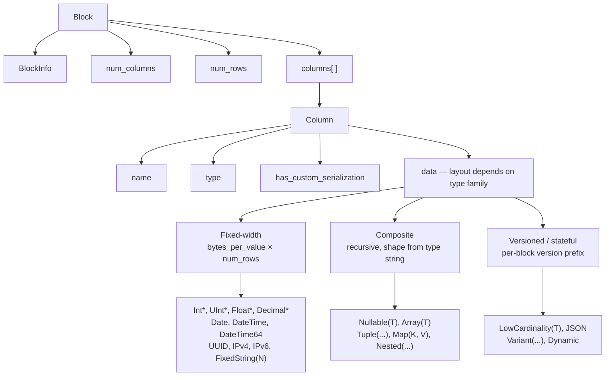
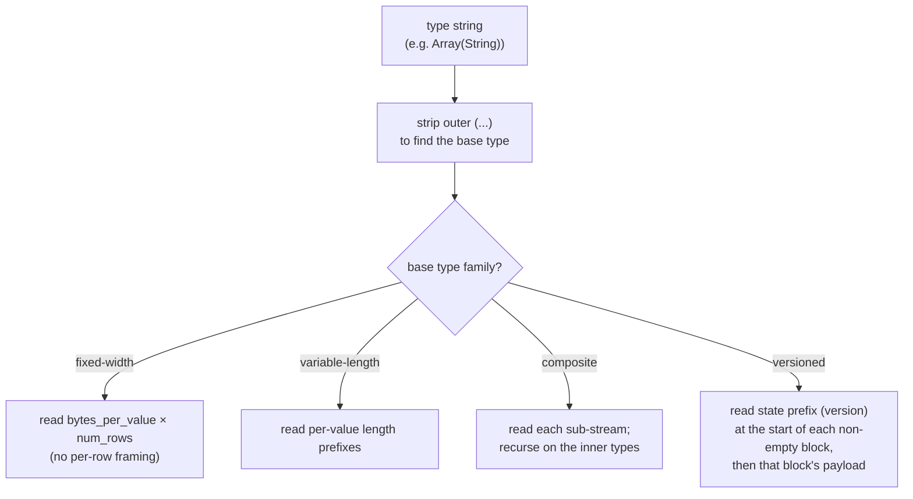
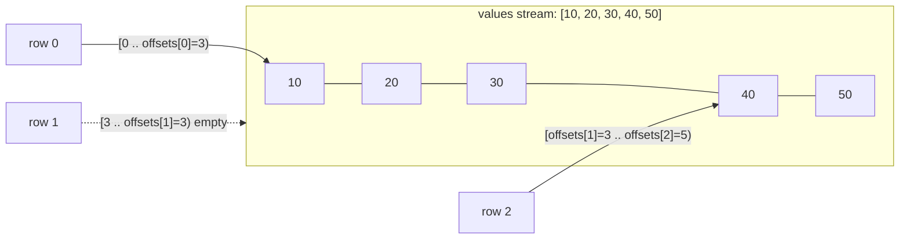
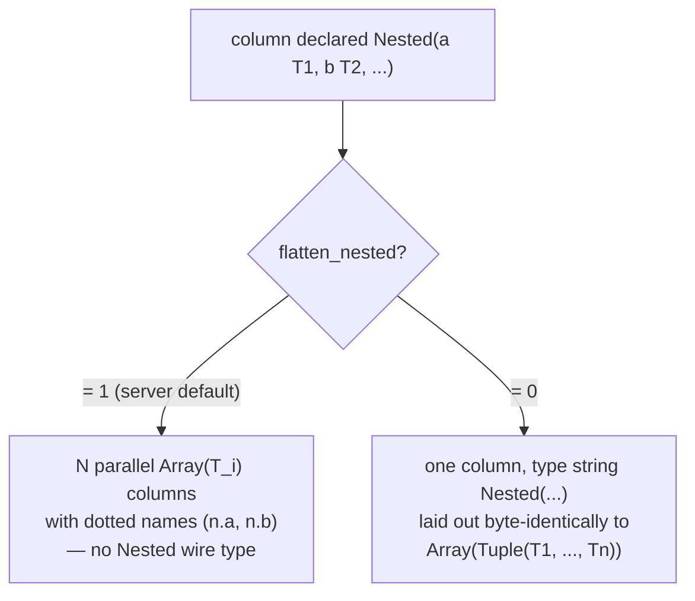
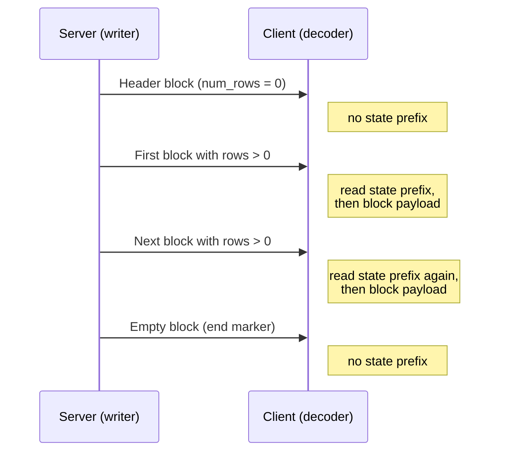
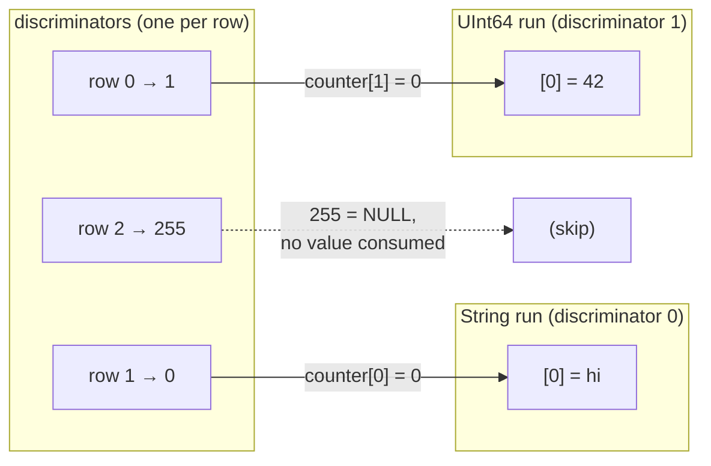
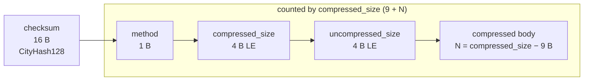

تنسيق Native هو تنسيق wire عمودي يستخدمه ClickHouse لنقل البيانات الجدولية. ويظهر في عدة مواضع:

* متن حزم `Data` و`Totals` و`Extremes` و`Log` و`ProfileEvents` في [البروتوكول الأصلي عبر TCP](/ar/interfaces/specs/NativeProtocol) (حزمة `TableColumns` **ليست** كتلة Native — إذ تحمل سلسلتين ثنائيتين، لذلك يندرج تخطيطها ضمن [مواصفة البروتوكول الأصلي](/ar/interfaces/specs/NativeProtocol));
* مخرجات `SELECT ... FORMAT Native` عبر HTTP;
* ملفات التصدير المكتوبة باستخدام `INTO OUTFILE ... FORMAT Native`;
* حمولات النسخ المتماثل بين الخوادم.

تصف هذه الصفحة البايتات داخل Block — أي الحمولة العمودية — وترميزات الأنواع الخاصة بكل عمود التي تُكوّنه. أما تأطير الحزم، وحالة الاتصال، والتفاوض على الإصدار، فتندرج ضمن [مواصفة البروتوكول الأصلي](/ar/interfaces/specs/NativeProtocol).

تستخدم جميع حقول الأعداد الصحيحة متعددة البايتات ترتيب little-endian. وتستخدم الأعداد الصحيحة الموقعة متمم الاثنين.

:::tip
للاطلاع على مقدمة موجهة للمستخدم حول تنسيق `Native` (مع أمثلة `curl`)، راجع [صفحة تنسيق Native](/ar/interfaces/formats/Native). هذه المواصفة هي مرجع wire منخفض المستوى.
:::

<div id="overview">
  ## نظرة عامة
</div>

كل ما ينقل الصفوف في تنسيق النقل هو **Block**: جزء ذاتي الوصف من الصفوف، مخزَّن عمودًا بعمود. تأتي أولًا جميع قيم العمود 1، ثم جميع قيم العمود 2، وهكذا. ولا يحمل الـ Block إلا الأعمدة التي يشير إليها الاستعلام، وليس الجدول كاملًا أبدًا.

يُرتَّب `data` الخاص بالعمود وفقًا لـ *العائلة* التي ينتمي إليها نوعه. وهذه العائلات، بترتيب تصاعدي من حيث تعقيد وحدة فك الترميز، هي:



* تُرتِّب الأنواع **Fixed-width** `data` على شكل بايتات خام بمقدار `bytes_per_value × num_rows`، من دون أي تأطير على مستوى كل صف.
* للأنواع **المركبة** (`Nullable`, `Array`, `Tuple`, `Map`, `Nested`) بنية تكرارية يمكن اشتقاقها بالكامل من type string، من دون أي بادئة version ومن دون أي state ممتدة عبر blocks.
* تبدأ الأنواع **المُرقَّمة بالإصدار / ذات الحالة** (`LowCardinality`, `JSON`, `Variant`, `Dynamic`) كل block غير فارغ ببادئة serialization-version/state. وعبر `Native` wire، تكون هذه البادئة وأي dictionary **لكل block** — إذ لا يحمل format أي state *عبر* blocks (ينشئ writer حالة serialization جديدة لكل block ويضبط `low_cardinality_max_dictionary_size = 0`). أما الحالة الممتدة عبر blocks فهي مسألة on-disk تخص MergeTree، وليست جزءًا من wire layout الخاص بـ Native.

<div id="wire-primitives">
  ## الأنواع البدائية في Wire
</div>

يعتمد Native format على أربعة ترميزات بدائية.

| Primitive       | Size                 | Description                                      |
| --------------- | -------------------- | ------------------------------------------------ |
| VarUInt         | 1–10 B               | عدد صحيح غير موقّع بطول متغيّر وفق ترميز LEB-128 |
| Fixed-width int | 1, 2, 4, 8, 16, 32 B | little-endian، مع متمم اثنين للقيم الموقَّعة     |
| String          | variable             | بادئة طول من نوع VarUInt + raw bytes             |
| Bool            | 1 B                  | `0x00` = false، وغير الصفر = true                |

<div id="varuint">
  ### VarUInt
</div>

عدد صحيح غير موقّع بطول متغيّر يستخدم ترميز LEB-128. يحمل كل بايت 7 بتات بيانات في المواضع 0–6 وبتّ استمرار واحدًا في الموضع 7. تكون بتّة الاستمرار `1` عند وجود بايتات أخرى لاحقة، و`0` في البايت الأخير.

| نطاق القيم         | البايتات |
| ------------------ | -------- |
| 0 – 127            | 1        |
| 128 – 16383        | 2        |
| 16384 – 2097151    | 3        |
| حتى UInt64 بالكامل | حتى 10   |

ترميز القيمة `300`:

```text
300 = 0b100101100

Byte 0: 0xAC = 0b10101100   (data: 0101100, continuation: 1)
Byte 1: 0x02 = 0b00000010   (data: 0000010, continuation: 0)
```

فك ترميز البايتين `0xAC 0x02`:

```text
Byte 0: data = 0x2C, continuation = 1 → accumulator = 0x2C, shift = 7
Byte 1: data = 0x02, continuation = 0 → accumulator = (0x02 << 7) | 0x2C = 300
```

<div id="fixed-width-integers">
  ### الأعداد الصحيحة ذات العرض الثابت
</div>

| النوع   | البايتات | الترميز                              |
| ------- | -------- | ------------------------------------ |
| UInt8   | 1        | بايت خام                             |
| UInt16  | 2        | Little-endian                        |
| UInt32  | 4        | Little-endian                        |
| UInt64  | 8        | Little-endian                        |
| UInt128 | 16       | Little-endian                        |
| UInt256 | 32       | Little-endian                        |
| Int8    | 1        | بايت خام، متممة لاثنين               |
| Int16   | 2        | Little-endian، متممة لاثنين          |
| Int32   | 4        | Little-endian، متممة لاثنين          |
| Int64   | 8        | Little-endian، متممة لاثنين          |
| Int128  | 16       | Little-endian، متممة لاثنين          |
| Int256  | 32       | Little-endian، متممة لاثنين          |
| Float32 | 4        | IEEE 754 أحادية الدقة، Little-endian |
| Float64 | 8        | IEEE 754 مزدوجة الدقة، Little-endian |

على سبيل المثال، تُشفَّر القيمة `1` من النوع UInt32 بالشكل `01 00 00 00`، وتُشفَّر القيمة `-1` من النوع Int32 بالشكل `FF FF FF FF`.

<div id="string">
  ### String
</div>

سلسلة بايتات مسبوقة بالطول:

```text
[VarUInt: byte_length] [byte_length bytes: raw value]
```

ليس من الضروري أن يكون تسلسل البايتات صالحًا وفق UTF-8. تُشفَّر السلسلة الفارغة على هيئة بايت واحد `0x00`، وقد تحتوي السلاسل على أي قيم بايت، بما في ذلك NUL المضمَّن. وتُشفَّر السلسلة `"ab"` على هيئة `02 61 62`؛ ولفك الترميز، اقرأ طول VarUInt (`2`)، ثم اقرأ هذا العدد من البايتات.

<div id="bool">
  ### Bool
</div>

بايت واحد. تشير القيمة `0x00` إلى false؛ وتشير أي قيمة غير صفرية إلى true (وقيمتها القياسية `0x01`).

<div id="block-and-column-structure">
  ## بنية الكتلة والعمود
</div>

<div id="block-wire-layout">
  ### تخطيط Block على السلك
</div>

```text
[BlockInfo]               metadata (only on the TCP Data-packet path; see below)
[VarUInt: num_columns]    number of columns in this block
[VarUInt: num_rows]       number of rows in this block
[Column × num_columns]    column entries, omitted when num_columns = 0
```

يعتمد وجود بادئة `BlockInfo` على القناة، لأن المكوّن الذي يكتب البيانات مضبوط وفق *revision* (راجع [مراجعة البروتوكول وتنسيق Native](#protocol-revision) للاطلاع على شرح كامل، بما في ذلك كون `client_protocol_version` خاصًا بالإخراج فقط):

* في **native TCP protocol**، يكتب الخادم الكتل وفق الـ revision المتفاوض عليه للاتصال (وهي قيمة كبيرة — `DBMS_TCP_PROTOCOL_VERSION`، راجع `src/Core/ProtocolDefines.h`). وتُكتب `BlockInfo` كلما كان ذلك الـ revision أكبر من صفر، وهذا هو الحال دائمًا في أي اتصال فعلي. كما يُكتب البايت `has_custom_serialization` في كل عمود (راجع [البنية السلكية للعمود](#column-wire-layout)) عند revision `54454` وما بعده.
* أمّا *تنسيق الإخراج* `Native` — أي `SELECT ... FORMAT Native` عبر HTTP، و`INTO OUTFILE ... FORMAT Native`، وتنسيق `Native` الذي ينتجه `clickhouse-client` — فيُسلسِل البيانات عند revision `0` *افتراضيًا*. وعند revision `0` تُحذف كلٌّ من بادئة `BlockInfo` والبايت `has_custom_serialization`، لذا تكون الكتلة مجرد `num_columns` و`num_rows` والأعمدة.

  عبر HTTP، هذا الـ revision ليس ثابتًا: إذ يمكن للعميل رفعه باستخدام معلمة الاستعلام `?client_protocol_version=<n>`، ويستخدم الخادم تلك القيمة بوصفها revision التسلسل للاستجابة.

  ومع قيمة مرتفعة بما يكفي، يتضمن خرج HTTP بادئة `BlockInfo` (تُكتب كلما كان الـ revision أكبر من `0`) والبايت `has_custom_serialization` (يُكتب عند revision `54454` وما بعده)، تمامًا كما في مسار TCP. لذلك يجب ألا يفترض العملاء أن كل حمولة HTTP `FORMAT Native` تكون عند revision `0`.

بعبارة أخرى، فإن أمثلة البايتات في هذا القسم التي تبدأ ببادئة `BlockInfo` تصف حمولة حزمة Data في TCP. أما الاستعلام نفسه عند تمريره عبر `FORMAT Native` فينتج الصيغة الأقصر الموضحة إلى جانبها.

<div id="blockinfo">
  ### BlockInfo
</div>

`BlockInfo` هو تسلسل من الحقول، يسبق كلَّ حقلٍ منها معرّف حقل من نوع `VarUInt`، وينتهي بمعرّف الحقل `0`. تنسيق **wire** **ليس** ذاتي الوصف: فمعرّف الحقل لا يشفّر طول قيمته ولا نوعها، لذلك يجب أن يعرف القارئ مسبقًا نوع كل معرّف حقل قد يصادفه. ويتعامل القارئ الخاص بـ ClickHouse مع أي معرّف حقل غير معروف على أنه تلف، ويرفع استثناءً (`UNKNOWN_BLOCK_INFO_FIELD`). أما التوافقية المستقبلية فتُعالَج بدلًا من ذلك عبر revision البروتوكول: إذ لا يكتب المرسِل حقلًا إلا إذا كانت revision المتفَق عليها لا تقل عن الحد الأدنى لذلك الحقل، بحيث لا يرى المستقبِل الأقدم أبدًا حقلًا لا يعرفه.

| Field ID | Field                            | Type          | Min revision | Description                                                                                                |
| -------- | -------------------------------- | ------------- | ------------ | ---------------------------------------------------------------------------------------------------------- |
| 1        | is&#95;overflows                 | UInt8         | 0            | كتلة overflow ناتجة عن `GROUP BY`. وتكون القيمة `0` للكتل غير الفائضة.                                     |
| 2        | bucket&#95;number                | Int32         | 0            | حاوية التجميع. وتكون القيمة `-1` للكتل غير الموزعة على حاويات.                                             |
| 3        | out&#95;of&#95;order&#95;buckets | List of Int32 | 54480        | الحاويات المؤجّلة أثناء التجميع الموزّع. تُشفَّر على هيئة عدد `VarUInt` متبوعًا بهذا العدد من قيم `Int32`. |
| 0        | (terminator)                     | —             | —            | نهاية `BlockInfo`. وهي مطلوبة دائمًا.                                                                      |

للحقليْن `1` و`2` حد أدنى للمراجعة يساوي `0`، لذلك يكونان موجودين كلما كُتب `BlockInfo` أصلًا. ولا يُكتب الحقل `3` إلا عند revision `54480` وما بعدها. wire layout للحالة الشائعة (revision أقل من `54480`):

```text
[VarUInt: 1] [UInt8: is_overflows]
[VarUInt: 2] [Int32: bucket_number]
[VarUInt: 0]
```

<div id="column-wire-layout">
  ### بنية العمود على مستوى wire
</div>

يظهر العمود `num_columns` مرة داخل `Block`.

| # | Field                            | Type                             | Condition                              | Description                                                                                                                                                                                                                                                                                                                     |
| - | -------------------------------- | -------------------------------- | -------------------------------------- | ------------------------------------------------------------------------------------------------------------------------------------------------------------------------------------------------------------------------------------------------------------------------------------------------------------------------------- |
| 1 | name                             | String                           | دائمًا                                 | اسم العمود                                                                                                                                                                                                                                                                                                                      |
| 2 | type                             | String *أو* binary type encoding | دائمًا                                 | سلسلة نوع ClickHouse (مثل `"UInt64"` و`"Array(String)"`) افتراضيًا؛ أو ترميز نوع ثنائي عندما تكون `output_format_native_encode_types_in_binary_format = 1` (انظر الملاحظة أدناه)                                                                                                                                                |
| 3 | has&#95;custom&#95;serialization | UInt8                            | الميزة `CUSTOM_SERIALIZATION` (v54454) | `0` = default، `1` = مخصص (يتبعه `kind&#95;stack`)                                                                                                                                                                                                                                                                              |
| 4 | kind&#95;stack                   | بايتات                           | عندما يكون الحقل 3 = `1`               | بايت enum واحد من نوع UInt8 (انظر أدناه) يصف `serialization` غير الافتراضي (sparse، إلخ). وبالنسبة إلى القيمة `COMBINATION`، يتبعه عدد VarUInt ثم هذا العدد من بايتات kind الإضافية. أما في حالة `Tuple` (وغيره من الأنواع المركبة التي تتضمن معلومات `serialization` على مستوى العناصر)، فتكون `payload` تكرارية — انظر أدناه. |
| 5 | data                             | بايتات                           | دائمًا                                 | قيم العمود لجميع صفوف `num_rows`. يختلف التخطيط حسب النوع — انظر [data types](#data-types). وبالنسبة إلى الأعمدة sparse، انظر أدناه.                                                                                                                                                                                            |

يوجّه `decoder` المعالجة استنادًا إلى سلسلة `type`. وغالبًا ما تتضمن سلاسل الأنواع `parameters` بين قوسين؛ إذ يزيل `decoder` اللاحقة `(...)` للعثور على `base type`، ثم `parses` الـ `parameters` لاتخاذ قرارات تتعلق بالحجم أو `scale` أو النوع الداخلي. ويتطلب `parsing` قائمة `parameter` تحتوي على types متداخلة (مثل `Tuple` داخل `Array`) أداة تقسيم للفواصل تراعي العمق وتتابع تداخل الأقواس، بدلًا من التقسيم الساذج عند `,`.

:::note ترميز النوع الثنائي
يكون الحقل `type` عبارة عن `String` نصية فقط في `mode` الافتراضي. وعندما يُضبط إعداد الـ query `output_format_native_encode_types_in_binary_format = 1`، يصبح هذا الحقل بدلًا من ذلك **ترميز نوع ثنائي** — وهو الترميز نفسه المعتمد على الوسوم والمُوثَّق في [data type binary encoding](/ar/sql-reference/data-types/data-types-binary-encoding) — كما تستخدم قوائم types `Dynamic` المسطحة الترميز الثنائي نفسه لأسماء الأنواع الخاصة بكل نوع. وأي `decoder` يقرأ الحقل 2 دائمًا على أنه سلسلة مسبوقة بالطول سيتعامل مع أول وسم نوع ثنائي على أنه طول سلسلة ويفقد التزامنه، لذا يجب أن يعرف أي `mode` يستخدمه `stream`.
:::



<div id="kind-stack-and-sparse-encoding">
  #### kind_stack والترميز المتناثر
</div>

يُعدِّد البايت `kind_stack` تسلسلًا غير افتراضي لكل عمود:

| Byte   | Name                         | Meaning                                                              | Wire impact on `data`                                                                    |
| ------ | ---------------------------- | -------------------------------------------------------------------- | ---------------------------------------------------------------------------------------- |
| `0x00` | DEFAULT                      | التسلسل الافتراضي                                                    | مطابق لـ `has_custom = 0`                                                                |
| `0x01` | SPARSE                       | تسلسل متناثر (v54465+)                                               | تيار إزاحات + قيم غير افتراضية؛ انظر أدناه                                               |
| `0x02` | DETACHED                     | عمود مُغلَّف داخل `ColumnBLOB` بواسطة ترتيب block المتوازي (v54478+) | blob مُجهَّز مسبقًا: `VarUInt size` + هذا العدد من البايتات؛ انظر أدناه                  |
| `0x03` | DETACHED&#95;OVER&#95;SPARSE | عمود متناثر مُغلَّف داخل `ColumnBLOB`                                | حمولة blob نفسها كما في `DETACHED`؛ انظر أدناه                                           |
| `0x04` | REPLICATED                   | صيغة Dictionary للقيم المتكررة (v54482+)                             | تيار index + قيم عناصر كثيفة؛ انظر أدناه                                                 |
| `0x05` | COMBINATION                  | مكدس متعدد الأنواع                                                   | يتبعه `count` من نوع `VarUInt` ثم `count` من بايتات النوع الإضافية — انظر الملاحظة أدناه |

**تستخدم حمولة `COMBINATION` تعدادًا مختلفًا.** الصفوف الخمسة أعلاه هي رموز مضغوطة من بايت واحد. ويمثّل `COMBINATION` (`0x05`) صيغة الإفلات العامة لأي مكدس لا تغطيه هذه الرموز: إذ يتبعه `count` من نوع `VarUInt` ثم `count` من الإدخالات ذات البايت الواحد. وهذه الإدخالات **ليست** الرموز المضغوطة الواردة في الجدول، بل هي قيم `ISerialization::Kind` الخام:

| Byte   | Nested `Kind` |
| ------ | ------------- |
| `0x00` | DEFAULT       |
| `0x01` | SPARSE        |
| `0x02` | DETACHED      |
| `0x03` | REPLICATED    |

تختلف قيم البايت عن الرموز المضغوطة: فقيمة `REPLICATED` هي `0x03` في هذا التعداد المتداخل، لكنها `0x04` كرمز مضغوط، ولا يوجد إدخال `DETACHED_OVER_SPARSE` — إذ يظهر هذا التركيب كإدخالين متتاليين: `SPARSE` ثم `DETACHED`. وأي decoder يواصل استخدام الجدول المضغوط للبايتات المتداخلة سيؤدي إلى تعيين خاطئ لـ `0x03`/`0x04` وفقدان التزامن.

تمثل `count` طول المكدس الكامل **بما في ذلك إدخال `DEFAULT` الأول** الذي تبدأ به كل مكدسات الأنواع. وتغطي الرموز المضغوطة أصلًا كل مكدس من إدخال واحد أو إدخالين، لذا تكون قيمة `count` في `COMBINATION` دائمًا ثلاثة على الأقل.

**`kind_stack` تكراري لأعمدة `Tuple`.** تمثل حمولة `kind_stack` أعلاه البايت (أو تسلسل `COMBINATION`) الخاص بمعلومات التسلسل للعمود نفسه. وتحمل `Tuple` كائن `SerializationInfoTuple`، الذي يكتب أولًا حمولة مكدس النوع *الخاصة بالـ tuple نفسها*، ثم يكتب حمولة مكدس نوع كاملة واحدة *لكل* عنصر، بالترتيب؛ ويقرأ decoder البنية التكرارية نفسها عند الاسترجاع. لذلك، بالنسبة إلى `Tuple(A, B, C)` تكون بايتات الحقل 4 هي `[tuple_kind][A_kind][B_kind][C_kind]`، وتكون حمولة كل عنصر تكرارية بحد ذاتها إذا كان ذلك العنصر مركبًا أيضًا. ويُضبط البايت `has_custom_serialization` (الحقل 3) كلما كانت معلومات الـ tuple نفسها *أو معلومات أي عنصر فيها* غير افتراضية، لذا فإن `Tuple` التي يكون عنصرها الخاص الوحيد sparse أو replicated أو detached ستؤدي أيضًا إلى تضمين حمولة مكدس النوع. أما decoder الذي يقرأ فقط بايت التعداد الأحادي الأول لـ `Tuple` فسيتوقف مبكرًا جدًا، وسيُسيء تفسير بايتات نوع العنصر المتبقية على أنها بيانات عمود.

**تنسيق wire المتناثر.** عندما يكون `kind_stack = 0x01`، تكون `data` الخاصة بالعمود عبارة عن تيارين مكتوبين الواحد تلو الآخر في تيار TCP المشترك نفسه:

1. **تيار الإزاحات** — تسلسل من قيم `VarUInt`. وتكون كل قيمة `v` على أحد النحوين:
   * `v` مع كون البت الأعلى عند الموضع 62 غير مضبوط: `(v & 0x3FFFFFFFFFFFFFFF)` = عدد المواضع الافتراضية قبل القيمة غير الافتراضية الصريحة التالية. ويكون ذلك الموضع غير الافتراضي هو `cursor + group_size`، حيث إن `cursor` هو الموضع الجاري؛ وبعد ذلك يتقدم `cursor` بمقدار `group_size + 1`.
   * `v` مع ضبط البت 62 (`END_OF_GRANULE_FLAG`): تمثل القيمة بعد إزالة العلامة عدد المواضع الافتراضية اللاحقة بعد آخر قيمة غير افتراضية. وهذا يحدد نهاية تيار الإزاحات لهذا block.
2. **تيار القيم** — `count` من القيم غير الافتراضية المُرمَّزة بكثافة في النوع الداخلي، حيث إن `count` هو عدد قيم `VarUInt` غير التابعة لـ EOG المقروءة أعلاه.

تعيد أداة فك التشفير بناء عمود كثيف من إدخالات `num_rows` عبر ملء كل موضع غير مُصرَّح به بالقيمة الافتراضية للنوع الداخلي (`0` للأعداد الصحيحة وFloats، و`""` لـ `String`، و`0` يومًا لـ `Date`، وهكذا).

يُعدّ العمود المتناثر `Nullable(T)` حالة خاصة، لأن القيمة الافتراضية لـ `Nullable(T)` هي **NULL**. ويحذف الترميز المتناثر بالكامل دفق null-map المعتاد لـ `Nullable`: إذ يحدّد دفق الإزاحات المواضع غير الافتراضية — أي المواضع غير NULL — بينما لا يحتوي values stream إلا على تلك القيم غير NULL فقط، وبشكل كثيف، في `T`، ويُعاد بناء كل موضع غير مُصرَّح به على أنه NULL. لذلك يجب على أداة فك التشفير *ألا* تبحث عن null map في values stream، ويجب *ألا* تملأ الفجوات بقيمة `0` فعلية؛ بل تملؤها بـ NULL.

**تنسيق wire المكرّر.** عندما تكون `kind_stack = 0x04`، تكون `data` في العمود قاموسًا: قائمة بقيم عناصر مميزة، بالإضافة إلى فهرس لكل صف يشير إلى تلك القائمة (بنفس نمط lookup المستخدم في `LowCardinality`). وعندما يكون النوع الداخلي نفسه versioned — على سبيل المثال `LowCardinality(T)` — تُكتب state prefix الخاصة به **أولًا**، قبل دفق الفهرس: إذ يفوّض التسلسل المكرّر prefix phase إلى النوع الداخلي قبل كتابة `num_rows`. أما الأنواع الداخلية ذات البادئة الفارغة (الأنواع الطرفية والمركّبات العادية) فلا تضيف أي بايتات هنا.

```text
[inner type's state prefix]              empty for leaf inners; e.g. LowCardinality version (Int64 = 1)
[VarUInt num_rows]
[UInt8  size_of_indexes_type]            width of each index: 1, 2, 4, or 8 bytes
[indexes: num_rows × size_of_indexes_type bytes]
[VarUInt num_elements]
[elements: num_elements dense inner-type values]
```

يفكّك decoder الترميز لإعادة بناء عمود كثيف عبر اختيار `elements[indexes[i]]` لكل صف خرج `i`. وتُعالَج الأنواع الداخلية المركّبة تكراريًا: تُجسَّد قائمة العناصر في النوع الداخلي أولًا، ثم تُفهرس. وتشمل الأنواع الداخلية المدعومة الأنواع الطرفية، و`Nullable(T)`، و`Array(T)`، و`Tuple(...)`، و`Map(K, V)`، و`Nested(...)` (يُوسَّع كل حقل مثل `Array`)، و`LowCardinality(T)` (يُحتفَظ بالقاموس المشترك؛ ولا تُفهرس إلا المفاتيح الخاصة بكل عنصر).

**تنسيق wire المنفصل.** يظهر كلٌّ من `DETACHED` (`0x02`) و`DETACHED_OVER_SPARSE` (`0x03`) *فعلاً* على مستوى wire — فهما ليسا للاستخدام الداخلي فقط. في مسار TCP، عندما يكون الضغط مفعّلًا ويكون `revision` المتفاوض عليه لا يقل عن `DBMS_MIN_REVISON_WITH_PARALLEL_BLOCK_MARSHALLING` (v54478)، يمر العمود عبر ثلاث خطوات:

1. يُغلَّف كل عمود مؤهَّل (ليس `const`، وليس `Tuple`، وفي block يحتوي على أكثر من صف واحد) داخل `ColumnBLOB` يحتفظ بالعمود بعد أن يكون قد سُلْسِل وضُغِط خارج الخيط الرئيسي.
2. يُلحَق `DETACHED` بمكدس kind الخاص بالعمود المُغلَّف.
3. تُكتَب `data` الخاصة بالعمود على شكل حجم blob من نوع `VarUInt`، متبوعًا بهذا العدد نفسه تمامًا من بايتات blob.

إذا كان العمود المُغلَّف sparse، فسيكون مكدسه هو `{DEFAULT, SPARSE, DETACHED}`، ويُسلسَل على هيئة `DETACHED_OVER_SPARSE`. ويقرأ العميل الذي يفك ترميز مثل هذا العمود طول blob وبايتاته، ثم يفك ضغط blob لاستعادة حمولة العمود الداخلية (راجع [ملاحظة `ColumnBLOB`](#compression-negotiation) ضمن قسم الضغط).

<div id="block-variants">
  ### متغيرات الكتلة
</div>

تستخدم جميع الحزم من عائلة Data تنسيق wire نفسه للكتلة. ولا تختلف هذه المتغيرات إلا في عدد الأعمدة والصفوف:

| Variant       | num&#95;columns | num&#95;rows | Purpose                                                             |
| ------------- | --------------- | ------------ | ------------------------------------------------------------------- |
| كتلة الترويسة | N &gt; 0        | 0            | تُعلن عن مخطط النتيجة (أسماء الأعمدة + الأنواع).                    |
| كتلة النتيجة  | N &gt; 0        | M &gt; 0     | صفوف النتيجة الفعلية.                                               |
| كتلة فارغة    | 0               | 0            | علامة حارسة — نهاية الإدخال من جهة العميل؛ وسم حدودي من جهة الخادم. |

<div id="byte-level-examples">
  ### أمثلة على مستوى البايت
</div>

جميع الأمثلة في هذا القسم مأخوذة من **مسار حزمة Data في TCP**، لذا فهي تتضمن البادئة `BlockInfo` والبايت `has_custom_serialization`. في `FORMAT Native` تكون الكتل نفسها أقصر — ويُورَد الشكل القصير المكافئ حيثما كان ذلك مفيدًا.

كتلة فارغة (مع BlockInfo)، بإجمالي 8 بايت:

```text
01 00                   BlockInfo: field_id=1, is_overflows=0
02 FF FF FF FF          BlockInfo: field_id=2, bucket_number=-1
00                      BlockInfo terminator
00                      num_columns = 0
00                      num_rows = 0
```

تُعلن كتلة الترويسة الخاصة بـ `SELECT 1` عن عمود واحد باسم `"1"` من النوع `UInt8`، وبعدد صفوف يساوي صفرًا. في البروتوكول ≥ 54454، يُضمَّن البايت `has_custom_serialization`:

```text
01 00                   BlockInfo: is_overflows = 0
02 FF FF FF FF          BlockInfo: bucket_number = -1
00                      BlockInfo terminator
01                      num_columns = 1
00                      num_rows = 0
01 "1"                  Column[0].name = "1"
05 "UInt8"              Column[0].type = "UInt8"
00                      Column[0].has_custom_serialization = 0
                        Column[0].data: no bytes (num_rows = 0)
```

كتلة النتيجة للاستعلام نفسه، مع صف واحد:

```text
01 00                   BlockInfo: is_overflows = 0
02 FF FF FF FF          BlockInfo: bucket_number = -1
00                      BlockInfo terminator
01                      num_columns = 1
01                      num_rows = 1
01 "1"                  Column[0].name = "1"
05 "UInt8"              Column[0].type = "UInt8"
00                      Column[0].has_custom_serialization = 0
01                      Column[0].data: one UInt8 byte = 1
```

عبر `FORMAT Native` (المراجعة `0`)، لا تتضمن كتلة النتيجة نفسها `BlockInfo` ولا بايت `has_custom_serialization` — ويبلغ حجم `SELECT 1 FORMAT Native`‏ 11 بايت:

```text
01                      num_columns = 1
01                      num_rows = 1
01 "1"                  Column[0].name = "1"
05 "UInt8"              Column[0].type = "UInt8"
01                      Column[0].data: one UInt8 byte = 1
```

(النتيجة الخالية من الصفوف، مثل كتلة لا تحتوي إلا على ترويسة، لا تُنتج أي بايتات على الإطلاق عبر `FORMAT Native`: لا يُصدر تنسيق الإخراج كتلًا فارغة.)

<div id="protocol-revision">
  ## مراجعة البروتوكول وتنسيق Native
</div>

يتشكّل دفق بايتات Native، قبل كل شيء، وفق **مراجعة البروتوكول** التي يعمل بها كلٌّ من الكاتب والقارئ. ولا تظهر هذه المراجعة في البايتات نفسها إطلاقًا — فلا يوجد حقل للمراجعة في تنسيق النقل — لكنها مع ذلك تحدد ما إذا كانت بعض الميزات ستظهر أصلًا أم لا. لذلك، يجب أن يعرف مفكّك الترميز المراجعة التي كُتبت بها الحمولة قبل أن يتمكن من تحليلها. وبما أن المراجعة غير موجودة في الدفق، فلا بد أن يتفق القارئ والكاتب عليها بطريقة أخرى.

وهي قيمة `UInt64` واحدة، ويأخذها كلٌّ من `NativeWriter` و`NativeReader` كوسيط في المُنشئ. يسمّيها الكاتب `client_revision` ويسمّيها القارئ `server_revision`، لكنها الرقم نفسه. وأحدث مراجعة يعرفها هذا الإصدار هي `DBMS_TCP_PROTOCOL_VERSION` (انظر `src/Core/ProtocolDefines.h`).

<div id="what-the-revision-gates">
  ### ما الذي تضبطه المراجعة
</div>

تقع كل ميزة خلف عتبة `DBMS_MIN_REVISION_WITH_*`. ولا يرسل الكاتب الميزة إلا عندما تبلغ مراجعته تلك العتبة، ويبحث عنها القارئ وفق القاعدة نفسها تمامًا، بحيث يظل الطرفان متزامنين — وإذا أخطأت في تحديد المراجعة على أي من الجانبين فسينفصل تزامنهما. والبوابات المهمة لتنسيق Native هي:

| الميزة                                | ثابت العتبة                                                        | المراجعة | التأثير عند النزول دون العتبة                                                                                                                                                                                                                                        |
| ------------------------------------- | ------------------------------------------------------------------ | -------- | -------------------------------------------------------------------------------------------------------------------------------------------------------------------------------------------------------------------------------------------------------------------- |
| بادئة `BlockInfo`                     | (أي قيمة `> 0`)                                                    | `1`      | تُحذف بادئة [`BlockInfo`](#blockinfo) بالكامل؛ وتصبح الكتلة مجرد `num_columns` و`num_rows` والأعمدة.                                                                                                                                                                 |
| البايت `has_custom_serialization`     | `DBMS_MIN_REVISION_WITH_CUSTOM_SERIALIZATION`                      | `54454`  | يُحذف البايت [`has_custom_serialization`](#column-wire-layout) الخاص بكل عمود؛ وتستخدم جميع الأعمدة التسلسل الافتراضي (من دون أشكال sparse أو replicated أو detached).                                                                                               |
| `LowCardinality` في تنسيق النقل       | `DBMS_MIN_REVISION_WITH_LOW_CARDINALITY_TYPE`                      | `54405`  | حالة خاصة — **لا** تتبع القاعدة البسيطة المعتادة لما دون العتبة. يُختزل `LowCardinality(T)` إلى النوع الأساسي `T` فقط عندما تكون المراجعة *غير صفرية* وأقل من `54405`، أو عندما يُفرض هذا الاختزال بشكل منفصل. أما المراجعة `0` فتُبقيه كما هو. انظر الملاحظة أدناه. |
| تسلسل V2 لـ `Dynamic` / `JSON`        | `DBMS_MIN_REVISION_WITH_V2_DYNAMIC_AND_JSON_SERIALIZATION`         | `54473`  | يستخدم `Dynamic` و`JSON`/`Object` تسلسل V1 (مع المعلمة `max_dynamic_*`) بدلًا من V2.                                                                                                                                                                                 |
| تعيين الإصدارات لدوال التجميع         | `DBMS_MIN_REVISION_WITH_AGGREGATE_FUNCTIONS_VERSIONING`            | `54452`  | تُكتب حالة `AggregateFunction` من دون إصدار مضمن.                                                                                                                                                                                                                    |
| `out_of_order_buckets` في `BlockInfo` | `DBMS_MIN_REVISION_WITH_OUT_OF_ORDER_BUCKETS_IN_AGGREGATION`       | `54480`  | لا يُكتب معرّف الحقل `3` في `BlockInfo` (انظر [BlockInfo](#blockinfo)).                                                                                                                                                                                              |
| تنظيم الكتل المتوازي (`DETACHED`)     | `DBMS_MIN_REVISON_WITH_PARALLEL_BLOCK_MARSHALLING`                 | `54478`  | لا تُغلَّف الأعمدة مطلقًا داخل `ColumnBLOB`؛ ولا تظهر الأنواع `DETACHED` / `DETACHED_OVER_SPARSE` (انظر [kind&#95;stack](#kind-stack-and-sparse-encoding)).                                                                                                          |
| معلمة النوع `DateTime(tz)`            | `DBMS_MIN_REVISION_WITH_TIME_ZONE_PARAMETER_IN_DATETIME_DATA_TYPE` | `54337`  | تُحذف معلمة timezone من سلسلة `type` — ويُعلَن عن `DateTime('UTC')` على أنه `DateTime` مجردة.                                                                                                                                                                        |

وهذا يجعل المراجعة `0` الترميز الأكثر تحفظًا تقريبًا في معظم الحالات: فلا يحمل التدفق أي `BlockInfo`، ولا بايت `has_custom_serialization`، ويستخدم `Dynamic`/`JSON` من نوع V1، ومن دون إصدار لدوال التجميع، ومع `DateTime` مجردة بعد حذف معلمة timezone.

ويُعد `LowCardinality` الاستثناء الوحيد، وهو استثناء مهم. يتحقق الكاتب وفق الشرط `remove_low_cardinality || (client_revision && client_revision < DBMS_MIN_REVISION_WITH_LOW_CARDINALITY_TYPE)`. والحيلة هنا هي الجزء الأول `client_revision &&`: فعندما تكون المراجعة مساوية تمامًا لـ `0`، يُختصر الشرط بالكامل إلى false.

لذلك عند المراجعة `0` — وهي القيمة الافتراضية لـ `FORMAT Native` — **لا** يُختزل `LowCardinality(T)`. إذ تبقى سلسلة النوع الخاصة به وبادئة الحالة لكل block داخل التدفق، ويقوم القارئ عند المراجعة `0` بقراءتهما مباشرة كما هما. ولا يبدأ الاختزال إلا عند وجود مراجعة غير صفرية أقل من `54405`، أو عندما يُفرض بغض النظر عن المراجعة.

وهذا الفرض هو الخيار `remove_low_cardinality`. لا يضبط خرج `FORMAT Native` هذا الخيار أبدًا، لكن مسار native TCP يضبطه عندما تكون `low_cardinality_allow_in_native_format = 0` (والقيمة الافتراضية `1`). وبعبارة أخرى، يغيّر هذا الإعداد خرج native TCP لكنه لا يفعل شيئًا بالنسبة إلى `FORMAT Native`.

الخلاصة العملية: قد يحتوي تدفق `FORMAT Native` الافتراضي، بشكل مشروع، على `LowCardinality`، لذلك لا تتعامل معه على أنه ميزة غائبة عند المراجعة `0`.

<div id="revision-per-channel">
  ### مصدر رقم المراجعة بحسب المسار الذي تسلكه البيانات
</div>

يمكن أن تنتقل بايتات Native نفسها عبر مسارات مختلفة: بروتوكول TCP الأصلي، أو طلب HTTP، أو ملف على القرص. ويحدّد كل مسار رقم المراجعة بطريقته الخاصة. وهناك نقطة ينبغي الانتباه إليها: يُضبط جانب القراءة وجانب الكتابة كلٌّ منهما على حدة، لذا قد ينتهيان إلى رقمَي مراجعة مختلفين.

<div id="revision-tcp">
  #### بروتوكول TCP الأصلي — يجري التفاوض عليه، في كلا الاتجاهين
</div>

في [بروتوكول TCP الأصلي](/ar/interfaces/specs/NativeProtocol)، تُستمد المراجعة من مصافحة Hello. يرسل العميل `DBMS_TCP_PROTOCOL_VERSION`، ويرسل الخادم مراجعته هو بالمقابل، ومن ثمّ يَجري كل طرف التسلسل عند **المراجعة التي أعلن عنها الطرف الآخر**: إذ يبني الخادم `NativeReader`/`NativeWriter` من `client_tcp_protocol_version`، بينما يستخدم العميل `server_revision` الذي تلقّاه. لا توجد قيمة `min` صريحة، لكن لا يمكن لأي طرف إخراج ميزة لم ينفّذها أصلًا، لذا يكون كل اتجاه عمليًا مقيّدًا بالطرف الأقدم من النظيرين.

عندما يكون النظيران على نفس الإصدار الحديث، يستقر الاتجاهان على المراجعة نفسها (`DBMS_TCP_PROTOCOL_VERSION`، راجع `src/Core/ProtocolDefines.h`) وتكون جميع بوابات التفعيل مفعّلة. هذه هي الحالة الشائعة، لكنها ليست مضمونة. أما مع نظراء بإصدارات مختلطة أو من جهات خارجية، فقد يستقر الاتجاهان عند مراجعتين مختلفتين، لذا يجب قراءة بوابات التفعيل لكل اتجاه على حدة: تكون `BlockInfo` موجودة لأي مراجعة غير صفرية، لكن البقية — بما في ذلك `has_custom_serialization` — لا تظهر إلا عندما تبلغ المراجعة الفعلية لذلك الاتجاه الحدود المطلوبة لها. فعلى سبيل المثال، النظير الذي يعلن عن مراجعة أقل من `54454` لا يرسل البايت `has_custom_serialization` ولا يستقبله.

<div id="revision-output">
  #### مخرجات `FORMAT Native` — المراجعة 0 افتراضيًا، ويمكن رفعها عبر HTTP
</div>

يكون تنسيق *المخرجات* `Native` مضبوطًا افتراضيًا على المراجعة **`0`**. ويشمل ذلك `SELECT ... FORMAT Native` عبر HTTP، و`INTO OUTFILE ... FORMAT Native`، ومخرجات `Native` التي يكتبها `clickhouse-client`؛ وفي كل حالة، يمرّر مصنع المخرجات `FormatSettings::client_protocol_version` مباشرةً إلى `NativeWriter`.

لكن عبر HTTP، لا تنتهي القصة عند هذه القيمة الافتراضية. يمكن للعميل رفعها باستخدام معلمة الاستعلام `?client_protocol_version=<n>`، التي يتعامل معها معالج HTTP على أنها معلمة محجوزة لا إعداد SQL: إذ تصل إلى سياق الاستعلام، ثم تنسخها طبقة التنسيق إلى `FormatSettings`. وإذا ضُبطت على قيمة مرتفعة بما يكفي، تبدأ مخرجات HTTP `FORMAT Native` في تضمين بادئة `BlockInfo` والبايت `has_custom_serialization`، تمامًا كما في مسار TCP — لذا لا تفترض أن حمولة HTTP `FORMAT Native` تكون دائمًا بالمراجعة `0`. ولا تملك صادرات الملفات ومخرجات `clickhouse-client` المحلية خيارًا مماثلًا، لذا تبقى عند `0`.

<div id="revision-input">
  #### إدخال `FORMAT Native` — دائمًا بالمراجعة 0
</div>

تنسيق *الإدخال* `Native` يعمل بالعكس: فهو **مثبّت برمجيًا على المراجعة `0`** ولا يلتفت إطلاقًا إلى `client_protocol_version`. وسواء كان يحلّل جسم `INSERT ... FORMAT Native` أو يقرأ ملف `Native`، فإنه ينشئ `NativeReader` باستخدام `0` كـ قيمة حرفية، لذلك لا يتوقع أبدًا بادئة `BlockInfo`، ولا يقرأ مطلقًا البايت `has_custom_serialization`، ويفترض دائمًا التسلسل الافتراضي.

لذلك، فإن `client_protocol_version` يخص الإخراج فقط. إن تعيين قيمة مرتفعة لـ `?client_protocol_version=` (على سبيل المثال `DBMS_TCP_PROTOCOL_VERSION`) في طلب `INSERT ... FORMAT Native` لا يغيّر شيئًا في كيفية قراءة الجسم — إذ يجب أن يظل الجسم بالمراجعة `0`. وإذا مرّرت جسمًا يحتوي بالفعل على بادئة `BlockInfo` أو البايت `has_custom_serialization`، فسيفقد القارئ التزامنه، ويظهر ذلك على شكل خطأ في التحليل (`INCORRECT_DATA` أو `CANNOT_READ_ALL_DATA`) بدلًا من إدراج ناجح.

<div id="revision-round-trip">
  ### تداعيات round-trip
</div>

بالنسبة إلى `FORMAT Native`، فالخيار الآمن هو استخدام المراجعة `0` على الطرفين، وهذا ما تحصل عليه افتراضيًا. فالبيانات التي يكتبها `SELECT ... FORMAT Native` عند المراجعة `0` يمكن قراءتها مباشرةً مرة أخرى عبر `INSERT ... FORMAT Native` من دون أي مفاجآت.

ولا تبدأ المشكلة إلا إذا رفعتَ مراجعة الإخراج عمدًا. إذ إن `SELECT ... FORMAT Native` الذي يُنفَّذ باستخدام `?client_protocol_version=<large>` يُنتج تدفقًا يتضمن بايتات `BlockInfo` و`has_custom_serialization`، ولا يستطيع مسار الإدخال ذي المراجعة `0` قراءتها مجددًا. وإذا كنت بحاجة إلى أن تمر هذه البيانات بعملية round-trip، فإما ألا تضبط `client_protocol_version` في أمر `SELECT` الذي يُنتجها، أو تنقل البيانات عبر بروتوكول TCP الأصلي — حيث يستخدم كل اتجاه المراجعة التي جرى التفاوض عليها أثناء المصافحة — بدلًا من `FORMAT Native`.

| القناة                                                     | مراجعة الكتابة                            | مراجعة القراءة                                | `BlockInfo` / التسلسل المخصّص                                                   |
| ---------------------------------------------------------- | ----------------------------------------- | --------------------------------------------- | ------------------------------------------------------------------------------- |
| حزمة Data عبر Native TCP                                   | المراجعة التي يعلنها النظير (لكل اتجاه)   | المراجعة التي يعلنها النظير (لكل اتجاه)       | `BlockInfo` كلما كانت المراجعة `> 0`؛ و`has_custom_serialization` عند `≥ 54454` |
| `SELECT ... FORMAT Native` عبر HTTP                        | `client_protocol_version` (الافتراضي `0`) | n/a                                           | فقط إذا رُفع `client_protocol_version`                                          |
| `INSERT ... FORMAT Native` عبر HTTP                        | n/a                                       | `0` (ثابتة وتتجاهل `client_protocol_version`) | لا تُقرأ أبدًا                                                                  |
| `INTO OUTFILE` / ملف / `clickhouse-client` `FORMAT Native` | `0`                                       | `0`                                           | غير موجودة (لكن `LowCardinality` يبقى محفوظًا — انظر الملاحظة أعلاه)            |

:::note مراجعة البروتوكول مقابل إصدار التسلسل
لا تخلط بين مراجعة البروتوكول و[إصدار التسلسل](#serialization-version-concept). فالمراجعة هنا تكون على مستوى الاتصال أو الطلب بالكامل، ولا تظهر أبدًا في البايتات. أما إصدار التسلسل فهو لكل عمود، ويُنقل بواسطة [الأنواع ذات الإصدار](#versioned-types)، ويُكتب داخل كل كتلة غير فارغة. وتحدد المراجعة ما إذا كانت الميزة موجودة أصلًا؛ أما إصدار التسلسل، فبمجرد دخولك إلى عمود ذي إصدار، فإنه يحدد أي متغير من ترميز ذلك النوع نفسه سيأتي بعد ذلك.
:::

<div id="data-types">
  ## أنواع البيانات
</div>

يوثّق هذا القسم الترميز على مستوى wire للأنواع التي يمكن أن يحملها تنسيق Native داخل `data` الخاص بالعمود، وهي مُجمَّعة في أربع فئات يتزايد فيها تعقيد فك الترميز. ويوجد نوعان — `AggregateFunction(func, ...)` و `QBit(T, N[, stride])` — صالحان بوصفهما نوعَي أعمدة `Native`، لكن لكلٍّ منهما payload خاص بالدالة أو بالنوع لا يغطيه هذا القسم؛ ويُشار إليهما أدناه في المواضع التي قد يُلتبس فيها باعتبارهما أسماءً مستعارة.

| الفئة                       | القسم                                          | التدفقات لكل عمود | الحالة عبر الكتل                                                                  |
| --------------------------- | ---------------------------------------------- | ----------------- | --------------------------------------------------------------------------------- |
| ثابتة العرض                 | [الأنواع ثابتة العرض](#fixed-width-types)      | واحد              | None                                                                              |
| متغيرة الطول                | [الأنواع متغيرة الطول](#variable-length-types) | واحد              | None                                                                              |
| مركبة (ذات بنية ثابتة)      | [الأنواع المركبة](#composite-types)            | متعددة            | None                                                                              |
| مُرقّمة بالإصدار / ذات حالة | [الأنواع المُرقّمة بالإصدار](#versioned-types) | متعددة            | لا توجد على wire الخاص بـ Native — state prefix لكل block، ويكون جديدًا لكل block |

<div id="fixed-width-types">
  ### الأنواع ثابتة العرض
</div>

تشغل كل قيمة عددًا ثابتًا من البايتات. ويشغل عمود مكوّن من `M` صفوف `bytes_per_row × M` بايتًا بالضبط في تنسيق النقل، متصلةً من دون فواصل أو حشو.

| سلسلة النوع         | البايتات لكل قيمة | القيمة المنطقية                                                                                 | ترميز النقل                                               |
| ------------------- | ----------------- | ----------------------------------------------------------------------------------------------- | --------------------------------------------------------- |
| `UInt8`             | 1                 | عدد صحيح غير موقّع من 8 بت                                                                      | بايت خام                                                  |
| `UInt16`            | 2                 | عدد صحيح غير موقّع من 16 بت                                                                     | little-endian                                             |
| `UInt32`            | 4                 | عدد صحيح غير موقّع من 32 بت                                                                     | little-endian                                             |
| `UInt64`            | 8                 | عدد صحيح غير موقّع من 64 بت                                                                     | little-endian                                             |
| `UInt128`           | 16                | عدد صحيح غير موقّع من 128 بت                                                                    | little-endian                                             |
| `UInt256`           | 32                | عدد صحيح غير موقّع من 256 بت                                                                    | little-endian                                             |
| `Int8`              | 1                 | عدد صحيح موقّع من 8 بت، بمتمّم اثنين                                                            | بايت خام                                                  |
| `Int16`             | 2                 | عدد صحيح موقّع من 16 بت، بمتمّم اثنين                                                           | little-endian                                             |
| `Int32`             | 4                 | عدد صحيح موقّع من 32 بت، بمتمّم اثنين                                                           | little-endian                                             |
| `Int64`             | 8                 | عدد صحيح موقّع من 64 بت، بمتمّم اثنين                                                           | little-endian                                             |
| `Int128`            | 16                | عدد صحيح موقّع من 128 بت، بمتمّم اثنين                                                          | little-endian                                             |
| `Int256`            | 32                | عدد صحيح موقّع من 256 بت، بمتمّم اثنين                                                          | little-endian                                             |
| `Float32`           | 4                 | IEEE 754 أحادي الدقة                                                                            | little-endian                                             |
| `Float64`           | 8                 | IEEE 754 مزدوج الدقة                                                                            | little-endian                                             |
| `BFloat16`          | 2                 | أعلى 16 بت من IEEE 754 `Float32`                                                                | little-endian                                             |
| `Bool`              | 1                 | `0x00` = false, `0x01` = true                                                                   | بايت خام                                                  |
| `Date`              | 2                 | عدد الأيام منذ `1970-01-01`                                                                     | little-endian UInt16                                      |
| `Date32`            | 4                 | عدد الأيام منذ `1970-01-01` (موقّع؛ القيم السابقة لعام 1970 مقبولة)                             | little-endian Int32                                       |
| `DateTime`          | 4                 | Unix timestamp بالثواني                                                                         | little-endian UInt32                                      |
| `DateTime(tz)`      | 4                 | مثل `DateTime`؛ المنطقة الزمنية بيانات وصفية                                                    | little-endian UInt32                                      |
| `DateTime64(s)`     | 8                 | وحدات tick بالمقياس `s` (10^-s ثانية منذ epoch)                                                 | little-endian Int64                                       |
| `DateTime64(s, tz)` | 8                 | مثل `DateTime64(s)`؛ المنطقة الزمنية بيانات وصفية                                               | little-endian Int64                                       |
| `Time`              | 4                 | مدة زمنية موقّعة للساعة بالثواني                                                                | little-endian Int32                                       |
| `Time64(s)`         | 8                 | مدة زمنية موقّعة للساعة بوحدات tick بالمقياس `s`                                                | little-endian Int64                                       |
| `Interval<Unit>`    | 8                 | عدد موقّع؛ الوحدة موجودة في سلسلة النوع                                                         | little-endian Int64                                       |
| `UUID`              | 16                | معرّف من 128 بت                                                                                 | نصفان من LE UInt64 مع تبديل البايتات (انظر [UUID](#uuid)) |
| `IPv4`              | 4                 | عنوان IPv4                                                                                      | little-endian UInt32                                      |
| `IPv6`              | 16                | عنوان IPv6                                                                                      | ترتيب بايتات الشبكة، من دون swap                          |
| `Enum8`             | 1                 | عدد صحيح موقّع من 8 بت (فهرس المتغيّر)                                                          | بايت خام                                                  |
| `Enum16`            | 2                 | عدد صحيح موقّع من 16 بت (فهرس المتغيّر)                                                         | little-endian                                             |
| `Decimal(P, S)`     | 4 / 8 / 16 / 32   | `value × 10^S` كعدد صحيح موقّع؛ يعتمد العرض على P (≤9 → 4 B، ≤18 → 8 B، ≤38 → 16 B، ≤76 → 32 B) | عدد صحيح موقّع little-endian                              |

<div id="integer-types">
  #### أنواع الأعداد الصحيحة
</div>

يمثّل `UInt8`–`UInt256` و`Int8`–`Int256` ترميزًا ثنائيًا مباشرًا لقيم الأعداد الصحيحة. وتقرأ وحدة فك الترميز `bytes_per_row × num_rows` بايتًا وتفسّرها وفقًا للنوع.

عمود من النوع `UInt32` يحتوي على `[1, 256, 65536]`:

```text
01 00 00 00              row 0: 1
00 01 00 00              row 1: 256
00 00 01 00              row 2: 65536
```

عمود من النوع `Int32` يحتوي على `[-1, 42]`:

```text
FF FF FF FF              row 0: -1
2A 00 00 00              row 1: 42
```

<div id="float32-and-float64">
  #### Float32 and Float64
</div>

أعداد الفاصلة العائمة الثنائية القياسية وفق IEEE 754: ‏4 بايتات بدقة مفردة (`binary32`) و8 بايتات بدقة مزدوجة (`binary64`)، وكلٌّ منها بترتيب little-endian. وتُحفَظ قيم NaN و±Infinity و±0.0 والقيم دون العيارية جميعها عند الكتابة ثم القراءة مجددًا دون أي تطبيع.

قيمة `Float32` ‏`1.5` (`0x3FC00000`):

```text
00 00 C0 3F              little-endian IEEE 754
```

القيمة `1.5` من نوع `Float64` (`0x3FF8000000000000`):

```text
00 00 00 00 00 00 F8 3F  little-endian IEEE 754
```

<div id="bfloat16">
  #### BFloat16
</div>

تنسيق الفاصلة العائمة BFloat: أعلى 16 بت من `Float32` وفق معيار IEEE 754 — بت إشارة واحد، و8 بتات للأس، و7 بتات للمانتيسا. حجم كل قيمة هو 2 بايت، بترتيب little-endian، وتحتفظ بالنمط الخام المكوَّن من 16 بت. لاستعادة القيمة العددية، وسّعها مرة أخرى إلى `Float32` بوضع النمط في النصف العلوي وتصفير النصف السفلي (أي إعادة تفسير `bits << 16` على أنه `Float32`)؛ وعندئذٍ تستخدم القيمة الموسَّعة تنسيق النص نفسه الخاص بـ `Float32`.

قيمة `BFloat16` ‏`1.5` (النمط `0x3FC0`، وهو النصف العلوي من `Float32` ‏`0x3FC00000`):

```text
C0 3F                    little-endian, widens to Float32 1.5
```

<div id="bool-type">
  #### Bool
</div>

متوافق في تنسيق النقل مع `UInt8`: بايت واحد لكل صف، `0x00` = false، و`0x01` = true. تكون سلسلة النوع في تنسيق النقل حرفيًا `Bool` (وليس `UInt8`)، لذا يجب أن تتعرّف عليه وحدة فك الترميز التي تُوجِّه بناءً على سلسلة النوع بشكل منفصل.

عمود `Bool` بالقيم `[true, false, true]`:

```text
01 00 01
```

<div id="date-and-date32">
  #### Date و Date32
</div>

كلاهما يشفّر التواريخ كعدد صحيح من الأيام نسبةً إلى حقبة Unix `1970-01-01`. ولا يتضمن أيٌّ منهما جزءًا زمنيًا.

| النوع    | البايتات | الترميز              | النطاق                              |
| -------- | -------- | -------------------- | ----------------------------------- |
| `Date`   | 2        | Little-endian UInt16 | `1970-01-01` إلى `2149-06-06`       |
| `Date32` | 4        | Little-endian Int32  | نطاق واسع موقّع، وما قبل 1970 مدعوم |

قيمة `Date` `1970-01-02` (يوم واحد):

```text
01 00                    UInt16 LE = 1
```

القيمة `1900-01-01` من النوع `Date32` (‑25567 يومًا):

```text
21 9C FF FF              Int32 LE = -25567
```

<div id="datetime">
  #### DateTime
</div>

متوافق ثنائيًا مع `UInt32`: طابع زمني Unix بالثواني، بحجم 4 بايت وبترتيب little-endian. قد يظهر النوع على هيئة `DateTime` أو `DateTime('Timezone')`؛ وتؤثر المنطقة الزمنية على العرض فقط، وليست جزءًا من القيمة المنقولة ثنائيًا. ينتج عمودان من نوع `DateTime` لهما معاملا منطقة زمنية مختلفان بايتات متطابقة للحظة نفسها. يزيل مفكك الترميز لاحقة المعامل `(...)` ويعالج العمود باعتباره `UInt32`.

قيمة `DateTime('UTC')` ‏`2024-03-15 14:30:00 UTC` (الطابع الزمني `1710513000`):

```text
68 5B F4 65              UInt32 LE = 1710513000
```

<div id="datetime64">
  #### DateTime64(scale[, timezone])
</div>

8 بايت، ‏Int64 بترتيب little-endian يمثّل وحدات tick بمقياس `10^-scale` ثانية منذ حقبة Unix. تقع المعلمة `scale` ‏(0–9) ضمن سلسلة النوع وتحدد وحدة الزمن:

| المقياس | حجم tick      | الاسم الشائع |
| ------- | ------------- | ------------ |
| 0       | ثانية واحدة   | ثوانٍ        |
| 3       | 1 millisecond | ms           |
| 6       | 1 microsecond | µs           |
| 9       | 1 nanosecond  | ns           |

يظهر النوع بالشكل `DateTime64(s)` (المنطقة الزمنية الافتراضية الضمنية للخادم) أو `DateTime64(s, 'TimezoneName')` (منطقة زمنية صريحة، للعرض فقط). تمثل القيم السالبة وحدات tick السابقة للحقبة.

قيمة `DateTime64(3, 'UTC')` ‏`2024-01-15 12:30:45.123 UTC` ‏(1705321845123 ms):

```text
83 51 1A 0D 8D 01 00 00  Int64 LE = 1705321845123
```

قيمة `DateTime64(0)` `2024-01-15 12:30:45 UTC` (1705321845 s):

```text
75 25 A5 65 00 00 00 00  Int64 LE = 1705321845
```

<div id="time-and-time64">
  #### Time وTime64(scale)
</div>

مدة زمنية وليست نقطةً زمنية. `Time` هو عدد ثوانٍ موقَّع، بحجم 4 بايت من النوع Int32 وبترتيب little-endian؛ أما `Time64(scale)` فهو عدد tickات موقَّع عند المقياس العشري المحدد (0–9)، بحجم 8 بايت من النوع Int64 وبترتيب little-endian — وله نفس بنية wire مثل `DateTime64`.

الصيغة النصية هي `[-]HH:MM:SS[.fraction]`، لكن بخلاف `DateTime` فإن حقل الساعات **لا** يلتف ضمن يوم من 24 ساعة: بل يمثّل إجمالي عدد الساعات، وقد يتجاوز 23. يُحدَّد الحد الأقصى للقيمة المعروضة عند `999:59:59` (`3599999` ثانية)؛ وأي قيمة أكبر من ذلك تُعرض عند هذا الحد الأقصى مع تصفير الجزء الكسري (`999:59:59.000`). وتقوم `CAST` أيضًا بتقييد القيمة المخزنة إلى هذا النطاق، مع أن العمليات الحسابية قد تُنتج قيمًا خارج النطاق لا تُقيَّد إلا عند العرض. ولا يؤثر أيّ من ذلك في wire bytes، فهي مجرد عدد صحيح موقَّع عادي.

قيمة `Time` وهي `45296` (`12:34:56`):

```text
F0 B0 00 00              Int32 LE = 45296
```

قيمة `Time64(3)` هي `45296789` tick (`12:34:56.789`):

```text
95 2C B3 02 00 00 00 00  Int64 LE = 45296789
```

:::note
`Time` و`Time64` ما تزالان تجريبيتين، وتتطلبان ضبط `allow_experimental_time_time64_type = 1` على الخادم.
:::

<div id="interval">
  #### Interval
</div>

`Interval<Unit>` — ‏`IntervalSecond` و`IntervalMinute` و`IntervalHour` و`IntervalDay` و`IntervalWeek` و`IntervalMonth` و`IntervalQuarter` و`IntervalYear` و`IntervalNanosecond`، وهكذا. تشترك جميع الوحدات في wire encoding واحد: القيمة على شكل Int64 موقّع بطول 8 بايت وبترتيب little-endian. وتظهر الوحدة **فقط** في type string — فهي لا تغيّر لا wire bytes ولا الصيغة النصية، التي تكون مجرد عدد صحيح. ويتولى decoder واحد معالجة جميع الوحدات.

قيمة `IntervalDay` التي تساوي `5`:

```text
05 00 00 00 00 00 00 00  Int64 LE = 5
```

<div id="uuid">
  #### معرّف UUID
</div>

16 بايت لكل قيمة. ترميز `wire` **ليس** البايتات القياسية الستة عشر بترتيب `big-endian` — بل يُعكس ترتيب البايتات في كل نصف مكوّن من 8 بايتات بشكل مستقل.

النموذج المنطقي هو معرّف بطول 128 بت بالصيغة النصية القياسية `xxxxxxxx-xxxx-xxxx-xxxx-xxxxxxxxxxxx`، حيث تُكتب البايتات اصطلاحًا بترتيب `big-endian`. أمّا نموذج `wire` فيأخذ هذه البايتات القياسية الستة عشر، ويقسّمها إلى نصفين من 8 بايتات، ثم يكتب كل نصف بترتيب `little-endian`:

* بايتات `wire` 0..7 = البايتات القياسية 0..7 بعد عكس ترتيبها.
* بايتات `wire` 8..15 = البايتات القياسية 8..15 بعد عكس ترتيبها.

معرّف UUID `550e8400-e29b-41d4-a716-446655440000`:

```text
Canonical bytes (16):    55 0E 84 00 E2 9B 41 D4  A7 16 44 66 55 44 00 00

Wire bytes:
D4 41 9B E2 00 84 0E 55  high half byte-reversed
00 00 44 55 66 44 16 A7  low half byte-reversed
```

يظهر معرّف UUID الصفري (المكوَّن بالكامل من أصفار) بصورة متطابقة في كلا التمثيلين.

<div id="ipv4-and-ipv6">
  #### IPv4 وIPv6
</div>

نوعان من العناوين مرتبطان، لكنهما يختلفان في الترميز.

يتكوّن `IPv4` من 4 بايتات، ويُرمَّز على هيئة `UInt32` بترتيب little-endian يحمل العنوان القياسي ذي 32 بت (أي القيمة `(a << 24) | (b << 16) | (c << 8) | d` المشتقة من `a.b.c.d`). أما wire bytes فهي بايتات ترتيب الشبكة ولكن بترتيب معكوس.

`192.168.1.10` (القيمة القياسية ذات 32 بت `0xC0A8010A`):

```text
0A 01 A8 C0              Little-endian UInt32
```

`IPv6` حجمه 16 بايت، ويُكتب **كما هو بترتيب بايتات الشبكة** من دون تبديل — وهو ترتيب البايتات نفسه المستخدم في `inet_pton(AF_INET6, ...)`.

`2001:db8::1`:

```text
20 01 0D B8 00 00 00 00  network bytes 0..7
00 00 00 00 00 00 00 01  network bytes 8..15
```

هذا التباين مقصود: إذ يُخزَّن IPv4 بصيغة `u32` لأغراض العمليات الحسابية واستعلامات النطاق المدمجة، بينما يحتفظ IPv6 بتنسيق ترتيب الشبكة الشائع في معظم واجهات برمجة تطبيقات الشبكات.

<div id="enum8-and-enum16">
  #### Enum8 and Enum16
</div>

متوافقان على مستوى التمثيل الثنائي مع `Int8` و`Int16` على الترتيب: 1 أو 2 بايت لكل صف، وبصيغة المتمم لاثنين وبترتيب little-endian للمتغير ذي 16 بت. ويرد تعيين القيم الكامل في سلسلة النوع:

```text
Enum8('active' = 1, 'inactive' = 2, 'banned' = -1)
Enum16('a' = 1, 'b' = 30000)
```

قد يزيل مفكِّك الترميز لاحقة المعلَمة `(...)` ثم يوجّه المعالجة على أنها `Int8` / `Int16` — إذ إن `wire bytes` ليست سوى فهرس عدد صحيح. ويحلّل العميل الذي يعرض التسمية خريطة `'name' = value` من `type string` ويحتفظ بها إلى جانب العمود: فالعدد الصحيح وحده لا يكفي لاستعادة التسمية. ويعرض الإخراج النصي التسمية (`active`) بدلًا من الفهرس، محاطة بعلامتَي اقتباس مفردتَين (`'active'`) عندما يكون `enum` متداخلًا داخل نوع مركّب. ونظرًا إلى أن هذه الخريطة لا يمكن استعادتها من عمود العدد الصحيح، فيجب الاحتفاظ بها عند استخدام `enum` متداخل، مثل `Array(Enum8(...))` أو `Map(Enum16(...), V)`.

عمود من النوع `Enum8('active' = 1, 'inactive' = 2)` بالقيم `[active, inactive, active]`:

```text
01 02 01
```

القيمة `30000` من النوع `Enum16(...)`:

```text
30 75                    Int16 LE = 30000
```

<div id="decimal">
  #### Decimal(P, S)
</div>

عدد صحيح موقَّع مُضروب في قوة للعدد 10. ويُستدل على عرض بايتات هذا العدد الصحيح من **الدقة** `P`؛ أما **المقياس** `S` فهو الأس السالب (أي عدد الخانات بعد الفاصلة العشرية). وكلاهما موجود في سلسلة النوع.

| الدقة (P)   | العدد الصحيح الأساسي | البايتات |
| ----------- | -------------------- | -------- |
| 1 ≤ P ≤ 9   | Int32                | 4        |
| 10 ≤ P ≤ 18 | Int64                | 8        |
| 19 ≤ P ≤ 38 | Int128               | 16       |
| 39 ≤ P ≤ 76 | Int256               | 32       |

ترميز النقل هو العدد الصحيح الأساسي بصيغة المتمم لاثنين little-endian، والقيمة العشرية المنطقية هي `wire_integer × 10^(-S)`.

يُخرج ClickHouse دائمًا `Decimal(P, S)` بغض النظر عن طريقة تعريف النوع. فجميع الصيغ مثل `Decimal32(S)` و`Decimal64(S)` وما إلى ذلك تُطبع إلى `Decimal(P, S)` في تنسيق النقل (مع ضبط `P` على الحد الأقصى الطبيعي لذلك العرض: 9 و18 و38 و76). وأي decoder لا يتعرّف إلا على `Decimal(P, S)` سيغطي جميع الصيغ التي يُخرجها الخادوم.

القيمة `123.4567` من النوع `Decimal(9, 4)` → العدد الصحيح الأساسي `1234567`:

```text
87 D6 12 00              Int32 LE = 1234567
```

`Decimal(18, 1)` بالقيمة `-1.5` → العدد الصحيح المقابل `-15`:

```text
F1 FF FF FF FF FF FF FF  Int64 LE = -15
```

القيمة `123.4567` من النوع `Decimal(38, 4)` (بإجمالي 16 بايت):

```text
87 D6 12 00 00 00 00 00 00 00 00 00 00 00 00 00
```

<div id="nothing">
  #### Nothing
</div>

النوع `Nothing` لا يحمل أي قيم. وعمليًا، لا يظهر إلا بوصفه النوع الداخلي لـ `Nullable(Nothing)` — وهو ما يعيده الخادم لتعبير مثل `SELECT NULL`، حيث تكون القيمة الصالحة الوحيدة هي غياب القيمة. ومفاهيميًا، يُعد نوع وحدة.

في تنسيق النقل، يشغل بالضبط **بايتًا نائبًا واحدًا لكل صف**. يرسل الخادم المحرف ASCII `'0'` (`0x30`)، لكن أداة إلغاء التسلسل تتجاهل هذه البايتات — فالمحتوى غير معرّف، ويجب ألا تعتمد أدوات فك الترميز على أي قيمة بعينها. وعدد البايتات المكتوبة هو `num_rows × 1`، لذا فإن `num_rows` في ترويسة العمود يحدد بالكامل المقدار الذي يجب استهلاكه.

هذا البايت المخصص لكل صف يحافظ على ثبات Block: إذ يمتد كل عمود بطول يمكن اشتقاقه من `num_rows`، لذلك تمسح أدوات فك الترميز إلى الأمام من دون بادئات طول لكل خلية. ويُبلغ `Nullable` الخارجي دائمًا عن كل موضع على أنه NULL، لذا لا تُفحَص العناصر النائبة مطلقًا.

عمود `Nullable(Nothing)` يتضمن 3 صفوف (كلها NULL):

```text
01 01 01                 null map: 1, 1, 1 (three NULLs)
30 30 30                 Nothing placeholder bytes (one per row)
```

تُعد بادئة خريطة NULL آلية التأطير القياسية لـ `Nullable` (راجع [Nullable](#nullable))؛ أما البايتات الثلاثة الداخلية فهي حمولة `Nothing`، ويتجاوزها مفكِّك الترميز.

<div id="variable-length-types">
  ### الأنواع ذات الطول المتغير
</div>

يُحمَل طول كل قيمة معها في تنسيق النقل.

<div id="string-type">
  #### String
</div>

تمثيل النوع نصيًا: `String`. يتكوّن عمود `String` من تسلسل يضم `num_rows` من تسلسلات البايتات المسبوقة بالطول:

```text
[VarUInt: byte_length] [byte_length bytes: raw value]
[VarUInt: byte_length] [byte_length bytes: raw value]
...
```

لا توجد فواصل بين الصفوف سوى بادئات الطول، ولا توجد حالة لكل صف. السلسلة الفارغة هي بايت واحد `0x00`. يعتمد `String` في ClickHouse على البايتات لا على النص: لا يُفرَض التحقق من صحة UTF-8، وقد تحتوي القيمة على أي بايتات، بما في ذلك NUL المضمَّن. ويقوم مفكِّك الترميز الذي يستهدف نوع سلسلة نصية UTF-8 إمّا بالتحقق عند القراءة أو بعرض البايتات الخام على المستدعي. إجمالي البايتات التي يستهلكها العمود هو `Σ (varuint_size(len_i) + len_i)` عبر جميع الصفوف.

عمود يحتوي على 3 سلاسل `["ab", "", "c"]` (6 بايتات إجمالًا):

```text
02 61 62                 row 0: length 2, "ab"
00                       row 1: length 0, empty
01 63                    row 2: length 1, "c"
```

<div id="fixedstring">
  #### FixedString(N)
</div>

سلسلة النوع: `FixedString(N)`، حيث إن `N` عدد صحيح موجب (على سبيل المثال، `FixedString(16)`). يكون العمود عبارة عن `N × num_rows` من البايتات الخام تمامًا، من دون بادئات طول ومن دون فواصل. تحلّل وحدة فك الترميز قيمة `N` من سلسلة النوع وتستهلك هذا العدد من البايتات لكل صف.

عندما تُدرِج عبارة SQL قيمة أقصر من `N` بايتًا (على سبيل المثال، `CAST('abc' AS FixedString(5))`)، يضيف الخادم بايتات NUL (`0x00`) إلى اليمين حتى يبلغ الطول المُعلن. وتُعد بايتات الحشو هذه جزءًا من القيمة المخزنة، وتُرسل في تنسيق النقل كما هي؛ أما اقتطاعها فهو أمر يخص جهة العميل. ومثل `String`، فإن `FixedString(N)` أقرب إلى مصفوفة بايتات منه إلى نص — ويُستخدم عادةً للمعرّفات ثابتة العرض، أو بايتات العناوين، أو ملخصات hash.

القيمتان التاليتان من `FixedString(3)` هما `["abc", "de\0"]` (6 بايتات إجمالًا):

```text
61 62 63                 row 0: 3 bytes, "abc"
64 65 00                 row 1: 3 bytes, "de" + NUL padding
```

نوعا السلاسل النصية محل المقارنة:

| Property             | `String`          | `FixedString(N)`                              |
| -------------------- | ----------------- | --------------------------------------------- |
| بادئة الطول لكل صف   | نعم (VarUInt)     | لا                                            |
| حجم الصف             | متغير             | `N` بايت بالضبط                               |
| إجمالي بايتات العمود | متغير             | `N × num_rows`                                |
| الحشو ببايتات NUL    | غير منطبق         | تُضاف إليه بايتات حشو من اليمين بواسطة الخادم |
| توقّع UTF-8          | عادةً (غير مفروض) | لا (يُتعامل معه كبايتات خام)                  |
| معامل النوع          | None              | العدد الصحيح `N` مطلوب                        |

<div id="composite-types">
  ### الأنواع المركبة
</div>

تغلّف الأنواع المركبة نوعًا داخليًا واحدًا أو أكثر، وتشترك في نموذج wire موحّد: **تدفقات متعددة لكل عمود**. ويُرمَّز العمود المنطقي الواحد على هيئة تسلسلين أو أكثر من البايتات تُقرأ بصورة مستقلة ثم تُدمج معًا.

وهي تشترك في ثلاث خصائص بنيوية:

* **بنية ثابتة لكل schema.** يتحدد التركيب بالكامل بواسطة سلسلة النوع وقت فك الترميز. ويكون `Array(UInt32)` دائمًا بالتخطيط نفسه للتدفقات من كتلة إلى أخرى.
* **لا تملك بادئة إصدار خاصة بها.** فالغلاف المركب نفسه لا يضيف بايت إصدار؛ كما أن آلية التأطير الخاصة به (`offsets` و`null-map` وتدفقات العناصر) مستقرة عبر إصدارات ClickHouse. وينطبق هذا على *الغلاف* فقط — راجع ملاحظة `prefix-phase` أدناه بشأن الأنواع الداخلية ذات الإصدار.
* **لا تملك حالة خاصة بها عبر الكتل.** فآلية التأطير الخاصة بالغلاف موصوفة ذاتيًا بالكامل على مستوى كل كتلة؛ وأي مسألة تتعلق بالحالة عبر الكتل تأتي من نوع داخلي ذي إصدار، لا من الغلاف نفسه.

الأنواع المركبة تكرارية — فقد يكون النوع الداخلي نفسه نوعًا مركبًا.

**مرحلة البادئة قبل تدفقات البيانات.** تمر قراءة العمود بمرحلتين، بهذا الترتيب: **مرحلة state-prefix** ثم **مرحلة data-stream**. لا يحتوي الغلاف المركب على أي بايتات بادئة خاصة به، لكنه *يفوّض* مرحلة البادئة إلى التسلسل الداخلي قبل كتابة أي من تدفقات بياناته: إذ ينفّذ `SerializationArray` مرحلة البادئة للنوع الداخلي قبل كتابة `offsets` الخاصة بالمصفوفة، ويفعل `Tuple` و`Map` و`Nested` و`Nullable` الأمر نفسه عبر تسلسلات عناصرها (`Nullable` ينفّذ البادئة الداخلية قبل `null map` الخاصة به).

لذلك، عندما يغلّف نوع مركب [نوعًا ذا إصدار/ذو حالة](#versioned-types) (`LowCardinality`, `Variant`, `Dynamic`, `JSON`)، فإن بادئة الإصدار/الحالة لذلك النوع الداخلي تُصدَر *أولًا*، قبل `offsets` الخاصة بالغلاف وحمولة العناصر. على سبيل المثال، يكون تخطيط `Array(LowCardinality(String))` على النحو التالي: `[LowCardinality state prefix]` → `[array offsets]` → `[flattened LowCardinality element payload]`، وليس أن تأتي `offsets` أولًا.

وأي decoder يقرأ `offsets` قبل تنفيذ مرحلة البادئة الداخلية سيفقد التزامنه عند أي نوع مركب يحتوي على `LowCardinality` أو `Variant` أو `Dynamic` أو `JSON`. وعندما يكون كل نوع داخلي مجرد نوع leaf عادي أو نوع مركب آخر غير ذي إصدار، فإن مرحلة البادئة لا تُصدر أي بايتات، وينطبق الوصف أدناه الذي يبدأ بـ `offsets` حرفيًا.

<div id="nullable">
  #### Nullable(T)
</div>

سلسلة النوع: `Nullable(InnerType)`. أمثلة: `Nullable(UInt32)`, `Nullable(String)`, `Nullable(FixedString(16))`, `Nullable(DateTime('UTC'))`.

مثل الأنواع المركبة الأخرى، يفوِّض `Nullable` [مرحلة البادئة](#composite-types) إلى التسلسل الداخلي الخاص به قبل كتابة خريطة القيم الخالية: عندما يكون النوع الداخلي ذا إصدار، تُرسَل **أولًا** بادئة الحالة الخاصة به. لذا يبدأ `Nullable(Tuple(LowCardinality(String)))` ببادئة الحالة الخاصة بـ `LowCardinality`، وليس بخريطة القيم الخالية. أمّا إذا كان النوع الداخلي عقدة طرفية أو نوعًا آخر غير ذي إصدار، فإن مرحلة البادئة لا تُصدر أي بايتات.

يتكوّن تخطيط wire من مرحلة البادئة للنوع الداخلي (وهي فارغة ما لم يكن النوع الداخلي ذا إصدار) تليها سلسلتان متصلتان، مع خريطة القيم الخالية أولًا:

```text
[inner type's state prefix]   empty for leaf/non-versioned inners; emitted first when the inner is versioned
[null-map stream]             num_rows × UInt8
[values stream]               inner type's encoding for num_rows values
```

خريطة NULL تتكون من `num_rows` بايتًا تمامًا، بايت واحد لكل صف:

| قيمة البايت                 | المعنى                                                              |
| --------------------------- | ------------------------------------------------------------------- |
| `0x00`                      | القيمة موجودة في هذا الصف.                                          |
| غير صفري (canonical `0x01`) | القيمة هي NULL. البايتات المقابلة في values stream هي بايتات نائبة. |

يحتوي values stream على الترميز القياسي للنوع الداخلي لكل صفوف `num_rows`، بما في ذلك مواضع القيم الخالية. ويجب على decoder مع ذلك قراءة البايتات النائبة عند مواضع القيم الخالية لمتابعة التقدم في التيار، لكنه يجب أن يرجع إلى خريطة NULL قبل تفسير أي قيمة مفردة. ويمكن للمرسِلين كتابة أي بايتات عند مواضع القيم الخالية، لذلك يجب ألا تعتمد أدوات فك الترميز على قيمة نائبة محددة.

القيم النائبة بحسب فئة النوع الداخلي:

| فئة النوع الداخلي                               | القيمة النائبة عند موضع القيمة الخالية  |
| ----------------------------------------------- | --------------------------------------- |
| Fixed-width (UInt/Int/Float/DateTime/UUID/etc.) | بايتات مهيّأة بالصفر بعرض النوع         |
| `String`                                        | سلسلة فارغة — بايت واحد `0x00`          |
| `FixedString(N)`                                | `N` بايتًا صفريًا                       |
| `Array(T)`                                      | مصفوفة فارغة — تتقدم offsets بمقدار صفر |
| `Tuple(T1, T2, ...)`                            | يستخدم كل عنصر قيمته النائبة الخاصة     |

يمكن أن يظهر `Nullable(T)` داخل `Array` و`Tuple` و`Map` و`Nested` — ويُعد `Array(Nullable(T))` و`Tuple(Nullable(T1), T2)` شائعين. ولا تقبل القابلية لأن تكون القيمة NULL التركيب مع نفسها: يرفض الخادم الصيغة `Nullable(Nullable(T))`.

`Nullable(UInt8)` مع ثلاثة صفوف `[5, NULL, 9]` (6 بايتات إجمالًا):

```text
00 01 00                 null-map: present, null, present
05 00 09                 values:   5, placeholder, 9
```

قيمة من النوع `Nullable(String)` تحتوي على ثلاثة صفوف `["hello", NULL, "world"]` (15 بايت إجمالًا):

```text
00 01 00                 null-map
05 'h' 'e' 'l' 'l' 'o'   row 0: "hello"
00                       row 1: placeholder (empty string)
05 'w' 'o' 'r' 'l' 'd'   row 2: "world"
```

<div id="array">
  #### Array(T)
</div>

السلسلة النصية للنوع: `Array(InnerType)`. أمثلة: `Array(UInt32)`, `Array(String)`, `Array(Nullable(UInt32))`, `Array(Array(UInt8))`.

يتكوّن مخطط wire من [مرحلة البادئة](#composite-types) الداخلية (وتكون فارغة ما لم يكن النوع الداخلي ذا إصدار)، تليها سلسلتا stream متصلتان، وتأتي offsets أولًا:

```text
[inner type's state prefix]   empty for leaf/non-versioned inners; emitted first when the inner is versioned
[offsets stream]              num_rows × UInt64 LE
[values stream]               inner type's encoding for offsets[num_rows - 1] values
```

يتكوّن offsets stream من `num_rows` قيمة `UInt64` بترتيب little-endian تمامًا، وتمثل كل قيمة **موضع النهاية التراكمي** في values stream بعد عناصر ذلك الصف:

* فهرس بداية العنصر للصف `N` = `offsets[N - 1]` (أو `0` عندما `N == 0`).
* فهرس نهاية العنصر (exclusive) للصف `N` = `offsets[N]`.
* عدد عناصر الصف `N` = `offsets[N] - offsets[N - 1]`.

وبذلك يكون `offsets[num_rows - 1]` هو إجمالي عدد العناصر عبر جميع الصفوف، ويحتوي values stream على هذا العدد من القيم الداخلية متصلةً بعضها ببعض.

تكون offsets **رتيبة غير متناقصة**؛ ويعني تساوي offsetين متتاليين وجود صف فارغ، ويجب على decoder رفض offsets غير الرتيبة باعتبارها تلفًا. أما العمود الفارغ (`num_rows == 0`) فيكتب صفر بايت — فلا يوجد offsets stream ولا values stream. ويمكن أن تكون الأنواع الداخلية أي Type، بما في ذلك الأنواع المركبة الأخرى: `Array(Array(T))` و `Array(Tuple(...))` و `Array(Nullable(T))` كلها صالحة.

`Array(UInt32)` مع الصفوف `[[10, 20, 30], [], [40, 50]]` (44 بايتًا إجمالًا):

```text
Offsets (3 × UInt64 LE = 24 bytes):
03 00 00 00 00 00 00 00      offsets[0] = 3
03 00 00 00 00 00 00 00      offsets[1] = 3 (empty row)
05 00 00 00 00 00 00 00      offsets[2] = 5

Values (5 × UInt32 LE = 20 bytes):
0A 00 00 00                  10
14 00 00 00                  20
1E 00 00 00                  30
28 00 00 00                  40
32 00 00 00                  50
```

كل إزاحة تمثّل *النهاية* التراكمية للشريحة الخاصة بصفٍ ما من مجرى القيم المشترك؛ أما البداية فهي الإزاحة السابقة (أو `0` للصف 0). وتشير الإزاحات المتتالية المتساوية إلى صف فارغ:



`Array(String)` مع الصفوف `[["a", "bb"], []]` (بإجمالي 20 بايت):

```text
Offsets (2 × UInt64 LE = 16 bytes):
02 00 00 00 00 00 00 00      offsets[0] = 2
02 00 00 00 00 00 00 00      offsets[1] = 2 (empty row)

Values (2 strings, 4 bytes total):
01 'a'                       row's first string: "a"
02 'b' 'b'                   row's second string: "bb"
```

`Array(Array(UInt32))` مع الصفوف `[[[1,2]], [], [[3], [4,5]]]` يُنشئ تداخلاً بالشكل نفسه:

* الإزاحات الخارجية: `[1, 1, 3]` — الصف 0 يحتوي على مصفوفة داخلية واحدة، والصف 1 لا يحتوي على أي مصفوفة داخلية، والصف 2 يحتوي على مصفوفتين.
* يفكّ `Array(UInt32)` الأوسط ترميز 3 صفوف بإزاحات `[2, 3, 5]`.
* يفكّ `UInt32` الأعمق ترميز 5 قيم: `[1, 2, 3, 4, 5]`.

ليصبح المجموع 24 (الإزاحات الخارجية) + 24 (الإزاحات الوسطى) + 20 (القيم) = 68 بايت.

<div id="tuple">
  #### Tuple(T1, T2, ...)
</div>

سلسلة النوع: `Tuple(T1, T2, ..., Tn)`. أمثلة: `Tuple(UInt32, String)`, `Tuple(Int32)`, `Tuple(Array(UInt32), String)`, `Tuple(UInt8, Tuple(Int32, String))`. يدعم ClickHouse أيضًا **tuples مسماة** عبر `Tuple(a UInt32, b String)`؛ والأسماء هنا مجرد بيانات وصفية ولا تؤثر في wire format.

يكون wire layout عبارة عن [مرحلة البادئة](#composite-types) للعناصر (يساهم كل عنصر ذي إصدار ببادئة الحالة الخاصة به، وفق ترتيب التصريح؛ وتكون فارغة للعناصر غير ذات الإصدار)، ثم *N* من التدفقات المتسلسلة، تدفق واحد لكل نوع عنصر، وفق ترتيب التصريح:

```text
[element state prefixes]   in declaration order; empty unless an element type is versioned
[stream for T1]    inner T1's encoding for num_rows values
[stream for T2]    inner T2's encoding for num_rows values
 ...
[stream for Tn]    inner Tn's encoding for num_rows values
```

يُرمِّز كل تدفق `num_rows` قيمة بالضبط. لا توجد بادئة طول، ولا تدفق إزاحات، ولا فواصل بين التدفقات. ويكتب العمود الفارغ (`num_rows == 0`) صفر بايت لكل تدفق. ويمكن أن تكون أنواع العناصر أي نوع، بما في ذلك الأنواع المركبة الأخرى — فجميع `Tuple(Tuple(...), ...)` و `Tuple(Array(...), ...)` و `Tuple(Nullable(T1), T2)` صالحة.

كما أن الـ tuple ذات العناصر الصفرية `Tuple()` صالحة أيضًا — وتنشأ من تعبيرات مثل `SELECT tuple()` أو `CAST(x AS Tuple())`. وبما أنها لا تحتوي على أي تدفقات للعناصر، فإنها تُسلسَل بدلًا من ذلك مثل [Nothing](#nothing): **بايت نائب واحد (`0x30`, ASCII `'0'`) لكل صف**، وتتجاهله أداة إلغاء التسلسل. ويأتي عدد الصفوف من ترويسة الكتلة، تمامًا كما في `Nothing`.

`Tuple(UInt8, UInt8)` مع 3 صفوف `(1,4), (2,5), (3,6)`:

```text
Element 0 stream (3 × UInt8 = 3 bytes):
01 02 03

Element 1 stream (3 × UInt8 = 3 bytes):
04 05 06
```

التخطيط **ليس** بترتيب الصفوف: فعند قراءة البايتات الخام مجددًا، نحصل على `[1, 2, 3]` للعنصر 0 و`[4, 5, 6]` للعنصر 1.

`Tuple(UInt32, String)` مع صفّين `(10, "a")`، `(20, "bb")` (بإجمالي 13 بايتًا):

```text
Element 0 stream (2 × UInt32 LE = 8 bytes):
0A 00 00 00                  10
14 00 00 00                  20

Element 1 stream (2 strings, 5 bytes total):
01 'a'                       "a"
02 'b' 'b'                   "bb"
```

<div id="map">
  #### Map(K, V)
</div>

السلسلة النصية للنوع: `Map(KeyType, ValueType)`. أمثلة: `Map(String, UInt32)`، `Map(String, Array(UInt32))`، `Map(UInt8, Tuple(Int32, String))`، `Map(Array(String), Int8)`. لا يفرض تنسيق wire أي قيود على أيٍّ من النوعين — إذ يمكن أن يكون كلٌّ من `K` و`V` أي نوع مدعوم، بما في ذلك الأنواع المركبة. (اختلفت قواعد ClickHouse على مستوى SQL بشأن أنواع المفاتيح المقبولة عبر الإصدارات؛ راجع وثائق SQL الخاصة بإصدار الخادم المستهدف.)

بنية wire مطابقة تمامًا على مستوى البايت لـ `Array(Tuple(K, V))`، لذا فهي تبدأ بـ [مرحلة البادئة](#composite-types) الداخلية (وتكون فارغة ما لم يكن `K` أو `V` ذا إصدار):

```text
[K/V state prefixes]   from the inner Tuple's prefix phase; empty unless K or V is versioned
[offsets stream]    num_rows × UInt64 LE                   ← from Array
[keys stream]       K's encoding for total_pairs values    ┐ from Tuple's
[values stream]     V's encoding for total_pairs values    ┘ per-element streams
```

حيث إن `total_pairs = offsets[num_rows - 1]` (أو `0` عندما `num_rows == 0`). يمتلك offsets stream الدلالات نفسها لـ [Array](#array). تكون المفاتيح مصطفّة موضعيًا مع القيم: الزوج `i` هو `(keys[i], values[i])`.

تمثيل ClickHouse داخل الذاكرة لعمود Map هو مصفوفة من Tuples؛ ويعرضه نظام الأنواع كنوع منفصل لتسهيل الاستخدام في SQL (`m['key']`, `mapKeys`, `mapValues`). أما wire format فهو serialization مباشر لهذا التخزين، لذا فإن `Map` و `Array(Tuple(K, V))` قابلان للتبادل بايتًا ببايت.

تكون offsets رتيبة غير متناقصة، ويحتوي كلٌّ من keys stream وvalues stream على `total_pairs` قيمةً بالضبط. ولا يكتب العمود الفارغ أي بايتات. وداخل الصف الواحد تكون المفاتيح عادةً فريدة، لكن هذه قاعدة دلالية وليست مفروضة على مستوى wire: إذ يتيح wire format الاحتفاظ بالمفاتيح المكررة عند الكتابة ثم القراءة، ولا تُحسم التكرارات وفق دلالات الخادم إلا عندما تستهلك الصفَّ دالةٌ مدركة لـ Map.

`Map(UInt8, UInt8)` مع صفّين `{1:10, 2:20}`، `{3:30}` (22 بايتًا إجمالًا):

```text
Offsets (2 × UInt64 LE = 16 bytes):
02 00 00 00 00 00 00 00      offsets[0] = 2
03 00 00 00 00 00 00 00      offsets[1] = 3

Keys (3 × UInt8 = 3 bytes):
01 02 03                     keys: 1, 2, 3

Values (3 × UInt8 = 3 bytes):
0A 14 1E                     values: 10, 20, 30
```

تُخزَّن المفاتيح والقيم في تدفقات منفصلة، وليست متداخلة — ويُعاد تكوين الزوج `i` بقراءة `keys[i]` و`values[i]` معًا.

`Map(String, UInt32)` مع صف واحد `{'a':1, 'b':2}` (20 بايت إجمالًا):

```text
Offsets (1 × UInt64 LE = 8 bytes):
02 00 00 00 00 00 00 00      offsets[0] = 2

Keys (2 strings, 4 bytes total):
01 'a'                       "a"
01 'b'                       "b"

Values (2 × UInt32 LE = 8 bytes):
01 00 00 00                  1
02 00 00 00                  2
```

<div id="nested">
  #### Nested(name1 T1, name2 T2, ...)
</div>

يعتمد التمثيل التسلسلي المنقول عبر الاتصال لـ `Nested` على الإعداد `flatten_nested` على جانب الخادم، مما يؤدي إلى حالتين مختلفتين.



**الحالة أ: `flatten_nested = 1` (الإعداد الافتراضي للخادم).** عندما أُنشئ الجدول ضمن الإعدادات الافتراضية، لا يكون `Nested` **نوع wire**. يخزّن الخادم هذا العمود ويعرضه على شكل N من أعمدة `Array(T_i)` المتوازية ذات **الأسماء المنقوطة** (`outer.field1` و`outer.field2` وما إلى ذلك). وعلى مستوى طبقة التنسيق، لا يوجد ما هو جديد — فكل عمود منقوط هو [Array](#array) عادي:

```text
DESCRIBE TABLE t   -- t has column n Nested(a UInt8, b String)
id     UInt8
n.a    Array(UInt8)
n.b    Array(String)
```

**الحالة B: `flatten_nested = 0`.** عند إنشاء الجدول باستخدام `flatten_nested = 0`، يظهر العمود في تنسيق النقل كعمود واحد بسلسلة نوع `Nested(name1 T1, name2 T2, ...)`، ويكون تخطيطه بعد سلسلة النوع **متطابقًا على مستوى البايت مع `Array(Tuple(T1, T2, ..., Tn))`** — بما في ذلك [مرحلة البادئة](#composite-types) الداخلية، لذا فإن أي حقل `T_i` ذي إصدار يُخرِج بادئة حالته أولًا، قبل الإزاحات. يستخدم المثال أدناه حقولًا غير مُصدَّرة، لذا تكون مرحلة البادئة فارغة:

```text
Nested(a UInt8, b String) bytes (after type string):
  02 00 00 00 00 00 00 00       offsets[0] = 2
  03 00 00 00 00 00 00 00       offsets[1] = 3
  0A 14 1E                       UInt8 stream
  01 'x' 01 'y' 01 'z'           String stream

Array(Tuple(a UInt8, b String)) bytes (after type string):
  02 00 00 00 00 00 00 00       offsets[0] = 2
  03 00 00 00 00 00 00 00       offsets[1] = 3
  0A 14 1E                       UInt8 stream
  01 'x' 01 'y' 01 'z'           String stream
```

الاختلاف الوحيد هو تمثيل النوع النصي: يحتفظ `Nested` بأسماء الحقول (`a`، `b`)، بينما لا يحتفظ `Array(Tuple)` بهذه الأسماء كخانات مسمّاة.

سلسلة النوع في الحالة B هي قائمة من أزواج (الاسم، النوع) مفصولة بفواصل. تفصل أول مسافة بيضاء الاسم عن نوعه؛ وقد يحتوي النوع نفسه على مزيد من المسافات البيضاء والفواصل والأقواس، لذا تحتاج عملية التحليل إلى أداة التقسيم نفسها المراعية للعمق والمستخدمة مع `Tuple`. تخطيط wire:

```text
[offsets stream]    num_rows × UInt64 LE                       ← from Array
[field1 stream]     T1's encoding for total_elements values    ┐ from Tuple's
[field2 stream]     T2's encoding for total_elements values    │ per-element
 ...                                                            │ streams
[fieldn stream]     Tn's encoding for total_elements values    ┘
```

حيث `total_elements = offsets[num_rows - 1]` (أو `0` عندما `num_rows == 0`). تكون الإزاحات غير متناقصة على نحو رتيب، ويحتوي كل تدفّق حقل على `total_elements` قيمة بالضبط. يفرض الخادوم عند تنفيذ `INSERT` أن تحتوي جميع الحقول، ضمن الصف الواحد، على العدد نفسه من العناصر. يُكتب للعمود الفارغ صفر بايت.

`Nested(a UInt8, b String)` مع صفَّين `[(10,'x'),(20,'y')]` و `[(30,'z')]` (25 بايت بعد سلسلة النوع):

```text
Offsets (2 × UInt64 LE = 16 bytes):
02 00 00 00 00 00 00 00      offsets[0] = 2
03 00 00 00 00 00 00 00      offsets[1] = 3

Field 'a' stream (3 × UInt8 = 3 bytes):
0A 14 1E                     10, 20, 30

Field 'b' stream (3 strings, 6 bytes):
01 'x' 01 'y' 01 'z'         "x", "y", "z"
```

<div id="type-aliases">
  ### الأسماء المستعارة للأنواع
</div>

عدة أنواع ليست سوى أسماء مستعارة بحتة: يرسل الخادم اسم الاسم المستعار في ترويسة العمود، لكن البايتات التي تليه تكون بايتات النوع الأساسي. ويقوم مفكِّك الترميز بربط الاسم المستعار بذلك النوع وإعادة استخدام الـ codec الخاص به — من دون أي wire format جديد.

تكون الأنواع الجغرافية أسماءً مستعارة لمصفوفات وTuples متداخلة:

| سلسلة النوع                  | النوع الأساسي على السلك   |
| ---------------------------- | ------------------------- |
| `Point`                      | `Tuple(Float64, Float64)` |
| `Ring`, `LineString`         | `Array(Point)`            |
| `Polygon`, `MultiLineString` | `Array(Ring)`             |
| `MultiPolygon`               | `Array(Polygon)`          |

لذلك يُفك ترميز عمود `Point` تمامًا كما لو كان `Tuple(Float64, Float64)` (ويُعرَض بالشكل `(1,2)`)، و`Ring` كما لو كان `Array(Tuple(Float64, Float64))` (`[(0,0),(1,1)]`)، وهكذا صعودًا عبر التسلسل الهرمي.

يُعد `Geometry` أيضًا اسمًا مستعارًا، لكن لـ [`Variant`](#variant) بدلًا من مصفوفة متداخلة: إذ إن الـ payload الخاص به هو variant للأنواع الجغرافية الستة المذكورة أعلاه. ولا تحمل ترويسة العمود سوى سلسلة النوع `Geometry` — فهي **لا** تعرض الـ variant صراحةً — لذا يجب على مفكِّك الترميز توسيعه بنفسه. وكما هو الحال مع أي `Variant`، تتبع discriminators الترتيب canonical المرتّب حسب الاسم للأسماء المستعارة الجغرافية: `0` = `LineString`، `1` = `MultiLineString`، `2` = `MultiPolygon`، `3` = `Point`، `4` = `Polygon`، `5` = `Ring`. ثم يُفك ترميز كل قيمة محددة عبر اسمها المستعار الجغرافي أعلاه (وتستخدم `NULL` قيمة discriminator الخاصة بـ `Variant` لـ `NULL` وهي `255`).

`SimpleAggregateFunction(func, T)` هو اسم مستعار لنوع القيمة `T` الخاص به. فهو يخزّن قيمة aggregate نهائية بالفعل، لذا فإن تمثيله على السلك وطريقة عرضه يطابقان تمامًا ما في `T` (إذ يُفك ترميز `SimpleAggregateFunction(sum, UInt64)` على أنه `UInt64`). وفقط الصيغة ذات نوع القيمة الواحد تكون اسمًا مستعارًا بهذه الطريقة؛ وقد يكون النوع الأساسي نفسه مركبًا.

:::note
هناك نوعان مرتبطان **ليسا** أسماءً مستعارة. فهما نوعا أعمدة صالحان في `Native` — ويمكن للعميل، على سبيل المثال، أن يستقبل عمود `AggregateFunction` من combinator ‏`-State` أو من aggregation موزعة — لكن كلًّا منهما يحمل payload متخصصًا خاصًا به، وهو خارج نطاق هذه الصفحة:

* يحتوي `AggregateFunction(func, ...)` على aggregation state *وسيطة* (وليست قيمة نهائية)؛ ويكون تخطيطه الثنائي خاصًا بدالة aggregate والإصدار.
* يخزّن `QBit(T, N[, stride])` متجهًا مع bit planes الخاصة به بعد Transpose لأعباء عمل البحث المتجهي؛ ويُوثَّق تخطيط stream الخاص به على السلك (تدفقات bit-plane من `FixedString` بصيغة group-major، وعددها `element_size * (N / stride)` مع `stride` صريح) وكذلك binary type encoding الخاص به (الوسم `0x36`، أو `0x37` ‏`QBitWithStride` عندما `stride != N`) في [صفحة نوع البيانات `QBit`](/ar/sql-reference/data-types/qbit) وفي مرجع [binary type encoding](/ar/sql-reference/data-types/data-types-binary-encoding)، بحيث لا يضطر قارئ `Native` إلى استعادتها من شيفرة C++ المصدرية.
  :::

<div id="versioned-types">
  ### الأنواع ذات الإصدار
</div>

تحمل الأنواع ذات الإصدار بادئة لإصدار التسلسل في التمثيل on-wire تُحدِّد أي متغير من الترميز يأتي بعدها. وقد تستخدم أيضًا عدة تدفقات (مثل الأنواع المركبة). في التمثيل `Native` on-wire، تكون البادئة وأي قاموس على مستوى كل كتلة — ولا تحتفظ هذه الأنواع بأي حالة عبر الكتل (انظر [ملاحظة البادئة لكل كتلة](#serialization-version-concept) أدناه)؛ ولا توجد حالة تسلسل عبر الكتل إلا في تدفق MergeTree على القرص.

هذه الأنواع أعقد بكثير من الأنواع المركبة ذات البنية الثابتة، ويمكن للعميل الذي يستهدف الاستعلامات التحليلية البسيطة تأجيل التعامل معها.

<div id="serialization-version-concept">
  #### إصدار التسلسل: المفهوم
</div>

**إصدار التسلسل** هو رقم إصدار on-wire لكل نوع ولكل عمود، يحدّد أي صيغة من ترميز النوع يستخدمها المُرسِل. وهو أول ما يَرِد في state prefix الخاص بالعمود، لذلك يقرأه decoder ثم يوجّه المعالجة إلى parser المناسب لما تبقّى من العمود.

وهو يختلف عن إصدار البروتوكول:

| البعد             | إصدار البروتوكول             | إصدار التسلسل (هذا القسم)            |
| ----------------- | ---------------------------- | ------------------------------------ |
| النطاق            | على مستوى connection بالكامل | لكل نوع، ولكل عمود                   |
| التفاوض عليه      | نعم، عند handshake           | لا — يكتبه المُرسِل ويقرأه المستقبِل |
| ما الذي يتحكم فيه | ميزات مستوى packet المفعّلة  | صيغة wire لنوع واحد                  |
| إلزامية القراءة   | نعم                          | نعم، لكل عمود versioned              |

تكتب معظم الأنواع versioned الإصدار على هيئة UInt64 بترتيب little-endian مباشرةً قبل أي بيانات أخرى في state prefix؛ بينما يستخدم بعضها VarUInt أو UInt8. يقرأ decoder الإصدار أولًا ويرفض القيم غير المعروفة — فالإصدار الأعلى يعني تنسيق مُرسِل أحدث لا يفهمه decoder، وأي parsing خاطئ له سيفسد كل بايت لاحق.

يُصدَر state prefix في بداية **كل block يكون عدد rows فيه أكبر من صفر**، مباشرةً قبل payload الخاص بذلك block.

لا يحتفظ Native writer وreader بحالة التسلسل عبر blocks: ينشئ `NativeWriter` حالة serialize جديدة ويكتب state prefix لكل column block غير فارغ يكتبه، وينشئ `NativeReader` حالة deserialize جديدة ويقرأها لكل block غير فارغ يقرؤه (وكلاهما يتخطى prefix بالكامل عندما يكون `rows == 0`).

لذلك، فإن header blocks ‏(rows = 0) وblocks الفارغة لا تُصدِر شيئًا، ويجب على decoder أن يقرأ state prefix مرة أخرى في بداية كل block غير فارغ. وأي decoder يقرأ prefix مرة واحدة فقط ويتعامل مع blocks اللاحقة على أنها payload فقط سيقرأ prefix الخاص بالـ block التالي على أنه بيانات، ويفقد التزامنه:



<div id="serialization-version-reference">
  #### مرجع إصدار التسلسل
</div>

| النوع                                                                                  | عرض الحقل | القيمة | الاسم                                  | المعنى                                                                                               |
| -------------------------------------------------------------------------------------- | --------- | ------ | -------------------------------------- | ---------------------------------------------------------------------------------------------------- |
| **Object** (الأساس لـ JSON)                                                            | UInt64 LE | `0`    | `V1`                                   | الترميز الأصلي. يتضمن المَعلمة `max_dynamic_paths` وقائمة بالمسارات الديناميكية.                     |
|                                                                                        |           | `1`    | `STRING`                               | وضع التوافق مع التنسيق الأصلي — يُنقل Object كعمود `String` واحد يحتوي على نص JSON.                  |
|                                                                                        |           | `2`    | `V2`                                   | تخطيط V1 بدون المَعلمة `max_dynamic_paths`.                                                          |
|                                                                                        |           | `3`    | `FLATTENED`                            | وضع التوافق مع التنسيق الأصلي — تمثيل مسطّح للمسارات.                                                |
|                                                                                        |           | `4`    | `V3`                                   | V2 مع حقل فرعي إضافي لإصدار تسلسل shared-data وعَلم للإحصاءات.                                       |
| **البيانات المشتركة لـ Object** (تيار فرعي يُستخدم في Object `V3`)                     | VarUInt   | `0`    | `MAP`                                  | تُرمَّز البيانات المشتركة بصيغة `Map(String, String)`.                                               |
|                                                                                        |           | `1`    | `MAP_WITH_BUCKETS`                     | مثل `MAP`، ولكنها تُقسَّم إلى N من buckets لتحسين كفاءة المسح.                                       |
|                                                                                        |           | `2`    | `ADVANCED`                             | تنسيق granule مضغوط مع تيارات منفصلة للمسارات / marks / metadata.                                    |
| **Dynamic**                                                                            | UInt64 LE | `1`    | `V1`                                   | الترميز الأصلي. يتضمن `max_dynamic_types` وقائمة بأنواع variant في وقت التشغيل.                      |
|                                                                                        |           | `2`    | `V2`                                   | V1 بدون المَعلمة `max_dynamic_types`.                                                                |
|                                                                                        |           | `3`    | `FLATTENED`                            | وضع التوافق مع التنسيق الأصلي.                                                                       |
|                                                                                        |           | `4`    | `V3`                                   | V2 مع أسماء أنواع variant مرمّزة ثنائيًا ودعم الإحصاءات الفارغة.                                     |
| وضع discriminators في **Variant**                                                      | UInt64 LE | `0`    | `BASIC`                                | يُكتب discriminator لكل صف كتابةً حرفية.                                                             |
|                                                                                        |           | `1`    | `COMPACT`                              | إذا كانت جميع الصفوف في granule تشترك في discriminator واحد، فلا يُكتب سوى قيمة واحدة + وسم granule. |
| تنسيق granule في **Variant** (عندما يكون الوضع `COMPACT`)                              | UInt8     | `0`    | `PLAIN`                                | تحتوي granule على discriminators غير متجانسة.                                                        |
|                                                                                        |           | `1`    | `COMPACT`                              | تحتوي granule على discriminator واحد لجميع الصفوف.                                                   |
| تسلسل المفتاح في **LowCardinality**                                                    | Int64     | `1`    | `sharedDictionariesWithAdditionalKeys` | الإصدار الوحيد المعرّف حاليًا.                                                                       |
| التراجع إلى **JSON-as-String** (عند تفعيل `output_format_native_write_json_as_string`) | UInt64 LE | `1`    | `JSONStringSerializationVersion`       | يصل عمود JSON كعمود `String` تسبقه هذه البادئة.                                                      |

بعض الملاحظات الجديرة بالانتباه حول الجدول:

* **القيم ليست متسلسلة.** يستخدم `Dynamic` القيم `1` و`2` و`3` و`4`، حيث تكون `V3` عند `4` و`FLATTENED` عند `3`. ولا يعني الرقم الأعلى بالضرورة أنه الأحدث.
* **بعض القيم خاصة بالتنسيق الأصلي فقط.** توجد `Object::STRING` و`Object::FLATTENED` و`Dynamic::FLATTENED` للتوافق مع protocol الأصلي للعملاء الذين لا يطبّقون Object/Dynamic بالكامل. وهي لا تظهر في تخزين MergeTree على القرص.
* **تُستخدم `V3` أساسًا على القرص.** يرى clients الذين يستخدمون native TCP protocol عادةً `FLATTENED` (القيمة `3`) بدلًا من `V3` (القيمة `4`).

<div id="lowcardinality">
  #### LowCardinality(T)
</div>

أبسط الأنواع المُرقّمة بإصدار. يستبدل عمودًا يحتوي على `N` من القيم الداخلية بقاموس صغير من القيم الفريدة، بالإضافة إلى `N` من الفهارس التي تشير إلى ذلك القاموس.

سلسلة النوع: `LowCardinality(InnerType)`. أمثلة: `LowCardinality(String)`, `LowCardinality(FixedString(4))`, `LowCardinality(Nullable(String))`.

```text
[per block with rows > 0]:
  [8 bytes:  Int64 LE state prefix = 1]             ← repeated at the start of every non-empty block
  [8 bytes:  UInt64 LE metadata]                    ← key type code (low byte) + flag bits
  [8 bytes:  UInt64 LE dict_size]                   ← number of dict entries (incl. placeholder slot)
  [N bytes:  dict values]                           ← inner type's encoding for dict_size values
  [8 bytes:  UInt64 LE keys_count]                  ← number of values at this recursive level (see below)
  [K bytes:  keys]                                  ← (1 << key_type_code) bytes per key
```

بادئة الحالة (Int64 LE = 1) هي الإصدار الوحيد المعرّف، `sharedDictionariesWithAdditionalKeys`؛ أما القيم الأخرى فمحجوزة.

البيانات الوصفية UInt64 لكل كتلة هي حقل بتات:

| Bit range    | المعنى                                                                                                                                                                                                                                                                                                                                                  |
| ------------ | ------------------------------------------------------------------------------------------------------------------------------------------------------------------------------------------------------------------------------------------------------------------------------------------------------------------------------------------------------- |
| 0..7         | رمز نوع المفتاح: `0` = UInt8، `1` = UInt16، `2` = UInt32، `3` = UInt64. يُختار أصغر نوع يمكنه فهرسة `dict_size` من الإدخالات.                                                                                                                                                                                                                           |
| 8 (`0x100`)  | `NeedGlobalDictionaryBit` — قاموس واحد مشترك بين الكتل. **لا يُضبط هذا البت مطلقًا في تنسيق `Native`**: إذ يستخدم Native writer القيمة `low_cardinality_max_dictionary_size = 0`، ويرفض Native reader هذا البت (`native_format` يطلق `INCORRECT_DATA` — &quot;cannot use global dictionary&quot;). وهو يخص تدفق MergeTree على القرص، لا في تنسيق النقل. |
| 9 (`0x200`)  | `HasAdditionalKeysBit` — يُضبط عندما تحمل الكتلة مفاتيح قاموس إضافية (تُكتب قبل الفهارس). ويُضبط دائمًا في كتلة `Native` غير الفارغة.                                                                                                                                                                                                                   |
| 10 (`0x400`) | `NeedUpdateDictionary` — يُضبط عندما تحمل الكتلة تحديثًا للقاموس. ويُضبط دائمًا في كتلة `Native` غير الفارغة، لأن كل كتلة ترسل قاموسها المستقل والمكتفي ذاتيًا.                                                                                                                                                                                         |

في استجابة استعلام نموذجية تحتوي على كتلة بيانات واحدة لكل عمود، تكون البيانات الوصفية `0x600` ‏(HasAdditionalKeys + NeedUpdateDictionary).

قيم dict هي `dict_size` قيمة مُرمَّزة باستخدام النوع الداخلي T. ويحجز القاموس خاناتٍ أولية للقيم الخاصة: فالعمود غير Nullable يحجز خانة واحدة (`dict[0]` تحتوي على القيمة الافتراضية للنوع الداخلي، مثل `""` لـ `String`)، وتبدأ القيم الحقيقية المميَّزة من `dict[1]`.

بالنسبة إلى `LowCardinality(Nullable(T))`، يظل dict مُرمَّزًا باعتباره T عاديًا (من دون تدفق null-map)، لكن تُحجز **خانتان**: `dict[0]` هو وسم NULL و`dict[1]` هو القيمة الافتراضية للنوع الداخلي (مثل `""` لـ `String`)؛ وتبدأ القيم الحقيقية المميَّزة من `dict[2]`. ويشير مفتاح صف NULL إلى `dict[0]`، وتُكتب تلك الخانة في تنسيق النقل على هيئة بايتات القيمة الافتراضية للنوع الداخلي.

المفاتيح هي فهارس داخل dict؛ وحجم كل فهرس هو `1 << key_type_code` بايت (1 أو 2 أو 4 أو 8)، وتُستعاد القيمة `N` على أنها `dict[keys[N]]`.

`keys_count` هو عدد قيم `LowCardinality` عند **المستوى التعاودي الحالي**، وليس بالضرورة عدد صفوف الكتلة. بالنسبة إلى عمود `LowCardinality` من المستوى الأعلى، يتطابق العددان. ولكن عندما تكون `LowCardinality` داخل نوع مركب، يكون العدد هو عدد القيم المسطَّحة الذي يمرّره النوع المركب إلى الأسفل: ففي `Array(LowCardinality(String))` الذي يحتوي على ثلاثة صفوف تضم خمسة عناصر إجمالًا، تكون قيمة `keys_count` هي `5` لا `3`؛ وفي `Map(K, LowCardinality(V))` تكون هي العدد الإجمالي للأزواج، وهكذا. ويجب على decoder أخذ `keys_count` من هذا الحقل بدلًا من افتراض عدد صفوف الكتلة. وعندما يكون ذلك العدد المسطَّح صفرًا — على سبيل المثال، في كتلة تكون جميع المصفوفات فيها فارغة — فإن مرحلة بيانات `LowCardinality` لا تكتب **أي شيء إطلاقًا**: لا يوجد سوى بادئة الحالة (المُصدَرة في [مرحلة البادئة للأنواع المركبة](#composite-types))، من دون أي بيانات وصفية أو قاموس أو `keys_count` بعدها.

تُقرأ بادئة الحالة في بداية كل كتلة يزيد عدد صفوفها على صفر — أما كتل الترويسة (`rows = 0`) والكتل الفارغة فلا تُصدر شيئًا. وداخل الكتلة، تكون `keys_count` مساوية لعدد الصفوف، وتكون `dict_size` مساوية لعدد القيم في تدفّق القاموس، ويشغل كل مفتاح `1 << key_type_code` بايتًا.

:::note
في تنسيق `Native`، تُرسل كل كتلة **قاموسًا مستقلًا ومحليًا خاصًا بها** — ولا توجد حالة قاموس مشتركة بين الكتل. يضبط Native writer القيمة `low_cardinality_max_dictionary_size = 0`، لذلك لا يقوم `SerializationLowCardinality` مطلقًا ببناء قاموس مشترك: إذ تكتب كل كتلة غير فارغة مفاتيحها على أنها مفاتيح إضافية محلية على مستوى الكتلة مع عدم تعيين `NeedGlobalDictionaryBit` (البيانات الوصفية `0x600`)، كما يرفض Native reader القيمة `NeedGlobalDictionaryBit` عندما تكون `native_format` true. لذلك يجب على decoder إعادة تعيين القاموس عند كل كتلة وقراءة إدخالات `dict_size` الموجودة في تلك الكتلة؛ لأن ترحيل قاموس من كتلة سابقة سيؤدي إلى قراءة مفاتيح الكتلة التالية على نحو غير صحيح. (إن الاحتفاظ بقاموس LC عبر الكتل يتعلق بتخزين MergeTree على القرص، وليس بالتمثيل الثنائي على مستوى النقل في Native.)
:::

`LowCardinality(String)` بالقيم `['a', 'b', 'a', 'c', 'b']`:

```text
01 00 00 00 00 00 00 00      state prefix Int64 = 1
00 06 00 00 00 00 00 00      metadata UInt64 = 0x600
04 00 00 00 00 00 00 00      dict_size = 4
00                           dict[0] = "" (placeholder)
01 'a'                       dict[1] = "a"
01 'b'                       dict[2] = "b"
01 'c'                       dict[3] = "c"
05 00 00 00 00 00 00 00      keys_count = 5
01 02 01 03 02               keys (UInt8): 1, 2, 1, 3, 2
```

بعد إعادة البناء: `dict[1], dict[2], dict[1], dict[3], dict[2]` = `["a", "b", "a", "c", "b"]`.

يُظهر `LowCardinality(Nullable(String))` بالقيم `['a', NULL, '', 'b']` كلتا الخانتين المحجوزتين — `dict[0]` لـ NULL و`dict[1]` للقيمة الافتراضية المتمثلة في سلسلة فارغة:

```text
01 00 00 00 00 00 00 00      state prefix Int64 = 1
00 06 00 00 00 00 00 00      metadata UInt64 = 0x600
04 00 00 00 00 00 00 00      dict_size = 4
00                           dict[0] = "" → NULL marker
00                           dict[1] = "" → inner default value
01 'a'                       dict[2] = "a"
01 'b'                       dict[3] = "b"
04 00 00 00 00 00 00 00      keys_count = 4
02 00 01 03                  keys (UInt8): 2, 0, 1, 3
```

بعد إعادة التركيب: `dict[2]` = `"a"`، و`dict[0]` = `NULL`، و`dict[1]` = `""`، و`dict[3]` = `"b"`، أي `["a", NULL, "", "b"]`. كلٌّ من `dict[0]` و`dict[1]` يمثَّل ببايتات فارغة في تنسيق النقل؛ وكون القيمة `NULL` ناتج عن أن المفتاح يشير إلى الخانة `0`، لا عن البايتات نفسها.

<div id="json-tier-1-string-fallback">
  #### JSON (المستوى 1: بديل String)
</div>

يحتوي النوع `JSON` في ClickHouse على عدة ترميزات على مستوى النقل (راجع [مرجع إصدار التسلسل](#serialization-version-reference)). والمستوى 1 هو الأبسط: عند تعيين الإعداد الخاص بكل استعلام `output_format_native_write_json_as_string = 1`، يُسطِّح الخادم كل قيمة JSON إلى نصها المُسلسَل ويُخرج العمود باعتباره `String` مع وسم بادئة الحالة.

سلسلة النوع: `JSON`.

```text
[8 bytes:  Int64 LE state prefix = 1]        ← JSONStringSerializationVersion
[per block with rows > 0]:
  [N bytes: String column encoding for num_rows JSON text values]
```

قيمة بادئة الحالة هي `1` في وضع `String fallback` هذا. وتشير القيم الأخرى إلى ترميزات `JSON`/`Object` مختلفة: `0` = V1، `2` = V2 (وهو الافتراضي عبر بروتوكول `native TCP`)، `3` = FLATTENED، `4` = V3 (انظر [مرجع إصدار التسلسل](#serialization-version-reference)). وأي مُفكِّك ترميز يرى هنا قيمة غير `1` لا يكون بصدد `String fallback`. وتُقرأ البادئة في بداية كل block يحتوي على rows &gt; 0، ويكون values stream عمودًا قياسيًا من نوع [String](#string-type) لعدد `num_rows` من rows.

قيمة `JSON` `'{"a":1}'` (row واحدة):

```text
01 00 00 00 00 00 00 00      state prefix Int64 = 1
07 7B 22 61 22 3A 31 7D      String: 7 bytes {"a":1}
```

تُخرَج القيمة على هيئة نص JSON المضغوط الخاص بها — `{"a":1}`، مع إبقاء العدد الصحيح كما هو. وليس النص سوى قيمة `String`، لذا يتلقى العميل JSON للنقل كما هو من دون استعادة المسارات الفردية وأنواعها في ClickHouse؛ ويتطلّب الحفاظ على تحديد النوع بدقة لكل مسار ترميز المستوى 2 الوارد أدناه.

<div id="variant">
  #### Variant(T1, T2, ...)
</div>

اتحاد مميَّز: يحتوي كل صف على قيمة من نوع واحد فقط من أنواع Variant، أو NULL. ويحمل كل صف **مميِّزًا عامًا** بطول بايت واحد يحدِّد نوعه، ثم تُخزَّن القيم الخاصة بكل نوع بكثافة، في مقطع متصل واحد لكل نوع Variant.

سلسلة النوع: `Variant(T1, T2, ...)`. يوحِّد الخادم الترتيب إلى الصيغة القياسية (تُرتَّب أنواع Variant حسب الاسم)، لذا فإن سلسلة النوع كما تُستقبَل تسرد الأنواع بالفعل **بترتيب المميِّز العام**: يحدِّد المميِّز `0` أول نوع مُدرَج، و`1` النوع الثاني، وهكذا. وتشير `255` (`NULL_DISCRIMINATOR`) إلى أن الصف هو NULL. ولا تكون عناصر Variant من النوع `Nullable` أبدًا — فتمثيل NULL هو مهمة المميِّز. أمثلة: `Variant(String, UInt64)`، `Variant(Array(UInt8), String)`.

تحمل بادئة الحالة `UInt64 LE` لوضع المميِّزات: `0` = BASIC (يُكتب مميِّز كل صف كقيمة حرفية)، `1` = COMPACT (ترميز granule بأطوال التكرار). يستخدم الخادم BASIC عبر البروتوكول الأصلي افتراضيًا (`use_compact_variant_discriminators_serialization = false`)؛ ولا يُحدَّد هنا إلا BASIC.

```text
[per block with rows > 0]:
  [8 bytes:  UInt64 LE discriminators mode = 0]    ← state prefix, repeated at the start of every non-empty block;
                                                     followed by each variant element's own state prefix
                                                     (empty for leaf types)
  [num_rows bytes: UInt8 discriminators]           ← one global discriminator per row; 255 = NULL
  [for each variant type i, in declared order]:
    [values for the rows whose discriminator == i] ← dense encoding in type i; count = #rows selecting i
```

لإعادة البناء، مرّ على المميّزات من اليسار إلى اليمين مع الاحتفاظ بعدّاد تراكمي لكل نوع. الصف `r` ذو المميّز `d` (≠ 255) يأخذ القيمة عند الفهرس `counter[d]` من سلسلة القيم الخاصة بالنوع المتغيّر `d`، ثم تُزاد قيمة `counter[d]`. أما الصفوف ذات المميّز `255` فهي NULL ولا تستهلك أي قيمة من أي سلسلة، لذا فإن مجموع العدّادات الخاصة بكل نوع يساوي عدد الصفوف غير NULL.

تُقرأ بادئة الحالة (الوضع `UInt64`) في بداية كل block يحتوي على rows &gt; 0؛ أما header والـ blocks الفارغة فلا تُصدر شيئًا. وكل مميّز غير NULL يكون أقل من عدد variant types، ويُفك ترميز variant type `i` لما مجموعه `count[i]` من الصفوف بالضبط.

:::note
عناصر `Variant` التي تكون Stateful بحد ذاتها (`LowCardinality`, `Variant`, `Dynamic`, `JSON`) تُصدر بادئة الحالة الخاصة بها في مرحلة بادئة الحالة لكل عنصر، بعد الوضع `UInt64`. أما أنواع leaf والتركيبات البسيطة (`Array` و`Tuple` و`Map` لأنواع leaf) فبادئات حالتها فارغة ويمكن تركيبها بحرية.
:::

`Variant(String, UInt64)` بالقيم `[42, 'hi', NULL]` (الترتيب canonical يضع `String` قبل `UInt64`، لذا يكون المميّز 0 = String، و1 = UInt64):

```text
00 00 00 00 00 00 00 00      state prefix: UInt64 discriminators mode = 0 (BASIC)
01 00 FF                     discriminators (3 rows): 1 (UInt64), 0 (String), 255 (NULL)
02 68 69                     String run (1 value): len=2 "hi"
2A 00 00 00 00 00 00 00      UInt64 run (1 value): 42
```

أُعيدت إعادة البناء: الصف 0 = UInt64 run[0] = `42`; الصف 1 = String run[0] = `"hi"`; الصف 2 = NULL.

يمثل تدفق discriminator الفهرس؛ إذ يسحب كل discriminator غير NULL القيمة التالية من الـ run الكثيف الخاص بنوعه، بينما `255` (NULL) لا يستهلك شيئًا. ويُعاد هذا الاجتياز نفسه لتكوين [Dynamic](#dynamic)، الذي يختلف فقط في كيفية ترميز NULL:



<div id="dynamic">
  #### Dynamic
</div>

عمود يُكتشَف نوع قيمته في وقت التشغيل: يحمل كل صف قيمة من إحدى `types` التي تُحدَّد في وقت التشغيل، أو NULL. وعلى خلاف `Variant`، فإن مجموعة الأنواع **لا** تظهر في `type string` الخاص بالعمود، بل تُحمَل في `state prefix`.

`Type string`: `Dynamic` أو `Dynamic(max_types=N)`. يقيّد المعلَمة `max_types` عدد الأنواع المميّزة التي يتتبعها العمود، لكنه لا يؤثر في `wire format` الموضّح أدناه.

يتضمن `Dynamic` أربعة ترميزات — `V1 = 1` و`V2 = 2` و`FLATTENED = 3` و`V3 = 4`. ويعتمد الترميز الذي يُخرجه `server` على القناة وعلى `query settings`:

* عبر `clickhouse-client` وHTTP `FORMAT Native` تكون `revision` الخاصة بـ `writer` هي `0` (ما لم تُرفَع باستخدام `client_protocol_version`)، لذا يكون الافتراضي هو **V1**.
* عبر `native TCP protocol` عند `revision` المتفاوض عليها، يكون الافتراضي هو **V2**. يُبقي `writer` الخاص بـ `Native` الإحصاءات معطّلة، لذلك لا تتضمن حمولة `V2` الافتراضية أي إحصاءات لكل `variant` — إذ تأتي بعد `type list` مباشرةً بادئة `Variant` المتداخلة والبيانات. (إحصاءات كل `variant` تخص تمثيل MergeTree ‏`on-disk`، وليست جزءًا من `Native wire`.)
* يقوم `query setting` ‏`output_format_native_use_flattened_dynamic_and_json_serialization = 1` بتجاوز كليهما ويُخرج **FLATTENED (الإصدار 3)** بغض النظر عن `revision`.

:::note النطاق
تحدّد هذه الصفحة تخطيط **`FLATTENED`** فقط. أما التخطيطات الثنائية غير المسطّحة `V1`/`V2`/`V3` فهي التمثيل الداخلي/`on-disk` (`type lists` مرمّزة ثنائيًا، وإحصاءات لكل `variant`) وهي **غير** محددة هنا. يجب على `client` الذي يريد فك ترميز `Dynamic` باستخدام هذه الصفحة أن يطلب `FLATTENED` عبر تعيين `output_format_native_use_flattened_dynamic_and_json_serialization = 1`; ويفترض التخطيط أدناه هذا الإعداد. ونظرًا لأن بايت الإصدار يتصدر `prefix`، يمكن لـ `decoder` اكتشاف الترميز الفعلي الذي استلمه ورفض `V1`/`V2`/`V3` إذا كان لا يطبّق سوى `FLATTENED`.
:::

تخطيط **FLATTENED (الإصدار 3)** الذي يحدده هذا الإعداد:

```text
[per block with rows > 0]:
  [8 bytes:  UInt64 LE version = 3]                ← state prefix, repeated at the start of every non-empty block
  [VarUInt num_types]                              ← number of runtime types
  [num_types × type]                               ← type names, in wire order; each a String, or a binary
                                                     type encoding when output_format_native_encode_types_in_binary_format = 1
  [per type: its own state prefix]                 ← empty for leaf types; + indexes-type prefix (empty, integer)
  [num_rows × discriminator]                       ← width by num_types (UInt8 if ≤ 255, else UInt16/32/64);
                                                     NULL discriminator = num_types (one past the last type)
  [for each type i, in wire order]:
    [values for the rows whose discriminator == i] ← dense encoding in type i
```

عرض المميِّز هو أصغر عدد صحيح غير موقَّع يمكنه فهرسة `num_types` من الأنواع بالإضافة إلى خانة NULL — `UInt8` عندما يكون `num_types ≤ 255`، ثم `UInt16` و`UInt32` و`UInt64`. وتكون NULL هي قيمة المميِّز `num_types` نفسها، وهذا يختلف عن `Variant` حيث تكون NULL هي القيمة الثابتة `255`. وتتم إعادة البناء بالطريقة الكثيفة نفسها كما في `Variant`: احتفظ بعدّاد لكل نوع، ويأخذ الصف `r` ذو المميِّز `d` (≠ `num_types`) القيمة `counter[d]` من تسلسل النوع `d`.

تُقرأ بادئة الحالة (الإصدار + قائمة الأنواع) في بداية كل block يحتوي على rows &gt; 0؛ ولا تُصدر الترويسة والكتل الفارغة أي شيء.

:::note
أنواع runtime التي يكون serialization فيها ذو حالة (`LowCardinality` و`Variant` و`Dynamic` و`JSON`) تحمل بادئات حالة متداخلة بعد قائمة أسماء الأنواع.
:::

تتبع قائمة الأنواع في بيئة التشغيل عادةً آلية التطبيع الخاصة بـ `Variant` — إذ تُكتب خانات المتغيّر العادية بترتيب `DataTypeVariant` (اسم النوع)، لذا لا يتوافق ترتيبها على السلك مع ترتيب الإدراج. لكنها **ليست دائمًا** مرتبة ترتيبًا عامًا، إذ تُلحَق الأنواع التي فاضت إلى المتغيّر المشترك (على سبيل المثال ضمن `Dynamic(max_types=N)`) بعد الخانات العادية وفق ترتيب ظهورها الأول، لذلك قد يخرج ذيل القائمة عن ترتيب أسماء الأنواع. لذا يجب على مفكِّك الترميز التعامل مع قائمة الأنواع المُرسلة على أنها المرجع المعتمد لتعيين المميِّز، ويجب ألا يعيد فرزها بنفسه. بالنسبة إلى الصفوف `[42::UInt64, "hi", NULL]`، فالنوعان هما `String` و `UInt64`، وبما أن `"String"` يُرتَّب قبل `"UInt64"`، تكون المميِّزات كما يلي: `0` = String، `1` = UInt64، `2` = NULL:

```text
03 00 00 00 00 00 00 00      state prefix: UInt64 version = 3 (FLATTENED)
02                           VarUInt num_types = 2
06 53 74 72 69 6E 67         type[0] = "String"
06 55 49 6E 74 36 34         type[1] = "UInt64"
01 00 02                     discriminators (3 rows): 1 (UInt64), 0 (String), 2 (NULL)
02 68 69                     String run (type[0], 1 value): len=2 "hi"
2A 00 00 00 00 00 00 00      UInt64 run (type[1], 1 value): 42
```

أُعيد تكوينه: الصف 0 = UInt64 وrun[0] = `42`; الصف 1 = String وrun[0] = `"hi"`; الصف 2 = NULL. تتبع سلاسل كل نوع ترتيب الإرسال نفسه كما في قائمة الأنواع (`String` قبل `UInt64`).

<div id="json-tier-2-flattened-object">
  #### JSON (المستوى 2: Object بنمط FLATTENED)
</div>

ترميز JSON الأكثر ثراءً: فبدلاً من تسطيح كل قيمة إلى نص (المستوى 1)، يُقسَّم العمود إلى عمود فرعي واحد لكل مسار JSON. ويُحدَّد ذلك عبر **عدم** طلب آلية fallback الخاصة بالمستوى 1 (`output_format_native_write_json_as_string = 0`) مع تفعيل علامة التسلسل المسطَّح (`output_format_native_use_flattened_dynamic_and_json_serialization = 1`)؛ وعندها يُخرج الخادم **الإصدار 3** من التسلسل.

يوجد نوعان من المسارات:

* **المسارات محددة النوع** يُصرَّح بها في سلسلة النوع، على سبيل المثال `JSON(a UInt32, b String)`، ويُفك ترميزها وفق النوع المصرَّح به. وإذا احتوى اسم المسار على نقاط، فيُوضَع بين علامتَي backtick في سلسلة النوع.
* **المسارات Dynamic** تُكتشَف في وقت التشغيل، ويُفك ترميز كلٍّ منها على أنه عمود [Dynamic](#dynamic).

في وضع FLATTENED، **لا يوجد عمود shared-data** (إذ يخص مخزن overflow هذا ترميزات Object غير المسطَّحة V2/V3). وكل مسار هو full column من قيم `num_rows`.

```text
[per block with rows > 0]:
  -- prefix phase (repeated at the start of every non-empty block):
  [8 bytes:  UInt64 LE version = 3]                ← state prefix
  [VarUInt num_dynamic_paths]
  [num_dynamic_paths × String]                     ← dynamic path names, in wire order
  [per typed path: its column's state prefix]      ← empty for leaf types
  [per dynamic path: a Dynamic state prefix]       ← version + type list (see Dynamic)
  -- data phase:
  [for each typed path:   its column's data]       ← num_rows values in the declared type
  [for each dynamic path: its Dynamic data]        ← num_rows values (discriminators + runs)
```

لاحظ البنية ذات المرحلتين: تأتي **جميع** بادئات حالة المسارات أولًا، ثم **جميع** بيانات المسارات. لذلك تكون بادئة `Dynamic` الخاصة بالمسار الديناميكي (في مرحلة البادئة) منفصلة عن بياناته (في مرحلة البيانات). تُقرأ بادئة الحالة في بداية كل block يحتوي على rows &gt; 0، ويحتوي كل عمود مسار (مُنمَّط أو ديناميكي) على `num_rows` قيمة بالضبط. ويُركَّب الكائن الخاص بالصف `r` بقراءة قيمة كل مسار عند الفهرس `r`؛ أما المسار الديناميكي الذي يكون فيه discriminator `Dynamic` مساويًا لـ NULL في ذلك الصف، فلا يضيف أي مفتاح.

قيمة `JSON` ‏`{"a": 42, "b": "hi"}` (صف واحد، وكلا المسارين ديناميكيان). يُستدل على العدد الصحيح في JSON على أنه `Int64`:

```text
03 00 00 00 00 00 00 00      version = 3 (Object)
02                           num_dynamic_paths = 2
01 61                        path "a"
01 62                        path "b"
03 00 00 00 00 00 00 00 01 05 49 6E 74 36 34      "a" Dynamic prefix: version 3, 1 type, "Int64"
03 00 00 00 00 00 00 00 01 06 53 74 72 69 6E 67   "b" Dynamic prefix: version 3, 1 type, "String"
00 2A 00 00 00 00 00 00 00   "a" data: discriminator 0, Int64 42
00 02 68 69                  "b" data: discriminator 0, String "hi"
```

<div id="json-non-flat">
  #### JSON غير المسطّح (V2/V3)
</div>

تُستخدم ترميزات `Object` غير المسطّحة (`V1`/`V2`/`V3`) في تخزين MergeTree على القرص، وهي ما يُرسله الخادم عبر wire عندما تكون علامة flattened معطّلة — إذ يُستخدم `V1` عبر `clickhouse-client` / HTTP `FORMAT Native` (revision `0`)، ويُستخدم `V2` عبر native TCP protocol. وهي تتضمن عمود shared-data، وهي **غير** موصوفة في هذه الصفحة. لاحظ أنها **لا** تتضمن إحصاءات لكل path عبر Native wire: إذ يترك `NativeWriter` الإحصاءات معطّلة، لذلك لا تحتوي structure prefix الخاصة بـ `Object` على قسم للإحصاءات، وتكون البايتات التي تليها مباشرةً هي prefixes والبيانات الخاصة بـ typed/dynamic/shared-data. ولا تظهر الإحصاءات إلا في مسارات MergeTree على القرص التي تُمكّنها. ولفك ترميز عمود `JSON` باستخدام هذه الصفحة، يجب على client اختيار أحد tiers الموثقة: اضبط `output_format_native_write_json_as_string = 1` من أجل [String fallback](#json-tier-1-string-fallback)، أو اضبط `output_format_native_use_flattened_dynamic_and_json_serialization = 1` (مع `output_format_native_write_json_as_string = 0`) من أجل تخطيط [FLATTENED Object](#json-tier-2-flattened-object).

<div id="compression-frame">
  ## إطار الضغط
</div>

يمكن لـ ClickHouse ضغط بيانات الأعمدة في تدفق `Native` باستخدام تنسيق إطارات داخلي. [تخطيط الإطار](#frame-format) أدناه **مستقل عن وسيلة النقل** — إذ تظهر الإطارات نفسها سواء عبر native TCP protocol أو عبر HTTP — لكن طريقة طلب الضغط وما يحيط بهذه الإطارات يختلفان باختلاف وسيلة النقل.

* **native TCP protocol.** يكون الضغط اختياريًا لكل query عبر العلامة `compression` في [Query packet](/ar/interfaces/specs/NativeProtocol#query). عند تفعيله، يُغلَّف body كل packet من `Data` و`Totals` و`Extremes` و`Log` و`ProfileEvents` — أي البايتات التي تلي السلسلة `table_name` — داخل تنسيق الإطار. أما packet envelope نفسه، ورمز packet type، والسلسلة `table_name`، فلا تُضغط؛ إذ يكتبها server إلى التدفق الخام. وكل ما يصدره `NativeWriter` يدخل في التدفق المضغوط، لذا تكون البادئة `BlockInfo` أول ما يظهر داخل الإطار، إلى جانب الأبعاد والأعمدة. لذلك يجب على client فك ضغط الإطار قبل أن يتمكن من قراءة `BlockInfo`.
* **HTTP.** يغلّف `SELECT ... FORMAT Native&compress=1` تدفق البايتات الكامل لـ `FORMAT Native` داخل الإطارات نفسها (يستخدم server نفس `CompressedWriteBuffer` الداخلي)، بينما يتوقع `?decompress=1` الإطارات نفسها في body *input* لـ `Native`، ويفك ترميزها عبر `CompressedReadBuffer` المطابق. لا يوجد في هذا المسار TCP packet type أو `table_name` أو packet envelope: فالـ payload المضغوط بالكامل ليس سوى blocks مؤطرة من `Native` (ولا تظهر بادئة `BlockInfo` إلا إذا كانت revision المتفاوض عليها أكبر من `0`، تمامًا كما في التخطيط غير المضغوط أعلاه). وهذا التأطير الداخلي `compress`/`decompress` يختلف عن ضغط نقل HTTP (`Content-Encoding: gzip`/`zstd`، والمفعّل بواسطة `enable_http_compression`)، الذي يغلّف الاستجابة على طبقة HTTP وليس هو تنسيق الإطار الموضح أدناه.

لذلك، فإن client الذي يطبّق فقط تخطيط `FORMAT Native` غير المضغوط، لا يزال بحاجة إلى إضافة طبقة الإطار هذه لقراءة استجابة HTTP `Native` مضغوطة أو لإرسال request body مع `decompress=1`.

<div id="frame-format">
  ### بنية الإطار
</div>

```text
[16 bytes: CityHash128 checksum over the 9-byte header + compressed body]
[1 byte:   method]                 ← 0x82 = LZ4, 0x90 = ZSTD, 0x02 = NONE
[4 bytes:  compressed_size LE u32] ← INCLUDES the 9-byte header, EXCLUDES the 16-byte checksum
[4 bytes:  uncompressed_size LE u32]
[N bytes:  compressed body]        ← N = compressed_size - 9
```

إجمالي حجم الإطار هو `16 + compressed_size` = `16 + 9 + body_size` = `25 + body_size`. لاحظ النطاقين: يغطي المجموع الاختباري الترويسة البالغ حجمها 9 بايتات بالإضافة إلى المحتوى، بينما يشمل `compressed_size` الترويسة والمحتوى، ولكن **ليس** المجموع الاختباري نفسه:



<div id="method-byte-values">
  ### قيم بايت الطريقة
</div>

| البايت | الطريقة | ترميز الجسم                                                                                     |
| ------ | ------- | ----------------------------------------------------------------------------------------------- |
| `0x02` | NONE    | الجسم عبارة عن بايتات خام (من دون ضغط). لا يزال الإطار يُنتَج؛ ويتحقق المستقبِل من قيمة التحقق. |
| `0x82` | LZ4     | الجسم هو **تنسيق كتلة LZ4** — *وليس* تنسيق إطار LZ4. لا يوجد رقم سحري.                          |
| `0x90` | ZSTD    | الجسم هو تدفّق zstd خام أحادي الإطار (رقم zstd السحري القياسي جزء من الجسم).                    |

<div id="checksum">
  ### المجموع الاختباري
</div>

يستخدم ClickHouse الإصدار CityHash v1.0.2 (النسخة التاريخية)، **وليس** Google CityHash الحديث؛ إذ ينتج كلٌّ منهما مخرجات مختلفة.

يُحسَب المجموع الاختباري على 9 بايتات من الترويسة (method + compressed&#95;size + uncompressed&#95;size)، بالإضافة إلى N بايتًا من جسم البيانات — أي كل ما يقع بين المجموع الاختباري ونهاية الإطار. تمثل أول 8 بايتات من خرج CityHash128 ذي 16 بايتًا النصف الأدنى (LE)، وتمثل البايتات الثمانية التالية النصف الأعلى (LE). تعيد وحدة فك الترميز حساب CityHash128 على الترويسة وجسم البيانات المستلَمين، ثم تقارن النتيجة بأول 16 بايتًا؛ وأي عدم تطابق يعني وجود تلف، فتفشل وحدة فك الترميز.

<div id="per-block-boundaries">
  ### حدود كل block
</div>

الحمولة المضغوطة للـ Block هي **تدفّقًا من إطار واحد أو أكثر**، وليست بالضرورة إطارًا واحدًا. يكتب المُرسِل الـ block بعد تسلسله عبر `CompressedWriteBuffer`، الذي يُنتج إطارًا كلما امتلأ المخزن المؤقت الداخلي (≈1 MB، `DBMS_DEFAULT_BUFFER_SIZE`)، ثم يُنتج إطارًا أخيرًا عند تفريغ الـ block. لذا يكون الـ block الصغير إطارًا واحدًا، بينما يتكوّن الـ block الكبير من عدة إطارات متتالية.

تنطبق هذه الخاصية الثابتة في اتجاه واحد فقط: لأن المُرسِل يفرّغ المخزن المؤقت المضغوط في نهاية كل block، فإن **نهاية كل block تتوافق مع حد إطار** — لكن العكس غير صحيح. فحد الإطار الوسيط، الذي يُنتَج عند امتلاء المخزن المؤقت أثناء الـ block، يقع في *منتصف* الـ block وليس حدًا له. لذلك يجب على مفكّك الترميز استخدام أبعاد الـ block نفسها (`num_columns`/`num_rows`) لتحديد موضع نهايته؛ ويجب ألا يفترض أن كل إطار يمثّل block كاملًا واحدًا.

يقوم المستقبِل ببث الإطارات: يقرأ 16 + 9 بايت، ثم يقرأ بالضبط `compressed_size - 9` بايت من الـ body، ثم يفكّ الضغط إلى `uncompressed_size` بايت بالضبط، ويمرّر هذه البايتات إلى مفكّك ترميز الـ block؛ وعندما يحتاج مفكّك الترميز إلى أكثر مما يحتويه الإطار الحالي، يسحب الإطار التالي. وبما أن المُرسِل يفرّغ البيانات لكل block، فإنه بعد فك ترميز block كاملًا يصبح مخزن الإطار المؤقت فارغًا ويبدأ الـ block التالي عند إطار جديد.

في native TCP protocol، يُكتَب غلاف الحزمة — أي VarUInt الخاص بنوع الحزمة والسلسلة النصية `table_name` — إلى التدفّق **الخام**، خارج الحمولة المضغوطة؛ ولا يخضع للتأطير إلا جسم الـ block (BlockInfo + columns). أما مسار HTTP `compress`/`decompress` فلا يحتوي على مثل هذا الغلاف: فالتدفّق بأكمله عبارة عن blocks مؤطّرة.

<div id="compression-negotiation">
  ### التفاوض
</div>

في بروتوكول native TCP، يكون الضغط لكل query وليس لكل connection. يطلب الحقل `compression: bool` في Query packet تفعيله لذلك الاستعلام وحده. يستجيب server لهذا الطلب ويرسل أجسام `Data`/`Totals`/`Extremes`/`Log`/`ProfileEvents` مضغوطة طوال مدة query (ويقتصر `Log`/`ProfileEvents` على الإصدار v54481+). كما يتوقع أيضًا أن تكون كتل Data *الصادرة* من client — الجداول الخارجية، ووسم نهاية البيانات الفارغ، وصفوف INSERT — مؤطرة بالطريقة نفسها. وقد تختلف queries اللاحقة على نفس connection.

أما عبر HTTP، فلا توجد Query packet: إذ تحدد query parameter `compress=1` إخراجًا مؤطرًا لذلك request، ويُعلن `decompress=1` أن request body مؤطر. ويُكتب خرج `compress=1` باستخدام codec الافتراضي في server (`LZ4`) بدلًا من `network_compression_method`؛ بينما يأخذ reader الخاص بـ `decompress=1` الـ codec من بايت method في كل frame، لذا يُقبل أي codec عند الإدخال.

:::note
عند تفعيل الضغط، قد يمرّر server أيضًا الأعمدة عبر مسار parallel block-marshalling / `ColumnBLOB` ‏(`PARALLEL_BLOCK_MARSHALLING`، ‏v54478) للكتل التي تحتوي على أكثر من صف واحد. لذلك يجب أن يكون أي تنفيذ يضغط بيانات INSERT مستعدًا للتعامل مع هذا المسار (أو لتعطيله صراحةً) لتجنب عدم تزامن stream.
:::

<div id="glossary">
  ## المسرد
</div>

**الكتلة** — وحدة تبادل البيانات في صيغة Native. جزء ذاتي الوصف من الصفوف مخزَّن بتنسيق عمودي. راجع [بنية الكتلة والعمود](#block-and-column-structure).

**BlockInfo** — ترويسة البيانات الوصفية التي تسبق الكتلة على مسار حزمة Data عبر TCP (وتُكتب كلما كان رقم مراجعة الاتصال أكبر من صفر). وهي تسلسل من الحقول المقيّدة برقم المراجعة والموسومة بمعرّفات الحقول. يحذفها تنسيق الإخراج `Native`، الذي يجري التسلسل عند رقم المراجعة `0`. راجع [BlockInfo](#blockinfo).

**جسم العمود** — البايتات الخاصة بعمود Column التي تحتوي على القيم الفعلية، بعد ترويسة العمود (الاسم، والنوع، والبايت has&#95;custom&#95;serialization). ويعتمد التخطيط على النوع. راجع [بنية العمود على wire](#column-wire-layout).

**النوع المركب** — نوع مُنشأ من نوع داخلي واحد أو أكثر، ويُرمَّز على هيئة عدة تيارات لكل عمود. يكون wire format ثابتًا وغير ذي إصدار. راجع [الأنواع المركبة](#composite-types).

**القاموس (LowCardinality)** — مصفوفة القيم الفريدة التي يشير إليها عمود `LowCardinality(T)` عبر فهارس صحيحة. راجع [LowCardinality](#lowcardinality).

**الكتلة الفارغة** — كتلة فيها `num_columns = 0` و`num_rows = 0`. تُستخدم كقيمة حارسة: وسمًا لنهاية الإدخال من جهة العميل، ووسمًا لحدود التيار من جهة الخادم. راجع [أشكال الكتل](#block-variants).

**كتلة الترويسة** — كتلة فيها `num_columns > 0` و`num_rows = 0`، يرسلها الخادم كأول حزمة Data في استجابة الاستعلام. وتُعلن مخطط النتيجة. راجع [أشكال الكتل](#block-variants).

**النوع الداخلي** — النوع الذي يغلّفه النوع المركب. لـ `Array(UInt32)` نوع داخلي هو `UInt32`؛ أما النوع الداخلي لـ `Nullable(T)` فهو `T`.

**تيار الإزاحات** — مصفوفة UInt64 لمواضع النهاية التراكمية التي تستخدمها `Array` و`Map` و`Nested` لتحديد حدود العناصر لكل صف. راجع [Array](#array).

**القيمة النائبة** — البايتات المكتوبة في مواضع null داخل تيار القيم لعمود `Nullable(T)`. يقرؤها مفكّك الترميز للتقدّم في التيار، لكنه يتجاهل محتواها. راجع [Nullable](#nullable).

**كتلة النتيجة** — كتلة فيها `num_rows > 0` وتحمل صفوف نتيجة الاستعلام الفعلية. راجع [أشكال الكتل](#block-variants).

**كتلة المخطط** — مرادف لكتلة الترويسة، ويُستخدم عند وصف مرحلة INSERT، حيث تُبلغ كتلة المخطط العميل بشكل الأعمدة المتوقع.

**إصدار التسلسل** — رقم إصدار on-wire لكل نوع، تستخدمه الأنواع ذات الإصدار لتحديد أي بديل من الترميز سيأتي لاحقًا. وهو يختلف عن protocol version. راجع [إصدار التسلسل: المفهوم](#serialization-version-concept).

**بادئة الحالة** — البايتات التي تسبق الحمولة الخاصة بكل كتلة في نوع ذي إصدار. وتحمل إصدار التسلسل و(في LowCardinality) البيانات الوصفية للقاموس الخاصة بكل كتلة. وتُصدَر في بداية كل كتلة يكون فيها عدد الصفوف &gt; 0، ولا يُحتفظ بها عبر الكتل.

**التيار** — تسلسل متصل من البايتات داخل جسم العمود، يرمّز مكوّنًا فرعيًا منطقيًا واحدًا (null-map، أو مصفوفة إزاحات، أو تيار القيم). وتجمع الأنواع متعددة التيارات تيارين أو أكثر لكل عمود.