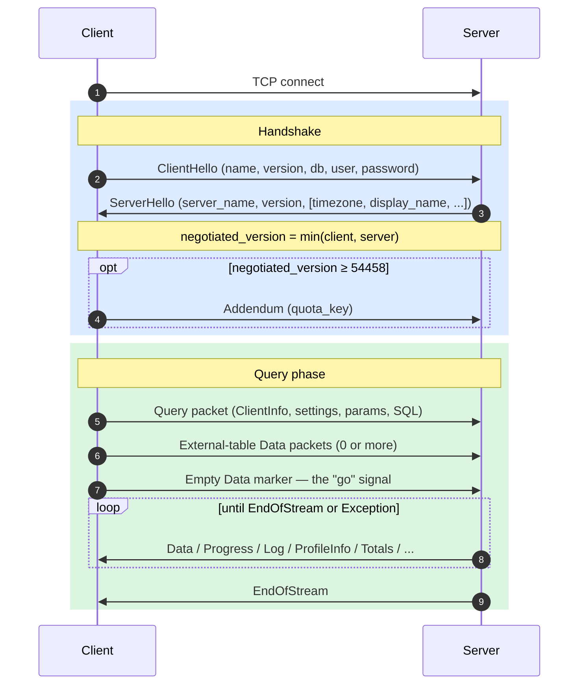
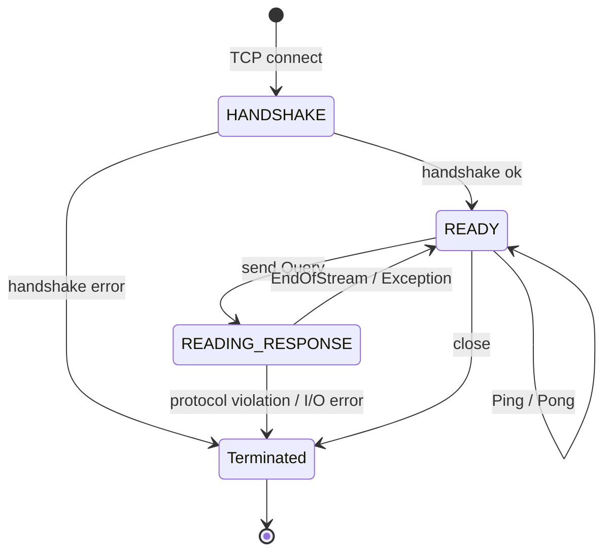
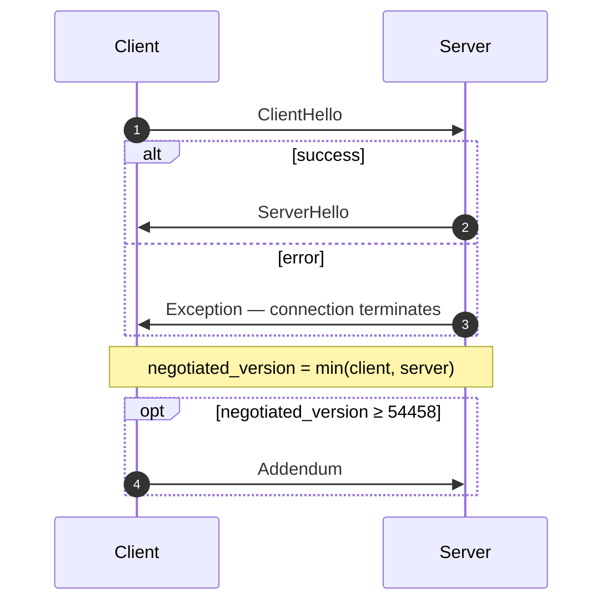
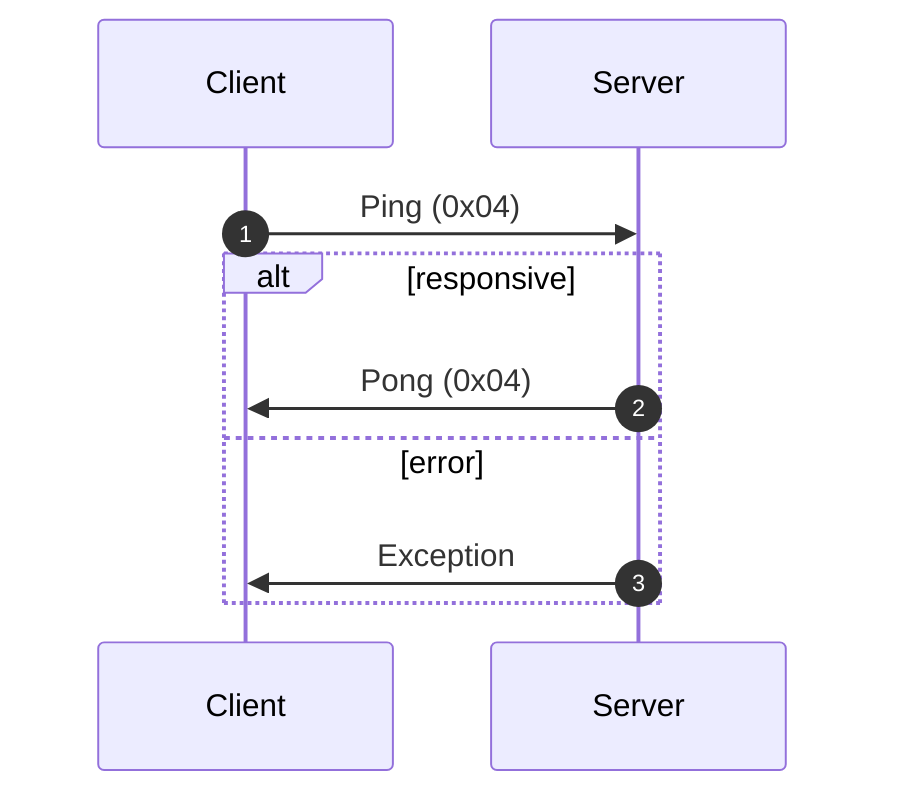
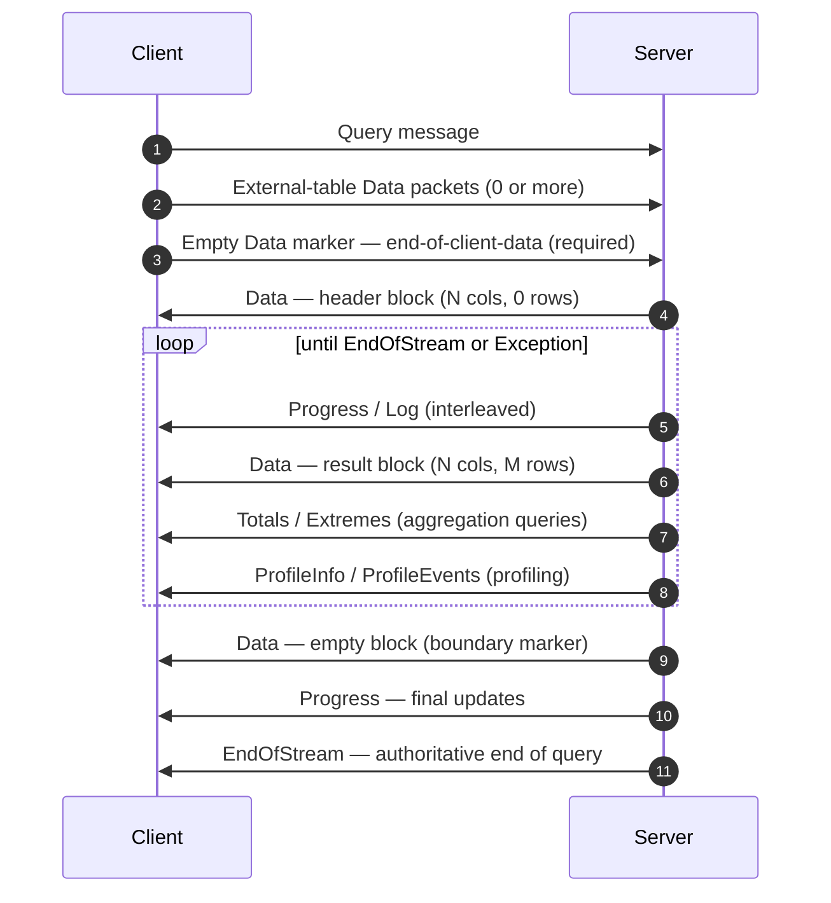
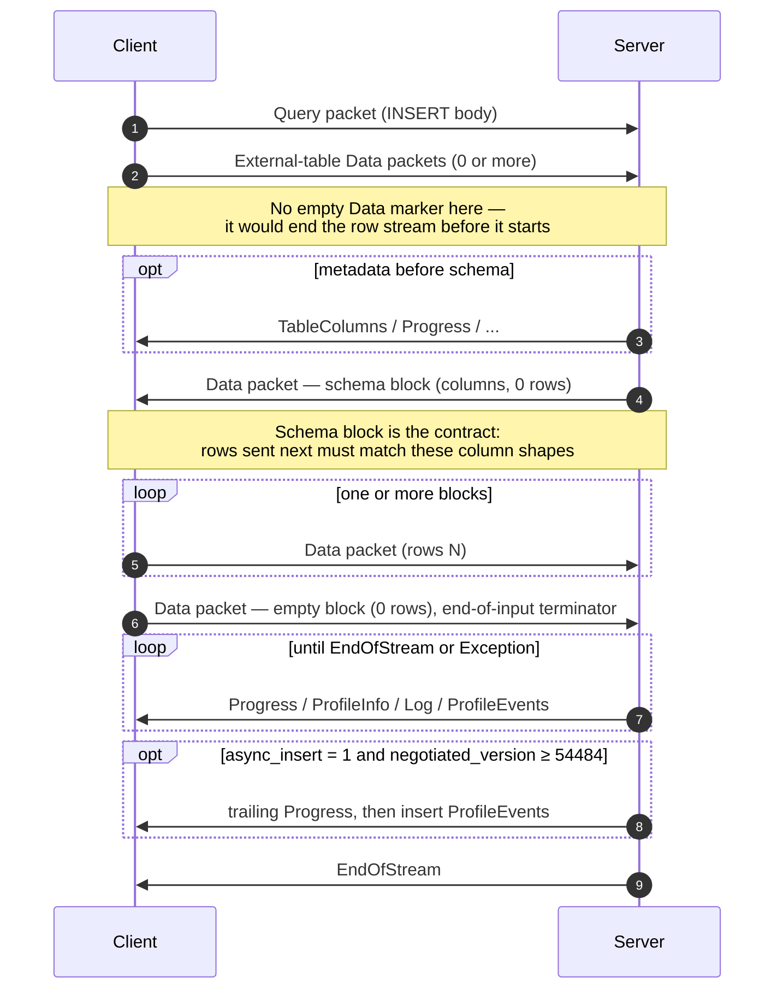
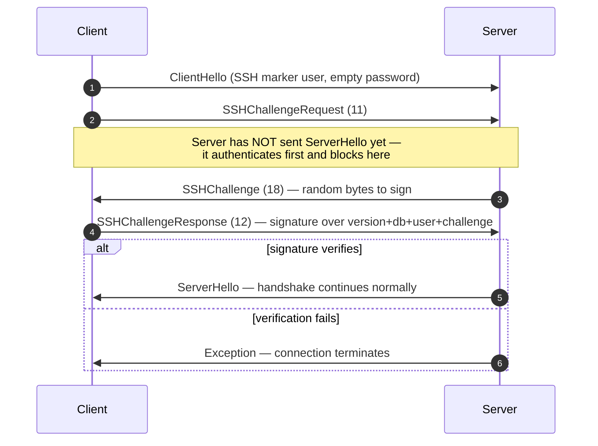

البروتوكول الأصلي هو بروتوكول ثنائي موجّه للاتصال تتخاطب عبره عملاء ClickHouse وخوادمه باستخدام TCP. وهو ينقل استعلامات SQL، وبيانات النتائج، وحمولات `INSERT`، وبيانات telemetry الخاصة بالتنفيذ، وإشارات الخطأ. وهو البروتوكول الذي يستند إليه عميل سطر الأوامر، وبرامج التشغيل الأصلية بلغة C++، ومعظم برامج التشغيل الأصلية التابعة لجهات خارجية.

تغطي هذه الصفحة البروتوكول نفسه: تأطير الحزم، وآلة حالات الاتصال، والتفاوض على الإصدار، ومحتوى كل رسالة ليست من نوع `Block`. أما البايتات داخل حزم عائلة `Data` (أي `Block`، وأعمدته، وترميزات كل نوع على حدة) فهي موضوع مستقل، موثّق في مواصفة [التنسيق الأصلي](/ar/interfaces/specs/NativeFormat).

:::note مواصفة مرافقة
تمثل هذه الصفحة أحد جزأي مواصفة مزدوجة، وتُنشر مع مواصفة [التنسيق الأصلي](/ar/interfaces/specs/NativeFormat) المرافقة. وتقسم المواصفتان العمل بوضوح: هذه الصفحة تختص بطبقة الحزم وطبقة النقل؛ أما مواصفة التنسيق الأصلي فتختص بالبايتات داخل حزم عائلة `Data`.
:::

تسري عدة خصائص على البروتوكول بأكمله. فهو ثنائي وموضعي: لا توجد وسوم للحقول إلا داخل `BlockInfo`، لذا فإن أي بايت يوضع في غير موضعه يتسبب في فقدان تزامن كل ما يليه. كما أنه ذو حالة، ويعالج كل اتصال TCP استعلامًا واحدًا في كل مرة — ولا يدعم تعدد الإرسال. أما الأعداد الصحيحة ثابتة العرض فتُشفَّر بترتيب little-endian.

<div id="overview">
  ## نظرة عامة
</div>

| الخاصية        | القيمة                                                                   |
| -------------- | ------------------------------------------------------------------------ |
| النقل          | TCP، مع إمكانية تغليفه بـ TLS                                            |
| ترتيب البايتات | little-endian للأعداد الصحيحة ذات العرض الثابت                           |
| الترميز        | ثنائي وموضعي (من دون وسوم حقول، باستثناء `BlockInfo`)                    |
| نموذج الاتصال  | ذو حالة، استعلام واحد في كل مرة، من دون تعدد الإرسال                     |
| الإصدارات      | يُتفاوض عليها عند المصافحة؛ وتُقيَّد الميزات الفردية بحسب الإصدار        |
| تنسيق البيانات | [التنسيق الأصلي](/ar/interfaces/specs/NativeFormat) لجميع البيانات الجدولية |

تبدأ كل رسالة في تنسيق النقل برمز نوع حزمة `VarUInt`، يليه جسم يعتمد شكله على هذا الرمز وعلى إصدار البروتوكول المتفَق عليه.

يمر الاتصال عبر ثلاث مراحل — مصافحة لمرة واحدة، ثم أي عدد من عمليات تبادل `Ping` أو `Query`، ثم الإغلاق:



يحمل بروتوكول TCP الأصلي دائمًا البيانات الجدولية بتنسيق Native، بغضّ النظر عن أي عبارة `FORMAT` في SQL. أمّا إعادة تنسيقها إلى `RowBinary` أو `CSV` أو `JSON` وما إلى ذلك، فتقع على عاتق العميل، وتتم بعد أن يفك ترميز كتل Native. (واجهة HTTP تمثل مسار شيفرة مختلفًا *يحترم* عبارة `FORMAT` فعلًا؛ لكن HTTP خارج نطاق هذا السياق.)

<div id="security">
  ## الأمان
</div>

<div id="transport-security">
  ### أمان النقل (TLS)
</div>

يعمل TLS في طبقة النقل، أي أسفل البروتوكول. وعند تمكينه، يُشفَّر تيار TCP بالكامل، وتبقى رسائل البروتوكول متطابقة بايتًا ببايت سواء استُخدم TLS أم لا.

<div id="authentication">
  ### المصادقة
</div>

تجري المصادقة أثناء المصافحة، ضمن رسالة [`ClientHello`](#clienthello). ويُنقل الحقلان `user` و`password` كسلاسل نصية غير مشفّرة، لذا فإن التشفير على مستوى النقل (TLS) هو ما يحمي بيانات الاعتماد أثناء انتقالها.

تتوفّر مصادقة SSH بأسلوب التحدي والاستجابة ابتداءً من إصدار البروتوكول 54466 — راجع [مصادقة SSH بأسلوب التحدي والاستجابة](#ssh-authentication).

<div id="inter-server-secret">
  ### السر بين الخوادم
</div>

في سياق التنفيذ الموزع للاستعلامات، تُصادق الخوادم بعضها على بعض عبر إثبات معرفتها بسر مشترك — من دون إرسال السر في تنسيق النقل. يحمل كل `Query` قيمة `auth_hash` بطول 32 بايت من SHA-256 في الحقل 4 من [`Query`](#query)، وتُحتسب استنادًا إلى salt وnonce والسر المُعدّ والاستعلام، ثم يعيد الخادم المستقبِل احتسابها ويقارنها. ويخضع ذلك للميزة `INTERSERVER_SECRET` ‏(v54441). يرسل العملاء الخارجيون دائمًا سلسلة فارغة هنا. راجع [المصادقة بين الخوادم](#inter-server-authentication).

<div id="versioning-and-feature-gates">
  ## إدارة الإصدارات وبوابة الميزات
</div>

<div id="version-negotiation">
  ### التفاوض على الإصدار
</div>

يُعلن كلٌّ من العميل والخادم أثناء المصافحة عن أعلى إصدار من البروتوكول يدعمانه. ويكون **الإصدار المتفق عليه** هو الأصغر بينهما:

```text
negotiated_version = min(client_version, server_version)
```

بعد ذلك، تستخدم كل رسالة الإصدار المتفق عليه لتحديد الحقول الموجودة في تنسيق النقل.

<div id="feature-gates">
  ### بوابات الميزات
</div>

تُحدَّد الميزة بإصدار البروتوكول الذي استحدثها، وتكون **نشطة** عندما يكون الإصدار المتفَق عليه أكبر من ذلك الرقم أو مساويًا له.

:::warning
عندما تكون الميزة نشطة، **يجب** أن تكون حقولها موجودة في تنسيق النقل. يعتمد البروتوكول ترتيبًا موضعيًا صارمًا، لذا فإن حذف حقل خاضع لبوابة ميزة يؤدي إلى إفساد تدفق البايتات لكل حقل يليه.
:::

<div id="feature-table">
  ### جدول الميزات
</div>

| الميزة                                                  | الإصدار | يؤثر في                          | أثره على التمثيل المنقول                                                                                                                                                                                                                                                                                                                                                                                                                                                                                                                                                                                                                                                               |
| ------------------------------------------------------- | ------- | -------------------------------- | -------------------------------------------------------------------------------------------------------------------------------------------------------------------------------------------------------------------------------------------------------------------------------------------------------------------------------------------------------------------------------------------------------------------------------------------------------------------------------------------------------------------------------------------------------------------------------------------------------------------------------------------------------------------------------------- |
| BLOCK&#95;INFO                                          | all     | Block                            | يضيف السابقة BlockInfo (`is_overflows`, `bucket_number`) إلى كل Block.                                                                                                                                                                                                                                                                                                                                                                                                                                                                                                                                                                                                                 |
| CLIENT&#95;INFO                                         | 54032   | Query                            | يضيف كتلة ClientInfo إلى body الخاص بـ Query.                                                                                                                                                                                                                                                                                                                                                                                                                                                                                                                                                                                                                                          |
| TIMEZONE                                                | 54058   | ServerHello                      | يضيف الحقل `timezone` إلى ServerHello.                                                                                                                                                                                                                                                                                                                                                                                                                                                                                                                                                                                                                                                 |
| QUOTA&#95;KEY&#95;IN&#95;CLIENT&#95;INFO                | 54060   | ClientInfo                       | يضيف الحقل `quota_key` إلى ClientInfo.                                                                                                                                                                                                                                                                                                                                                                                                                                                                                                                                                                                                                                                 |
| DISPLAY&#95;NAME                                        | 54372   | ServerHello                      | يضيف الحقل `display_name` إلى ServerHello.                                                                                                                                                                                                                                                                                                                                                                                                                                                                                                                                                                                                                                             |
| VERSION&#95;PATCH                                       | 54401   | ServerHello, ClientInfo          | يضيف الحقل `version_patch` إلى كليهما.                                                                                                                                                                                                                                                                                                                                                                                                                                                                                                                                                                                                                                                 |
| SERVER&#95;LOGS                                         | 54406   | Log                              | يرسل الخادم packets من نوع Log عند تعيين `send_logs_level`.                                                                                                                                                                                                                                                                                                                                                                                                                                                                                                                                                                                                                            |
| COLUMN&#95;DEFAULTS&#95;METADATA                        | 54410   | TableColumns                     | قد يرسل الخادم packet [`TableColumns`](#tablecolumns) (النوع 11) مع metadata القيم الافتراضية للأعمدة قبل كتلة schema الخاصة بـ INSERT/input. ولا يُرسل إلا إذا كان الإصدار المتفاوض عليه ≥ 54410 **وكان** `input_format_defaults_for_omitted_fields` مفعّلًا. وفي الإصدارات الأقدم لا يُرسل هذا packet مطلقًا؛ لذا يجب ألا تنتظره clients.                                                                                                                                                                                                                                                                                                                                            |
| WRITE&#95;CLIENT&#95;INFO                               | 54420   | Progress                         | يضيف `wrote_rows` و `wrote_bytes` إلى Progress. (رغم الاسم، فإن هذا **لا** يتحكم في إتاحة كتلة ClientInfo — فهذا هو `CLIENT_INFO` ‏(v54032).)                                                                                                                                                                                                                                                                                                                                                                                                                                                                                                                                          |
| SETTINGS&#95;SERIALIZED&#95;AS&#95;STRINGS              | 54429   | Query (ترميز settings)           | يغيّر **كيفية** ترميز قائمة settings الموجودة دائمًا؛ ولا **يتحكم** في ما إذا كانت settings تُرسل أم لا. في v54429+ يُكتب كل setting بالشكل `(name, flags, value-as-string)`؛ أما النظائر الأقدم فتكتب `(name, type-specific-binary-value)` من دون flags. انظر [Setting](#setting).                                                                                                                                                                                                                                                                                                                                                                                                    |
| INTERSERVER&#95;SECRET                                  | 54441   | Query                            | يضيف الحقل inter-server `auth_hash` إلى Query — وهو SHA-256 مملّح مشتق من secret الخاص بالعنقود، وليس secret الخام. وترسل clients الخارجية سلسلة فارغة. انظر [Inter-server authentication](#inter-server-authentication).                                                                                                                                                                                                                                                                                                                                                                                                                                                              |
| OPEN&#95;TELEMETRY                                      | 54442   | ClientInfo                       | يضيف سياق التتبّع OpenTelemetry إلى ClientInfo.                                                                                                                                                                                                                                                                                                                                                                                                                                                                                                                                                                                                                                        |
| DISTRIBUTED&#95;DEPTH                                   | 54448   | ClientInfo                       | يضيف الحقل `distributed_depth` إلى ClientInfo.                                                                                                                                                                                                                                                                                                                                                                                                                                                                                                                                                                                                                                         |
| INITIAL&#95;QUERY&#95;START&#95;TIME                    | 54449   | ClientInfo                       | يضيف الحقل `initial_time` ‏(Int64، بعرض ثابت).                                                                                                                                                                                                                                                                                                                                                                                                                                                                                                                                                                                                                                         |
| PROFILE&#95;EVENTS                                      | 54451   | ProfileEvents                    | يرسل الخادم packets من نوع ProfileEvents أثناء تنفيذ query.                                                                                                                                                                                                                                                                                                                                                                                                                                                                                                                                                                                                                            |
| PARALLEL&#95;REPLICAS                                   | 54453   | ClientInfo                       | يضيف حقول تنسيق replica المتوازية إلى ClientInfo.                                                                                                                                                                                                                                                                                                                                                                                                                                                                                                                                                                                                                                      |
| CUSTOM&#95;SERIALIZATION                                | 54454   | Block (Column)                   | يضيف البايت `has_custom_serialization` بعد سلسلة type الخاصة بكل عمود.                                                                                                                                                                                                                                                                                                                                                                                                                                                                                                                                                                                                                 |
| ADDENDUM                                                | 54458   | Handshake                        | يرسل client ملحقًا (`quota_key`) بعد تبادل handshake.                                                                                                                                                                                                                                                                                                                                                                                                                                                                                                                                                                                                                                  |
| PARAMETERS                                              | 54459   | Query                            | يضيف قائمة parameters إلى body الخاص بـ Query.                                                                                                                                                                                                                                                                                                                                                                                                                                                                                                                                                                                                                                         |
| SERVER&#95;QUERY&#95;TIME&#95;IN&#95;PROGRESS           | 54460   | Progress                         | يضيف الحقل `elapsed_ns` إلى Progress.                                                                                                                                                                                                                                                                                                                                                                                                                                                                                                                                                                                                                                                  |
| PASSWORD&#95;COMPLEXITY&#95;RULES                       | 54461   | ServerHello                      | يضيف إلى ServerHello قائمة بأنماط regex الخاصة بسياسة password ورسائل human-readable.                                                                                                                                                                                                                                                                                                                                                                                                                                                                                                                                                                                                  |
| INTERSERVER&#95;SECRET&#95;V2                           | 54462   | ServerHello                      | يضيف قيمة nonce بطول 8 بايت من نوع `UInt64` إلى ServerHello. وتُستخدم لتوقيع query بين الخوادم؛ أما clients الخارجية فتفك ترميزها وتتجاهلها.                                                                                                                                                                                                                                                                                                                                                                                                                                                                                                                                           |
| TOTAL&#95;BYTES&#95;IN&#95;PROGRESS                     | 54463   | Progress                         | يضيف الحقل `total_bytes_to_read` ‏(VarUInt) إلى Progress، بين `total_rows` و `wrote_rows`.                                                                                                                                                                                                                                                                                                                                                                                                                                                                                                                                                                                             |
| TIMEZONE&#95;UPDATES                                    | 54464   | TimezoneUpdate                   | يضيف packet الخادم `TimezoneUpdate` ‏(النوع 17). الـ body: قيمة `String` واحدة تحمل session timezone. ولا يُرسل إلا من مُهيّئ table function `input`، مباشرة بعد كتلة input-schema، لكي يفسّر client الصفوف التي يرسلها باستخدام `session_timezone` الخاصة بالخادم. انظر [TimezoneUpdate](#timezoneupdate).                                                                                                                                                                                                                                                                                                                                                                            |
| SPARSE&#95;SERIALIZATION                                | 54465   | Block (Column)                   | قد يضبط الخادم `has_custom_serialization = 1` ويرسل عمودًا مُرمّزًا sparse. تنسيق wire: نوع بطول 1 بايت (0x01 = SPARSE)، ثم تدفق offset من نوع VarUInt منتهي بـ EOG، ثم القيم غير الافتراضية مرمّزة بكثافة في النوع الداخلي. انظر [kind&#95;stack and sparse encoding](/ar/interfaces/specs/NativeFormat#kind-stack-and-sparse-encoding).                                                                                                                                                                                                                                                                                                                                                 |
| SSH&#95;AUTHENTICATION                                  | 54466   | Auth flow                        | يضيف authentication بأسلوب challenge-response عبر SSH. وهذا اشتراك اختياري: يرسل client قيمة `user` بالشكل `" SSH KEY AUTHENTICATION " + <real_user>` مع password فارغ لتفعيله. انظر [SSH challenge-response authentication](#ssh-authentication).                                                                                                                                                                                                                                                                                                                                                                                                                                     |
| TABLE&#95;READ&#95;ONLY&#95;CHECK                       | 54467   | TablesStatusResponse             | يضيف العلامة `is_readonly` إلى صف كل table في TablesStatusResponse. أما clients الخارجية التي لا تُصدر `TablesStatusRequest` فلن ترى أي تغيير في wire.                                                                                                                                                                                                                                                                                                                                                                                                                                                                                                                                 |
| SYSTEM&#95;KEYWORDS&#95;TABLE                           | 54468   | system tables                    | يملأ الخادم `system.keywords` لكي يتمكن `clickhouse-client` القياسي من الإكمال التلقائي لـ keywords. ولا يوجد أي تغيير في wire الخاص بـ native protocol.                                                                                                                                                                                                                                                                                                                                                                                                                                                                                                                               |
| ROWS&#95;BEFORE&#95;AGGREGATION                         | 54469   | ProfileInfo                      | يضيف `applied_aggregation` ‏(Bool) و `rows_before_aggregation` ‏(VarUInt) إلى ProfileInfo، بهذا الترتيب في النهاية.                                                                                                                                                                                                                                                                                                                                                                                                                                                                                                                                                                    |
| CHUNKED&#95;PROTOCOL                                    | 54470   | Connection framing               | يغلّف تأطير chunk لكل packet كل body خاص بـ packet. وتتم المفاوضة عليه في Addendum. ويحمل ServerHello تفضيل الخادم لكل اتجاه، بينما يحمل Addendum اختيار client النهائي. انظر [chunked framing](#chunked-framing).                                                                                                                                                                                                                                                                                                                                                                                                                                                                     |
| VERSIONED&#95;PARALLEL&#95;REPLICAS&#95;PROTOCOL        | 54471   | ServerHello, Addendum            | يتبادل الطرفان إصدار بروتوكول تنسيق النسخ المتماثلة المتوازية من نوع `VarUInt`. يقع حقل ServerHello **مباشرة بعد `protocol_version`** (قبل `timezone`). ويُلحَق حقل Addendum بعد سلاسل البروتوكول المُجزّأ. القيمة الحالية: `8` (`DBMS_PARALLEL_REPLICAS_PROTOCOL_VERSION`). يضيف الإصدار `8` [`MergeTreeAllRangesAnnouncementResponse`](#mergetreeallrangesannouncementresponse) (حزمة client `14`): عندما يكون إصدار النسخ المتماثلة المتوازية المتفاوض عليه `≥ 8`، يردّ المُبادِر على كل announcement من follower ليس في وضع `Default` بقائمة الأجزاء المعتمدة لذلك stream، وينتظرها الـ follower قبل إصدار طلبات القراءة. أمّا دون `8`، فيكون announcement من نوع fire-and-forget. |
| INTERSERVER&#95;EXTERNALLY&#95;GRANTED&#95;ROLES        | 54472   | Query                            | يضيف الحقل `String external_roles` إلى body الخاص بـ Query، بين مُنهِي settings وتجزئة السر interserver. ترسل clients الخارجية قائمة Role فارغة (بايتًا واحدًا `0x00`، أي VarUInt 0 داخل غلاف String).                                                                                                                                                                                                                                                                                                                                                                                                                                                                                 |
| V2&#95;DYNAMIC&#95;AND&#95;JSON&#95;SERIALIZATION       | 54473   | Column body                      | قد يُصدر server تمثيل V2 التسلسلي لأنواع column `Dynamic` و`JSON` — وهذا يحدد إصدار `state_prefix` الذي تستخدمه. راجع [versioned types](/ar/interfaces/specs/NativeFormat#versioned-types).                                                                                                                                                                                                                                                                                                                                                                                                                                                                                               |
| SERVER&#95;SETTINGS                                     | 54474   | ServerHello                      | يبث server إعداداته غير الافتراضية كقائمة في ذيل ServerHello، بعد `nonce`. التنسيق: ثلاثيات `(key, flags, value)` تنتهي بمفتاح فارغ — تمامًا مثل قائمة settings في Query packet.                                                                                                                                                                                                                                                                                                                                                                                                                                                                                                       |
| QUERY&#95;AND&#95;LINE&#95;NUMBERS                      | 54475   | ClientInfo                       | يضيف `script_query_number` (VarUInt) و`script_line_number` (VarUInt) في ذيل ClientInfo. يُستخدم بواسطة clickhouse-client لإسناد أخطاء البرنامج النصي متعدد العبارات؛ وترسل clients الخارجية `0, 0`.                                                                                                                                                                                                                                                                                                                                                                                                                                                                                    |
| JWT&#95;IN&#95;INTERSERVER                              | 54476   | ClientInfo                       | يضيف مؤشر وجود JWT من نوع UInt8 مع `String jwt` اختياري في ذيل ClientInfo. ترسل clients الخارجية (من دون JWT) البايت `0x00`. (يُكتب `DBMS_MIN_REVISON_WITH_JWT_IN_INTERSERVER` في C++ — لاحظ الخطأ الإملائي في اسم الثابت.)                                                                                                                                                                                                                                                                                                                                                                                                                                                            |
| QUERY&#95;PLAN&#95;SERIALIZATION                        | 54477   | ServerHello, QueryPlan packet    | يُلحِق ServerHello الحقل `VarUInt query_plan_serialization_version` بعد إعدادات server. كما يقدّم `ClientPacket::QueryPlan` (الرمز `13`) لإرسال خطط query المُنشأة مسبقًا بين الخوادم — ولا ترسلها clients الخارجية مطلقًا.                                                                                                                                                                                                                                                                                                                                                                                                                                                            |
| PARALLEL&#95;BLOCK&#95;MARSHALLING                      | 54478   | Block (Column)                   | قد يغلّف server الأعمدة داخل `ColumnBLOB` (مضغوطًا inline) للمعالجة المتوازية. ويُشترط لذلك أن تكون Compression مفعّلة في query وأن `rows > 1`؛ وإلا فيُستخدم wire format المعتاد للعمود. لا ترى clients التي لا تفعّل Compression مطلقًا في Query packets الصادرة أي تغيير في wire.                                                                                                                                                                                                                                                                                                                                                                                                   |
| VERSIONED&#95;CLUSTER&#95;FUNCTION&#95;PROTOCOL         | 54479   | ServerHello                      | يضيف `VarUInt cluster_function_protocol_version` في ذيل ServerHello. يُستخدم مع دوال table `*Cluster` (`s3Cluster`، إلخ). القيمة الحالية: `8` (`DBMS_CLUSTER_PROCESSING_PROTOCOL_VERSION`)؛ الإصدار `7` محجوز لميزة في مستودع خاص (ضغط Iceberg)، ويضيف `8` قيمة `read_source_index` اختيارية إلى حمولة مهمة قراءة cluster بين الخوادم (body الخاص بـ `ReadTaskResponse`، الذي يبقى غير محدد هنا — انظر أدناه). تقوم clients الخارجية بفك الترميز وتجاهله.                                                                                                                                                                                                                              |
| OUT&#95;OF&#95;ORDER&#95;BUCKETS&#95;IN&#95;AGGREGATION | 54480   | BlockInfo                        | يضيف الحقل 3 (`out_of_order_buckets: Vec<Int32>`) إلى stream الموسوم بالحقول في BlockInfo. يُفك ترميزه على الشكل `[VarUInt count][Int32]*count`. لا تُصدر clients الخارجية هذا بنفسها؛ ويقرأ مفكّك الترميز أي قائمة غير فارغة يرسلها server.                                                                                                                                                                                                                                                                                                                                                                                                                                           |
| COMPRESSED&#95;LOGS&#95;PROFILE&#95;EVENTS&#95;COLUMNS  | 54481   | Log, ProfileEvents, TableColumns | قد يغلّف server أجسام حزم [`Log`](#log) و[`ProfileEvents`](#profileevents) و[`TableColumns`](#tablecolumns) داخل [compression frame](/ar/interfaces/specs/NativeFormat#compression-frame). في هذا الإصدار تمر الأجسام الثلاثة كلها عبر مسار إخراج واحد اختياري الضغط، ولا تتحول إلى compression frame فعلي إلا عندما تكون قيمة `compression = true` في query. لا ترى clients التي لا تفعّل Compression مطلقًا في Query packets الصادرة أي تغيير في wire.                                                                                                                                                                                                                                  |
| REPLICATED&#95;SERIALIZATION                            | 54482   | Block (Column)                   | قد يُصدر server أعمدة مع kind&#95;stack `0x04 = REPLICATED` — وهو شكل compact على نمط القاموس للقيم المتكررة — راجع [kind&#95;stack and sparse encoding](/ar/interfaces/specs/NativeFormat#kind-stack-and-sparse-encoding). دون هذا الإصدار، كان الكاتب يوسّع هذه الأعمدة قبل إرسالها. يتم فك الترميز عبر lookup في الفهرس (`elements[indexes[i]]` لكل row)؛ مع دعم الأنواع الورقية بالإضافة إلى البنى الداخلية لـ `Nullable` و`Array` و`Tuple` و`Map` و`Nested` و`LowCardinality`.                                                                                                                                                                                                       |
| NULLABLE&#95;SPARSE&#95;SERIALIZATION                   | 54483   | Block (Column)                   | يجمع التمثيل التسلسلي sparse مع `Nullable(T)`. دون هذا الإصدار، كان الكاتب يوسّع sparse لأعمدة Nullable قبل الإرسال؛ أما في v54483+ فتصبح بيانات wire من نوع sparse-over-Nullable. راجع [kind&#95;stack and sparse encoding](/ar/interfaces/specs/NativeFormat#kind-stack-and-sparse-encoding).                                                                                                                                                                                                                                                                                                                                                                                           |
| PROGRESS&#95;IN&#95;ASYNC&#95;INSERT                    | 54484   | Progress (INSERT)                | في عملية INSERT **غير متزامنة** (`async_insert = 1`)، وبعد تفريغ insert، يرسل server حزمة [`Progress`](#progress) إضافية، ثم `ProfileEvents` الخاصة بالـ insert، قبل `EndOfStream`. ويُشترط لذلك أن يكون الإصدار *المتفاوض عليه* ≥ 54484؛ ودون هذا الإصدار يحذف server حزمة Progress الختامية هذه. لا يتغير wire format الخاص بـ Progress — الجديد فقط هو الإرسال. عمليًا، تحمل الزيادة الزمن المنقضي؛ بينما يُبلَّغ عن عدادات rows المكتوبة عبر ProfileEvents المصاحبة. ولا يحتاج client الذي يستنزف بالفعل حزم Progress المتداخلة إلى أي تغيير في التنسيق، وإنما فقط إلى تقبّل حزمة إضافية واحدة.                                                                                    |
| CLIENT&#95;AGENT&#95;IN&#95;CLIENT&#95;INFO             | 54485   | ClientInfo                       | يضيف `client_agent` من النوع `String` في ذيل ClientInfo. يكتشف client القياسي تلقائيًا معرّف agent من بيئته (مثل `claude-code` أو `cursor` أو `gemini-cli` أو قيمة المتغير `AGENT`)؛ أما client الخارجي الذي لا يكتشف شيئًا فيرسل سلسلة فارغة. ويصبح ذلك مطلوبًا عندما يكون الإصدار المتفاوض عليه ≥ 54485 — لأن حذفه يؤدي إلى اختلال مزامنة بقية Query packet.                                                                                                                                                                                                                                                                                                                         |
| INTERNAL&#95;QUERY&#95;FLAG                             | 54486   | ClientInfo                       | يضيف `is_internal` من النوع `UInt8` في ذيل ClientInfo. تكون قيمته `1` للـ query الداخلية في server (غير الصادرة عن مستخدم)، وتُنقل إلى queries البعيدة لكي تُوسَم rows الخاصة بها في `system.query_log` بأنها داخلية؛ وترسل clients الخارجية `0`. ويصبح ذلك مطلوبًا عندما يكون الإصدار المتفاوض عليه ≥ 54486 — لأن حذفه يؤدي إلى اختلال مزامنة بقية Query packet.                                                                                                                                                                                                                                                                                                                      |

<div id="packet-envelope">
  ## غلاف الحزمة
</div>

تشترك جميع الرسائل في تنسيق النقل في البنية الخارجية نفسها، في كلا الاتجاهين:

```text
[VarUInt: packet_type_code]    always encoded as VarUInt
[message body]                 format depends on packet_type_code
```

ترد جداول أنواع الحزم الكاملة في [مرجع أنواع الحزم](#packet-type-reference).

نوع الحزمة هو `VarUInt`، وليس بايتًا ثابت العرض. بالنسبة إلى القيم الأقل من 128، ينتج `VarUInt` البايت المفرد نفسه، لكن يجب على التطبيقات استخدام ترميز `VarUInt` لكي تظل متوافقة إذا وصلت أنواع الحزم مستقبلًا إلى 128 أو أكثر.

يوثّق [مرجع الرسائل](#message-reference) **محتوى** كل حزمة فقط — أي البايتات التي تأتي بعد رمز نوع الحزمة. يبدأ ترقيم الحقول من 1 مع أول حقل في المحتوى.

<div id="chunked-framing">
  ### التأطير المُجزّأ (v54470+)
</div>

عندما **يُتفاوض** على ميزة `CHUNKED_PROTOCOL` (راجع [المصافحة](#handshake-phase))، تُغلَّف كل حزمة في تنسيق النقل بتأطير مُجزّأ. ويكون هذا التغليف **منفصلًا لكل اتجاه**: client→server و server→client يُتفاوض عليهما كلٌّ على حدة، وقد ينتهي الأمر بهما إلى وضعين مختلفين (مُجزّأ مقابل غير مؤطَّر).

بنية تنسيق النقل لكل حزمة:

```text
<chunk>...   one or more chunks; their payloads concatenated form the whole packet
[u32 LE = 0] zero-size terminator marking end of packet
```

تخطيط wire لكل chunk:

```text
[u32 LE: chunk_size]   chunk_size in [1, UINT32_MAX]
[chunk_size bytes]     packet bytes (see note below)
```

حقل نوع الحزمة `VarUInt` يقع **داخل** الدفق المُجزّأ: فهو البايت الأول من حمولة الحزمة (أول بايت من أول chunk)، وليس بايتًا منفصلًا يُرسَل قبل التأطير. حمولة chunk لكل حزمة هي الصيغة الكاملة `[VarUInt packet_type_code][message body]` من [غلاف الحزمة](#packet-envelope). وأي client يترك نوع الحزمة خارج الدفق المُجزّأ سيجعل الـ peer يقرأ بايت النوع هذا على أنه البايت الأول من حجم chunk من نوع `u32`، مما يؤدي إلى فقدان تزامن الاتصال.

قد تُقسَّم الحزمة الواحدة إلى عدة chunks إذا امتلأ مخزن الكاتب المؤقت في منتصف الحزمة؛ ويمكن أن يقع هذا التقسيم في أي موضع، بما في ذلك داخل `VarUInt` الخاص بنوع الحزمة. يقوم القارئ بضم حمولات الـ chunks ويتعامل مع الصفر الختامي ذي 4 بايتات على أنه حدّ حزمة شفاف — أي يستهلكه، لكنه لا يمرّره إلى الجهة التي تقرأ أجسام الحزم.

تظل الحزم بلا جسم مُغلَّفة أيضًا: فالحزمة ذات البايت الواحد مثل `Ping` أو `Pong` تصبح `[u32 size = 1][0x04][u32 0]` بمجرد التفاوض على استخدام chunking. وأي وصف من نوع &quot;بايت واحد في تنسيق النقل&quot; في موضع آخر من هذه الصفحة يشير إلى الصيغة السابقة على الـ chunking.

**التفاوض.** يحمل كل من ServerHello وAddendum حقلي `String`، واحدًا لكل اتجاه، بقيم مأخوذة من `{"chunked", "notchunked", "chunked_optional", "notchunked_optional"}`:

* القيمتان `chunked` / `notchunked` صارمتان: إذ يتطلب ذلك الجانب هذا الوضع تحديدًا.
* متغيرات `_optional` مرنة: فهي تقبل أي وضع يختاره الجانب الآخر.

تُحسَب القيمة المتفق عليها لكل اتجاه على أساس كل زوج على حدة:

| تفضيل Server      | تفضيل Client      | المتفق عليه                                         |
| ----------------- | ----------------- | --------------------------------------------------- |
| `*_optional`      | أي شيء            | اتبع CLIENT (أي `starts_with("chunked")` الخاصة به) |
| أي شيء            | `*_optional`      | اتبع SERVER                                         |
| `chunked` صارم    | `chunked` صارم    | `chunked`                                           |
| `notchunked` صارم | `notchunked` صارم | `notchunked`                                        |
| عدم تطابق صارم    | عدم تطابق صارم    | **خطأ في البروتوكول** — يجب قطع الاتصال             |

على جانب client، يُجرى التفاوض بين تفضيل SEND الخاص بالـ client وتفضيل RECV الخاص بالـ server، والعكس صحيح.

**التوقيت.** تنتقل سلاسل التفاوض عبر القناة غير المؤطرة: ClientHello → ServerHello (تفضيلات server) → Addendum (القيم التي تفاوض عليها client). ويُطبَّق التحول إلى التأطير على كل بايت يُرسَل *بعد* flush لـ Addendum. أما Addendum نفسه وClientHello وServerHello فتظل دائمًا غير مؤطرة.

<div id="connection-lifecycle">
  ## دورة حياة الاتصال
</div>

في أي لحظة، يكون الاتصال في حالة واحدة فقط من أربع حالات: `HANDSHAKE` أو `READY` أو `READING_RESPONSE` أو منتهيًا. ولأن البروتوكول لا يدعم تعدد الإرسال، فإن العميل الذي يرسل طلبًا جديدًا قبل استكمال قراءة الاستجابة السابقة يؤدي إلى تداخل البايتات في تنسيق النقل ويُفسد التدفق.

<div id="states">
  ### الحالات
</div>



يمتدّ المسار الاعتيادي مباشرةً إلى الأسفل — `HANDSHAKE → READY → READING_RESPONSE → READY` — مع الحلقة الذاتية `Ping`/`Pong`، فيما تنتهي جميع حواف الفشل إلى نقطة النهاية الوحيدة `Terminated`.

| الحالة             | الوصف                                                                                                                                                                                                                |
| ------------------ | -------------------------------------------------------------------------------------------------------------------------------------------------------------------------------------------------------------------- |
| `HANDSHAKE`        | الحالة الأولية بعد فتح اتصال TCP. لا تكون إلا رسائل [المصافحة](#handshake-phase) صالحة في هذه الحالة. وتنتقل إلى `READY` عند النجاح أو تنتهي عند الفشل.                                                              |
| `READY`            | خامل. يمكن للعميل إرسال [Ping](#ping-phase) أو [استعلام](#query-phase) أو إغلاق الاتصال. وقد يظل الاتصال في `READY` إلى أجل غير مسمى (مع مراعاة `idle_connection_timeout`، راجع [حدود الاتصال](#connection-limits)). |
| `READING_RESPONSE` | تُدخَل هذه الحالة عندما يرسل العميل استعلامًا. يجب على العميل استهلاك دفق استجابة الخادم بالكامل قبل العودة إلى `READY`. وحزمة العميل→الخادم الوحيدة المسموح بها هنا هي Cancel (غير موضحة في هذه الصفحة).            |
| Terminated         | لم يعد صالحًا للاستخدام. يجب على العميل فتح اتصال TCP جديد وإعادة بدء المصافحة.                                                                                                                                      |

<div id="handshake-phase">
  ### مرحلة المصافحة
</div>

تتم فيها المصادقة والتفاوض على إصدار البروتوكول. تحدث مرة واحدة فقط لكل اتصال، قبل أي شيء آخر.

يكون اتصال TCP قد فُتح للتو، ولم تُتبادل أي رسائل بعد. التسلسل:



1. يرسل العميل [`ClientHello`](#clienthello) مع أعلى إصدار بروتوكول يدعمه.

2. يقرأ العميل الاستجابة ويتعامل معها بحسب نوع الحزمة:

   | نوع الحزمة      | الإجراء                                                                                                                  |
   | --------------- | ------------------------------------------------------------------------------------------------------------------------ |
   | `Hello` (0)     | فكّ ترميز [`ServerHello`](#serverhello). احسب `negotiated_version = min(client_ver, server_ver)`. ثم انتقل إلى الخطوة 3. |
   | `Exception` (2) | فكّ ترميز [`Exception`](#exception). أعده كخطأ وأنهِ الاتصال.                                                            |
   | أي شيء آخر      | مخالفة للبروتوكول. أنهِ الاتصال.                                                                                         |

3. إذا كان `negotiated_version ≥ 54458` (ميزة `ADDENDUM`)، يرسل العميل [`Addendum`](#addendum). يستند هذا القرار إلى الإصدار **المتفق عليه**، لا إلى الإصدار الذي أعلنه العميل.

عند النجاح، ينتقل الاتصال إلى `READY`؛ وعند حدوث أي خطأ، يُنهى الاتصال.

<div id="ping-phase">
  ### مرحلة Ping
</div>

تحقّق من الحيوية على مستوى التطبيق، وهو مستقل عن `TCP keepalive`. تؤكد دورة Ping/Pong الناجحة ذهابًا وإيابًا أن اتصال TCP حيّ في كلا الاتجاهين وأن الخادم يستجيب. وPing عديم الحالة وغير مرتبط بأي استعلام، لذا فإن عمليات Ping المتعاقبة المتعددة مستقلة.

بدءًا من `READY`، يكون التدفق كما يلي:



1. يرسل العميل [`Ping`](#ping).
2. يقرأ العميل الرد:

   | نوع الحزمة      | الإجراء                                            |
   | --------------- | -------------------------------------------------- |
   | `Pong` (4)      | تم تأكيد أن الاتصال ما يزال حيًا. عُد إلى `READY`. |
   | `Exception` (2) | فك ترميز [`Exception`](#exception) وأرجِعه كخطأ.   |
   | أي شيء آخر      | مخالفة للبروتوكول.                                 |

<div id="query-phase">
  ### مرحلة الاستعلام
</div>

يرسل العميل تعليمة SQL؛ ويعيد الخادم كتل النتائج وبيانات القياس عن بُعد الخاصة بالتنفيذ على شكل تدفّق. والاستجابة عبارة عن تسلسل من الحزم ينتهي بـ `EndOfStream` واحد فقط أو `Exception`.

اعتبارًا من `جاهز`، يكون التدفق كما يلي:



عند حدوث خطأ في أي نقطة، يرسل الخادم `Exception` بدلًا من `EndOfStream`، مما ينهي الاستعلام.

1. يرسل العميل [`Query`](#query) مع `query_id` فريد (ويكون عادةً معرّف UUID).
2. يرسل العميل أي جداول خارجية، ثم وسم Data فارغًا. تحتوي حزمة Data الفارغة على `table_name = ""` و`num_columns = 0` و`num_rows = 0`. ولا يبدأ الخادم تنفيذ الاستعلام حتى يتلقى هذا الوسم.
3. ينتقل العميل إلى `READING_RESPONSE` ويُفرّغ مخزن الكتابة المؤقت.
4. يقرأ العميل حزم الاستجابة ضمن حلقة، مع المعالجة حسب النوع:

   | Packet type          | Action                                                                                                                                                                          |
   | -------------------- | ------------------------------------------------------------------------------------------------------------------------------------------------------------------------------- |
   | `Data` (1)           | فك ترميز الكتلة. تكون أول Data هي ترويسة المخطط؛ أما اللاحقة فهي كتل نتائج (تُجمَّع)؛ وتمثل الكتلة الفارغة وسمًا فاصلًا. لا يعني `num_rows == 0` **أنها ليست** نهاية الاستعلام. |
   | `Progress` (3)       | مقاييس التنفيذ. كل حزمة تمثل **زيادة** منذ الحزمة السابقة — تُجمَّع محليًا.                                                                                                     |
   | `EndOfStream` (5)    | اكتمل الاستعلام. اخرج من الحلقة وعُد إلى `جاهز`.                                                                                                                               |
   | `ProfileInfo` (6)    | بيانات profiling بعد التنفيذ.                                                                                                                                                   |
   | `Totals` (7)         | كتلة إجماليات aggregation (بنفس wire format الخاص بـ Data).                                                                                                                     |
   | `Extremes` (8)       | كتلة القيم الصغرى/العظمى (بنفس wire format الخاص بـ Data).                                                                                                                      |
   | `Log` (10)           | سطر من server log.                                                                                                                                                              |
   | `TableColumns` (11)  | metadata القيم الافتراضية للأعمدة.                                                                                                                                              |
   | `ProfileEvents` (14) | عدادات الأداء.                                                                                                                                                                  |
   | `Exception` (2)      | فك الترميز ثم إرجاعه كخطأ. اخرج من الحلقة وعُد إلى `جاهز`.                                                                                                                     |
   | anything else        | غير متوقع أثناء مرحلة Query. أنهِ الاتصال.                                                                                                                                      |

عند `EndOfStream` أو `Exception` تمت معالجته، يعود الاتصال إلى `جاهز`. أما protocol violation أو خطأ I/O فينهيان الاتصال.

:::note
تربك حالة `num_rows == 0` التطبيقات الجديدة. فالكتلة ذات صفر صفوف هي وسم فاصل أو ترويسة مخطط، وليست إشارة إلى نهاية الدفق. ولا يُنهي الاستجابة إلا `EndOfStream` أو `Exception`.
:::

<div id="insert-phase">
  ### مرحلة INSERT
</div>

مرحلة INSERT هي [مرحلة الاستعلام](#query-phase) مع تبادلين إضافيين. يرسل العميل تعليمة `INSERT`؛ ويردّ الخادم بـ **كتلة مخطط** تصف الجدول الهدف؛ ثم يرسل العميل حزم Data التي تحتوي على الصفوف، ثم وسم Data الفارغ؛ ويختتم الخادم بـ `EndOfStream` أو `Exception`.

بدءًا من `جاهز`، تكون SQL تعليمة `INSERT` بالشكل `INSERT INTO <table> [(<cols>)] VALUES` — من دون قيمة حرفية مضمّنة من الشكل `VALUES (...)`، لأن بيانات الصفوف تتدفّق عبر حزم Data. التدفق:



1. يرسل العميل [`Query`](#query) مع ضبط `body` على عبارة INSERT في SQL.
2. يرسل العميل أي جداول خارجية، وإن كان ذلك نادرًا مع INSERT. وعلى خلاف [مرحلة الاستعلام](#query-phase)، فهو **لا** يرسل هنا وسم Data فارغًا. تُرسَل حزمة `INSERT` `Query` مع وجود بيانات قيد الإرسال، لذلك يُؤجَّل بلوك نهاية البيانات الفارغ إلى الخطوة 5؛ لأن إرساله قبل كتلة المخطط سيجعل الخادم يقرأه على أنه نهاية تدفّق الصفوف، فيُنهي INSERT من دون أي صفوف، ثم يفسّر أول حزمة صفوف فعلية على أنها حزمة شاردة من المستوى الأعلى.
3. يستهلك العميل حزم البيانات الوصفية (TableColumns و Progress و ProfileInfo و Log و ProfileEvents) إلى أن يقرأ حزمة schema Data — وهي كتلة تحتوي على 0 صفوف لكنه يتضمن البنية الكاملة للأعمدة (الأسماء والأنواع). ويمثّل كتلة المخطط العقد الذي يجب أن تلتزم به الصفوف التي سيرسلها العميل لاحقًا، أي أن تطابق أشكال هذه الأعمدة.
4. يرسل العميل بلوك بيانات واحدًا أو أكثر. ولكل بلوك يكتب `VarUInt(ClientPacket::Data = 2)`، ثم `String("")` لاسم الجدول الخارجي الفارغ، ثم الـ كتلة. ويجب أن تتوافق أنواع الأعمدة مع أعمدة كتلة المخطط بحسب الترتيب.
5. يرسل العميل محدِّد نهاية الإدخال: حزمة Data تحتوي على كتلة فارغة (0 أعمدة، 0 صفوف).
6. يستهلك العميل تدفّق الاستجابة إلى أن يصل إلى `EndOfStream` (نجاح) أو `Exception` (فشل).

**INSERT غير المتزامن (v54484+).** عندما يتضمن الاستعلام `async_insert = 1`، يضع الخادم الصفوف في قائمة انتظار ويجري flush لها كجزء من batch. وعند الإصدار المتفاوض عليه ≥ 54484 (`PROGRESS_IN_ASYNC_INSERT`)، ما إن يكتمل الـ flush حتى يصدر الخادم حزمة [`Progress`](#progress) إضافية، تتبعها مباشرة `ProfileEvents` الخاصة بعملية insert، ثم `EndOfStream`. أما في الإصدارات الأقدم من 54484، فيتخطى الخادم حزمة Progress الختامية. وهذه الحزمة هي `Progress` عادية؛ ولأن الخادم يعيد تعيين query pipeline قبل تجميع counts الخاصة بالكتابة، فإن الزيادة لا تحمل عمليًا إلا الوقت المنقضي، بينما تصل إحصاءات الصفوف والبايتات المكتوبة إلى العميل عبر `ProfileEvents` المصاحبة. ولا يحتاج العميل الذي يستهلك بالفعل حزم Progress المتداخلة في الخطوة 6 إلا إلى قبول حزمة إضافية واحدة.

يعود الاتصال إلى `جاهز` عند `EndOfStream` أو عند `Exception` تمت معالجته. أما مخالفات protocol وأخطاء I/O فتؤدي إلى إنهائه.

<div id="message-reference">
  ## مرجع الرسائل
</div>

تُسرد الحقول وفق wire order. ويستخدم العمود `Type` ما يلي:

* `VarUInt` — عدد صحيح غير موقّع بطول متغيّر (راجع [VarUInt](/ar/interfaces/specs/NativeFormat#varuint)).
* `String` — بايتات يسبقها `VarUInt` (راجع [String](/ar/interfaces/specs/NativeFormat#string)).
* `UInt8` و`Int32` وما إلى ذلك — أعداد صحيحة ثابتة العرض بترتيب little-endian.
* `Bool` — بايت واحد، `0x00` أو `0x01`.

يوضّح العمود `Role` الجهة التي تستخدم كل حقل:

* **client** — يحدّده العملاء الخارجيون.
* **inter-server** — لا يكون ذا معنى إلا في الاتصال بين الخوادم؛ ويكتب العملاء الخارجيون قيمة افتراضية.
* **universal** — يستخدمه الطرفان.

توثّق هذه الجداول body كل حزمة فقط، بعد رمز نوع الحزمة.

<div id="clienthello">
  ### ClientHello (نوع الحزمة 0)
</div>

العميل → الخادم. أول رسالة بعد فتح اتصال TCP.

| # | Field                | Type    | Role      | Description                              |
| - | -------------------- | ------- | --------- | ---------------------------------------- |
| 1 | client&#95;name      | String  | universal | معرّف العميل (مثل `"clickhouse-client"`) |
| 2 | version&#95;major    | VarUInt | universal | الإصدار الرئيسي للعميل                   |
| 3 | version&#95;minor    | VarUInt | universal | الإصدار الثانوي للعميل                   |
| 4 | protocol&#95;version | VarUInt | universal | أعلى إصدار من البروتوكول يدعمه العميل    |
| 5 | database             | String  | universal | اسم قاعدة البيانات الافتراضية            |
| 6 | user                 | String  | universal | اسم المستخدم للمصادقة                    |
| 7 | password             | String  | universal | كلمة المرور (بنص عادي)                   |

<div id="serverhello">
  ### ServerHello (نوع الحزمة 0)
</div>

Server → Client. الرد على ClientHello عند نجاح المصادقة.

| #  | Field                                          | Type      | Role         | Condition                                                 | Description                                                                                                                                                                                                                                                                                                                                                                                                                  |
| -- | ---------------------------------------------- | --------- | ------------ | --------------------------------------------------------- | ---------------------------------------------------------------------------------------------------------------------------------------------------------------------------------------------------------------------------------------------------------------------------------------------------------------------------------------------------------------------------------------------------------------------------- |
| 1  | server&#95;name                                | String    | universal    | always                                                    | معرّف الخادم                                                                                                                                                                                                                                                                                                                                                                                                                 |
| 2  | version&#95;major                              | VarUInt   | universal    | always                                                    | الإصدار الرئيسي للخادم                                                                                                                                                                                                                                                                                                                                                                                                       |
| 3  | version&#95;minor                              | VarUInt   | universal    | always                                                    | الإصدار الثانوي للخادم                                                                                                                                                                                                                                                                                                                                                                                                       |
| 4  | protocol&#95;version                           | VarUInt   | universal    | always                                                    | إصدار البروتوكول الخاص بالخادم                                                                                                                                                                                                                                                                                                                                                                                               |
| 4a | parallel&#95;replicas&#95;protocol&#95;version | VarUInt   | universal    | VERSIONED&#95;PARALLEL&#95;REPLICAS&#95;PROTOCOL (v54471) | إصدار بروتوكول coordination الخاص بـ parallel-replicas في الخادم. **الموضع في تنسيق النقل: مباشرة بعد `protocol_version`**، وقبل `timezone`. القيمة الحالية: `8`.                                                                                                                                                                                                                                                            |
| 5  | timezone                                       | String    | universal    | TIMEZONE (v54058)                                         | المنطقة الزمنية للخادم (على سبيل المثال، `"UTC"`)                                                                                                                                                                                                                                                                                                                                                                            |
| 6  | display&#95;name                               | String    | universal    | DISPLAY&#95;NAME (v54372)                                 | اسم خادم قابل للقراءة البشرية                                                                                                                                                                                                                                                                                                                                                                                                |
| 7  | version&#95;patch                              | VarUInt   | universal    | VERSION&#95;PATCH (v54401)                                | إصدار التصحيح للخادم                                                                                                                                                                                                                                                                                                                                                                                                         |
| 8  | proto&#95;send&#95;chunked&#95;srv             | String    | universal    | CHUNKED&#95;PROTOCOL (v54470)                             | إعداد التجزئة الصادر المفضّل لدى الخادم. تكون إحدى القيم التالية: `"chunked"` أو `"notchunked"` أو `"chunked_optional"` أو `"notchunked_optional"`. راجع [التأطير المُقسَّم إلى أجزاء](#chunked-framing). **يوجد BEFORE `password_complexity_rules` في تنسيق النقل رغم أن بوابة الإصدار الخاصة به أعلى.**                                                                                                                               |
| 9  | proto&#95;recv&#95;chunked&#95;srv             | String    | universal    | CHUNKED&#95;PROTOCOL (v54470)                             | إعداد التجزئة الوارد المفضّل لدى الخادم. نفس مجموعة القيم كما في الحقل 8.                                                                                                                                                                                                                                                                                                                                                   |
| 10 | password&#95;complexity&#95;rules              | Rule[]    | universal    | PASSWORD&#95;COMPLEXITY&#95;RULES (v54461)                | سياسة password الخاصة بالخادم. يتبع `VarUInt count` ثم `count × Rule`. انظر أدناه.                                                                                                                                                                                                                                                                                                                                           |
| 11 | nonce                                          | UInt64    | inter-server | INTERSERVER&#95;SECRET&#95;V2 (v54462)                    | قيمة nonce عشوائية بطول 8 بايتات بتنسيق LE. تستخدمها scheme الخاصة بالخادم لتوقيع الاستعلامات بين الخوادم. يجب على clients الخارجيين فك ترميزها (للحفاظ على محاذاة stream) ويُستحسن تجاهل القيمة.                                                                                                                                                                                                                            |
| 12 | server&#95;settings                            | Setting[] | universal    | SERVER&#95;SETTINGS (v54474)                              | بث settings غير `default` الخاصة بالخادم. التنسيق: صفر أو أكثر من الثلاثيات `(String key, VarUInt flags, String value)`، مع الإنهاء بمفتاح فارغ. وهو نفس [قائمة settings في Query packet](#setting).                                                                                                                                                                                                                         |
| 13 | query&#95;plan&#95;serialization&#95;version   | VarUInt   | universal    | QUERY&#95;PLAN&#95;SERIALIZATION (v54477)                 | serialization version لخطة query التي يدعمها الخادم. يفك clients الخارجيون ترميزها ثم يتجاهلونها.                                                                                                                                                                                                                                                                                                                            |
| 14 | cluster&#95;function&#95;protocol&#95;version  | VarUInt   | universal    | VERSIONED&#95;CLUSTER&#95;FUNCTION&#95;PROTOCOL (v54479)  | إصدار بروتوكول دالة الجدول `*Cluster` الخاصة بالخادم. القيمة الحالية: `8`. تتحكم هذه القيمة في الحقول الإضافية ضمن payload لمهمة القراءة في cluster بين الخوادم (أي جسم `ReadTaskResponse` غير المحدد بخلاف ذلك)؛ الإصدار `7` محجوز لميزة في repository خاص (Iceberg compaction)، ويضيف الإصدار `8` الحقل الاختياري `read_source_index`. لا يشارك clients الخارجيون في قراءات cluster — بل يفكون ترميز هذا الحقل ويتجاهلونه. |

**Rule** — عنصر من `password_complexity_rules`:

| # | Field   | Type   | Description                                                                  |
| - | ------- | ------ | ---------------------------------------------------------------------------- |
| 1 | pattern | String | نمط تعبير نمطي يجب أن تطابقه كلمة المرور المتوافقة.                          |
| 2 | message | String | شرح قابل للقراءة البشرية يظهر عندما تفشل كلمة المرور في استيفاء هذه القاعدة. |

تعكس هذه القائمة إعداد سياسة password الخاصة بمشغّل الخادم، وهي للإرشاد فقط — إذ لا يفرض الخادم هذه القواعد أثناء المصافحة. ويمكن لأي client يوفّر وظيفة تغيير كلمة المرور أو تعيينها استخدام هذه القواعد للإشارة إلى الأخطاء قبل إجراء round-trip لكلمة مرور غير متوافقة إلى الخادم.

:::note
للحد من استخدام resource عند التعامل مع خادم عدائي أو سيئ الإعداد، ضع حدًا أقصى لقيمة `count` بعد فك الترميز عند 256 إدخالًا، ولكل String من `pattern` و`message` عند 4096 بايتًا. وتُعد قيمة `count` التي تساوي `0` (من دون أزواج لاحقة) الحالة الشائعة للخوادم التي لم تُضبط لها سياسة password.
:::

<div id="addendum">
  ### ملحق (من دون نوع حزمة)
</div>

العميل → الخادوم، ويكون مفعّلًا بواسطة `ADDENDUM` (v54458). يُرسَل مباشرةً بعد اكتمال تبادل المصافحة. وليس نوع حزمة مستقلًا — إذ تُرسَل الحقول في تنسيق النقل كما هي، من دون بادئة بايت لنوع الحزمة.

| # | Field                                          | Type    | Role      | Condition                                                 | Description                                                                                                                                                                                                               |
| - | ---------------------------------------------- | ------- | --------- | --------------------------------------------------------- | ------------------------------------------------------------------------------------------------------------------------------------------------------------------------------------------------------------------------- |
| 1 | quota&#95;key                                  | String  | universal | always                                                    | مفتاح حصة الموارد لحصص الخادوم ذات المفاتيح. وترسل العملاء التي لا تستخدم حصة قائمة على مفتاح سلسلةً فارغة.                                                                                                               |
| 2 | proto&#95;send&#95;chunked                     | String  | universal | CHUNKED&#95;PROTOCOL (v54470)                             | التجزئة الصادرة التي تفاوض عليها العميل: `"chunked"` أو `"notchunked"`. ويُحتسب ذلك بالاستناد إلى `proto_recv_chunked_srv` من ServerHello.                                                                                |
| 3 | proto&#95;recv&#95;chunked                     | String  | universal | CHUNKED&#95;PROTOCOL (v54470)                             | التجزئة الواردة التي تفاوض عليها العميل. ويُحتسب ذلك بالاستناد إلى `proto_send_chunked_srv`.                                                                                                                              |
| 4 | parallel&#95;replicas&#95;protocol&#95;version | VarUInt | universal | VERSIONED&#95;PARALLEL&#95;REPLICAS&#95;PROTOCOL (v54471) | إصدار بروتوكول التنسيق الخاص بالنسخ المتماثلة المتوازية الذي يدعمه العميل. وينبغي للعملاء الخارجيين الذين لا يشاركون في الاستعلامات الموزعة أن يرسلوا مع ذلك إصدارًا صالحًا (الحالي `8`) حتى ينجح فحص التوافق في الخادوم. |

يُطبَّق التحول إلى تأطير التجزئة *بعد* flush هذا الملحق — أما الملحق نفسه فغير مؤطَّر.

<div id="ping">
  ### Ping (نوع الحزمة 4)
</div>

العميل → الخادم. بلا محتوى — تتكوّن الحزمة من بايت واحد `0x04` قبل [التأطير المُقسَّم إلى أجزاء](#chunked-framing)؛ وعند التفاوض على التقسيم إلى أجزاء، يصبح هذا البايت حمولة جزء بحجم بايت واحد (انظر [التأطير المُقسَّم إلى أجزاء](#chunked-framing)).

<div id="pong">
  ### Pong (نوع الحزمة 4)
</div>

الخادم → العميل. لا يوجد متن — الحزمة هي بايت واحد `0x04` قبل التأطير المُقسَّم إلى أجزاء؛ وعند التفاوض على التجزئة، يصبح هذا البايت حمولةً من بايت واحد لجزء (راجع [التأطير المُقسَّم إلى أجزاء](#chunked-framing)).

<div id="exception">
  ### الاستثناء (نوع الحزمة 2)
</div>

الخادم → العميل. تُرسَل عندما يواجه الخادم خطأً في أي مرحلة.

| # | الحقل                 | النوع  | الدور | الوصف                                                |
| - | --------------------- | ------ | ----- | ---------------------------------------------------- |
| 1 | code                  | Int32  | عام   | رمز الخطأ                                            |
| 2 | name                  | String | عام   | فئة الاستثناء (مثل `"DB::Exception"`)                |
| 3 | message               | String | عام   | رسالة خطأ مفهومة للبشر                               |
| 4 | stack&#95;trace       | String | عام   | تتبّع المكدس من جهة الخادم                           |
| 5 | has&#95;nested (مهمل) | Bool   | عام   | بايت توافق مهمل. يكتبه الخادم دائمًا بالقيمة `false` |

<div id="query">
  ### Query (نوع الحزمة 1)
</div>

العميل → الخادم.

| #  | الحقل              | النوع       | الدور       | الشرط                                                     | الوصف                                                                                                                                                                                                                                                                                                                  |
| -- | ------------------ | ----------- | ----------- | --------------------------------------------------------- | ---------------------------------------------------------------------------------------------------------------------------------------------------------------------------------------------------------------------------------------------------------------------------------------------------------------------- |
| 1  | query&#95;id       | String      | مشترك       | دائمًا                                                    | معرّف استعلام فريد (معرّف UUID)                                                                                                                                                                                                                                                                                        |
| 2  | client&#95;info    | ClientInfo  | مشترك       | CLIENT&#95;INFO (v54032)                                  | راجع [ClientInfo](#clientinfo)                                                                                                                                                                                                                                                                                         |
| 3  | settings           | Setting[]   | مشترك       | دائمًا                                                    | راجع [Setting](#setting). **موجود دائمًا** (وينتهي بمفتاح فارغ)؛ ولا يخضع لتقييد الإصدار إلا *ترميز* كل setting على حدة — راجع ملاحظة الترميز في [Setting](#setting). يجب ألا يحذف العميل هذا الحقل في الإصدارات المتفاوض عليها الأقدم من `54429`.                                                                     |
| 3a | external&#95;roles | String      | مشترك       | INTERSERVER&#95;EXTERNALLY&#95;GRANTED&#95;ROLES (v54472) | قائمة مُسلسلة بأسماء الأدوار الممنوحة خارجيًا. القائمة الفارغة = البايت `0x00` (VarUInt 0) مغلفًا داخل String (`[VarUInt 1][0x00]` في تنسيق النقل). يرسل العملاء الخارجيون دائمًا قائمة فارغة.                                                                                                                         |
| 4  | auth&#95;hash      | String      | بين الخوادم | INTERSERVER&#95;SECRET (v54441)                           | تجزئة مصادقة بين الخوادم — **وليست** السرّ الخام للـ cluster. راجع [Inter-server authentication](#inter-server-authentication) أدناه. يرسل العملاء الخارجيون (وأي `InitialQuery`) سلسلة فارغة.                                                                                                                         |
| 5  | stage              | VarUInt     | مشترك       | دائمًا                                                    | مرحلة معالجة الاستعلام. `0` = FetchColumns، `1` = WithMergeableState، `2` = Complete، `3` = WithMergeableStateAfterAggregation، `4` = WithMergeableStateAfterAggregationAndLimit، `7` = QueryPlan. تظهر القيم `3`/`4` في الاستعلامات الموزعة؛ وترافق القيمة `7` خطة استعلام مُسلسلة. يرسل العملاء الخارجيون عادةً `2`. |
| 6  | compression        | VarUInt     | مشترك       | دائمًا                                                    | 0 = معطّل، 1 = مفعّل                                                                                                                                                                                                                                                                                                   |
| 7  | query&#95;body     | String      | مشترك       | دائمًا                                                    | نص SQL                                                                                                                                                                                                                                                                                                                 |
| 8  | parameters         | Parameter[] | عميل        | PARAMETERS (v54459)                                       | راجع [Parameter](#parameter). ينتهي بمفتاح فارغ.                                                                                                                                                                                                                                                                       |

<div id="clientinfo">
  ### ClientInfo (مضمّنة في Query)
</div>

العميل → الخادم، مضمّنة في متن Query (الحقل 2). وتخضع لـ `CLIENT_INFO` ‏(v54032). (بعض الحقول داخل ClientInfo تخضع لإصدارات أحدث، كما هو موضّح لكل حقل أدناه.)

| #  | الحقل                                 | النوع        | الدور       | الشرط                                                          | الوصف                                                                                                                                                                                                                                                                                                                                                                                                                                                                                                                                                                                                                                                                                                                                                                                  |
| -- | ------------------------------------- | ------------ | ----------- | -------------------------------------------------------------- | -------------------------------------------------------------------------------------------------------------------------------------------------------------------------------------------------------------------------------------------------------------------------------------------------------------------------------------------------------------------------------------------------------------------------------------------------------------------------------------------------------------------------------------------------------------------------------------------------------------------------------------------------------------------------------------------------------------------------------------------------------------------------------------- |
| 1  | query&#95;kind                        | UInt8        | مشترك       | دائمًا                                                         | 0 = NoQuery، 1 = InitialQuery، 2 = SecondaryQuery. ترسل المكوّنات العميلة الخارجية القيمة `1`.                                                                                                                                                                                                                                                                                                                                                                                                                                                                                                                                                                                                                                                                                         |
| 2  | initial&#95;user                      | String       | مشترك       | دائمًا                                                         | المستخدم الذي بدأ الاستعلام                                                                                                                                                                                                                                                                                                                                                                                                                                                                                                                                                                                                                                                                                                                                                            |
| 3  | initial&#95;query&#95;id              | String       | مشترك       | دائمًا                                                         | معرّف الاستعلام الأصلي                                                                                                                                                                                                                                                                                                                                                                                                                                                                                                                                                                                                                                                                                                                                                                 |
| 4  | initial&#95;address                   | String       | عام         | دائمًا                                                         | عنوان مقبس العميل الأصلي. لا يُجري الخادم مطلقًا حلّ هذه القيمة (من دون إجراء lookup لاسم المضيف أو اسم الخدمة). بالنسبة إلى `SECONDARY_QUERY` (حيث تُحفَظ القيمة وتُستخدَم، على سبيل المثال في `system.query_log` وفي المصادقة بين الخوادم)، فإن الصياغة المقبولة هي IPv4 `a.b.c.d:port` أو IPv6 بين أقواس `[addr]:port`، بحيث يكون المضيف قيمة IP حرفية ويكون المنفذ رقمًا عشريًا ضمن `0..65535`؛ وتُرفَض الأشكال الأخرى (على سبيل المثال `localhost:9000` أو `host:http` أو `:9000` أو مسار مقبس UNIX مثل `/tmp/ch.sock`) مع `INCORRECT_DATA`. بالنسبة إلى `INITIAL_QUERY`، يستبدل الخادم هذا الحقل بعنوان النظير الفعلي، لذا تُقبَل أي قيمة (وتُستبدَل القيمة التي ليست بصيغة `ip:port` البسيطة بالقيمة default `0.0.0.0:0`). يجب على العملاء الخارجيين إرسال `ip:port` الخاص بهم. |
| 5  | initial&#95;time                      | Int64        | العميل      | INITIAL&#95;QUERY&#95;START&#95;TIME (v54449)                  | وقت بدء الاستعلام (بالميكروثواني). ثابت العرض بحجم 8 بايتات، وليس VarUInt                                                                                                                                                                                                                                                                                                                                                                                                                                                                                                                                                                                                                                                                                                              |
| 6  | query&#95;interface                   | UInt8        | مشترك       | دائمًا                                                         | 1 = TCP, 2 = HTTP                                                                                                                                                                                                                                                                                                                                                                                                                                                                                                                                                                                                                                                                                                                                                                      |
| 7  | os&#95;user                           | String       | العميل      | إذا كانت الواجهة = TCP                                         | اسم مستخدم نظام التشغيل                                                                                                                                                                                                                                                                                                                                                                                                                                                                                                                                                                                                                                                                                                                                                                |
| 8  | client&#95;hostname                   | String       | العميل      | إذا كانت الواجهة = TCP                                         | اسم مضيف جهاز العميل                                                                                                                                                                                                                                                                                                                                                                                                                                                                                                                                                                                                                                                                                                                                                                   |
| 9  | client&#95;name                       | String       | العميل      | إذا كانت الواجهة = TCP                                         | اسم تطبيق العميل                                                                                                                                                                                                                                                                                                                                                                                                                                                                                                                                                                                                                                                                                                                                                                       |
| 10 | version&#95;major                     | VarUInt      | عام         | إذا كانت الواجهة = TCP                                         | الإصدار الرئيسي للعميل                                                                                                                                                                                                                                                                                                                                                                                                                                                                                                                                                                                                                                                                                                                                                                 |
| 11 | version&#95;minor                     | VarUInt      | مشترك       | إذا كانت الواجهة = TCP                                         | الإصدار الفرعي للعميل                                                                                                                                                                                                                                                                                                                                                                                                                                                                                                                                                                                                                                                                                                                                                                  |
| 12 | protocol&#95;version                  | VarUInt      | مشترك       | إذا كانت الواجهة = TCP                                         | إصدار بروتوكول TCP الخاص بالعميل المُنشِئ نفسه (`DBMS_TCP_PROTOCOL_VERSION`)، **وليس** الإصدار الذي جرى التفاوض عليه. لا تحدد مراجعة النظير إلا الحقول الموجودة؛ فهذه القيمة هي الإصدار المضمَّن في البادئ وقت الترجمة، لذا عند استخدام عميل أحدث للتواصل مع خادوم أقدم قد تكون أعلى من المراجعة المتفاوض عليها/مراجعة الخادوم.                                                                                                                                                                                                                                                                                                                                                                                                                                                        |
| 13 | quota&#95;key                         | String       | مشترك       | QUOTA&#95;KEY&#95;IN&#95;CLIENT&#95;INFO (v54060)              | مفتاح حصة الموارد للحصص المقيّدة بالمفتاح من جهة الخادم. يرسل العملاء الذين لا يستخدمون حصة مقيّدة بالمفتاح سلسلةً فارغة.                                                                                                                                                                                                                                                                                                                                                                                                                                                                                                                                                                                                                                                              |
| 14 | distributed&#95;depth                 | VarUInt      | بين الخوادم | DISTRIBUTED&#95;DEPTH (v54448)                                 | عمق تداخل الاستعلامات الموزّعة. ترسل البرامج العميلة الخارجية القيمة `0`.                                                                                                                                                                                                                                                                                                                                                                                                                                                                                                                                                                                                                                                                                                              |
| 15 | version&#95;patch                     | VarUInt      | مشترك       | VERSION&#95;PATCH (v54401)، TCP فقط                            | إصدار تصحيح العميل                                                                                                                                                                                                                                                                                                                                                                                                                                                                                                                                                                                                                                                                                                                                                                     |
| 16 | open&#95;telemetry                    | (انظر أدناه) | عميل        | OPEN&#95;TELEMETRY (v54442)                                    | سياق التتبّع. ترسل البرامج العميلة التي لا تستخدم التتبّع القيمة `0`.                                                                                                                                                                                                                                                                                                                                                                                                                                                                                                                                                                                                                                                                                                                  |
| 17 | collaborate&#95;with&#95;initiator    | VarUInt      | بين الخوادم | PARALLEL&#95;REPLICAS (v54453)                                 | Bool بصيغة VarUInt. يرسل العملاء الخارجيون `0`.                                                                                                                                                                                                                                                                                                                                                                                                                                                                                                                                                                                                                                                                                                                                        |
| 18 | count&#95;participating&#95;replicas  | VarUInt      | بين الخوادم | PARALLEL&#95;REPLICAS (v54453)                                 | ترسل التطبيقات العميلة الخارجية القيمة `0`.                                                                                                                                                                                                                                                                                                                                                                                                                                                                                                                                                                                                                                                                                                                                            |
| 19 | number&#95;of&#95;current&#95;replica | VarUInt      | بين الخوادم | PARALLEL&#95;REPLICAS (v54453)                                 | ترسل البرامج العميلة الخارجية `0`.                                                                                                                                                                                                                                                                                                                                                                                                                                                                                                                                                                                                                                                                                                                                                     |
| 20 | script&#95;query&#95;number           | VarUInt      | عميل        | QUERY&#95;AND&#95;LINE&#95;NUMBERS (v54475)                    | موضع التعليمة المرقّم بدءًا من 1 في برنامج نصي متعدد التعليمات. تُرسل البرامج العميلة الخارجية `0`.                                                                                                                                                                                                                                                                                                                                                                                                                                                                                                                                                                                                                                                                                    |
| 21 | script&#95;line&#95;number            | VarUInt      | client      | QUERY&#95;AND&#95;LINE&#95;NUMBERS (v54475)                    | رقم السطر المُرقَّم بدءًا من 1 داخل البرنامج النصي الأصلي. ترسل العملاء الخارجية `0`.                                                                                                                                                                                                                                                                                                                                                                                                                                                                                                                                                                                                                                                                                                  |
| 22 | jwt&#95;present                       | UInt8        | بين الخوادم | JWT&#95;IN&#95;INTERSERVER (v54476)                            | `0` = لا يوجد JWT؛ `1` = يتبعه JWT. ترسل التطبيقات العميلة الخارجية التي لا تستخدم مصادقة JWT القيمة `0`.                                                                                                                                                                                                                                                                                                                                                                                                                                                                                                                                                                                                                                                                              |
| 23 | jwt                                   | String       | بين الخوادم | JWT&#95;IN&#95;INTERSERVER (v54476)، إذا كان jwt&#95;present=1 | رمز JWT من نوع Bearer، ولا يكون موجودًا إلا إذا كانت قيمة الحقل 22 = `1`.                                                                                                                                                                                                                                                                                                                                                                                                                                                                                                                                                                                                                                                                                                              |
| 24 | client&#95;agent                      | String       | عميل        | CLIENT&#95;AGENT&#95;IN&#95;CLIENT&#95;INFO (v54485)           | حقل لاحق. معرّف أداة العميل/الوكيل، ويُكتشف تلقائيًا من البيئة (مثل `claude-code` أو `cursor` أو `gemini-cli` أو متغير البيئة `AGENT`). يرسل العملاء الخارجيون الذين لا يُكتشف لهم وكيل سلسلة فارغة. يظهر في مسار Query العادي عند كون الإصدار المتفاوض عليه ≥ 54485 (ويُرسل عبر جميع الواجهات، وليس عبر TCP فقط).                                                                                                                                                                                                                                                                                                                                                                                                                                                                     |
| 25 | is&#95;internal                       | UInt8        | العميل      | INTERNAL&#95;QUERY&#95;FLAG (v54486)                           | حقل لاحق. تشير القيمة `1` إلى استعلام داخلي في الخادم (وليس صادراً عن المستخدم)، ويُمرَّر إلى الاستعلامات البعيدة لتمييزها على أنها داخلية في `system.query_log`؛ وهو مستقل عن `query_kind` (الحقل 1). ترسل العملاء الخارجيون القيمة `0`. يوجد هذا الحقل متى كان الإصدار المتفاوض عليه ≥ 54486 (ويُرسل عبر جميع الواجهات، وليس عبر TCP فقط).                                                                                                                                                                                                                                                                                                                                                                                                                                           |

:::note مخطط يعتمد على الواجهة (الحقول 7–12)
الحقول 7–12 أعلاه تمثل فرع **TCP**. عندما لا تكون `query_interface` (الحقل 6) هي **TCP**، تُستبدل هذه الحقول بمخطط wire مختلف — فهي ليست مجرد حقول اختيارية غير موجودة، لذلك يجب على وحدة فك التشفير أن تتفرع بناءً على الحقل 6.

* `query_interface = 2` (**HTTP**): تُكتب بدلًا منها معلومات طلب HTTP المُمرَّر من الخادم — `http_method` (`UInt8`) و`http_user_agent` (`String`)، ثم `forwarded_for` (`String`، مشروط بـ `X_FORWARDED_FOR_IN_CLIENT_INFO` v54443) و`http_referer` (`String`، مشروط بـ `REFERER_IN_CLIENT_INFO` v54447). ولا توجد حقول `os_user`/`client_hostname`/`client_name`/`version_*`/`protocol_version`.
* أي واجهة أخرى: لا تُكتب أي من حقول TCP (7–12) ولا أي من حقول HTTP؛ ويستمر التدفق مباشرةً مع `quota_key`.

بعد هذا التفرع، يعود المخطط ليلتقي مجددًا: يأتي `quota_key` (الحقل 13) و`distributed_depth` (الحقل 14) بعده في جميع الواجهات، ثم يُكتب `version_patch` (الحقل 15) في حالة TCP فقط.

تكمن أهمية هذا التفرع أساسًا في حركة المرور بين الخوادم، حيث يمرّر الخادم البادئ استعلامًا وصل في الأصل عبر HTTP. وأي وحدة فك تشفير تقرأ حقول TCP دائمًا ستُخطئ في قراءة مثل هذه packets — فتتعامل مع `http_method` أو `http_user_agent` كما لو كانا `quota_key`.
:::

ترميز OpenTelemetry (الحقل 16):

```text
[UInt8: has_trace]              0 = no trace data follows, 1 = trace data follows
If has_trace == 1:
  [16 bytes: trace_id]          byte-swapped per-8-bytes
  [8 bytes:  span_id]           byte-swapped
  [String:   trace_state]       W3C trace state
  [UInt8:    trace_flags]       W3C trace flags
```

<div id="inter-server-authentication">
  ### المصادقة بين الخوادم
</div>

الحقل 4 في Query (`auth_hash`) **ليس** سر المجموعة المشترَك في تنسيق النقل. فإرسال السر بصيغته الخام سيفشل في المصادقة ويؤدي أيضًا إلى كشفه. بدلًا من ذلك، يثبت الخادم الذي يعمل كعميل بين الخوادم أنه يعرف السر باستخدام تجزئة SHA-256 مملّحة:

1. **ادخل وضع inter-server.** يشير الخادم المتصل إلى ذلك داخل `ClientHello`: تكون قيمة الحقل `user` هي وسم inter-server وتكون قيمة `password` فارغة. ثم يُلحق سلسلتين إضافيتين — اسم المجموعة و`salt` مُولَّدًا حديثًا بطول 32 بايت (`encodeSHA256` لقيمة عشوائية) — مباشرة بعد حقلي `user`/`password`، كجزء من حزمة `ClientHello` نفسها. يقرأ الخادم هاتين السلسلتين **قبل** أن يرسل `ServerHello`، لذا يجب على العميل كتابتهما مسبقًا؛ إذ إن انتظار `ServerHello` أولًا يؤدي إلى حالة deadlock، لأن الخادم يكون محجوبًا أثناء قراءتهما.
2. **احصل على nonce.** يحمل `ServerHello` قيمة nonce بطول 8 بايت من النوع `UInt64` عند التفاوض على `INTERSERVER_SECRET_V2` (v54462).
3. **احسب التجزئة.** لكل حزمة Query غير `InitialQuery`، يكتب العميل القيمة `encodeSHA256(salt + nonce + cluster_secret + query + query_id + initial_user + external_roles)` في الحقل 4 — وهي ناتج digest بطول 32 بايت. (`nonce` تكون بصيغة سلسلة عشرية، ولا تظهر إلا عند التفاوض على إصدار ≥ v54462؛ ولا تُلحَق `external_roles` إلا عند التفاوض على `INTERSERVER_EXTERNALLY_GRANTED_ROLES` (v54472).) بالنسبة إلى `InitialQuery`، أو عند عدم تهيئة أي سر للمجموعة، يكتب العميل سلسلة فارغة بدلًا من ذلك.
4. **تحقّق.** يقرأ الخادم الحقل 4 بحد أقصى 32 بايت ويعيد حساب عملية concatenation نفسها باستخدام نسخته الخاصة من سر المجموعة؛ ويُرفض الاتصال إذا اختلفت قيمتا digest.

لا تدخل العملاء الخارجيون (غير المخصّصين للتواصل بين الخوادم) هذا الوضع مطلقًا، ويرسلون دائمًا `auth_hash` فارغًا.

<div id="setting">
  ### الإعداد
</div>

يُشفَّر هذا العنصر مضمنًا داخل قائمة الإعدادات في جسم Query (حزمة [Query](#query)، الحقل 3). تكون هذه القائمة **موجودة دائمًا**، بصرف النظر عن الإصدار المتفاوض عليه، وتنتهي بعنصر Setting ذي `key` فارغ — أي `VarUInt 0` واحد، من دون أي `flags` أو `value` بعده. ولا يعتمد على الإصدار المتفاوض عليه إلا ترميز كل إعداد على حدة، وذلك وفق `SETTINGS_SERIALIZED_AS_STRINGS` ‏(v54429).

**v54429+ (`STRINGS_WITH_FLAGS`)** — يُمثَّل كل إعداد بالثلاثية الموضحة هنا:

| # | Field | Type    | Role      | Description                             |
| - | ----- | ------- | --------- | --------------------------------------- |
| 1 | key   | String  | universal | اسم الإعداد. فارغ = نهاية القائمة.      |
| 2 | flags | VarUInt | universal | علامات بت للبيانات الوصفية؛ انظر أدناه. |
| 3 | value | String  | universal | قيمة الإعداد بصيغة سلسلة نصية           |

يغيب الحقلان 2 و3 عندما تكون `key` فارغة.

**قبل 54429 (`BINARY`)** — يُمثَّل كل إعداد بالشكل `[String key][type-specific binary value]`: لا يُكتب الحقل `flags`، وتُشفَّر القيمة بصيغتها الثنائية الأصلية الخاصة بالإعداد (مثل عدد صحيح ثابت العرض أو سلسلة نصية مسبوقة بالطول) بدلًا من تمثيلها كسلسلة عشرية/نصية. وتظل القائمة منتهية بـ `key` فارغة. ويجب على العميل الذي يستهدف إصدارًا متفاوضًا عليه أقل من `54429` قراءة هذه الصيغة الثنائية وكتابتها، لا الثلاثية المذكورة أعلاه. (وتُعد الإعدادات المخصّصة التي يعرّفها المستخدم استثناءً: إذ تحمل دائمًا `flags` وقيمةً على هيئة سلسلة نصية، في كلا الترميزين.)

يحزم الحقل `flags` ما يلي:

* `0x01` — **مهم**: يؤثر هذا الإعداد في نتيجة الاستعلام ويجب ألا تتجاهله الأطراف الأقدم بصمت.
* `0x02` — **مخصّص**: إعداد مخصّص يعرّفه المستخدم.
* `0x0c` — حقل **tier من بتّين**، وليس علامة مستقلة: `0x00` = Production، و`0x04` = Obsolete، و`0x08` = Experimental، و`0x0c` = Beta. اقرأ البتّين معًا (`flags & 0x0c`) — لأن اختبارًا بسيطًا مثل `flags & 0x04` سيصنّف Beta (`0x0c`) خطأً على أنها Obsolete.
* `0x80` — **HotReload** (إعادة تحميل config من دون إعادة تشغيل؛ وهو معرّف في تعداد العلامات، ويظهر أساسًا في إعدادات coordination).

<div id="parameter">
  ### المعامل
</div>

معاملات الاستعلام، للاستعلامات المُعلَّمة بمعاملات مثل `SELECT {x:UInt64}`. تُشفَّر بالطريقة نفسها تمامًا مثل [إعداد](#setting) مع ضبط العلامة `Custom` (`0x02`)، ويُنهيها `key` فارغ بالطريقة نفسها.

| # | الحقل | النوع   | الدور  | الوصف                                                              |
| - | ----- | ------- | ------ | ------------------------------------------------------------------ |
| 1 | key   | String  | العميل | اسم المعامل. فارغ = نهاية القائمة.                                 |
| 2 | flags | VarUInt | العميل | دائمًا `0x02` (Custom)                                             |
| 3 | value | String  | العميل | قيمة المعامل كسلسلة. انظر الملاحظة أدناه بشأن وضع علامات الاقتباس. |

:::note
قيمة المعامل هي تمثيل SQL للقيمة، وليست قيمة حرفية خام. يجب تمرير المعاملات من النوع String بعد إحاطتها مسبقًا بعلامتي اقتباس مفردتين (على سبيل المثال، القيمة لـ `{name:String}` هي `'Alice'` وليست `Alice`)؛ وإلا فسيرفضها محلل القيم في الخادم.
:::

<div id="data">
  ### Data (نوع الحزمة 1 الخادم→العميل، نوع الحزمة 2 العميل→الخادم)
</div>

في كلا الاتجاهين. تحمل كتل النتائج، وبيانات INSERT، والجداول الخارجية، ووسوم نهاية البيانات.

تنسيق النقل متماثل — فكلا الاتجاهين يتضمنان بادئة `table_name` قبل كتلة. والاختلاف الوحيد هو بايت نوع الحزمة.

```text
[VarUInt: packet_type]     1 (server→client) or 2 (client→server)
[String:  table_name]      External table name; empty in most cases
[Block]                    See the Native Format spec for the Block layout
```

| الحقل          | النوع  | الدور     | الوصف                                                                                                                                                                                                                                           |
| -------------- | ------ | --------- | ----------------------------------------------------------------------------------------------------------------------------------------------------------------------------------------------------------------------------------------------- |
| table&#95;name | String | universal | اسم الجدول الخارجي. والحالة المعتادة أن يكون فارغًا (`""`) — وذلك في الجدول الرئيسي، ونتائج الاستعلام، وتدفّق صفوف INSERT. ولا تُعد القيمة الفارغة `table_name` وحدها **علامة نهاية البيانات** (إذ إن حزم صفوف INSERT العادية تحمل أيضًا `""`). |
| جسم block      | —      | —         | راجع [بنية block والعمود](/ar/interfaces/specs/NativeFormat#block-and-column-structure).                                                                                                                                                           |

**علامة نهاية البيانات** هي حزمة يكون فيها الـ كتلة فارغًا — `0` أعمدة و`0` صفوف — بغض النظر عن `table_name`. ولا يتعامل الخادم مع حزمة `Data` من العميل على أنها المُنهِي إلا عندما يكون الـ block بعد فك ترميزه فارغًا (`block.empty()`)؛ أما الحزمة التي فيها `table_name = ""` وblock غير فارغ فهي حزمة صفوف عادية، وليست مُنهِيًا. لذا فإن تدفّق صفوف INSERT هو تسلسل من blocks `Data` غير الفارغة، تتبعها block `Data` فارغة واحدة تُنهيه.

متغيرات block وما تعنيه موثقة ضمن [متغيرات block](/ar/interfaces/specs/NativeFormat#block-variants).

<div id="progress">
  ### Progress (نوع الحزمة 3)
</div>

الخادم → العميل. تُرسَل دوريًا أثناء تنفيذ الاستعلام. جميع الحقول من نوع VarUInt، وتحمل كل حزمة **الزيادات منذ حزمة `Progress` السابقة**، لا الإجماليات التراكمية. قبل الإرسال، يقرأ الخادم عداداته ويُصفّرها ذريًا، ويحسب `elapsed_ns` بوصفه دلتا الزمن منذ آخر إرسال. لذلك **يجب على العميل تجميع** الحزم المتعاقبة محليًا للحصول على الإجماليات الجارية — فالتعامل مع الحزمة على أنها قيمة مطلقة يجعل عرض التقدّم يتراجع أو يعطي قيمة أقل من الفعلية بمجرد وصول أكثر من حزمة واحدة.

| # | الحقل           | النوع   | الدور | الشرط                                                  | الوصف                                                                                                                   |
| - | --------------- | ------- | ----- | ------------------------------------------------------ | ----------------------------------------------------------------------------------------------------------------------- |
| 1 | rows            | VarUInt | مشترك | دائمًا                                                 | الصفوف المقروءة منذ الحزمة السابقة (أضِفها إلى الإجمالي الجاري)                                                         |
| 2 | bytes           | VarUInt | مشترك | دائمًا                                                 | البايتات المقروءة منذ الحزمة السابقة (أضِفها إلى الإجمالي الجاري)                                                       |
| 3 | total&#95;rows  | VarUInt | مشترك | دائمًا                                                 | زيادة في العدد الإجمالي التقديري للصفوف المطلوب قراءتها؛ تُجمَّع (وقد تكون 0 في حزمة معيّنة)                            |
| 4 | total&#95;bytes | VarUInt | مشترك | TOTAL&#95;BYTES&#95;IN&#95;PROGRESS (v54463)           | زيادة في العدد الإجمالي التقديري للبايتات المطلوب قراءتها؛ تُجمَّع. تأتي في تنسيق النقل بين `total_rows` و`wrote_rows`. |
| 5 | wrote&#95;rows  | VarUInt | مشترك | WRITE&#95;CLIENT&#95;INFO (v54420)                     | الصفوف المكتوبة منذ الحزمة السابقة (لأجل INSERT)؛ تُجمَّع                                                               |
| 6 | wrote&#95;bytes | VarUInt | مشترك | WRITE&#95;CLIENT&#95;INFO (v54420)                     | البايتات المكتوبة منذ الحزمة السابقة (لأجل INSERT)؛ تُجمَّع                                                             |
| 7 | elapsed&#95;ns  | VarUInt | مشترك | SERVER&#95;QUERY&#95;TIME&#95;IN&#95;PROGRESS (v54460) | عدد النانوثواني المنقضية منذ الحزمة السابقة (قيمة دلتا، وليست زمن الاستعلام الإجمالي)؛ تُجمَّع                          |

<div id="profileinfo">
  ### ProfileInfo (نوع الحزمة 6)
</div>

الخادم → العميل. تُرسَل مرة واحدة لكل استعلام، بالقرب من نهاية التنفيذ.

| # | الحقل                           | النوع   | الدور     | الشرط                                    | الوصف                                                                                                                                                                                                                                 |
| - | ------------------------------- | ------- | --------- | ---------------------------------------- | ------------------------------------------------------------------------------------------------------------------------------------------------------------------------------------------------------------------------------------- |
| 1 | rows                            | VarUInt | universal | دائمًا                                   | إجمالي الصفوف المُعالجة                                                                                                                                                                                                               |
| 2 | blocks                          | VarUInt | universal | دائمًا                                   | إجمالي الكتل المُعالجة                                                                                                                                                                                                                |
| 3 | bytes                           | VarUInt | universal | دائمًا                                   | إجمالي البايتات المُعالجة                                                                                                                                                                                                             |
| 4 | applied&#95;limit               | Bool    | universal | دائمًا                                   | ما إذا كانت عبارة LIMIT قد طُبِّقت                                                                                                                                                                                                    |
| 5 | rows&#95;before&#95;limit       | VarUInt | universal | دائمًا                                   | عدد الصفوف قبل LIMIT                                                                                                                                                                                                                  |
| 6 | *obsolete*                      | Bool    | universal | دائمًا                                   | بايت توافق *مهجور*. يكتب الخادم دائمًا القيمة `true` هنا، ويتجاهله العميل عند القراءة؛ وهو **ليس** علامة على أنه تم احتساب &quot;`rows_before_limit`&quot;. حالة الحد الفعلية هي الحقل 4 (`applied_limit`) مع الحقل 5. اقرأه وتجاهله. |
| 7 | applied&#95;aggregation         | Bool    | universal | ROWS&#95;BEFORE&#95;AGGREGATION (v54469) | ما إذا كان GROUP BY قد طُبِّق                                                                                                                                                                                                         |
| 8 | rows&#95;before&#95;aggregation | VarUInt | universal | ROWS&#95;BEFORE&#95;AGGREGATION (v54469) | عدد الصفوف قبل التجميع                                                                                                                                                                                                                |

<div id="totals">
  ### الإجماليات (نوع الحزمة 7)
</div>

الخادم → العميل. تُرسَل للاستعلامات التي تستخدم `WITH TOTALS`. الصيغة الثنائية على مستوى النقل مطابقة تمامًا لـ [البيانات](#data): سلسلة `table_name` (وتكون فارغة دائمًا) يتبعها Block. الاختلاف الوحيد هو بايت نوع الحزمة.

```text
[VarUInt: 7]                packet type
[String:  table_name]       always empty
[Block]                     see the Native Format spec
```

<div id="extremes">
  ### القيم القصوى (نوع الحزمة 8)
</div>

الخادم → العميل. تُرسَل عندما يكون الإعداد `extremes` مفعّلًا. الصيغة الثنائية على مستوى النقل مطابقة تمامًا لـ [Data](#data). تحتوي الكتلة على صفَّين بالضبط: يحتوي الصف 0 على القيمة الدنيا لكل عمود، ويحتوي الصف 1 على القيمة العليا.

```text
[VarUInt: 8]                packet type
[String:  table_name]       always empty
[Block]                     num_rows = 2
```

<div id="log">
  ### Log (نوع الحزمة 10)
</div>

الخادم → العميل. تُرسَل عندما تكون للاستعلام قائمة انتظار سجلات نشطة (إعداد `send_logs_level`؛ راجع [بث السجلات](#log-streaming)).

لها تنسيق المغلف والحمولة نفسه كما في [Data](#data). تتضمن الكتلة قيمة ثابتة هي `num_columns = 8`، ومخططًا محددًا مسبقًا. ويمثل كل سطر سجل صفًا واحدًا عبر الأعمدة الثمانية كلها، وقد تحمل حزمة Log واحدة العديد من الصفوف.

```text
[VarUInt: 10]               packet type
[String:  table_name]       always empty
[Block]                     num_columns = 8, num_rows = number of log lines
```

الأعمدة الثمانية، بهذا الترتيب تحديدًا:

| # | الاسم                           | النوع    | الوصف                                             |
| - | ------------------------------- | -------- | ------------------------------------------------- |
| 1 | event&#95;time                  | DateTime | الطابع الزمني للحدث (بالثواني منذ epoch)          |
| 2 | event&#95;time&#95;microseconds | UInt32   | مكوّن الميكروثانية                                |
| 3 | host&#95;name                   | String   | اسم مضيف الخادم الذي يُرسل السجل                  |
| 4 | query&#95;id                    | String   | معرّف الاستعلام الذي يتبع له السجل                |
| 5 | thread&#95;id                   | UInt64   | معرّف مؤشر الترابط في نظام التشغيل                |
| 6 | priority                        | Int8     | مستوى السجل (أولوية Poco: 1 = Fatal، … 8 = Trace) |
| 7 | source                          | String   | اسم المُسجِّل                                     |
| 8 | text                            | String   | نص رسالة السجل                                    |

<div id="profileevents">
  ### ProfileEvents (نوع الحزمة 14)
</div>

الخادم → العميل. يحمل عدادات أداء خاصة بكل استعلام.

له نفس تنسيق الغلاف وجسم الرسالة كما في [Data](#data). تحتوي الكتلة على قيمة ثابتة هي `num_columns = 6` ومخطط مُعرّف مسبقًا. يمثّل كل حدث صفًا واحدًا.

```text
[VarUInt: 14]               packet type
[String:  table_name]       always empty
[Block]                     num_columns = 6, num_rows = number of events
```

الأعمدة الستة:

| # | الاسم            | النوع    | الوصف                                                                                 |
| - | ---------------- | -------- | ------------------------------------------------------------------------------------- |
| 1 | host&#95;name    | String   | اسم مضيف الخادم                                                                       |
| 2 | current&#95;time | DateTime | الطابع الزمني للحدث                                                                   |
| 3 | thread&#95;id    | UInt64   | معرّف الخيط                                                                           |
| 4 | type             | Enum8    | نوع الحدث: 1 = Increment (counter)، 2 = Gauge. التمثيل في التخزين هو بايت موقّع واحد. |
| 5 | name             | String   | اسم الحدث (مثل `"Query"` و`"NetworkReceiveBytes"`)                                    |
| 6 | value            | Int64    | قيمة العداد أو قراءة المقياس                                                          |

:::note
نوع العنصر في العمود `value` ليس ثابتًا عبر الحزم — إذ تُخرج الخوادم الأقدم `UInt64`، بينما تُخرج الأحدث `Int64`. اقرأ السلسلة النصية لنوع العمود من ترويسة block بدلًا من افتراض عرض واحد.
:::

<div id="tablecolumns">
  ### TableColumns (نوع الحزمة 11)
</div>

الخادم → العميل، ويُتحكَّم به عبر `COLUMN_DEFAULTS_METADATA` ‏(v54410). يرسله الخادم قبل كتلة المخطط الخاصة بـ `INSERT` لنقل البيانات الوصفية للقيم الافتراضية للأعمدة، ولكن فقط عندما يكون الإصدار المتفاوض عليه ≥ 54410 **ويكون** الإعداد `input_format_defaults_for_omitted_fields` مُمكّنًا. في الإصدارات الأقدم من 54410، لا تُرسل هذه الحزمة مطلقًا، لذلك يجب على العميل الأقدم **ألا** ينتظرها — إذ تأتي كتلة المخطط `Data` مباشرةً. ويجب أن يكون عميل v54410+ مستعدًا للحالتين: إمّا `TableColumns` اختيارية ثم كتلة المخطط، أو كتلة المخطط مباشرةً.

| # | الحقل                   | النوع  | الدور     | الوصف                                                                                                         |
| - | ----------------------- | ------ | --------- | ------------------------------------------------------------------------------------------------------------- |
| 1 | external&#95;table      | String | universal | اسم الجدول الخارجي. فارغ = الجدول الرئيسي.                                                                    |
| 2 | columns&#95;description | String | universal | تعريفات الأعمدة بصيغة نصية، مثل `"id Int32, name String DEFAULT ''"`. هذا نص حرّ الصياغة — حلّله كسلسلة نصية. |

:::note جسم مضغوط عند v54481+
عند الإصدار المتفاوض عليه ≥ 54481 (`COMPRESSED_LOGS_PROFILE_EVENTS_COLUMNS`)، يكتب الخادم **كلا** الحقلين عبر مسار الإخراج نفسه القابل للضغط اختياريًا؛ لذلك، عندما يكون في الاستعلام `compression = true`، يكون جسم `TableColumns` بالكامل (`external_table` + `columns_description`) داخل [إطار الضغط](/ar/interfaces/specs/NativeFormat#compression-frame)، ويقرأه العميل عبر التدفق المطابق بعد فك الضغط. وعندما لا يستخدم الاستعلام الضغط، يكون الجسم في تنسيق النقل غير مضغوط تمامًا كما يوضحه الجدول أعلاه. وهذا مهم لاستجابات مخطط `INSERT`: فالعميل الذي يبدّل معالجة الضغط لـ `Log` و`ProfileEvents` دون `TableColumns` سيُسيء قراءة الاستجابة عند تفعيل ضغط الاستعلام.
:::

<div id="timezoneupdate">
  ### TimezoneUpdate (نوع الحزمة 17)
</div>

الخادم → العميل، وتكون مفعّلة عبر `TIMEZONE_UPDATES` (v54464). تُرسَل في موضع واحد فقط: مُهيِّئ الدالة الجدولية `input` (استعلام بصيغة `INSERT INTO <table> SELECT ... FROM input('<structure>')`، حيث تُبث الصفوف من العميل). وفور أن يرسل الخادم كتلة ‏`Data` الخاص بمخطط input (راجع [مرحلة INSERT](#insert-phase))، يرسل `TimezoneUpdate` حاملاً قيمة `session_timezone` الحالية في سياق الاستعلام، لكي يحلّل العميل الصفوف التي هو على وشك إرسالها باستخدام المنطقة الزمنية نفسها. لا يرسل الخادم هذه الحزمة **مطلقًا** للتغييرات العادية على `SET session_timezone` في منتصف الاستعلام، ولا لإبلاغ العميل بكيفية تنسيق كتل النتائج اللاحقة.

| # | الحقل    | Type   | الدور | الوصف                                                                       |
| - | -------- | ------ | ----- | --------------------------------------------------------------------------- |
| 1 | timezone | String | عام   | المنطقة الزمنية الافتراضية الجديدة للجلسة (مثل `"UTC"` و`"Europe/Berlin"`). |

تصل الحزمة مرة واحدة، مباشرةً بعد كتلة مخطط input وقبل أن يبدأ العميل في إرسال كتل الصفوف. وحتى إذا تجاهل decoder ‏`TimezoneUpdate`، فيجب عليه مع ذلك استهلاك قيمة `String` اللاحقة للحفاظ على محاذاة `wire`.

<div id="ssh-authentication">
  ### مصادقة SSH بأسلوب التحدي والاستجابة (أنواع الحزم 11، 12، 18)
</div>

هذه الميزة مقيّدة بـ `SSH_AUTHENTICATION` ‏(v54466)، وهي متاحة فقط عند التفعيل الاختياري. يدخل الاتصال في مسار SSH عندما يرسل ClientHello القيمة `user = " SSH KEY AUTHENTICATION " + <real_user>` (مع وجود المسافات في البداية والنهاية) و`password = ""`. يقرأ الخادم البادئة، ويزيلها لاستعادة اسم المستخدم الحقيقي، ثم ينتقل إلى أسلوب التحدي والاستجابة.

| الحزمة               | الرمز | الاتجاه         | المحتوى                                                                               |
| -------------------- | ----- | --------------- | ------------------------------------------------------------------------------------- |
| SSHChallengeRequest  | 11    | Client → Server | (بلا محتوى)                                                                           |
| SSHChallenge         | 18    | Server → Client | `String challenge` — بايتات عشوائية؛ وهي أحد مكونات السلسلة التي تُوقَّع (انظر أدناه) |
| SSHChallengeResponse | 12    | Client → Server | `String signature` — توقيع SSH على الضم المعرّف أدناه، **وليس** على `challenge` الخام |

يعمل هذا المسار بدلًا من المصادقة بكلمة مرور، ويحدث تبادل التحدي والاستجابة **قبل** ServerHello — إذ يؤجّل الخادم رد Hello الخاص به إلى أن تنجح المصادقة:

1. يرسل العميل ClientHello مع بادئة وسم SSH وكلمة مرور فارغة.

2. يرسل العميل `SSHChallengeRequest` (الحزمة 11). لم يكن الخادم قد أرسل ServerHello بعد — فهو يعالج المصادقة أولًا وينتظر هنا وصول هذه الحزمة.

3. يرد الخادم بـ `SSHChallenge` حاملةً بايتات عشوائية (الحزمة 18).

4. ينشئ العميل السلسلة المطلوب توقيعها ويوقّع **هذه السلسلة**، لا `challenge` الخام، ثم يرسل `SSHChallengeResponse` (الحزمة 12) مع التوقيع. الرسالة الموقّعة هي ضم على مستوى البايتات، ومن دون فواصل، لأربعة أجزاء بهذا الترتيب الدقيق:

   ```text
   to_sign = decimal(protocol_version) + default_database + user + challenge
   ```

   | الجزء                       | المصدر                                                                                                                                                                                                                    |
   | --------------------------- | ------------------------------------------------------------------------------------------------------------------------------------------------------------------------------------------------------------------------- |
   | `decimal(protocol_version)` | إصدار البروتوكول الخاص بالعميل على هيئة **سلسلة ASCII عشرية** (مثل `"54466"`) — أي رقم الإصدار كسلسلة، وليس VarUInt أو عددًا صحيحًا ثابت العرض. يتحقق الخادم باستخدام إصدار البروتوكول نفسه الذي استلمه في `ClientHello`. |
   | `default_database`          | الحقل `database` من `ClientHello` (سلسلة فارغة إذا لم يوجد).                                                                                                                                                              |
   | `user`                      | اسم المستخدم الحقيقي **بعد إزالة بادئة الوسم `" SSH KEY AUTHENTICATION "`** — وهو الاسم نفسه الذي يستعيده الخادم بعد إزالة البادئة.                                                                                       |
   | `challenge`                 | بايتات `challenge` الخام من الحزمة `SSHChallenge`.                                                                                                                                                                        |

5. يتحقق الخادم من التوقيع باستخدام المفتاح العام المسجل للمستخدم، بعد إعادة تكوين السلسلة نفسها `decimal(protocol_version) + default_database + user + challenge`. وعند النجاح يرسل `ServerHello` — وهو الرد نفسه كما في مسار كلمة المرور — ثم تستمر المصافحة بصورة طبيعية (Addendum، إلخ)؛ وعند الفشل يعيد `Exception` وينهي الاتصال. أما العميل الذي يوقّع بايتات `challenge` الخام فقط فستفشل مصادقته.



:::note
هذا عكس مصافحة كلمة المرور، حيث يأتي ServerHello مباشرةً بعد ClientHello. عند استخدام مصادقة SSH، يُؤجَّل إرسال ServerHello إلى ما بعد التحقق من التوقيع، لذلك تتداخل آلية challenge-response الخاصة بـ SSH داخل المصافحة قبل ظهور أي ServerHello.
:::

العملاء الخارجيون الذين لا يستخدمون مصادقة SSH لا يرون مطلقًا الحزم 11 أو 12 أو 18 — إذ لا تُرسل عبر الاتصال ما لم يفعّلها المستخدم صراحةً عبر بادئة اسم المستخدم.

<div id="mergetreeallrangesannouncementresponse">
  ### MergeTreeAllRangesAnnouncementResponse (packet type 14)
</div>

العميل → الخادم، بين الخوادم فقط. يخضع لـ `parallel_replicas_protocol_version ≥ 8` (راجع [VERSIONED&#95;PARALLEL&#95;REPLICAS&#95;PROTOCOL](#feature-table)). لا ترسل البرامج العميلة الخارجية هذه الحزمة مطلقًا.

عندما يكون إصدار `parallel-replicas` المتفاوض عليه هو `≥ 8`، تتغير دورة الطلب/الاستجابة لدى المُبادِر الخاصة بـ [`MergeTreeAllRangesAnnouncement`](#packet-type-reference) الخاصة بالتابع (نوع الحزمة `15`، باتجاه الخادم→العميل) كما يلي:

1. يفتح التابع مسار القراءة الخاص به ويرسل `MergeTreeAllRangesAnnouncement` إلى المُبادِر.
2. **فقط عندما تكون قيمة `mode` في `announcement` غير `Default`** (`WithOrder = 1` أو `ReverseOrder = 2`، وكلاهما يُستخدم للقراءات المتوازية المرتبة) يرد المُبادِر بـ `MergeTreeAllRangesAnnouncementResponse`. أما عند `mode = Default = 0` فيبقى المُبادِر صامتًا ولا ينتظر التابع — إذ يوزّع وضع `Default` النطاقات مع كل `MergeTreeReadTaskRequest` ولا يحتاج مطلقًا إلى قائمة `parts` مسبقة.
3. ينتظر التابع الاستجابة (عندما تكون متوقعة) قبل إرسال أول [`MergeTreeReadTaskRequest`](#packet-type-reference) له (حزمة الخادم `16` — تُرسل من التابع→المُبادِر؛ ويرد المُبادِر بـ `MergeTreeReadTaskResponse`، حزمة العميل `10`)، مستخدمًا قائمة `parts` المعادة لقصر إنشاء المصدر على `parts` التي يملكها تدفق `#split_i` الخاص به فقط.

في الإصدارات الأقدم من `8`، يكون `announcement` بنمط الإرسال دون انتظار تأكيد بغض النظر عن `mode`، ويُنشئ التابع المصادر فوق كل `part` معروف محليًا (وهذا هو السلوك القديم).

<div id="mergetreeallrangesannouncementresponse-body">
  #### الحمولة
</div>

| # | الحقل         | النوع                                                         | الوصف                                                                                                                                                                                                                                                                                                                                                                                                             |
| - | ------------- | ------------------------------------------------------------- | ----------------------------------------------------------------------------------------------------------------------------------------------------------------------------------------------------------------------------------------------------------------------------------------------------------------------------------------------------------------------------------------------------------------- |
| 1 | version       | Int64 (little-endian)                                         | إصدار بروتوكول النسخ المتماثلة المتوازية لدى المُرسِل. يساوي `DBMS_PARALLEL_REPLICAS_PROTOCOL_VERSION` (حاليًا `8`) عندما تكون قيمة TCP revision لدى المستلِم هي `≥ DBMS_MIN_REVISION_WITH_VERSIONED_PARALLEL_REPLICAS_PROTOCOL` (`54471`)؛ وإلا فيعود إلى `DBMS_MIN_SUPPORTED_PARALLEL_REPLICAS_PROTOCOL_VERSION` (`3`). ويرفض المستقبِل أي قيمة أقل من `DBMS_MIN_SUPPORTED_PARALLEL_REPLICAS_PROTOCOL_VERSION`. |
| 2 | parts         | [RangesInDataPartsDescription](#rangesindatapartsdescription) | المجموعة المعتمدة من الأجزاء التي سجّلها المنسّق للدفق الخاص بهذا الإعلان. وتعني القائمة الفارغة أن الدفق غير موجود على المنسّق (على سبيل المثال، إذا أعلن التابع عن عدد من عمليات التقسيم يفوق ما أنشأه المبادر)؛ وعندها يضع المجمّع الخاص بالتابع لهذا الدفق نفسه في حالة اكتمال فورًا.                                                                                                                         |
| 3 | stream&#95;id | String                                                        | يكرّر قيمة `stream_id` الخاصة بالإعلان الذي يستجيب له هذا الرد (اسم الجدول بالإضافة إلى اللاحقة `#split_i` عند استخدام بنية التقسيم).                                                                                                                                                                                                                                                                             |

<div id="rangesindatapartsdescription">
  #### محتوى RangesInDataPartsDescription
</div>

| # | الحقل | النوع                                                                         | الوصف                                                                                                   |
| - | ----- | ----------------------------------------------------------------------------- | ------------------------------------------------------------------------------------------------------- |
| 1 | count | VarUInt                                                                       | عدد واصفات الأجزاء التالية. يرفض مفكّك الترميز القيم التي تتجاوز `100'000'000'000` باعتبارها غير صالحة. |
| 2 | parts | [RangesInDataPartDescription](#rangesindatapartdescription) مكررة `count` مرة | الواصفات، وفق ترتيب التسجيل لدى المنسّق.                                                                |

<div id="rangesindatapartdescription">
  #### محتوى RangesInDataPartDescription
</div>

| # | الحقل                          | النوع                                   | البوابة                                                              | الوصف                                                                                                                         |
| - | ------------------------------ | --------------------------------------- | -------------------------------------------------------------------- | ----------------------------------------------------------------------------------------------------------------------------- |
| 1 | info                           | [MergeTreePartInfo](#mergetreepartinfo) | universal                                                            | معرّف الجزء (partition، نطاق block، المستوى، mutation).                                                                       |
| 2 | ranges                         | [MarkRanges](#markranges)               | universal                                                            | نطاقات العلامات ضمن `info` التي قد يخدمها هذا التدفق. وتعني القائمة الفارغة أن الجزء مسجَّل، لكن لم يُسند إليه أي عمل حاليًا. |
| 3 | rows                           | VarUInt                                 | universal                                                            | إجمالي الصفوف التي تغطيها `ranges`.                                                                                           |
| 4 | projection&#95;name            | String                                  | `DBMS_PARALLEL_REPLICAS_MIN_VERSION_WITH_PROJECTION` (PR v5)         | يكون فارغًا لصفوف الجزء الأساسي؛ وإلا فهو اسم الإسقاط.                                                                        |
| 5 | min&#95;marks&#95;per&#95;task | VarUInt                                 | `DBMS_PARALLEL_REPLICAS_MIN_VERSION_WITH_MIN_MARKS_PER_TASK` (PR v6) | الحد الأدنى لعدد العلامات التي ينبغي أن يجمعها مجمّع الـfollower في مهمة قراءة واحدة لهذا الجزء.                              |

<div id="mergetreepartinfo">
  #### محتوى MergeTreePartInfo
</div>

| # | الحقل                            | النوع                  | الوصف                                                                                                      |
| - | -------------------------------- | ---------------------- | ---------------------------------------------------------------------------------------------------------- |
| 1 | version                          | Int64 (little-endian)  | تكون القيمة دائمًا `DBMS_MERGE_TREE_PART_INFO_VERSION` (`1`). وترفض أداة فك الترميز أي قيمة أخرى.          |
| 2 | partition&#95;id                 | String                 | معرّف partition (مثل `"all"` للجداول غير المُقسّمة، أو القيمة النصية لتعبير Tuple الخاص بمفتاح partition). |
| 3 | min&#95;block                    | Int64 (little-endian)  | أول رقم block في نطاق block الخاص بالـ part.                                                               |
| 4 | max&#95;block                    | Int64 (little-endian)  | آخر رقم block في نطاق block الخاص بالـ part (شامل).                                                        |
| 5 | level                            | UInt32 (little-endian) | مستوى الدمج.                                                                                               |
| 6 | mutation                         | Int64 (little-endian)  | إصدار mutation الذي نتج عنه هذا الـ part (`0` إذا لم يكن mutated).                                         |
| 7 | use&#95;legacy&#95;max&#95;level | Bool (text)            | يُشفَّر على هيئة بايت ASCII واحد (`'1'` أو `'0'`) — وهو مؤشر توافق تاريخي لتنسيق اسم الـ part.             |

<div id="markranges">
  #### محتوى MarkRanges
</div>

| # | الحقل  | النوع                                                                 | الوصف                                                                                      |
| - | ------ | --------------------------------------------------------------------- | ------------------------------------------------------------------------------------------ |
| 1 | size   | UInt64 (little-endian)                                                | عدد أزواج نطاقات العلامات التي تلي ذلك. ملاحظة: little-endian بعرض ثابت، **وليس** VarUInt. |
| 2 | ranges | `size` تكرارات من `(UInt64 begin, UInt64 end)`، كل منها little-endian | نطاقات علامات نصف مفتوحة `[begin, end)`.                                                   |

<div id="packet-type-reference">
  ## مرجع أنواع الحزم
</div>

<div id="client-to-server">
  ### العميل → الخادم
</div>

| الرمز | الاسم                                  | تنسيق المحتوى                                                                    | الوصف                                                                                                                                                                                                                                                                       |
| ----- | -------------------------------------- | --------------------------------------------------------------------------------- | --------------------------------------------------------------------------------------------------------------------------------------------------------------------------------------------------------------------------------------------------------------------------- |
| 0     | Hello                                  | [ClientHello](#clienthello)                                                       | بدء المصافحة                                                                                                                                                                                                                                                                |
| 1     | Query                                  | [Query](#query)                                                                   | طلب تنفيذ الاستعلام                                                                                                                                                                                                                                                         |
| 2     | Data                                   | [Data](#data)                                                                     | كتلة بيانات (إدراج البيانات، والجداول الخارجية، ووسم نهاية البيانات)                                                                                                                                                                                                        |
| 3     | Cancel                                 | (بدون جسم)                                                                        | إلغاء الاستعلام الجاري                                                                                                                                                                                                                                                      |
| 4     | Ping                                   | [Ping](#ping)                                                                     | فحص الحيوية                                                                                                                                                                                                                                                                 |
| 5     | TablesStatusRequest                    | غير محدد                                                                          | فحص حالة الجدول                                                                                                                                                                                                                                                             |
| 6     | KeepAlive                              | غير محدد                                                                          | إبقاء الاتصال نشطًا                                                                                                                                                                                                                                                         |
| 7     | Scalar                                 | غير محدد                                                                          | كتلة بيانات بقيمة مفردة                                                                                                                                                                                                                                                     |
| 8     | IgnoredPartUUIDs                       | غير محدد                                                                          | الأجزاء المطلوب استبعادها من الاستعلام                                                                                                                                                                                                                                      |
| 9     | ReadTaskResponse                       | غير محدد                                                                          | استجابة مهمة قراءة عنقود S3                                                                                                                                                                                                                                                 |
| 10    | MergeTreeReadTaskResponse              | غير محدد                                                                          | استجابة مهمة قراءة متوازية                                                                                                                                                                                                                                                  |
| 11    | SSHChallengeRequest                    | [مصادقة SSH](#ssh-authentication)                                                 | طلب تحدٍّ لمصادقة SSH                                                                                                                                                                                                                                                       |
| 12    | SSHChallengeResponse                   | [مصادقة SSH](#ssh-authentication)                                                 | استجابة تحدٍّ لمصادقة SSH                                                                                                                                                                                                                                                   |
| 13    | QueryPlan                              | غير محدد                                                                          | خطة الاستعلام                                                                                                                                                                                                                                                               |
| 14    | MergeTreeAllRangesAnnouncementResponse | [MergeTreeAllRangesAnnouncementResponse](#mergetreeallrangesannouncementresponse) | ردّ المُبادِر على [`MergeTreeAllRangesAnnouncement`](#packet-type-reference) الخاص بالتابع (`parallel_replicas_protocol_version ≥ 8` — انظر [VERSIONED&#95;PARALLEL&#95;REPLICAS&#95;PROTOCOL](#feature-table)). للاستخدام بين الخوادم فقط — ولا ترسله أبدًا أي عملاء خارجيين. |

<div id="server-to-client">
  ### الخادم → العميل
</div>

| الرمز | الاسم                          | تنسيق المحتوى                     | الوصف                               |
| ----- | ------------------------------ | --------------------------------- | ----------------------------------- |
| 0     | Hello                          | [ServerHello](#serverhello)       | استجابة المصافحة                    |
| 1     | Data                           | [Data](#data)                     | كتلة بيانات النتيجة                 |
| 2     | Exception                      | [Exception](#exception)           | خطأ                                 |
| 3     | Progress                       | [Progress](#progress)             | تقدّم تنفيذ الاستعلام               |
| 4     | Pong                           | [Pong](#pong)                     | استجابة فحص liveness                |
| 5     | EndOfStream                    | (بدون محتوى)                      | اكتمل الاستعلام                     |
| 6     | ProfileInfo                    | [ProfileInfo](#profileinfo)       | بيانات تحليل الأداء بعد التنفيذ     |
| 7     | Totals                         | [Totals](#totals)                 | صف GROUP BY WITH TOTALS             |
| 8     | Extremes                       | [Extremes](#extremes)             | القيم الدنيا/العليا (كتلة من صفّين) |
| 9     | TablesStatusResponse           | غير محدد                          | استجابة حالة الجدول                 |
| 10    | Log                            | [Log](#log)                       | أسطر سجل تنفيذ الاستعلام            |
| 11    | TableColumns                   | [TableColumns](#tablecolumns)     | أوصاف الأعمدة للقيم الافتراضية      |
| 12    | PartUUIDs                      | غير محدد                          | معرّفات الأجزاء الفريدة             |
| 13    | ReadTaskRequest                | غير محدد                          | طلب مهمة قراءة للعنقود              |
| 14    | ProfileEvents                  | [ProfileEvents](#profileevents)   | عدادات الأداء                       |
| 15    | MergeTreeAllRangesAnnouncement | غير محدد                          | تهيئة القراءة المتوازية             |
| 16    | MergeTreeReadTaskRequest       | غير محدد                          | إسناد مهمة قراءة متوازية            |
| 17    | TimezoneUpdate                 | [TimezoneUpdate](#timezoneupdate) | تحديث المنطقة الزمنية للخادم        |
| 18    | SSHChallenge                   | [مصادقة SSH](#ssh-authentication) | تحدّي مصادقة SSH                    |

<div id="configuration">
  ## الإعداد
</div>

يغطي هذا القسم الإعدادات القابلة للضبط التي تشكّل اتصالات البروتوكول الأصلي:

* [إعدادات طبقة النقل](#transport-layer-settings) — خيارات مقبس TCP ومهلات الانتظار، مما يؤثر في سلوك اتصال TCP نفسه.
* [إعدادات طبقة التطبيق](#application-layer-settings) — إعدادات قابلة للضبط لكل استعلام، تُنقَل ضمن [قائمة الإعدادات في حزمة الاستعلام](#setting)، وتؤثر في ما يرسله الخادم في تنسيق النقل أو في كيفية تأطيره.
* [إعدادات خارج النطاق](#settings-out-of-scope) — إعدادات يكثر الخلط بينها وبين إعدادات البروتوكول، لكنها في الواقع تتحكم في تنفيذ SQL أو التخزين.

تعكس القيم الافتراضية أدناه إصدارًا حديثًا من الخادم؛ وقد تختلف بين الإصدارات وعمليات النشر.

<div id="transport-layer-settings">
  ### إعدادات طبقة النقل
</div>

<div id="socket-options">
  #### خيارات المقبس
</div>

| الخيار                    | القيمة الافتراضية                                        | الطرف      | الوصف                                                                                                                                                                   |
| ------------------------- | -------------------------------------------------------- | ---------- | ----------------------------------------------------------------------------------------------------------------------------------------------------------------------- |
| `TCP_NODELAY`             | مفعّل                                                    | كلاهما     | خوارزمية Nagle معطّلة. تُرسل الحزم الصغيرة فورًا.                                                                                                                       |
| `SO_KEEPALIVE`            | مفعّل (العميل)، الإعداد الافتراضي لنظام التشغيل (الخادم) | غير متماثل | رسائل فحص TCP keepalive على مستوى النواة. يفعّل العميل هذا الخيار صراحةً عندما تكون قيمة `tcp_keep_alive_timeout > 0`. أما الخادم فيرث الإعداد الافتراضي لنظام التشغيل. |
| `SO_RCVBUF` / `SO_SNDBUF` | الإعدادات الافتراضية لنظام التشغيل                       | —          | أحجام المخزن المؤقت للمقبس. لا يضبطها البروتوكول.                                                                                                                       |

<div id="timeouts">
  #### المهل الزمنية
</div>

| الإعداد                                   | الافتراضي | الوحدة     | الجهة  | الوصف                                                                |
| ----------------------------------------- | --------- | ---------- | ------ | -------------------------------------------------------------------- |
| `connect_timeout`                         | 10        | ثوانٍ      | العميل | مهلة إنشاء اتصال TCP الأولي.                                         |
| `handshake_timeout_ms`                    | 10000     | مللي ثانية | العميل | مهلة استلام ServerHello أثناء المصافحة.                              |
| `send_timeout`                            | 300       | ثوانٍ      | كلاهما | إذا تعذّرت كتابة أي بايتات خلال هذه الفترة، يُثير الاتصال استثناءً.  |
| `receive_timeout`                         | 300       | ثوانٍ      | كلاهما | إذا تعذّرت قراءة أي بايتات خلال هذه الفترة، يُثير الاتصال استثناءً.  |
| `tcp_keep_alive_timeout`                  | 290       | ثوانٍ      | العميل | مدة الخمول قبل أن يرسل نظام التشغيل أول probe لإبقاء اتصال TCP حيًا. |
| `receive_data_timeout_ms`                 | 2000      | مللي ثانية | العميل | مهلة استلام أول حزمة Data من نسخة متماثلة.                           |
| `connect_timeout_with_failover_ms`        | 1000      | مللي ثانية | العميل | مهلة الاتصال لكل محاولة عند التبديل بين النسخ المتماثلة.             |
| `connect_timeout_with_failover_secure_ms` | 1000      | مللي ثانية | العميل | مهلة الاتصال لكل محاولة عند التبديل بين النسخ المتماثلة عبر TLS.     |
| `hedged_connection_timeout_ms`            | 50        | مللي ثانية | العميل | مهلة الاتصال لكل محاولة للطلبات التحوطية.                            |
| `poll_interval`                           | 10        | ثوانٍ      | الخادم | مستوى دقة حلقة تحقّق الخادم من الاتصالات الخاملة وعمليات الإيقاف.    |

تتداخل المهل الزمنية على النحو التالي:

```text
tcp_keep_alive_timeout (290s)
      < receive_timeout (300s)
      < idle_connection_timeout (3600s)
      < tcp_close_connection_after_queries_seconds (0 = unlimited by default)
```

تبدأ آلية keepalive في نظام التشغيل بالعمل أولًا، وقد تكتشف الأطراف النظيرة المعطّلة بصمت على مستوى النواة. وتُعد مهلة الاستلام في التطبيق خط الدفاع التالي. أما مهلة الخمول فهي الملاذ الأخير الذي ينهي الاتصالات التي طال عدم استخدامها.

<div id="connection-limits">
  #### حدود الاتصال
</div>

| الإعداد                                      | الافتراضي     | الوحدة | الطرف  | الوصف                                                            |
| -------------------------------------------- | ------------- | ------ | ------ | ---------------------------------------------------------------- |
| `max_connections`                            | 4096          | عدد    | الخادم | الحد الأقصى لاتصالات TCP المتزامنة.                              |
| `idle_connection_timeout`                    | 3600          | ثوانٍ  | الخادم | الحد الأقصى للمدة التي يمكن أن يبقى فيها الاتصال الخامل مفتوحًا. |
| `tcp_close_connection_after_queries_num`     | 0 (غير محدود) | عدد    | الخادم | الحد الأقصى لعدد الاستعلامات لكل اتصال قبل إغلاقه قسرًا.         |
| `tcp_close_connection_after_queries_seconds` | 0 (غير محدود) | ثوانٍ  | الخادم | الحد الأقصى لإجمالي عمر الاتصال بغض النظر عن النشاط.             |

يمكن للاتصال الذي يرسل استعلامات بانتظام أن يبقى مفتوحًا إلى أجل غير مسمى. ولا تُغلق بعد ساعة إلا الاتصالات الخاملة، كما لا يوجد حد أقصى افتراضي لعمر الاتصال.

<div id="application-layer-settings">
  ### إعدادات طبقة التطبيق
</div>

تُنقَل هذه الإعدادات مع كل استعلام ضمن [قائمة الإعدادات في حزمة الاستعلام](#setting). وهي تغيّر ما يرسله الخادم في تنسيق النقل، أو كيفية تأطيره.

<div id="compression-settings">
  #### الضغط
</div>

| الإعداد                          | الافتراضي | الوحدة | الوصف                                                                                                                      |
| -------------------------------- | --------- | ------ | -------------------------------------------------------------------------------------------------------------------------- |
| `network_compression_method`     | `"LZ4"`   | string | خوارزمية الضغط المستخدمة عند تعيين العلامة `compression` في حزمة الاستعلام. القيم: `"LZ4"`، `"LZ4HC"`، `"ZSTD"`، `"NONE"`. |
| `network_zstd_compression_level` | 1         | 1–15   | مستوى ZSTD عندما تكون `network_compression_method == "ZSTD"`.                                                              |

تعمل العلامة `compression` في [حزمة الاستعلام](#query) (الحقل 6) على تشغيل الضغط أو إيقافه؛ وتحدّد هذه الإعدادات خوارزمية الضغط المستخدمة عند تفعيله.

<div id="log-streaming">
  #### بث السجلات
</div>

| الإعداد                   | الافتراضي | الوحدة | الوصف                                                                                                                |
| ------------------------- | --------- | ------ | -------------------------------------------------------------------------------------------------------------------- |
| `send_logs_level`         | `"fatal"` | نص     | الحد الأدنى لمستوى السجل. القيم: `"none"`، `"fatal"`، `"error"`، `"warning"`، `"information"`، `"debug"`، `"trace"`. |
| `send_logs_source_regexp` | `""`      | نص     | مرشّح Regex على مصدر المُسجِّل. إذا كانت القيمة فارغة، تمر جميع المصادر.                                             |

يؤدي تعيين `send_logs_level` إلى أي قيمة غير `"none"` إلى أن يرسل الخادم حزم [Log](#log) أثناء تنفيذ الاستعلام.

<div id="progress-reporting">
  #### الإبلاغ عن التقدّم
</div>

| الإعداد             | الافتراضي | الوحدة     | الوصف                                                     |
| ------------------- | --------- | ---------- | --------------------------------------------------------- |
| `interactive_delay` | 100000    | ميكروثانية | الفاصل الزمني الأدنى المستهدف بين حزم Progress المتتالية. |

هذا حد أدنى مستهدف، وليس حدًا أقصى صارمًا: فقد يرسل الخادم حزم Progress بوتيرة أقل إذا لم يكن الاستعلام ينجز العمل بالسرعة الكافية.

<div id="result-envelope">
  #### غلاف النتيجة
</div>

| الإعداد                | الافتراضي     | الوحدة             | الوصف                                                                                              |
| ---------------------- | ------------- | ------------------ | -------------------------------------------------------------------------------------------------- |
| `extremes`             | false         | bool               | عندما تكون القيمة true، يرسل الخادم حزمة [Extremes](#extremes) تتضمن القيم الدنيا/العظمى لكل عمود. |
| `max_result_rows`      | 0 (غير محدود) | count              | حد أقصى لعدد الصفوف المُرسلة. يتحكم `result_overflow_mode` في هذا السلوك.                          |
| `max_result_bytes`     | 0 (غير محدود) | uncompressed bytes | حد أقصى لحجم البايتات غير المضغوطة المُرسلة. يتحكم `result_overflow_mode` في هذا السلوك.           |
| `result_overflow_mode` | `"throw"`     | string             | تؤدي `"throw"` إلى إنهاء الدفق مع Exception؛ بينما ترسل `"break"` نتائج جزئية يتبعها EndOfStream.  |

<div id="async-insert">
  #### INSERT غير المتزامن
</div>

| الإعداد                         | الافتراضي | الوحدة | الوصف                                                                                                                        |
| ------------------------------- | --------- | ------ | ---------------------------------------------------------------------------------------------------------------------------- |
| `async_insert`                  | true      | منطقي  | عندما تكون القيمة true، تُوضَع بيانات INSERT في قائمة انتظار على الخادم وتُعالَج على دفعات.                                  |
| `wait_for_async_insert`         | true      | منطقي  | عندما تكون القيمة true (مع تفعيل `async_insert`)، يحتفظ الخادم بالاستجابة حتى يتم تفريغ البيانات الموجودة في قائمة الانتظار. |
| `wait_for_async_insert_timeout` | 120       | ثوانٍ  | الحد الأقصى للوقت الذي ينتظره الخادم لإتمام التفريغ قبل إعادة الاستجابة.                                                     |

<div id="distributed-tracing">
  #### التتبّع الموزّع
</div>

| الإعداد                                 | الافتراضي | الوحدة     | الوصف                                                                            |
| --------------------------------------- | --------- | ---------- | -------------------------------------------------------------------------------- |
| `opentelemetry_start_trace_probability` | 0.0       | احتمال 0–1 | احتمال إرفاق سياق OpenTelemetry ببيانات القياس عن بُعد للاستجابة من جانب الخادم. |

<div id="settings-out-of-scope">
  ### الإعدادات الخارجة عن النطاق
</div>

يُساء أحيانًا فهم هذه الإعدادات على أنها إعدادات على مستوى البروتوكول، لكنها تتحكم في تنفيذ SQL أو التخزين أو استخدام CPU، لا في السلوك على مستوى wire. ولا يحتاج تنفيذ البروتوكول إلى التعامل معها معاملة خاصة.

* `max_threads` — درجة التوازي داخل تنفيذ الاستعلام.
* `max_memory_usage` — الحد الأقصى للذاكرة لكل استعلام.
* `max_block_size`, `preferred_block_size_bytes` — تحديد حجم الـ كتلة الداخلية أثناء معالجة الاستعلام؛ أما الكتل على مستوى wire فهي مستقلة عن هذه الإعدادات.
* `compile_expressions` — التجميع الفوري؛ خاص بـ CPU فقط.
* `async_insert_max_data_size` — buffer الطابور على جهة الخادم.
* جميع إعدادات `input_format_*` و`output_format_*` **باستثناء** عائلة `input_format_native_*` / `output_format_native_*` — إذ تختار الإعدادات غير `native` formats أخرى أو تضبطها (على سبيل المثال عبر HTTP)، ولا تغيّر كتل `Data` في البروتوكول الأصلي.

إعدادات `*_native_*` هي الاستثناء: فهي تغيّر البايتات داخل كتل `Data` في native TCP، لذلك يجب أن يأخذها أي تنفيذ للبروتوكول في الحسبان. يبدّل `output_format_native_encode_types_in_binary_format` حقل `type` الخاص بالعمود من string نصي إلى ترميز type ثنائي، ويُخرج `output_format_native_write_json_as_string` أعمدة `JSON` بصيغة `String`، ويختار `output_format_native_use_flattened_dynamic_and_json_serialization` تخطيط FLATTENED لـ `Dynamic`/`JSON`. ولأن هذه الإعدادات تؤثر في body الخاص بالكتلة بدلًا من غلاف الحزمة، فهي موثقة في مواصفة [Native Format](/ar/interfaces/specs/NativeFormat) — راجع [column wire layout](/ar/interfaces/specs/NativeFormat#column-wire-layout) و[versioned types](/ar/interfaces/specs/NativeFormat#versioned-types).

<div id="glossary">
  ## المسرد
</div>

**Cancel** — حزمة يبدأها العميل (النوع 3) لإلغاء استعلام قيد التشغيل. لا يرد وصفها بالتفصيل في هذه الصفحة.

**End-of-client-data marker** — حزمة Data فارغة (0 columns، 0 rows) يرسلها العميل لإغلاق تدفق الإدخال. يختلف موضعها بحسب نوع الاستعلام:

* **استعلام عادي (`SELECT`، إلخ):** تُرسَل بعد حزمة Query وأي حزم Data للجداول الخارجية للإشارة إلى &quot;لا مزيد من البيانات الخارجية&quot;. ثم يبدأ الخادم التنفيذ.
* **`INSERT`:** لا يرسل العميل **أي** وسم قبل المخطط. يرسل الخادم أولًا كتلة المخطط، ثم يرسل العميل كتل Data الخاصة بالصفوف، وبعد ذلك فقط يرسل حزمة Data الفارغة لإنهاء تدفق الصفوف. إن إرسال وسم فارغ قبل كتلة المخطط سيُفسَّر على أنه نهاية فورية للصفوف، ما يؤدي إلى فقدان البيانات.

**Feature** — تغيير في تنسيق wire أُدخل في إصدار protocol محدد. يكون مفعّلًا عندما تكون negotiated version مساوية لإصدار الميزة أو أعلى منه. راجع [versioning and feature gates](#versioning-and-feature-gates).

**Inter-server** — تسمية دور لحقل لا يكون ذا معنى إلا في distributed queries بين الخوادم. يكتب العملاء الخارجيون قيمة default (عادةً سلسلة فارغة أو 0 أو false).

**Negotiated version** — ‏`min(client_version, server_version)`، وتُحتسب أثناء مصافحة. تحدد الميزات النشطة طوال lifetime الاتصال.

**حزمة** — رسالة wire: شيفرة نوع الحزمة من نوع VarUInt يتبعها body يعتمد تنسيقه على النوع. راجع [غلاف الحزمة](#packet-envelope).

**شيفرة نوع الحزمة** — قيمة VarUInt الأولى في الحزمة التي تحدد تنسيقها. القيم من 0 إلى 18 مخصّصة حاليًا. راجع [مرجع نوع الحزمة](#packet-type-reference).

**Response stream** — تسلسل الحزم التي يرسلها الخادم أثناء الاستعلام. طوله غير محدد مسبقًا، وينتهي بواحدة فقط من `EndOfStream` (نجاح) أو `Exception` (فشل). راجع [query phase](#query-phase).

**كتلة المخطط** — كتلة header (أي كتلة تحتوي على columns ولكن 0 rows) التي يرسلها الخادم أثناء مرحلة INSERT للإعلان عن أشكال columns المتوقعة قبل أن يرسل العميل البيانات.

**Settings list** — تسلسل من tuples بالشكل `(key, flags, value)` داخل body الخاص بـ Query، وينتهي بمفتاح فارغ. ينقل إعدادات على مستوى التطبيق لكل استعلام. راجع [Setting](#setting).

**Stage** — حقل VarUInt في حزمة [Query](#query) (الحقل 5) يتحكم في المدى الذي ينفذ إليه الخادم الاستعلام. يرسل العملاء الخارجيون عادةً `2` ‏(Complete)؛ بينما تستخدم distributed queries وquery plans المتسلسلة القيم الأعلى. راجع الحقل 5 في [Query](#query) للاطلاع على المجموعة الكاملة لقيم wire.

**Terminator** — حزمة تُنهي تدفقًا. ينتهي رد Query عند `EndOfStream` (نجاح) أو `Exception` (فشل). وينتهي تدفق الإدخال الخاص بالعميل عند وسم Data الفارغ.