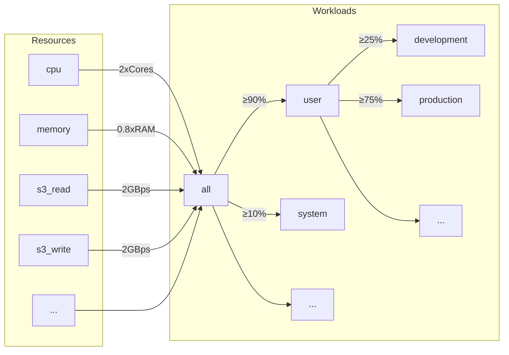
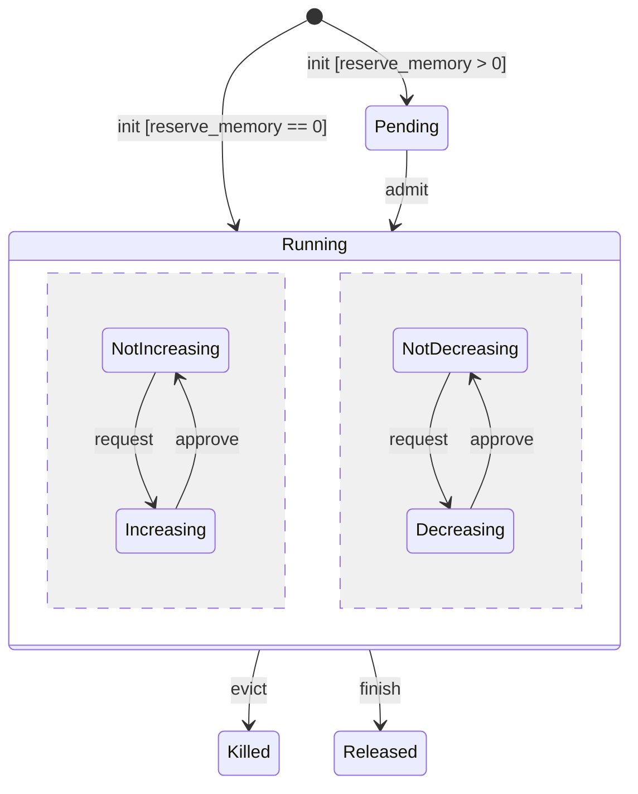
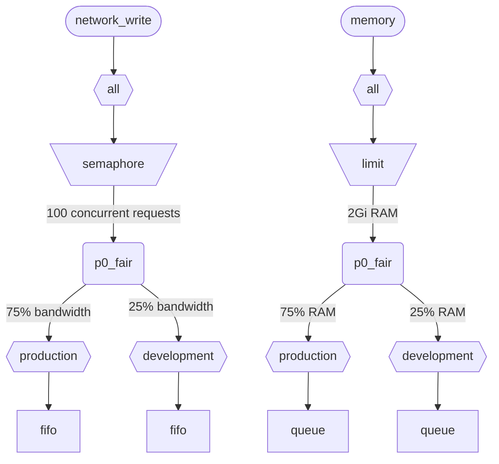

عندما ينفّذ ClickHouse عدة استعلامات بالتزامن، فإنها تستخدم موارد مشتركة (CPU والذاكرة وIO). يمكن تطبيق قيود وسياسات الجدولة لتنظيم كيفية استخدام الموارد ومشاركتها بين أعباء العمل المختلفة. ويمكن تهيئة تسلسل هرمي موحّد للجدولة لجميع الموارد. يمثّل جذر هذا التسلسل الهرمي الموارد المشتركة، بينما تمثّل العقد الطرفية أعباء عمل محددة، وتحتوي على طلبات الموارد وتخصيصاتها الخاصة باستعلامات معيّنة وأنشطة الخلفية.

<div id="resources">
  ## الموارد
</div>

تكون جدولة أعباء العمل معطّلة افتراضيًا. ولتمكينها، يجب إنشاء الموارد التي ستُستخدم في الجدولة، وإنشاء عبء عمل واحد على الأقل. جميع الموارد مستقلة، ويمكن استخدامها بأي مجموعة.

لتمكين جدولة CPU، يجب إنشاء مورد CPU لخيوط MASTER أو WORKER (راجع [جدولة CPU](#cpu_scheduling) لمزيد من التفاصيل):

```sql
CREATE RESOURCE cpu (MASTER THREAD, WORKER THREAD)
```

لتمكين حجز الذاكرة لـ أعباء العمل، عليك إنشاء مورد MEMORY (راجع [حجوزات الذاكرة](#memory-reservations) لمزيد من التفاصيل):

```sql
CREATE RESOURCE memory (MEMORY RESERVATION)
```

لتمكين جدولة فتحات الاستعلام، يجب إنشاء مورد QUERY (راجع [جدولة فتحات الاستعلام](#query_scheduling) للتفاصيل):

```sql
CREATE RESOURCE query (QUERY)
```

لتمكين جدولة IO لقرص محدد، يجب إنشاء موارد القراءة والكتابة لصلاحيتي WRITE وREAD:

```sql
CREATE RESOURCE resource_name (WRITE DISK disk_name, READ DISK disk_name)
-- or
CREATE RESOURCE read_resource_name (WRITE DISK write_disk_name)
CREATE RESOURCE write_resource_name (READ DISK read_disk_name)
```

يمكن استخدام مورد مع أي عدد من الأقراص من أجل READ أو WRITE أو لكليهما معًا، READ وWRITE. وتوجد صياغة تسمح باستخدام مورد مع جميع الأقراص:

```sql
CREATE RESOURCE all_io (READ ANY DISK, WRITE ANY DISK);
```

تُصنَّف الموارد بحسب وضع المشاركة:

* **الموارد ذات المشاركة الزمنية** (CPU، IO، فتحات الاستعلام) - تُدير طلبات الموارد التي تُدرَج في قائمة الانتظار عند الأوراق النهائية في التسلسل الهرمي للجدولة. تُجدوَل الطلبات وفقًا للسياسات والقيود التي يحدِّدها التسلسل الهرمي. تُنشأ طلبات الموارد عندما يستخدم الاستعلام المورد المقابل. على سبيل المثال، عندما يقرأ استعلام بيانات من القرص، أو يستخدم CPU للمعالجة، تُنشأ طلبات موارد لكل وحدة عمل مُنجزة أو لكل عدد من البايتات المُرسلة أو المُستلَمة عبر socket.
* **الموارد ذات المشاركة المكانية** (Memory) - تُدير تخصيصات الموارد عند الأوراق النهائية في التسلسل الهرمي للجدولة. يمكن أن تكون التخصيصات قيد التشغيل أو معلّقة. تُحجَب التخصيصات المعلّقة إلى أن تتوفر مساحة كافية أو يُزال تخصيص آخر (يُقتل). تستند القرارات إلى الحدود والسياسات التي يحدِّدها التسلسل الهرمي. يوجد تطابق واحد لواحد بين التخصيصات والاستعلامات (أو الأنشطة الخلفية). يُنشأ التخصيص عندما يبدأ الاستعلام التنفيذ ويُحرَّر عند انتهائه. ويمكن للتخصيصات قيد التشغيل أن تزيد أو تقلّص حجمها ديناميكيًا.

<div id="workloads">
  ## التسلسل الهرمي لعبء العمل
</div>

يوفّر ClickHouse صياغة SQL ملائمة لتعريف التسلسل الهرمي للجدولة. تُوزَّع جميع الموارد ضمن تسلسل هرمي مشترك لـ WORKLOAD. ويمكن تعديل قواعد التوزيع في بعض الجوانب لموارد معيّنة، لكن التسلسل الهرمي يظلّ نفسه. ويحافظ كل WORKLOAD على عُقد الجدولة اللازمة لكل مورد. ويمكن إنشاء عبء عمل فرعي داخل أي عبء عمل، وبذلك يتكوّن التسلسل الهرمي. لا يفرض ClickHouse أي بنية محددة أو مُعرَّفة مسبقًا للتسلسل الهرمي لعبء العمل.

فيما يلي مثال على تسلسل هرمي يقسم جميع الموارد بين عبئي العمل &quot;user&quot; و&quot;system&quot; مع ضمان بنسبة 90% و10% على التوالي. لاحظ أن الأوزان المعرّفة لأعباء العمل تُستخدم لتحقيق max-min fairness، ولذلك فهي لا توفّر سوى ضمانًا بأفضل جهد كحد أدنى (وليست حدًا أو QUOTA كحد أقصى). تُجرى الجدولة بالكامل على كل host بشكل مستقل، ولذلك فإن الحدود المعرّفة بواسطة إعدادات `max_*` تكون لكل host. ويقسّم عبء العمل &quot;user&quot; موارده بين عبئي العمل &quot;development&quot; و&quot;production&quot;، بحيث يحصل &quot;production&quot; على موارد تزيد 3 مرات على &quot;development&quot;:

```sql
CREATE RESOURCE cpu (MASTER THREAD, WORKER THREAD)
CREATE RESOURCE memory (MEMORY RESERVATION)
CREATE RESOURCE s3_read (READ DISK s3)
CREATE RESOURCE s3_write (WRITE DISK s3)
CREATE WORKLOAD all SETTINGS max_concurrent_threads_ratio_to_cores = 2, max_memory_ratio = 0.8, max_bytes_per_second = '2Gi'
CREATE WORKLOAD user IN all SETTINGS weight = 9
CREATE WORKLOAD system IN all
CREATE WORKLOAD development IN user
CREATE WORKLOAD production IN user SETTINGS weight = 3
```



يمكن استخدام اسم عبء عمل طرفي لا يتضمن أعباء عمل فرعية في إعدادات الاستعلام `SETTINGS workload = 'name'`. راجع [وسم عبء العمل](#workload-markup) لمزيد من التفاصيل.

لتخصيص عبء العمل، يمكن استخدام الإعدادات التالية:

* `priority` - (للموارد المشتركة زمنيًا فقط) تُخدَّم أعباء العمل الشقيقة وفقًا لقيم ثابتة (القيمة الأقل تعني أولوية أعلى). ويؤثر ذلك في الاستباق.
* `precedence` - (للموارد المشتركة مكانيًا فقط) تُقبل أعباء العمل الشقيقة وفقًا لقيم ثابتة (القيمة الأقل تعني أسبقية أعلى). ويؤثر ذلك في الإخلاء والقبول.
* `weight` - تتشارك أعباء العمل الشقيقة ذات الأولوية أو الأسبقية الثابتة نفسها المواردَ وفقًا للأوزان بصورة عادلة. ويؤثر ذلك في الاستباق والإخلاء والقبول.
* `max_io_requests` - الحد الأقصى لعدد طلبات IO المتزامنة في عبء العمل هذا.
* `max_bytes_inflight` - الحد الأقصى لإجمالي البايتات قيد المعالجة للطلبات المتزامنة في عبء العمل هذا.
* `max_bytes_per_second` - الحد الأقصى لمعدل قراءة البايتات أو كتابتها لعبء العمل هذا.
* `max_burst_bytes` - الحد الأقصى لعدد البايتات التي يمكن أن يعالجها عبء العمل دون تقييد المعدل (لكل مورد على حدة).
* `max_concurrent_threads` - الحد الأقصى لعدد الخيوط الخاصة بالاستعلامات في عبء العمل هذا.
* `max_concurrent_threads_ratio_to_cores` - مثل `max_concurrent_threads`، ولكن محسوبًا نسبةً إلى عدد أنوية CPU المتاحة.
* `max_cpus` - الحد الأقصى لعدد أنوية CPU المخصصة لخدمة الاستعلامات في عبء العمل هذا.
* `max_cpu_share` - مثل `max_cpus`، ولكن محسوبًا نسبةً إلى عدد أنوية CPU المتاحة.
* `max_burst_cpu_seconds` - الحد الأقصى لعدد ثواني CPU التي يمكن أن يستهلكها عبء العمل دون تقييد المعدل بسبب `max_cpus`.
* `max_memory` - الحد الأقصى لإجمالي الذاكرة المحجوزة لعبء العمل هذا.

جميع الحدود المحددة عبر إعدادات عبء العمل مستقلة لكل مورد على حدة. على سبيل المثال، فإن عبء العمل الذي لديه `max_bytes_per_second = '10Mi'` سيكون له حد لعرض النطاق قدره 10 MB/s لكل مورد قراءة وكتابة بشكل مستقل. وإذا كان مطلوبًا حدٌّ مشترك للقراءة والكتابة، ففكّر في استخدام المورد نفسه لعمليتَي READ وWRITE.

لا توجد طريقة لتحديد تسلسلات هرمية مختلفة لأعباء العمل لموارد مختلفة. ولكن توجد طريقة لتحديد قيمة مختلفة لإعداد عبء العمل لمورد معيّن:

```sql
CREATE OR REPLACE WORKLOAD all SETTINGS max_io_requests = 100, max_bytes_per_second = '1Mi' FOR network_read, max_bytes_per_second = '2Mi' FOR network_write
```

لاحظ أيضًا أنه لا يمكن حذف عبء العمل أو المورد إذا كان هناك عبء عمل آخر يشير إليه. ولتحديث تعريف عبء العمل، استخدم الاستعلام `CREATE OR REPLACE WORKLOAD`.

:::note
تُحوَّل إعدادات عبء العمل إلى مجموعة مناسبة من عُقد الجدولة. ولمزيد من التفاصيل منخفضة المستوى، راجع وصف [أنواع عُقد الجدولة وخياراتها](#hierarchy).
:::

<div id="workload-markup">
  ## وسم عبء العمل
</div>

يمكن وسم الاستعلامات باستخدام الإعداد `workload` للتمييز بين أعباء العمل المختلفة. وإذا لم يتم تعيين `workload`، فستُستخدم القيمة &quot;default&quot;. لاحظ أنه يمكنك تحديد قيمة أخرى باستخدام ملفات تعريف الإعدادات. ويمكن استخدام قيود الإعدادات لجعل `workload` ثابتًا إذا كنت تريد وسم جميع الاستعلامات الخاصة بالمستخدم بقيمة ثابتة لإعداد `workload`.

:::warning
لا يمكن أن يشير إعداد الاستعلام `workload` إلا إلى أعباء العمل الطرفية (أي أعباء العمل التي ليس لها أعباء عمل فرعية).
:::

```sql
SELECT count() FROM my_table WHERE value = 42 SETTINGS workload = 'production'
SELECT count() FROM my_table WHERE value = 13 SETTINGS workload = 'development'
```

يمكن تعيين إعداد `workload` للأنشطة التي تعمل في الخلفية. تستخدم عمليات الدمج وعمليات التعديل إعدادَي الخادم `merge_workload` و`mutation_workload` على الترتيب. ويمكن أيضًا تجاوز هذه القيم لجداول محددة باستخدام إعدادات MergeTree ‏`merge_workload` و`mutation_workload`.

<div id="cpu_scheduling">
  ## جدولة CPU
</div>

لتمكين جدولة CPU لأحمال العمل، أنشئ موردًا للـ CPU وحدّد حدًا لعدد الخيوط المتزامنة:

```sql
CREATE RESOURCE cpu (MASTER THREAD, WORKER THREAD)
CREATE WORKLOAD all SETTINGS max_concurrent_threads = 100
```

عندما ينفّذ خادم ClickHouse عددًا كبيرًا من الاستعلامات المتزامنة باستخدام [خيوط متعددة](/ar/operations/settings/settings.md#max_threads)، وتكون جميع حصص CPU قيد الاستخدام، يتم الوصول إلى حالة الحمل الزائد. وفي حالة الحمل الزائد، تُعاد جدولة كل حصة CPU يتم تحريرها إلى عبء العمل المناسب وفقًا لسياسات الجدولة. وبالنسبة إلى الاستعلامات التي تشترك في عبء العمل نفسه، تُخصَّص الحصص بأسلوب التناوب الدوري. أما الاستعلامات الموجودة في أعباء عمل منفصلة، فتُخصَّص لها الحصص وفقًا للأوزان والأولويات والحدود المحددة لأعباء العمل.

يُستهلك وقت CPU بواسطة الخيوط عندما لا تكون متوقفة وتعمل على مهام كثيفة الاستخدام للـ CPU. ولأغراض الجدولة، يُفرَّق بين نوعين من الخيوط:

* الخيط الرئيسي — أول خيط يبدأ العمل على استعلام أو نشاط في الخلفية مثل الدمج أو التعديل.
* خيط العامل — الخيوط الإضافية التي يمكن للخيط الرئيسي إنشاؤها للعمل على مهام كثيفة الاستخدام للـ CPU.

قد يكون من المرغوب استخدام موارد منفصلة للخيط الرئيسي وخيوط العامل لتحقيق استجابة أفضل. إذ يمكن لعدد كبير من خيوط العامل أن يحتكر موارد CPU بسهولة عند استخدام قيم مرتفعة لإعداد الاستعلام `max_threads`. وعندها ينبغي أن تنتظر الاستعلامات الواردة توفر حصة CPU حتى تتمكن خيوطها الرئيسية من بدء التنفيذ. ولتجنب ذلك، يمكن استخدام الإعداد التالي:

```sql
CREATE RESOURCE worker_cpu (WORKER THREAD)
CREATE RESOURCE master_cpu (MASTER THREAD)
CREATE WORKLOAD all SETTINGS max_concurrent_threads = 100 FOR worker_cpu, max_concurrent_threads = 1000 FOR master_cpu
```

سيؤدي ذلك إلى إنشاء حدود منفصلة للخيوط الرئيسية وخيوط العمل. وحتى إذا كانت خانات CPU المئة المخصصة لخيوط العمل مشغولة كلها، فلن تُحجب الاستعلامات الجديدة ما لم تتوفر خانات CPU رئيسية. وستبدأ هذه الاستعلامات التنفيذ بخيط واحد. لاحقًا، إذا أصبحت خانات CPU الخاصة بخيوط العمل متاحة، فقد تتوسع هذه الاستعلامات وتُنشئ خيوط العمل الخاصة بها. ومن ناحية أخرى، فإن هذا النهج لا يربط العدد الإجمالي للخانات بعدد معالجات CPU، كما أن تشغيل عدد كبير جدًا من الخيوط المتزامنة سيؤثر في الأداء.

إن تقييد تزامن الخيوط الرئيسية لن يحد من عدد الاستعلامات المتزامنة. إذ يمكن تحرير خانات CPU في منتصف تنفيذ الاستعلام ثم تعيد خيوط أخرى الاستحواذ عليها. على سبيل المثال، يمكن تنفيذ 4 استعلامات متزامنة بالتوازي مع حد يبلغ خيطين رئيسيين متزامنين. في هذه الحالة، سيحصل كل استعلام على 50% من معالج CPU. ويجب استخدام منطق منفصل لتقييد عدد الاستعلامات المتزامنة، وهو غير مدعوم حاليًا لأحمال العمل.

يمكن استخدام حدود منفصلة لتزامن الخيوط لأحمال العمل:

```sql
CREATE RESOURCE cpu (MASTER THREAD, WORKER THREAD)
CREATE WORKLOAD all
CREATE WORKLOAD admin IN all SETTINGS max_concurrent_threads = 10
CREATE WORKLOAD production IN all SETTINGS max_concurrent_threads = 100
CREATE WORKLOAD analytics IN production SETTINGS max_concurrent_threads = 60, weight = 9
CREATE WORKLOAD ingestion IN production
```

يوفّر مثال التهيئة هذا مجمّعات مستقلة لفتحات CPU لكل من Admin وبيئة الإنتاج. ويجري تقاسم مجمّع الإنتاج بين التحليلات وإدخال البيانات. علاوة على ذلك، إذا كان مجمّع الإنتاج في حالة حمل زائد، فستُعاد جدولة 9 من كل 10 فتحات مُفرَج عنها إلى الاستعلامات التحليلية عند الحاجة. ولن تحصل استعلامات إدخال البيانات إلا على فتحة واحدة من كل 10 فتحات خلال فترات الحمل الزائد. وقد يؤدي ذلك إلى تحسين زمن الاستجابة للاستعلامات الموجّهة للمستخدمين. ولدى التحليلات حدّها الخاص البالغ 60 خيط تنفيذ متزامنًا، مع ترك 40 خيطًا على الأقل دائمًا لدعم إدخال البيانات. وعندما لا يكون هناك حمل زائد، يمكن لإدخال البيانات استخدام الخيوط المئة كلها.

لاستبعاد استعلام من جدولة CPU، اضبط إعداد الاستعلام [use&#95;concurrency&#95;control](/ar/operations/settings/settings.md/#use_concurrency_control) على 0.

لا تزال جدولة CPU غير مدعومة لعمليات الدمج والتعديلات حتى الآن.

ولتوفير تخصيصات عادلة لعبء العمل، يلزم تنفيذ الاستباق والتقليص أثناء تنفيذ الاستعلام. يُفعَّل الاستباق باستخدام إعداد الخادم `cpu_slot_preemption`. وإذا كان مفعّلًا، فإن كل خيط يجدّد فتحة CPU الخاصة به دوريًا (وفقًا لإعداد الخادم `cpu_slot_quantum_ns`). ويمكن أن يؤدي هذا التجديد إلى حظر التنفيذ إذا كان CPU في حالة حمل زائد. وعندما يُحظر التنفيذ لمدة طويلة (راجع إعداد الخادم `cpu_slot_preemption_timeout_ms`)، يُخفَّض الاستعلام وينخفض عدد خيوط التنفيذ العاملة بالتوازي بصورة ديناميكية. لاحظ أن عدالة وقت CPU مضمونة بين أعباء العمل، لكنها قد لا تتحقق بين الاستعلامات داخل عبء العمل نفسه في بعض الحالات الطرفية.

:::warning
توفّر جدولة الفتحات وسيلة للتحكم في [تزامن الاستعلامات](/ar/operations/settings/settings.md#max_threads)، لكنها لا تضمن تخصيصًا عادلًا لوقت CPU ما لم يكن إعداد الخادم `cpu_slot_preemption` مضبوطًا على `true`، وإلا فستتحقق العدالة استنادًا إلى عدد تخصيصات فتحات CPU بين أعباء العمل المتنافسة. وهذا لا يعني تساوي مقدار ثواني CPU، لأنه من دون الاستباق قد تظل فتحة CPU محجوزة إلى أجل غير مسمى. يكتسب الخيط فتحة في البداية ويحررها عند اكتمال العمل.
:::

:::note
يؤدي تعريف مورد CPU إلى تعطيل مفعول الإعدادين [`concurrent_threads_soft_limit_num`](server-configuration-parameters/settings.md#concurrent_threads_soft_limit_num) و[`concurrent_threads_soft_limit_ratio_to_cores`](server-configuration-parameters/settings.md#concurrent_threads_soft_limit_ratio_to_cores). وبدلًا من ذلك، يُستخدم إعداد عبء العمل `max_concurrent_threads` لتقييد عدد وحدات CPU المخصّصة لعبء عمل معيّن. وللحصول على السلوك السابق، أنشئ مورد WORKER THREAD فقط، واضبط `max_concurrent_threads` لعبء العمل `all` على نفس قيمة `concurrent_threads_soft_limit_num`، واستخدم إعداد query ‏`workload = "all"`. يتوافق هذا الإعداد مع تعيين [`concurrent_threads_scheduler`](server-configuration-parameters/settings.md#concurrent_threads_scheduler) إلى القيمة &quot;fair&#95;round&#95;robin&quot;.
:::

<div id="threads_vs_cpus">
  ## الخيوط مقابل CPU
</div>

هناك طريقتان للتحكم في استهلاك CPU لعبء العمل:

* حدّ عدد الخيوط: `max_concurrent_threads` و `max_concurrent_threads_ratio_to_cores`
* تقييد CPU: `max_cpus` و `max_cpu_share` و `max_burst_cpu_seconds`

:::warning
لا تكون إعدادات تقييد CPU مفعّلة إلا إذا كان إعداد الخادم `cpu_slot_preemption` مُمكّنًا، وإلا فسيتم تجاهلها.
:::

تتيح الطريقة الأولى التحكم ديناميكيًا في عدد الخيوط التي يتم إنشاؤها للاستعلام، بحسب الحمل الحالي على الخادم. وهي تخفّض فعليًا ما يفرضه إعداد الاستعلام `max_threads`. أما الطريقة الثانية فتقيّد استهلاك CPU لعبء العمل باستخدام خوارزمية دلو الرموز. وهي لا تؤثر مباشرةً في عدد الخيوط، لكنها تقيّد إجمالي استهلاك CPU لجميع الخيوط ضمن عبء العمل.

يعني تقييد دلو الرموز باستخدام `max_cpus` و `max_burst_cpu_seconds` ما يلي: خلال أي فترة مقدارها `delta` ثانية، لا يجوز أن يتجاوز إجمالي استهلاك CPU من جميع الاستعلامات في عبء العمل `max_cpus * delta + max_burst_cpu_seconds` من ثواني CPU. وهو يحدّ متوسط الاستهلاك على المدى الطويل عند `max_cpus`، لكن قد يمكن تجاوز هذا الحد على المدى القصير. على سبيل المثال، عند `max_burst_cpu_seconds = 60` و `max_cpus=0.001`، يُسمح بتشغيل خيط واحد لمدة 60 ثانية، أو خيطين لمدة 30 ثانية، أو 60 خيطًا لمدة ثانية واحدة، من دون تقييد. القيمة الافتراضية لـ `max_burst_cpu_seconds` هي ثانية واحدة. وقد تؤدي القيم الأقل إلى عدم الاستفادة الكاملة من أنوية `max_cpus` المسموح بها عند وجود عدد كبير من الخيوط المتزامنة.

أثناء الاحتفاظ بفتحة CPU، يمكن أن يكون الخيط في واحدة من ثلاث حالات رئيسية:

* **Running:** يستهلك مورد CPU فعليًا. ويُحتسب الوقت المقضي في هذه الحالة ضمن تقييد CPU.
* **Ready:** ينتظر حتى يصبح CPU متاحًا. ولا يُحتسب الوقت المقضي في هذه الحالة ضمن تقييد CPU.
* **Blocked:** ينفّذ عمليات IO أو استدعاءات syscall حاجبة أخرى (مثل انتظار `mutex`). ولا يُحتسب الوقت المقضي في هذه الحالة ضمن تقييد CPU.

لننظر إلى مثال على إعداد يجمع بين تقييد CPU وحدود عدد الخيوط:

```sql
CREATE RESOURCE cpu (MASTER THREAD, WORKER THREAD)
CREATE WORKLOAD all SETTINGS max_concurrent_threads_ratio_to_cores = 2
CREATE WORKLOAD admin IN all SETTINGS max_concurrent_threads = 2, priority = -1
CREATE WORKLOAD production IN all SETTINGS weight = 4
CREATE WORKLOAD analytics IN production SETTINGS max_cpu_share = 0.7, weight = 3
CREATE WORKLOAD ingestion IN production
CREATE WORKLOAD development IN all SETTINGS max_cpu_share = 0.3
```

هنا نقيّد العدد الإجمالي للخيوط لجميع الاستعلامات ليكون ضعف عدد وحدات CPU المتاحة. ويُقيَّد عبء عمل Admin بخيطين كحد أقصى، بغضّ النظر عن عدد وحدات CPU المتاحة. وتبلغ أولوية Admin القيمة ‎-1‎ (أقل من القيمة الافتراضية 0)، ويحصل أولًا على أي حصة CPU عند الحاجة. وعندما لا يشغّل Admin أي استعلامات، تُقسَّم موارد CPU بين عبئي عمل الإنتاج والتطوير. وتعتمد الحصص المضمونة من وقت CPU على الأوزان (4 إلى 1): إذ يذهب 80% على الأقل إلى الإنتاج (عند الحاجة)، ويذهب 20% على الأقل إلى التطوير (عند الحاجة). وفي حين توفّر الأوزان ضمانات، يفرض تقييد CPU حدودًا: فالإنتاج غير مقيّد ويمكنه استهلاك 100%، بينما يملك التطوير حدًا قدره 30%، ويُطبَّق هذا الحد حتى إذا لم تكن هناك استعلامات من أعباء عمل أخرى. وعبء عمل الإنتاج ليس عقدة نهائية، لذا تُقسَّم موارده بين التحليلات والاستيعاب وفقًا للأوزان (3 إلى 1). وهذا يعني أن التحليلات لها حد مضمون لا يقل عن ‎0.8 * 0.75 = 60%‎، واستنادًا إلى `max_cpu_share`، فلها حد أقصى يبلغ 70% من إجمالي موارد CPU. أما الاستيعاب، فله حد مضمون لا يقل عن ‎0.8 * 0.25 = 20%‎، وليس له حد أعلى.

:::note
إذا كنت تريد زيادة استخدام CPU إلى أقصى حد على خادم ClickHouse، فتجنّب استخدام `max_cpus` و`max_cpu_share` لعبء العمل الجذر `all`. وبدلًا من ذلك، عيّن قيمة أعلى لـ `max_concurrent_threads`. على سبيل المثال، في نظام يحتوي على 8 وحدات CPU، عيّن `max_concurrent_threads = 16`. يتيح ذلك تشغيل 8 خيوط لمهام CPU، بينما يمكن لـ 8 خيوط أخرى التعامل مع عمليات IO. وستؤدي الخيوط الإضافية إلى توليد ضغط على CPU، مما يضمن تطبيق قواعد الجدولة. في المقابل، فإن تعيين `max_cpus = 8` لن يولّد ضغطًا على CPU مطلقًا، لأن الخادم لا يمكنه تجاوز وحدات CPU الثماني المتاحة.
:::

<div id="memory-reservations">
  ## حجوزات الذاكرة
</div>

:::note
جدولة حجز الذاكرة ميزة تجريبية. ولا تسري إلا عند وجود مورد `MEMORY RESERVATION`، وقد تتغير واجهتها في SQL وسلوكها في الإصدارات المستقبلية. وهي غير مدعومة بعد لعمليات الدمج والطفرات، كما أن إخلاء استعلام قيد التشغيل يتم على أساس أفضل جهد: إذ يسري عند نقطة مزامنة الذاكرة التالية للاستعلام بدلًا من أن يسري فورًا.
:::

لتمكين حجوزات الذاكرة لأعباء العمل، أنشئ مورد `MEMORY RESERVATION` واضبط حدًا واحدًا على الأقل لإجمالي الذاكرة المحجوزة باستخدام إعدادات عبء العمل:

```sql
CREATE RESOURCE memory (MEMORY RESERVATION)
CREATE WORKLOAD all SETTINGS max_memory = '2Gi'
```

يتتبّع ClickHouse تخصيصات الذاكرة لجميع الاستعلامات وأنشطة الخلفية. ويُجمَّع عدد البايتات المخصّصة عبر التسلسل الهرمي للجدولة حتى يصل إلى الجذر. ولكل استعلام تخصيص مرتبط به ضمن عبء العمل الطرفي الذي ينتمي إليه. إذا كان إعداد `reserve_memory` للاستعلام أكبر من الصفر، فسيُنشأ التخصيص في حالة انتظار. ويحجز التخصيص المعلّق مقدار الذاكرة المطلوب ضمن التسلسل الهرمي لعبء العمل. وإذا لم تتوفر ذاكرة كافية، فسيظل التخصيص معلّقًا حتى تتحرر ذاكرة كافية أو تُزال تخصيصات أخرى (تُنهى). وعندما يُقبَل التخصيص، يصبح قيد التشغيل. ويمكن أن يزيد التخصيص قيد التشغيل حجمه أو ينقصه ديناميكيًا وفقًا لاستهلاك الاستعلام للذاكرة. ويمكن تمثيل دورة حياة التخصيص بمخطط الحالات التالي:



تُقبَل التخصيصات المعلّقة الخاصة بـ عبء العمل الطرفي وفق ترتيب FIFO. وعندما تكون هناك عدة أعباء عمل لديها تخصيصات معلّقة، تُقبَل وفقًا لإعدادات الأسبقية والوزن. وتُخدَم أعباء العمل ذات الأسبقية الأعلى أولًا. أما أعباء العمل الشقيقة ذات الأسبقية نفسها فتتقاسم الذاكرة وفق الأوزان بطريقة عادلة من نوع max-min، ما يعني أن عبء العمل ذات استخدام الذاكرة المُطبَّع الأقل (الاستخدام الحالي مضافًا إليه الزيادة المطلوبة، مقسومًا على الوزن) تُخدَم أولًا. ويُطبَّق المنطق العكسي أثناء الإخلاء. وعندما تدعو الحاجة إلى تحرير الذاكرة، تُخلى أعباء العمل ذات الأسبقية الأقل والاستخدام المُطبَّع الأعلى للذاكرة أولًا.

لاحظ أن الموارد مشترك زمني تستخدم الأولوية، بينما تستخدم الموارد مشترك مكاني الأسبقية. وهما إعدادان مستقلان ويمكن ضبطهما على قيم مختلفة. فالأولوية الأعلى تعني الاستباق غير هدّام (تأخير أو تقييد)، بينما قد تعني الأسبقية الأعلى إخلاء هدّامًا (توقفًا مصحوبًا بـ error). ويمكن أن تكون للـ عبء العمل أولوية عالية في CPU scheduling، مع الاحتفاظ بالأسبقية نفسها في حجز الذاكرة لتجنّب إخلاء أعباء عمل أخرى وفقدان العمل الذي أُنجز مسبقًا بواسطتها.

تضمن كل عبء العمل لها حد `max_memory` ألّا يتجاوز إجمالي الذاكرة المخصّصة ضمن شجرتها الفرعية ذلك الحد. وإذا كان تخصيص معلّق أو متزايد سيتجاوز الحد، يبدأ إجراء الإخلاء لتحرير الذاكرة. ويختار إجراء الإخلاء ضحية ليتم kill لها. ويمنع الـ عبء العمل الذي يمثّل أقل سلف مشترك بين killer والضحية الإخلاء في الحالات التالية:

* لا يمكن للتخصيص المعلّق أن يُخلي التخصيصات الجارية داخل الـ عبء العمل نفسها. (تتطابق عبء العمل الخاصة بـ killer والضحية).
* التخصيص المعلّق ذو الأسبقية الأقل لا يقتل أبدًا عبء العمل ذات أسبقية أعلى.
* لا يمكن للتخصيص المعلّق أن يقتل تخصيصًا له الأسبقية نفسها. لاحظ أن التخصيصات الجارية ذات الأسبقية نفسها قد تُخلي بعضها بعضًا استنادًا إلى استخدام الذاكرة المُطبَّع.
  إذا مُنع الإخلاء أو لم يحرر قدرًا كافيًا من الذاكرة، فسيُحجَب التخصيص الجديد حتى تتحرر ذاكرة كافية. وتتيح هذه القواعد queueing للاستعلامات الزائدة استنادًا إلى ضغط الذاكرة، وتوفّر طريقة مناسبة لتجنّب أخطاء MEMORY&#95;LIMIT&#95;EXCEEDED.

:::note
حدود الـ عبء العمل مستقلة عن الطرق الأخرى لتقييد استهلاك الذاكرة، مثل إعداد الاستعلام [max&#95;memory&#95;usage](/ar/operations/settings/settings.md#max_memory_usage). ويمكن استخدامها معًا لتحقيق تحكم أفضل في استهلاك الذاكرة. ومن الممكن تعيين حدود ذاكرة مستقلة استنادًا إلى المستخدمين (وليس أعباء العمل). وهذا أقل مرونة ولا يوفّر ميزات مثل حجز الذاكرة وqueueing للاستعلامات المعلّقة. راجع [Memory overcommit](settings/memory-overcommit.md)
:::

يقيّد إعداد الـ عبء العمل `max_waiting_queries` عدد التخصيصات المعلّقة الخاصة بالـ عبء العمل. وعند بلوغ الحد، يعيد server خطأ `SERVER_OVERLOADED`. لاحظ أن `max_waiting_queries` لا يُورَّث إلى child أعباء العمل ولا يكون ذا معنى إلا مع عبء العمل الطرفي.

جدولة حجز الذاكرة غير مدعومة بعد لعمليات merges وmutations.

فقط الاستعلامات التي تكون قيمة الإعداد `reserve_memory` فيها أكبر من صفر تكون عرضة للتعليق أثناء انتظار حجز الذاكرة. ومع ذلك، تُحتسب أيضًا الاستعلامات التي تكون قيمة `reserve_memory` فيها صفرًا ضمن البصمة الذاكرية لعبء العمل الخاص بها، ويمكن إخلاؤها عند الحاجة لتحرير الذاكرة من أجل تخصيصات أخرى معلّقة أو متزايدة. أما الاستعلامات التي لا تحمل وسم عبء العمل المناسب فلا تخضع لجدولة حجز الذاكرة، ولا يمكن للمُجدول إخلاؤها.

لتوفير حجز ذاكرة غير مرن لاستعلام ما، اضبط إعدادَي الاستعلام `reserve_memory` و`max_memory_usage` على القيمة نفسها. في هذه الحالة، سيحجز الاستعلام مقدارًا ثابتًا من الذاكرة ولن يتمكن من زيادة التخصيص ديناميكيًا. لاحظ أن حجز الذاكرة المرن يمكن زيادته فوق `reserve_memory` حتى `max_memory_usage` من دون إنهاء الاستعلام، ما لم يكن هناك ضغط على الذاكرة. لكنه لا يمكن خفضه إلى أقل من `reserve_memory` حتى عندما يكون الاستهلاك الفعلي أقل.

لننظر إلى مثال على الإعدادات:

```sql
CREATE RESOURCE memory (MEMORY RESERVATION)
CREATE WORKLOAD all SETTINGS max_memory = '10Gi'
CREATE WORKLOAD system IN all SETTINGS weight = 1
CREATE WORKLOAD user IN all SETTINGS weight = 9
CREATE WORKLOAD production IN user SETTINGS precedence = 1, weight = 3
CREATE WORKLOAD staging IN user SETTINGS precedence = 1, weight = 1
CREATE WORKLOAD testing IN user SETTINGS precedence = 2
```

في هذا المثال، لا يمكن أن يتجاوز إجمالي الذاكرة المحجوزة بواسطة جميع الاستعلامات وأنشطة الخلفية 10 GiB. يضمن عبء عمل النظام حدًا أدنى قدره 1 GiB ‏(10% من 10 GiB)، بينما يضمن عبء عمل المستخدم حدًا أدنى قدره 9 GiB ‏(90% من 10 GiB). داخل عبء عمل المستخدم، يتشارك عبئا العمل production وstaging الذاكرة وفقًا للأوزان (3 إلى 1) مع أسبقية متساوية مقدارها 1. أما عبء عمل testing فأسبقيته 2، وهي أقل من production وstaging. لذلك، لا يمكن لعبء عمل testing استخدام إلا الذاكرة غير المستخدمة من قِبل production وstaging.

إذا حدث ضغط على الذاكرة، فستُخلى أولًا تخصيصات عبء عمل testing. ثم إذا لزم تحرير مزيد من الذاكرة، فستُخلى تخصيصات عبء عمل staging قبل تخصيصات عبء عمل production إذا تجاوزت حدودها المضمونة. لاحظ أن الاستعلامات المعلّقة في production وstaging يمكنها إخلاء التخصيصات قيد التشغيل في عبء عمل testing لتحرير الذاكرة، لكنها لا تستطيع إخلاء تخصيصات بعضها بعضًا لأن لها الأسبقية نفسها. وفي حال حدوث ضغط على الذاكرة، فستنتظر في قوائم انتظار، مما يتيح للنظام تجنّب أخطاء MEMORY&#95;LIMIT&#95;EXCEEDED الناتجة عن وجود عدد كبير جدًا من الاستعلامات التي تُنفَّذ بالتزامن.

لاحظ أن لعبء عمل النظام أسبقية مقدارها 0 (default)، وهي أعلى من أعباء العمل production وstaging وtesting، لكنها ليست أعباء عمل شقيقة لها. فأقرب سلف مشترك هو عبء العمل all، وكلا ابنيه لهما الأسبقية نفسها. لذلك لا يمكن لعبء عمل النظام المعلّق إخلاء أيٍّ منها، والعكس صحيح. وهذا يضمن تعذّر إخلاء أنشطة النظام بسهولة.

<div id="query_scheduling">
  ## جدولة فتحات الاستعلام
</div>

لتمكين جدولة فتحات الاستعلام لأعباء العمل، أنشئ مورد QUERY واضبط حدًا لعدد الاستعلامات المتزامنة أو عدد الاستعلامات في الثانية:

```sql
CREATE RESOURCE query (QUERY)
CREATE WORKLOAD all SETTINGS max_concurrent_queries = 100, max_queries_per_second = 10, max_burst_queries = 20
```

يُقيِّد إعداد عبء العمل ‏`max_concurrent_queries` عدد الاستعلامات المتزامنة التي يمكن تشغيلها في الوقت نفسه ضمن عبء العمل معيّن. وهو مماثل لإعداد استعلام ‏[`max_concurrent_queries_for_all_users`](/ar/operations/settings/settings#max_concurrent_queries_for_all_users) وإعداد server ‏[max&#95;concurrent&#95;queries](/ar/operations/server-configuration-parameters/settings#max_concurrent_queries). ولا تُحتسب الاستعلامات ‏async insert وبعض الاستعلامات المحددة مثل KILL ضمن هذا الحد.

يُقيِّد إعدادا عبء العمل ‏`max_queries_per_second` و`max_burst_queries` عدد الاستعلامات الخاصة بالـ عبء العمل باستخدام throttler من نوع token bucket. ويضمن ذلك أنه خلال أي فترة زمنية `T` لن يبدأ تنفيذ أكثر من `max_queries_per_second * T + max_burst_queries` من الاستعلامات الجديدة.

يُقيِّد إعداد عبء العمل ‏`max_waiting_queries` عدد الاستعلامات المنتظرة الخاصة بالـ عبء العمل. وعند بلوغ هذا الحد، يعيد server الخطأ `SERVER_OVERLOADED`. لاحظ أن `max_waiting_queries` لا يُورَّث إلى أعباء العمل الفرعية، ولا يكون ذا معنى إلا مع leaf أعباء العمل.

:::note
ستظل الاستعلامات المحجوبة في الانتظار إلى أجل غير مسمى، ولن تظهر في `SHOW PROCESSLIST` حتى يتم استيفاء جميع القيود.
:::

<div id="workload_entity_storage">
  ## تخزين أعباء العمل والموارد
</div>

تُخزَّن تعريفات جميع أعباء العمل والموارد، في صورة استعلامات `CREATE WORKLOAD` و`CREATE RESOURCE`، تخزينًا دائمًا إما على القرص عند `workload_path` أو في ZooKeeper عند `workload_zookeeper_path`. ويُوصى بالتخزين في ZooKeeper لتحقيق الاتساق بين العُقد. وبدلًا من ذلك، يمكن استخدام العبارة `ON CLUSTER` إلى جانب التخزين على القرص.

<div id="config_based_workloads">
  ## أعباء العمل والموارد المستندة إلى التهيئة
</div>

بالإضافة إلى التعريفات المستندة إلى SQL، يمكن أيضًا تعريف أعباء العمل والموارد مسبقًا في ملف تهيئة الخادم. ويُعد ذلك مفيدًا في البيئات السحابية، حيث تفرض البنية التحتية بعض القيود، بينما يمكن للعملاء تغيير حدود أخرى. وتكون الكيانات المستندة إلى التهيئة لها أولوية على تلك المعرّفة عبر SQL، ولا يمكن تعديلها أو حذفها باستخدام أوامر SQL.

<div id="config_based_workloads_format">
  ### تنسيق التهيئة
</div>

```xml
<clickhouse>
    <resources_and_workloads>
        CREATE RESOURCE memory (MEMORY RESERVATION);
        CREATE RESOURCE s3disk_read (READ DISK s3);
        CREATE RESOURCE s3disk_write (WRITE DISK s3);
        CREATE WORKLOAD all SETTINGS max_memory = '2Gi', max_io_requests = 500 FOR s3disk_read, max_io_requests = 1000 FOR s3disk_write, max_bytes_per_second = '1280Mi' FOR s3disk_read, max_bytes_per_second = '3200Mi' FOR s3disk_write;
        CREATE WORKLOAD production IN all SETTINGS weight = 3;
    </resources_and_workloads>
</clickhouse>
```

تستخدم التهيئة صياغة SQL نفسها كما في عبارتي `CREATE WORKLOAD` و`CREATE RESOURCE`. ويجب أن تكون جميع الاستعلامات صالحة.

<div id="config_based_workloads_usage_recommendations">
  ### توصيات الاستخدام
</div>

في البيئات السحابية، قد يتضمن الإعداد المعتاد ما يلي:

1. حدِّد عبء العمل الجذر وموارد IO للشبكة في التهيئة لضبط حدود البنية التحتية
2. اضبط `throw_on_unknown_workload` لفرض هذه الحدود
3. أنشئ `CREATE WORKLOAD default IN all` لتطبيق الحدود تلقائيًا على جميع الاستعلامات (لأن القيمة الافتراضية لإعداد الاستعلام `workload` هي &#39;default&#39;)
4. اسمح للمستخدمين بإنشاء أعباء عمل إضافية ضمن التسلسل الهرمي المُعدّ

يضمن ذلك أن تلتزم جميع الأنشطة الخلفية والاستعلامات بقيود البنية التحتية، مع الحفاظ على المرونة اللازمة لسياسات الجدولة الخاصة بالمستخدمين.

ومن حالات الاستخدام الأخرى استخدام تهيئة مختلفة لعُقد مختلفة ضمن عنقود غير متجانس.

<div id="strict_resource_access">
  ## الوصول الصارم إلى الموارد
</div>

لفرض امتثال جميع الاستعلامات لسياسات جدولة الموارد، يوجد إعداد على مستوى الخادم باسم `throw_on_unknown_workload`. إذا تم ضبطه على `true`، فسيكون كل استعلام مُلزَمًا باستخدام إعداد الاستعلام `workload` بقيمة صالحة، وإلا فسيُرمى الاستثناء `RESOURCE_ACCESS_DENIED`. وإذا تم ضبطه على `false`، فلن يستخدم هذا النوع من الاستعلامات مجدول الموارد، أي سيحصل على وصول غير محدود إلى أي `RESOURCE`. يتيح إعداد الاستعلام &#39;use&#95;concurrency&#95;control = 0&#39; للاستعلام تجاوز مجدول CPU والحصول على وصول غير محدود إلى CPU. ولفرض جدولة CPU، أنشئ قيدًا على الإعداد للإبقاء على &#39;use&#95;concurrency&#95;control&#39; كقيمة ثابتة للقراءة فقط.

:::note
لا تضبط `throw_on_unknown_workload` على `true` ما لم يتم تنفيذ `CREATE WORKLOAD default`. فقد يؤدي ذلك إلى مشكلات في بدء تشغيل الخادم إذا نُفِّذ استعلام من دون تعيين صريح لإعداد `workload` أثناء بدء التشغيل.
:::

<div id="hierarchy">
  ### التسلسل الهرمي لعُقد الجدولة
</div>

من منظور النظام الفرعي للجدولة، يمثّل كل مورد تسلسلاً هرميًا من عُقد الجدولة. ينشئ ClickHouse تلقائيًا جميع عُقد الجدولة اللازمة بناءً على تعريفات WORKLOAD وRESOURCE. وتُعدّ عُقد الجدولة تفاصيل تنفيذية منخفضة المستوى، ويمكن الوصول إليها من خلال جدول [system.scheduler](/ar/operations/system-tables/scheduler.md).

```sql
CREATE RESOURCE network_write (WRITE DISK s3)
CREATE RESOURCE memory (MEMORY RESERVATION)
CREATE WORKLOAD all SETTINGS max_io_requests = 100, max_memory = '2Gi'
CREATE WORKLOAD development IN all
CREATE WORKLOAD production IN all SETTINGS weight = 3
```



**أنواع العُقد المشتركة زمنيًا:**

* `inflight_limit` (قيد) - يمنع إذا تجاوز عدد الطلبات المتزامنة قيد التنفيذ `max_requests`، أو إذا تجاوزت كلفتها الإجمالية `max_cost`؛ ويجب أن يكون له ابن واحد.
* `bandwidth_limit` (قيد) - يمنع إذا تجاوز `bandwidth` الحالي `max_speed` (0 تعني بلا حد) أو إذا تجاوزت الذروة `max_burst` (وتساوي `max_speed` افتراضيًا)؛ ويجب أن يكون له ابن واحد.
* `fair` (سياسة) - يختار الطلب التالي المطلوب خدمته من إحدى عقده الأبناء وفقًا لعدالة الحد الأقصى-الحد الأدنى؛ ويمكن للعقد الأبناء تحديد `weight` (القيمة الافتراضية هي 1).
* `priority` (سياسة) - يختار الطلب التالي المطلوب خدمته من إحدى عقده الأبناء وفقًا لأولويات ثابتة (القيمة الأقل تعني أولوية أعلى)؛ ويجب على العقد الأبناء تحديد `priority` (القيمة الافتراضية هي 0).
* `fifo` (قائمة انتظار) - عقدة طرفية في التسلسل الهرمي قادرة على الاحتفاظ بالطلبات التي تتجاوز سعة المورد.

**أنواع العُقد المشتركة بالمساحة:**

* `limit` - يضمن ألّا يتجاوز إجمالي التخصيصات الخاصة بالابن حدًا معيّنًا، ويبدأ إجراء الإخلاء في شجرة فرعية عند الحاجة؛ ويجب أن يكون له ابن واحد.
* `fair_allocation` - يفرض الإخلاء وفقًا لعدالة الحد الأقصى-الحد الأدنى؛ ولا تؤدي التخصيصات المعلّقة مطلقًا إلى إخلاء التخصيصات قيد التشغيل؛ ويمكن للعقد الأبناء تحديد `weight` (القيمة الافتراضية هي 1).
* `precedence_allocation` - يفرض الإخلاء وفقًا لأسبقية ثابتة (القيمة الأقل تعني أسبقية أعلى)؛ وتؤدي التخصيصات المعلّقة ذات الأسبقية الأعلى إلى إخلاء التخصيصات ذات الأسبقية الأقل؛ ويجب على العقد الأبناء تحديد `precedence` (القيمة الافتراضية هي 0).
* `queue` - عقدة طرفية في التسلسل الهرمي قادرة على الاحتفاظ بالتخصيصات قيد التشغيل والمعلّقة.

<div id="deprecated-configuration">
  ## تهيئة XML المهمل
</div>

هناك طريقة بديلة لتحديد الأقراص التي يستخدمها مورد ما، وذلك عبر `storage_configuration` الخاص بالخادم:

لتمكين جدولة IO لقرص محدد، يجب تحديد `read_resource` و/أو `write_resource` في تهيئة التخزين. وهذا يحدد لـ ClickHouse المورد الذي يجب استخدامه لكل طلبات القراءة والكتابة على القرص المحدد. ويمكن لموردَي القراءة والكتابة الإشارة إلى اسم المورد نفسه، وهو ما يفيد مع أقراص `Local SSD` أو HDD. ويمكن أيضًا لعدة أقراص مختلفة الإشارة إلى المورد نفسه، وهو ما يفيد مع الأقراص البعيدة: إذا كنت تريد إتاحة تقسيم عادل لعرض النطاق الترددي للشبكة بين أعباء عمل مثل &quot;الإنتاج&quot; و&quot;التطوير&quot;.

مثال:

```xml
<clickhouse>
    <storage_configuration>
        ...
        <disks>
            <s3>
                <type>s3</type>
                <endpoint>https://clickhouse-public-datasets.s3.amazonaws.com/my-bucket/root-path/</endpoint>
                <access_key_id>your_access_key_id</access_key_id>
                <secret_access_key>your_secret_access_key</secret_access_key>
                <read_resource>network_read</read_resource>
                <write_resource>network_write</write_resource>
            </s3>
        </disks>
        <policies>
            <s3_main>
                <volumes>
                    <main>
                        <disk>s3</disk>
                    </main>
                </volumes>
            </s3_main>
        </policies>
    </storage_configuration>
</clickhouse>
```

لاحظ أن خيارات إعدادات الخادم لها أولوية على أسلوب SQL في تعريف الموارد.

يوضح المثال التالي كيفية تعريف التسلسلات الهرمية لجدولة عمليات الإدخال/الإخراج المبيّنة في الصورة أعلاه:

```xml
<clickhouse>
    <resources>
        <network_read>
            <node path="/">
                <type>inflight_limit</type>
                <max_requests>100</max_requests>
            </node>
            <node path="/fair">
                <type>fair</type>
            </node>
            <node path="/fair/prod">
                <type>fifo</type>
                <weight>3</weight>
            </node>
            <node path="/fair/dev">
                <type>fifo</type>
            </node>
        </network_read>
        <network_write>
            <node path="/">
                <type>inflight_limit</type>
                <max_requests>100</max_requests>
            </node>
            <node path="/fair">
                <type>fair</type>
            </node>
            <node path="/fair/prod">
                <type>fifo</type>
                <weight>3</weight>
            </node>
            <node path="/fair/dev">
                <type>fifo</type>
            </node>
        </network_write>
    </resources>
</clickhouse>
```

لكي تتمكن من الاستفادة من السعة الكاملة للمورد الأساسي، ينبغي استخدام `inflight_limit`. لاحظ أن انخفاض قيمة `max_requests` أو `max_cost` قد يؤدي إلى عدم الاستفادة الكاملة من الموارد، بينما قد تؤدي القيم المرتفعة جدًا إلى فراغ الطوابير داخل `scheduler`، ما يؤدي بدوره إلى تجاهل السياسات (انعدام الإنصاف أو تجاهل الأولويات) في الشجرة الفرعية. ومن ناحية أخرى، إذا كنت تريد حماية الموارد من فرط الاستهلاك، فينبغي استخدام `bandwidth_limit`. فهو يفرض خنقًا عندما تتجاوز كمية المورد المستهلَكة خلال `duration` ثانية قيمة `max_burst + max_speed * duration` بايت. ويمكن استخدام عقدتَي `bandwidth_limit` على المورد نفسه لتقييد ذروة عرض النطاق خلال الفترات القصيرة، ومتوسط عرض النطاق خلال الفترات الأطول.

<div id="workload-classifiers">
  ### مُصنِّفات عبء العمل المهملة
</div>

تُستخدم مُصنِّفات عبء العمل لتحديد تعيين `workload` المحدَّد بواسطة استعلام إلى الطوابير الطرفية التي ينبغي استخدامها لموارد معيّنة. في الوقت الحالي، يُعد تصنيف عبء العمل بسيطًا: لا يتوفر سوى التعيين الثابت.

مثال:

```xml
<clickhouse>
    <workload_classifiers>
        <production>
            <network_read>/fair/prod</network_read>
            <network_write>/fair/prod</network_write>
        </production>
        <development>
            <network_read>/fair/dev</network_read>
            <network_write>/fair/dev</network_write>
        </development>
        <default>
            <network_read>/fair/dev</network_read>
            <network_write>/fair/dev</network_write>
        </default>
    </workload_classifiers>
</clickhouse>
```

<div id="see-also">
  ## انظر أيضًا
</div>

* [system.scheduler](/ar/operations/system-tables/scheduler.md)
* [system.workloads](/ar/operations/system-tables/workloads.md)
* [system.resources](/ar/operations/system-tables/resources.md)
* [merge&#95;workload](/ar/operations/settings/merge-tree-settings.md#merge_workload) إعداد MergeTree
* [merge&#95;workload](/ar/operations/server-configuration-parameters/settings.md#merge_workload) إعداد عام على مستوى الخادم
* [mutation&#95;workload](/ar/operations/settings/merge-tree-settings.md#mutation_workload) إعداد MergeTree
* [mutation&#95;workload](/ar/operations/server-configuration-parameters/settings.md#mutation_workload) إعداد عام على مستوى الخادم
* [workload&#95;path](/ar/operations/server-configuration-parameters/settings.md#workload_path) إعداد عام على مستوى الخادم
* [workload&#95;zookeeper&#95;path](/ar/operations/server-configuration-parameters/settings.md#workload_zookeeper_path) إعداد عام على مستوى الخادم
* [cpu&#95;slot&#95;preemption](/ar/operations/server-configuration-parameters/settings.md#cpu_slot_preemption) إعداد عام على مستوى الخادم
* [cpu&#95;slot&#95;quantum&#95;ns](/ar/operations/server-configuration-parameters/settings.md#cpu_slot_quantum_ns) إعداد عام على مستوى الخادم
* [cpu&#95;slot&#95;preemption&#95;timeout&#95;ms](/ar/operations/server-configuration-parameters/settings.md#cpu_slot_preemption_timeout_ms) إعداد عام على مستوى الخادم