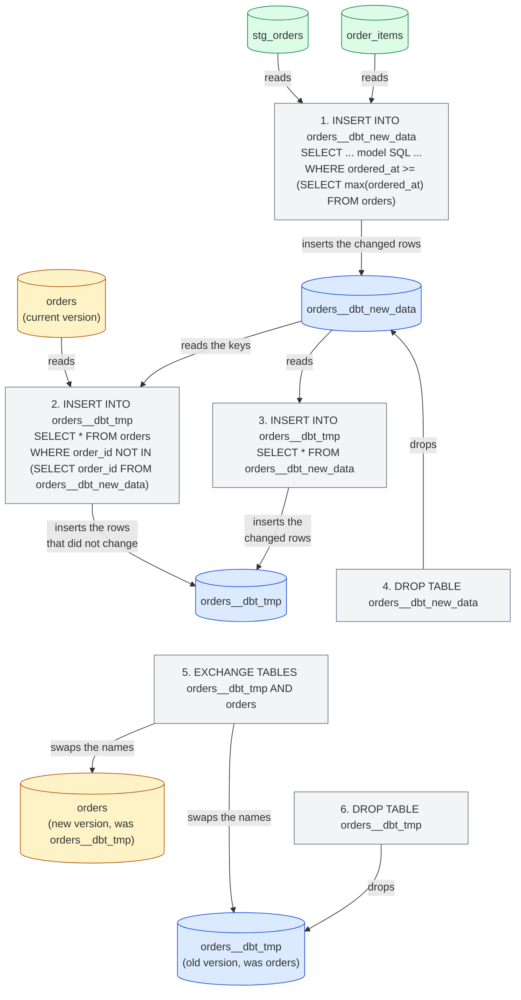
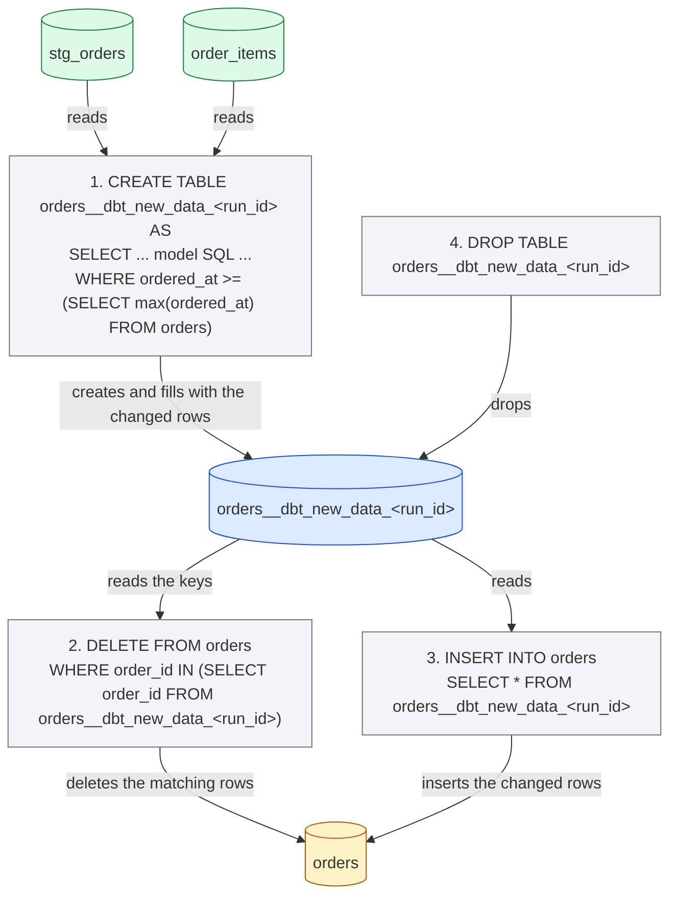
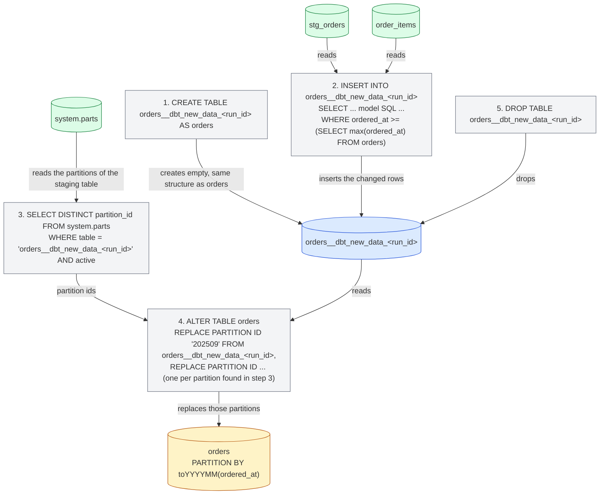

import { ClickHouseSupportedBadge } from "/snippets/ar/components/ClickHouseSupported/ClickHouseSupported.jsx";

<ClickHouseSupportedBadge />

يستعرض هذا الدليل الجانب الخاص بـ ClickHouse من dbt باستخدام مشروع [Jaffle Shop for ClickHouse](https://github.com/ClickHouse/jaffle-shop-clickhouse)، وهو نسخة ClickHouse من المشروع النموذجي الكلاسيكي لـ dbt Labs. وانطلاقًا من مشروع جاهز للبناء بالفعل، يوضّح الدليل كيفية:

1. فهم الطريقة التي تُنشأ بها عروض المشروع وجداوله في ClickHouse.
2. تحميل البيانات باستخدام seeds والتحكم في أنواع ClickHouse وبنية الجدول.
3. تهيئة نموذج جدول بمحرك ClickHouse ومفتاح فرز وتقسيم.
4. تحويل جدول إلى نموذج incremental واختيار strategy تزايدية.
5. إنشاء snapshot.
6. استخدام العروض المجسدة في ClickHouse.

وقد صُمم ليُقرأ إلى جانب بقية [التوثيق](/ar/integrations/connectors/data-ingestion/etl-tools/dbt/index)، وصفحة [الميزات والتهيئات](/ar/integrations/connectors/data-ingestion/etl-tools/dbt/features-and-configurations)، و[مرجع materializations](/ar/integrations/connectors/data-ingestion/etl-tools/dbt/materializations).

## قبل أن تبدأ {#before-you-start}

اتبع أولاً ملف README الخاص بـ [ClickHouse/jaffle-shop-clickhouse](https://github.com/ClickHouse/jaffle-shop-clickhouse)، فهو يوضح كيفية إعداد المشروع باستخدام dbt Core 1.x أو dbt OSS أو dbt v2 أو منصة dbt، وكيفية توجيهه إلى ClickHouse محلي (docker) أو إلى ClickHouse Cloud، وكيفية تحميل بيانات العينة باستخدام `dbt seed`، وكيفية تشغيل أول `dbt build`. وبعد أن يكتمل `dbt build` بنجاح، عد إلى هنا للاطلاع على الأمثلة والتهيئات الخاصة بـ ClickHouse.

بعد إتمام خطوات README، ينبغي أن تكون لديك قاعدتا بيانات في ClickHouse:

* `raw`: جداول المصدر الستة المحمَّلة من ملفات CSV بواسطة `dbt seed` (`raw_customers`، `raw_orders`، `raw_items`، `raw_products`، `raw_stores`، `raw_supplies`).
* `jaffle_shop` (قيمة `schema` في ملف الـ profile الخاص بك): ستة عروض staging (`stg_*`) وسبعة جداول mart (`customers`، `orders`، `order_items`، `products`، `locations`، `supplies`، `metricflow_time_spine`).

إذا كان الـ profile الخاص بك يستخدم `schema` مختلفاً، فاستبدل `jaffle_shop` في الاستعلامات أدناه بالقيمة الخاصة بك.

<Note>
  **dbt Core 1.x وdbt OSS وdbt v2 ومنصة dbt.** كل أمر وكل نموذج في هذا الدليل هو نفسه في جميعها. اختُبرت الأمثلة باستخدام dbt Core 1.12 مع `dbt-clickhouse` 1.10، وباستخدام dbt OSS 2.0 مع ClickHouse 26.8؛ ويعمل dbt v2 بالـ adapter نفسه، وتعمل منصة dbt بـ dbt v2. مخرجات الـ console المعروضة مأخوذة من dbt Core 1.x، وقد أُشير إلى المواضع القليلة التي يختلف فيها سلوك المحركين. راجع [صفحة dbt OSS وdbt v2 ومنصة dbt](/ar/integrations/connectors/data-ingestion/etl-tools/dbt/dbt-core-v2-fusion-and-platform) لمعرفة الحالة الراهنة لـ adapter الإصدار v2، وراجع [Connect ClickHouse](https://docs.getdbt.com/docs/platform/connect-data-platform/connect-clickhouse) في توثيق dbt للبدء على منصة dbt.
</Note>

جميع عبارات SQL التي ليست أوامر dbt يُقصد تشغيلها مباشرةً على ClickHouse، على سبيل المثال عبر `clickhouse client`، أو SQL console في ClickHouse Cloud، أو عميل SQL الذي تختاره.

## كيف يتم تجسيد المشروع {#views-and-tables}

يهيّئ Jaffle Shop تجسيداته في `dbt_project.yml`: نماذج staging تكون views، أما marts فتكون tables.

```yaml
models:
  jaffle_shop:
    staging:
      +materialized: view
    marts:
      +materialized: table
```

تُعاد بناء نموذج **العرض** (view) باستخدام عبارة `CREATE OR REPLACE VIEW` في كل تشغيل. وهو لا يخزّن أي بيانات، لذا لا يكلّف بناؤه شيئًا، لكن كل استعلام يُنفَّذ عليه يُشغّل SQL الخاص بالنموذج على الجداول المصدر. ويحتفظ ClickHouse بكود SQL المُصرَّف للنموذج في تعريف العرض:

```sql
SHOW CREATE VIEW jaffle_shop.stg_orders;
```

```response
CREATE VIEW jaffle_shop.stg_orders
(
    `order_id` String,
    `location_id` String,
    `customer_id` String,
    ...
    `ordered_at` DateTime
)
AS WITH
    source AS
    (
        SELECT *
        FROM raw.raw_orders
    ),
    renamed AS
    (
        SELECT
            id AS order_id,
            store_id AS location_id,
            ...
            dateTrunc('day', ordered_at) AS ordered_at
        FROM source
    )
SELECT *
FROM renamed
```

تُعاد بناء model من نوع **table** من الصفر في كل تشغيل: ينشئ adapter جدولًا جديدًا، ثم ينفّذ `INSERT INTO ... SELECT` باستخدام SQL الخاص بالـ model، ثم يبادله بشكل ذرّي مع الإصدار السابق. وأداء الاستعلام هنا أفضل بكثير منه في العرض، لكن على حساب التخزين وإعادة بناء الجدول بالكامل في كل مرة. ألقِ نظرة على الجدول الذي أنشأه dbt لمستودع `orders`:

```sql
SHOW CREATE TABLE jaffle_shop.orders;
```

```response
CREATE TABLE jaffle_shop.orders
(
    `order_id` String,
    `location_id` String,
    `customer_id` String,
    ...
    `customer_order_number` UInt64
)
ENGINE = MergeTree
ORDER BY tuple()
SETTINGS replicated_deduplication_window = '0', index_granularity = 8192
```

هناك أمران خاصان بـ ClickHouse هنا. فالـ model لا يُعلِن عن table engine، لذا يستخدم الـ adapter المحرك `MergeTree`، كما أنه لا يُعلِن عن sorting key، لذا يستخدم الـ adapter العبارة `ORDER BY tuple()`، أي أن البيانات غير مُرتَّبة على الإطلاق. وهذا مقبول في مشروع تجريبي، أما في جدول حقيقي فستحتاج إلى تحديد كليهما، وهو ما تتناوله الأقسام التالية. وتسرد [صفحة materializations](/ar/integrations/connectors/data-ingestion/etl-tools/dbt/materializations) كل تهيئة جدول يدعمها الـ adapter.

## تحميل البيانات باستخدام seeds {#seeds}

يستخدم Jaffle Shop [seeds](https://docs.getdbt.com/docs/build/seeds) في dbt لتحميل بياناته الخام من ملفات CSV الموجودة في `seeds/jaffle-data`. صُمّمت seeds للبيانات المرجعية الصغيرة والثابتة (جداول الرموز وعمليات الربط)، وليست مخصصة لتحميل warehouse؛ لكن المشروع يستخدمها لتسهيل الأمر عليك كي تبدأ دون الحاجة إلى أداة ingestion أخرى، ولهذا تبقى seeds معطّلة ما لم تمرّر `--vars '{"load_source_data": true}'`.

ومع ذلك، تظل seeds مكانًا جيدًا لتتعلّم كيف يُنشئ dbt جداول ClickHouse. فهو يستنتج نوع column لكل column في ملف CSV، وتختلف الأنواع المستنتجة بين المحركات:

| قيمة CSV              | dbt v1     | محرك v2         |
| --------------------- | ---------- | --------------- |
| `700`                 | `Int32`    | `Int64`         |
| `0.06`                | `Float32`  | `Float64`       |
| `2024-09-01T15:01:00` | `DateTime` | `DateTime64(6)` |
| `Philadelphia`        | `String`   | `String`        |

وعندما يكون النوع مهمًا، ثبّته باستخدام `column_types`. وقد فعل المشروع ذلك بالفعل مع column المسمى `opened_at` في seed `raw_stores` ضمن `dbt_project.yml`:

```yaml
seeds:
  jaffle_shop:
    +schema: raw
    jaffle-data:
      +enabled: "{{ var('load_source_data', false) }}"
      raw_stores:
        +column_types:
          opened_at: DateTime64(3)
```

تقبل الـ seeds أيضاً تهيئات جدول ClickHouse التالية: `engine` و`order_by` و`partition_by`. على سبيل المثال، لفرز الـ seed المسمى `raw_orders` حسب وقت الطلب وتقسيمه شهرياً، أضف ملف properties إلى جانب ملفات CSV، أي `seeds/jaffle-data/_raw_orders.yml`:

```yaml
seeds:
  - name: raw_orders
    config:
      order_by: (ordered_at, id)
      partition_by: toYYYYMM(ordered_at)
```

<Note>
  استخدم ملف properties لتهيئة seeds الخاصة بـ ClickHouse بدلاً من المفتاحين `+order_by` أو `+engine` ضمن `seeds:` في `dbt_project.yml`. يقبل dbt Core 1.x كلا الشكلين، أما dbt v2 فلا يتعرّف عليهما إلا في ملف properties ويرفض مفاتيح `dbt_project.yml` مع الرسالة `Unrecognized key ... Custom keys must go under +meta`.
</Note>

أعد تحميل ذلك الـ seed وتحقّق من الجدول الناتج عنه:

```bash
dbt seed --select raw_orders --full-refresh --vars '{"load_source_data": true}'
```

```sql
SHOW CREATE TABLE raw.raw_orders;
```

```response
CREATE TABLE raw.raw_orders
(
    `id` String,
    `customer` String,
    `ordered_at` DateTime,
    `store_id` String,
    `subtotal` Int32,
    `tax_paid` Int32,
    `order_total` Int32
)
ENGINE = MergeTree
PARTITION BY toYYYYMM(ordered_at)
ORDER BY (ordered_at, id)
SETTINGS index_granularity = 8192
```

يقوم الأمر `dbt seed --full-refresh` بحذف الجدول وإعادة إنشائه، لذا شغّله قبل بناء أي شيء يعتمد مباشرةً على بيانات الجدول، مثل الـ عرض مُجسَّد الوارد لاحقًا في هذا الدليل.

## إعداد جدول لـ ClickHouse {#table-configuration}

يُعد الـ mart المسمى `orders` نقطة البداية الطبيعية: فهو الجدول الذي يستعلم منه mart المسمى `customers` ومقاييس المشروع، كما أنه جدول على نمط الأحداث يتضمن timestamp. أضف كتلة `config` في أعلى ملف `models/marts/orders.sql` لتحديد المحرك ومفتاح الفرز ومخطط التقسيم:

```sql
{{
    config(
        materialized='table',
        engine='MergeTree()',
        order_by='(ordered_at, order_id)',
        partition_by='toYYYYMM(ordered_at)'
    )
}}

with

orders as (

    select * from {{ ref('stg_orders') }}

),
...
```

تبقى بقية النموذج كما هي. يكرّر `materialized='table'` ما يحدده `dbt_project.yml` أصلاً لطبقة marts، وهو ما يجعل النموذج ذاتي الوصف عند تحويله لاحقاً إلى الوضع التزايدي. أعد بناء هذا النموذج فقط:

```bash
dbt run --select orders
```

```response
1 of 1 START sql table model `jaffle_shop`.`orders` ............................ [RUN]
1 of 1 OK created sql table model `jaffle_shop`.`orders` ....................... [OK in 0.44s]
```

أصبح للجدول الآن sorting key مناسب وتقسيم واحد لكل شهر:

```sql
SHOW CREATE TABLE jaffle_shop.orders;
```

```response
CREATE TABLE jaffle_shop.orders
(
    ...
)
ENGINE = MergeTree
PARTITION BY toYYYYMM(ordered_at)
ORDER BY (ordered_at, order_id)
SETTINGS replicated_deduplication_window = '0', index_granularity = 8192
```

```sql
SELECT partition, sum(rows) AS rows
FROM system.parts
WHERE database = 'jaffle_shop' AND table = 'orders' AND active
GROUP BY partition
ORDER BY partition;
```

```response
┌─partition─┬─rows─┐
│ 202409    │ 1497 │
│ 202410    │ 1698 │
│ 202411    │ 2262 │
...
│ 202508    │ 9389 │
└───────────┴──────┘
```

إلى جانب `engine` و`order_by` و`partition_by`، تقبل نماذج الجداول أيضًا `primary_key` و`ttl` و`settings` و`query_settings` و`projections` و`indexes`، ويمكن أن تحمل الأعمدة `codec` و`ttl` عبر عقد النموذج (model contract). وجميعها موضّحة في [صفحة materializations](/ar/integrations/connectors/data-ingestion/etl-tools/dbt/materializations).

## إنشاء model تزايدي {#incremental}

إعادة بناء `orders` من الصفر في كل تشغيل أمر مقبول مع 62,000 row، لكنه غير مناسب لـ table ينمو بملايين الـ rows يوميًا. أما [التجسيد التزايدي](https://docs.getdbt.com/docs/build/incremental-models) في dbt فلا يعالج سوى الـ rows التي تغيّرت منذ التشغيل الأخير. ويتطلب تحويل model الخاص بـ `orders` إضافتين:

1. **`unique_key`**: الـ column الذي يعرّف الـ row، وهو `order_id` هنا. ويستخدمه الـ adapter لاستبدال الـ rows التي تُعالج مرة أخرى بدلًا من تكرارها.
2. **filter تزايدي**: عبارة `where` مُحاطة بـ `` تختار الـ rows المطلوب معالجتها فقط. وتُطبَّق في التشغيلات التزايدية، لا عند بناء الـ table للمرة الأولى (أو عند إعادة بنائه باستخدام `--full-refresh`). وبما أن الطلبات تحمل timestamp، فإن الـ filter يقارن قيمة `ordered_at` بأحدث قيمة موجودة بالفعل في الـ table، والتي يُشار إليها عبر المتغير `{{ this }}`.

حدّث `models/marts/orders.sql` بحيث تصبح كتلة `config` ونهاية الـ model كما يلي:

```sql
{{
    config(
        materialized='incremental',
        unique_key='order_id',
        engine='MergeTree()',
        order_by='(ordered_at, order_id)',
        partition_by='toYYYYMM(ordered_at)'
    )
}}

with

orders as (

    select * from {{ ref('stg_orders') }}

),

...

select * from customer_order_count



-- this filter will only be applied on an incremental run
where ordered_at >= (select max(ordered_at) from {{ this }})


```

يقتطع `stg_orders` القيمة `ordered_at` إلى مستوى اليوم، لذا يستخدم الـ filter المعامل `>=`: ففي كل تشغيل تُعاد معالجة اليوم الأخير بالكامل، وبفضل `unique_key` تُستبدل الـ rows المحمَّلة مسبقًا بدلًا من تكرارها. وهذا ما يجعله آمنًا للطلبات التي تصل لاحقًا في اليوم نفسه.

شغّل الـ model. الـ table موجود بالفعل، لذا فإن هذا التشغيل الأول يُعد تشغيلًا incremental أصلًا: تُعاد معالجة اليوم الأخير فقط.

```bash
dbt run --select orders
```

```response
1 of 1 START sql incremental model `jaffle_shop`.`orders` ...................... [RUN]
1 of 1 OK created sql incremental model `jaffle_shop`.`orders` ................. [OK in 0.94s]
```

والآن أضف بعض البيانات الجديدة. تنتهي بيانات Jaffle Shop عند أغسطس 2025، لذا سنُدخل عميلًا جديدًا هو Clicky McClickHouse، الذي طلب جافل أمس. أدرج عميلًا وطلبًا وعنصر الطلب الخاص به في الجداول الخام:

```sql
INSERT INTO raw.raw_customers VALUES ('clicky-0001', 'Clicky McClickHouse');

INSERT INTO raw.raw_orders VALUES
    ('clicky-order-0001', 'clicky-0001', now() - INTERVAL 1 DAY,
     '4b6c2304-2b9e-41e4-942a-cf11a1819378', 1100, 66, 1166);

INSERT INTO raw.raw_items VALUES ('clicky-item-0001', 'clicky-order-0001', 'JAF-001');
```

معرّف المتجر هو Philadelphia، والعنصر هو جافل `nutellaphone who dis?` بسعر 11.00، والضريبة هي 6% الخاصة بـ Philadelphia، لذا تبقى اختبارات البيانات في المشروع ناجحة. شغّل المشروع بالكامل حتى تتعرّف عروض staging وجدول `order_items` على الصفوف الجديدة قبل أن يتعرّف عليها `orders`:

```bash
dbt run
```

```response
...
10 of 13 OK created sql table model `jaffle_shop`.`order_items` ................ [OK in 0.30s]
...
12 of 13 START sql incremental model `jaffle_shop`.`orders` .................... [RUN]
12 of 13 OK created sql incremental model `jaffle_shop`.`orders` ............... [OK in 0.73s]
13 of 13 START sql table model `jaffle_shop`.`customers` ....................... [RUN]
13 of 13 OK created sql table model `jaffle_shop`.`customers` .................. [OK in 0.28s]
```

الطلب الجديد موجود في جدول incremental، كما أن mart الخاص بـ `customers`، الذي أُعيد بناؤه منه، يتعرّف على العميل الجديد:

```sql
SELECT order_id, customer_id, ordered_at, order_total, customer_order_number
FROM jaffle_shop.orders
WHERE customer_id = 'clicky-0001';
```

```response
┌─order_id──────────┬─customer_id─┬──────────ordered_at─┬─order_total─┬─customer_order_number─┐
│ clicky-order-0001 │ clicky-0001 │ 2026-09-14 00:00:00 │       11.66 │                     1 │
└───────────────────┴─────────────┴─────────────────────┴─────────────┴───────────────────────┘
```

```sql
SELECT customer_name, count_lifetime_orders, lifetime_spend, customer_type
FROM jaffle_shop.customers
WHERE customer_id = 'clicky-0001';
```

```response
┌─customer_name───────┬─count_lifetime_orders─┬─lifetime_spend─┬─customer_type─┐
│ Clicky McClickHouse │                     1 │          11.66 │ new           │
└─────────────────────┴───────────────────────┴────────────────┴───────────────┘
```

### البنية الداخلية {#internals}

يُظهر سجل الاستعلامات في ClickHouse العبارات التي نفّذها الـ adapter لإجراء التحديث التزايدي:

```sql
SELECT event_time, written_rows, tables
FROM system.query_log
WHERE query_kind = 'Insert' AND type = 'QueryFinish'
  AND has(databases, 'jaffle_shop')
  AND event_time > now() - INTERVAL 15 MINUTE
ORDER BY event_time;
```

تعمل الاستراتيجية التزايدية الافتراضية للـ adapter كما يلي. في مخططات هذا القسم، يعني السهم المتجه من جدول إلى عبارة أن العبارة تقرأ ذلك الجدول؛ أما السهم المتجه من عبارة إلى جدول فيعني أنها تكتب إليه أو تُجري عليه تحويلاً (mutate) أو تعيد تسميته أو تحذفه:

1. يُنشأ جدول `orders__dbt_new_data` ويُدرج فيه استعلام SQL الخاص بالـ model، بما في ذلك الـ filter التزايدي. في التشغيل أعلاه، كُتب 378 صفاً: 377 طلباً من آخر يوم تم تحميله مسبقاً، إضافةً إلى الطلب الجديد.
2. يُنشأ جدول `orders__dbt_tmp` بالبنية نفسها لجدول `orders`، وتُنسخ إليه جميع صفوف `orders` التي لا يوجد `order_id` الخاص بها في `orders__dbt_new_data`.
3. تُدرج جميع صفوف `orders__dbt_new_data` في `orders__dbt_tmp`. والخطوتان 2 و3 هما ما يستبدل صفوف آخر يوم بدلاً من تكرارها.
4. يُحذف `orders__dbt_new_data`.
5. يُبدَّل `orders__dbt_tmp` مع `orders` باستخدام عبارة `EXCHANGE TABLES` الذرية (عبر إعادة تسمية وسيطة إلى `orders__dbt_backup`)، وبذلك يحتوي `orders` الآن على النسخة الجديدة.
6. تُحذف النسخة القديمة.



تنسخ الخطوة 2 الجدول بأكمله، ولذلك تكون تكلفة هذه الاستراتيجية مماثلة لإعادة بناء الجدول في النماذج الضخمة جدًا؛ راجع [القيود](/ar/integrations/connectors/data-ingestion/etl-tools/dbt/index#limitations). أما الاستراتيجيات الواردة أدناه فهي تتجنب عملية النسخ هذه.

### Append strategy {#append-strategy}

تُدرج استراتيجية `append` الصفوف التي يحددها الـ model مباشرةً في الـ target table. فلا تُنشأ أي temporary tables ولا يُنسخ أي شيء، ما يجعلها أقل تكلفة ما يمكن أن يكون عليه تشغيل incremental. لكن الثمن هو عدم إجراء أي deduplicate أيضًا: فإذا حدّد الـ filter الخاص بـ incremental صفًا موجودًا بالفعل في الـ table، فستحصل عليه مرتين. استخدمها للبيانات غير القابلة للتغيير ذات النمط الحدثي، وتأكد من أن الـ filter لا يحدد إلا الصفوف الجديدة فعليًا.

ومع `ordered_at` المقتطع على مستوى اليوم، يعني ذلك تغيير الـ filter إلى `>`. عدّل الـ model:

```sql
{{
    config(
        materialized='incremental',
        incremental_strategy='append',
        unique_key='order_id',
        engine='MergeTree()',
        order_by='(ordered_at, order_id)',
        partition_by='toYYYYMM(ordered_at)'
    )
}}

...



-- this filter will only be applied on an incremental run
where ordered_at > (select max(ordered_at) from {{ this }})


```

أضف عميلاً جديداً ثانياً، Danny DeBito، مع طلب تم تقديمه اليوم في Brooklyn (ضريبة 4%) يتضمّن jaffle وقهوة:

```sql
INSERT INTO raw.raw_customers VALUES ('danny-0001', 'Danny DeBito');

INSERT INTO raw.raw_orders VALUES
    ('danny-order-0001', 'danny-0001', now(),
     '40e6ddd6-b8f6-4e17-8bd6-5e53966809d2', 1900, 76, 1976);

INSERT INTO raw.raw_items VALUES
    ('danny-item-0001', 'danny-order-0001', 'JAF-003'),
    ('danny-item-0002', 'danny-order-0001', 'BEV-004');
```

```bash
dbt run
```

```response
...
12 of 13 START sql incremental model `jaffle_shop`.`orders` .................... [RUN]
12 of 13 OK created sql incremental model `jaffle_shop`.`orders` ............... [OK in 0.11s]
...
```

استغرق تشغيل الـ incremental model جزءًا بسيطًا من زمن التشغيل السابق. ولكلٍّ من العميلين الجديدين طلب واحد فقط في الـ table:

```sql
SELECT order_id, customer_id, ordered_at, order_total, is_food_order, is_drink_order
FROM jaffle_shop.orders
WHERE customer_id IN ('clicky-0001', 'danny-0001')
ORDER BY ordered_at;
```

```response
┌─order_id──────────┬─customer_id─┬──────────ordered_at─┬─order_total─┬─is_food_order─┬─is_drink_order─┐
│ clicky-order-0001 │ clicky-0001 │ 2026-09-14 00:00:00 │       11.66 │             1 │              0 │
│ danny-order-0001  │ danny-0001  │ 2026-09-15 00:00:00 │       19.76 │             1 │              1 │
└───────────────────┴─────────────┴─────────────────────┴─────────────┴───────────────┴────────────────┘
```

يؤكّد سجل الاستعلامات (query log) الفرق: هذه المرة العبارة الوحيدة التي تمسّ `orders` هي عبارة `INSERT INTO jaffle_shop.orders ... SELECT ...` واحدة تتضمّن SQL الخاص بالـ model والـ filter التزايدي، وقد كتبت صفًّا واحدًا.

<Warning>
  عند استخدام `>` مع طابع زمني مقتطع إلى مستوى اليوم، فإن أي طلب يصل لاحقًا في اليوم نفسه الذي وصل فيه آخر طلب محمَّل لن يُلتقط أبدًا. في المشاريع الحقيقية، طبّق الـ filter على طابع زمني بدقة كاملة، أو على وقت ingestion متزايد باستمرار، عند استخدام الـ `append` strategy.
</Warning>

### استراتيجية الحذف والإدراج {#delete-insert-strategy}

تاريخيًا، لم يقدّم ClickHouse سوى دعم محدود لعمليات التحديث والحذف، على هيئة [mutations](/ar/reference/statements/alter/index) غير متزامنة. وقد تكون هذه العمليات مكثفة جدًا من ناحية IO ويُفضّل تجنّبها عمومًا. وقد أضاف ClickHouse 22.8 ميزة [lightweight deletes](/ar/reference/statements/delete)، وأضاف ClickHouse 25.7 ميزة [lightweight updates](/ar/reference/statements/update). وبفضلهما، يظهر أثر عبارة الحذف أو التحديث الواحدة فورًا من منظور المستخدم، رغم أن تجسيدها يتم بشكل غير متزامن.

تعتمد استراتيجية `delete+insert` على lightweight deletes وتُهيَّأ عبر المعلمة `incremental_strategy`:

```sql
{{
    config(
        materialized='incremental',
        incremental_strategy='delete+insert',
        unique_key='order_id',
        engine='MergeTree()',
        order_by='(ordered_at, order_id)',
        partition_by='toYYYYMM(ordered_at)'
    )
}}
```

تعمل هذه الاستراتيجية مباشرةً على الجدول الهدف، لذا إذا فشل شيء في منتصف العملية فمن المرجّح أن تكون بيانات النموذج التزايدي في حالة غير صحيحة، إذ لا يوجد تبديل (swap) ذرّي. وبإيجاز:

1. يُنشأ جدول مؤقت (`orders__dbt_new_data_<run_id>`) وتُدرج فيه الصفوف التي يحددها النموذج.
2. يُنفَّذ أمر `DELETE` على `orders` لكل `order_id` موجود في الجدول المؤقت.
3. تُدرج صفوف الجدول المؤقت في `orders`.
4. يُحذف الجدول المؤقت.



### استراتيجية insert overwrite (تجريبية) {#insert-overwrite-strategy}

تستبدل استراتيجية `insert_overwrite` تقسيمات كاملة، لذا فهي تتطلّب تهيئة `partition_by` مثل التهيئة الشهرية المستخدمة في `orders`. وهي تنفّذ الخطوات التالية:

1. إنشاء staging table (‏`orders__dbt_new_data_<run_id>`) بالبنية نفسها المستخدمة في `orders`.
2. إدخال الصفوف التي حدّدها الـ model فقط في الـ staging table.
3. سرد التقسيمات الموجودة في الـ staging table من `system.parts`.
4. استبدال تلك التقسيمات تحديدًا في `orders` باستخدام `ALTER TABLE ... REPLACE PARTITION ... FROM` من الـ staging table.
5. حذف الـ staging table.

ويوفّر هذا الأسلوب المزايا التالية:

* أسرع من الاستراتيجية الافتراضية لأنه لا ينسخ الجدول بالكامل.
* أكثر أمانًا من الاستراتيجيات الأخرى لأنه لا يعدّل الجدول الأصلي إلى أن تكتمل عملية INSERT بنجاح؛ فإذا حدث فشل في منتصف العملية يبقى الجدول الأصلي كما هو.
* يطبّق أفضل ممارسات هندسة البيانات المتمثلة في &quot;ثبات التقسيمات&quot;، ما يبسّط معالجة البيانات التزايدية والمتوازية وعمليات التراجع وغيرها.



تتناول [صفحة التجسيدات](/ar/integrations/connectors/data-ingestion/etl-tools/dbt/materializations#materialization-incremental) بقية خيارات التجسيد التزايدي، بما في ذلك استراتيجية `microbatch` و`on_schema_change`.

## إنشاء snapshot {#snapshot}

تسجّل [snapshots](https://docs.getdbt.com/docs/build/snapshots) في dbt كيفية تغيّر صفوف جدول قابل للتعديل بمرور الوقت، بما يتيح للمحللين الاطلاع على حالة البيانات في أي لحظة سابقة. وهي تُطبّق [الأبعاد بطيئة التغيّر من النوع 2](https://en.wikipedia.org/wiki/Slowly_changing_dimension#Type_2:_add_new_row): إذ يُخزَّن كل إصدار من الصف مع الفاصل الزمني الذي كان صالحًا خلاله.

يُعد مستودع البيانات `customers` مرشحًا جيدًا لذلك: فالحقول `count_lifetime_orders` و`lifetime_spend` و`customer_type` تتغير جميعها كلما قدّم العميل طلبًا جديدًا. قبل المتابعة، أعد ضبط الـ model المسمى `orders` على استراتيجية الـ incremental الافتراضية الواردة في [قسم incremental](#incremental) (بإزالة `incremental_strategy='append'` وإعادة الـ filter إلى `>=`)، حتى يتم التقاط الطلبات التي تُقدَّم لاحقًا في اليوم نفسه.

تُعرَّف اللقطات (snapshots) بصيغة YAML اعتبارًا من dbt 1.9. أنشئ الملف `snapshots/customers_snapshot.yml`:

```yaml
snapshots:
  - name: customers_snapshot
    relation: ref('customers')
    config:
      unique_key: customer_id
      strategy: check
      check_cols:
        - count_lifetime_orders
        - lifetime_spend
        - customer_type
```

تقارن الـ strategy `check` الـ columns المدرجة بين اللقطة الحالية والـ source في كل تشغيل، وتسجّل version جديدة عند تغيّر أي منها. وإذا كان الـ model يحتوي على column من نوع timestamp موثوق يمثّل &quot;آخر تحديث&quot;، فإن الـ strategy `timestamp` أقل تكلفة: اضبط `strategy: timestamp` و`updated_at: <column>`. أما `last_ordered_at` في Jaffle Shop فهو مقتطع إلى مستوى اليوم، لذا لن يرصد طلبًا ثانيًا في اليوم نفسه، ولهذا يستخدم هذا المثال `check`.

خُذ أول snapshot:

```bash
dbt snapshot
```

```response
1 of 1 START snapshot `jaffle_shop`.`customers_snapshot` ....................... [RUN]
1 of 1 OK snapshotted `jaffle_shop`.`customers_snapshot` ....................... [OK in 0.17s]
```

يُنشأ جدول الـ snapshot بجوار الـ models. ويضع ماكرو `generate_schema_name` الخاص بالمشروع كل relation في schema الهدف بالنسبة للأهداف غير الإنتاجية، لذا فإن إعداد `schema` على الـ snapshot لا يسري إلا مع الهدف `prod`. ويحتوي الجدول على صف واحد لكل عميل، إلى جانب عمودَي التتبع الخاصين بـ dbt وهما `dbt_valid_from` و`dbt_valid_to`؛ ويكون الأخير `NULL` بالنسبة للإصدار الحالي من الصف:

```sql
SELECT customer_id, count_lifetime_orders, lifetime_spend, customer_type, dbt_valid_from, dbt_valid_to
FROM jaffle_shop.customers_snapshot
WHERE customer_id IN ('clicky-0001', 'danny-0001')
ORDER BY customer_id, dbt_valid_from;
```

```response
┌─customer_id─┬─count_lifetime_orders─┬─lifetime_spend─┬─customer_type─┬──────dbt_valid_from─┬─dbt_valid_to─┐
│ clicky-0001 │                     1 │          11.66 │ new           │ 2026-09-15 01:15:32 │         ᴺᵁᴸᴸ │
│ danny-0001  │                     1 │          19.76 │ new           │ 2026-09-15 01:15:32 │         ᴺᵁᴸᴸ │
└─────────────┴───────────────────────┴────────────────┴───────────────┴─────────────────────┴──────────────┘
```

يعود Clicky اليوم لاحتساء القهوة:

```sql
INSERT INTO raw.raw_orders VALUES
    ('clicky-order-0002', 'clicky-0001', now(),
     '4b6c2304-2b9e-41e4-942a-cf11a1819378', 600, 36, 636);

INSERT INTO raw.raw_items VALUES ('clicky-item-0002', 'clicky-order-0002', 'BEV-001');
```

شغّل الـ models حتى يعكس كل من `orders` و`customers` الطلب الجديد، ثم خُذ snapshot ثانيًا:

```bash
dbt run
dbt snapshot
```

```response
1 of 1 START snapshot `jaffle_shop`.`customers_snapshot` ....................... [RUN]
1 of 1 OK snapshotted `jaffle_shop`.`customers_snapshot` ....................... [OK in 0.73s]
```

أصبح لدى Clicky الآن صفّان في اللقطة. فقد أُغلقت النسخة الأولى بتعيين قيمة `dbt_valid_to` الخاصة بها، أما النسخة الجديدة، التي باتت تمثّل عميلاً `returning` لديه طلبان، فهي مفتوحة. ولم يطرأ أي تغيير على Danny، لذا بقي صفّه كما هو:

```sql
SELECT customer_id, count_lifetime_orders, lifetime_spend, customer_type, dbt_valid_from, dbt_valid_to
FROM jaffle_shop.customers_snapshot
WHERE customer_id IN ('clicky-0001', 'danny-0001')
ORDER BY customer_id, dbt_valid_from;
```

```response
┌─customer_id─┬─count_lifetime_orders─┬─lifetime_spend─┬─customer_type─┬──────dbt_valid_from─┬────────dbt_valid_to─┐
│ clicky-0001 │                     1 │          11.66 │ new           │ 2026-09-15 01:15:32 │ 2026-09-15 01:16:16 │
│ clicky-0001 │                     2 │          18.02 │ returning     │ 2026-09-15 01:16:16 │                ᴺᵁᴸᴸ │
│ danny-0001  │                     1 │          19.76 │ new           │ 2026-09-15 01:15:32 │                ᴺᵁᴸᴸ │
└─────────────┴───────────────────────┴────────────────┴───────────────┴─────────────────────┴─────────────────────┘
```

داخليًا، يبني الـ adapter النسخة الجديدة من الـ snapshot في جدول `customers_snapshot__snapshot_upsert` ثم يستبدلها باستخدام `EXCHANGE TABLES` (أو عبر drop وrename في الحالات التي لا يستطيع فيها الخادم تبديل الجداول)، بحيث يرى القُرّاء إمّا النسخة السابقة أو النسخة الجديدة من الـ snapshot. راجع [قسم snapshot في صفحة materializations](/ar/integrations/connectors/data-ingestion/etl-tools/dbt/materializations#snapshot) للاطلاع على مرجع التهيئة.

## استخدام العروض المُجسَّدة {#materialized-views}

كل ما سبق يتطلّب تنفيذ `dbt run` لإدخال البيانات الجديدة إلى الـ models. أما [العروض المُجسَّدة](/ar/concepts/features/materialized-views/index) في ClickHouse فتعمل بطريقة مختلفة: فهي بمثابة insert triggers. فكل كتلة من الصفوف تُدرَج في الـ source table يحوّلها الـ `SELECT` الخاص بالـ view ثم تُكتب في الـ target table، دون أي scheduling. ويوفّر الـ adapter الوصول إليها عبر الـ materialization المسمّى `materialized_view`.

أنشئ الملف `models/marts/daily_store_revenue.sql` ليحتوي على عدد الطلبات والإيرادات لكل متجر ولكل يوم، بالقراءة مباشرةً من جدول الطلبات الخام:

```sql
{{
    config(
        materialized='materialized_view',
        engine='SummingMergeTree()',
        order_by='(order_date, store_id)'
    )
}}

select
    toDate(ordered_at) as order_date,
    store_id,
    count() as orders,
    sum(order_total) as revenue_cents
from {{ source('ecom', 'raw_orders') }}
group by order_date, store_id
```

تُطبَّق قيمتا `engine` و`order_by` على الجدول الهدف. ويجمع `SummingMergeTree` الأعمدة الرقمية للصفوف التي تتشارك نفس مفتاح الفرز (sorting key) عند دمج أجزاء البيانات، وهو تحديدًا ما يتطلبه التجميع لكل يوم ولكل متجر.

```bash
dbt run --select daily_store_revenue
```

```response
1 of 1 START sql materialized_view model `jaffle_shop`.`daily_store_revenue` ... [RUN]
1 of 1 OK created sql materialized_view model `jaffle_shop`.`daily_store_revenue`  [OK in 0.25s]
```

أنشأ الـ adapter كائنين: الـ target table الذي يحمل اسم الـ model، والـ materialized view نفسها مع الـ suffix `_mv`، والتي تشير إلى الـ target table عبر عبارة `TO`. وافتراضيًا (`catchup=True`)، تم أيضًا إجراء backfill للـ target table بالطلبات الموجودة:

```sql
SELECT name, engine
FROM system.tables
WHERE database = 'jaffle_shop' AND name LIKE 'daily_store_revenue%';
```

```response
┌─name───────────────────┬─engine───────────┐
│ daily_store_revenue    │ SummingMergeTree │
│ daily_store_revenue_mv │ MaterializedView │
└────────────────────────┴──────────────────┘
```

```sql
SHOW CREATE TABLE jaffle_shop.daily_store_revenue_mv;
```

```response
CREATE MATERIALIZED VIEW jaffle_shop.daily_store_revenue_mv TO jaffle_shop.daily_store_revenue
(
    `order_date` Date,
    `store_id` String,
    `orders` UInt64,
    `revenue_cents` Int64
)
AS SELECT
    toDate(ordered_at) AS order_date,
    store_id,
    count() AS orders,
    sum(order_total) AS revenue_cents
FROM raw.raw_orders
GROUP BY
    order_date,
    store_id
```

الآن أدرج طلبًا خامًا آخر لـ Danny، دون تشغيل dbt بعد ذلك:

```sql
INSERT INTO raw.raw_orders VALUES
    ('danny-order-0002', 'danny-0001', now(),
     '40e6ddd6-b8f6-4e17-8bd6-5e53966809d2', 1400, 56, 1456);

INSERT INTO raw.raw_items VALUES ('danny-item-0003', 'danny-order-0002', 'JAF-004');
```

يعكس الجدول الهدف ذلك بالفعل. فلدى Brooklyn الآن طلبان اليوم:

```sql
SELECT order_date, store_id, sum(orders) AS orders, sum(revenue_cents) AS revenue_cents
FROM jaffle_shop.daily_store_revenue
WHERE order_date >= yesterday()
GROUP BY order_date, store_id
ORDER BY order_date, store_id;
```

```response
┌─order_date─┬─store_id─────────────────────────────┬─orders─┬─revenue_cents─┐
│ 2026-09-14 │ 4b6c2304-2b9e-41e4-942a-cf11a1819378 │      1 │          1166 │
│ 2026-09-15 │ 40e6ddd6-b8f6-4e17-8bd6-5e53966809d2 │      2 │          3432 │
│ 2026-09-15 │ 4b6c2304-2b9e-41e4-942a-cf11a1819378 │      1 │           636 │
└────────────┴──────────────────────────────────────┴────────┴───────────────┘
```

يُجري الاستعلام التجميع باستخدام `sum()` و`GROUP BY` عن قصد: فمحرك `SummingMergeTree` لا يدمج الصفوف ذات المفتاح نفسه إلا عند دمج أجزاء البيانات في الخلفية، ولذلك يظل طلبا Brooklyn صفّين منفصلين في الجدول حتى ذلك الحين. لذا اجمع البيانات دائمًا عند القراءة (أو استخدم `FINAL`) مع محركات الجمع والتجميع. وفي الوقت نفسه، لا يزال النموذج التزايدي `orders` يحتوي على طلب واحد فقط لـ Danny حتى تنفيذ `dbt run` التالي.

تُبقي عمليات `dbt run` اللاحقة على الجدول الهدف وبياناته، ولا تحدّث سوى تعريف العرض، باستخدام `ALTER TABLE ... MODIFY QUERY` عندما يسمح التغيير بذلك، لذا من الآمن الإبقاء على النموذج ضمن المشروع. أما `dbt run --full-refresh` فيعيد بناء الجدول الهدف ويملؤه بالبيانات التاريخية من جديد (ما لم تكن قيمة `catchup` هي `False`). وتغطي [صفحة العروض المجسّدة](/ar/integrations/connectors/data-ingestion/etl-tools/dbt/materialization-materialized-view) ما تبقّى: تغييرات المخطط عبر `on_schema_change`، وتعطيل الملء التاريخي باستخدام `catchup`، والعروض المجسّدة القابلة للتحديث، وتغذية عدة عروض للهدف نفسه، وتعريف الجدول الهدف كنموذج مستقل بذاته.

## معلومات إضافية {#further-information}

لا يتطرق هذا الدليل إلا إلى أساسيات dbt. وتُعد [وثائق dbt](https://docs.getdbt.com/docs/introduction) المرجع لكل ما هو غير خاص بـ ClickHouse. أما بالنسبة إلى adapter، فراجع صفحة [features and configurations](/ar/integrations/connectors/data-ingestion/etl-tools/dbt/features-and-configurations) للاطلاع على إعدادات profile والميزات العامة، وصفحة [تجسيدات](/ar/integrations/connectors/data-ingestion/etl-tools/dbt/materializations) لكل تهيئة وردت أعلاه، وصفحة [dbt OSS وdbt v2 ومنصة dbt](/ar/integrations/connectors/data-ingestion/etl-tools/dbt/dbt-core-v2-fusion-and-platform) إذا كنت تستخدم dbt OSS أو dbt v2 أو منصة dbt. ونرحّب بالمساهمات بأمثلة جديدة في [Jaffle Shop for ClickHouse](https://github.com/ClickHouse/jaffle-shop-clickhouse).