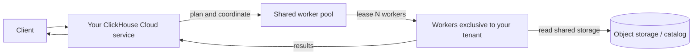
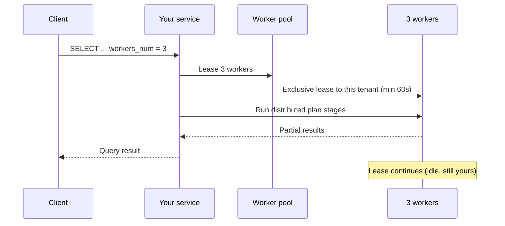
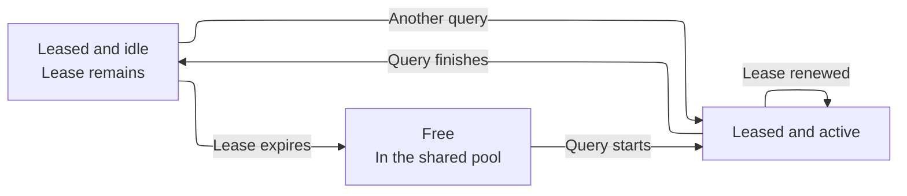
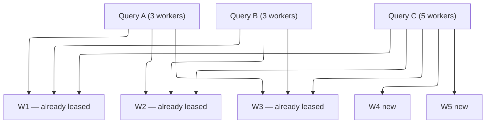

import { PrivatePreviewBadge } from "/snippets/ar/components/PrivatePreviewBadge/PrivatePreviewBadge.jsx";

<PrivatePreviewBadge />

<Note>
  On-Demand Compute متاح ضمن private preview. وهو غير مشمول بأهداف مستوى الخدمة (SLOs) أو اتفاقيات مستوى الخدمة (SLAs) الخاصة بـ ClickHouse Cloud، وقد تنطبق عليه قيود معروفة وأخرى غير معروفة. راجع [القيود](#limitations).

  [انضم إلى قائمة الانتظار](https://clickhouse.com/cloud/on-demand-compute-waitlist).
</Note>

On-Demand Compute هو إمكانية في ClickHouse Cloud تمنح الخدمة (أي tenant) موارد compute إضافية للأحمال المدعومة، دون الحاجة إلى تغيير حجم الخدمة أو تجهيز خدمة أخرى. ويجري تنفيذ هذا العمل على workers تابعة لـ ClickHouse خارج موارد compute الخاصة بالخدمة نفسها. وتأتي الـ workers من pool مُدار مشترك بين الـ tenants، إلا أن كل worker يُخصَّص لـ tenant واحد فقط في كل مرة.

خلال الـ private preview، يدعم On-Demand Compute استعلامات `SELECT` المؤهّلة. حيث تُدرج الاستعلام عبر الـ settings، فيخصّص ClickHouse workers من الـ pool لتنفيذه من خلال خدمتك والـ endpoint الحالي. أما background operations فهي جزء من هذه الإمكانية بمفهومها الأوسع، لكنها غير مدعومة في الـ private preview.

ويختلف ذلك عن [compute-compute separation](/ar/products/cloud/features/infrastructure/warehouses). فالـ warehouse يوفّر موارد compute مخصّصة وطويلة الأجل عبر خدمات متعددة تتشارك البيانات، بينما يوفّر On-Demand Compute workers مؤقتة من pool مشترك عبر خدمتك الحالية. وخلال الـ private preview، تطلب هذه الموارد على مستوى الاستعلام.

## متى تستخدم On-Demand Compute {#when-to-use-on-demand-compute}

خلال private preview، استخدم On-Demand Compute لاستعلامات `SELECT` المؤهلة والمكثفة حوسوبيًا التي ترغب في تشغيلها خارج compute الخاص بـ primary service:

* **الاستعلامات الفورية واستعلامات المحللين:** شغّل استعلامات `SELECT` المكثفة حوسوبيًا على workers إضافيين.
* **أحمال عمل القراءة غير الحرجة:** انقل عمليات reads المحددة بعيدًا عن primary service.
* **استعلامات data lake:** استعلم عن بيانات Apache Iceberg أو Delta Lake أو `SharedMergeTree` المدعومة على workers إضافيين.
* **compute إضافي مؤقت:** اطلب workers للاستعلامات المؤهلة دون إعادة تحجيم primary service.

يدعم private preview استعلامات `SELECT` فقط، ولا ينفّذ workers استعلامات `INSERT` أو DDL أو mutations أو background operations.

## كيفية العمل {#how-it-works}



1. ترسل استعلام `SELECT` مؤهلاً إلى ClickHouse Cloud service الخاصة بك، دون أي تغيير في نقطة النهاية أو المصادقة أو إعدادات RBAC.
2. تبني الـ service خطة استعلام موزعة وتطلب العدد المحدد من الـ workers من الـ pool المُدار.
3. يُسند ClickHouse الـ workers المتاحة إلى الـ service الخاصة بك.
4. تُنفّذ الـ workers مراحل الخطة المُسندة إليها من المخطط الموزع وتقرأ البيانات من وحدات التخزين المدعومة.
5. تنسّق الـ service الاستعلام وتُعيد النتيجة إلى الـ client.

خلال المعاينة الخاصة، يتمتع كل worker بـ ‏`8 vCPUs` و`32 GiB` من الذاكرة. استخدم `distributed_plan_workers_num` لتحديد عدد الـ workers التي يطلبها الاستعلام.

## استخدام موارد الحوسبة عند الطلب {#using-on-demand-compute}

### Settings {#settings}

أضف هذه الإعدادات على مستوى الـ query، أو على المستخدم، أو في settings profile.

| Setting                        | القيمة المطلوبة      | الغرض                                                                                                                                                            |
| ------------------------------ | -------------------- | ---------------------------------------------------------------------------------------------------------------------------------------------------------------- |
| `make_distributed_plan`        | Yes                  | يُمكّن distributed query plan التجريبي. مطلوب لـ On-Demand Compute.                                                                                              |
| `distributed_plan_workers_num` | Yes                  | عدد الـ workers المطلوب استئجارها لهذا الـ query. إذا كانت القيمة `0` (وهي القيمة الافتراضية)، فسيُنفَّذ الـ query على الـ service الخاص بك، لا على worker pool. |
| `enable_parallel_replicas`     | Yes (اضبطها على `0`) | الـ parallel replicas غير متوافقة مع distributed plan.                                                                                                           |

<Tip>
  خلال فترة المعاينة، اضبط الإعدادات على مستوى الـ query، أو أنشئ مستخدمًا منفصلًا بإعدادات مختلفة. فذلك يجعل من الواضح أي الـ statements تستخدم On-Demand Compute، ويتجنّب توريث default profiles في Cloud التي تُمكّن parallel replicas.
</Tip>

### مثال {#example}

```sql
SELECT
    sum(l_extendedprice * l_discount) AS revenue
FROM lineitem
WHERE
    l_shipdate >= DATE '1994-01-01'
    AND l_shipdate < DATE '1994-01-01' + INTERVAL 1 YEAR
    AND l_discount BETWEEN 0.06 - 0.01 AND 0.06 + 0.01
    AND l_quantity < 24
SETTINGS
    make_distributed_plan = 1,
    distributed_plan_workers_num = 3,
    enable_parallel_replicas = 0
```

يطلب هذا الـ query ثلاثة workers. ويعتمد عدد الـ workers التي يوفّرها ClickHouse على حدّ المعاينة الخاصة (private preview) وعلى سعة الـ pool المتاحة.

### استئجار الـ worker {#worker-leasing}

يستمر استئجار الـ worker مدة 60 ثانية على الأقل، ويُجدّد ClickHouse الاستئجار تلقائيًا طوال تنفيذ الـ query.

بعد انتهاء الـ query، تظل الـ workers مُخصَّصة للـ service إلى أن تنتهي مدة الاستئجار. ويمكن لأي query مؤهّل آخر من الـ service نفسه إعادة استخدام تلك الـ workers ما دام الاستئجار ساريًا، فلا يحتاج ClickHouse إلى طلب workers جديدة.

وعند انتهاء مدة الاستئجار، يُحرّر ClickHouse الـ workers من الـ service ويُنهيها.



بعد انتهاء الـ query، تبقى الـ workers الثلاثة مؤجَّرة (leased) للـ tenant الخاص بك لكنها في حالة idle إلى أن تنتهي مدة الـ lease.



إذا أرسلت استعلامًا آخر أثناء استمرار استئجار تلك العناصر العاملة (workers)، فيمكن إعادة استخدامها فورًا (دون بدء بارد).

أما إذا انتهت مدة الاستئجار، فإن ClickHouse يُعيد العناصر العاملة إلى المجمّع (إذ يتم إنهاؤها بدلًا من تركها خاملة في انتظار مستأجر آخر).

### الاستعلامات المتزامنة {#concurrent-queries}

يمكن للاستعلامات المتزامنة الصادرة عن خدمة ClickHouse Cloud نفسها أن تتشارك العمّال المخصّصين لها. ولا يطلب ClickHouse عمّالًا إضافيين إلا عندما يحتاج استعلام إلى عدد من العمّال يتجاوز ما هو مخصّص للخدمة أصلًا.

على سبيل المثال، إذا طلب استعلامان متزامنان ثلاثة عمّال لكل منهما، فبإمكانهما التشارك في العمّال الثلاثة أنفسهم. وإذا طلب استعلام آخر خمسة عمّال، فيمكن لـ ClickHouse استخدام العمّال الثلاثة المخصّصين وطلب اثنين إضافيين من التجمّع.

انظر المثال أدناه:

```sql
SELECT ... SETTINGS make_distributed_plan = 1, distributed_plan_workers_num = 3, ...;
SELECT ... SETTINGS make_distributed_plan = 1, distributed_plan_workers_num = 3, ...;
```

يتشارك كلاهما نفس الـ workers الثلاثة.

وإذا طلب استعلام ثالث متزامن خمسة workers:

```sql
SELECT ... SETTINGS make_distributed_plan = 1, distributed_plan_workers_num = 5, ...;
```

يُنفَّذ هذا الاستعلام على العمال الثلاثة الحاليين إضافةً إلى عاملَين تم استئجارهما حديثًا.



### عندما يتعذّر على الـ pool تلبية الطلب {#pool-capacity}

يقوم توافر الـ workers على مبدأ بذل أقصى جهد ممكن خلال private preview. فإذا كان عدد الـ workers المتاحة أقل من العدد المطلوب، يُنفَّذ الـ query بعدد الـ workers الذي يستطيع ClickHouse تخصيصه. على سبيل المثال، قد يُنفَّذ طلبٌ لخمسة workers بثلاثة فقط.

وإذا تعذّر استئجار أي worker، يفشل الـ query:

```text
No stateless workers available for tenant 'bronzeaws-cm-72': the discovery service leased none.
```

أعد محاولة تنفيذ الاستعلام. وإذا استمرت المشكلة، فتواصل مع فريق حسابك في ClickHouse — فقد يكون تجمّع المعاينة مستنفدًا أو غير مضبوط الحجم بشكل صحيح.

## Monitoring {#monitoring}

استخدم `system.query_log` في الـ service الخاص بك لمعرفة عدد الـ workers المخصّصة للـ query الخاص بك.

### عدد الـ workers المخصَّصة {#worker-provided}

```sql
SELECT
    ProfileEvents['StatelessWorkerRequested'],
    ProfileEvents['StatelessWorkerProvided']
FROM clusterAllReplicas(default, system.query_log)
WHERE query_id = '<YOUR_QUERY_ID>'
  AND type != 'QueryStart';
```

<Tip>
  اضبط `log_comment = 'on-demand'` (أو اسم workload) على استعلامات On-Demand لتتمكّن من تصفيتها دون الحاجة إلى تحليل `Settings`.
</Tip>

## المناطق المتاحة {#available-regions}

تعمل عمليات On-Demand Compute worker في المنطقة نفسها التي توجد بها خدمة ClickHouse Cloud الخاصة بك. وخلال مرحلة private preview، ستكون هذه الميزة متاحة في البداية لدى عدد محدد من مزوّدي الخدمات السحابية والمناطق. وعند التسجيل في قائمة الانتظار، يمكنك تحديد المزوّد والمنطقة المفضّلين لديك ليتمكن ClickHouse من تقييم مدى استحقاقك.

## التسعير {#pricing}

خلال private preview، تكون On-Demand Compute مجانية، مع حد أقصى للاستخدام (راجع [القيود](#limitations)). تواصل مع ClickHouse account team إذا كنت بحاجة إلى رفع هذا الحد.

سيبدأ تطبيق التسعير عند انتهاء المعاينة، وسيتم إشعار المشاركين فيها قبل ترقية الميزة إلى Beta وقبل بدء احتساب أي رسوم.

النموذج المُعتمد هو ذاته المُتَّبع في compute الخاص بـ ClickHouse Cloud: تدفع مقابل ما تستخدمه من compute (وقت worker المُستأجَر)، وليس مقابل البيانات المفحوصة أو الصفوف المقروءة.

## القيود {#limitations}

تنطبق القيود التالية خلال private preview، وقد تنطبق قيود أخرى. أبلغ عن أي سلوك غير متوقع إلى ClickHouse Support أو إلى account team الخاص بك.

* **استعلامات `SELECT` فقط.** لا تنفّذ الـ workers استعلامات `INSERT`، ولا mutations، ولا DDL، ولا background operations.
* **البيانات المدعومة.** يدعم private preview كلاً من Apache Iceberg وDelta Lake و`SharedMergeTree`.
* **Parallel replicas.** يجب تعطيل parallel replicas.
* **حجم الـ worker.** يحتوي كل worker على `8 vCPUs` و`32 GiB` من الذاكرة.
* **الحد الأقصى للـ workers.** يمكن لكل query طلب ما يصل إلى خمسة workers خلال private preview.
* **سعة المجموعة.** توافر الـ workers يقوم على أفضل جهد ممكن، فقد يحصل الـ query على عدد workers أقل من المطلوب، وإذا لم يتوفر أي worker يفشل الـ query.
* **الأداء.** يتفاوت الأداء من query إلى آخر، إذ قد يؤدي تخصيص الـ workers والتخطيط الموزع ونقل مراحل الـ plan إلى زيادة الـ latency. وقد يكون أداء بعض أشكال الاستعلامات أدنى من أدائها عند التنفيذ على primary service.
* **توافقية الاستعلامات.** لا يستطيع distributed planner تنفيذ كل query plan عن بُعد، وقد تُعيد الاستعلامات غير المدعومة exception من النوع `SUPPORT_IS_DISABLED`.

تشمل حالات الفشل الشائعة ما يلي:

| المجال                                                               | ما يحدث                                                                |
| -------------------------------------------------------------------- | ---------------------------------------------------------------------- |
| Parallel replicas                                                    | تُرفض؛ عطّل الإعدادات المذكورة أعلاه.                                  |
| window functions مع `PARTITION BY`                                   | تُرفض غالباً حتى يتمكن الـ planner من إعادة التوزيع وفق partition key. |
| قراءات جداول `system`                                                | ليست مبنية على تخزين مشترك.                                            |
| correlated subqueries في بعض الأشكال                                 | قد تُرفض أو تُعاد كتابتها بكفاءة أقل.                                  |
| projections، وskip indexes عند قراءة البيانات، وتصريف الـ expression | تُعطّل لهذا الـ query بدلاً من إرجاع exception.                        |

## Roadmap {#roadmap}

يُعدّ On-Demand Compute أساسًا يُبنى عليه. ومن الأعمال الجارية أو المقبلة:

* معالجة القيود المعروفة (فجوات `SUPPORT_IS_DISABLED`).
* تجمّعات (pools) بأحجام worker مختلفة.
* تثبيت أداء الاستعلامات مقارنةً بالتنفيذ Stateful.
* دعم الدمج في الخلفية (background merge).
* التسعير.
* معايرة أداة التوسيع التلقائي لتجمّع الـ worker.
* مقاييس Console والمراقبة.
* صلاحيات مخصّصة لـ On-Demand Compute.

## الأمان {#security}

لا تُغيّر ميزة On-Demand Compute طريقة اتصالك بـ ClickHouse Cloud. إذ تظل العملاء (clients) تُصادق على هويتها لدى الـ service الخاصة بك، ولا تُتيح الـ workers مطلقًا أي query endpoint عام.

أما الأدوار (roles) والصلاحيات (permissions) المخصّصة لـ On-Demand فهي غير متاحة في الإصدار التجريبي (راجع [خريطة الطريق](#roadmap)). وإلى حين توفّرها، يستطيع أي شخص قادر على تنفيذ `SELECT` بالإعدادات المذكورة أعلاه على الـ service الخاصة بك استخدام الـ workers، وذلك في حدود QUOTA الإصدار التجريبي.

## FAQ {#faq}

<AccordionGroup>
  <Accordion title="هل On-Demand Compute مفتوح المصدر؟">
    لا. إنها معمارية خاصة بـ ClickHouse Cloud: ClickHouse server ‏(distributed plan)، ومستوى البيانات (مجمّع الـ workers والـ leases)، والـ control plane. الإعداد التجريبي `make_distributed_plan` موجود في ClickHouse، إلا أن مجمّع الـ workers المشترك والتنفيذ عديم الحالة (stateless) متاحان في Cloud فقط.
  </Accordion>

  <Accordion title="هل أحتاج إلى إصدار محدد للانضمام إلى المعاينة الخاصة؟">
    نعم. سيؤكد لك فريق ClickHouse ما إذا كانت خدمتك تحتاج إلى ترقية قبل الانضمام إلى المعاينة الخاصة. وقد تكون هناك ترقيات إضافية مطلوبة أثناء المعاينة.
  </Accordion>

  <Accordion title="كيف سيكون التسعير؟">
    لا توجد رسوم إضافية أثناء المعاينة الخاصة، وذلك ضمن حدود المعاينة. وسيُعلن عن تسعير مراحل الإصدار اللاحقة قبل تطبيق أي رسوم. ومع ذلك، يتبع التسعير الفلسفة نفسها المعتمدة في ClickHouse Cloud: الاحتساب على أساس الـ compute المستخدم، لا على أساس البيانات الممسوحة أو الصفوف المقروءة. وستُنشر الأسعار الدقيقة قبل بدء الإتاحة العامة أو احتساب الرسوم في مرحلة البيتا.
  </Accordion>

  <Accordion title="هل يمكنني استخدام هذا في الإنتاج؟">
    يمكنك تشغيل أعباء عمل حقيقية، لكن هذه معاينة خاصة: هناك قيود معروفة وأخرى غير معروفة، ولا يوجد SLO/SLA لتوافر مجمّع الـ workers. تلتزم ClickHouse بدعم المتبنّين الأوائل؛ لذا تعامل معها كمعاينة، لا كضمان للإنتاج.
  </Accordion>

  <Accordion title="ما الفرق بين هذا وبين autoscaling لخدمتي؟">
    يغيّر الـ autoscaling الـ compute المخصص لخدمتك الأساسية. أما On-Demand Compute فيمنح، أثناء المعاينة الخاصة، استعلامات `SELECT` المؤهلة وصولاً مؤقتاً إلى workers من مجمّع مُدار دون تغيير حجم الخدمة الأساسية. فالـ autoscaling يدير سعة الخدمة على نحو مستمر، بينما يوفّر On-Demand Compute موارد compute مؤقتة لأعباء عمل محددة.
  </Accordion>

  <Accordion title="ما الفرق بين هذا وبين الـ warehouse أو compute-compute separation؟">
    يوفّر compute-compute separation موارد compute مخصصة عبر خدمات متعددة في ClickHouse Cloud تتشارك البيانات نفسها. أما On-Demand Compute فيوفّر موارد compute مؤقتة من مجمّع مُدار عبر خدمتك الحالية. وأثناء المعاينة الخاصة، يُطلب هذا الـ compute على مستوى الاستعلام. وقد صُممت هذه القدرة بصورتها الأوسع لدعم تنفيذ الاستعلامات والعمليات التي تجري في الخلفية معاً.
  </Accordion>

  <Accordion title="أين يمكنني طرح الأسئلة؟">
    اسأل فريق الحساب الخاص بك؛ وسيعرّفك على مدير المنتج المسؤول عن On-Demand Compute.
  </Accordion>

  <Accordion title="أين يمكنني الإبلاغ عن الأخطاء البرمجية؟">
    افتح تذكرة دعم (درجة الخطورة 3) أو أبلغ بها مدير المنتج. وأرفق `query_id` والاستثناء كاملاً.
  </Accordion>

  <Accordion title="هل هذا متاح في ClickHouse BYOC أو ClickHouse Private؟">
    لا. المعاينة الخاصة غير متاحة في ClickHouse BYOC أو ClickHouse Private.
  </Accordion>
</AccordionGroup>