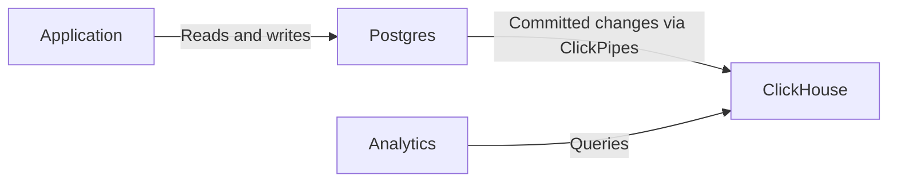

import { BetaBadge } from "/snippets/ar/components/BetaBadge/BetaBadge.jsx";

<BetaBadge link="https://clickhouse.com/cloud/postgres" galaxyTrack={true} galaxyEvent="docs.managed-postgres.overview-beta" />

ClickHouse Managed Postgres هي خدمة Postgres مُدارة على مستوى المؤسسات، ومصممة للأداء وقابلية التوسع. وبالاستناد إلى تخزين NVMe المتواجد فعليًا إلى جانب موارد المعالجة، توفّر أداءً أسرع بما يصل إلى 10 أضعاف لأعباء العمل المقيّدة بأداء القرص مقارنةً بالبدائل التي تستخدم وحدة تخزين متصلة بالشبكة مثل EBS.

وقد طُوّرت بالشراكة مع [Ubicloud](https://www.ubicloud.com/)، إذ يمتلك فريقها المؤسس سجلًا حافلًا في تقديم Postgres عالمي المستوى في Citus Data وHeroku وMicrosoft. ويعالج ClickHouse Managed Postgres تحديات الأداء التي تواجهها التطبيقات سريعة النمو عادةً، مثل بطء إدخال البيانات والتحديثات، وبطء عمليات VACUUM، وارتفاع زمن الاستجابة عند الذيل، وارتفاعات WAL المفاجئة الناتجة عن محدودية IOPS الخاصة بالقرص.

## Postgres للمعاملات، ClickHouse للتحليلات {#transactions-and-analytics}

استخدم Postgres لأحمال عمل التطبيقات المعاملاتية (OLTP)، مثل إنشاء الطلبات وتحديث المخزون وإدارة حسابات المستخدمين. فـ Postgres هو نظام السجل المرجعي لديك: حيث يمكن تثبيت التغييرات المرتبطة أو التراجع عنها معًا ضمن معاملة واحدة.

وعندما يحتاج تطبيقك أيضًا إلى تحليلات على مجموعات بيانات كبيرة، أضف خدمة ClickHouse واربط بينهما باستخدام ClickPipes:

1. يقرأ تطبيقك البيانات التشغيلية ويكتبها في Postgres، مستخدماً المعاملات لتجميع التغييرات المرتبطة معاً.
2. [قم بتهيئة ClickPipes](/ar/products/managed-postgres/clickhouse-integration) لنسخ جداول محددة إلى ClickHouse ونسخ عمليات الإدراج والتحديث والحذف المُثبَّتة نسخاً متماثلاً مستمراً باستخدام التقاط تغييرات البيانات (CDC).
3. نفّذ الاستعلامات التحليلية في ClickHouse. يمكنك الاتصال بـ ClickHouse مباشرةً أو الاستعلام عن جداوله من Postgres عبر امتداد [`pg_clickhouse`](/ar/products/managed-postgres/extensions/pg_clickhouse/introduction).

النسخ المتماثل غير متزامن، لذا قد تتأخر النتائج التحليلية عن تغييرات Postgres المُثبَّتة. ولكل من قاعدتي البيانات حدود معاملات منفصلة: فلا يوفر CDC ولا `pg_clickhouse` معاملة مشتركة بين Postgres وClickHouse. أما عمليات القراءة التي تتطلب أحدث حالة مُثبَّتة للتطبيق، فينبغي أن تستخدم Postgres.

يمكنك البدء بـ Postgres وحده ثم إضافة ClickHouse عند الحاجة. اتبع [دليل البدء السريع لـ ClickHouse Managed Postgres](/ar/products/managed-postgres/quickstart) لتجربة الخدمتين، أو انتقل مباشرةً إلى [إضافة التحليلات](/ar/products/managed-postgres/quickstart#part-2) إن كانت لديك خدمة Postgres بالفعل.

## أداء يعتمد على NVMe {#nvme-performance}

تستخدم معظم خدمات Postgres المُدارة وحدات تخزين متصلة بالشبكة مثل Amazon EBS، ما يتطلب انتقالًا ذهابًا وإيابًا عبر الشبكة مع كل عملية وصول إلى القرص. ويؤدي ذلك إلى زيادة زمن الاستجابة إلى مستوى المللي ثانية ويحدّ من IOPS، مما يسبب اختناقات في أحمال العمل كثيفة الكتابة أو كثيفة الإدخال/الإخراج.

يستخدم ClickHouse Managed Postgres تخزين NVMe المتصل فعليًا بالخادم نفسه الذي توجد عليه قاعدة بياناتك. ويوفر هذا الاختلاف المعماري ما يلي:

* **زمن استجابة للقرص على مستوى الميكروثانية** بدلًا من المللي ثانية
* **حدود IOPS مستدامة أعلى بمقدار 10x*** من دون اختناقات الشبكة
* **أداء أسرع حتى 10x** لأحمال العمل المقيّدة بأداء القرص بالتكلفة نفسها

وبالنسبة إلى أحمال عمل Postgres التي يحدّها أساسًا IOPS الخاص بالقرص وزمن الاستجابة، ينعكس ذلك في تسريع إدخال البيانات، وتسريع عمليات VACUUM، وخفض زمن الاستجابة عند الذيل، وتقديم أداء أكثر قابلية للتنبؤ تحت الضغط.

<Note>
  تعرّف على سرعة Postgres على أقراص NVMe من خلال [اختبارات الأداء](https://clickhouse.com/blog/postgresbench).
</Note>

للاطلاع على حدود NVMe المحلية على AWS، راجع [محسّن للذاكرة](https://docs.aws.amazon.com/ec2/latest/instancetypes/mo.html#mo_instance-store)، و[محسّن للتخزين](https://docs.aws.amazon.com/ec2/latest/instancetypes/so.html#so_instance-store)، و[محسّن لوحدة المعالجة المركزية](https://docs.aws.amazon.com/ec2/latest/instancetypes/gp.html#gp_instance-store). وبالنسبة إلى GCP، راجع [أقراص Local SSD](https://cloud.google.com/compute/docs/disks/local-ssd).

## مزودو السحابة المدعومون {#supported-cloud-providers}

يتوفر ClickHouse Managed Postgres لدى مزودي السحابة التاليين:

| مزود السحابة | التوافر         |
| ------------ | --------------- |
| AWS          | Public Beta     |
| GCP          | Private Preview |

<Note>
  لا يزال ClickHouse Managed Postgres على GCP في مرحلة Private Preview. يمكنك التسجيل في قائمة انتظار Private Preview الخاصة بـ GCP [من هنا](https://clickhouse.com/cloud/postgres#gcp-waitlist). واطّلع على [الإعلان](https://clickhouse.com/blog/postgres-managed-by-clickhouse-gcp-private-preview) لمعرفة المزيد.
</Note>

## تكامل ClickHouse الأصلي {#clickhouse-integration}

يوفّر ClickHouse Managed Postgres تكاملًا أصليًا مع ClickHouse، ليجمع بين المعاملات والتحليلات من دون عمليات ETL معقدة.

### النسخ المتماثل من Postgres إلى ClickHouse {#postgres-replication}

انسخ بيانات Postgres إلى ClickHouse باستخدام [موصل Postgres CDC في ClickPipes](/ar/integrations/clickpipes/postgres/index). يتولى هذا الموصل كلاً من التحميل الأولي والمزامنة التزايدية المستمرة، وقد أثبت موثوقيته لدى مئات العملاء من المؤسسات الذين ينقلون مئات التيرابايتات شهريًا.

### pg_clickhouse: طبقة استعلام موحّدة {#pg-clickhouse}

يأتي كل مثيل من ClickHouse Managed Postgres مزوّدًا بامتداد [`pg_clickhouse`](https://github.com/ClickHouse/pg_clickhouse)، والذي يتيح لك الاستعلام من ClickHouse مباشرةً عبر Postgres. ويمكن لتطبيقك استخدام Postgres كطبقة استعلام موحّدة لكلٍّ من المعاملات والتحليلات، من دون الحاجة إلى الاتصال بعدة قواعد بيانات.

يوفّر الامتداد تمريرًا شاملاً للاستعلامات إلى ClickHouse لتنفيذها بكفاءة، بما في ذلك دعم عوامل التصفية، وعمليات الربط، وأشباه الربط، والتجميعات، والدوال. حاليًا، يُمرَّر 14 استعلامًا من أصل 22 من استعلامات TPC-H بالكامل، ما يحقق تحسينات في الأداء تتجاوز 60X مقارنةً بتشغيل الاستعلامات نفسها في Postgres القياسي.

## موثوقية بمستوى المؤسسات {#enterprise-reliability}

يوفّر ClickHouse Managed Postgres ميزات الموثوقية والأمان اللازمة لأحمال العمل في بيئة الإنتاج.

### التوافر العالي {#high-availability}

هيّئ ما يصل إلى نسختين متماثلتين احتياطيتين عبر مناطق توافر مختلفة باستخدام النسخ المتماثل المعتمد على النصاب. هذه النُسخ الاحتياطية مخصّصة للتوافر العالي والتبديل التلقائي عند الفشل، ما يضمن تعافي قاعدة البيانات بسرعة من الأعطال. ولتوسيع نطاق القراءة، يمكنك توفير [نسخ متماثلة للقراءة](/ar/products/managed-postgres/read-replicas) منفصلة. راجع صفحة [التوافر العالي](/ar/products/managed-postgres/high-availability) للاطلاع على تفاصيل التهيئة.

### النسخ الاحتياطية والاسترداد {#backups}

يتضمن كل مثيل نسخًا احتياطية تلقائية تدعم التفرعات والاسترداد إلى نقطة زمنية محددة. تعتمد النسخ الاحتياطية على [WAL-G](https://github.com/wal-g/wal-g)، وهي أداة مفتوحة المصدر معروفة تتولى إجراء النسخ الاحتياطية الكاملة وأرشفة WAL بشكل مستمر إلى تخزين الكائنات.

### الأمان والامتثال {#security-compliance}

تم تصميم ClickHouse Managed Postgres ليلبّي معايير الأمان نفسها المعتمدة في ClickHouse Cloud:

* **المصادقة**: دعم SAML/SSO
* **أمان الشبكة**: قائمة سماح لعناوين IP، وتشفير البيانات المخزنة وأثناء النقل (TLS 1.3)
* **التحكم في الوصول**: صلاحيات superuser كاملة لإدارة قاعدة البيانات

### أساس مفتوح المصدر {#open-source}

يُعد كلٌّ من Postgres وClickHouse قاعدتي بيانات مفتوحتي المصدر، ولكلٍ منهما مجتمع كبير ونشط. كما أن مكونات التكامل، بما في ذلك امتداد `pg_clickhouse` والنسخ المتماثل عبر CDC والمدعوم من PeerDB، مفتوحة المصدر أيضًا. ويضمن هذا الأساس عدم الارتباط بمورّد واحد، مما يمنحك تحكمًا كاملًا ومرونة طويلة الأمد في مكدس بياناتك.