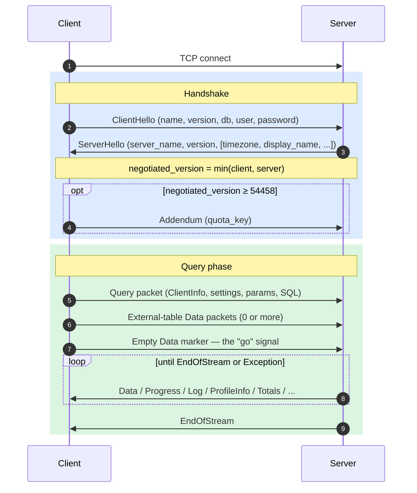
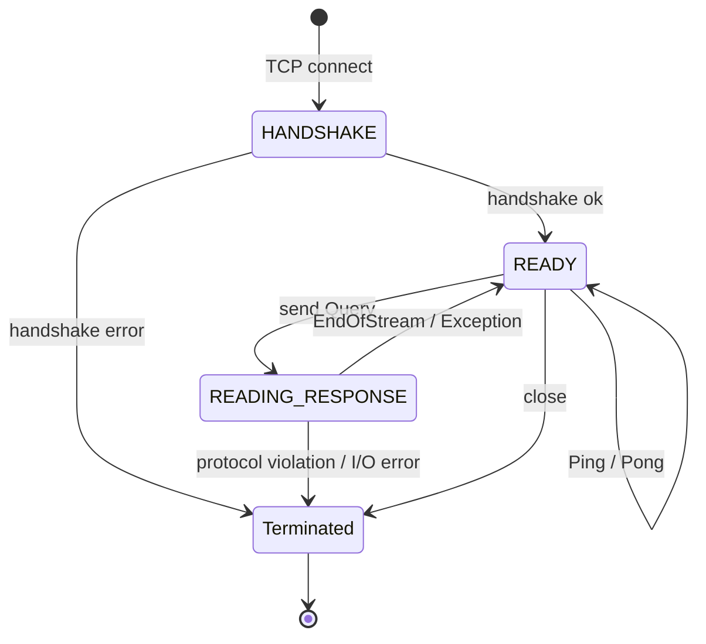
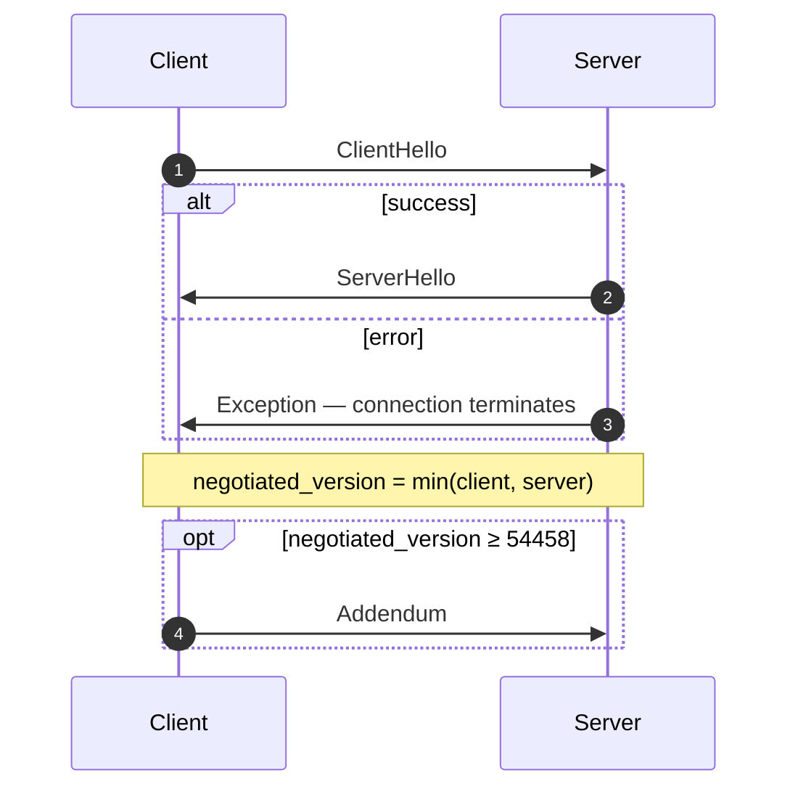
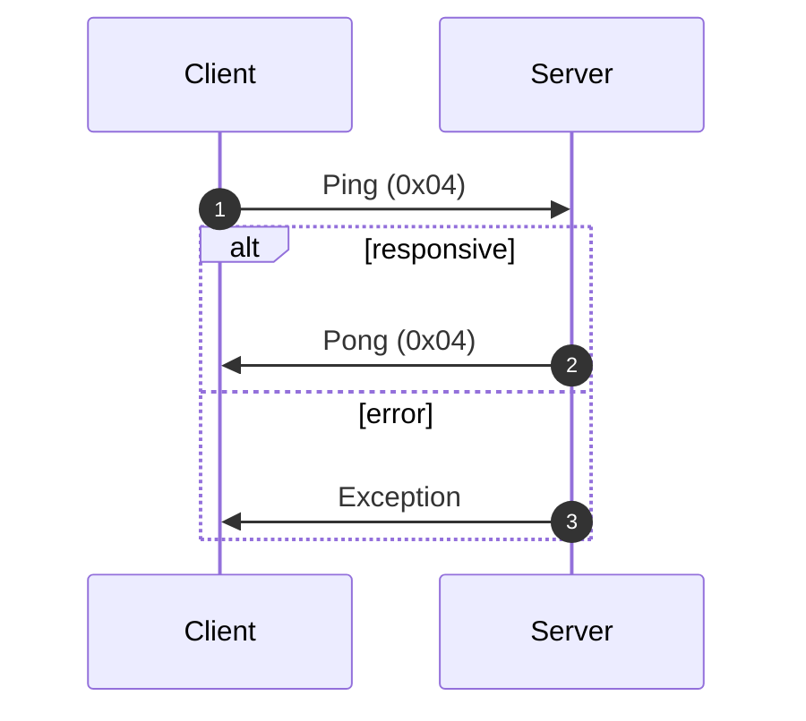
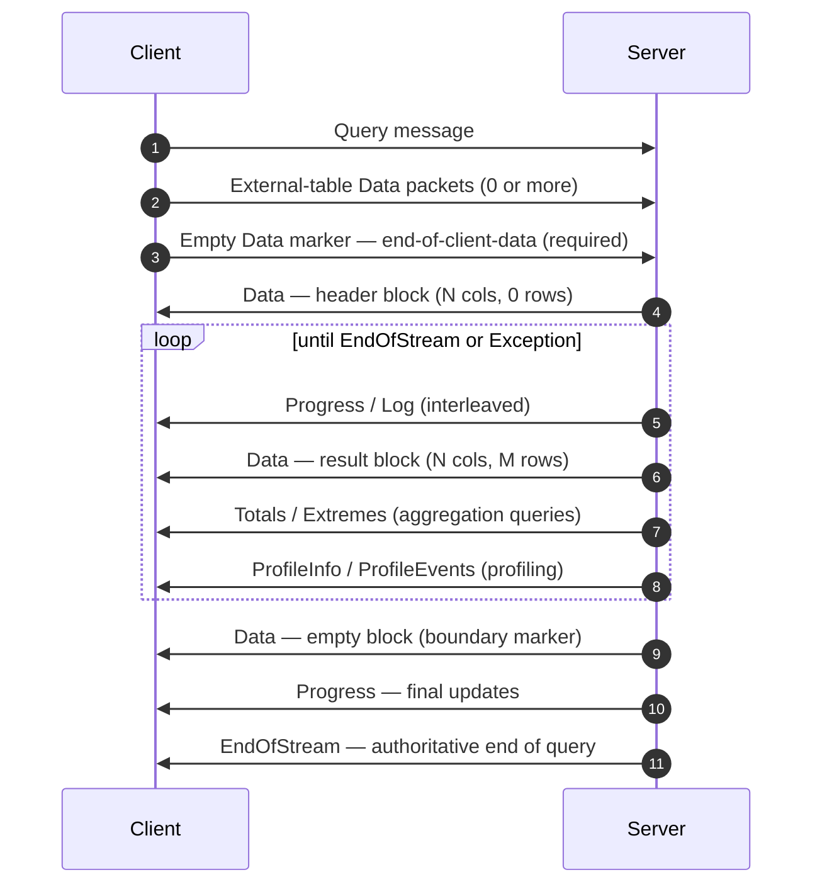
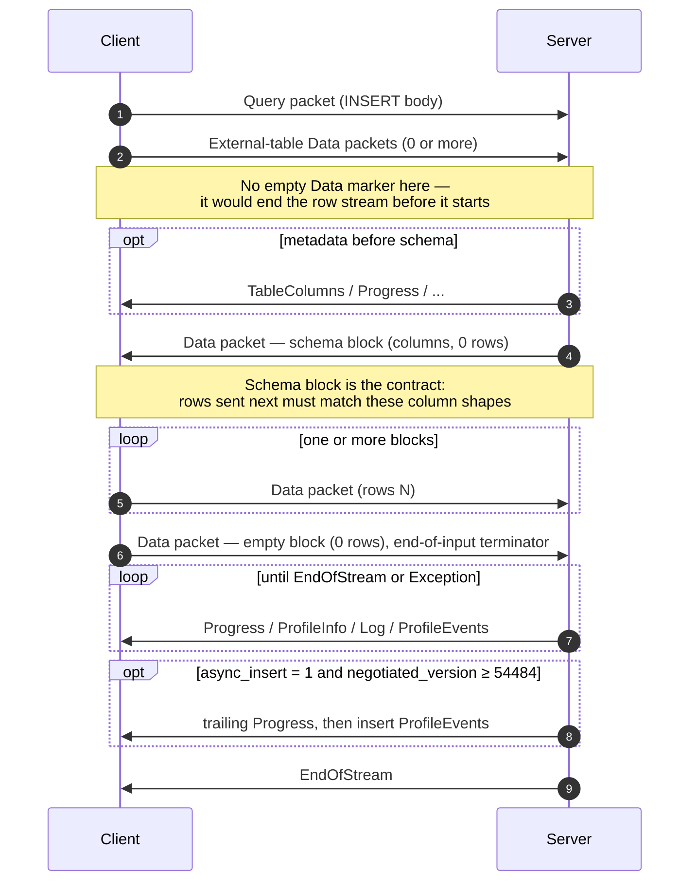
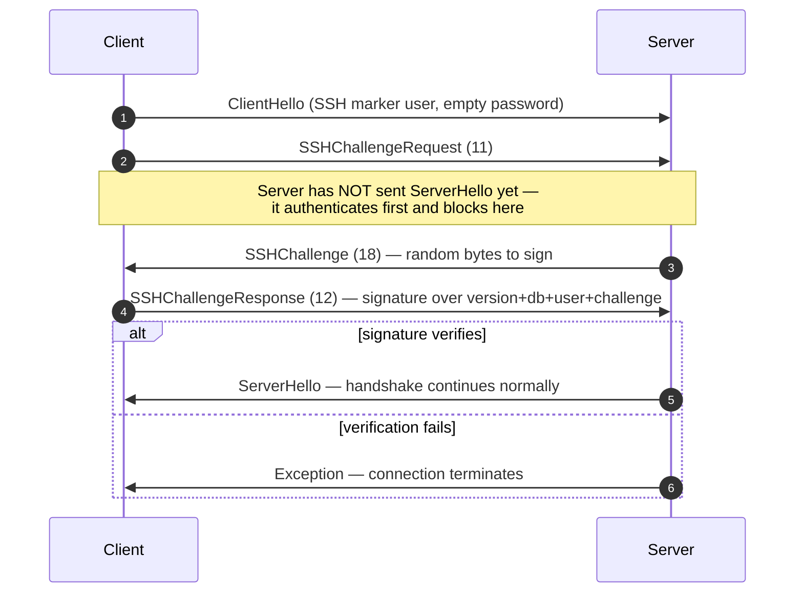

البروتوكول الأصلي هو بروتوكول ثنائي قائم على الاتصال، يتخاطب به عملاء ClickHouse وخوادمه عبر TCP. ويحمل هذا البروتوكول استعلامات SQL، وبيانات النتائج، وحمولات `INSERT`، وبيانات القياس عن بُعد الخاصة بالتنفيذ، وإشارات الأخطاء. وعليه يعتمد عميل سطر الأوامر، ومشغّل C++‎، ومعظم المشغّلات الأصلية التابعة لجهات خارجية.

تتناول هذه الصفحة البروتوكول نفسه: تأطير الحزم، وآلة حالات الاتصال، والتفاوض على الإصدار، ومتن كل رسالة من غير نوع `Block`. أما البايتات داخل حزم عائلة `Data` (أي `Block` وأعمدتها وترميزات كل نوع) فهي مسألة مستقلة، موثّقة في مواصفة [صيغة Native](/ar/resources/develop-contribute/native-protocol/format).

<Info>
  **المواصفة المرافقة**

  هذه الصفحة جزء من مواصفتين متكاملتين، وتُنشر جنبًا إلى جنب مع المواصفة المرافقة [صيغة Native](/ar/resources/develop-contribute/native-protocol/format). وتتقاسم المواصفتان العمل بحدود واضحة: تختص هذه الصفحة بطبقة الحزم والنقل، بينما تختص مواصفة صيغة Native بالبايتات داخل حزم عائلة `Data`.
</Info>

ثمة خصائص تسري على البروتوكول بأكمله. فهو ثنائي وموضعي: لا توجد وسوم حقول إلا داخل `BlockInfo`، ولذا فإن بايتًا واحدًا في غير موضعه يُخلّ بتزامن كل ما يليه. وهو كذلك بروتوكول ذو حالة، يعالج فيه كل اتصال TCP استعلامًا واحدًا في كل مرة، فلا يدعم تعدد الإرسال. أما الأعداد الصحيحة ثابتة العرض فتُخزَّن بترتيب little-endian.

## نظرة عامة {#overview}

| الخاصية         | القيمة                                                                                      |
| --------------- | ------------------------------------------------------------------------------------------- |
| النقل           | TCP، ويمكن تغليفه اختياريًا بطبقة TLS                                                       |
| ترتيب البايتات  | Little-endian للأعداد الصحيحة ذات العرض الثابت                                              |
| الترميز         | ثنائي وموضعي (دون وسوم حقول إلا في `BlockInfo`)                                             |
| نموذج الاتصال   | ذو حالة، استعلام واحد في كل مرة، دون تعدد الإرسال                                           |
| إدارة الإصدارات | يُتفق عليها أثناء المصافحة، وتتوقف إتاحة الميزات الفردية على الإصدار                      |
| صيغة البيانات   | [صيغة Native](/ar/resources/develop-contribute/native-protocol/format) لجميع البيانات الجدولية |

تبدأ كل رسالة في تنسيق النقل برمز نوع الحزمة بصيغة `VarUInt`، يليه متن تتحدد بنيته وفقًا لهذا الرمز ولإصدار البروتوكول المتفق عليه.

يمر الاتصال بثلاث مراحل: مصافحة تُجرى مرة واحدة، ثم أي عدد من عمليات تبادل `Ping` أو `Query`، ثم الإغلاق:



ينقل بروتوكول TCP الأصلي البيانات الجدولية دائمًا بصيغة Native، بصرف النظر عن أي عبارة `FORMAT` في استعلام SQL. أما إعادة تحويلها إلى `RowBinary` أو `CSV` أو `JSON` وغيرها فهي مهمة العميل، ويتولاها بعد فك ترميز كتل Native. (أما واجهة HTTP فتعتمد مسار شيفرة مختلفًا *يلتزم* فعلًا بعبارة `FORMAT`، إلا أن HTTP يقع خارج نطاق هذا المستند.)

## الأمان {#security}

### أمان النقل (TLS) {#transport-security}

يعمل TLS في طبقة النقل، أي في مستوى أدنى من البروتوكول. وعند تفعيله يُشفَّر تدفق TCP بأكمله، وتظل رسائل البروتوكول متطابقة بايتًا ببايت، سواء استُخدم TLS أم لم يُستخدم.

### المصادقة {#authentication}

تتم المصادقة أثناء المصافحة، ضمن رسالة [`ClientHello`](#clienthello). ويُرسَل الحقلان `user` و`password` على هيئة سلاسل نصية بنص صريح، لذا فإن التشفير على مستوى النقل (TLS) هو ما يحمي بيانات الاعتماد أثناء انتقالها عبر الشبكة.

يفسّر الخادم الحقل `user` الفارغ على أنه مستخدم الجلسة الافتراضي المُهيّأ لديه، أي قيمة إعداد الخادم `default_session_user` (وقيمته الافتراضية `default`)، ويمكن استبدال هذه القيمة لكل مستمع على حدة في القسم `protocols`. وإذا هُيّئ الخادم بمستخدم جلسة افتراضي فارغ، أو كان إصداره أقدم من 26.8، فسيُرفض الحقل `user` الفارغ ويُطلَق استثناء. لاحظ أن `clickhouse-client` لا يرسل اسم مستخدم فارغًا أبدًا، إذ يستعيض عنه بالقيمة `default` من جهة العميل.

تتوفر مصادقة SSH القائمة على التحدي والاستجابة بدءًا من إصدار البروتوكول 54466 — راجع [مصادقة SSH القائمة على التحدي والاستجابة](#ssh-authentication).

### السر المشترك بين الخوادم {#inter-server-secret}

عند تنفيذ الاستعلامات الموزعة، تتحقق الخوادم من هوية بعضها بعضًا بإثبات معرفتها بـ secret مشترك، دون إرسال الـ secret نفسه في تنسيق النقل. تحمل كل رسالة Query قيمة `auth_hash` بطول 32 بايت محسوبة بخوارزمية SHA-256 في الحقل 4 من [`Query`](#query). وتُحسب هذه القيمة من ملح (salt) وقيمة nonce والـ secret المُهيأ ونص الاستعلام، ثم يعيد الخادم المستقبِل حسابها ويقارنها بالقيمة المستلمة. ولا تتوفر هذه الآلية إلا عند تفعيل الميزة `INTERSERVER_SECRET` (v54441). أما العملاء الخارجيون فيرسلون دائمًا سلسلة فارغة في هذا الحقل. راجع [المصادقة بين الخوادم](#inter-server-authentication).

## إدارة الإصدارات وبوابات الميزات {#versioning-and-feature-gates}

### التفاوض على الإصدار {#version-negotiation}

يُعلن كلٌّ من العميل والخادم أثناء المصافحة عن أعلى إصدار من البروتوكول يدعمه. ويكون **الإصدار المتفق عليه** هو الأدنى بين الإصدارين:

```text
negotiated_version = min(client_version, server_version)
```

تعتمد كل رسالة تالية على الإصدار المتفق عليه لتحديد الحقول الموجودة في تنسيق النقل.

### بوابات الميزات {#feature-gates}

تُعرَّف كل ميزة بإصدار البروتوكول الذي أُضيفت فيه، وتكون **نشطة** متى كان الإصدار المتفق عليه أكبر من ذلك الرقم أو مساويًا له.

<Warning>
  عندما تكون الميزة نشطة، **يجب** أن تكون حقولها موجودة في تنسيق النقل. فالبروتوكول يعتمد على ترتيب الحقول اعتمادًا صارمًا، ولذلك فإن حذف أي حقل مرتبط ببوابة ميزة يُفسد تدفق البايتات لجميع الحقول التي تليه.
</Warning>

### جدول الميزات {#feature-table}

| الميزة                                                       | الإصدار | نطاق التأثير                     | التأثير على تنسيق النقل الثنائي                                                                                                                                                                                                                                                                                                                                                                                                                                                                                                                                                                                                                                                                    |
| ------------------------------------------------------------ | ------- | -------------------------------- | -------------------------------------------------------------------------------------------------------------------------------------------------------------------------------------------------------------------------------------------------------------------------------------------------------------------------------------------------------------------------------------------------------------------------------------------------------------------------------------------------------------------------------------------------------------------------------------------------------------------------------------------------------------------------------------------------- |
| BLOCK&#95;INFO                                               | all     | Block                            | يضيف البادئة BlockInfo (`is_overflows`، `bucket_number`) إلى كل Block.                                                                                                                                                                                                                                                                                                                                                                                                                                                                                                                                                                                                                             |
| CLIENT&#95;INFO                                              | 54032   | Query                            | يضيف كتلة ClientInfo إلى متن Query.                                                                                                                                                                                                                                                                                                                                                                                                                                                                                                                                                                                                                                                                |
| TIMEZONE                                                     | 54058   | ServerHello                      | يضيف الحقل `timezone` إلى ServerHello.                                                                                                                                                                                                                                                                                                                                                                                                                                                                                                                                                                                                                                                             |
| QUOTA&#95;KEY&#95;IN&#95;CLIENT&#95;INFO                     | 54060   | ClientInfo                       | يضيف الحقل `quota_key` إلى ClientInfo.                                                                                                                                                                                                                                                                                                                                                                                                                                                                                                                                                                                                                                                             |
| DISPLAY&#95;NAME                                             | 54372   | ServerHello                      | يضيف الحقل `display_name` إلى ServerHello.                                                                                                                                                                                                                                                                                                                                                                                                                                                                                                                                                                                                                                                         |
| VERSION&#95;PATCH                                            | 54401   | ServerHello, ClientInfo          | يضيف الحقل `version_patch` إلى كليهما.                                                                                                                                                                                                                                                                                                                                                                                                                                                                                                                                                                                                                                                             |
| SERVER&#95;LOGS                                              | 54406   | Log                              | يُرسل الخادم حزم Log عند ضبط `send_logs_level`.                                                                                                                                                                                                                                                                                                                                                                                                                                                                                                                                                                                                                                                    |
| COLUMN&#95;DEFAULTS&#95;METADATA                             | 54410   | TableColumns                     | قد يُرسل الخادم الحزمة [`TableColumns`](#tablecolumns) (النوع 11) متضمنةً البيانات الوصفية للقيم الافتراضية للأعمدة قبل كتلة مخطط INSERT/الإدخال. لا تُرسَل إلا إذا كان الإصدار المتفاوض عليه ≥ 54410 **وكان** الإعداد `input_format_defaults_for_omitted_fields` مفعّلًا. أما في الإصدارات الأقدم فلا تُرسَل الحزمة إطلاقًا، لذا يجب ألا ينتظرها العملاء.                                                                                                                                                                                                                                                                                                                                         |
| WRITE&#95;CLIENT&#95;INFO                                    | 54420   | Progress                         | يضيف `wrote_rows` و`wrote_bytes` إلى Progress. (على الرغم من اسمها، فهذه الميزة **لا** تتحكم في كتلة ClientInfo، إذ يتحكم فيها `CLIENT_INFO` (v54032).)                                                                                                                                                                                                                                                                                                                                                                                                                                                                                                                                            |
| SETTINGS&#95;SERIALIZED&#95;AS&#95;STRINGS                   | 54429   | Query (ترميز الإعدادات)          | يغيّر **طريقة** ترميز قائمة الإعدادات التي تُرسَل دائمًا، و**لا** يحدد ما إذا كانت الإعدادات تُرسَل أم لا. يكتب الإصدار v54429 وما بعده كل إعداد بالشكل `(name, flags, value-as-string)`، بينما تكتب الأطراف الأقدم `(name, type-specific-binary-value)` دون أعلام. راجع [Setting](#setting).                                                                                                                                                                                                                                                                                                                                                                                                      |
| INTERSERVER&#95;SECRET                                       | 54441   | Query                            | يضيف إلى Query الحقل `auth_hash` الخاص بالاتصال بين الخوادم، وهو تجزئة SHA-256 مملّحة محسوبة من سر العنقود، وليس السر الخام نفسه. يُرسل العملاء الخارجيون سلسلة فارغة. راجع [المصادقة بين الخوادم](#inter-server-authentication).                                                                                                                                                                                                                                                                                                                                                                                                                                                                  |
| OPEN&#95;TELEMETRY                                           | 54442   | ClientInfo                       | يضيف سياق تتبّع OpenTelemetry إلى ClientInfo.                                                                                                                                                                                                                                                                                                                                                                                                                                                                                                                                                                                                                                                      |
| DISTRIBUTED&#95;DEPTH                                        | 54448   | ClientInfo                       | يضيف الحقل `distributed_depth` إلى ClientInfo.                                                                                                                                                                                                                                                                                                                                                                                                                                                                                                                                                                                                                                                     |
| INITIAL&#95;QUERY&#95;START&#95;TIME                         | 54449   | ClientInfo                       | يضيف الحقل `initial_time` (Int64، بعرض ثابت).                                                                                                                                                                                                                                                                                                                                                                                                                                                                                                                                                                                                                                                      |
| PROFILE&#95;EVENTS                                           | 54451   | ProfileEvents                    | يُرسل الخادم حزم ProfileEvents أثناء تنفيذ الاستعلام.                                                                                                                                                                                                                                                                                                                                                                                                                                                                                                                                                                                                                                              |
| PARALLEL&#95;REPLICAS                                        | 54453   | ClientInfo                       | يضيف إلى ClientInfo حقول التنسيق الخاصة بالنسخ المتماثلة المتوازية.                                                                                                                                                                                                                                                                                                                                                                                                                                                                                                                                                                                                                                |
| CUSTOM&#95;SERIALIZATION                                     | 54454   | Block (Column)                   | يضيف البايت `has_custom_serialization` بعد سلسلة نوع كل عمود.                                                                                                                                                                                                                                                                                                                                                                                                                                                                                                                                                                                                                                      |
| ADDENDUM                                                     | 54458   | Handshake                        | يُرسل العميل ملحقًا (`quota_key`) بعد إتمام المصافحة.                                                                                                                                                                                                                                                                                                                                                                                                                                                                                                                                                                                                                                              |
| PARAMETERS                                                   | 54459   | Query                            | يضيف قائمة المعاملات إلى متن Query.                                                                                                                                                                                                                                                                                                                                                                                                                                                                                                                                                                                                                                                                |
| SERVER&#95;QUERY&#95;TIME&#95;IN&#95;PROGRESS                | 54460   | Progress                         | يضيف الحقل `elapsed_ns` إلى Progress.                                                                                                                                                                                                                                                                                                                                                                                                                                                                                                                                                                                                                                                              |
| PASSWORD&#95;COMPLEXITY&#95;RULES                            | 54461   | ServerHello                      | يضيف إلى ServerHello قائمة بالتعبيرات النمطية لسياسة كلمات المرور مع رسائل وصفية مفهومة للمستخدم.                                                                                                                                                                                                                                                                                                                                                                                                                                                                                                                                                                                                  |
| INTERSERVER&#95;SECRET&#95;V2                                | 54462   | ServerHello                      | يضيف إلى ServerHello قيمة nonce من النوع `UInt64` بطول 8 بايت. تُستخدم في توقيع الاستعلامات بين الخوادم، أما العملاء الخارجيون فيفكّون ترميزها ويتجاهلونها.                                                                                                                                                                                                                                                                                                                                                                                                                                                                                                                                        |
| TOTAL&#95;BYTES&#95;IN&#95;PROGRESS                          | 54463   | Progress                         | يضيف الحقل `total_bytes_to_read` (VarUInt) إلى Progress، بين `total_rows` و`wrote_rows`.                                                                                                                                                                                                                                                                                                                                                                                                                                                                                                                                                                                                           |
| TIMEZONE&#95;UPDATES                                         | 54464   | TimezoneUpdate                   | يضيف حزمة الخادم `TimezoneUpdate` (النوع 17). المتن: قيمة `String` واحدة تحمل المنطقة الزمنية للجلسة. لا تُرسَل إلا من مُهيّئ دالة الجدول `input`، مباشرةً بعد كتلة مخطط الإدخال، ليحلّل العميل الصفوف التي يرسلها وفق `session_timezone` الخاصة بالخادم. راجع [TimezoneUpdate](#timezoneupdate).                                                                                                                                                                                                                                                                                                                                                                                                  |
| SPARSE&#95;SERIALIZATION                                     | 54465   | Block (Column)                   | قد يضبط الخادم `has_custom_serialization = 1` ويُرسل عمودًا بترميز متناثر. صيغة النقل: بايت واحد للنوع (0x01 = SPARSE)، يليه تدفق إزاحات VarUInt ينتهي بـ EOG، ثم القيم غير الافتراضية مُرمَّزة بشكل متراص وفق النوع الداخلي. راجع [kind&#95;stack والترميز المتناثر](/ar/resources/develop-contribute/native-protocol/format#kind-stack-and-sparse-encoding).                                                                                                                                                                                                                                                                                                                                        |
| SSH&#95;AUTHENTICATION                                       | 54466   | Auth flow                        | يضيف مصادقة SSH بأسلوب التحدي والاستجابة. وهي اختيارية: لتفعيلها، يُرسل العميل `user` بالشكل `" SSH KEY AUTHENTICATION " + <real_user>` مع كلمة مرور فارغة. راجع [مصادقة SSH بأسلوب التحدي والاستجابة](#ssh-authentication).                                                                                                                                                                                                                                                                                                                                                                                                                                                                       |
| TABLE&#95;READ&#95;ONLY&#95;CHECK                            | 54467   | TablesStatusResponse             | يضيف العلم `is_readonly` إلى صف كل جدول في TablesStatusResponse. ولا يطرأ أي تغيير في صيغة النقل لدى العملاء الخارجيين الذين لا يُرسلون `TablesStatusRequest`.                                                                                                                                                                                                                                                                                                                                                                                                                                                                                                                                     |
| SYSTEM&#95;KEYWORDS&#95;TABLE                                | 54468   | system tables                    | يملأ الخادم الجدول `system.keywords` ليتمكن `clickhouse-client` الرسمي من الإكمال التلقائي للكلمات المحجوزة. لا تغيير في صيغة النقل في البروتوكول الأصلي.                                                                                                                                                                                                                                                                                                                                                                                                                                                                                                                                          |
| ROWS&#95;BEFORE&#95;AGGREGATION                              | 54469   | ProfileInfo                      | يضيف `applied_aggregation` (Bool) و`rows_before_aggregation` (VarUInt) إلى نهاية ProfileInfo، بهذا الترتيب.                                                                                                                                                                                                                                                                                                                                                                                                                                                                                                                                                                                        |
| CHUNKED&#95;PROTOCOL                                         | 54470   | Connection framing               | يُغلَّف متن كل حزمة بتأطير مقطّع خاص بها. يجري التفاوض عليه في Addendum؛ إذ تحمل ServerHello تفضيل الخادم لكل اتجاه، ويحمل Addendum الاختيار النهائي للعميل. راجع [التأطير المقطّع](#chunked-framing).                                                                                                                                                                                                                                                                                                                                                                                                                                                                                             |
| VERSIONED&#95;PARALLEL&#95;REPLICAS&#95;PROTOCOL             | 54471   | ServerHello, Addendum            | يتبادل الطرفان إصدار بروتوكول تنسيق النسخ المتماثلة المتوازية من النوع `VarUInt`. يقع الحقل في ServerHello **مباشرةً بعد `protocol_version`** (قبل `timezone`). أما في Addendum فيُلحق الحقل بعد سلاسل البروتوكول المجزّأ. القيمة الحالية: `8` (`DBMS_PARALLEL_REPLICAS_PROTOCOL_VERSION`). يضيف الإصدار `8` الحزمة [`MergeTreeAllRangesAnnouncementResponse`](#mergetreeallrangesannouncementresponse) (حزمة العميل `14`): عندما يكون إصدار النسخ المتماثلة المتوازية المتفاوض عليه `≥ 8`، يردّ البادئ على كل إعلان من تابع لا يعمل بالوضع `Default` بقائمة الأجزاء المرجعية لذلك الدفق، وينتظرها التابع قبل إصدار طلبات القراءة. أما في الإصدارات الأدنى من `8` فيُرسل الإعلان دون انتظار أي رد. |
| INTERSERVER&#95;EXTERNALLY&#95;GRANTED&#95;ROLES             | 54472   | Query                            | يضيف حقل `String external_roles` إلى جسم Query، بين فاصل نهاية الإعدادات وتجزئة السر المشترك بين الخوادم. يرسل العملاء الخارجيون قائمة أدوار فارغة (بايت واحد `0x00`، أي VarUInt 0 داخل غلاف String).                                                                                                                                                                                                                                                                                                                                                                                                                                                                                              |
| V2&#95;DYNAMIC&#95;AND&#95;JSON&#95;SERIALIZATION            | 54473   | جسم العمود                       | قد يُصدر الخادم تسلسل V2 لأنواع الأعمدة `Dynamic` و`JSON`، ويحدد ذلك إصدار `state_prefix` المستخدم. راجع [الأنواع ذات الإصدارات](/ar/resources/develop-contribute/native-protocol/format#versioned-types).                                                                                                                                                                                                                                                                                                                                                                                                                                                                                            |
| SERVER&#95;SETTINGS                                          | 54474   | ServerHello                      | يبث الخادم إعداداته غير الافتراضية على شكل قائمة في نهاية ServerHello، بعد `nonce`. الصيغة: ثلاثيات `(key, flags, value)` تنتهي بمفتاح فارغ، تمامًا مثل قائمة الإعدادات في حزمة Query.                                                                                                                                                                                                                                                                                                                                                                                                                                                                                                             |
| QUERY&#95;AND&#95;LINE&#95;NUMBERS                           | 54475   | ClientInfo                       | يضيف `script_query_number` (VarUInt) و`script_line_number` (VarUInt) في نهاية ClientInfo. يستخدمهما clickhouse-client لتحديد مواضع الأخطاء في البرامج النصية متعددة العبارات؛ ويرسل العملاء الخارجيون `0, 0`.                                                                                                                                                                                                                                                                                                                                                                                                                                                                                      |
| JWT&#95;IN&#95;INTERSERVER                                   | 54476   | ClientInfo                       | يضيف UInt8 يدل على وجود JWT متبوعًا بحقل اختياري `String jwt` في نهاية ClientInfo. يرسل العملاء الخارجيون (دون JWT) البايت `0x00`. (يُكتب في C++ بالشكل `DBMS_MIN_REVISON_WITH_JWT_IN_INTERSERVER`، لاحظ الخطأ الإملائي في اسم الثابت.)                                                                                                                                                                                                                                                                                                                                                                                                                                                            |
| QUERY&#95;PLAN&#95;SERIALIZATION                             | 54477   | ServerHello، حزمة QueryPlan      | يُلحق ServerHello الحقل `VarUInt query_plan_serialization_version` بعد إعدادات الخادم. ويقدّم أيضًا `ClientPacket::QueryPlan` (الشيفرة `13`) لتسليم خطط الاستعلام المُعدّة مسبقًا بين الخوادم، ولا يرسلها العملاء الخارجيون أبدًا. يسبق الإصدار `10` من تسلسل خطة الاستعلام الخطةَ المتسلسلة بالحقلين `VarUInt max_threads` و`Bool concurrency_control`؛ وعندما تكون قيمة أيٍّ منهما غير افتراضية، يلجأ البادئون إلى إرسال SQL إلى النظراء ذوي الإصدار الأدنى من `10` كي يبني النظير خطته من إعدادات الاستعلام المُرسلة.                                                                                                                                                                           |
| PARALLEL&#95;BLOCK&#95;MARSHALLING                           | 54478   | Block (Column)                   | قد يغلّف الخادم الأعمدة في `ColumnBLOB` (مضغوطة ضمنيًا) للمعالجة المتوازية. يُشترط أن يكون الضغط مفعّلًا في الاستعلام AND `rows > 1`؛ وإلا تُطبَّق صيغة النقل العادية للأعمدة. لا يلاحظ العملاء الذين لا يفعّلون الضغط مطلقًا في حزم Query الصادرة أي تغيير في صيغة النقل.                                                                                                                                                                                                                                                                                                                                                                                                                         |
| VERSIONED&#95;CLUSTER&#95;FUNCTION&#95;PROTOCOL              | 54479   | ServerHello                      | يضيف `VarUInt cluster_function_protocol_version` في نهاية ServerHello. يُستخدم لدوال الجداول `*Cluster` (`s3Cluster` وغيرها). القيمة الحالية: `8` (`DBMS_CLUSTER_PROCESSING_PROTOCOL_VERSION`)؛ الإصدار `7` محجوز لميزة في مستودع خاص (ضغط Iceberg)، ويضيف `8` حقلًا اختياريًا `read_source_index` إلى حمولة مهمة القراءة العنقودية بين الخوادم (جسم `ReadTaskResponse`، الذي يبقى غير موصوف هنا، انظر أدناه). يفك العملاء الخارجيون ترميزه ويتجاهلونه.                                                                                                                                                                                                                                            |
| OUT&#95;OF&#95;ORDER&#95;BUCKETS&#95;IN&#95;AGGREGATION      | 54480   | BlockInfo                        | يضيف الحقل 3 (`out_of_order_buckets: Vec<Int32>`) إلى دفق BlockInfo الموسوم بالحقول. يُفك ترميزه بالشكل `[VarUInt count][Int32]*count`. لا يُصدر العملاء الخارجيون هذا الحقل بأنفسهم؛ لكن مفكك الترميز يقرأ أي قائمة غير فارغة يرسلها الخادم.                                                                                                                                                                                                                                                                                                                                                                                                                                                      |
| COMPRESSED&#95;LOGS&#95;PROFILE&#95;EVENTS&#95;COLUMNS       | 54481   | Log, ProfileEvents, TableColumns | قد يغلّف الخادم أجسام الحزم [`Log`](#log) و[`ProfileEvents`](#profileevents) و[`TableColumns`](#tablecolumns) في [إطار الضغط](/ar/resources/develop-contribute/native-protocol/format#compression-frame). في هذا الإصدار تمر الأجسام الثلاثة عبر مسار الإخراج نفسه القابل للضغط اختياريًا، ولا يصبح إطار ضغط فعليًا إلا عندما يكون `compression = true` في الاستعلام. لا يلاحظ العملاء الذين لا يفعّلون الضغط مطلقًا في حزم Query الصادرة أي تغيير في صيغة النقل.                                                                                                                                                                                                                                     |
| REPLICATED&#95;SERIALIZATION                                 | 54482   | Block (Column)                   | قد يُصدر الخادم أعمدة بقيمة kind&#95;stack `0x04 = REPLICATED`، وهي صيغة مضغوطة على نمط القاموس للقيم المتكررة، راجع [kind&#95;stack والترميز المتناثر](/ar/resources/develop-contribute/native-protocol/format#kind-stack-and-sparse-encoding). في الإصدارات الأدنى كان الكاتب يوسّع هذه الأعمدة قبل الإرسال. يُفك ترميزها عبر البحث بالفهرس (`elements[indexes[i]]` لكل صف)؛ وتُدعم الأنواع الطرفية إضافةً إلى الأنواع الداخلية `Nullable`/`Array`/`Tuple`/`Map`/`Nested`/`LowCardinality`.                                                                                                                                                                                                         |
| NULLABLE&#95;SPARSE&#95;SERIALIZATION                        | 54483   | Block (Column)                   | يجمع التسلسل المتناثر مع `Nullable(T)`. في الإصدارات الأدنى كان الكاتب يوسّع التسلسل المتناثر لأعمدة Nullable قبل الإرسال؛ أما في v54483 وما بعده فتكون بيانات النقل متناثرة فوق Nullable. راجع [kind&#95;stack والترميز المتناثر](/ar/resources/develop-contribute/native-protocol/format#kind-stack-and-sparse-encoding).                                                                                                                                                                                                                                                                                                                                                                           |
| PROGRESS&#95;IN&#95;ASYNC&#95;INSERT                         | 54484   | Progress (INSERT)                | في عملية INSERT **غير متزامنة** (`async_insert = 1`)، وبمجرد تفريغ الإدراج، يرسل الخادم حزمة [`Progress`](#progress) إضافية، ثم `ProfileEvents` الخاصة بالإدراج، قبل `EndOfStream`. يُشترط أن يكون الإصدار *المتفاوض عليه* ≥ 54484؛ وفي الإصدارات الأدنى لا يرسل الخادم حزمة Progress الختامية هذه. لم تتغير صيغة نقل Progress، والجديد هو إرسالها فقط. عمليًا تحمل الزيادة الوقت المنقضي، بينما تُبلَّغ عدادات الصفوف المكتوبة عبر ProfileEvents المصاحبة. العميل الذي يستهلك أصلًا حزم Progress المتداخلة لا يحتاج إلى أي تغيير في الصيغة، بل يكفي أن يتقبل حزمة إضافية واحدة.                                                                                                                   |
| CLIENT&#95;AGENT&#95;IN&#95;CLIENT&#95;INFO                  | 54485   | ClientInfo                       | يضيف حقلًا ختاميًا `client_agent` من النوع `String` إلى ClientInfo. يكتشف العميل المرجعي تلقائيًا معرّف الوكيل من بيئته (مثل `claude-code` أو `cursor` أو `gemini-cli` أو قيمة المتغير `AGENT`)؛ ويرسل العميل الخارجي الذي لم يكتشف شيئًا سلسلة فارغة. يصبح إلزاميًا عندما يكون الإصدار المتفاوض عليه ≥ 54485، وحذفه يُخلّ بتزامن بقية حزمة Query.                                                                                                                                                                                                                                                                                                                                                 |
| INTERNAL&#95;QUERY&#95;FLAG                                  | 54486   | ClientInfo                       | يضيف حقلًا ختاميًا `is_internal` من النوع `UInt8` إلى ClientInfo. القيمة `1` للاستعلام الداخلي في الخادم (غير الصادر عن المستخدم)، وتُمرَّر إلى الاستعلامات البعيدة كي تُوسَم صفوفها في `system.query_log` بأنها داخلية؛ ويرسل العملاء الخارجيون `0`. يصبح إلزاميًا عندما يكون الإصدار المتفاوض عليه ≥ 54486، وحذفه يُخلّ بتزامن بقية حزمة Query.                                                                                                                                                                                                                                                                                                                                                  |
| INTERSERVER&#95;CURRENT&#95;ROLES                            | 54488   | ClientInfo                       | يضيف قائمة String اختيارية ختامية `current_roles` إلى ClientInfo (`[UInt8 present]` ثم، إذا كانت القيمة `1`، `[VarUInt count][String]*count`)، ويوسّع `auth_hash` في الاستعلامات بين الخوادم لتشمل القائمة المتسلسلة. تحمل أسماء الأدوار النشطة (المفعّلة) لدى البادئ كي تطبّق العقدة الثانوية سياسات الصفوف بالطريقة نفسها بدلًا من الرجوع إلى الأدوار الافتراضية للمستخدم. لا تُملأ إلا في الاستعلامات بين الخوادم وعندما يكون `push_external_roles_in_interserver_queries = 1`؛ ويرسل العملاء الخارجيون `0` (غائبة). يصبح إلزاميًا عندما يكون الإصدار المتفاوض عليه ≥ 54488، وحذف بايت الوجود يُخلّ بتزامن بقية حزمة Query.                                                                     |
| CURRENT&#95;AGGREGATION&#95;VARIANT&#95;SELECTION&#95;METHOD | 54489   | التجميع (حاويات ثنائية المستوى)  | تتبع طريقة التجميع لمفتاح `String` واحد الإعدادَ `enable_packed_string_keys_in_aggregation`. النظير الأدنى من هذه المراجعة يستخدم دائمًا الطريقة المضغوطة ولا يعرف هذا الإعداد، لذا فإن تبادل الحاويات ثنائية المستوى معه سيضع المفتاح نفسه في حاويات مختلفة. يتعامل البادئ مع هذا النظير بأسلوب الإخفاق الآمن: يصفّر عتبات المستويين الخاصة به ويعيد توزيع كتله أحادية المستوى على الحاويات بنفسه. تجري المقارنة مع revision النظير لا مع إصداره، لأن الطريقة قد تتغير داخل الإصدار الواحد. لا يوجد تغيير في صيغة النقل للبروتوكول الأصلي.                                                                                                                                                        |
| HTTP&#95;HANDLER&#95;IN&#95;CLIENT&#95;INFO                  | 54490   | ClientInfo                       | يضيف `http_handler_name` و`http_request_url` (كلاهما `String`) إلى فرع **HTTP** في ClientInfo، مباشرةً بعد `http_referer`. يحملان اسم معالج HTTP المطابق المعرَّف بـ SQL وعنوان URL للطلب، كي تبقى `currentHandler`/`currentRequestURL` وأعمدة `http_handler_name`/`http_request_url` في `system.query_log` مملوءةً على الأجزاء البعيدة لاستعلامات المعالجات الموزعة. لا يُكتبان إلا عندما يكون `query_interface = HTTP` (سلاسل فارغة لاستعلام HTTP لا يمر عبر معالج)؛ ويصبحان إلزاميين عندما يكون الإصدار المتفاوض عليه ≥ 54490، وحذفهما يُخلّ بتزامن بقية حزمة Query.                                                                                                                            |
| QUANTILE&#95;DETERMINISTIC&#95;SKIP&#95;DEGREE               | 54491   | Block (Column)                   | يرفع إصدار الحالة لـ `AggregateFunction(quantileDeterministic, ...)` (وصيغتيها `quantiles`/`median`) من `0` إلى `1`، مما يُلحق حقلًا ختاميًا `UInt8 skip_degree` بكل حالة متسلسلة. لا تتغير إلا حمولة الحالة لدالة التجميع هذه؛ ويبقى تأطير العمود دون تغيير، وتحتفظ كل دوال التجميع الأخرى بإصداراتها. في المراجعات الأدنى يُصدر الكاتب حالات بالإصدار `0`، لذا لا يتأثر النظير الأقدم.                                                                                                                                                                                                                                                                                                           |
| STRING&#95;WITH&#95;SIZE&#95;STREAM&#95;SERIALIZATION        | 54492   | Block (Column)                   | تتحول أعمدة `String` من التخطيط المسبوق بالطول لكل قيمة إلى دفق منفصل من إزاحات البايتات التراكمية (تخطيط الإزاحات نفسه الذي يستخدمه `Array`)، ويُرسل كما هو: `[UInt64 × num_rows offsets][data blob]`. يتوقف ذلك على المراجعة المتفاوض عليها؛ ففي المراجعات الأدنى من 54492 يستخدم الكاتب بادئات الطول لكل قيمة. لا يحمل النقل أي علامة لكل عمود تدل على ذلك، إذ يستنتجه الطرفان من المراجعة وحدها. راجع [تخطيط عمود String](/ar/resources/develop-contribute/native-protocol/format#string-type).                                                                                                                                                                                                   |

## غلاف الحزمة {#packet-envelope}

تتشارك كل رسالة في تنسيق النقل البنيةَ الخارجية نفسها، في كلا الاتجاهين:

```text
[VarUInt: packet_type_code]    always encoded as VarUInt
[message body]                 format depends on packet_type_code
```

تجد الجداول الكاملة لأنواع الحزم في [مرجع أنواع الحزم](#packet-type-reference).

نوع الحزمة قيمة من النوع `VarUInt` وليس بايتًا ثابت العرض. ففي القيم الأقل من 128 يُنتج `VarUInt` البايت المفرد نفسه، لكن يجب على التطبيقات استخدام ترميز `VarUInt` كي تبقى متوافقة إذا بلغت أنواع الحزم المستقبلية القيمة 128 أو تجاوزتها.

لا يوثّق [مرجع الرسائل](#message-reference) سوى **المتن** في كل حزمة، أي البايتات التي تلي رمز نوع الحزمة. ويبدأ ترقيم الحقول من 1 عند أول حقل في المتن.

### التأطير المجزأ (v54470+) {#chunked-framing}

عند **التفاوض** على الميزة `CHUNKED_PROTOCOL` (راجع [المصافحة](#handshake-phase))، تُغلَّف كل حزمة في تنسيق النقل بتأطير مجزأ. ويتم هذا التغليف **لكل اتجاه على حدة**: إذ يُتفاوَض على اتجاه العميل←الخادم (client→server) واتجاه الخادم←العميل (server→client) كلٌّ على حدة، وقد ينتهي كلٌّ منهما إلى وضع مختلف (مجزأ أو غير مؤطَّر).

تخطيط wire لكل حزمة:

```text
<chunk>...   one or more chunks; their payloads concatenated form the whole packet
[u32 LE = 0] zero-size terminator marking end of packet
```

تخطيط wire لكل مقطع:

```text
[u32 LE: chunk_size]   chunk_size in [1, UINT32_MAX]
[chunk_size bytes]     packet bytes (see note below)
```

يقع `VarUInt` الخاص بنوع الحزمة **داخل** الدفق المقسّم إلى مقاطع: فهو البايت الأول من حمولة الحزمة (البايت الأول من المقطع الأول)، وليس بايتًا منفصلًا يُرسَل قبل التأطير. تتكوّن حمولة المقطع لكل حزمة من `[VarUInt packet_type_code][message body]` كاملًا كما هو موضح في [غلاف الحزمة](#packet-envelope). وإذا أبقى العميل نوع الحزمة خارج الدفق المقسّم إلى مقاطع، فسيقرأ الطرف الآخر بايت النوع هذا على أنه البايت الأول من حجم المقطع `u32`، مما يُفقد الاتصال تزامنه.

قد تتوزّع الحزمة الواحدة على عدة مقاطع إذا امتلأ المخزن المؤقت لدى الكاتب في منتصف الحزمة، وقد يقع التقسيم في أي موضع، حتى داخل `VarUInt` الخاص بنوع الحزمة. يدمج القارئ حمولات المقاطع، ويعامل الأصفار الأربعة الختامية (4 بايت) بوصفها حدًّا شفافًا للحزمة، أي أنه يستهلكها دون أن يمرّرها إلى أي جهة تقرأ متن الحزم.

تُغلَّف الحزم التي لا متن لها كذلك: فالحزمة المكوّنة من بايت واحد مثل `Ping` أو `Pong` تصبح `[u32 size = 1][0x04][u32 0]` بمجرد الاتفاق على التقسيم إلى مقاطع. وأي وصف لـ &quot;بايت واحد في تنسيق النقل&quot; في موضع آخر من هذه الصفحة يشير إلى الشكل السابق للتقسيم إلى مقاطع.

**التفاوض.** تحمل كلٌّ من ServerHello وAddendum حقلين من النوع `String`، حقلًا لكل اتجاه، وتُؤخذ قيمهما من `{"chunked", "notchunked", "chunked_optional", "notchunked_optional"}`:

* القيمتان `chunked` / `notchunked` صارمتان: أي أن الطرف المعني يشترط هذا الوضع تحديدًا.
* البدائل `_optional` مرنة: إذ تقبل أي وضع يختاره الطرف الآخر.

تُحسب القيمة المتفق عليها لكل اتجاه بمقارنة تفضيلَي الطرفين:

| تفضيل الخادم      | تفضيل العميل      | القيمة المتفق عليها                                    |
| ----------------- | ----------------- | ------------------------------------------------------ |
| `*_optional`      | أي قيمة           | اتباع العميل (قيمة `starts_with("chunked")` الخاصة به) |
| أي قيمة           | `*_optional`      | اتباع الخادم                                           |
| `chunked` صارم    | `chunked` صارم    | `chunked`                                              |
| `notchunked` صارم | `notchunked` صارم | `notchunked`                                           |
| عدم تطابق صارم    | عدم تطابق صارم    | **error في البروتوكول** — يجب قطع الاتصال              |

من جهة العميل، يُطابَق تفضيل الإرسال (SEND) لدى العميل مع تفضيل الاستقبال (RECV) لدى الخادم، والعكس صحيح.

**التوقيت.** تنتقل سلاسل التفاوض عبر قناة النقل دون تأطير: ClientHello ← ServerHello (تفضيلات الخادم) ← Addendum (القيم التي تفاوض عليها العميل). ويسري التحوّل إلى التأطير على كل بايت يُرسَل *بعد* تفريغ Addendum. أما Addendum نفسها وClientHello وServerHello فتُرسَل دائمًا دون تأطير.

## دورة حياة الاتصال {#connection-lifecycle}

يكون الاتصال في أي لحظة في حالة واحدة فقط من أربع حالات: `HANDSHAKE` أو `READY` أو `READING_RESPONSE` أو منتهيًا. ولأن البروتوكول لا يدعم تعدد الإرسال، فإن العميل الذي يرسل طلبًا جديدًا قبل تصريف الاستجابة الواردة السابقة يتسبب في تداخل البايتات في تنسيق النقل، مما يُفسد الدفق.

### الحالات {#states}



يمتد المسار الناجح في خط مستقيم نحو الأسفل — `HANDSHAKE → READY → READING_RESPONSE → READY` — مع الحلقة الذاتية `Ping`/`Pong`، بينما تصبّ جميع حواف الفشل في المصبّ الوحيد `Terminated`.

| الحالة             | الوصف                                                                                                                                                                                                                                                                                                                                                                                                                                                                                                       |
| ------------------ | ----------------------------------------------------------------------------------------------------------------------------------------------------------------------------------------------------------------------------------------------------------------------------------------------------------------------------------------------------------------------------------------------------------------------------------------------------------------------------------------------------------- |
| `HANDSHAKE`        | الحالة الأولية بعد فتح اتصال TCP. لا يُقبل فيها سوى رسائل [المصافحة](#handshake-phase). ينتقل الاتصال إلى `READY` عند النجاح، أو يُنهى عند الفشل.                                                                                                                                                                                                                                                                                                                                                           |
| `READY`            | حالة خمول. يمكن للعميل إرسال [Ping](#ping-phase) أو [Query](#query-phase) أو إغلاق الاتصال. ويمكن أن يبقى الاتصال في الحالة `READY` إلى أجل غير مسمى (وفقًا لقيمة `idle_connection_timeout`، راجع [حدود الاتصال](#connection-limits)). ويُعدّ إرسال حزمة `Data` (2) أو `Scalar` (7) في هذه الحالة انتهاكًا للبروتوكول: إذ ينهي الخادم الاتصال دون فك ترميز متن الحزمة، ودون أن يرسل حزمة `Exception` مسبقًا. ولأن المتن يبقى دون قراءة، فقد يرصد العميل إعادة تعيين (reset) لاتصال TCP بدلًا من إغلاق منظم. |
| `READING_RESPONSE` | يدخل الاتصال هذه الحالة عندما يرسل العميل Query. ويجب على العميل تصريف دفق استجابة الخادم بالكامل قبل العودة إلى `READY`. والحزمة الوحيدة المسموح بإرسالها من العميل إلى الخادم في هذه الحالة هي Cancel (غير موصوفة في هذه الصفحة).                                                                                                                                                                                                                                                                         |
| Terminated         | لم يعد الاتصال قابلًا للاستخدام. يجب على العميل فتح اتصال TCP جديد وإعادة بدء المصافحة من جديد.                                                                                                                                                                                                                                                                                                                                                                                                             |

### مرحلة المصافحة {#handshake-phase}

تتولى هذه المرحلة المصادقة والتفاوض على إصدار البروتوكول، وتحدث مرة واحدة فقط لكل اتصال، قبل أي عملية أخرى.

عند بدء هذه المرحلة، يكون اتصال TCP قد فُتح للتو دون تبادل أي رسائل بعد. وتسير العملية على النحو التالي:



1. يرسل العميل [`ClientHello`](#clienthello) متضمنًا أعلى إصدار يدعمه من البروتوكول.

2. يقرأ العميل الاستجابة ويوجّهها بحسب نوع الحزمة:

   | نوع الحزمة      | الإجراء                                                                                                                |
   | --------------- | ---------------------------------------------------------------------------------------------------------------------- |
   | `Hello` (0)     | فُكّ ترميز [`ServerHello`](#serverhello). احسب `negotiated_version = min(client_ver, server_ver)`. انتقل إلى الخطوة 3. |
   | `Exception` (2) | فُكّ ترميز [`Exception`](#exception). أعِده بوصفه error وأنهِ الاتصال.                                                 |
   | أي نوع آخر      | انتهاك البروتوكول. أنهِ الاتصال.                                                                                       |

3. إذا كان `negotiated_version ≥ 54458` (ميزة `ADDENDUM`)، يرسل العميل [`Addendum`](#addendum). ويستند هذا القرار إلى الإصدار **المتفق عليه**، لا إلى الإصدار الذي أعلنه العميل.

عند النجاح ينتقل الاتصال إلى الحالة `READY`؛ وعند حدوث أي error يُنهى الاتصال.

### مرحلة Ping {#ping-phase}

فحصٌ لحيوية الاتصال على مستوى التطبيق، مستقلٌّ عن آلية TCP keepalive. ويؤكد نجاح تبادل Ping/Pong ذهابًا وإيابًا أن اتصال TCP لا يزال قائمًا في كلا الاتجاهين وأن الخادم يستجيب. ورسالة Ping عديمة الحالة (stateless) ولا ترتبط بأي استعلام، ولذلك تكون رسائل Ping المتتالية مستقلةً بعضها عن بعض.

بدءًا من الحالة `READY`، يسير التدفق على النحو التالي:



1. يرسل العميل [`Ping`](#ping).
2. يقرأ العميل الاستجابة:

   | نوع الحزمة      | الإجراء                                                        |
   | --------------- | -------------------------------------------------------------- |
   | `Pong` (4)      | تأكّد أن الاتصال لا يزال نشطًا. يعود العميل إلى `READY`.       |
   | `Exception` (2) | يفك العميل ترميز [`Exception`](#exception) ويعيده بوصفه error. |
   | أي نوع آخر      | انتهاك البروتوكول.                                             |

### مرحلة الاستعلام {#query-phase}

يُرسل العميل عبارة SQL، فيبثّ الخادم في المقابل كتل النتائج وبيانات القياس عن بُعد الخاصة بالتنفيذ. وتتألف الاستجابة من سلسلة من الحزم تنتهي بحزمة واحدة فقط، إما `EndOfStream` أو `Exception`.

بدءًا من الحالة `READY`، يسير التدفق على النحو التالي:



عند حدوث خطأ في أي مرحلة، يرسل الخادم `Exception` بدلًا من `EndOfStream`، فيُنهى الاستعلام.

1. يرسل العميل [`Query`](#query) مع `query_id` فريد (عادةً UUID).
2. يرسل العميل الجداول الخارجية إن وُجدت، ثم وسم Data الفارغ. تحتوي حزمة Data الفارغة على `table_name = ""` و`num_columns = 0` و`num_rows = 0`. لا يبدأ الخادم تنفيذ الاستعلام إلا بعد استلام هذا الوسم. يمكن تقسيم الجدول الخارجي على عدة حزم `Data` تحمل `table_name` نفسه؛ إذ تُثبّت أولى هذه الحزم مخطط الجدول، ويجب أن تحمل كل حزمة لاحقة بالاسم نفسه أسماء الأعمدة وأنواعها ذاتها وبالترتيب ذاته، وإلا رفض الخادم الاستعلام بالخطأ `INCORRECT_DATA` (راجع [Data](#data)).
3. ينتقل العميل إلى الحالة `READING_RESPONSE` ويُفرغ مخزن الكتابة المؤقت الخاص به.
4. يقرأ العميل حزم الاستجابة في حلقة، ويعالج كل حزمة بحسب نوعها:

   | نوع الحزمة           | الإجراء                                                                                                                                                              |
   | -------------------- | -------------------------------------------------------------------------------------------------------------------------------------------------------------------- |
   | `Data` (1)           | فُك ترميز الكتلة. أول حزمة Data هي ترويسة المخطط، وما يليها كتل نتائج (تُراكَم)، أما الكتلة الفارغة فهي وسم حدّ. الشرط `num_rows == 0` **لا** يعني انتهاء الاستعلام. |
   | `Progress` (3)       | مقاييس التنفيذ. تمثّل كل حزمة **زيادة** على الحزمة السابقة، لذا راكِمها محليًا.                                                                                      |
   | `EndOfStream` (5)    | اكتمل الاستعلام. اخرج من الحلقة وعُد إلى `READY`.                                                                                                                    |
   | `ProfileInfo` (6)    | بيانات التنميط بعد انتهاء التنفيذ.                                                                                                                                   |
   | `Totals` (7)         | كتلة إجماليات التجميع (بتنسيق wire نفسه المستخدم في Data).                                                                                                           |
   | `Extremes` (8)       | كتلة القيم الدنيا والقصوى (بتنسيق wire نفسه المستخدم في Data).                                                                                                       |
   | `Log` (10)           | سطر من سجل الخادم.                                                                                                                                                   |
   | `TableColumns` (11)  | بيانات وصفية للقيم الافتراضية للأعمدة.                                                                                                                               |
   | `ProfileEvents` (14) | عدّادات الأداء.                                                                                                                                                      |
   | `Exception` (2)      | فُك ترميزها وأعِدها على هيئة خطأ. اخرج من الحلقة وعُد إلى `READY`.                                                                                                   |
   | أي نوع آخر           | غير متوقع خلال مرحلة الاستعلام. أنهِ الاتصال.                                                                                                                        |

عند استلام `EndOfStream` أو `Exception` جرت معالجته، يعود الاتصال إلى `READY`. أما انتهاك البروتوكول أو خطأ الإدخال/الإخراج فيؤدي إلى إنهاء الاتصال.

<Note>
  كثيرًا ما تقع التطبيقات الجديدة في خطأ بسبب حالة `num_rows == 0`. فالكتلة الخالية من الصفوف هي وسم حدّ أو ترويسة مخطط، وليست إشارة إلى نهاية الدفق. ولا تنتهي الاستجابة إلا بـ `EndOfStream` أو `Exception`.
</Note>

### مرحلة INSERT {#insert-phase}

مرحلة INSERT هي [مرحلة الاستعلام](#query-phase) مضافًا إليها تبادلان إضافيان. يرسل العميل عبارة `INSERT`، فيردّ الخادم بـ **كتلة المخطط** التي تصف جدول الهدف، ثم يبثّ العميل حزم Data التي تحمل الصفوف، تليها حزمة Data فارغة بوصفها وسمًا للنهاية، وأخيرًا ينهي الخادم التبادل بـ `EndOfStream` أو `Exception`.

انطلاقًا من الحالة `READY`، تكون عبارة SQL عبارة `INSERT` بالصيغة `INSERT INTO <table> [(<cols>)] VALUES`، دون أي قيمة حرفية مضمّنة من نوع `VALUES (...)`، لأن بيانات الصفوف تنتقل عبر حزم Data. ويسير التدفق على النحو التالي:



1. يرسل العميل [`Query`](#query) مع تعيين `body` إلى استعلام INSERT بلغة SQL.
2. يرسل العميل أي جداول خارجية (وهو أمر نادر مع INSERT). وخلافًا لما يحدث في [مرحلة الاستعلام](#query-phase)، فإنه **لا** يرسل هنا وسم Data فارغًا. إذ تُرسَل حزمة `Query` الخاصة بـ `INSERT` مع وجود بيانات معلّقة، ولذلك تُؤجَّل الكتلة الفارغة الدالة على نهاية البيانات إلى الخطوة 5؛ فلو أُرسلت قبل كتلة المخطط، لقرأها الخادم على أنها نهاية دفق الصفوف، فيُنهي عملية INSERT دون أي صفوف، ثم يحلّل أول حزمة صفوف فعلية على أنها حزمة شاردة في المستوى الأعلى.
3. يُصرِّف العميل حزم البيانات الوصفية (TableColumns وProgress وProfileInfo وLog وProfileEvents) إلى أن يقرأ حزمة Data الخاصة بالمخطط، وهي Block تحتوي على 0 صفوف لكنها تتضمن البنية الكاملة للأعمدة (الأسماء والأنواع). وتمثّل كتلة المخطط العقد المُلزِم: إذ يجب أن تطابق الصفوف التي يرسلها العميل بعد ذلك بنية هذه الأعمدة.
4. يرسل العميل كتلة (أو كتل) البيانات. ولكل كتلة يكتب `VarUInt(ClientPacket::Data = 2)`، ثم `String("")` لاسم الجدول الخارجي الفارغ، ثم الـ Block. ويجب أن تتوافق أنواع الأعمدة مع أعمدة كتلة المخطط بحسب الموضع.
5. يرسل العميل علامة إنهاء المدخلات: حزمة Data تحتوي على Block فارغة (0 أعمدة، 0 صفوف).
6. يُصرِّف العميل دفق الاستجابة حتى `EndOfStream` (في حال النجاح) أو `Exception` (في حال الفشل).

**الإدراج غير المتزامن (v54484+).** عندما يتضمن الاستعلام `async_insert = 1`، يضع الخادم الصفوف في قائمة انتظار ثم يُفرّغها ضمن دفعة. وعند الإصدار المتفق عليه ≥ 54484 (`PROGRESS_IN_ASYNC_INSERT`)، يُرسل الخادم فور اكتمال التفريغ حزمة [`Progress`](#progress) إضافية، تليها مباشرةً `ProfileEvents` الخاصة بعملية الإدراج، ثم `EndOfStream`. أما في الإصدارات الأدنى من 54484 فلا يرسل الخادم حزمة Progress الختامية هذه. وهذه الحزمة هي `Progress` عادية؛ ولأن الخادم يعيد تعيين مسار تنفيذ الاستعلام قبل احتساب أعداد الكتابة، فإن الزيادة لا تحمل عمليًا سوى الوقت المنقضي، بينما تصل إحصاءات الصفوف والبايتات المكتوبة إلى العميل عبر `ProfileEvents` المرافقة. ولا يحتاج العميل الذي يُصرِّف أصلًا حزم Progress المتداخلة في الخطوة 6 إلا إلى قبول حزمة إضافية واحدة.

يعود الاتصال إلى الحالة `READY` عند تلقّي `EndOfStream` أو `Exception` تمت معالجته. أما انتهاكات البروتوكول وأخطاء الإدخال/الإخراج فتُنهي الاتصال.

## مرجع الرسائل {#message-reference}

تُسرد الحقول بحسب ترتيب تسلسلها في البيانات المُرسلة. ويستخدم العمود `Type` القيم التالية:

* `VarUInt` — عدد صحيح بلا إشارة متغير الطول (راجع [VarUInt](/ar/resources/develop-contribute/native-protocol/format#varuint)).
* `String` — بايتات مسبوقة بطولها مُرمَّزًا بصيغة VarUInt (راجع [String](/ar/resources/develop-contribute/native-protocol/format#string)).
* `UInt8` و`Int32` وما شابهها — أعداد صحيحة ثابتة العرض بترتيب little-endian.
* `Bool` — بايت واحد قيمته `0x00` أو `0x01`.

يبيّن العمود `Role` الجهة التي تستخدم كل حقل:

* **client** — يضبطه العملاء الخارجيون.
* **inter-server** — لا يُعتدّ به إلا في الاتصال بين الخوادم، ويكتب فيه العملاء الخارجيون القيمة الافتراضية.
* **universal** — يستخدمه الطرفان.

تقتصر هذه الجداول على توثيق متن كل حزمة، أي ما يلي رمز نوع الحزمة.

### ClientHello (نوع الحزمة 0) {#clienthello}

Client → Server. أول رسالة تُرسَل بعد فتح اتصال TCP.

| # | الحقل                | النوع   | الدور     | الوصف                                                                                                                                                                                                                  |
| - | -------------------- | ------- | --------- | ---------------------------------------------------------------------------------------------------------------------------------------------------------------------------------------------------------------------- |
| 1 | client&#95;name      | String  | universal | معرّف العميل (مثل `"clickhouse-client"`)                                                                                                                                                                               |
| 2 | version&#95;major    | VarUInt | universal | الإصدار الرئيسي للعميل                                                                                                                                                                                                 |
| 3 | version&#95;minor    | VarUInt | universal | الإصدار الفرعي للعميل                                                                                                                                                                                                  |
| 4 | protocol&#95;version | VarUInt | universal | أعلى إصدار من البروتوكول يدعمه العميل                                                                                                                                                                                  |
| 5 | database             | String  | universal | اسم قاعدة البيانات الافتراضية                                                                                                                                                                                          |
| 6 | user                 | String  | universal | اسم المستخدم المُستخدَم في المصادقة. تشير القيمة الفارغة إلى مستخدم الجلسة الافتراضي على الخادم (إعداد الخادم `default_session_user`؛ وترفضها الخوادم ذات الإصدارات الأقدم من 26.8). راجع [المصادقة](#authentication). |
| 7 | password             | String  | universal | كلمة المرور (نص صريح)                                                                                                                                                                                                  |

### ServerHello (نوع الحزمة 0) {#serverhello}

Server → Client. الرد على ClientHello عند نجاح المصادقة.

| #  | الحقل                                          | النوع     | الدور        | الشرط                                                     | الوصف                                                                                                                                                                                                                                                                                                                                                                                                                                |
| -- | ---------------------------------------------- | --------- | ------------ | --------------------------------------------------------- | ------------------------------------------------------------------------------------------------------------------------------------------------------------------------------------------------------------------------------------------------------------------------------------------------------------------------------------------------------------------------------------------------------------------------------------ |
| 1  | server&#95;name                                | String    | universal    | always                                                    | معرّف الخادم                                                                                                                                                                                                                                                                                                                                                                                                                         |
| 2  | version&#95;major                              | VarUInt   | universal    | always                                                    | الإصدار الرئيسي للخادم                                                                                                                                                                                                                                                                                                                                                                                                               |
| 3  | version&#95;minor                              | VarUInt   | universal    | always                                                    | الإصدار الفرعي للخادم                                                                                                                                                                                                                                                                                                                                                                                                                |
| 4  | protocol&#95;version                           | VarUInt   | universal    | always                                                    | إصدار البروتوكول لدى الخادم                                                                                                                                                                                                                                                                                                                                                                                                          |
| 4a | parallel&#95;replicas&#95;protocol&#95;version | VarUInt   | universal    | VERSIONED&#95;PARALLEL&#95;REPLICAS&#95;PROTOCOL (v54471) | إصدار بروتوكول تنسيق النسخ المتماثلة المتوازية لدى الخادم. **الموضع في التمثيل الثنائي المنقول: بعد `protocol_version` مباشرةً**، وقبل `timezone`. القيمة الحالية: `8`.                                                                                                                                                                                                                                                                      |
| 5  | timezone                                       | String    | universal    | TIMEZONE (v54058)                                         | المنطقة الزمنية للخادم (مثل `"UTC"`)                                                                                                                                                                                                                                                                                                                                                                                                 |
| 6  | display&#95;name                               | String    | universal    | DISPLAY&#95;NAME (v54372)                                 | اسم الخادم بصيغة مقروءة للبشر                                                                                                                                                                                                                                                                                                                                                                                                        |
| 7  | version&#95;patch                              | VarUInt   | universal    | VERSION&#95;PATCH (v54401)                                | إصدار التصحيح للخادم                                                                                                                                                                                                                                                                                                                                                                                                                 |
| 8  | proto&#95;send&#95;chunked&#95;srv             | String    | universal    | CHUNKED&#95;PROTOCOL (v54470)                             | وضع التقسيم إلى مقاطع الذي يفضّله الخادم للبيانات الصادرة. يأخذ إحدى القيم `"chunked"` أو `"notchunked"` أو `"chunked_optional"` أو `"notchunked_optional"`. راجع [التأطير المجزأ](#chunked-framing). **يأتي قبل `password_complexity_rules` في التمثيل الثنائي المنقول رغم أن بوابة إصداره أعلى.**                                                                                                                                 |
| 9  | proto&#95;recv&#95;chunked&#95;srv             | String    | universal    | CHUNKED&#95;PROTOCOL (v54470)                             | وضع التقسيم إلى مقاطع الذي يفضّله الخادم للبيانات الواردة. يقبل مجموعة القيم نفسها المستخدمة في الحقل 8.                                                                                                                                                                                                                                                                                                                             |
| 10 | password&#95;complexity&#95;rules              | Rule[]    | universal    | PASSWORD&#95;COMPLEXITY&#95;RULES (v54461)                | سياسة كلمات المرور لدى الخادم. `VarUInt count` متبوعًا بـ `count × Rule`. انظر أدناه.                                                                                                                                                                                                                                                                                                                                                |
| 11 | nonce                                          | UInt64    | inter-server | INTERSERVER&#95;SECRET&#95;V2 (v54462)                    | قيمة nonce عشوائية بطول 8 بايت بترتيب LE، يستخدمها الخادم في مخطط توقيع الاستعلامات بين الخوادم. يجب على العملاء الخارجيين فك ترميزها (للحفاظ على محاذاة التدفق) وينبغي لهم تجاهل قيمتها.                                                                                                                                                                                                                                            |
| 12 | server&#95;settings                            | Setting[] | universal    | SERVER&#95;SETTINGS (v54474)                              | بثّ لإعدادات الخادم غير الافتراضية. الصيغة: صفر أو أكثر من الثلاثيات `(String key, VarUInt flags, String value)`، وتنتهي بمفتاح فارغ. وهي مماثلة لـ [قائمة الإعدادات في حزمة Query](#setting).                                                                                                                                                                                                                                       |
| 13 | query&#95;plan&#95;serialization&#95;version   | VarUInt   | universal    | QUERY&#95;PLAN&#95;SERIALIZATION (v54477)                 | إصدار تسلسل خطة تنفيذ الاستعلام الذي يدعمه الخادم. يفك العملاء الخارجيون ترميزه ويتجاهلونه.                                                                                                                                                                                                                                                                                                                                                |
| 14 | cluster&#95;function&#95;protocol&#95;version  | VarUInt   | universal    | VERSIONED&#95;CLUSTER&#95;FUNCTION&#95;PROTOCOL (v54479)  | إصدار بروتوكول دوال الجداول `*Cluster` لدى الخادم. القيمة الحالية: `8`. تتحكم هذه القيمة في الحقول الإضافية ضمن حمولة مهمة القراءة على مستوى العنقود بين الخوادم (متن `ReadTaskResponse` الذي لا يُحدَّد في موضع آخر)؛ الإصدار `7` محجوز لميزة في مستودع خاص (دمج Iceberg)، ويضيف الإصدار `8` الحقل الاختياري `read_source_index`. لا يشارك العملاء الخارجيون في القراءات على مستوى العنقود، لذا يكتفون بفك ترميز هذا الحقل وتجاهله. |

**Rule** — عنصر من عناصر `password_complexity_rules`:

| # | الحقل   | النوع  | الوصف                                                               |
| - | ------- | ------ | ------------------------------------------------------------------- |
| 1 | pattern | String | نمط التعبير النمطي الذي يجب أن تطابقه كلمة المرور المستوفية للشروط. |
| 2 | message | String | شرح مقروء للبشر يُعرض عندما لا تستوفي كلمة المرور هذه القاعدة.      |

تعكس هذه القائمة إعداد سياسة كلمات المرور الذي ضبطه مشغّل الخادم، وهي استرشادية فقط؛ إذ لا يفرض الخادم هذه القواعد أثناء المصافحة. ويمكن للعميل الذي يتيح تغيير كلمة المرور أو تعيينها أن يستخدم هذه القواعد لتنبيه المستخدم إلى الأخطاء قبل إرسال كلمة مرور غير مستوفية للشروط إلى الخادم.

<Note>
  للحدّ من استهلاك الموارد في مواجهة خادم خبيث أو سيئ التهيئة، اجعل الحد الأقصى لقيمة `count` بعد فك ترميزها 256 مدخلًا، والحد الأقصى لكل من `pattern` و`message` من النوع String ‏4096 بايت. وتُعد القيمة `0` لـ `count` (دون أزواج تالية) الحالة الشائعة في الخوادم التي لم تُهيَّأ فيها سياسة لكلمات المرور.
</Note>

### الملحق (Addendum) (بلا نوع حزمة) {#addendum}

Client → Server، ومشروط بـ `ADDENDUM` (v54458). يُرسَل فور اكتمال تبادل المصافحة. وهو ليس نوع حزمة مستقلًا، إذ تُرسَل الحقول في تنسيق النقل بصيغتها الخام، دون أن يسبقها بايت نوع الحزمة.

| # | الحقل                                          | النوع   | الدور     | الشرط                                                     | الوصف                                                                                                                                                                                                                        |
| - | ---------------------------------------------- | ------- | --------- | --------------------------------------------------------- | ---------------------------------------------------------------------------------------------------------------------------------------------------------------------------------------------------------------------------- |
| 1 | quota&#95;key                                  | String  | universal | دائمًا                                                    | مفتاح حصة الموارد المستخدم في الحصص المرتبطة بمفاتيح على جانب الخادم. يرسل العملاء الذين لا يستخدمون حصة مرتبطة بمفتاح سلسلة فارغة.                                                                                          |
| 2 | proto&#95;send&#95;chunked                     | String  | universal | CHUNKED&#95;PROTOCOL (v54470)                             | وضع التقسيم إلى مقاطع للبيانات الصادرة الذي تفاوض عليه العميل: `"chunked"` أو `"notchunked"`. يُحسَب بالمقارنة مع `proto_recv_chunked_srv` الوارد في ServerHello.                                                            |
| 3 | proto&#95;recv&#95;chunked                     | String  | universal | CHUNKED&#95;PROTOCOL (v54470)                             | وضع التقسيم إلى مقاطع للبيانات الواردة الذي تفاوض عليه العميل. يُحسَب بالمقارنة مع `proto_send_chunked_srv`.                                                                                                                 |
| 4 | parallel&#95;replicas&#95;protocol&#95;version | VarUInt | universal | VERSIONED&#95;PARALLEL&#95;REPLICAS&#95;PROTOCOL (v54471) | إصدار بروتوكول التنسيق بين النسخ المتماثلة المتوازية الذي يدعمه العميل. ينبغي (SHOULD) للعملاء الخارجيين غير المشاركين في الاستعلامات الموزعة أن يرسلوا رغم ذلك إصدارًا صالحًا (حاليًا `8`) حتى ينجح فحص التوافق لدى الخادم. |

لا يبدأ العمل بالتأطير المقسَّم إلى مقاطع إلا *بعد* تفريغ هذا الملحق، أما الملحق نفسه فيُرسَل دون تأطير.

### Ping (نوع الحزمة 4) {#ping}

Client → Server. بلا متن — تتألف الحزمة من بايت واحد `0x04` قبل تطبيق التأطير المجزأ؛ وعند التفاوض على التجزئة يصبح هذا البايت حمولةً من بايت واحد داخل مقطع (انظر [التأطير المجزأ](#chunked-framing)).

### Pong (نوع الحزمة 4) {#pong}

Server → Client. بلا متن — تتكوّن الحزمة من بايت واحد `0x04` قبل تطبيق التأطير المجزأ؛ وعند التفاوض على التجزئة يصبح هذا البايت حمولةَ مقطعٍ بطول بايت واحد (راجع [التأطير المجزأ](#chunked-framing)).

### Exception (نوع الحزمة 2) {#exception}

من الخادم إلى العميل. تُرسَل عندما يصادف الخادم خطأً في أي مرحلة.

| # | الحقل                   | النوع  | الدور     | الوصف                                                  |
| - | ----------------------- | ------ | --------- | ------------------------------------------------------ |
| 1 | code                    | Int32  | universal | رمز الخطأ                                              |
| 2 | name                    | String | universal | فئة الاستثناء (مثل `"DB::Exception"`)                  |
| 3 | message                 | String | universal | رسالة خطأ مقروءة للبشر                                 |
| 4 | stack&#95;trace         | String | universal | تتبّع المكدس من جهة الخادم                             |
| 5 | has&#95;nested (متقادم) | Bool   | universal | بايت توافق متقادم، يكتبه الخادم دائمًا بالقيمة `false` |

### Query (نوع الحزمة 1) {#query}

Client → Server.

| #  | الحقل              | النوع       | الدور        | الشرط                                                     | الوصف                                                                                                                                                                                                                                                                                                                                                   |
| -- | ------------------ | ----------- | ------------ | --------------------------------------------------------- | ------------------------------------------------------------------------------------------------------------------------------------------------------------------------------------------------------------------------------------------------------------------------------------------------------------------------------------------------------- |
| 1  | query&#95;id       | String      | universal    | دائمًا                                                    | معرّف فريد للاستعلام (UUID)                                                                                                                                                                                                                                                                                                                             |
| 2  | client&#95;info    | ClientInfo  | universal    | CLIENT&#95;INFO (v54032)                                  | راجع [ClientInfo](#clientinfo)                                                                                                                                                                                                                                                                                                                          |
| 3  | settings           | Setting[]   | universal    | دائمًا                                                    | راجع [Setting](#setting). **موجود دائمًا** (وينتهي بمفتاح فارغ)؛ ولا يرتبط بالإصدار سوى *ترميز* كل إعداد على حدة — راجع ملاحظة الترميز في [Setting](#setting). يجب ألا يُغفل العميل هذا الحقل عندما يكون الإصدار المتفق عليه أقل من `54429`.                                                                                                            |
| 3a | external&#95;roles | String      | universal    | INTERSERVER&#95;EXTERNALLY&#95;GRANTED&#95;ROLES (v54472) | قائمة مُسلسَلة بأسماء الأدوار الممنوحة خارجيًا. تُمثَّل القائمة الفارغة بالبايت `0x00` (VarUInt 0) مغلّفًا في غلاف String (`[VarUInt 1][0x00]` في تنسيق النقل). يرسل العملاء الخارجيون دائمًا قيمة فارغة.                                                                                                                                               |
| 4  | auth&#95;hash      | String      | inter-server | INTERSERVER&#95;SECRET (v54441)                           | تجزئة المصادقة بين الخوادم — **وليست** قيمة secret الخاص بالعنقود الخام. راجع [المصادقة بين الخوادم](#inter-server-authentication) أدناه. يرسل العملاء الخارجيون (وأي `InitialQuery`) سلسلة فارغة.                                                                                                                                                  |
| 5  | stage              | VarUInt     | universal    | دائمًا                                                    | مرحلة معالجة الاستعلام: `0` = FetchColumns، `1` = WithMergeableState، `2` = Complete، `3` = WithMergeableStateAfterAggregation، `4` = WithMergeableStateAfterAggregationAndLimit، `7` = QueryPlan. تظهر القيمتان `3`/`4` في الاستعلامات الموزّعة، بينما تُرسَل القيمة `7` مصحوبةً بخطة تنفيذ استعلام مُسلسَلة. يرسل العملاء الخارجيون عادةً القيمة `2`. |
| 6  | compression        | VarUInt     | universal    | دائمًا                                                    | 0 = معطّل، 1 = مفعّل                                                                                                                                                                                                                                                                                                                                    |
| 7  | query&#95;body     | String      | universal    | دائمًا                                                    | نص SQL                                                                                                                                                                                                                                                                                                                                                  |
| 8  | parameters         | Parameter[] | client       | PARAMETERS (v54459)                                       | راجع [Parameter](#parameter). ينتهي بمفتاح فارغ.                                                                                                                                                                                                                                                                                                        |

### ClientInfo (مُضمَّن في Query) {#clientinfo}

Client → Server، مُضمَّن في متن Query (الحقل 2). يتوقف توفّره على `CLIENT_INFO` (v54032). (يتوقف توفّر بعض الحقول داخل ClientInfo على إصدارات لاحقة، كما هو موضح عند كل حقل أدناه.)

| #  | الحقل                                 | النوع                  | الدور       | الشرط                                                          | الوصف                                                                                                                                                                                                                                                                                                                                                                                                                                                                                                                                                                                                                                                                                                                                                                                                                                   |
| -- | ------------------------------------- | ---------------------- | ----------- | -------------------------------------------------------------- | --------------------------------------------------------------------------------------------------------------------------------------------------------------------------------------------------------------------------------------------------------------------------------------------------------------------------------------------------------------------------------------------------------------------------------------------------------------------------------------------------------------------------------------------------------------------------------------------------------------------------------------------------------------------------------------------------------------------------------------------------------------------------------------------------------------------------------------- |
| 1  | query&#95;kind                        | UInt8                  | universal   | دائمًا                                                         | 0 = NoQuery، 1 = InitialQuery، 2 = SecondaryQuery. يُرسل العملاء الخارجيون القيمة `1`.                                                                                                                                                                                                                                                                                                                                                                                                                                                                                                                                                                                                                                                                                                                                                  |
| 2  | initial&#95;user                      | String                 | universal   | دائمًا                                                         | المستخدم الذي بدأ الاستعلام                                                                                                                                                                                                                                                                                                                                                                                                                                                                                                                                                                                                                                                                                                                                                                                                             |
| 3  | initial&#95;query&#95;id              | String                 | مشترك       | دائمًا                                                         | معرّف الاستعلام الأصلي                                                                                                                                                                                                                                                                                                                                                                                                                                                                                                                                                                                                                                                                                                                                                                                                                  |
| 4  | initial&#95;address                   | String                 | مشترك       | دائمًا                                                         | عنوان مقبس العميل الذي صدر منه الاستعلام في الأصل. لا يحلّل الخادم هذه القيمة أبدًا (فلا يبحث عن اسم المضيف ولا عن اسم الخدمة). في حالة `SECONDARY_QUERY` (حيث يُحتفظ بالقيمة وتُستخدم، كما في `system.query_log` وفي المصادقة بين الخوادم)، تكون الصيغة المقبولة هي IPv4 بالشكل `a.b.c.d:port` أو IPv6 بين قوسين معقوفين بالشكل `[addr]:port`، بشرط أن يكون المضيف عنوان IP مكتوبًا كقيمة حرفية، وأن يكون المنفذ رقمًا عشريًا ضمن النطاق `0..65535`؛ أما الصيغ الأخرى (مثل `localhost:9000` أو `host:http` أو `:9000` أو مسار مقبس UNIX مثل `/tmp/ch.sock`) فتُرفض بالخطأ `INCORRECT_DATA`. أما في حالة `INITIAL_QUERY`، فيستبدل الخادم قيمة هذا الحقل بعنوان النظير الفعلي، ولذلك تُقبل أي قيمة (وكل قيمة لا تكون بالشكل `ip:port` البسيط تُستبدل بالقيمة الافتراضية `0.0.0.0:0`). ينبغي للعملاء الخارجيين إرسال `ip:port` الخاص بهم. |
| 5  | initial&#95;time                      | Int64                  | عميل        | INITIAL&#95;QUERY&#95;START&#95;TIME (v54449)                  | وقت بدء الاستعلام (بالميكروثانية). بحجم ثابت قدره 8 بايت، وليس بتنسيق VarUInt                                                                                                                                                                                                                                                                                                                                                                                                                                                                                                                                                                                                                                                                                                                                                           |
| 6  | query&#95;interface                   | UInt8                  | مشترك       | دائمًا                                                         | 1 = TCP، 2 = HTTP                                                                                                                                                                                                                                                                                                                                                                                                                                                                                                                                                                                                                                                                                                                                                                                                                       |
| 7  | os&#95;user                           | String                 | عميل        | إذا كانت interface = TCP                                       | اسم المستخدم في نظام التشغيل                                                                                                                                                                                                                                                                                                                                                                                                                                                                                                                                                                                                                                                                                                                                                                                                            |
| 8  | client&#95;hostname                   | String                 | عميل        | إذا كان interface = TCP                                        | اسم المضيف لجهاز العميل                                                                                                                                                                                                                                                                                                                                                                                                                                                                                                                                                                                                                                                                                                                                                                                                                 |
| 9  | client&#95;name                       | String                 | عميل        | إذا كان interface = TCP                                        | اسم تطبيق العميل                                                                                                                                                                                                                                                                                                                                                                                                                                                                                                                                                                                                                                                                                                                                                                                                                        |
| 10 | version&#95;major                     | VarUInt                | universal   | إذا كان interface = TCP                                        | الإصدار الرئيسي للعميل                                                                                                                                                                                                                                                                                                                                                                                                                                                                                                                                                                                                                                                                                                                                                                                                                  |
| 11 | version&#95;minor                     | VarUInt                | universal   | إذا كان interface = TCP                                        | الإصدار الفرعي للعميل                                                                                                                                                                                                                                                                                                                                                                                                                                                                                                                                                                                                                                                                                                                                                                                                                   |
| 12 | protocol&#95;version                  | VarUInt                | universal   | إذا كان interface = TCP                                        | إصدار بروتوكول TCP الخاص بالعميل المُنشئ نفسه (`DBMS_TCP_PROTOCOL_VERSION`)، **وليس** الإصدار المتفق عليه. تقتصر revision الطرف الآخر على تحديد الحقول الموجودة؛ أما هذه القيمة فهي الإصدار المُصرَّف ضمن الجهة المُبادِرة، ولذلك قد تكون أعلى من revision المتفق عليها أو revision الخادم عندما يتصل عميل أحدث بخادم أقدم.                                                                                                                                                                                                                                                                                                                                                                                                                                                                                                             |
| 13 | quota&#95;key                         | String                 | universal   | QUOTA&#95;KEY&#95;IN&#95;CLIENT&#95;INFO (v54060)              | مفتاح حصة الموارد للحصص التي تُدار على الخادم بحسب المفاتيح. يرسل العملاء الذين لا يستخدمون حصة مرتبطة بمفتاح سلسلة فارغة.                                                                                                                                                                                                                                                                                                                                                                                                                                                                                                                                                                                                                                                                                                              |
| 14 | distributed&#95;depth                 | VarUInt                | بين الخوادم | DISTRIBUTED&#95;DEPTH (v54448)                                 | عمق تداخل الاستعلام الموزّع. يرسل العملاء الخارجيون القيمة `0`.                                                                                                                                                                                                                                                                                                                                                                                                                                                                                                                                                                                                                                                                                                                                                                         |
| 15 | version&#95;patch                     | VarUInt                | universal   | VERSION&#95;PATCH (v54401)، TCP فقط                            | إصدار تصحيح العميل                                                                                                                                                                                                                                                                                                                                                                                                                                                                                                                                                                                                                                                                                                                                                                                                                      |
| 16 | open&#95;telemetry                    | (أدناه)                | عميل        | OPEN&#95;TELEMETRY (v54442)                                    | سياق التتبّع. ترسل العملاء التي لا تدعم التتبّع القيمة `0`.                                                                                                                                                                                                                                                                                                                                                                                                                                                                                                                                                                                                                                                                                                                                                                             |
| 17 | collaborate&#95;with&#95;initiator    | VarUInt                | بين الخوادم | PARALLEL&#95;REPLICAS (v54453)                                 | قيمة Bool مُرمَّزة بنوع VarUInt. يُرسل العملاء الخارجيون القيمة `0`.                                                                                                                                                                                                                                                                                                                                                                                                                                                                                                                                                                                                                                                                                                                                                                    |
| 18 | count&#95;participating&#95;replicas  | VarUInt                | بين الخوادم | PARALLEL&#95;REPLICAS (v54453)                                 | يرسل العملاء الخارجيون القيمة `0`.                                                                                                                                                                                                                                                                                                                                                                                                                                                                                                                                                                                                                                                                                                                                                                                                      |
| 19 | number&#95;of&#95;current&#95;replica | VarUInt                | بين الخوادم | PARALLEL&#95;REPLICAS (v54453)                                 | يرسل العملاء الخارجيون القيمة `0`.                                                                                                                                                                                                                                                                                                                                                                                                                                                                                                                                                                                                                                                                                                                                                                                                      |
| 20 | script&#95;query&#95;number           | VarUInt                | عميل        | QUERY&#95;AND&#95;LINE&#95;NUMBERS (v54475)                    | ترتيب العبارة (بدءًا من 1) ضمن برنامج نصي يحتوي على عبارات متعددة. يرسل العملاء الخارجيون القيمة `0`.                                                                                                                                                                                                                                                                                                                                                                                                                                                                                                                                                                                                                                                                                                                                   |
| 21 | script&#95;line&#95;number            | VarUInt                | عميل        | QUERY&#95;AND&#95;LINE&#95;NUMBERS (v54475)                    | رقم السطر في البرنامج النصي المصدر، ويبدأ الترقيم من 1. يرسل العملاء الخارجيون القيمة `0`.                                                                                                                                                                                                                                                                                                                                                                                                                                                                                                                                                                                                                                                                                                                                              |
| 22 | jwt&#95;present                       | UInt8                  | بين الخوادم | JWT&#95;IN&#95;INTERSERVER (v54476)                            | `0` = لا يوجد JWT؛ `1` = يتبعه حقل JWT. يرسل العملاء الخارجيون الذين لا يستخدمون مصادقة JWT القيمة `0`.                                                                                                                                                                                                                                                                                                                                                                                                                                                                                                                                                                                                                                                                                                                                 |
| 23 | jwt                                   | String                 | بين الخوادم | JWT&#95;IN&#95;INTERSERVER (v54476)، إذا كان jwt&#95;present=1 | رمز Bearer بصيغة JWT، ولا يُرسَل إلا إذا كانت قيمة الحقل 22 تساوي `1`.                                                                                                                                                                                                                                                                                                                                                                                                                                                                                                                                                                                                                                                                                                                                                                  |
| 24 | client&#95;agent                      | String                 | عميل        | CLIENT&#95;AGENT&#95;IN&#95;CLIENT&#95;INFO (v54485)           | حقل ختامي. معرّف أداة العميل أو الوكيل، ويُكتشف تلقائيًا من البيئة (مثل `claude-code` أو `cursor` أو `gemini-cli`، أو متغير البيئة `AGENT`). يرسل العملاء الخارجيون الذين لم يُكتشف لديهم أي وكيل سلسلة فارغة. يظهر في مسار Query العادي متى كان الإصدار المتفق عليه ≥ 54485 (ويُرسَل عبر جميع الواجهات، لا عبر TCP وحده).                                                                                                                                                                                                                                                                                                                                                                                                                                                                                                              |
| 25 | is&#95;internal                       | UInt8                  | عميل        | INTERNAL&#95;QUERY&#95;FLAG (v54486)                           | حقل ختامي. القيمة `1` تدل على استعلام داخلي صادر عن الخادم (لا عن المستخدم)، وتُمرَّر إلى الاستعلامات البعيدة لوسمها بأنها داخلية في `system.query_log`، وهو مستقل عن `query_kind` (الحقل 1). يرسل العملاء الخارجيون القيمة `0`. يكون موجودًا متى كان الإصدار المتفق عليه ≥ 54486 (ويُرسَل عبر جميع الواجهات، لا عبر TCP وحده).                                                                                                                                                                                                                                                                                                                                                                                                                                                                                                         |
| 26 | current&#95;roles                     | UInt8 [+ قائمة String] | بين الخوادم | INTERSERVER&#95;CURRENT&#95;ROLES (v54488)                     | حقل لاحق. `[UInt8 present]`، ثم عندما تكون `present = 1` تليه قائمة `[VarUInt count][String]*count` بأسماء الأدوار النشطة (المُفعّلة) لدى العقدة المُبادِرة. يتيح ذلك للعقدة الثانوية تطبيق سياسات الصفوف وفق أدوار العقدة المُبادِرة بدلًا من الأدوار الافتراضية للمستخدم. لا تُملأ هذه القائمة إلا في الاستعلامات بين الخوادم، وبشرط أن تكون `push_external_roles_in_interserver_queries = 1`؛ وفيما عدا ذلك، وكذلك للعملاء الخارجيين، تكون `present = 0`. يصبح بايت الوجود إلزاميًا متى كان الإصدار المتفق عليه ≥ 54488 (ويُرسَل عبر جميع الواجهات، لا عبر TCP وحده). وفي الاستعلامات بين الخوادم، تُدمَج القائمة المُسَلسَلة أيضًا في `auth_hash` (راجع [المصادقة بين الخوادم](#inter-server-authentication)).                                                                                                                      |

<Info>
  **تخطيط يعتمد على الواجهة (الحقول 7–12)**

  تمثّل الحقول 7–12 أعلاه فرع **TCP**. وعندما لا تكون قيمة `query_interface` (الحقل 6) هي TCP، *تُستبدل* هذه الحقول بتخطيط wire مختلف — فالأمر لا يقتصر على حذف حقول اختيارية، ولذلك يجب أن تتفرّع أداة فك الترميز بحسب قيمة الحقل 6.

  * `query_interface = 2` (**HTTP**): تُكتب بدلًا منها معلومات طلب HTTP التي يمرّرها الخادم — `http_method` (`UInt8`)، و`http_user_agent` (`String`)، ثم `forwarded_for` (`String`، مشروط بـ `X_FORWARDED_FOR_IN_CLIENT_INFO` v54443)، و`http_referer` (`String`، مشروط بـ `REFERER_IN_CLIENT_INFO` v54447)، وأخيرًا `http_handler_name` (`String`) و`http_request_url` (`String`) (كلاهما مشروط بـ `HTTP_HANDLER_IN_CLIENT_INFO` v54490، وبهذا الترتيب). ولا تظهر الحقول `os_user`/`client_hostname`/`client_name`/`version_*`/`protocol_version`. يحمل الحقلان الأخيران اسم معالج HTTP المطابِق المعرّف بلغة SQL وعنوان URL الخاص بالطلب، كي يُنقلا إلى المقاطع البعيدة (ويكونان فارغين في استعلام HTTP لا يمرّ عبر معالج).
  * أي واجهة أخرى: لا يُكتب أيٌّ من حقول TCP (7–12) ولا أيٌّ من حقول HTTP، ويتابع الدفق مباشرةً بالحقل `quota_key`.

  بعد هذا الفرع يعود التخطيط إلى مساره المشترك: إذ يلي ذلك `quota_key` (الحقل 13) و`distributed_depth` (الحقل 14) في جميع الواجهات، ثم يُكتب `version_patch` (الحقل 15) في حالة TCP فقط.

  تبرز أهمية هذا الفرع أساسًا في حركة البيانات بين الخوادم، حين يمرّر الخادم المُبادِر استعلامًا وصل في الأصل عبر HTTP. فأداة فك الترميز التي تقرأ حقول TCP دائمًا ستُخطئ في قراءة هذه الحزم، إذ ستعامل `http_method` أو `http_user_agent` على أنه `quota_key`.
</Info>

ترميز OpenTelemetry (الحقل 16):

```text
[UInt8: has_trace]              0 = no trace data follows, 1 = trace data follows
If has_trace == 1:
  [16 bytes: trace_id]          byte-swapped per-8-bytes
  [8 bytes:  span_id]           byte-swapped
  [String:   trace_state]       W3C trace state
  [UInt8:    trace_flags]       W3C trace flags
```

### المصادقة بين الخوادم {#inter-server-authentication}

الحقل 4 في حزمة Query ‏(`auth_hash`) **ليس** هو secret الخاص بالعنقود المشترك في تنسيق النقل؛ فإرسال القيمة السرية كما هي سيؤدي إلى فشل المصادقة وتسريب القيمة معًا. وبدلًا من ذلك، يُثبت الخادم الذي يعمل بوصفه عميلًا بين الخوادم أنه يعرف القيمة السرية عبر تجزئة SHA-256 مُملَّحة:

1. **الدخول في وضع الاتصال بين الخوادم.** يُعلن الخادم المُتصِل ذلك داخل `ClientHello`: إذ يحمل الحقل `user` وسم الاتصال بين الخوادم، ويكون `password` فارغًا. ثم يُضيف سلسلتين نصيتين أخريين، هما اسم العنقود وقيمة `salt` بطول 32 بايت تُولَّد حديثًا (`encodeSHA256` لقيمة عشوائية)، مباشرةً بعد الحقلين `user`/`password` ضمن حزمة `ClientHello` نفسها. يقرأ الخادم هاتين السلسلتين **قبل** أن يُرسل `ServerHello`، لذا يجب على العميل كتابتهما مُسبقًا؛ أما انتظار `ServerHello` أولًا فيُسبِّب حالة جمود (deadlock)، لأن الخادم يظل متوقفًا في انتظار قراءتهما.
2. **الحصول على القيمة العابرة (nonce).** تحمل `ServerHello` قيمة nonce من النوع `UInt64` بطول 8 بايت عند التفاوض على `INTERSERVER_SECRET_V2` ‏(v54462).
3. **حساب التجزئة.** في كل حزمة Query ليست من نوع `InitialQuery`، يكتب العميل `encodeSHA256(salt + nonce + cluster_secret + query + query_id + initial_user + external_roles + current_roles)` في الحقل 4، وهو ملخص (digest) بطول 32 بايت. (تُمثَّل `nonce` بصيغتها النصية العشرية، ولا تُدرَج إلا عند التفاوض على إصدار ≥ v54462؛ ولا يُضاف `external_roles` إلا عند التفاوض على `INTERSERVER_EXTERNALLY_GRANTED_ROLES` ‏(v54472)؛ أما `current_roles` فهي قائمة أسماء الأدوار المُسلسَلة، أي `[VarUInt count][String]*count` دون بايت الحضور، ولا تُضاف إلا عند التفاوض على `INTERSERVER_CURRENT_ROLES` ‏(v54488) وكانت القائمة موجودة.) أما في حالة `InitialQuery`، أو إذا لم تتم تهيئة secret الخاص بالعنقود، فيكتب العميل سلسلة فارغة بدلًا من ذلك.
4. **التحقق.** يقرأ الخادم الحقل 4 بحد أقصى 32 بايت، ثم يُعيد حساب سلسلة الربط نفسها باستخدام نسخته الخاصة من secret الخاص بالعنقود؛ ويُرفَض الاتصال إذا اختلف الملخصان.

أما العملاء الخارجيون (من غير الخوادم) فلا يدخلون هذا الوضع مطلقًا، ويُرسلون دائمًا قيمة `auth_hash` فارغة.

### الإعداد {#setting}

يُرمَّز مضمَّنًا داخل قائمة الإعدادات في متن Query (حزمة [Query](#query)، الحقل 3). وتكون القائمة **موجودة دائمًا** أيًّا كان الإصدار المتفق عليه، وتنتهي بإعداد ذي مفتاح فارغ، أي بقيمة `VarUInt 0` واحدة لا تليها أي علامات أو قيمة. ولا يتوقف على الإصدار المتفق عليه سوى ترميز كل إعداد على حدة، ويتحكم في ذلك `SETTINGS_SERIALIZED_AS_STRINGS` (v54429).

**v54429+ (`STRINGS_WITH_FLAGS`)**: يتألف كل إعداد من الثلاثية الموضحة أدناه:

| # | الحقل | النوع   | الدور     | الوصف                                        |
| - | ----- | ------- | --------- | -------------------------------------------- |
| 1 | key   | String  | universal | اسم الإعداد. القيمة الفارغة = نهاية القائمة. |
| 2 | flags | VarUInt | universal | علامات بتّية للبيانات الوصفية؛ انظر أدناه.   |
| 3 | value | String  | universal | قيمة الإعداد على هيئة string                 |

لا يُرسَل الحقلان 2 و3 عندما يكون `key` فارغًا.

**ما قبل 54429 (`BINARY`)**: يأتي كل إعداد على الصورة `[String key][type-specific binary value]`، إذ **لا** يُكتب الحقل `flags`، وتُرمَّز القيمة بالصيغة الثنائية الأصلية للإعداد (كعدد صحيح ثابت العرض أو string مسبوق بطوله مثلًا) بدلًا من string عشري أو نصي. وتنتهي القائمة كذلك بـ `key` فارغ. ويجب على العميل الذي يستهدف إصدارًا متفقًا عليه أقل من `54429` أن يقرأ هذه الصيغة الثنائية ويكتبها، لا الثلاثية المذكورة أعلاه. (ويُستثنى من ذلك الإعدادات المخصصة التي يعرّفها المستخدم، إذ تحمل دائمًا `flags` وقيمة من نوع string في كلا الترميزين.)

يجمع الحقل `flags` ما يلي:

* `0x01`: **Important**: يؤثر الإعداد في نتائج الاستعلام، ويجب ألا تتجاهله الأطراف الأقدم دون تنبيه.
* `0x02`: **Custom**: إعداد مخصص يعرّفه المستخدم.
* `0x0c`: حقل **مستوى من بتّين**، وليس علامة مستقلة: `0x00` = Production، و`0x04` = Obsolete، و`0x08` = Experimental، و`0x0c` = Beta. اقرأ البتّين معًا (`flags & 0x0c`)، فالاكتفاء بالاختبار `flags & 0x04` سيصنّف Beta (`0x0c`) خطأً على أنه Obsolete.
* `0x80`: **HotReload** (إعادة تحميل الإعداد دون إعادة التشغيل؛ مُعرَّف في enum العلامات، ويَرِد غالبًا في إعدادات التنسيق).

### المعلمة {#parameter}

معلمات الاستعلام، وتُستخدم في الاستعلامات ذات المعلمات مثل `SELECT {x:UInt64}`. تُرمَّز بالطريقة نفسها التي يُرمَّز بها [الإعداد](#setting) مع تعيين العلامة `Custom` (`0x02`)، وتُنهى كذلك بمفتاح فارغ.

| # | الحقل | النوع   | الدور  | الوصف                                                                         |
| - | ----- | ------- | ------ | ----------------------------------------------------------------------------- |
| 1 | key   | String  | client | اسم المعلمة. القيمة الفارغة تعني نهاية القائمة.                               |
| 2 | flags | VarUInt | client | دائمًا `0x02` (Custom)                                                        |
| 3 | value | String  | client | قيمة المعلمة بصيغة string. راجع الملاحظة أدناه بشأن الإحاطة بعلامات الاقتباس. |

<Note>
  قيمة المعلمة هي تمثيل SQL للقيمة، وليست قيمة حرفية خامًا. يجب تمرير المعلمات من النوع String محاطةً مسبقًا بعلامات اقتباس مفردة (فمثلًا، قيمة `{name:String}` هي `'Alice'` وليست `Alice`)، وإلا فسيرفضها محلل القيم في الخادم.
</Note>

### Data (نوع الحزمة 1 خادم→عميل، نوع الحزمة 2 عميل→خادم) {#data}

تُستخدم في كلا الاتجاهين، وتحمل كتل النتائج، وبيانات INSERT، والجداول الخارجية، ووسوم نهاية البيانات.

تنسيق wire متماثل في الاتجاهين، إذ يتضمن كلاهما بادئة `table_name` قبل الـ Block، ولا يختلفان إلا في بايت نوع الحزمة.

```text
[VarUInt: packet_type]     1 (server→client) or 2 (client→server)
[String:  table_name]      External table name; empty in most cases
[Block]                    See the Native Format spec for the Block layout
```

| الحقل          | النوع  | الدور     | الوصف                                                                                                                                                                                                                                                                                                                                                                                                                                                                                                                                                                                                                                                                 |
| -------------- | ------ | --------- | --------------------------------------------------------------------------------------------------------------------------------------------------------------------------------------------------------------------------------------------------------------------------------------------------------------------------------------------------------------------------------------------------------------------------------------------------------------------------------------------------------------------------------------------------------------------------------------------------------------------------------------------------------------------- |
| table&#95;name | String | universal | اسم الجدول الخارجي. القيمة الفارغة (`""`) هي الحالة الشائعة، إذ تُستخدم للجدول الرئيسي ولنتائج الاستعلام ولدفق صفوف INSERT. ولا تكفي القيمة الفارغة لـ `table_name` وحدها لتكون **وسم** نهاية البيانات (فحزم صفوف INSERT العادية تحمل القيمة `""` أيضًا). وقد يتكرر الاسم غير الفارغ في عدة حزم `Data` يرسلها العميل ضمن استعلام واحد: فأول حزمة تحمل اسمًا معيّنًا تُنشئ الجدول الخارجي وتربط مخططه (وتُحتسب كذلك الحزمة التي تحتوي على أعمدة مع `num_rows = 0`)، ويجب أن تُصرّح كل حزمة لاحقة تحمل الاسم نفسه بأسماء الأعمدة وأنواعها ذاتها وبالترتيب ذاته، إذ يقارن الخادم ترويسة الكتلة بالمخطط المربوط ويردّ بـ `Exception` (`INCORRECT_DATA`) عند عدم تطابقهما. |
| متن الكتلة     | —      | —         | راجع [بنية الكتلة والأعمدة](/ar/resources/develop-contribute/native-protocol/format#block-and-column-structure).                                                                                                                                                                                                                                                                                                                                                                                                                                                                                                                                                         |

**وسم نهاية البيانات** هو حزمة كتلتها فارغة، أي تحتوي على `0` أعمدة و`0` صفوف، بصرف النظر عن قيمة `table_name`. ولا يعدّ الخادم حزمة `Data` المرسلة من العميل حزمةَ إنهاء إلا إذا كانت الكتلة المفككة الترميز فارغة (`block.empty()`)؛ أما الحزمة التي تحمل `table_name = ""` مع كتلة غير فارغة فهي حزمة صفوف عادية وليست حزمة إنهاء. وعليه، يتألف دفق صفوف INSERT من سلسلة من كتل `Data` غير الفارغة، تليها كتلة `Data` فارغة واحدة تُنهيه.

تجد بدائل الكتلة ومعانيها موثّقة في قسم [بدائل الكتلة](/ar/resources/develop-contribute/native-protocol/format#block-variants).

### Progress (نوع الحزمة 3) {#progress}

Server → Client. تُرسَل بشكل دوري أثناء تنفيذ الاستعلام. جميع الحقول من النوع VarUInt، وتحمل كل حزمة **الزيادات منذ حزمة `Progress` السابقة**، لا الإجماليات التراكمية. فقبل الإرسال، يقرأ الخادم عدّاداته ويعيد ضبطها إلى الصفر بشكل ذري، ثم يحسب `elapsed_ns` على أنه الفارق الزمني منذ آخر إرسال. لذلك **يجب على العميل تجميع** الحزم المتتالية محليًا للحصول على الإجماليات الجارية؛ فالتعامل مع الحزمة على أنها قيمة مطلقة يجعل مؤشر التقدم يتراجع إلى الخلف أو يُظهر عددًا أقل من الفعلي بمجرد وصول أكثر من حزمة واحدة.

| # | الحقل           | النوع   | الدور     | الشرط                                                  | الوصف                                                                                                                        |
| - | --------------- | ------- | --------- | ------------------------------------------------------ | ---------------------------------------------------------------------------------------------------------------------------- |
| 1 | rows            | VarUInt | universal | always                                                 | الصفوف المقروءة منذ الحزمة السابقة (تُضاف إلى الإجمالي الجاري)                                                               |
| 2 | bytes           | VarUInt | universal | always                                                 | البايتات المقروءة منذ الحزمة السابقة (تُضاف إلى الإجمالي الجاري)                                                             |
| 3 | total&#95;rows  | VarUInt | universal | always                                                 | الزيادة في العدد الإجمالي المقدَّر للصفوف المطلوب قراءتها؛ تُجمَّع (قد تكون 0 في بعض الحزم)                                  |
| 4 | total&#95;bytes | VarUInt | universal | TOTAL&#95;BYTES&#95;IN&#95;PROGRESS (v54463)           | الزيادة في العدد الإجمالي المقدَّر للبايتات المطلوب قراءتها؛ تُجمَّع. يقع **بين** `total_rows` و`wrote_rows` في تنسيق النقل. |
| 5 | wrote&#95;rows  | VarUInt | universal | WRITE&#95;CLIENT&#95;INFO (v54420)                     | الصفوف المكتوبة منذ الحزمة السابقة (لعمليات INSERT)؛ تُجمَّع                                                                 |
| 6 | wrote&#95;bytes | VarUInt | universal | WRITE&#95;CLIENT&#95;INFO (v54420)                     | البايتات المكتوبة منذ الحزمة السابقة (لعمليات INSERT)؛ تُجمَّع                                                               |
| 7 | elapsed&#95;ns  | VarUInt | universal | SERVER&#95;QUERY&#95;TIME&#95;IN&#95;PROGRESS (v54460) | النانوثواني المنقضية منذ الحزمة السابقة (قيمة دلتا، لا إجمالي زمن الاستعلام)؛ تُجمَّع                                        |

### ProfileInfo (نوع الحزمة 6) {#profileinfo}

Server → Client. تُرسَل مرة واحدة لكل استعلام، قرب نهاية التنفيذ.

| # | الحقل                           | النوع   | الدور     | الشرط                                    | الوصف                                                                                                                                                                                                                                                                                |
| - | ------------------------------- | ------- | --------- | ---------------------------------------- | ------------------------------------------------------------------------------------------------------------------------------------------------------------------------------------------------------------------------------------------------------------------------------------ |
| 1 | rows                            | VarUInt | universal | دائمًا                                   | إجمالي الصفوف المعالَجة                                                                                                                                                                                                                                                              |
| 2 | blocks                          | VarUInt | universal | دائمًا                                   | إجمالي الكتل المعالَجة                                                                                                                                                                                                                                                               |
| 3 | bytes                           | VarUInt | universal | دائمًا                                   | إجمالي البايتات المعالَجة                                                                                                                                                                                                                                                            |
| 4 | applied&#95;limit               | Bool    | universal | دائمًا                                   | ما إذا كانت عبارة LIMIT قد طُبِّقت                                                                                                                                                                                                                                                   |
| 5 | rows&#95;before&#95;limit       | VarUInt | universal | دائمًا                                   | عدد الصفوف قبل تطبيق LIMIT                                                                                                                                                                                                                                                           |
| 6 | *obsolete*                      | Bool    | universal | دائمًا                                   | بايت توافق متقادم (Obsolete). يكتب الخادم هنا القيمة `true` دائمًا، ويتجاهلها العميل عند القراءة؛ وهي **ليست** علامة تدل على أن &quot;`rows_before_limit` قد حُسِبت&quot;. أما الحالة الفعلية المتعلقة بالحد فيمثّلها الحقل 4 (`applied_limit`) مع الحقل 5. اقرأ هذا البايت وتجاهله. |
| 7 | applied&#95;aggregation         | Bool    | universal | ROWS&#95;BEFORE&#95;AGGREGATION (v54469) | ما إذا كانت GROUP BY قد طُبِّقت                                                                                                                                                                                                                                                      |
| 8 | rows&#95;before&#95;aggregation | VarUInt | universal | ROWS&#95;BEFORE&#95;AGGREGATION (v54469) | عدد الصفوف قبل التجميع                                                                                                                                                                                                                                                               |

### Totals (نوع الحزمة 7) {#totals}

Server → Client. تُرسَل مع الاستعلامات التي تتضمن `WITH TOTALS`. وتنسيق wire الخاص بها مطابق تمامًا لتنسيق [Data](#data): قيمة string باسم `table_name` (فارغة دائمًا) يليها Block، ولا يختلف عنها إلا في بايت نوع الحزمة.

```text
[VarUInt: 7]                packet type
[String:  table_name]       always empty
[Block]                     see the Native Format spec
```

### Extremes (نوع الحزمة 8) {#extremes}

Server → Client. تُرسَل عند تفعيل الإعداد `extremes`. تنسيق wire مطابق لتنسيق [Data](#data). تحتوي الكتلة على صفّين بالضبط: يتضمن الصف 0 القيمة الدنيا لكل عمود، ويتضمن الصف 1 القيمة القصوى.

```text
[VarUInt: 8]                packet type
[String:  table_name]       always empty
[Block]                     num_rows = 2
```

### Log (نوع الحزمة 10) {#log}

Server → Client. تُرسَل عندما تكون للاستعلام قائمة انتظار سجلات نشطة (عبر الإعداد `send_logs_level`؛ راجع [log streaming](#log-streaming)).

تستخدم الغلاف نفسه وتنسيق المحتوى نفسه المستخدمَين في [Data](#data). تحتوي الكتلة على قيمة ثابتة `num_columns = 8` وعلى مخطط محدد مسبقًا. يمثّل كل سطر سجل صفًا واحدًا يمتد عبر الأعمدة الثمانية جميعها، وقد تحمل حزمة Log واحدة صفوفًا عديدة.

```text
[VarUInt: 10]               packet type
[String:  table_name]       always empty
[Block]                     num_columns = 8, num_rows = number of log lines
```

الأعمدة الثمانية، بهذا الترتيب تحديدًا:

| # | الاسم                           | النوع    | الوصف                                                        |
| - | ------------------------------- | -------- | ------------------------------------------------------------ |
| 1 | event&#95;time                  | DateTime | الطابع الزمني للحدث (بالثواني منذ epoch)                     |
| 2 | event&#95;time&#95;microseconds | UInt32   | جزء الميكروثواني                                             |
| 3 | host&#95;name                   | String   | اسم مضيف الخادم الذي أصدر السجل                              |
| 4 | query&#95;id                    | String   | معرّف الاستعلام الذي يتبع له السجل                           |
| 5 | thread&#95;id                   | UInt64   | معرّف خيط التنفيذ في نظام التشغيل                            |
| 6 | priority                        | Int8     | مستوى السجل (أولوية Poco: ‏1 = Fatal، … 8 = Trace، 9 = Test) |
| 7 | source                          | String   | اسم المُسجِّل (logger)                                       |
| 8 | text                            | String   | نص رسالة السجل                                               |

### ProfileEvents (نوع الحزمة 14) {#profileevents}

Server → Client. تحمل عدّادات الأداء الخاصة بكل استعلام.

تستخدم الغلاف وتنسيق المحتوى نفسيهما المستخدمَين في [Data](#data). تحتوي الكتلة على عدد ثابت من الأعمدة `num_columns = 6` وعلى مخطط محدد مسبقًا، ويمثّل كل حدث صفًا واحدًا.

```text
[VarUInt: 14]               packet type
[String:  table_name]       always empty
[Block]                     num_columns = 6, num_rows = number of events
```

الأعمدة الستة:

| # | الاسم            | النوع    | الوصف                                                                              |
| - | ---------------- | -------- | ---------------------------------------------------------------------------------- |
| 1 | host&#95;name    | String   | اسم مضيف الخادم                                                                    |
| 2 | current&#95;time | DateTime | الطابع الزمني للحدث                                                                |
| 3 | thread&#95;id    | UInt64   | معرّف خيط التنفيذ                                                                  |
| 4 | type             | Enum8    | نوع الحدث: 1 = Increment (عدّاد)، 2 = Gauge. يُخزَّن فعليًا في بايت واحد ذي إشارة. |
| 5 | name             | String   | اسم الحدث (مثل `"Query"`، `"NetworkReceiveBytes"`)                                 |
| 6 | value            | Int64    | قيمة العدّاد أو قراءة المقياس                                                      |

<Note>
  نوع العنصر في العمود `value` ليس ثابتًا في جميع الحزم، إذ تُرسل الخوادم الأقدم `UInt64`، بينما تُرسل الخوادم الأحدث `Int64`. لذا اقرأ سلسلة نوع العمود من ترويسة الكتلة بدلًا من افتراض عرض محدد.
</Note>

### TableColumns (نوع الحزمة 11) {#tablecolumns}

Server → Client، ومشروط بـ `COLUMN_DEFAULTS_METADATA` (v54410). يرسل الخادم هذه الحزمة قبل كتلة المخطط الخاصة بعملية INSERT لنقل البيانات الوصفية للقيم الافتراضية للأعمدة، ولكن فقط عندما يكون الإصدار المتفق عليه ≥ 54410 **و** يكون الإعداد `input_format_defaults_for_omitted_fields` مفعّلاً. في الإصدارات الأقل من 54410 لا تُرسَل الحزمة أبداً، لذا يجب على العميل الأقدم **ألا** ينتظرها، إذ تصل كتلة المخطط `Data` مباشرةً. أما العميل ذو الإصدار v54410 فما فوق فيجب أن يكون مستعداً لكلا الاحتمالين: حزمة `TableColumns` اختيارية تليها كتلة المخطط.

| # | الحقل                   | النوع  | الدور     | الوصف                                                                                              |
| - | ----------------------- | ------ | --------- | -------------------------------------------------------------------------------------------------- |
| 1 | external&#95;table      | String | universal | اسم الجدول الخارجي. القيمة الفارغة = الجدول الرئيسي.                                               |
| 2 | columns&#95;description | String | universal | تعريفات نصية للأعمدة، مثل `"id Int32, name String DEFAULT ''"`. نص حر الصيغة — حلّله بوصفه string. |

<Info>
  **متن مضغوط في الإصدار v54481 فما فوق**

  عند الإصدار المتفق عليه ≥ 54481 (`COMPRESSED_LOGS_PROFILE_EVENTS_COLUMNS`) يكتب الخادم **كلا** الحقلين عبر مسار الإخراج نفسه القابل للضغط اختيارياً، لذا عندما يتضمن الاستعلام `compression = true` يقع متن `TableColumns` بأكمله (`external_table` + `columns_description`) داخل [إطار الضغط](/ar/resources/develop-contribute/native-protocol/format#compression-frame)، ويقرؤه العميل عبر الدفق المقابل بعد فك ضغطه. أما عندما لا يستخدم الاستعلام الضغط، فيُنقل المتن في تنسيق النقل غير مضغوط تماماً كما يوضح الجدول أعلاه. وتبرز أهمية ذلك في استجابات مخطط `INSERT`: فالعميل الذي يغيّر طريقة معالجة الضغط لحزمتي `Log` و`ProfileEvents` دون `TableColumns` سيخطئ في قراءة الاستجابة عند تفعيل ضغط الاستعلام.
</Info>

### TimezoneUpdate (نوع الحزمة 17) {#timezoneupdate}

Server → Client، ومشروطة بـ `TIMEZONE_UPDATES` (v54464). تُرسَل في موضع واحد فقط: مُهيِّئ دالة الجدول `input` (أي استعلام بالصيغة `INSERT INTO <table> SELECT ... FROM input('<structure>')`، الذي تتدفق فيه الصفوف من العميل). فور إرسال الخادم كتلة `Data` الخاصة بمخطط الإدخال (راجع [مرحلة INSERT](#insert-phase))، يُرسل الخادم `TimezoneUpdate` حاملةً القيمة الحالية لـ `session_timezone` في سياق الاستعلام، كي يحلّل العميل الصفوف التي يوشك على إرسالها وفق المنطقة الزمنية نفسها. ولا يُرسل الخادم هذه الحزمة **مطلقاً** عند أي تغيير لـ `SET session_timezone` في أثناء تنفيذ الاستعلام، ولا لإبلاغ العميل بكيفية تنسيق كتل النتائج اللاحقة.

| # | الحقل    | النوع  | الدور     | الوصف                                                                       |
| - | -------- | ------ | --------- | --------------------------------------------------------------------------- |
| 1 | timezone | String | universal | المنطقة الزمنية الافتراضية الجديدة للجلسة (مثل `"UTC"` و`"Europe/Berlin"`). |

تصل الحزمة مرة واحدة فقط، مباشرةً بعد كتلة مخطط الإدخال وقبل أن يبدأ العميل في إرسال كتل الصفوف. ويجب على أداة فك الترميز التي تتجاهل `TimezoneUpdate` أن تقرأ قيمة `String` التي تليها رغم ذلك، حفاظاً على محاذاة البيانات المتسلسلة.

### مصادقة SSH بآلية التحدي والاستجابة (أنواع الحزم 11 و12 و18) {#ssh-authentication}

تتوقف هذه الآلية على `SSH_AUTHENTICATION` (v54466)، ولا تُفعَّل إلا عند طلبها صراحةً. يدخل الاتصال في مسار SSH عندما ترسل ClientHello القيمة `user = " SSH KEY AUTHENTICATION " + <real_user>` (مع المسافتين في البداية والنهاية) والقيمة `password = ""`. يقرأ الخادم البادئة، ثم يزيلها لاستعادة اسم المستخدم الحقيقي، وينتقل إلى آلية التحدي والاستجابة.

| الحزمة               | الرمز | الاتجاه         | المتن                                                                                  |
| -------------------- | ----- | --------------- | -------------------------------------------------------------------------------------- |
| SSHChallengeRequest  | 11    | Client → Server | (بلا متن)                                                                              |
| SSHChallenge         | 18    | Server → Client | `String challenge` — بايتات عشوائية؛ وهي أحد مكوّنات السلسلة التي تُوقَّع (انظر أدناه) |
| SSHChallengeResponse | 12    | Client → Server | `String signature` — توقيع SSH على ناتج الدمج الموضّح أدناه، **وليس** على التحدي الخام |

يحلّ هذا المسار محل المصادقة بكلمة المرور، ويجري تبادل التحدي والاستجابة **قبل** ServerHello، إذ يؤجّل الخادم ردّ Hello إلى أن تنجح المصادقة:

1. يرسل العميل ClientHello مع بادئة وسم SSH وكلمة مرور فارغة.

2. يرسل العميل `SSHChallengeRequest` (الحزمة 11). لم يُرسل الخادم ServerHello **بعد**، فهو يعالج المصادقة أولًا ويبقى متوقفًا هنا بانتظار هذه الحزمة.

3. يردّ الخادم بالحزمة `SSHChallenge` التي تحمل بايتات عشوائية (الحزمة 18).

4. يبني العميل السلسلة المراد توقيعها ويوقّع **عليها** لا على التحدي الخام، ثم يرسل `SSHChallengeResponse` (الحزمة 12) مرفقةً بالتوقيع. الرسالة الموقَّعة هي ناتج دمج أربعة أجزاء بايتًا ببايت، دون أي فواصل، وبهذا الترتيب تحديدًا:

   ```text
   to_sign = decimal(protocol_version) + default_database + user + challenge
   ```

   | الجزء                       | المصدر                                                                                                                                                                                                                  |
   | --------------------------- | ----------------------------------------------------------------------------------------------------------------------------------------------------------------------------------------------------------------------- |
   | `decimal(protocol_version)` | إصدار البروتوكول لدى العميل في صورة **سلسلة ASCII عشرية** (مثل `"54466"`)، أي رقم الإصدار نصًّا، لا قيمة VarUInt ولا عددًا صحيحًا ثابت العرض. يتحقق الخادم مستخدمًا إصدار البروتوكول نفسه الذي تلقّاه في `ClientHello`. |
   | `default_database`          | الحقل `database` من `ClientHello` (سلسلة فارغة إن لم يُحدَّد).                                                                                                                                                          |
   | `user`                      | اسم المستخدم الحقيقي **بعد إزالة بادئة الوسم `" SSH KEY AUTHENTICATION "`**، وهو الاسم نفسه الذي يستعيده الخادم بعد إزالة البادئة.                                                                                      |
   | `challenge`                 | بايتات `challenge` الخام من الحزمة `SSHChallenge`.                                                                                                                                                                      |

5. يتحقق الخادم من التوقيع باستخدام المفتاح العام المسجّل للمستخدم، بعد أن يعيد بناء السلسلة نفسها `decimal(protocol_version) + default_database + user + challenge`. عند النجاح يرسل `ServerHello`، وهو الرد نفسه المتّبع في مسار كلمة المرور، وتمضي المصافحة على نحو طبيعي (Addendum وغيرها)؛ أما عند الفشل فيُعيد `Exception` ويُنهي الاتصال. وأي عميل يكتفي بتوقيع بايتات التحدي الخام ستفشل مصادقته.



<Note>
  هذا عكس ما يحدث في مصافحة كلمة المرور، حيث تأتي رسالة ServerHello مباشرةً بعد رسالة ClientHello. أما عند استخدام SSH auth، فيُحجَب ServerHello إلى أن يتم التحقق من التوقيع، ولذلك تُدمَج آلية SSH challenge-response ضمن المصافحة قبل ظهور أي ServerHello.
</Note>

لا يرى العملاء الخارجيون الذين لا يستخدمون SSH auth الحزم 11 أو 12 أو 18 إطلاقًا، إذ لا تُرسَل هذه الحزم عبر الاتصال ما لم يختر المستخدم تفعيلها صراحةً من خلال البادئة في اسم المستخدم.

### MergeTreeAllRangesAnnouncementResponse (نوع الحزمة 14) {#mergetreeallrangesannouncementresponse}

من العميل إلى الخادم، للتواصل بين الخوادم فقط. مشروط بـ `parallel_replicas_protocol_version ≥ 8` (راجع [VERSIONED&#95;PARALLEL&#95;REPLICAS&#95;PROTOCOL](#feature-table)). لا يرسل العملاء الخارجيون هذه الحزمة إطلاقًا.

عندما يكون إصدار parallel-replicas المتفاوض عليه `≥ 8`، تتغير دورة الطلب/الاستجابة لدى العقدة البادئة (initiator) في التعامل مع حزمة [`MergeTreeAllRangesAnnouncement`](#packet-type-reference) الواردة من العقدة التابعة (follower) (نوع الحزمة `15`، في اتجاه الخادم←العميل):

1. تفتح العقدة التابعة مسار تنفيذ القراءة الخاص بها، ثم ترسل `MergeTreeAllRangesAnnouncement` إلى العقدة البادئة.
2. **لا ترد العقدة البادئة بـ `MergeTreeAllRangesAnnouncementResponse` إلا إذا كانت قيمة `mode` في الإعلان غير `Default`** (أي `WithOrder = 1` أو `ReverseOrder = 2`، وكلتاهما تُستخدمان في عمليات القراءة المتوازية المرتّبة). أما إذا كانت `mode = Default = 0` فلا ترد العقدة البادئة، ولا تنتظر العقدة التابعة أي رد، لأن الوضع `Default` يوزّع النطاقات مع كل `MergeTreeReadTaskRequest` ولا يحتاج إلى قائمة أجزاء البيانات مسبقًا.
3. تنتظر العقدة التابعة الاستجابة (متى كانت متوقعة) قبل إرسال أول [`MergeTreeReadTaskRequest`](#packet-type-reference) (حزمة الخادم `16`، تُرسل من العقدة التابعة إلى العقدة البادئة، فترد الأخيرة بـ `MergeTreeReadTaskResponse`، حزمة العميل `10`)، وتستخدم قائمة أجزاء البيانات المُعادة لقصر إنشاء المصادر على أجزاء البيانات التي يملكها الدفق `#split_i` الخاص بها دون غيرها.

في الإصدارات الأقدم من `8`، يكون الإعلان من نوع fire-and-forget (يُرسَل دون انتظار تأكيد) أيًّا كان الوضع، وتُنشئ العقدة التابعة المصادر على جميع أجزاء البيانات المعروفة محليًا (السلوك القديم).

#### المتن {#mergetreeallrangesannouncementresponse-body}

| # | الحقل         | النوع                                                         | الوصف                                                                                                                                                                                                                                                                                                                                                                                                            |
| - | ------------- | ------------------------------------------------------------- | ---------------------------------------------------------------------------------------------------------------------------------------------------------------------------------------------------------------------------------------------------------------------------------------------------------------------------------------------------------------------------------------------------------------- |
| 1 | version       | Int64 (little-endian)                                         | إصدار بروتوكول parallel-replicas لدى المُرسِل. يساوي `DBMS_PARALLEL_REPLICAS_PROTOCOL_VERSION` (حاليًا `8`) عندما تكون قيمة revision لبروتوكول TCP لدى المستلم `≥ DBMS_MIN_REVISION_WITH_VERSIONED_PARALLEL_REPLICAS_PROTOCOL` (`54471`)؛ وإلا فإنه يرجع إلى `DBMS_MIN_SUPPORTED_PARALLEL_REPLICAS_PROTOCOL_VERSION` (`3`). يرفض المستلم أي قيمة أقل من `DBMS_MIN_SUPPORTED_PARALLEL_REPLICAS_PROTOCOL_VERSION`. |
| 2 | parts         | [RangesInDataPartsDescription](#rangesindatapartsdescription) | المجموعة المرجعية لأجزاء البيانات التي سجّلها المنسِّق للدفق المعنيّ بالإعلان. وتعني القائمة الفارغة أن الدفق غير موجود لدى المنسِّق (على سبيل المثال، عندما يُعلن التابع عن تقسيمات تتجاوز ما أنشأه البادئ)؛ وفي هذه الحالة يُعلِّم مجمّع الاتصالات الخاص بذلك الدفق لدى التابع نفسَه منتهيًا على الفور.                                                                                                        |
| 3 | stream&#95;id | String                                                        | يُعيد قيمة `stream_id` الخاصة بالإعلان الذي تردّ عليه هذه الاستجابة (اسم الجدول مضافًا إليه اللاحقة `#split_i` عند استخدام طوبولوجيا التقسيم).                                                                                                                                                                                                                                                                   |

#### متن RangesInDataPartsDescription {#rangesindatapartsdescription}

| # | الحقل | النوع                                                                           | الوصف                                                                                                                         |
| - | ----- | ------------------------------------------------------------------------------- | ----------------------------------------------------------------------------------------------------------------------------- |
| 1 | count | VarUInt                                                                         | عدد واصفات أجزاء البيانات التي تلي هذا الحقل. ترفض أداة فك الترميز أي قيمة تتجاوز `100'000'000'000` وتعدّها غير صالحة البنية. |
| 2 | parts | [RangesInDataPartDescription](#rangesindatapartdescription) مكرَّرة `count` مرة | الواصفات، مرتّبةً بحسب ترتيب تسجيلها لدى المنسِّق.                                                                            |

#### متن RangesInDataPartDescription {#rangesindatapartdescription}

| # | الحقل                          | النوع                                   | البوابة                                                              | الوصف                                                                                                                                   |
| - | ------------------------------ | --------------------------------------- | -------------------------------------------------------------------- | --------------------------------------------------------------------------------------------------------------------------------------- |
| 1 | info                           | [MergeTreePartInfo](#mergetreepartinfo) | universal                                                            | هوية جزء البيانات (التقسيم، ونطاق الكتل، والمستوى، والتعديل).                                                                           |
| 2 | ranges                         | [MarkRanges](#markranges)               | universal                                                            | نطاقات العلامات ضمن `info` التي يمكن لهذا الدفق خدمتها. وتعني القائمة الفارغة أن جزء البيانات مسجَّل، لكن لم يُسنَد إليه أي عمل حاليًا. |
| 3 | rows                           | VarUInt                                 | universal                                                            | إجمالي عدد الصفوف التي تغطيها `ranges`.                                                                                                 |
| 4 | projection&#95;name            | String                                  | `DBMS_PARALLEL_REPLICAS_MIN_VERSION_WITH_PROJECTION` (PR v5)         | يكون فارغًا لصفوف جزء البيانات الأساسي، وإلا فيحمل اسم الإسقاط.                                                                         |
| 5 | min&#95;marks&#95;per&#95;task | VarUInt                                 | `DBMS_PARALLEL_REPLICAS_MIN_VERSION_WITH_MIN_MARKS_PER_TASK` (PR v6) | الحد الأدنى لعدد العلامات التي ينبغي لمجمّع الاتصالات الخاص بالعقدة التابعة تجميعها في مهمة قراءة واحدة لجزء البيانات هذا.                               |

#### متن MergeTreePartInfo {#mergetreepartinfo}

| # | الحقل                            | النوع                  | الوصف                                                                                                              |
| - | -------------------------------- | ---------------------- | ------------------------------------------------------------------------------------------------------------------ |
| 1 | version                          | Int64 (little-endian)  | قيمته دائمًا `DBMS_MERGE_TREE_PART_INFO_VERSION` (`1`)، وترفض أداة فك الترميز أي قيمة أخرى.                        |
| 2 | partition&#95;id                 | String                 | معرّف التقسيم (مثل `"all"` للجداول غير المقسّمة، أو القيمة النصية لتعبير Tuple الخاص بمفتاح التقسيم).              |
| 3 | min&#95;block                    | Int64 (little-endian)  | رقم أول كتلة في نطاق كتل جزء البيانات.                                                                             |
| 4 | max&#95;block                    | Int64 (little-endian)  | رقم آخر كتلة في نطاق كتل جزء البيانات (مشمولةً في النطاق).                                                         |
| 5 | level                            | UInt32 (little-endian) | مستوى الدمج.                                                                                                       |
| 6 | mutation                         | Int64 (little-endian)  | إصدار التعديل الذي نتج عنه جزء البيانات هذا (`0` إذا لم يخضع الجزء لأي تعديل).                                     |
| 7 | use&#95;legacy&#95;max&#95;level | Bool (text)            | يُرمَّز في صورة بايت ASCII واحد (`'1'` أو `'0'`)، وهو علامة للتوافق مع الإصدارات السابقة في صيغة اسم جزء البيانات. |

#### متن MarkRanges {#markranges}

| # | الحقل  | النوع                                                                          | الوصف                                                                                                                         |
| - | ------ | ------------------------------------------------------------------------------ | ----------------------------------------------------------------------------------------------------------------------------- |
| 1 | size   | UInt64 (little-endian)                                                         | عدد أزواج نطاقات العلامات (mark-range) التي تليه. ملاحظة: القيمة مُرمَّزة بترتيب little-endian وبعرض ثابت، **وليست** VarUInt. |
| 2 | ranges | `size` تكرارًا من `(UInt64 begin, UInt64 end)`، كلٌّ منها بترتيب little-endian | فواصل علامات نصف مفتوحة `[begin, end)`.                                                                                       |

## مرجع أنواع الحزم {#packet-type-reference}

### Client → Server {#client-to-server}

| الرمز | الاسم                                  | تنسيق المحتوى                                                                     | الوصف                                                                                                                                                                                                                                                                                                                            |
| ----- | -------------------------------------- | --------------------------------------------------------------------------------- | -------------------------------------------------------------------------------------------------------------------------------------------------------------------------------------------------------------------------------------------------------------------------------------------------------------------------------- |
| 0     | Hello                                  | [ClientHello](#clienthello)                                                       | بدء المصافحة                                                                                                                                                                                                                                                                                                                     |
| 1     | Query                                  | [Query](#query)                                                                   | طلب تنفيذ استعلام                                                                                                                                                                                                                                                                                                                |
| 2     | Data                                   | [Data](#data)                                                                     | كتلة بيانات (بيانات INSERT، والجداول الخارجية، ووسم نهاية البيانات)                                                                                                                                                                                                                                                              |
| 3     | Cancel                                 | (بلا متن)                                                                         | إلغاء استعلام قيد التنفيذ                                                                                                                                                                                                                                                                                                        |
| 4     | Ping                                   | [Ping](#ping)                                                                     | التحقق من أن الخادم يستجيب (liveness)                                                                                                                                                                                                                                                                                            |
| 5     | TablesStatusRequest                    | غير محدد                                                                          | التحقق من حالة الجداول                                                                                                                                                                                                                                                                                                           |
| 6     | KeepAlive                              | غير محدد                                                                          | إبقاء الاتصال نشطًا (keepalive)                                                                                                                                                                                                                                                                                                  |
| 7     | Scalar                                 | غير محدد                                                                          | كتلة بيانات لقيمة مفردة (scalar)                                                                                                                                                                                                                                                                                                 |
| 8     | IgnoredPartUUIDs                       | غير محدد                                                                          | أجزاء البيانات المطلوب استبعادها من الاستعلام                                                                                                                                                                                                                                                                                    |
| 9     | ReadTaskResponse                       | غير محدد                                                                          | استجابة القراءة في عنقود S3                                                                                                                                                                                                                                                                                                      |
| 10    | MergeTreeReadTaskResponse              | غير محدد                                                                          | استجابة مهمة القراءة المتوازية                                                                                                                                                                                                                                                                                                   |
| 11    | SSHChallengeRequest                    | [SSH auth](#ssh-authentication)                                                   | طلب تحدّي مصادقة SSH                                                                                                                                                                                                                                                                                                             |
| 12    | SSHChallengeResponse                   | [SSH auth](#ssh-authentication)                                                   | الرد على تحدّي مصادقة SSH                                                                                                                                                                                                                                                                                                        |
| 13    | QueryPlan                              | [QueryPlan](#queryplan)                                                           | خطة تنفيذ الاستعلام                                                                                                                                                                                                                                                                                                              |
| 14    | MergeTreeAllRangesAnnouncementResponse | [MergeTreeAllRangesAnnouncementResponse](#mergetreeallrangesannouncementresponse) | ردّ العقدة البادئة (initiator) على رسالة [`MergeTreeAllRangesAnnouncement`](#packet-type-reference) الواردة من عقدة تابعة (يتطلب `parallel_replicas_protocol_version ≥ 8` — راجع [VERSIONED&#95;PARALLEL&#95;REPLICAS&#95;PROTOCOL](#feature-table)). يقتصر استخدامه على الاتصال بين الخوادم، ولا يرسله العملاء الخارجيون أبدًا. |

### من الخادم إلى العميل {#server-to-client}

| الرمز | الاسم                          | تنسيق المحتوى                     | الوصف                                 |
| ----- | ------------------------------ | --------------------------------- | ------------------------------------- |
| 0     | Hello                          | [ServerHello](#serverhello)       | استجابة المصافحة                      |
| 1     | Data                           | [Data](#data)                     | كتلة بيانات النتيجة                   |
| 2     | Exception                      | [Exception](#exception)           | خطأ                                   |
| 3     | Progress                       | [Progress](#progress)             | تقدّم تنفيذ الاستعلام                 |
| 4     | Pong                           | [Pong](#pong)                     | استجابة فحص الحيوية                   |
| 5     | EndOfStream                    | (بلا متن)                         | اكتمال الاستعلام                      |
| 6     | ProfileInfo                    | [ProfileInfo](#profileinfo)       | بيانات تحليل الأداء بعد التنفيذ       |
| 7     | Totals                         | [Totals](#totals)                 | صف GROUP BY WITH TOTALS               |
| 8     | Extremes                       | [Extremes](#extremes)             | القيم الدنيا والقصوى (كتلة من صفّين)  |
| 9     | TablesStatusResponse           | غير محدد                          | استجابة حالة الجداول                  |
| 10    | Log                            | [Log](#log)                       | أسطر سجل تنفيذ الاستعلام              |
| 11    | TableColumns                   | [TableColumns](#tablecolumns)     | أوصاف الأعمدة لأغراض القيم الافتراضية |
| 12    | PartUUIDs                      | غير محدد                          | معرّفات مميزة لأجزاء البيانات         |
| 13    | ReadTaskRequest                | غير محدد                          | طلب مهمة قراءة على مستوى العنقود      |
| 14    | ProfileEvents                  | [ProfileEvents](#profileevents)   | عدادات الأداء                         |
| 15    | MergeTreeAllRangesAnnouncement | غير محدد                          | تهيئة القراءة المتوازية               |
| 16    | MergeTreeReadTaskRequest       | غير محدد                          | إسناد مهام القراءة المتوازية          |
| 17    | TimezoneUpdate                 | [TimezoneUpdate](#timezoneupdate) | تحديث المنطقة الزمنية للخادم          |
| 18    | SSHChallenge                   | [مصادقة SSH](#ssh-authentication) | تحدّي مصادقة SSH                      |

### QueryPlan {#queryplan}

`QueryPlan` هي حزمة عميل مخصصة للاتصال بين الخوادم فقط. تأتي بعد حزمة [`Query`](#query) تكون قيمة `stage` فيها `QueryPlan` (`7`)، وتحتوي على دفق واحد لخطة مُسلسَلة.

| # | الحقل                     | النوع                    | البوابة              | الوصف                                                                                                                             |
| - | ------------------------- | ------------------------ | -------------------- | --------------------------------------------------------------------------------------------------------------------------------- |
| 1 | serialization&#95;version | VarUInt                  | universal            | إصدار تسلسل خطة تنفيذ الاستعلام، ولا يتجاوز قيمة `query_plan_serialization_version` التي يُعلن عنها المستقبِل في `ServerHello`.         |
| 2 | max&#95;threads           | VarUInt                  | إصدار التسلسل ≥ `10` | الحد الأقصى لخيوط التنفيذ على مستوى الخطة. تعني القيمة `0` عدم وجود حد خاص بالخطة.                                                |
| 3 | concurrency&#95;control   | Bool                     | إصدار التسلسل ≥ `10` | يحدد ما إذا كانت الخطة تخضع للتحكم في التزامن.                                                                                    |
| 4 | plan                      | دفق خطة تنفيذ الاستعلام ذو إصدار | universal            | شجرة الخطة المُسلسَلة، وإعدادات الخطوات، والترويسات، والمجموعات المُعدّة مسبقًا. ويحدد إصدار تسلسل خطة تنفيذ الاستعلام بنيتها الداخلية. |

قبل الإصدار `10`، لا يتضمن التنسيق الحقلين 2 و3. لذا يجب على العقدة البادئة التي تستخدم قيمة غير افتراضية لأيٍّ من حدّي التنفيذ ألا ترسل هذا التنسيق الأقدم، بل ترسل بدلًا منه استعلام SQL الأصلي، ليعيد المستقبِل الأقدم بناء الحدود من إعدادات الاستعلام.

## التهيئة {#configuration}

يتناول هذا القسم معاملات الضبط التي تحدد سلوك اتصالات البروتوكول الأصلي:

* [إعدادات طبقة النقل](#transport-layer-settings) — خيارات مقبس TCP ومهلات الانتظار، وهي تؤثر في سلوك اتصال TCP نفسه.
* [إعدادات طبقة التطبيق](#application-layer-settings) — معاملات ضبط خاصة بكل استعلام تُنقل ضمن [قائمة الإعدادات في حزمة Query](#setting)، وتؤثر فيما يرسله الخادم في تنسيق النقل أو في طريقة تأطيره.
* [إعدادات خارج النطاق](#settings-out-of-scope) — إعدادات كثيرًا ما تُخلط بإعدادات البروتوكول، لكنها في الواقع تتحكم في تنفيذ SQL أو في التخزين.

تستند القيم الافتراضية الواردة أدناه إلى إصدار حديث من الخادم، وقد تختلف من إصدار إلى آخر ومن بيئة نشر إلى أخرى.

### إعدادات طبقة النقل {#transport-layer-settings}

#### خيارات المقبس {#socket-options}

| الخيار                    | القيمة الافتراضية                                          | الجانب     | الوصف                                                                                                                                                             |
| ------------------------- | ---------------------------------------------------------- | ---------- | ----------------------------------------------------------------------------------------------------------------------------------------------------------------- |
| `TCP_NODELAY`             | مُفعَّل                                                    | كلاهما     | خوارزمية Nagle معطَّلة، فتُرسَل الحزم الصغيرة فورًا.                                                                                                              |
| `SO_KEEPALIVE`            | مُفعَّل (العميل)، القيمة الافتراضية لنظام التشغيل (الخادم) | غير متناظر | مجسّات TCP keepalive على مستوى النواة. يُفعّل العميل هذا الخيار صراحةً عندما تكون `tcp_keep_alive_timeout > 0`، بينما يرث الخادم القيمة الافتراضية لنظام التشغيل. |
| `SO_RCVBUF` / `SO_SNDBUF` | القيم الافتراضية لنظام التشغيل                             | —          | أحجام المخازن المؤقتة للمقبس. لا يضبطها البروتوكول.                                                                                                               |

#### المهلات {#timeouts}

| الإعداد                                   | القيمة الافتراضية | الوحدة     | الجانب | الوصف                                                                        |
| ----------------------------------------- | ----------------- | ---------- | ------ | ---------------------------------------------------------------------------- |
| `connect_timeout`                         | 10                | ثانية      | العميل | مهلة إنشاء اتصال TCP الأولي.                                                 |
| `handshake_timeout_ms`                    | 10000             | مللي ثانية | العميل | مهلة استلام ServerHello أثناء المصافحة.                                      |
| `send_timeout`                            | 300               | ثانية      | كلاهما | إذا تعذّرت كتابة أي بايت خلال هذا الفاصل الزمني، يرفع الاتصال استثناءً.      |
| `receive_timeout`                         | 300               | ثانية      | كلاهما | إذا تعذّرت قراءة أي بايت خلال هذا الفاصل الزمني، يرفع الاتصال استثناءً.      |
| `tcp_keep_alive_timeout`                  | 290               | ثانية      | العميل | مدة الخمول قبل أن يرسل نظام التشغيل أول مسبار TCP keepalive.                 |
| `receive_data_timeout_ms`                 | 2000              | مللي ثانية | العميل | مهلة استلام أول حزمة Data من نسخة متماثلة.                                   |
| `connect_timeout_with_failover_ms`        | 1000              | مللي ثانية | العميل | مهلة الاتصال لكل محاولة أثناء التنقل بين النسخ المتماثلة.                    |
| `connect_timeout_with_failover_secure_ms` | 1000              | مللي ثانية | العميل | مهلة الاتصال لكل محاولة أثناء التنقل بين النسخ المتماثلة عبر TLS.            |
| `hedged_connection_timeout_ms`            | 50                | مللي ثانية | العميل | مهلة الاتصال لكل محاولة في الطلبات المتحوّطة (hedged requests).              |
| `poll_interval`                           | 10                | ثانية      | الخادم | الدقة الزمنية لحلقة الخادم التي تفحص الاتصالات الخاملة وطلبات إيقاف التشغيل. |

تتداخل المهلات على النحو التالي:

```text
tcp_keep_alive_timeout (290s)
      < receive_timeout (300s)
      < idle_connection_timeout (3600s)
      < tcp_close_connection_after_queries_seconds (0 = unlimited by default)
```

تُفعَّل آلية keepalive الخاصة بنظام التشغيل أولًا، وقد تكتشف الأطراف المتصلة المعطّلة بصمت على مستوى نواة النظام. وتُعدّ مهلة الاستقبال (timeout) على مستوى التطبيق خط الدفاع التالي. أما مهلة الخمول (idle timeout) فهي الملاذ الأخير الذي يُنهي الاتصالات التي ظلت غير مستخدمة لفترة طويلة.

#### حدود الاتصالات {#connection-limits}

| الإعداد                                      | القيمة الافتراضية | الوحدة | الجانب | الوصف                                                    |
| -------------------------------------------- | ----------------- | ------ | ------ | -------------------------------------------------------- |
| `max_connections`                            | 4096              | عدد    | الخادم | الحد الأقصى لاتصالات TCP المتزامنة.                      |
| `idle_connection_timeout`                    | 3600              | ثوانٍ  | الخادم | أقصى مدة يمكن أن يظل فيها الاتصال الخامل مفتوحًا.        |
| `tcp_close_connection_after_queries_num`     | 0 (غير محدود)     | عدد    | الخادم | الحد الأقصى لعدد الاستعلامات لكل اتصال قبل إغلاقه قسرًا. |
| `tcp_close_connection_after_queries_seconds` | 0 (غير محدود)     | ثوانٍ  | الخادم | الحد الأقصى لإجمالي عمر الاتصال بصرف النظر عن نشاطه.     |

يمكن للاتصال الذي يرسل الاستعلامات بانتظام أن يبقى مفتوحًا إلى أجل غير مسمى، إذ لا تُغلق سوى الاتصالات الخاملة بعد ساعة، ولا يوجد حد أقصى افتراضي لعمر الاتصال.

### إعدادات طبقة التطبيق {#application-layer-settings}

تُرسَل هذه الإعدادات مع كل استعلام ضمن [قائمة الإعدادات في حزمة Query](#setting)، وتُغيّر ما يرسله الخادم في تنسيق النقل أو طريقة تأطيره.

#### الضغط {#compression-settings}

| الإعداد                          | القيمة الافتراضية | الوحدة | الوصف                                                                                                                     |
| -------------------------------- | ----------------- | ------ | ------------------------------------------------------------------------------------------------------------------------- |
| `network_compression_method`     | `"ZSTD"`          | string | مرمِّز الضغط المستخدم عند تفعيل علامة `compression` في حزمة Query. القيم المتاحة: `"LZ4"`، `"LZ4HC"`، `"ZSTD"`، `"NONE"`. |
| `network_zstd_compression_level` | 3                 | 1–15   | مستوى ضغط ZSTD عندما يكون `network_compression_method == "ZSTD"`.                                                         |

تتحكم علامة `compression` في [حزمة Query](#query) (الحقل 6) في تفعيل الضغط وتعطيله، بينما تحدد هذه الإعدادات المرمِّز المستخدم عند تفعيله.

#### دفق السجلات {#log-streaming}

| الإعداد                   | القيمة الافتراضية | الوحدة | الوصف                                                                                                                                  |
| ------------------------- | ----------------- | ------ | -------------------------------------------------------------------------------------------------------------------------------------- |
| `send_logs_level`         | `"fatal"`         | string | الحد الأدنى لمستوى السجل. القيم المتاحة: `"none"`، `"fatal"`، `"error"`، `"warning"`، `"information"`، `"debug"`، `"trace"`، `"test"`. |
| `send_logs_source_regexp` | `""`              | string | عامل تصفية بتعبير نمطي يُطبَّق على مصدر المُسجِّل. القيمة الفارغة تعني تمرير جميع المصادر.                                             |

عند ضبط `send_logs_level` على أي قيمة غير `"none"`، يُرسل الخادم حزم [Log](#log) أثناء تنفيذ الاستعلام.

#### الإبلاغ عن التقدّم {#progress-reporting}

| الإعداد             | القيمة الافتراضية | الوحدة     | الوصف                                                          |
| ------------------- | ----------------- | ---------- | -------------------------------------------------------------- |
| `interactive_delay` | 100000            | ميكروثانية | الحد الأدنى المستهدف للفاصل الزمني بين حزم Progress المتتالية. |

هذه القيمة حدٌّ أدنى مستهدف، وليست حدًّا أقصى صارمًا؛ إذ قد يرسل الخادم حزم Progress بوتيرة أقل حين لا يُنجز الاستعلام العمل بسرعة كافية.

#### غلاف النتيجة {#result-envelope}

| الإعداد                | القيمة الافتراضية | الوحدة            | الوصف                                                                                                    |
| ---------------------- | ----------------- | ----------------- | -------------------------------------------------------------------------------------------------------- |
| `extremes`             | false             | bool              | عند تعيينه إلى true، يرسل الخادم حزمة [Extremes](#extremes) تتضمن القيم الدنيا والقصوى لكل عمود.         |
| `max_result_rows`      | 0 (غير محدود)     | عدد               | الحد الأقصى لعدد الصفوف المُرسَلة. يُحدِّد `result_overflow_mode` السلوك عند تجاوزه.                     |
| `max_result_bytes`     | 0 (غير محدود)     | بايتات غير مضغوطة | الحد الأقصى لحجم البيانات غير المضغوطة بالبايت. يُحدِّد `result_overflow_mode` السلوك عند تجاوزه.        |
| `result_overflow_mode` | `"throw"`         | string            | تُنهي القيمة `"throw"` الدفق بحزمة Exception، بينما ترسل القيمة `"break"` نتائج جزئية تليها EndOfStream. |

#### INSERT غير المتزامن {#async-insert}

| الإعداد                         | القيمة الافتراضية | الوحدة | الوصف                                                                                                                         |
| ------------------------------- | ----------------- | ------ | ----------------------------------------------------------------------------------------------------------------------------- |
| `async_insert`                  | true              | bool   | عند ضبطه على true، تُوضع بيانات INSERT في قائمة انتظار على جانب الخادم وتُجمَّع في دفعات.                                     |
| `wait_for_async_insert`         | true              | bool   | عند ضبطه على true (مع تفعيل `async_insert`)، يؤجّل الخادم إرسال الاستجابة إلى أن تُفرَّغ البيانات الموجودة في قائمة الانتظار. |
| `wait_for_async_insert_timeout` | 120               | ثوانٍ  | أقصى مدة ينتظرها الخادم لإتمام التفريغ قبل إرسال الاستجابة.                                                                   |

#### التتبع الموزع {#distributed-tracing}

| الإعداد                                 | القيمة الافتراضية | الوحدة          | الوصف                                                                                               |
| --------------------------------------- | ----------------- | --------------- | --------------------------------------------------------------------------------------------------- |
| `opentelemetry_start_trace_probability` | 0.0               | احتمال بين 0 و1 | احتمال إرفاق سياق OpenTelemetry ببيانات القياس عن بُعد الخاصة بالاستجابة، ويُحدَّد على جانب الخادم. |

### إعدادات خارج النطاق {#settings-out-of-scope}

يُخلط أحيانًا بين هذه الإعدادات وإعدادات مستوى البروتوكول، غير أنها تتحكم في تنفيذ SQL أو التخزين أو استخدام CPU، لا في سلوك wire. ولا يحتاج تطبيق البروتوكول إلى معالجتها معالجةً خاصة.

* `max_threads` — درجة التوازي أثناء تنفيذ الاستعلام.
* `max_memory_usage` — الحد الأقصى للذاكرة لكل استعلام.
* `max_block_size`، `preferred_block_size_bytes` — تحديد أحجام الكتل داخليًا أثناء معالجة الاستعلام؛ أما كتل wire فمستقلة عنها.
* `compile_expressions` — التصريف الفوري (JIT)؛ ويقتصر أثره على CPU.
* `async_insert_max_data_size` — المخزن المؤقت لقائمة الانتظار على جانب الخادم.
* جميع إعدادات `input_format_*` و`output_format_*` **باستثناء** عائلة `input_format_native_*` / `output_format_native_*` — فالإعدادات غير الخاصة بـ `native` تختار صيغًا أخرى أو تضبطها (عبر HTTP مثلًا)، ولا تغيّر كتل `Data` في البروتوكول الأصلي.

أما إعدادات `*_native_*` فهي الاستثناء: إذ تغيّر البايتات داخل كتل `Data` في البروتوكول الأصلي، ولذا يجب على تطبيق البروتوكول أن يأخذها في الحسبان. فالإعداد `output_format_native_encode_types_in_binary_format` يحوّل حقل `type` الخاص بالعمود من سلسلة نصية إلى ترميز ثنائي للنوع، والإعداد `output_format_native_write_json_as_string` يُخرج أعمدة `JSON` بنوع `String`، والإعداد `output_format_native_use_flattened_dynamic_and_json_serialization` يختار تخطيط `Dynamic`/`JSON` المسطّح (FLATTENED). ولأن هذه الإعدادات تؤثر في جسم الكتلة لا في الغلاف الخارجي للحزمة، فهي موصوفة في مواصفة [صيغة Native](/ar/resources/develop-contribute/native-protocol/format) — راجع [تخطيط wire للعمود](/ar/resources/develop-contribute/native-protocol/format#column-wire-layout) و[الأنواع ذات الإصدارات](/ar/resources/develop-contribute/native-protocol/format#versioned-types).

## مسرد المصطلحات {#glossary}

**Cancel** — حزمة يرسلها العميل (من النوع 3) لإلغاء استعلام قيد التنفيذ. لا تتناول هذه الصفحة مواصفاتها بالتفصيل.

**وسم نهاية بيانات العميل** — حزمة Data فارغة (0 أعمدة، 0 صفوف) يرسلها العميل لإغلاق دفق الإدخال. ويختلف موضعها باختلاف نوع الاستعلام:

* **الاستعلام العادي (`SELECT` وغيره):** يُرسَل بعد حزمة Query وأي حزم Data خاصة بالجداول الخارجية، للإشارة إلى &quot;انتهاء البيانات الخارجية&quot;. عندئذٍ يبدأ الخادم بالتنفيذ.
* **`INSERT`:** لا يرسل العميل وسمًا قبل المخطط، إذ يرسل الخادم كتلة المخطط أولًا، ثم يبث العميل كتل Data الخاصة بالصفوف، وبعد ذلك فقط يرسل حزمة Data الفارغة لإنهاء دفق الصفوف. أما إرسال وسم فارغ قبل كتلة المخطط فسيُفسَّر على أنه نهاية فورية للصفوف، مما يؤدي إلى فقدان البيانات.

**الميزة** — تغيير في تنسيق wire أُضيف في إصدار محدد من البروتوكول. وتكون الميزة نشطة متى كان الإصدار المتفق عليه مساويًا لإصدار الميزة أو أعلى منه. راجع [الإصدارات وبوابات الميزات](#versioning-and-feature-gates).

**بين الخوادم** — تسمية دور تُطلق على حقل لا معنى له إلا في الاستعلامات الموزعة بين الخوادم. ويكتب العملاء الخارجيون فيه قيمة افتراضية (عادةً سلسلة فارغة أو 0 أو false).

**الإصدار المتفق عليه** — `min(client_version, server_version)`، ويُحسب أثناء المصافحة، ويحدد الميزات النشطة طوال عمر الاتصال.

**الحزمة** — رسالة منقولة تتألف من رمز نوع الحزمة بصيغة VarUInt يليه متن تعتمد صيغته على النوع. راجع [غلاف الحزمة](#packet-envelope).

**رمز نوع الحزمة** — قيمة VarUInt في بداية الحزمة تحدد صيغتها. والقيم المخصصة حاليًا هي من 0 إلى 18. راجع [مرجع أنواع الحزم](#packet-type-reference).

**دفق الاستجابة** — تسلسل الحزم التي يرسلها الخادم أثناء تنفيذ الاستعلام. طوله غير محدد، وينتهي بحزمة واحدة فقط: إما `EndOfStream` (عند النجاح) أو `Exception` (عند الفشل). راجع [مرحلة الاستعلام](#query-phase).

**كتلة المخطط** — كتلة الترويسة (Block تحتوي على أعمدة دون أي صفوف) التي يرسلها الخادم أثناء مرحلة INSERT للإعلان عن بنية الأعمدة المتوقعة قبل أن يرسل العميل البيانات.

**قائمة الإعدادات** — تسلسل من الصفوف `(key, flags, value)` في متن Query، ينتهي بمفتاح فارغ، ويحمل تهيئة طبقة التطبيق الخاصة بكل استعلام. راجع [إعداد](#setting).

**المرحلة** — حقل VarUInt في حزمة [Query](#query) (الحقل 5) يحدد إلى أي مدى ينفّذ الخادم الاستعلام. يرسل العملاء الخارجيون عادةً القيمة `2` (Complete)، بينما تستخدم الاستعلامات الموزعة وخطط تنفيذ الاستعلام المسلسلة القيم الأعلى. راجع الحقل 5 في [Query](#query) للاطلاع على المجموعة الكاملة من القيم المنقولة.

**المُنهي** — حزمة تُنهي دفقًا. تنتهي استجابة Query بـ `EndOfStream` (عند النجاح) أو `Exception` (عند الفشل)، بينما ينتهي دفق إدخال العميل بوسم Data الفارغ.