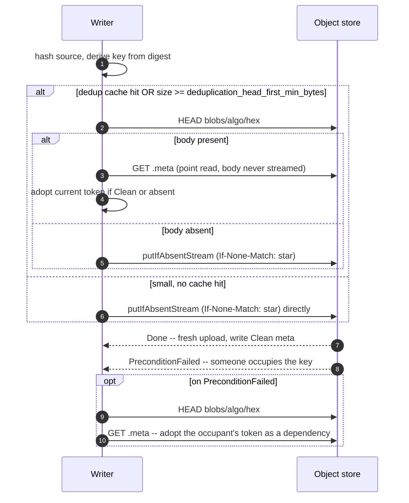
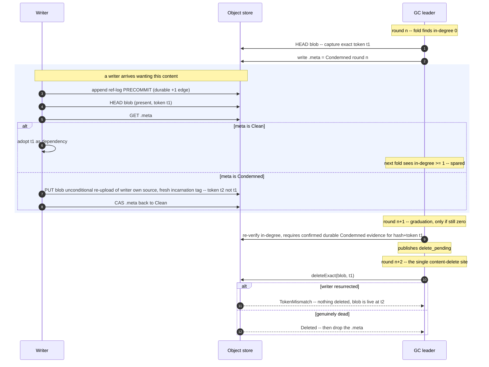

# CAS architecture — blob protocol {#blob-protocol}

A blob is the unit of content-addressed storage: one part file's bytes, keyed by a hash of its
own content. This page covers how a blob gets written exactly once, how a duplicate write is
turned into a no-op, and how a writer and a `GC` round racing over the same blob are kept safe
without ever comparing multi-gigabyte bodies. Object layout and the four durable object kinds
are covered on the [overview page](/antalya/cas/architecture/); `GC`'s fold and round structure
is covered on the GC page.

## Conditional-write sequence {#conditional-write-sequence}

Every blob body lives at a key derived purely from its content hash
(`blobs/<algo>/<hex[0:2]>/<hex>`, `CasLayout::blobKey`), with a sidecar `.meta` object at the
same key plus `.meta`. Because the key already encodes the digest, the backend never needs a
compare-and-swap on content — only on *presence* (`PUT` with `If-None-Match: *`) or on a specific
prior incarnation (`PUT`/`DELETE` with `If-Match: <token>`).



Ordered steps (`Pool/CasPartWriteTxn.cpp:160-245` and `:427-779`):

1. `requireAlive()` — the build is not abandoned, the namespace not dropped, the writer epoch
   still live.
2. **Adaptive dedup gate.** `HEAD` first if the dedup cache reports the content present, or the
   object is at least `deduplication_head_first_min_bytes` (default 1 MiB). Below that threshold
   a speculative conditional `PUT` is cheaper than a `HEAD` plus a `PUT`.
3. On a `HEAD` hit, `observeAndAdmit` point-reads the `.meta` sidecar and adopts the live
   incarnation — the body is never streamed for a dedup hit.
4. Otherwise a bounded retry loop (up to 8 attempts) around `uploadFromSource`, which mints a
   **fresh `incarnation_tag` per attempt** and does either a conditional server-side `COPY` from
   S3 staging or a streaming `putIfAbsentStream`. The byte count is verified against the declared
   source size.
5. A 412 means someone occupies the key. Because the key embeds the content digest, **any
   occupant is by definition the intended content** — ambiguity is resolved by one `HEAD`
   (occupancy), never by comparing bodies.
6. `Unresolved` (timeout, 5xx, connection loss) never acks. It throws retry-later — nothing was
   published, so a body that lands late is inert debris for the orphan sweep.

**Two writers uploading identical content** both derive the same key and both send
`If-None-Match: *`. The object store serializes them: one gets `Done`, the other gets 412,
`HEAD`s, point-reads `.meta`, and adopts the winner's token as its own dependency. The loser never
published anything — a failed or cancelled sink publishes nothing — and its adopt is protected by
its own durable precommit edge (see [the writer-versus-GC race](#writer-gc-race)). Both writers
are safe; the only cost is one wasted upload attempt.

## Dedup and the identity primitive {#dedup-identity}

Two blobs are the same object if and only if they hash to the same digest under the pool's
configured algorithm. Nothing else — not size, not `LIST` order, not a cheap prefix compare —
is allowed to stand in for that check. This follows the same rule everywhere in CAS: identity
is *proven* by hash equality, never *inferred* by a cheap signal, and re-hashing on read is the
identity primitive wherever the correctness of a decision depends on it.

The blob content hash is pluggable per pool, fixed at pool creation: `blob_hash` selects
`cityhash128` (default), `xxh3-128`, or `sha256` (`parseBlobHashAlgo`,
`Primitives/CasBlobDigest.h`). A blob is identified by the pair `BlobRef = (BlobHashAlgo, digest)`,
never by a bare digest — a bare digest is ambiguous once more than one algorithm can appear in a
pool. `blob_hash_allow_new` gates admitting a second algorithm into an already-populated pool's
`algos_used` set; it defaults to off.

`cityhash128` is not cryptographically collision-resistant. A pool shared across mutually
untrusted writers should run `sha256` — CAS enforces no policy choice here; the operator picks
the threat model via `blob_hash`. This is why the dedup admission gate is a `HEAD` (occupancy)
rather than a body compare: it tells the writer *something* already claims this key, and the
digest is the only claim CAS trusts.

## The writer-versus-GC race {#writer-gc-race}

This is the interleaving that gets the most reviewer attention, because a writer and a `GC` round
can legitimately disagree about whether a blob is still needed.



The invariant that makes every interleaving safe: **revival is re-upload only — never `GET` a
condemned object to revive it.** A writer that finds `Condemned` metadata does not resurrect the
existing body; it re-uploads its own source bytes under a fresh `incarnation_tag`, producing a
new token that no prior `deleteExact` call can name. `GC` never streams a body it might delete,
and a writer never trusts a body it did not itself just write.

Why this closes the race in both directions:

- A writer that **adopts** a token must have read a non-`Condemned` marker, and its precommit
  edge was durable *before* that read. The next fold therefore sees in-degree ≥ 1 and spares the
  blob.
- A writer that **resurrects** changes the token. A stale `deleteExact(t1)` then returns
  `TokenMismatch` and reclaims nothing — the delete names an exact incarnation, never "the object
  at this key".
- The delete lags condemnation by at least two full rounds, and publishing the one edge that
  authorizes an irreversible delete requires confirmed durable `Condemned` evidence for that
  exact `(hash, token)` pair. Without it `GC` never throws — it carries the entry and retries the
  marker write on the next round.

Both directions degrade to a spurious re-upload or a no-op delete. Neither can lose data or leave
a dangling manifest entry.

**One asymmetry worth flagging:** on a local (emulated) disk the resurrect path materializes the
full `[header][payload]` in memory; resurrections are serialized, so at most one body is held whole
in RAM at a time. On remote object storage the resurrect streams and holds nothing.

### The `.meta` sidecar {#meta-sidecar}

`.meta` has exactly two states: `Clean` (body present, may be referenced) and `Condemned`
(`GC` observed zero in-degree; the body is still present and a writer may resurrect it). An
*absent* `.meta` reads exactly like `Clean` — there is no third "unaccounted" state in the
stored format; `unaccounted` is an `ca-fsck` classification, not something `GC` ever writes.

The record carries `state`, `condemn_round`, and `size`, and deliberately carries **no token**:
it is a per-hash hint, not a per-incarnation fact. All safety comes from the body's in-envelope
`incarnation_tag` plus exact-token deletes; a stale marker costs at worst one spurious re-upload,
never a lost delete or a false revival.

## Deterministic artifacts and the adoption pin {#deterministic-artifacts}

Some CAS objects are a pure function of their inputs: the `GC` source-edge run files (`cas_run`)
and fold seals (`cas_fold_seal`). For these, `putDeterministicArtifact`
(`Gc/CasBlobInDegree.cpp:341-352`) is the write-once helper:

```cpp
if (backend.putIfAbsent(key, bytes).outcome == PutOutcome::PreconditionFailed)
{
    const auto existing = backend.get(key);
    if (!existing || existing->bytes != bytes)
        throw Exception(ErrorCodes::CORRUPTED_DATA, ...);
    /// byte-equal => our own deterministic replay; adopt (no-op).
}
```

The idempotency argument: identical inputs produce byte-identical output, so a replayed round —
leader deposed mid-round, round `CAS` aborted, crash-restart — re-derives exactly the same bytes.
A 412 therefore means "already occupied by our own replay", verified by comparing the fetched
bytes, not inferred from occupancy alone as blob uploads do. Divergent bytes are impossible under
correct operation and fail closed as `CORRUPTED_DATA`.

This is the format-evolution **adoption pin**, documented in the persisted-format registry
(`Formats/README.md`): on a `putDeterministicArtifact` conflict, the writer re-encodes at the `v`
of the *existing* object rather than at its own current build's version, so two writers on
different builds replaying the same deterministic round still land on byte-identical output.

The helper is explicitly **not** for observation-bearing artifacts — `GC` outcome logs carry
`HEAD`-observed tokens on which two observers may legitimately disagree, so those use
first-durable-write-wins byte-adopt semantics instead. And a blob body can never use this path:
the fresh-tag rule means two attempts at the same logical create are allowed to legitimately
differ, which is exactly what `putDeterministicArtifact`'s divergence check would reject.

## Settings {#settings}

All names below are unprefixed keys inside the disk's `cas` config block
(`ContentAddressedSettings.cpp`, `LIST_OF_CONTENT_ADDRESSED_SETTINGS`); none carry a `cas_`/`ca_`
prefix.

| Setting | Controls | Default |
|---|---|---|
| `blob_hash` | Pool blob content-hash function (`cityhash128` \| `xxh3-128` \| `sha256`); fixed at pool creation | `cityhash128` |
| `blob_hash_allow_new` | Explicit opt-in to admit a new hash algorithm into an existing pool's `algos_used` | `false` |
| `deduplication_cache_bytes` | Byte budget of the blob-presence cache that feeds the dedup `HEAD`-first decision (`0` disables) | 64 MiB |
| `deduplication_head_first_min_bytes` | Minimum blob size to try a `HEAD` before uploading the body | 1 MiB |
| `staging_backend` | Blob staging backend (`local` \| `s3`); `s3` is opt-in | `local` |
| `scratch_path` | Server-local scratch directory for the local-staging write-buffer spill; a relative value is anchored to the server data path | `""` |
| `gcs_max_token_producing_put_bytes` | Largest token-producing write on a generation-token store, conditional or not (GCS forces those single-part) | 1 GiB |

`GC`-round budgets that gate condemnation and reclaim of these same blobs (graduation, redelete,
sweep budgets) live on the GC architecture page, not here — they govern the `GC` side of the race
in [Writer-versus-GC race](#writer-gc-race), not the write path.
