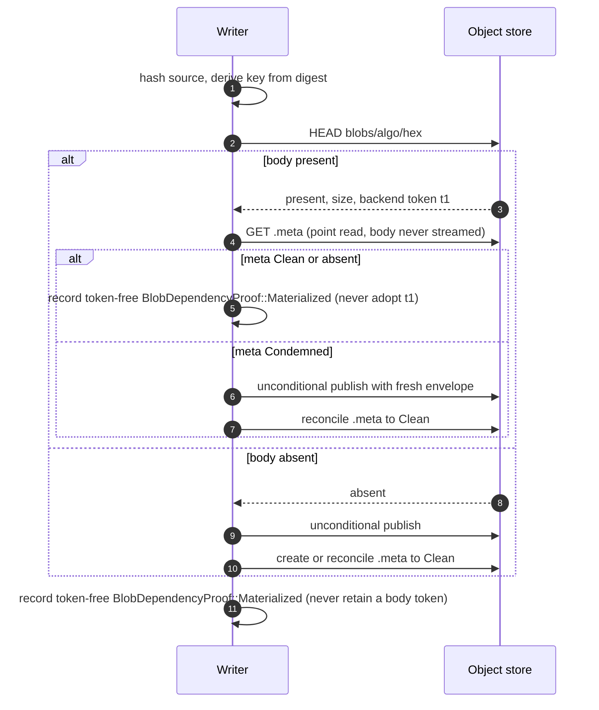

# CAS architecture — blob protocol {#blob-protocol}

A blob is the unit of content-addressed storage: one part file's bytes, keyed by a hash of its
own content. This page covers how a blob is observed or published, how a duplicate write is
turned into a no-op, and how a writer and a `GC` round racing over the same blob are kept safe
without ever comparing multi-gigabyte bodies. Object layout and the four durable object kinds
are covered on the [overview page](/antalya/cas/architecture/); `GC`'s fold and round structure
is covered on the GC page.

## HEAD-then-publication sequence {#conditional-write-sequence}

Every blob body lives at a key derived purely from its content hash
(`blobs/<algo>/<hex[0:2]>/<hex>`, `CasLayout::blobKey`), with a sidecar `.meta` object at the
same key plus `.meta`. Because the key already encodes the digest, concurrent writers may safely
replace one physical incarnation with another carrying the same logical payload. Blob publication
therefore needs no create-if-absent condition and returns no incarnation token. Conditional writes
remain necessary for mutable metadata and control objects; `GC` still uses exact-token deletion.



Ordered steps in `PartWriteTxn::ensureBlobPresent`:

1. `requireAlive()` — the build is not abandoned, the namespace not dropped, the writer epoch
   still live.
2. **Mandatory observation.** Every physical materialization begins with one blob `HEAD`, regardless
   of size, provider, staging backend, or whether another writer probably uploaded the same hash.
3. On a hit, the writer reads `.meta`. `Clean` or absent metadata permits adoption; the writer
   records a `Materialized` dependency proof without retaining the observed token. `Condemned`
   requires a new publication.
4. On a miss, the writer does not read `.meta` before publication. It publishes its own payload
   unconditionally, then creates or reconciles `.meta` to `Clean`.
5. Streaming publication mints a fresh `incarnation_tag` and can use ordinary multipart. The first
   publication of an S3-staged source may use native same-store copy only after a miss; a condemned
   or subsequent publication retags and streams the staged payload.
6. `BlobSource::beginPublication` consumes the shared, monotonic `publication_attempted` state
   before backend I/O. A lost response cannot re-enable verbatim copy on a later attempt.
7. Retryable or ambiguous failures restart at `HEAD`. No dependency proof is recorded until a
   present non-condemned body was observed, or publication and metadata reconciliation completed.

**Two writers uploading identical content** may both observe absence and both publish. The last
physical incarnation wins, but the key proves that both payloads have the same logical identity and
durable references name that identity, not an ETag or generation. Each writer records only a
`Materialized` proof. Its durable precommit edge protects the logical blob while the physical race
settles (see [the writer-versus-GC race](#writer-gc-race)).

### Request budget and release evidence {#request-budget-and-release-evidence}

The protocol deliberately pays one blob `HEAD` per materialization task. A genuine fresh miss then
publishes one body and attempts one `Clean` metadata create, with no pre-publication metadata GET. A
duplicate pays the metadata read and avoids the body publication. All blob tasks remain in the
bounded `cas_blob_upload_pool_size` fan-out rather than serializing the part.

The [performance report](/superpowers/cas/unconditional-blob-publication-performance) confirms that
request shape on three target-only runs, but it has no matched same-environment pre-change binary.
Its control-adjusted sequence ratios are not a code-version delta; performance acceptance remains
blocked pending a matched before/after pair and explicit human acceptance. The
[real-GCS result](/superpowers/cas/unconditional-blob-publication-live-results) likewise records
deterministic coverage but no credentialed Google run. Release readiness remains blocked until the
OAuth and HMAC groups pass against real GCS; ordinary `test_storage_s3` is also externally blocked
by the unavailable `clickhouse/clickhouse-server:23.3.19.33.altinitystable` image.

## Dedup and the identity primitive {#dedup-identity}

Two blobs are the same object if and only if they hash to the same digest under the pool's
configured algorithm. Nothing else — not size, not `LIST` order, not a cheap prefix compare —
is allowed to stand in for that check. This follows the same rule everywhere in CAS: identity
is *proven* by hash equality, never *inferred* by a cheap signal, and re-hashing on read is the
identity primitive wherever the correctness of a decision depends on it.

The blob content hash is pluggable per pool, fixed at pool creation: `cas_blob_hash` selects
`cityhash128` (default), `xxh3-128`, or `sha256` (`parseBlobHashAlgo`,
`Primitives/CasBlobDigest.h`). A blob is identified by the pair `BlobRef = (BlobHashAlgo, digest)`,
never by a bare digest — a bare digest is ambiguous once more than one algorithm can appear in a
pool. `cas_blob_hash_allow_new` gates admitting a second algorithm into an already-populated pool's
`algos_used` set; it defaults to off.

`cityhash128` is not cryptographically collision-resistant. A pool shared across mutually
untrusted writers should run `sha256` — CAS enforces no policy choice here; the operator picks
the threat model via `cas_blob_hash`. This is why the materialization gate is a `HEAD` (occupancy)
rather than a body compare: it tells the writer *something* already claims this key, and the
digest is the only claim CAS trusts.

## The writer-versus-GC race {#writer-gc-race}

This is the interleaving that gets the most reviewer attention, because a writer and a `GC` round
can legitimately disagree about whether a blob is still needed.


The invariant that makes every interleaving safe: **revival is re-publication only — never `GET` a
condemned object to revive it.** A writer that finds `Condemned` metadata does not reuse the
existing body; it re-uploads its own source bytes under a fresh `incarnation_tag`, producing a
new token that no prior `deleteExact` call can name. `GC` never streams a body it might delete,
and a writer never trusts a body it did not itself just write.

Why this closes the race in both directions:

- A writer that **adopts** a present body must have read a non-`Condemned` marker, and its precommit
  edge was durable *before* that read. The next fold therefore sees in-degree ≥ 1 and spares the
  blob.
- A writer that **replaces a condemned incarnation** changes the token. A stale `deleteExact(t1)` then returns
  `TokenMismatch` and reclaims nothing — the delete names an exact incarnation, never "the object
  at this key".
- The delete lags condemnation by at least two full rounds, and publishing the one edge that
  authorizes an irreversible delete requires confirmed durable `Condemned` evidence for that
  exact `(hash, token)` pair. Without it `GC` never throws — it carries the entry and retries the
  marker write on the next round.

Both directions degrade to a spurious re-upload or a no-op delete. Neither can lose data or leave
a dangling manifest entry.

**One asymmetry worth flagging:** on a local emulated disk `publishBlob` materializes the full
`[header][payload]` in memory. These publications are serialized, so at most one body is held whole
in RAM at a time. Native object storage streams and can use multipart.

### The `.meta` sidecar {#meta-sidecar}

`.meta` has exactly two states: `Clean` (body present, may be referenced) and `Condemned`
(`GC` observed zero in-degree; the body is still present and a writer may replace it). An
*absent* `.meta` reads exactly like `Clean` — there is no third "unaccounted" state in the
stored format; `unaccounted` is an `ca-fsck` classification, not something `GC` ever writes.

The record carries `state`, `condemn_round`, and `size`, and deliberately carries **no token**:
it is a per-hash hint, not a per-incarnation fact. All safety comes from the body's in-envelope
`incarnation_tag` plus exact-token deletes; a stale marker costs at worst one spurious re-upload,
never a lost delete or a false revival.

## Deterministic artifacts and the adoption pin {#deterministic-artifacts}

Some CAS objects are a pure function of their inputs: the `GC` source-edge run files (`cas_run`)
and fold seals (`cas_fold_seal`). For these, `putDeterministicArtifact`
(`Gc/CasBlobInDegree.cpp:341-352`) is the write-once helper:

```cpp
if (backend.putIfAbsent(key, bytes).outcome == PutOutcome::PreconditionFailed)
{
    const auto existing = backend.get(key);
    if (!existing || existing->bytes != bytes)
        throw Exception(ErrorCodes::CORRUPTED_DATA, ...);
    /// byte-equal => our own deterministic replay; adopt (no-op).
}
```

The idempotency argument: identical inputs produce byte-identical output, so a replayed round —
leader deposed mid-round, round `CAS` aborted, crash-restart — re-derives exactly the same bytes.
A 412 therefore means "already occupied by our own replay", verified by comparing the fetched
bytes, not inferred from occupancy alone as blob uploads do. Divergent bytes are impossible under
correct operation and fail closed as `CORRUPTED_DATA`.

This is the format-evolution **adoption pin**, documented in the persisted-format registry
(`Formats/README.md`): on a `putDeterministicArtifact` conflict, the writer re-encodes at the `v`
of the *existing* object rather than at its own current build's version, so two writers on
different builds replaying the same deterministic round still land on byte-identical output.

The helper is explicitly **not** for observation-bearing artifacts — `GC` outcome logs carry
`HEAD`-observed tokens on which two observers may legitimately disagree, so those use
first-durable-write-wins byte-adopt semantics instead. And a blob body can never use this path:
the fresh-tag rule means two attempts at the same logical create are allowed to legitimately
differ, which is exactly what `putDeterministicArtifact`'s divergence check would reject.

## Settings {#settings}

The disk configuration element is shared by several consumers. The `CAS` settings below carry the
`cas_` prefix; the deliberately bare `gcs_max_conditional_put_bytes` is an S3 client setting.

| Setting | Controls | Default |
|---|---|---|
| `cas_blob_hash` | Pool blob content-hash function (`cityhash128` \| `xxh3-128` \| `sha256`); fixed at pool creation | `cityhash128` |
| `cas_blob_hash_allow_new` | Explicit opt-in to admit a new hash algorithm into an existing pool's `algos_used` | `false` |
| `cas_staging_backend` | Blob staging backend (`local` \| `s3`); `s3` is opt-in | `local` |
| `cas_scratch_path` | Server-local scratch directory for the local-staging write-buffer spill; a relative value is anchored to the server data path | `<clickhouse-path>/disks/<disk_name>/cas_scratch/` |
| `gcs_max_conditional_put_bytes` | Largest conditional non-blob `PUT` on a generation-token store, covering create-if-absent artifacts and conditional replacements; unconditional blob publication is not subject to this cap | 1 GiB |

`GC`-round budgets that gate condemnation and reclaim of these same blobs (graduation, redelete,
sweep budgets) live on the GC architecture page, not here — they govern the `GC` side of the race
in [Writer-versus-GC race](#writer-gc-race), not the write path.
