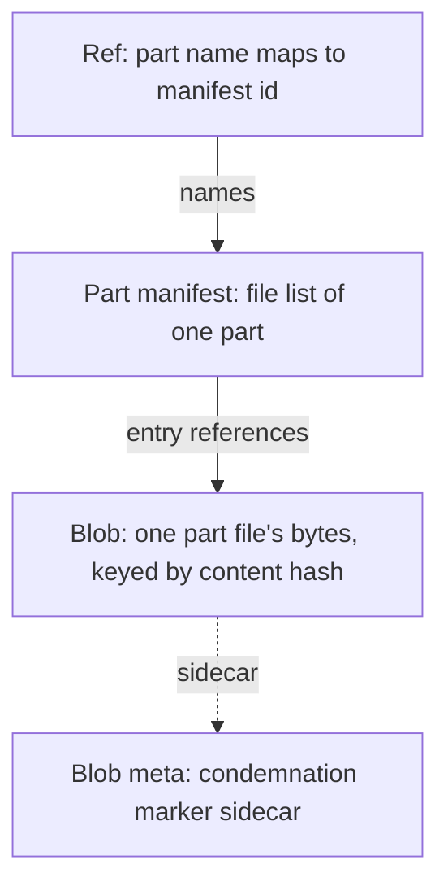

# CAS architecture — overview {#overview}

`CAS` ("content-addressed storage") is a `MetadataStorage` back-end for object-storage disks
(`metadata_type = cas`) that stores every `MergeTree` part file once, addressed by the hash of
its content. Many servers share one object-storage pool with no byte duplication, no zero-copy
bookkeeping in `Keeper`, no per-replica local-disk reference state that grows with data volume,
and no mutable per-blob refcount.

It is still experimental — that is deliberate, not a caveat to apologize for. Pre-release means
the format can still change cheaply, with zero compatibility scaffolding, and the design can
still be iterated on invariants rather than migrations. The bet: all you need underneath is a
good S3 bucket. No external coordinator, no metadata service, no Keeper state proportional to
data — the pool is self-describing, and everything CAS needs to agree on (refs, leases, GC
leadership, fencing tokens) is an object in the bucket.

This page is the entry point of a 4-page set: it gives the mental model. Deeper detail on
storage layout, the write/read protocols, and GC lives in the other three pages.

## The Git analogy {#git-analogy}

The fastest way to load the model is Git, which most readers already carry:

| Git | CAS |
|---|---|
| blob (file content by hash) | **blob** — one part file's bytes, keyed by content hash |
| tree (directory listing) | **part manifest** — the immutable file list of one part |
| ref (`refs/heads/main`) | **ref** — `part name → manifest id`, the only mutable state |
| `gc` / reachability | **GC round** — an in-degree fold over refs → manifests → blobs |

Where the analogy breaks: Git's objects are locally addressed and GC runs against a single
repository with no concurrent writers; CAS objects are addressed inside a shared, multi-writer
object-storage pool, and its GC round has to reason about ambiguity (crashed writers,
in-flight precommits, eventually-consistent `LIST`) that a local Git repository never faces.
Git also has no equivalent of a CAS ref's precommit state — a CAS ref transition is durable
before the blob it names is guaranteed reachable, never the other way round.

## The object model {#object-model}

Four durable object kinds exist in a pool: one mutable (the ref), three immutable
(part manifest, blob, and a blob's condemnation-marker sidecar).

**The reachability rule, stated once:** a blob is live if and only if some live manifest names
it, and a manifest is live if and only if some ref — committed or precommitted — names it. `GC`
computes exactly this and nothing else.

## Safety invariants {#safety-invariants}

The full numbered list lives in the CAS agent guide; this is the reader-facing summary of the
substance:

| Invariant | What it means |
|---|---|
| No silent data loss | No path may delete an object a committed reference still names |
| Revival is re-upload only | A condemned blob is never revived by copying it — only by re-uploading the original bytes under a fresh identity |
| Exact-token deletes | Every delete names the exact object incarnation it removes, never "the object at this key" |
| `TOKEN ⟹ CONTENT` | A repeated write token implies unchanged bytes — the backend must never let a token be reused over different content |
| Fail closed on ambiguity | An operation that may have landed is never treated as one that did not |
| One content-delete site | Exactly one place in the whole codebase ever deletes a blob body, gated on a previously published `GC` round |
| `GC` never invents history | Cleaning up an abandoned write is the writer's job, not `GC`'s |
| Over-count only | A lost or duplicated `GC` fold can only delay a reclaim, never bring one forward |
| No dangle / no loss / no return | A live ref always resolves through present objects; a delete requires proven unreachability at an exact token; a retired object identity is never valid again (though the same logical key can return under a new token) |

## Positioning: shared-nothing, not shared-state {#positioning}

Each server owns the catalog rows under its own identity and writes only its own state objects
— that part is shared-nothing, same as `ReplicatedMergeTree` today. What CAS adds is a single
**shared** resource: the blob content space, addressed purely by content hash, which is
write-once and conflict-free by construction — two servers writing the same content write the
same key with the same bytes, so there is nothing to reconcile. The only mutual exclusion CAS
needs anywhere is a conditional write (create-if-absent, or compare-and-swap on a token) against
a single object.

That is deliberately not a coordinator or a serializable metadata service: there is no external
coordinator, and no `ZooKeeper`/`Keeper` usage inside the pool protocol itself. `Keeper` stays
exactly where `ReplicatedMergeTree` already used it — replication log and part-set consensus —
and its load does not grow with pool size, because the pool's own bookkeeping never touches it.

## The subsystem pages {#subsystem-pages}

| Page | Covers |
|---|---|
| [Storage layout](/antalya/cas/architecture/storage-layout) | Every S3 key shape, the object envelope, codecs, a worked example tree |
| [Namespaces](/antalya/cas/architecture/namespaces) | Namespaces, `life_id`, the catalog, and their lifetime |
| [Blob protocol](/antalya/cas/architecture/blob-protocol) | Conditional writes, deduplication, the writer-vs-GC race |
| [Part lifecycle](/antalya/cas/architecture/part-lifecycle) | Build, precommit, upload, promote; crash points and their cleaners |
| [Manifests and refs](/antalya/cas/architecture/manifests-and-refs) | Part manifests and the ref machinery: publish, fold, recovery |
| [Mounts and leases](/antalya/cas/architecture/mounts-and-leases) | Server identity, the owner claim, the mount lease, fencing |
| [Replication](/antalya/cas/architecture/replication) | Fetch-by-relink between replicas sharing one pool |
| [Read path](/antalya/cas/architecture/read-path) | Ref resolution, manifest reads, ranged blob reads, the caches |
| [Garbage collection](/antalya/cas/architecture/garbage-collection) | Leadership, the round, sharding, cost, observability |
| [Backend abstraction](/antalya/cas/architecture/backend) | Provider dialects for conditional writes, the capability probe |
| [Correctness](/antalya/cas/architecture/correctness) | TLA+ models, counterexamples, soak methodology, test coverage |
| [Design history](/antalya/cas/architecture/design-history) | The rejected designs and the major pivots |
