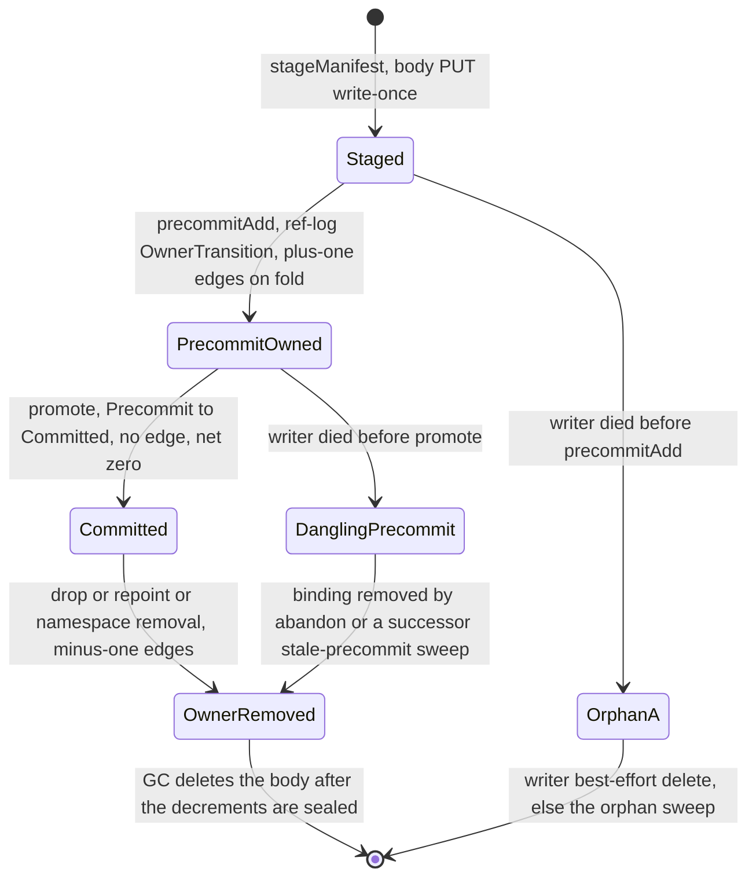
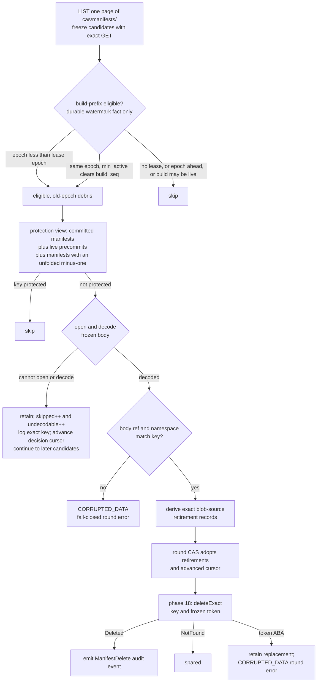
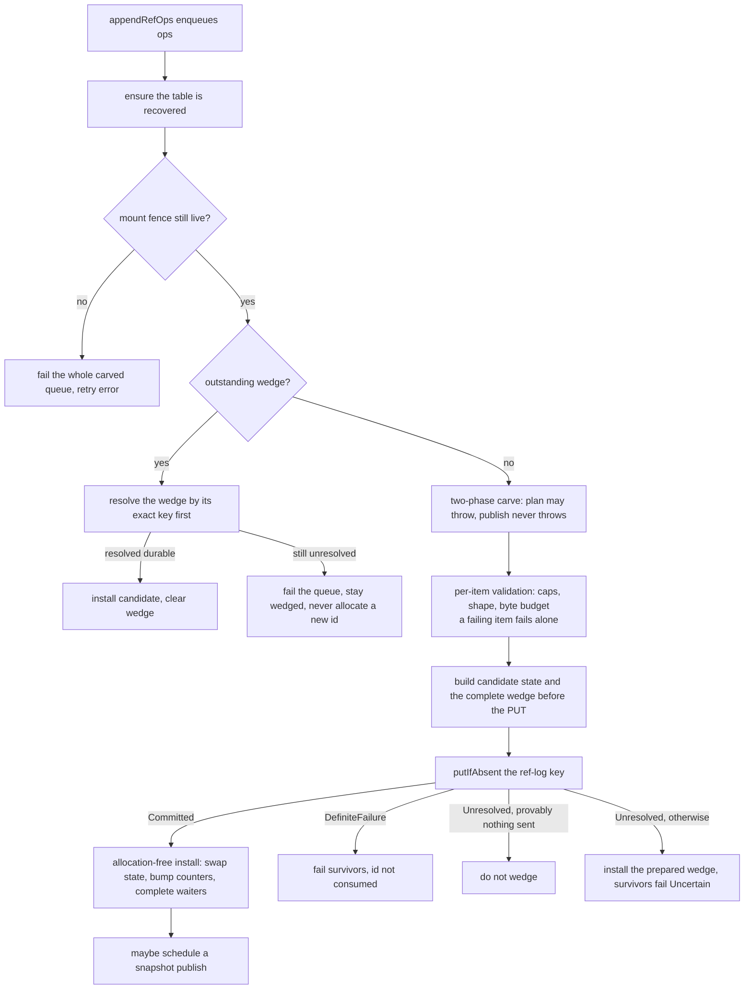

# CAS architecture — manifests and refs {#manifests-and-refs}

A part manifest is the immutable file list of one `MergeTree` part; a ref is the mutable pointer
from a part name to the manifest that currently backs it. Together they are the two object kinds
that make a CAS pool's state machine: manifests never change, refs are the only place anything
moves. This page covers what a manifest contains, how a manifest becomes reachable or becomes an
orphan, how a ref mutation is published durably, and how a mounted server recovers a ref table
after a crash or a fresh mount. The write/promote sequence that drives these primitives is on the
[part-lifecycle page](/antalya/cas/architecture/part-lifecycle); how `GC` folds ref history into
blob liveness is on the [garbage-collection page](/antalya/cas/architecture/garbage-collection).

## Part manifests {#part-manifests}

A manifest (`cas_part_manifest`, `Formats/CasPartManifestFormat.h`) has four top-level fields:
`ref` (its own id, repeated in the body for fail-closed validation), `root_namespace_id` (the
owning namespace, likewise repeated), `payload_digest` (integrity/debug only — never a key, never
a dedup input, never a `GC` edge), and `entries` — strictly ascending by path after decode. Each
entry is `{path, placement, BlobRef, blob_size, inline_bytes}`; the hash algorithm travels **per
entry**, so one manifest may legitimately mix algorithms if the pool has more than one enabled.

A manifest deliberately holds **no** offsets, no packed-file support, no projections field, no
codec info, no parent-manifest link, no source edges, and no incarnation token. One blob is one
file's bytes; a read window is `{blobKey, blob_header_len, blob_size}`. A projection is an
ordinary entry whose path has a `.proj` component. The incarnation token is the backend `ETag`
observed by a `HEAD`, never stored in the manifest.

**The manifest id is neither a content hash nor random.** It is
`ManifestRef = {writer_epoch, build_sequence, manifest_ordinal}` — durable writer epoch times
monotone per-incarnation build sequence times monotone per-build ordinal — which gives "no
manifest id reuse" by construction with no randomness needed. The `GC`-level identity is the pair
`ManifestId = (RootNamespace, ManifestRef)`; two namespaces may legally carry the same
`ManifestRef`.

Backpressure caps are enforced before the body is written (`Pool/CasPartWriteTxn.cpp`):

| Cap | Limit |
|---|---|
| Entries per manifest | 1 048 576 |
| Encoded manifest text | 256 MiB |
| Total inline bytes | 16 MiB |
| Largest single inline entry | 1 MiB |

A manifest is written once with a conditional create (`putIfAbsent`) and **never rewritten**.
A different object at that key would be an id collision and is `CORRUPTED_DATA`, fail-closed,
before any owner transition names it. Rewriting a part therefore writes a **new** manifest over
the **same** blobs and moves the ref in one ref-log record — a repoint, covered in full on the
[part-lifecycle page](/antalya/cas/architecture/part-lifecycle#repoint).

## Manifest lifecycle and the orphan sweep {#manifest-lifecycle}



Two disjoint failure classes matter here:

- **Pre-precommit orphan.** The body exists but no ref-log record ever named it. It contributes no
  edges and nobody protects it — this is exactly what the orphan sweep below reclaims.
- **Dangling precommit.** The transaction died between `precommitAdd` and `promote`. Nothing wakes
  it up on its own: a `PartWriteTxn` is never persisted. The binding must be removed by a ref-log
  transaction — either the live writer's own `abandon`, or a fenced successor's stale-precommit
  sweep, which removes precommits whose `manifest_ref.writer_epoch < live_epoch`
  (`Pool/CasRefLedger.cpp`). Only after that minus-one folds does `GC` delete the body, on the
  ordinary owner-removal path.

The writer's own best-effort cleanup deliberately **skips** the precommit target once a precommit
was even attempted — including an uncertain outcome — because deleting a body that turns out to be
a live precommit would clamp `GC`'s fold barrier forever.

### The orphan-manifest sweep {#orphan-sweep}

The cursor-paced, budgeted sweep has two stages (`Gc/CasOrphanManifestSweep.cpp`). During fold
planning, it freezes candidates with exact `GET`s, opens and decodes their bodies, and derives the
state changes needed to make deletion safe. Only after the round `CAS` adopts those changes does
phase 18 perform physical deletion. Eligibility comes **exclusively** from the durable watermark
in the mount lease — there is no age threshold and no time-based grace period anywhere in this
protocol. No mount lease for the `server_root_id` means no deletion authority means nothing is
swept for that root.



The protection view is built from the **same complete replay** that writer recovery uses, and a
namespace whose view fails to build is added to an errored set with **all** of its deletions
skipped — an empty owner set is never substituted for a failed one. A body that cannot be opened
or decoded is likewise retained: it increments both `skipped` and `undecodable`, advances the page
decision cursor, logs the exact key, and does not prevent later candidates from being examined. It
is not repaired or deleted, and remains visible to `ca-fsck` as an unreachable object. A decoded
body whose ref or namespace does not match its key instead fails the round with `CORRUPTED_DATA`.

For every legal nomination, the sweep derives exact source-retirement records for the body's blob
entries. The fold places those retirements in the new generation, and the round `CAS` adopts both
that generation and the advanced sweep cursor before any manifest body is deleted. This is the
same adopt-before-delete safety ordering as owner removal; here the retirements come directly from
the frozen body rather than from a ref-log minus-one. Phase 18 then calls `deleteExact` with the
frozen token. Every outcome emits a `ManifestDelete` audit event: `Deleted` records a physical
deletion, `NotFound` is spared, and a token ABA retains the replacement and fails the round with
`CORRUPTED_DATA`.

Operators can find rounds that retained undecodable bodies through
`system.cas_gc_log` and the `phase_metrics['undecodable']` count on `Phase` rows for
`orphan_sweep`:

```sql
SELECT event_time, round_id,
       phase_metrics['skipped'] AS skipped,
       phase_metrics['undecodable'] AS undecodable
FROM system.cas_gc_log
WHERE event_type = 'Phase'
  AND phase = 'orphan_sweep'
  AND phase_metrics['undecodable'] > 0
ORDER BY event_time DESC;
```

## Source edges: how a manifest makes blobs live {#source-edges}

Blob liveness is a **set of source edges**, not a counter (`Gc/CasBlobInDegree.h`) — which is what
makes `GC`'s fold idempotent. An edge id is `sourceEdgeId(ManifestId, path)`, a deterministic hash
over the namespace, epoch, build sequence, ordinal and path — an edge *identity*, deliberately not
a content hash and not reconstructable.

Edges are never written at manifest-write time. They materialize only when `GC` folds a ref-log
transaction that changes ownership: add-precommit means `+1` per blob entry; either removal means
`-1`; **promote means no edge at all**, because the manifest never loses an owner, so it is net
zero. Inline entries produce no edges — they have no separate object to reclaim.

## The ref table {#ref-table}

A ref is the only mutable state in the whole system, so this is where the concurrency design is
concentrated.

- **Name** — a canonical clean relative path, in practice the part directory name with an optional
  `detached/` or `moving/` prefix.
- **Value** — `{ref_name, ManifestRef, published_at_ms}`. There is **no** token/`ETag` in a ref
  row; the cross-server "confirm token" is the text form `epoch:build:ordinal`.
- **Scope** — one ref table per `RootNamespace`, i.e. per table per server root.
- **Ownership slots** — a `ManifestRef` has at most one owner across the table, in one of two
  slots: `Committed` or `Precommit`. Precommits are keyed by the pair `(ref_name, manifest_ref)`,
  so several in-flight builds may legitimately contend for one ref name.

In memory, `RefTableState` holds a copy-on-write map of committed rows, a set of precommits, an
ownership index enforcing the one-owner rule, a lifecycle (`Live`/`Removed`), the greatest applied
transaction id, and byte-size counters used for admission. Copying a state is a refcount bump, so
a flush's trial and candidate copies cost proportional to touched rows, not the whole table.
Network I/O is never performed while holding the state lock, so a reader sees either a whole
transaction or none of it.

Two immutable object kinds carry the durable form under `cas/ns/stream/<life_id>/` (see the
[storage-layout key table](/antalya/cas/architecture/storage-layout#key-table)): a log object
holds exactly one transaction, `{namespace, txn_id, ops[]}`; a snapshot object holds one live table image
— sorted committed rows plus precommits. Mutable/path-addressed state lives separately under
`cas/ns/state/<life_id>/`: the per-life `_ckpt` checkpoint and any namespace-owned `_files/`.

`RefTxnId = {writer_epoch, ref_sequence}` renders as two fixed-width hex fields, so lexical key
order equals tuple order. Ids are per-namespace and contiguous: within one `(namespace,
writer_epoch)` they run `1, 2, 3, …` with no holes, and a new mount epoch restarts the sequence at
`1`. A hole is therefore corruption, not an allocation artifact, and a non-successor id is rejected
as `CORRUPTED_DATA`.

The op vocabulary is deliberately tiny: `NamespaceBirth`, `OwnerTransition{old?, new?}`,
`SetPublishedAt`, `RemoveNamespace`. There are exactly four legal `OwnerTransition` shapes — add
precommit, remove precommit, remove committed, and promote — enumerated identically by the state
machine and by `GC`'s edge extractor, so the two readers of the format cannot drift.

Logs are pure conditional creates on write-once keys. There is no append-to-object and no
`CAS`-swapped mutable pointer anywhere in the ref lane. The writer never deletes ref objects; only
`GC` does, once coverage and a live snapshot both make a log safe to remove.

Snapshots publish in the background, best-effort, one in flight per table, when the tail exceeds a
log-count or log-byte threshold.

## Publishing a ref mutation {#publish-protocol}

All mutations funnel through one flat-combining lane, `CasRefLedger::appendRefOps`. A single flush
carves a batch out of the queue and commits it as one or more transactions.



The **wedge** is the mechanism that makes fail-closed ambiguity concrete: at most one per table,
recording the single conditional `PUT` whose outcome is unknown, complete with the key and the
sealed bytes. The next flush must resolve *that exact key* before it may allocate a new transaction
id — an unresolved write can never silently become a gap, and the ledger never double-publishes.

Crash points: between the `PUT` and the install, the object is durable and unapplied — the next
mount's recovery replays it. Between a precommit and its promote, a dangling precommit is reclaimed
by the successor's stale-precommit sweep, described above.

## Recovery {#recovery}

Recovery is lazy per table, on first touch (`Pool/CasRefLedger.cpp`), and reads only named,
authoritative objects — there is no `LIST` anywhere in this path:

1. **Exact `GET` of `_ckpt`.** The durable checkpoint is the sole source of the recovery grounding:
   `chooseRecoveryGrounding` derives the base (a snapshot id, or genesis if there is none) and the
   exact transaction to walk from purely from the checkpoint's own fields
   (`committed_through`/`checkpoint_snapshot_id`/`life_epoch`) — recovery never enumerates its own
   stream to find them.
2. If the grounding names a snapshot, `GET` and decode it as the replay base.
3. Walk forward by exact key from there, one transaction resident at a time: `GET`
   `cas/ns/stream/<life_id>/<epoch>-<sequence>`, decode, apply, discard, advance to the next
   arithmetic id. Every key this walk touches is a dense, deterministic successor of the last —
   never a listed or guessed one.
4. **Absence is a decision point, not an error.** Finding a slot empty is either the live epoch's
   stream legitimately ending there, or — for a dead predecessor epoch — the exact slot where its
   closing `EpochSeal` must be written before the table may be trusted; the two cases are
   distinguished by whether the epoch being walked is still live, not by retrying a listing.
5. Recovery may itself advance `_ckpt` as it replays, each time via a conditional write against the
   checkpoint it last read; the write is re-verified with a fresh exact `GET` afterward, and a
   concurrent winner's farther frontier is honored by restarting from that newer checkpoint rather
   than trusting the write blindly.
6. Transient network errors retry the whole attempt with capped backoff; corruption and logic
   errors fail fast.

For a mounted writer the recovered in-memory table is authoritative for reads of its own
namespaces — there is no other writer of that namespace. S3 is authoritative for durability:
in-memory state advances only after a durable `PUT`, and a caller's `appendRefOps` returns only
after the durable install. In-flight precommits are visible only through the precommit set, never
through an ordinary ref resolve.

Two cross-process readers see a different, colder view, but only at the discovery boundary: `GC`
and `ca-fsck` `LIST` once to discover which namespaces exist, staleness-bounded by whatever was
durable at `LIST` time, so a namespace born after that `LIST` is invisible to this pass. Within
each discovered namespace, the replay itself is not `LIST`-driven — it is the same exact-`GET`,
`_ckpt`-grounded arithmetic walk described above, just called from a caller-supplied catalog entry
instead of a live mount. The relink-confirm handshake (see the
[replication page](/antalya/cas/architecture/replication#relink-gates)) does zero object-store I/O
and answers `Yes` only against the resident, warm, fence-live in-memory table — `No` is not proof
of the negative, only `Yes` is fence-gated.

## Namespace removal {#namespace-removal}

Namespace removal has no physical-empty handshake. The writer changes the catalog row from `Live`
to `Removing`, appends the exact removals plus `RemoveNamespace`, and deletes nothing itself. The
`GC` fold attaches cleanup evidence to that life row; a later invocation's pre-fold drain exact-CAS
-deletes the matching `Removing` catalog row before any successor plan publishes. A perpetual
namespace janitor and the orphan-manifest sweep reclaim physical debris independently — a same-name
birth waits only for the catalog row to disappear, never for physical emptiness.
