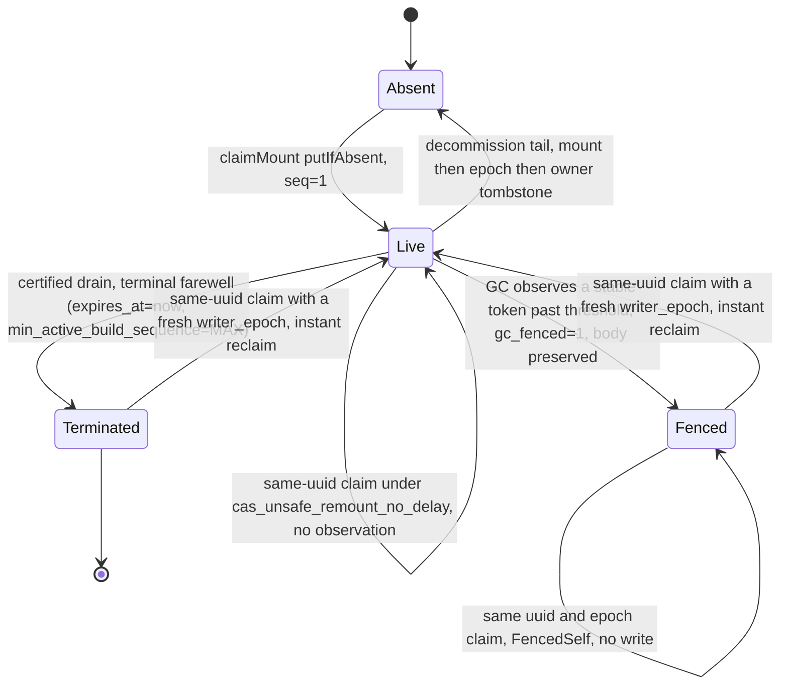
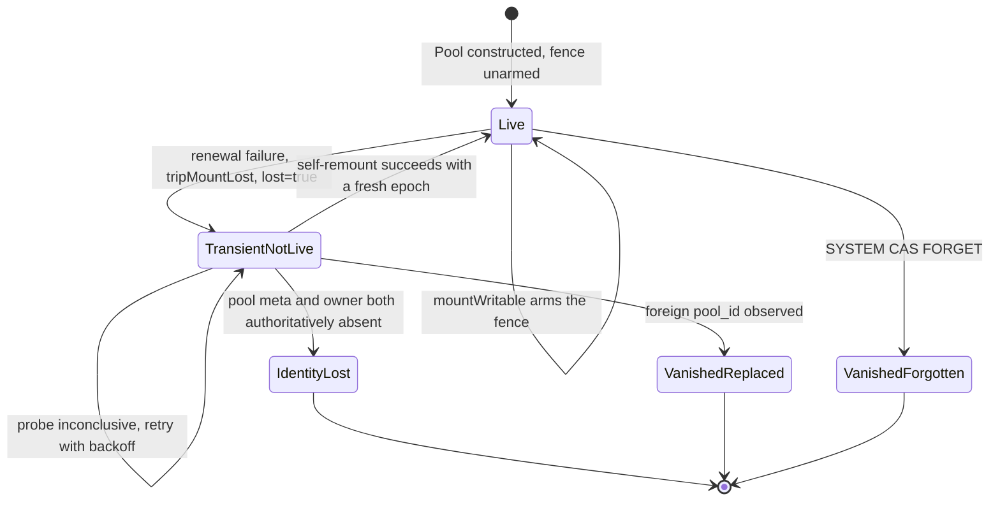

Page 4 of 4 in the CAS architecture set. Covers server identity, the mount lease that fences
writers, and the server-scoped control-plane objects. No external coordinator is involved: there
is no ZooKeeper/Keeper client anywhere in this protocol — `MountLeaseRenewer` is a local lease
*renewer*, not a Keeper client.

## `cas_server_root_id` — the identity {#server-root-id}

Every content-addressed disk must be configured with an explicit `cas_server_root_id`. It is
validated and immutable, and deliberately **not** derived from `ServerUUID` — two replicas can
otherwise regenerate the same `ServerUUID` from a wiped local state directory, which must not
silently steal an existing identity.

Validation (`validateServerRootId`, `Pool/CasServerRoot.h`) is fail-closed `BAD_ARGUMENTS`, no
sanitizing fallback: non-empty, at most 255 bytes, no empty/`.`/`..` path segment, no `_files` or
`_manifests` segment.

It roots four subtrees and owns catalog names at or below `<server_root_id>`:

| Subtree | Contents |
|---|---|
| `gc/server-roots/<server_root_id>/` | owner, epoch, mount — the three control-plane objects below |
| `roots/<server_root_id>/` | loose mountpoint objects, no namespace/catalog association |
| `cas/manifests/<server_root_id>/` | part manifests |
| `staging/<server_root_id>/` | S3-staging debris, outside every GC `LIST`, reclaimed only by this server's next mount |

`blobs/` is **not** under the `server_root_id` — content is pool-global, which is what makes cross-server
dedup work. Ref/namespace keys are also deliberately opaque and do not embed the `server_root_id`.

Each replica sharing a backend endpoint must use a distinct `cas_server_root_id`; omitting the setting
is a startup error.

## The owner claim {#owner-claim}

`claimOwnerOrThrow` binds `server_root_id` ↔ `server_uuid` **permanently**. The owner object is never deleted
and never reassigned — decommission only tombstones it in place.

| Observed at `gc/server-roots/<server_root_id>/owner` | Action |
|---|---|
| present, same `server_uuid`, not tombstoned | proceed |
| present, `retired_at_ms` set | `CORRUPTED_DATA` — explicitly decommissioned, refuses to resume |
| present, different `server_uuid` | `CORRUPTED_DATA` — names the regenerated-uuid-file cause |
| absent, subtree provably empty | `putIfAbsent` the owner (claim) |
| absent, subtree non-empty | `CORRUPTED_DATA` — identity lost over existing data |
| lost the `putIfAbsent` race | re-read; equal uuid proceeds, else `CORRUPTED_DATA` |

"Provably empty" requires both an authoritative decoded catalog naming no life owned by `server_root_id` and
a 1-key `LIST` probe finding nothing under `cas/manifests/<server_root_id>/` or `roots/<server_root_id>/`.

Two failure modes this closes:

- A **second server with a different `server_uuid`** is refused at this gate and can never take
  over, regardless of lease expiry.
- A **same-uuid live twin** (two processes sharing one uuid file and `server_root_id`) is caught separately, by
  the mount claim's token-stability observation, and aborts with an operator-facing message rather
  than corrupting the pool — this is the default behavior, with `cas_unsafe_remount_no_delay` off.
  With it on, a same-uuid claim over such a slot reclaims at once instead of observing (see
  `cas_unsafe_remount_no_delay` in the configuration reference).

## The mount lease {#mount-lease}

One object, `gc/server-roots/<server_root_id>/mount`, carries **both** the liveness lease and the build
watermark — there is no separate watermark object. `MountLease` fields: `server_uuid`,
`writer_epoch`, `write_attempt_id`, `hostname`, `pid`, `started_at_ms`, renewal `seq`,
`expires_at_ms`, `min_active_build_sequence` (the build-watermark floor), and `gc_fenced`.

- **Logical renewal identity.** Each holder-originated body has a fresh nonzero
  `write_attempt_id`. One logical renewal fixes one immutable `(key, bytes, expected token,
  write_attempt_id)` tuple before I/O. Every physical retry repeats it byte-for-byte; a later GC
  fence preserves the observed ID, while reclaim and successor bodies mint new IDs.
- **Resolve before retry.** A transient or ambiguous conditional `PUT` is followed by one exact
  `GET`, except that an attempt whose transport error names a failed connection is reissued first
  after a flat pause and settled by the reissue's own answer (a 2xx) or by the exact `GET` that
  follows its `412`. The renewer adopts the result only when the complete body, including `write_attempt_id`,
  equals its immutable request. If the predecessor token is still current, another identical `PUT`
  may follow bounded backoff. A same-pair twin, GC-fenced body, successor, foreign holder, or absent
  body is never treated as this renewal.
- **Absolute deadline.** Renewal uses `CLOCK_BOOTTIME`, not `CLOCK_MONOTONIC`, so a VM resumed from
  suspend correctly observes itself expired. Its absolute deadline is the minimum of the existing
  request-operation budget and the last confirmed lease deadline minus the safety margin. The
  controller checks that one attempt envelope still fits before each backend `PUT` or resolving
  `GET`, after each interruptible backoff, and before accepting success. A retry, `GET`, response
  timestamp, or wall-clock step never extends authority.
- **Cadence.** The runtime normally starts a logical renewal every `cas_mount_renew_period_ms` (default
  10 s), with TTL `cas_mount_lease_ttl_ms` (default 30 s, TTL/3 renewal ratio). The next beat is anchored
  at the committed body's pre-I/O BOOTTIME start. A slow recovery therefore causes an immediate
  catch-up beat when the nominal cadence has elapsed; it does not wait a fresh full period after the
  response.
- **Per-write recheck.** Every durable write or delete captures the fence generation at admission
  and rechecks it immediately before the object-store call and on every conditional retry. Reads
  are not gated.
- **Request-budget admission.** `refAppendFenceOk` refuses to *start* a ref-log attempt unless
  `2 × envelope + safety_margin` fits inside the remaining lease (a write and its settlement read),
  rejecting with `BAD_ARGUMENTS` at request-admission time rather than mid-flight.

**Losing the lease is neither read-only mode nor a process abort.** `MountLeaseRenewer` is a
synchronous durable-slot state machine. A committed result advances its token, sequence, confirmed
BOOTTIME deadline, and cadence anchor. Any admitted deterministic failure, confirmed conflict, or
ambiguity left at the deadline/attempt limit moves it to `RenewalTerminal`; it cannot mint another
body or publish a clean farewell. Owner cancellation before any request is the only
`NotAttempted` result and leaves clean release possible. Cancellation after a request was sent is
terminal because that request may still land.

After the renewer call returns, `CasMountRuntime` consumes the result. A terminal result trips the
local fence (latches `lost`, bumps the fence generation, moves the in-process runtime to
`TransientNotLive`) and latches one self-remount generation. A confirmed foreign/successor or
same-pair conflict remains a typed fail-closed error; it is never adopted. A real fence still costs
only an epoch: recovery reclaims with a fresh one, bounded at three whole-chain attempts. This is the
general CAS posture: doubt about the source fails closed, while transport ambiguity may retry only
inside authority already proved by the last confirmed lease.

GC's own view of a dead server is symmetric and clock-skew-immune: a slot becomes fence-eligible
only after the leader observes the *same* renewal token hold stable, on its own monotonic clock,
for `TTL + floor(TTL/20) + period` — close to, but not identical to, the threshold a re-mounting
server uses to wait out a predecessor, which observes `TTL + floor(TTL/20) + max(1,
floor(period/2))`. Both thresholds are evaluated purely on the observer's own clock and its own
configured `TTL`/`period`; nothing about the writer's timing travels on the wire. The stamped
`expires_at_ms` never participates in either decision — it is a writer-stamped diagnostic used by
`system.cas_mounts` and by the non-authoritative decommission epoch-recovery precheck, never an
authorization; local fencing is derived instead from the confirmed request's pre-I/O `BOOTTIME`
anchor plus the TTL, and wall-clock `now` stays audit-only.

Every server sharing a pool must therefore run the identical `cas_mount_lease_ttl_ms` and
`cas_mount_renew_period_ms`: a member or GC leader configured with a shorter threshold than its
peers can fence out a healthy peer whose token-update gap merely exceeds that shorter threshold —
a peer renewing frequently stays live, one that missed a renewal does not. Change these values only
with every member of the pool stopped; a graceful restart removes only that member's own startup
observation and does not make mixed thresholds safe. With the defaults (TTL 30 s, period 10 s,
margin 2 s), `TTL − margin − period − 2 × envelope = 4 s` is the scheduling-lateness budget before
the first renewal attempt of a period can begin, where `envelope = attempt_timeout + 2 × cap` and
`cap` is `attempt_timeout` when the disk's `connect_timeout_ms` is `0`, else
`min(connect_timeout_ms, attempt_timeout)` (7 s with defaults).

## The two monotone counters {#counters}

| Counter | Storage | Scope | Protects against |
|---|---|---|---|
| `writer_epoch` | durable, `gc/server-roots/<server_root_id>/epoch` (`ServerEpoch::next_writer_epoch`, CAS-bumped by `allocateWriterEpoch`) | across crashes and restarts | a same-`(uuid, epoch)` twin: a present mount under a normal claim attempt is `CORRUPTED_DATA` |
| `build_seq` | in-memory only, `CasMountRuntime::next_build_seq`, reset to 1 on every process start | one process incarnation | orders builds *within* an epoch; combined with `writer_epoch` it gives GC a total order |

The absent-epoch branch of `allocateWriterEpoch` is deliberately paranoid: absent with a
non-empty subtree is `CORRUPTED_DATA` (reset hazard); absent with an empty subtree decides by an
authoritative probe, never by plain-`get` absence, because a transport fault must not be flattened
into "not found".

Global build ordering is the **pair** `(writer_epoch, build_seq)` compared lexicographically — the
exact comparison GC uses for eligibility. The durable authority for both is the mount object
itself: no mount means no deletion authority means nothing is swept. `min_active_build_sequence`, the oldest
in-flight `build_seq`, rides in the same mount object as the watermark floor; `UINT64_MAX` in
`min_active_build_sequence` is the farewell/retired sentinel, not a real build.

## Mount claim outcomes {#claim-outcomes}

The implementation does not expose a single named durable-slot enum; `claimMount` instead returns
a `MountClaimResult::Kind` together with a `MountPriorState` describing which certificate of death
(if any) justified a reclaim:

| `Kind` | Meaning |
|---|---|
| `Claimed` | fresh claim (absent slot), same-`(uuid, epoch)` refresh, or a certified reclaim |
| `LiveDoubleStart` | same `server_uuid`, different `writer_epoch`, and no certificate of death yet — a live twin, wait it out |
| `ForeignOwner` | different `server_uuid` — refused unconditionally |
| `FencedSelf` | same `(uuid, epoch)`, but `gc_fenced` — terminal for *this* epoch; the caller must mint a fresh one |

| `MountPriorState` | Certificate that justified the reclaim |
|---|---|
| `None` | no reclaim needed (fresh claim or same-epoch refresh) |
| `Clean` | the predecessor's own graceful farewell (`min_active_build_sequence == UINT64_MAX`) |
| `Fenced` | GC's own threshold-gated fence-out (`gc_fenced`) |
| `UncleanObserved` | this claimant's own token-stability observation held for the full `TTL + drift` window |
| `UncleanUnsafe` | the operator's explicit `cas_unsafe_remount_no_delay` authorization carried the slot's exact token — not a certificate of death |

## Behavioral mount-slot model {#mount-state-machines}

Two coupled state pictures. Neither is a literal source enum — the durable slot is derived from
the claim outcomes above and is shown here as behavior, not as a type in the code:

The in-process `PoolLifecycle` runtime, by contrast, is a literal enum (`CasMountRuntime.h`):

`IdentityLost`, `VanishedReplaced` and `VanishedForgotten` are terminal and absorbing: the remount
and GC threads self-exit, and there is deliberately no auto-revive — an identity disappearing
under a live mount is an operator-level event.

## Mount, unmount, crash {#mount-lifecycle}

**Writable open** runs in a strict order: bootstrap-residual proof, capability probe under a
random per-mount prefix, pool-meta create-or-validate, `validateServerRootId`, owner claim,
`allocateWriterEpoch`, mount claim and synchronous renewer start, arm the fence, then create and
release the runtime-owned renewal and remount workers before the writable pool becomes externally
visible. If the claim consumed the TTL, one fresh synchronous renewal re-anchors the deadline
before the fence is armed.
Failure to construct either worker joins the partial pair, closes the fence, and fails the writable
open. No incident path constructs a thread.

The renewal and remount workers are separate and long-lived under one stable `CasMountRuntime`.
`scheduleRemount` increments a requested-generation latch and wakes the persistent remount worker,
including while an older generation is active. Before renewer replacement, remount requests
`ParkRequested` and waits for the renewal driver to report `Parked`, which proves that no renewer call
is in flight. A successful remount handles only its snapshotted generation; a newer request is
processed before renewal resumes.

**Clean unmount:** request stop and join both persistent workers, drain the ref lanes, and only if
the drain *certified* quiescence call `MountLeaseRenewer::release` on an `Active` renewer to write the
terminal farewell (`expires_at_ms` already expired, `min_active_build_sequence = UINT64_MAX`). That sentinel is what
lets a successor reclaim instantly. A `RenewalTerminal` renewer, an unresolved ref write, or a sent
renewal ambiguity writes no farewell — an unearned farewell would let a successor start mutating
while a stale conditional request from the predecessor is still in flight.

**Crash:** no farewell; the renewal token freezes. Recovery is either the same server restarting
and waiting out the token-stability observation, or the GC leader fencing the slot first, after
which any reclaim is instant.

**Permanent removal** of a dead replica (`Cas::decommissionPoolMember`, driven by
`SYSTEM CAS DROP POOL MEMBER '<server_root_id>' FROM DISK '<disk>'`) claims the victim's mount slot
as an administrative writer with a no-wait policy (refuses immediately if the member is alive),
drops every ref-bearing namespace, sweeps manifest debris before the slot (deleting the mount
removes the watermark authority), drains staging and roots, then — only with zero warnings —
retires in order: mount, epoch, a final liveness re-check, owner tombstone.

## `system.cas_mounts` {#mounts-table}

A read-only view of the same heartbeat-floor computation GC uses: one `LIST` of
`gc/server-roots/` plus one `GET` per slot, zero writes, per-row fail-open (an undecodable body
becomes `state = 'corrupt'`, never an exception). Shows every `server_root_id` in the pool, including peers.

| Column | Notes |
|---|---|
| `disk`, `server_root_id`, `server_uuid`, `hostname`, `process_id` | identity |
| `writer_epoch`, `renewal_sequence`, `started_at`, `expires_at`, `min_active_build_sequence`, `gc_fenced` | lease state (`DateTime64(3)` columns; the millisecond-integer field names live only in the internal `MountLease` struct and the on-disk body) |
| `state` | one of `live`, `expired`, `terminated`, `fenced`, `corrupt` |
| `is_leader`, `pending_reclaim`, `last_success_age_seconds`, `wedged_namespace_count` | GC health, process-local; **`NULL` on every peer row** — a process-local fact must never be stamped onto another server's row |
| `lifecycle`, `lifecycle_reason`, `lifecycle_detail`, `lifecycle_since` | the SQL surface for the in-process `PoolLifecycle` runtime above: `lifecycle` is one of `live`, `not_live`, `identity_lost`, `vanished`, `constructing`, `shutdown`; `lifecycle_reason` distinguishes `replaced` from `forgotten` for a `vanished` disk; `lifecycle_detail` carries the full diagnosis text; `lifecycle_since` is when the current non-live state began (`NULL` while live) |

The lifecycle snapshot is I/O-free and ungated, so a not-live, never-started, or vanished disk
still produces a row instead of silently disappearing from the table.
