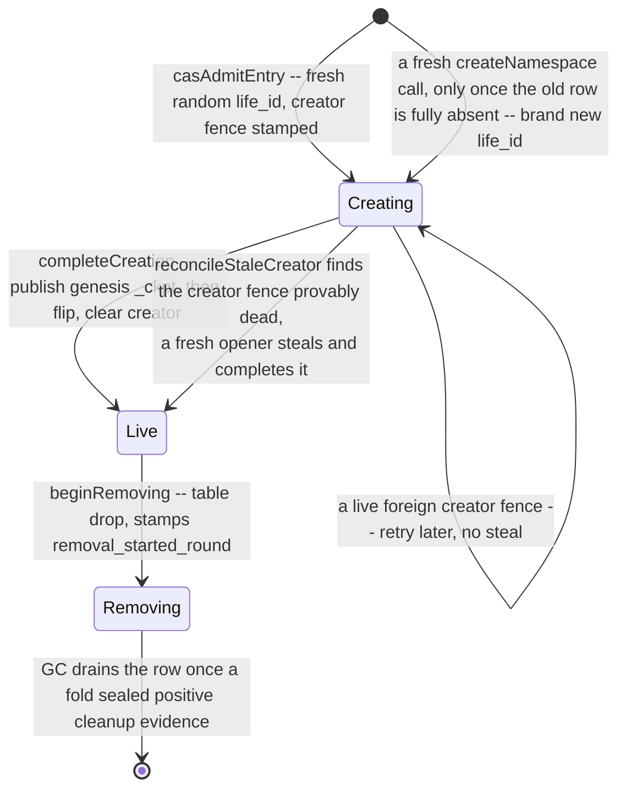

# CAS architecture — namespaces {#namespaces}

A namespace (`Cas::RootNamespace`) is the opaque, per-table, per-server-root string under which one
table's part manifests and one ref table live — in practice something the wiring layer composes,
such as `srv1/<table_uuid>` for an ordinary table or `srv1/shadow/<backup>/<table_uuid>` for a
`FREEZE` shadow. `CAS` never interprets its contents beyond a shape check (non-empty, no empty or
reserved path segment, at most 512 bytes). The [manifests-and-refs page](/antalya/cas/architecture/manifests-and-refs#ref-table)
covers the ref table one namespace owns; this page covers the namespace itself — its physical
identity, the catalog that is the sole authority for whether it exists, and its full lifetime from
first write to the catalog row's deletion.

## `life_id`: the physical identity {#life-id}

A namespace **name** can be reused — a table dropped and recreated keeps the same name. What must
never be reused is the **physical identity** any durable object under that name is keyed by, so
that a stale reader of the old incarnation can never be handed bytes belonging to the new one. That
identity is `life_id`: an opaque, pool-wide, randomly minted 128-bit value (two `thread_local_rng`
draws; retried on the astronomically unlikely zero draw, since `0` is reserved as "never a valid
life"). Internally it is the catalog's `incarnation` field, aliased as `NamespaceLifePhysicalId`;
paired with the namespace name it forms `NamespaceLifeId{ns, incarnation}`
(`Primitives/CasNamespaceLifeId.h`).

`NamespaceLifeId` deliberately has no default construction and no conversion from a bare namespace
name: code holding only the name cannot address a ref object or a namespace file at all, so
forgetting the life qualifier is a compile error, not a runtime aliasing bug. The only legitimate
source of a `NamespaceLifeId` is `fromCatalogEntry` — reading it off one immutable catalog cut —
which is what makes "this life belongs to this name" a catalog fact rather than something a caller
could reconstruct incorrectly.

`life_id` renders as 32 fixed-width lowercase hex digits and appears in exactly the two subtrees
that are life-owned (see the [storage-layout key table](/antalya/cas/architecture/storage-layout#key-table)):

| Subtree | Contents |
|---|---|
| `cas/ns/stream/<life_id>/` | The immutable `_log`/`_snap` ref-transaction history |
| `cas/ns/state/<life_id>/` | The mutable `_ckpt` checkpoint and any namespace-owned `_files/` |

Part manifests deliberately do **not** carry `life_id` — a manifest already has its own globally
unique identity (`{writer_epoch, build_sequence, manifest_ordinal}` under the server root, see the
[manifests-and-refs page](/antalya/cas/architecture/manifests-and-refs#part-manifests)) and needs no
further qualification. Loose mountpoint objects under `roots/` are outside namespace ownership
altogether and carry no `life_id` either.

## The namespace catalog {#catalog}

One pool-wide object, `cas/ref_catalog` (`Layout::refCatalogKey`), is the sole authority for which
namespaces exist. It is read on every fold round and every ref-table recovery, and mutated by one
token-`CAS` write per lifecycle transition. Its entries are canonically ordered by namespace bytes,
strictly ascending, with no duplicate name — both the encoder and the decoder enforce this, so an
out-of-order or duplicate-keyed catalog can never become durable.

Each row (`CatalogEntry`) carries:

| Field | Meaning |
|---|---|
| `ns` | The namespace name |
| `state` | `Creating`, `Live`, or `Removing` — see below |
| `incarnation` | The `life_id` for this row, nonzero, never reused |
| `creator` | The mounted writer's fence identity (server root, writer epoch, admission fence generation) that is creating this row — **required** iff `state == Creating`, **forbidden** otherwise |
| `removal_started_round` | The `GC` round observed when removal began — **required** iff `state == Removing`, absent otherwise |

`NsState`'s three wire values (`Creating = 1`, `Live = 2`, `Removing = 3`) are append-only, exactly
like every other persisted enum in `CAS`: a catalog object written by one build is read by another,
so a value is never renumbered or repurposed.

A row's own state machine is linear per row (`Creating → Live → Removing → gone`); what makes the
catalog non-linear as a whole is that a stalled `Creating` row can resolve two different ways
depending on whether its creator fence is still alive, and that a name only becomes creatable again
once its prior row is completely gone — both shown above.

## Lifetime end to end {#lifetime}

### Creation, on first write {#creation}

There is no explicit "create namespace" statement; a namespace is born the first time anything
resolves its ref table (`CasRefLedger::resolveNamespaceLife`, bounded at 32 loop attempts). If the
catalog has no row for the name at all, the resolving mount admits a `Creating` entry stamped with
its own creator fence and a freshly minted `life_id`
(`CasRefCatalog::createNamespace` → `casAdmitEntry`). Two more steps make it usable:

1. **Publish the genesis checkpoint.** The first `_ckpt` ever written for this `life_id` carries
   `life_epoch = creator.writer_epoch` — the only writer that will ever know this namespace's
   genesis epoch.
2. **Flip to `Live`.** One token-`CAS` moves the row from `Creating` to `Live` and clears `creator`.

Both steps re-check the resolving mount's own fence before writing, so a mount that lost its lease
mid-creation reports `FencedOut` rather than silently completing. Several openers racing the same
brand-new name all observe "no entry", but only one wins the admit; the rest see `Superseded` and
simply re-read the catalog, landing on the winner's `Creating` row.

A `Creating` row under a **different** mount's creator fence is not this opener's problem to force:
if that fence is still provably alive, the opener retries later; only once the fence is provably
dead (the same mount-lease terminality check `GC`'s heartbeat floor uses) does
`reconcileStaleCreator` let a fresh opener steal the row onto its own fence and finish the two steps
above itself.

### Removal {#removal}

Dropping a table (`DROP TABLE`, and every operation that reduces to it) calls
`CasRefLedger::dropNamespace`. It closes the namespace's local positive-mutation lane first — new
positive writers are refused while the in-flight ones drain — then transitions the catalog row from
`Live` to `Removing` in one token-`CAS` (`beginRemoving`, stamping `removal_started_round` from the
currently observed `GC` round), then appends **one** ref-log transaction that removes every current
committed and precommit binding and ends with a terminal `RemoveNamespace` op. Removal is never
refused by an admission check — Constraint 13 in the catalog's own spec — it always succeeds once
the fence holds.

Nothing is deleted by the writer at this point. No blob, no manifest, no ref-log object physically
disappears here — only pointers move, exactly like an ordinary [`DROP TABLE`](/antalya/cas/architecture/part-lifecycle#operation-mapping)
on any other ref.

### What `GC` does with a `Removing` namespace {#gc-and-removal}

The terminal `RemoveNamespace` transaction is folded like any other ref-log record, during the
[round's fold phases](/antalya/cas/architecture/garbage-collection#the-round). Folding it stamps
positive **cleanup evidence** directly onto that `life_id`'s row in the new fold seal — there is no
physical listing and no `Pending`/`Completed` handshake; the evidence is a pure fact about which
ref-log transaction folded.

The **next** round's `pre_fold_ref_drain` phase is what actually removes the catalog row: it reads
the just-adopted parent fold seal, and for every `Removing` row whose life carries durable cleanup
evidence, it exact-`CAS`-deletes the catalog entry before that round does anything else. This
two-round shape — evidence sealed in round *n*, catalog row deleted in round *n+1* — is why removal
needs no separate physical-emptiness proof: by the time the row is deleted, a fold has already
proven its ref history is fully drained.

### What disappears, and when {#what-disappears}

| Object class | Reclaimed by | When |
|---|---|---|
| Catalog row (`cas/ref_catalog` entry) | `GC` phase 2, `pre_fold_ref_drain` | The round after the fold that sealed cleanup evidence for this life |
| Part manifest bodies | Ordinary owner-removal ([phase 15](/antalya/cas/architecture/garbage-collection#the-round)) for anything that had a committed or precommit binding, the [orphan-manifest sweep](/antalya/cas/architecture/manifests-and-refs#orphan-sweep) for anything that never got that far | As each owning ref is dropped by the removal transaction itself, independent of the catalog row |
| Blob bodies | The ordinary condemn/graduate/delete pipeline | Whenever the manifests that named them stop being live, same as any other blob |
| Ref stream/state objects (`_log`, `_snap`, `_ckpt`, `_files`) under the dead `life_id` | The perpetual namespace janitor ([phase 16](/antalya/cas/architecture/garbage-collection#the-round)) | Best-effort, one bounded `LIST` page at a time, whenever it next lists a key whose `life_id` a fresh catalog cut no longer names — independent of, and not gated on, catalog-row deletion |

The janitor is leak-only: it never fails a round, never blocks progress on an unreadable key, and a
crash mid-page simply leaves debris for its next page.

### Recreate while removing {#recreate-while-removing}

A fresh `createNamespace` call for a name whose catalog row is still `Live` or `Removing` is
refused outright — internally this is a misuse `LOGICAL_ERROR`, because the higher-level open loop
(`resolveNamespaceLife`) filters that case out first and reports a typed retry-later error instead:
"creation waits for its terminal fold and catalog removal to complete". A caller that keeps
resolving the same name simply keeps retrying until the row is gone.

Once `pre_fold_ref_drain` has deleted the row, the name is free again, and the very next opener mints
a **brand new**, independently random `life_id` — never the retired one. That is the whole answer to
"what happens on recreate": the old physical identity is never revived, so every key ever written
under it — its `_log`, its `_snap`, its `_ckpt`, its `_files` — stays permanently addressed by a
value nothing will ever mint again, and a reader still holding the old `NamespaceLifeId` observes
only stale-or-absent data, never a byte that belongs to the new incarnation.
