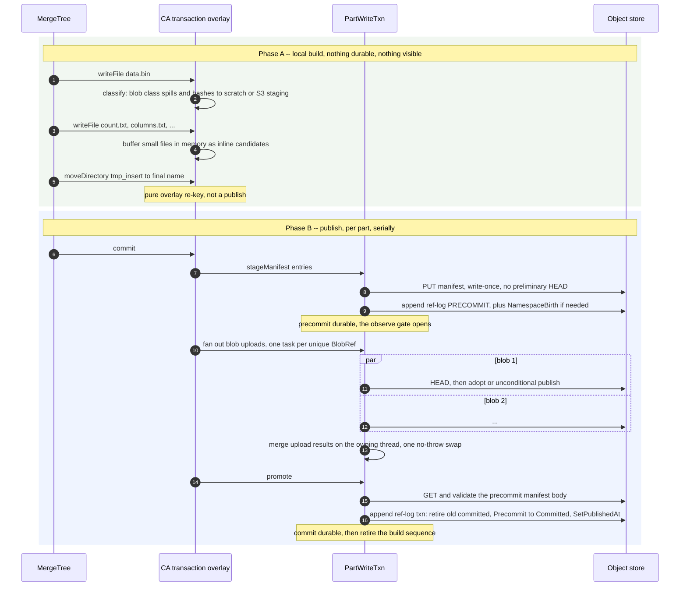

# CAS architecture — part lifecycle {#part-lifecycle}

Publishing a `MergeTree` part on a `CAS` disk is one durable protocol,
`stageManifest → precommitAdd → putBlob → promote`, driven by `Cas::PartWriteTxn`
(`Pool/CasPartWriteTxn.cpp`). This page walks that protocol end to end: local build, the durable
order and why each step is where it is, every crash window and who cleans it up, and how each
`MergeTree`-level operation (insert, merge, mutation, detach, …) maps onto it. Manifest structure
and the ref table it writes into are covered on the
[manifests-and-refs page](/antalya/cas/architecture/manifests-and-refs); the fetch-side protocol
for replicated parts is on the [replication page](/antalya/cas/architecture/replication).

## The protocol {#protocol}

**Phase A — staging.** The transaction is an eager overlay, not a queue: `writeFile` immediately
classifies the path and either spills bytes to a hashing buffer or holds them in memory as an
inline candidate. Blob-class files stage to local scratch by default. Explicit
`cas_staging_backend = s3` requires native same-store copy at writable mount and stages a complete
`[header][payload]` object. Its first publication after a destination miss may copy that object
verbatim; a condemned or subsequent publication opens the staged payload, retags it, and streams.
The `tmp_ → final` rename is a pure overlay re-key; durable publication happens only in `commit`.

**Step 1 — `stageManifest`.** Caps (see the
[manifests-and-refs page](/antalya/cas/architecture/manifests-and-refs#part-manifests)) are
checked before the write; the id is minted as `{epoch, build_seq, ordinal++}`; the body goes out
with a conditional create and no preliminary `HEAD`. Blob publication is different; manifests
remain small write-once metadata objects. Both a definite failure and an unresolved
outcome throw retry-later.

**Step 2 — `precommitAdd`.** The intent — target namespace, final ref name, manifest — is recorded
before the append, because an unresolved append may have landed anyway. One ref-log transaction
adds the precommit binding. A same-name birth is refused with retry-later while the catalog still
says `Removing`; once the predecessor row is absent, creation receives a new opaque life id and
starts its own stream. On return the precommit is durable, and only now may the writer adopt
existing blobs.

**Step 3 — blob materialization fan-out.** One task per unique `BlobRef`, deterministic dispatch order, one
pre-sized result slot per ref (see the write-path sequence on the
[blob-protocol page](/antalya/cas/architecture/blob-protocol#conditional-write-sequence)). The
calling thread only submits and joins, never occupies a pool slot, so a pool of size one degenerates
to a correct serial run and can never deadlock. The contract is merge-nothing: if any task threw,
nothing is merged and the first error in dispatch order is rethrown. Results are folded into the
dependency set on the owning thread, into a copy, committed by one no-throw swap. Every physical
task starts with blob `HEAD`; a present non-condemned body or a completed publication yields an
explicit `Materialized` proof. A trusted source manifest instead yields `TrustedManifest` without
blob I/O. Pool size is the
server setting `cas_blob_upload_pool_size` (default 16).

**Step 4 — `promote`.** Reads and revalidates the precommit manifest body once; sets the commit
state to Uncertain before the append — past that point, failure is no longer proof of the negative
— then checks that the precommit is still the live owner and validates explicit dependency proofs.
`Materialized` leaves are edge-protected; `TrustedManifest` leaves are trusted through the durable
source-manifest edge with no per-file `HEAD`; anything else is a `LOGICAL_ERROR`. The
whole thing lands as one ref-log record: optional retirement of the old committed binding, the pure
Precommit-to-Committed owner move, and `SetPublishedAt`. Promotion emits no blob deltas — the
manifest never loses an owner, so it is net zero.

## Crash points and their cleaners {#crash-points}

This table is the single best summary of the design's crash-safety story: every row leaks
something recoverable; no row loses data or leaves a dangling reference.

| # | Crash window | Left behind | Who cleans it |
|---|---|---|---|
| C1 | During staging | Local temp files, or S3 staging objects | Local: unconditional cleanup plus buffer destructor. S3: the mount's own staging sweep at next mount — never deleted on abort |
| C2 | After `stageManifest`, before `precommitAdd` | An unreferenced manifest body | Writer's best-effort exact-token delete; durable backstop is the orphan-manifest sweep |
| C3 | `precommitAdd` returned Unresolved | A possibly-live precommit binding | Intent recorded pre-append; `abandon` appends the exact removal, tolerating absence. The body is never writer-deleted |
| C4 | Between `precommitAdd` and `promote` | A live precommit plus uploaded blobs | No resume path exists. Removed by `abandon`, else by a fenced successor's stale-precommit sweep |
| C5 | Mid blob fan-out | Already-uploaded blobs | Nothing merged; blobs become `GC`-reclaimable debris; the part is not published |
| C6 | `promote` append Unresolved | The ref may or may not be committed | Commit state Uncertain — the relink layer maps this to "retry the whole fetch", never to a byte fetch |
| C7 | A later part throws after earlier parts published | A partial multi-part commit | Precise rollback: drop only the refs this call created, matching the exact manifest — never clobbers a concurrent writer's repoint |
| C8 | Transaction destroyed uncommitted | Open builds | Destructor abandons every build |
| C9 | Namespace dropped mid-build | — | One atomic flag; every further op fails closed at the alive check |

## The repoint {#repoint}

Writing into an already-committed part — an `ALTER`-style metadata rewrite, or any standalone
write against a committed source — never mutates the existing manifest. It writes a **new**
manifest over the (possibly partly reused) blob set and moves the ref to it in one ref-log record.
Unchanged columns are adopted by hash through a tokenless evidence dependency with no `HEAD` and no
`GET`; changed columns are fresh uploads. A repoint therefore costs zero bytes moved for the
carry-forward portion of the file set — only the changed content re-uploads.

## How each MergeTree operation maps {#operation-mapping}

| Operation | CAS mechanics |
|---|---|
| `INSERT` | The canonical path above. Projections ride the parent part's transaction |
| Merge | Identical for the output part. `<proj>.tmp_proj → <proj>.proj` is an entry-prefix re-key inside the staged manifest, not a rename |
| Mutation | `createHardLink` per unchanged file: a source staged in *this* transaction copies the entry and its pending-blob record; a **committed** source records a tokenless evidence dependency with no `HEAD` and no `GET`. A mutation is a manifest rewrite where zero bytes move for the carry-forward |
| `ALTER` / metadata rewrites | Standalone writes into a committed part, i.e. a repoint |
| `DROP PART` | `removeDirectory` drops the ref and clears any per-file removal marks — one ref-drop, zero repoints |
| `DROP TABLE` / `DETACHED` / `UNFREEZE` | A namespace or prefixed-ref drop. Blobs are never deleted here — removal is pointer-unlink plus deferred `GC` |
| `RENAME TABLE` | Republishes every ref and verbatim file into the new namespace, then drops the old one. Not atomic across namespaces, but idempotent and re-drivable — true atomicity would need a move journal and is out of scope |
| `FREEZE` / `BACKUP` / `RESTORE` / cross-disk `MOVE` | Each wraps the whole clone in one disk transaction, because a CAS part is one atomic unit |

`FREEZE` is the one operation that materializes real bytes into a genuinely separate shadow
namespace rather than reusing a table's own ref names — that shadow namespace is a `GC`
reachability root, and `UNFREEZE` releases its refs.

## Reads while a part is in flight {#in-flight-reads}

Read-your-writes for a part still inside an open transaction is served by an explicit overlay
rather than by any durable object — `tryGetInFlightStorageObjects`, `tryReadFileInFlight`,
`listInFlightDirectory`. One deliberate subtlety: the bare part directory reports as absent in the
overlay, so cleanup of a deduplication-rejected temporary part does not mistake it for a real part.
