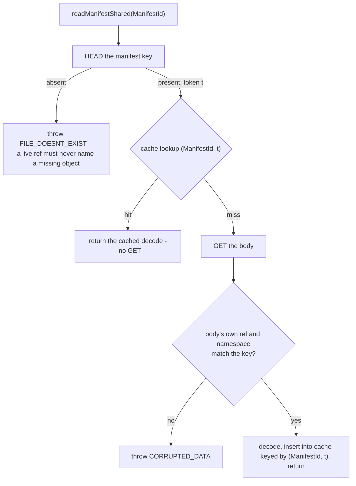

# CAS architecture — read path {#read-path}

A `CAS` read never touches a classical local-metadata path: there is no local directory listing to
consult, only a ref resolve followed by object-store reads. This page covers the three ways a file
access is served, the full chain for the common case, the two caches that sit on that chain, and
how a part still open inside a write transaction serves its own reads.

## How a file access is served {#access-kinds}

| Access kind | How it is served | S3 cost |
|---|---|---|
| Inline entry — small files such as `count.txt`, `columns.txt` | Decoded straight out of the manifest body | Zero additional operations |
| Blob-backed file — `.bin`, marks, large `primary.idx` | Ranged `GET` bounded by `[header_len, header_len + blob_size)` | One `GET` per column file per part open |
| Verbatim file — `roots/…` objects | Plain object read, no `CAS` indirection | One `GET` |

The full chain for a blob-backed file is: resolve the ref, read the manifest, look up the path,
build a blob view plan, ranged `GET`, then `ReadBufferFromFileView`. Because the payload always
starts at a pool-constant offset (the manifest's `blob_header_len`), no header parse is needed to
locate content — see the [envelope format](/antalya/cas/architecture/storage-layout#envelope-format)
on the storage-layout page.

Part manifests themselves are read whole after opening the object: there is no on-disk random
access, `seek`, or streaming requirement for their entry records — a manifest is small enough that
decoding the whole body is cheaper than any partial-read machinery would be.

## The two caches {#caches}

| Cache | Keyed by | Setting | Default | What still hits the network |
|---|---|---|---|---|
| Manifest decode cache | `(ManifestId, Token)` | `cas_manifest_decode_cache_bytes` | 128 MiB | A mandatory `HEAD` on **every** access, cache hit or miss |
| Part-folder view cache (`Cas::CachedPartFolderAccess`, `Parts/PartFolderAccess.h`) | Part ref key | `cas_part_folder_cache_bytes`, `cas_part_folder_cache_max_entries`, `cas_part_folder_cache_max_entry_bytes` | 64 MiB / 10 000 entries / 16 MiB | Its `ForceFresh` policy re-proves the manifest body via that same mandatory `HEAD`, paced by `cas_part_folder_validate` (`always` \| `never` \| `age <seconds>`) |

**The `HEAD` is mandatory even on a cache hit** — the page's most counter-intuitive fact, because it
means a cache hit still costs one object-store round trip:

The `HEAD` is what proves the live ref still names an existing object — the no-dangle invariant —
and it supplies the token that keys the cache; only then is the decode cache consulted. On a miss,
the `GET` is followed by the two identity checks in the diagram, each `CORRUPTED_DATA` on failure.
Only a fully validated decode enters the cache. Setting either cache's byte budget to `0` disables
retention while leaving the `HEAD`-and-validate sequence intact — a cache is purely an
optimization, never a trust boundary.

The part-folder view cache is invalidated on every promote and repoint, and is single-flight on a
cold build: concurrent readers of the same not-yet-cached view coalesce into one build rather than
racing independent `GET`s.

## Reads while a part is still being written {#in-flight-reads}

An in-flight part inside an open write transaction is not yet visible through the ordinary ref
resolve — reading it goes through the same explicit overlay used for read-your-writes, covered on
the [part-lifecycle page](/antalya/cas/architecture/part-lifecycle#in-flight-reads). The bare part
directory itself reports as absent in that overlay, precisely so that cleanup of a rejected
temporary part is never mistaken for a real, resolvable part.

## Diagnostic and read-only access {#read-only-access}

A read-only or diagnostic opener of a `CAS` disk (`ca-fsck`, `ca-gc-dryrun`, and similar tools)
must not claim mount ownership, schedule `GC`, or mint writer state — read-only enforcement sits
below the ordinary facade checks, at the backend layer itself. A mounted `Pool` caches its ref
table and does not re-recover it on every read; a diagnostic tool that deliberately performs a
fresh cold recovery on each pass can therefore observe a **less** stale ref table than a live
mounted read, which is intentional for tools whose entire purpose is catching drift a live mount
would not notice.
