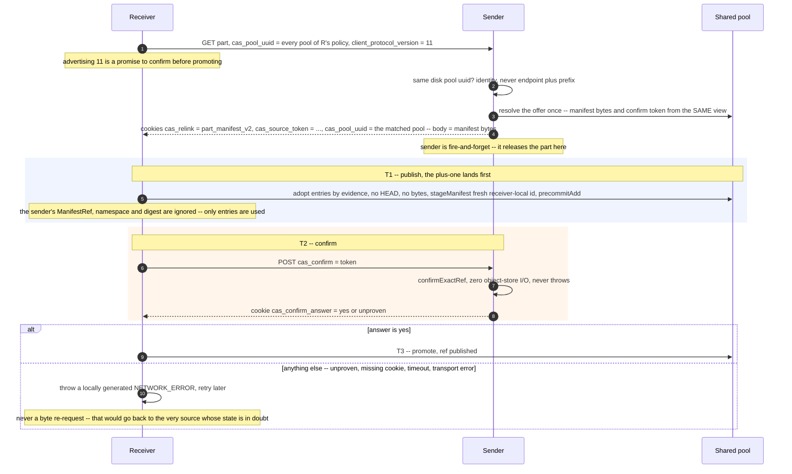

# CAS architecture — replication {#replication}

When two `ReplicatedMergeTree` replicas share a `CAS` pool, a fetch should move **no bytes** — the
receiver already has access to the same blobs the sender does. The mechanism is a three-phase
handshake, fetch by relink, layered directly on the ordinary interserver part-fetch protocol. This
page covers the handshake, the gates that decide whether it fires, what actually makes it safe
against a concurrent `GC` round, and how detach/attach/drop reduce to the same primitives. The
writer owns table semantics and part publication (see the
[part-lifecycle page](/antalya/cas/architecture/part-lifecycle)); `GC` owns ref-log folding and
physical cleanup (see the [garbage-collection page](/antalya/cas/architecture/garbage-collection))
— ordinary replication traffic never reads `gc/state` or waits on a `GC` round.

## The handshake {#handshake}

Only two of the three phases are round trips to the sender — the offer and the confirm. The
publish and the promote are the receiver's own writes to the pool.

## The gates, in order {#relink-gates}

| # | Gate | What it enforces |
|---|---|---|
| 1 | Pool identity | The receiver advertises `cas_pool_uuid` — the pool uuids of every content-addressed disk of its storage policy that is not read-only, as one list — and the sender offers relink only if its own disk's pool uuid is **in** it, naming that uuid in a `cas_pool_uuid` response cookie. Matching by endpoint and prefix was tried and rejected — a minted pool uuid is the identity |
| 2 | Protocol version 11 | On the receiver side, advertising it is a promise to run the confirm round trip before promoting |
| 3 | One resolution for two outputs | The manifest bytes and the confirm token come from the **same** view. Two separate calls would allow a repoint in between and hand the receiver a token naming a manifest whose entries it never adopted |
| 4 | The receiver trusts nothing from the wire but the entry list | The sender's manifest id, namespace and payload digest are ignored; the target namespace and ref come from the receiver's own router, and manifest path hygiene is validated at decode |
| 5 | The confirm is I/O-free and fail-closed | A cold, evicted, unfenced or terminal mount answers `Unknown`. `No` and `Unknown` both go on the wire as `unproven`, because the fence check is evaluated last, so a `No` cannot be distinguished from "cannot prove it right now" |
| 6 | Only the literal `yes` authorizes promotion | Everything else — including a timeout — is one outcome: throw and retry later |
| 7 | Promote outcomes are three-way | `Committed` proceeds; a **proven** not-committed state (body-absent precommit, precommit no longer live owner, ref conflict) falls back to a byte fetch; `Unresolved` **throws**, because returning "fall back" there would publish the part twice |

The byte-fetch fallback is bounded: it re-invokes the fetch with relink disabled, which stops the
receiver advertising its pool uuid, which stops the sender offering relink — so the relink path
cannot be entered twice for one fetch. Byte-fetched files content-address and dedup on arrival
anyway, so falling back never loses the dedup property, only the zero-byte-move property for that
one fetch.

## Where a relinked part lands {#relink-placement}

The offer decides the disk. Once the sender has named the pool, the receiver places the part on the
first disk of its storage policy that belongs to that pool, and reserves space there directly — ahead
of everything the policy would otherwise consult: volume order, JBOD balancing,
`max_data_part_size_bytes`, and `TTL ... TO DISK|VOLUME` move rules. A part that is already in the
pool never travels as bytes merely because the policy would have put it somewhere else.

A TTL rule is not ignored, it is deferred: the background mover sees a part that is not in its TTL
destination and moves it there afterwards. The bytes then travel once, as a read from the pool on the
receiver, and the sender is never loaded.

Two things do not bend to the offer. A disk the caller supplied (zero-copy `MOVE` re-fetching a shared
part onto the move's destination) is never overridden — a content-addressed disk cannot reach that path
at all, since it does not support zero-copy replication. And a read-only disk is never a candidate: its
pool is advertised only if some other disk of that pool in the policy is writable, and when none is, the
sender streams bytes and the ordinary placement applies.

A pool disk that is not live — its mount lease lost, its identity lost, or the storage shut down — is
still the target. The relink's own write gate refuses it and the fetch fails; a replication-queue fetch
is retried by the queue, while a manual `FETCH PART` or `FETCH PARTITION` reports the error to the user.
The part is never quietly placed on another disk instead. This is the behaviour a single-disk
content-addressed policy always had, and a mixed policy now shares it.

The byte-fetch fallback after a relink that failed for a mechanism reason (a corrupted manifest, a
body-absent precommit, a ref conflict) re-requests the bytes on the same pool disk, where they
content-address and deduplicate against the pool — the placement outlives the relink. A manifest of a
newer format generation is not degraded to bytes today (a tracked gap, `[relink-fallback-unknown-format-version]`
in the backlog).

During a rolling upgrade a sender that predates the pool-set advertise compares the whole `cas_pool_uuid`
value with its own pool id, so a receiver whose policy holds several pools gets bytes from such a sender
until it is upgraded; a receiver with one pool is unaffected, its advertise is byte-for-byte the old one.

## What actually seals "commit before release" {#relink-seal}

The receiver's `+1` — its precommit binding — is durable **before** the sender is asked anything,
and any removal of the sender's own binding is appended strictly after that `+1` is in the ref
log. That ordering, steps T1 then T2 then T3, is the whole seal.

This does **not** establish that every subsequent `GC` fold *sees* that `+1` under every listing
behavior: a configuration with one incomplete listing page can, in principle, let a fold miss a
freshly published edge. A confirmed relink therefore proves only "the source still holds exactly
this manifest right now", not "no future fold can ever miss this edge" — `ca-fsck`'s
reachable-but-absent scan is the backstop for that gap, not the relink protocol itself. Relink
also races `GC` in the ordinary sense any writer does: between the sender encoding its offer and
the receiver's promote, `GC` on the shared pool may condemn a blob that was live only through the
sender's own ref. The [writer-versus-GC race](/antalya/cas/architecture/blob-protocol#writer-gc-race)
on the blob-protocol page is what makes that interleaving safe — revival is re-upload only, and the
receiver's evidence-adopt is protected by its own durable precommit edge exactly like any other
writer's adopt.

A fetch whose source part is still a live, held `DataPartPtr` on the sender's own replica — the
common case for a local, same-process relink — keeps the source pinned through the destination's
commit by ordinary part-lifetime rules, independent of the ref-log seal above.

## Detach, attach, drop {#detach-attach-drop}

A detached part is **not** a separate namespace — it is a ref in the table's own namespace with a
`detached/` prefix (the same is true of `moving/`). Only `FREEZE` uses a separate shadow namespace,
but it remains under the root that created it: `<server_root_id>/shadow/<backup>/…`. The ownership
check therefore attributes it to exactly that server root, under the same strict prefix rule as live
content, and that root can confirm its exact refs.

`DETACH`, `ATTACH`, `delete_tmp_` cleanup, and merge-result renames all reduce to the same two
moves: re-key any *staged* source into the destination, then `republishRef(src → dst)` for any
*committed* source. `republishRef` resolves the source ref freshly and reads its manifest through
the manifest cache, publishes an
equivalent-entry manifest under the destination ref — a **new** manifest id, with blobs untouched
and adopted by evidence — then drops the source ref. A destination that already exists with
identical entries just drops the source, an idempotent re-drive; one with different entries
throws.

Manifests are therefore per-ref and never moved: a detach creates a new manifest for
`detached/<part>` and retires the old one, and the blobs' net in-degree is unchanged.
