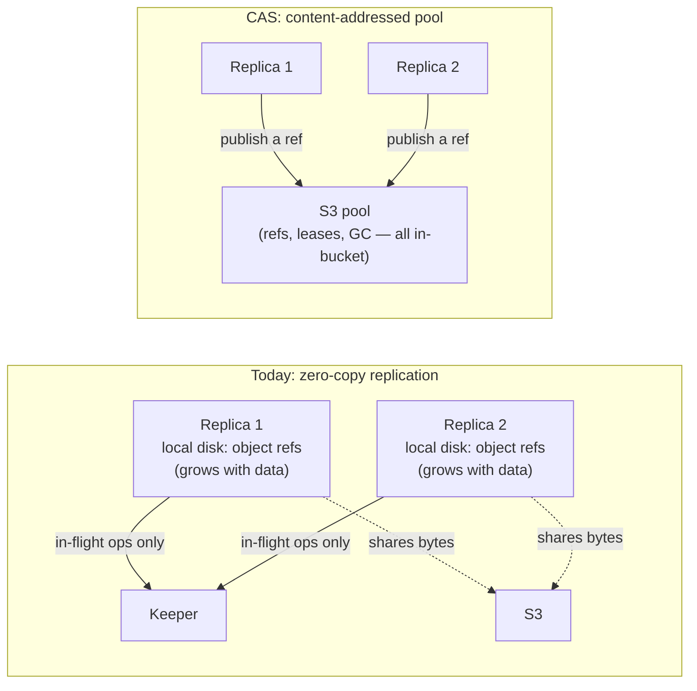

# Content-addressed storage {#content-addressed-storage}

`ReplicatedMergeTree` on object storage has two unattractive options today. Plain replication
stores a byte-identical copy of every part on every replica, so storage cost multiplies with the
replication factor. Zero-copy replication shares the bytes, but at a structural price: every
replica keeps local metadata referencing each shared S3 object, and that state grows with the
data; a commit spans three independent systems — local disk, S3, and `Keeper` — whose interleaving
is easy to get subtly wrong, and a failure in any one of the three hurts availability; sharing is
tracked by a numeric refcount, so a lost or duplicated retry can corrupt the count; and the
special cases supporting all of this are scattered widely through the `MergeTree` code.

Content-addressed storage (`CAS`) is a `MetadataStorage` back-end for object-storage disks
(`metadata_type = cas`) that takes the same sharing goal and collapses it onto one system: every
`MergeTree` part file is stored once, keyed by the hash of its content, in the object-storage pool
itself. There is no `CAS` state in `Keeper` at all — a commit is one conditional write against a
single object in the pool — and the reachability accounting is a derived in-degree edge set folded
from append-only deltas, not a mutable refcount a lost message can corrupt.



Every CAS bookkeeping object — refs, mount leases, GC leadership, fencing tokens — lives in the
bucket. There is no external coordinator, and no `Keeper` usage inside the pool protocol; `Keeper`
stays exactly where `ReplicatedMergeTree` already used it, for replication log and part-set
consensus, and its load does not grow with pool size.

## Deployment guidance {#deployment-guidance}

`GC` throughput is proportional to how much changes in the pool: a pool holding a very large
number of parts from many servers, or data that churns very quickly, means longer `GC` rounds.
Two consequences for planning:

- **The preferred deployment is a second tier for cold data**: hot, fast-churning parts stay on
  the local (or plain S3) tier, and `CAS` holds the large, slow-moving cold tail — where
  deduplication pays the most and `GC` traffic is minimal.
- **At large scale, shard the pool by key prefix.** With tens of servers, or thousands of tables
  and millions of parts, split the deployment into several independent pools by giving each shard
  its own prefix — the shards can share one bucket:

  ```xml
  <endpoint>https://bucket.s3.amazonaws.com/cas/{shard}</endpoint>
  ```

  Each prefix is a fully independent pool (its own refs, leases, and `GC`), so rounds stay short
  regardless of the total fleet size.

## Status {#status}

`CAS` is **experimental**. It ships in Altinity Antalya builds. Experimental means the on-disk
format and the SQL surface can still change between releases — that is deliberate, not a caveat to
apologize for. Pre-release means the format can change cheaply, with zero compatibility
scaffolding, and the design can keep being iterated on invariants rather than migrations. The bet
underneath it: all you need is a good S3 bucket. See [bucket requirements](/antalya/cas/bucket-requirements)
for exactly what "good" means.

`CAS` coexists with zero-copy replication; it does not replace it. `metadata_type = cas` is opt-in
per disk, so adopting it never requires migrating an existing deployment.

## Where to go next {#nav}

| Page | Covers |
|---|---|
| [Quick start](/antalya/cas/quick-start) | A minimal disk config and the first `CREATE TABLE` / `INSERT` / `SELECT` |
| [Configuration](/antalya/cas/configuration) | Every disk-level and server-level setting |
| [Bucket requirements](/antalya/cas/bucket-requirements) | What an object store must support, and which providers qualify |
| [Architecture overview](/antalya/cas/architecture/) | The object model, the Git analogy, and the safety invariants |
| [Correctness](/antalya/cas/architecture/correctness) | How the design was verified: TLA+ models, counterexamples, soak methodology |
| [Design history](/antalya/cas/architecture/design-history) | What earlier designs were tried and rejected, and why |
| [Roadmap](/antalya/cas/roadmap) | What is shipped, planned, and deliberately not pursued |
