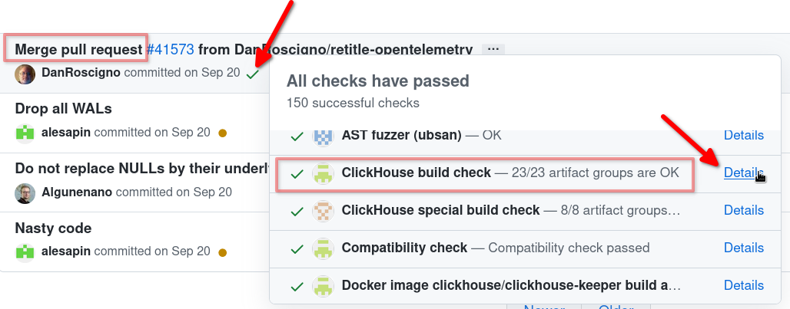

Supported platforms:

-   x86_64
-   AArch64
-   Power9 (experimental)

## Normal Build for Development on Ubuntu

The following tutorial is based on the Ubuntu Linux system. With appropriate changes, it should also work on any other Linux distribution.

### Install Prerequisites {#install-prerequisites}

``` bash
sudo apt-get install git cmake ccache python3 ninja-build yasm gawk
```

Or cmake3 instead of cmake on older systems.

### Install the latest clang (recommended)

On Ubuntu/Debian you can use the automatic installation script (check [official webpage](https://apt.llvm.org/))

```bash
sudo bash -c "$(wget -O - https://apt.llvm.org/llvm.sh)"
```

Note: in case of troubles, you can also use this:

```bash
sudo apt-get install software-properties-common
sudo add-apt-repository -y ppa:ubuntu-toolchain-r/test
```

For other Linux distribution - check the availability of the [prebuild packages](https://releases.llvm.org/download.html) or build clang [from sources](https://clang.llvm.org/get_started.html).

#### Use the latest clang for Builds

``` bash
export CC=clang-15
export CXX=clang++-15
```

In this example we use version 15 that is the latest as of Sept 2022.

Gcc cannot be used.

### Checkout ClickHouse Sources {#checkout-clickhouse-sources}

``` bash
git clone --recursive --shallow-submodules git@github.com:ClickHouse/ClickHouse.git
```

or

``` bash
git clone --recursive --shallow-submodules https://github.com/ClickHouse/ClickHouse.git
```

### Build ClickHouse {#build-clickhouse}

``` bash
cd ClickHouse
mkdir build
cd build
cmake ..
ninja
```

To create an executable, run `ninja clickhouse`.
This will create the `programs/clickhouse` executable, which can be used with `client` or `server` arguments.

## How to Build ClickHouse on Any Linux {#how-to-build-clickhouse-on-any-linux}

The build requires the following components:

-   Git (is used only to checkout the sources, it’s not needed for the build)
-   CMake 3.15 or newer
-   Ninja
-   C++ compiler: clang-15 or newer
-   Linker: lld
-   Yasm
-   Gawk

If all the components are installed, you may build in the same way as the steps above.

Example for Ubuntu Eoan:
``` bash
sudo apt update
sudo apt install git cmake ninja-build clang++ python yasm gawk
git clone --recursive https://github.com/ClickHouse/ClickHouse.git
mkdir build && cd build
cmake ../ClickHouse
ninja
```

Example for OpenSUSE Tumbleweed:
``` bash
sudo zypper install git cmake ninja clang-c++ python lld yasm gawk
git clone --recursive https://github.com/ClickHouse/ClickHouse.git
mkdir build && cd build
cmake ../ClickHouse
ninja
```

Example for Fedora Rawhide:
``` bash
sudo yum update
sudo yum --nogpg install git cmake make clang python3 ccache yasm gawk
git clone --recursive https://github.com/ClickHouse/ClickHouse.git
mkdir build && cd build
cmake ../ClickHouse
make -j $(nproc)
```

Here is an example of how to build `clang` and all the llvm infrastructure from sources:

```
git clone git@github.com:llvm/llvm-project.git
mkdir llvm-build && cd llvm-build
cmake -DCMAKE_BUILD_TYPE:STRING=Release -DLLVM_ENABLE_PROJECTS=all ../llvm-project/llvm/
make -j16
sudo make install
hash clang
clang --version
```

You can install the older clang like clang-11 from packages and then use it to build the new clang from sources.

Here is an example of how to install the new `cmake` from the official website:

```
wget https://github.com/Kitware/CMake/releases/download/v3.22.2/cmake-3.22.2-linux-x86_64.sh
chmod +x cmake-3.22.2-linux-x86_64.sh
./cmake-3.22.2-linux-x86_64.sh
export PATH=/home/milovidov/work/cmake-3.22.2-linux-x86_64/bin/:${PATH}
hash cmake
```

## You Don’t Have to Build ClickHouse {#you-dont-have-to-build-clickhouse}

ClickHouse is available in pre-built binaries and packages. Binaries are portable and can be run on any Linux flavour.

The CI checks build the binaries on each commit to [ClickHouse](https://github.com/clickhouse/clickhouse/). To download them:

1. Open the [commits list](https://github.com/ClickHouse/ClickHouse/commits/master)
1. Choose a **Merge pull request** commit that includes the new feature, or was added after the new feature
1. Click the status symbol (yellow dot, red x, green check) to open the CI check list
1. Scroll through the list until you find **ClickHouse build check x/x artifact groups are OK**
1. Click **Details**
1. Find the type of package for your operating system that you need and download the files.


