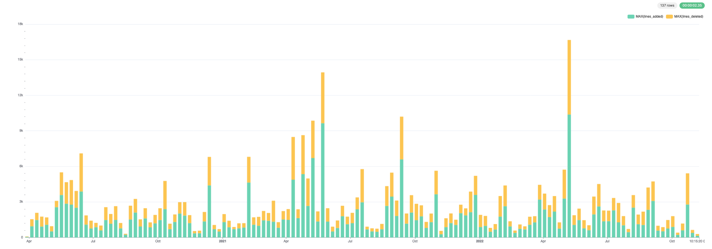
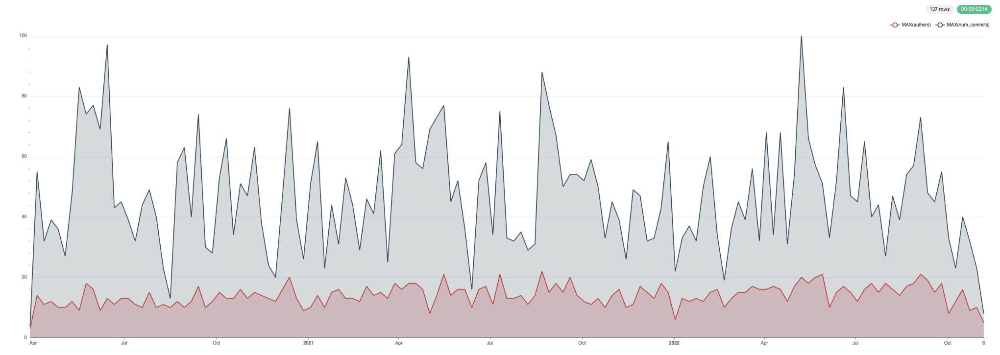
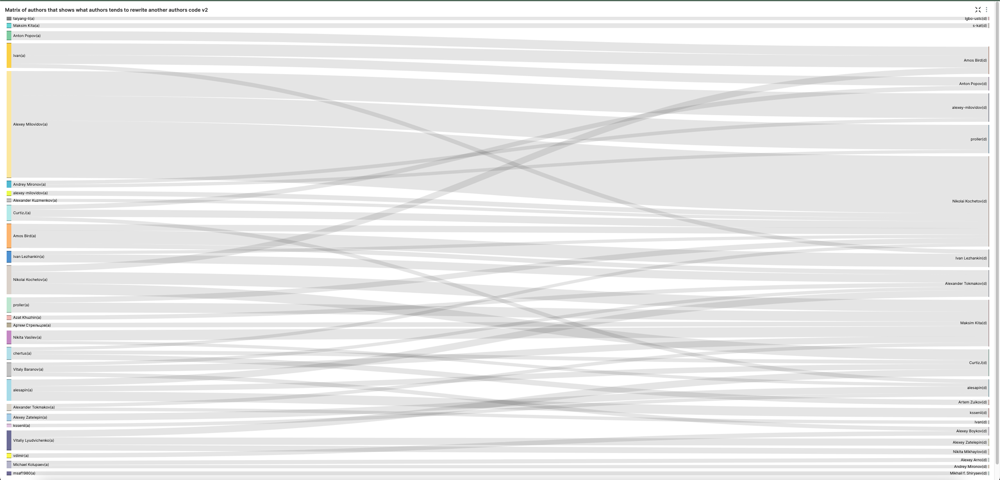
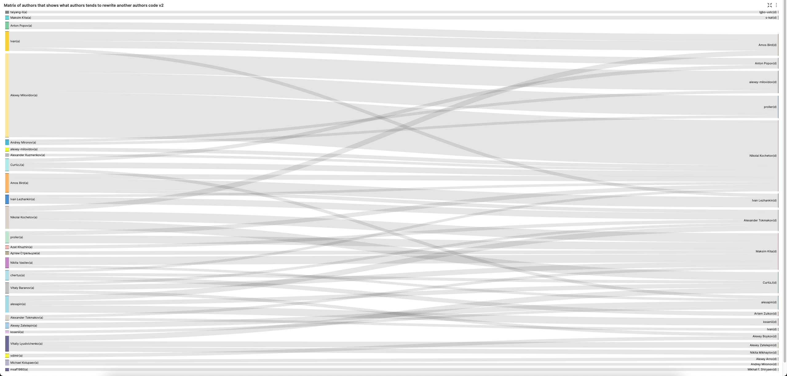

# Writing Queries in ClickHouse using GitHub Data

This dataset contains all of the commits and changes for the ClickHouse repository. It can be generated using the native `git-import` tool distributed with ClickHouse.

The generated data provides a `tsv` file for each of the following tables:

- `commits` - commits with statistics.
- `file_changes` - files changed in every commit with the info about the change and statistics.
- `line_changes` - every changed line in every changed file in every commit with full info about the line and the information about the previous change of this line.

As of November 8th, 2022, each TSV is approximately the following size and number of rows:

- `commits` - 7.8M - 266,051 rows
- `file_changes` - 53M - 266,051 rows
- `line_changes` - 2.7G - 7,535,157 rows

# Table of Contents

- [Table of Contents](#table-of-contents)
- [Generating the data](#generating-the-data)
- [Downloading and inserting the data](#downloading-and-inserting-the-data)
- [Queries](#queries)
  - [History of a single file](#history-of-a-single-file)
  - [Find the current active files](#find-the-current-active-files)
  - [List files with most modifications](#list-files-with-most-modifications)
  - [What day of the week do commits usually occur?](#what-day-of-the-week-do-commits-usually-occur)
  - [History of subdirectory/file - number of lines, commits and contributors over time](#history-of-subdirectoryfile---number-of-lines-commits-and-contributors-over-time)
  - [List files with maximum number of authors](#list-files-with-maximum-number-of-authors)
  - [Oldest lines of code in the repository](#oldest-lines-of-code-in-the-repository)
  - [Files with longest history](#files-with-longest-history)
  - [Distribution of contributors with respect to docs and code over the month](#distribution-of-contributors-with-respect-to-docs-and-code-over-the-month)
  - [Authors with the most diverse impact](#authors-with-the-most-diverse-impact)
  - [Favorite files for an author](#favorite-files-for-an-author)
  - [Largest files with lowest number of authors](#largest-files-with-lowest-number-of-authors)
  - [Commits and lines of code distribution by time; by weekday, by author; for specific subdirectories](#commits-and-lines-of-code-distribution-by-time-by-weekday-by-author-for-specific-subdirectories)
  - [Matrix of authors that shows what authors tends to rewrite another authors code](#matrix-of-authors-that-shows-what-authors-tends-to-rewrite-another-authors-code)
  - [Who is the highest percentage contributor per day of week?](#who-is-the-highest-percentage-contributor-per-day-of-week)
  - [Distribution of code age across repository](#distribution-of-code-age-across-repository)
  - [What percentage of code for an author has been removed by other authors?](#what-percentage-of-code-for-an-author-has-been-removed-by-other-authors)
  - [List files that were rewritten most number of times?](#list-files-that-were-rewritten-most-number-of-times)
  - [What weekday does the code have the highest chance to stay in the repository?](#what-weekday-does-the-code-have-the-highest-chance-to-stay-in-the-repository)
  - [Files sorted by average code age](#files-sorted-by-average-code-age)
  - [Who tends to write more tests / CPP code / comments?](#who-tends-to-write-more-tests--cpp-code--comments)
  - [How does an authors commits change over time with respect to code/comments percentage?](#how-does-an-authors-commits-change-over-time-with-respect-to-codecomments-percentage)
  - [What is the average time before code will be rewritten and the median (half-life of code decay)?](#what-is-the-average-time-before-code-will-be-rewritten-and-the-median-half-life-of-code-decay)
  - [What is the worst time to write code in sense that the code has highest chance to be re-written?](#what-is-the-worst-time-to-write-code-in-sense-that-the-code-has-highest-chance-to-be-re-written)
  - [Which authors code is the most sticky?](#which-authors-code-is-the-most-sticky)
  - [Most consecutive days of commits by an author](#most-consecutive-days-of-commits-by-an-author)
  - [Line by line commit history of a file](#line-by-line-commit-history-of-a-file)
- [Unsolved Questions](#unsolved-questions)
  - [Git blame](#git-blame)
- [Related Content](#related-content)

# Generating the data

This is optional. We distribute the data freely - see [Downloading and inserting the data](#downloading-and-inserting-the-data).

```bash
git clone git@github.com:ClickHouse/ClickHouse.git
cd ClickHouse
clickhouse git-import --skip-paths 'generated\.cpp|^(contrib|docs?|website|libs/(libcityhash|liblz4|libdivide|libvectorclass|libdouble-conversion|libcpuid|libzstd|libfarmhash|libmetrohash|libpoco|libwidechar_width))/' --skip-commits-with-messages '^Merge branch '
```

This will take around 3 minutes (as of November 8th 2022 on a MacBook Pro 2021) to complete for the ClickHouse repository.

A full list of available options can be obtained from the tools native help.

```bash
clickhouse git-import -h
```

This help also provides the DDL for each of the above tables e.g.

```
CREATE TABLE git.commits
(
    hash String,
    author LowCardinality(String),
    time DateTime,
    message String,
    files_added UInt32,
    files_deleted UInt32,
    files_renamed UInt32,
    files_modified UInt32,
    lines_added UInt32,
    lines_deleted UInt32,
    hunks_added UInt32,
    hunks_removed UInt32,
    hunks_changed UInt32
) ENGINE = MergeTree ORDER BY time;
```

**These queries should work on any repository. Feel free to explore and report your findings** Some guidelines with respect to execution times (as of November 2022):

- Linux - `~/clickhouse git-import` - 160 mins

# Downloading and inserting the data

The following data can be used to reproduce a working environment. Alternatively, this dataset is available in play.clickhouse.com - see [Queries](#queries) for further details.

Generated files for the following repositories can be found below:

- ClickHouse (Nov 8th 2022)
    - https://datasets-documentation.s3.amazonaws.com/github/commits/clickhouse/commits.tsv.xz - 2.5 MB
    - https://datasets-documentation.s3.amazonaws.com/github/commits/clickhouse/file_changes.tsv.xz - 4.5MB
    - https://datasets-documentation.s3.amazonaws.com/github/commits/clickhouse/line_changes.tsv.xz - 127.4 MB
- Linux (Nov 8th 2022)
    - https://datasets-documentation.s3.amazonaws.com/github/commits/linux/commits.tsv.xz - 44 MB
    - https://datasets-documentation.s3.amazonaws.com/github/commits/linux/file_changes.tsv.xz - 467MB
    - https://datasets-documentation.s3.amazonaws.com/github/commits/linux/line_changes.tsv.xz - 1.1G

To insert this data, prepare the database by executing the following queries:

```sql
DROP DATABASE IF EXISTS git;
CREATE DATABASE git;

CREATE TABLE git.commits
(
    hash String,
    author LowCardinality(String),
    time DateTime,
    message String,
    files_added UInt32,
    files_deleted UInt32,
    files_renamed UInt32,
    files_modified UInt32,
    lines_added UInt32,
    lines_deleted UInt32,
    hunks_added UInt32,
    hunks_removed UInt32,
    hunks_changed UInt32
) ENGINE = MergeTree ORDER BY time;

CREATE TABLE git.file_changes
(
    change_type Enum('Add' = 1, 'Delete' = 2, 'Modify' = 3, 'Rename' = 4, 'Copy' = 5, 'Type' = 6),
    path LowCardinality(String),
    old_path LowCardinality(String),
    file_extension LowCardinality(String),
    lines_added UInt32,
    lines_deleted UInt32,
    hunks_added UInt32,
    hunks_removed UInt32,
    hunks_changed UInt32,

    commit_hash String,
    author LowCardinality(String),
    time DateTime,
    commit_message String,
    commit_files_added UInt32,
    commit_files_deleted UInt32,
    commit_files_renamed UInt32,
    commit_files_modified UInt32,
    commit_lines_added UInt32,
    commit_lines_deleted UInt32,
    commit_hunks_added UInt32,
    commit_hunks_removed UInt32,
    commit_hunks_changed UInt32
) ENGINE = MergeTree ORDER BY time;

CREATE TABLE git.line_changes
(
    sign Int8,
    line_number_old UInt32,
    line_number_new UInt32,
    hunk_num UInt32,
    hunk_start_line_number_old UInt32,
    hunk_start_line_number_new UInt32,
    hunk_lines_added UInt32,
    hunk_lines_deleted UInt32,
    hunk_context LowCardinality(String),
    line LowCardinality(String),
    indent UInt8,
    line_type Enum('Empty' = 0, 'Comment' = 1, 'Punct' = 2, 'Code' = 3),

    prev_commit_hash String,
    prev_author LowCardinality(String),
    prev_time DateTime,

    file_change_type Enum('Add' = 1, 'Delete' = 2, 'Modify' = 3, 'Rename' = 4, 'Copy' = 5, 'Type' = 6),
    path LowCardinality(String),
    old_path LowCardinality(String),
    file_extension LowCardinality(String),
    file_lines_added UInt32,
    file_lines_deleted UInt32,
    file_hunks_added UInt32,
    file_hunks_removed UInt32,
    file_hunks_changed UInt32,

    commit_hash String,
    author LowCardinality(String),
    time DateTime,
    commit_message String,
    commit_files_added UInt32,
    commit_files_deleted UInt32,
    commit_files_renamed UInt32,
    commit_files_modified UInt32,
    commit_lines_added UInt32,
    commit_lines_deleted UInt32,
    commit_hunks_added UInt32,
    commit_hunks_removed UInt32,
    commit_hunks_changed UInt32
) ENGINE = MergeTree ORDER BY time;
```

Insert the data using `INSERT INTO SELECT` and the [s3 function](https://clickhouse.com/docs/en/integrations/s3/s3-table-functions/). For example, below, we insert the ClickHouse files into each of their respective tables:

*commits*

```sql
INSERT INTO git.commits SELECT *
FROM s3('https://datasets-documentation.s3.amazonaws.com/github/commits/clickhouse/commits.tsv.xz', 'TSV', 'hash String,author LowCardinality(String), time DateTime, message String, files_added UInt32, files_deleted UInt32, files_renamed UInt32, files_modified UInt32, lines_added UInt32, lines_deleted UInt32, hunks_added UInt32, hunks_removed UInt32, hunks_changed UInt32')

0 rows in set. Elapsed: 1.826 sec. Processed 62.78 thousand rows, 8.50 MB (34.39 thousand rows/s., 4.66 MB/s.)
```

*file_changes*

```sql
INSERT INTO git.file_changes SELECT *
FROM s3('https://datasets-documentation.s3.amazonaws.com/github/commits/clickhouse/file_changes.tsv.xz', 'TSV', 'change_type Enum(\'Add\' = 1, \'Delete\' = 2, \'Modify\' = 3, \'Rename\' = 4, \'Copy\' = 5, \'Type\' = 6), path LowCardinality(String), old_path LowCardinality(String), file_extension LowCardinality(String), lines_added UInt32, lines_deleted UInt32, hunks_added UInt32, hunks_removed UInt32, hunks_changed UInt32, commit_hash String, author LowCardinality(String), time DateTime, commit_message String, commit_files_added UInt32, commit_files_deleted UInt32, commit_files_renamed UInt32, commit_files_modified UInt32, commit_lines_added UInt32, commit_lines_deleted UInt32, commit_hunks_added UInt32, commit_hunks_removed UInt32, commit_hunks_changed UInt32')

0 rows in set. Elapsed: 2.688 sec. Processed 266.05 thousand rows, 48.30 MB (98.97 thousand rows/s., 17.97 MB/s.)
```

*line_changes*

```sql
INSERT INTO git.line_changes SELECT *
FROM s3('https://datasets-documentation.s3.amazonaws.com/github/commits/clickhouse/line_changes.tsv.xz', 'TSV', '    sign Int8, line_number_old UInt32, line_number_new UInt32, hunk_num UInt32, hunk_start_line_number_old UInt32, hunk_start_line_number_new UInt32, hunk_lines_added UInt32,\n    hunk_lines_deleted UInt32, hunk_context LowCardinality(String), line LowCardinality(String), indent UInt8, line_type Enum(\'Empty\' = 0, \'Comment\' = 1, \'Punct\' = 2, \'Code\' = 3), prev_commit_hash String, prev_author LowCardinality(String), prev_time DateTime, file_change_type Enum(\'Add\' = 1, \'Delete\' = 2, \'Modify\' = 3, \'Rename\' = 4, \'Copy\' = 5, \'Type\' = 6),\n    path LowCardinality(String), old_path LowCardinality(String), file_extension LowCardinality(String), file_lines_added UInt32, file_lines_deleted UInt32, file_hunks_added UInt32, file_hunks_removed UInt32, file_hunks_changed UInt32, commit_hash String,\n    author LowCardinality(String), time DateTime, commit_message String, commit_files_added UInt32, commit_files_deleted UInt32, commit_files_renamed UInt32, commit_files_modified UInt32, commit_lines_added UInt32, commit_lines_deleted UInt32, commit_hunks_added UInt32, commit_hunks_removed UInt32, commit_hunks_changed UInt32')

0 rows in set. Elapsed: 50.535 sec. Processed 7.54 million rows, 2.09 GB (149.11 thousand rows/s., 41.40 MB/s.)
```

# Queries

The tool suggests several queries via its help output. We have answered these in addition to some additional supplementary questions of interest. These queries are of approximately increasing complexity vs. the tool's arbitrary order.

This dataset is available in [play.clickhouse.com](https://sql.clickhouse.com?query_id=DCQPNPAIMAQXRLHYURLKVJ) in the `git_clickhouse` databases. We provide a link to this environment for all queries, adapting the database name as required. Note that play results may vary from the those presented here due to differences in time of data collection.

## History of a single file

The simplest of queries. Here we look at all commit messages for the `StorageReplicatedMergeTree.cpp`. Since these are likely more interesting, we sort by the most recent messages first.

[play](https://sql.clickhouse.com?query_id=COAZRFX2YFULDBXRQTCQ1S)

```sql
SELECT
    time,
    substring(commit_hash, 1, 11) AS commit,
    change_type,
    author,
    path,
    old_path,
    lines_added,
    lines_deleted,
    commit_message
FROM git.file_changes
WHERE path = 'src/Storages/StorageReplicatedMergeTree.cpp'
ORDER BY time DESC
LIMIT 10

┌────────────────time─┬─commit──────┬─change_type─┬─author─────────────┬─path────────────────────────────────────────┬─old_path─┬─lines_added─┬─lines_deleted─┬─commit_message───────────────────────────────────┐
│ 2022-10-30 16:30:51 │ c68ab231f91 │ Modify      │ Alexander Tokmakov │ src/Storages/StorageReplicatedMergeTree.cpp │          │          13 │            10 │ fix accessing part in Deleting state             │
│ 2022-10-23 16:24:20 │ b40d9200d20 │ Modify      │ Anton Popov        │ src/Storages/StorageReplicatedMergeTree.cpp │          │          28 │            30 │ better semantic of constsness of DataPartStorage │
│ 2022-10-23 01:23:15 │ 56e5daba0c9 │ Modify      │ Anton Popov        │ src/Storages/StorageReplicatedMergeTree.cpp │          │          28 │            44 │ remove DataPartStorageBuilder                    │
│ 2022-10-21 13:35:37 │ 851f556d65a │ Modify      │ Igor Nikonov       │ src/Storages/StorageReplicatedMergeTree.cpp │          │           3 │             2 │ Remove unused parameter                          │
│ 2022-10-21 13:02:52 │ 13d31eefbc3 │ Modify      │ Igor Nikonov       │ src/Storages/StorageReplicatedMergeTree.cpp │          │           4 │             4 │ Replicated merge tree polishing                  │
│ 2022-10-21 12:25:19 │ 4e76629aafc │ Modify      │ Azat Khuzhin       │ src/Storages/StorageReplicatedMergeTree.cpp │          │           3 │             2 │ Fixes for -Wshorten-64-to-32                     │
│ 2022-10-19 13:59:28 │ 05e6b94b541 │ Modify      │ Antonio Andelic    │ src/Storages/StorageReplicatedMergeTree.cpp │          │           4 │             0 │ Polishing                                        │
│ 2022-10-19 13:34:20 │ e5408aac991 │ Modify      │ Antonio Andelic    │ src/Storages/StorageReplicatedMergeTree.cpp │          │           3 │            53 │ Simplify logic                                   │
│ 2022-10-18 15:36:11 │ 7befe2825c9 │ Modify      │ Alexey Milovidov   │ src/Storages/StorageReplicatedMergeTree.cpp │          │           2 │             2 │ Update StorageReplicatedMergeTree.cpp            │
│ 2022-10-18 15:35:44 │ 0623ad4e374 │ Modify      │ Alexey Milovidov   │ src/Storages/StorageReplicatedMergeTree.cpp │          │           1 │             1 │ Update StorageReplicatedMergeTree.cpp            │
└─────────────────────┴─────────────┴─────────────┴────────────────────┴─────────────────────────────────────────────┴──────────┴─────────────┴───────────────┴──────────────────────────────────────────────────┘

10 rows in set. Elapsed: 0.006 sec. Processed 12.10 thousand rows, 1.60 MB (1.93 million rows/s., 255.40 MB/s.)
```


We can also review the line changes, excluding renames i.e. we won't show changes before a rename event when the file existed under a different name:

[play](https://sql.clickhouse.com?query_id=AKS9SYLARFMZCHGAAQNEBN)

```sql
SELECT
    time,
    substring(commit_hash, 1, 11) AS commit,
    sign,
    line_number_old,
    line_number_new,
    author,
    line
FROM git.line_changes
WHERE path = 'src/Storages/StorageReplicatedMergeTree.cpp'
ORDER BY line_number_new ASC
LIMIT 10

┌────────────────time─┬─commit──────┬─sign─┬─line_number_old─┬─line_number_new─┬─author───────────┬─line──────────────────────────────────────────────────┐
│ 2020-04-16 02:06:10 │ cdeda4ab915 │   -1 │               1 │               1 │ Alexey Milovidov │ #include <Disks/DiskSpaceMonitor.h>                   │
│ 2020-04-16 02:06:10 │ cdeda4ab915 │    1 │               2 │               1 │ Alexey Milovidov │ #include <Core/Defines.h>                             │
│ 2020-04-16 02:06:10 │ cdeda4ab915 │    1 │               2 │               2 │ Alexey Milovidov │                                                       │
│ 2021-05-03 23:46:51 │ 02ce9cc7254 │   -1 │               3 │               2 │ Alexey Milovidov │ #include <Common/FieldVisitors.h>                     │
│ 2021-05-27 22:21:02 │ e2f29b9df02 │   -1 │               3 │               2 │ s-kat            │ #include <Common/FieldVisitors.h>                     │
│ 2022-10-03 22:30:50 │ 210882b9c4d │    1 │               2 │               3 │ alesapin         │ #include <ranges>                                     │
│ 2022-10-23 16:24:20 │ b40d9200d20 │    1 │               2 │               3 │ Anton Popov      │ #include <cstddef>                                    │
│ 2021-06-20 09:24:43 │ 4c391f8e994 │    1 │               2 │               3 │ Mike Kot         │ #include "Common/hex.h"                               │
│ 2021-12-29 09:18:56 │ 8112a712336 │   -1 │               6 │               5 │ avogar           │ #include <Common/ThreadPool.h>                        │
│ 2022-04-21 20:19:13 │ 9133e398b8c │    1 │              11 │              12 │ Nikolai Kochetov │ #include <Storages/MergeTree/DataPartStorageOnDisk.h> │
└─────────────────────┴─────────────┴──────┴─────────────────┴─────────────────┴──────────────────┴───────────────────────────────────────────────────────┘

10 rows in set. Elapsed: 0.258 sec. Processed 7.54 million rows, 654.92 MB (29.24 million rows/s., 2.54 GB/s.)
```

Note a more complex variant of this query exists where we find the [line-by-line commit history of a file](#line-by-line-commit-history-of-a-file) considering renames.

## Find the current active files

This is important for later analysis when we only want to consider the current files in the repository. We estimate this set as the files which haven't been renamed or deleted (and then re-added/re-named).

**Note there appears to have been a broken commit history in relation to files under the `dbms`, `libs`, `tests/testflows/` directories during their renames. We also thus exclude these.**

[play](https://sql.clickhouse.com?query_id=2HNFWPCFWEEY92WTAPMA7W)

```sql
SELECT path
FROM
(
    SELECT
        old_path AS path,
        max(time) AS last_time,
        2 AS change_type
    FROM git.file_changes
    GROUP BY old_path
    UNION ALL
    SELECT
        path,
        max(time) AS last_time,
        argMax(change_type, time) AS change_type
    FROM git.file_changes
    GROUP BY path
)
GROUP BY path
HAVING (argMax(change_type, last_time) != 2) AND NOT match(path, '(^dbms/)|(^libs/)|(^tests/testflows/)|(^programs/server/store/)') ORDER BY path
LIMIT 10

┌─path────────────────────────────────────────────────────────────┐
│ tests/queries/0_stateless/01054_random_printable_ascii_ubsan.sh │
│ tests/queries/0_stateless/02247_read_bools_as_numbers_json.sh   │
│ tests/performance/file_table_function.xml                       │
│ tests/queries/0_stateless/01902_self_aliases_in_columns.sql     │
│ tests/queries/0_stateless/01070_h3_get_base_cell.reference      │
│ src/Functions/ztest.cpp                                         │
│ src/Interpreters/InterpreterShowTablesQuery.h                   │
│ src/Parsers/Kusto/ParserKQLStatement.h                          │
│ tests/queries/0_stateless/00938_dataset_test.sql                │
│ src/Dictionaries/Embedded/GeodataProviders/Types.h              │
└─────────────────────────────────────────────────────────────────┘

10 rows in set. Elapsed: 0.085 sec. Processed 532.10 thousand rows, 8.68 MB (6.30 million rows/s., 102.64 MB/s.)
```

Note that this allows for files to be renamed and then re-renamed to their original values. First we aggregate `old_path` for a list of deleted files as a result of renaming. We union this with the last operation for every `path`. Finally, we filter this list to those where the final event is not a `Delete`.

[play](https://sql.clickhouse.com?query_id=1OXCKMOH2JVMSHD3NS2WW6)

```sql
SELECT uniq(path)
FROM
(
    SELECT path
    FROM
    (
        SELECT
            old_path AS path,
            max(time) AS last_time,
            2 AS change_type
        FROM git.file_changes
        GROUP BY old_path
        UNION ALL
        SELECT
            path,
            max(time) AS last_time,
            argMax(change_type, time) AS change_type
        FROM git.file_changes
        GROUP BY path
    )
    GROUP BY path
    HAVING (argMax(change_type, last_time) != 2) AND NOT match(path, '(^dbms/)|(^libs/)|(^tests/testflows/)|(^programs/server/store/)') ORDER BY path
)

┌─uniq(path)─┐
│      18559 │
└────────────┘
1 row in set. Elapsed: 0.089 sec. Processed 532.10 thousand rows, 8.68 MB (6.01 million rows/s., 97.99 MB/s.)
```

Note that we skipped import of several directories during import i.e.

`--skip-paths 'generated\.cpp|^(contrib|docs?|website|libs/(libcityhash|liblz4|libdivide|libvectorclass|libdouble-conversion|libcpuid|libzstd|libfarmhash|libmetrohash|libpoco|libwidechar_width))/'`

Applying this pattern to `git list-files`, reports 18155.

```bash
git ls-files | grep -v -E 'generated\.cpp|^(contrib|docs?|website|libs/(libcityhash|liblz4|libdivide|libvectorclass|libdouble-conversion|libcpuid|libzstd|libfarmhash|libmetrohash|libpoco|libwidechar_width))/' | wc -l
   18155
```

**Our current solution is therefore an estimate of the current files**

The difference here is caused by a few factors:

- A rename can occur alongside other modifications to the file. These are listed as separate events in file_changes but with the same time. The `argMax` function has no way of distinguishing these - it picks the first value. The natural ordering of the inserts (the only means of knowing the correct order) is not maintained across the union so modified events can be selected. For example, below the `src/Functions/geometryFromColumn.h` file has several modifications before being renamed to `src/Functions/geometryConverters.h`. Our current solution may pick a Modify event as the latest change causing `src/Functions/geometryFromColumn.h` to be retained.

[play](https://sql.clickhouse.com?query_id=SCXWMR9GBMJ9UNZYQXQBFA)

```sql
  SELECT
      change_type,
      path,
      old_path,
      time,
      commit_hash
  FROM git.file_changes
  WHERE (path = 'src/Functions/geometryFromColumn.h') OR (old_path = 'src/Functions/geometryFromColumn.h')

  ┌─change_type─┬─path───────────────────────────────┬─old_path───────────────────────────┬────────────────time─┬─commit_hash──────────────────────────────┐
  │ Add         │ src/Functions/geometryFromColumn.h │                                    │ 2021-03-11 12:08:16 │ 9376b676e9a9bb8911b872e1887da85a45f7479d │
  │ Modify      │ src/Functions/geometryFromColumn.h │                                    │ 2021-03-11 12:08:16 │ 6d59be5ea4768034f6526f7f9813062e0c369f7b │
  │ Modify      │ src/Functions/geometryFromColumn.h │                                    │ 2021-03-11 12:08:16 │ 33acc2aa5dc091a7cb948f78c558529789b2bad8 │
  │ Modify      │ src/Functions/geometryFromColumn.h │                                    │ 2021-03-11 12:08:16 │ 78e0db268ceadc42f82bc63a77ee1a4da6002463 │
  │ Modify      │ src/Functions/geometryFromColumn.h │                                    │ 2021-03-11 12:08:16 │ 14a891057d292a164c4179bfddaef45a74eaf83a │
  │ Modify      │ src/Functions/geometryFromColumn.h │                                    │ 2021-03-11 12:08:16 │ d0d6e6953c2a2af9fb2300921ff96b9362f22edb │
  │ Modify      │ src/Functions/geometryFromColumn.h │                                    │ 2021-03-11 12:08:16 │ fe8382521139a58c0ba277eb848e88894658db66 │
  │ Modify      │ src/Functions/geometryFromColumn.h │                                    │ 2021-03-11 12:08:16 │ 3be3d5cde8788165bc0558f1e2a22568311c3103 │
  │ Modify      │ src/Functions/geometryFromColumn.h │                                    │ 2021-03-11 12:08:16 │ afad9bf4d0a55ed52a3f55483bc0973456e10a56 │
  │ Modify      │ src/Functions/geometryFromColumn.h │                                    │ 2021-03-11 12:08:16 │ e3290ecc78ca3ea82b49ebcda22b5d3a4df154e6 │
  │ Rename      │ src/Functions/geometryConverters.h │ src/Functions/geometryFromColumn.h │ 2021-03-11 12:08:16 │ 125945769586baf6ffd15919b29565b1b2a63218 │
  └─────────────┴────────────────────────────────────┴────────────────────────────────────┴─────────────────────┴──────────────────────────────────────────┘
  11 rows in set. Elapsed: 0.030 sec. Processed 266.05 thousand rows, 6.61 MB (8.89 million rows/s., 220.82 MB/s.)
```
- Broken commit history - missing delete events. Source and cause TBD.

These differences shouldn't meaningfully impact our analysis. **We welcome improved versions of this query**.

## List files with most modifications

Limiting to current files, we consider the number of modifications to be the sum of deletes and additions.

[play](https://sql.clickhouse.com?query_id=MHXPSBNPTDMJYR3OYSXVR7)

```sql
WITH current_files AS
    (
        SELECT path
        FROM
        (
            SELECT
                old_path AS path,
                max(time) AS last_time,
                2 AS change_type
            FROM git.file_changes
            GROUP BY old_path
            UNION ALL
            SELECT
                path,
                max(time) AS last_time,
                argMax(change_type, time) AS change_type
            FROM git.file_changes
            GROUP BY path
        )
        GROUP BY path
        HAVING (argMax(change_type, last_time) != 2) AND (NOT match(path, '(^dbms/)|(^libs/)|(^tests/testflows/)|(^programs/server/store/)'))
        ORDER BY path ASC
    )
SELECT
    path,
    sum(lines_added) + sum(lines_deleted) AS modifications
FROM git.file_changes
WHERE (path IN (current_files)) AND (file_extension IN ('h', 'cpp', 'sql'))
GROUP BY path
ORDER BY modifications DESC
LIMIT 10

┌─path───────────────────────────────────────────────────┬─modifications─┐
│ src/Storages/StorageReplicatedMergeTree.cpp            │         21871 │
│ src/Storages/MergeTree/MergeTreeData.cpp               │         17709 │
│ programs/client/Client.cpp                             │         15882 │
│ src/Storages/MergeTree/MergeTreeDataSelectExecutor.cpp │         14249 │
│ src/Interpreters/InterpreterSelectQuery.cpp            │         12636 │
│ src/Parsers/ExpressionListParsers.cpp                  │         11794 │
│ src/Analyzer/QueryAnalysisPass.cpp                     │         11760 │
│ src/Coordination/KeeperStorage.cpp                     │         10225 │
│ src/Functions/FunctionsConversion.h                    │          9247 │
│ src/Parsers/ExpressionElementParsers.cpp               │          8197 │
└────────────────────────────────────────────────────────┴───────────────┘

10 rows in set. Elapsed: 0.134 sec. Processed 798.15 thousand rows, 16.46 MB (5.95 million rows/s., 122.62 MB/s.)
```

## What day of the week do commits usually occur?

[play](https://sql.clickhouse.com?query_id=GED2STFSYJDRAA59H8RLIV)

```sql
SELECT
    day_of_week,
    count() AS c
FROM git.commits
GROUP BY dayOfWeek(time) AS day_of_week

┌─day_of_week─┬─────c─┐
│           1 │ 10575 │
│           2 │ 10645 │
│           3 │ 10748 │
│           4 │ 10944 │
│           5 │ 10090 │
│           6 │  4617 │
│           7 │  5166 │
└─────────────┴───────┘
7 rows in set. Elapsed: 0.262 sec. Processed 62.78 thousand rows, 251.14 KB (239.73 thousand rows/s., 958.93 KB/s.)
```

This makes sense with some productivity drop-off on Fridays. Great to see people committing code at weekends! Big thanks to our contributors!

## History of subdirectory/file - number of lines, commits and contributors over time

This would produce a large query result that is unrealistic to show or visualize if unfiltered. We, therefore, allow a file or subdirectory to be filtered in the following example. Here we group by week using the `toStartOfWeek` function - adapt as required.

[play](https://sql.clickhouse.com?query_id=REZRXDVU7CAWT5WKNJSTNY)

```sql
SELECT
    week,
    sum(lines_added) AS lines_added,
    sum(lines_deleted) AS lines_deleted,
    uniq(commit_hash) AS num_commits,
    uniq(author) AS authors
FROM git.file_changes
WHERE path LIKE 'src/Storages%'
GROUP BY toStartOfWeek(time) AS week
ORDER BY week ASC
LIMIT 10

┌───────week─┬─lines_added─┬─lines_deleted─┬─num_commits─┬─authors─┐
│ 2020-03-29 │          49 │            35 │           4 │       3 │
│ 2020-04-05 │         940 │           601 │          55 │      14 │
│ 2020-04-12 │        1472 │           607 │          32 │      11 │
│ 2020-04-19 │         917 │           841 │          39 │      12 │
│ 2020-04-26 │        1067 │           626 │          36 │      10 │
│ 2020-05-03 │         514 │           435 │          27 │      10 │
│ 2020-05-10 │        2552 │           537 │          48 │      12 │
│ 2020-05-17 │        3585 │          1913 │          83 │       9 │
│ 2020-05-24 │        2851 │          1812 │          74 │      18 │
│ 2020-05-31 │        2771 │          2077 │          77 │      16 │
└────────────┴─────────────┴───────────────┴─────────────┴─────────┘
10 rows in set. Elapsed: 0.043 sec. Processed 266.05 thousand rows, 15.85 MB (6.12 million rows/s., 364.61 MB/s.)
```

This data visualizes well. Below we use Superset.

**For lines added and deleted:**



**For commits and authors:**



## List files with maximum number of authors

Limit to current files only.

[play](https://sql.clickhouse.com?query_id=CYQFNQNK9TAMPU2OZ8KG5Y)

```sql
WITH current_files AS
    (
        SELECT path
        FROM
        (
            SELECT
                old_path AS path,
                max(time) AS last_time,
                2 AS change_type
            FROM git.file_changes
            GROUP BY old_path
            UNION ALL
            SELECT
                path,
                max(time) AS last_time,
                argMax(change_type, time) AS change_type
            FROM git.file_changes
            GROUP BY path
        )
        GROUP BY path
        HAVING (argMax(change_type, last_time) != 2) AND (NOT match(path, '(^dbms/)|(^libs/)|(^tests/testflows/)|(^programs/server/store/)'))
        ORDER BY path ASC
    )
SELECT
    path,
    uniq(author) AS num_authors
FROM git.file_changes
WHERE path IN (current_files)
GROUP BY path
ORDER BY num_authors DESC
LIMIT 10

┌─path────────────────────────────────────────┬─num_authors─┐
│ src/Core/Settings.h                         │         127 │
│ CMakeLists.txt                              │          96 │
│ .gitmodules                                 │          85 │
│ src/Storages/MergeTree/MergeTreeData.cpp    │          72 │
│ src/CMakeLists.txt                          │          71 │
│ programs/server/Server.cpp                  │          70 │
│ src/Interpreters/Context.cpp                │          64 │
│ src/Storages/StorageReplicatedMergeTree.cpp │          63 │
│ src/Common/ErrorCodes.cpp                   │          61 │
│ src/Interpreters/InterpreterSelectQuery.cpp │          59 │
└─────────────────────────────────────────────┴─────────────┘

10 rows in set. Elapsed: 0.239 sec. Processed 798.15 thousand rows, 14.13 MB (3.35 million rows/s., 59.22 MB/s.)
```

## Oldest lines of code in the repository

Limited to current files only.

[play](https://sql.clickhouse.com?query_id=VWPBPGRZVGTHOCQYWNQZNT)

```sql
WITH current_files AS
    (
        SELECT path
        FROM
        (
            SELECT
                old_path AS path,
                max(time) AS last_time,
                2 AS change_type
            FROM git.file_changes
            GROUP BY old_path
            UNION ALL
            SELECT
                path,
                max(time) AS last_time,
                argMax(change_type, time) AS change_type
            FROM git.file_changes
            GROUP BY path
        )
        GROUP BY path
        HAVING (argMax(change_type, last_time) != 2) AND (NOT match(path, '(^dbms/)|(^libs/)|(^tests/testflows/)|(^programs/server/store/)'))
        ORDER BY path ASC
    )
SELECT
    any(path) AS file_path,
    line,
    max(time) AS latest_change,
    any(file_change_type)
FROM git.line_changes
WHERE path IN (current_files)
GROUP BY line
ORDER BY latest_change ASC
LIMIT 10

┌─file_path───────────────────────────────────┬─line────────────────────────────────────────────────────────┬───────latest_change─┬─any(file_change_type)─┐
│ utils/compressor/test.sh                    │ ./compressor -d < compressor.snp > compressor2              │ 2011-06-17 22:19:39 │ Modify                │
│ utils/compressor/test.sh                    │ ./compressor < compressor > compressor.snp                  │ 2011-06-17 22:19:39 │ Modify                │
│ utils/compressor/test.sh                    │ ./compressor -d < compressor.qlz > compressor2              │ 2014-02-24 03:14:30 │ Add                   │
│ utils/compressor/test.sh                    │ ./compressor < compressor > compressor.qlz                  │ 2014-02-24 03:14:30 │ Add                   │
│ utils/config-processor/config-processor.cpp │ if (argc != 2)                                              │ 2014-02-26 19:10:00 │ Add                   │
│ utils/config-processor/config-processor.cpp │ std::cerr << "std::exception: " << e.what() << std::endl;   │ 2014-02-26 19:10:00 │ Add                   │
│ utils/config-processor/config-processor.cpp │ std::cerr << "Exception: " << e.displayText() << std::endl; │ 2014-02-26 19:10:00 │ Add                   │
│ utils/config-processor/config-processor.cpp │ Poco::XML::DOMWriter().writeNode(std::cout, document);      │ 2014-02-26 19:10:00 │ Add                   │
│ utils/config-processor/config-processor.cpp │ std::cerr << "Some exception" << std::endl;                 │ 2014-02-26 19:10:00 │ Add                   │
│ utils/config-processor/config-processor.cpp │ std::cerr << "usage: " << argv[0] << " path" << std::endl;  │ 2014-02-26 19:10:00 │ Add                   │
└─────────────────────────────────────────────┴─────────────────────────────────────────────────────────────┴─────────────────────┴───────────────────────┘

10 rows in set. Elapsed: 1.101 sec. Processed 8.07 million rows, 905.86 MB (7.33 million rows/s., 823.13 MB/s.)
```

## Files with longest history

Limited to current files only.

[play](https://sql.clickhouse.com?query_id=VWPBPGRZVGTHOCQYWNQZNT)

```sql
WITH current_files AS
    (
        SELECT path
        FROM
        (
            SELECT
                old_path AS path,
                max(time) AS last_time,
                2 AS change_type
            FROM git.file_changes
            GROUP BY old_path
            UNION ALL
            SELECT
                path,
                max(time) AS last_time,
                argMax(change_type, time) AS change_type
            FROM git.file_changes
            GROUP BY path
        )
        GROUP BY path
        HAVING (argMax(change_type, last_time) != 2) AND (NOT match(path, '(^dbms/)|(^libs/)|(^tests/testflows/)|(^programs/server/store/)'))
        ORDER BY path ASC
    )
SELECT
    count() AS c,
    path,
    max(time) AS latest_change
FROM git.file_changes
WHERE path IN (current_files)
GROUP BY path
ORDER BY c DESC
LIMIT 10

┌───c─┬─path────────────────────────────────────────┬───────latest_change─┐
│ 790 │ src/Storages/StorageReplicatedMergeTree.cpp │ 2022-10-30 16:30:51 │
│ 788 │ src/Storages/MergeTree/MergeTreeData.cpp    │ 2022-11-04 09:26:44 │
│ 752 │ src/Core/Settings.h                         │ 2022-10-25 11:35:25 │
│ 749 │ CMakeLists.txt                              │ 2022-10-05 21:00:49 │
│ 575 │ src/Interpreters/InterpreterSelectQuery.cpp │ 2022-11-01 10:20:10 │
│ 563 │ CHANGELOG.md                                │ 2022-10-27 08:19:50 │
│ 491 │ src/Interpreters/Context.cpp                │ 2022-10-25 12:26:29 │
│ 437 │ programs/server/Server.cpp                  │ 2022-10-21 12:25:19 │
│ 375 │ programs/client/Client.cpp                  │ 2022-11-03 03:16:55 │
│ 350 │ src/CMakeLists.txt                          │ 2022-10-24 09:22:37 │
└─────┴─────────────────────────────────────────────┴─────────────────────┘

10 rows in set. Elapsed: 0.124 sec. Processed 798.15 thousand rows, 14.71 MB (6.44 million rows/s., 118.61 MB/s.)
```

Our core data structure, the Merge Tree, is obviously under constant evolution with a long history of edits!

## Distribution of contributors with respect to docs and code over the month

**During data capture the changes on the `docs/` folder have been filtered out due to a very commit dirty history. The results of this query are therefore not accurate.**

Do we write more docs at certain times of the month e.g., around release dates? We can use the `countIf` function to compute a simple ratio, visualizing the result using the `bar` function.

[play](https://sql.clickhouse.com?query_id=BA4RZUXUHNQBH9YK7F2T9J)

```sql
SELECT
    day,
    bar(docs_ratio * 1000, 0, 100, 100) AS bar
FROM
(
    SELECT
        day,
        countIf(file_extension IN ('h', 'cpp', 'sql')) AS code,
        countIf(file_extension = 'md') AS docs,
        docs / (code + docs) AS docs_ratio
    FROM git.line_changes
    WHERE (sign = 1) AND (file_extension IN ('h', 'cpp', 'sql', 'md'))
    GROUP BY dayOfMonth(time) AS day
)

┌─day─┬─bar─────────────────────────────────────────────────────────────┐
│   1 │ ███████████████████████████████████▍                            │
│   2 │ ███████████████████████▋                                        │
│   3 │ ████████████████████████████████▋                               │
│   4 │ █████████████                                                   │
│   5 │ █████████████████████▎                                          │
│   6 │ ████████                                                        │
│   7 │ ███▋                                                            │
│   8 │ ████████▌                                                       │
│   9 │ ██████████████▎                                                 │
│  10 │ █████████████████▏                                              │
│  11 │ █████████████▎                                                  │
│  12 │ ███████████████████████████████████▋                            │
│  13 │ █████████████████████████████▎                                  │
│  14 │ ██████▋                                                         │
│  15 │ █████████████████████████████████████████▊                      │
│  16 │ ██████████▎                                                     │
│  17 │ ██████████████████████████████████████▋                         │
│  18 │ █████████████████████████████████▌                              │
│  19 │ ███████████                                                     │
│  20 │ █████████████████████████████████▊                              │
│  21 │ █████                                                           │
│  22 │ ███████████████████████▋                                        │
│  23 │ ███████████████████████████▌                                    │
│  24 │ ███████▌                                                        │
│  25 │ ██████████████████████████████████▎                             │
│  26 │ ███████████▏                                                    │
│  27 │ ███████████████████████████████████████████████████████████████ │
│  28 │ ████████████████████████████████████████████████████▏           │
│  29 │ ███▌                                                            │
│  30 │ ████████████████████████████████████████▎                       │
│  31 │ █████████████████████████████████▏                              │
└─────┴─────────────────────────────────────────────────────────────────┘

31 rows in set. Elapsed: 0.043 sec. Processed 7.54 million rows, 40.53 MB (176.71 million rows/s., 950.40 MB/s.)
```

Maybe a little more near the end of the month, but overall we keep a good even distribution. Again this is unreliable due to the filtering of the docs filter during data insertion.

## Authors with the most diverse impact

We consider diversity here to be the number of unique files an author has contributed to.

[play](https://sql.clickhouse.com?query_id=MT8WBABUKYBYSBA78W5TML)

```sql
SELECT
    author,
    uniq(path) AS num_files
FROM git.file_changes
WHERE (change_type IN ('Add', 'Modify')) AND (file_extension IN ('h', 'cpp', 'sql'))
GROUP BY author
ORDER BY num_files DESC
LIMIT 10

┌─author─────────────┬─num_files─┐
│ Alexey Milovidov   │      8433 │
│ Nikolai Kochetov   │      3257 │
│ Vitaly Baranov     │      2316 │
│ Maksim Kita        │      2172 │
│ Azat Khuzhin       │      1988 │
│ alesapin           │      1818 │
│ Alexander Tokmakov │      1751 │
│ Amos Bird          │      1641 │
│ Ivan               │      1629 │
│ alexey-milovidov   │      1581 │
└────────────────────┴───────────┘

10 rows in set. Elapsed: 0.041 sec. Processed 266.05 thousand rows, 4.92 MB (6.56 million rows/s., 121.21 MB/s.)
```

Let's see who has the most diverse commits in their recent work. Rather than limit by date, we'll restrict to an author's last N commits (in this case, we've used 3 but feel free to modify):

[play](https://sql.clickhouse.com?query_id=4Q3D67FWRIVWTY8EIDDE5U)

```sql
SELECT
    author,
    sum(num_files_commit) AS num_files
FROM
(
    SELECT
        author,
        commit_hash,
        uniq(path) AS num_files_commit,
        max(time) AS commit_time
    FROM git.file_changes
    WHERE (change_type IN ('Add', 'Modify')) AND (file_extension IN ('h', 'cpp', 'sql'))
    GROUP BY
        author,
        commit_hash
    ORDER BY
        author ASC,
        commit_time DESC
    LIMIT 3 BY author
)
GROUP BY author
ORDER BY num_files DESC
LIMIT 10

┌─author───────────────┬─num_files─┐
│ Mikhail              │       782 │
│ Li Yin               │       553 │
│ Roman Peshkurov      │       119 │
│ Vladimir Smirnov     │        88 │
│ f1yegor              │        65 │
│ maiha                │        54 │
│ Vitaliy Lyudvichenko │        53 │
│ Pradeep Chhetri      │        40 │
│ Orivej Desh          │        38 │
│ liyang               │        36 │
└──────────────────────┴───────────┘

10 rows in set. Elapsed: 0.106 sec. Processed 266.05 thousand rows, 21.04 MB (2.52 million rows/s., 198.93 MB/s.)
```

## Favorite files for an author

Here we select our founder [Alexey Milovidov](https://github.com/alexey-milovidov) and limit our analysis to current files.

[play](https://sql.clickhouse.com?query_id=OKGZBACRHVGCRAGCZAJKMF)

```sql
WITH current_files AS
    (
        SELECT path
        FROM
        (
            SELECT
                old_path AS path,
                max(time) AS last_time,
                2 AS change_type
            FROM git.file_changes
            GROUP BY old_path
            UNION ALL
            SELECT
                path,
                max(time) AS last_time,
                argMax(change_type, time) AS change_type
            FROM git.file_changes
            GROUP BY path
        )
        GROUP BY path
        HAVING (argMax(change_type, last_time) != 2) AND (NOT match(path, '(^dbms/)|(^libs/)|(^tests/testflows/)|(^programs/server/store/)'))
        ORDER BY path ASC
    )
SELECT
    path,
    count() AS c
FROM git.file_changes
WHERE (author = 'Alexey Milovidov') AND (path IN (current_files))
GROUP BY path
ORDER BY c DESC
LIMIT 10

┌─path────────────────────────────────────────┬───c─┐
│ CMakeLists.txt                              │ 165 │
│ CHANGELOG.md                                │ 126 │
│ programs/server/Server.cpp                  │  73 │
│ src/Storages/MergeTree/MergeTreeData.cpp    │  71 │
│ src/Storages/StorageReplicatedMergeTree.cpp │  68 │
│ src/Core/Settings.h                         │  65 │
│ programs/client/Client.cpp                  │  57 │
│ programs/server/play.html                   │  48 │
│ .gitmodules                                 │  47 │
│ programs/install/Install.cpp                │  37 │
└─────────────────────────────────────────────┴─────┘

10 rows in set. Elapsed: 0.106 sec. Processed 798.15 thousand rows, 13.97 MB (7.51 million rows/s., 131.41 MB/s.)
```

This makes sense because Alexey has been responsible for maintaining the Change log. But what if we use the base name of the file to identify his popular files - this allows for renames and should focus on code contributions.

[play](https://sql.clickhouse.com?query_id=P9PBDZGOSVTKXEXU73ZNAJ)

```sql
SELECT
    base,
    count() AS c
FROM git.file_changes
WHERE (author = 'Alexey Milovidov') AND (file_extension IN ('h', 'cpp', 'sql'))
GROUP BY basename(path) AS base
ORDER BY c DESC
LIMIT 10

┌─base───────────────────────────┬───c─┐
│ StorageReplicatedMergeTree.cpp │ 393 │
│ InterpreterSelectQuery.cpp     │ 299 │
│ Aggregator.cpp                 │ 297 │
│ Client.cpp                     │ 280 │
│ MergeTreeData.cpp              │ 274 │
│ Server.cpp                     │ 264 │
│ ExpressionAnalyzer.cpp         │ 259 │
│ StorageMergeTree.cpp           │ 239 │
│ Settings.h                     │ 225 │
│ TCPHandler.cpp                 │ 205 │
└────────────────────────────────┴─────┘
10 rows in set. Elapsed: 0.032 sec. Processed 266.05 thousand rows, 5.68 MB (8.22 million rows/s., 175.50 MB/s.)
```

This is maybe more reflective of his areas of interest.

## Largest files with lowest number of authors

For this, we first need to identify the largest files. Estimating this via a full file reconstruction, for every file, from the history of commits will be very expensive!

To estimate, assuming we restrict to current files, we sum line additions and subtract deletions. We can then compute a ratio of length to the number of authors.

[play](https://sql.clickhouse.com?query_id=PVSDOHZYUMRDDUZFEYJC7J)

```sql
WITH current_files AS
    (
        SELECT path
        FROM
        (
            SELECT
                old_path AS path,
                max(time) AS last_time,
                2 AS change_type
            FROM git.file_changes
            GROUP BY old_path
            UNION ALL
            SELECT
                path,
                max(time) AS last_time,
                argMax(change_type, time) AS change_type
            FROM git.file_changes
            GROUP BY path
        )
        GROUP BY path
        HAVING (argMax(change_type, last_time) != 2) AND (NOT match(path, '(^dbms/)|(^libs/)|(^tests/testflows/)|(^programs/server/store/)'))
        ORDER BY path ASC
    )
SELECT
    path,
    sum(lines_added) - sum(lines_deleted) AS num_lines,
    uniqExact(author) AS num_authors,
    num_lines / num_authors AS lines_author_ratio
FROM git.file_changes
WHERE path IN (current_files)
GROUP BY path
ORDER BY lines_author_ratio DESC
LIMIT 10

┌─path──────────────────────────────────────────────────────────────────┬─num_lines─┬─num_authors─┬─lines_author_ratio─┐
│ src/Common/ClassificationDictionaries/emotional_dictionary_rus.txt    │    148590 │           1 │             148590 │
│ src/Functions/ClassificationDictionaries/emotional_dictionary_rus.txt │     55533 │           1 │              55533 │
│ src/Functions/ClassificationDictionaries/charset_freq.txt             │     35722 │           1 │              35722 │
│ src/Common/ClassificationDictionaries/charset_freq.txt                │     35722 │           1 │              35722 │
│ tests/integration/test_storage_meilisearch/movies.json                │     19549 │           1 │              19549 │
│ tests/queries/0_stateless/02364_multiSearch_function_family.reference │     12874 │           1 │              12874 │
│ src/Functions/ClassificationDictionaries/programming_freq.txt         │      9434 │           1 │               9434 │
│ src/Common/ClassificationDictionaries/programming_freq.txt            │      9434 │           1 │               9434 │
│ tests/performance/explain_ast.xml                                     │      5911 │           1 │               5911 │
│ src/Analyzer/QueryAnalysisPass.cpp                                    │      5686 │           1 │               5686 │
└───────────────────────────────────────────────────────────────────────┴───────────┴─────────────┴────────────────────┘

10 rows in set. Elapsed: 0.138 sec. Processed 798.15 thousand rows, 16.57 MB (5.79 million rows/s., 120.11 MB/s.)
```

Text dictionaries aren't maybe realistic, so lets restrict to code only via a file extension filter!

[play](https://sql.clickhouse.com?query_id=BZHGWUIZMPZZUHS5XRBK2M)

```sql
WITH current_files AS
    (
        SELECT path
        FROM
        (
            SELECT
                old_path AS path,
                max(time) AS last_time,
                2 AS change_type
            FROM git.file_changes
            GROUP BY old_path
            UNION ALL
            SELECT
                path,
                max(time) AS last_time,
                argMax(change_type, time) AS change_type
            FROM git.file_changes
            GROUP BY path
        )
        GROUP BY path
        HAVING (argMax(change_type, last_time) != 2) AND (NOT match(path, '(^dbms/)|(^libs/)|(^tests/testflows/)|(^programs/server/store/)'))
        ORDER BY path ASC
    )
SELECT
    path,
    sum(lines_added) - sum(lines_deleted) AS num_lines,
    uniqExact(author) AS num_authors,
    num_lines / num_authors AS lines_author_ratio
FROM git.file_changes
WHERE (path IN (current_files)) AND (file_extension IN ('h', 'cpp', 'sql'))
GROUP BY path
ORDER BY lines_author_ratio DESC
LIMIT 10

┌─path──────────────────────────────────┬─num_lines─┬─num_authors─┬─lines_author_ratio─┐
│ src/Analyzer/QueryAnalysisPass.cpp    │      5686 │           1 │               5686 │
│ src/Analyzer/QueryTreeBuilder.cpp     │       880 │           1 │                880 │
│ src/Planner/Planner.cpp               │       873 │           1 │                873 │
│ src/Backups/RestorerFromBackup.cpp    │       869 │           1 │                869 │
│ utils/memcpy-bench/FastMemcpy.h       │       770 │           1 │                770 │
│ src/Planner/PlannerActionsVisitor.cpp │       765 │           1 │                765 │
│ src/Functions/sphinxstemen.cpp        │       728 │           1 │                728 │
│ src/Planner/PlannerJoinTree.cpp       │       708 │           1 │                708 │
│ src/Planner/PlannerJoins.cpp          │       695 │           1 │                695 │
│ src/Analyzer/QueryNode.h              │       607 │           1 │                607 │
└───────────────────────────────────────┴───────────┴─────────────┴────────────────────┘
10 rows in set. Elapsed: 0.140 sec. Processed 798.15 thousand rows, 16.84 MB (5.70 million rows/s., 120.32 MB/s.)
```

There is some recency bias in this - newer files have fewer opportunities for commits. What about if we restrict to files at least 1 yr old?

[play](https://sql.clickhouse.com?query_id=RMHHZEDHFUCBGRQVQA2732)

```sql
WITH current_files AS
    (
        SELECT path
        FROM
        (
            SELECT
                old_path AS path,
                max(time) AS last_time,
                2 AS change_type
            FROM git.file_changes
            GROUP BY old_path
            UNION ALL
            SELECT
                path,
                max(time) AS last_time,
                argMax(change_type, time) AS change_type
            FROM git.file_changes
            GROUP BY path
        )
        GROUP BY path
        HAVING (argMax(change_type, last_time) != 2) AND (NOT match(path, '(^dbms/)|(^libs/)|(^tests/testflows/)|(^programs/server/store/)'))
        ORDER BY path ASC
    )
SELECT
    min(time) AS min_date,
    path,
    sum(lines_added) - sum(lines_deleted) AS num_lines,
    uniqExact(author) AS num_authors,
    num_lines / num_authors AS lines_author_ratio
FROM git.file_changes
WHERE (path IN (current_files)) AND (file_extension IN ('h', 'cpp', 'sql'))
GROUP BY path
HAVING min_date <= (now() - toIntervalYear(1))
ORDER BY lines_author_ratio DESC
LIMIT 10

┌────────────min_date─┬─path───────────────────────────────────────────────────────────┬─num_lines─┬─num_authors─┬─lines_author_ratio─┐
│ 2021-03-08 07:00:54 │ utils/memcpy-bench/FastMemcpy.h                                │       770 │           1 │                770 │
│ 2021-05-04 13:47:34 │ src/Functions/sphinxstemen.cpp                                 │       728 │           1 │                728 │
│ 2021-03-14 16:52:51 │ utils/memcpy-bench/glibc/dwarf2.h                              │       592 │           1 │                592 │
│ 2021-03-08 09:04:52 │ utils/memcpy-bench/FastMemcpy_Avx.h                            │       496 │           1 │                496 │
│ 2020-10-19 01:10:50 │ tests/queries/0_stateless/01518_nullable_aggregate_states2.sql │       411 │           1 │                411 │
│ 2020-11-24 14:53:34 │ programs/server/GRPCHandler.cpp                                │       399 │           1 │                399 │
│ 2021-03-09 14:10:28 │ src/DataTypes/Serializations/SerializationSparse.cpp           │       363 │           1 │                363 │
│ 2021-08-20 15:06:57 │ src/Functions/vectorFunctions.cpp                              │      1327 │           4 │             331.75 │
│ 2020-08-04 03:26:23 │ src/Interpreters/MySQL/CreateQueryConvertVisitor.cpp           │       311 │           1 │                311 │
│ 2020-11-06 15:45:13 │ src/Storages/Rocksdb/StorageEmbeddedRocksdb.cpp                │       611 │           2 │              305.5 │
└─────────────────────┴────────────────────────────────────────────────────────────────┴───────────┴─────────────┴────────────────────┘

10 rows in set. Elapsed: 0.143 sec. Processed 798.15 thousand rows, 18.00 MB (5.58 million rows/s., 125.87 MB/s.)
```

## Commits and lines of code distribution by time; by weekday, by author; for specific subdirectories

We interpret this as the number of lines added and removed by the day of the week. In this case, we focus on the [Functions directory](https://github.com/ClickHouse/ClickHouse/tree/master/src/Functions)

[play](https://sql.clickhouse.com?query_id=PF3KEMYG5CVLJGCFYQEGB1)

```sql
SELECT
    dayOfWeek,
    uniq(commit_hash) AS commits,
    sum(lines_added) AS lines_added,
    sum(lines_deleted) AS lines_deleted
FROM git.file_changes
WHERE path LIKE 'src/Functions%'
GROUP BY toDayOfWeek(time) AS dayOfWeek

┌─dayOfWeek─┬─commits─┬─lines_added─┬─lines_deleted─┐
│         1 │     476 │       24619 │         15782 │
│         2 │     434 │       18098 │          9938 │
│         3 │     496 │       26562 │         20883 │
│         4 │     587 │       65674 │         18862 │
│         5 │     504 │       85917 │         14518 │
│         6 │     314 │       13604 │         10144 │
│         7 │     294 │       11938 │          6451 │
└───────────┴─────────┴─────────────┴───────────────┘

7 rows in set. Elapsed: 0.034 sec. Processed 266.05 thousand rows, 14.66 MB (7.73 million rows/s., 425.56 MB/s.)
```

And by time of day,

[play](https://sql.clickhouse.com?query_id=Q4VDVKEGHHRBCUJHNCVTF1)

```sql
SELECT
    hourOfDay,
    uniq(commit_hash) AS commits,
    sum(lines_added) AS lines_added,
    sum(lines_deleted) AS lines_deleted
FROM git.file_changes
WHERE path LIKE 'src/Functions%'
GROUP BY toHour(time) AS hourOfDay

┌─hourOfDay─┬─commits─┬─lines_added─┬─lines_deleted─┐
│         0 │      71 │        4169 │          3404 │
│         1 │      90 │        2174 │          1927 │
│         2 │      65 │        2343 │          1515 │
│         3 │      76 │        2552 │           493 │
│         4 │      62 │        1480 │          1304 │
│         5 │      38 │        1644 │           253 │
│         6 │     104 │        4434 │          2979 │
│         7 │     117 │        4171 │          1678 │
│         8 │     106 │        4604 │          4673 │
│         9 │     135 │       60550 │          2678 │
│        10 │     149 │        6133 │          3482 │
│        11 │     182 │        8040 │          3833 │
│        12 │     209 │       29428 │         15040 │
│        13 │     187 │       10204 │          5491 │
│        14 │     204 │        9028 │          6060 │
│        15 │     231 │       15179 │         10077 │
│        16 │     196 │        9568 │          5925 │
│        17 │     138 │        4941 │          3849 │
│        18 │     123 │        4193 │          3036 │
│        19 │     165 │        8817 │          6646 │
│        20 │     140 │        3749 │          2379 │
│        21 │     132 │       41585 │          4182 │
│        22 │      85 │        4094 │          3955 │
│        23 │     100 │        3332 │          1719 │
└───────────┴─────────┴─────────────┴───────────────┘

24 rows in set. Elapsed: 0.039 sec. Processed 266.05 thousand rows, 14.66 MB (6.77 million rows/s., 372.89 MB/s.)
```

This distribution makes sense given most of our development team is in Amsterdam. The `bar` functions helps us visualize these distributions:

[play](https://sql.clickhouse.com?query_id=9AZ8CENV8N91YGW7T6IB68)

```sql
SELECT
    hourOfDay,
    bar(commits, 0, 400, 50) AS commits,
    bar(lines_added, 0, 30000, 50) AS lines_added,
    bar(lines_deleted, 0, 15000, 50) AS lines_deleted
FROM
(
    SELECT
        hourOfDay,
        uniq(commit_hash) AS commits,
        sum(lines_added) AS lines_added,
        sum(lines_deleted) AS lines_deleted
    FROM git.file_changes
    WHERE path LIKE 'src/Functions%'
    GROUP BY toHour(time) AS hourOfDay
)

┌─hourOfDay─┬─commits───────────────────────┬─lines_added────────────────────────────────────────┬─lines_deleted──────────────────────────────────────┐
│         0 │ ████████▊                     │ ██████▊                                            │ ███████████▎                                       │
│         1 │ ███████████▎                  │ ███▌                                               │ ██████▍                                            │
│         2 │ ████████                      │ ███▊                                               │ █████                                              │
│         3 │ █████████▌                    │ ████▎                                              │ █▋                                                 │
│         4 │ ███████▋                      │ ██▍                                                │ ████▎                                              │
│         5 │ ████▋                         │ ██▋                                                │ ▋                                                  │
│         6 │ █████████████                 │ ███████▍                                           │ █████████▊                                         │
│         7 │ ██████████████▋               │ ██████▊                                            │ █████▌                                             │
│         8 │ █████████████▎                │ ███████▋                                           │ ███████████████▌                                   │
│         9 │ ████████████████▊             │ ██████████████████████████████████████████████████ │ ████████▊                                          │
│        10 │ ██████████████████▋           │ ██████████▏                                        │ ███████████▌                                       │
│        11 │ ██████████████████████▋       │ █████████████▍                                     │ ████████████▋                                      │
│        12 │ ██████████████████████████    │ █████████████████████████████████████████████████  │ ██████████████████████████████████████████████████ │
│        13 │ ███████████████████████▍      │ █████████████████                                  │ ██████████████████▎                                │
│        14 │ █████████████████████████▌    │ ███████████████                                    │ ████████████████████▏                              │
│        15 │ ████████████████████████████▊ │ █████████████████████████▎                         │ █████████████████████████████████▌                 │
│        16 │ ████████████████████████▌     │ ███████████████▊                                   │ ███████████████████▋                               │
│        17 │ █████████████████▎            │ ████████▏                                          │ ████████████▋                                      │
│        18 │ ███████████████▍              │ ██████▊                                            │ ██████████                                         │
│        19 │ ████████████████████▋         │ ██████████████▋                                    │ ██████████████████████▏                            │
│        20 │ █████████████████▌            │ ██████▏                                            │ ███████▊                                           │
│        21 │ ████████████████▌             │ ██████████████████████████████████████████████████ │ █████████████▊                                     │
│        22 │ ██████████▋                   │ ██████▋                                            │ █████████████▏                                     │
│        23 │ ████████████▌                 │ █████▌                                             │ █████▋                                             │
└───────────┴───────────────────────────────┴────────────────────────────────────────────────────┴────────────────────────────────────────────────────┘

24 rows in set. Elapsed: 0.038 sec. Processed 266.05 thousand rows, 14.66 MB (7.09 million rows/s., 390.69 MB/s.)
```

## Matrix of authors that shows what authors tends to rewrite another authors code

The `sign = -1` indicates a code deletion. We exclude punctuation and the insertion of empty lines.

[play](https://sql.clickhouse.com?query_id=448O8GWAHY3EM6ZZ7AGLAM)

```sql
SELECT
    prev_author || '(a)' as add_author,
    author  || '(d)' as delete_author,
    count() AS c
FROM git.line_changes
WHERE (sign = -1) AND (file_extension IN ('h', 'cpp')) AND (line_type NOT IN ('Punct', 'Empty')) AND (author != prev_author) AND (prev_author != '')
GROUP BY
    prev_author,
    author
ORDER BY c DESC
LIMIT 1 BY prev_author
LIMIT 100

┌─prev_author──────────┬─author───────────┬─────c─┐
│ Ivan                 │ Alexey Milovidov │ 18554 │
│ Alexey Arno          │ Alexey Milovidov │ 18475 │
│ Michael Kolupaev     │ Alexey Milovidov │ 14135 │
│ Alexey Milovidov     │ Nikolai Kochetov │ 13435 │
│ Andrey Mironov       │ Alexey Milovidov │ 10418 │
│ proller              │ Alexey Milovidov │  7280 │
│ Nikolai Kochetov     │ Alexey Milovidov │  6806 │
│ alexey-milovidov     │ Alexey Milovidov │  5027 │
│ Vitaliy Lyudvichenko │ Alexey Milovidov │  4390 │
│ Amos Bird            │ Ivan Lezhankin   │  3125 │
│ f1yegor              │ Alexey Milovidov │  3119 │
│ Pavel Kartavyy       │ Alexey Milovidov │  3087 │
│ Alexey Zatelepin     │ Alexey Milovidov │  2978 │
│ alesapin             │ Alexey Milovidov │  2949 │
│ Sergey Fedorov       │ Alexey Milovidov │  2727 │
│ Ivan Lezhankin       │ Alexey Milovidov │  2618 │
│ Vasily Nemkov        │ Alexey Milovidov │  2547 │
│ Alexander Tokmakov   │ Alexey Milovidov │  2493 │
│ Nikita Vasilev       │ Maksim Kita      │  2420 │
│ Anton Popov          │ Amos Bird        │  2127 │
└──────────────────────┴──────────────────┴───────┘

20 rows in set. Elapsed: 0.098 sec. Processed 7.54 million rows, 42.16 MB (76.67 million rows/s., 428.99 MB/s.)
```

A Sankey chart (SuperSet) allows this to be visualized nicely. Note we increase our `LIMIT BY` to 3, to get the top 3 code removers for each author, to improve the variety in the visual.





Alexey clearly likes removing other peoples code. Lets exclude him for a more balanced view of code removal.



## Who is the highest percentage contributor per day of week?

If we consider by just number of commits:

[play](https://sql.clickhouse.com?query_id=WXPKFJCAHOKYKEVTWNFVCY)

```sql
SELECT
    day_of_week,
    author,
    count() AS c
FROM git.commits
GROUP BY
    dayOfWeek(time) AS day_of_week,
    author
ORDER BY
    day_of_week ASC,
    c DESC
LIMIT 1 BY day_of_week

┌─day_of_week─┬─author───────────┬────c─┐
│           1 │ Alexey Milovidov │ 2204 │
│           2 │ Alexey Milovidov │ 1588 │
│           3 │ Alexey Milovidov │ 1725 │
│           4 │ Alexey Milovidov │ 1915 │
│           5 │ Alexey Milovidov │ 1940 │
│           6 │ Alexey Milovidov │ 1851 │
│           7 │ Alexey Milovidov │ 2400 │
└─────────────┴──────────────────┴──────┘

7 rows in set. Elapsed: 0.012 sec. Processed 62.78 thousand rows, 395.47 KB (5.44 million rows/s., 34.27 MB/s.)
```

OK, some possible advantages here to the longest contributor - our founder Alexey. Lets limit our analysis to the last year.

[play](https://sql.clickhouse.com?query_id=8YRJGHFTNJAWJ96XCJKKEH)

```sql
SELECT
    day_of_week,
    author,
    count() AS c
FROM git.commits
WHERE time > (now() - toIntervalYear(1))
GROUP BY
    dayOfWeek(time) AS day_of_week,
    author
ORDER BY
    day_of_week ASC,
    c DESC
LIMIT 1 BY day_of_week

┌─day_of_week─┬─author───────────┬───c─┐
│           1 │ Alexey Milovidov │ 198 │
│           2 │ alesapin         │ 162 │
│           3 │ alesapin         │ 163 │
│           4 │ Azat Khuzhin     │ 166 │
│           5 │ alesapin         │ 191 │
│           6 │ Alexey Milovidov │ 179 │
│           7 │ Alexey Milovidov │ 243 │
└─────────────┴──────────────────┴─────┘

7 rows in set. Elapsed: 0.004 sec. Processed 21.82 thousand rows, 140.02 KB (4.88 million rows/s., 31.29 MB/s.)
```

This is still a little simple and doesn't reflect people's work.

A better metric might be who is the top contributor each day as a fraction of the total work performed in the last year. Note that we treat the deletion and adding code equally.

[play](https://sql.clickhouse.com?query_id=VQF4KMRDSUEXGS1JFVDJHV)

```sql
SELECT
    top_author.day_of_week,
    top_author.author,
    top_author.author_work / all_work.total_work AS top_author_percent
FROM
(
    SELECT
        day_of_week,
        author,
        sum(lines_added) + sum(lines_deleted) AS author_work
    FROM git.file_changes
    WHERE time > (now() - toIntervalYear(1))
    GROUP BY
        author,
        dayOfWeek(time) AS day_of_week
    ORDER BY
        day_of_week ASC,
        author_work DESC
    LIMIT 1 BY day_of_week
) AS top_author
INNER JOIN
(
    SELECT
        day_of_week,
        sum(lines_added) + sum(lines_deleted) AS total_work
    FROM git.file_changes
    WHERE time > (now() - toIntervalYear(1))
    GROUP BY dayOfWeek(time) AS day_of_week
) AS all_work USING (day_of_week)

┌─day_of_week─┬─author──────────────┬──top_author_percent─┐
│           1 │ Alexey Milovidov    │  0.3168282877768332 │
│           2 │ Mikhail f. Shiryaev │  0.3523434231193969 │
│           3 │ vdimir              │ 0.11859742484577324 │
│           4 │ Nikolay Degterinsky │ 0.34577318920318467 │
│           5 │ Alexey Milovidov    │ 0.13208704423684223 │
│           6 │ Alexey Milovidov    │ 0.18895257783624633 │
│           7 │ Robert Schulze      │  0.3617405888930302 │
└─────────────┴─────────────────────┴─────────────────────┘

7 rows in set. Elapsed: 0.014 sec. Processed 106.12 thousand rows, 1.38 MB (7.61 million rows/s., 98.65 MB/s.)
```

## Distribution of code age across repository

We limit the analysis to the current files. For brevity, we restrict the results to a depth of 2 with 5 files per root folder. Adjust as required.

[play](https://sql.clickhouse.com?query_id=6YWAUQYPZINZDJGBEZBNWG)

```sql
WITH current_files AS
    (
        SELECT path
        FROM
        (
            SELECT
                old_path AS path,
                max(time) AS last_time,
                2 AS change_type
            FROM git.file_changes
            GROUP BY old_path
            UNION ALL
            SELECT
                path,
                max(time) AS last_time,
                argMax(change_type, time) AS change_type
            FROM git.file_changes
            GROUP BY path
        )
        GROUP BY path
        HAVING (argMax(change_type, last_time) != 2) AND (NOT match(path, '(^dbms/)|(^libs/)|(^tests/testflows/)|(^programs/server/store/)'))
        ORDER BY path ASC
    )
SELECT
    concat(root, '/', sub_folder) AS folder,
    round(avg(days_present)) AS avg_age_of_files,
    min(days_present) AS min_age_files,
    max(days_present) AS max_age_files,
    count() AS c
FROM
(
    SELECT
        path,
        dateDiff('day', min(time), toDate('2022-11-03')) AS days_present
    FROM git.file_changes
    WHERE (path IN (current_files)) AND (file_extension IN ('h', 'cpp', 'sql'))
    GROUP BY path
)
GROUP BY
    splitByChar('/', path)[1] AS root,
    splitByChar('/', path)[2] AS sub_folder
ORDER BY
    root ASC,
    c DESC
LIMIT 5 BY root

┌─folder───────────────────────────┬─avg_age_of_files─┬─min_age_files─┬─max_age_files─┬────c─┐
│ base/base                        │              387 │           201 │           397 │   84 │
│ base/glibc-compatibility         │              887 │            59 │           993 │   19 │
│ base/consistent-hashing          │              993 │           993 │           993 │    5 │
│ base/widechar_width              │              993 │           993 │           993 │    2 │
│ base/consistent-hashing-sumbur   │              993 │           993 │           993 │    2 │
│ docker/test                      │             1043 │          1043 │          1043 │    1 │
│ programs/odbc-bridge             │              835 │            91 │           945 │   25 │
│ programs/copier                  │              587 │            14 │           945 │   22 │
│ programs/library-bridge          │              155 │            47 │           608 │   21 │
│ programs/disks                   │              144 │            62 │           150 │   14 │
│ programs/server                  │              874 │           709 │           945 │   10 │
│ rust/BLAKE3                      │               52 │            52 │            52 │    1 │
│ src/Functions                    │              752 │             0 │           944 │  809 │
│ src/Storages                     │              700 │             8 │           944 │  736 │
│ src/Interpreters                 │              684 │             3 │           944 │  490 │
│ src/Processors                   │              703 │            44 │           944 │  482 │
│ src/Common                       │              673 │             7 │           944 │  473 │
│ tests/queries                    │              674 │            -5 │           945 │ 3777 │
│ tests/integration                │              656 │           132 │           945 │    4 │
│ utils/memcpy-bench               │              601 │           599 │           605 │   10 │
│ utils/keeper-bench               │              570 │           569 │           570 │    7 │
│ utils/durability-test            │              793 │           793 │           793 │    4 │
│ utils/self-extracting-executable │              143 │           143 │           143 │    3 │
│ utils/self-extr-exec             │              224 │           224 │           224 │    2 │
└──────────────────────────────────┴──────────────────┴───────────────┴───────────────┴──────┘

24 rows in set. Elapsed: 0.129 sec. Processed 798.15 thousand rows, 15.11 MB (6.19 million rows/s., 117.08 MB/s.)
```

## What percentage of code for an author has been removed by other authors?

For this question, we need the number of lines written by an author divided by the total number of lines they have had removed by another contributor.

[play](https://sql.clickhouse.com?query_id=T4DTWTB36WFSEYAZLMGRNF)

```sql
SELECT
    k,
    written_code.c,
    removed_code.c,
    removed_code.c / written_code.c AS remove_ratio
FROM
(
    SELECT
        author AS k,
        count() AS c
    FROM git.line_changes
    WHERE (sign = 1) AND (file_extension IN ('h', 'cpp')) AND (line_type NOT IN ('Punct', 'Empty'))
    GROUP BY k
) AS written_code
INNER JOIN
(
    SELECT
        prev_author AS k,
        count() AS c
    FROM git.line_changes
    WHERE (sign = -1) AND (file_extension IN ('h', 'cpp')) AND (line_type NOT IN ('Punct', 'Empty')) AND (author != prev_author)
    GROUP BY k
) AS removed_code USING (k)
WHERE written_code.c > 1000
ORDER BY remove_ratio DESC
LIMIT 10

┌─k──────────────────┬─────c─┬─removed_code.c─┬───────remove_ratio─┐
│ Marek Vavruša      │  1458 │           1318 │ 0.9039780521262003 │
│ Ivan               │ 32715 │          27500 │ 0.8405930001528351 │
│ artpaul            │  3450 │           2840 │ 0.8231884057971014 │
│ Silviu Caragea     │  1542 │           1209 │ 0.7840466926070039 │
│ Ruslan             │  1027 │            802 │ 0.7809152872444012 │
│ Tsarkova Anastasia │  1755 │           1364 │ 0.7772079772079772 │
│ Vyacheslav Alipov  │  3526 │           2727 │ 0.7733976176971072 │
│ Marek Vavruša      │  1467 │           1124 │ 0.7661895023858214 │
│ f1yegor            │  7194 │           5213 │ 0.7246316374756742 │
│ kreuzerkrieg       │  3406 │           2468 │  0.724603640634175 │
└────────────────────┴───────┴────────────────┴────────────────────┘

10 rows in set. Elapsed: 0.126 sec. Processed 15.07 million rows, 73.51 MB (119.97 million rows/s., 585.16 MB/s.)
```

## List files that were rewritten most number of times?


The simplest approach to this question might be to simply count the most number of line modifications per path (restricted to current files) e.g.:

```sql
WITH current_files AS
    (
        SELECT path
        FROM
        (
            SELECT
                old_path AS path,
                max(time) AS last_time,
                2 AS change_type
            FROM git.file_changes
            GROUP BY old_path
            UNION ALL
            SELECT
                path,
                max(time) AS last_time,
                argMax(change_type, time) AS change_type
            FROM git.file_changes
            GROUP BY path
        )
        GROUP BY path
        HAVING (argMax(change_type, last_time) != 2) AND (NOT match(path, '(^dbms/)|(^libs/)|(^tests/testflows/)|(^programs/server/store/)'))
        ORDER BY path ASC
    )
SELECT
    path,
    count() AS c
FROM git.line_changes
WHERE (file_extension IN ('h', 'cpp', 'sql')) AND (path IN (current_files))
GROUP BY path
ORDER BY c DESC
LIMIT 10

┌─path───────────────────────────────────────────────────┬─────c─┐
│ src/Storages/StorageReplicatedMergeTree.cpp            │ 21871 │
│ src/Storages/MergeTree/MergeTreeData.cpp               │ 17709 │
│ programs/client/Client.cpp                             │ 15882 │
│ src/Storages/MergeTree/MergeTreeDataSelectExecutor.cpp │ 14249 │
│ src/Interpreters/InterpreterSelectQuery.cpp            │ 12636 │
│ src/Parsers/ExpressionListParsers.cpp                  │ 11794 │
│ src/Analyzer/QueryAnalysisPass.cpp                     │ 11760 │
│ src/Coordination/KeeperStorage.cpp                     │ 10225 │
│ src/Functions/FunctionsConversion.h                    │  9247 │
│ src/Parsers/ExpressionElementParsers.cpp               │  8197 │
└────────────────────────────────────────────────────────┴───────┘

10 rows in set. Elapsed: 0.160 sec. Processed 8.07 million rows, 98.99 MB (50.49 million rows/s., 619.49 MB/s.)
```

This doesn't capture the notion of a "re-write" however, where a large portion of the file changes in any commit. This requires a more complex query. If we consider a rewrite to be when over 50% of the file are deleted, and 50% added. You can adjust the query to your own interpretation of what constitutes this.

The query is limited to the current files only. We list all file changes by grouping by `path` and `commit_hash`, returning the number of lines added and removed. Using a window function, we estimate the file's total size at any moment in time by performing a cumulative sum and estimating the impact of any change on file size as `lines added - lines removed`. Using this statistic, we can calculate the percentage of the file that has been added or removed for each change. Finally, we count the number of file changes that constitute a rewrite per file i.e. `(percent_add >= 0.5) AND (percent_delete >= 0.5) AND current_size > 50`. Note we require files to be more than 50 lines to avoid early contributions to a file being counted as a rewrite. This also avoids a bias to very small files, which may be more likely to be rewritten.

[play](https://sql.clickhouse.com?query_id=5PL1QLNSH6QQTR8H9HINNP)

```sql
WITH
    current_files AS
    (
        SELECT path
        FROM
        (
            SELECT
                old_path AS path,
                max(time) AS last_time,
                2 AS change_type
            FROM git.file_changes
            GROUP BY old_path
            UNION ALL
            SELECT
                path,
                max(time) AS last_time,
                argMax(change_type, time) AS change_type
            FROM git.file_changes
            GROUP BY path
        )
        GROUP BY path
        HAVING (argMax(change_type, last_time) != 2) AND (NOT match(path, '(^dbms/)|(^libs/)|(^tests/testflows/)|(^programs/server/store/)'))
        ORDER BY path ASC
    ),
    changes AS
    (
        SELECT
            path,
            max(time) AS max_time,
            commit_hash,
            any(lines_added) AS num_added,
            any(lines_deleted) AS num_deleted,
            any(change_type) AS type
        FROM git.file_changes
        WHERE (change_type IN ('Add', 'Modify')) AND (path IN (current_files)) AND (file_extension IN ('h', 'cpp', 'sql'))
        GROUP BY
            path,
            commit_hash
        ORDER BY
            path ASC,
            max_time ASC
    ),
    rewrites AS
    (
        SELECT
            path,
            commit_hash,
            max_time,
            type,
            num_added,
            num_deleted,
            sum(num_added - num_deleted) OVER (PARTITION BY path ORDER BY max_time ASC) AS current_size,
            if(current_size > 0, num_added / current_size, 0) AS percent_add,
            if(current_size > 0, num_deleted / current_size, 0) AS percent_delete
        FROM changes
    )
SELECT
    path,
    count() AS num_rewrites
FROM rewrites
WHERE (type = 'Modify') AND (percent_add >= 0.5) AND (percent_delete >= 0.5) AND (current_size > 50)
GROUP BY path
ORDER BY num_rewrites DESC
LIMIT 10

┌─path──────────────────────────────────────────────────┬─num_rewrites─┐
│ src/Storages/WindowView/StorageWindowView.cpp         │            8 │
│ src/Functions/array/arrayIndex.h                      │            7 │
│ src/Dictionaries/CacheDictionary.cpp                  │            6 │
│ src/Dictionaries/RangeHashedDictionary.cpp            │            5 │
│ programs/client/Client.cpp                            │            4 │
│ src/Functions/polygonPerimeter.cpp                    │            4 │
│ src/Functions/polygonsEquals.cpp                      │            4 │
│ src/Functions/polygonsWithin.cpp                      │            4 │
│ src/Processors/Formats/Impl/ArrowColumnToCHColumn.cpp │            4 │
│ src/Functions/polygonsSymDifference.cpp               │            4 │
└───────────────────────────────────────────────────────┴──────────────┘

10 rows in set. Elapsed: 0.299 sec. Processed 798.15 thousand rows, 31.52 MB (2.67 million rows/s., 105.29 MB/s.)
```

## What weekday does the code have the highest chance to stay in the repository?

For this, we need to identify a line of code uniquely. We estimate this(as the same line may appear multiple times in a file) using the path and line contents.

We query for lines added, joining this with the lines removed - filtering to cases where the latter occurs more recently than the former. This gives us the deleted lines from which we can compute the time between these two events.

Finally, we aggregate across this dataset to compute the average number of days lines stay in the repository by the day of the week.

[play](https://sql.clickhouse.com?query_id=GVF23LEZTNZI22BT8LZBBE)

```sql
SELECT
    day_of_week_added,
    count() AS num,
    avg(days_present) AS avg_days_present
FROM
(
    SELECT
        added_code.line,
        added_code.time AS added_day,
        dateDiff('day', added_code.time, removed_code.time) AS days_present
    FROM
    (
        SELECT
            path,
            line,
            max(time) AS time
        FROM git.line_changes
        WHERE (sign = 1) AND (line_type NOT IN ('Punct', 'Empty'))
        GROUP BY
            path,
            line
    ) AS added_code
    INNER JOIN
    (
        SELECT
            path,
            line,
            max(time) AS time
        FROM git.line_changes
        WHERE (sign = -1) AND (line_type NOT IN ('Punct', 'Empty'))
        GROUP BY
            path,
            line
    ) AS removed_code USING (path, line)
    WHERE removed_code.time > added_code.time
)
GROUP BY dayOfWeek(added_day) AS day_of_week_added

┌─day_of_week_added─┬────num─┬───avg_days_present─┐
│                 1 │ 171879 │ 193.81759260875384 │
│                 2 │ 141448 │  153.0931013517335 │
│                 3 │ 161230 │ 137.61553681076722 │
│                 4 │ 255728 │ 121.14149799787273 │
│                 5 │ 203907 │ 141.60181847606998 │
│                 6 │  62305 │ 202.43449161383518 │
│                 7 │  70904 │  220.0266134491707 │
└───────────────────┴────────┴────────────────────┘

7 rows in set. Elapsed: 3.965 sec. Processed 15.07 million rows, 1.92 GB (3.80 million rows/s., 483.50 MB/s.)
```

## Files sorted by average code age

This query uses the same principle as [What weekday does the code have the highest chance to stay in the repository](#what-weekday-does-the-code-have-the-highest-chance-to-stay-in-the-repository) - by aiming to uniquely identify a line of code using the path and line contents.
This allows us to identify the time between when a line was added and removed. We filter to current files and code only, however, and average the time for each file across lines.

[play](https://sql.clickhouse.com?query_id=3CYYT7HEHWRFHVCM9JCKSU)

```sql
WITH
    current_files AS
    (
        SELECT path
        FROM
        (
            SELECT
                old_path AS path,
                max(time) AS last_time,
                2 AS change_type
            FROM git.file_changes
            GROUP BY old_path
            UNION ALL
            SELECT
                path,
                max(time) AS last_time,
                argMax(change_type, time) AS change_type
            FROM git.file_changes
            GROUP BY path
        )
        GROUP BY path
        HAVING (argMax(change_type, last_time) != 2) AND (NOT match(path, '(^dbms/)|(^libs/)|(^tests/testflows/)|(^programs/server/store/)'))
        ORDER BY path ASC
    ),
    lines_removed AS
    (
        SELECT
            added_code.path AS path,
            added_code.line,
            added_code.time AS added_day,
            dateDiff('day', added_code.time, removed_code.time) AS days_present
        FROM
        (
            SELECT
                path,
                line,
                max(time) AS time,
                any(file_extension) AS file_extension
            FROM git.line_changes
            WHERE (sign = 1) AND (line_type NOT IN ('Punct', 'Empty'))
            GROUP BY
                path,
                line
        ) AS added_code
        INNER JOIN
        (
            SELECT
                path,
                line,
                max(time) AS time
            FROM git.line_changes
            WHERE (sign = -1) AND (line_type NOT IN ('Punct', 'Empty'))
            GROUP BY
                path,
                line
        ) AS removed_code USING (path, line)
        WHERE (removed_code.time > added_code.time) AND (path IN (current_files)) AND (file_extension IN ('h', 'cpp', 'sql'))
    )
SELECT
    path,
    avg(days_present) AS avg_code_age
FROM lines_removed
GROUP BY path
ORDER BY avg_code_age DESC
LIMIT 10

┌─path────────────────────────────────────────────────────────────┬──────avg_code_age─┐
│ utils/corrector_utf8/corrector_utf8.cpp                         │ 1353.888888888889 │
│ tests/queries/0_stateless/01288_shard_max_network_bandwidth.sql │               881 │
│ src/Functions/replaceRegexpOne.cpp                              │               861 │
│ src/Functions/replaceRegexpAll.cpp                              │               861 │
│ src/Functions/replaceOne.cpp                                    │               861 │
│ utils/zookeeper-remove-by-list/main.cpp                         │            838.25 │
│ tests/queries/0_stateless/01356_state_resample.sql              │               819 │
│ tests/queries/0_stateless/01293_create_role.sql                 │               819 │
│ src/Functions/ReplaceStringImpl.h                               │               810 │
│ src/Interpreters/createBlockSelector.cpp                        │               795 │
└─────────────────────────────────────────────────────────────────┴───────────────────┘

10 rows in set. Elapsed: 3.134 sec. Processed 16.13 million rows, 1.83 GB (5.15 million rows/s., 582.99 MB/s.)
```

## Who tends to write more tests / CPP code / comments?

There are a few ways we can address this question. Focusing on the code to test ratio, this query is relatively simple - count the number of contributions to folders containing `tests` and compute the ratio to total contributions.

Note we limit to users with more than 20 changes to focus on regular committers and avoid a bias to one-off contributions.

[play](https://sql.clickhouse.com?query_id=JGKZSEQDPDTDKZXD3ZCGLE)

```sql
SELECT
    author,
    countIf((file_extension IN ('h', 'cpp', 'sql', 'sh', 'py', 'expect')) AND (path LIKE '%tests%')) AS test,
    countIf((file_extension IN ('h', 'cpp', 'sql')) AND (NOT (path LIKE '%tests%'))) AS code,
    code / (code + test) AS ratio_code
FROM git.file_changes
GROUP BY author
HAVING code > 20
ORDER BY code DESC
LIMIT 20

┌─author───────────────┬─test─┬──code─┬─────────ratio_code─┐
│ Alexey Milovidov     │ 6617 │ 41799 │ 0.8633303040317251 │
│ Nikolai Kochetov     │  916 │ 13361 │ 0.9358408629263851 │
│ alesapin             │ 2408 │  8796 │  0.785076758300607 │
│ kssenii              │  869 │  6769 │ 0.8862267609321812 │
│ Maksim Kita          │  799 │  5862 │ 0.8800480408347096 │
│ Alexander Tokmakov   │ 1472 │  5727 │ 0.7955271565495208 │
│ Vitaly Baranov       │ 1764 │  5521 │ 0.7578586135895676 │
│ Ivan Lezhankin       │  843 │  4698 │ 0.8478613968597726 │
│ Anton Popov          │  599 │  4346 │ 0.8788675429726996 │
│ Ivan                 │ 2630 │  4269 │ 0.6187853312074214 │
│ Azat Khuzhin         │ 1664 │  3697 │  0.689610147360567 │
│ Amos Bird            │  400 │  2901 │ 0.8788245986064829 │
│ proller              │ 1207 │  2377 │ 0.6632254464285714 │
│ chertus              │  453 │  2359 │ 0.8389046941678521 │
│ alexey-milovidov     │  303 │  2321 │ 0.8845274390243902 │
│ Alexey Arno          │  169 │  2310 │ 0.9318273497377975 │
│ Vitaliy Lyudvichenko │  334 │  2283 │ 0.8723729461215132 │
│ Robert Schulze       │  182 │  2196 │ 0.9234650967199327 │
│ CurtizJ              │  460 │  2158 │ 0.8242933537051184 │
│ Alexander Kuzmenkov  │  298 │  2092 │ 0.8753138075313808 │
└──────────────────────┴──────┴───────┴────────────────────┘

20 rows in set. Elapsed: 0.034 sec. Processed 266.05 thousand rows, 4.65 MB (7.93 million rows/s., 138.76 MB/s.)
```

We can plot this distribution as a histogram.

[play](https://sql.clickhouse.com?query_id=S5AJIIRGSUAY1JXEVHQDAK)

```sql
WITH (
        SELECT histogram(10)(ratio_code) AS hist
        FROM
        (
            SELECT
                author,
                countIf((file_extension IN ('h', 'cpp', 'sql', 'sh', 'py', 'expect')) AND (path LIKE '%tests%')) AS test,
                countIf((file_extension IN ('h', 'cpp', 'sql')) AND (NOT (path LIKE '%tests%'))) AS code,
                code / (code + test) AS ratio_code
            FROM git.file_changes
            GROUP BY author
            HAVING code > 20
            ORDER BY code DESC
            LIMIT 20
        )
    ) AS hist
SELECT
    arrayJoin(hist).1 AS lower,
    arrayJoin(hist).2 AS upper,
    bar(arrayJoin(hist).3, 0, 100, 500) AS bar

┌──────────────lower─┬──────────────upper─┬─bar───────────────────────────┐
│ 0.6187853312074214 │ 0.6410053888179964 │ █████                         │
│ 0.6410053888179964 │ 0.6764177968945693 │ █████                         │
│ 0.6764177968945693 │ 0.7237343804750673 │ █████                         │
│ 0.7237343804750673 │ 0.7740802855073157 │ █████▋                        │
│ 0.7740802855073157 │  0.807297655565091 │ ████████▋                     │
│  0.807297655565091 │ 0.8338381996094653 │ ██████▎                       │
│ 0.8338381996094653 │ 0.8533566747727687 │ ████████▋                     │
│ 0.8533566747727687 │  0.871392376017531 │ █████████▍                    │
│  0.871392376017531 │  0.904916108899021 │ ████████████████████████████▋ │
│  0.904916108899021 │ 0.9358408629263851 │ █████████████████▌            │
└────────────────────┴────────────────────┴───────────────────────────────┘
10 rows in set. Elapsed: 0.051 sec. Processed 266.05 thousand rows, 4.65 MB (5.24 million rows/s., 91.64 MB/s.)
```

Most contributors write more code than tests, as you'd expect.

What about who adds the most comments when contributing code?

[play](https://sql.clickhouse.com?query_id=EXPHDIURBTOXXOK1TGNNYD)

```sql
SELECT
    author,
    avg(ratio_comments) AS avg_ratio_comments,
    sum(code) AS code
FROM
(
    SELECT
        author,
        commit_hash,
        countIf(line_type = 'Comment') AS comments,
        countIf(line_type = 'Code') AS code,
        if(comments > 0, comments / (comments + code), 0) AS ratio_comments
    FROM git.line_changes
    GROUP BY
        author,
        commit_hash
)
GROUP BY author
ORDER BY code DESC
LIMIT 10
┌─author─────────────┬──avg_ratio_comments─┬────code─┐
│ Alexey Milovidov   │  0.1034915408309902 │ 1147196 │
│ s-kat              │  0.1361718900215362 │  614224 │
│ Nikolai Kochetov   │ 0.08722993407690126 │  218328 │
│ alesapin           │  0.1040477684726504 │  198082 │
│ Vitaly Baranov     │ 0.06446875712939285 │  161801 │
│ Maksim Kita        │ 0.06863376297549255 │  156381 │
│ Alexey Arno        │ 0.11252677608033655 │  146642 │
│ Vitaliy Zakaznikov │ 0.06199215397180561 │  138530 │
│ kssenii            │ 0.07455322590796751 │  131143 │
│ Artur              │ 0.12383737231074826 │  121484 │
└────────────────────┴─────────────────────┴─────────┘
10 rows in set. Elapsed: 0.290 sec. Processed 7.54 million rows, 394.57 MB (26.00 million rows/s., 1.36 GB/s.)
```

Note we sort by code contributions. Surprisingly high % for all our largest contributors and part of what makes our code so readable.

## How does an authors commits change over time with respect to code/comments percentage?

To compute this by author is trivial,

[play](#U0VMRUNUCiAgICBhdXRob3IsCiAgICBjb3VudElmKGxpbmVfdHlwZSA9ICdDb2RlJykgQVMgY29kZV9saW5lcywKICAgIGNvdW50SWYoKGxpbmVfdHlwZSA9ICdDb21tZW50JykgT1IgKGxpbmVfdHlwZSA9ICdQdW5jdCcpKSBBUyBjb21tZW50cywKICAgIGNvZGVfbGluZXMgLyAoY29tbWVudHMgKyBjb2RlX2xpbmVzKSBBUyByYXRpb19jb2RlLAogICAgdG9TdGFydE9mV2Vlayh0aW1lKSBBUyB3ZWVrCkZST00gZ2l0X2NsaWNraG91c2UubGluZV9jaGFuZ2VzCkdST1VQIEJZCiAgICB0aW1lLAogICAgYXV0aG9yCk9SREVSIEJZCiAgICBhdXRob3IgQVNDLAogICAgdGltZSBBU0MKTElNSVQgMTA=)

```sql
SELECT
    author,
    countIf(line_type = 'Code') AS code_lines,
    countIf((line_type = 'Comment') OR (line_type = 'Punct')) AS comments,
    code_lines / (comments + code_lines) AS ratio_code,
    toStartOfWeek(time) AS week
FROM git.line_changes
GROUP BY
    time,
    author
ORDER BY
    author ASC,
    time ASC
LIMIT 10

┌─author──────────────────────┬─code_lines─┬─comments─┬─────────ratio_code─┬───────week─┐
│ 1lann                       │          8 │        0 │                  1 │ 2022-03-06 │
│ 20018712                    │          2 │        0 │                  1 │ 2020-09-13 │
│ 243f6a8885a308d313198a2e037 │          0 │        2 │                  0 │ 2020-12-06 │
│ 243f6a8885a308d313198a2e037 │          0 │      112 │                  0 │ 2020-12-06 │
│ 243f6a8885a308d313198a2e037 │          0 │       14 │                  0 │ 2020-12-06 │
│ 3ldar-nasyrov               │          2 │        0 │                  1 │ 2021-03-14 │
│ 821008736@qq.com            │         27 │        2 │ 0.9310344827586207 │ 2019-04-21 │
│ ANDREI STAROVEROV           │        182 │       60 │ 0.7520661157024794 │ 2021-05-09 │
│ ANDREI STAROVEROV           │          7 │        0 │                  1 │ 2021-05-09 │
│ ANDREI STAROVEROV           │         32 │       12 │ 0.7272727272727273 │ 2021-05-09 │
└─────────────────────────────┴────────────┴──────────┴────────────────────┴────────────┘

10 rows in set. Elapsed: 0.145 sec. Processed 7.54 million rows, 51.09 MB (51.83 million rows/s., 351.44 MB/s.)
```

Ideally, however, we want to see how this changes in aggregate across all authors from the first day they start committing. Do they slowly reduce the number of comments they write?

To compute this, we first work out each author's comments ratio over time - similar to [Who tends to write more tests / CPP code / comments?](#who-tends-to-write-more-tests--cpp-code--comments). This is joined against each author's start date, allowing us to calculate the comment ratio by week offset.

After calculating the average by-week offset across all authors, we sample these results by selecting every 10th week.

[play](https://sql.clickhouse.com?query_id=SBHEWR8XC4PRHY13HPPKCN)

```sql
WITH author_ratios_by_offset AS
    (
        SELECT
            author,
            dateDiff('week', start_dates.start_date, contributions.week) AS week_offset,
            ratio_code
        FROM
        (
            SELECT
                author,
                toStartOfWeek(min(time)) AS start_date
            FROM git.line_changes
            WHERE file_extension IN ('h', 'cpp', 'sql')
            GROUP BY author AS start_dates
        ) AS start_dates
        INNER JOIN
        (
            SELECT
                author,
                countIf(line_type = 'Code') AS code,
                countIf((line_type = 'Comment') OR (line_type = 'Punct')) AS comments,
                comments / (comments + code) AS ratio_code,
                toStartOfWeek(time) AS week
            FROM git.line_changes
            WHERE (file_extension IN ('h', 'cpp', 'sql')) AND (sign = 1)
            GROUP BY
                time,
                author
            HAVING code > 20
            ORDER BY
                author ASC,
                time ASC
        ) AS contributions USING (author)
    )
SELECT
    week_offset,
    avg(ratio_code) AS avg_code_ratio
FROM author_ratios_by_offset
GROUP BY week_offset
HAVING (week_offset % 10) = 0
ORDER BY week_offset ASC
LIMIT 20

┌─week_offset─┬──────avg_code_ratio─┐
│           0 │ 0.21626798253005078 │
│          10 │ 0.18299433892099454 │
│          20 │ 0.22847255749045017 │
│          30 │  0.2037816688365288 │
│          40 │  0.1987063517030308 │
│          50 │ 0.17341406302829748 │
│          60 │  0.1808884776496144 │
│          70 │ 0.18711773536450496 │
│          80 │ 0.18905573684766458 │
│          90 │  0.2505147771581594 │
│         100 │  0.2427673990917429 │
│         110 │ 0.19088569009169926 │
│         120 │ 0.14218574654598348 │
│         130 │ 0.20894252550489317 │
│         140 │ 0.22316626978848397 │
│         150 │  0.1859507592277053 │
│         160 │ 0.22007759757363546 │
│         170 │ 0.20406936638195144 │
│         180 │  0.1412102467834332 │
│         190 │ 0.20677550885049117 │
└─────────────┴─────────────────────┘

20 rows in set. Elapsed: 0.167 sec. Processed 15.07 million rows, 101.74 MB (90.51 million rows/s., 610.98 MB/s.)
```

Encouragingly, our comment % is pretty constant and doesn't degrade the longer authors contribute.

## What is the average time before code will be rewritten and the median (half-life of code decay)?

We can use the same principle as [List files that were rewritten most number of time or by most of authors](#list-files-that-were-rewritten-most-number-of-time-or-by-most-of-authors) to identify rewrites but consider all files. A window function is used to compute the time between rewrites for each file. From this, we can calculate an average and median across all files.

[play](https://sql.clickhouse.com?query_id=WSHUEPJP9TNJUH7QITWWOR)

```sql
WITH
    changes AS
    (
        SELECT
            path,
            commit_hash,
            max_time,
            type,
            num_added,
            num_deleted,
            sum(num_added - num_deleted) OVER (PARTITION BY path ORDER BY max_time ASC) AS current_size,
            if(current_size > 0, num_added / current_size, 0) AS percent_add,
            if(current_size > 0, num_deleted / current_size, 0) AS percent_delete
        FROM
        (
            SELECT
                path,
                max(time) AS max_time,
                commit_hash,
                any(lines_added) AS num_added,
                any(lines_deleted) AS num_deleted,
                any(change_type) AS type
            FROM git.file_changes
            WHERE (change_type IN ('Add', 'Modify')) AND (file_extension IN ('h', 'cpp', 'sql'))
            GROUP BY
                path,
                commit_hash
            ORDER BY
                path ASC,
                max_time ASC
        )
    ),
    rewrites AS
    (
        SELECT
            *,
            any(max_time) OVER (PARTITION BY path ORDER BY max_time ASC ROWS BETWEEN 1 PRECEDING AND CURRENT ROW) AS previous_rewrite,
            dateDiff('day', previous_rewrite, max_time) AS rewrite_days
        FROM changes
        WHERE (type = 'Modify') AND (percent_add >= 0.5) AND (percent_delete >= 0.5) AND (current_size > 50)
    )
SELECT
    avgIf(rewrite_days, rewrite_days > 0) AS avg_rewrite_time,
    quantilesTimingIf(0.5)(rewrite_days, rewrite_days > 0) AS half_life
FROM rewrites

┌─avg_rewrite_time─┬─half_life─┐
│      122.2890625 │ [23]      │
└──────────────────┴───────────┘

1 row in set. Elapsed: 0.388 sec. Processed 266.05 thousand rows, 22.85 MB (685.82 thousand rows/s., 58.89 MB/s.)
```

## What is the worst time to write code in sense that the code has highest chance to be re-written?

Similar to [What is the average time before code will be rewritten and the median (half-life of code decay)?](#what-is-the-average-time-before-code-will-be-rewritten-and-the-median-half-life-of-code-decay) and [List files that were rewritten most number of time or by most of authors](#list-files-that-were-rewritten-most-number-of-time-or-by-most-of-authors), except we aggregate by day of week. Adjust as required e.g. month of year.

[play](https://sql.clickhouse.com?query_id=8PQNWEWHAJTGN6FTX59KH2)

```sql
WITH
    changes AS
    (
        SELECT
            path,
            commit_hash,
            max_time,
            type,
            num_added,
            num_deleted,
            sum(num_added - num_deleted) OVER (PARTITION BY path ORDER BY max_time ASC) AS current_size,
            if(current_size > 0, num_added / current_size, 0) AS percent_add,
            if(current_size > 0, num_deleted / current_size, 0) AS percent_delete
        FROM
        (
            SELECT
                path,
                max(time) AS max_time,
                commit_hash,
                any(file_lines_added) AS num_added,
                any(file_lines_deleted) AS num_deleted,
                any(file_change_type) AS type
            FROM git.line_changes
            WHERE (file_change_type IN ('Add', 'Modify')) AND (file_extension IN ('h', 'cpp', 'sql'))
            GROUP BY
                path,
                commit_hash
            ORDER BY
                path ASC,
                max_time ASC
        )
    ),
    rewrites AS
    (
        SELECT any(max_time) OVER (PARTITION BY path ORDER BY max_time ASC ROWS BETWEEN 1 PRECEDING AND CURRENT ROW) AS previous_rewrite
        FROM changes
        WHERE (type = 'Modify') AND (percent_add >= 0.5) AND (percent_delete >= 0.5) AND (current_size > 50)
    )
SELECT
    dayOfWeek(previous_rewrite) AS dayOfWeek,
    count() AS num_re_writes
FROM rewrites
GROUP BY dayOfWeek

┌─dayOfWeek─┬─num_re_writes─┐
│         1 │           111 │
│         2 │           121 │
│         3 │            91 │
│         4 │           111 │
│         5 │            90 │
│         6 │            64 │
│         7 │            46 │
└───────────┴───────────────┘

7 rows in set. Elapsed: 0.466 sec. Processed 7.54 million rows, 701.52 MB (16.15 million rows/s., 1.50 GB/s.)
```

## Which authors code is the most sticky?

We define "sticky" as how long does an author's code stay before its rewritten. Similar to the previous question [What is the average time before code will be rewritten and the median (half-life of code decay)?](#what-is-the-average-time-before-code-will-be-rewritten-and-the-median-half-life-of-code-decay) - using the same metric for rewrites i.e. 50% additions and 50% deletions to the file. We compute the average rewrite time per author and only consider contributors with more than two files.

[play](https://sql.clickhouse.com?query_id=BKHLVVWN5SET1VTIFQ8JVK)

```sql
WITH
    changes AS
    (
        SELECT
            path,
            author,
            commit_hash,
            max_time,
            type,
            num_added,
            num_deleted,
            sum(num_added - num_deleted) OVER (PARTITION BY path ORDER BY max_time ASC) AS current_size,
            if(current_size > 0, num_added / current_size, 0) AS percent_add,
            if(current_size > 0, num_deleted / current_size, 0) AS percent_delete
        FROM
        (
            SELECT
                path,
                any(author) AS author,
                max(time) AS max_time,
                commit_hash,
                any(file_lines_added) AS num_added,
                any(file_lines_deleted) AS num_deleted,
                any(file_change_type) AS type
            FROM git.line_changes
            WHERE (file_change_type IN ('Add', 'Modify')) AND (file_extension IN ('h', 'cpp', 'sql'))
            GROUP BY
                path,
                commit_hash
            ORDER BY
                path ASC,
                max_time ASC
        )
    ),
    rewrites AS
    (
        SELECT
            *,
            any(max_time) OVER (PARTITION BY path ORDER BY max_time ASC ROWS BETWEEN 1 PRECEDING AND CURRENT ROW) AS previous_rewrite,
            dateDiff('day', previous_rewrite, max_time) AS rewrite_days,
            any(author) OVER (PARTITION BY path ORDER BY max_time ASC ROWS BETWEEN 1 PRECEDING AND CURRENT ROW) AS prev_author
        FROM changes
        WHERE (type = 'Modify') AND (percent_add >= 0.5) AND (percent_delete >= 0.5) AND (current_size > 50)
    )
SELECT
    prev_author,
    avg(rewrite_days) AS c,
    uniq(path) AS num_files
FROM rewrites
GROUP BY prev_author
HAVING num_files > 2
ORDER BY c DESC
LIMIT 10

┌─prev_author─────────┬──────────────────c─┬─num_files─┐
│ Michael Kolupaev    │              304.6 │         4 │
│ alexey-milovidov    │  81.83333333333333 │         4 │
│ Alexander Kuzmenkov │               64.5 │         5 │
│ Pavel Kruglov       │               55.8 │         6 │
│ Alexey Milovidov    │ 48.416666666666664 │        90 │
│ Amos Bird           │               42.8 │         4 │
│ alesapin            │ 38.083333333333336 │        12 │
│ Nikolai Kochetov    │  33.18421052631579 │        26 │
│ Alexander Tokmakov  │ 31.866666666666667 │        12 │
│ Alexey Zatelepin    │               22.5 │         4 │
└─────────────────────┴────────────────────┴───────────┘

10 rows in set. Elapsed: 0.555 sec. Processed 7.54 million rows, 720.60 MB (13.58 million rows/s., 1.30 GB/s.)
```

## Most consecutive days of commits by an author

This query first requires us to calculate the days when an author has committed. Using a window function, partitioning by author, we can compute the days between their commits. For each commit, if the time since the last commit was 1 day we mark it as consecutive (1) and 0 otherwise - storing this result in `consecutive_day`.

Our subsequent array functions compute each author's longest sequence of consecutive ones. First, the `groupArray` function is used to collate all `consecutive_day` values for an author. This array of 1s and 0s, is then split on 0 values into subarrays. Finally, we calculate the longest subarray.

[play](https://sql.clickhouse.com?query_id=S3E64UYCAMDAYJRSXINVFR)

```sql
WITH commit_days AS
    (
        SELECT
            author,
            day,
            any(day) OVER (PARTITION BY author ORDER BY day ASC ROWS BETWEEN 1 PRECEDING AND CURRENT ROW) AS previous_commit,
            dateDiff('day', previous_commit, day) AS days_since_last,
            if(days_since_last = 1, 1, 0) AS consecutive_day
        FROM
        (
            SELECT
                author,
                toStartOfDay(time) AS day
            FROM git.commits
            GROUP BY
                author,
                day
            ORDER BY
                author ASC,
                day ASC
        )
    )
SELECT
    author,
    arrayMax(arrayMap(x -> length(x), arraySplit(x -> (x = 0), groupArray(consecutive_day)))) - 1 AS max_consecutive_days
FROM commit_days
GROUP BY author
ORDER BY max_consecutive_days DESC
LIMIT 10

┌─author───────────┬─max_consecutive_days─┐
│ kssenii          │                   32 │
│ Alexey Milovidov │                   30 │
│ alesapin         │                   26 │
│ Azat Khuzhin     │                   23 │
│ Nikolai Kochetov │                   15 │
│ feng lv          │                   11 │
│ alexey-milovidov │                   11 │
│ Igor Nikonov     │                   11 │
│ Maksim Kita      │                   11 │
│ Nikita Vasilev   │                   11 │
└──────────────────┴──────────────────────┘

10 rows in set. Elapsed: 0.025 sec. Processed 62.78 thousand rows, 395.47 KB (2.54 million rows/s., 16.02 MB/s.)
```

## Line by line commit history of a file

Files can be renamed. When this occurs, we get a rename event, where the `path` column is set to the new path of the file and the `old_path` represents the previous location e.g.

[play](https://sql.clickhouse.com?query_id=AKTW3Z8JZAPQ4H9BH2ZFRX)

```sql
SELECT
    time,
    path,
    old_path,
    commit_hash,
    commit_message
FROM git.file_changes
WHERE (path = 'src/Storages/StorageReplicatedMergeTree.cpp') AND (change_type = 'Rename')

┌────────────────time─┬─path────────────────────────────────────────┬─old_path─────────────────────────────────────┬─commit_hash──────────────────────────────┬─commit_message─┐
│ 2020-04-03 16:14:31 │ src/Storages/StorageReplicatedMergeTree.cpp │ dbms/Storages/StorageReplicatedMergeTree.cpp │ 06446b4f08a142d6f1bc30664c47ded88ab51782 │ dbms/ → src/   │
└─────────────────────┴─────────────────────────────────────────────┴──────────────────────────────────────────────┴──────────────────────────────────────────┴────────────────┘

1 row in set. Elapsed: 0.135 sec. Processed 266.05 thousand rows, 20.73 MB (1.98 million rows/s., 154.04 MB/s.)
```

This makes viewing the full history of a file challenging since we don't have a single value connecting all line or file changes.

To address this, we can use User Defined Functions (UDFs). These cannot, currently, be recursive, so to identify the history of a file we must define a series of UDFs which call each other explicitly.

This means we can only track renames to a maximum depth - the below example is 5 deep. It is unlikely a file will be renamed more times than this, so for now, this is sufficient.

```sql
CREATE FUNCTION file_path_history AS (n) -> if(empty(n),  [], arrayConcat([n], file_path_history_01((SELECT if(empty(old_path), Null, old_path) FROM git.file_changes WHERE path = n AND (change_type = 'Rename' OR change_type = 'Add') LIMIT 1))));
CREATE FUNCTION file_path_history_01 AS (n) -> if(isNull(n), [], arrayConcat([n], file_path_history_02((SELECT if(empty(old_path), Null, old_path) FROM git.file_changes WHERE path = n AND (change_type = 'Rename' OR change_type = 'Add') LIMIT 1))));
CREATE FUNCTION file_path_history_02 AS (n) -> if(isNull(n), [], arrayConcat([n], file_path_history_03((SELECT if(empty(old_path), Null, old_path) FROM git.file_changes WHERE path = n AND (change_type = 'Rename' OR change_type = 'Add') LIMIT 1))));
CREATE FUNCTION file_path_history_03 AS (n) -> if(isNull(n), [], arrayConcat([n], file_path_history_04((SELECT if(empty(old_path), Null, old_path) FROM git.file_changes WHERE path = n AND (change_type = 'Rename' OR change_type = 'Add') LIMIT 1))));
CREATE FUNCTION file_path_history_04 AS (n) -> if(isNull(n), [], arrayConcat([n], file_path_history_05((SELECT if(empty(old_path), Null, old_path) FROM git.file_changes WHERE path = n AND (change_type = 'Rename' OR change_type = 'Add') LIMIT 1))));
CREATE FUNCTION file_path_history_05 AS (n) -> if(isNull(n), [], [n]);
```

By calling `file_path_history('src/Storages/StorageReplicatedMergeTree.cpp')` we recurse through the rename history, with each function calling the next level with the `old_path`. The results are combined using `arrayConcat`.

For example,

```sql
SELECT file_path_history('src/Storages/StorageReplicatedMergeTree.cpp') AS paths

┌─paths─────────────────────────────────────────────────────────────────────────────────────────────────────────────────────────────────────────────┐
│ ['src/Storages/StorageReplicatedMergeTree.cpp','dbms/Storages/StorageReplicatedMergeTree.cpp','dbms/src/Storages/StorageReplicatedMergeTree.cpp'] │
└───────────────────────────────────────────────────────────────────────────────────────────────────────────────────────────────────────────────────┘

1 row in set. Elapsed: 0.074 sec. Processed 344.06 thousand rows, 6.27 MB (4.65 million rows/s., 84.71 MB/s.)
```

We can use this capability to now assemble the commits for the entire history of a file. In this example, we show one commit for each of the `path` values.

```sql
SELECT
    time,
    substring(commit_hash, 1, 11) AS commit,
    change_type,
    author,
    path,
    commit_message
FROM git.file_changes
WHERE path IN file_path_history('src/Storages/StorageReplicatedMergeTree.cpp')
ORDER BY time DESC
LIMIT 1 BY path
FORMAT PrettyCompactMonoBlock

┌────────────────time─┬─commit──────┬─change_type─┬─author─────────────┬─path─────────────────────────────────────────────┬─commit_message──────────────────────────────────────────────────────────────────┐
│ 2022-10-30 16:30:51 │ c68ab231f91 │ Modify      │ Alexander Tokmakov │ src/Storages/StorageReplicatedMergeTree.cpp      │ fix accessing part in Deleting state                                            │
│ 2020-04-03 15:21:24 │ 38a50f44d34 │ Modify      │ alesapin           │ dbms/Storages/StorageReplicatedMergeTree.cpp     │ Remove empty line                                                               │
│ 2020-04-01 19:21:27 │ 1d5a77c1132 │ Modify      │ alesapin           │ dbms/src/Storages/StorageReplicatedMergeTree.cpp │ Tried to add ability to rename primary key columns but just banned this ability │
└─────────────────────┴─────────────┴─────────────┴────────────────────┴──────────────────────────────────────────────────┴─────────────────────────────────────────────────────────────────────────────────┘

3 rows in set. Elapsed: 0.170 sec. Processed 611.53 thousand rows, 41.76 MB (3.60 million rows/s., 246.07 MB/s.)
```

# Unsolved Questions

## Git blame

This is particularly difficult to get an exact result due to the inability to currently keep state in array functions. This will be possible with an `arrayFold` or `arrayReduce`, which allows state to be held on each iteration.

An approximate solution, sufficient for a high-level analysis, may look something like this:

```sql
SELECT
    line_number_new,
    argMax(author, time),
    argMax(line, time)
FROM git.line_changes
WHERE path IN file_path_history('src/Storages/StorageReplicatedMergeTree.cpp')
GROUP BY line_number_new
ORDER BY line_number_new ASC
LIMIT 20

┌─line_number_new─┬─argMax(author, time)─┬─argMax(line, time)────────────────────────────────────────────┐
│               1 │ Alexey Milovidov     │ #include <Disks/DiskSpaceMonitor.h>                           │
│               2 │ s-kat                │ #include <Common/FieldVisitors.h>                             │
│               3 │ Anton Popov          │ #include <cstddef>                                            │
│               4 │ Alexander Burmak     │ #include <Common/typeid_cast.h>                               │
│               5 │ avogar               │ #include <Common/ThreadPool.h>                                │
│               6 │ Alexander Burmak     │ #include <Common/DiskSpaceMonitor.h>                          │
│               7 │ Alexander Burmak     │ #include <Common/ZooKeeper/Types.h>                           │
│               8 │ Alexander Burmak     │ #include <Common/escapeForFileName.h>                         │
│               9 │ Alexander Burmak     │ #include <Common/formatReadable.h>                            │
│              10 │ Alexander Burmak     │ #include <Common/thread_local_rng.h>                          │
│              11 │ Alexander Burmak     │ #include <Common/typeid_cast.h>                               │
│              12 │ Nikolai Kochetov     │ #include <Storages/MergeTree/DataPartStorageOnDisk.h>         │
│              13 │ alesapin             │ #include <Disks/ObjectStorages/IMetadataStorage.h>            │
│              14 │ alesapin             │                                                               │
│              15 │ Alexey Milovidov     │ #include <DB/Databases/IDatabase.h>                           │
│              16 │ Alexey Zatelepin     │ #include <Storages/MergeTree/ReplicatedMergeTreePartHeader.h> │
│              17 │ CurtizJ              │ #include <Storages/MergeTree/MergeTreeDataPart.h>             │
│              18 │ Kirill Shvakov       │ #include <Parsers/ASTDropQuery.h>                             │
│              19 │ s-kat                │ #include <Storages/MergeTree/PinnedPartUUIDs.h>               │
│              20 │ Nikita Mikhaylov     │ #include <Storages/MergeTree/MergeMutateExecutor.h>           │
└─────────────────┴──────────────────────┴───────────────────────────────────────────────────────────────┘
20 rows in set. Elapsed: 0.547 sec. Processed 7.88 million rows, 679.20 MB (14.42 million rows/s., 1.24 GB/s.)
```

We welcome exact and improved solutions here.


## Related Content

- Blog: [Git commits and our community](https://clickhouse.com/blog/clickhouse-git-community-commits)
- Blog: [Window and array functions for Git commit sequences](https://clickhouse.com/blog/clickhouse-window-array-functions-git-commits)
- Blog: [Building a Real-time Analytics Apps with ClickHouse and Hex](https://clickhouse.com/blog/building-real-time-applications-with-clickhouse-and-hex-notebook-keeper-engine)
- Blog: [A Story of Open-source GitHub Activity using ClickHouse + Grafana](https://clickhouse.com/blog/introduction-to-clickhouse-and-grafana-webinar)
