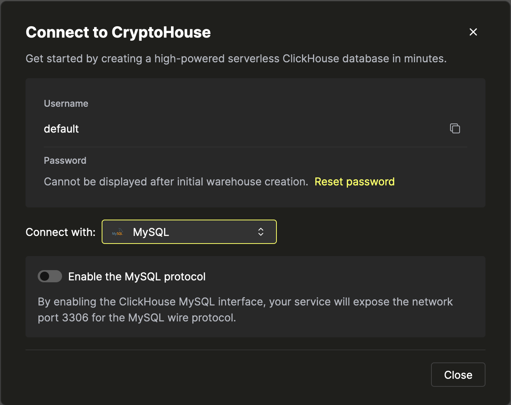
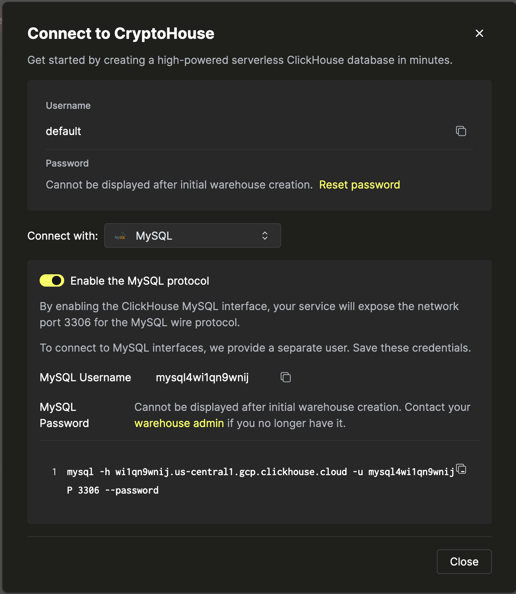
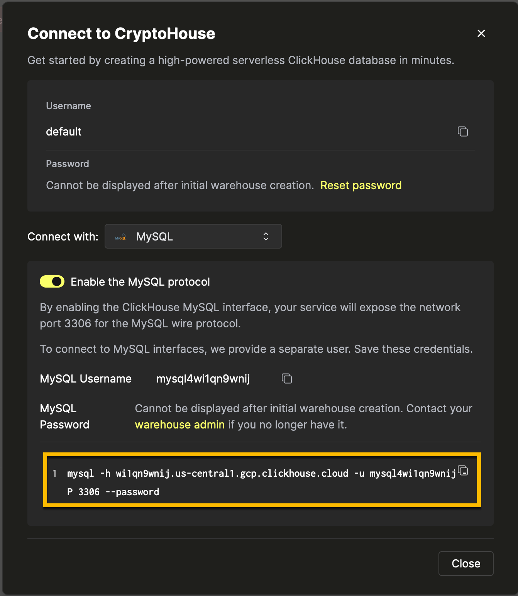
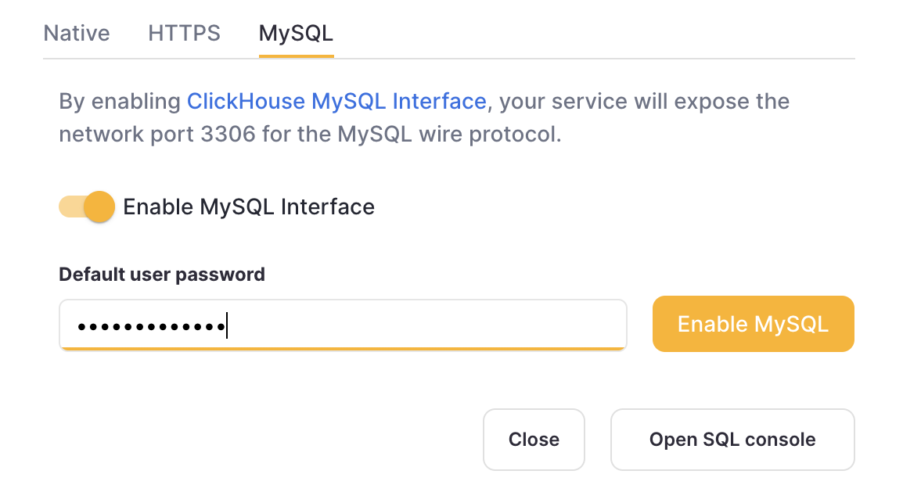

# MySQL Interface

ClickHouse supports the MySQL wire protocol. This allows certain clients that do not have native ClickHouse connectors leverage the MySQL protocol instead, and it has been validated with the following BI tools:

- [Looker Studio](../integrations/data-visualization/looker-studio-and-clickhouse.md)
- [Tableau Online](../integrations/tableau-online)
- [QuickSight](../integrations/quicksight)

If you are trying other untested clients or integrations, keep in mind that there could be the following limitations:

- SSL implementation might not be fully compatible; there could be potential [TLS SNI](https://www.cloudflare.com/learning/ssl/what-is-sni/) issues.
- A particular tool might require dialect features (e.g., MySQL-specific functions or settings) that are not implemented yet.

If there is a native driver available (e.g., [DBeaver](../integrations/dbeaver)), it is always preferred to use it instead of the MySQL interface. Additionally, while most of the MySQL language clients should work fine, MySQL interface is not guaranteed to be a drop-in replacement for a codebase with existing MySQL queries.

If your use case involves a particular tool that does not have a native ClickHouse driver, and you would like to use it via the MySQL interface and you found certain incompatibilities - please [create an issue](https://github.com/ClickHouse/ClickHouse/issues) in the ClickHouse repository.

::::note
To support the SQL dialect of above BI tools better, ClickHouse's MySQL interface implicitly runs SELECT queries with setting [prefer_column_name_to_alias = 1](../operations/settings/settings.md#prefer-column-name-to-alias).
This cannot be turned off and it can lead in rare edge cases to different behavior between queries sent to ClickHouse's normal and MySQL query interfaces.
::::

## Enabling the MySQL Interface On ClickHouse Cloud

1. After creating your ClickHouse Cloud Service, on the credentials screen, select the MySQL tab



2. Toggle the switch to enable the MySQL interface for this specific service. This will expose port `3306` for this service and prompt you with your MySQL connection screen that include your unique MySQL username. The password will be the same as the service's default user password.



Alternatively, in order to enable the MySQL interface for an existing service:

1. Ensure your service is in `Running` state then click on the "View connection string" button for the service you want to enable the MySQL interface for



2. Toggle the switch to enable the MySQL interface for this specific service. This will prompt you to enter the default password.



3. After entering the password, you will get prompted the MySQL connection string for this service


## Creating multiple MySQL users in ClickHouse Cloud

By default, there is a built-in `mysql4<subdomain>` user, which uses the same password as the `default` one. The `<subdomain>` part is the first segment of your ClickHouse Cloud hostname. This format is necessary to work with the tools that implement secure connection, but don't provide [SNI information in their TLS handshake](https://www.cloudflare.com/learning/ssl/what-is-sni), which makes it impossible to do the internal routing without an extra hint in the username (MySQL console client is one of such tools).

Because of this, we _highly recommend_ following the `mysql4<subdomain>_<username>` format when creating a new user intended to be used with the MySQL interface, where `<subdomain>` is a hint to identify your Cloud service, and `<username>` is an arbitrary suffix of your choice.

:::tip
For ClickHouse Cloud hostname like `foobar.us-east1.aws.clickhouse.cloud`, the `<subdomain>` part equals to `foobar`, and a custom MySQL username could look like `mysql4foobar_team1`.
:::

You can create extra users to use with the MySQL interface if, for example, you need to apply extra settings.

1. Optional - create a [settings profile](https://clickhouse.com/docs/en/sql-reference/statements/create/settings-profile) to apply for your custom user. For example, `my_custom_profile` with an extra setting which will be applied by default when we connect with the user we create later:

    ```sql
    CREATE SETTINGS PROFILE my_custom_profile SETTINGS prefer_column_name_to_alias=1;
    ```

    `prefer_column_name_to_alias` is used just as an example, you can use other settings there.
2. [Create a user](https://clickhouse.com/docs/en/sql-reference/statements/create/user) using the following format: `mysql4<subdomain>_<username>` ([see above](#creating-multiple-mysql-users-in-clickhouse-cloud)). The password must be in double SHA1 format. For example:

    ```sql
    CREATE USER mysql4foobar_team1 IDENTIFIED WITH double_sha1_password BY 'YourPassword42$';
    ```

    or if you want to use a custom profile for this user:

    ```sql
    CREATE USER mysql4foobar_team1 IDENTIFIED WITH double_sha1_password BY 'YourPassword42$' SETTINGS PROFILE 'my_custom_profile';
    ```

    where `my_custom_profile` is the name of the profile you created earlier.
3. [Grant](https://clickhouse.com/docs/en/sql-reference/statements/grant) the new user the necessary permissions to interact with the desired tables or databases. For example, if you want to grant access to `system.query_log` only:

    ```sql
    GRANT SELECT ON system.query_log TO mysql4foobar_team1;
    ```

4. Use the created user to connect to your ClickHouse Cloud service with the MySQL interface.

### Troubleshooting multiple MySQL users in ClickHouse Cloud

If you created a new MySQL user, and you see the following error while connecting via MySQL CLI client:

```
ERROR 2013 (HY000): Lost connection to MySQL server at 'reading authorization packet', system error: 54
```

In this case, ensure that the username follows the `mysql4<subdomain>_<username>` format, as described ([above](#creating-multiple-mysql-users-in-clickhouse-cloud)).

## Enabling the MySQL Interface On Self-managed ClickHouse

Add the [mysql_port](../operations/server-configuration-parameters/settings.md#mysql_port) setting to your server's configuration file. For example, you could define the port in a new XML file in your `config.d/` [folder](../operations/configuration-files):

``` xml
<clickhouse>
    <mysql_port>9004</mysql_port>
</clickhouse>
```

Startup your ClickHouse server and look for a log message similar to the following that mentions Listening for MySQL compatibility protocol:

```
{} <Information> Application: Listening for MySQL compatibility protocol: 127.0.0.1:9004
```

## Connect MySQL to ClickHouse

The following command demonstrates how to connect the MySQL client `mysql` to ClickHouse:

```bash
mysql --protocol tcp -h [hostname] -u [username] -P [port_number] [database_name]
```

For example:

``` bash
$ mysql --protocol tcp -h 127.0.0.1 -u default -P 9004 default
```

Output if a connection succeeded:

``` text
Welcome to the MySQL monitor.  Commands end with ; or \g.
Your MySQL connection id is 4
Server version: 20.2.1.1-ClickHouse

Copyright (c) 2000, 2019, Oracle and/or its affiliates. All rights reserved.

Oracle is a registered trademark of Oracle Corporation and/or its
affiliates. Other names may be trademarks of their respective
owners.

Type 'help;' or '\h' for help. Type '\c' to clear the current input statement.

mysql>
```

For compatibility with all MySQL clients, it is recommended to specify user password with [double SHA1](../operations/settings/settings-users.md#password_double_sha1_hex) in configuration file.
If user password is specified using [SHA256](../operations/settings/settings-users.md#password_sha256_hex), some clients won’t be able to authenticate (mysqljs and old versions of command-line tool MySQL and MariaDB).

Restrictions:

- prepared queries are not supported

- some data types are sent as strings

To cancel a long query use `KILL QUERY connection_id` statement (it is replaced with `KILL QUERY WHERE query_id = connection_id` while proceeding). For example:

``` bash
$ mysql --protocol tcp -h mysql_server -P 9004 default -u default --password=123 -e "KILL QUERY 123456;"
```
