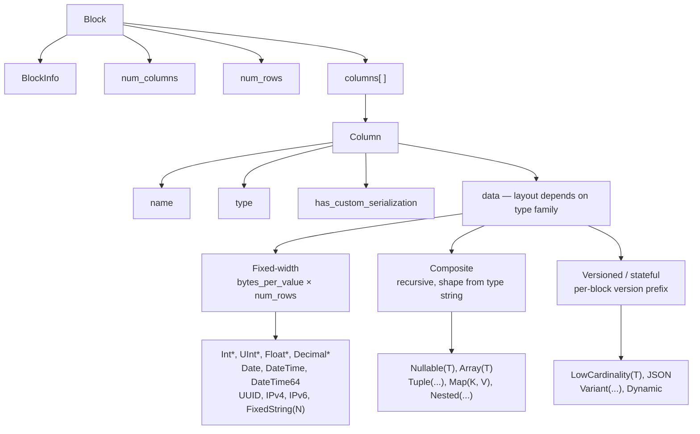
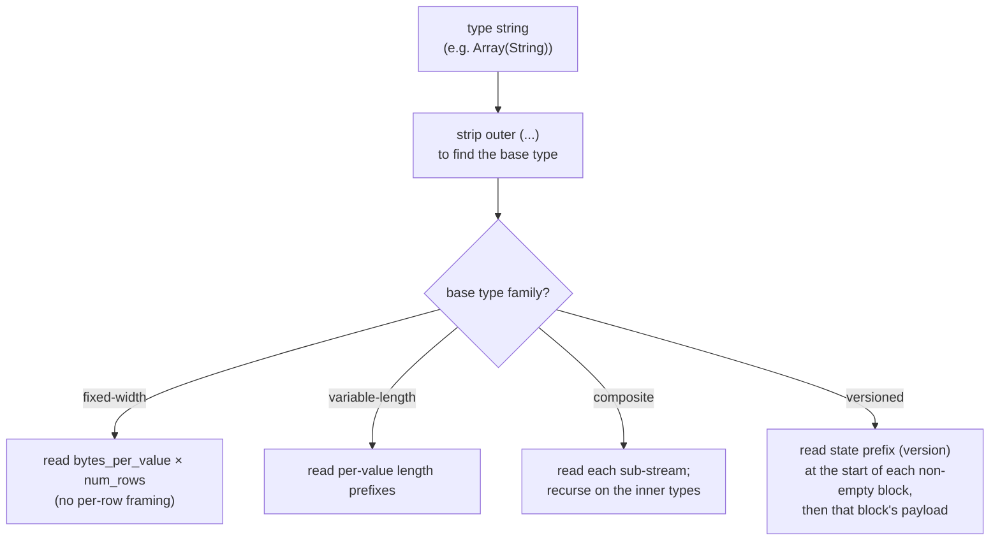
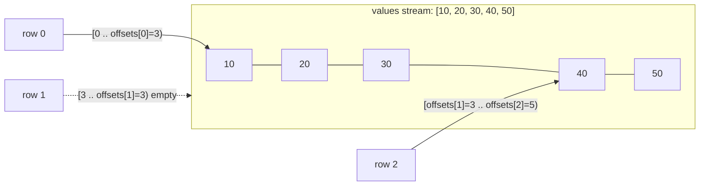
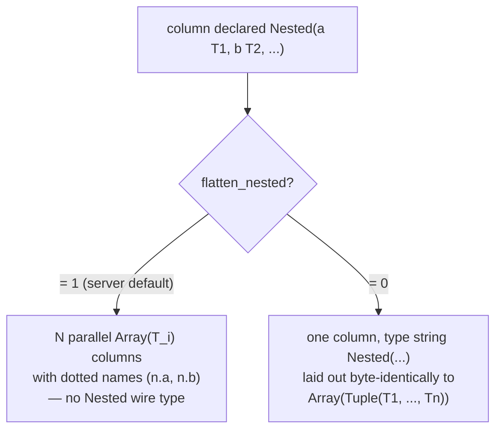
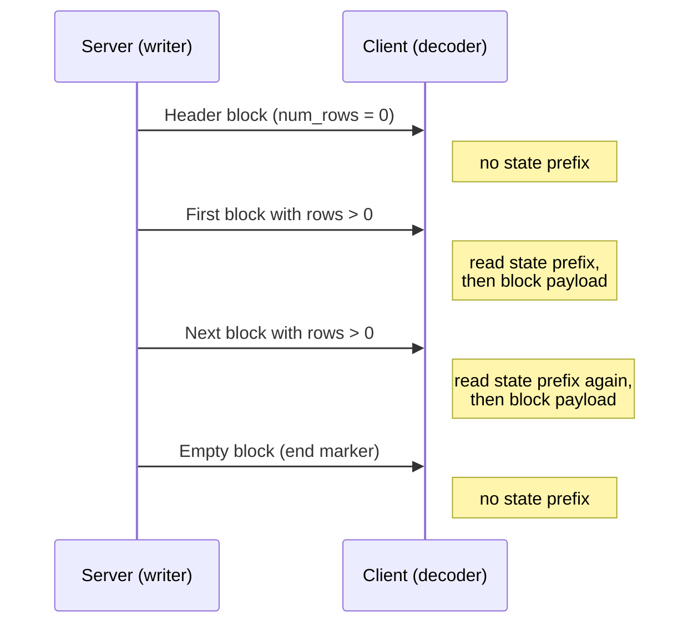
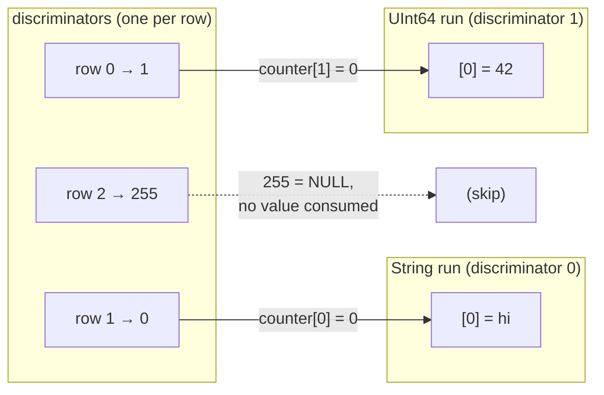
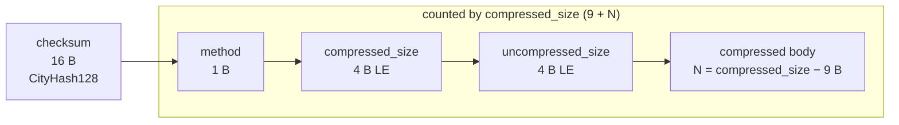

The Native format is the columnar wire format ClickHouse uses to move tabular data. It shows up in several places:

- the body of `Data`, `Totals`, `Extremes`, `Log`, and `ProfileEvents` packets in the [native TCP protocol](/interfaces/specs/NativeProtocol) (the `TableColumns` packet is **not** a Native block — it carries two binary strings, so its layout belongs to the [native protocol spec](/interfaces/specs/NativeProtocol));
- the output of `SELECT ... FORMAT Native` over HTTP;
- file exports written with `INTO OUTFILE ... FORMAT Native`;
- inter-server replication payloads.

This page describes the bytes inside a Block — the columnar payload — and the per-column type encodings that build it. Packet framing, connection state, and version negotiation belong to the [native protocol specification](/interfaces/specs/NativeProtocol).

All multi-byte integer fields are little-endian. Signed integers use two's complement.

:::tip
For a user-facing introduction to the `Native` format (with `curl` examples), see the [Native format page](/interfaces/formats/Native). This specification is the lower-level wire reference.
:::

## Overview {#overview}

Everything that carries rows on the wire is a **Block**: a self-describing chunk of rows stored column by column. All values of column 1 come first, then all of column 2, and so on. A Block carries only the columns the query references, never the full table.

A column's `data` is laid out according to the *family* its type belongs to. The families, in increasing decoder complexity, are:



- **Fixed-width** types lay `data` out as `bytes_per_value × num_rows` raw bytes, with no per-row framing.
- **Composite** types (`Nullable`, `Array`, `Tuple`, `Map`, `Nested`) have a recursive shape fully derivable from the type string, with no version prefix and no cross-block state.
- **Versioned / stateful** types (`LowCardinality`, `JSON`, `Variant`, `Dynamic`) begin each non-empty block with a serialization-version/state prefix. Over the `Native` wire this prefix and any dictionary are **per block** — the format carries no state *across* blocks (the writer creates fresh serialization state for every block and sets `low_cardinality_max_dictionary_size = 0`). Cross-block state is a MergeTree on-disk concern, not the Native wire layout.

## Wire primitives {#wire-primitives}

The Native format builds on four primitive encodings.

| Primitive       | Size     | Description |
|-----------------|----------|-------------|
| VarUInt         | 1–10 B   | LEB-128 variable-length unsigned integer |
| Fixed-width int | 1, 2, 4, 8, 16, 32 B | Little-endian, two's complement for signed |
| String          | variable | VarUInt length prefix + raw bytes |
| Bool            | 1 B      | `0x00` = false, non-zero = true |

### VarUInt {#varuint}

A variable-length unsigned integer using LEB-128 encoding. Each byte carries 7 data bits in positions 0–6 and 1 continuation bit in position 7. The continuation bit is `1` when more bytes follow and `0` on the final byte.

| Value range            | Bytes |
|------------------------|-------|
| 0 – 127                | 1     |
| 128 – 16383            | 2     |
| 16384 – 2097151        | 3     |
| up to full UInt64      | up to 10 |

Encoding the value `300`:

```text
300 = 0b100101100

Byte 0: 0xAC = 0b10101100   (data: 0101100, continuation: 1)
Byte 1: 0x02 = 0b00000010   (data: 0000010, continuation: 0)
```

Decoding the bytes `0xAC 0x02`:

```text
Byte 0: data = 0x2C, continuation = 1 → accumulator = 0x2C, shift = 7
Byte 1: data = 0x02, continuation = 0 → accumulator = (0x02 << 7) | 0x2C = 300
```

### Fixed-width integers {#fixed-width-integers}

| Type   | Bytes | Encoding                                      |
|--------|-------|-----------------------------------------------|
| UInt8  | 1     | Raw byte                                      |
| UInt16 | 2     | Little-endian                                 |
| UInt32 | 4     | Little-endian                                 |
| UInt64 | 8     | Little-endian                                 |
| UInt128| 16    | Little-endian                                 |
| UInt256| 32    | Little-endian                                 |
| Int8   | 1     | Raw byte, two's complement                    |
| Int16  | 2     | Little-endian, two's complement               |
| Int32  | 4     | Little-endian, two's complement               |
| Int64  | 8     | Little-endian, two's complement               |
| Int128 | 16    | Little-endian, two's complement               |
| Int256 | 32    | Little-endian, two's complement               |
| Float32| 4     | IEEE 754 single-precision, little-endian      |
| Float64| 8     | IEEE 754 double-precision, little-endian      |

For example, the UInt32 value `1` encodes as `01 00 00 00`, and the Int32 value `-1` as `FF FF FF FF`.

### String {#string}

A length-prefixed byte sequence:

```text
[VarUInt: byte_length] [byte_length bytes: raw value]
```

The byte sequence need not be valid UTF-8. An empty string encodes as a single `0x00` byte, and strings may contain any byte values, including embedded NUL. The string `"ab"` encodes as `02 61 62`; to decode, read the VarUInt length (`2`), then read that many bytes.

### Bool {#bool}

A single byte. `0x00` is false; any non-zero value is true (canonically `0x01`).

## Block and column structure {#block-and-column-structure}

### Block wire layout {#block-wire-layout}

```text
[BlockInfo]               metadata (only on the TCP Data-packet path; see below)
[VarUInt: num_columns]    number of columns in this block
[VarUInt: num_rows]       number of rows in this block
[Column × num_columns]    column entries, omitted when num_columns = 0
```

Whether the `BlockInfo` prefix is present depends on the channel, because the writer is parameterized by a *revision* (see [Protocol revision and the Native format](#protocol-revision) for the full treatment, including the output-only nature of `client_protocol_version`):

- On the **native TCP protocol**, the server writes blocks at the connection's negotiated revision (a large value — `DBMS_TCP_PROTOCOL_VERSION`, see `src/Core/ProtocolDefines.h`). `BlockInfo` is written whenever that revision is greater than zero, which is always the case for a real connection. The `has_custom_serialization` byte in each column (see [column wire layout](#column-wire-layout)) is written at revision `54454` and above.
- The `Native` *output format* — `SELECT ... FORMAT Native` over HTTP, `INTO OUTFILE ... FORMAT Native`, and the `Native` format produced by `clickhouse-client` — serializes at revision `0` *by default*. At revision `0` the `BlockInfo` prefix and the `has_custom_serialization` byte are both omitted, so a block is just `num_columns`, `num_rows`, and the columns.

  Over HTTP this revision is not fixed: a client may raise it with the `?client_protocol_version=<n>` query parameter, and the server uses that value as the serialization revision for the response.

  With a high enough value the HTTP output includes the `BlockInfo` prefix (written whenever the revision is greater than `0`) and the `has_custom_serialization` byte (written at revision `54454` and above), exactly as on the TCP path. Clients must therefore not assume that every HTTP `FORMAT Native` payload is revision `0`.

In other words, the byte examples in this section that begin with a `BlockInfo` prefix describe the TCP Data-packet payload. The same query taken through `FORMAT Native` produces the shorter form shown alongside them.

### BlockInfo {#blockinfo}

BlockInfo is a sequence of fields, each preceded by a VarUInt field ID, terminated by a field ID of `0`. The wire format is **not** self-describing: a field ID does not encode the length or type of its value, so a reader must already know the type of every field ID it might encounter. ClickHouse's own reader treats an unrecognized field ID as corruption and raises an exception (`UNKNOWN_BLOCK_INFO_FIELD`). Forward compatibility is handled instead by the protocol revision: the sender only writes a field if the negotiated revision is at least that field's minimum revision, so an older receiver never sees a field it does not know.

| Field ID | Field                | Type             | Min revision | Description                                    |
|----------|----------------------|------------------|--------------|------------------------------------------------|
| 1        | is_overflows         | UInt8            | 0            | Overflow block from GROUP BY. `0` for non-overflow blocks. |
| 2        | bucket_number        | Int32            | 0            | Aggregation bucket. `-1` for non-bucketed blocks. |
| 3        | out_of_order_buckets | List of Int32    | 54480        | Buckets delayed during distributed aggregation. Encoded as a VarUInt count followed by that many `Int32` values. |
| 0        | (terminator)         | —                | —            | End of BlockInfo. Always required.             |

Fields `1` and `2` have minimum revision `0`, so they are present whenever a `BlockInfo` is written at all. Field `3` is written only at revision `54480` and above. Wire layout for the common case (revision below `54480`):

```text
[VarUInt: 1] [UInt8: is_overflows]
[VarUInt: 2] [Int32: bucket_number]
[VarUInt: 0]
```

### Column wire layout {#column-wire-layout}

A Column appears `num_columns` times within a Block.

| # | Field                    | Type    | Condition                | Description |
|---|--------------------------|---------|--------------------------|-------------|
| 1 | name                     | String  | always                   | Column name |
| 2 | type                     | String *or* binary type encoding | always | ClickHouse type string (e.g., `"UInt64"`, `"Array(String)"`) by default; a binary type encoding when `output_format_native_encode_types_in_binary_format = 1` (see note below) |
| 3 | has_custom_serialization | UInt8   | feature `CUSTOM_SERIALIZATION` (v54454) | `0` = default, `1` = custom (kind_stack follows) |
| 4 | kind_stack               | bytes   | when field 3 = `1`       | One UInt8 enum byte (see below) describing the non-default serialization (sparse, etc.). For the `COMBINATION` value, followed by a VarUInt count plus that many additional kind bytes. For a `Tuple` (and other composites with element-level serialization info) the payload is recursive — see below. |
| 5 | data                     | bytes   | always                   | Column values for all `num_rows` rows. Layout per type — see [data types](#data-types). For sparse columns, see below. |

A decoder dispatches on the `type` string. Type strings often carry parameters in parentheses; the decoder strips the `(...)` suffix to find the base type and then parses the parameters for size, scale, or inner-type decisions. Parsing a parameter list with nested types (a `Tuple` inside an `Array`, say) needs a depth-aware comma splitter that tracks parenthesis nesting rather than a naive split on `,`.

:::note Binary type encoding
The `type` field is a textual `String` only in the default mode. When the query setting `output_format_native_encode_types_in_binary_format = 1` is set, this field is instead a **binary type encoding** — the same tag-based encoding documented in [data type binary encoding](/sql-reference/data-types/data-types-binary-encoding) — and flattened `Dynamic` type lists use the same binary encoding for their per-type names. A decoder that always reads field 2 as a length-prefixed string would treat the first binary type tag as a string length and desynchronize, so it must know which mode the stream uses.
:::



#### kind_stack and sparse encoding {#kind-stack-and-sparse-encoding}

The `kind_stack` byte enumerates a non-default per-column serialization:

| Byte | Name | Meaning | Wire impact on `data` |
|------|------|---------|------------------------|
| `0x00` | DEFAULT | Default serialization | Identical to `has_custom = 0` |
| `0x01` | SPARSE | Sparse serialization (v54465+) | Offset stream + non-default values; see below |
| `0x02` | DETACHED | Column wrapped in a `ColumnBLOB` by parallel block marshalling (v54478+) | Pre-marshalled blob: `VarUInt size` + that many bytes; see below |
| `0x03` | DETACHED_OVER_SPARSE | A sparse column wrapped in a `ColumnBLOB` | Same blob payload as `DETACHED`; see below |
| `0x04` | REPLICATED | Dictionary form for repeated values (v54482+) | Index stream + dense element values; see below |
| `0x05` | COMBINATION | Multi-kind stack | Followed by VarUInt `count` and `count` further kind bytes — see note below |

**`COMBINATION` payload uses a different enum.** The five rows above are *compact* one-byte codes. `COMBINATION` (`0x05`) is the general escape for any stack not covered by them: it is followed by a `VarUInt` `count` and then `count` one-byte entries. Those entries are **not** the compact codes from the table — they are the raw `ISerialization::Kind` values:

| Byte | Nested `Kind` |
|------|---------------|
| `0x00` | DEFAULT |
| `0x01` | SPARSE |
| `0x02` | DETACHED |
| `0x03` | REPLICATED |

The byte values differ from the compact codes: `REPLICATED` is `0x03` in this nested enum but `0x04` as a compact code, and there is no `DETACHED_OVER_SPARSE` entry — that combination appears as the two consecutive entries `SPARSE`, `DETACHED`. A decoder that keeps using the compact table for the nested bytes will mis-map `0x03`/`0x04` and desynchronize.

The `count` is the full stack length **including the leading `DEFAULT` entry** that begins every stack. The compact codes already cover every one- and two-entry stack, so a `COMBINATION` always has a `count` of at least three.

**Recursive `kind_stack` for `Tuple` columns.** The `kind_stack` payload above is the byte (or `COMBINATION` sequence) for one column's own serialization info. A `Tuple` carries a `SerializationInfoTuple`, which first writes the tuple's *own* kind-stack payload and then writes one full kind-stack payload for *each* element, in order; a decoder reads back the same recursive structure. So for `Tuple(A, B, C)` the field-4 bytes are `[tuple_kind][A_kind][B_kind][C_kind]`, and each element payload is itself recursive if that element is again a composite. The `has_custom_serialization` byte (field 3) is set whenever the tuple's own info *or any element's* info is non-default, so a `Tuple` whose only special element is sparse, replicated, or detached still triggers the kind-stack payload. A decoder that reads only the single leading enum byte for a `Tuple` will stop too early and misread the remaining element-kind bytes as column data.

**Sparse wire format.** When `kind_stack = 0x01`, the column `data` is two streams written back-to-back in the single shared TCP stream:

1. **Offset stream** — a sequence of `VarUInt`s. Each value `v` is either:
   - `v` with the high bit at position 62 clear: `(v & 0x3FFFFFFFFFFFFFFF)` = the number of default positions before the next explicit non-default value. That non-default position is `cursor + group_size`, where `cursor` is the running position; afterwards `cursor` advances by `group_size + 1`.
   - `v` with bit 62 set (`END_OF_GRANULE_FLAG`): the value with the flag cleared = the number of trailing default positions after the last non-default. This marks the end of the offset stream for the block.
2. **Values stream** — `count` non-default values densely encoded in the inner type, where `count` is the number of non-EOG VarUInts read above.

A decoder reconstructs a dense column of `num_rows` entries by filling every non-explicit position with the inner type's default value (`0` for integers and floats, `""` for `String`, `0` days for `Date`, and so on).

A sparse `Nullable(T)` column is a special case, because the default value of `Nullable(T)` is **NULL**. The sparse encoding drops the usual `Nullable` null-map stream entirely: the offset stream identifies the non-default — that is, non-NULL — positions, the values stream holds only those non-NULL values densely in `T`, and every non-explicit position reconstructs as NULL. A decoder must therefore *not* look for a null map in the values stream, and must *not* fill the gaps with a present `0`; it fills them with NULL.

**Replicated wire format.** When `kind_stack = 0x04`, the column `data` is a dictionary: a list of distinct element values plus a per-row index into that list (the same lookup shape as `LowCardinality`). When the inner type is itself versioned — for example `LowCardinality(T)` — its state prefix is written **first**, ahead of the index stream: the replicated serialization delegates the prefix phase to the inner type before writing `num_rows`. Inners with an empty prefix (the leaf types and the plain composites) contribute no bytes here.

```text
[inner type's state prefix]              empty for leaf inners; e.g. LowCardinality version (Int64 = 1)
[VarUInt num_rows]
[UInt8  size_of_indexes_type]            width of each index: 1, 2, 4, or 8 bytes
[indexes: num_rows × size_of_indexes_type bytes]
[VarUInt num_elements]
[elements: num_elements dense inner-type values]
```

A decoder reconstructs a dense column by selecting `elements[indexes[i]]` for each output row `i`. Composite inner types recurse: the element list is materialized in the inner type, then indexed. Supported inner types include the leaf types, `Nullable(T)`, `Array(T)`, `Tuple(...)`, `Map(K, V)`, `Nested(...)` (each field expanded like an `Array`), and `LowCardinality(T)` (the shared dictionary is kept; only the per-element keys are indexed).

**Detached wire format.** `DETACHED` (`0x02`) and `DETACHED_OVER_SPARSE` (`0x03`) *do* appear over the wire — they are not purely internal. On the TCP path, when compression is enabled and the negotiated revision is at least `DBMS_MIN_REVISON_WITH_PARALLEL_BLOCK_MARSHALLING` (v54478), the column goes through three steps:

1. Each eligible column (non-`const`, non-`Tuple`, in a block with more than one row) is wrapped in a `ColumnBLOB` that holds the column already marshalled and compressed off the main thread.
2. `DETACHED` is appended to the wrapped column's kind stack.
3. The column `data` is written as a `VarUInt` blob size followed by exactly that many blob bytes.

If the wrapped column was sparse, its stack is `{DEFAULT, SPARSE, DETACHED}`, which serializes as `DETACHED_OVER_SPARSE`. A client decoding such a column reads the blob length and bytes, then decompresses the blob to recover the inner column payload (see the [`ColumnBLOB` note](#compression-negotiation) under compression).

### Block variants {#block-variants}

All Data-family packets share the same Block wire format. The variants differ only in their column and row counts:

| Variant       | num_columns | num_rows | Purpose |
|---------------|-------------|----------|---------|
| Header block  | N > 0       | 0        | Announces the result schema (column names + types). |
| Result block  | N > 0       | M > 0    | Actual result rows. |
| Empty block   | 0           | 0        | Sentinel — end-of-input on the client side; boundary marker on the server side. |

### Byte-level examples {#byte-level-examples}

All examples in this section are taken from the **TCP Data-packet path**, so they include the `BlockInfo` prefix and the `has_custom_serialization` byte. Over `FORMAT Native` the same blocks are shorter — the equivalent short form is given where it helps.

An empty block (with BlockInfo), 8 bytes total:

```text
01 00                   BlockInfo: field_id=1, is_overflows=0
02 FF FF FF FF          BlockInfo: field_id=2, bucket_number=-1
00                      BlockInfo terminator
00                      num_columns = 0
00                      num_rows = 0
```

A header block for `SELECT 1` announces one column named `"1"` of type `UInt8`, with zero rows. At protocol ≥ 54454 the `has_custom_serialization` byte is included:

```text
01 00                   BlockInfo: is_overflows = 0
02 FF FF FF FF          BlockInfo: bucket_number = -1
00                      BlockInfo terminator
01                      num_columns = 1
00                      num_rows = 0
01 "1"                  Column[0].name = "1"
05 "UInt8"              Column[0].type = "UInt8"
00                      Column[0].has_custom_serialization = 0
                        Column[0].data: no bytes (num_rows = 0)
```

The result block for the same query, with one row:

```text
01 00                   BlockInfo: is_overflows = 0
02 FF FF FF FF          BlockInfo: bucket_number = -1
00                      BlockInfo terminator
01                      num_columns = 1
01                      num_rows = 1
01 "1"                  Column[0].name = "1"
05 "UInt8"              Column[0].type = "UInt8"
00                      Column[0].has_custom_serialization = 0
01                      Column[0].data: one UInt8 byte = 1
```

Through `FORMAT Native` (revision `0`), the same result block has no `BlockInfo` and no `has_custom_serialization` byte — `SELECT 1 FORMAT Native` is 11 bytes:

```text
01                      num_columns = 1
01                      num_rows = 1
01 "1"                  Column[0].name = "1"
05 "UInt8"              Column[0].type = "UInt8"
01                      Column[0].data: one UInt8 byte = 1
```

(A zero-row result, such as a header-only block, produces no bytes at all over `FORMAT Native`: the output format does not emit empty blocks.)

## Protocol revision and the Native format {#protocol-revision}

A Native byte stream is shaped above all by the **protocol revision** its writer and reader run at. The revision is nowhere in the bytes themselves — there is no revision field on the wire — but it still decides whether several features show up at all. Because of that, a decoder has to know which revision a payload was written at before it can parse it. Since the revision is not in the stream, the reader and writer must settle on it some other way.

It is a single `UInt64`, and both `NativeWriter` and `NativeReader` take it as a constructor argument. The writer calls it `client_revision` and the reader calls it `server_revision`, but it is the same number. The newest revision this release knows about is `DBMS_TCP_PROTOCOL_VERSION` (see `src/Core/ProtocolDefines.h`).

### What the revision gates {#what-the-revision-gates}

Each feature sits behind a `DBMS_MIN_REVISION_WITH_*` threshold. The writer emits the feature only once its revision reaches the threshold, and the reader looks for it under exactly the same rule, so the two stay in step — get the revision wrong on either side and they desynchronize. The gates that matter for the Native format are:

| Feature | Threshold constant | Revision | Effect when below threshold |
|---|---|---|---|
| `BlockInfo` prefix | (any value `> 0`) | `1` | The [`BlockInfo`](#blockinfo) prefix is omitted entirely; a block is just `num_columns`, `num_rows`, columns. |
| `has_custom_serialization` byte | `DBMS_MIN_REVISION_WITH_CUSTOM_SERIALIZATION` | `54454` | The per-column [`has_custom_serialization`](#column-wire-layout) byte is omitted; every column uses default serialization (no sparse, replicated, or detached forms). |
| `LowCardinality` on the wire | `DBMS_MIN_REVISION_WITH_LOW_CARDINALITY_TYPE` | `54405` | Special case — does **not** follow the simple below-threshold rule. `LowCardinality(T)` is stripped to base type `T` only when the revision is *non-zero* and below `54405`, or when stripping is forced separately. Revision `0` keeps it. See the note below. |
| V2 `Dynamic` / `JSON` serialization | `DBMS_MIN_REVISION_WITH_V2_DYNAMIC_AND_JSON_SERIALIZATION` | `54473` | `Dynamic` and `JSON`/`Object` use V1 serialization (with the `max_dynamic_*` parameter) instead of V2. |
| Aggregate-function versioning | `DBMS_MIN_REVISION_WITH_AGGREGATE_FUNCTIONS_VERSIONING` | `54452` | `AggregateFunction` state is written without an embedded version. |
| `out_of_order_buckets` in `BlockInfo` | `DBMS_MIN_REVISION_WITH_OUT_OF_ORDER_BUCKETS_IN_AGGREGATION` | `54480` | `BlockInfo` field ID `3` is not written (see [BlockInfo](#blockinfo)). |
| Parallel block marshalling (`DETACHED`) | `DBMS_MIN_REVISON_WITH_PARALLEL_BLOCK_MARSHALLING` | `54478` | Columns are never wrapped in a `ColumnBLOB`; no `DETACHED` / `DETACHED_OVER_SPARSE` kinds appear (see [kind_stack](#kind-stack-and-sparse-encoding)). |
| `DateTime(tz)` type parameter | `DBMS_MIN_REVISION_WITH_TIME_ZONE_PARAMETER_IN_DATETIME_DATA_TYPE` | `54337` | The timezone parameter is dropped from the `type` string — `DateTime('UTC')` is announced as bare `DateTime`. |

That makes revision `0` the most conservative encoding for almost everything: the stream carries no `BlockInfo`, no `has_custom_serialization` byte, V1 `Dynamic`/`JSON`, no aggregate-function version, and a bare `DateTime` with the timezone parameter dropped.

`LowCardinality` is the one exception, and an important one. The writer's check is `remove_low_cardinality || (client_revision && client_revision < DBMS_MIN_REVISION_WITH_LOW_CARDINALITY_TYPE)`. The trick is the leading `client_revision &&`: when the revision is exactly `0`, the whole condition short-circuits to false.

So at revision `0` — the default for `FORMAT Native` — `LowCardinality(T)` is **not** stripped. Its type string and per-block state prefix stay in the stream, and the revision-`0` reader reads them straight back. Stripping only kicks in at a non-zero revision below `54405`, or when it is forced regardless of revision.

That forcing is the `remove_low_cardinality` flag. The `FORMAT Native` output never sets it, but the native TCP path does, when `low_cardinality_allow_in_native_format = 0` (default `1`). In other words, that setting changes native TCP output but does nothing for `FORMAT Native`.

The practical takeaway: a default `FORMAT Native` stream may legitimately contain `LowCardinality`, so do not treat it as a feature that is absent at revision `0`.

### Where the revision comes from, depending on how the data travels {#revision-per-channel}

The same Native bytes can move over different paths: the native TCP protocol, an HTTP request, or a file on disk. Each path sets the revision its own way. One thing to watch: the read side and the write side are set up separately, so they can end up at different revisions.

#### Native TCP protocol — negotiated, both directions {#revision-tcp}

On the [native TCP protocol](/interfaces/specs/NativeProtocol) the revision comes out of the Hello handshake. The client sends `DBMS_TCP_PROTOCOL_VERSION`, the server sends its own back, and from then on each side serializes at the **revision the other side advertised**: the server builds its `NativeReader`/`NativeWriter` from `client_tcp_protocol_version`, while the client uses the `server_revision` it received. There is no explicit `min`, but neither side can emit a feature it has not implemented, so each direction is effectively capped by the older of the two peers.

When both peers are the same modern build, the two directions land on the same revision (`DBMS_TCP_PROTOCOL_VERSION`, see `src/Core/ProtocolDefines.h`) and every gate is on. That is the common case, but it is not guaranteed. With mixed-version or third-party peers the two directions can sit at different revisions, so the gates have to be read per direction: `BlockInfo` is present for any non-zero revision, but the rest — `has_custom_serialization` included — only show up once that direction's effective revision reaches their thresholds. A peer advertising a revision below `54454`, for example, neither sends nor receives the `has_custom_serialization` byte.

#### `FORMAT Native` output — revision 0 by default, raisable over HTTP {#revision-output}

The `Native` *output* format defaults to revision **`0`**. This covers `SELECT ... FORMAT Native` over HTTP, `INTO OUTFILE ... FORMAT Native`, and the `Native` output `clickhouse-client` writes; in each case the output factory hands `FormatSettings::client_protocol_version` straight to the `NativeWriter`.

Over HTTP that default is not the end of the story. A client can raise it with the `?client_protocol_version=<n>` query parameter, which the HTTP handler treats as a reserved parameter rather than a SQL setting: it lands on the query context, and the format layer copies it into `FormatSettings`. Set it high enough and the HTTP `FORMAT Native` output starts including the `BlockInfo` prefix and the `has_custom_serialization` byte, just like the TCP path — so do not assume an HTTP `FORMAT Native` payload is always revision `0`. File exports and local `clickhouse-client` output have no such knob and stay at `0`.

#### `FORMAT Native` input — always revision 0 {#revision-input}

The `Native` *input* format goes the other way: it is **hardcoded to revision `0`** and pays no attention to `client_protocol_version` at all. Whether it is parsing the body of an `INSERT ... FORMAT Native` or reading a `Native` file, it builds its `NativeReader` with a literal `0`, so it never expects a `BlockInfo` prefix, never reads the `has_custom_serialization` byte, and always assumes default serialization.

So `client_protocol_version` is output-only. Putting a high `?client_protocol_version=` (for example `DBMS_TCP_PROTOCOL_VERSION`) on an `INSERT ... FORMAT Native` request does nothing to how the body is read — the body still has to be revision `0`. Feed in a body that does carry a `BlockInfo` prefix or a `has_custom_serialization` byte and the reader loses sync, which comes back as a parse error (`INCORRECT_DATA` or `CANNOT_READ_ALL_DATA`) rather than a successful insert.

### Round-trip implications {#revision-round-trip}

For `FORMAT Native` the safe choice is revision `0` at both ends, which is what you get by default. Data written by `SELECT ... FORMAT Native` at revision `0` reads straight back into `INSERT ... FORMAT Native` with no surprises.

The trouble only starts if you raise the output revision on purpose. A `SELECT ... FORMAT Native` taken with `?client_protocol_version=<large>` produces a stream that carries `BlockInfo` and `has_custom_serialization` bytes, and the revision-`0` input path cannot read those back. If you need such data to round-trip, either leave `client_protocol_version` off the producing `SELECT`, or move the data over the native TCP protocol — where each direction uses the handshake-negotiated revision — instead of `FORMAT Native`.

| Channel | Write revision | Read revision | `BlockInfo` / custom serialization |
|---|---|---|---|
| Native TCP Data packet | Peer's advertised revision (per direction) | Peer's advertised revision (per direction) | `BlockInfo` whenever revision `> 0`; `has_custom_serialization` at `≥ 54454` |
| `SELECT ... FORMAT Native` over HTTP | `client_protocol_version` (default `0`) | n/a | Only if `client_protocol_version` raised |
| `INSERT ... FORMAT Native` over HTTP | n/a | `0` (fixed, ignores `client_protocol_version`) | Never read |
| `INTO OUTFILE` / file / `clickhouse-client` `FORMAT Native` | `0` | `0` | Absent (but `LowCardinality` is kept — see note above) |

:::note Protocol revision vs serialization version
Do not confuse the protocol revision with the [serialization version](#serialization-version-concept). The revision here is connection- or request-wide and never appears in the bytes. The serialization version is per column, carried by [versioned types](#versioned-types), and is written into every non-empty block. The revision decides whether a feature is there at all; the serialization version, once you are inside a versioned column, picks which variant of that one type's encoding follows.
:::

## Data types {#data-types}

This section documents the wire encoding of the types the Native format can carry within a column's `data`, grouped into four families of increasing decoder complexity. Two types — `AggregateFunction(func, ...)` and `QBit(T, N[, stride])` — are valid `Native` column types but have function- or type-specific payloads that are out of scope here; they are called out below where they would otherwise be mistaken for aliases.

| Family                           | Section | Streams per column | Cross-block state |
|----------------------------------|---------|--------------------|-------------------|
| Fixed-width                      | [Fixed-width types](#fixed-width-types) | One       | None |
| Variable-length                  | [Variable-length types](#variable-length-types) | One | None |
| Composite (fixed shape)          | [Composite types](#composite-types) | Multiple  | None |
| Versioned / stateful             | [Versioned types](#versioned-types) | Multiple  | None on the Native wire — per-block state prefix, fresh per block |

### Fixed-width types {#fixed-width-types}

Each value occupies a constant number of bytes. A column of `M` rows occupies exactly `bytes_per_row × M` bytes on the wire, concatenated with no separators or padding.

| Type string         | Bytes per value | Logical value                                     | Wire encoding |
|---------------------|-----------------|---------------------------------------------------|---------------|
| `UInt8`             | 1               | Unsigned 8-bit integer                            | Raw byte      |
| `UInt16`            | 2               | Unsigned 16-bit integer                           | Little-endian |
| `UInt32`            | 4               | Unsigned 32-bit integer                           | Little-endian |
| `UInt64`            | 8               | Unsigned 64-bit integer                           | Little-endian |
| `UInt128`           | 16              | Unsigned 128-bit integer                          | Little-endian |
| `UInt256`           | 32              | Unsigned 256-bit integer                          | Little-endian |
| `Int8`              | 1               | Signed 8-bit, two's complement                    | Raw byte      |
| `Int16`             | 2               | Signed 16-bit, two's complement                   | Little-endian |
| `Int32`             | 4               | Signed 32-bit, two's complement                   | Little-endian |
| `Int64`             | 8               | Signed 64-bit, two's complement                   | Little-endian |
| `Int128`            | 16              | Signed 128-bit, two's complement                  | Little-endian |
| `Int256`            | 32              | Signed 256-bit, two's complement                  | Little-endian |
| `Float32`           | 4               | IEEE 754 single-precision                         | Little-endian |
| `Float64`           | 8               | IEEE 754 double-precision                         | Little-endian |
| `BFloat16`          | 2               | High 16 bits of an IEEE 754 `Float32`             | Little-endian |
| `Bool`              | 1               | `0x00` = false, `0x01` = true                     | Raw byte      |
| `Date`              | 2               | Days since `1970-01-01`                           | Little-endian UInt16 |
| `Date32`            | 4               | Days since `1970-01-01` (signed; pre-1970 ok)     | Little-endian Int32 |
| `DateTime`          | 4               | Unix timestamp in seconds                         | Little-endian UInt32 |
| `DateTime(tz)`      | 4               | Same as `DateTime`; timezone is metadata          | Little-endian UInt32 |
| `DateTime64(s)`     | 8               | Ticks at scale `s` (10^-s seconds since epoch)    | Little-endian Int64 |
| `DateTime64(s, tz)` | 8               | Same as `DateTime64(s)`; timezone is metadata     | Little-endian Int64 |
| `Time`              | 4               | Signed clock duration in seconds                  | Little-endian Int32 |
| `Time64(s)`         | 8               | Signed clock duration in ticks at scale `s`       | Little-endian Int64 |
| `Interval<Unit>`    | 8               | Signed count; the unit lives in the type string   | Little-endian Int64 |
| `UUID`              | 16              | 128-bit identifier                                | Two byte-swapped LE UInt64 halves (see [UUID](#uuid)) |
| `IPv4`              | 4               | IPv4 address                                      | Little-endian UInt32 |
| `IPv6`              | 16              | IPv6 address                                      | Network byte order, no swap |
| `Enum8`             | 1               | Signed 8-bit (variant index)                      | Raw byte      |
| `Enum16`            | 2               | Signed 16-bit (variant index)                     | Little-endian |
| `Decimal(P, S)`     | 4 / 8 / 16 / 32 | `value × 10^S` as a signed integer; width depends on P (≤9 → 4 B, ≤18 → 8 B, ≤38 → 16 B, ≤76 → 32 B) | Little-endian signed integer |

#### Integer types {#integer-types}

`UInt8`–`UInt256` and `Int8`–`Int256` are direct binary encodings of integer values. A decoder reads `bytes_per_row × num_rows` bytes and interprets them according to the type.

A `UInt32` column holding `[1, 256, 65536]`:

```text
01 00 00 00              row 0: 1
00 01 00 00              row 1: 256
00 00 01 00              row 2: 65536
```

An `Int32` column holding `[-1, 42]`:

```text
FF FF FF FF              row 0: -1
2A 00 00 00              row 1: 42
```

#### Float32 and Float64 {#float32-and-float64}

Standard IEEE 754 binary floats: 4 bytes single-precision (`binary32`) and 8 bytes double-precision (`binary64`), each little-endian. NaN, ±Infinity, ±0.0, and subnormals all round-trip without normalization.

`Float32` value `1.5` (`0x3FC00000`):

```text
00 00 C0 3F              little-endian IEEE 754
```

`Float64` value `1.5` (`0x3FF8000000000000`):

```text
00 00 00 00 00 00 F8 3F  little-endian IEEE 754
```

#### BFloat16 {#bfloat16}

The brain-floating-point format: the high 16 bits of an IEEE 754 `Float32` — 1 sign bit, 8 exponent bits, 7 mantissa bits. Each value is 2 bytes, little-endian, holding the raw 16-bit pattern. To recover the numeric value, widen it back to `Float32` by placing the pattern in the high half and zeroing the low half (`bits << 16` reinterpreted as `Float32`); the widened value then shares `Float32`'s text formatting.

`BFloat16` value `1.5` (pattern `0x3FC0`, the top half of `Float32` `0x3FC00000`):

```text
C0 3F                    little-endian, widens to Float32 1.5
```

#### Bool {#bool-type}

Wire-compatible with `UInt8`: 1 byte per row, `0x00` = false, `0x01` = true. The type string on the wire is literally `Bool` (not `UInt8`), so a decoder dispatching on the type string must recognize it separately.

A `Bool` column `[true, false, true]`:

```text
01 00 01
```

#### Date and Date32 {#date-and-date32}

Both encode dates as integer day counts relative to the Unix epoch `1970-01-01`. Neither carries a time component.

| Type     | Bytes | Encoding              | Range                           |
|----------|-------|-----------------------|---------------------------------|
| `Date`   | 2     | Little-endian UInt16  | `1970-01-01` to `2149-06-06`    |
| `Date32` | 4     | Little-endian Int32   | wide signed range, pre-1970 ok  |

`Date` value `1970-01-02` (1 day):

```text
01 00                    UInt16 LE = 1
```

`Date32` value `1900-01-01` (-25567 days):

```text
21 9C FF FF              Int32 LE = -25567
```

#### DateTime {#datetime}

Wire-compatible with `UInt32`: a Unix timestamp in seconds, 4 bytes little-endian. The type may appear as `DateTime` or `DateTime('Timezone')`; the timezone affects display only and is not part of the wire value. Two `DateTime` columns with different timezone parameters produce identical bytes for the same instant. A decoder strips the `(...)` parameter suffix and processes the column as `UInt32`.

`DateTime('UTC')` value `2024-03-15 14:30:00 UTC` (timestamp `1710513000`):

```text
68 5B F4 65              UInt32 LE = 1710513000
```

#### DateTime64(scale[, timezone]) {#datetime64}

8 bytes, little-endian Int64 representing ticks at scale `10^-scale` seconds since the Unix epoch. The `scale` parameter (0–9) lives in the type string and sets the time unit:

| Scale | Tick size       | Common name |
|-------|-----------------|-------------|
| 0     | 1 second        | seconds     |
| 3     | 1 millisecond   | ms          |
| 6     | 1 microsecond   | µs          |
| 9     | 1 nanosecond    | ns          |

The type appears as `DateTime64(s)` (implicit server-default timezone) or `DateTime64(s, 'TimezoneName')` (explicit timezone, display only). Negative values represent ticks before the epoch.

`DateTime64(3, 'UTC')` value `2024-01-15 12:30:45.123 UTC` (1705321845123 ms):

```text
83 51 1A 0D 8D 01 00 00  Int64 LE = 1705321845123
```

`DateTime64(0)` value `2024-01-15 12:30:45 UTC` (1705321845 s):

```text
75 25 A5 65 00 00 00 00  Int64 LE = 1705321845
```

#### Time and Time64(scale) {#time-and-time64}

A clock duration rather than a point in time. `Time` is a signed second count, 4 bytes little-endian Int32; `Time64(scale)` is a signed tick count at the given decimal scale (0–9), 8 bytes little-endian Int64 — the same wire shape as `DateTime64`.

The textual form is `[-]HH:MM:SS[.fraction]`, but unlike `DateTime` the hour field is **not** wrapped to a 24-hour day: it is the total hour count and may exceed 23. The displayed magnitude is capped at `999:59:59` (`3599999` seconds); a larger magnitude renders at the cap with a zeroed fraction (`999:59:59.000`). `CAST` clamps the stored value to this range as well, though arithmetic can produce out-of-range values that are clamped only on display. None of this affects the wire bytes, which are the plain signed integer.

`Time` value `45296` (`12:34:56`):

```text
F0 B0 00 00              Int32 LE = 45296
```

`Time64(3)` value `45296789` ticks (`12:34:56.789`):

```text
95 2C B3 02 00 00 00 00  Int64 LE = 45296789
```

:::note
`Time` and `Time64` are experimental and require `allow_experimental_time_time64_type = 1` on the server.
:::

#### Interval {#interval}

`Interval<Unit>` — `IntervalSecond`, `IntervalMinute`, `IntervalHour`, `IntervalDay`, `IntervalWeek`, `IntervalMonth`, `IntervalQuarter`, `IntervalYear`, `IntervalNanosecond`, and so on. Every unit shares one wire encoding: the count as a signed 8-byte little-endian Int64. The unit lives **only** in the type string — it changes neither the wire bytes nor the textual form, which is the bare integer. A single decoder path handles every unit.

`IntervalDay` value `5`:

```text
05 00 00 00 00 00 00 00  Int64 LE = 5
```

#### UUID {#uuid}

16 bytes per value. The wire encoding is **not** the canonical 16 big-endian bytes — each 8-byte half is byte-reversed independently.

The logical model is a 128-bit identifier in canonical text form `xxxxxxxx-xxxx-xxxx-xxxx-xxxxxxxxxxxx`, where the bytes are conventionally written big-endian. The wire model takes those 16 canonical bytes, splits them into two 8-byte halves, and writes each half little-endian:

- Wire bytes 0..7 = canonical bytes 0..7 reversed.
- Wire bytes 8..15 = canonical bytes 8..15 reversed.

UUID `550e8400-e29b-41d4-a716-446655440000`:

```text
Canonical bytes (16):    55 0E 84 00 E2 9B 41 D4  A7 16 44 66 55 44 00 00

Wire bytes:
D4 41 9B E2 00 84 0E 55  high half byte-reversed
00 00 44 55 66 44 16 A7  low half byte-reversed
```

The nil UUID (all zeros) appears identically in both representations.

#### IPv4 and IPv6 {#ipv4-and-ipv6}

Two related but differently-encoded address types.

`IPv4` is 4 bytes, encoded as a little-endian UInt32 holding the canonical 32-bit address (the value `(a << 24) | (b << 16) | (c << 8) | d` from `a.b.c.d`). The wire bytes are the network-order bytes reversed.

`192.168.1.10` (canonical 32-bit value `0xC0A8010A`):

```text
0A 01 A8 C0              Little-endian UInt32
```

`IPv6` is 16 bytes, written **verbatim in network byte order** with no swap — the same byte order as `inet_pton(AF_INET6, ...)`.

`2001:db8::1`:

```text
20 01 0D B8 00 00 00 00  network bytes 0..7
00 00 00 00 00 00 00 01  network bytes 8..15
```

The asymmetry is deliberate: IPv4 is stored as a `u32` for arithmetic and compact range queries, while IPv6 keeps the network-order layout common to most networking APIs.

#### Enum8 and Enum16 {#enum8-and-enum16}

Wire-compatible with `Int8` and `Int16` respectively: 1 or 2 bytes per row, two's complement little-endian for the 16-bit variant. The full variant mapping lives in the type string:

```text
Enum8('active' = 1, 'inactive' = 2, 'banned' = -1)
Enum16('a' = 1, 'b' = 30000)
```

A decoder may strip the `(...)` parameter suffix and dispatch as `Int8` / `Int16` — the wire bytes are just the integer index. A client that surfaces the label parses the `'name' = value` map out of the type string and keeps it alongside the column: the integer alone does not recover the label. Text-oriented output renders the label (`active`) rather than the index, single-quoted (`'active'`) when the enum is nested inside a composite. Because the map is not recoverable from the integer column, it must be retained for nested enums such as `Array(Enum8(...))` or `Map(Enum16(...), V)`.

An `Enum8('active' = 1, 'inactive' = 2)` column `[active, inactive, active]`:

```text
01 02 01
```

An `Enum16(...)` value `30000`:

```text
30 75                    Int16 LE = 30000
```

#### Decimal(P, S) {#decimal}

A signed integer scaled by a power of 10. The integer's byte width is implied by the **precision** `P`; the **scale** `S` is the negative exponent (the number of digits after the decimal point). Both live in the type string.

| Precision (P)   | Backing integer | Bytes |
|-----------------|-----------------|-------|
| 1 ≤ P ≤ 9       | Int32           | 4     |
| 10 ≤ P ≤ 18     | Int64           | 8     |
| 19 ≤ P ≤ 38     | Int128          | 16    |
| 39 ≤ P ≤ 76     | Int256          | 32    |

The wire encoding is the backing integer in little-endian two's complement, and the logical decimal value is `wire_integer × 10^(-S)`.

ClickHouse always emits `Decimal(P, S)` regardless of how the type was declared. `Decimal32(S)`, `Decimal64(S)`, and so on all normalize to `Decimal(P, S)` on the wire (with `P` set to the natural maximum for the width: 9, 18, 38, 76). A decoder that recognizes only `Decimal(P, S)` covers every spelling the server emits.

`Decimal(9, 4)` value `123.4567` → backing integer `1234567`:

```text
87 D6 12 00              Int32 LE = 1234567
```

`Decimal(18, 1)` value `-1.5` → backing integer `-15`:

```text
F1 FF FF FF FF FF FF FF  Int64 LE = -15
```

`Decimal(38, 4)` value `123.4567` (16 bytes total):

```text
87 D6 12 00 00 00 00 00 00 00 00 00 00 00 00 00
```

#### Nothing {#nothing}

The `Nothing` type carries no values. In practice it appears only as the inner type of `Nullable(Nothing)` — what the server returns for an expression like `SELECT NULL` whose only valid value is the absence of one. It is conceptually a unit type.

On the wire it occupies exactly **one placeholder byte per row**. The server emits the ASCII character `'0'` (`0x30`), but the deserializer ignores the bytes — the content is undefined and decoders must not rely on any specific value. The number of bytes written is `num_rows × 1`, so the column header's `num_rows` fully determines how much to consume.

The byte-per-row keeps the Block invariant intact: every column spans a length derivable from `num_rows`, so decoders scan forward without per-cell length prefixes. The surrounding `Nullable` always reports every position as NULL, so the placeholders are never inspected.

A `Nullable(Nothing)` column with 3 rows (all NULL):

```text
01 01 01                 null map: 1, 1, 1 (three NULLs)
30 30 30                 Nothing placeholder bytes (one per row)
```

The null-map prefix is the standard `Nullable` framing (see [Nullable](#nullable)); the inner three bytes are the `Nothing` payload, which the decoder skips.

### Variable-length types {#variable-length-types}

Each value carries its own length on the wire.

#### String {#string-type}

Type string: `String`. A `String` column is a sequence of `num_rows` length-prefixed byte sequences:

```text
[VarUInt: byte_length] [byte_length bytes: raw value]
[VarUInt: byte_length] [byte_length bytes: raw value]
...
```

There are no separators between rows beyond the length prefixes, and no row-level state. An empty string is a single `0x00` byte. ClickHouse `String` is byte-oriented rather than text-oriented: UTF-8 validity is not enforced, and a value may contain any bytes including embedded NUL. A decoder that targets a UTF-8 string type either validates on read or exposes raw bytes to the caller. The total bytes consumed by the column is `Σ (varuint_size(len_i) + len_i)` over all rows.

A column of 3 strings `["ab", "", "c"]` (6 bytes total):

```text
02 61 62                 row 0: length 2, "ab"
00                       row 1: length 0, empty
01 63                    row 2: length 1, "c"
```

#### FixedString(N) {#fixedstring}

Type string: `FixedString(N)`, where `N` is a positive integer (for example, `FixedString(16)`). The column is exactly `N × num_rows` raw bytes, with no length prefixes and no separators. A decoder parses `N` from the type string and consumes that many bytes per row.

When the SQL inserts a value shorter than `N` bytes (for example, `CAST('abc' AS FixedString(5))`), the server right-pads with NUL bytes (`0x00`) to the declared length. These padding bytes are part of the stored value and are sent on the wire as-is; trimming is a client-side concern. Like `String`, `FixedString(N)` is byte-array-like rather than text-like — typically used for fixed-width identifiers, address bytes, or hash digests.

Two `FixedString(3)` values `["abc", "de\0"]` (6 bytes total):

```text
61 62 63                 row 0: 3 bytes, "abc"
64 65 00                 row 1: 3 bytes, "de" + NUL padding
```

The two string types compared:

| Property               | `String`              | `FixedString(N)`            |
|------------------------|-----------------------|-----------------------------|
| Per-row length prefix  | Yes (VarUInt)         | No                          |
| Row size               | Variable              | Exactly `N` bytes           |
| Total column bytes     | Variable              | `N × num_rows`              |
| NUL-byte padding       | n/a                   | Right-padded by server      |
| UTF-8 expected         | Typically (not enforced) | No (treat as raw bytes)  |
| Type parameter         | None                  | Required integer `N`        |

### Composite types {#composite-types}

Composite types wrap one or more inner types and share a common wire model: **multiple streams per column**. A single logical column is encoded as two or more independently-read byte sequences, concatenated.

They share three structural properties:

- **Fixed shape per schema.** The structure is determined entirely by the type string at decode time. `Array(UInt32)` always has the same stream layout, block to block.
- **No version prefix of their own.** The composite wrapper itself adds no version byte; its framing (offsets, null-map, element streams) is stable across ClickHouse releases. This applies to the *wrapper* only — see the prefix-phase note below for inner versioned types.
- **No cross-block state of their own.** The wrapper's framing is fully self-describing per block; any cross-block-state concern comes from an inner versioned type, not the wrapper.

Composites are recursive — an inner type may itself be a composite.

**Prefix phase before the data streams.** Reading a column is two phases, in this order: a **state-prefix phase** and then the **data-stream phase**. A composite wrapper has no prefix bytes of its own, but it *delegates* the prefix phase to its inner serialization before writing any of its own data streams: `SerializationArray` runs its inner type's prefix phase before the array offsets are written, and `Tuple`, `Map`, `Nested`, and `Nullable` do the same through their element serializations (`Nullable` runs the inner prefix before its null map).

So when a composite wraps a [versioned/stateful type](#versioned-types) (`LowCardinality`, `Variant`, `Dynamic`, `JSON`), that inner type's version/state prefix is emitted *first*, ahead of the wrapper's offsets and element payload. For example, `Array(LowCardinality(String))` is laid out as `[LowCardinality state prefix]` → `[array offsets]` → `[flattened LowCardinality element payload]`, not offsets-first.

A decoder that reads offsets before running the inner prefix phase will desynchronize on any composite containing `LowCardinality`, `Variant`, `Dynamic`, or `JSON`. When every inner type is a plain leaf or another non-versioned composite, the prefix phase emits no bytes and the offsets-first description below applies verbatim.

#### Nullable(T) {#nullable}

Type string: `Nullable(InnerType)`. Examples: `Nullable(UInt32)`, `Nullable(String)`, `Nullable(FixedString(16))`, `Nullable(DateTime('UTC'))`.

Like the other composites, `Nullable` delegates the [prefix phase](#composite-types) to its inner serialization before writing the null map: when the inner is versioned, the inner's state prefix is emitted **first**. So `Nullable(Tuple(LowCardinality(String)))` starts with the `LowCardinality` state prefix, not the null map. When the inner is a leaf or another non-versioned type, the prefix phase emits no bytes.

The wire layout is the inner prefix phase (empty unless the inner is versioned) followed by two concatenated streams, null-map first:

```text
[inner type's state prefix]   empty for leaf/non-versioned inners; emitted first when the inner is versioned
[null-map stream]             num_rows × UInt8
[values stream]               inner type's encoding for num_rows values
```

The null-map is exactly `num_rows` bytes, one per row:

| Byte value | Meaning |
|------------|---------|
| `0x00`     | Value is present at this row. |
| non-zero (canonical `0x01`) | Value is NULL. The corresponding bytes in the values stream are a placeholder. |

The values stream contains the inner type's standard encoding for **all** `num_rows` rows, including the null positions. A decoder must still read the placeholder bytes at null positions to advance the stream, but must consult the null-map before interpreting any individual value. Senders may write any bytes at null positions, so decoders must not rely on a specific placeholder value.

Placeholder values by inner type family:

| Inner type family                                    | Placeholder at null position |
|------------------------------------------------------|------------------------------|
| Fixed-width (UInt/Int/Float/DateTime/UUID/etc.)      | Zero-initialized bytes of the type's width |
| `String`                                             | Empty string — single `0x00` byte |
| `FixedString(N)`                                     | `N` zero bytes |
| `Array(T)`                                           | Empty array — offsets advance by zero |
| `Tuple(T1, T2, ...)`                                 | Each element uses its own placeholder |

`Nullable(T)` may appear inside `Array`, `Tuple`, `Map`, and `Nested` — `Array(Nullable(T))` and `Tuple(Nullable(T1), T2)` are common. Nullability does not compose with itself: `Nullable(Nullable(T))` is rejected by the server.

A `Nullable(UInt8)` with three rows `[5, NULL, 9]` (6 bytes total):

```text
00 01 00                 null-map: present, null, present
05 00 09                 values:   5, placeholder, 9
```

A `Nullable(String)` with three rows `["hello", NULL, "world"]` (15 bytes total):

```text
00 01 00                 null-map
05 'h' 'e' 'l' 'l' 'o'   row 0: "hello"
00                       row 1: placeholder (empty string)
05 'w' 'o' 'r' 'l' 'd'   row 2: "world"
```

#### Array(T) {#array}

Type string: `Array(InnerType)`. Examples: `Array(UInt32)`, `Array(String)`, `Array(Nullable(UInt32))`, `Array(Array(UInt8))`.

The wire layout is the inner [prefix phase](#composite-types) (empty unless the inner type is versioned) followed by two concatenated streams, offsets first:

```text
[inner type's state prefix]   empty for leaf/non-versioned inners; emitted first when the inner is versioned
[offsets stream]              num_rows × UInt64 LE
[values stream]               inner type's encoding for offsets[num_rows - 1] values
```

The offsets stream is exactly `num_rows` little-endian UInt64 values, each the **cumulative end position** in the values stream after that row's elements:

- Element start index for row `N` = `offsets[N - 1]` (or `0` when `N == 0`).
- Element end index (exclusive) for row `N` = `offsets[N]`.
- Row `N`'s element count = `offsets[N] - offsets[N - 1]`.

`offsets[num_rows - 1]` is therefore the total element count across all rows, and the values stream holds that many inner values concatenated end-to-end.

Offsets are **monotonic non-decreasing**; equal consecutive offsets mean an empty row, and a decoder should reject non-monotonic offsets as corruption. An empty column (`num_rows == 0`) writes zero bytes — no offsets stream and no values stream. Inner types may be any type, including other composites: `Array(Array(T))`, `Array(Tuple(...))`, and `Array(Nullable(T))` are all legal.

`Array(UInt32)` with rows `[[10, 20, 30], [], [40, 50]]` (44 bytes total):

```text
Offsets (3 × UInt64 LE = 24 bytes):
03 00 00 00 00 00 00 00      offsets[0] = 3
03 00 00 00 00 00 00 00      offsets[1] = 3 (empty row)
05 00 00 00 00 00 00 00      offsets[2] = 5

Values (5 × UInt32 LE = 20 bytes):
0A 00 00 00                  10
14 00 00 00                  20
1E 00 00 00                  30
28 00 00 00                  40
32 00 00 00                  50
```

Each offset is the cumulative *end* of a row's slice of the shared values stream; the start is the previous offset (or `0` for row 0). Equal consecutive offsets are an empty row:



`Array(String)` with rows `[["a", "bb"], []]` (20 bytes total):

```text
Offsets (2 × UInt64 LE = 16 bytes):
02 00 00 00 00 00 00 00      offsets[0] = 2
02 00 00 00 00 00 00 00      offsets[1] = 2 (empty row)

Values (2 strings, 4 bytes total):
01 'a'                       row's first string: "a"
02 'b' 'b'                   row's second string: "bb"
```

`Array(Array(UInt32))` with rows `[[[1,2]], [], [[3], [4,5]]]` nests the same shape:

- Outer offsets: `[1, 1, 3]` — row 0 has 1 inner array, row 1 has 0, row 2 has 2.
- The middle `Array(UInt32)` decodes 3 rows with offsets `[2, 3, 5]`.
- The innermost `UInt32` decodes 5 values: `[1, 2, 3, 4, 5]`.

That comes to 24 (outer offsets) + 24 (middle offsets) + 20 (values) = 68 bytes.

#### Tuple(T1, T2, ...) {#tuple}

Type string: `Tuple(T1, T2, ..., Tn)`. Examples: `Tuple(UInt32, String)`, `Tuple(Int32)`, `Tuple(Array(UInt32), String)`, `Tuple(UInt8, Tuple(Int32, String))`. ClickHouse also supports **named tuples** via `Tuple(a UInt32, b String)`; names are metadata only and do not affect the wire format.

The wire layout is the elements' [prefix phase](#composite-types) (each versioned element contributes its state prefix, in declaration order; empty for non-versioned elements) followed by *N* concatenated streams, one per element type, in declaration order:

```text
[element state prefixes]   in declaration order; empty unless an element type is versioned
[stream for T1]    inner T1's encoding for num_rows values
[stream for T2]    inner T2's encoding for num_rows values
 ...
[stream for Tn]    inner Tn's encoding for num_rows values
```

Each stream encodes exactly `num_rows` values. There is no length prefix, no offsets stream, and no separators between streams. An empty column (`num_rows == 0`) writes zero bytes per stream. Element types may be any type, including other composites — `Tuple(Tuple(...), ...)`, `Tuple(Array(...), ...)`, and `Tuple(Nullable(T1), T2)` are all legal.

The zero-element tuple `Tuple()` is also legal — it arises from expressions like `SELECT tuple()` or `CAST(x AS Tuple())`. Having no element streams, it instead serializes like [Nothing](#nothing): **one placeholder byte (`0x30`, ASCII `'0'`) per row**, which the deserializer discards. The row count comes from the block header, exactly as for `Nothing`.

`Tuple(UInt8, UInt8)` with 3 rows `(1,4), (2,5), (3,6)`:

```text
Element 0 stream (3 × UInt8 = 3 bytes):
01 02 03

Element 1 stream (3 × UInt8 = 3 bytes):
04 05 06
```

The layout is **not** row-major: reading the raw bytes back yields `[1, 2, 3]` for element 0 and `[4, 5, 6]` for element 1.

`Tuple(UInt32, String)` with 2 rows `(10, "a")`, `(20, "bb")` (13 bytes total):

```text
Element 0 stream (2 × UInt32 LE = 8 bytes):
0A 00 00 00                  10
14 00 00 00                  20

Element 1 stream (2 strings, 5 bytes total):
01 'a'                       "a"
02 'b' 'b'                   "bb"
```

#### Map(K, V) {#map}

Type string: `Map(KeyType, ValueType)`. Examples: `Map(String, UInt32)`, `Map(String, Array(UInt32))`, `Map(UInt8, Tuple(Int32, String))`, `Map(Array(String), Int8)`. The wire format places no restriction on either type — both `K` and `V` may be any supported type, including composites. (ClickHouse's SQL-level rules around accepted key types have varied across releases; consult the SQL documentation for the targeted server version.)

The wire layout is byte-identical to `Array(Tuple(K, V))`, so it begins with the inner [prefix phase](#composite-types) (empty unless `K` or `V` is versioned):

```text
[K/V state prefixes]   from the inner Tuple's prefix phase; empty unless K or V is versioned
[offsets stream]    num_rows × UInt64 LE                   ← from Array
[keys stream]       K's encoding for total_pairs values    ┐ from Tuple's
[values stream]     V's encoding for total_pairs values    ┘ per-element streams
```

where `total_pairs = offsets[num_rows - 1]` (or `0` when `num_rows == 0`). The offsets stream has the same semantics as [Array](#array). Keys are positionally aligned with values: pair `i` is `(keys[i], values[i])`.

ClickHouse's in-memory representation of a Map column is an array of tuples; the type system surfaces it as a distinct type for SQL ergonomics (`m['key']`, `mapKeys`, `mapValues`). The wire format is a direct serialization of that storage, so `Map` and `Array(Tuple(K, V))` are byte-for-byte interchangeable.

Offsets are monotonic non-decreasing, and both the keys and values streams contain exactly `total_pairs` values. An empty column writes zero bytes. Within a single row keys are typically unique, but this is a semantic rule, not a wire-enforced one: the wire format lets duplicate keys round-trip, and server-side semantics resolve duplicates only when a Map-aware function consumes the row.

`Map(UInt8, UInt8)` with 2 rows `{1:10, 2:20}`, `{3:30}` (22 bytes total):

```text
Offsets (2 × UInt64 LE = 16 bytes):
02 00 00 00 00 00 00 00      offsets[0] = 2
03 00 00 00 00 00 00 00      offsets[1] = 3

Keys (3 × UInt8 = 3 bytes):
01 02 03                     keys: 1, 2, 3

Values (3 × UInt8 = 3 bytes):
0A 14 1E                     values: 10, 20, 30
```

Keys and values are stored as separate streams, not interleaved — pair `i` is reconstructed by reading `keys[i]` and `values[i]` together.

`Map(String, UInt32)` with 1 row `{'a':1, 'b':2}` (20 bytes total):

```text
Offsets (1 × UInt64 LE = 8 bytes):
02 00 00 00 00 00 00 00      offsets[0] = 2

Keys (2 strings, 4 bytes total):
01 'a'                       "a"
01 'b'                       "b"

Values (2 × UInt32 LE = 8 bytes):
01 00 00 00                  1
02 00 00 00                  2
```

#### Nested(name1 T1, name2 T2, ...) {#nested}

The on-wire representation of `Nested` depends on the server-side `flatten_nested` setting, which gives two distinct cases.



**Case A: `flatten_nested = 1` (server default).** When the table was created under default settings, `Nested` is **not a wire type**. The server stores and presents the column as N parallel `Array(T_i)` columns with **dotted names** (`outer.field1`, `outer.field2`, and so on). For the format layer there is nothing new — every dotted column is a regular [Array](#array):

```text
DESCRIBE TABLE t   -- t has column n Nested(a UInt8, b String)
id     UInt8
n.a    Array(UInt8)
n.b    Array(String)
```

**Case B: `flatten_nested = 0`.** When the table was created with `flatten_nested = 0`, the column appears on the wire as a single column with type string `Nested(name1 T1, name2 T2, ...)`, and its layout after the type string is **byte-identical to `Array(Tuple(T1, T2, ..., Tn))`** — including the inner [prefix phase](#composite-types), so any versioned field `T_i` emits its state prefix first, ahead of the offsets. The example below uses non-versioned fields, so the prefix phase is empty:

```text
Nested(a UInt8, b String) bytes (after type string):
  02 00 00 00 00 00 00 00       offsets[0] = 2
  03 00 00 00 00 00 00 00       offsets[1] = 3
  0A 14 1E                       UInt8 stream
  01 'x' 01 'y' 01 'z'           String stream

Array(Tuple(a UInt8, b String)) bytes (after type string):
  02 00 00 00 00 00 00 00       offsets[0] = 2
  03 00 00 00 00 00 00 00       offsets[1] = 3
  0A 14 1E                       UInt8 stream
  01 'x' 01 'y' 01 'z'           String stream
```

The only difference is the type-string text: `Nested` preserves the field names (`a`, `b`), which `Array(Tuple)` does not carry as named slots.

The Case B type string is a comma-separated list of (name, type) pairs. The first whitespace separates a name from its type; the type itself may contain further whitespace, commas, and parens, so parsing needs the same depth-aware splitter used for `Tuple`. The wire layout:

```text
[offsets stream]    num_rows × UInt64 LE                       ← from Array
[field1 stream]     T1's encoding for total_elements values    ┐ from Tuple's
[field2 stream]     T2's encoding for total_elements values    │ per-element
 ...                                                            │ streams
[fieldn stream]     Tn's encoding for total_elements values    ┘
```

where `total_elements = offsets[num_rows - 1]` (or `0` when `num_rows == 0`). Offsets are monotonic non-decreasing, and every field stream holds exactly `total_elements` values. The server enforces at INSERT time that, within a single row, all fields carry the same number of elements. An empty column writes zero bytes.

`Nested(a UInt8, b String)` with 2 rows `[(10,'x'),(20,'y')]` and `[(30,'z')]` (25 bytes after the type string):

```text
Offsets (2 × UInt64 LE = 16 bytes):
02 00 00 00 00 00 00 00      offsets[0] = 2
03 00 00 00 00 00 00 00      offsets[1] = 3

Field 'a' stream (3 × UInt8 = 3 bytes):
0A 14 1E                     10, 20, 30

Field 'b' stream (3 strings, 6 bytes):
01 'x' 01 'y' 01 'z'         "x", "y", "z"
```

### Type aliases {#type-aliases}

Several types are pure aliases: the server sends the alias name in the column header, but the bytes that follow are those of an underlying type. A decoder maps the alias to that type and reuses its codec — no new wire format is involved.

The geographic types alias to nested arrays and tuples:

| Type string              | Underlying wire type        |
|--------------------------|-----------------------------|
| `Point`                  | `Tuple(Float64, Float64)`   |
| `Ring`, `LineString`     | `Array(Point)`              |
| `Polygon`, `MultiLineString` | `Array(Ring)`           |
| `MultiPolygon`           | `Array(Polygon)`            |

So a `Point` column is decoded exactly as `Tuple(Float64, Float64)` (rendering as `(1,2)`), a `Ring` as `Array(Tuple(Float64, Float64))` (`[(0,0),(1,1)]`), and so on up the hierarchy.

`Geometry` is also an alias, but to a [`Variant`](#variant) rather than a nested array: its payload is the variant of the six geo types above. The column header carries just the type string `Geometry` — it does **not** spell out the variant — so a decoder must expand it itself. As with any `Variant`, the discriminators follow the canonical name-sorted order of the geo aliases: `0` = `LineString`, `1` = `MultiLineString`, `2` = `MultiPolygon`, `3` = `Point`, `4` = `Polygon`, `5` = `Ring`. Each selected value is then decoded through its geo alias above (`NULL` uses the `Variant` `NULL` discriminator `255`).

`SimpleAggregateFunction(func, T)` is an alias for its value type `T`. It stores an already-finalized aggregate value, so its wire form and rendering are exactly those of `T` (`SimpleAggregateFunction(sum, UInt64)` is decoded as `UInt64`). Only the single-value-type form is an alias this way; the underlying type may itself be a composite.

:::note
Two related types are **not** aliases. They are valid `Native` column types — a client can receive an `AggregateFunction` column from a `-State` combinator or distributed aggregation, for instance — but each carries its own specialized payload that is outside the scope of this page:

- `AggregateFunction(func, ...)` holds an *intermediate* aggregation state (not a finalized value); its binary layout is specific to the aggregate function and version.
- `QBit(T, N[, stride])` stores a vector with its bit planes transposed for vector-search workloads; its on-wire stream layout (group-major `FixedString` bit-plane streams, `element_size * (N / stride)` of them with an explicit `stride`) and its binary type encoding (tag `0x36`, or `0x37` `QBitWithStride` when `stride != N`) are documented on the [`QBit` data type page](/sql-reference/data-types/qbit) and in the [binary type encoding](/sql-reference/data-types/data-types-binary-encoding) reference, so a `Native` reader does not have to recover them from the C++ source.
:::

### Versioned types {#versioned-types}

Versioned types carry an on-wire serialization-version prefix that declares which variant of the encoding follows. They may also use multiple streams (like the composites). On the `Native` wire the prefix and any dictionary are per block — these types maintain no cross-block state (see [the per-block prefix note](#serialization-version-concept) below); cross-block serialization state exists only in the MergeTree on-disk stream.

These types are considerably more involved than the fixed-shape composites, and a client targeting simple analytical queries can defer them.

#### Serialization version: concept {#serialization-version-concept}

A **serialization version** is a per-type, per-column on-wire version number that declares which variant of a type's encoding the sender is using. It is the first thing in the column's state prefix, so the decoder reads it and dispatches to the right parser for the rest of the column.

It is distinct from the protocol version:

| Dimension              | Protocol version           | Serialization version (this section) |
|------------------------|----------------------------|--------------------------------------|
| Scope                  | Connection-wide            | Per-type, per-column                 |
| Negotiated             | Yes, at handshake          | No — sender writes, receiver reads   |
| Controls               | Which packet-level features are active | Which wire variant of one type     |
| Mandatory to read      | Yes                        | Yes, for each versioned column       |

Most versioned types write the version as a little-endian UInt64 immediately before any other state-prefix data; a few use VarUInt or UInt8. A decoder reads the version first and rejects unknown values — a higher version implies a newer sender format the decoder does not understand, and mis-parsing it corrupts every subsequent byte.

The state prefix is emitted at the start of **every block whose row count is greater than zero**, immediately before that block's payload.

The Native writer and reader do **not** keep serialization state across blocks: `NativeWriter` creates a fresh serialize state and writes a state prefix for each non-empty column block it writes, and `NativeReader` creates a fresh deserialize state and reads it for each non-empty block it reads (both skip the prefix entirely when `rows == 0`).

Header blocks (rows = 0) and empty blocks therefore emit nothing, and a decoder must read the state prefix again at the start of each non-empty block. A decoder that reads the prefix only once and treats later blocks as payload-only will read the next block's prefix as data and desynchronize:



#### Serialization version reference {#serialization-version-reference}

| Type | Field width | Value | Name | Meaning |
|---|---|---|---|---|
| **Object** (base for JSON) | UInt64 LE | `0` | `V1` | Original encoding. Includes `max_dynamic_paths` parameter and a list of dynamic paths. |
| | | `1` | `STRING` | Native-format compatibility mode — Object transmitted as a single `String` column containing JSON text. |
| | | `2` | `V2` | V1 layout minus the `max_dynamic_paths` parameter. |
| | | `3` | `FLATTENED` | Native-format compatibility mode — flattened path representation. |
| | | `4` | `V3` | V2 plus a shared-data serialization version sub-field and a statistics flag. |
| **Object shared data** (sub-stream used in Object `V3`) | VarUInt | `0` | `MAP` | Shared data encoded as `Map(String, String)`. |
| | | `1` | `MAP_WITH_BUCKETS` | Same as `MAP` but split into N buckets for scan efficiency. |
| | | `2` | `ADVANCED` | Compact granule format with separate streams for paths / marks / metadata. |
| **Dynamic** | UInt64 LE | `1` | `V1` | Original encoding. Includes `max_dynamic_types` and a list of runtime variant types. |
| | | `2` | `V2` | V1 minus the `max_dynamic_types` parameter. |
| | | `3` | `FLATTENED` | Native-format compatibility mode. |
| | | `4` | `V3` | V2 plus binary-encoded variant type names and empty-statistics support. |
| **Variant** discriminators mode | UInt64 LE | `0` | `BASIC` | Every row's discriminator is written literally. |
| | | `1` | `COMPACT` | If all rows in a granule share one discriminator, only a single value + granule marker is written. |
| **Variant** granule format (when mode is `COMPACT`) | UInt8 | `0` | `PLAIN` | Granule has heterogeneous discriminators. |
| | | `1` | `COMPACT` | Granule has one discriminator for all rows. |
| **LowCardinality** key serialization | Int64 | `1` | `sharedDictionariesWithAdditionalKeys` | Only version currently defined. |
| **JSON-as-String** fallback (when `output_format_native_write_json_as_string` is enabled) | UInt64 LE | `1` | `JSONStringSerializationVersion` | JSON column arrives as a `String` column preceded by this prefix. |

A few things worth noting about the table:

- **The values are not contiguous.** `Dynamic` uses `1`, `2`, `3`, `4` with `V3` at `4` and `FLATTENED` at `3`. A higher number is not necessarily newer.
- **Some values are native-format-only.** `Object::STRING`, `Object::FLATTENED`, and `Dynamic::FLATTENED` exist for native-protocol compatibility with clients that do not implement full Object/Dynamic. They do not appear in MergeTree on-disk storage.
- **`V3` is primarily on-disk.** Clients consuming the native TCP protocol typically see `FLATTENED` (value `3`) rather than `V3` (value `4`).

#### LowCardinality(T) {#lowcardinality}

The simplest versioned type. It replaces a column of `N` inner values with a small dictionary of unique values plus `N` indices into that dictionary.

Type string: `LowCardinality(InnerType)`. Examples: `LowCardinality(String)`, `LowCardinality(FixedString(4))`, `LowCardinality(Nullable(String))`.

```text
[per block with rows > 0]:
  [8 bytes:  Int64 LE state prefix = 1]             ← repeated at the start of every non-empty block
  [8 bytes:  UInt64 LE metadata]                    ← key type code (low byte) + flag bits
  [8 bytes:  UInt64 LE dict_size]                   ← number of dict entries (incl. placeholder slot)
  [N bytes:  dict values]                           ← inner type's encoding for dict_size values
  [8 bytes:  UInt64 LE keys_count]                  ← number of values at this recursive level (see below)
  [K bytes:  keys]                                  ← (1 << key_type_code) bytes per key
```

The state prefix (Int64 LE = 1) is the single defined version, `sharedDictionariesWithAdditionalKeys`; other values are reserved.

The per-block metadata UInt64 is a bitfield:

| Bit range    | Meaning |
|--------------|---------|
| 0..7         | Key type code: `0` = UInt8, `1` = UInt16, `2` = UInt32, `3` = UInt64. The smallest type that can index `dict_size` entries is chosen. |
| 8 (`0x100`)  | `NeedGlobalDictionaryBit` — a single dictionary shared across blocks. **Never set in the `Native` format**: the Native writer uses `low_cardinality_max_dictionary_size = 0`, and the Native reader rejects this bit (`native_format` raises `INCORRECT_DATA` — "cannot use global dictionary"). It belongs to the MergeTree on-disk stream, not the wire. |
| 9 (`0x200`)  | `HasAdditionalKeysBit` — set when the block carries additional dictionary keys (written before the indexes). Always set for a non-empty `Native` block. |
| 10 (`0x400`) | `NeedUpdateDictionary` — set when the block carries a dictionary update. Always set for a non-empty `Native` block, since each block ships its own self-contained dictionary. |

For a typical query response with a single data block per column, the metadata is `0x600` (HasAdditionalKeys + NeedUpdateDictionary).

The dict values are `dict_size` values encoded using the inner type T. The dictionary reserves leading slots for special values: a non-nullable column reserves one (`dict[0]` holds the inner type's default value, e.g. `""` for `String`), and real distinct values start at `dict[1]`.

For `LowCardinality(Nullable(T))` the dict is still encoded as plain T (no null-map stream), but **two** slots are reserved: `dict[0]` is the NULL marker and `dict[1]` is the inner type's default value (e.g. `""` for `String`); real distinct values start at `dict[2]`. A NULL row's key points at `dict[0]`, and that slot is written on the wire as the inner type's default bytes.

The keys are indices into the dict; each index is `1 << key_type_code` bytes (1, 2, 4, or 8), and value `N` is reconstructed as `dict[keys[N]]`.

`keys_count` is the number of `LowCardinality` values at the **current recursive level**, not necessarily the block's row count. For a top-level `LowCardinality` column the two coincide. But when the `LowCardinality` sits under a composite, the count is the flattened value count that the composite passes down: for `Array(LowCardinality(String))` with three rows holding five elements in total, `keys_count` is `5`, not `3`; for `Map(K, LowCardinality(V))` it is the total pair count, and so on. A decoder must take `keys_count` from this field rather than assuming the block row count. When that flattened count is zero — for example a block whose arrays are all empty — the `LowCardinality` data phase writes **nothing at all**: only the state prefix (emitted in the [composite prefix phase](#composite-types)) is present, with no metadata, dictionary, or `keys_count` following.

The state prefix is read at the start of every block whose row count is greater than zero — header blocks (rows = 0) and empty blocks emit nothing. Within a block, `keys_count` equals the row count, `dict_size` equals the number of values in the dict stream, and each key fits in `1 << key_type_code` bytes.

:::note
In the `Native` format each block ships a **self-contained, block-local dictionary** — there is no cross-block dictionary state. The Native writer sets `low_cardinality_max_dictionary_size = 0`, so `SerializationLowCardinality` never builds a shared dictionary: every non-empty block writes its keys as block-local additional keys with `NeedGlobalDictionaryBit` unset (metadata `0x600`), and the Native reader rejects `NeedGlobalDictionaryBit` when `native_format` is true. A decoder must therefore reset the dictionary at each block and read the `dict_size` entries present in that block; carrying a dictionary over from a previous block would misread the next block's keys. (Persisting an LC dictionary across blocks is a MergeTree on-disk concern, not the Native wire layout.)
:::

`LowCardinality(String)` with values `['a', 'b', 'a', 'c', 'b']`:

```text
01 00 00 00 00 00 00 00      state prefix Int64 = 1
00 06 00 00 00 00 00 00      metadata UInt64 = 0x600
04 00 00 00 00 00 00 00      dict_size = 4
00                           dict[0] = "" (placeholder)
01 'a'                       dict[1] = "a"
01 'b'                       dict[2] = "b"
01 'c'                       dict[3] = "c"
05 00 00 00 00 00 00 00      keys_count = 5
01 02 01 03 02               keys (UInt8): 1, 2, 1, 3, 2
```

Reconstructed: `dict[1], dict[2], dict[1], dict[3], dict[2]` = `["a", "b", "a", "c", "b"]`.

`LowCardinality(Nullable(String))` with values `['a', NULL, '', 'b']` shows both reserved slots — `dict[0]` for NULL and `dict[1]` for the empty-string default:

```text
01 00 00 00 00 00 00 00      state prefix Int64 = 1
00 06 00 00 00 00 00 00      metadata UInt64 = 0x600
04 00 00 00 00 00 00 00      dict_size = 4
00                           dict[0] = "" → NULL marker
00                           dict[1] = "" → inner default value
01 'a'                       dict[2] = "a"
01 'b'                       dict[3] = "b"
04 00 00 00 00 00 00 00      keys_count = 4
02 00 01 03                  keys (UInt8): 2, 0, 1, 3
```

Reconstructed: `dict[2]` = `"a"`, `dict[0]` = `NULL`, `dict[1]` = `""`, `dict[3]` = `"b"`, i.e. `["a", NULL, "", "b"]`. Both `dict[0]` and `dict[1]` are empty bytes on the wire; the null-ness comes from the key pointing at slot `0`, not from the bytes.

#### JSON (Tier 1: String fallback) {#json-tier-1-string-fallback}

ClickHouse's `JSON` type has several wire encodings (see [the serialization version reference](#serialization-version-reference)). Tier 1 is the simplest: when the per-query setting `output_format_native_write_json_as_string = 1` is set, the server flattens every JSON value to its serialized text and emits the column as a `String` with a state-prefix marker.

Type string: `JSON`.

```text
[8 bytes:  Int64 LE state prefix = 1]        ← JSONStringSerializationVersion
[per block with rows > 0]:
  [N bytes: String column encoding for num_rows JSON text values]
```

The state prefix value is `1` for this String fallback. The other values denote different `JSON`/`Object` encodings: `0` = V1, `2` = V2 (the default over the native TCP protocol), `3` = FLATTENED, `4` = V3 (see [the serialization version reference](#serialization-version-reference)). A decoder that sees a value other than `1` here is not looking at the String fallback. The prefix is read at the start of every block with rows > 0, and the values stream is a standard [String](#string-type) column for `num_rows` rows.

`JSON` value `'{"a":1}'` (one row):

```text
01 00 00 00 00 00 00 00      state prefix Int64 = 1
07 7B 22 61 22 3A 31 7D      String: 7 bytes {"a":1}
```

The value is emitted as its compact JSON text — `{"a":1}`, with the integer left as an integer. The text is just a `String` value, so the client receives the JSON for opaque transit but does not recover the individual paths and their ClickHouse types; faithful per-path typing requires the Tier 2 encoding below.

#### Variant(T1, T2, ...) {#variant}

A discriminated union: each row holds a value of exactly one of the variant types, or NULL. Every row carries a one-byte **global discriminator** selecting its type, and the per-type values are then stored densely, one contiguous run per variant type.

Type string: `Variant(T1, T2, ...)`. The server canonicalizes the order (variant types are sorted by name), so the type string as received already lists the types in **global-discriminator order**: discriminator `0` selects the first listed type, `1` the second, and so on. `255` (`NULL_DISCRIMINATOR`) means the row is NULL. Variant elements are never `Nullable` — NULL is the discriminator's job. Examples: `Variant(String, UInt64)`, `Variant(Array(UInt8), String)`.

The state prefix carries a `UInt64 LE` discriminators mode: `0` = BASIC (every row's discriminator written literally), `1` = COMPACT (run-length granule encoding). The server uses BASIC over the native protocol by default (`use_compact_variant_discriminators_serialization = false`); only BASIC is specified here.

```text
[per block with rows > 0]:
  [8 bytes:  UInt64 LE discriminators mode = 0]    ← state prefix, repeated at the start of every non-empty block;
                                                     followed by each variant element's own state prefix
                                                     (empty for leaf types)
  [num_rows bytes: UInt8 discriminators]           ← one global discriminator per row; 255 = NULL
  [for each variant type i, in declared order]:
    [values for the rows whose discriminator == i] ← dense encoding in type i; count = #rows selecting i
```

To reconstruct, walk the discriminators left to right while keeping a per-type running counter. Row `r` with discriminator `d` (≠ 255) takes the value at index `counter[d]` from variant type `d`'s value run, then `counter[d]` is incremented. Rows with discriminator `255` are NULL and consume no value from any run, so the sum of the per-type counters equals the number of non-NULL rows.

The state prefix (the mode `UInt64`) is read at the start of every block with rows > 0; header and empty blocks emit nothing. Each non-NULL discriminator is less than the number of variant types, and variant type `i` is decoded for exactly `count[i]` rows.

:::note
Variant elements that are themselves stateful (`LowCardinality`, `Variant`, `Dynamic`, `JSON`) emit their own state prefix in the per-element state-prefix phase, after the mode `UInt64`. Leaf types and the plain composites (`Array`, `Tuple`, `Map` of leaf types) have empty state prefixes and compose freely.
:::

`Variant(String, UInt64)` with values `[42, 'hi', NULL]` (canonical order sorts `String` before `UInt64`, so discriminator 0 = String, 1 = UInt64):

```text
00 00 00 00 00 00 00 00      state prefix: UInt64 discriminators mode = 0 (BASIC)
01 00 FF                     discriminators (3 rows): 1 (UInt64), 0 (String), 255 (NULL)
02 68 69                     String run (1 value): len=2 "hi"
2A 00 00 00 00 00 00 00      UInt64 run (1 value): 42
```

Reconstructed: row 0 = UInt64 run[0] = `42`; row 1 = String run[0] = `"hi"`; row 2 = NULL.

The discriminator stream is the index; each non-NULL discriminator pulls the next value from its type's dense run, while `255` (NULL) consumes nothing. This same walk reconstructs [Dynamic](#dynamic), which differs only in how NULL is encoded:



#### Dynamic {#dynamic}

A column whose value type is discovered at runtime: each row holds a value of one of a runtime-determined set of types, or NULL. Unlike `Variant`, the type set is **not** in the column's type string — it is carried in the state prefix.

Type string: `Dynamic` or `Dynamic(max_types=N)`. The `max_types` parameter bounds how many distinct types the column tracks but does not affect the wire format below.

`Dynamic` has four encodings — `V1 = 1`, `V2 = 2`, `FLATTENED = 3`, `V3 = 4`. Which one the server emits depends on the channel and on the query settings:

- Over `clickhouse-client` and HTTP `FORMAT Native` the writer's revision is `0` (unless raised with `client_protocol_version`), so the default is **V1**.
- Over the native TCP protocol at its negotiated revision the default is **V2**. The `Native` writer leaves statistics disabled, so a default `V2` payload carries no per-variant statistics — after the type list come the nested `Variant` prefix and data directly. (Per-variant statistics are a MergeTree on-disk concern, not part of the Native wire.)
- The query setting `output_format_native_use_flattened_dynamic_and_json_serialization = 1` overrides both and emits **FLATTENED (version 3)** regardless of revision.

:::note Scope
This page specifies only the **`FLATTENED`** layout. The non-flat `V1`/`V2`/`V3` binary layouts are the internal/on-disk representation (binary-encoded type lists, per-variant statistics) and are **not** specified here. A client that wants to decode `Dynamic` using this page must request `FLATTENED` by setting `output_format_native_use_flattened_dynamic_and_json_serialization = 1`; the layout below assumes that setting. Because the version byte heads the prefix, a decoder can detect the actual encoding it received and reject `V1`/`V2`/`V3` if it only implements `FLATTENED`.
:::

The **FLATTENED (version 3)** layout selected by that setting:

```text
[per block with rows > 0]:
  [8 bytes:  UInt64 LE version = 3]                ← state prefix, repeated at the start of every non-empty block
  [VarUInt num_types]                              ← number of runtime types
  [num_types × type]                               ← type names, in wire order; each a String, or a binary
                                                     type encoding when output_format_native_encode_types_in_binary_format = 1
  [per type: its own state prefix]                 ← empty for leaf types; + indexes-type prefix (empty, integer)
  [num_rows × discriminator]                       ← width by num_types (UInt8 if ≤ 255, else UInt16/32/64);
                                                     NULL discriminator = num_types (one past the last type)
  [for each type i, in wire order]:
    [values for the rows whose discriminator == i] ← dense encoding in type i
```

The discriminator width is the smallest unsigned integer that can index `num_types` types plus the NULL slot — `UInt8` for `num_types ≤ 255`, then `UInt16`, `UInt32`, `UInt64`. NULL is the discriminator value `num_types` itself, which differs from `Variant`, where NULL is the fixed value `255`. Reconstruction is the same dense walk as `Variant`: keep a per-type counter, and row `r` with discriminator `d` (≠ `num_types`) takes value `counter[d]` from type `d`'s run.

The state prefix (version + type list) is read at the start of every block with rows > 0; header and empty blocks emit nothing.

:::note
Runtime types whose serialization is stateful (`LowCardinality`, `Variant`, `Dynamic`, `JSON`) carry nested state prefixes after the type-name list.
:::

The runtime type list normally follows the `Variant` canonicalization — the regular variant slots are written in `DataTypeVariant` (type-name) order, so the wire order does not follow insertion order. It is **not always** globally sorted, however: types that overflowed into the shared variant (for example under `Dynamic(max_types=N)`) are appended after the regular slots in first-seen order, so the tail of the list can break type-name order. A decoder must therefore treat the transmitted type list as authoritative for discriminator assignment and must not re-sort it itself. For rows `[42::UInt64, "hi", NULL]` the two types are `String` and `UInt64`, and `"String"` sorts before `"UInt64"`, so the discriminators are `0` = String, `1` = UInt64, `2` = NULL:

```text
03 00 00 00 00 00 00 00      state prefix: UInt64 version = 3 (FLATTENED)
02                           VarUInt num_types = 2
06 53 74 72 69 6E 67         type[0] = "String"
06 55 49 6E 74 36 34         type[1] = "UInt64"
01 00 02                     discriminators (3 rows): 1 (UInt64), 0 (String), 2 (NULL)
02 68 69                     String run (type[0], 1 value): len=2 "hi"
2A 00 00 00 00 00 00 00      UInt64 run (type[1], 1 value): 42
```

Reconstructed: row 0 = UInt64 run[0] = `42`; row 1 = String run[0] = `"hi"`; row 2 = NULL. The per-type runs follow the same wire order as the type list (`String` before `UInt64`).

#### JSON (Tier 2: FLATTENED Object) {#json-tier-2-flattened-object}

The richer JSON encoding: instead of flattening every value to text (Tier 1), the column is split into one sub-column per JSON path. It is selected by **not** requesting the Tier 1 fallback (`output_format_native_write_json_as_string = 0`) while the flattened-serialization flag is on (`output_format_native_use_flattened_dynamic_and_json_serialization = 1`); the server then emits serialization **version 3**.

There are two kinds of path:

- **Typed paths** are declared in the type string, for example `JSON(a UInt32, b String)`, and decoded in their declared type. A path name containing dots is backtick-quoted in the type string.
- **Dynamic paths** are discovered at runtime and each decoded as a [Dynamic](#dynamic) column.

In FLATTENED mode there is **no shared-data column** (that overflow store belongs to the non-flat V2/V3 Object encodings). Every path is a full column of `num_rows` values.

```text
[per block with rows > 0]:
  -- prefix phase (repeated at the start of every non-empty block):
  [8 bytes:  UInt64 LE version = 3]                ← state prefix
  [VarUInt num_dynamic_paths]
  [num_dynamic_paths × String]                     ← dynamic path names, in wire order
  [per typed path: its column's state prefix]      ← empty for leaf types
  [per dynamic path: a Dynamic state prefix]       ← version + type list (see Dynamic)
  -- data phase:
  [for each typed path:   its column's data]       ← num_rows values in the declared type
  [for each dynamic path: its Dynamic data]        ← num_rows values (discriminators + runs)
```

Note the two-phase shape: **all** path state prefixes come first, then **all** path data. A dynamic path's `Dynamic` prefix (in the prefix phase) is therefore separated from its data (in the data phase). The state prefix is read at the start of every block with rows > 0, and every path column (typed or dynamic) holds exactly `num_rows` values. Row `r`'s object is assembled by reading each path's value at index `r`; a dynamic path whose `Dynamic` discriminator is NULL for that row contributes no key.

`JSON` value `{"a": 42, "b": "hi"}` (one row, both paths dynamic). A JSON integer is inferred as `Int64`:

```text
03 00 00 00 00 00 00 00      version = 3 (Object)
02                           num_dynamic_paths = 2
01 61                        path "a"
01 62                        path "b"
03 00 00 00 00 00 00 00 01 05 49 6E 74 36 34      "a" Dynamic prefix: version 3, 1 type, "Int64"
03 00 00 00 00 00 00 00 01 06 53 74 72 69 6E 67   "b" Dynamic prefix: version 3, 1 type, "String"
00 2A 00 00 00 00 00 00 00   "a" data: discriminator 0, Int64 42
00 02 68 69                  "b" data: discriminator 0, String "hi"
```

#### JSON non-flat (V2/V3) {#json-non-flat}

The non-flattened `Object` encodings (`V1`/`V2`/`V3`) are used by MergeTree on-disk storage and are what the server emits over the wire when the flattened flag is off — `V1` over `clickhouse-client` / HTTP `FORMAT Native` (revision `0`), `V2` over the native TCP protocol. They carry a shared-data column and are **not** specified on this page. Note that they do **not** carry per-path statistics over the Native wire: `NativeWriter` leaves statistics disabled, so the `Object` structure prefix has no statistics section and the bytes after it are the typed/dynamic/shared-data prefixes and data directly. Statistics appear only on the MergeTree on-disk paths that enable them. To decode a `JSON` column with this page, a client must select one of the documented tiers: set `output_format_native_write_json_as_string = 1` for the [String fallback](#json-tier-1-string-fallback), or `output_format_native_use_flattened_dynamic_and_json_serialization = 1` (with `output_format_native_write_json_as_string = 0`) for the [FLATTENED Object](#json-tier-2-flattened-object) layout.

## Compression frame {#compression-frame}

ClickHouse can compress the column data of a `Native` stream with an internal frame format. The [frame layout](#frame-format) below is **transport-independent** — the same frames appear on both the native TCP protocol and over HTTP — but how compression is requested, and what surrounds the frames, differs by transport.

- **Native TCP protocol.** Compression is opt-in per query via the `compression` flag in the [Query packet](/interfaces/specs/NativeProtocol#query). When active, the body of each `Data`, `Totals`, `Extremes`, `Log`, and `ProfileEvents` packet — the bytes after the `table_name` string — is wrapped in the frame format. The packet envelope itself, the packet-type code and the `table_name` string, is **not** compressed; the server writes those to the raw stream. Everything the `NativeWriter` emits goes into the compressed stream, so the `BlockInfo` prefix is the first thing inside the frame, along with the dimensions and columns. A client must therefore decompress the frame before it can read `BlockInfo`.
- **HTTP.** `SELECT ... FORMAT Native&compress=1` wraps the whole `FORMAT Native` byte stream in the same frames (the server uses the same internal `CompressedWriteBuffer`), and `?decompress=1` expects the same frames on a `Native` *input* body, decoding them through the matching `CompressedReadBuffer`. There is no TCP packet type, `table_name`, or packet envelope on this path: the entire compressed payload is just framed `Native` blocks (a `BlockInfo` prefix is present only if the negotiated revision is greater than `0`, exactly as in the uncompressed layout above). This internal `compress`/`decompress` framing is distinct from HTTP transport compression (`Content-Encoding: gzip`/`zstd`, enabled by `enable_http_compression`), which wraps the response at the HTTP layer and is not the frame format below.

So a client that implemented only the uncompressed `FORMAT Native` layout must still add this frame layer to read a compressed HTTP `Native` response or to send a `decompress=1` request body.

### Frame format {#frame-format}

```text
[16 bytes: CityHash128 checksum over the 9-byte header + compressed body]
[1 byte:   method]                 ← 0x82 = LZ4, 0x90 = ZSTD, 0x02 = NONE
[4 bytes:  compressed_size LE u32] ← INCLUDES the 9-byte header, EXCLUDES the 16-byte checksum
[4 bytes:  uncompressed_size LE u32]
[N bytes:  compressed body]        ← N = compressed_size - 9
```

The total framed size is `16 + compressed_size` = `16 + 9 + body_size` = `25 + body_size`. Note the two spans: the checksum covers the 9-byte header plus the body, while `compressed_size` counts the header plus body but **not** the checksum itself:



### Method byte values {#method-byte-values}

| Byte   | Method | Body encoding |
|--------|--------|---------------|
| `0x02` | NONE   | Body is the raw bytes (no compression). The frame is still emitted; the receiver verifies the checksum. |
| `0x82` | LZ4    | Body is the **LZ4 block format** — *not* the LZ4 frame format. No magic number. |
| `0x90` | ZSTD   | Body is a raw zstd single-frame stream (the standard zstd magic number is part of the body). |

### Checksum {#checksum}

ClickHouse uses CityHash v1.0.2 (the historical variant), **not** modern Google CityHash; the two produce different outputs.

The checksum is computed over the 9 header bytes (method + compressed_size + uncompressed_size) plus the N body bytes — everything between the checksum and the end of the frame. The first 8 bytes of the 16-byte CityHash128 output are the low half (LE), the next 8 bytes the high half (LE). A decoder recomputes the CityHash128 over the received header and body and compares against the leading 16 bytes; a mismatch is corruption and the decoder fails.

### Per-block boundaries {#per-block-boundaries}

The compressed payload of a Block is a **stream of one or more frames**, not necessarily a single frame. The sender writes the serialized block through a `CompressedWriteBuffer` that emits a frame whenever its internal buffer fills (≈1 MB, `DBMS_DEFAULT_BUFFER_SIZE`) and a final frame when the block is flushed. So a small block is one frame; a large block is several consecutive frames.

The invariant runs one way only: because the sender flushes the compressed buffer at the end of each block, **every block end coincides with a frame boundary** — but the converse does not hold. An intermediate frame boundary, emitted when the buffer filled mid-block, falls in the *middle* of a block and is not a block boundary. A decoder must therefore use the block's own dimensions (`num_columns`/`num_rows`) to find where a block ends; it must not assume that each frame is one complete block.

A receiver streams the frames: read 16 + 9 bytes, read exactly `compressed_size - 9` body bytes, decompress to exactly `uncompressed_size` bytes, and serve those bytes to the block decoder; when the decoder needs more than the current frame holds, pull the next frame. Because the sender flushes per block, after a block is fully decoded the frame buffer is empty and the next block begins at a fresh frame.

On the native TCP protocol, the packet envelope — the packet-type VarUInt and the `table_name` string — is written to the **raw** stream, outside the compressed payload; only the block body (BlockInfo + columns) is framed. The HTTP `compress`/`decompress` path has no such envelope: the whole stream is framed blocks.

### Negotiation {#compression-negotiation}

On the native TCP protocol, compression is per-query, not per-connection. The Query packet's `compression: bool` field requests it for that single query. The server honours the request and emits compressed `Data`/`Totals`/`Extremes`/`Log`/`ProfileEvents` bodies for the lifetime of the query (`Log`/`ProfileEvents` only at v54481+). It also expects the client's *outgoing* Data blocks — external tables, the empty end-of-data marker, and INSERT rows — to be framed the same way. Subsequent queries on the same connection may differ.

Over HTTP there is no Query packet: the `compress=1` query parameter selects framed output for that request, and `decompress=1` declares that the request body is framed. The `compress=1` output is written with the server's default codec (`LZ4`) rather than `network_compression_method`; the `decompress=1` reader takes the codec from each frame's method byte, so any codec is accepted on input.

:::note
With compression on, the server may also route columns through the parallel block-marshalling / `ColumnBLOB` path (`PARALLEL_BLOCK_MARSHALLING`, v54478) for blocks with more than one row. An implementation that compresses INSERT data must be prepared to handle (or explicitly opt out of) that path to avoid a desynchronized stream.
:::

## Glossary {#glossary}

**Block** — the unit of data exchange in the Native format. A self-describing chunk of rows stored columnar. See [block and column structure](#block-and-column-structure).

**BlockInfo** — the metadata header that precedes a Block on the TCP Data-packet path (written whenever the connection revision is greater than zero). A sequence of revision-gated, field-ID-tagged fields. Omitted by the `Native` output format, which serializes at revision `0`. See [BlockInfo](#blockinfo).

**Column body** — the bytes of a Column that hold the actual values, after the column header (name, type, has_custom_serialization byte). Layout is type-specific. See [column wire layout](#column-wire-layout).

**Composite type** — a type built from one or more inner types, encoded as multiple streams per column. The wire format is stable and unversioned. See [composite types](#composite-types).

**Dictionary (LowCardinality)** — the array of unique values that a `LowCardinality(T)` column references via integer indices. See [LowCardinality](#lowcardinality).

**Empty block** — a Block with `num_columns = 0` and `num_rows = 0`. Used as a sentinel: a client-side end-of-input marker and a server-side stream boundary marker. See [block variants](#block-variants).

**Header block** — a Block with `num_columns > 0` and `num_rows = 0`, sent by the server as the first Data packet of a query response. Announces the result schema. See [block variants](#block-variants).

**Inner type** — the type a composite wraps. `Array(UInt32)` has inner type `UInt32`; `Nullable(T)`'s inner type is `T`.

**Offsets stream** — the cumulative-end-position UInt64 array that `Array`, `Map`, and `Nested` use to delimit per-row element boundaries. See [Array](#array).

**Placeholder value** — the bytes written at null positions in a `Nullable(T)` column's values stream. The decoder reads them to advance the stream but ignores their content. See [Nullable](#nullable).

**Result block** — a Block with `num_rows > 0` carrying actual query result rows. See [block variants](#block-variants).

**Schema block** — a synonym for header block, used when describing the INSERT phase, where the schema block tells the client the expected column shapes.

**Serialization version** — a per-type on-wire version number that versioned types use to declare which variant of the encoding follows. Distinct from the protocol version. See [serialization version: concept](#serialization-version-concept).

**State prefix** — the bytes preceding the per-block payload of a versioned type. Carries the serialization version and (for LowCardinality) per-block dictionary metadata. Emitted at the start of every block with rows > 0; not retained across blocks.

**Stream** — a contiguous run of bytes within a column body, encoding one logical sub-component (a null-map, an offsets array, a values stream). Multi-stream types concatenate two or more streams per column.
