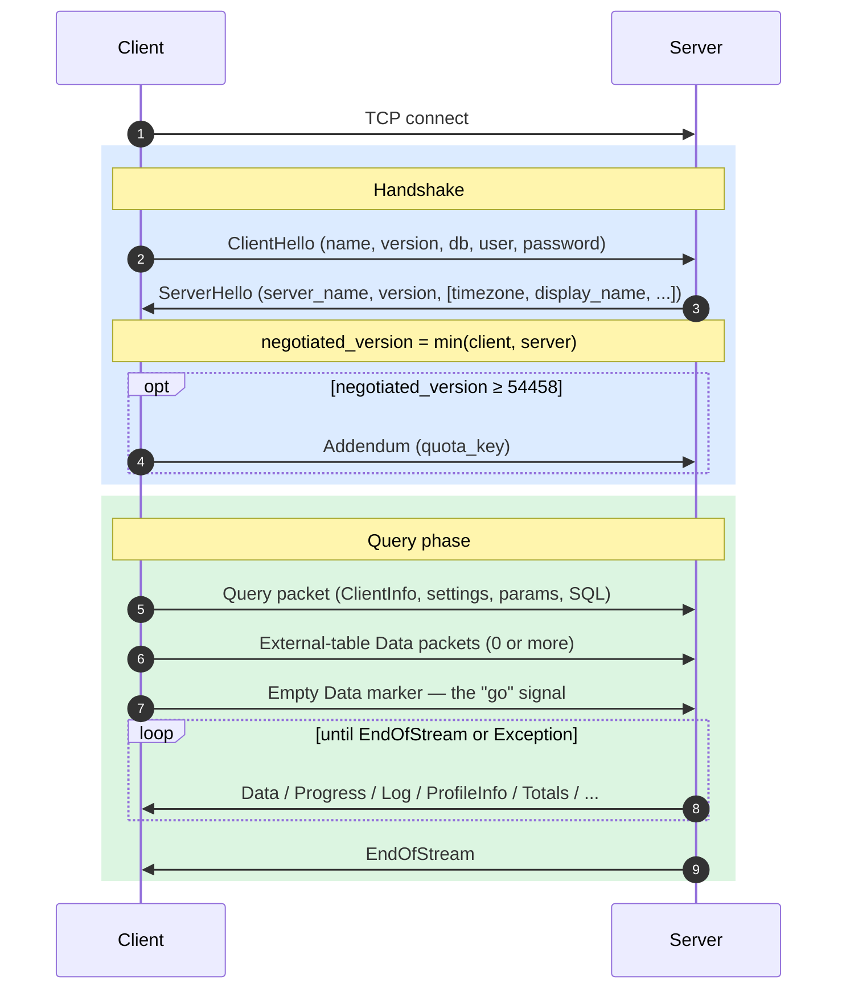
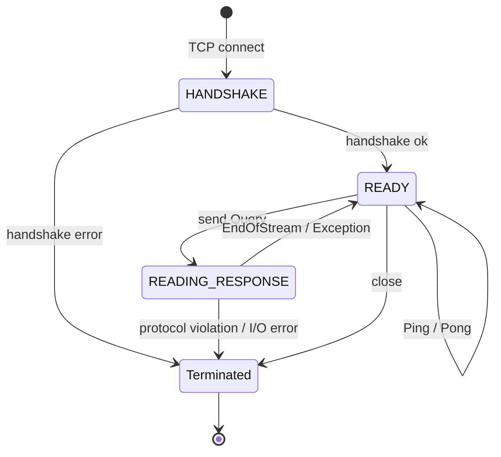
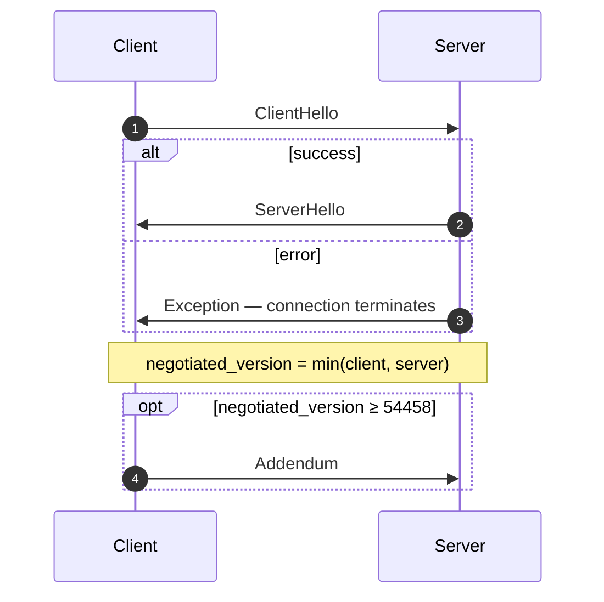
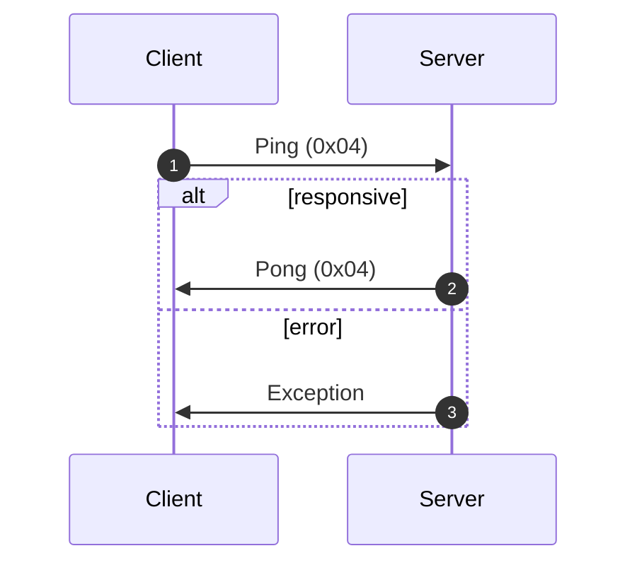
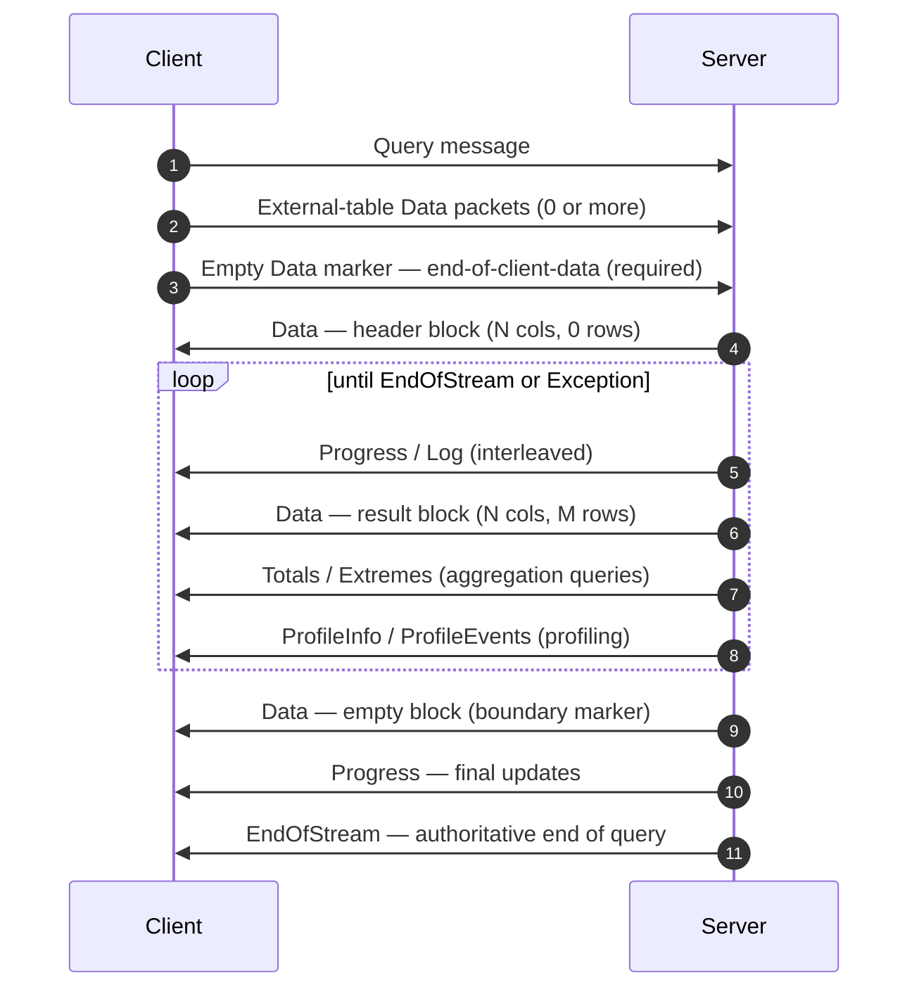
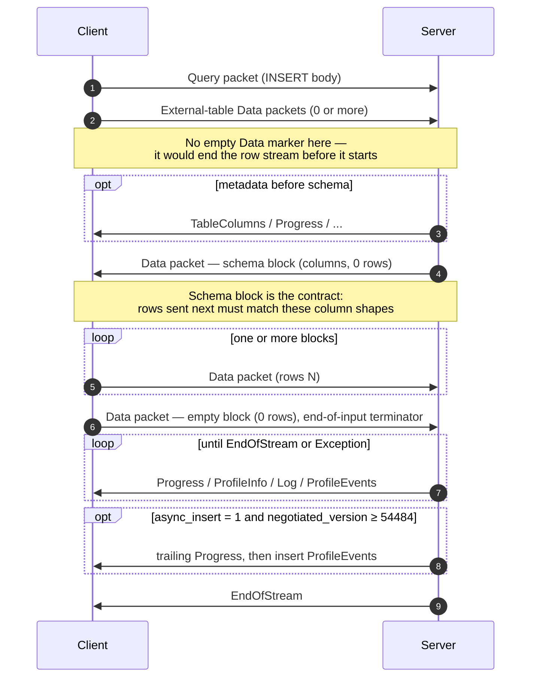
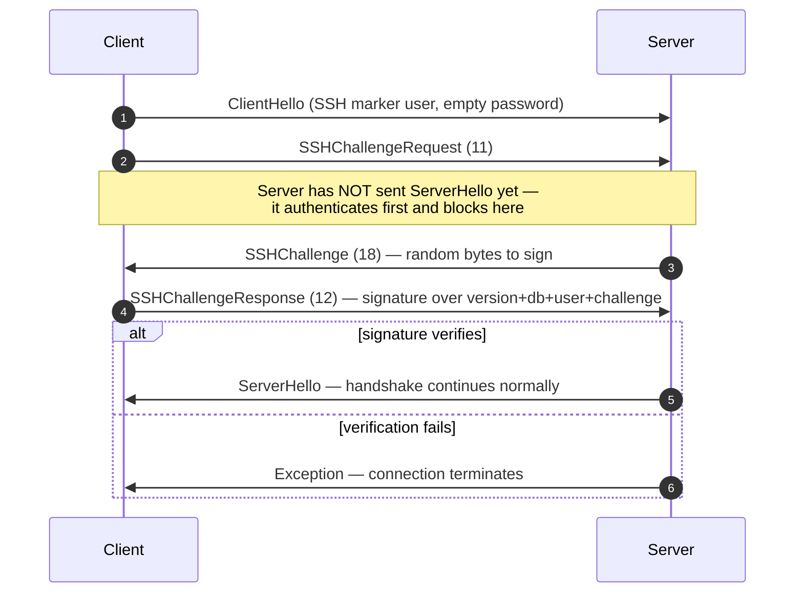

The native protocol is the binary, connection-oriented protocol that ClickHouse clients and servers speak over TCP. It carries SQL queries, result data, `INSERT` payloads, execution telemetry, and error signals. It is the protocol behind the command-line client and the C++ and most third-party native drivers.

This page covers the protocol itself: packet framing, the connection state machine, version negotiation, and the body of every non-`Block` message. The bytes inside `Data`-family packets (the `Block`, its columns, and the per-type encodings) are a separate concern, documented in the [Native Format](/interfaces/specs/NativeFormat) specification.

:::note Companion specification
This page is one half of a pair and is published together with the companion [Native Format](/interfaces/specs/NativeFormat) specification. The two specs split the work cleanly: this page owns the packet and transport layer; the Native Format spec owns the bytes inside `Data`-family packets. 
:::

A few properties hold throughout. The protocol is binary and positional: there are no field tags except inside `BlockInfo`, so a single misplaced byte desynchronizes everything that follows. It is stateful, and each TCP connection processes one query at a time — there is no multiplexing. Fixed-width integers are little-endian.

## Overview {#overview}

| Property         | Value |
|------------------|-------|
| Transport        | TCP, optionally wrapped in TLS |
| Byte order       | Little-endian for fixed-width integers |
| Encoding         | Binary and positional (no field tags except in `BlockInfo`) |
| Connection model | Stateful, one query at a time, no multiplexing |
| Versioning       | Negotiated at handshake; individual features gated by version |
| Data format      | The [Native Format](/interfaces/specs/NativeFormat) for all tabular data |

Every message on the wire starts with a `VarUInt` packet type code, followed by a body whose shape depends on that code and on the negotiated protocol version.

A connection runs through three phases — a one-time handshake, then any number of `Ping` or `Query` exchanges, then close:



The native TCP protocol always carries tabular data in the Native format, regardless of any `FORMAT` clause in the SQL. Re-formatting into `RowBinary`, `CSV`, `JSON`, and so on is the client's job, done after it decodes the Native blocks. (The HTTP interface is a different code path that *does* honour the `FORMAT` clause; HTTP is out of scope here.)

## Security {#security}

### Transport security (TLS) {#transport-security}

TLS lives at the transport layer, below the protocol. When it is enabled the entire TCP stream is encrypted, and the protocol messages are byte-for-byte identical whether TLS is in use or not.

### Authentication {#authentication}

Authentication happens during the handshake, in the [`ClientHello`](#clienthello) message. The `user` and `password` fields travel as plaintext strings, so transport-level encryption (TLS) is what protects credentials in transit.

SSH challenge-response authentication is available from protocol version 54466 onward — see [SSH challenge-response authentication](#ssh-authentication).

### Inter-server secret {#inter-server-secret}

For distributed query execution, servers authenticate to one another by proving knowledge of a shared secret — without putting the secret on the wire. Each Query carries a 32-byte SHA-256 `auth_hash` in [`Query`](#query) field 4, computed over a salt, nonce, the configured secret, and the query, which the receiving server recomputes and compares. This is gated by the `INTERSERVER_SECRET` feature (v54441). External clients always send an empty string here. See [Inter-server authentication](#inter-server-authentication).

## Versioning and feature gates {#versioning-and-feature-gates}

### Version negotiation {#version-negotiation}

Both client and server declare their maximum supported protocol version during the handshake. The **negotiated version** is the smaller of the two:

```text
negotiated_version = min(client_version, server_version)
```

Every message after that uses the negotiated version to decide which fields are present on the wire.

### Feature gates {#feature-gates}

A feature is identified by the protocol version that introduced it, and is **active** when the negotiated version is greater than or equal to that number.

:::warning
When a feature is active, its fields **must** be present on the wire. The protocol is strictly positional, so omitting a feature-gated field corrupts the byte stream for every field that follows.
:::

### Feature table {#feature-table}

| Feature                         | Version | Affects                | Wire impact |
|---------------------------------|---------|------------------------|-------------|
| BLOCK_INFO                      | all     | Block                  | Adds the BlockInfo prefix (`is_overflows`, `bucket_number`) to every Block. |
| CLIENT_INFO                     | 54032   | Query                  | Adds the ClientInfo block to the Query body. |
| TIMEZONE                        | 54058   | ServerHello            | Adds the `timezone` field to ServerHello. |
| QUOTA_KEY_IN_CLIENT_INFO        | 54060   | ClientInfo             | Adds the `quota_key` field to ClientInfo. |
| DISPLAY_NAME                    | 54372   | ServerHello            | Adds the `display_name` field to ServerHello. |
| VERSION_PATCH                   | 54401   | ServerHello, ClientInfo | Adds the `version_patch` field to both. |
| SERVER_LOGS                     | 54406   | Log                    | Server emits Log packets when `send_logs_level` is set. |
| COLUMN_DEFAULTS_METADATA        | 54410   | TableColumns           | Server may send the [`TableColumns`](#tablecolumns) packet (type 11) with column-default metadata before the INSERT/input schema block. Sent only when negotiated version ≥ 54410 **and** `input_format_defaults_for_omitted_fields` is enabled. Below this version the packet is never sent; clients must not wait for it. |
| WRITE_CLIENT_INFO               | 54420   | Progress               | Adds `wrote_rows` and `wrote_bytes` to Progress. (Despite the name, this does **not** gate the ClientInfo block — that is `CLIENT_INFO` (v54032).) |
| SETTINGS_SERIALIZED_AS_STRINGS  | 54429   | Query (settings encoding) | Changes **how** the always-present settings list is encoded; does **not** gate whether settings are sent. v54429+ writes each setting as `(name, flags, value-as-string)`; older peers write `(name, type-specific-binary-value)` with no flags. See [Setting](#setting). |
| INTERSERVER_SECRET              | 54441   | Query                  | Adds the inter-server `auth_hash` field to Query — a salted SHA-256 over the cluster secret, not the raw secret. External clients send an empty string. See [Inter-server authentication](#inter-server-authentication). |
| OPEN_TELEMETRY                  | 54442   | ClientInfo             | Adds the OpenTelemetry trace context to ClientInfo. |
| DISTRIBUTED_DEPTH               | 54448   | ClientInfo             | Adds the `distributed_depth` field to ClientInfo. |
| INITIAL_QUERY_START_TIME        | 54449   | ClientInfo             | Adds the `initial_time` field (Int64, fixed-width). |
| PROFILE_EVENTS                  | 54451   | ProfileEvents          | Server emits ProfileEvents packets during query execution. |
| PARALLEL_REPLICAS               | 54453   | ClientInfo             | Adds parallel-replica coordination fields to ClientInfo. |
| CUSTOM_SERIALIZATION            | 54454   | Block (Column)         | Adds the `has_custom_serialization` byte after each column's type string. |
| ADDENDUM                        | 54458   | Handshake              | Client sends an addendum (`quota_key`) after the handshake exchange. |
| PARAMETERS                      | 54459   | Query                  | Adds the parameters list to the Query body. |
| SERVER_QUERY_TIME_IN_PROGRESS   | 54460   | Progress               | Adds the `elapsed_ns` field to Progress. |
| PASSWORD_COMPLEXITY_RULES       | 54461   | ServerHello            | Adds a list of password-policy regex patterns and human-readable messages to ServerHello. |
| INTERSERVER_SECRET_V2           | 54462   | ServerHello            | Adds an 8-byte `UInt64` nonce to ServerHello. Used by inter-server query signing; external clients decode and ignore. |
| TOTAL_BYTES_IN_PROGRESS         | 54463   | Progress               | Adds the `total_bytes_to_read` (VarUInt) field to Progress, between `total_rows` and `wrote_rows`. |
| TIMEZONE_UPDATES                | 54464   | TimezoneUpdate         | Adds the `TimezoneUpdate` server packet (type 17). Body: single `String` carrying the session timezone. Sent only by the `input` table function initializer, right after the input-schema block, so the client parses the rows it sends with the server's `session_timezone`. See [TimezoneUpdate](#timezoneupdate). |
| SPARSE_SERIALIZATION            | 54465   | Block (Column)         | Server may set `has_custom_serialization = 1` and emit a sparse-encoded column. Wire format: 1-byte kind (0x01 = SPARSE), then VarUInt offset stream terminated by EOG, then the non-default values densely encoded in the inner type. See [kind_stack and sparse encoding](/interfaces/specs/NativeFormat#kind-stack-and-sparse-encoding). |
| SSH_AUTHENTICATION              | 54466   | Auth flow              | Adds SSH challenge-response authentication. Opt-in: client sends a `user` of the form `" SSH KEY AUTHENTICATION " + <real_user>` with empty password to trigger it. See [SSH challenge-response authentication](#ssh-authentication). |
| TABLE_READ_ONLY_CHECK           | 54467   | TablesStatusResponse   | Adds an `is_readonly` flag to each table's row in TablesStatusResponse. External clients that don't issue `TablesStatusRequest` see no wire change. |
| SYSTEM_KEYWORDS_TABLE           | 54468   | system tables          | Server populates `system.keywords` so the canonical `clickhouse-client` can autocomplete keywords. No native-protocol wire change. |
| ROWS_BEFORE_AGGREGATION         | 54469   | ProfileInfo            | Adds `applied_aggregation` (Bool) and `rows_before_aggregation` (VarUInt) to ProfileInfo, in that order at the tail. |
| CHUNKED_PROTOCOL                | 54470   | Connection framing     | Per-packet chunk framing wraps every packet body. Negotiated in Addendum. ServerHello carries the server's preference for each direction; Addendum carries the client's final choice. See [chunked framing](#chunked-framing). |
| VERSIONED_PARALLEL_REPLICAS_PROTOCOL | 54471 | ServerHello, Addendum | Both sides exchange a `VarUInt` parallel-replicas coordination protocol version. ServerHello's field is positioned **immediately after `protocol_version`** (before `timezone`). Addendum's field is appended after the chunked-protocol strings. Current value: `8` (`DBMS_PARALLEL_REPLICAS_PROTOCOL_VERSION`). Version `8` adds [`MergeTreeAllRangesAnnouncementResponse`](#mergetreeallrangesannouncementresponse) (client packet `14`): when the negotiated parallel-replicas version is `≥ 8` the initiator replies to every non-`Default`-mode follower announcement with the authoritative parts list for that stream, and the follower waits for it before issuing read requests. Below `8` the announcement is fire-and-forget. |
| INTERSERVER_EXTERNALLY_GRANTED_ROLES | 54472 | Query | Adds a `String external_roles` field to the Query body, between the settings terminator and the interserver-secret hash. External clients send an empty role list (a single byte `0x00`, i.e. VarUInt 0 inside a String envelope). |
| V2_DYNAMIC_AND_JSON_SERIALIZATION | 54473 | Column body | Server may emit V2 serialization for `Dynamic` and `JSON` column types — gates which `state_prefix` version they use. See [versioned types](/interfaces/specs/NativeFormat#versioned-types). |
| SERVER_SETTINGS                 | 54474   | ServerHello            | Server broadcasts its non-default settings as a list at the tail of ServerHello, after `nonce`. Format: `(key, flags, value)` triples terminated by an empty key — same as the Query packet's settings list. |
| QUERY_AND_LINE_NUMBERS          | 54475   | ClientInfo             | Adds `script_query_number` (VarUInt) and `script_line_number` (VarUInt) at the tail of ClientInfo. Used by clickhouse-client for multi-statement script error attribution; external clients send `0, 0`. |
| JWT_IN_INTERSERVER              | 54476   | ClientInfo             | Adds a JWT-presence UInt8 + optional `String jwt` at the tail of ClientInfo. External clients (no JWT) send byte `0x00`. (Spelled `DBMS_MIN_REVISON_WITH_JWT_IN_INTERSERVER` in C++ — note the typo in the constant name.) |
| QUERY_PLAN_SERIALIZATION        | 54477   | ServerHello, QueryPlan packet | ServerHello appends `VarUInt query_plan_serialization_version` after server settings. Also introduces `ClientPacket::QueryPlan` (code `13`) for inter-server delivery of pre-built query plans — external clients never send. |
| PARALLEL_BLOCK_MARSHALLING      | 54478   | Block (Column)         | Server may wrap columns in `ColumnBLOB` (compressed inline) for parallel processing. Gated on the query having compression enabled AND `rows > 1`; otherwise the regular column wire format applies. Clients that never enable compression on outgoing Query packets see no wire change. |
| VERSIONED_CLUSTER_FUNCTION_PROTOCOL | 54479 | ServerHello           | Adds `VarUInt cluster_function_protocol_version` at the tail of ServerHello. Used for `*Cluster` table functions (`s3Cluster`, etc.). Current value: `8` (`DBMS_CLUSTER_PROCESSING_PROTOCOL_VERSION`); version `7` is reserved for a private-repository feature (Iceberg compaction), and `8` adds an optional `read_source_index` to the inter-server cluster read-task payload (the `ReadTaskResponse` body, which stays unspecified here — see below). External clients decode and ignore. |
| OUT_OF_ORDER_BUCKETS_IN_AGGREGATION | 54480 | BlockInfo              | Adds field 3 (`out_of_order_buckets: Vec<Int32>`) to BlockInfo's field-tagged stream. Decoded as `[VarUInt count][Int32]*count`. External clients don't emit this themselves; the decoder reads any non-empty list the server sends. |
| COMPRESSED_LOGS_PROFILE_EVENTS_COLUMNS | 54481 | Log, ProfileEvents, TableColumns | Server may wrap [`Log`](#log), [`ProfileEvents`](#profileevents), and [`TableColumns`](#tablecolumns) packet bodies in the [compression frame](/interfaces/specs/NativeFormat#compression-frame). At this version all three bodies travel through the same optionally-compressed output path, which becomes a real compression frame only when the query has `compression = true`. Clients that never enable compression on outgoing Query packets see no wire change. |
| REPLICATED_SERIALIZATION        | 54482   | Block (Column)         | Server may emit columns with kind_stack `0x04 = REPLICATED` — a dictionary-style compact form for repeated values — see [kind_stack and sparse encoding](/interfaces/specs/NativeFormat#kind-stack-and-sparse-encoding). Below this version the writer expanded such columns before sending. Decoded via index lookup (`elements[indexes[i]]` per row); leaf types plus `Nullable`/`Array`/`Tuple`/`Map`/`Nested`/`LowCardinality` inners supported. |
| NULLABLE_SPARSE_SERIALIZATION   | 54483   | Block (Column)         | Composes sparse serialization with `Nullable(T)`. Below this version the writer expanded sparse for Nullable columns before sending; at v54483+ the wire data is sparse-over-Nullable. See [kind_stack and sparse encoding](/interfaces/specs/NativeFormat#kind-stack-and-sparse-encoding). |
| PROGRESS_IN_ASYNC_INSERT        | 54484   | Progress (INSERT)      | On an **asynchronous** INSERT (`async_insert = 1`), once the insert is flushed the server sends an extra [`Progress`](#progress) packet, then the insert's `ProfileEvents`, before `EndOfStream`. Gated on the *negotiated* version ≥ 54484; below it the server omits this trailing Progress. The Progress wire format is unchanged — only the emission is new. In practice the increment carries the elapsed time; the written-row counters are reported via the accompanying ProfileEvents. A client that already drains interleaved Progress needs no format change, only to tolerate one more packet. |
| CLIENT_AGENT_IN_CLIENT_INFO     | 54485   | ClientInfo             | Adds a trailing `client_agent` `String` to ClientInfo. The canonical client auto-detects an agent identifier from its environment (for example `claude-code`, `cursor`, `gemini-cli`, or the value of the `AGENT` variable); an external client with nothing detected sends an empty string. Required once negotiated version ≥ 54485 — omitting it desynchronizes the rest of the Query packet. |

## Packet envelope {#packet-envelope}

Every message on the wire shares the same outer structure, in both directions:

```text
[VarUInt: packet_type_code]    always encoded as VarUInt
[message body]                 format depends on packet_type_code
```

The full packet-type tables are in the [packet type reference](#packet-type-reference).

The packet type is a `VarUInt`, not a fixed-width byte. For values below 128 a `VarUInt` produces the same single byte, but implementations must use `VarUInt` encoding so they stay compatible should future packet types reach 128 or above.

The [message reference](#message-reference) documents only the **body** of each packet — the bytes after the packet type code. Field numbering starts at 1 with the first body field.

### Chunked framing (v54470+) {#chunked-framing}

When the `CHUNKED_PROTOCOL` feature is **negotiated** (see [the handshake](#handshake-phase)), every packet on the wire is wrapped in chunked framing. The wrapping is **per-direction**: client→server and server→client are negotiated separately and may end up in different modes (chunked versus unframed).

Wire layout per packet:

```text
<chunk>...   one or more chunks; their payloads concatenated form the whole packet
[u32 LE = 0] zero-size terminator marking end of packet
```

Wire layout per chunk:

```text
[u32 LE: chunk_size]   chunk_size in [1, UINT32_MAX]
[chunk_size bytes]     packet bytes (see note below)
```

The packet type `VarUInt` is **inside** the chunked stream: it is the first byte of the packet payload (the first byte of the first chunk), not a separate byte sent ahead of the framing. Each packet's chunk payload is the full `[VarUInt packet_type_code][message body]` from the [packet envelope](#packet-envelope). A client that leaves the packet type outside the chunked stream makes the peer read that type byte as the first byte of the `u32` chunk size, desynchronizing the connection.

A single packet may be split across several chunks if the writer's buffer fills mid-packet; a split can fall anywhere, including inside the packet type's `VarUInt`. The reader concatenates chunk payloads and treats the trailing 4-byte zero as a transparent packet boundary — it consumes it but does not surface it to whatever is reading packet bodies.

No-body packets are still wrapped: a single-byte packet such as `Ping` or `Pong` becomes `[u32 size = 1][0x04][u32 0]` once chunking is negotiated. Any "single byte on the wire" description elsewhere on this page is the pre-chunking form.

**Negotiation.** ServerHello and Addendum each carry two `String` fields, one per direction, with values drawn from `{"chunked", "notchunked", "chunked_optional", "notchunked_optional"}`:

- `chunked` / `notchunked` are strict: that side requires exactly that mode.
- The `_optional` variants are flexible: they accept whichever mode the other side picks.

The agreed value for each direction is computed pairwise:

| Server pref | Client pref | Agreed |
|-------------|-------------|--------|
| `*_optional` | anything | follow CLIENT (its `starts_with("chunked")`) |
| anything   | `*_optional` | follow SERVER |
| `chunked` strict | `chunked` strict | `chunked` |
| `notchunked` strict | `notchunked` strict | `notchunked` |
| strict mismatch | strict mismatch | **protocol error** — the connection MUST be torn down |

On the client side, the client's SEND preference negotiates against the server's RECV preference, and vice versa.

**Timing.** The negotiation strings travel on the unframed wire: ClientHello → ServerHello (server prefs) → Addendum (client's negotiated values). The framing flip applies to every byte sent *after* the Addendum is flushed. The Addendum itself, the ClientHello, and the ServerHello are always unframed.

## Connection lifecycle {#connection-lifecycle}

At any moment a connection is in exactly one of four states: `HANDSHAKE`, `READY`, `READING_RESPONSE`, or terminated. Because the protocol does not multiplex, a client that sends a new request before draining the previous response interleaves bytes on the wire and corrupts the stream.

### States {#states}



The happy path runs straight down — `HANDSHAKE → READY → READING_RESPONSE → READY` — with the `Ping`/`Pong` self-loop and every failure edge funnelling into the single `Terminated` sink.

| State              | Description |
|--------------------|-------------|
| `HANDSHAKE`        | Initial state after the TCP connection opens. Only [handshake](#handshake-phase) messages are valid. Transitions to `READY` on success or terminates on failure. |
| `READY`            | Idle. The client may send [Ping](#ping-phase), [Query](#query-phase), or close. The connection may stay in `READY` indefinitely (subject to `idle_connection_timeout`, see [connection limits](#connection-limits)). |
| `READING_RESPONSE` | Entered when the client sends a Query. The client must fully drain the server's response stream before returning to `READY`. The only allowed client→server packet here is Cancel (not specified on this page). |
| Terminated         | No longer usable. The client must open a new TCP connection and restart the handshake. |

### Handshake phase {#handshake-phase}

Authenticates and negotiates the protocol version. Happens exactly once per connection, before anything else.

The TCP connection has just opened and no messages have been exchanged. The flow:



1. The client sends [`ClientHello`](#clienthello) with its maximum supported protocol version.
2. The client reads the response and dispatches by packet type:

   | Packet type           | Action |
   |-----------------------|--------|
   | `Hello` (0)           | Decode [`ServerHello`](#serverhello). Compute `negotiated_version = min(client_ver, server_ver)`. Proceed to step 3. |
   | `Exception` (2)       | Decode [`Exception`](#exception). Return as error and terminate the connection. |
   | anything else         | Protocol violation. Terminate the connection. |

3. If `negotiated_version ≥ 54458` (the `ADDENDUM` feature), the client sends an [`Addendum`](#addendum). This decision is based on the **negotiated** version, not the client's declared version.

On success the connection moves to `READY`; on any error it terminates.

### Ping phase {#ping-phase}

An application-level liveness check, independent of TCP keepalive. A successful Ping/Pong round-trip confirms the TCP connection is alive in both directions and the server is responsive. Ping is stateless and uncorrelated with any query, so multiple sequential Pings are independent.

Starting from `READY`, the flow is:



1. The client sends [`Ping`](#ping).
2. The client reads the response:

   | Packet type           | Action |
   |-----------------------|--------|
   | `Pong` (4)            | Liveness confirmed. Return to `READY`. |
   | `Exception` (2)       | Decode [`Exception`](#exception) and return as error. |
   | anything else         | Protocol violation. |

### Query phase {#query-phase}

The client submits a SQL statement; the server streams back result blocks and execution telemetry. The response is a sequence of packets terminated by exactly one `EndOfStream` or `Exception`.

Starting from `READY`, the flow is:



On error at any point the server sends an `Exception` instead of `EndOfStream`, which terminates the query.

1. The client sends [`Query`](#query) with a unique `query_id` (typically a UUID).
2. The client sends any external tables, then the empty Data marker. The empty Data packet has `table_name = ""`, `num_columns = 0`, `num_rows = 0`. The server does not begin executing the query until it receives this marker.
3. The client moves to `READING_RESPONSE` and flushes its write buffer.
4. The client reads response packets in a loop, dispatching by type:

   | Packet type           | Action |
   |-----------------------|--------|
   | `Data` (1)            | Decode the block. The first Data is the schema header; later ones are result blocks (accumulate); an empty block is a boundary marker. `num_rows == 0` is **not** end-of-query. |
   | `Progress` (3)        | Execution metrics. Each packet is an **increment** since the previous one — accumulate locally. |
   | `EndOfStream` (5)     | Query complete. Exit the loop and return to `READY`. |
   | `ProfileInfo` (6)     | Post-execution profiling data. |
   | `Totals` (7)          | Aggregation totals block (same wire format as Data). |
   | `Extremes` (8)        | Min/max values block (same wire format as Data). |
   | `Log` (10)            | Server log line. |
   | `TableColumns` (11)   | Column-defaults metadata. |
   | `ProfileEvents` (14)  | Performance counters. |
   | `Exception` (2)       | Decode and return as error. Exit the loop and return to `READY`. |
   | anything else         | Unexpected during the query phase. Terminate the connection. |

On `EndOfStream` or a handled `Exception` the connection returns to `READY`. A protocol violation or I/O error terminates it.

:::note
The `num_rows == 0` case trips up new implementations. A zero-row block is a boundary marker or schema header, not an end-of-stream signal. Only `EndOfStream` or `Exception` ends the response.
:::

### INSERT phase {#insert-phase}

The INSERT phase is the [Query phase](#query-phase) with two extra exchanges. The client submits an `INSERT` statement; the server replies with a **schema block** describing the target table; the client streams Data packets with the rows, then the empty Data marker; the server finishes with `EndOfStream` or `Exception`.

Starting from `READY`, the SQL is an `INSERT` of the form `INSERT INTO <table> [(<cols>)] VALUES` — with no inline `VALUES (...)` literal, since the row data flows through Data packets. The flow:



1. The client sends [`Query`](#query) with `body` set to the INSERT SQL.
2. The client sends any external tables (rare for INSERT). Unlike the [Query phase](#query-phase), it does **not** send an empty Data marker here. The `INSERT` `Query` packet is sent with pending data, so the empty end-of-data block is deferred to step 5; sending it before the schema block would make the server read it as the end of the row stream, finish the INSERT with no rows, and then parse the first real row packet as a stray top-level packet.
3. The client drains metadata packets (TableColumns, Progress, ProfileInfo, Log, ProfileEvents) until it reads the schema Data packet — a Block with 0 rows but full column structure (names and types). The schema block is the contract: the rows the client sends next must match these column shapes.
4. The client sends data block(s). For each block it writes `VarUInt(ClientPacket::Data = 2)`, then `String("")` for the empty external-table name, then the Block. Column types must align with the schema block's columns by position.
5. The client sends the end-of-input terminator: a Data packet with an empty Block (0 columns, 0 rows).
6. The client drains the response stream until `EndOfStream` (success) or `Exception` (failure).

**Asynchronous INSERT (v54484+).** When the query carries `async_insert = 1`, the server queues the rows and flushes them as part of a batch. At negotiated version ≥ 54484 (`PROGRESS_IN_ASYNC_INSERT`), once the flush completes the server emits an extra [`Progress`](#progress) packet, immediately followed by the insert's `ProfileEvents`, then `EndOfStream`. Below 54484 the server skips that trailing Progress. The packet is an ordinary `Progress`; because the server resets the query pipeline before folding in the write counts, the increment in practice carries only the elapsed time, and the written-row and byte stats reach the client via the accompanying `ProfileEvents`. A client that already drains interleaved Progress in step 6 needs only to accept one more packet.

The connection returns to `READY` on `EndOfStream` or a handled `Exception`. Protocol violations and I/O errors terminate it.

## Message reference {#message-reference}

Fields are listed in wire order. The `Type` column uses:

- `VarUInt` — variable-length unsigned integer (see [VarUInt](/interfaces/specs/NativeFormat#varuint)).
- `String` — VarUInt-prefixed bytes (see [String](/interfaces/specs/NativeFormat#string)).
- `UInt8`, `Int32`, and so on — fixed-width little-endian integers.
- `Bool` — a single byte, `0x00` or `0x01`.

The `Role` column says who uses each field:

- **client** — set by external clients.
- **inter-server** — meaningful only for server-to-server communication; external clients write a default value.
- **universal** — used by both.

These tables document only the body of each packet, after the packet type code.

### ClientHello (packet type 0) {#clienthello}

Client → Server. The first message after the TCP connection opens.

| # | Field            | Type    | Role      | Description |
|---|------------------|---------|-----------|-------------|
| 1 | client_name      | String  | universal | Client identifier (e.g., `"clickhouse-client"`) |
| 2 | version_major    | VarUInt | universal | Client major version |
| 3 | version_minor    | VarUInt | universal | Client minor version |
| 4 | protocol_version | VarUInt | universal | Client's max supported protocol version |
| 5 | database         | String  | universal | Default database name |
| 6 | user             | String  | universal | Username for authentication |
| 7 | password         | String  | universal | Password (plaintext) |

### ServerHello (packet type 0) {#serverhello}

Server → Client. The reply to ClientHello on successful authentication.

| # | Field            | Type    | Role      | Condition              | Description |
|---|------------------|---------|-----------|------------------------|-------------|
| 1 | server_name      | String  | universal | always                 | Server identifier |
| 2 | version_major    | VarUInt | universal | always                 | Server major version |
| 3 | version_minor    | VarUInt | universal | always                 | Server minor version |
| 4 | protocol_version | VarUInt | universal | always                 | Server's protocol version |
| 4a | parallel_replicas_protocol_version | VarUInt | universal | VERSIONED_PARALLEL_REPLICAS_PROTOCOL (v54471) | Server's parallel-replicas coordination protocol version. **Wire position: immediately after `protocol_version`**, before `timezone`. Current: `8`. |
| 5 | timezone         | String  | universal | TIMEZONE (v54058)      | Server timezone (e.g., `"UTC"`) |
| 6 | display_name     | String  | universal | DISPLAY_NAME (v54372)  | Human-readable server name |
| 7 | version_patch    | VarUInt | universal | VERSION_PATCH (v54401) | Server patch version |
| 8 | proto_send_chunked_srv | String | universal | CHUNKED_PROTOCOL (v54470) | Server's preferred outbound chunking. One of `"chunked"`, `"notchunked"`, `"chunked_optional"`, `"notchunked_optional"`. See [chunked framing](#chunked-framing). **Sits BEFORE `password_complexity_rules` on the wire even though its version gate is higher.** |
| 9 | proto_recv_chunked_srv | String | universal | CHUNKED_PROTOCOL (v54470) | Server's preferred inbound chunking. Same value set as field 8. |
| 10 | password_complexity_rules | Rule[] | universal | PASSWORD_COMPLEXITY_RULES (v54461) | Server's password policy. `VarUInt count` followed by `count × Rule`. See below. |
| 11 | nonce            | UInt64  | inter-server | INTERSERVER_SECRET_V2 (v54462) | 8-byte LE random nonce. The server's inter-server query-signing scheme uses it. External clients MUST decode it (to keep the stream aligned) and SHOULD ignore the value. |
| 12 | server_settings  | Setting[] | universal | SERVER_SETTINGS (v54474)        | Server's non-default settings broadcast. Format: zero or more `(String key, VarUInt flags, String value)` triples, terminated by an empty key. Same as the [Query packet's settings list](#setting). |
| 13 | query_plan_serialization_version | VarUInt | universal | QUERY_PLAN_SERIALIZATION (v54477) | Server's supported query-plan serialization version. External clients decode and ignore. |
| 14 | cluster_function_protocol_version | VarUInt | universal | VERSIONED_CLUSTER_FUNCTION_PROTOCOL (v54479) | Server's `*Cluster` table-function protocol version. Current: `8`. The value gates additive fields in the inter-server cluster read-task payload (the otherwise-unspecified `ReadTaskResponse` body); version `7` is reserved for a private-repository feature (Iceberg compaction), and `8` adds an optional `read_source_index`. External clients do not participate in cluster reads — they decode and ignore this field. |

**Rule** — an element of `password_complexity_rules`:

| # | Field   | Type   | Description |
|---|---------|--------|-------------|
| 1 | pattern | String | Regular-expression pattern that a compliant password must match. |
| 2 | message | String | Human-readable explanation shown when a password fails this rule. |

The list reflects the server operator's password-policy configuration and is purely advisory — the server does not enforce these rules during the handshake. A client that exposes password change/set functionality may use the rules to flag errors before round-tripping a non-compliant password to the server.

:::note
To bound resource use against a hostile or misconfigured server, cap the decoded `count` at 256 entries and each `pattern` and `message` String at 4096 bytes. A `count` of `0` (no following pairs) is the common case for servers with no password policy configured.
:::

### Addendum (no packet type) {#addendum}

Client → Server, gated by `ADDENDUM` (v54458). Sent immediately after the handshake exchange completes. It is not a distinct packet type — the fields go on the wire raw, with no packet type byte prefix.

| # | Field             | Type   | Role         | Condition                  | Description |
|---|-------------------|--------|--------------|----------------------------|-------------|
| 1 | quota_key         | String | universal    | always                     | Resource quota key for server-side keyed quotas. Clients that do not use a keyed quota send an empty string. |
| 2 | proto_send_chunked | String | universal   | CHUNKED_PROTOCOL (v54470)  | Client's negotiated outbound chunking: `"chunked"` or `"notchunked"`. Computed against `proto_recv_chunked_srv` from ServerHello. |
| 3 | proto_recv_chunked | String | universal   | CHUNKED_PROTOCOL (v54470)  | Client's negotiated inbound chunking. Computed against `proto_send_chunked_srv`. |
| 4 | parallel_replicas_protocol_version | VarUInt | universal | VERSIONED_PARALLEL_REPLICAS_PROTOCOL (v54471) | Client's supported parallel-replicas coordination protocol version. External clients not participating in distributed queries SHOULD still send a valid version (current `8`) so the server's compatibility check succeeds. |

The chunked-framing flip applies *after* this Addendum is flushed — the Addendum itself is unframed.

### Ping (packet type 4) {#ping}

Client → Server. No body — the packet is a single byte `0x04` before chunked framing; when chunking is negotiated the byte becomes the one-byte payload of a chunk (see [chunked framing](#chunked-framing)).

### Pong (packet type 4) {#pong}

Server → Client. No body — the packet is a single byte `0x04` before chunked framing; when chunking is negotiated the byte becomes the one-byte payload of a chunk (see [chunked framing](#chunked-framing)).

### Exception (packet type 2) {#exception}

Server → Client. Sent when the server hits an error during any phase.

| # | Field       | Type   | Role      | Description |
|---|-------------|--------|-----------|-------------|
| 1 | code        | Int32  | universal | Error code |
| 2 | name        | String | universal | Exception class (e.g., `"DB::Exception"`) |
| 3 | message     | String | universal | Human-readable error message |
| 4 | stack_trace | String | universal | Server-side stack trace |
| 5 | has_nested (obsolete) | Bool   | universal | Obsolete compatibility byte. Always written as `false` by the server |

### Query (packet type 1) {#query}

Client → Server.

| # | Field          | Type        | Role         | Condition                                | Description |
|---|----------------|-------------|--------------|------------------------------------------|-------------|
| 1 | query_id       | String      | universal    | always                                   | Unique query identifier (UUID) |
| 2 | client_info    | ClientInfo  | universal    | CLIENT_INFO (v54032)                     | See [ClientInfo](#clientinfo) |
| 3 | settings       | Setting[]   | universal    | always                                   | See [Setting](#setting). **Always present** (terminated by an empty key); only the per-setting *encoding* is version-gated — see the encoding note in [Setting](#setting). A client must not omit this field for negotiated versions below `54429`. |
| 3a | external_roles | String     | universal    | INTERSERVER_EXTERNALLY_GRANTED_ROLES (v54472) | Serialized list of externally-granted role names. Empty list = byte `0x00` (VarUInt 0) wrapped in a String envelope (`[VarUInt 1][0x00]` on the wire). External clients always send empty. |
| 4 | auth_hash      | String      | inter-server | INTERSERVER_SECRET (v54441)              | Inter-server authentication hash — **not** the raw cluster secret. See [Inter-server authentication](#inter-server-authentication) below. External clients (and any `InitialQuery`) send an empty string. |
| 5 | stage          | VarUInt     | universal    | always                                   | Query processing stage. `0` = FetchColumns, `1` = WithMergeableState, `2` = Complete, `3` = WithMergeableStateAfterAggregation, `4` = WithMergeableStateAfterAggregationAndLimit, `7` = QueryPlan. Values `3`/`4` appear in distributed queries; `7` accompanies a serialized query plan. External clients normally send `2`. |
| 6 | compression    | VarUInt     | universal    | always                                   | 0 = disabled, 1 = enabled |
| 7 | query_body     | String      | universal    | always                                   | SQL text |
| 8 | parameters     | Parameter[] | client       | PARAMETERS (v54459)                      | See [Parameter](#parameter). Terminated by empty key. |

### ClientInfo (embedded in Query) {#clientinfo}

Client → Server, embedded in the Query body (field 2). Gated by `CLIENT_INFO` (v54032). (Some fields inside ClientInfo are gated by later versions, as noted per-field below.)

| #  | Field                        | Type    | Role         | Condition                              | Description |
|----|------------------------------|---------|--------------|----------------------------------------|-------------|
| 1  | query_kind                   | UInt8   | universal    | always                                 | 0 = NoQuery, 1 = InitialQuery, 2 = SecondaryQuery. External clients send `1`. |
| 2  | initial_user                 | String  | universal    | always                                 | User who initiated the query |
| 3  | initial_query_id             | String  | universal    | always                                 | Original query ID |
| 4  | initial_address              | String  | universal    | always                                 | Originating client socket address. The server never resolves this value (no hostname or service-name lookup). For a `SECONDARY_QUERY` (where the value is kept and used, e.g. in `system.query_log` and inter-server authentication) the accepted grammar is IPv4 `a.b.c.d:port` or bracketed IPv6 `[addr]:port`, with the host an IP literal and the port a decimal number in `0..65535`; other forms (for example `localhost:9000`, `host:http`, `:9000`, or a UNIX socket path such as `/tmp/ch.sock`) are rejected with `INCORRECT_DATA`. For an `INITIAL_QUERY` the server overwrites this field with the real peer address, so any value is accepted (a value that is not a plain `ip:port` is replaced with the default `0.0.0.0:0`). External clients should send their own `ip:port`. |
| 5  | initial_time                 | Int64   | client       | INITIAL_QUERY_START_TIME (v54449)      | Query start time (microseconds). Fixed-width 8 bytes, not VarUInt |
| 6  | query_interface              | UInt8   | universal    | always                                 | 1 = TCP, 2 = HTTP |
| 7  | os_user                      | String  | client       | if interface = TCP                     | OS username |
| 8  | client_hostname              | String  | client       | if interface = TCP                     | Client machine hostname |
| 9  | client_name                  | String  | client       | if interface = TCP                     | Client application name |
| 10 | version_major                | VarUInt | universal    | if interface = TCP                     | Client major version |
| 11 | version_minor                | VarUInt | universal    | if interface = TCP                     | Client minor version |
| 12 | protocol_version             | VarUInt | universal    | if interface = TCP                     | The originating client's own TCP protocol version (`DBMS_TCP_PROTOCOL_VERSION`), **not** the negotiated version. The peer revision only decides which fields are present; this value is the initiator's compiled-in version, so on a newer client talking to an older server it can be higher than the negotiated/server revision. |
| 13 | quota_key                    | String  | universal    | QUOTA_KEY_IN_CLIENT_INFO (v54060)      | Resource quota key for server-side keyed quotas. Clients that do not use a keyed quota send an empty string. |
| 14 | distributed_depth            | VarUInt | inter-server | DISTRIBUTED_DEPTH (v54448)             | Distributed query nesting depth. External clients send `0`. |
| 15 | version_patch                | VarUInt | universal    | VERSION_PATCH (v54401), TCP only       | Client patch version |
| 16 | open_telemetry               | (below) | client       | OPEN_TELEMETRY (v54442)                | Trace context. Clients without tracing send `0`. |
| 17 | collaborate_with_initiator   | VarUInt | inter-server | PARALLEL_REPLICAS (v54453)             | Bool as VarUInt. External clients send `0`. |
| 18 | count_participating_replicas | VarUInt | inter-server | PARALLEL_REPLICAS (v54453)             | External clients send `0`. |
| 19 | number_of_current_replica    | VarUInt | inter-server | PARALLEL_REPLICAS (v54453)             | External clients send `0`. |
| 20 | script_query_number          | VarUInt | client       | QUERY_AND_LINE_NUMBERS (v54475)        | 1-indexed statement position in a multi-statement script. External clients send `0`. |
| 21 | script_line_number           | VarUInt | client       | QUERY_AND_LINE_NUMBERS (v54475)        | 1-indexed line number within the source script. External clients send `0`. |
| 22 | jwt_present                  | UInt8   | inter-server | JWT_IN_INTERSERVER (v54476)            | `0` = no JWT; `1` = JWT follows. External clients without JWT auth send `0`. |
| 23 | jwt                          | String  | inter-server | JWT_IN_INTERSERVER (v54476), if jwt_present=1 | JWT bearer token, only present when field 22 = `1`. |
| 24 | client_agent                 | String  | client       | CLIENT_AGENT_IN_CLIENT_INFO (v54485)   | Trailing field. Identifier of the client tool/agent, auto-detected from the environment (e.g. `claude-code`, `cursor`, `gemini-cli`, or the `AGENT` env var). External clients with no detected agent send an empty string. Present on the normal Query path once negotiated version ≥ 54485 (sent on all interfaces, not only TCP). |

:::note Interface-dependent layout (fields 7–12)
Fields 7–12 above are the **TCP** branch. When `query_interface` (field 6) is **not** TCP, these fields are *replaced* by a different wire layout — they are not merely optional omissions, so a decoder must branch on field 6.

- `query_interface = 2` (**HTTP**): the server-forwarded HTTP request info is written instead — `http_method` (`UInt8`), `http_user_agent` (`String`), then `forwarded_for` (`String`, gated by `X_FORWARDED_FOR_IN_CLIENT_INFO` v54443) and `http_referer` (`String`, gated by `REFERER_IN_CLIENT_INFO` v54447). No `os_user`/`client_hostname`/`client_name`/`version_*`/`protocol_version` fields are present.
- Any other interface: none of the TCP fields (7–12) and none of the HTTP fields are written; the stream continues directly with `quota_key`.

After this branch the layout rejoins: `quota_key` (field 13) and `distributed_depth` (field 14) follow for all interfaces, then `version_patch` (field 15) is written only for TCP.

This branch matters mainly for inter-server traffic, where the initiating server forwards a query that originally arrived over HTTP. A decoder that always reads the TCP fields will misread such packets — treating `http_method` or `http_user_agent` as `quota_key`.
:::

OpenTelemetry encoding (field 16):

```text
[UInt8: has_trace]              0 = no trace data follows, 1 = trace data follows
If has_trace == 1:
  [16 bytes: trace_id]          byte-swapped per-8-bytes
  [8 bytes:  span_id]           byte-swapped
  [String:   trace_state]       W3C trace state
  [UInt8:    trace_flags]       W3C trace flags
```

### Inter-server authentication {#inter-server-authentication}

The Query field 4 (`auth_hash`) is **not** the shared cluster secret on the wire. Sending the raw secret would both fail authentication and leak it. Instead, a server acting as an inter-server client proves it knows the secret with a salted SHA-256 hash:

1. **Enter inter-server mode.** The connecting server signals it inside `ClientHello`: the `user` field is the inter-server marker and `password` is empty. It then appends two more strings — the cluster name and a freshly-generated 32-byte `salt` (`encodeSHA256` of a random value) — immediately after the `user`/`password` fields, as part of the same `ClientHello` packet. The server reads these two strings **before** it sends `ServerHello`, so a client must write them up front; waiting for `ServerHello` first deadlocks, because the server is blocked reading them.
2. **Obtain the nonce.** `ServerHello` carries an 8-byte `UInt64` nonce when `INTERSERVER_SECRET_V2` (v54462) is negotiated.
3. **Compute the hash.** For every non-`InitialQuery` Query packet, the client writes `encodeSHA256(salt + nonce + cluster_secret + query + query_id + initial_user + external_roles)` into field 4 — a 32-byte digest. (`nonce` is its decimal string form, present only when negotiated ≥ v54462; `external_roles` is appended only when `INTERSERVER_EXTERNALLY_GRANTED_ROLES` (v54472) is negotiated.) For an `InitialQuery`, or when no cluster secret is configured, the client writes an empty string instead.
4. **Verify.** The server reads field 4 with a 32-byte cap and recomputes the same concatenation using its own copy of the cluster secret; the connection is rejected if the digests differ.

External (non-inter-server) clients never enter this mode and always send an empty `auth_hash`.

### Setting {#setting}

Encoded inline in the Query body's settings list (the [Query](#query) packet, field 3). The list is **always present**, regardless of negotiated version, and is terminated by a Setting with an empty key — a single `VarUInt 0`, with no flags or value following. Only the per-setting encoding depends on the negotiated version, gated by `SETTINGS_SERIALIZED_AS_STRINGS` (v54429).

**v54429+ (`STRINGS_WITH_FLAGS`)** — each setting is the triple shown here:

| # | Field | Type    | Role      | Description |
|---|-------|---------|-----------|-------------|
| 1 | key   | String  | universal | Setting name. Empty = end of list. |
| 2 | flags | VarUInt | universal | Metadata bit flags; see below. |
| 3 | value | String  | universal | Setting value as string |

Fields 2 and 3 are absent when `key` is empty.

**Pre-54429 (`BINARY`)** — each setting is `[String key][type-specific binary value]`: the `flags` field is **not** written, and the value is encoded in the setting's native binary form (for example a fixed-width integer or a length-prefixed string) rather than as a decimal/text string. The list is still terminated by an empty `key`. A client that targets a negotiated version below `54429` must read and write this binary form, not the triple above. (Custom user-defined settings are the exception: they always carry `flags` and a string value, in both encodings.)

The `flags` field packs:

- `0x01` — **Important**: the setting affects query results and must not be silently ignored by older peers.
- `0x02` — **Custom**: a user-defined custom setting.
- `0x0c` — a **2-bit tier** field, not an independent flag: `0x00` = Production, `0x04` = Obsolete, `0x08` = Experimental, `0x0c` = Beta. Read all 2 bits (`flags & 0x0c`) — a naive `flags & 0x04` test would misclassify Beta (`0x0c`) as Obsolete.
- `0x80` — **HotReload** (config reload without restart; defined in the flags enum, encountered mainly for coordination settings).

### Parameter {#parameter}

Query parameters, for parameterized queries like `SELECT {x:UInt64}`. Encoded identically to a [Setting](#setting) with the `Custom` flag (`0x02`) set, and terminated by an empty key in the same way.

| # | Field | Type    | Role   | Description |
|---|-------|---------|--------|-------------|
| 1 | key   | String  | client | Parameter name. Empty = end of list. |
| 2 | flags | VarUInt | client | Always `0x02` (Custom) |
| 3 | value | String  | client | Parameter value as string. See the note below on quoting. |

:::note
The parameter value is the SQL representation of the value, not a raw literal. String-typed parameters must be passed already single-quoted (for example, the value for `{name:String}` is `'Alice'`, not `Alice`); otherwise the server's value parser rejects them.
:::

### Data (packet type 1 server→client, packet type 2 client→server) {#data}

Both directions. Carries result blocks, INSERT data, external tables, and end-of-data markers.

The wire format is symmetric — both directions include a `table_name` prefix before the Block. Only the packet type byte differs.

```text
[VarUInt: packet_type]     1 (server→client) or 2 (client→server)
[String:  table_name]      External table name; empty in most cases
[Block]                    See the Native Format spec for the Block layout
```

| Field      | Type   | Role      | Description |
|------------|--------|-----------|-------------|
| table_name | String | universal | External table name. Empty (`""`) is the common case — for the main table, query results, and the INSERT row stream. Empty `table_name` alone is **not** the end-of-data marker (normal INSERT row packets also carry `""`). |
| Block body | —      | —         | See [Block & column structure](/interfaces/specs/NativeFormat#block-and-column-structure). |

The **end-of-data marker** is a packet whose Block is empty — `0` columns and `0` rows — regardless of `table_name`. The server treats a client `Data` packet as the terminator only when the decoded block is empty (`block.empty()`); a packet with `table_name = ""` and a non-empty block is an ordinary row packet, not a terminator. So an INSERT row stream is a sequence of non-empty `Data` blocks followed by one empty `Data` block that ends it.

The block variants and what they mean are documented under [Block variants](/interfaces/specs/NativeFormat#block-variants).

### Progress (packet type 3) {#progress}

Server → Client. Sent periodically during query execution. All fields are VarUInt, and each packet carries **increments since the previous `Progress` packet**, not cumulative totals. Before sending, the server reads its counters and atomically resets them to zero, and computes `elapsed_ns` as the time delta since the last send. A client therefore **must accumulate** successive packets locally to obtain running totals — treating a packet as an absolute value makes the progress display jump backwards or undercount once more than one packet arrives.

| # | Field       | Type    | Role      | Condition                              | Description |
|---|-------------|---------|-----------|----------------------------------------|-------------|
| 1 | rows        | VarUInt | universal | always                                 | Rows read since the previous packet (add to running total) |
| 2 | bytes       | VarUInt | universal | always                                 | Bytes read since the previous packet (add to running total) |
| 3 | total_rows  | VarUInt | universal | always                                 | Increment to the estimated total rows to read; accumulate (may be 0 in a given packet) |
| 4 | total_bytes | VarUInt | universal | TOTAL_BYTES_IN_PROGRESS (v54463)       | Increment to the estimated total bytes to read; accumulate. Sits BETWEEN `total_rows` and `wrote_rows` on the wire. |
| 5 | wrote_rows  | VarUInt | universal | WRITE_CLIENT_INFO (v54420)             | Rows written since the previous packet (for INSERT); accumulate |
| 6 | wrote_bytes | VarUInt | universal | WRITE_CLIENT_INFO (v54420)             | Bytes written since the previous packet (for INSERT); accumulate |
| 7 | elapsed_ns  | VarUInt | universal | SERVER_QUERY_TIME_IN_PROGRESS (v54460) | Nanoseconds elapsed since the previous packet (a delta, not total query time); accumulate |

### ProfileInfo (packet type 6) {#profileinfo}

Server → Client. Sent once per query, near the end of execution.

| # | Field                         | Type    | Role      | Condition                          | Description |
|---|-------------------------------|---------|-----------|------------------------------------|-------------|
| 1 | rows                          | VarUInt | universal | always                             | Total rows processed |
| 2 | blocks                        | VarUInt | universal | always                             | Total blocks processed |
| 3 | bytes                         | VarUInt | universal | always                             | Total bytes processed |
| 4 | applied_limit                 | Bool    | universal | always                             | Whether a LIMIT clause was applied |
| 5 | rows_before_limit             | VarUInt | universal | always                             | Row count before LIMIT |
| 6 | _obsolete_                    | Bool    | universal | always                             | Obsolete compatibility byte. The server always writes `true` here and the client discards it on read; it is **not** a "`rows_before_limit` was computed" flag. The meaningful limit state is field 4 (`applied_limit`) together with field 5. Read and ignore. |
| 7 | applied_aggregation           | Bool    | universal | ROWS_BEFORE_AGGREGATION (v54469)   | Whether GROUP BY was applied |
| 8 | rows_before_aggregation       | VarUInt | universal | ROWS_BEFORE_AGGREGATION (v54469)   | Row count before aggregation |

### Totals (packet type 7) {#totals}

Server → Client. Sent for queries with `WITH TOTALS`. Wire format is identical to [Data](#data): a `table_name` string (always empty) followed by a Block. Only the packet type byte differs.

```text
[VarUInt: 7]                packet type
[String:  table_name]       always empty
[Block]                     see the Native Format spec
```

### Extremes (packet type 8) {#extremes}

Server → Client. Sent when the `extremes` setting is enabled. Wire format is identical to [Data](#data). The block has exactly 2 rows: row 0 holds the minimum of each column, row 1 holds the maximum.

```text
[VarUInt: 8]                packet type
[String:  table_name]       always empty
[Block]                     num_rows = 2
```

### Log (packet type 10) {#log}

Server → Client. Sent when the query has an active logs queue (the `send_logs_level` setting; see [log streaming](#log-streaming)).

Same envelope and body format as [Data](#data). The block has a fixed `num_columns = 8` and a predefined schema. Each log line is one row across all 8 columns, and a single Log packet may carry many rows.

```text
[VarUInt: 10]               packet type
[String:  table_name]       always empty
[Block]                     num_columns = 8, num_rows = number of log lines
```

The 8 columns, in this exact order:

| # | Name                    | Type     | Description |
|---|-------------------------|----------|-------------|
| 1 | event_time              | DateTime | Event timestamp (seconds since epoch) |
| 2 | event_time_microseconds | UInt32   | Microseconds component |
| 3 | host_name               | String   | Server hostname emitting the log |
| 4 | query_id                | String   | Query ID the log belongs to |
| 5 | thread_id               | UInt64   | OS thread ID |
| 6 | priority                | Int8     | Log level (Poco priority: 1 = Fatal, … 8 = Trace) |
| 7 | source                  | String   | Logger name |
| 8 | text                    | String   | Log message text |

### ProfileEvents (packet type 14) {#profileevents}

Server → Client. Carries per-query performance counters.

Same envelope and body format as [Data](#data). The block has a fixed `num_columns = 6` and a predefined schema. Each event is one row.

```text
[VarUInt: 14]               packet type
[String:  table_name]       always empty
[Block]                     num_columns = 6, num_rows = number of events
```

The 6 columns:

| # | Name         | Type     | Description |
|---|--------------|----------|-------------|
| 1 | host_name    | String   | Server hostname |
| 2 | current_time | DateTime | Event timestamp |
| 3 | thread_id    | UInt64   | Thread ID |
| 4 | type         | Enum8    | Event type: 1 = Increment (counter), 2 = Gauge. The underlying storage is one signed byte. |
| 5 | name         | String   | Event name (e.g., `"Query"`, `"NetworkReceiveBytes"`) |
| 6 | value        | Int64    | Counter value or gauge reading |

:::note
The `value` column's element type is not fixed across packets — older servers emit `UInt64`, newer ones `Int64`. Read the column's type string from the block header rather than assuming one width.
:::

### TableColumns (packet type 11) {#tablecolumns}

Server → Client, gated by `COLUMN_DEFAULTS_METADATA` (v54410). The server sends it before the INSERT schema block to carry column-default metadata, but only when the negotiated version is ≥ 54410 **and** the `input_format_defaults_for_omitted_fields` setting is enabled. Below 54410 the packet is never sent, so an older client must **not** wait for it — the schema `Data` block comes directly. A v54410+ client should be ready for either order: an optional `TableColumns`, then the schema block.

| # | Field               | Type   | Role      | Description |
|---|---------------------|--------|-----------|-------------|
| 1 | external_table      | String | universal | External table name. Empty = main table. |
| 2 | columns_description | String | universal | Textual column definitions, e.g., `"id Int32, name String DEFAULT ''"`. Free-form text — parse as a string. |

:::note Compressed body at v54481+
At negotiated version ≥ 54481 (`COMPRESSED_LOGS_PROFILE_EVENTS_COLUMNS`) the server writes **both** fields through the same optionally-compressed output path, so when the query has `compression = true` the whole `TableColumns` body (`external_table` + `columns_description`) is inside the [compression frame](/interfaces/specs/NativeFormat#compression-frame); the client reads it through the matching decompressed stream. When the query has no compression, the body is on the wire uncompressed exactly as the table above shows. This matters for `INSERT` schema responses: a client that switches compression handling for `Log` and `ProfileEvents` but not `TableColumns` will misread the response when query compression is enabled.
:::

### TimezoneUpdate (packet type 17) {#timezoneupdate}

Server → Client, gated by `TIMEZONE_UPDATES` (v54464). Sent in exactly one place: the initializer for the `input` table function (a query of the form `INSERT INTO <table> SELECT ... FROM input('<structure>')`, which streams rows from the client). Right after the server sends the input-schema `Data` block (see the [INSERT phase](#insert-phase)), it emits `TimezoneUpdate` carrying the query context's current `session_timezone` so the client parses the rows it is about to send with the same timezone. The server does **not** emit this packet for arbitrary mid-query `SET session_timezone` changes, nor to tell the client how to format later result blocks.

| # | Field    | Type   | Role      | Description |
|---|----------|--------|-----------|-------------|
| 1 | timezone | String | universal | The new session-default timezone (e.g., `"UTC"`, `"Europe/Berlin"`). |

The packet arrives once, immediately after the input-schema block and before the client starts sending row blocks. A decoder that ignores `TimezoneUpdate` MUST still consume the trailing `String` to keep the wire aligned.

### SSH challenge-response authentication (packet types 11, 12, 18) {#ssh-authentication}

Gated by `SSH_AUTHENTICATION` (v54466), and opt-in only. A connection enters the SSH flow when ClientHello sends `user = " SSH KEY AUTHENTICATION " + <real_user>` (with the leading and trailing spaces) and `password = ""`. The server reads the prefix, strips it to recover the real user, and switches to challenge-response.

| Packet | Code | Direction | Body |
|--------|------|-----------|------|
| SSHChallengeRequest | 11 | Client → Server | (no body) |
| SSHChallenge       | 18 | Server → Client | `String challenge` — random bytes; one component of the string that gets signed (see below) |
| SSHChallengeResponse | 12 | Client → Server | `String signature` — SSH signature over the concatenation defined below, **not** over the raw challenge |

The flow runs in place of password authentication, and the challenge-response exchange happens **before** ServerHello — the server defers its Hello reply until authentication succeeds:

1. The client sends ClientHello with the SSH marker prefix and an empty password.
2. The client sends `SSHChallengeRequest` (packet 11). The server has **not** sent ServerHello yet — it processes authentication first and blocks here waiting for this packet.
3. The server replies with `SSHChallenge` carrying random bytes (packet 18).
4. The client builds the string to sign and signs **that**, not the raw challenge, then sends `SSHChallengeResponse` (packet 12) with the signature. The signed message is the byte-wise concatenation, with no separators, of four parts in this exact order:

   ```text
   to_sign = decimal(protocol_version) + default_database + user + challenge
   ```

   | Part | Source |
   |------|--------|
   | `decimal(protocol_version)` | The client's protocol version as a **decimal ASCII string** (e.g. `"54466"`) — the version number as a string, not a VarUInt or fixed-width integer. The server validates using the same protocol version it received in `ClientHello`. |
   | `default_database` | The `database` field from `ClientHello` (empty string if none). |
   | `user` | The real user name **with the `" SSH KEY AUTHENTICATION "` marker prefix stripped** — the same name the server recovers after stripping the prefix. |
   | `challenge` | The raw `challenge` bytes from the `SSHChallenge` packet. |

5. The server verifies the signature against the user's registered public key, reconstructing the same `decimal(protocol_version) + default_database + user + challenge` string. On success it sends `ServerHello` — the same reply as in the password flow — and the handshake continues normally (Addendum, etc.); on failure it returns an `Exception` and terminates the connection. A client that signs only the raw challenge bytes will fail authentication.



:::note
This is the reverse of the password handshake, where ServerHello immediately follows ClientHello. Under SSH auth, ServerHello is withheld until after the signature is verified, so the SSH challenge-response is interleaved into the handshake before any ServerHello is seen.
:::

External clients that don't use SSH auth never see packets 11, 12, or 18 — they stay off the wire unless the user explicitly opts in via the username prefix.

### MergeTreeAllRangesAnnouncementResponse (packet type 14) {#mergetreeallrangesannouncementresponse}

Client → Server, inter-server only. Gated by `parallel_replicas_protocol_version ≥ 8` (see [VERSIONED_PARALLEL_REPLICAS_PROTOCOL](#feature-table)). External clients never send this packet.

When the negotiated parallel-replicas version is `≥ 8`, the initiator's request/response cycle for a follower's [`MergeTreeAllRangesAnnouncement`](#packet-type-reference) (packet type `15`, server→client direction) changes:

1. A follower opens its read pipeline and sends `MergeTreeAllRangesAnnouncement` to the initiator.
2. **Only when the announcement's `mode` is non-`Default`** (`WithOrder = 1` or `ReverseOrder = 2`, both used for in-order parallel reads) the initiator replies with `MergeTreeAllRangesAnnouncementResponse`. For `mode = Default = 0` the initiator stays silent and the follower does not wait — `Default` mode hands out ranges with each `MergeTreeReadTaskRequest` and never needs the up-front parts list.
3. The follower blocks on the response (when expected) before issuing its first [`MergeTreeReadTaskRequest`](#packet-type-reference) (server packet `16` — sent follower→initiator; the initiator replies with `MergeTreeReadTaskResponse`, client packet `10`), using the returned parts list to filter source construction to exactly the parts its `#split_i` stream owns.

Below version `8` the announcement is fire-and-forget regardless of mode, and the follower constructs sources over every locally-known part (the legacy behaviour).

#### Body {#mergetreeallrangesannouncementresponse-body}

| # | Field      | Type                                                                                | Description |
|---|------------|-------------------------------------------------------------------------------------|-------------|
| 1 | version    | Int64 (little-endian)                                                               | The sender's parallel-replicas protocol version. Equals `DBMS_PARALLEL_REPLICAS_PROTOCOL_VERSION` (currently `8`) when the recipient's TCP revision is `≥ DBMS_MIN_REVISION_WITH_VERSIONED_PARALLEL_REPLICAS_PROTOCOL` (`54471`); otherwise falls back to `DBMS_MIN_SUPPORTED_PARALLEL_REPLICAS_PROTOCOL_VERSION` (`3`). The receiver rejects any value below `DBMS_MIN_SUPPORTED_PARALLEL_REPLICAS_PROTOCOL_VERSION`. |
| 2 | parts      | [RangesInDataPartsDescription](#rangesindatapartsdescription)                       | Authoritative set of parts the coordinator has registered for the announcement's stream. An empty list means the stream does not exist on the coordinator (e.g. the follower over-announced more splits than the initiator created); the follower's pool for that stream marks itself finished immediately. |
| 3 | stream_id  | String                                                                              | Echoes the `stream_id` of the announcement this response answers (table name plus `#split_i` suffix when split topology is in play). |

#### RangesInDataPartsDescription body {#rangesindatapartsdescription}

| # | Field   | Type                                                                              | Description |
|---|---------|-----------------------------------------------------------------------------------|-------------|
| 1 | count   | VarUInt                                                                           | Number of part descriptors that follow. The decoder rejects values above `100'000'000'000` as malformed. |
| 2 | parts   | [RangesInDataPartDescription](#rangesindatapartdescription) repeated `count` times | The descriptors, in the coordinator's registration order. |

#### RangesInDataPartDescription body {#rangesindatapartdescription}

| # | Field             | Type                                                | Gate                                                                  | Description |
|---|-------------------|-----------------------------------------------------|-----------------------------------------------------------------------|-------------|
| 1 | info              | [MergeTreePartInfo](#mergetreepartinfo)             | universal                                                             | Part identity (partition, block range, level, mutation). |
| 2 | ranges            | [MarkRanges](#markranges)                           | universal                                                             | Mark ranges within `info` that this stream may serve. An empty list means the part is registered but currently has no work assigned. |
| 3 | rows              | VarUInt                                             | universal                                                             | Total rows covered by `ranges`. |
| 4 | projection_name   | String                                              | `DBMS_PARALLEL_REPLICAS_MIN_VERSION_WITH_PROJECTION` (PR v5)          | Empty for primary-part rows; otherwise the projection's name. |
| 5 | min_marks_per_task | VarUInt                                            | `DBMS_PARALLEL_REPLICAS_MIN_VERSION_WITH_MIN_MARKS_PER_TASK` (PR v6) | Lower bound on marks the follower's pool should batch into a single read task for this part. |

#### MergeTreePartInfo body {#mergetreepartinfo}

| # | Field                | Type                  | Description |
|---|----------------------|-----------------------|-------------|
| 1 | version              | Int64 (little-endian) | Always `DBMS_MERGE_TREE_PART_INFO_VERSION` (`1`). Decoder rejects any other value. |
| 2 | partition_id         | String                | Partition identifier (e.g. `"all"` for un-partitioned tables, or the partition-key tuple expression's stringified value). |
| 3 | min_block            | Int64 (little-endian) | First block number in the part's block range. |
| 4 | max_block            | Int64 (little-endian) | Last block number in the part's block range (inclusive). |
| 5 | level                | UInt32 (little-endian)| Merge level. |
| 6 | mutation             | Int64 (little-endian) | Mutation version that produced this part (`0` for unmutated). |
| 7 | use_legacy_max_level | Bool (text)           | Encoded as a single ASCII byte (`'1'` or `'0'`) — historical compatibility flag for the part-name format. |

#### MarkRanges body {#markranges}

| # | Field   | Type                  | Description |
|---|---------|-----------------------|-------------|
| 1 | size    | UInt64 (little-endian) | Number of mark-range pairs that follow. Note: little-endian fixed-width, **not** VarUInt. |
| 2 | ranges  | `size` repetitions of `(UInt64 begin, UInt64 end)`, each little-endian | Half-open `[begin, end)` mark intervals. |

## Packet type reference {#packet-type-reference}

### Client → Server {#client-to-server}

| Code | Name                      | Body format         | Description |
|------|---------------------------|---------------------|-------------|
| 0    | Hello                     | [ClientHello](#clienthello) | Handshake initiation |
| 1    | Query                     | [Query](#query)     | Query execution request |
| 2    | Data                      | [Data](#data)       | Data block (INSERT data, external tables, end-of-data marker) |
| 3    | Cancel                    | (no body)           | Cancel running query |
| 4    | Ping                      | [Ping](#ping)       | Liveness check |
| 5    | TablesStatusRequest       | not specified       | Table status check |
| 6    | KeepAlive                 | not specified       | Connection keepalive |
| 7    | Scalar                    | not specified       | Scalar data block |
| 8    | IgnoredPartUUIDs          | not specified       | Parts to exclude from query |
| 9    | ReadTaskResponse          | not specified       | S3 cluster read response |
| 10   | MergeTreeReadTaskResponse | not specified       | Parallel read task response |
| 11   | SSHChallengeRequest       | [SSH auth](#ssh-authentication) | SSH auth challenge request |
| 12   | SSHChallengeResponse      | [SSH auth](#ssh-authentication) | SSH auth challenge response |
| 13   | QueryPlan                 | not specified       | Query plan |
| 14   | MergeTreeAllRangesAnnouncementResponse | [MergeTreeAllRangesAnnouncementResponse](#mergetreeallrangesannouncementresponse) | Initiator's reply to a follower's [`MergeTreeAllRangesAnnouncement`](#packet-type-reference) (gated on `parallel_replicas_protocol_version ≥ 8` — see [VERSIONED_PARALLEL_REPLICAS_PROTOCOL](#feature-table)). Inter-server only — external clients never send. |

### Server → Client {#server-to-client}

| Code | Name                           | Body format         | Description |
|------|--------------------------------|---------------------|-------------|
| 0    | Hello                          | [ServerHello](#serverhello) | Handshake response |
| 1    | Data                           | [Data](#data)       | Result data block |
| 2    | Exception                      | [Exception](#exception) | Error |
| 3    | Progress                       | [Progress](#progress) | Query execution progress |
| 4    | Pong                           | [Pong](#pong)       | Liveness response |
| 5    | EndOfStream                    | (no body)           | Query complete |
| 6    | ProfileInfo                    | [ProfileInfo](#profileinfo) | Post-execution profiling data |
| 7    | Totals                         | [Totals](#totals)   | GROUP BY WITH TOTALS row |
| 8    | Extremes                       | [Extremes](#extremes) | Min/max values (2-row block) |
| 9    | TablesStatusResponse           | not specified       | Table status response |
| 10   | Log                            | [Log](#log)         | Query execution log lines |
| 11   | TableColumns                   | [TableColumns](#tablecolumns) | Column descriptions for defaults |
| 12   | PartUUIDs                      | not specified       | Unique part IDs |
| 13   | ReadTaskRequest                | not specified       | Cluster read task request |
| 14   | ProfileEvents                  | [ProfileEvents](#profileevents) | Performance counters |
| 15   | MergeTreeAllRangesAnnouncement | not specified       | Parallel read initialization |
| 16   | MergeTreeReadTaskRequest       | not specified       | Parallel read task assignment |
| 17   | TimezoneUpdate                 | [TimezoneUpdate](#timezoneupdate) | Server timezone update |
| 18   | SSHChallenge                   | [SSH auth](#ssh-authentication) | SSH auth challenge |

## Configuration {#configuration}

This section covers the tunables that shape native protocol connections:

- [Transport-layer settings](#transport-layer-settings) — TCP socket options and timeouts, which affect how the TCP connection itself behaves.
- [Application-layer settings](#application-layer-settings) — per-query tunables carried in the [Query packet's settings list](#setting), which affect what the server sends on the wire or how it is framed.
- [Settings out of scope](#settings-out-of-scope) — settings often confused with protocol settings but which actually control SQL execution or storage.

The defaults below reflect a recent server release; they may differ across versions and deployments.

### Transport-layer settings {#transport-layer-settings}

#### Socket options {#socket-options}

| Option               | Default                          | Side       | Description |
|----------------------|----------------------------------|------------|-------------|
| `TCP_NODELAY`        | on                               | both       | Nagle's algorithm disabled. Small packets are sent immediately. |
| `SO_KEEPALIVE`       | on (client), OS default (server) | asymmetric | Kernel-level TCP keepalive probes. Client explicitly enables this when `tcp_keep_alive_timeout > 0`. Server inherits the OS default. |
| `SO_RCVBUF` / `SO_SNDBUF` | OS defaults                 | —          | Socket buffer sizes. Not tuned by the protocol. |

#### Timeouts {#timeouts}

| Setting                                  | Default | Unit         | Side   | Description |
|------------------------------------------|---------|--------------|--------|-------------|
| `connect_timeout`                        | 10      | seconds      | client | Timeout for establishing the initial TCP connection. |
| `handshake_timeout_ms`                   | 10000   | milliseconds | client | Timeout for receiving ServerHello during the handshake. |
| `send_timeout`                           | 300     | seconds      | both   | If no bytes can be written within this interval, the connection throws. |
| `receive_timeout`                        | 300     | seconds      | both   | If no bytes can be read within this interval, the connection throws. |
| `tcp_keep_alive_timeout`                 | 290     | seconds      | client | Idle duration before the OS sends the first TCP keepalive probe. |
| `receive_data_timeout_ms`                | 2000    | milliseconds | client | Timeout for receiving the first Data packet from a replica. |
| `connect_timeout_with_failover_ms`       | 1000    | milliseconds | client | Per-attempt connect timeout when iterating replicas. |
| `connect_timeout_with_failover_secure_ms`| 1000    | milliseconds | client | Per-attempt connect timeout when iterating replicas over TLS. |
| `hedged_connection_timeout_ms`           | 50      | milliseconds | client | Per-attempt connect timeout for hedged requests. |
| `poll_interval`                          | 10      | seconds      | server | Granularity of the server's idle-connection and shutdown check loop. |

The timeouts nest like this:

```text
tcp_keep_alive_timeout (290s)
      < receive_timeout (300s)
      < idle_connection_timeout (3600s)
      < tcp_close_connection_after_queries_seconds (0 = unlimited by default)
```

OS keepalive fires first and may detect dead peers silently at the kernel level. The application receive timeout is the next line of defence. The idle timeout is the last resort that reaps long-unused connections.

#### Connection limits {#connection-limits}

| Setting                                       | Default       | Unit    | Side   | Description |
|-----------------------------------------------|---------------|---------|--------|-------------|
| `max_connections`                             | 4096          | count   | server | Maximum concurrent TCP connections. |
| `idle_connection_timeout`                     | 3600          | seconds | server | Maximum time an idle connection may remain open. |
| `tcp_close_connection_after_queries_num`      | 0 (unlimited) | count   | server | Maximum number of queries per connection before a forced close. |
| `tcp_close_connection_after_queries_seconds`  | 0 (unlimited) | seconds | server | Maximum total connection lifetime regardless of activity. |

A connection that issues queries regularly can live indefinitely. Only idle connections are reaped after an hour, and there is no default maximum lifetime.

### Application-layer settings {#application-layer-settings}

These settings travel per-query in the [Query packet's settings list](#setting). They change what the server sends on the wire, or how it is framed.

#### Compression {#compression-settings}

| Setting                          | Default  | Unit   | Description |
|----------------------------------|----------|--------|-------------|
| `network_compression_method`     | `"LZ4"`  | string | Compression codec used when the Query packet's `compression` flag is set. Values: `"LZ4"`, `"LZ4HC"`, `"ZSTD"`, `"NONE"`. |
| `network_zstd_compression_level` | 1        | 1–15   | ZSTD level when `network_compression_method == "ZSTD"`. |

The `compression` flag in the [Query packet](#query) (field 6) toggles compression on and off; these settings select which codec is used when it is on.

#### Log streaming {#log-streaming}

| Setting                  | Default       | Unit   | Description |
|--------------------------|---------------|--------|-------------|
| `send_logs_level`        | `"fatal"`     | string | Minimum log level. Values: `"none"`, `"fatal"`, `"error"`, `"warning"`, `"information"`, `"debug"`, `"trace"`. |
| `send_logs_source_regexp`| `""`          | string | Regex filter on the logger source. Empty = all sources pass. |

Setting `send_logs_level` to anything other than `"none"` makes the server emit [Log](#log) packets during query execution.

#### Progress reporting {#progress-reporting}

| Setting             | Default | Unit         | Description |
|---------------------|---------|--------------|-------------|
| `interactive_delay` | 100000  | microseconds | Target minimum interval between consecutive Progress packets. |

This is a target minimum, not a strict maximum: the server may send Progress packets less often when the query is not producing work fast enough.

#### Result envelope {#result-envelope}

| Setting                | Default       | Unit               | Description |
|------------------------|---------------|--------------------|-------------|
| `extremes`             | false         | bool               | When true, the server sends an [Extremes](#extremes) packet with min/max values per column. |
| `max_result_rows`      | 0 (unlimited) | count              | Cap on rows transmitted. Behaviour controlled by `result_overflow_mode`. |
| `max_result_bytes`     | 0 (unlimited) | uncompressed bytes | Cap on uncompressed byte volume. Behaviour controlled by `result_overflow_mode`. |
| `result_overflow_mode` | `"throw"`     | string             | `"throw"` ends the stream with Exception; `"break"` sends partial results followed by EndOfStream. |

#### Async INSERT {#async-insert}

| Setting                          | Default | Unit    | Description |
|----------------------------------|---------|---------|-------------|
| `async_insert`                   | true    | bool    | When true, INSERT data is queued server-side and batched. |
| `wait_for_async_insert`          | true    | bool    | When true (with `async_insert` on), the server holds the response until queued data is flushed. |
| `wait_for_async_insert_timeout`  | 120     | seconds | Maximum time the server waits for a flush before returning. |

#### Distributed tracing {#distributed-tracing}

| Setting                                 | Default | Unit              | Description |
|-----------------------------------------|---------|-------------------|-------------|
| `opentelemetry_start_trace_probability` | 0.0     | 0–1 probability   | Server-side probability of attaching OpenTelemetry context to response telemetry. |

### Settings out of scope {#settings-out-of-scope}

These settings are sometimes mistaken for protocol-level settings, but they control SQL execution, storage, or CPU use rather than wire behaviour. A protocol implementation does not need to handle them specially.

- `max_threads` — parallelism within query execution.
- `max_memory_usage` — per-query memory cap.
- `max_block_size`, `preferred_block_size_bytes` — internal block sizing during query processing; wire blocks are independent of these.
- `compile_expressions` — JIT compilation; CPU only.
- `async_insert_max_data_size` — server-side queue buffer.
- All `input_format_*` and `output_format_*` settings **except** the `input_format_native_*` / `output_format_native_*` family — the non-`native` ones select or tune other formats (for example over HTTP) and do not change the native protocol's `Data` blocks.

The `*_native_*` settings are the exception: they change the bytes inside native TCP `Data` blocks, so a protocol implementation must account for them. `output_format_native_encode_types_in_binary_format` switches the column `type` field from a textual string to a binary type encoding, `output_format_native_write_json_as_string` emits `JSON` columns as a `String`, and `output_format_native_use_flattened_dynamic_and_json_serialization` selects the FLATTENED `Dynamic`/`JSON` layout. Because these affect the block body rather than the packet envelope, they are specified in the [Native Format](/interfaces/specs/NativeFormat) spec — see [column wire layout](/interfaces/specs/NativeFormat#column-wire-layout) and [versioned types](/interfaces/specs/NativeFormat#versioned-types).

## Glossary {#glossary}

**Cancel** — a client-initiated packet (type 3) that aborts a running query. Not specified in detail on this page.

**End-of-client-data marker** — an empty Data packet (0 columns, 0 rows) the client sends to close an input stream. Its position differs by query kind:

- **Normal query (`SELECT`, etc.):** sent after the Query packet and any external-table Data packets to signal "no more external data". The server then begins executing.
- **`INSERT`:** the client does **not** send a pre-schema marker. The server sends the schema block first, the client streams its row Data blocks, and only then sends the empty Data packet to terminate the row stream. Sending an empty marker before the schema block would be read as an immediate end-of-rows and lose the data.

**Feature** — a wire-format change introduced in a specific protocol version. Active when the negotiated version is at or above the feature's version. See [versioning and feature gates](#versioning-and-feature-gates).

**Inter-server** — a role label for a field that is only meaningful in server-to-server distributed queries. External clients write a default value (usually empty string, 0, or false).

**Negotiated version** — `min(client_version, server_version)`, computed during the handshake. Determines which features are active for the lifetime of the connection.

**Packet** — a wire message: a VarUInt packet type code followed by a body whose format depends on the type. See [packet envelope](#packet-envelope).

**Packet type code** — the leading VarUInt of a packet that identifies its format. Values 0–18 are currently assigned. See the [packet type reference](#packet-type-reference).

**Response stream** — the sequence of packets the server emits during a query. Open-ended in length, terminated by exactly one `EndOfStream` (success) or `Exception` (failure). See the [query phase](#query-phase).

**Schema block** — the header block (a Block with columns but 0 rows) that the server sends during the INSERT phase to announce the expected column shapes before the client sends data.

**Settings list** — a sequence of `(key, flags, value)` tuples in the Query body, terminated by an empty key. Carries per-query application-layer configuration. See [Setting](#setting).

**Stage** — a VarUInt field in the [Query](#query) packet (field 5) controlling how far the server executes the query. External clients typically send `2` (Complete); distributed queries and serialized query plans use the higher values. See [Query](#query) field 5 for the full set of wire values.

**Terminator** — a packet that ends a stream. The Query response ends on `EndOfStream` (success) or `Exception` (failure). The client's input stream ends on the empty Data marker.
