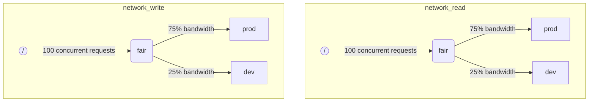

When ClickHouse execute multiple queries simultaneously, they may be using shared resources (e.g. disks). Scheduling constraints and policies can be applied to regulate how resources are utilized and shared between different workloads. For every resource a scheduling hierarchy can be configured. Hierarchy root represents a resource, while leafs are queues, holding requests that exceed resource capacity.

:::note
Currently only remote disk IO can be scheduled using described method. For CPU scheduling see settings about thread pools and [`concurrent_threads_soft_limit_num`](server-configuration-parameters/settings.md#concurrent_threads_soft_limit_num). For flexible memory limits see [Memory overcommit](settings/memory-overcommit.md)
:::

## Disk configuration {#disk-config}

To enable IO scheduling for a specific disk, you have to specify `read_resource` and/or `write_resource` in storage configuration. It says ClickHouse what resource should be used for every read and write requests with given disk. Read and write resource can refer to the same resource name, which is useful for local SSDs or HDDs. Multiple different disks also can refer to the same resource, which is useful for remote disks: if you want to be able to allow fair division of network bandwidth between e.g. "production" and "development" workloads.

Example:
```xml
<clickhouse>
    <storage_configuration>
        ...
        <disks>
            <s3>
                <type>s3</type>
                <endpoint>https://clickhouse-public-datasets.s3.amazonaws.com/my-bucket/root-path/</endpoint>
                <access_key_id>your_access_key_id</access_key_id>
                <secret_access_key>your_secret_access_key</secret_access_key>
                <read_resource>network_read</read_resource>
                <write_resource>network_write</write_resource>
            </s3>
        </disks>
        <policies>
            <s3_main>
                <volumes>
                    <main>
                        <disk>s3</disk>
                    </main>
                </volumes>
            </s3_main>
        </policies>
    </storage_configuration>
</clickhouse>
```

An alternative way to express which disks are used by a resource is SQL syntax:

```sql
CREATE RESOURCE resource_name (WRITE DISK disk1, READ DISK disk2)
```

Resource could be used for any number of disk for READ or WRITE or both for READ and WRITE. There a syntax allowing to use a resource for all the disks:

```sql
CREATE RESOURCE all_io (READ ANY DISK, WRITE ANY DISK);
```

Note that server configuration options have priority over SQL way to define resources.

## Workload markup {#workload_markup}

Queries can be marked with setting `workload` to distinguish different workloads. If `workload` is not set, than value "default" is used. Note that you are able to specify the other value using settings profiles. Setting constraints can be used to make `workload` constant if you want all queries from the user to be marked with fixed value of `workload` setting.

It is possible to assign a `workload` setting for background activities. Merges and mutations are using `merge_workload` and `mutation_workload` server settings correspondingly. These values can also be overridden for specific tables using `merge_workload` and `mutation_workload` merge tree settings

Let's consider an example of a system with two different workloads: "production" and "development".

```sql
SELECT count() FROM my_table WHERE value = 42 SETTINGS workload = 'production'
SELECT count() FROM my_table WHERE value = 13 SETTINGS workload = 'development'
```

## Resource scheduling hierarchy {#hierarchy}

From the standpoint of scheduling subsystem a resource represents a hierarchy of scheduling nodes.



**Possible node types:**
* `inflight_limit` (constraint) - blocks if either number of concurrent in-flight requests exceeds `max_requests`, or their total cost exceeds `max_cost`; must have a single child.
* `bandwidth_limit` (constraint) - blocks if current bandwidth exceeds `max_speed` (0 means unlimited) or burst exceeds `max_burst` (by default equals `max_speed`); must have a single child.
* `fair` (policy) - selects the next request to serve from one of its children nodes according to max-min fairness; children nodes can specify `weight` (default is 1).
* `priority` (policy) - selects the next request to serve from one of its children nodes according to static priorities (lower value means higher priority); children nodes can specify `priority` (default is 0).
* `fifo` (queue) - leaf of the hierarchy capable of holding requests that exceed resource capacity.

To be able to use the full capacity of the underlying resource, you should use `inflight_limit`. Note that a low number of `max_requests` or `max_cost` could lead to not full resource utilization, while too high numbers could lead to empty queues inside the scheduler, which in turn will result in policies being ignored (unfairness or ignoring of priorities) in the subtree. On the other hand, if you want to protect resources from too high utilization, you should use `bandwidth_limit`. It throttles when the amount of resource consumed in `duration` seconds exceeds `max_burst + max_speed * duration` bytes. Two `bandwidth_limit` nodes on the same resource could be used to limit peak bandwidth during short intervals and average bandwidth for longer ones.

The following example shows how to define IO scheduling hierarchies shown in the picture:

```xml
<clickhouse>
    <resources>
        <network_read>
            <node path="/">
                <type>inflight_limit</type>
                <max_requests>100</max_requests>
            </node>
            <node path="/fair">
                <type>fair</type>
            </node>
            <node path="/fair/prod">
                <type>fifo</type>
                <weight>3</weight>
            </node>
            <node path="/fair/dev">
                <type>fifo</type>
            </node>
        </network_read>
        <network_write>
            <node path="/">
                <type>inflight_limit</type>
                <max_requests>100</max_requests>
            </node>
            <node path="/fair">
                <type>fair</type>
            </node>
            <node path="/fair/prod">
                <type>fifo</type>
                <weight>3</weight>
            </node>
            <node path="/fair/dev">
                <type>fifo</type>
            </node>
        </network_write>
    </resources>
</clickhouse>
```

## Workload classifiers {#workload_classifiers}

Workload classifiers are used to define mapping from `workload` specified by a query into leaf-queues that should be used for specific resources. At the moment, workload classification is simple: only static mapping is available.

Example:
```xml
<clickhouse>
    <workload_classifiers>
        <production>
            <network_read>/fair/prod</network_read>
            <network_write>/fair/prod</network_write>
        </production>
        <development>
            <network_read>/fair/dev</network_read>
            <network_write>/fair/dev</network_write>
        </development>
        <default>
            <network_read>/fair/dev</network_read>
            <network_write>/fair/dev</network_write>
        </default>
    </workload_classifiers>
</clickhouse>
```

## Workload hierarchy (SQL only) {#workloads}

Defining resources and classifiers in XML could be challenging. ClickHouse provides SQL syntax that is much more convenient. All resources that were created with `CREATE RESOURCE` share the same structure of the hierarchy, but could differ in some aspects. Every workload created with `CREATE WORKLOAD` maintains a few automatically created scheduling nodes for every resource. A child workload can be created inside another parent workload. Here is the example that defines exactly the same hierarchy as XML configuration above:

```sql
CREATE RESOURCE network_write (WRITE DISK s3)
CREATE RESOURCE network_read (READ DISK s3)
CREATE WORKLOAD all SETTINGS max_requests = 100
CREATE WORKLOAD development IN all
CREATE WORKLOAD production IN all SETTINGS weight = 3
```

The name of a leaf workload without children could be used in query settings `SETTINGS workload = 'name'`. Note that workload classifiers are also created automatically when using SQL syntax.

To customize workload the following settings could be used:
* `priority` - sibling workloads are served according to static priority values (lower value means higher priority).
* `weight` - sibling workloads having the same static priority share resources according to weights.
* `max_requests` - the limit on the number of concurrent resource requests in this workload.
* `max_cost` - the limit on the total inflight bytes count of concurrent resource requests in this workload.
* `max_speed` - the limit on byte processing rate of this workload (the limit is independent for every resource).
* `max_burst` - maximum number of bytes that could be processed by the workload without being throttled (for every resource independently).

Note that workload settings are translated into a proper set of scheduling nodes. For more details, see the description of the scheduling node [types and options](#hierarchy).

There is no way to specify different hierarchies of workloads for different resources. But there is a way to specify different workload setting value for a specific resource:

```sql
CREATE OR REPLACE WORKLOAD all SETTINGS max_requests = 100, max_speed = 1000000 FOR network_read, max_speed = 2000000 FOR network_write
```

Also note that workload or resource could not be dropped if it is referenced from another workload. To update a definition of a workload use `CREATE OR REPLACE WORKLOAD` query.

## Workloads and resources storage {#workload_entity_storage}
Definitions of all workloads and resources in the form of `CREATE WORKLOAD` and `CREATE RESOURCE` queries are stored persistently either on disk at `workload_path` or in ZooKeeper at `workload_zookeeper_path`. ZooKeeper storage is recommended to achieve consistency between nodes. Alternatively `ON CLUSTER` clause could be used along with disk storage.

## See also
 - [system.scheduler](/docs/en/operations/system-tables/scheduler.md)
 - [system.workloads](/docs/en/operations/system-tables/workloads.md)
 - [system.resources](/docs/en/operations/system-tables/resources.md)
 - [merge_workload](/docs/en/operations/settings/merge-tree-settings.md#merge_workload) merge tree setting
 - [merge_workload](/docs/en/operations/server-configuration-parameters/settings.md#merge_workload) global server setting
 - [mutation_workload](/docs/en/operations/settings/merge-tree-settings.md#mutation_workload) merge tree setting
 - [mutation_workload](/docs/en/operations/server-configuration-parameters/settings.md#mutation_workload) global server setting
 - [workload_path](/docs/en/operations/server-configuration-parameters/settings.md#workload_path) global server setting
 - [workload_zookeeper_path](/docs/en/operations/server-configuration-parameters/settings.md#workload_zookeeper_path) global server setting
