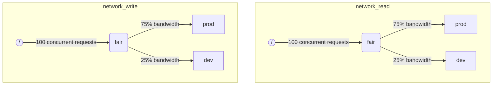

When ClickHouse execute multiple queries simultaneously, they may be using shared resources (e.g. disks). Scheduling constraints and policies can be applied to regulate how resources are utilized and shared between different workloads. For every resource a scheduling hierarchy can be configured. Hierarchy root represents a resource, while leafs are queues, holding requests that exceed resource capacity.

:::note
Currently [remote disk IO](#disk_config) and [CPU](#cpu_scheduling) can be scheduled using described method. For flexible memory limits see [Memory overcommit](settings/memory-overcommit.md)
:::

## Disk configuration {#disk_config}

To enable IO workload scheduling for a specific disk, you have to create read and write resources for WRITE and READ access:

```sql
CREATE RESOURCE resource_name (WRITE DISK disk_name, READ DISK disk_name)
-- or
CREATE RESOURCE read_resource_name (WRITE DISK write_disk_name)
CREATE RESOURCE write_resource_name (READ DISK read_disk_name)
```

Resource could be used for any number of disks for READ or WRITE or both for READ and WRITE. There is a syntax allowing to use a resource for all the disks:

```sql
CREATE RESOURCE all_io (READ ANY DISK, WRITE ANY DISK);
```

An alternative way to express which disks are used by a resource is server's `storage_configuration`:

:::warning
Workload scheduling using clickhouse configuration is deprecated. SQL syntax should be used instead.
:::

To enable IO scheduling for a specific disk, you have to specify `read_resource` and/or `write_resource` in storage configuration. It says ClickHouse what resource should be used for every read and write requests with given disk. Read and write resource can refer to the same resource name, which is useful for local SSDs or HDDs. Multiple different disks also can refer to the same resource, which is useful for remote disks: if you want to be able to allow fair division of network bandwidth between e.g. "production" and "development" workloads.

Example:
```xml
<clickhouse>
    <storage_configuration>
        ...
        <disks>
            <s3>
                <type>s3</type>
                <endpoint>https://clickhouse-public-datasets.s3.amazonaws.com/my-bucket/root-path/</endpoint>
                <access_key_id>your_access_key_id</access_key_id>
                <secret_access_key>your_secret_access_key</secret_access_key>
                <read_resource>network_read</read_resource>
                <write_resource>network_write</write_resource>
            </s3>
        </disks>
        <policies>
            <s3_main>
                <volumes>
                    <main>
                        <disk>s3</disk>
                    </main>
                </volumes>
            </s3_main>
        </policies>
    </storage_configuration>
</clickhouse>
```

Note that server configuration options have priority over SQL way to define resources.

## Workload markup {#workload_markup}

Queries can be marked with setting `workload` to distinguish different workloads. If `workload` is not set, than value "default" is used. Note that you are able to specify the other value using settings profiles. Setting constraints can be used to make `workload` constant if you want all queries from the user to be marked with fixed value of `workload` setting.

It is possible to assign a `workload` setting for background activities. Merges and mutations are using `merge_workload` and `mutation_workload` server settings correspondingly. These values can also be overridden for specific tables using `merge_workload` and `mutation_workload` merge tree settings

Let's consider an example of a system with two different workloads: "production" and "development".

```sql
SELECT count() FROM my_table WHERE value = 42 SETTINGS workload = 'production'
SELECT count() FROM my_table WHERE value = 13 SETTINGS workload = 'development'
```

## Resource scheduling hierarchy {#hierarchy}

From the standpoint of scheduling subsystem a resource represents a hierarchy of scheduling nodes.



:::warning
Workload scheduling using clickhouse configuration is deprecated. SQL syntax should be used instead. SQL syntax creates all necessary scheduling nodes automatically and the following scheduling node description should be considered as lower level implementation details, accessible through [system.scheduler](/operations/system-tables/scheduler.md) table.
:::

**Possible node types:**
* `inflight_limit` (constraint) - blocks if either number of concurrent in-flight requests exceeds `max_requests`, or their total cost exceeds `max_cost`; must have a single child.
* `bandwidth_limit` (constraint) - blocks if current bandwidth exceeds `max_speed` (0 means unlimited) or burst exceeds `max_burst` (by default equals `max_speed`); must have a single child.
* `fair` (policy) - selects the next request to serve from one of its children nodes according to max-min fairness; children nodes can specify `weight` (default is 1).
* `priority` (policy) - selects the next request to serve from one of its children nodes according to static priorities (lower value means higher priority); children nodes can specify `priority` (default is 0).
* `fifo` (queue) - leaf of the hierarchy capable of holding requests that exceed resource capacity.

To be able to use the full capacity of the underlying resource, you should use `inflight_limit`. Note that a low number of `max_requests` or `max_cost` could lead to not full resource utilization, while too high numbers could lead to empty queues inside the scheduler, which in turn will result in policies being ignored (unfairness or ignoring of priorities) in the subtree. On the other hand, if you want to protect resources from too high utilization, you should use `bandwidth_limit`. It throttles when the amount of resource consumed in `duration` seconds exceeds `max_burst + max_speed * duration` bytes. Two `bandwidth_limit` nodes on the same resource could be used to limit peak bandwidth during short intervals and average bandwidth for longer ones.

The following example shows how to define IO scheduling hierarchies shown in the picture:

```xml
<clickhouse>
    <resources>
        <network_read>
            <node path="/">
                <type>inflight_limit</type>
                <max_requests>100</max_requests>
            </node>
            <node path="/fair">
                <type>fair</type>
            </node>
            <node path="/fair/prod">
                <type>fifo</type>
                <weight>3</weight>
            </node>
            <node path="/fair/dev">
                <type>fifo</type>
            </node>
        </network_read>
        <network_write>
            <node path="/">
                <type>inflight_limit</type>
                <max_requests>100</max_requests>
            </node>
            <node path="/fair">
                <type>fair</type>
            </node>
            <node path="/fair/prod">
                <type>fifo</type>
                <weight>3</weight>
            </node>
            <node path="/fair/dev">
                <type>fifo</type>
            </node>
        </network_write>
    </resources>
</clickhouse>
```

## Workload classifiers {#workload_classifiers}

:::warning
Workload scheduling using clickhouse configuration is deprecated. SQL syntax should be used instead. Classifiers are created automatically when using SQL syntax.
:::

Workload classifiers are used to define mapping from `workload` specified by a query into leaf-queues that should be used for specific resources. At the moment, workload classification is simple: only static mapping is available.

Example:
```xml
<clickhouse>
    <workload_classifiers>
        <production>
            <network_read>/fair/prod</network_read>
            <network_write>/fair/prod</network_write>
        </production>
        <development>
            <network_read>/fair/dev</network_read>
            <network_write>/fair/dev</network_write>
        </development>
        <default>
            <network_read>/fair/dev</network_read>
            <network_write>/fair/dev</network_write>
        </default>
    </workload_classifiers>
</clickhouse>
```

## Workload hierarchy {#workloads}

ClickHouse provides convenient SQL syntax to define scheduling hierarchy. All resources that were created with `CREATE RESOURCE` share the same structure of the hierarchy, but could differ in some aspects. Every workload created with `CREATE WORKLOAD` maintains a few automatically created scheduling nodes for every resource. A child workload can be created inside another parent workload. Here is the example that defines exactly the same hierarchy as XML configuration above:

```sql
CREATE RESOURCE network_write (WRITE DISK s3)
CREATE RESOURCE network_read (READ DISK s3)
CREATE WORKLOAD all SETTINGS max_io_requests = 100
CREATE WORKLOAD development IN all
CREATE WORKLOAD production IN all SETTINGS weight = 3
```

The name of a leaf workload without children could be used in query settings `SETTINGS workload = 'name'`.

To customize workload the following settings could be used:
* `priority` - sibling workloads are served according to static priority values (lower value means higher priority).
* `weight` - sibling workloads having the same static priority share resources according to weights.
* `max_io_requests` - the limit on the number of concurrent IO requests in this workload.
* `max_bytes_inflight` - the limit on the total inflight bytes for concurrent requests in this workload.
* `max_bytes_per_second` - the limit on byte read or write rate of this workload.
* `max_burst_bytes` - maximum number of bytes that could be processed by the workload without being throttled (for every resource independently).
* `max_concurrent_threads` - the limit on the number of threads for queries in this workload.

All limits specified through workload settings are independent for every resource. For example workload with `max_bytes_per_second = 10485760` will have 10 MB/s bandwidth limit for every read and write resource independently. If common limit for reading and writing is required, consider using the same resource for READ and WRITE access.

There is no way to specify different hierarchies of workloads for different resources. But there is a way to specify different workload setting value for a specific resource:

```sql
CREATE OR REPLACE WORKLOAD all SETTINGS max_io_requests = 100, max_bytes_per_second = 1000000 FOR network_read, max_bytes_per_second = 2000000 FOR network_write
```

Also note that workload or resource could not be dropped if it is referenced from another workload. To update a definition of a workload use `CREATE OR REPLACE WORKLOAD` query.

:::note
Workload settings are translated into a proper set of scheduling nodes. For lower-level details, see the description of the scheduling node [types and options](#hierarchy).
:::

## CPU scheduling {#cpu_scheduling}

To enable CPU scheduling for workloads create CPU resource and set a limit for the number of concurrent threads:

```sql
CREATE RESOURCE cpu (MASTER THREAD, WORKER THREAD)
CREATE WORKLOAD all SETTINGS max_concurrent_threads = 100
```

When ClickHouse server executes many concurrent queries with [multiple threads](/operations/settings/settings.md#max_threads) and all CPU slots are in use the overload state is reached. In the overload state every released CPU slot is rescheduled to proper workload according to scheduling policies. For queries sharing the same workload, slots are allocated using round robin. For queries in separate workloads, slots are allocated according to weights, priorities, and limits specified for workloads.

CPU time is consumed by threads when they are not blocked and work on CPU-intensive tasks. For scheduling purpose, two kinds of threads are distinguished:
* Master thread — the first thread that starts working on a query or background activity like a merge or a mutation.
* Worker thread — the additional threads that master can spawn to work on CPU-intensive tasks.

It may be desirable to use separate resources for master and worker threads to achieve better responsiveness. A high number of worker threads can easily monopolize CPU resource when high `max_threads` query setting values are used. Then incoming queries should block and wait a CPU slot for its master thread to start execution. To avoid this the following configuration could be used:

```sql
CREATE RESOURCE worker_cpu (WORKER THREAD)
CREATE RESOURCE master_cpu (MASTER THREAD)
CREATE WORKLOAD all SETTINGS max_concurrent_threads = 100 FOR worker_cpu, max_concurrent_threads = 1000 FOR master_cpu
```

It will create separate limits on master and worker threads. Even if all 100 worker CPU slots are busy, new queries will not be blocked until there are available master CPU slots. They will start execution with one thread. Later if worker CPU slots became available, such queries could upscale and spawn their worker threads. On the other hand, such an approach does not bind the total number of slots to the number of CPU processors, and running too many concurrent threads will affect performance.

Limiting the concurrency of master threads will not limit the number of concurrent queries. CPU slots could be released in the middle of the query execution and reacquired by other threads. For example, 4 concurrent queries with 2 concurrent master thread limit could all be executed in parallel. In this case, every query will receive 50% of a CPU processor. A separate logic should be used to limit the number of concurrent queries and it is not currently supported for workloads.

Separate thread concurrency limits could be used for workloads:

```sql
CREATE RESOURCE cpu (MASTER THREAD, WORKER THREAD)
CREATE WORKLOAD all
CREATE WORKLOAD admin IN all SETTINGS max_concurrent_threads = 10
CREATE WORKLOAD production IN all SETTINGS max_concurrent_threads = 100
CREATE WORKLOAD analytics IN production SETTINGS max_concurrent_threads = 60, weight = 9
CREATE WORKLOAD ingestion IN production
```

This configuration example provides independent CPU slot pools for admin and production. The production pool is shared between analytics and ingestion. Furthermore, if the production pool is overloaded, 9 of 10 released slots will be rescheduled to analytical queries if necessary. The ingestion queries would only receive 1 of 10 slots during overload periods. This might improve the latency of user-facing queries. Analytics has its own limit of 60 concurrent thread, always leaving at least 40 threads to support ingestion. When there is no overload, ingestion could use all 100 threads.

To exclude a query from CPU scheduling set a query setting [use_concurrency_control](/operations/settings/settings.md/#use_concurrency_control) to 0.

CPU scheduling is not supported for merges and mutations yet.

:::warning
Slot scheduling provides a way to control [query concurrency](/operations/settings/settings.md#max_threads) but does not guarantee fair CPU time allocation yet. This requires further development of CPU slot preemption and will be supported later.
:::

:::note
Declaring CPU resource disables effect of [`concurrent_threads_soft_limit_num`](server-configuration-parameters/settings.md#concurrent_threads_soft_limit_num) and [`concurrent_threads_soft_limit_ratio_to_cores`](server-configuration-parameters/settings.md#concurrent_threads_soft_limit_ratio_to_cores) settings. Instead, workload setting `max_concurrent_threads` is used to limit the number of CPUs allocated for a specific workload. To achieve the previous behavior create only WORKER THREAD resource, set `max_concurrent_threads` for the workload `all` to the same value as `concurrent_threads_soft_limit_num` and use `workload = "all"` query setting. This configuration corresponds to [`concurrent_threads_scheduler`](server-configuration-parameters/settings.md#concurrent_threads_scheduler) setting set "fair_round_robin" value.
:::

## Query slot scheduling {#query_scheduling}

To enable query slot scheduling for workloads create QUERY resource and set a limit for the number of concurrent queries or queries per second:

```sql
CREATE RESOURCE query (QUERY)
CREATE WORKLOAD all SETTINGS max_concurrent_queries = 100, max_queries_per_second = 10, max_burst_queries = 20
```

Workload setting `max_concurrent_queries` limits the number of concurrent queries that could run simultaneously for a given workload. This is analog of query [`max_concurrent_queries_for_all_users`](/operations/settings/settings#max_concurrent_queries_for_all_users) and server [max_concurrent_queries](/operations/server-configuration-parameters/settings#max_concurrent_queries) settings. Async insert queries and some specific queries like KILL are not counted towards the limit.

Workload settings `max_queries_per_second` and `max_burst_queries` limits number of queries for the workload with a token bucket throttler. It guarantees that during any time interval `T` no more than `max_queries_per_second * T + max_burst_queries` new queries will start execution.

:::note
Blocked queries will wait indefinitely and not appear in `SHOW PROCESSLIST` until all constraints are satisfied.
:::

## Workloads and resources storage {#workload_entity_storage}

Definitions of all workloads and resources in the form of `CREATE WORKLOAD` and `CREATE RESOURCE` queries are stored persistently either on disk at `workload_path` or in ZooKeeper at `workload_zookeeper_path`. ZooKeeper storage is recommended to achieve consistency between nodes. Alternatively `ON CLUSTER` clause could be used along with disk storage.

## Strict resource access {#strict_resource_access}

To enforce all queries to follow resource scheduling policies there is a server setting `throw_on_unknown_workload`. If it is set to `true` then every query is required to use valid `workload` query setting, otherwise `RESOURCE_ACCESS_DENIED` exception is thrown. If it is set to `false` then such a query does not use resource scheduler, i.e. it will get unlimited access to any `RESOURCE`.

:::note
Do not set `throw_on_unknown_workload` to `true` unless `CREATE WORKLOAD default` is executed. It could lead to server startup issues if a query without explicit setting `workload` is executed during startup.
:::

## See also {#see-also}
 - [system.scheduler](/operations/system-tables/scheduler.md)
 - [system.workloads](/operations/system-tables/workloads.md)
 - [system.resources](/operations/system-tables/resources.md)
 - [merge_workload](/operations/settings/merge-tree-settings.md#merge_workload) merge tree setting
 - [merge_workload](/operations/server-configuration-parameters/settings.md#merge_workload) global server setting
 - [mutation_workload](/operations/settings/merge-tree-settings.md#mutation_workload) merge tree setting
 - [mutation_workload](/operations/server-configuration-parameters/settings.md#mutation_workload) global server setting
 - [workload_path](/operations/server-configuration-parameters/settings.md#workload_path) global server setting
 - [workload_zookeeper_path](/operations/server-configuration-parameters/settings.md#workload_zookeeper_path) global server setting
