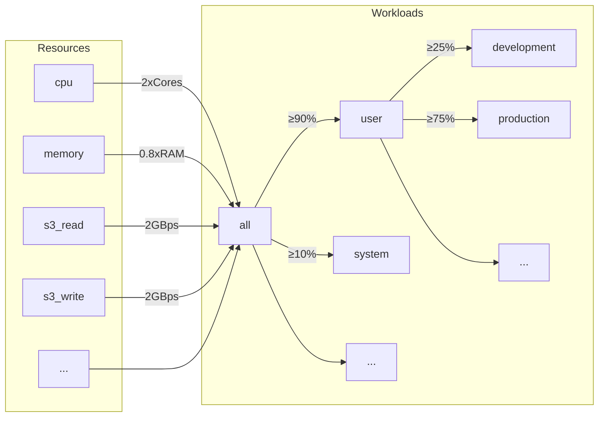
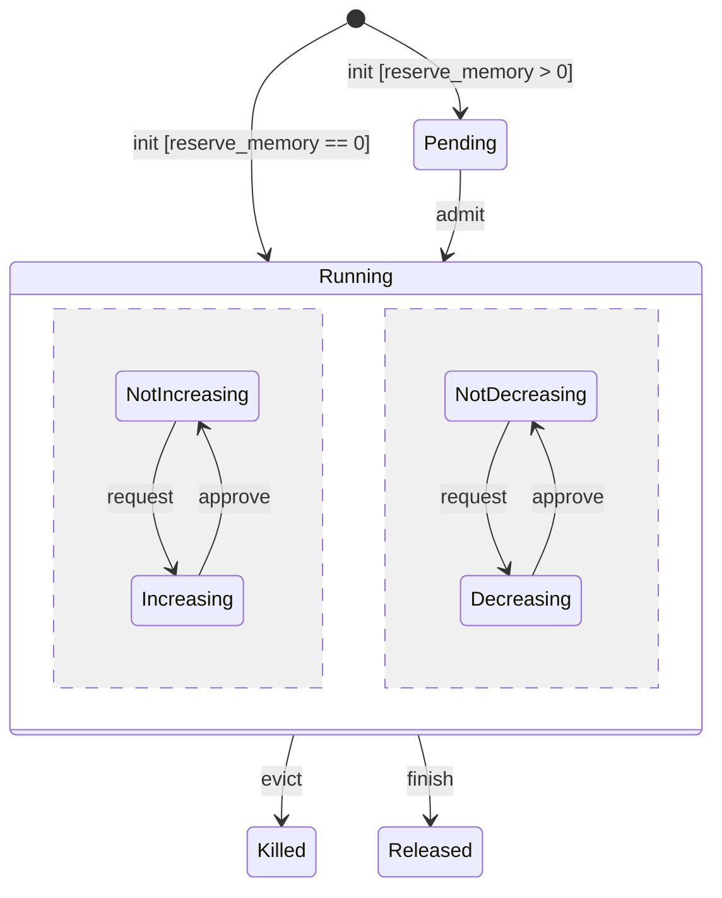
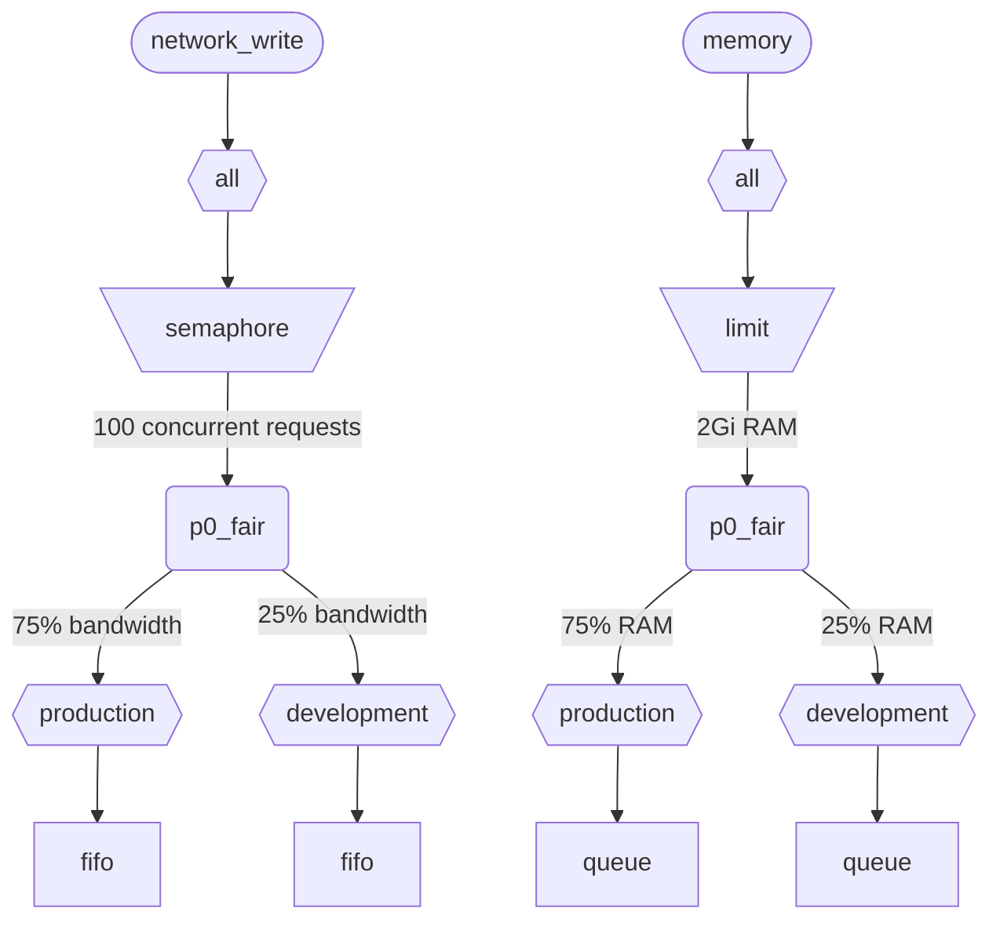

When ClickHouse executes multiple queries simultaneously, they use shared resources (CPU, Memory and IO). Scheduling constraints and policies can be applied to regulate how resources are utilized and shared between different workloads. For all resources, a common scheduling hierarchy can be configured. The hierarchy root represents shared resources, while leaves are specific workloads, holding resource requests and allocations of specific queries and background activities.

## Resources {#resources}

By default, workload scheduling is disabled. To enable it you have to create resources that will be used for scheduling and at least one workload. All resources are independent and could be used in any combination.

To enable CPU scheduling, you have to create CPU resource for MASTER or WORKER threads (see [CPU scheduling](#cpu_scheduling) for details):

```sql
CREATE RESOURCE cpu (MASTER THREAD, WORKER THREAD)
```

To enable memory reservation for workloads, you have to create MEMORY resource (see [Memory reservations](#memory_reservations) for details):

```sql
CREATE RESOURCE memory (MEMORY RESERVATION)
```

To enable query slot scheduling, you have to create QUERY resource (see [Query slot scheduling](#query_scheduling) for details):

```sql
CREATE RESOURCE query (QUERY)
```

To enable IO scheduling for a specific disk, you have to create read and write resources for WRITE and READ access:

```sql
CREATE RESOURCE resource_name (WRITE DISK disk_name, READ DISK disk_name)
-- or
CREATE RESOURCE read_resource_name (WRITE DISK write_disk_name)
CREATE RESOURCE write_resource_name (READ DISK read_disk_name)
```

A resource can be used for any number of disks for READ or WRITE or both for READ and WRITE. There is a syntax allowing to use a resource for all the disks:

```sql
CREATE RESOURCE all_io (READ ANY DISK, WRITE ANY DISK);
```

Resources are classified by sharing mode:
* **Time-shared resources** (CPU, IO, Query slots) - manage resource requests that are enqueued at scheduling hierarchy leafs. Requests are scheduled according to policies and constraints defined by hierarchy. Resource requests are created when a query accesses the corresponding resource. For example, when a query reads data from disk, or accesses the CPU for processing, resource requests are created for every quantum of work done or number of bytes sent or received through a socket.
* **Space-shared resources** (Memory) - manage resource allocations at scheduling hierarchy leafs. Allocations could be running or pending. Pending allocations are blocked until enough space is freed or other allocation is evicted (killed). Decisions are based on limits and policies defined by the hierarchy. There is one-to-one correspondence between allocations and queries (or background activities). An allocation is created when a query starts execution and is released when it finishes. Running allocations can increase or decrease their size dynamically.

## Workload hierarchy {#workloads}

ClickHouse provides convenient SQL syntax to define scheduling hierarchy. All resources are distributed across a common WORKLOAD hierarchy. Distribution rules may be altered in some aspects for particular resources, but the hierarchy is the same. Every WORKLOAD maintains necessary scheduling nodes for every resource. A child workload can be created inside any workload building the hierarchy. ClickHouse does not enforce any specific or predefined structure of workload hierarchy.

Here is an example of a hierarchy that divides all resources between "user" and "system" workloads with a guarantee of 90% and 10% correspondingly. Note that weights defined for workloads are used for max-min fairness and thus only provide best-effort guarantee from below (not a limit or quota from above). All the scheduling is done on every host independently and thus limits defined by `max_*` settings are per host. Workload "user" subdivides its resources between "development" and "production" workloads with "production" having 3 times more resources than "development":

```sql
CREATE RESOURCE cpu (MASTER THREAD, WORKER THREAD)
CREATE RESOURCE memory (MEMORY RESERVATION)
CREATE RESOURCE s3_read (READ DISK s3)
CREATE RESOURCE s3_write (WRITE DISK s3)
CREATE WORKLOAD all SETTINGS SETTINGS max_concurrent_threads_ratio_to_cores = 2, max_memory_ratio = 0.8, max_bytes_per_second = '2Gi'
CREATE WORKLOAD user IN all SETTINGS weight = 9
CREATE WORKLOAD system IN all
CREATE WORKLOAD development IN all
CREATE WORKLOAD production IN all SETTINGS weight = 3
```



The name of a leaf workload without children can be used in query settings `SETTINGS workload = 'name'`. See [Workload markup](#workload_markup) for details.

To customize workload the following settings could be used:
* `priority` - (time-shared only) sibling workloads are served according to static values (lower value means higher priority). Drives preemption.
* `precedence` - (space-shared only) sibling workloads are admitted according to static values (lower value means higher precedence). Drives eviction and admission.
* `weight` - sibling workloads having the same static priority or precedence share resources according to weights in a fair manner. Affects preemption, eviction and admission.
* `max_io_requests` - the limit on the number of concurrent IO requests in this workload.
* `max_bytes_inflight` - the limit on the total inflight bytes for concurrent requests in this workload.
* `max_bytes_per_second` - the limit on byte read or write rate of this workload.
* `max_burst_bytes` - the maximum number of bytes that could be processed by the workload without being throttled (for every resource independently).
* `max_concurrent_threads` - the limit on the number of threads for queries in this workload.
* `max_concurrent_threads_ratio_to_cores` - the same as `max_concurrent_threads`, but normalized to the number of available CPU cores.
* `max_cpus` - the limit on the number of CPU cores to serve queries in this workload.
* `max_cpu_share` - the same as `max_cpus`, but normalized to the number of available CPU cores.
* `max_burst_cpu_seconds` - the maximum number of CPU seconds that could be consumed by the workload without being throttled due to `max_cpus`.
* `max_memory` - the limit on the total memory reserved for this workload.

All limits specified through workload settings are independent for every resource. For example workload with `max_bytes_per_second = '10Mi'` will have 10 MB/s bandwidth limit for every read and write resource independently. If common limit for reading and writing is required, consider using the same resource for READ and WRITE access.

There is no way to specify different hierarchies of workloads for different resources. But there is a way to specify different workload setting value for a specific resource:

```sql
CREATE OR REPLACE WORKLOAD all SETTINGS max_io_requests = 100, max_bytes_per_second = '1Mi' FOR network_read, max_bytes_per_second = '2Mi' FOR network_write
```

Also note that workload or resource could not be dropped if it is referenced from another workload. To update a definition of a workload use `CREATE OR REPLACE WORKLOAD` query.

:::note
Workload settings are translated into a proper set of scheduling nodes. For lower-level details, see the description of the scheduling node [types and options](#hierarchy).
:::

## Workload markup {#workload_markup}

Queries can be marked with setting `workload` to distinguish different workloads. If `workload` is not set, then the value "default" is used. Note that you are able to specify the other value using settings profiles. Setting constraints can be used to make `workload` constant if you want all queries from the user to be marked with fixed value of `workload` setting.

:::warning
Query setting `workload` can only refer to leaf workloads (i.e. workloads without children).
:::

```sql
SELECT count() FROM my_table WHERE value = 42 SETTINGS workload = 'production'
SELECT count() FROM my_table WHERE value = 13 SETTINGS workload = 'development'
```

It is possible to assign a `workload` setting for background activities. Merges and mutations use `merge_workload` and `mutation_workload` server settings correspondingly. These values can also be overridden for specific tables using `merge_workload` and `mutation_workload` merge tree settings.

## CPU scheduling {#cpu_scheduling}

To enable CPU scheduling for workloads create CPU resource and set a limit for the number of concurrent threads:

```sql
CREATE RESOURCE cpu (MASTER THREAD, WORKER THREAD)
CREATE WORKLOAD all SETTINGS max_concurrent_threads = 100
```

When ClickHouse server executes many concurrent queries with [multiple threads](/operations/settings/settings.md#max_threads) and all CPU slots are in use the overload state is reached. In the overload state every released CPU slot is rescheduled to proper workload according to scheduling policies. For queries sharing the same workload, slots are allocated using round-robin. For queries in separate workloads, slots are allocated according to weights, priorities, and limits specified for workloads.

CPU time is consumed by threads when they are not blocked and work on CPU-intensive tasks. For scheduling purpose, two kinds of threads are distinguished:
* Master thread — the first thread that starts working on a query or background activity like a merge or a mutation.
* Worker thread — the additional threads that master can spawn to work on CPU-intensive tasks.

It may be desirable to use separate resources for master and worker threads to achieve better responsiveness. A high number of worker threads can easily monopolize CPU resource when high `max_threads` query setting values are used. Then incoming queries should block and wait for a CPU slot so their master threads can start execution. To avoid this the following configuration could be used:

```sql
CREATE RESOURCE worker_cpu (WORKER THREAD)
CREATE RESOURCE master_cpu (MASTER THREAD)
CREATE WORKLOAD all SETTINGS max_concurrent_threads = 100 FOR worker_cpu, max_concurrent_threads = 1000 FOR master_cpu
```

It will create separate limits on master and worker threads. Even if all 100 worker CPU slots are busy, new queries will not be blocked until there are available master CPU slots. They will start execution with one thread. Later, if worker CPU slots become available, such queries could upscale and spawn their worker threads. On the other hand, such an approach does not bind the total number of slots to the number of CPU processors, and running too many concurrent threads will affect performance.

Limiting the concurrency of master threads will not limit the number of concurrent queries. CPU slots could be released in the middle of the query execution and reacquired by other threads. For example, 4 concurrent queries with 2 concurrent master thread limit could all be executed in parallel. In this case, every query will receive 50% of a CPU processor. A separate logic should be used to limit the number of concurrent queries and it is not currently supported for workloads.

Separate thread concurrency limits could be used for workloads:

```sql
CREATE RESOURCE cpu (MASTER THREAD, WORKER THREAD)
CREATE WORKLOAD all
CREATE WORKLOAD admin IN all SETTINGS max_concurrent_threads = 10
CREATE WORKLOAD production IN all SETTINGS max_concurrent_threads = 100
CREATE WORKLOAD analytics IN production SETTINGS max_concurrent_threads = 60, weight = 9
CREATE WORKLOAD ingestion IN production
```

This configuration example provides independent CPU slot pools for admin and production. The production pool is shared between analytics and ingestion. Furthermore, if the production pool is overloaded, 9 of 10 released slots will be rescheduled to analytical queries if necessary. The ingestion queries would only receive 1 of 10 slots during overload periods. This might improve the latency of user-facing queries. Analytics has its own limit of 60 concurrent threads, always leaving at least 40 threads to support ingestion. When there is no overload, ingestion could use all 100 threads.

To exclude a query from CPU scheduling set a query setting [use_concurrency_control](/operations/settings/settings.md/#use_concurrency_control) to 0.

CPU scheduling is not supported for merges and mutations yet.

To provide fair allocations for workload it is necessary to perform preemption and down-scaling during query execution. Preemption is enabled with `cpu_slot_preemption` server setting. If it is enabled, every thread renews its CPU slot periodically (according to `cpu_slot_quantum_ns` server setting). Such a renewal can block execution if CPU is overloaded. When execution is blocked for a prolonged time (see `cpu_slot_preemption_timeout_ms` server setting), the query scales down and the number of concurrently running threads decreases dynamically. Note that CPU time fairness is guaranteed between workloads, but between queries inside the same workload it might be violated in some corner cases.

:::warning
Slot scheduling provides a way to control [query concurrency](/operations/settings/settings.md#max_threads) but does not guarantee fair CPU time allocation unless server setting `cpu_slot_preemption` is set to `true`, otherwise fairness is provided based on number of CPU slot allocations among competing workloads. It does not imply equal amount of CPU seconds because without preemption CPU slot may be held indefinitely. A thread acquires a slot at the beginning and release when work is done.
:::

:::note
Declaring CPU resource disables effect of [`concurrent_threads_soft_limit_num`](server-configuration-parameters/settings.md#concurrent_threads_soft_limit_num) and [`concurrent_threads_soft_limit_ratio_to_cores`](server-configuration-parameters/settings.md#concurrent_threads_soft_limit_ratio_to_cores) settings. Instead, workload setting `max_concurrent_threads` is used to limit the number of CPUs allocated for a specific workload. To achieve the previous behavior create only WORKER THREAD resource, set `max_concurrent_threads` for the workload `all` to the same value as `concurrent_threads_soft_limit_num` and use `workload = "all"` query setting. This configuration corresponds to [`concurrent_threads_scheduler`](server-configuration-parameters/settings.md#concurrent_threads_scheduler) setting set "fair_round_robin" value.
:::

## Threads vs. CPUs {#threads_vs_cpus}

There are two ways to control CPU consumption of a workload:
* Thread number limit: `max_concurrent_threads` and `max_concurrent_threads_ratio_to_cores`
* CPU throttling: `max_cpus`, `max_cpu_share` and `max_burst_cpu_seconds`

:::warning
CPU throttling settings are active only if `cpu_slot_preemption` server setting is enabled and ignored otherwise.
:::

The first allows one to dynamically control how many threads are spawned for a query, depending on the current server load. It effectively lowers what `max_threads` query setting dictates. The second throttles CPU consumption of the workload using token bucket algorithm. It does not affect thread number directly, but throttles the total CPU consumption of all threads in the workload.

Token bucket throttling with `max_cpus` and `max_burst_cpu_seconds` means the following. During any interval of `delta` seconds, the total CPU consumption by all queries in the workload is not allowed to be greater than `max_cpus * delta + max_burst_cpu_seconds` CPU seconds. It limits average consumption by `max_cpus` in long-term, but this limit might be exceeded in short-term. For example, given `max_burst_cpu_seconds = 60` and `max_cpus=0.001`, one is allowed to run either 1 thread for 60 seconds or 2 threads for 30 seconds or 60 threads for 1 second without being throttled. Default value for `max_burst_cpu_seconds` is 1 second. Lower values may lead to under-utilization of allowed `max_cpus` cores given many concurrent threads.

While holding a CPU slot, a thread can be in one of three main states:
* **Running:** Effectively consuming CPU resource. Time spent in this state is accounted for by CPU throttling.
* **Ready:** Waiting for a CPU to become available. Time spent in this state is not accounted for by CPU throttling.
* **Blocked:** Performing IO operations or other blocking syscalls (e.g. waiting on a mutex). Time spent in this state is not accounted for by CPU throttling.

Let's consider an example of configuration that combines both CPU throttling and thread number limits:

```sql
CREATE RESOURCE cpu (MASTER THREAD, WORKER THREAD)
CREATE WORKLOAD all SETTINGS max_concurrent_threads_ratio_to_cores = 2
CREATE WORKLOAD admin IN all SETTINGS max_concurrent_threads = 2, priority = -1
CREATE WORKLOAD production IN all SETTINGS weight = 4
CREATE WORKLOAD analytics IN production SETTINGS max_cpu_share = 0.7, weight = 3
CREATE WORKLOAD ingestion IN production
CREATE WORKLOAD development IN all SETTINGS max_cpu_share = 0.3
```

Here we limit the total number of threads for all queries to be x2 of the available CPUs. Admin workload is limited to exactly two threads at most, regardless of the number of available CPUs. Admin has priority -1 (less than default 0) and it gets any CPU slot first if required. When the admin does not run queries, CPU resources are divided among production and development workloads. Guaranteed shares of CPU time are based on weights (4 to 1): At least 80% goes to production (if required), and at least 20% goes to development (if required). While weights form guarantees, CPU throttling forms limits: production is not limited and can consume 100%, while development has a limit of 30%, which is applied even if there are no queries from other workloads. Production workload is not a leaf, so its resources are split among analytics and ingestion according to weights (3 to 1). It means that analytics has a guarantee of at least 0.8 * 0.75 = 60%, and based on `max_cpu_share`, it has a limit of 70% of total CPU resources. While ingestion is left with a guarantee of at least 0.8 * 0.25 = 20%, it has no upper limit.

:::note
If you want to maximize CPU utilization on your ClickHouse server, avoid using `max_cpus` and `max_cpu_share` for the root workload `all`. Instead, set a higher value for `max_concurrent_threads`. For example, on a system with 8 CPUs, set `max_concurrent_threads = 16`. This allows 8 threads to run CPU tasks while 8 other threads can handle I/O operations. Additional threads will create CPU pressure, ensuring scheduling rules are enforced. In contrast, setting `max_cpus = 8` will never create CPU pressure because the server cannot exceed the 8 available CPUs.
:::

## Memory reservations {#memory_reservations}

To enable memory reservations for workloads create MEMORY RESERVATION resource and set at least one limit for the total memory reserved using workload settings:

```sql
CREATE RESOURCE memory (MEMORY RESERVATION)
CREATE WORKLOAD all SETTINGS max_memory = '2Gi'
```

ClickHouse tracks memory allocations of all queries and background activities. The number of allocated bytes is aggregated through the scheduling hierarchy up to the root. Every query has an associated allocation in the leaf workload it belongs to. If a query has the `reserve_memory` setting greater than zero, then the allocation is created in a pending state. Pending allocation reserves requested amount of memory in the workload hierarchy. If there is not enough memory available, the allocation remains pending until enough memory is freed or other allocations are evicted (killed). When allocation is admitted, it becomes running. Running allocation could increase or decrease its size dynamically according to memory consumption of the query. Allocation life-cycle can be depicted with the following state diagram:



Pending allocations of a leaf workload are admitted according to FIFO order. When multiple workloads have pending allocations, they are admitted according to precedence and weight settings. Higher precedence workloads are served first. Sibling workloads with the same precedence share memory according to weights in a max-min fair manner, which means that workload with lower normalized memory usage (current usage plus requested increase divided by weight) is served first. The reverse logic is applied during eviction. When memory needs to be freed, workloads with lower precedence and higher normalized memory usage are evicted first.

Note that time-shared resources use priority, while space-shared resources use precedence. They are independent settings and could be set to different values. Higher priority implies non-destructive preemption (delay or throttling), while higher precedence may imply destructive eviction (stops with an error). A workload could have high priority for CPU scheduling, but the same precedence for memory reservation to avoid evicting other workloads and losing work that was already done by them.

Every workload with a `max_memory` limit ensures that the total memory allocated in its subtree does not exceed the limit. If a pending or increasing allocation would exceed the limit, eviction procedure is initiated to free memory. Eviction procedure selects a victim to be killed. The least common ancestor workload of killer and victim prevents eviction in the following situations:
* Pending allocation cannot evict running allocations in the same workload. (Killer and victim workloads coincide).
* Pending allocation of lower precedence never kills workload of higher precedence.
* Pending allocation cannot kill an allocation of the same precedence. Note that running allocations of the same precedence may evict each other based on normalized memory usage.
If eviction is prevented or does not free enough memory, the new allocation is blocked until enough memory is freed. These rules allow queueing of excessive queries based on memory pressure and provide a convenient way to avoid MEMORY_LIMIT_EXCEEDED errors.

:::note
Workload limits are independent from other ways to limit memory consumption like [max_memory_usage](/operations/settings/settings.md#max_memory_usage) query setting. They could be used together to achieve better control over memory consumption. It is possible to set independent memory limits based on users (not workloads). This is less flexible and does not provide features like memory reservation and queueing of pending queries. See [Memory overcommit](settings/memory-overcommit.md)
:::

Workload setting `max_waiting_queries` limits the number of pending allocations for the workload. When the limit is reached, the server returns an error `SERVER_OVERLOADED`.

Memory reservation scheduling is not supported for merges and mutations yet.

Only queries with the `reserve_memory` setting greater than zero are subject to blocking while waiting for memory reservation. However, queries with zero `reserve_memory` are also accounted for in their workload memory footprint, and they can be evicted if necessary to free memory for other pending or increasing allocations. Queries without proper workload markup are not subject to memory reservation scheduling and cannot be evicted by the scheduler.

To provide non-elastic memory reservation for a query, set both `reserve_memory` and `max_memory_usage` query settings to the same value. In this case, the query will reserve fixed amount of memory and will not be able to increase its allocation dynamically. Note that elastic memory reservation can be increased above `reserve_memory` up to `max_memory_usage` without being killed unless there is memory pressure. But it cannot be decreased below `reserve_memory` even when actual consumption is lower.

Let's consider an example of configuration:

```sql
CREATE RESOURCE memory (MEMORY RESERVATION)
CREATE WORKLOAD all SETTINGS max_memory = '10Gi'
CREATE WORKLOAD system IN all SETTINGS weight = 1
CREATE WORKLOAD user IN all SETTINGS weight = 9
CREATE WORKLOAD production IN user SETTINGS precedence = 1, weight = 3
CREATE WORKLOAD staging IN user SETTINGS precedence = 1, weight = 1
CREATE WORKLOAD testing IN user SETTINGS precedence = 2
```

In this example, the total memory reserved by all queries and background activities cannot exceed 10 GiB. The system workload has a guarantee of at least 1 GiB (10% of 10 GiB), while the user workload has a guarantee of at least 9 GiB (90% of 10 GiB). Inside the user workload, production and staging workloads share memory according to weights (3 to 1) with equal precedence of 1. Testing workload has precedence 2, which is lower than production and staging. Therefore, testing workload can only use memory that is not used by production and staging.

If memory pressure arises, testing workload allocations will be evicted first. Then, if more memory needs to be freed, staging workload allocations will be evicted before production workload allocations if they exceed their guarantees. Note that pending queries in production and staging can evict running allocations in testing workload to free memory, but they cannot evict each other because they have the same precedence. In case of memory pressure, they will wait in queues, which allows the system to avoid MEMORY_LIMIT_EXCEEDED errors due to too many concurrently executing queries.

Note that system workload has precedence 0 (default), which is higher than production, staging and testing workloads, but they are not sibling workload. The least common ancestor is workload all, both children of which has equal precedence. So pending system workload cannot evict any of them, and vice versa. This ensures that system activities cannot easily be evicted.

## Query slot scheduling {#query_scheduling}

To enable query slot scheduling for workloads create QUERY resource and set a limit for the number of concurrent queries or queries per second:

```sql
CREATE RESOURCE query (QUERY)
CREATE WORKLOAD all SETTINGS max_concurrent_queries = 100, max_queries_per_second = 10, max_burst_queries = 20
```

Workload setting `max_concurrent_queries` limits the number of concurrent queries that could run simultaneously for a given workload. This is analog of query [`max_concurrent_queries_for_all_users`](/operations/settings/settings#max_concurrent_queries_for_all_users) and server [max_concurrent_queries](/operations/server-configuration-parameters/settings#max_concurrent_queries) settings. Async insert queries and some specific queries like KILL are not counted towards the limit.

Workload settings `max_queries_per_second` and `max_burst_queries` limit the number of queries for the workload using a token bucket throttler. It guarantees that during any time interval `T` no more than `max_queries_per_second * T + max_burst_queries` new queries will start execution.

Workload setting `max_waiting_queries` limits the number of waiting queries for the workload. When the limit is reached, the server returns an error `SERVER_OVERLOADED`.

:::note
Blocked queries will wait indefinitely and do not appear in `SHOW PROCESSLIST` until all constraints are satisfied.
:::

## Workloads and resources storage {#workload_entity_storage}

Definitions of all workloads and resources in the form of `CREATE WORKLOAD` and `CREATE RESOURCE` queries are stored persistently either on disk at `workload_path` or in ZooKeeper at `workload_zookeeper_path`. ZooKeeper storage is recommended to achieve consistency between nodes. Alternatively `ON CLUSTER` clause could be used along with disk storage.

## Configuration-based workloads and resources {#config_based_workloads}

In addition to SQL-based definitions, workloads and resources can be predefined in the server configuration file. This is useful in cloud environments where some limitations are dictated by infrastructure, while other limits could be changed by customers. Configuration-based entities have priority over SQL-defined ones and cannot be modified or deleted using SQL commands.

### Configuration format {#config_based_workloads_format}

```xml
<clickhouse>
    <resources_and_workloads>
        RESOURCE memory (MEMORY RESERVATION);
        RESOURCE s3disk_read (READ DISK s3);
        RESOURCE s3disk_write (WRITE DISK s3);
        WORKLOAD all SETTINGS max_memory = '2Gi', max_io_requests = 500 FOR s3disk_read, max_io_requests = 1000 FOR s3disk_write, max_bytes_per_second = '1280Mi' FOR s3disk_read, max_bytes_per_second = '3200Mi' FOR s3disk_write;
        WORKLOAD production IN all SETTINGS weight = 3;
    </resources_and_workloads>
</clickhouse>
```

The configuration uses the same SQL syntax as `CREATE WORKLOAD` and `CREATE RESOURCE` statements. All queries must be valid.

### Usage recommendations {#config_based_workloads_usage_recommendations}

For cloud environments, a typical setup might include:

1. Define root workload and network IO resources in configuration to set infrastructure limits
2. Set `throw_on_unknown_workload` to enforce these limits
3. Create a `CREATE WORKLOAD default IN all` to automatically apply limits to all queries (since the default value for `workload` query setting is 'default')
4. Allow users to create additional workloads within the configured hierarchy

This ensures that all background activities and queries respect the infrastructure limitations while still allowing flexibility for user-specific scheduling policies.

Another use case is different configuration for different nodes in a heterogeneous cluster.

## Strict resource access {#strict_resource_access}

To enforce all queries to follow resource scheduling policies there is a server setting `throw_on_unknown_workload`. If it is set to `true` then every query is required to use valid `workload` query setting, otherwise `RESOURCE_ACCESS_DENIED` exception is thrown. If it is set to `false` then such a query does not use resource scheduler, i.e. it will get unlimited access to any `RESOURCE`. Query setting 'use_concurrency_control = 0' allows query to avoid CPU scheduler and get unlimited access to CPU. To enforce CPU scheduling create a setting constraint to keep 'use_concurrency_control' read-only constant value.

:::note
Do not set `throw_on_unknown_workload` to `true` unless `CREATE WORKLOAD default` is executed. It could lead to server startup issues if a query without explicit setting `workload` is executed during startup.
:::

### Scheduling nodes hierarchy {#hierarchy}

From the standpoint of scheduling subsystem each resource represents a hierarchy of scheduling nodes. ClickHouse creates all necessary scheduling nodes automatically given WORKLOAD and RESOURCE definitions. Scheduling nodes are low-level implementation details, accessible through [system.scheduler](/operations/system-tables/scheduler.md) table.

```sql
CREATE RESOURCE network_write (WRITE DISK s3)
CREATE RESOURCE memory (MEMORY RESERVATION)
CREATE WORKLOAD all SETTINGS max_io_requests = 100, max_memory = '2Gi'
CREATE WORKLOAD development IN all
CREATE WORKLOAD production IN all SETTINGS weight = 3
```



**Time-shared node types:**
* `inflight_limit` (constraint) - blocks if either number of concurrent in-flight requests exceeds `max_requests`, or their total cost exceeds `max_cost`; must have a single child.
* `bandwidth_limit` (constraint) - blocks if current bandwidth exceeds `max_speed` (0 means unlimited) or burst exceeds `max_burst` (by default equals `max_speed`); must have a single child.
* `fair` (policy) - selects the next request to serve from one of its children nodes according to max-min fairness; children nodes may specify `weight` (default is 1).
* `priority` (policy) - selects the next request to serve from one of its children nodes according to static priorities (lower value means higher priority); children nodes should specify `priority` (default is 0).
* `fifo` (queue) - leaf of the hierarchy capable of holding requests that exceed resource capacity.

**Space-shared node types:**
* `limit` - makes sure child total allocation never exceeds a limit, initiates eviction procedure in a subtree if necessary; must have a single child.
* `fair_allocation` - enforces eviction according to max-min fairness; pending allocation never evict running; children nodes may specify `weight` (default is 1).
* `precedence_allocation` - enforces eviction according to static precedence (lower value means higher precedence); pending allocation of higher precedence evicts lower precedence allocations; children nodes should specify `precedence` (default is 0).
* `queue` - leaf of the hierarchy capable of holding running and pending allocations.

## Deprecated XML configuration {#deprecated_configuration}

An alternative way to express which disks are used by a resource is server's `storage_configuration`:

To enable IO scheduling for a specific disk, you have to specify `read_resource` and/or `write_resource` in storage configuration. It says ClickHouse what resource should be used for every read and write requests with given disk. Read and write resource can refer to the same resource name, which is useful for local SSDs or HDDs. Multiple different disks also can refer to the same resource, which is useful for remote disks: if you want to be able to allow fair division of network bandwidth between e.g. "production" and "development" workloads.

Example:
```xml
<clickhouse>
    <storage_configuration>
        ...
        <disks>
            <s3>
                <type>s3</type>
                <endpoint>https://clickhouse-public-datasets.s3.amazonaws.com/my-bucket/root-path/</endpoint>
                <access_key_id>your_access_key_id</access_key_id>
                <secret_access_key>your_secret_access_key</secret_access_key>
                <read_resource>network_read</read_resource>
                <write_resource>network_write</write_resource>
            </s3>
        </disks>
        <policies>
            <s3_main>
                <volumes>
                    <main>
                        <disk>s3</disk>
                    </main>
                </volumes>
            </s3_main>
        </policies>
    </storage_configuration>
</clickhouse>
```

Note that server configuration options have priority over SQL way to define resources.

The following example shows how to define IO scheduling hierarchies shown in the picture above:

```xml
<clickhouse>
    <resources>
        <network_read>
            <node path="/">
                <type>inflight_limit</type>
                <max_requests>100</max_requests>
            </node>
            <node path="/fair">
                <type>fair</type>
            </node>
            <node path="/fair/prod">
                <type>fifo</type>
                <weight>3</weight>
            </node>
            <node path="/fair/dev">
                <type>fifo</type>
            </node>
        </network_read>
        <network_write>
            <node path="/">
                <type>inflight_limit</type>
                <max_requests>100</max_requests>
            </node>
            <node path="/fair">
                <type>fair</type>
            </node>
            <node path="/fair/prod">
                <type>fifo</type>
                <weight>3</weight>
            </node>
            <node path="/fair/dev">
                <type>fifo</type>
            </node>
        </network_write>
    </resources>
</clickhouse>
```

To be able to use the full capacity of the underlying resource, you should use `inflight_limit`. Note that a low number of `max_requests` or `max_cost` could lead to not full resource utilization, while too high numbers could lead to empty queues inside the scheduler, which in turn will result in policies being ignored (unfairness or ignoring of priorities) in the subtree. On the other hand, if you want to protect resources from too high utilization, you should use `bandwidth_limit`. It throttles when the amount of resource consumed in `duration` seconds exceeds `max_burst + max_speed * duration` bytes. Two `bandwidth_limit` nodes on the same resource could be used to limit peak bandwidth during short intervals and average bandwidth for longer ones.

### Deprecated workload classifiers {#workload_classifiers}

Workload classifiers are used to define mapping from `workload` specified by a query into leaf-queues that should be used for specific resources. At the moment, workload classification is simple: only static mapping is available.

Example:
```xml
<clickhouse>
    <workload_classifiers>
        <production>
            <network_read>/fair/prod</network_read>
            <network_write>/fair/prod</network_write>
        </production>
        <development>
            <network_read>/fair/dev</network_read>
            <network_write>/fair/dev</network_write>
        </development>
        <default>
            <network_read>/fair/dev</network_read>
            <network_write>/fair/dev</network_write>
        </default>
    </workload_classifiers>
</clickhouse>
```

## See also {#see-also}
- [system.scheduler](/operations/system-tables/scheduler.md)
- [system.workloads](/operations/system-tables/workloads.md)
- [system.resources](/operations/system-tables/resources.md)
- [merge_workload](/operations/settings/merge-tree-settings.md#merge_workload) merge tree setting
- [merge_workload](/operations/server-configuration-parameters/settings.md#merge_workload) global server setting
- [mutation_workload](/operations/settings/merge-tree-settings.md#mutation_workload) merge tree setting
- [mutation_workload](/operations/server-configuration-parameters/settings.md#mutation_workload) global server setting
- [workload_path](/operations/server-configuration-parameters/settings.md#workload_path) global server setting
- [workload_zookeeper_path](/operations/server-configuration-parameters/settings.md#workload_zookeeper_path) global server setting
- [cpu_slot_preemption](/operations/server-configuration-parameters/settings.md#cpu_slot_preemption) global server setting
- [cpu_slot_quantum_ns](/operations/server-configuration-parameters/settings.md#cpu_slot_quantum_ns) global server setting
- [cpu_slot_preemption_timeout_ms](/operations/server-configuration-parameters/settings.md#cpu_slot_preemption_timeout_ms) global server setting