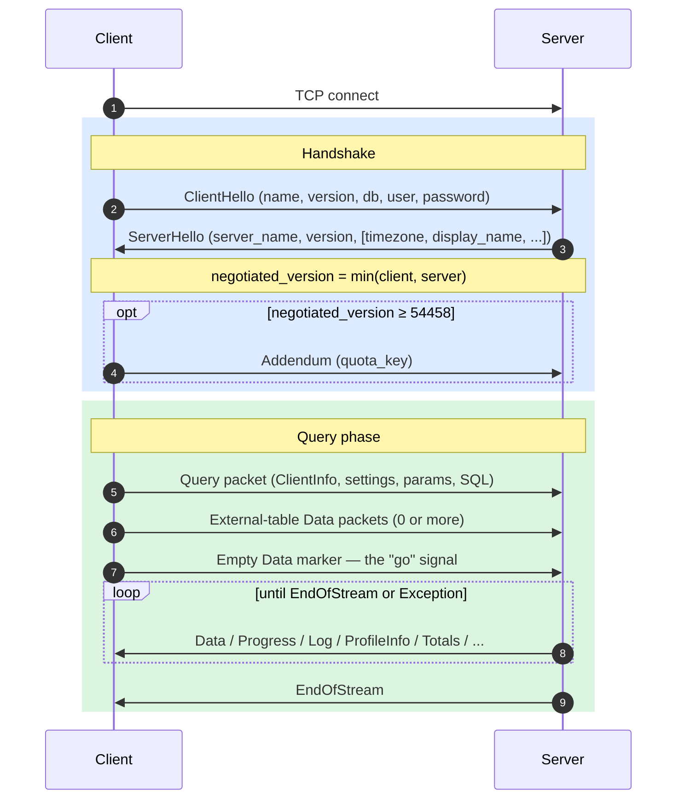
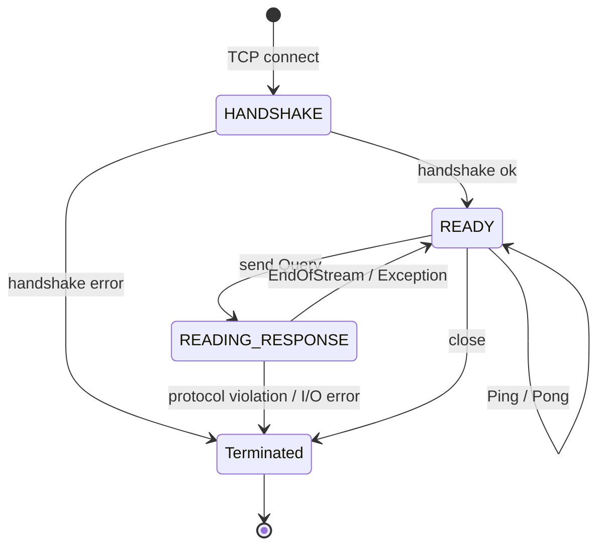
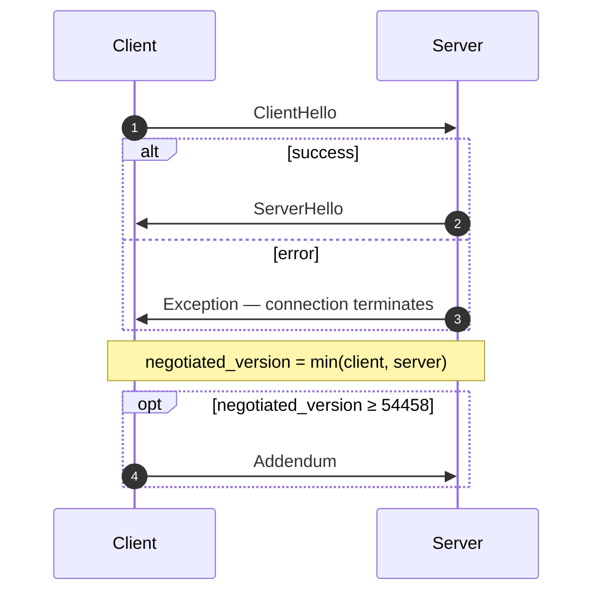
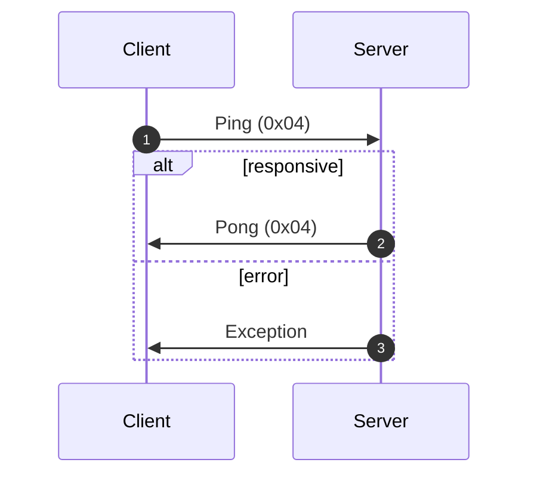
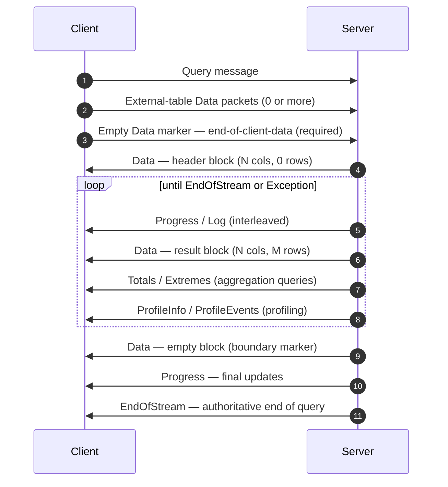
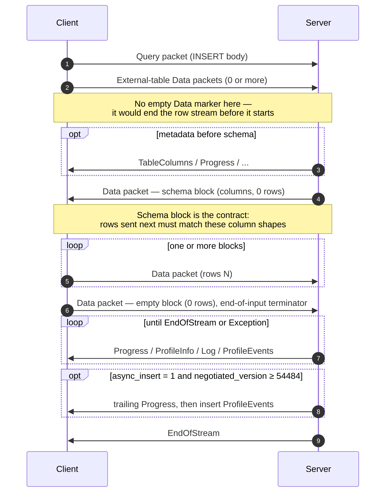
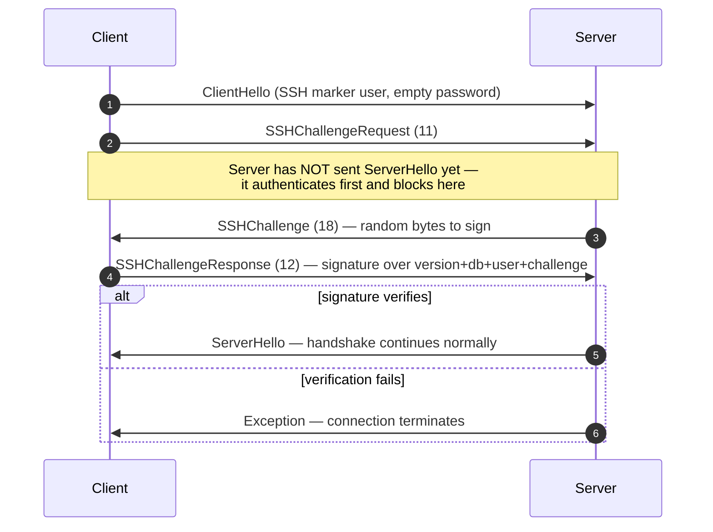

El protocolo nativo es el protocolo binario orientado a conexión que usan los Client y servidores de ClickHouse sobre TCP. Transporta consultas SQL, datos de resultados, payloads de `INSERT`, telemetría de ejecución y señales de error. Es el protocolo en el que se basan el cliente de línea de comandos y los controladores nativos de C++, así como la mayoría de los controladores nativos de terceros.

Esta página cubre el protocolo en sí: la estructura de paquetes, la máquina de estados de la conexión, la negociación de versiones y el cuerpo de cada mensaje distinto de `Block`. Los bytes dentro de los paquetes de la familia `Data` (el `Block`, sus columnas y las codificaciones específicas de cada tipo) se tratan por separado y están documentados en la especificación de [Formato nativo](/es/interfaces/specs/NativeFormat).

:::note Especificación complementaria
Esta página es una de las dos partes y se publica junto con la especificación complementaria de [Formato nativo](/es/interfaces/specs/NativeFormat). Ambas especificaciones dividen claramente el trabajo: esta página abarca la capa de paquetes y transporte; la especificación de Formato nativo abarca los bytes dentro de los paquetes de la familia `Data`.
:::

Hay algunas propiedades que se mantienen en todo el protocolo. El protocolo es binario y posicional: no hay etiquetas de campo salvo dentro de `BlockInfo`, por lo que un solo byte fuera de lugar desincroniza todo lo que sigue. Tiene estado, y cada conexión TCP procesa una consulta a la vez; no hay multiplexación. Los enteros de ancho fijo usan orden little-endian.

<div id="overview">
  ## Resumen
</div>

| Property             | Value                                                                                   |
| -------------------- | --------------------------------------------------------------------------------------- |
| Transporte           | TCP, opcionalmente encapsulado en TLS                                                   |
| Orden de bytes       | Little-endian para enteros de ancho fijo                                                |
| Codificación         | Binaria y posicional (sin `field tags`, excepto en `BlockInfo`)                         |
| Modelo de conexión   | Con estado, una consulta a la vez, sin multiplexación                                   |
| Control de versiones | Negociado durante el handshake; las características individuales dependen de la versión |
| Formato de datos     | El [Formato nativo](/es/interfaces/specs/NativeFormat) para todos los datos tabulares      |

Cada mensaje transmitido comienza con un código de tipo de paquete `VarUInt`, seguido de un cuerpo cuya forma depende de ese código y de la versión del protocolo negociada.

Una conexión pasa por tres fases: un handshake de una sola vez, luego cualquier cantidad de intercambios `Ping` o `Query` y, por último, el cierre:



El protocolo TCP nativo siempre transporta datos tabulares en el Formato nativo, independientemente de cualquier cláusula `FORMAT` en el SQL. Reformatearlos a `RowBinary`, `CSV`, `JSON`, etc. es tarea del Client, y se hace después de que decodifica los bloques Native. (La interfaz HTTP sigue una ruta de código distinta que *sí* respeta la cláusula `FORMAT`; HTTP queda fuera del alcance de este documento.)

<div id="security">
  ## Seguridad
</div>

<div id="transport-security">
  ### Seguridad del transporte (TLS)
</div>

TLS opera en la capa de transporte, por debajo del protocolo. Cuando está habilitado, se cifra todo el flujo TCP y los mensajes del protocolo son idénticos byte por byte, tanto si se usa TLS como si no.

<div id="authentication">
  ### Autenticación
</div>

La autenticación se realiza durante el handshake, en el mensaje [`ClientHello`](#clienthello). Los campos `user` y `password` se transmiten como cadenas en texto sin cifrar, por lo que el cifrado de transporte (TLS) es lo que protege las credenciales en tránsito.

La autenticación SSH por desafío-respuesta está disponible a partir de la versión 54466 del protocolo; consulta [Autenticación SSH por desafío-respuesta](#ssh-authentication).

<div id="inter-server-secret">
  ### Secreto entre servidores
</div>

Para la ejecución distribuida de consultas, los servidores se autentican entre sí demostrando que conocen un secreto compartido, sin enviarlo por la red. Cada Query lleva un `auth_hash` SHA-256 de 32 bytes en el campo 4 de [`Query`](#query), calculado a partir de un salt, un nonce, el secreto configurado y la consulta; el servidor receptor lo vuelve a calcular y lo compara. Esto está condicionado por la característica `INTERSERVER_SECRET` (v54441). Los clientes externos siempre envían aquí una cadena vacía. Consulte [Autenticación entre servidores](#inter-server-authentication).

<div id="versioning-and-feature-gates">
  ## Control de versiones y control de funcionalidad
</div>

<div id="version-negotiation">
  ### Negociación de la versión
</div>

Tanto el Client como el servidor declaran la versión máxima del protocolo que admiten durante el handshake. La **versión negociada** es la menor de ambas:

```text
negotiated_version = min(client_version, server_version)
```

Cada mensaje posterior usa la versión negociada para determinar qué campos están presentes en los datos transmitidos.

<div id="feature-gates">
  ### Controles de funcionalidad
</div>

Una funcionalidad se identifica por la versión del protocolo que la introdujo y está **activa** cuando la versión negociada es mayor o igual a ese número.

:::warning
Cuando una funcionalidad está activa, sus campos **deben** estar presentes en la transmisión. El protocolo es estrictamente posicional, por lo que omitir un campo controlado por funcionalidad corrompe el flujo de bytes de todos los campos siguientes.
:::

<div id="feature-table">
  ### Tabla de funcionalidades
</div>

| Característica                                          | Versión | Afecta                           | Impacto en el formato wire                                                                                                                                                                                                                                                                                                                                                                                                                                                                                                                                                                                                                                                                                                                                                                                                          |
| ------------------------------------------------------- | ------- | -------------------------------- | ----------------------------------------------------------------------------------------------------------------------------------------------------------------------------------------------------------------------------------------------------------------------------------------------------------------------------------------------------------------------------------------------------------------------------------------------------------------------------------------------------------------------------------------------------------------------------------------------------------------------------------------------------------------------------------------------------------------------------------------------------------------------------------------------------------------------------------- |
| BLOCK&#95;INFO                                          | all     | Block                            | Añade el prefijo BlockInfo (`is_overflows`, `bucket_number`) a cada Block.                                                                                                                                                                                                                                                                                                                                                                                                                                                                                                                                                                                                                                                                                                                                                          |
| CLIENT&#95;INFO                                         | 54032   | Query                            | Añade el bloque ClientInfo al cuerpo de Query.                                                                                                                                                                                                                                                                                                                                                                                                                                                                                                                                                                                                                                                                                                                                                                                      |
| TIMEZONE                                                | 54058   | ServerHello                      | Añade el campo `timezone` a ServerHello.                                                                                                                                                                                                                                                                                                                                                                                                                                                                                                                                                                                                                                                                                                                                                                                            |
| QUOTA&#95;KEY&#95;IN&#95;CLIENT&#95;INFO                | 54060   | ClientInfo                       | Añade el campo `quota_key` a ClientInfo.                                                                                                                                                                                                                                                                                                                                                                                                                                                                                                                                                                                                                                                                                                                                                                                            |
| DISPLAY&#95;NAME                                        | 54372   | ServerHello                      | Añade el campo `display_name` a ServerHello.                                                                                                                                                                                                                                                                                                                                                                                                                                                                                                                                                                                                                                                                                                                                                                                        |
| VERSION&#95;PATCH                                       | 54401   | ServerHello, ClientInfo          | Añade el campo `version_patch` a ambos.                                                                                                                                                                                                                                                                                                                                                                                                                                                                                                                                                                                                                                                                                                                                                                                             |
| SERVER&#95;LOGS                                         | 54406   | Log                              | El servidor emite paquetes Log cuando se establece `send_logs_level`.                                                                                                                                                                                                                                                                                                                                                                                                                                                                                                                                                                                                                                                                                                                                                               |
| COLUMN&#95;DEFAULTS&#95;METADATA                        | 54410   | TableColumns                     | El servidor puede enviar el paquete [`TableColumns`](#tablecolumns) (tipo 11) con metadatos de valores predeterminados de columnas antes del bloque de esquema de INSERT/entrada. Solo se envía cuando la versión negociada es ≥ 54410 **y** `input_format_defaults_for_omitted_fields` está habilitado. Por debajo de esta versión, el paquete nunca se envía; los client no deben esperarlo.                                                                                                                                                                                                                                                                                                                                                                                                                                      |
| WRITE&#95;CLIENT&#95;INFO                               | 54420   | Progress                         | Añade `wrote_rows` y `wrote_bytes` a Progress. (A pesar del nombre, esto **no** controla el bloque ClientInfo — eso es `CLIENT_INFO` (v54032).)                                                                                                                                                                                                                                                                                                                                                                                                                                                                                                                                                                                                                                                                                     |
| SETTINGS&#95;SERIALIZED&#95;AS&#95;STRINGS              | 54429   | Query (settings encoding)        | Cambia **cómo** se codifica la lista de settings, que siempre está presente; **no** controla si se envían settings. v54429+ escribe cada setting como `(name, flags, value-as-string)`; los pares más antiguos escriben `(name, type-specific-binary-value)` sin flags. Consulte [Setting](#setting).                                                                                                                                                                                                                                                                                                                                                                                                                                                                                                                               |
| INTERSERVER&#95;SECRET                                  | 54441   | Query                            | Añade el campo inter-server `auth_hash` a Query — un SHA-256 con salt del secreto del clúster, no el secreto sin procesar. Los client externos envían una cadena vacía. Consulte [Inter-server authentication](#inter-server-authentication).                                                                                                                                                                                                                                                                                                                                                                                                                                                                                                                                                                                       |
| OPEN&#95;TELEMETRY                                      | 54442   | ClientInfo                       | Añade el contexto de trazas de OpenTelemetry a ClientInfo.                                                                                                                                                                                                                                                                                                                                                                                                                                                                                                                                                                                                                                                                                                                                                                          |
| DISTRIBUTED&#95;DEPTH                                   | 54448   | ClientInfo                       | Añade el campo `distributed_depth` a ClientInfo.                                                                                                                                                                                                                                                                                                                                                                                                                                                                                                                                                                                                                                                                                                                                                                                    |
| INITIAL&#95;QUERY&#95;START&#95;TIME                    | 54449   | ClientInfo                       | Añade el campo `initial_time` (Int64, de ancho fijo).                                                                                                                                                                                                                                                                                                                                                                                                                                                                                                                                                                                                                                                                                                                                                                               |
| PROFILE&#95;EVENTS                                      | 54451   | ProfileEvents                    | El servidor emite paquetes ProfileEvents durante la ejecución de la consulta.                                                                                                                                                                                                                                                                                                                                                                                                                                                                                                                                                                                                                                                                                                                                                       |
| PARALLEL&#95;REPLICAS                                   | 54453   | ClientInfo                       | Añade campos de coordinación de réplicas paralelas a ClientInfo.                                                                                                                                                                                                                                                                                                                                                                                                                                                                                                                                                                                                                                                                                                                                                                    |
| CUSTOM&#95;SERIALIZATION                                | 54454   | Block (Column)                   | Añade el byte `has_custom_serialization` después de la cadena de tipo de cada columna.                                                                                                                                                                                                                                                                                                                                                                                                                                                                                                                                                                                                                                                                                                                                              |
| ADDENDUM                                                | 54458   | Handshake                        | El client envía un addendum (`quota_key`) después del intercambio de handshake.                                                                                                                                                                                                                                                                                                                                                                                                                                                                                                                                                                                                                                                                                                                                                     |
| PARAMETERS                                              | 54459   | Query                            | Añade la lista de parámetros al cuerpo de Query.                                                                                                                                                                                                                                                                                                                                                                                                                                                                                                                                                                                                                                                                                                                                                                                    |
| SERVER&#95;QUERY&#95;TIME&#95;IN&#95;PROGRESS           | 54460   | Progress                         | Añade el campo `elapsed_ns` a Progress.                                                                                                                                                                                                                                                                                                                                                                                                                                                                                                                                                                                                                                                                                                                                                                                             |
| PASSWORD&#95;COMPLEXITY&#95;RULES                       | 54461   | ServerHello                      | Añade a ServerHello una lista de patrones regex de política de contraseñas y mensajes legibles para humanos.                                                                                                                                                                                                                                                                                                                                                                                                                                                                                                                                                                                                                                                                                                                        |
| INTERSERVER&#95;SECRET&#95;V2                           | 54462   | ServerHello                      | Añade un nonce `UInt64` de 8 bytes a ServerHello. Se usa para la firma de consultas inter-server; los client externos lo decodifican y lo ignoran.                                                                                                                                                                                                                                                                                                                                                                                                                                                                                                                                                                                                                                                                                  |
| TOTAL&#95;BYTES&#95;IN&#95;PROGRESS                     | 54463   | Progress                         | Añade el campo `total_bytes_to_read` (VarUInt) a Progress, entre `total_rows` y `wrote_rows`.                                                                                                                                                                                                                                                                                                                                                                                                                                                                                                                                                                                                                                                                                                                                       |
| TIMEZONE&#95;UPDATES                                    | 54464   | TimezoneUpdate                   | Añade el paquete de servidor `TimezoneUpdate` (tipo 17). Body: un único `String` que transporta la timezone de la session. Solo lo envía el inicializador de la table function `input`, justo después del bloque de esquema de entrada, para que el client analice las filas que envía con la `session_timezone` del servidor. Consulte [TimezoneUpdate](#timezoneupdate).                                                                                                                                                                                                                                                                                                                                                                                                                                                          |
| SPARSE&#95;SERIALIZATION                                | 54465   | Block (Column)                   | El servidor puede establecer `has_custom_serialization = 1` y emitir una columna codificada de forma dispersa. Formato wire: kind de 1 byte (0x01 = SPARSE), seguido de un flujo de offsets VarUInt terminado por EOG, y después los valores no predeterminados codificados densamente en el tipo interno. Consulte [kind&#95;stack and sparse encoding](/es/interfaces/specs/NativeFormat#kind-stack-and-sparse-encoding).                                                                                                                                                                                                                                                                                                                                                                                                            |
| SSH&#95;AUTHENTICATION                                  | 54466   | Auth flow                        | Añade autenticación SSH challenge-response. Opt-in: el client envía un `user` con la forma `" SSH KEY AUTHENTICATION " + <real_user>` con password vacía para activarla. Consulte [SSH challenge-response authentication](#ssh-authentication).                                                                                                                                                                                                                                                                                                                                                                                                                                                                                                                                                                                     |
| TABLE&#95;READ&#95;ONLY&#95;CHECK                       | 54467   | TablesStatusResponse             | Añade un indicador `is_readonly` a la fila de cada table en TablesStatusResponse. Los client externos que no emiten `TablesStatusRequest` no ven ningún cambio en el wire.                                                                                                                                                                                                                                                                                                                                                                                                                                                                                                                                                                                                                                                          |
| SYSTEM&#95;KEYWORDS&#95;TABLE                           | 54468   | system tables                    | El servidor rellena `system.keywords` para que el `clickhouse-client` canónico pueda autocompletar palabras clave. No hay cambios en el wire del protocolo nativo.                                                                                                                                                                                                                                                                                                                                                                                                                                                                                                                                                                                                                                                                  |
| ROWS&#95;BEFORE&#95;AGGREGATION                         | 54469   | ProfileInfo                      | Añade `applied_aggregation` (Bool) y `rows_before_aggregation` (VarUInt) a ProfileInfo, en ese orden al final.                                                                                                                                                                                                                                                                                                                                                                                                                                                                                                                                                                                                                                                                                                                      |
| CHUNKED&#95;PROTOCOL                                    | 54470   | Connection framing               | El enmarcado por fragmentos por paquete envuelve cada body de paquete. Se negocia en Addendum. ServerHello transporta la preferencia del servidor para cada dirección; Addendum transporta la elección final del client. Consulte [chunked framing](#chunked-framing).                                                                                                                                                                                                                                                                                                                                                                                                                                                                                                                                                              |
| VERSIONED&#95;PARALLEL&#95;REPLICAS&#95;PROTOCOL        | 54471   | ServerHello, Addendum            | Ambas partes intercambian una versión `VarUInt` del protocolo de coordinación de réplicas paralelas. El campo de ServerHello se ubica **inmediatamente después de `protocol_version`** (antes de `timezone`). El campo de Addendum se añade después de las cadenas del protocolo fragmentado. Valor actual: `8` (`DBMS_PARALLEL_REPLICAS_PROTOCOL_VERSION`). La versión `8` añade [`MergeTreeAllRangesAnnouncementResponse`](#mergetreeallrangesannouncementresponse) (packet de client `14`): cuando la versión negociada de réplicas paralelas es `≥ 8`, el iniciador responde a cada announcement de follower en modo distinto de `Default` con la lista autorizada de partes para ese stream, y el follower espera esa respuesta antes de emitir solicitudes de lectura. Por debajo de `8`, el announcement es fire-and-forget. |
| INTERSERVER&#95;EXTERNALLY&#95;GRANTED&#95;ROLES        | 54472   | Query                            | Añade un campo `String external_roles` al body de Query, entre el terminador de settings y el hash del secreto interserver. Los client externos envían una lista de roles vacía (un único byte `0x00`, es decir, VarUInt 0 dentro de un envoltorio String).                                                                                                                                                                                                                                                                                                                                                                                                                                                                                                                                                                         |
| V2&#95;DYNAMIC&#95;AND&#95;JSON&#95;SERIALIZATION       | 54473   | Column body                      | El server puede emitir serialización V2 para los tipos de columna `Dynamic` y `JSON`; esto determina qué versión de `state_prefix` usan. Consulta [versioned types](/es/interfaces/specs/NativeFormat#versioned-types).                                                                                                                                                                                                                                                                                                                                                                                                                                                                                                                                                                                                                |
| SERVER&#95;SETTINGS                                     | 54474   | ServerHello                      | El server difunde sus settings no predeterminados como una lista al final de ServerHello, después de `nonce`. Formato: tripletas `(key, flags, value)` terminadas en una clave vacía; igual que la lista de settings del Query packet.                                                                                                                                                                                                                                                                                                                                                                                                                                                                                                                                                                                              |
| QUERY&#95;AND&#95;LINE&#95;NUMBERS                      | 54475   | ClientInfo                       | Añade `script_query_number` (VarUInt) y `script_line_number` (VarUInt) al final de ClientInfo. clickhouse-client lo usa para atribuir errores en scripts de múltiples sentencias; los client externos envían `0, 0`.                                                                                                                                                                                                                                                                                                                                                                                                                                                                                                                                                                                                                |
| JWT&#95;IN&#95;INTERSERVER                              | 54476   | ClientInfo                       | Añade un indicador de presencia de JWT en UInt8 y un `String jwt` opcional al final de ClientInfo. Los client externos (sin JWT) envían el byte `0x00`. (En C++ aparece como `DBMS_MIN_REVISON_WITH_JWT_IN_INTERSERVER`; observa la errata en el nombre de la constante).                                                                                                                                                                                                                                                                                                                                                                                                                                                                                                                                                           |
| QUERY&#95;PLAN&#95;SERIALIZATION                        | 54477   | ServerHello, QueryPlan packet    | ServerHello añade `VarUInt query_plan_serialization_version` después de los settings del server. También introduce `ClientPacket::QueryPlan` (código `13`) para la entrega entre servidores de planes de consulta preconstruidos; los client externos nunca lo envían.                                                                                                                                                                                                                                                                                                                                                                                                                                                                                                                                                              |
| PARALLEL&#95;BLOCK&#95;MARSHALLING                      | 54478   | Block (Column)                   | El server puede encapsular columnas en `ColumnBLOB` (comprimido en línea) para procesamiento paralelo. Depende de que la consulta tenga la compresión habilitada Y `rows > 1`; de lo contrario, se aplica el formato wire normal de columna. Los client que nunca habilitan compresión en Query packets salientes no ven ningún cambio en el wire.                                                                                                                                                                                                                                                                                                                                                                                                                                                                                  |
| VERSIONED&#95;CLUSTER&#95;FUNCTION&#95;PROTOCOL         | 54479   | ServerHello                      | Añade `VarUInt cluster_function_protocol_version` al final de ServerHello. Se usa para funciones de tabla `*Cluster` (`s3Cluster`, etc.). Valor actual: `8` (`DBMS_CLUSTER_PROCESSING_PROTOCOL_VERSION`); la versión `7` está reservada para una característica de un repositorio privado (compactación de Iceberg), y `8` añade un `read_source_index` opcional a la carga útil de la tarea de lectura de cluster entre servidores (el body de `ReadTaskResponse`, que sigue sin especificarse aquí; consulta más abajo). Los client externos lo decodifican y lo ignoran.                                                                                                                                                                                                                                                         |
| OUT&#95;OF&#95;ORDER&#95;BUCKETS&#95;IN&#95;AGGREGATION | 54480   | BlockInfo                        | Añade el campo 3 (`out_of_order_buckets: Vec<Int32>`) al stream etiquetado por campos de BlockInfo. Se decodifica como `[VarUInt count][Int32]*count`. Los client externos no lo emiten por sí mismos; el decodificador lee cualquier lista no vacía que envíe el server.                                                                                                                                                                                                                                                                                                                                                                                                                                                                                                                                                           |
| COMPRESSED&#95;LOGS&#95;PROFILE&#95;EVENTS&#95;COLUMNS  | 54481   | Log, ProfileEvents, TableColumns | El server puede encapsular los body de los packets [`Log`](#log), [`ProfileEvents`](#profileevents) y [`TableColumns`](#tablecolumns) en el [compression frame](/es/interfaces/specs/NativeFormat#compression-frame). En esta versión, los tres body recorren la misma ruta de salida opcionalmente comprimida, que solo se convierte en un compression frame real cuando la consulta tiene `compression = true`. Los client que nunca habilitan compresión en Query packets salientes no ven ningún cambio en el wire.                                                                                                                                                                                                                                                                                                                |
| REPLICATED&#95;SERIALIZATION                            | 54482   | Block (Column)                   | El server puede emitir columnas con kind&#95;stack `0x04 = REPLICATED`: una forma compacta tipo diccionario para valores repetidos; consulta [kind&#95;stack and sparse encoding](/es/interfaces/specs/NativeFormat#kind-stack-and-sparse-encoding). Por debajo de esta versión, el writer expandía esas columnas antes de enviarlas. Se decodifica mediante búsqueda por índice (`elements[indexes[i]]` por fila); se admiten tipos hoja y tipos internos `Nullable`/`Array`/`Tuple`/`Map`/`Nested`/`LowCardinality`.                                                                                                                                                                                                                                                                                                                 |
| NULLABLE&#95;SPARSE&#95;SERIALIZATION                   | 54483   | Block (Column)                   | Combina la serialización dispersa con `Nullable(T)`. Por debajo de esta versión, el writer expandía sparse para columnas Nullable antes de enviarlas; a partir de v54483, los datos wire son sparse sobre Nullable. Consulta [kind&#95;stack and sparse encoding](/es/interfaces/specs/NativeFormat#kind-stack-and-sparse-encoding).                                                                                                                                                                                                                                                                                                                                                                                                                                                                                                   |
| PROGRESS&#95;IN&#95;ASYNC&#95;INSERT                    | 54484   | Progress (INSERT)                | En un INSERT **asíncrono** (`async_insert = 1`), una vez que se vacía el insert, el server envía un packet [`Progress`](#progress) adicional y luego los `ProfileEvents` del insert, antes de `EndOfStream`. Depende de que la versión *negociada* sea ≥ 54484; por debajo de ella, el server omite este Progress final. El formato wire de Progress no cambia; la única novedad es su emisión. En la práctica, el incremento transporta el tiempo transcurrido; los contadores de filas escritas se informan mediante los ProfileEvents que lo acompañan. Un client que ya drena Progress intercalado no necesita cambios de formato, solo tolerar un packet más.                                                                                                                                                                  |
| CLIENT&#95;AGENT&#95;IN&#95;CLIENT&#95;INFO             | 54485   | ClientInfo                       | Añade un `String` `client_agent` al final de ClientInfo. El client canónico detecta automáticamente un identificador de agent a partir de su entorno (por ejemplo, `claude-code`, `cursor`, `gemini-cli` o el valor de la variable `AGENT`); un client externo sin nada detectado envía una cadena vacía. Es obligatorio una vez que la versión negociada es ≥ 54485; omitirlo desincroniza el resto del Query packet.                                                                                                                                                                                                                                                                                                                                                                                                              |
| INTERNAL&#95;QUERY&#95;FLAG                             | 54486   | ClientInfo                       | Añade un `UInt8` `is_internal` al final de ClientInfo. `1` para una consulta interna del server (no emitida por un usuario), que se propaga a consultas remotas para que sus filas de `system.query_log` queden etiquetadas como internas; los client externos envían `0`. Es obligatorio una vez que la versión negociada es ≥ 54486; omitirlo desincroniza el resto del Query packet.                                                                                                                                                                                                                                                                                                                                                                                                                                             |

<div id="packet-envelope">
  ## Envoltura del paquete
</div>

Todos los mensajes en tránsito comparten la misma estructura externa, en ambas direcciones:

```text
[VarUInt: packet_type_code]    always encoded as VarUInt
[message body]                 format depends on packet_type_code
```

Las tablas completas de tipos de paquete están en la [referencia de tipos de paquete](#packet-type-reference).

El tipo de paquete es un `VarUInt`, no un byte de ancho fijo. Para valores inferiores a 128, un `VarUInt` produce el mismo byte, pero las implementaciones deben usar la codificación `VarUInt` para seguir siendo compatibles si en el futuro los tipos de paquete alcanzan 128 o más.

La [referencia de mensajes](#message-reference) documenta solo el **cuerpo** de cada paquete: los bytes que van después del código de tipo de paquete. La numeración de campos comienza en 1 con el primer campo del cuerpo.

<div id="chunked-framing">
  ### Enmarcado por fragmentos (v54470+)
</div>

Cuando se **negocia** la característica `CHUNKED_PROTOCOL` (véase [el handshake](#handshake-phase)), cada paquete on the wire se encapsula con enmarcado por fragmentos. Este encapsulado es **por dirección**: Client→servidor y servidor→Client se negocian por separado y pueden acabar en modos distintos (por fragmentos frente a sin enmarcado).

Disposición en formato wire por paquete:

```text
<chunk>...   one or more chunks; their payloads concatenated form the whole packet
[u32 LE = 0] zero-size terminator marking end of packet
```

Disposición en formato wire por fragmento:

```text
[u32 LE: chunk_size]   chunk_size in [1, UINT32_MAX]
[chunk_size bytes]     packet bytes (see note below)
```

El tipo de paquete `VarUInt` está **dentro** del flujo con fragmentación: es el primer byte de la carga útil del paquete (el primer byte del primer fragmento), no un byte independiente enviado antes del framing. La carga útil fragmentada de cada paquete es el `[VarUInt packet_type_code][cuerpo del mensaje]` completo de la [envoltura del paquete](#packet-envelope). Un Client que deja el tipo de paquete fuera del flujo con fragmentación hace que el peer lea ese byte de tipo como el primer byte del tamaño del fragmento `u32`, desincronizando la conexión.

Un único paquete puede dividirse en varios fragmentos si el búfer del writer se llena a mitad del paquete; la división puede producirse en cualquier punto, incluso dentro del `VarUInt` del tipo de paquete. El reader concatena las cargas útiles de los fragmentos y trata el cero final de 4 bytes como un límite de paquete transparente: lo consume, pero no se lo entrega a lo que esté leyendo los cuerpos de los paquetes.

Los paquetes sin cuerpo siguen yendo envueltos: un paquete de un solo byte como `Ping` o `Pong` se convierte en `[u32 size = 1][0x04][u32 0]` una vez negociado el chunking. Cualquier descripción de «single byte on the wire» en otra parte de esta página corresponde a la forma previa al chunking.

**Negociación.** ServerHello y Addendum incluyen cada uno dos campos `String`, uno por dirección, con values obtenidos de `{"chunked", "notchunked", "chunked_optional", "notchunked_optional"}`:

* `chunked` / `notchunked` son estrictos: ese lado requiere exactamente ese mode.
* Las variantes `_optional` son flexibles: aceptan el mode que elija el otro lado.

El valor acordado para cada dirección se calcula por pares:

| Preferencia del servidor  | Preferencia del Client    | Acordado                                              |
| ------------------------- | ------------------------- | ----------------------------------------------------- |
| `*_optional`              | cualquier valor           | seguir al CLIENT (su `starts_with("chunked")`)        |
| cualquier valor           | `*_optional`              | seguir al SERVER                                      |
| `chunked` estricto        | `chunked` estricto        | `chunked`                                             |
| `notchunked` estricto     | `notchunked` estricto     | `notchunked`                                          |
| incompatibilidad estricta | incompatibilidad estricta | **error de protocolo** — la conexión MUST desmontarse |

En el lado del Client, la preferencia de SEND del Client se negocia frente a la preferencia de RECV del servidor, y viceversa.

**Temporización.** Las cadenas de negociación viajan por el wire sin framing: ClientHello → ServerHello (preferencias del servidor) → Addendum (valores negociados del Client). El cambio de framing se aplica a cada byte enviado *después* de que se haga flush del Addendum. El propio Addendum, el ClientHello y el ServerHello siempre van sin framing.

<div id="connection-lifecycle">
  ## Ciclo de vida de la conexión
</div>

En cualquier momento, una conexión está en exactamente uno de cuatro estados: `HANDSHAKE`, `READY`, `READING_RESPONSE` o terminada. Como el protocolo no admite multiplexación, un Client que envía una nueva solicitud antes de consumir por completo la respuesta anterior entremezcla bytes en tránsito y corrompe el flujo.

<div id="states">
  ### Estados
</div>



La ruta principal desciende en línea recta — `HANDSHAKE → READY → READING_RESPONSE → READY` — con el bucle de `Ping`/`Pong` y cada arista de error canalizada hacia el único sink `Terminated`.

| State              | Description                                                                                                                                                                                                                                              |
| ------------------ | -------------------------------------------------------------------------------------------------------------------------------------------------------------------------------------------------------------------------------------------------------- |
| `HANDSHAKE`        | Estado inicial tras abrirse la conexión TCP. Solo son válidos los mensajes de [handshake](#handshake-phase). Pasa a `READY` si tiene éxito o termina si falla.                                                                                           |
| `READY`            | Inactivo. El Client puede enviar [Ping](#ping-phase), [Consulta](#query-phase) o cerrar. La conexión puede permanecer en `READY` indefinidamente (sujeta a `idle_connection_timeout`; consulte [límites de conexión](#connection-limits)).               |
| `READING_RESPONSE` | Se entra en este estado cuando el Client envía una consulta. El Client debe consumir por completo el stream de respuesta del servidor antes de volver a `READY`. El único paquete Client→servidor permitido aquí es Cancel (no se especifica en esta página). |
| Terminated         | Ya no puede usarse. El Client debe abrir una nueva conexión TCP y reiniciar el handshake.                                                                                                                                                                |

<div id="handshake-phase">
  ### Fase de handshake
</div>

Autentica y negocia la versión del protocolo. Ocurre exactamente una vez por conexión, antes de cualquier otra cosa.

La conexión TCP se acaba de abrir y aún no se ha intercambiado ningún mensaje. El flujo:



1. El Client envía [`ClientHello`](#clienthello) con la versión máxima del protocolo que admite.

2. El Client lee la respuesta y actúa según el tipo de paquete:

   | Tipo de paquete | Acción                                                                                                                        |
   | --------------- | ----------------------------------------------------------------------------------------------------------------------------- |
   | `Hello` (0)     | Decodifica [`ServerHello`](#serverhello). Calcula `negotiated_version = min(client_ver, server_ver)`. Continúa con el paso 3. |
   | `Exception` (2) | Decodifica [`Exception`](#exception). Devuélvela como error y termina la conexión.                                            |
   | cualquier otro  | Violación del protocolo. Termina la conexión.                                                                                 |

3. Si `negotiated_version ≥ 54458` (la característica `ADDENDUM`), el Client envía un [`Addendum`](#addendum). Esta decisión se basa en la versión **negociada**, no en la versión declarada por el Client.

Si se completa correctamente, la conexión pasa a `READY`; ante cualquier error, se termina.

<div id="ping-phase">
  ### Fase de Ping
</div>

Una comprobación de actividad a nivel de aplicación, independiente del `keepalive` de TCP. Un intercambio correcto de Ping/Pong confirma que la conexión TCP está activa en ambas direcciones y que el servidor responde. Ping no tiene estado y no está correlacionado con ninguna consulta, por lo que varios Pings secuenciales son independientes.

A partir de `READY`, el flujo es:



1. El Client envía [`Ping`](#ping).
2. El Client lee la respuesta:

   | Tipo de paquete | Acción                                                         |
   | --------------- | -------------------------------------------------------------- |
   | `Pong` (4)      | Se confirmó que sigue activo. Volver a `READY`.                |
   | `Exception` (2) | Decodificar [`Exception`](#exception) y devolverlo como error. |
   | cualquier otro  | Violación del protocolo.                                       |

<div id="query-phase">
  ### Fase de consulta
</div>

El client envía una sentencia SQL; el servidor devuelve en streaming bloques de resultados y telemetría de ejecución. La respuesta es una secuencia de paquetes terminada por exactamente un `EndOfStream` o `Exception`.

Partiendo de `READY`, el flujo es:



Si se produce un error en cualquier punto, el servidor envía una `Exception` en lugar de `EndOfStream`, lo que finaliza la consulta.

1. El client envía [`Query`](#query) con un `query_id` único (normalmente un UUID).
2. El client envía las external tables y, a continuación, el marcador Data vacío. El paquete Data vacío tiene `table_name = ""`, `num_columns = 0`, `num_rows = 0`. El servidor no empieza a ejecutar la consulta hasta que recibe este marcador.
3. El client pasa a `READING_RESPONSE` y vacía su búfer de escritura.
4. El client lee los paquetes de respuesta en un bucle, procesándolos según su tipo:

   | Tipo de paquete      | Acción                                                                                                                                                                                                               |
   | -------------------- | -------------------------------------------------------------------------------------------------------------------------------------------------------------------------------------------------------------------- |
   | `Data` (1)           | Decodifica el bloque. El primer Data es la cabecera del esquema; los siguientes son bloques de resultados (acumúlalos); un bloque vacío es un marcador de límite. `num_rows == 0` **no** indica el fin de la consulta. |
   | `Progress` (3)       | Métricas de ejecución. Cada paquete es un **incremento** respecto al anterior; acumúlalos localmente.                                                                                                                |
   | `EndOfStream` (5)    | Consulta completada. Sal del bucle y vuelve a `READY`.                                                                                                                                                               |
   | `ProfileInfo` (6)    | Datos de profiling posteriores a la ejecución.                                                                                                                                                                       |
   | `Totals` (7)         | Bloque de totales de aggregation (mismo wire format que Data).                                                                                                                                                       |
   | `Extremes` (8)       | Bloque de valores mínimos/máximos (mismo wire format que Data).                                                                                                                                                      |
   | `Log` (10)           | Línea del server log.                                                                                                                                                                                                |
   | `TableColumns` (11)  | Metadatos de valores predeterminados de columnas.                                                                                                                                                                    |
   | `ProfileEvents` (14) | Counters de rendimiento.                                                                                                                                                                                             |
   | `Exception` (2)      | Decodifica y devuelve como error. Sal del bucle y vuelve a `READY`.                                                                                                                                                  |
   | anything else        | Inesperado durante la fase de consulta. Termina la conexión.                                                                                                                                                         |

Con `EndOfStream` o una `Exception` controlada, la conexión vuelve a `READY`. Una protocol violation o un error de I/O la finaliza.

:::note
El caso `num_rows == 0` suele confundir en las implementaciones nuevas. Un bloque de cero filas es un marcador de límite o una cabecera de esquema, no una señal de fin de stream. Solo `EndOfStream` o `Exception` ponen fin a la respuesta.
:::

<div id="insert-phase">
  ### Fase de INSERT
</div>

La fase de INSERT es la [fase de consulta](#query-phase) con dos intercambios más. El client envía una instrucción `INSERT`; el servidor responde con un **bloque de esquema** que describe la tabla de destino; el client transmite paquetes Data con las filas y, después, el marcador Data vacío; el servidor termina con `EndOfStream` o `Exception`.

Partiendo de `READY`, la sentencia SQL es un `INSERT` de la forma `INSERT INTO <table> [(<cols>)] VALUES` — sin un literal `VALUES (...)` inline, ya que los datos de las filas fluyen a través de paquetes Data. El flujo:



1. El client envía [`Query`](#query) con `body` establecido en la instrucción SQL INSERT.
2. El client envía cualquier tabla externa (algo poco frecuente en INSERT). A diferencia de la [fase Query](#query-phase), aquí **no** envía un marcador Data vacío. El paquete `Query` de `INSERT` se envía con datos pendientes, por lo que el bloque vacío de fin de datos se pospone hasta el paso 5; enviarlo antes del bloque de esquema haría que el servidor lo interpretara como el final del flujo de filas, completara el INSERT sin filas y luego analizara el primer paquete de fila real como un paquete de nivel superior fuera de lugar.
3. El client consume los paquetes de metadatos (TableColumns, Progress, ProfileInfo, Log, ProfileEvents) hasta leer el paquete Data del esquema: un bloque con 0 filas pero con la estructura completa de columnas (nombres y tipos). El bloque de esquema es el contrato: las filas que el client envíe a continuación deben coincidir con estas estructuras de columna.
4. El client envía bloque(s) de datos. Para cada bloque escribe `VarUInt(ClientPacket::Data = 2)`, luego `String("")` para el nombre vacío de la tabla externa y, después, el bloque. Los tipos de columna deben coincidir por posición con las columnas del bloque de esquema.
5. El client envía el terminador de fin de entrada: un paquete Data con un bloque vacío (0 columnas, 0 filas).
6. El client consume el flujo de respuesta hasta `EndOfStream` (éxito) o `Exception` (fallo).

**INSERT asíncrono (v54484+).** Cuando la consulta lleva `async_insert = 1`, el servidor pone las filas en cola y las vacía como parte de un batch. En la versión negociada ≥ 54484 (`PROGRESS_IN_ASYNC_INSERT`), una vez completado el vaciado, el servidor emite un paquete adicional de [`Progress`](#progress), seguido inmediatamente por los `ProfileEvents` del insert y luego por `EndOfStream`. Por debajo de 54484, el servidor omite ese Progress final. El paquete es un `Progress` normal; como el servidor restablece el query pipeline antes de incorporar los recuentos de escritura, en la práctica el incremento solo incluye el tiempo transcurrido, y las estadísticas de filas y bytes escritos llegan al client a través de los `ProfileEvents` adjuntos. Un client que ya consume Progress entrelazados en el paso 6 solo necesita aceptar un paquete más.

La conexión vuelve a `READY` en `EndOfStream` o tras una `Exception` controlada. Las infracciones del protocolo y los errores de I/O la terminan.

<div id="message-reference">
  ## Referencia de mensajes
</div>

Los campos se enumeran en el orden de transmisión. La columna `Type` usa:

* `VarUInt` — entero sin signo de longitud variable (consulte [VarUInt](/es/interfaces/specs/NativeFormat#varuint)).
* `String` — bytes con prefijo VarUInt (consulte [String](/es/interfaces/specs/NativeFormat#string)).
* `UInt8`, `Int32`, etcétera — enteros little-endian de ancho fijo.
* `Bool` — un solo byte, `0x00` o `0x01`.

La columna `Role` indica quién usa cada campo:

* **client** — lo establecen los clientes externos.
* **inter-server** — solo tiene sentido para la comunicación entre servidores; los clientes externos escriben un valor por defecto.
* **universal** — lo usan ambos.

Estas tablas documentan solo el cuerpo de cada paquete, después del código de tipo de paquete.

<div id="clienthello">
  ### ClientHello (tipo de paquete 0)
</div>

Client → Server. El primer mensaje tras abrirse la conexión TCP.

| # | Campo                | Tipo    | Rol       | Descripción                                               |
| - | -------------------- | ------- | --------- | --------------------------------------------------------- |
| 1 | client&#95;name      | String  | universal | Identificador del cliente (p. ej., `"clickhouse-client"`) |
| 2 | version&#95;major    | VarUInt | universal | Versión principal del cliente                             |
| 3 | version&#95;minor    | VarUInt | universal | Versión secundaria del cliente                            |
| 4 | protocol&#95;version | VarUInt | universal | Versión máxima del protocolo admitida por el cliente      |
| 5 | database             | String  | universal | Nombre de la base de datos predeterminada                 |
| 6 | user                 | String  | universal | Nombre de usuario para autenticación                      |
| 7 | password             | String  | universal | Contraseña (texto sin cifrar)                             |

<div id="serverhello">
  ### ServerHello (tipo de paquete 0)
</div>

Servidor → Cliente. La respuesta a ClientHello cuando la autenticación se completa correctamente.

| #  | Campo                                          | Tipo      | Rol          | Condición                                                 | Descripción                                                                                                                                                                                                                                                                                                                                                                                                                                                                                      |
| -- | ---------------------------------------------- | --------- | ------------ | --------------------------------------------------------- | ------------------------------------------------------------------------------------------------------------------------------------------------------------------------------------------------------------------------------------------------------------------------------------------------------------------------------------------------------------------------------------------------------------------------------------------------------------------------------------------------ |
| 1  | server&#95;name                                | String    | universal    | always                                                    | Identificador del servidor                                                                                                                                                                                                                                                                                                                                                                                                                                                                       |
| 2  | version&#95;major                              | VarUInt   | universal    | always                                                    | Versión principal del servidor                                                                                                                                                                                                                                                                                                                                                                                                                                                                   |
| 3  | version&#95;minor                              | VarUInt   | universal    | always                                                    | Versión secundaria del servidor                                                                                                                                                                                                                                                                                                                                                                                                                                                                  |
| 4  | protocol&#95;version                           | VarUInt   | universal    | always                                                    | Versión del protocolo del servidor                                                                                                                                                                                                                                                                                                                                                                                                                                                               |
| 4a | parallel&#95;replicas&#95;protocol&#95;version | VarUInt   | universal    | VERSIONED&#95;PARALLEL&#95;REPLICAS&#95;PROTOCOL (v54471) | Versión del protocolo de coordinación de réplicas paralelas del servidor. **Posición en el wire: inmediatamente después de `protocol_version`**, antes de `timezone`. Actual: `8`.                                                                                                                                                                                                                                                                                                               |
| 5  | timezone                                       | String    | universal    | TIMEZONE (v54058)                                         | Zona horaria del servidor (p. ej., `"UTC"`)                                                                                                                                                                                                                                                                                                                                                                                                                                                      |
| 6  | display&#95;name                               | String    | universal    | DISPLAY&#95;NAME (v54372)                                 | Nombre del servidor legible para humanos                                                                                                                                                                                                                                                                                                                                                                                                                                                         |
| 7  | version&#95;patch                              | VarUInt   | universal    | VERSION&#95;PATCH (v54401)                                | Versión de parche del servidor                                                                                                                                                                                                                                                                                                                                                                                                                                                                   |
| 8  | proto&#95;send&#95;chunked&#95;srv             | String    | universal    | CHUNKED&#95;PROTOCOL (v54470)                             | Chunking saliente preferido del servidor. Uno de `"chunked"`, `"notchunked"`, `"chunked_optional"`, `"notchunked_optional"`. Consulta [enmarcado por fragmentos](#chunked-framing). **Va ANTES de `password_complexity_rules` en el wire aunque su control de versión sea posterior.**                                                                                                                                                                                                           |
| 9  | proto&#95;recv&#95;chunked&#95;srv             | String    | universal    | CHUNKED&#95;PROTOCOL (v54470)                             | Chunking entrante preferido del servidor. Usa el mismo conjunto de valores que el campo 8.                                                                                                                                                                                                                                                                                                                                                                                                       |
| 10 | password&#95;complexity&#95;rules              | Rule[]    | universal    | PASSWORD&#95;COMPLEXITY&#95;RULES (v54461)                | Política de contraseñas del servidor. `VarUInt count` seguido de `count × Rule`. Véase más abajo.                                                                                                                                                                                                                                                                                                                                                                                                |
| 11 | nonce                                          | UInt64    | inter-server | INTERSERVER&#95;SECRET&#95;V2 (v54462)                    | `nonce` aleatorio LE de 8 bytes. Lo usa el esquema de firma de consultas entre servidores del servidor. Los client externos DEBEN decodificarlo (para mantener alineado el flujo) y DEBERÍAN ignorar el valor.                                                                                                                                                                                                                                                                                   |
| 12 | server&#95;settings                            | Setting[] | universal    | SERVER&#95;SETTINGS (v54474)                              | Settings no predeterminados difundidos por el servidor. Formato: cero o más ternas `(String key, VarUInt flags, String value)`, terminadas con una key vacía. Igual que la [settings list del Query packet](#setting).                                                                                                                                                                                                                                                                           |
| 13 | query&#95;plan&#95;serialization&#95;version   | VarUInt   | universal    | QUERY&#95;PLAN&#95;SERIALIZATION (v54477)                 | Versión de serialization del plan de consulta admitida por el servidor. Los client externos la decodifican y la ignoran.                                                                                                                                                                                                                                                                                                                                                                         |
| 14 | cluster&#95;function&#95;protocol&#95;version  | VarUInt   | universal    | VERSIONED&#95;CLUSTER&#95;FUNCTION&#95;PROTOCOL (v54479)  | Versión del protocolo de la table function `*Cluster` del servidor. Actual: `8`. El valor habilita campos aditivos en el payload de tareas de lectura de cluster entre servidores (el cuerpo `ReadTaskResponse`, que por lo demás no está especificado); la versión `7` está reservada para una feature de repositorio privado (compaction de Iceberg), y `8` añade un `read_source_index` opcional. Los client externos no participan en lecturas de cluster: decodifican e ignoran este campo. |

**Rule** — un elemento de `password_complexity_rules`:

| # | Campo   | Tipo   | Descripción                                                                                 |
| - | ------- | ------ | ------------------------------------------------------------------------------------------- |
| 1 | pattern | String | Expresión regular que debe cumplir una contraseña válida.                                   |
| 2 | message | String | Explicación legible para humanos que se muestra cuando una contraseña no cumple esta regla. |

La lista refleja la configuración de la política de contraseñas del operador del servidor y es puramente informativa: el servidor no aplica estas reglas durante el handshake. Un client que exponga funciones para cambiar o establecer contraseñas puede usar estas reglas para marcar errores antes de hacer un round-trip de una contraseña no válida al servidor.

:::note
Para limitar el uso de recursos frente a un servidor hostil o mal configurado, limita el `count` decodificado a 256 entries y cada String `pattern` y `message` a 4096 bytes. Un `count` de `0` (sin pares posteriores) es el caso más habitual en servidores sin ninguna política de contraseñas configurada.
:::

<div id="addendum">
  ### Adenda (sin tipo de paquete)
</div>

Client → server, condicionado por `ADDENDUM` (v54458). Se envía inmediatamente después de que termina el intercambio de handshake. No es un tipo de paquete distinto: los campos se envían on the wire en bruto, sin prefijo de byte de tipo de paquete.

| # | Campo                                          | Tipo    | Rol       | Condición                                                 | Descripción                                                                                                                                                                                                                                                                                        |
| - | ---------------------------------------------- | ------- | --------- | --------------------------------------------------------- | -------------------------------------------------------------------------------------------------------------------------------------------------------------------------------------------------------------------------------------------------------------------------------------------------- |
| 1 | quota&#95;key                                  | String  | universal | siempre                                                   | Clave de cuota de recursos para cuotas con clave del lado del server. Los clients que no usan una cuota con clave envían una cadena vacía.                                                                                                                                                         |
| 2 | proto&#95;send&#95;chunked                     | String  | universal | CHUNKED&#95;PROTOCOL (v54470)                             | Fragmentación saliente negociada del client: `"chunked"` o `"notchunked"`. Se calcula a partir de `proto_recv_chunked_srv` de ServerHello.                                                                                                                                                         |
| 3 | proto&#95;recv&#95;chunked                     | String  | universal | CHUNKED&#95;PROTOCOL (v54470)                             | Fragmentación entrante negociada del client. Se calcula a partir de `proto_send_chunked_srv`.                                                                                                                                                                                                      |
| 4 | parallel&#95;replicas&#95;protocol&#95;version | VarUInt | universal | VERSIONED&#95;PARALLEL&#95;REPLICAS&#95;PROTOCOL (v54471) | Versión del protocolo de coordinación de parallel-replicas compatible con el client. Los clients externos que no participan en consultas distribuidas DEBERÍAN seguir enviando una versión válida (la `8` actual) para que la comprobación de compatibilidad del server se complete correctamente. |

El cambio al enmarcado por fragmentos se aplica *después* de que esta Adenda se haya volcado; la propia Adenda no lleva framing.

<div id="ping">
  ### Ping (tipo de paquete 4)
</div>

Client → Server. Sin cuerpo: el paquete es un único byte `0x04` antes del enmarcado por fragmentos; cuando se negocia la fragmentación, el byte pasa a ser la carga útil de un fragmento de un byte (consulta [enmarcado por fragmentos](#chunked-framing)).

<div id="pong">
  ### Pong (tipo de paquete 4)
</div>

Servidor → Client. Sin cuerpo: el paquete es un único byte `0x04` antes del enmarcado por fragmentos; cuando se negocia el uso de fragmentos, el byte pasa a ser la carga útil de un fragmento de un byte (consulta [enmarcado por fragmentos](#chunked-framing)).

<div id="exception">
  ### Exception (tipo de paquete 2)
</div>

Servidor → Cliente. Se envía cuando el servidor encuentra un error durante cualquier fase.

| # | Campo                     | Tipo   | Rol       | Descripción                                                                  |
| - | ------------------------- | ------ | --------- | ---------------------------------------------------------------------------- |
| 1 | code                      | Int32  | universal | Código de error                                                              |
| 2 | name                      | String | universal | Clase de Exception (p. ej., `"DB::Exception"`)                               |
| 3 | message                   | String | universal | Mensaje de error legible para humanos                                        |
| 4 | stack&#95;trace           | String | universal | stack trace del servidor                                                     |
| 5 | has&#95;nested (obsoleto) | Bool   | universal | Byte de compatibilidad obsoleto. El servidor siempre lo escribe como `false` |

<div id="query">
  ### Consulta (tipo de paquete 1)
</div>

Client → Server.

| #  | Campo              | Tipo        | Rol          | Condición                                                 | Descripción                                                                                                                                                                                                                                                                                                                                                  |
| -- | ------------------ | ----------- | ------------ | --------------------------------------------------------- | ------------------------------------------------------------------------------------------------------------------------------------------------------------------------------------------------------------------------------------------------------------------------------------------------------------------------------------------------------------ |
| 1  | query&#95;id       | String      | universal    | always                                                    | Identificador único de la consulta (UUID)                                                                                                                                                                                                                                                                                                                    |
| 2  | client&#95;info    | ClientInfo  | universal    | CLIENT&#95;INFO (v54032)                                  | Consulte [ClientInfo](#clientinfo)                                                                                                                                                                                                                                                                                                                           |
| 3  | settings           | Setting[]   | universal    | always                                                    | Consulte [SETTING](#setting). **Siempre presente** (terminado con una clave vacía); solo la *codificación* de cada configuración depende de la versión; consulte la nota sobre codificación en [SETTING](#setting). Un client no debe omitir este campo en versiones negociadas anteriores a `54429`.                                                        |
| 3a | external&#95;roles | String      | universal    | INTERSERVER&#95;EXTERNALLY&#95;GRANTED&#95;ROLES (v54472) | Lista serializada de nombres de roles otorgados externamente. Lista vacía = byte `0x00` (VarUInt 0) dentro de un contenedor String (`[VarUInt 1][0x00]` on the wire). Los client externos siempre envían una lista vacía.                                                                                                                                    |
| 4  | auth&#95;hash      | String      | inter-server | INTERSERVER&#95;SECRET (v54441)                           | Hash de autenticación interservidor: **no** es el secret sin procesar del cluster. Consulte [Inter-server authentication](#inter-server-authentication) más abajo. Los client externos (y cualquier `InitialQuery`) envían una cadena vacía.                                                                                                                 |
| 5  | stage              | VarUInt     | universal    | always                                                    | Etapa de procesamiento de la consulta. `0` = FetchColumns, `1` = WithMergeableState, `2` = Complete, `3` = WithMergeableStateAfterAggregation, `4` = WithMergeableStateAfterAggregationAndLimit, `7` = QueryPlan. Los valores `3`/`4` aparecen en distributed queries; `7` acompaña a un query plan serializado. Los client externos normalmente envían `2`. |
| 6  | compression        | VarUInt     | universal    | always                                                    | 0 = deshabilitado, 1 = habilitado                                                                                                                                                                                                                                                                                                                            |
| 7  | query&#95;body     | String      | universal    | always                                                    | Texto SQL                                                                                                                                                                                                                                                                                                                                                    |
| 8  | parameters         | Parameter[] | client       | PARAMETERS (v54459)                                       | Consulte [Parameter](#parameter). Terminado con una clave vacía.                                                                                                                                                                                                                                                                                             |

<div id="clientinfo">
  ### ClientInfo (incrustado en Query)
</div>

Client → Server, incrustado en el cuerpo de Query (campo 2). Condicionado por `CLIENT_INFO` (v54032). (Algunos campos de ClientInfo están condicionados por versiones posteriores, como se indica más abajo en cada campo.)

| #  | Campo                                 | Tipo        | Rol              | Condición                                                 | Descripción                                                                                                                                                                                                                                                                                                                                                                                                                                                                                                                                                                                                                                                                                                                                                                                                                                                                                     |
| -- | ------------------------------------- | ----------- | ---------------- | --------------------------------------------------------- | ----------------------------------------------------------------------------------------------------------------------------------------------------------------------------------------------------------------------------------------------------------------------------------------------------------------------------------------------------------------------------------------------------------------------------------------------------------------------------------------------------------------------------------------------------------------------------------------------------------------------------------------------------------------------------------------------------------------------------------------------------------------------------------------------------------------------------------------------------------------------------------------------- |
| 1  | query&#95;kind                        | UInt8       | universal        | siempre                                                   | 0 = NoQuery, 1 = InitialQuery, 2 = SecondaryQuery. Los clients externos envían `1`.                                                                                                                                                                                                                                                                                                                                                                                                                                                                                                                                                                                                                                                                                                                                                                                                             |
| 2  | initial&#95;user                      | String      | universal        | siempre                                                   | Usuario que inició la consulta                                                                                                                                                                                                                                                                                                                                                                                                                                                                                                                                                                                                                                                                                                                                                                                                                                                                  |
| 3  | initial&#95;query&#95;id              | String      | universal        | siempre                                                   | ID original de la consulta                                                                                                                                                                                                                                                                                                                                                                                                                                                                                                                                                                                                                                                                                                                                                                                                                                                                      |
| 4  | initial&#95;address                   | String      | universal        | siempre                                                   | Dirección del socket del client de origen. El servidor nunca resuelve este valor (sin búsqueda de hostname ni de nombre de servicio). Para una `SECONDARY_QUERY` (donde el valor se conserva y se usa, por ejemplo, en `system.query_log` y en la autenticación inter-server), la sintaxis aceptada es IPv4 `a.b.c.d:port` o IPv6 entre corchetes `[addr]:port`, con el host como un literal de IP y el puerto como un número decimal en `0..65535`; otras formas (por ejemplo, `localhost:9000`, `host:http`, `:9000` o una path de socket UNIX como `/tmp/ch.sock`) se rechazan con `INCORRECT_DATA`. Para una `INITIAL_QUERY`, el servidor sobrescribe este campo con la dirección real del peer, por lo que se acepta cualquier valor (un valor que no sea un `ip:port` simple se sustituye por el valor predeterminado `0.0.0.0:0`). Los client externos deben enviar su propio `ip:port`. |
| 5  | initial&#95;time                      | Int64       | client           | INITIAL&#95;QUERY&#95;START&#95;TIME (v54449)             | Hora de inicio de la consulta (microsegundos). 8 bytes de ancho fijo, no VarUInt                                                                                                                                                                                                                                                                                                                                                                                                                                                                                                                                                                                                                                                                                                                                                                                                                |
| 6  | query&#95;interface                   | UInt8       | universal        | siempre                                                   | 1 = TCP, 2 = HTTP                                                                                                                                                                                                                                                                                                                                                                                                                                                                                                                                                                                                                                                                                                                                                                                                                                                                               |
| 7  | os&#95;user                           | String      | client           | si interface = TCP                                        | nombre de usuario del sistema operativo                                                                                                                                                                                                                                                                                                                                                                                                                                                                                                                                                                                                                                                                                                                                                                                                                                                         |
| 8  | client&#95;hostname                   | String      | client           | si interface = TCP                                        | Nombre de host del equipo cliente                                                                                                                                                                                                                                                                                                                                                                                                                                                                                                                                                                                                                                                                                                                                                                                                                                                               |
| 9  | client&#95;name                       | String      | client           | si interface = TCP                                        | Nombre de la aplicación cliente                                                                                                                                                                                                                                                                                                                                                                                                                                                                                                                                                                                                                                                                                                                                                                                                                                                                 |
| 10 | version&#95;major                     | VarUInt     | universal        | si interface = TCP                                        | Versión principal del client                                                                                                                                                                                                                                                                                                                                                                                                                                                                                                                                                                                                                                                                                                                                                                                                                                                                    |
| 11 | version&#95;minor                     | VarUInt     | universal        | si la interfaz = TCP                                      | Versión menor de Client                                                                                                                                                                                                                                                                                                                                                                                                                                                                                                                                                                                                                                                                                                                                                                                                                                                                         |
| 12 | protocol&#95;version                  | VarUInt     | universal        | si interface = TCP                                        | La propia versión del protocolo TCP del cliente de origen (`DBMS_TCP_PROTOCOL_VERSION`), **no** la versión negociada. La revisión del par solo determina qué campos están presentes; este valor es la versión integrada en tiempo de compilación del iniciador, por lo que, si un cliente más reciente se comunica con un servidor más antiguo, puede ser superior a la revisión negociada o a la del servidor.                                                                                                                                                                                                                                                                                                                                                                                                                                                                                 |
| 13 | quota&#95;key                         | String      | universal        | QUOTA&#95;KEY&#95;IN&#95;CLIENT&#95;INFO (v54060)         | Clave de cuota de recursos para las cuotas con clave del lado del servidor. Los clientes que no usan una cuota con clave envían una cadena vacía.                                                                                                                                                                                                                                                                                                                                                                                                                                                                                                                                                                                                                                                                                                                                               |
| 14 | distributed&#95;depth                 | VarUInt     | inter-servidor   | DISTRIBUTED&#95;DEPTH (v54448)                            | Profundidad de anidamiento de la consulta distribuida. Los client externos envían `0`.                                                                                                                                                                                                                                                                                                                                                                                                                                                                                                                                                                                                                                                                                                                                                                                                          |
| 15 | version&#95;patch                     | VarUInt     | universal        | VERSION&#95;PATCH (v54401), solo TCP                      | Versión del parche del cliente                                                                                                                                                                                                                                                                                                                                                                                                                                                                                                                                                                                                                                                                                                                                                                                                                                                                  |
| 16 | open&#95;telemetry                    | (más abajo) | client           | OPEN&#95;TELEMETRY (v54442)                               | Contexto de traza. Los clients sin tracing envían `0`.                                                                                                                                                                                                                                                                                                                                                                                                                                                                                                                                                                                                                                                                                                                                                                                                                                          |
| 17 | collaborate&#95;with&#95;initiator    | VarUInt     | interservidor    | PARALLEL&#95;REPLICAS (v54453)                            | Bool como VarUInt. Los client externos envían `0`.                                                                                                                                                                                                                                                                                                                                                                                                                                                                                                                                                                                                                                                                                                                                                                                                                                              |
| 18 | count&#95;participating&#95;replicas  | VarUInt     | entre servidores | PARALLEL&#95;REPLICAS (v54453)                            | Los clients externos envían `0`.                                                                                                                                                                                                                                                                                                                                                                                                                                                                                                                                                                                                                                                                                                                                                                                                                                                                |
| 19 | number&#95;of&#95;current&#95;replica | VarUInt     | entre servidores | PARALLEL&#95;REPLICAS (v54453)                            | Los clientes externos envían `0`.                                                                                                                                                                                                                                                                                                                                                                                                                                                                                                                                                                                                                                                                                                                                                                                                                                                               |
| 20 | script&#95;query&#95;number           | VarUInt     | client           | QUERY&#95;AND&#95;LINE&#95;NUMBERS (v54475)               | Posición de la sentencia, numerada a partir de 1, en un script con varias sentencias. Los clientes externos envían `0`.                                                                                                                                                                                                                                                                                                                                                                                                                                                                                                                                                                                                                                                                                                                                                                         |
| 21 | script&#95;line&#95;number            | VarUInt     | client           | QUERY&#95;AND&#95;LINE&#95;NUMBERS (v54475)               | Número de línea, indexado desde 1, dentro del script de origen. Los clients externos envían `0`.                                                                                                                                                                                                                                                                                                                                                                                                                                                                                                                                                                                                                                                                                                                                                                                                |
| 22 | jwt&#95;present                       | UInt8       | entre servidores | JWT&#95;IN&#95;INTERSERVER (v54476)                       | `0` = sin JWT; `1` = a continuación se incluye un JWT. Los clientes externos sin autenticación JWT envían `0`.                                                                                                                                                                                                                                                                                                                                                                                                                                                                                                                                                                                                                                                                                                                                                                                  |
| 23 | jwt                                   | String      | inter-server     | JWT&#95;IN&#95;INTERSERVER (v54476), si jwt&#95;present=1 | token Bearer de JWT, presente solo cuando el campo 22 = `1`.                                                                                                                                                                                                                                                                                                                                                                                                                                                                                                                                                                                                                                                                                                                                                                                                                                    |
| 24 | client&#95;agent                      | String      | client           | CLIENT&#95;AGENT&#95;IN&#95;CLIENT&#95;INFO (v54485)      | Campo final. Identificador de la herramienta/agente del client, detectado automáticamente en el entorno (p. ej., `claude-code`, `cursor`, `gemini-cli` o la variable de entorno `AGENT`). Los clients externos sin agente detectado envían una cadena vacía. Presente en la ruta normal de Query una vez negociada una versión ≥ 54485 (se envía en todas las interfaces, no solo en TCP).                                                                                                                                                                                                                                                                                                                                                                                                                                                                                                      |
| 25 | is&#95;internal                       | UInt8       | client           | INTERNAL&#95;QUERY&#95;FLAG (v54486)                      | Campo final. `1` para una consulta interna del servidor (no iniciada por el usuario), propagada a consultas remotas para marcarlas como internas en `system.query_log`; es independiente de `query_kind` (campo 1). Los clientes externos envían `0`. Presente cuando la versión negociada es ≥ 54486 (se envía en todas las interfaces, no solo por TCP).                                                                                                                                                                                                                                                                                                                                                                                                                                                                                                                                      |

:::note Disposición dependiente de la interfaz (campos 7–12)
Los campos 7–12 anteriores corresponden a la rama **TCP**. Cuando `query_interface` (campo 6) **no** es TCP, estos campos se *sustituyen* por una disposición en formato wire diferente; no son simples omisiones opcionales, por lo que un decodificador debe ramificarse según el campo 6.

* `query_interface = 2` (**HTTP**): en su lugar se escribe la información de la solicitud HTTP redirigida por el servidor: `http_method` (`UInt8`), `http_user_agent` (`String`), luego `forwarded_for` (`String`, condicionado por `X_FORWARDED_FOR_IN_CLIENT_INFO` v54443) y `http_referer` (`String`, condicionado por `REFERER_IN_CLIENT_INFO` v54447). No están presentes los campos `os_user`/`client_hostname`/`client_name`/`version_*`/`protocol_version`.
* Cualquier otra interfaz: no se escribe ninguno de los campos TCP (7–12) ni ninguno de los campos HTTP; el flujo continúa directamente con `quota_key`.

Después de esta rama, la disposición vuelve a converger: `quota_key` (campo 13) y `distributed_depth` (campo 14) aparecen en todas las interfaces, y `version_patch` (campo 15) se escribe solo para TCP.

Esta rama es importante sobre todo para el tráfico entre servidores, donde el servidor que inicia redirige una consulta que originalmente llegó por HTTP. Un decodificador que siempre lea los campos TCP interpretará mal esos paquetes, tratando `http_method` o `http_user_agent` como `quota_key`.
:::

Codificación de OpenTelemetry (campo 16):

```text
[UInt8: has_trace]              0 = no trace data follows, 1 = trace data follows
If has_trace == 1:
  [16 bytes: trace_id]          byte-swapped per-8-bytes
  [8 bytes:  span_id]           byte-swapped
  [String:   trace_state]       W3C trace state
  [UInt8:    trace_flags]       W3C trace flags
```

<div id="inter-server-authentication">
  ### Autenticación entre servidores
</div>

El campo 4 del paquete Query (`auth_hash`) **no** es el secreto compartido del clúster en transmisión. Enviar el secreto sin procesar haría que la autenticación fallara y además lo expondría. En su lugar, un servidor que actúa como client inter-server demuestra que conoce el secreto con un hash SHA-256 con sal:

1. **Entrar en modo inter-server.** El servidor que se conecta lo indica dentro de `ClientHello`: el campo `user` es el marcador inter-server y `password` está vacío. Luego añade dos strings más — el nombre del clúster y un `salt` de 32 bytes recién generado (`encodeSHA256` de un valor aleatorio) — inmediatamente después de los campos `user`/`password`, como parte del mismo paquete `ClientHello`. El servidor lee estas dos strings **antes** de enviar `ServerHello`, por lo que un client debe escribirlas desde el principio; esperar primero a `ServerHello` provoca un interbloqueo, porque el servidor queda bloqueado leyéndolas.
2. **Obtener el nonce.** `ServerHello` incluye un nonce `UInt64` de 8 bytes cuando se negocia `INTERSERVER_SECRET_V2` (v54462).
3. **Calcular el hash.** Para cada paquete Query que no sea `InitialQuery`, el client escribe `encodeSHA256(salt + nonce + cluster_secret + query + query_id + initial_user + external_roles)` en el campo 4: un digest de 32 bytes. (`nonce` es su representación como string decimal, presente solo cuando la versión negociada es ≥ v54462; `external_roles` se añade solo cuando se negocia `INTERSERVER_EXTERNALLY_GRANTED_ROLES` (v54472).) Para un `InitialQuery`, o cuando no hay ningún secreto de clúster configurado, el client escribe en su lugar un string vacío.
4. **Verificar.** El servidor lee el campo 4 con un límite de 32 bytes y vuelve a calcular la misma concatenación usando su propia copia del secreto del clúster; la conexión se rechaza si los digest difieren.

Los client externos (no inter-server) nunca entran en este modo y siempre envían un `auth_hash` vacío.

<div id="setting">
  ### SETTING
</div>

Se codifica en línea en la lista de settings del cuerpo de Query (el paquete [Query](#query), campo 3). La lista **siempre está presente**, independientemente de la versión negociada, y termina con una SETTING con la `key` vacía: un único `VarUInt 0`, sin indicadores ni `value` a continuación. Solo la codificación de cada SETTING depende de la versión negociada, controlada por `SETTINGS_SERIALIZED_AS_STRINGS` (v54429).

**v54429+ (`STRINGS_WITH_FLAGS`)** — cada SETTING es el triple que se muestra aquí:

| # | Campo | Tipo    | Rol       | Descripción                                    |
| - | ----- | ------- | --------- | ---------------------------------------------- |
| 1 | key   | String  | universal | Nombre de la SETTING. Vacío = fin de la lista. |
| 2 | flags | VarUInt | universal | Indicadores de bits de metadata; véase más abajo.    |
| 3 | value | String  | universal | Valor de la SETTING como cadena                |

Los campos 2 y 3 no están presentes cuando `key` está vacía.

**Pre-54429 (`BINARY`)** — cada SETTING es `[String key][type-specific binary value]`: el campo `flags` **no** se escribe, y el valor se codifica en la forma binaria nativa de la SETTING (por ejemplo, un entero de ancho fijo o una cadena con longitud prefijada) en lugar de como una cadena decimal o de texto. La lista sigue terminando con una `key` vacía. Un client que apunte a una versión negociada inferior a `54429` debe leer y escribir esta forma binaria, no el triple anterior. (Los custom SETTINGS definidos por el usuario son la excepción: siempre incluyen `flags` y un valor de cadena, en ambas codificaciones).

El campo `flags` agrupa:

* `0x01` — **Important**: la SETTING afecta a los resultados de la consulta y los peers más antiguos no deben ignorarla silenciosamente.
* `0x02` — **Custom**: un custom SETTING definido por el usuario.
* `0x0c` — un campo **tier de 2 bits**, no un indicador independiente: `0x00` = Production, `0x04` = Obsolete, `0x08` = Experimental, `0x0c` = Beta. Lea los 2 bits completos (`flags & 0x0c`): una comprobación ingenua de `flags & 0x04` clasificaría erróneamente Beta (`0x0c`) como Obsolete.
* `0x80` — **HotReload** (recarga de configuración sin reinicio; definido en el enum de indicadores, se encuentra principalmente en SETTINGS de coordinación).

<div id="parameter">
  ### Parámetro
</div>

Parámetros de consulta, para consultas parametrizadas como `SELECT {x:UInt64}`. Se codifican igual que una [SETTING](#setting) con el indicador `Custom` (`0x02`) activado, y finalizan con una clave vacía del mismo modo.

| # | Campo | Tipo    | Rol    | Descripción                                                                    |
| - | ----- | ------- | ------ | ------------------------------------------------------------------------------ |
| 1 | key   | String  | client | Nombre del parámetro. Vacío = fin de la lista.                                 |
| 2 | flags | VarUInt | client | Siempre `0x02` (Custom)                                                        |
| 3 | value | String  | client | Valor del parámetro como cadena. Consulta la nota de abajo sobre las comillas. |

:::note
El valor del parámetro es la representación SQL del valor, no un literal en bruto. Los parámetros de tipo cadena deben pasarse ya entre comillas simples (por ejemplo, el valor de `{name:String}` es `'Alice'`, no `Alice`); de lo contrario, el analizador de valores del servidor los rechazará.
:::

<div id="data">
  ### Data (tipo de paquete 1 server→client, tipo de paquete 2 client→server)
</div>

En ambas direcciones. Transporta bloques de resultados, datos de INSERT, tablas externas y marcadores de fin de datos.

El formato wire es simétrico: ambas direcciones incluyen un prefijo `table_name` antes del bloque. Solo difiere el byte del tipo de paquete.

```text
[VarUInt: packet_type]     1 (server→client) or 2 (client→server)
[String:  table_name]      External table name; empty in most cases
[Block]                    See the Native Format spec for the Block layout
```

| Campo             | Tipo   | Rol       | Descripción                                                                                                                                                                                                                                                                               |
| ----------------- | ------ | --------- | ----------------------------------------------------------------------------------------------------------------------------------------------------------------------------------------------------------------------------------------------------------------------------------------- |
| table&#95;name    | String | universal | Nombre de la tabla externa. Vacío (`""`) es el caso habitual — para la tabla principal, los resultados de la consulta y el flujo de filas de INSERT. `table_name` vacío por sí solo **no** es el marcador de fin de datos (los paquetes normales de filas de INSERT también llevan `""`). |
| Cuerpo del bloque | —      | —         | Consulte [Estructura de bloque y columna](/es/interfaces/specs/NativeFormat#block-and-column-structure).                                                                                                                                                                                     |

El **marcador de fin de datos** es un paquete cuyo bloque está vacío: `0` columnas y `0` filas, independientemente de `table_name`. El servidor trata un paquete `Data` del client como terminador solo cuando el bloque decodificado está vacío (`block.empty()`). Un paquete con `table_name = ""` y un bloque no vacío es un paquete de fila normal, no un terminador. Por lo tanto, un flujo de filas de INSERT es una secuencia de bloques `Data` no vacíos seguida de un bloque `Data` vacío que lo finaliza.

Las variantes de bloque y su significado se documentan en [Variantes de bloque](/es/interfaces/specs/NativeFormat#block-variants).

<div id="progress">
  ### Progress (tipo de paquete 3)
</div>

Servidor → Client. Se envía periódicamente durante la ejecución de la consulta. Todos los campos son VarUInt, y cada paquete contiene **incrementos con respecto al paquete `Progress` anterior**, no totales acumulados. Antes de enviarlo, el servidor lee sus contadores y los restablece atómicamente a cero, y calcula `elapsed_ns` como la diferencia de tiempo desde el último envío. Por lo tanto, un Client **debe acumular** localmente los paquetes sucesivos para obtener los totales acumulados: tratar un paquete como un valor absoluto hace que la visualización del progreso retroceda o subestime el total una vez que llega más de un paquete.

| # | Field           | Type    | Role      | Condition                                              | Description                                                                                                                                 |
| - | --------------- | ------- | --------- | ------------------------------------------------------ | ------------------------------------------------------------------------------------------------------------------------------------------- |
| 1 | rows            | VarUInt | universal | always                                                 | Filas leídas desde el paquete anterior (sumar al total acumulado)                                                                           |
| 2 | bytes           | VarUInt | universal | always                                                 | Bytes leídos desde el paquete anterior (sumar al total acumulado)                                                                           |
| 3 | total&#95;rows  | VarUInt | universal | always                                                 | Incremento del total estimado de filas por leer; acumular (puede ser 0 en un paquete dado)                                                  |
| 4 | total&#95;bytes | VarUInt | universal | TOTAL&#95;BYTES&#95;IN&#95;PROGRESS (v54463)           | Incremento del total estimado de bytes por leer; acumular. Se encuentra ENTRE `total_rows` y `wrote_rows` en la representación transmitida. |
| 5 | wrote&#95;rows  | VarUInt | universal | WRITE&#95;CLIENT&#95;INFO (v54420)                     | Filas escritas desde el paquete anterior (para INSERT); acumular                                                                            |
| 6 | wrote&#95;bytes | VarUInt | universal | WRITE&#95;CLIENT&#95;INFO (v54420)                     | Bytes escritos desde el paquete anterior (para INSERT); acumular                                                                            |
| 7 | elapsed&#95;ns  | VarUInt | universal | SERVER&#95;QUERY&#95;TIME&#95;IN&#95;PROGRESS (v54460) | Nanosegundos transcurridos desde el paquete anterior (un delta, no el tiempo total de la consulta); acumular                                |

<div id="profileinfo">
  ### ProfileInfo (tipo de paquete 6)
</div>

Servidor → Client. Se envía una vez por consulta, cerca del final de la ejecución.

| # | Campo                           | Tipo    | Rol       | Condición                                | Descripción                                                                                                                                                                                                                                                                                        |
| - | ------------------------------- | ------- | --------- | ---------------------------------------- | -------------------------------------------------------------------------------------------------------------------------------------------------------------------------------------------------------------------------------------------------------------------------------------------------- |
| 1 | rows                            | VarUInt | universal | siempre                                  | Total de filas procesadas                                                                                                                                                                                                                                                                          |
| 2 | blocks                          | VarUInt | universal | siempre                                  | Total de bloques procesados                                                                                                                                                                                                                                                                        |
| 3 | bytes                           | VarUInt | universal | siempre                                  | Total de bytes procesados                                                                                                                                                                                                                                                                          |
| 4 | applied&#95;limit               | Bool    | universal | siempre                                  | Indica si se aplicó una cláusula LIMIT                                                                                                                                                                                                                                                             |
| 5 | rows&#95;before&#95;limit       | VarUInt | universal | siempre                                  | Número de filas antes de LIMIT                                                                                                                                                                                                                                                                     |
| 6 | *obsolete*                      | Bool    | universal | siempre                                  | Byte de compatibilidad obsoleto. El servidor siempre escribe `true` aquí y el Client lo descarta al leerlo; **no** es un indicador de que se haya calculado &quot;`rows_before_limit`&quot;. El estado de límite relevante es el campo 4 (`applied_limit`) junto con el campo 5. Léalo e ignórelo. |
| 7 | applied&#95;aggregation         | Bool    | universal | ROWS&#95;BEFORE&#95;AGGREGATION (v54469) | Indica si se aplicó GROUP BY                                                                                                                                                                                                                                                                       |
| 8 | rows&#95;before&#95;aggregation | VarUInt | universal | ROWS&#95;BEFORE&#95;AGGREGATION (v54469) | Número de filas antes de la agregación                                                                                                                                                                                                                                                             |

<div id="totals">
  ### Totales (tipo de paquete 7)
</div>

Servidor → Client. Se envía para consultas con `WITH TOTALS`. El wire format es idéntico a [Data](#data): una cadena `table_name` (siempre vacía) seguida de un Block. Solo cambia el byte del tipo de paquete.

```text
[VarUInt: 7]                packet type
[String:  table_name]       always empty
[Block]                     see the Native Format spec
```

<div id="extremes">
  ### Extremes (tipo de paquete 8)
</div>

Servidor → Client. Se envía cuando la configuración `extremes` está habilitada. El formato de transmisión es idéntico a [Data](#data). El bloque tiene exactamente 2 filas: la fila 0 contiene el mínimo de cada columna y la fila 1 contiene el máximo.

```text
[VarUInt: 8]                packet type
[String:  table_name]       always empty
[Block]                     num_rows = 2
```

<div id="log">
  ### Log (tipo de paquete 10)
</div>

Servidor → Client. Se envía cuando la consulta tiene una cola de logs activa (la configuración `send_logs_level`; consulte [streaming de logs](#log-streaming)).

Mismo formato de envoltura y cuerpo que [Data](#data). El bloque tiene un `num_columns = 8` fijo y un esquema predefinido. Cada línea de log corresponde a una fila en las 8 columnas, y un único paquete Log puede transportar muchas filas.

```text
[VarUInt: 10]               packet type
[String:  table_name]       always empty
[Block]                     num_columns = 8, num_rows = number of log lines
```

Las 8 columnas, en este orden exacto:

| # | Nombre                          | Tipo     | Descripción                                              |
| - | ------------------------------- | -------- | -------------------------------------------------------- |
| 1 | event&#95;time                  | DateTime | Marca temporal del evento (segundos desde epoch)         |
| 2 | event&#95;time&#95;microseconds | UInt32   | Componente de microsegundos                              |
| 3 | host&#95;name                   | String   | Nombre de host del servidor que emite el log             |
| 4 | query&#95;id                    | String   | ID de la consulta a la que pertenece el log              |
| 5 | thread&#95;id                   | UInt64   | ID del hilo del sistema operativo                        |
| 6 | priority                        | Int8     | Nivel de log (prioridad de Poco: 1 = Fatal, … 8 = Trace) |
| 7 | source                          | String   | Nombre del logger                                        |
| 8 | text                            | String   | Texto del mensaje de log                                 |

<div id="profileevents">
  ### ProfileEvents (tipo de paquete 14)
</div>

Servidor → Client. Contiene contadores de rendimiento por consulta.

Tiene el mismo formato de envoltura y de cuerpo que [Data](#data). El bloque tiene un `num_columns = 6` fijo y un esquema predefinido. Cada evento es una fila.

```text
[VarUInt: 14]               packet type
[String:  table_name]       always empty
[Block]                     num_columns = 6, num_rows = number of events
```

Las 6 columnas:

| # | Name             | Tipo     | Descripción                                                                                             |
| - | ---------------- | -------- | ------------------------------------------------------------------------------------------------------- |
| 1 | host&#95;name    | String   | Hostname del servidor                                                                                   |
| 2 | current&#95;time | DateTime | Marca temporal del evento                                                                               |
| 3 | thread&#95;id    | UInt64   | ID del hilo                                                                                             |
| 4 | type             | Enum8    | Tipo de evento: 1 = Increment (contador), 2 = Gauge. El almacenamiento subyacente es un byte con signo. |
| 5 | name             | String   | Nombre del evento (p. ej., `"Query"`, `"NetworkReceiveBytes"`)                                          |
| 6 | value            | Int64    | Valor del contador o lectura del gauge                                                                  |

:::note
El tipo de elemento de la columna `value` no es fijo entre paquetes: los servidores más antiguos emiten `UInt64` y los más recientes, `Int64`. Lea la cadena de tipo del encabezado del bloque en lugar de asumir un ancho concreto.
:::

<div id="tablecolumns">
  ### TableColumns (tipo de paquete 11)
</div>

servidor → Client, controlado por `COLUMN_DEFAULTS_METADATA` (v54410). El servidor lo envía antes del bloque de esquema de `INSERT` para incluir metadatos de valores predeterminados de columnas, pero solo cuando la versión negociada es ≥ 54410 **y** la configuración `input_format_defaults_for_omitted_fields` está habilitada. Por debajo de 54410, el packet nunca se envía, por lo que un Client antiguo **no** debe esperarlo: el bloque de esquema `Data` llega directamente. Un Client v54410+ debe estar preparado para cualquiera de los dos órdenes: un `TableColumns` opcional y luego el bloque de esquema.

| # | Field                   | Type   | Role      | Description                                                                                                                                  |
| - | ----------------------- | ------ | --------- | -------------------------------------------------------------------------------------------------------------------------------------------- |
| 1 | external&#95;table      | String | universal | Nombre de la tabla externa. Vacío = tabla principal.                                                                                         |
| 2 | columns&#95;description | String | universal | Definiciones textuales de columnas, por ejemplo, `"id Int32, name String DEFAULT ''"`. Texto de formato libre: interprételo como una cadena. |

:::note Cuerpo comprimido en v54481+
Con una versión negociada ≥ 54481 (`COMPRESSED_LOGS_PROFILE_EVENTS_COLUMNS`), el servidor escribe **ambos** campos a través de la misma ruta de salida opcionalmente comprimida, por lo que, cuando la consulta tiene `compression = true`, todo el body de `TableColumns` (`external_table` + `columns_description`) queda dentro del [frame de compresión](/es/interfaces/specs/NativeFormat#compression-frame); el Client lo lee a través del flujo descomprimido correspondiente. Cuando la consulta no tiene compresión, el body va on the wire sin comprimir, exactamente como muestra la tabla anterior. Esto es importante para las respuestas de esquema de `INSERT`: un Client que cambie el manejo de compresión para `Log` y `ProfileEvents`, pero no para `TableColumns`, interpretará mal la respuesta cuando la compresión de la consulta esté habilitada.
:::

<div id="timezoneupdate">
  ### TimezoneUpdate (tipo de paquete 17)
</div>

Servidor → Client, habilitado por `TIMEZONE_UPDATES` (v54464). Se envía en un único lugar: el inicializador de la table function `input` (una consulta de la forma `INSERT INTO <table> SELECT ... FROM input('<structure>')`, que recibe en flujo filas del Client). Justo después de que el servidor envía el bloque `Data` del esquema de entrada (consulta la [fase de INSERT](#insert-phase)), emite `TimezoneUpdate` con el `session_timezone` actual del contexto de la consulta para que el Client interprete las filas que está a punto de enviar con la misma zona horaria. El servidor **no** emite este paquete ante cambios arbitrarios de `SET session_timezone` a mitad de la consulta, ni para indicarle al Client cómo formatear bloques de resultados posteriores.

| # | Campo    | Tipo   | Rol       | Descripción                                                                             |
| - | -------- | ------ | --------- | --------------------------------------------------------------------------------------- |
| 1 | timezone | String | universal | La nueva zona horaria predeterminada de la sesión (p. ej., `"UTC"`, `"Europe/Berlin"`). |

El paquete llega una sola vez, inmediatamente después del bloque de esquema de entrada y antes de que el Client empiece a enviar bloques de filas. Un decodificador que ignore `TimezoneUpdate` AUN ASÍ DEBE consumir el `String` final para mantener la alineación en el wire.

<div id="ssh-authentication">
  ### Autenticación challenge-response por SSH (tipos de paquete 11, 12, 18)
</div>

Controlada por `SSH_AUTHENTICATION` (v54466) y disponible solo mediante activación explícita. Una conexión entra en el flujo SSH cuando ClientHello envía `user = " SSH KEY AUTHENTICATION " + <real_user>` (con los espacios inicial y final) y `password = ""`. El servidor lee el prefijo, lo elimina para recuperar el usuario real y cambia al modo challenge-response.

| Paquete              | Código | Dirección       | Cuerpo                                                                                                       |
| -------------------- | ------ | --------------- | ------------------------------------------------------------------------------------------------------------ |
| SSHChallengeRequest  | 11     | Client → servidor | (sin cuerpo)                                                                                                 |
| SSHChallenge         | 18     | servidor → Client | `String challenge` — bytes aleatorios; uno de los componentes de la cadena que se firma (ver más abajo)      |
| SSHChallengeResponse | 12     | Client → servidor | `String signature` — firma SSH sobre la concatenación definida más abajo, **no** sobre el challenge en bruto |

Este flujo se ejecuta en lugar de la autenticación por contraseña, y el intercambio challenge-response ocurre **antes** de ServerHello: el servidor aplaza su respuesta Hello hasta que la autenticación se complete correctamente:

1. El Client envía ClientHello con el prefijo marcador de SSH y una contraseña vacía.

2. El Client envía `SSHChallengeRequest` (paquete 11). El servidor **todavía no** ha enviado ServerHello: primero procesa la autenticación y queda bloqueado aquí esperando este paquete.

3. El servidor responde con `SSHChallenge`, que contiene bytes aleatorios (paquete 18).

4. El Client construye la cadena que debe firmarse y firma **esa**, no el challenge en bruto; luego envía `SSHChallengeResponse` (paquete 12) con la firma. El mensaje firmado es la concatenación byte a byte, sin separadores, de cuatro partes en este orden exacto:

   ```text
   to_sign = decimal(protocol_version) + default_database + user + challenge
   ```

   | Parte                       | Origen                                                                                                                                                                                                                                                           |
   | --------------------------- | ---------------------------------------------------------------------------------------------------------------------------------------------------------------------------------------------------------------------------------------------------------------- |
   | `decimal(protocol_version)` | La versión del protocolo del Client como una **cadena ASCII decimal** (p. ej., `"54466"`) — el número de versión como cadena, no como VarUInt ni como entero de ancho fijo. El servidor valida usando la misma versión del protocolo que recibió en `ClientHello`. |
   | `default_database`          | El campo `database` de `ClientHello` (cadena vacía si no hay ninguna).                                                                                                                                                                                           |
   | `user`                      | El nombre del usuario real **con el prefijo marcador `" SSH KEY AUTHENTICATION "` eliminado** — el mismo nombre que el servidor recupera tras eliminar el prefijo.                                                                                                 |
   | `challenge`                 | Los bytes en bruto de `challenge` del paquete `SSHChallenge`.                                                                                                                                                                                                    |

5. El servidor verifica la firma con la clave pública registrada del usuario, reconstruyendo la misma cadena `decimal(protocol_version) + default_database + user + challenge`. Si la verificación tiene éxito, envía `ServerHello` — la misma respuesta que en el flujo con contraseña — y el handshake continúa con normalidad (Addendum, etc.); si falla, devuelve una `Exception` y termina la connection. Un Client que firme únicamente los bytes del challenge en bruto no superará la autenticación.



:::note
Esto es el inverso del handshake de password, en el que ServerHello sigue inmediatamente a ClientHello. Con la autenticación SSH, ServerHello se retiene hasta que se verifica la firma, de modo que el challenge-response de SSH se intercala en el handshake antes de que aparezca cualquier ServerHello.
:::

Los Clients externos que no usan autenticación SSH nunca ven los paquetes 11, 12 ni 18 — permanecen fuera del wire a menos que el usuario lo habilite explícitamente mediante el prefix de username.

<div id="mergetreeallrangesannouncementresponse">
  ### MergeTreeAllRangesAnnouncementResponse (tipo de paquete 14)
</div>

Client → servidor, solo entre servidores. Está condicionado por `parallel_replicas_protocol_version ≥ 8` (consulte [VERSIONED&#95;PARALLEL&#95;REPLICAS&#95;PROTOCOL](#feature-table)). Los Clients externos nunca envían este paquete.

Cuando la versión negociada de réplicas paralelas es `≥ 8`, cambia el ciclo de solicitud/respuesta del iniciador para el [`MergeTreeAllRangesAnnouncement`](#packet-type-reference) de un follower (tipo de paquete `15`, dirección servidor→Client):

1. Un follower abre su pipeline de lectura y envía `MergeTreeAllRangesAnnouncement` al iniciador.
2. **Solo cuando el `mode` del announcement no es `Default`** (`WithOrder = 1` o `ReverseOrder = 2`, ambos usados para lecturas paralelas en orden), el iniciador responde con `MergeTreeAllRangesAnnouncementResponse`. Para `mode = Default = 0`, el iniciador no responde y el follower no espera: el modo `Default` entrega rangos con cada `MergeTreeReadTaskRequest` y nunca necesita la lista inicial de partes.
3. El follower se bloquea esperando la respuesta (cuando corresponde) antes de emitir su primer [`MergeTreeReadTaskRequest`](#packet-type-reference) (paquete del servidor `16`, enviado follower→initiator; el iniciador responde con `MergeTreeReadTaskResponse`, paquete del Client `10`), y usa la lista de partes devuelta para filtrar la construcción de fuentes exactamente a las partes que posee su flujo `#split_i`.

Por debajo de la versión `8`, el announcement es fire-and-forget independientemente del modo, y el follower construye fuentes sobre cada parte conocida localmente (el comportamiento heredado).

<div id="mergetreeallrangesannouncementresponse-body">
  #### Cuerpo
</div>

| # | Campo         | Tipo                                                          | Descripción                                                                                                                                                                                                                                                                                                                                                                                                                                           |
| - | ------------- | ------------------------------------------------------------- | ----------------------------------------------------------------------------------------------------------------------------------------------------------------------------------------------------------------------------------------------------------------------------------------------------------------------------------------------------------------------------------------------------------------------------------------------------- |
| 1 | version       | Int64 (little-endian)                                         | La protocol version de parallel-replicas del remitente. Equivale a `DBMS_PARALLEL_REPLICAS_PROTOCOL_VERSION` (actualmente `8`) cuando la revisión TCP del destinatario es `≥ DBMS_MIN_REVISION_WITH_VERSIONED_PARALLEL_REPLICAS_PROTOCOL` (`54471`); de lo contrario, vuelve a `DBMS_MIN_SUPPORTED_PARALLEL_REPLICAS_PROTOCOL_VERSION` (`3`). El receptor rechaza cualquier valor inferior a `DBMS_MIN_SUPPORTED_PARALLEL_REPLICAS_PROTOCOL_VERSION`. |
| 2 | parts         | [RangesInDataPartsDescription](#rangesindatapartsdescription) | Conjunto autoritativo de partes que el coordinador ha registrado para el stream del anuncio. Una lista vacía significa que el stream no existe en el coordinador (por ejemplo, el follower anunció más splits de los que creó el initiator); el grupo del follower para ese stream se marca de inmediato como finalizado.                                                                                                                             |
| 3 | stream&#95;id | String                                                        | Repite el `stream_id` del anuncio al que responde esta respuesta (nombre de la tabla más el sufijo `#split_i` cuando se usa una topología con splits).                                                                                                                                                                                                                                                                                                |

<div id="rangesindatapartsdescription">
  #### Cuerpo de RangesInDataPartsDescription
</div>

| # | Campo | Tipo                                                                               | Descripción                                                                                                                                     |
| - | ----- | ---------------------------------------------------------------------------------- | ----------------------------------------------------------------------------------------------------------------------------------------------- |
| 1 | count | VarUInt                                                                            | Número de descriptores de partes que siguen. El decodificador rechaza los valores superiores a `100'000'000'000` por considerarlos malformados. |
| 2 | parts | [RangesInDataPartDescription](#rangesindatapartdescription) repeated `count` times | Los descriptores, en el orden de registro del coordinador.                                                                                      |

<div id="rangesindatapartdescription">
  #### cuerpo de RangesInDataPartDescription
</div>

| # | Campo                          | Tipo                                    | Condición                                                            | Descripción                                                                                                                                                            |
| - | ------------------------------ | --------------------------------------- | -------------------------------------------------------------------- | ---------------------------------------------------------------------------------------------------------------------------------------------------------------------- |
| 1 | info                           | [MergeTreePartInfo](#mergetreepartinfo) | universal                                                            | Identidad de la parte (partición, rango de bloques, nivel, mutación).                                                                                                  |
| 2 | ranges                         | [MarkRanges](#markranges)               | universal                                                            | Rangos de marks dentro de `info` que este flujo puede atender. Una lista vacía significa que la parte está registrada, pero que actualmente no tiene trabajo asignado. |
| 3 | rows                           | VarUInt                                 | universal                                                            | Total de filas cubiertas por `ranges`.                                                                                                                                 |
| 4 | projection&#95;name            | String                                  | `DBMS_PARALLEL_REPLICAS_MIN_VERSION_WITH_PROJECTION` (PR v5)         | Vacío para las filas de la parte principal; en caso contrario, el nombre de la proyección.                                                                             |
| 5 | min&#95;marks&#95;per&#95;task | VarUInt                                 | `DBMS_PARALLEL_REPLICAS_MIN_VERSION_WITH_MIN_MARKS_PER_TASK` (PR v6) | Límite inferior de marks que el grupo del follower debe agrupar en una única tarea de lectura para esta parte.                                                         |

<div id="mergetreepartinfo">
  #### Cuerpo de MergeTreePartInfo
</div>

| # | Campo                            | Tipo                   | Descripción                                                                                                                                       |
| - | -------------------------------- | ---------------------- | ------------------------------------------------------------------------------------------------------------------------------------------------- |
| 1 | version                          | Int64 (little-endian)  | Siempre `DBMS_MERGE_TREE_PART_INFO_VERSION` (`1`). El decodificador rechaza cualquier otro valor.                                                 |
| 2 | partition&#95;id                 | String                 | Identificador de partición (p. ej., `"all"` para tablas sin particiones, o el valor de cadena de la expresión de tupla de la clave de partición). |
| 3 | min&#95;block                    | Int64 (little-endian)  | Primer número de bloque en el rango de bloques de la parte.                                                                                       |
| 4 | max&#95;block                    | Int64 (little-endian)  | Último número de bloque en el rango de bloques de la parte (inclusive).                                                                           |
| 5 | level                            | UInt32 (little-endian) | Nivel de merge.                                                                                                                                   |
| 6 | mutation                         | Int64 (little-endian)  | Versión de mutación que produjo esta parte (`0` para no mutada).                                                                                  |
| 7 | use&#95;legacy&#95;max&#95;level | Bool (text)            | Codificado como un único byte ASCII (`'1'` o `'0'`) — indicador de compatibilidad histórica para el formato del nombre de la parte.               |

<div id="markranges">
  #### Cuerpo de MarkRanges
</div>

| # | Campo  | Tipo                                                                           | Descripción                                                                                                         |
| - | ------ | ------------------------------------------------------------------------------ | ------------------------------------------------------------------------------------------------------------------- |
| 1 | size   | UInt64 (little-endian)                                                         | Número de pares de rangos de marcas que aparecen a continuación. Nota: little-endian de ancho fijo, **no** VarUInt. |
| 2 | ranges | `size` repeticiones de `(UInt64 begin, UInt64 end)`, cada una en little-endian | Intervalos de marcas semiabiertos `[begin, end)`.                                                                   |

<div id="packet-type-reference">
  ## Referencia de tipos de paquete
</div>

<div id="client-to-server">
  ### Client → servidor
</div>

| Code | Nombre                                 | Formato del cuerpo                                                                | Descripción                                                                                                                                                                                                                                                                                                            |
| ---- | -------------------------------------- | --------------------------------------------------------------------------------- | ---------------------------------------------------------------------------------------------------------------------------------------------------------------------------------------------------------------------------------------------------------------------------------------------------------------------- |
| 0    | Hello                                  | [ClientHello](#clienthello)                                                       | Inicio del handshake                                                                                                                                                                                                                                                                                                   |
| 1    | Query                                  | [Query](#query)                                                                   | Solicitud de ejecución de consulta                                                                                                                                                                                                                                                                                     |
| 2    | Data                                   | [Data](#data)                                                                     | Bloque de datos (datos de INSERT, tablas externas, marcador de fin de datos)                                                                                                                                                                                                                                           |
| 3    | Cancel                                 | (sin cuerpo)                                                                      | Cancelar una consulta en ejecución                                                                                                                                                                                                                                                                                     |
| 4    | Ping                                   | [Ping](#ping)                                                                     | Comprobación de actividad                                                                                                                                                                                                                                                                                              |
| 5    | TablesStatusRequest                    | no especificado                                                                   | Comprobación del estado de la tabla                                                                                                                                                                                                                                                                                    |
| 6    | KeepAlive                              | no especificado                                                                   | Keepalive de la conexión                                                                                                                                                                                                                                                                                               |
| 7    | Scalar                                 | no especificado                                                                   | Bloque de datos escalar                                                                                                                                                                                                                                                                                                |
| 8    | IgnoredPartUUIDs                       | no especificado                                                                   | Partes que deben excluirse de la consulta                                                                                                                                                                                                                                                                              |
| 9    | ReadTaskResponse                       | no especificado                                                                   | Respuesta de lectura del cluster S3                                                                                                                                                                                                                                                                                    |
| 10   | MergeTreeReadTaskResponse              | no especificado                                                                   | Respuesta de tarea de lectura en paralelo                                                                                                                                                                                                                                                                              |
| 11   | SSHChallengeRequest                    | [autenticación SSH](#ssh-authentication)                                          | Solicitud de challenge de autenticación SSH                                                                                                                                                                                                                                                                            |
| 12   | SSHChallengeResponse                   | [autenticación SSH](#ssh-authentication)                                          | Respuesta al challenge de autenticación SSH                                                                                                                                                                                                                                                                            |
| 13   | QueryPlan                              | no especificado                                                                   | Plan de consulta                                                                                                                                                                                                                                                                                                       |
| 14   | MergeTreeAllRangesAnnouncementResponse | [MergeTreeAllRangesAnnouncementResponse](#mergetreeallrangesannouncementresponse) | Respuesta del initiator al [`MergeTreeAllRangesAnnouncement`](#packet-type-reference) de un follower (condicionado a `parallel_replicas_protocol_version ≥ 8`; consulte [VERSIONED&#95;PARALLEL&#95;REPLICAS&#95;PROTOCOL](#feature-table)). Solo para comunicación inter-server: los Client externos nunca lo envían. |

<div id="server-to-client">
  ### Servidor → Client
</div>

| Code | Name                           | Body format                              | Description                                            |
| ---- | ------------------------------ | ---------------------------------------- | ------------------------------------------------------ |
| 0    | Hello                          | [ServerHello](#serverhello)              | Respuesta de handshake                                 |
| 1    | Data                           | [Data](#data)                            | Bloque de datos de resultados                          |
| 2    | Exception                      | [Exception](#exception)                  | Error                                                  |
| 3    | Progress                       | [Progress](#progress)                    | Progreso de ejecución de la consulta                   |
| 4    | Pong                           | [Pong](#pong)                            | Respuesta de liveness                                  |
| 5    | EndOfStream                    | (sin cuerpo)                             | Consulta completada                                    |
| 6    | ProfileInfo                    | [ProfileInfo](#profileinfo)              | Datos de profiling posteriores a la ejecución          |
| 7    | Totals                         | [Totals](#totals)                        | Fila de GROUP BY WITH TOTALS                           |
| 8    | Extremes                       | [Extremes](#extremes)                    | Valores mín./máx. (bloque de 2 filas)                  |
| 9    | TablesStatusResponse           | no especificado                          | Respuesta de estado de tablas                          |
| 10   | Log                            | [Log](#log)                              | Entradas de log de ejecución de la consulta            |
| 11   | TableColumns                   | [TableColumns](#tablecolumns)            | Descripciones de columnas para valores predeterminados |
| 12   | PartUUIDs                      | no especificado                          | ID únicos de partes                                    |
| 13   | ReadTaskRequest                | no especificado                          | Solicitud de tarea de lectura del clúster              |
| 14   | ProfileEvents                  | [ProfileEvents](#profileevents)          | Contadores de rendimiento                              |
| 15   | MergeTreeAllRangesAnnouncement | no especificado                          | Inicialización de lectura paralela                     |
| 16   | MergeTreeReadTaskRequest       | no especificado                          | Asignación de tarea de lectura paralela                |
| 17   | TimezoneUpdate                 | [TimezoneUpdate](#timezoneupdate)        | Actualización de la zona horaria del servidor          |
| 18   | SSHChallenge                   | [Autenticación SSH](#ssh-authentication) | Desafío de autenticación SSH                           |

<div id="configuration">
  ## Configuración
</div>

Esta sección describe los parámetros ajustables que definen las conexiones del protocolo nativo:

* [Ajustes de la capa de transporte](#transport-layer-settings) — opciones de `socket` TCP y timeouts, que afectan al comportamiento de la propia conexión TCP.
* [Ajustes de la capa de aplicación](#application-layer-settings) — parámetros ajustables por consulta incluidos en la [lista de ajustes del Query packet](#setting), que afectan a lo que el servidor envía a nivel de transmisión o a cómo se estructura.
* [Ajustes fuera del alcance](#settings-out-of-scope) — ajustes que a menudo se confunden con ajustes del protocolo, pero que en realidad controlan la ejecución de SQL o el almacenamiento.

Los valores predeterminados que se muestran a continuación reflejan una versión reciente del servidor; pueden variar según la versión y el despliegue.

<div id="transport-layer-settings">
  ### ajuste de la capa de transporte
</div>

<div id="socket-options">
  #### Opciones de socket
</div>

| Opción                    | Predeterminado                                       | Lado       | Descripción                                                                                                                                                                                 |
| ------------------------- | ---------------------------------------------------- | ---------- | ------------------------------------------------------------------------------------------------------------------------------------------------------------------------------------------- |
| `TCP_NODELAY`             | activado                                             | ambos      | El algoritmo de Nagle está deshabilitado. Los paquetes pequeños se envían inmediatamente.                                                                                                   |
| `SO_KEEPALIVE`            | activado (client), predeterminado del SO (servidor) | asimétrico | Comprobaciones TCP keepalive a nivel de kernel. El client habilita esta opción explícitamente cuando `tcp_keep_alive_timeout > 0`. El servidor hereda la configuración predeterminada del SO. |
| `SO_RCVBUF` / `SO_SNDBUF` | valores predeterminados del SO                       | —          | Tamaños del búfer del socket. El protocolo no los ajusta.                                                                                                                                   |

<div id="timeouts">
  #### Tiempos de espera
</div>

| Configuración                             | Predeterminado | Unidad       | Lado   | Descripción                                                                                     |
| ----------------------------------------- | -------------- | ------------ | ------ | ----------------------------------------------------------------------------------------------- |
| `connect_timeout`                         | 10             | segundos     | client | Tiempo de espera para establecer la conexión TCP inicial.                                       |
| `handshake_timeout_ms`                    | 10000          | milisegundos | client | Tiempo de espera para recibir ServerHello durante el handshake.                                 |
| `send_timeout`                            | 300            | segundos     | ambos  | Si no se puede escribir ningún byte dentro de este intervalo, la conexión genera una excepción. |
| `receive_timeout`                         | 300            | segundos     | ambos  | Si no se puede leer ningún byte dentro de este intervalo, la conexión genera una excepción.     |
| `tcp_keep_alive_timeout`                  | 290            | segundos     | client | Tiempo de inactividad antes de que el SO envíe la primera sonda TCP keepalive.                  |
| `receive_data_timeout_ms`                 | 2000           | milisegundos | client | Tiempo de espera para recibir el primer paquete Data de una réplica.                            |
| `connect_timeout_with_failover_ms`        | 1000           | milisegundos | client | Tiempo de espera de conexión por intento al recorrer las réplicas.                              |
| `connect_timeout_with_failover_secure_ms` | 1000           | milisegundos | client | Tiempo de espera de conexión por intento al recorrer las réplicas mediante TLS.                 |
| `hedged_connection_timeout_ms`            | 50             | milisegundos | client | Tiempo de espera de conexión por intento para solicitudes hedged.                               |
| `poll_interval`                           | 10             | segundos     | servidor | Granularidad del bucle de comprobación del servidor para conexiones inactivas y apagado.          |

Los tiempos de espera se anidan así:

```text
tcp_keep_alive_timeout (290s)
      < receive_timeout (300s)
      < idle_connection_timeout (3600s)
      < tcp_close_connection_after_queries_seconds (0 = unlimited by default)
```

El mecanismo `keepalive` del sistema operativo se activa primero y puede detectar de forma silenciosa pares caídos a nivel del kernel. El tiempo de espera de recepción de la aplicación es la siguiente línea de defensa. El tiempo de espera de inactividad es el último recurso que elimina las conexiones que llevan mucho tiempo sin usarse.

<div id="connection-limits">
  #### Límites de conexión
</div>

| Ajuste                                       | Predeterminado | Unidad   | Lado     | Descripción                                                                     |
| -------------------------------------------- | -------------- | -------- | -------- | ------------------------------------------------------------------------------- |
| `max_connections`                            | 4096           | conteo   | servidor | Número máximo de conexiones TCP concurrentes.                                   |
| `idle_connection_timeout`                    | 3600           | segundos | servidor | Tiempo máximo que una conexión inactiva puede permanecer abierta.               |
| `tcp_close_connection_after_queries_num`     | 0 (ilimitado)  | conteo   | servidor | Número máximo de consultas por conexión antes de forzar su cierre.              |
| `tcp_close_connection_after_queries_seconds` | 0 (ilimitado)  | segundos | servidor | Tiempo de vida total máximo de la conexión, independientemente de la actividad. |

Una conexión que ejecuta consultas con regularidad puede durar indefinidamente. Solo las conexiones inactivas se cierran después de una hora y, de forma predeterminada, no hay un tiempo de vida máximo.

<div id="application-layer-settings">
  ### Ajustes de la capa de aplicación
</div>

Estos ajustes se transmiten por consulta en la [lista de ajustes del paquete Query](#setting). Cambian lo que el servidor envía por la red o cómo se estructura.

<div id="compression-settings">
  #### Compresión
</div>

| Configuración                    | Predeterminado | Unidad | Descripción                                                                                                                                       |
| -------------------------------- | -------------- | ------ | ------------------------------------------------------------------------------------------------------------------------------------------------- |
| `network_compression_method`     | `"LZ4"`        | string | Códec de compresión utilizado cuando está activado el indicador `compression` del paquete Query. Valores: `"LZ4"`, `"LZ4HC"`, `"ZSTD"`, `"NONE"`. |
| `network_zstd_compression_level` | 1              | 1–15   | Nivel de ZSTD cuando `network_compression_method == "ZSTD"`.                                                                                      |

El indicador `compression` del [paquete Query](#query) (campo 6) activa o desactiva la compresión; estos ajustes seleccionan qué códec se usa cuando está activada.

<div id="log-streaming">
  #### streaming de logs
</div>

| Configuración             | Predeterminado | Unidad | Descripción                                                                                                       |
| ------------------------- | -------------- | ------ | ----------------------------------------------------------------------------------------------------------------- |
| `send_logs_level`         | `"fatal"`      | string | Nivel mínimo de log. Valores: `"none"`, `"fatal"`, `"error"`, `"warning"`, `"information"`, `"debug"`, `"trace"`. |
| `send_logs_source_regexp` | `""`           | string | Filtro Regex sobre el origen del logger. Vacío = pasan todos los orígenes.                                        |

Establecer `send_logs_level` en cualquier valor distinto de `"none"` hace que el servidor emita paquetes [Log](#log) durante la ejecución de la consulta.

<div id="progress-reporting">
  #### Reporte de Progress
</div>

| Configuración       | Predeterminado | Unidad        | Descripción                                                     |
| ------------------- | -------------- | ------------- | --------------------------------------------------------------- |
| `interactive_delay` | 100000         | microsegundos | Intervalo mínimo previsto entre paquetes Progress consecutivos. |

Este es un mínimo previsto, no un máximo estricto: el servidor puede enviar paquetes Progress con menos frecuencia cuando la consulta no genera trabajo con la suficiente rapidez.

<div id="result-envelope">
  #### Envolvente del resultado
</div>

| Configuración          | Predeterminado | Unidad             | Descripción                                                                                                       |
| ---------------------- | -------------- | ------------------ | ----------------------------------------------------------------------------------------------------------------- |
| `extremes`             | false          | bool               | Cuando es true, el servidor envía un paquete [Extremes](#extremes) con los valores mínimos y máximos por columna. |
| `max_result_rows`      | 0 (ilimitado)  | count              | Límite de filas transmitidas. El comportamiento se controla mediante `result_overflow_mode`.                      |
| `max_result_bytes`     | 0 (ilimitado)  | uncompressed bytes | Límite del volumen de bytes sin comprimir. El comportamiento se controla mediante `result_overflow_mode`.         |
| `result_overflow_mode` | `"throw"`      | string             | `"throw"` termina el stream con Exception; `"break"` envía resultados parciales seguidos de EndOfStream.          |

<div id="async-insert">
  #### INSERT asíncrono
</div>

| Configuración                   | Valor predeterminado | Unidad   | Descripción                                                                                                           |
| ------------------------------- | -------------------- | -------- | --------------------------------------------------------------------------------------------------------------------- |
| `async_insert`                  | true                 | bool     | Cuando es true, los datos de INSERT se ponen en cola en el servidor y se agrupan en lotes.                            |
| `wait_for_async_insert`         | true                 | bool     | Cuando es true (con `async_insert` activado), el servidor retiene la respuesta hasta que se vacían los datos en cola. |
| `wait_for_async_insert_timeout` | 120                  | segundos | Tiempo máximo que el servidor espera a que se vacíen los datos antes de devolver la respuesta.                        |

<div id="distributed-tracing">
  #### Trazas distribuidas
</div>

| Configuración                           | Predeterminado | Unidad           | Descripción                                                                                        |
| --------------------------------------- | -------------- | ---------------- | -------------------------------------------------------------------------------------------------- |
| `opentelemetry_start_trace_probability` | 0.0            | probabilidad 0–1 | Probabilidad del servidor de asociar el contexto de OpenTelemetry a la telemetría de la respuesta. |

<div id="settings-out-of-scope">
  ### Ajustes fuera del alcance
</div>

A veces se confunde estos ajustes con ajustes a nivel de protocolo, pero controlan la ejecución de SQL, el almacenamiento o el uso de CPU, no el comportamiento wire. Una implementación del protocolo no necesita tratarlos de forma especial.

* `max_threads` — paralelismo dentro de la ejecución de la consulta.
* `max_memory_usage` — límite de memoria por consulta.
* `max_block_size`, `preferred_block_size_bytes` — dimensionamiento interno de bloques durante el procesamiento de consultas; los bloques wire son independientes de estos.
* `compile_expressions` — compilación JIT; solo afecta a la CPU.
* `async_insert_max_data_size` — búfer de cola del lado del servidor.
* Todos los ajustes `input_format_*` y `output_format_*` **excepto** la familia `input_format_native_*` / `output_format_native_*` — los que no son `native` seleccionan o ajustan otros formatos (por ejemplo, sobre HTTP) y no cambian los bloques `Data` del protocolo nativo.

Los ajustes `*_native_*` son la excepción: cambian los bytes dentro de los bloques `Data` de TCP nativo, por lo que una implementación del protocolo debe tenerlos en cuenta. `output_format_native_encode_types_in_binary_format` cambia el campo `type` de la columna de una cadena de texto a una codificación binaria de tipos, `output_format_native_write_json_as_string` emite columnas `JSON` como `String`, y `output_format_native_use_flattened_dynamic_and_json_serialization` selecciona la disposición FLATTENED de `Dynamic`/`JSON`. Como afectan al cuerpo del bloque y no al sobre del paquete, se especifican en la especificación [Native Format](/es/interfaces/specs/NativeFormat); consulta [disposición en formato wire](/es/interfaces/specs/NativeFormat#column-wire-layout) y [tipos versionados](/es/interfaces/specs/NativeFormat#versioned-types).

<div id="glossary">
  ## Glosario
</div>

**Cancel** — un paquete iniciado por el Client (tipo 3) que aborta una consulta en ejecución. No se especifica en detalle en esta página.

**Marcador de fin de datos del Client** — un paquete Data vacío (0 columnas, 0 filas) que el Client envía para cerrar un stream de entrada. Su posición varía según el tipo de consulta:

* **Consulta normal (`SELECT`, etc.):** se envía después del paquete Query y de cualquier paquete Data de tabla externa para indicar &quot;no hay más datos externos&quot;. El servidor comienza entonces la ejecución.
* **`INSERT`:** el Client **no** envía un marcador previo al esquema. El servidor envía primero el bloque de esquema, el Client transmite en stream sus bloques Data de filas, y solo entonces envía el paquete Data vacío para finalizar el stream de filas. Enviar un marcador vacío antes del bloque de esquema se interpretaría como un fin inmediato de las filas y haría que se perdieran los datos.

**Funcionalidad** — un cambio en el formato wire introducido en una versión específica del protocolo. Está activa cuando la versión negociada es igual o superior a la versión de la funcionalidad. Consulta [versionado y control de funcionalidad](#versioning-and-feature-gates).

**Inter-server** — una etiqueta de rol para un campo que solo tiene significado en consultas distribuidas entre servidores. Los Clients externos escriben un valor predeterminado (normalmente una cadena vacía, 0 o false).

**Versión negociada** — `min(client_version, server_version)`, calculada durante el handshake. Determina qué funcionalidades están activas durante toda la lifetime de la conexión.

**Packet** — un mensaje wire: un código VarUInt de tipo de paquete, seguido de un body cuyo formato depende del tipo. Consulta [envoltura del paquete](#packet-envelope).

**Código de tipo de paquete** — el VarUInt inicial de un paquete que identifica su formato. Actualmente están asignados los valores 0–18. Consulta la [referencia de tipos de paquete](#packet-type-reference).

**Stream de respuesta** — la secuencia de paquetes que el servidor emite durante una consulta. Su longitud es abierta y termina exactamente con un `EndOfStream` (éxito) o una `Exception` (fallo). Consulta la [fase de Query](#query-phase).

**Bloque de esquema** — el bloque de encabezado (un Block con columnas pero 0 filas) que el servidor envía durante la fase de INSERT para indicar las estructuras de columnas esperadas antes de que el Client envíe datos.

**Lista de Settings** — una secuencia de tuples `(key, flags, value)` en el body de Query, terminada por una key vacía. Lleva configuración por consulta en la capa de aplicación. Consulta [Setting](#setting).

**Etapa** — un campo VarUInt en el paquete [Query](#query) (campo 5) que controla hasta dónde ejecuta la consulta el servidor. Los Clients externos suelen enviar `2` (Complete); las consultas distribuidas y los planes de consulta serializados usan los valores superiores. Consulta el campo 5 de [Query](#query) para ver el conjunto completo de valores wire.

**Terminador** — un paquete que finaliza un stream. La respuesta de Query termina con `EndOfStream` (éxito) o `Exception` (fallo). El stream de entrada del Client termina con el marcador Data vacío.