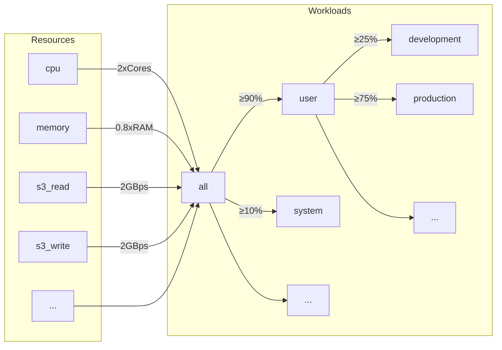
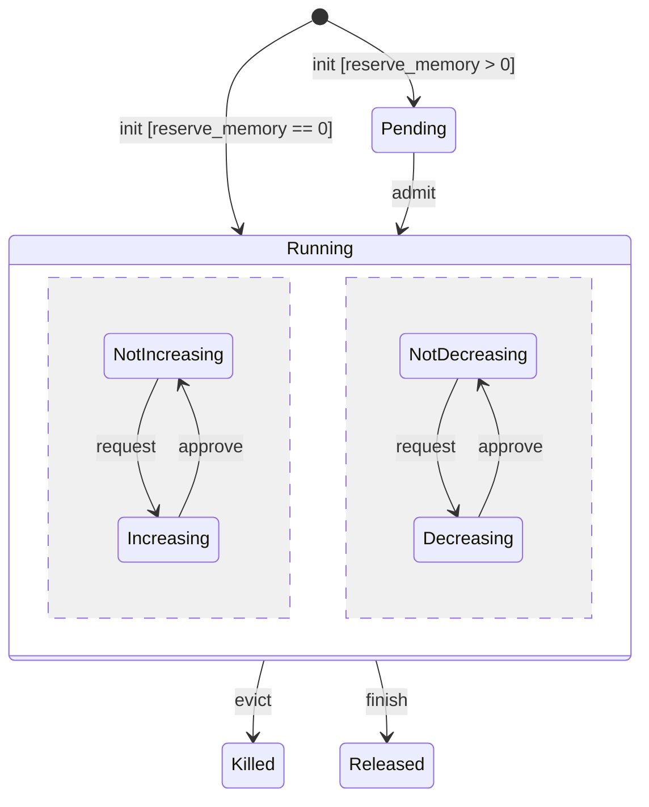
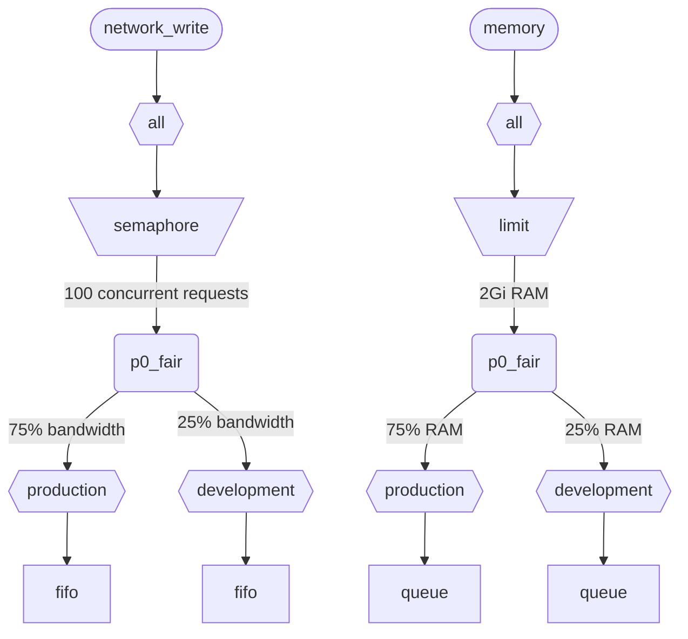

Cuando ClickHouse ejecuta varias consultas simultáneamente, estas comparten recursos (CPU, memoria e IO). Se pueden aplicar restricciones y políticas de planificación para regular cómo se utilizan y comparten los recursos entre distintas cargas de trabajo. Para todos los recursos, se puede configurar una jerarquía de planificación común. La raíz de la jerarquía representa los recursos compartidos, mientras que las hojas corresponden a cargas de trabajo específicas, que contienen solicitudes y asignaciones de recursos de consultas concretas y actividades en segundo plano.

<div id="resources">
  ## Recursos
</div>

De forma predeterminada, la planificación de cargas de trabajo está deshabilitada. Para habilitarla, debe crear recursos que se usarán para la planificación y al menos una carga de trabajo. Todos los recursos son independientes y pueden usarse en cualquier combinación.

Para habilitar la planificación de CPU, debe crear un recurso de CPU para hilos MASTER o WORKER (consulte [planificación de CPU](#cpu_scheduling) para obtener más detalles):

```sql
CREATE RESOURCE cpu (MASTER THREAD, WORKER THREAD)
```

Para habilitar la reserva de memoria para las cargas de trabajo, debe crear el recurso MEMORY (consulte [Reservas de memoria](#memory-reservations) para más detalles):

```sql
CREATE RESOURCE memory (MEMORY RESERVATION)
```

Para habilitar la planificación de slots de consulta, debe crear un recurso QUERY (consulte [Planificación de slots de consulta](#query_scheduling) para obtener más información):

```sql
CREATE RESOURCE query (QUERY)
```

Para habilitar la planificación de E/S para un disco específico, debes crear recursos de lectura y escritura para los accesos WRITE y READ:

```sql
CREATE RESOURCE resource_name (WRITE DISK disk_name, READ DISK disk_name)
-- or
CREATE RESOURCE read_resource_name (WRITE DISK write_disk_name)
CREATE RESOURCE write_resource_name (READ DISK read_disk_name)
```

Un recurso se puede usar en cualquier cantidad de discos, ya sea para READ, para WRITE o para ambos, READ y WRITE. Existe una sintaxis que permite usar un recurso en todos los discos:

```sql
CREATE RESOURCE all_io (READ ANY DISK, WRITE ANY DISK);
```

Los recursos se clasifican según el modo de compartición:

* **Recursos de tiempo compartido** (CPU, IO, slots de consulta) - gestionan solicitudes de recursos que se encolan en los nodos hoja de la jerarquía de planificación. Las solicitudes se planifican según las políticas y restricciones definidas por la jerarquía. Las solicitudes de recursos se crean cuando una consulta accede al recurso correspondiente. Por ejemplo, cuando una consulta lee datos del disco o usa la CPU para el procesamiento, se crean solicitudes de recursos por cada quantum de trabajo realizado o por la cantidad de bytes enviados o recibidos a través de un socket.
* **Recursos de espacio compartido** (memoria) - gestionan asignaciones de recursos en los nodos hoja de la jerarquía de planificación. Las asignaciones pueden estar en ejecución o pendientes. Las asignaciones pendientes se bloquean hasta que se libere suficiente espacio o se desaloje (termine) otra asignación. Las decisiones se basan en los límites y las políticas definidos por la jerarquía. Existe una correspondencia directa entre las asignaciones y las consultas (o las actividades en segundo plano). Se crea una asignación cuando una consulta comienza a ejecutarse y se libera cuando finaliza. Las asignaciones en ejecución pueden aumentar o disminuir su tamaño dinámicamente.

<div id="workloads">
  ## Jerarquía de cargas de trabajo
</div>

ClickHouse proporciona una sintaxis SQL práctica para definir la jerarquía de planificación. Todos los recursos se distribuyen a través de una jerarquía común de WORKLOAD. Las reglas de distribución pueden modificarse en ciertos aspectos para recursos específicos, pero la jerarquía sigue siendo la misma. Cada WORKLOAD mantiene los nodos de planificación necesarios para cada recurso. Se puede crear una carga de trabajo hija dentro de cualquier carga de trabajo, formando así la jerarquía. ClickHouse no impone ninguna estructura específica ni predefinida para la jerarquía de cargas de trabajo.

A continuación se muestra un ejemplo de una jerarquía que divide todos los recursos entre las cargas de trabajo &quot;user&quot; y &quot;system&quot;, con una garantía del 90 % y del 10 %, respectivamente. Tenga en cuenta que los pesos definidos para las cargas de trabajo se usan para la equidad max-min y, por lo tanto, solo proporcionan una garantía de mejor esfuerzo desde abajo (no un límite ni una cuota desde arriba). Toda la planificación se realiza de forma independiente en cada host y, por lo tanto, los límites definidos por la configuración `max_*` se aplican por host. La carga de trabajo &quot;user&quot; subdivide sus recursos entre las cargas de trabajo &quot;development&quot; y &quot;production&quot;, donde &quot;production&quot; dispone de 3 veces más recursos que &quot;development&quot;:

```sql
CREATE RESOURCE cpu (MASTER THREAD, WORKER THREAD)
CREATE RESOURCE memory (MEMORY RESERVATION)
CREATE RESOURCE s3_read (READ DISK s3)
CREATE RESOURCE s3_write (WRITE DISK s3)
CREATE WORKLOAD all SETTINGS max_concurrent_threads_ratio_to_cores = 2, max_memory_ratio = 0.8, max_bytes_per_second = '2Gi'
CREATE WORKLOAD user IN all SETTINGS weight = 9
CREATE WORKLOAD system IN all
CREATE WORKLOAD development IN user
CREATE WORKLOAD production IN user SETTINGS weight = 3
```



El nombre de una carga de trabajo hoja sin cargas de trabajo hijas puede usarse en los ajustes de la consulta `SETTINGS workload = 'name'`. Consulta [Marcado de cargas de trabajo](#workload-markup) para obtener más detalles.

Para personalizar la carga de trabajo, se pueden usar los siguientes ajustes:

* `priority` - (solo de tiempo compartido) las cargas de trabajo hermanas se atienden según valores estáticos (un valor más bajo significa una prioridad mayor). Determina la expulsión preventiva.
* `precedence` - (solo de espacio compartido) las cargas de trabajo hermanas se admiten según valores estáticos (un valor más bajo significa mayor precedencia). Determina el desalojo y la admisión.
* `weight` - las cargas de trabajo hermanas que tienen la misma prioridad o precedencia estática comparten los recursos de forma equitativa según sus pesos. Afecta a la expulsión preventiva, el desalojo y la admisión.
* `max_io_requests` - el límite del número de solicitudes de IO concurrentes en esta carga de trabajo.
* `max_bytes_inflight` - el límite del total de bytes en curso para las solicitudes concurrentes en esta carga de trabajo.
* `max_bytes_per_second` - el límite de la tasa de lectura o escritura en bytes de esta carga de trabajo.
* `max_burst_bytes` - el número máximo de bytes que la carga de trabajo puede procesar sin ser limitada (para cada recurso de forma independiente).
* `max_concurrent_threads` - el límite del número de hilos para las consultas en esta carga de trabajo.
* `max_concurrent_threads_ratio_to_cores` - igual que `max_concurrent_threads`, pero normalizado según el número de núcleos de CPU disponibles.
* `max_cpus` - el límite del número de núcleos de CPU para atender consultas en esta carga de trabajo.
* `max_cpu_share` - igual que `max_cpus`, pero normalizado según el número de núcleos de CPU disponibles.
* `max_burst_cpu_seconds` - el número máximo de segundos de CPU que la carga de trabajo puede consumir sin ser limitada debido a `max_cpus`.
* `max_memory` - el límite de la memoria total reservada para esta carga de trabajo.

Todos los límites especificados mediante los ajustes de la carga de trabajo son independientes para cada recurso. Por ejemplo, una carga de trabajo con `max_bytes_per_second = '10Mi'` tendrá un límite de ancho de banda de 10 MB/s para cada recurso de lectura y escritura de forma independiente. Si se requiere un límite común para lectura y escritura, considera usar el mismo recurso para el acceso READ y WRITE.

No hay forma de especificar distintas jerarquías de cargas de trabajo para diferentes recursos. Pero sí hay una manera de especificar un valor distinto de ajuste de carga de trabajo para un recurso específico:

```sql
CREATE OR REPLACE WORKLOAD all SETTINGS max_io_requests = 100, max_bytes_per_second = '1Mi' FOR network_read, max_bytes_per_second = '2Mi' FOR network_write
```

Tenga en cuenta también que una carga de trabajo o recurso no se puede eliminar si otra carga de trabajo hace referencia a él. Para actualizar la definición de una carga de trabajo, use la consulta `CREATE OR REPLACE WORKLOAD`.

:::note
Los ajustes de la carga de trabajo se traducen en un conjunto adecuado de nodos de planificación. Para más detalles de bajo nivel, consulte la descripción de los [tipos y opciones](#hierarchy) de los nodos de planificación.
:::

<div id="workload-markup">
  ## Marcado de cargas de trabajo
</div>

Las consultas pueden marcarse con la configuración `workload` para distinguir entre distintas cargas de trabajo. Si no se establece `workload`, se usa el valor &quot;default&quot;. Tenga en cuenta que también puede especificar otro valor mediante perfiles de configuración. Las restricciones de la configuración pueden usarse para hacer que `workload` sea constante si desea que todas las consultas del usuario se marquen con un valor fijo para la configuración `workload`.

:::warning
La configuración de consulta `workload` solo puede hacer referencia a cargas de trabajo hoja (es decir, cargas de trabajo sin hijos).
:::

```sql
SELECT count() FROM my_table WHERE value = 42 SETTINGS workload = 'production'
SELECT count() FROM my_table WHERE value = 13 SETTINGS workload = 'development'
```

Es posible asignar un ajuste de `workload` para las actividades en segundo plano. Las fusiones y las mutaciones usan los ajustes del servidor `merge_workload` y `mutation_workload`, respectivamente. Estos valores también pueden sobrescribirse para tablas específicas mediante los ajustes de MergeTree `merge_workload` y `mutation_workload`.

<div id="cpu_scheduling">
  ## Planificación de CPU
</div>

Para habilitar la planificación de CPU para las cargas de trabajo, cree un recurso de CPU y establezca un límite para la cantidad de hilos concurrentes:

```sql
CREATE RESOURCE cpu (MASTER THREAD, WORKER THREAD)
CREATE WORKLOAD all SETTINGS max_concurrent_threads = 100
```

Cuando el servidor ClickHouse ejecuta muchas consultas concurrentes con [múltiples hilos](/es/operations/settings/settings.md#max_threads) y todos los slots de CPU están en uso, se alcanza el estado de sobrecarga. En el estado de sobrecarga, cada slot de CPU que se libera se reasigna a la carga de trabajo adecuada según las políticas de planificación. Para las consultas que comparten la misma carga de trabajo, los slots se asignan mediante round-robin. Para las consultas en cargas de trabajo distintas, los slots se asignan según los pesos, prioridades y límites especificados para las cargas de trabajo.

Los hilos consumen tiempo de CPU cuando no están bloqueados y trabajan en tareas intensivas en CPU. A efectos de planificación, se distinguen dos tipos de hilos:

* Hilo maestro — el primer hilo que empieza a trabajar en una consulta o en una actividad en segundo plano, como una fusión o una mutación.
* Hilo de trabajo — los hilos adicionales que el maestro puede generar para trabajar en tareas intensivas en CPU.

Puede ser conveniente usar recursos separados para los hilos maestros y los hilos de trabajo a fin de lograr una mejor capacidad de respuesta. Un número elevado de hilos de trabajo puede monopolizar fácilmente los recursos de CPU cuando se usan valores altos del ajuste de consulta `max_threads`. En ese caso, las consultas entrantes tendrían que bloquearse y esperar un slot de CPU para que sus hilos maestros puedan iniciar la ejecución. Para evitarlo, se podría usar la siguiente configuración:

```sql
CREATE RESOURCE worker_cpu (WORKER THREAD)
CREATE RESOURCE master_cpu (MASTER THREAD)
CREATE WORKLOAD all SETTINGS max_concurrent_threads = 100 FOR worker_cpu, max_concurrent_threads = 1000 FOR master_cpu
```

Se crearán límites independientes para los hilos principales y los hilos de trabajo. Aunque los 100 slots de CPU de trabajo estén ocupados, las nuevas consultas no se bloquearán mientras haya slots de CPU principales disponibles. Comenzarán a ejecutarse con un solo hilo. Más adelante, si quedan disponibles slots de CPU de trabajo, esas consultas podrían escalar y generar sus hilos de trabajo. Por otro lado, este enfoque no vincula el número total de slots con el número de procesadores de CPU, y ejecutar demasiados hilos concurrentes afectará al rendimiento.

Limitar la concurrencia de los hilos principales no limitará el número de consultas concurrentes. Los slots de CPU podrían liberarse en mitad de la ejecución de una consulta y volver a ser adquiridos por otros hilos. Por ejemplo, 4 consultas concurrentes con un límite de 2 hilos principales concurrentes podrían ejecutarse todas en paralelo. En este caso, cada consulta recibirá el 50% de un procesador de CPU. Debe usarse una lógica independiente para limitar el número de consultas concurrentes, y actualmente no es compatible con las cargas de trabajo.

Podrían usarse límites independientes de concurrencia de hilos para las cargas de trabajo:

```sql
CREATE RESOURCE cpu (MASTER THREAD, WORKER THREAD)
CREATE WORKLOAD all
CREATE WORKLOAD admin IN all SETTINGS max_concurrent_threads = 10
CREATE WORKLOAD production IN all SETTINGS max_concurrent_threads = 100
CREATE WORKLOAD analytics IN production SETTINGS max_concurrent_threads = 60, weight = 9
CREATE WORKLOAD ingestion IN production
```

Este ejemplo de configuración proporciona grupos independientes de slots de CPU para admin y producción. El grupo de producción se comparte entre analítica e ingestión. Además, si el grupo de producción está sobrecargado, 9 de cada 10 slots liberados se reasignarán a las consultas analíticas si es necesario. Las consultas de ingestión solo recibirían 1 de cada 10 slots durante los períodos de sobrecarga. Esto puede mejorar la latencia de las consultas de cara al usuario. Analítica tiene su propio límite de 60 hilos concurrentes, lo que siempre deja al menos 40 hilos para la ingestión. Cuando no hay sobrecarga, la ingestión podría usar los 100 hilos.

Para excluir una consulta de la planificación de CPU, establezca la configuración de consulta [use&#95;concurrency&#95;control](/es/operations/settings/settings.md/#use_concurrency_control) en 0.

La planificación de CPU todavía no es compatible con fusiones y mutaciones.

Para proporcionar asignaciones justas a cada carga de trabajo, es necesario realizar preempción y escalado a la baja durante la ejecución de la consulta. La preempción se habilita con la configuración del servidor `cpu_slot_preemption`. Si está habilitada, cada hilo renueva periódicamente su slot de CPU (según la configuración del servidor `cpu_slot_quantum_ns`). Esa renovación puede bloquear la ejecución si la CPU está sobrecargada. Cuando la ejecución se bloquea durante un tiempo prolongado (consulte la configuración del servidor `cpu_slot_preemption_timeout_ms`), la consulta reduce su escala y el número de hilos que se ejecutan concurrentemente disminuye de forma dinámica. Tenga en cuenta que la equidad del tiempo de CPU está garantizada entre cargas de trabajo, pero entre consultas dentro de la misma carga de trabajo podría incumplirse en algunos casos límite.

:::warning
La planificación por slots ofrece una forma de controlar la [concurrencia de consultas](/es/operations/settings/settings.md#max_threads), pero no garantiza una asignación justa del tiempo de CPU a menos que la configuración del servidor `cpu_slot_preemption` esté establecida en `true`; de lo contrario, la equidad se basa en el número de asignaciones de slots de CPU entre las cargas de trabajo en competencia. Esto no implica una cantidad igual de segundos de CPU porque, sin preempción, un slot de CPU puede mantenerse indefinidamente. Un hilo adquiere un slot al principio y lo libera cuando termina el trabajo.
:::

:::note
Definir el recurso CPU desactiva el efecto de los ajustes [`concurrent_threads_soft_limit_num`](server-configuration-parameters/settings.md#concurrent_threads_soft_limit_num) y [`concurrent_threads_soft_limit_ratio_to_cores`](server-configuration-parameters/settings.md#concurrent_threads_soft_limit_ratio_to_cores). En su lugar, se usa el setting de carga de trabajo `max_concurrent_threads` para limitar la cantidad de CPU asignadas a una carga de trabajo específica. Para lograr el comportamiento anterior, cree solo el recurso WORKER THREAD, establezca `max_concurrent_threads` para la carga de trabajo `all` con el mismo valor que `concurrent_threads_soft_limit_num` y use el ajuste de consulta `workload = "all"`. Esta configuración corresponde al ajuste [`concurrent_threads_scheduler`](server-configuration-parameters/settings.md#concurrent_threads_scheduler) establecido en el valor &quot;fair&#95;round&#95;robin&quot;.
:::

<div id="threads_vs_cpus">
  ## Hilos vs. CPU
</div>

Hay dos formas de controlar el consumo de CPU de una carga de trabajo:

* Límite del número de hilos: `max_concurrent_threads` y `max_concurrent_threads_ratio_to_cores`
* Limitación de CPU: `max_cpus`, `max_cpu_share` y `max_burst_cpu_seconds`

:::warning
La configuración de limitación de CPU solo está activa si está habilitada la configuración del servidor `cpu_slot_preemption`; de lo contrario, se ignora.
:::

La primera permite controlar dinámicamente cuántos hilos se crean para una consulta, según la carga actual del servidor. En la práctica, reduce lo que establece la configuración de consulta `max_threads`. La segunda limita el consumo de CPU de la carga de trabajo mediante el algoritmo de token bucket. No afecta directamente al número de hilos, pero limita el consumo total de CPU de todos los hilos de la carga de trabajo.

La limitación con token bucket mediante `max_cpus` y `max_burst_cpu_seconds` significa lo siguiente. Durante cualquier intervalo de `delta` segundos, no se permite que el consumo total de CPU de todas las consultas de la carga de trabajo sea mayor que `max_cpus * delta + max_burst_cpu_seconds` segundos de CPU. Limita el consumo medio a `max_cpus` a largo plazo, pero este límite puede superarse a corto plazo. Por ejemplo, con `max_burst_cpu_seconds = 60` y `max_cpus=0.001`, se permite ejecutar 1 hilo durante 60 segundos, o 2 hilos durante 30 segundos, o 60 hilos durante 1 segundo, sin que se aplique limitación. El valor predeterminado de `max_burst_cpu_seconds` es 1 segundo. Valores más bajos pueden provocar una infrautilización de los núcleos permitidos por `max_cpus` cuando hay muchos hilos concurrentes.

Mientras ocupa un slot de CPU, un hilo puede estar en uno de tres estados principales:

* **Running:** Consume efectivamente recurso de CPU. El tiempo pasado en este estado se contabiliza para la limitación de CPU.
* **Ready:** Espera a que haya una CPU disponible. El tiempo pasado en este estado no se contabiliza para la limitación de CPU.
* **Blocked:** Realiza operaciones de E/S u otras syscalls bloqueantes (p. ej., espera en un mutex). El tiempo pasado en este estado no se contabiliza para la limitación de CPU.

Veamos un ejemplo de configuración que combina tanto la limitación de CPU como los límites del número de hilos:

```sql
CREATE RESOURCE cpu (MASTER THREAD, WORKER THREAD)
CREATE WORKLOAD all SETTINGS max_concurrent_threads_ratio_to_cores = 2
CREATE WORKLOAD admin IN all SETTINGS max_concurrent_threads = 2, priority = -1
CREATE WORKLOAD production IN all SETTINGS weight = 4
CREATE WORKLOAD analytics IN production SETTINGS max_cpu_share = 0.7, weight = 3
CREATE WORKLOAD ingestion IN production
CREATE WORKLOAD development IN all SETTINGS max_cpu_share = 0.3
```

Aquí limitamos el número total de hilos para todas las consultas a 2 veces las CPU disponibles. La carga de trabajo Admin está limitada a un máximo de exactamente dos hilos, independientemente del número de CPU disponibles. Admin tiene prioridad -1 (inferior al valor predeterminado 0) y, si es necesario, obtiene primero cualquier slot de CPU. Cuando Admin no ejecuta consultas, los recursos de CPU se reparten entre las cargas de trabajo de producción y desarrollo. Las cuotas garantizadas de tiempo de CPU se basan en pesos (4 a 1): al menos el 80% va a producción (si es necesario) y al menos el 20% va a desarrollo (si es necesario). Mientras que los pesos establecen garantías, la limitación de CPU establece límites: producción no tiene límite y puede consumir el 100%, mientras que desarrollo tiene un límite del 30%, que se aplica incluso si no hay consultas de otras cargas de trabajo. La carga de trabajo de producción no es un nodo hoja, por lo que sus recursos se reparten entre analítica e ingestión según los pesos (3 a 1). Esto significa que la analítica tiene una garantía de al menos 0.8 * 0.75 = 60% y, según `max_cpu_share`, tiene un límite del 70% de los recursos totales de CPU. Mientras que la ingestión se queda con una garantía de al menos 0.8 * 0.25 = 20%, no tiene límite superior.

:::note
Si quiere maximizar el uso de CPU en su servidor de ClickHouse, evite usar `max_cpus` y `max_cpu_share` para la carga de trabajo raíz `all`. En su lugar, configure un valor más alto para `max_concurrent_threads`. Por ejemplo, en un sistema con 8 CPU, configure `max_concurrent_threads = 16`. Esto permite que 8 hilos ejecuten tareas de CPU mientras otros 8 hilos pueden encargarse de operaciones de I/O. Los hilos adicionales generarán presión sobre la CPU, lo que garantiza que se apliquen las reglas de planificación. En cambio, configurar `max_cpus = 8` nunca generará presión sobre la CPU porque el servidor no puede superar las 8 CPU disponibles.
:::

<div id="memory-reservations">
  ## Reservas de memoria
</div>

:::note
La planificación de reservas de memoria es experimental. Solo surte efecto cuando existe un recurso `MEMORY RESERVATION`, y su sintaxis SQL y su comportamiento pueden cambiar en versiones futuras. Aún no es compatible con fusiones ni mutaciones, y la expulsión de una consulta en ejecución se aplica de la mejor manera posible: surte efecto en el siguiente punto de sincronización de memoria de la consulta, en lugar de hacerlo de forma instantánea.
:::

Para habilitar las reservas de memoria para las cargas de trabajo, cree un recurso MEMORY RESERVATION y establezca al menos un límite para la memoria total reservada mediante la configuración de la carga de trabajo:

```sql
CREATE RESOURCE memory (MEMORY RESERVATION)
CREATE WORKLOAD all SETTINGS max_memory = '2Gi'
```

ClickHouse rastrea las asignaciones de memoria de todas las consultas y actividades en segundo plano. La cantidad de bytes asignados se agrega a través de la jerarquía de planificación hasta la raíz. Cada consulta tiene una asignación asociada en la carga de trabajo hoja a la que pertenece. Si una consulta tiene la configuración `reserve_memory` mayor que cero, la asignación se crea en estado pendiente. Una asignación pendiente reserva la cantidad de memoria solicitada en la jerarquía de cargas de trabajo. Si no hay suficiente memoria disponible, la asignación permanece pendiente hasta que se libere suficiente memoria o se desalojen otras asignaciones (se terminen). Cuando una asignación es admitida, pasa a estar en ejecución. Una asignación en ejecución puede aumentar o disminuir su tamaño dinámicamente según el consumo de memoria de la consulta. El ciclo de vida de una asignación puede representarse con el siguiente diagrama de estados:



Las asignaciones pendientes de una carga de trabajo hoja se admiten en orden FIFO. Cuando varias cargas de trabajo tienen asignaciones pendientes, se admiten según la precedencia y la configuración de pesos. Las cargas de trabajo con mayor precedencia se atienden primero. Las cargas de trabajo hermanas con la misma precedencia comparten la memoria según los pesos de forma max-min justa, lo que significa que la carga de trabajo con menor uso de memoria normalizado (uso actual más el incremento solicitado dividido por el peso) se atiende primero. La lógica inversa se aplica durante la expulsión. Cuando es necesario liberar memoria, las cargas de trabajo con menor precedencia y mayor uso de memoria normalizado se expulsan primero.

Tenga en cuenta que los recursos de tiempo compartido usan prioridad, mientras que los recursos de espacio compartido usan precedencia. Son configuraciones independientes y pueden establecerse con valores distintos. Una prioridad más alta implica una preempción no destructiva (retraso o limitación), mientras que una precedencia más alta puede implicar una expulsión destructiva (se detiene con un error). Una carga de trabajo puede tener alta prioridad para la planificación de CPU, pero la misma precedencia para la reserva de memoria, para evitar expulsar otras cargas de trabajo y perder el trabajo que ya habían realizado.

Toda carga de trabajo con un límite `max_memory` garantiza que la memoria total asignada en su subárbol no supere ese límite. Si una asignación pendiente o una ampliación de una asignación supera el límite, se inicia el procedimiento de expulsión para liberar memoria. El procedimiento de expulsión selecciona una víctima para terminarla. La carga de trabajo que es el ancestro común más cercano de killer y victim impide la expulsión en las siguientes situaciones:

* La asignación pendiente no puede expulsar asignaciones en ejecución dentro de la misma carga de trabajo. (Las cargas de trabajo killer y victim coinciden).
* Una asignación pendiente con menor precedencia nunca termina una carga de trabajo con mayor precedencia.
* La asignación pendiente no puede terminar una asignación de la misma precedencia. Tenga en cuenta que las asignaciones en ejecución con la misma precedencia pueden expulsarse entre sí en función del uso de memoria normalizado.
  Si la expulsión se impide o no libera suficiente memoria, la nueva asignación se bloquea hasta que se libere suficiente memoria. Estas reglas permiten el encolado de consultas cuando hay presión de memoria y ofrecen una forma práctica de evitar errores MEMORY&#95;LIMIT&#95;EXCEEDED.

:::note
Los límites de las cargas de trabajo son independientes de otras formas de limitar el consumo de memoria, como la configuración de consulta [max&#95;memory&#95;usage](/es/operations/settings/settings.md#max_memory_usage). Pueden usarse conjuntamente para lograr un mejor control sobre el consumo de memoria. Es posible establecer límites de memoria independientes por usuario (no por cargas de trabajo). Esto es menos flexible y no ofrece funciones como la reserva de memoria y el encolado de consultas pendientes. Consulte [Memory overcommit](settings/memory-overcommit.md)
:::

La configuración de carga de trabajo `max_waiting_queries` limita el número de asignaciones pendientes de la carga de trabajo. Cuando se alcanza el límite, el servidor devuelve un error `SERVER_OVERLOADED`. Tenga en cuenta que `max_waiting_queries` no se hereda en las cargas de trabajo hijas y solo tiene sentido para las cargas de trabajo hoja.

La planificación de la reserva de memoria aún no es compatible con fusiones y mutaciones.

Solo las consultas con la configuración `reserve_memory` mayor que cero pueden bloquearse mientras esperan la reserva de memoria. Sin embargo, las consultas con `reserve_memory` igual a cero también se tienen en cuenta en la huella de memoria de su carga de trabajo, y pueden ser desalojadas si es necesario para liberar memoria para otras asignaciones pendientes o en aumento. Las consultas sin el marcado de carga de trabajo adecuado no están sujetas a la planificación de la reserva de memoria y el planificador no puede desalojarlas.

Para proporcionar una reserva de memoria no elástica para una consulta, establezca los valores de las configuraciones de consulta `reserve_memory` y `max_memory_usage` en el mismo valor. En este caso, la consulta reservará una cantidad fija de memoria y no podrá aumentar su asignación de forma dinámica. Tenga en cuenta que la reserva de memoria elástica puede aumentarse por encima de `reserve_memory` hasta `max_memory_usage` sin que la consulta se termine, a menos que haya presión de memoria. Pero no puede reducirse por debajo de `reserve_memory` incluso cuando el consumo real sea menor.

Consideremos un ejemplo de configuración:

```sql
CREATE RESOURCE memory (MEMORY RESERVATION)
CREATE WORKLOAD all SETTINGS max_memory = '10Gi'
CREATE WORKLOAD system IN all SETTINGS weight = 1
CREATE WORKLOAD user IN all SETTINGS weight = 9
CREATE WORKLOAD production IN user SETTINGS precedence = 1, weight = 3
CREATE WORKLOAD staging IN user SETTINGS precedence = 1, weight = 1
CREATE WORKLOAD testing IN user SETTINGS precedence = 2
```

En este ejemplo, la memoria total reservada por todas las consultas y las actividades en segundo plano no puede superar los 10 GiB. La carga de trabajo del sistema tiene garantizado al menos 1 GiB (el 10 % de 10 GiB), mientras que la carga de trabajo del usuario tiene garantizados al menos 9 GiB (el 90 % de 10 GiB). Dentro de la carga de trabajo del usuario, las cargas de trabajo de producción y staging comparten la memoria según sus pesos (3 a 1), con la misma precedencia de 1. La carga de trabajo de pruebas tiene precedencia 2, que es inferior a la de las cargas de trabajo de producción y staging. Por lo tanto, la carga de trabajo de pruebas solo puede usar memoria que no estén usando las cargas de trabajo de producción y staging.

Si se produce presión de memoria, las asignaciones de la carga de trabajo de pruebas serán desalojadas primero. Después, si es necesario liberar más memoria, las asignaciones de la carga de trabajo de staging se desalojarán antes que las de la carga de trabajo de producción si superan sus garantías. Tenga en cuenta que las consultas pendientes en producción y staging pueden desalojar asignaciones en ejecución en la carga de trabajo de pruebas para liberar memoria, pero no pueden desalojarse entre sí porque tienen la misma precedencia. En caso de presión de memoria, esperarán en colas, lo que permite al sistema evitar errores MEMORY&#95;LIMIT&#95;EXCEEDED debidos a demasiadas consultas ejecutándose de forma concurrente.

Tenga en cuenta que la carga de trabajo del sistema tiene precedencia 0 (por defecto), que es superior a la de las cargas de trabajo de producción, staging y pruebas, pero no son cargas de trabajo hermanas. El ancestro común más cercano es la carga de trabajo all, cuyos dos hijos tienen la misma precedencia. Por lo tanto, la carga de trabajo del sistema pendiente no puede desalojar a ninguna de ellas, ni viceversa. Esto garantiza que las actividades del sistema no puedan ser desalojadas fácilmente.

<div id="query_scheduling">
  ## Planificación de slots de consultas
</div>

Para habilitar la planificación de slots de consultas para las cargas de trabajo, cree el recurso QUERY y establezca un límite para el número de consultas concurrentes o de consultas por segundo:

```sql
CREATE RESOURCE query (QUERY)
CREATE WORKLOAD all SETTINGS max_concurrent_queries = 100, max_queries_per_second = 10, max_burst_queries = 20
```

La configuración de carga de trabajo `max_concurrent_queries` limita el número de consultas concurrentes que pueden ejecutarse simultáneamente para una carga de trabajo determinada. Es análoga a la configuración de consulta [`max_concurrent_queries_for_all_users`](/es/operations/settings/settings#max_concurrent_queries_for_all_users) y a la configuración del servidor [max&#95;concurrent&#95;queries](/es/operations/server-configuration-parameters/settings#max_concurrent_queries). Las consultas de async insert y algunas consultas específicas, como KILL, no se contabilizan para este límite.

Las configuraciones de carga de trabajo `max_queries_per_second` y `max_burst_queries` limitan el número de consultas de la carga de trabajo mediante un limitador de tasa de tipo token bucket. Esto garantiza que, durante cualquier intervalo de tiempo `T`, no se iniciará la ejecución de más de `max_queries_per_second * T + max_burst_queries` consultas nuevas.

La configuración de carga de trabajo `max_waiting_queries` limita el número de consultas en espera para la carga de trabajo. Cuando se alcanza el límite, el servidor devuelve un error `SERVER_OVERLOADED`. Tenga en cuenta que `max_waiting_queries` no se hereda en las cargas de trabajo hijas y solo tiene sentido para las cargas de trabajo hoja.

:::note
Las consultas bloqueadas esperarán indefinidamente y no aparecerán en `SHOW PROCESSLIST` hasta que se cumplan todas las restricciones.
:::

<div id="workload_entity_storage">
  ## Almacenamiento de cargas de trabajo y recursos
</div>

Las definiciones de todos las cargas de trabajo y recursos, en forma de consultas `CREATE WORKLOAD` y `CREATE RESOURCE`, se almacenan de forma persistente, ya sea en disco en `workload_path` o en ZooKeeper en `workload_zookeeper_path`. Se recomienda el almacenamiento en ZooKeeper para mantener la consistencia entre nodos. Como alternativa, se puede usar la cláusula `ON CLUSTER` junto con el almacenamiento en disco.

<div id="config_based_workloads">
  ## Cargas de trabajo y recursos basados en la configuración
</div>

Además de las definiciones basadas en SQL, las cargas de trabajo y los recursos pueden predefinirse en el archivo de configuración del servidor. Esto resulta útil en entornos de nube donde algunas limitaciones vienen impuestas por la infraestructura, mientras que otros límites pueden ser modificados por los clientes. Las entidades basadas en la configuración tienen prioridad sobre las definidas en SQL y no pueden modificarse ni eliminarse mediante comandos SQL.

<div id="config_based_workloads_format">
  ### Formato de la configuración
</div>

```xml
<clickhouse>
    <resources_and_workloads>
        CREATE RESOURCE memory (MEMORY RESERVATION);
        CREATE RESOURCE s3disk_read (READ DISK s3);
        CREATE RESOURCE s3disk_write (WRITE DISK s3);
        CREATE WORKLOAD all SETTINGS max_memory = '2Gi', max_io_requests = 500 FOR s3disk_read, max_io_requests = 1000 FOR s3disk_write, max_bytes_per_second = '1280Mi' FOR s3disk_read, max_bytes_per_second = '3200Mi' FOR s3disk_write;
        CREATE WORKLOAD production IN all SETTINGS weight = 3;
    </resources_and_workloads>
</clickhouse>
```

La configuración utiliza la misma sintaxis SQL que las sentencias `CREATE WORKLOAD` y `CREATE RESOURCE`. Todas las consultas deben ser válidas.

<div id="config_based_workloads_usage_recommendations">
  ### Recomendaciones de uso
</div>

Para entornos en la nube, una configuración típica podría incluir:

1. Definir la carga de trabajo raíz y los recursos de E/S de red en la configuración para establecer los límites de la infraestructura
2. Establecer `throw_on_unknown_workload` para hacer cumplir estos límites
3. Crear un `CREATE WORKLOAD default IN all` para aplicar automáticamente los límites a todas las consultas (ya que el valor predeterminado del ajuste de consulta `workload` es &#39;default&#39;)
4. Permitir que los usuarios creen cargas de trabajo adicionales dentro de la jerarquía configurada

Esto garantiza que todas las actividades en segundo plano y las consultas respeten las limitaciones de la infraestructura, sin dejar de permitir flexibilidad para políticas de planificación específicas de cada usuario.

Otro caso de uso es tener una configuración distinta para diferentes nodos en un clúster heterogéneo.

<div id="strict_resource_access">
  ## Acceso estricto a los recursos
</div>

Para obligar a que todas las consultas sigan las políticas de planificación de recursos, existe la configuración del servidor `throw_on_unknown_workload`. Si se establece en `true`, cada consulta debe usar una configuración de consulta `workload` válida; de lo contrario, se lanza la excepción `RESOURCE_ACCESS_DENIED`. Si se establece en `false`, esa consulta no usa el planificador de recursos; es decir, obtiene acceso ilimitado a cualquier `RESOURCE`. La configuración de consulta &#39;use&#95;concurrency&#95;control = 0&#39; permite que una consulta evite el planificador de CPU y obtenga acceso ilimitado a la CPU. Para exigir la planificación de CPU, cree una restricción de configuración para mantener &#39;use&#95;concurrency&#95;control&#39; como un valor constante de solo lectura.

:::note
No establezca `throw_on_unknown_workload` en `true` a menos que se haya ejecutado `CREATE WORKLOAD default`. Esto podría provocar problemas durante el inicio del servidor si se ejecuta una consulta sin la configuración explícita `workload`.
:::

<div id="hierarchy">
  ### Jerarquía de nodos de planificación
</div>

Desde la perspectiva del subsistema de planificación, cada recurso representa una jerarquía de nodos de planificación. ClickHouse crea automáticamente todos los nodos de planificación necesarios a partir de las definiciones de WORKLOAD y RESOURCE. Los nodos de planificación son detalles de implementación de bajo nivel a los que se puede acceder a través de la tabla [system.scheduler](/es/operations/system-tables/scheduler.md).

```sql
CREATE RESOURCE network_write (WRITE DISK s3)
CREATE RESOURCE memory (MEMORY RESERVATION)
CREATE WORKLOAD all SETTINGS max_io_requests = 100, max_memory = '2Gi'
CREATE WORKLOAD development IN all
CREATE WORKLOAD production IN all SETTINGS weight = 3
```



**Tipos de nodos de tiempo compartido:**

* `inflight_limit` (constraint) - bloquea si el número de solicitudes simultáneas en curso supera `max_requests`, o si su coste total supera `max_cost`; debe tener un único nodo hijo.
* `bandwidth_limit` (constraint) - bloquea si el ancho de banda actual supera `max_speed` (0 significa ilimitado) o si la ráfaga supera `max_burst` (de forma predeterminada, es igual a `max_speed`); debe tener un único nodo hijo.
* `fair` (policy) - selecciona la siguiente solicitud que se atenderá de uno de sus nodos hijo según la equidad max-min; los nodos hijo pueden especificar `weight` (el valor predeterminado es 1).
* `priority` (policy) - selecciona la siguiente solicitud que se atenderá de uno de sus nodos hijo según prioridades estáticas (un valor menor significa una prioridad más alta); los nodos hijo deben especificar `priority` (el valor predeterminado es 0).
* `fifo` (queue) - hoja de la jerarquía capaz de contener solicitudes que superan la capacidad del recurso.

**Tipos de nodos de espacio compartido:**

* `limit` - garantiza que la asignación total del hijo nunca supere un límite e inicia un procedimiento de expulsión en un subárbol si es necesario; debe tener un único nodo hijo.
* `fair_allocation` - aplica la expulsión según la equidad max-min; una asignación pendiente nunca expulsa a una en ejecución; los nodos hijo pueden especificar `weight` (el valor predeterminado es 1).
* `precedence_allocation` - aplica la expulsión según la precedencia estática (un valor menor significa mayor precedencia); una asignación pendiente de mayor precedencia expulsa las asignaciones de menor precedencia; los nodos hijo deben especificar `precedence` (el valor predeterminado es 0).
* `queue` - hoja de la jerarquía capaz de contener asignaciones en ejecución y pendientes.

<div id="deprecated-configuration">
  ## Configuración XML obsoleta
</div>

Otra forma de indicar qué discos utiliza un recurso es mediante la `storage_configuration` del servidor:

Para habilitar la planificación de E/S para un disco específico, tienes que especificar `read_resource` y/o `write_resource` en la configuración de almacenamiento. Esto le indica a ClickHouse qué recurso debe usar para cada solicitud de lectura y escritura en ese disco. El recurso de lectura y el de escritura pueden referirse al mismo nombre de recurso, lo que resulta útil para SSD locales o HDD. Varios discos diferentes también pueden referirse al mismo recurso, lo que resulta útil para discos remotos: si quieres repartir equitativamente el ancho de banda de red entre, por ejemplo, las cargas de trabajo de &quot;production&quot; y &quot;development&quot;.

Ejemplo:

```xml
<clickhouse>
    <storage_configuration>
        ...
        <disks>
            <s3>
                <type>s3</type>
                <endpoint>https://clickhouse-public-datasets.s3.amazonaws.com/my-bucket/root-path/</endpoint>
                <access_key_id>your_access_key_id</access_key_id>
                <secret_access_key>your_secret_access_key</secret_access_key>
                <read_resource>network_read</read_resource>
                <write_resource>network_write</write_resource>
            </s3>
        </disks>
        <policies>
            <s3_main>
                <volumes>
                    <main>
                        <disk>s3</disk>
                    </main>
                </volumes>
            </s3_main>
        </policies>
    </storage_configuration>
</clickhouse>
```

Tenga en cuenta que las opciones de configuración del servidor tienen prioridad sobre la manera de definir recursos mediante SQL.

El siguiente ejemplo muestra cómo definir las jerarquías de planificación de E/S que se muestran en la imagen anterior:

```xml
<clickhouse>
    <resources>
        <network_read>
            <node path="/">
                <type>inflight_limit</type>
                <max_requests>100</max_requests>
            </node>
            <node path="/fair">
                <type>fair</type>
            </node>
            <node path="/fair/prod">
                <type>fifo</type>
                <weight>3</weight>
            </node>
            <node path="/fair/dev">
                <type>fifo</type>
            </node>
        </network_read>
        <network_write>
            <node path="/">
                <type>inflight_limit</type>
                <max_requests>100</max_requests>
            </node>
            <node path="/fair">
                <type>fair</type>
            </node>
            <node path="/fair/prod">
                <type>fifo</type>
                <weight>3</weight>
            </node>
            <node path="/fair/dev">
                <type>fifo</type>
            </node>
        </network_write>
    </resources>
</clickhouse>
```

Para poder usar toda la capacidad del recurso subyacente, debe usar `inflight_limit`. Tenga en cuenta que un valor bajo de `max_requests` o `max_cost` puede hacer que el recurso no se aproveche por completo, mientras que valores demasiado altos pueden generar colas vacías dentro del scheduler, lo que a su vez hará que se ignoren las políticas (falta de equidad o ignorar prioridades) en el subárbol. Por otro lado, si quiere proteger los recursos frente a una utilización excesiva, debe usar `bandwidth_limit`. Este limita la velocidad cuando la cantidad de recurso consumida en `duration` segundos supera `max_burst + max_speed * duration` bytes. Se pueden usar dos nodos `bandwidth_limit` sobre el mismo recurso para limitar el ancho de banda pico durante intervalos cortos y el ancho de banda promedio durante intervalos más largos.

<div id="workload-classifiers">
  ### Clasificadores de carga de trabajo en desuso
</div>

Los clasificadores de carga de trabajo se usan para definir la asignación de la `carga de trabajo` especificada por una consulta a las colas terminales que deben usarse para recursos específicos. Por el momento, la clasificación de carga de trabajo es sencilla: solo está disponible la asignación estática.

Ejemplo:

```xml
<clickhouse>
    <workload_classifiers>
        <production>
            <network_read>/fair/prod</network_read>
            <network_write>/fair/prod</network_write>
        </production>
        <development>
            <network_read>/fair/dev</network_read>
            <network_write>/fair/dev</network_write>
        </development>
        <default>
            <network_read>/fair/dev</network_read>
            <network_write>/fair/dev</network_write>
        </default>
    </workload_classifiers>
</clickhouse>
```

<div id="see-also">
  ## Véase también
</div>

* [system.scheduler](/es/operations/system-tables/scheduler.md)
* [system.workloads](/es/operations/system-tables/workloads.md)
* [system.resources](/es/operations/system-tables/resources.md)
* [merge&#95;workload](/es/operations/settings/merge-tree-settings.md#merge_workload) ajuste de MergeTree
* [merge&#95;workload](/es/operations/server-configuration-parameters/settings.md#merge_workload) ajuste global del servidor
* [mutation&#95;workload](/es/operations/settings/merge-tree-settings.md#mutation_workload) ajuste de MergeTree
* [mutation&#95;workload](/es/operations/server-configuration-parameters/settings.md#mutation_workload) ajuste global del servidor
* [workload&#95;path](/es/operations/server-configuration-parameters/settings.md#workload_path) ajuste global del servidor
* [workload&#95;zookeeper&#95;path](/es/operations/server-configuration-parameters/settings.md#workload_zookeeper_path) ajuste global del servidor
* [cpu&#95;slot&#95;preemption](/es/operations/server-configuration-parameters/settings.md#cpu_slot_preemption) ajuste global del servidor
* [cpu&#95;slot&#95;quantum&#95;ns](/es/operations/server-configuration-parameters/settings.md#cpu_slot_quantum_ns) ajuste global del servidor
* [cpu&#95;slot&#95;preemption&#95;timeout&#95;ms](/es/operations/server-configuration-parameters/settings.md#cpu_slot_preemption_timeout_ms) ajuste global del servidor