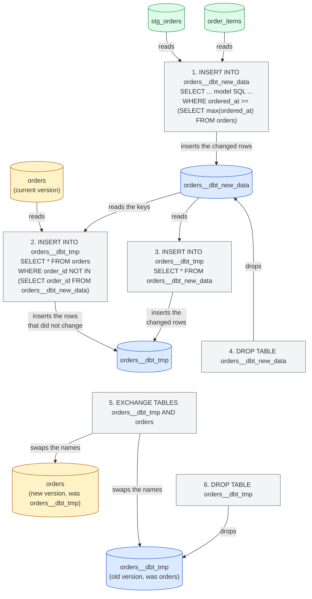
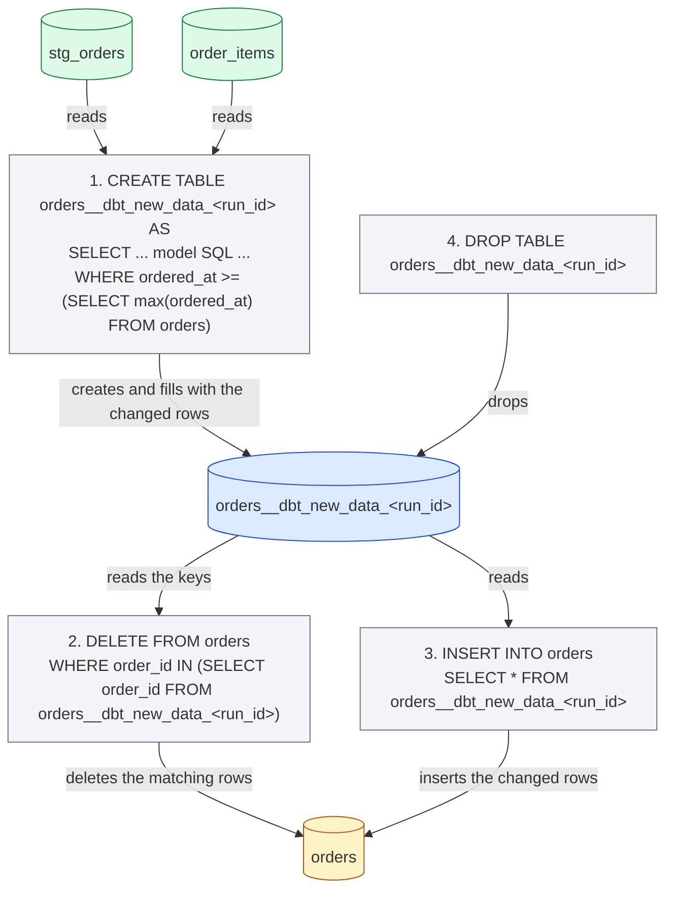
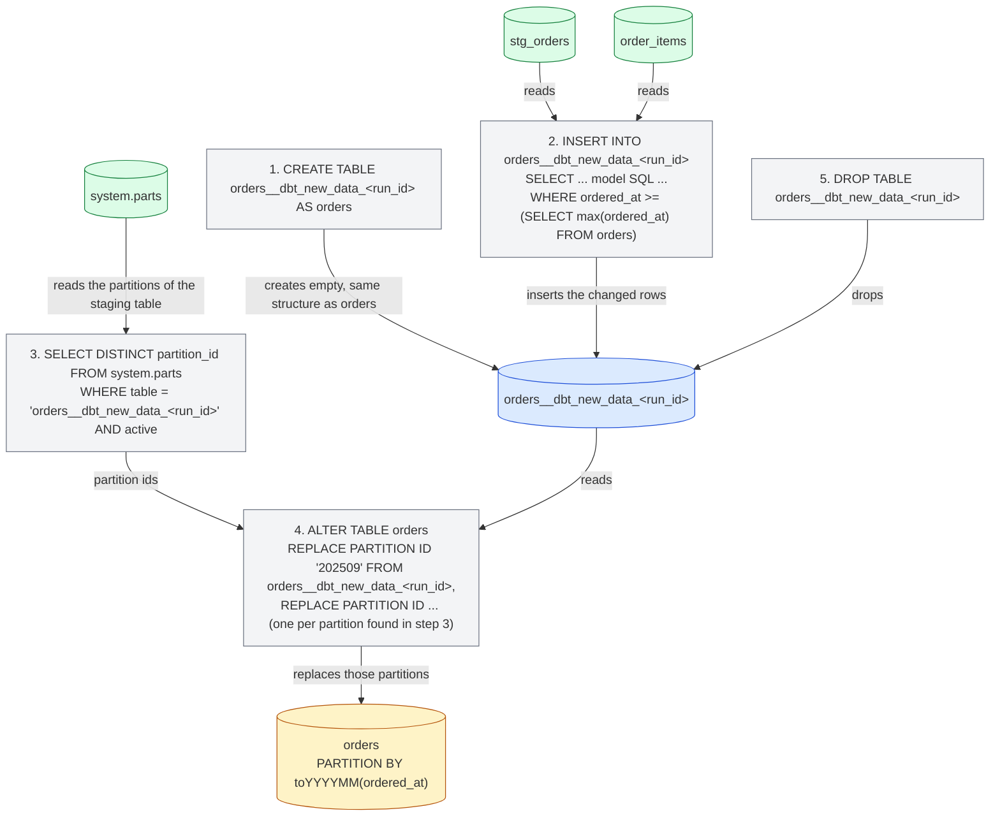

import { ClickHouseSupportedBadge } from "/snippets/es/components/ClickHouseSupported/ClickHouseSupported.jsx";

<ClickHouseSupportedBadge />

Esta guía recorre los aspectos específicos de ClickHouse en dbt usando el proyecto [Jaffle Shop for ClickHouse](https://github.com/ClickHouse/jaffle-shop-clickhouse), la adaptación a ClickHouse del clásico proyecto de ejemplo de dbt Labs. Partiendo de un proyecto que ya se construye correctamente, muestra cómo:

1. Comprender cómo se materializan en ClickHouse las views y tables del proyecto.
2. Cargar datos con seeds y controlar los tipos de ClickHouse y la disposición de la tabla.
3. Configurar un modelo de tipo table con un motor de ClickHouse, una sorting key y particionamiento.
4. Convertir una table en un modelo incremental y elegir una incremental strategy.
5. Crear un snapshot.
6. Usar vistas materializadas de ClickHouse.

Está pensada para leerse junto con el resto de la [documentación](/es/integrations/connectors/data-ingestion/etl-tools/dbt/index), la página de [funcionalidad y configuración](/es/integrations/connectors/data-ingestion/etl-tools/dbt/features-and-configurations) y la [referencia de materializaciones](/es/integrations/connectors/data-ingestion/etl-tools/dbt/materializations).

## Antes de empezar {#before-you-start}

Sigue primero el README de [ClickHouse/jaffle-shop-clickhouse](https://github.com/ClickHouse/jaffle-shop-clickhouse). Allí se explica cómo configurar el proyecto con dbt Core 1.x, dbt OSS, dbt v2 o la plataforma dbt, cómo apuntarlo a un ClickHouse local (docker) o a ClickHouse Cloud, cómo cargar los datos de ejemplo con `dbt seed` y cómo ejecutar el primer `dbt build`. Una vez que `dbt build` finalice correctamente, vuelve aquí para ver los ejemplos y configuraciones específicos de ClickHouse.

Tras seguir los pasos del README deberías tener dos bases de datos en ClickHouse:

* `raw`: las seis tablas de origen cargadas desde CSV files mediante `dbt seed` (`raw_customers`, `raw_orders`, `raw_items`, `raw_products`, `raw_stores`, `raw_supplies`).
* `jaffle_shop` (el `schema` de tu profile): seis vistas de staging (`stg_*`) y siete tablas de mart (`customers`, `orders`, `order_items`, `products`, `locations`, `supplies`, `metricflow_time_spine`).

Si tu profile usa un `schema` distinto, sustituye `jaffle_shop` por tu valor en las consultas que aparecen a continuación.

<Note>
  **dbt Core 1.x, dbt OSS, dbt v2 y la plataforma dbt.** Todos los comandos y modelos de esta guía son idénticos en todos ellos. Los ejemplos se probaron con dbt Core 1.12 y `dbt-clickhouse` 1.10, y con dbt OSS 2.0, contra ClickHouse 26.8; dbt v2 ejecuta el mismo adaptador, y la plataforma dbt ejecuta dbt v2. La salida de consola que se muestra corresponde a dbt Core 1.x, y se señalan los pocos casos en los que los motores se comportan de forma distinta. Consulta la [página de dbt OSS, dbt v2 y la plataforma dbt](/es/integrations/connectors/data-ingestion/etl-tools/dbt/dbt-core-v2-fusion-and-platform) para conocer el estado actual del adaptador v2, y [Connect ClickHouse](https://docs.getdbt.com/docs/platform/connect-data-platform/connect-clickhouse) en la documentación de dbt para empezar a usar la plataforma dbt.
</Note>

Todas las sentencias SQL que no sean comandos de dbt están pensadas para ejecutarse directamente contra ClickHouse, por ejemplo con `clickhouse client`, la SQL console de ClickHouse Cloud o el client SQL que prefieras.

## Cómo se materializa el proyecto {#views-and-tables}

Jaffle Shop define sus materializaciones en `dbt_project.yml`: los modelos de staging son vistas y los marts son tablas.

```yaml
models:
  jaffle_shop:
    staging:
      +materialized: view
    marts:
      +materialized: table
```

Un model de tipo **view** se reconstruye con una sentencia `CREATE OR REPLACE VIEW` en cada ejecución. No almacena datos, por lo que construirlo no tiene coste alguno, pero cada consulta que se realiza sobre él ejecuta el SQL del model sobre las source tables. ClickHouse conserva el SQL compilado del model en la view definition:

```sql
SHOW CREATE VIEW jaffle_shop.stg_orders;
```

```response
CREATE VIEW jaffle_shop.stg_orders
(
    `order_id` String,
    `location_id` String,
    `customer_id` String,
    ...
    `ordered_at` DateTime
)
AS WITH
    source AS
    (
        SELECT *
        FROM raw.raw_orders
    ),
    renamed AS
    (
        SELECT
            id AS order_id,
            store_id AS location_id,
            ...
            dateTrunc('day', ordered_at) AS ordered_at
        FROM source
    )
SELECT *
FROM renamed
```

Un modelo **table** se reconstruye desde cero en cada ejecución: el adaptador crea una tabla nueva, ejecuta un `INSERT INTO ... SELECT` con el SQL del modelo y la intercambia atómicamente con la versión anterior. El rendimiento de las consultas es mucho mejor que con una vista, a costa del almacenamiento y de tener que reconstruir toda la tabla cada vez. Observa la tabla que dbt creó para el mart `orders`:

```sql
SHOW CREATE TABLE jaffle_shop.orders;
```

```response
CREATE TABLE jaffle_shop.orders
(
    `order_id` String,
    `location_id` String,
    `customer_id` String,
    ...
    `customer_order_number` UInt64
)
ENGINE = MergeTree
ORDER BY tuple()
SETTINGS replicated_deduplication_window = '0', index_granularity = 8192
```

Aquí hay dos aspectos específicos de ClickHouse. El modelo no declara ningún motor de tabla, por lo que el adaptador usa `MergeTree`, y tampoco declara una sorting key, por lo que el adaptador usa `ORDER BY tuple()`, es decir, los datos no se ordenan en absoluto. Esto es aceptable en un proyecto de ejemplo, pero en una tabla real conviene definir ambos, que es justamente lo que se hace en las secciones siguientes. La [página de materializaciones](/es/integrations/connectors/data-ingestion/etl-tools/dbt/materializations) enumera todas las configuraciones de tabla que admite el adaptador.

## Carga de datos con seeds {#seeds}

Jaffle Shop utiliza los [seeds](https://docs.getdbt.com/docs/build/seeds) de dbt para cargar sus datos sin procesar desde los archivos CSV de `seeds/jaffle-data`. Los seeds están pensados para datos de referencia pequeños y estáticos (tablas de códigos, correspondencias), no para cargar un warehouse; el proyecto los usa por comodidad, para que puedas empezar sin necesidad de otra herramienta de ingestión, y por eso están deshabilitados a menos que pases `--vars '{"load_source_data": true}'`.

Aun así, los seeds son un buen punto de partida para aprender cómo dbt crea tablas de ClickHouse. dbt infiere un tipo de columna para cada columna del CSV, y los tipos inferidos difieren entre motores:

| Valor del CSV         | dbt v1     | motor v2        |
| --------------------- | ---------- | --------------- |
| `700`                 | `Int32`    | `Int64`         |
| `0.06`                | `Float32`  | `Float64`       |
| `2024-09-01T15:01:00` | `DateTime` | `DateTime64(6)` |
| `Philadelphia`        | `String`   | `String`        |

Cuando el tipo importa, fíjalo con `column_types`. El proyecto ya lo hace para la columna `opened_at` del seed `raw_stores` en `dbt_project.yml`:

```yaml
seeds:
  jaffle_shop:
    +schema: raw
    jaffle-data:
      +enabled: "{{ var('load_source_data', false) }}"
      raw_stores:
        +column_types:
          opened_at: DateTime64(3)
```

Los seeds también aceptan las configuraciones de tabla de ClickHouse `engine`, `order_by` y `partition_by`. Por ejemplo, para ordenar el seed `raw_orders` por la hora del pedido y particionarlo por mes, añada un archivo de propiedades junto a los CSV: `seeds/jaffle-data/_raw_orders.yml`:

```yaml
seeds:
  - name: raw_orders
    config:
      order_by: (ordered_at, id)
      partition_by: toYYYYMM(ordered_at)
```

<Note>
  Utilice un archivo de propiedades para estas configuraciones de seed de ClickHouse en lugar de las claves `+order_by` o `+engine` dentro de `seeds:` en `dbt_project.yml`. dbt Core 1.x acepta ambas formas, pero dbt v2 solo las reconoce en un archivo de propiedades y rechaza las claves de `dbt_project.yml` con el mensaje `Unrecognized key ... Custom keys must go under +meta`.
</Note>

Vuelva a cargar ese seed y compruebe la tabla resultante:

```bash
dbt seed --select raw_orders --full-refresh --vars '{"load_source_data": true}'
```

```sql
SHOW CREATE TABLE raw.raw_orders;
```

```response
CREATE TABLE raw.raw_orders
(
    `id` String,
    `customer` String,
    `ordered_at` DateTime,
    `store_id` String,
    `subtotal` Int32,
    `tax_paid` Int32,
    `order_total` Int32
)
ENGINE = MergeTree
PARTITION BY toYYYYMM(ordered_at)
ORDER BY (ordered_at, id)
SETTINGS index_granularity = 8192
```

`dbt seed --full-refresh` elimina y vuelve a crear la tabla, por lo que debes ejecutarlo antes de crear cualquier elemento que dependa directamente de los datos de la tabla, como la vista materializada que se describe más adelante en esta guía.

## Configuración de una tabla para ClickHouse {#table-configuration}

El mart `orders` es el punto de partida natural: lo consultan el mart `customers` y las métricas del proyecto, y es una tabla de tipo evento con un timestamp. Añade un bloque `config` al principio de `models/marts/orders.sql` para elegir el motor, la clave de ordenación y un esquema de particionado:

```sql
{{
    config(
        materialized='table',
        engine='MergeTree()',
        order_by='(ordered_at, order_id)',
        partition_by='toYYYYMM(ordered_at)'
    )
}}

with

orders as (

    select * from {{ ref('stg_orders') }}

),
...
```

El resto del model permanece igual. `materialized='table'` repite lo que `dbt_project.yml` ya indica para los marts, lo que mantiene el model self-describing cuando más adelante lo cambies a incremental. Reconstruye únicamente este model:

```bash
dbt run --select orders
```

```response
1 of 1 START sql table model `jaffle_shop`.`orders` ............................ [RUN]
1 of 1 OK created sql table model `jaffle_shop`.`orders` ....................... [OK in 0.44s]
```

Ahora la tabla tiene una sorting key adecuada y una partición por mes:

```sql
SHOW CREATE TABLE jaffle_shop.orders;
```

```response
CREATE TABLE jaffle_shop.orders
(
    ...
)
ENGINE = MergeTree
PARTITION BY toYYYYMM(ordered_at)
ORDER BY (ordered_at, order_id)
SETTINGS replicated_deduplication_window = '0', index_granularity = 8192
```

```sql
SELECT partition, sum(rows) AS rows
FROM system.parts
WHERE database = 'jaffle_shop' AND table = 'orders' AND active
GROUP BY partition
ORDER BY partition;
```

```response
┌─partition─┬─rows─┐
│ 202409    │ 1497 │
│ 202410    │ 1698 │
│ 202411    │ 2262 │
...
│ 202508    │ 9389 │
└───────────┴──────┘
```

Además de `engine`, `order_by` y `partition_by`, los modelos de tipo tabla aceptan `primary_key`, `ttl`, `settings`, `query_settings`, `projections` e `indexes`, y las columnas pueden llevar `codec` y `ttl` a través de un contrato de modelo. Todos ellos se describen en la [página de materializaciones](/es/integrations/connectors/data-ingestion/etl-tools/dbt/materializations).

## Creación de un modelo incremental {#incremental}

Reconstruir `orders` desde cero en cada ejecución resulta aceptable para 62.000 filas, pero no para una tabla que crece en millones de filas al día. La [incremental materialization](https://docs.getdbt.com/docs/build/incremental-models) de dbt solo procesa las filas que cambiaron desde la última ejecución. Para convertir el modelo `orders` hacen falta dos añadidos:

1. **`unique_key`**: la columna que identifica una fila, en este caso `order_id`. El adaptador la utiliza para reemplazar las filas que se vuelven a procesar en lugar de duplicarlas.
2. **Un filtro incremental**: una cláusula `where` envuelta en `` que selecciona únicamente las filas que se van a procesar. Se aplica en las ejecuciones incrementales, pero no cuando la tabla se crea por primera vez (ni cuando se reconstruye con `--full-refresh`). Los pedidos llevan un timestamp, de modo que el filtro compara `ordered_at` con el valor más reciente que ya existe en la tabla, al que se hace referencia mediante la variable `{{ this }}`.

Actualiza `models/marts/orders.sql` para que el bloque `config` y el final del modelo queden así:

```sql
{{
    config(
        materialized='incremental',
        unique_key='order_id',
        engine='MergeTree()',
        order_by='(ordered_at, order_id)',
        partition_by='toYYYYMM(ordered_at)'
    )
}}

with

orders as (

    select * from {{ ref('stg_orders') }}

),

...

select * from customer_order_count



-- this filter will only be applied on an incremental run
where ordered_at >= (select max(ordered_at) from {{ this }})


```

`stg_orders` trunca `ordered_at` al día, por lo que el filtro usa `>=`: en cada ejecución se vuelve a procesar todo el último día y, gracias a `unique_key`, las filas ya cargadas se reemplazan en lugar de duplicarse. Eso es lo que hace que sea seguro para los pedidos que llegan más tarde ese mismo día.

Ejecuta el modelo. La tabla ya existe, así que esta primera ejecución ya es incremental: solo se reprocesa el último día.

```bash
dbt run --select orders
```

```response
1 of 1 START sql incremental model `jaffle_shop`.`orders` ...................... [RUN]
1 of 1 OK created sql incremental model `jaffle_shop`.`orders` ................. [OK in 0.94s]
```

Ahora agreguemos algunos datos nuevos. Los datos de Jaffle Shop terminan en agosto de 2025, así que introducimos un nuevo cliente, Clicky McClickHouse, que pidió un jaffle ayer. Inserta un cliente, un pedido y su línea de pedido en las tablas sin procesar:

```sql
INSERT INTO raw.raw_customers VALUES ('clicky-0001', 'Clicky McClickHouse');

INSERT INTO raw.raw_orders VALUES
    ('clicky-order-0001', 'clicky-0001', now() - INTERVAL 1 DAY,
     '4b6c2304-2b9e-41e4-942a-cf11a1819378', 1100, 66, 1166);

INSERT INTO raw.raw_items VALUES ('clicky-item-0001', 'clicky-order-0001', 'JAF-001');
```

El id de la tienda es Philadelphia, el artículo es un jaffle `nutellaphone who dis?` a 11.00 y el impuesto es el 6 % de Philadelphia, por lo que las pruebas de datos del proyecto siguen superándose. Ejecute todo el proyecto para que las vistas de staging y la tabla `order_items` vean las nuevas filas antes que `orders`:

```bash
dbt run
```

```response
...
10 of 13 OK created sql table model `jaffle_shop`.`order_items` ................ [OK in 0.30s]
...
12 of 13 START sql incremental model `jaffle_shop`.`orders` .................... [RUN]
12 of 13 OK created sql incremental model `jaffle_shop`.`orders` ............... [OK in 0.73s]
13 of 13 START sql table model `jaffle_shop`.`customers` ....................... [RUN]
13 of 13 OK created sql table model `jaffle_shop`.`customers` .................. [OK in 0.28s]
```

El nuevo pedido está en la tabla incremental y el mart `customers`, reconstruido a partir de ella, ya reconoce al nuevo cliente:

```sql
SELECT order_id, customer_id, ordered_at, order_total, customer_order_number
FROM jaffle_shop.orders
WHERE customer_id = 'clicky-0001';
```

```response
┌─order_id──────────┬─customer_id─┬──────────ordered_at─┬─order_total─┬─customer_order_number─┐
│ clicky-order-0001 │ clicky-0001 │ 2026-09-14 00:00:00 │       11.66 │                     1 │
└───────────────────┴─────────────┴─────────────────────┴─────────────┴───────────────────────┘
```

```sql
SELECT customer_name, count_lifetime_orders, lifetime_spend, customer_type
FROM jaffle_shop.customers
WHERE customer_id = 'clicky-0001';
```

```response
┌─customer_name───────┬─count_lifetime_orders─┬─lifetime_spend─┬─customer_type─┐
│ Clicky McClickHouse │                     1 │          11.66 │ new           │
└─────────────────────┴───────────────────────┴────────────────┴───────────────┘
```

### Internals {#internals}

El registro de consultas de ClickHouse muestra las sentencias que ejecutó el adaptador para la actualización incremental:

```sql
SELECT event_time, written_rows, tables
FROM system.query_log
WHERE query_kind = 'Insert' AND type = 'QueryFinish'
  AND has(databases, 'jaffle_shop')
  AND event_time > now() - INTERVAL 15 MINUTE
ORDER BY event_time;
```

La estrategia incremental predeterminada del adaptador funciona de la siguiente manera. En los diagramas de esta sección, una flecha que va de una tabla a una sentencia significa que la sentencia lee esa tabla; una flecha que va de una sentencia a una tabla significa que escribe en ella, la modifica, le cambia el nombre o la elimina:

1. Se crea una tabla `orders__dbt_new_data` y se inserta en ella el SQL del model, incluido el filtro incremental. En la ejecución anterior se escribieron 378 filas: los 377 pedidos del último día ya cargados más el nuevo.
2. Se crea una tabla `orders__dbt_tmp` con la misma structure que `orders` y se copian en ella todas las filas de `orders` cuyo `order_id` no esté en `orders__dbt_new_data`.
3. Todas las filas de `orders__dbt_new_data` se insertan en `orders__dbt_tmp`. Los pasos 2 y 3 son los que reemplazan las filas del último día en lugar de duplicarlas.
4. Se elimina `orders__dbt_new_data`.
5. `orders__dbt_tmp` se intercambia con `orders` mediante una sentencia atómica `EXCHANGE TABLES` (a través de un cambio de nombre intermedio a `orders__dbt_backup`), de modo que `orders` pasa a contener la nueva versión.
6. Se elimina la versión antigua.



El paso 2 copia la tabla completa, por lo que en modelos muy grandes esta estrategia resulta tan costosa como reconstruir la tabla; consulte las [limitaciones](/es/integrations/connectors/data-ingestion/etl-tools/dbt/index#limitations). Las estrategias que se describen a continuación evitan esa copia.

### Estrategia append {#append-strategy}

La estrategia `append` inserta las filas seleccionadas por el model directamente en la tabla de destino. No se crean tablas temporales ni se copia nada, por lo que resulta lo más económica que puede ser una ejecución incremental. El precio a pagar es que tampoco se deduplica nada: si el filtro incremental selecciona una fila que ya está en la tabla, la obtendrás dos veces. Úsala con datos inmutables de tipo evento y asegúrate de que el filtro incremental seleccione únicamente filas realmente nuevas.

Con `ordered_at` truncado al día, eso implica cambiar el filtro incremental a `>`. Modifica el model:

```sql
{{
    config(
        materialized='incremental',
        incremental_strategy='append',
        unique_key='order_id',
        engine='MergeTree()',
        order_by='(ordered_at, order_id)',
        partition_by='toYYYYMM(ordered_at)'
    )
}}

...



-- this filter will only be applied on an incremental run
where ordered_at > (select max(ordered_at) from {{ this }})


```

Agregue un segundo cliente nuevo, Danny DeBito, con un pedido realizado hoy en Brooklyn (4 % de impuesto) que contiene un jaffle y un café:

```sql
INSERT INTO raw.raw_customers VALUES ('danny-0001', 'Danny DeBito');

INSERT INTO raw.raw_orders VALUES
    ('danny-order-0001', 'danny-0001', now(),
     '40e6ddd6-b8f6-4e17-8bd6-5e53966809d2', 1900, 76, 1976);

INSERT INTO raw.raw_items VALUES
    ('danny-item-0001', 'danny-order-0001', 'JAF-003'),
    ('danny-item-0002', 'danny-order-0001', 'BEV-004');
```

```bash
dbt run
```

```response
...
12 of 13 START sql incremental model `jaffle_shop`.`orders` .................... [RUN]
12 of 13 OK created sql incremental model `jaffle_shop`.`orders` ............... [OK in 0.11s]
...
```

El modelo incremental se ejecutó en una fracción del tiempo que tardó la ejecución anterior. Ambos clientes nuevos tienen exactamente un pedido en la tabla:

```sql
SELECT order_id, customer_id, ordered_at, order_total, is_food_order, is_drink_order
FROM jaffle_shop.orders
WHERE customer_id IN ('clicky-0001', 'danny-0001')
ORDER BY ordered_at;
```

```response
┌─order_id──────────┬─customer_id─┬──────────ordered_at─┬─order_total─┬─is_food_order─┬─is_drink_order─┐
│ clicky-order-0001 │ clicky-0001 │ 2026-09-14 00:00:00 │       11.66 │             1 │              0 │
│ danny-order-0001  │ danny-0001  │ 2026-09-15 00:00:00 │       19.76 │             1 │              1 │
└───────────────────┴─────────────┴─────────────────────┴─────────────┴───────────────┴────────────────┘
```

El registro de consultas confirma la diferencia: esta vez la única sentencia que afecta a `orders` es un único `INSERT INTO jaffle_shop.orders ... SELECT ...` con el SQL del model y el filtro incremental, y escribió una fila.

<Warning>
  Con `>` y un timestamp truncado a nivel de día, un pedido que llegue más tarde el mismo día que el último pedido cargado nunca se recoge. En un proyecto real, aplica el filter sobre un timestamp con full precision, o sobre un tiempo de ingestión monótonamente creciente, cuando uses la estrategia `append`.
</Warning>

### Estrategia de eliminación e inserción {#delete-insert-strategy}

Históricamente, ClickHouse ha ofrecido un soporte limitado para actualizaciones y eliminaciones, en forma de [mutaciones](/es/reference/statements/alter/index) asíncronas. Estas pueden consumir muchísimo IO y, por lo general, conviene evitarlas. ClickHouse 22.8 introdujo las [eliminaciones ligeras](/es/reference/statements/delete) y ClickHouse 25.7, las [actualizaciones ligeras](/es/reference/statements/update). Con ellas, el efecto de una sola sentencia de eliminación o actualización es visible de inmediato desde la perspectiva del usuario, aunque se materialice de forma asíncrona.

La estrategia `delete+insert` se basa en las eliminaciones ligeras y se configura mediante el parámetro `incremental_strategy`:

```sql
{{
    config(
        materialized='incremental',
        incremental_strategy='delete+insert',
        unique_key='order_id',
        engine='MergeTree()',
        order_by='(ordered_at, order_id)',
        partition_by='toYYYYMM(ordered_at)'
    )
}}
```

Opera directamente sobre la tabla de destino, por lo que si algo falla a mitad del proceso es probable que los datos del modelo incremental queden en un estado inválido: no hay un intercambio atómico. En resumen:

1. Se crea una tabla temporal (`orders__dbt_new_data_<run_id>`) y en ella se insertan las filas seleccionadas por el modelo.
2. Se ejecuta un `DELETE` sobre `orders` para cada `order_id` presente en la tabla temporal.
3. Las filas de la tabla temporal se insertan en `orders`.
4. Se elimina la tabla temporal.



### Estrategia insert overwrite (experimental) {#insert-overwrite-strategy}

La estrategia `insert_overwrite` reemplaza particiones completas, por lo que requiere una configuración `partition_by`, como la mensual de `orders`. Realiza los siguientes pasos:

1. Crea una staging table (`orders__dbt_new_data_<run_id>`) con la misma estructura que `orders`.
2. Inserta en la staging table únicamente las filas seleccionadas por el model.
3. Enumera las particiones presentes en la staging table a partir de `system.parts`.
4. Reemplaza exactamente esas particiones en `orders` mediante `ALTER TABLE ... REPLACE PARTITION ... FROM` desde la staging table.
5. Elimina la staging table.

Este enfoque ofrece las siguientes ventajas:

* Es más rápido que la estrategia predeterminada porque no copia la tabla completa.
* Es más seguro que las demás estrategias porque no modifica la tabla original hasta que la operación INSERT se completa correctamente: si se produce un fallo intermedio, la tabla original queda intacta.
* Aplica la mejor práctica de ingeniería de datos de la «inmutabilidad de particiones», lo que simplifica el procesamiento de datos incremental y paralelo, los rollbacks, etc.



La [página de materializaciones](/es/integrations/connectors/data-ingestion/etl-tools/dbt/materializations#materialization-incremental) describe las demás opciones de la materialización incremental, incluidas la estrategia `microbatch` y `on_schema_change`.

## Crear un snapshot {#snapshot}

Los [snapshots](https://docs.getdbt.com/docs/build/snapshots) de dbt registran cómo cambian con el tiempo las filas de una tabla mutable, de modo que los analistas puedan consultar el estado de los datos en cualquier momento del pasado. Implementan [dimensiones de cambio lento de tipo 2](https://en.wikipedia.org/wiki/Slowly_changing_dimension#Type_2:_add_new_row): cada versión de una fila se almacena junto con el intervalo durante el cual fue válida.

El mart `customers` es un buen candidato: `count_lifetime_orders`, `lifetime_spend` y `customer_type` cambian cada vez que un cliente vuelve a realizar un pedido. Antes de continuar, vuelve a configurar el model `orders` con la incremental strategy predeterminada de la [sección incremental](#incremental) (elimina `incremental_strategy='append'` y cambia de nuevo el filter a `>=`), para que se recojan los pedidos realizados más adelante en el día.

A partir de dbt 1.9, los snapshots se definen en YAML. Cree `snapshots/customers_snapshot.yml`:

```yaml
snapshots:
  - name: customers_snapshot
    relation: ref('customers')
    config:
      unique_key: customer_id
      strategy: check
      check_cols:
        - count_lifetime_orders
        - lifetime_spend
        - customer_type
```

La strategy `check` compara las columnas indicadas entre el current snapshot y el source en cada ejecución y registra una nueva version siempre que alguna de ellas haya cambiado. Si tu model cuenta con una columna de timestamp fiable de &quot;última actualización&quot;, la strategy `timestamp` resulta más económica: establece `strategy: timestamp` y `updated_at: <column>`. El campo `last_ordered_at` de Jaffle Shop está truncado al día, por lo que no detectaría un segundo pedido realizado el mismo día; por eso este ejemplo utiliza `check`.

Tome el primer snapshot:

```bash
dbt snapshot
```

```response
1 of 1 START snapshot `jaffle_shop`.`customers_snapshot` ....................... [RUN]
1 of 1 OK snapshotted `jaffle_shop`.`customers_snapshot` ....................... [OK in 0.17s]
```

La tabla del snapshot se crea junto a los models. El macro `generate_schema_name` del proyecto coloca cada relation en el esquema del target para los targets que no son de production, por lo que una configuración `schema` en el snapshot solo surtiría efecto con el target `prod`. Contiene una fila por cliente, con las columnas de control de dbt `dbt_valid_from` y `dbt_valid_to`; esta última es `NULL` en la versión actual de una fila:

```sql
SELECT customer_id, count_lifetime_orders, lifetime_spend, customer_type, dbt_valid_from, dbt_valid_to
FROM jaffle_shop.customers_snapshot
WHERE customer_id IN ('clicky-0001', 'danny-0001')
ORDER BY customer_id, dbt_valid_from;
```

```response
┌─customer_id─┬─count_lifetime_orders─┬─lifetime_spend─┬─customer_type─┬──────dbt_valid_from─┬─dbt_valid_to─┐
│ clicky-0001 │                     1 │          11.66 │ new           │ 2026-09-15 01:15:32 │         ᴺᵁᴸᴸ │
│ danny-0001  │                     1 │          19.76 │ new           │ 2026-09-15 01:15:32 │         ᴺᵁᴸᴸ │
└─────────────┴───────────────────────┴────────────────┴───────────────┴─────────────────────┴──────────────┘
```

Hoy Clicky vuelve a tomarse un café:

```sql
INSERT INTO raw.raw_orders VALUES
    ('clicky-order-0002', 'clicky-0001', now(),
     '4b6c2304-2b9e-41e4-942a-cf11a1819378', 600, 36, 636);

INSERT INTO raw.raw_items VALUES ('clicky-item-0002', 'clicky-order-0002', 'BEV-001');
```

Ejecute los models para que `orders` y `customers` reflejen el nuevo pedido y, a continuación, tome un segundo snapshot:

```bash
dbt run
dbt snapshot
```

```response
1 of 1 START snapshot `jaffle_shop`.`customers_snapshot` ....................... [RUN]
1 of 1 OK snapshotted `jaffle_shop`.`customers_snapshot` ....................... [OK in 0.73s]
```

Clicky ahora tiene dos filas en el snapshot. La primera versión se cerró al establecer su `dbt_valid_to`, y la nueva versión, ahora un cliente `returning` con dos pedidos, queda abierta. Danny no cambió, por lo que su fila permanece intacta:

```sql
SELECT customer_id, count_lifetime_orders, lifetime_spend, customer_type, dbt_valid_from, dbt_valid_to
FROM jaffle_shop.customers_snapshot
WHERE customer_id IN ('clicky-0001', 'danny-0001')
ORDER BY customer_id, dbt_valid_from;
```

```response
┌─customer_id─┬─count_lifetime_orders─┬─lifetime_spend─┬─customer_type─┬──────dbt_valid_from─┬────────dbt_valid_to─┐
│ clicky-0001 │                     1 │          11.66 │ new           │ 2026-09-15 01:15:32 │ 2026-09-15 01:16:16 │
│ clicky-0001 │                     2 │          18.02 │ returning     │ 2026-09-15 01:16:16 │                ᴺᵁᴸᴸ │
│ danny-0001  │                     1 │          19.76 │ new           │ 2026-09-15 01:15:32 │                ᴺᵁᴸᴸ │
└─────────────┴───────────────────────┴────────────────┴───────────────┴─────────────────────┴─────────────────────┘
```

Internamente, el adaptador construye la nueva versión del snapshot en una tabla `customers_snapshot__snapshot_upsert` y la intercambia mediante `EXCHANGE TABLES` (o con un drop y un rename cuando el servidor no puede intercambiar tablas), de modo que los lectores ven la versión anterior o la nueva del snapshot. Consulte la [sección snapshot de la página de materializaciones](/es/integrations/connectors/data-ingestion/etl-tools/dbt/materializations#snapshot) para ver la referencia de configuración.

## Uso de vistas materializadas {#materialized-views}

Todo lo visto hasta ahora requiere un `dbt run` para incorporar nuevos datos a los modelos. Las [vistas materializadas](/es/concepts/features/materialized-views/index) de ClickHouse funcionan de otra forma: son desencadenadores de inserción. Cada bloque de filas insertado en la tabla de origen se transforma mediante el `SELECT` de la vista y se escribe en una tabla de destino, sin que intervenga ninguna planificación. El adaptador las expone a través de la materialización `materialized_view`.

Cree `models/marts/daily_store_revenue.sql` con el número de pedidos y los ingresos por tienda y día, leyendo directamente de la tabla de pedidos sin procesar:

```sql
{{
    config(
        materialized='materialized_view',
        engine='SummingMergeTree()',
        order_by='(order_date, store_id)'
    )
}}

select
    toDate(ordered_at) as order_date,
    store_id,
    count() as orders,
    sum(order_total) as revenue_cents
from {{ source('ecom', 'raw_orders') }}
group by order_date, store_id
```

`engine` y `order_by` se aplican a la tabla de destino. `SummingMergeTree` suma las columnas numéricas de las filas que comparten la misma clave de ordenación al fusionar las partes, que es justo lo que necesita una agregación por día y por tienda.

```bash
dbt run --select daily_store_revenue
```

```response
1 of 1 START sql materialized_view model `jaffle_shop`.`daily_store_revenue` ... [RUN]
1 of 1 OK created sql materialized_view model `jaffle_shop`.`daily_store_revenue`  [OK in 0.25s]
```

El adaptador creó dos objetos: la tabla de destino, que toma el nombre del model, y la propia vista materializada con el suffix `_mv`, que apunta a la tabla de destino mediante una clause `TO`. De forma predeterminada (`catchup=True`), la tabla de destino también se rellenó (backfill) con los pedidos existentes:

```sql
SELECT name, engine
FROM system.tables
WHERE database = 'jaffle_shop' AND name LIKE 'daily_store_revenue%';
```

```response
┌─name───────────────────┬─engine───────────┐
│ daily_store_revenue    │ SummingMergeTree │
│ daily_store_revenue_mv │ MaterializedView │
└────────────────────────┴──────────────────┘
```

```sql
SHOW CREATE TABLE jaffle_shop.daily_store_revenue_mv;
```

```response
CREATE MATERIALIZED VIEW jaffle_shop.daily_store_revenue_mv TO jaffle_shop.daily_store_revenue
(
    `order_date` Date,
    `store_id` String,
    `orders` UInt64,
    `revenue_cents` Int64
)
AS SELECT
    toDate(ordered_at) AS order_date,
    store_id,
    count() AS orders,
    sum(order_total) AS revenue_cents
FROM raw.raw_orders
GROUP BY
    order_date,
    store_id
```

Ahora inserta otro pedido sin procesar para Danny, sin ejecutar dbt después:

```sql
INSERT INTO raw.raw_orders VALUES
    ('danny-order-0002', 'danny-0001', now(),
     '40e6ddd6-b8f6-4e17-8bd6-5e53966809d2', 1400, 56, 1456);

INSERT INTO raw.raw_items VALUES ('danny-item-0003', 'danny-order-0002', 'JAF-004');
```

La tabla de destino ya lo refleja. Brooklyn tiene ahora dos pedidos hoy:

```sql
SELECT order_date, store_id, sum(orders) AS orders, sum(revenue_cents) AS revenue_cents
FROM jaffle_shop.daily_store_revenue
WHERE order_date >= yesterday()
GROUP BY order_date, store_id
ORDER BY order_date, store_id;
```

```response
┌─order_date─┬─store_id─────────────────────────────┬─orders─┬─revenue_cents─┐
│ 2026-09-14 │ 4b6c2304-2b9e-41e4-942a-cf11a1819378 │      1 │          1166 │
│ 2026-09-15 │ 40e6ddd6-b8f6-4e17-8bd6-5e53966809d2 │      2 │          3432 │
│ 2026-09-15 │ 4b6c2304-2b9e-41e4-942a-cf11a1819378 │      1 │           636 │
└────────────┴──────────────────────────────────────┴────────┴───────────────┘
```

La consulta agrega con `sum()` y `GROUP BY` de forma deliberada: `SummingMergeTree` solo colapsa las filas con la misma clave cuando las partes se fusionan en segundo plano, así que hasta ese momento los dos pedidos de Brooklyn son dos filas en la tabla. Con los motores de suma y de agregación, hay que agregar siempre en la lectura (o usar `FINAL`). Mientras tanto, el modelo incremental `orders` sigue teniendo un único pedido para Danny hasta el siguiente `dbt run`.

Las ejecuciones posteriores de `dbt run` conservan la tabla de destino y sus datos, y solo actualizan la definición de la vista, con `ALTER TABLE ... MODIFY QUERY` cuando el cambio lo permite, por lo que es seguro mantener el modelo en el proyecto. `dbt run --full-refresh` reconstruye la tabla de destino y vuelve a rellenarla (a menos que `catchup` sea `False`). La [página de vistas materializadas](/es/integrations/connectors/data-ingestion/etl-tools/dbt/materialization-materialized-view) cubre el resto: cambios de esquema con `on_schema_change`, cómo desactivar el backfill con `catchup`, vistas materializadas actualizables, varias vistas que alimentan el mismo destino y la definición de la tabla de destino como un modelo propio.

## Más información {#further-information}

Esta guía apenas roza la superficie de dbt. La [documentación de dbt](https://docs.getdbt.com/docs/introduction) es la referencia para todo lo que no sea específico de ClickHouse. En cuanto al adaptador, consulte la página de [funcionalidad y configuración](/es/integrations/connectors/data-ingestion/etl-tools/dbt/features-and-configurations) para conocer los ajustes del profile y las funcionalidades globales, la [página de materializaciones](/es/integrations/connectors/data-ingestion/etl-tools/dbt/materializations) para cada configuración utilizada anteriormente, y la [página de dbt OSS, dbt v2 y la plataforma de dbt](/es/integrations/connectors/data-ingestion/etl-tools/dbt/dbt-core-v2-fusion-and-platform) si utiliza dbt OSS, dbt v2 o la plataforma de dbt. Toda contribución de nuevos ejemplos a [Jaffle Shop for ClickHouse](https://github.com/ClickHouse/jaffle-shop-clickhouse) es bienvenida.