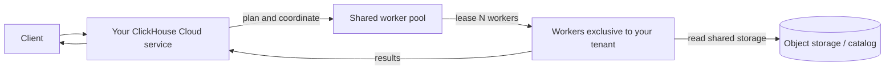
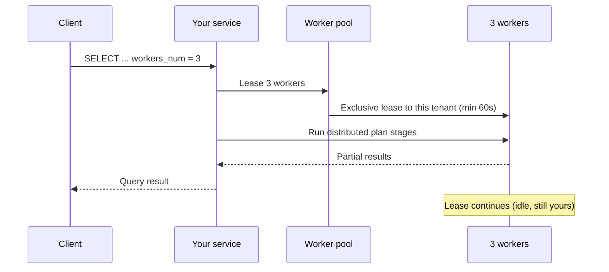
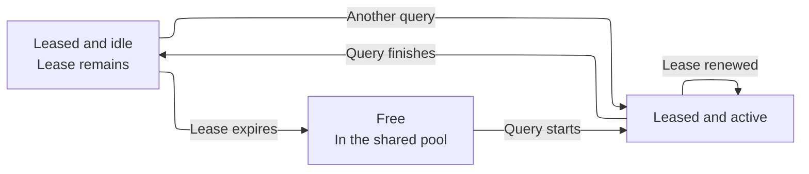
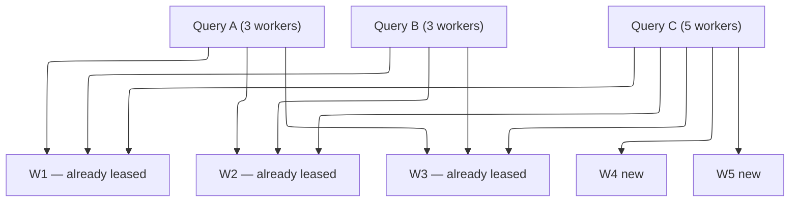

import { PrivatePreviewBadge } from "/snippets/es/components/PrivatePreviewBadge/PrivatePreviewBadge.jsx";

<PrivatePreviewBadge />

<Note>
  On-Demand Compute se encuentra en private preview. No está cubierto por los SLO ni los SLA de ClickHouse Cloud, y pueden aplicarse limitaciones conocidas y desconocidas. Consulte [Limitaciones](#limitations).

  [Únase a la lista de espera](https://clickhouse.com/cloud/on-demand-compute-waitlist).
</Note>

On-Demand Compute es una capability de ClickHouse Cloud que proporciona a un service (un tenant) compute adicional para los workloads compatibles, sin necesidad de redimensionar ni aprovisionar otro service. Este trabajo se ejecuta en workers de ClickHouse ajenos al compute propio del service. Los workers provienen de un grupo gestionado que se comparte entre tenants, pero cada worker se asigna a un único tenant a la vez.

Durante el private preview, On-Demand Compute admite las consultas `SELECT` elegibles. Usted habilita una consulta mediante settings y ClickHouse asigna workers del grupo para ejecutarla a través de su service y su endpoint existentes. Las background operations forman parte de esta capability en sentido amplio, pero no son compatibles durante el private preview.

Esto se diferencia de la [separación de cómputo-cómputo](/es/products/cloud/features/infrastructure/warehouses). Un warehouse proporciona compute dedicado y de larga duración mediante varios services que comparten datos. On-Demand Compute proporciona workers temporales de un grupo compartido a través de su service existente. Durante el private preview, este compute se solicita a nivel de consulta.

## Cuándo usar On-Demand Compute {#when-to-use-on-demand-compute}

Durante la private preview, use On-Demand Compute para las consultas `SELECT` elegibles y de uso intensivo de compute que desee ejecutar fuera del compute del primary service:

* **Consultas ad hoc y de analistas:** ejecute consultas `SELECT` de uso intensivo de compute en workers adicionales.
* **Cargas de trabajo de lectura no críticas:** traslade determinadas lecturas fuera del primary service.
* **Consultas sobre lagos de datos:** consulte datos compatibles de Apache Iceberg, Delta Lake o `SharedMergeTree` en workers adicionales.
* **Compute adicional temporal:** solicite workers para consultas elegibles sin redimensionar el primary service.

La private preview solo admite consultas `SELECT`. Los workers no ejecutan consultas `INSERT`, DDL, mutations ni background operations.

## Cómo funciona {#how-it-works}



1. Envías una consulta `SELECT` elegible a tu ClickHouse Cloud service. Tu endpoint, la authentication y la configuración de RBAC no cambian.
2. El service construye un distributed query plan y solicita al grupo administrado el número de workers especificado.
3. ClickHouse asigna a tu service los workers disponibles.
4. Los workers ejecutan las stages del plan asignadas por el distributed planner y leen datos del almacenamiento compatible.
5. Tu service coordina la consulta y devuelve el resultado al client.

Durante el private preview, cada worker cuenta con `8 vCPUs` y `32 GiB` de memoria. Usa `distributed_plan_workers_num` para especificar cuántos workers solicita la consulta.

## Uso de compute bajo demanda {#using-on-demand-compute}

### Settings {#settings}

Añada estos ajustes en la consulta, en el usuario o en un SETTINGS PROFILE.

| Ajuste                         | Valor requerido          | Propósito                                                                                                                                                          |
| ------------------------------ | ------------------------ | ------------------------------------------------------------------------------------------------------------------------------------------------------------------ |
| `make_distributed_plan`        | Yes                      | Habilita el distributed query plan experimental. Necesario para On-Demand Compute.                                                                                 |
| `distributed_plan_workers_num` | Yes                      | Número de workers que se van a arrendar para esta consulta. Si es `0` (el valor predeterminado), la consulta se ejecuta en su service y no en el grupo de workers. |
| `enable_parallel_replicas`     | Yes (establecido en `0`) | Las parallel replicas no son compatibles con el distributed plan.                                                                                                  |

<Tip>
  Durante la versión preliminar, defina los ajustes a nivel de consulta o cree un usuario aparte con ajustes distintos. De este modo queda claro qué sentencias usan On-Demand Compute y se evita heredar los default profiles de Cloud que habilitan las parallel replicas.
</Tip>

### Ejemplo {#example}

```sql
SELECT
    sum(l_extendedprice * l_discount) AS revenue
FROM lineitem
WHERE
    l_shipdate >= DATE '1994-01-01'
    AND l_shipdate < DATE '1994-01-01' + INTERVAL 1 YEAR
    AND l_discount BETWEEN 0.06 - 0.01 AND 0.06 + 0.01
    AND l_quantity < 24
SETTINGS
    make_distributed_plan = 1,
    distributed_plan_workers_num = 3,
    enable_parallel_replicas = 0
```

Esta consulta solicita tres workers. La cantidad de workers que proporciona ClickHouse depende del límite de la vista previa privada y de la capacidad disponible del grupo.

### Leasing de workers {#worker-leasing}

Un lease de worker dura al menos 60 segundos. ClickHouse lo renueva automáticamente mientras hay una consulta en ejecución.

Cuando la consulta finaliza, los workers siguen asignados al service hasta que el lease expira. Otra consulta apta del mismo service puede reutilizar esos workers mientras el lease siga activo, de modo que ClickHouse no necesita solicitar workers nuevos.

Al expirar el lease, ClickHouse libera los workers del service y los termina.



Una vez finalizada la consulta, los tres workers siguen asignados en lease a tu tenant, pero inactivos hasta que el lease expire.



Si envías otra consulta mientras esos workers siguen arrendados, pueden reutilizarse de inmediato (sin arranque en frío).

Si el arrendamiento ha expirado, ClickHouse devuelve los workers al grupo (se terminan en lugar de quedar inactivos para otro tenant).

### Consultas concurrentes {#concurrent-queries}

Las consultas concurrentes de un mismo ClickHouse Cloud service pueden compartir los workers asignados. ClickHouse solicita workers adicionales únicamente cuando una consulta necesita más workers de los que ya están asignados al service.

Por ejemplo, si dos consultas concurrentes solicitan tres workers cada una, pueden compartir esos mismos tres workers. Si otra consulta solicita cinco workers, ClickHouse puede usar los tres workers asignados y solicitar dos más al grupo.

Vea el siguiente ejemplo:

```sql
SELECT ... SETTINGS make_distributed_plan = 1, distributed_plan_workers_num = 3, ...;
SELECT ... SETTINGS make_distributed_plan = 1, distributed_plan_workers_num = 3, ...;
```

Ambas comparten los mismos tres workers.

Si una tercera consulta concurrente solicita cinco workers:

```sql
SELECT ... SETTINGS make_distributed_plan = 1, distributed_plan_workers_num = 5, ...;
```

Esa consulta se ejecuta en los tres workers existentes más dos workers recién adquiridos en lease.



### Cuando el grupo no puede satisfacer la solicitud {#pool-capacity}

La disponibilidad de workers no está garantizada durante la private preview. Si hay menos workers disponibles de los solicitados, la consulta se ejecuta con los workers que ClickHouse pueda asignar. Por ejemplo, una solicitud de cinco workers puede ejecutarse con tres.

Si no se puede arrendar ningún worker, la consulta falla:

```text
No stateless workers available for tenant 'bronzeaws-cm-72': the discovery service leased none.
```

Reintente la consulta. Si el problema persiste, póngase en contacto con el equipo de su cuenta de ClickHouse: es posible que el grupo de vista previa esté agotado o mal dimensionado.

## Monitoring {#monitoring}

Utiliza `system.query_log` en tu service para saber cuántos workers se asignaron a tu consulta.

### Número de workers asignados {#worker-provided}

```sql
SELECT
    ProfileEvents['StatelessWorkerRequested'],
    ProfileEvents['StatelessWorkerProvided']
FROM clusterAllReplicas(default, system.query_log)
WHERE query_id = '<YOUR_QUERY_ID>'
  AND type != 'QueryStart';
```

<Tip>
  Establezca `log_comment = 'on-demand'` (o el nombre de un workload) en las consultas On-Demand para poder filtrarlas sin necesidad de analizar `Settings`.
</Tip>

## Regiones disponibles {#available-regions}

Los workers de On-Demand Compute se ejecutan en la misma región que tu ClickHouse Cloud service. Durante la private preview, la feature estará disponible inicialmente en determinados cloud providers y regiones. Al apuntarte a la lista de espera puedes indicar el provider y la región que prefieras para que ClickHouse evalúe si cumples los requisitos.

## Precios {#pricing}

Durante la private preview, On-Demand Compute es gratuito, con un límite de uso (consulte [Limitaciones](#limitations)). Consulte a su account team de ClickHouse si necesita ampliar ese límite.

Los precios se aplicarán cuando finalice la preview. Se notificará a los participantes de la preview antes de que la feature pase a beta y antes de que se apliquen cargos.

El modelo previsto es el mismo que el del compute de ClickHouse Cloud: se paga por el compute que se utiliza (tiempo de worker en lease), no por los datos escaneados ni por las filas leídas.

## Limitaciones {#limitations}

Durante la private preview se aplican las siguientes limitaciones. Pueden existir otras. Informe de cualquier comportamiento inesperado al soporte de ClickHouse o a su account team.

* **Solo consultas `SELECT`.** Los workers no ejecutan consultas `INSERT`, mutations, DDL ni background operations.
* **Datos compatibles.** La private preview admite Apache Iceberg, Delta Lake y `SharedMergeTree`.
* **Parallel replicas.** Las parallel replicas deben estar deshabilitadas.
* **Tamaño del worker.** Cada worker cuenta con `8 vCPUs` y `32 GiB` de memoria.
* **Límite de workers.** Cada consulta puede solicitar hasta cinco workers durante la private preview.
* **Capacidad del pool.** La disponibilidad de workers no está garantizada. Una consulta puede recibir menos workers de los solicitados. Si no hay workers disponibles, la consulta falla.
* **Rendimiento.** El rendimiento varía según la consulta. La asignación de workers, la planificación distribuida y la transferencia de las etapas del plan pueden añadir latency. Algunas formas de consulta pueden rendir peor que si se ejecutaran en el primary service.
* **Compatibilidad de consultas.** El distributed planner no puede ejecutar de forma remota todos los query plans. Las consultas no compatibles pueden devolver una excepción `SUPPORT_IS_DISABLED`.

Entre los fallos habituales se encuentran los siguientes:

| Área                                                                          | Qué ocurre                                                                      |
| ----------------------------------------------------------------------------- | ------------------------------------------------------------------------------- |
| Parallel replicas                                                             | Se rechazan; deshabilite los settings anteriores.                               |
| Window functions con `PARTITION BY`                                           | Suelen rechazarse hasta que el planner pueda redistribuir por la partition key. |
| Lecturas de tablas `system`                                                   | No se basan en almacenamiento compartido.                                       |
| Correlated subqueries con determinadas formas                                 | Pueden rechazarse o reescribirse de forma menos eficiente.                      |
| Projections, skip indexes en la lectura de datos y compilación de expressions | Se desactivan para la consulta en lugar de devolver una excepción.              |

## Roadmap {#roadmap}

On-Demand Compute es un punto de partida. Trabajos en curso o previstos:

* Resolver las limitaciones conocidas (huecos de `SUPPORT_IS_DISABLED`).
* Grupos de workers de distintos tamaños.
* Estabilizar el rendimiento de las consultas frente a la ejecución stateful.
* Compatibilidad con fusiones en segundo plano.
* Precios.
* Calibración del autoscaler del grupo de workers.
* Métricas y monitorización en la Console.
* Permisos dedicados para On-Demand Compute.

## Security {#security}

On-Demand Compute no cambia la forma de conectarse a ClickHouse Cloud. Los clients siguen autenticándose en tu service. Los workers nunca exponen un query endpoint público.

Los roles y permissions dedicados de On-Demand no forman parte de la versión preliminar (consulta el [Roadmap](#roadmap)). Hasta entonces, cualquier persona que pueda ejecutar `SELECT` con los Settings indicados arriba en tu service podrá usar workers, sujeto a la QUOTA de la versión preliminar.

## FAQ {#faq}

<AccordionGroup>
  <Accordion title="¿On-Demand Compute es open source?">
    No. Es una arquitectura de ClickHouse Cloud: ClickHouse server (distributed plan), data plane (pool de workers y leases) y control plane. El ajuste experimental `make_distributed_plan` existe en ClickHouse, pero el pool compartido de workers y la ejecución stateless son exclusivos de Cloud.
  </Accordion>

  <Accordion title="¿Necesito una versión específica para participar en el private preview?">
    Sí. Su equipo de ClickHouse confirmará si su service requiere un upgrade antes de participar en el private preview. Es posible que se requieran upgrades adicionales durante el preview.
  </Accordion>

  <Accordion title="¿Cómo será el pricing?">
    No hay ningún cargo adicional durante el private preview, sujeto a los límites del preview. El pricing de las etapas posteriores de lanzamiento se comunicará antes de que se aplique cualquier cargo. Dicho esto, el pricing mantiene la misma filosofía que ClickHouse Cloud: se cobra por el compute utilizado, no por los datos escaneados ni por las filas leídas. Las tarifas exactas se publicarán antes de la GA o del inicio del billing en beta.
  </Accordion>

  <Accordion title="¿Puedo usarlo en production?">
    Puede ejecutar workloads reales, pero se trata de un private preview: existen limitaciones conocidas y desconocidas, y no hay SLO/SLA para la availability del pool de workers. ClickHouse tiene el compromiso de dar soporte a quienes lo adopten de forma temprana; considérelo un preview, no una garantía para production.
  </Accordion>

  <Accordion title="¿En qué se diferencia del autoscaling de mi service?">
    El autoscaling modifica el compute asignado a su primary service. Durante el private preview, On-Demand Compute otorga a las consultas `SELECT` elegibles acceso temporal a workers de un pool gestionado sin cambiar el tamaño del primary service. El autoscaling gestiona la capacidad continua del service, mientras que On-Demand Compute proporciona compute temporal para workloads específicos.
  </Accordion>

  <Accordion title="¿En qué se diferencia de un warehouse o de la compute-compute separation?">
    La compute-compute separation proporciona compute dedicado mediante varios ClickHouse Cloud services que comparten datos. On-Demand Compute proporciona compute temporal desde un pool gestionado a través de su service existente. Durante el private preview, este compute se solicita a nivel de consulta. La capability más amplia está diseñada para admitir tanto la query execution como las background operations.
  </Accordion>

  <Accordion title="¿Dónde puedo hacer preguntas?">
    Consulte a su account team; le pondrán en contacto con el product manager de On-Demand Compute.
  </Accordion>

  <Accordion title="¿Dónde puedo reportar errores?">
    Abra un ticket de soporte (severidad 3) o repórtelo al product manager. Incluya el `query_id` y la excepción completa.
  </Accordion>

  <Accordion title="¿Está disponible en ClickHouse BYOC o ClickHouse Private?">
    No. El private preview no está disponible en ClickHouse BYOC ni en ClickHouse Private.
  </Accordion>
</AccordionGroup>