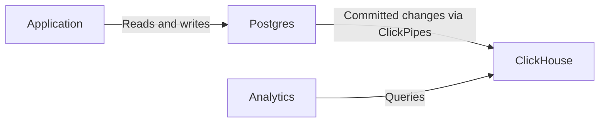

import { BetaBadge } from "/snippets/es/components/BetaBadge/BetaBadge.jsx";

<BetaBadge link="https://clickhouse.com/cloud/postgres" galaxyTrack={true} galaxyEvent="docs.managed-postgres.overview-beta" />

ClickHouse Managed Postgres es un servicio gestionado de Postgres de nivel empresarial, diseñado para ofrecer rendimiento y escalar. Basado en almacenamiento NVMe ubicado físicamente junto al cómputo, ofrece hasta 10 veces más rendimiento para cargas de trabajo limitadas por el disco, en comparación con alternativas que usan almacenamiento conectado por red, como EBS.

Desarrollado en colaboración con [Ubicloud](https://www.ubicloud.com/), cuyo equipo fundador cuenta con una trayectoria ofreciendo Postgres de primer nivel en Citus Data, Heroku y Microsoft, ClickHouse Managed Postgres resuelve los problemas de rendimiento a los que suelen enfrentarse las aplicaciones de rápido crecimiento: ingestión y actualizaciones más lentas, operaciones de vacuum lentas, mayor latencia de cola y picos de WAL provocados por IOPS de disco limitados.

## Postgres para transacciones, ClickHouse para analítica {#transactions-and-analytics}

Use Postgres para las cargas de trabajo transaccionales de las aplicaciones (OLTP), como crear pedidos, actualizar el inventario y gestionar cuentas de usuario. Postgres es su sistema de registro: los cambios relacionados pueden confirmarse (commit) o revertirse en conjunto dentro de una misma transacción.

Cuando su aplicación además necesite analítica sobre grandes conjuntos de datos, agregue un servicio de ClickHouse y conecte ambos con ClickPipes:

1. Su aplicación lee y escribe datos operativos en Postgres, usando transacciones para agrupar cambios relacionados.
2. [Configure ClickPipes](/es/products/managed-postgres/clickhouse-integration) para copiar tablas seleccionadas a ClickHouse y replicar de forma continua las inserciones, actualizaciones y eliminaciones confirmadas mediante change data capture (CDC).
3. Ejecute consultas analíticas en ClickHouse. Puede conectarse directamente a ClickHouse o consultar sus tablas desde Postgres a través de la extensión [`pg_clickhouse`](/es/products/managed-postgres/extensions/pg_clickhouse/introduction).

La replicación es asíncrona, por lo que los resultados analíticos pueden ir con retraso respecto a los cambios confirmados en Postgres. Ambas bases de datos tienen límites de transacción independientes: CDC y `pg_clickhouse` no ofrecen una transacción compartida entre Postgres y ClickHouse. Las lecturas que requieran el último estado confirmado de la aplicación deben realizarse en Postgres.

Puede comenzar solo con Postgres y añadir ClickHouse cuando lo necesite. Siga la [guía de inicio rápido de ClickHouse Managed Postgres](/es/products/managed-postgres/quickstart) para probar ambos servicios, o vaya directamente a [añadir analítica](/es/products/managed-postgres/quickstart#part-2) si ya cuenta con un servicio de Postgres.

## Rendimiento impulsado por NVMe {#nvme-performance}

La mayoría de los servicios gestionados de Postgres usan almacenamiento conectado por red, como Amazon EBS, que requiere un recorrido de ida y vuelta por la red para cada acceso al disco. Esto introduce una latencia medida en milisegundos y limita las IOPS, lo que genera cuellos de botella en cargas de trabajo con muchas escrituras o intensivas en E/S.

ClickHouse Managed Postgres usa almacenamiento NVMe físicamente conectado al mismo servidor que tu base de datos. Esta diferencia arquitectónica ofrece:

* **Latencia de disco del orden de microsegundos** en lugar de milisegundos
* **Límites sostenidos de IOPS 10 veces mayores*** sin cuellos de botella de red
* **Hasta 10 veces más rendimiento** para cargas de trabajo limitadas por disco al mismo costo

Para las cargas de trabajo de Postgres limitadas principalmente por las IOPS del disco y la latencia, esto se traduce en una ingestión más rápida, operaciones VACUUM más rápidas, menor latencia de cola y un rendimiento más predecible bajo carga.

<Note>
  Descubre qué tan rápido es Postgres en discos NVMe en los [benchmarks de rendimiento](https://clickhouse.com/blog/postgresbench).
</Note>

Para conocer los límites locales de NVMe en AWS, consulta [Optimizada para memoria](https://docs.aws.amazon.com/ec2/latest/instancetypes/mo.html#mo_instance-store), [Optimizada para almacenamiento](https://docs.aws.amazon.com/ec2/latest/instancetypes/so.html#so_instance-store), [Optimizada para CPU](https://docs.aws.amazon.com/ec2/latest/instancetypes/gp.html#gp_instance-store). Para GCP, consulta [Discos SSD locales](https://cloud.google.com/compute/docs/disks/local-ssd).

## Proveedores de nube compatibles {#supported-cloud-providers}

ClickHouse Managed Postgres está disponible en los siguientes proveedores de nube:

| Proveedor de nube | Disponibilidad  |
| ----------------- | --------------- |
| AWS               | Public Beta     |
| GCP               | Private Preview |

<Note>
  ClickHouse Managed Postgres en GCP se encuentra en Private Preview. Puedes apuntarte a la lista de espera de la Private Preview de GCP [aquí](https://clickhouse.com/cloud/postgres#gcp-waitlist). Consulta el [anuncio](https://clickhouse.com/blog/postgres-managed-by-clickhouse-gcp-private-preview) para obtener más información.
</Note>

## Integración nativa con ClickHouse {#clickhouse-integration}

ClickHouse Managed Postgres se integra de forma nativa con ClickHouse para unificar transacciones y analítica sin pipelines de ETL complejos.

### Replicación de Postgres a ClickHouse {#postgres-replication}

Replica tus datos de Postgres a ClickHouse con el [conector Postgres CDC de ClickPipes](/es/integrations/clickpipes/postgres/index). El conector gestiona tanto la carga inicial como la sincronización incremental continua, y ya ha sido probado en producción por cientos de clientes empresariales que mueven cientos de terabytes al mes.

### pg_clickhouse: capa de consulta unificada {#pg-clickhouse}

Cada instancia de ClickHouse Managed Postgres incluye la extensión [`pg_clickhouse`](https://github.com/ClickHouse/pg_clickhouse), que permite consultar ClickHouse directamente desde Postgres. Su aplicación puede usar Postgres como una capa de consulta unificada tanto para transacciones como para análisis, sin necesidad de conectarse a varias bases de datos.

La extensión proporciona un pushdown de consultas muy completo a ClickHouse para una ejecución eficiente, con compatibilidad con filtros, joins, semi-joins, agregaciones y funciones. Actualmente, 14 de 22 consultas TPC-H se delegan por completo, lo que proporciona mejoras del rendimiento de más de 60 veces en comparación con ejecutar esas mismas consultas en Postgres estándar.

## Fiabilidad de nivel empresarial {#enterprise-reliability}

ClickHouse Managed Postgres ofrece las funciones de fiabilidad y seguridad que requieren las cargas de trabajo en producción.

### Alta disponibilidad {#high-availability}

Puede configurar hasta dos réplicas en espera en distintas zonas de disponibilidad con replicación basada en quórum. Estas réplicas en espera están dedicadas a la alta disponibilidad y al failover automático, lo que garantiza que su base de datos se recupere rápidamente de los fallos. Para escalar las lecturas, puede aprovisionar [réplicas de lectura](/es/products/managed-postgres/read-replicas). Consulte la página [Alta disponibilidad](/es/products/managed-postgres/high-availability) para obtener más detalles de configuración.

### Copias de seguridad y recuperación {#backups}

Cada instancia incluye copias de seguridad automáticas que admiten forks y recuperación a un momento específico. Las copias de seguridad se basan en [WAL-G](https://github.com/wal-g/wal-g), una conocida herramienta de código abierto que gestiona copias de seguridad completas y el archivado continuo de WAL en almacenamiento de objetos.

### Seguridad y cumplimiento {#security-compliance}

ClickHouse Managed Postgres está diseñado para cumplir con los mismos estándares de seguridad que ClickHouse Cloud:

* **Autenticación**: compatibilidad con SAML/SSO
* **Seguridad de red**: lista de IP permitidas, cifrado en reposo y en tránsito (TLS 1.3)
* **Control de acceso**: acceso completo de superusuario para la administración de la base de datos

### Base de código abierto {#open-source}

Tanto Postgres como ClickHouse son bases de datos de código abierto con comunidades amplias y muy activas. Los componentes de integración, incluida la extensión `pg_clickhouse` y la replicación CDC impulsada por PeerDB, también son de código abierto. Esta base evita la dependencia de un proveedor y le proporciona control total y flexibilidad a largo plazo sobre su pila de datos.