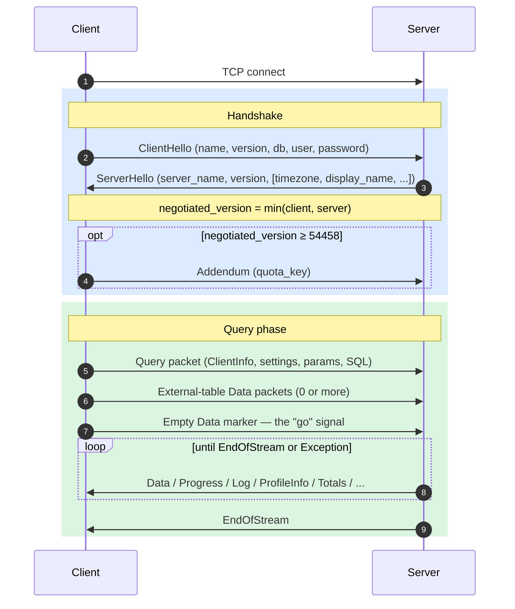
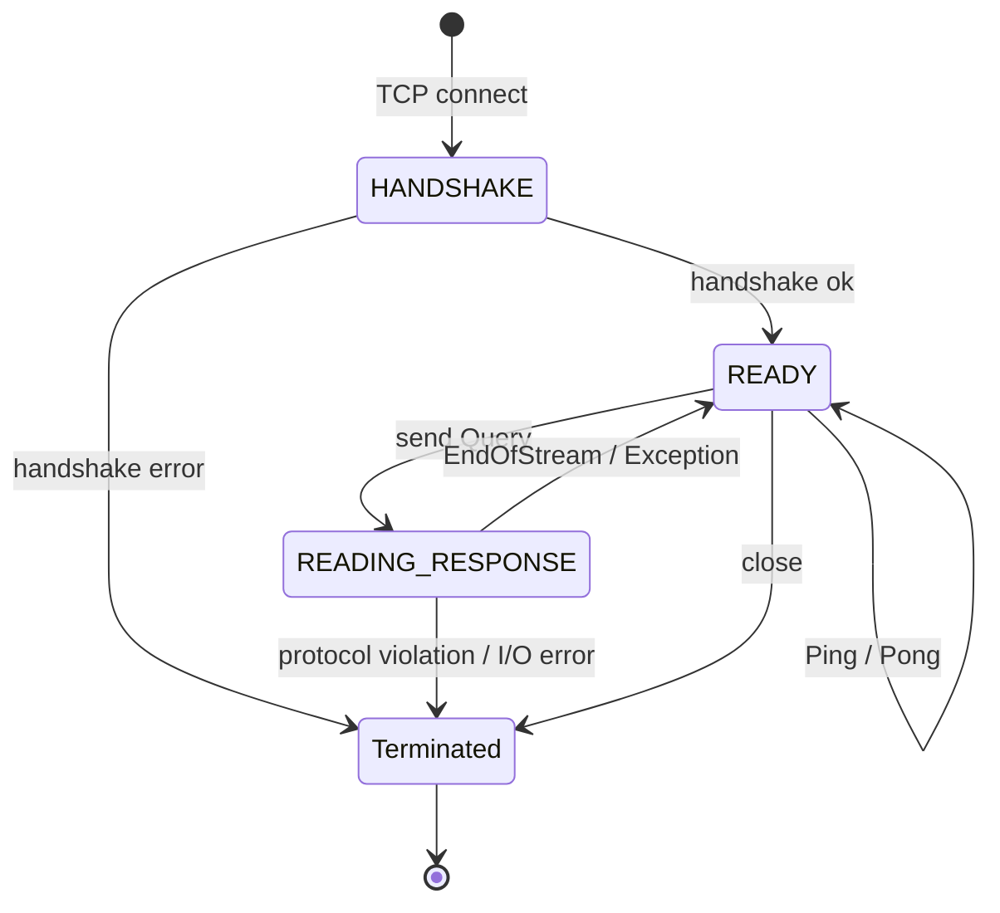
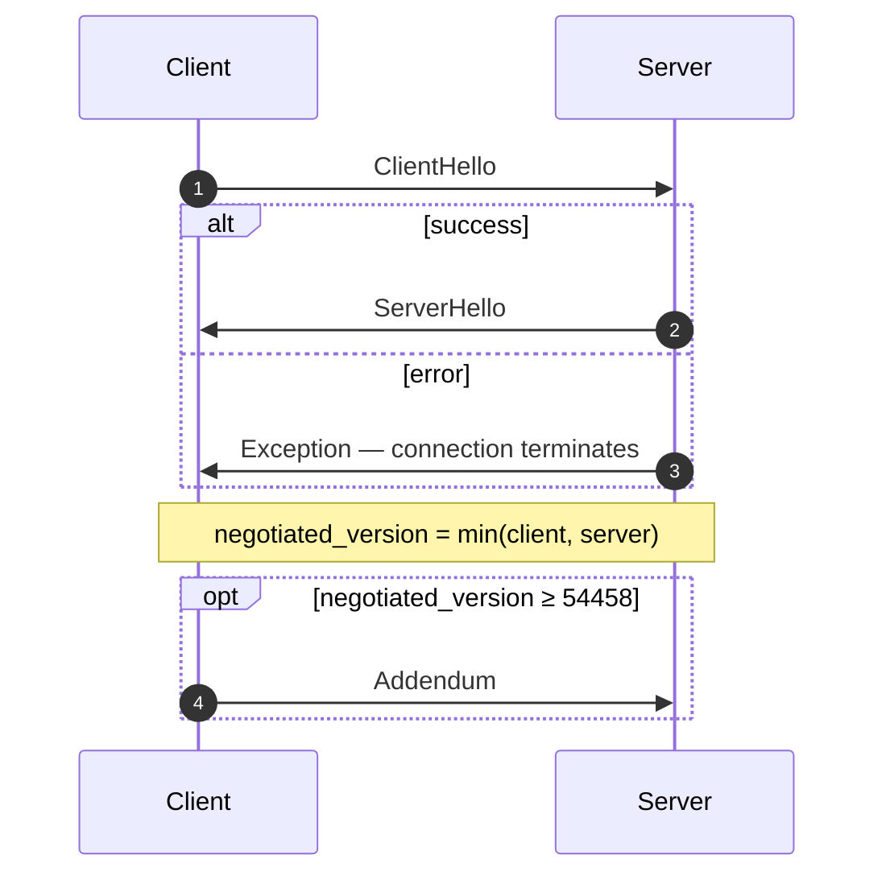
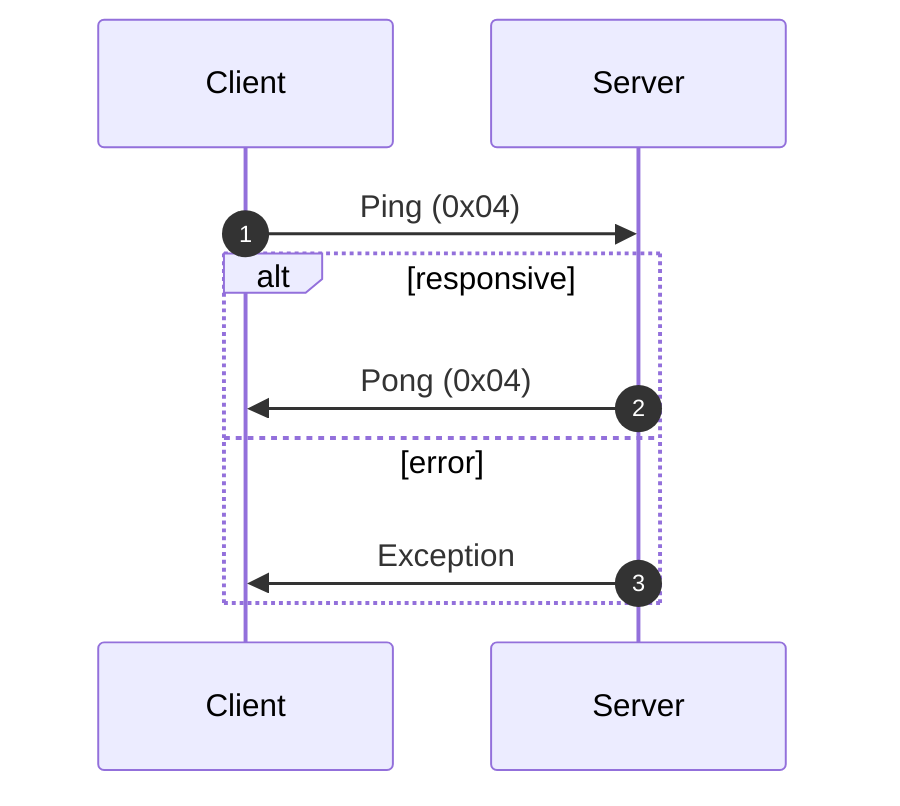
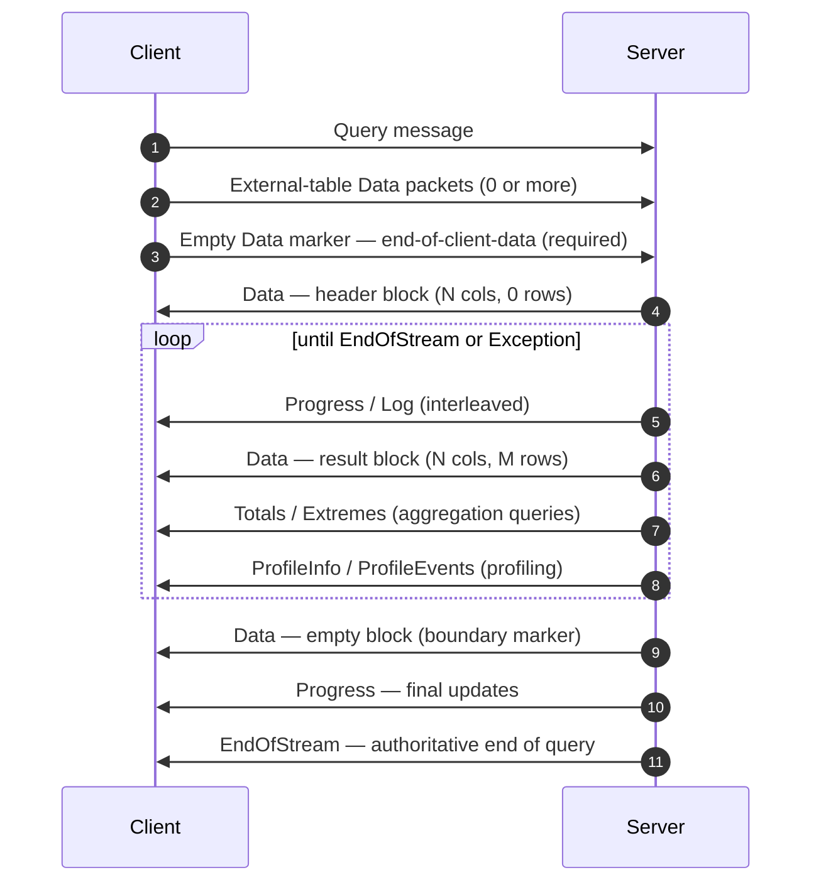
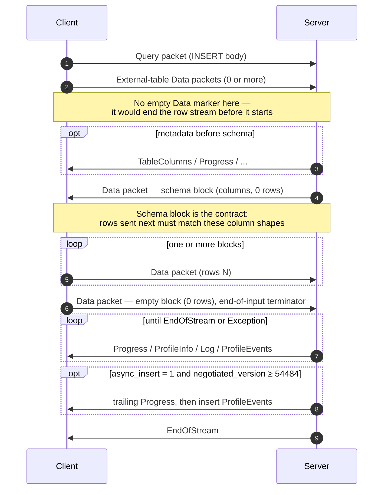
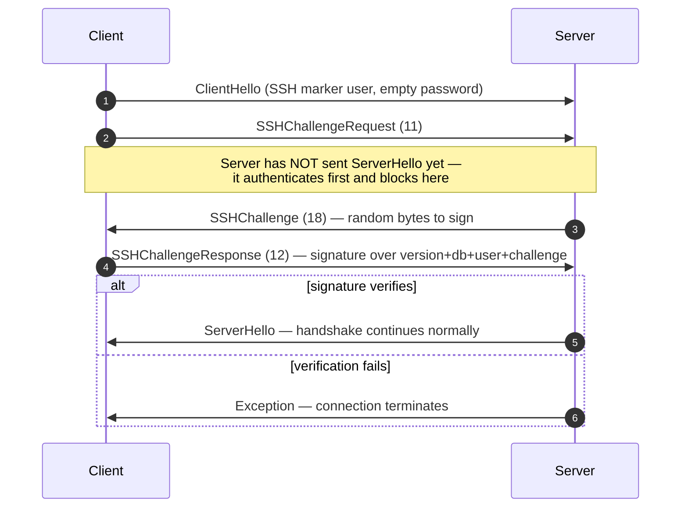

El protocolo nativo es el protocolo binario y orientado a conexión que emplean los client y los servidores de ClickHouse para comunicarse a través de TCP. Transporta consultas SQL, datos de resultados, cargas útiles de `INSERT`, telemetría de ejecución y señales de error. Es el protocolo en el que se basan el cliente de línea de comandos, el controlador de C++ y la mayoría de los controladores nativos de terceros.

Esta página describe el protocolo en sí: la estructura de paquetes, la máquina de estados de la conexión, la negociación de versión y el cuerpo de todos los mensajes distintos de `Block`. Los bytes contenidos en los paquetes de la familia `Data` (el `Block`, sus columnas y las codificaciones de cada tipo) son una cuestión aparte, que se documenta en la especificación del [formato Native](/es/resources/develop-contribute/native-protocol/format).

<Info>
  **Especificación complementaria**

  Esta página forma parte de un par de documentos y se publica junto con la especificación complementaria del [formato Native](/es/resources/develop-contribute/native-protocol/format). Ambas especificaciones se reparten el trabajo de forma nítida: esta página se ocupa de la capa de paquetes y de transporte, mientras que la especificación del formato Native se ocupa de los bytes contenidos en los paquetes de la familia `Data`.
</Info>

Hay algunas propiedades que se cumplen siempre. El protocolo es binario y posicional: no existen etiquetas de campo salvo dentro de `BlockInfo`, de modo que un solo byte fuera de lugar desincroniza todo lo que viene después. Es un protocolo con estado, y cada conexión TCP procesa una sola consulta a la vez: no hay multiplexación. Los enteros de ancho fijo se codifican en little-endian.

## Descripción general {#overview}

| Propiedad            | Valor                                                                                                    |
| -------------------- | -------------------------------------------------------------------------------------------------------- |
| Transporte           | TCP, opcionalmente encapsulado en TLS                                                                    |
| Orden de bytes       | Little-endian para enteros de ancho fijo                                                                 |
| Codificación         | Binaria y posicional (sin etiquetas de campo, salvo en `BlockInfo`)                                      |
| Modelo de conexión   | Con estado, una consulta a la vez, sin multiplexación                                                    |
| Control de versiones | Se negocia durante el handshake; la disponibilidad de cada funcionalidad depende de la versión           |
| Formato de datos     | El [formato Native](/es/resources/develop-contribute/native-protocol/format) para todos los datos tabulares |

Cada mensaje en el wire comienza con un código de tipo de paquete `VarUInt`, seguido de un cuerpo cuya estructura depende de ese código y de la versión del protocolo negociada.

Una conexión pasa por tres fases: un único handshake inicial, después cualquier número de intercambios `Ping` o `Query` y, por último, el cierre:



El protocolo TCP nativo siempre transporta datos tabulares en formato Native, independientemente de la cláusula `FORMAT` que incluya la consulta SQL. La conversión a `RowBinary`, `CSV`, `JSON`, etc., es tarea del client, que la realiza después de decodificar los bloques Native. (La interfaz HTTP sigue una ruta de código distinta que *sí* respeta la cláusula `FORMAT`; HTTP queda fuera del alcance de este documento.)

## Seguridad {#security}

### Seguridad de transporte (TLS) {#transport-security}

TLS opera en la capa de transporte, por debajo del protocolo. Cuando está habilitado, se cifra todo el flujo TCP y los mensajes del protocolo son idénticos byte a byte, se use TLS o no.

### Autenticación {#authentication}

La autenticación tiene lugar durante el handshake, en el mensaje [`ClientHello`](#clienthello). Los campos `user` y `password` se transmiten como cadenas en texto plano, por lo que es el cifrado a nivel de transporte (TLS) el que protege las credenciales en tránsito.

El servidor interpreta un campo `user` vacío como su usuario de sesión predeterminado configurado, es decir, el valor del ajuste de servidor `default_session_user` (cuyo valor predeterminado es `default`), que puede sobrescribirse para cada listener en la sección `protocols`. Si el servidor tiene configurado un usuario de sesión predeterminado vacío, o si su versión es anterior a la 26.8, se rechaza el campo `user` vacío con una excepción. Tenga en cuenta que `clickhouse-client` nunca envía un nombre de usuario vacío, sino que lo sustituye por `default` en el lado del cliente.

La autenticación SSH de tipo desafío-respuesta está disponible a partir de la versión de protocolo 54466; consulte [Autenticación SSH de tipo desafío-respuesta](#ssh-authentication).

### Secreto entre servidores {#inter-server-secret}

Para la ejecución distribuida de consultas, los servidores se autentican entre sí demostrando que conocen un secreto compartido, sin llegar a transmitirlo por el wire. Cada Query incluye un `auth_hash` SHA-256 de 32 bytes en el campo 4 de [`Query`](#query), calculado a partir de una sal, un nonce, el secreto configurado y la consulta; el servidor receptor lo vuelve a calcular y lo compara. Esta funcionalidad depende de la feature `INTERSERVER_SECRET` (v54441). Los client externos siempre envían una cadena vacía en este campo. Consulte [Autenticación entre servidores](#inter-server-authentication).

## Control de versiones y control de funcionalidad {#versioning-and-feature-gates}

### Negociación de versión {#version-negotiation}

Durante el handshake, tanto el client como el servidor declaran la versión máxima del protocolo que admiten. La **versión negociada** es la menor de las dos:

```text
negotiated_version = min(client_version, server_version)
```

A partir de ese momento, todos los mensajes utilizan la versión negociada para determinar qué campos se incluyen en el wire.

### Control de funcionalidad {#feature-gates}

Cada funcionalidad se identifica por la versión del protocolo en la que se introdujo y está **activa** cuando la versión negociada es mayor o igual que ese número.

<Warning>
  Cuando una funcionalidad está activa, sus campos **deben** estar presentes en el wire. El protocolo es estrictamente posicional, por lo que omitir un campo sujeto a control de funcionalidad corrompe el flujo de bytes de todos los campos posteriores.
</Warning>

### Tabla de funcionalidades {#feature-table}

| Funcionalidad                                                | Versión | Afecta a                                 | Impacto en el formato wire                                                                                                                                                                                                                                                                                                                                                                                                                                                                                                                                                                                                                                                                                                                                                                                                          |
| ------------------------------------------------------------ | ------- | ---------------------------------------- | ----------------------------------------------------------------------------------------------------------------------------------------------------------------------------------------------------------------------------------------------------------------------------------------------------------------------------------------------------------------------------------------------------------------------------------------------------------------------------------------------------------------------------------------------------------------------------------------------------------------------------------------------------------------------------------------------------------------------------------------------------------------------------------------------------------------------------------- |
| BLOCK&#95;INFO                                               | all     | Block                                    | Añade el prefijo BlockInfo (`is_overflows`, `bucket_number`) a cada Block.                                                                                                                                                                                                                                                                                                                                                                                                                                                                                                                                                                                                                                                                                                                                                          |
| CLIENT&#95;INFO                                              | 54032   | Query                                    | Añade el bloque ClientInfo al cuerpo de Query.                                                                                                                                                                                                                                                                                                                                                                                                                                                                                                                                                                                                                                                                                                                                                                                      |
| TIMEZONE                                                     | 54058   | ServerHello                              | Añade el campo `timezone` a ServerHello.                                                                                                                                                                                                                                                                                                                                                                                                                                                                                                                                                                                                                                                                                                                                                                                            |
| QUOTA&#95;KEY&#95;IN&#95;CLIENT&#95;INFO                     | 54060   | ClientInfo                               | Añade el campo `quota_key` a ClientInfo.                                                                                                                                                                                                                                                                                                                                                                                                                                                                                                                                                                                                                                                                                                                                                                                            |
| DISPLAY&#95;NAME                                             | 54372   | ServerHello                              | Añade el campo `display_name` a ServerHello.                                                                                                                                                                                                                                                                                                                                                                                                                                                                                                                                                                                                                                                                                                                                                                                        |
| VERSION&#95;PATCH                                            | 54401   | ServerHello, ClientInfo                  | Añade el campo `version_patch` a ambos.                                                                                                                                                                                                                                                                                                                                                                                                                                                                                                                                                                                                                                                                                                                                                                                             |
| SERVER&#95;LOGS                                              | 54406   | Log                                      | El servidor emite paquetes Log cuando se establece `send_logs_level`.                                                                                                                                                                                                                                                                                                                                                                                                                                                                                                                                                                                                                                                                                                                                                               |
| COLUMN&#95;DEFAULTS&#95;METADATA                             | 54410   | TableColumns                             | El servidor puede enviar el paquete [`TableColumns`](#tablecolumns) (tipo 11) con metadatos de valores predeterminados de columnas antes del bloque de esquema de INSERT/entrada. Solo se envía cuando la versión negociada es ≥ 54410 **y** `input_format_defaults_for_omitted_fields` está habilitado. Por debajo de esta versión, el paquete nunca se envía y los clientes no deben esperarlo.                                                                                                                                                                                                                                                                                                                                                                                                                                   |
| WRITE&#95;CLIENT&#95;INFO                                    | 54420   | Progress                                 | Añade `wrote_rows` y `wrote_bytes` a Progress. (Pese a su nombre, **no** controla el bloque ClientInfo; de eso se encarga `CLIENT_INFO` (v54032).)                                                                                                                                                                                                                                                                                                                                                                                                                                                                                                                                                                                                                                                                                  |
| SETTINGS&#95;SERIALIZED&#95;AS&#95;STRINGS                   | 54429   | Query (codificación de la configuración) | Cambia **cómo** se codifica la lista de configuración, que siempre está presente; **no** determina si se envía o no la configuración. A partir de v54429, cada ajuste se escribe como `(name, flags, value-as-string)`; los pares más antiguos escriben `(name, type-specific-binary-value)` sin indicadores. Consulte [Setting](#setting).                                                                                                                                                                                                                                                                                                                                                                                                                                                                                         |
| INTERSERVER&#95;SECRET                                       | 54441   | Query                                    | Añade a Query el campo entre servidores `auth_hash`: un SHA-256 con sal calculado sobre el secreto del clúster, no el secreto sin procesar. Los clientes externos envían una cadena vacía. Consulte [Autenticación entre servidores](#inter-server-authentication).                                                                                                                                                                                                                                                                                                                                                                                                                                                                                                                                                                 |
| OPEN&#95;TELEMETRY                                           | 54442   | ClientInfo                               | Añade el contexto de traza de OpenTelemetry a ClientInfo.                                                                                                                                                                                                                                                                                                                                                                                                                                                                                                                                                                                                                                                                                                                                                                           |
| DISTRIBUTED&#95;DEPTH                                        | 54448   | ClientInfo                               | Añade el campo `distributed_depth` a ClientInfo.                                                                                                                                                                                                                                                                                                                                                                                                                                                                                                                                                                                                                                                                                                                                                                                    |
| INITIAL&#95;QUERY&#95;START&#95;TIME                         | 54449   | ClientInfo                               | Añade el campo `initial_time` (Int64, de ancho fijo).                                                                                                                                                                                                                                                                                                                                                                                                                                                                                                                                                                                                                                                                                                                                                                               |
| PROFILE&#95;EVENTS                                           | 54451   | ProfileEvents                            | El servidor emite paquetes ProfileEvents durante la ejecución de la consulta.                                                                                                                                                                                                                                                                                                                                                                                                                                                                                                                                                                                                                                                                                                                                                       |
| PARALLEL&#95;REPLICAS                                        | 54453   | ClientInfo                               | Añade a ClientInfo campos de coordinación de réplicas paralelas.                                                                                                                                                                                                                                                                                                                                                                                                                                                                                                                                                                                                                                                                                                                                                                    |
| CUSTOM&#95;SERIALIZATION                                     | 54454   | Block (Column)                           | Añade el byte `has_custom_serialization` después de la cadena de tipo de cada columna.                                                                                                                                                                                                                                                                                                                                                                                                                                                                                                                                                                                                                                                                                                                                              |
| ADDENDUM                                                     | 54458   | Handshake                                | El cliente envía un addendum (`quota_key`) tras el intercambio de handshake.                                                                                                                                                                                                                                                                                                                                                                                                                                                                                                                                                                                                                                                                                                                                                        |
| PARAMETERS                                                   | 54459   | Query                                    | Añade la lista de parámetros al cuerpo de Query.                                                                                                                                                                                                                                                                                                                                                                                                                                                                                                                                                                                                                                                                                                                                                                                    |
| SERVER&#95;QUERY&#95;TIME&#95;IN&#95;PROGRESS                | 54460   | Progress                                 | Añade el campo `elapsed_ns` a Progress.                                                                                                                                                                                                                                                                                                                                                                                                                                                                                                                                                                                                                                                                                                                                                                                             |
| PASSWORD&#95;COMPLEXITY&#95;RULES                            | 54461   | ServerHello                              | Añade a ServerHello una lista de patrones regex de la política de contraseñas junto con mensajes legibles.                                                                                                                                                                                                                                                                                                                                                                                                                                                                                                                                                                                                                                                                                                                          |
| INTERSERVER&#95;SECRET&#95;V2                                | 54462   | ServerHello                              | Añade a ServerHello un nonce `UInt64` de 8 bytes. Se utiliza para firmar consultas entre servidores; los clientes externos lo decodifican y lo ignoran.                                                                                                                                                                                                                                                                                                                                                                                                                                                                                                                                                                                                                                                                             |
| TOTAL&#95;BYTES&#95;IN&#95;PROGRESS                          | 54463   | Progress                                 | Añade a Progress el campo `total_bytes_to_read` (VarUInt), entre `total_rows` y `wrote_rows`.                                                                                                                                                                                                                                                                                                                                                                                                                                                                                                                                                                                                                                                                                                                                       |
| TIMEZONE&#95;UPDATES                                         | 54464   | TimezoneUpdate                           | Añade el paquete de servidor `TimezoneUpdate` (tipo 17). Cuerpo: un único `String` con la zona horaria de la sesión. Solo lo envía el inicializador de la función de tabla `input`, justo después del bloque de esquema de entrada, para que el cliente analice las filas que envía con la `session_timezone` del servidor. Consulte [TimezoneUpdate](#timezoneupdate).                                                                                                                                                                                                                                                                                                                                                                                                                                                             |
| SPARSE&#95;SERIALIZATION                                     | 54465   | Block (Column)                           | El servidor puede establecer `has_custom_serialization = 1` y emitir una columna con codificación dispersa. Formato wire: 1 byte de tipo (0x01 = SPARSE), seguido de un flujo de desplazamientos VarUInt terminado en EOG y, por último, los valores no predeterminados codificados de forma densa en el tipo interno. Consulte [kind&#95;stack y codificación dispersa](/es/resources/develop-contribute/native-protocol/format#kind-stack-and-sparse-encoding).                                                                                                                                                                                                                                                                                                                                                                      |
| SSH&#95;AUTHENTICATION                                       | 54466   | Flujo de autenticación                   | Añade autenticación SSH de desafío-respuesta. Es opcional: para activarla, el cliente envía un `user` con el formato `" SSH KEY AUTHENTICATION " + <real_user>` y una contraseña vacía. Consulte [Autenticación SSH de desafío-respuesta](#ssh-authentication).                                                                                                                                                                                                                                                                                                                                                                                                                                                                                                                                                                     |
| TABLE&#95;READ&#95;ONLY&#95;CHECK                            | 54467   | TablesStatusResponse                     | Añade un indicador `is_readonly` a la fila de cada tabla en TablesStatusResponse. Para los clientes externos que no envían `TablesStatusRequest`, el formato wire no cambia.                                                                                                                                                                                                                                                                                                                                                                                                                                                                                                                                                                                                                                                        |
| SYSTEM&#95;KEYWORDS&#95;TABLE                                | 54468   | tablas del sistema                       | El servidor rellena `system.keywords` para que el `clickhouse-client` canónico pueda autocompletar palabras clave. No hay cambios en el formato wire del protocolo nativo.                                                                                                                                                                                                                                                                                                                                                                                                                                                                                                                                                                                                                                                          |
| ROWS&#95;BEFORE&#95;AGGREGATION                              | 54469   | ProfileInfo                              | Añade `applied_aggregation` (Bool) y `rows_before_aggregation` (VarUInt) al final de ProfileInfo, en ese orden.                                                                                                                                                                                                                                                                                                                                                                                                                                                                                                                                                                                                                                                                                                                     |
| CHUNKED&#95;PROTOCOL                                         | 54470   | Delimitación de la conexión              | La delimitación en fragmentos por paquete envuelve el cuerpo de cada paquete. Se negocia en Addendum: ServerHello indica la preferencia del servidor para cada dirección y Addendum, la elección final del cliente. Consulte [delimitación en fragmentos](#chunked-framing).                                                                                                                                                                                                                                                                                                                                                                                                                                                                                                                                                        |
| VERSIONED&#95;PARALLEL&#95;REPLICAS&#95;PROTOCOL             | 54471   | ServerHello, Addendum                    | Ambos lados intercambian un `VarUInt` con la versión del protocolo de coordinación de réplicas paralelas. El campo de ServerHello se sitúa **inmediatamente después de `protocol_version`** (antes de `timezone`). El campo de Addendum se añade después de las cadenas del protocolo fragmentado. Valor actual: `8` (`DBMS_PARALLEL_REPLICAS_PROTOCOL_VERSION`). La versión `8` añade [`MergeTreeAllRangesAnnouncementResponse`](#mergetreeallrangesannouncementresponse) (paquete de cliente `14`): cuando la versión negociada de réplicas paralelas es `≥ 8`, el iniciador responde a cada anuncio de seguidor en modo distinto de `Default` con la lista autoritativa de partes para ese stream, y el seguidor la espera antes de emitir solicitudes de lectura. Por debajo de `8`, el anuncio se envía sin esperar respuesta. |
| INTERSERVER&#95;EXTERNALLY&#95;GRANTED&#95;ROLES             | 54472   | Query                                    | Añade un campo `String external_roles` al cuerpo de Query, entre el terminador de la configuración y el hash del secreto entre servidores. Los client externos envían una lista de roles vacía (un único byte `0x00`, es decir, VarUInt 0 dentro de un envoltorio String).                                                                                                                                                                                                                                                                                                                                                                                                                                                                                                                                                          |
| V2&#95;DYNAMIC&#95;AND&#95;JSON&#95;SERIALIZATION            | 54473   | Cuerpo de columna                        | El servidor puede emitir serialización V2 para los tipos de columna `Dynamic` y `JSON`; determina qué versión de `state_prefix` usan. Consulte [tipos versionados](/es/resources/develop-contribute/native-protocol/format#versioned-types).                                                                                                                                                                                                                                                                                                                                                                                                                                                                                                                                                                                           |
| SERVER&#95;SETTINGS                                          | 54474   | ServerHello                              | El servidor difunde su configuración no predeterminada como una lista al final de ServerHello, después de `nonce`. Formato: tripletas `(key, flags, value)` terminadas por una clave vacía, igual que la lista de configuración del paquete Query.                                                                                                                                                                                                                                                                                                                                                                                                                                                                                                                                                                                  |
| QUERY&#95;AND&#95;LINE&#95;NUMBERS                           | 54475   | ClientInfo                               | Añade `script_query_number` (VarUInt) y `script_line_number` (VarUInt) al final de ClientInfo. clickhouse-client los utiliza para atribuir errores en scripts de múltiples sentencias; los client externos envían `0, 0`.                                                                                                                                                                                                                                                                                                                                                                                                                                                                                                                                                                                                           |
| JWT&#95;IN&#95;INTERSERVER                                   | 54476   | ClientInfo                               | Añade un UInt8 de presencia de JWT + un `String jwt` opcional al final de ClientInfo. Los client externos (sin JWT) envían el byte `0x00`. (En C++ se escribe `DBMS_MIN_REVISON_WITH_JWT_IN_INTERSERVER`; observe la errata en el nombre de la constante).                                                                                                                                                                                                                                                                                                                                                                                                                                                                                                                                                                          |
| QUERY&#95;PLAN&#95;SERIALIZATION                             | 54477   | ServerHello, paquete QueryPlan           | ServerHello añade `VarUInt query_plan_serialization_version` después de la configuración del servidor. También introduce `ClientPacket::QueryPlan` (código `13`) para la entrega entre servidores de planes de consulta ya construidos; los client externos nunca lo envían. La versión `10` de serialización del plan de consulta antepone al plan serializado `VarUInt max_threads` y `Bool concurrency_control`; cuando alguno no tiene su valor predeterminado, los iniciadores envían SQL a los pares con versión inferior a `10`, de modo que el par construya su plan a partir de la configuración de consulta transmitida.                                                                                                                                                                                                  |
| PARALLEL&#95;BLOCK&#95;MARSHALLING                           | 54478   | Block (Column)                           | El servidor puede envolver columnas en `ColumnBLOB` (comprimidas en línea) para el procesamiento paralelo. Solo se aplica si la consulta tiene la compresión habilitada AND `rows > 1`; de lo contrario, se aplica el formato wire normal de columna. Los client que nunca habilitan la compresión en los paquetes Query salientes no ven ningún cambio en el formato wire.                                                                                                                                                                                                                                                                                                                                                                                                                                                         |
| VERSIONED&#95;CLUSTER&#95;FUNCTION&#95;PROTOCOL              | 54479   | ServerHello                              | Añade `VarUInt cluster_function_protocol_version` al final de ServerHello. Se usa para las funciones de tabla `*Cluster` (`s3Cluster`, etc.). Valor actual: `8` (`DBMS_CLUSTER_PROCESSING_PROTOCOL_VERSION`); la versión `7` está reservada para una funcionalidad de un repositorio privado (compactación de Iceberg), y la `8` añade un `read_source_index` opcional a la carga útil de tareas de lectura del cluster entre servidores (el cuerpo de `ReadTaskResponse`, que no se especifica aquí; véase más abajo). Los client externos lo decodifican y lo ignoran.                                                                                                                                                                                                                                                            |
| OUT&#95;OF&#95;ORDER&#95;BUCKETS&#95;IN&#95;AGGREGATION      | 54480   | BlockInfo                                | Añade el campo 3 (`out_of_order_buckets: Vec<Int32>`) al flujo de campos etiquetados de BlockInfo. Se decodifica como `[VarUInt count][Int32]*count`. Los client externos no lo emiten por sí mismos; el decodificador lee cualquier lista no vacía que envíe el servidor.                                                                                                                                                                                                                                                                                                                                                                                                                                                                                                                                                          |
| COMPRESSED&#95;LOGS&#95;PROFILE&#95;EVENTS&#95;COLUMNS       | 54481   | Log, ProfileEvents, TableColumns         | El servidor puede envolver los cuerpos de los paquetes [`Log`](#log), [`ProfileEvents`](#profileevents) y [`TableColumns`](#tablecolumns) en el [marco de compresión](/es/resources/develop-contribute/native-protocol/format#compression-frame). En esta versión, los tres cuerpos pasan por la misma ruta de salida opcionalmente comprimida, que solo se convierte en un marco de compresión real cuando la consulta tiene `compression = true`. Los client que nunca habilitan la compresión en los paquetes Query salientes no ven ningún cambio en el formato wire.                                                                                                                                                                                                                                                              |
| REPLICATED&#95;SERIALIZATION                                 | 54482   | Block (Column)                           | El servidor puede emitir columnas con kind&#95;stack `0x04 = REPLICATED`, una forma compacta de tipo diccionario para valores repetidos; consulte [kind&#95;stack y codificación dispersa](/es/resources/develop-contribute/native-protocol/format#kind-stack-and-sparse-encoding). Por debajo de esta versión, el escritor expandía dichas columnas antes de enviarlas. Se decodifica mediante búsqueda por índice (`elements[indexes[i]]` por fila); se admiten tipos hoja, así como tipos internos `Nullable`/`Array`/`Tuple`/`Map`/`Nested`/`LowCardinality`.                                                                                                                                                                                                                                                                      |
| NULLABLE&#95;SPARSE&#95;SERIALIZATION                        | 54483   | Block (Column)                           | Combina la serialización dispersa con `Nullable(T)`. Por debajo de esta versión, el escritor expandía la representación dispersa de las columnas Nullable antes de enviarlas; a partir de v54483, los datos wire son dispersos sobre Nullable. Consulte [kind&#95;stack y codificación dispersa](/es/resources/develop-contribute/native-protocol/format#kind-stack-and-sparse-encoding).                                                                                                                                                                                                                                                                                                                                                                                                                                              |
| PROGRESS&#95;IN&#95;ASYNC&#95;INSERT                         | 54484   | Progress (INSERT)                        | En un INSERT **asíncrono** (`async_insert = 1`), una vez volcada la inserción, el servidor envía un paquete [`Progress`](#progress) adicional y, a continuación, los `ProfileEvents` de la inserción, antes de `EndOfStream`. Solo se aplica si la versión *negociada* es ≥ 54484; por debajo, el servidor omite este Progress final. El formato wire de Progress no cambia; lo único nuevo es su emisión. En la práctica, el incremento transporta el tiempo transcurrido; los contadores de filas escritas se informan mediante los ProfileEvents que lo acompañan. Un client que ya procesa paquetes Progress intercalados no necesita cambios de formato; basta con que tolere un paquete más.                                                                                                                                  |
| CLIENT&#95;AGENT&#95;IN&#95;CLIENT&#95;INFO                  | 54485   | ClientInfo                               | Añade un `client_agent` `String` final a ClientInfo. El client canónico detecta automáticamente un identificador de agente a partir de su entorno (por ejemplo, `claude-code`, `cursor`, `gemini-cli` o el valor de la variable `AGENT`); un client externo que no detecte nada envía una cadena vacía. Obligatorio cuando la versión negociada es ≥ 54485: omitirlo desincroniza el resto del paquete Query.                                                                                                                                                                                                                                                                                                                                                                                                                       |
| INTERNAL&#95;QUERY&#95;FLAG                                  | 54486   | ClientInfo                               | Añade un `is_internal` `UInt8` final a ClientInfo. Vale `1` para una consulta interna del servidor (no emitida por el usuario) y se propaga a las consultas remotas para que sus filas de `system.query_log` se etiqueten como internas; los client externos envían `0`. Obligatorio cuando la versión negociada es ≥ 54486: omitirlo desincroniza el resto del paquete Query.                                                                                                                                                                                                                                                                                                                                                                                                                                                      |
| INTERSERVER&#95;CURRENT&#95;ROLES                            | 54488   | ClientInfo                               | Añade una lista opcional de String `current_roles` al final de ClientInfo (`[UInt8 present]` y, si es `1`, `[VarUInt count][String]*count`) y, para consultas entre servidores, amplía el `auth_hash` para cubrir la lista serializada. Transporta los nombres de los roles activos (habilitados) del iniciador para que un nodo secundario aplique las políticas de fila de la misma manera, en lugar de recurrir a los roles predeterminados del usuario. Solo se rellena en consultas entre servidores y únicamente cuando `push_external_roles_in_interserver_queries = 1`; los client externos envían `0` (ausente). Obligatorio cuando la versión negociada es ≥ 54488: omitir el byte de presencia desincroniza el resto del paquete Query.                                                                                  |
| CURRENT&#95;AGGREGATION&#95;VARIANT&#95;SELECTION&#95;METHOD | 54489   | Agregación (buckets de dos niveles)      | El método de agregación para una única clave `String` depende de `enable_packed_string_keys_in_aggregation`. Un par con una revisión anterior siempre usa el método empaquetado y no conoce esta configuración, por lo que intercambiar con él buckets de dos niveles colocaría la misma clave en buckets distintos. Con un par así, el iniciador opta por el comportamiento seguro: pone a cero sus umbrales de dos niveles y redistribuye él mismo en buckets sus bloques de un solo nivel. Se compara con la revisión del par y no con su versión, porque el método puede cambiar dentro de una misma versión publicada. Sin cambios en el formato wire del protocolo nativo.                                                                                                                                                    |
| HTTP&#95;HANDLER&#95;IN&#95;CLIENT&#95;INFO                  | 54490   | ClientInfo                               | Añade `http_handler_name` y `http_request_url` (ambos `String`) a la rama **HTTP** de ClientInfo, inmediatamente después de `http_referer`. Transportan el nombre del handler HTTP definido en SQL que coincidió y la URL de la solicitud, para que `currentHandler`/`currentRequestURL` y las columnas `http_handler_name`/`http_request_url` de `system.query_log` sigan rellenándose en los shards remotos en las consultas distribuidas de handlers. Solo se escriben cuando `query_interface = HTTP` (cadenas vacías para una consulta HTTP sin handler); obligatorio cuando la versión negociada es ≥ 54490: omitirlo desincroniza el resto del paquete Query.                                                                                                                                                                |
| QUANTILE&#95;DETERMINISTIC&#95;SKIP&#95;DEGREE               | 54491   | Block (Column)                           | Incrementa la versión del estado de `AggregateFunction(quantileDeterministic, ...)` (y de sus variantes `quantiles`/`median`) de `0` a `1`, lo que añade un `UInt8 skip_degree` final a cada estado serializado. Solo cambia la carga útil del estado de esa función de agregación; el encuadre de la columna no se modifica y todas las demás funciones de agregación conservan su propia versión. Por debajo de esta revisión, el escritor emite estados de versión `0`, por lo que un par más antiguo no se ve afectado.                                                                                                                                                                                                                                                                                                         |
| STRING&#95;WITH&#95;SIZE&#95;STREAM&#95;SERIALIZATION        | 54492   | Block (Column)                           | Las columnas `String` pasan del diseño con prefijo de longitud por valor a un flujo separado de desplazamientos de bytes acumulados (el mismo diseño de desplazamientos que usa un `Array`), enviado tal cual: `[UInt64 × num_rows offsets][data blob]`. Depende de la revisión negociada; por debajo de 54492, el escritor usa los prefijos de longitud por valor. El formato wire no incluye ningún marcador por columna para esto: ambos pares lo deducen únicamente a partir de la revisión. Consulte [diseño de columnas String](/es/resources/develop-contribute/native-protocol/format#string-type).                                                                                                                                                                                                                            |

## Envoltura del paquete {#packet-envelope}

Todos los mensajes que se transmiten por el wire comparten la misma estructura externa, en ambas direcciones:

```text
[VarUInt: packet_type_code]    always encoded as VarUInt
[message body]                 format depends on packet_type_code
```

Las tablas completas de tipos de paquete se encuentran en la [referencia de tipos de paquete](#packet-type-reference).

El tipo de paquete es un `VarUInt`, no un byte de ancho fijo. Para valores inferiores a 128, un `VarUInt` genera ese mismo byte único, pero las implementaciones deben usar la codificación `VarUInt` para mantener la compatibilidad en caso de que futuros tipos de paquete alcancen el valor 128 o superior.

La [referencia de mensajes](#message-reference) documenta únicamente el **cuerpo** de cada paquete, es decir, los bytes que siguen al código de tipo de paquete. La numeración de los campos comienza en 1 con el primer campo del cuerpo.

### Enmarcado por fragmentos (v54470+) {#chunked-framing}

Cuando se **negocia** la funcionalidad `CHUNKED_PROTOCOL` (consulte [el handshake](#handshake-phase)), cada paquete que se transmite en formato wire se encapsula mediante enmarcado por fragmentos. El encapsulado se aplica **por dirección**: los sentidos client→servidor y servidor→client se negocian por separado y pueden acabar en modos distintos (por fragmentos o sin enmarcar).

Disposición en formato wire de cada paquete:

```text
<chunk>...   one or more chunks; their payloads concatenated form the whole packet
[u32 LE = 0] zero-size terminator marking end of packet
```

Disposición en formato wire de cada fragmento:

```text
[u32 LE: chunk_size]   chunk_size in [1, UINT32_MAX]
[chunk_size bytes]     packet bytes (see note below)
```

El `VarUInt` del tipo de paquete está **dentro** del stream fragmentado: es el primer byte de la carga útil del paquete (el primer byte del primer fragmento), no un byte independiente enviado antes del encapsulado. La carga útil de fragmento de cada paquete es el `[VarUInt packet_type_code][message body]` completo del [sobre del paquete](#packet-envelope). Si un cliente deja el tipo de paquete fuera del stream fragmentado, el otro extremo leerá ese byte de tipo como el primer byte del tamaño de fragmento `u32`, lo que desincroniza la conexión.

Un mismo paquete puede dividirse en varios fragmentos si el búfer del escritor se llena a mitad del paquete; la división puede producirse en cualquier punto, incluso dentro del `VarUInt` del tipo de paquete. El lector concatena las cargas útiles de los fragmentos y trata el cero final de 4 bytes como un límite de paquete transparente: lo consume, pero no lo expone al componente que lea los cuerpos de los paquetes.

Los paquetes sin cuerpo también se encapsulan: un paquete de un solo byte como `Ping` o `Pong` se convierte en `[u32 size = 1][0x04][u32 0]` una vez negociada la fragmentación. Cualquier descripción de &quot;un solo byte en el wire&quot; que aparezca en otras partes de esta página corresponde a la forma previa a la fragmentación.

**Negociación.** ServerHello y Addendum transportan cada uno dos campos `String`, uno por dirección, con valores obtenidos de `{"chunked", "notchunked", "chunked_optional", "notchunked_optional"}`:

* `chunked` / `notchunked` son estrictos: ese lado exige exactamente ese modo.
* Las variantes `_optional` son flexibles: aceptan el modo que elija el otro lado.

El valor acordado para cada dirección se calcula por pares:

| Preferencia del servidor | Preferencia del cliente | Acordado                                          |
| ------------------------ | ----------------------- | ------------------------------------------------- |
| `*_optional`             | cualquiera              | seguir al CLIENTE (su `starts_with("chunked")`)   |
| cualquiera               | `*_optional`            | seguir al SERVIDOR                                |
| `chunked` estricto       | `chunked` estricto      | `chunked`                                         |
| `notchunked` estricto    | `notchunked` estricto   | `notchunked`                                      |
| discrepancia estricta    | discrepancia estricta   | **error de protocolo**: la conexión DEBE cerrarse |

En el lado del cliente, la preferencia de ENVÍO del cliente se negocia con la preferencia de RECEPCIÓN del servidor, y viceversa.

**Momento.** Las cadenas de negociación viajan por el wire sin encapsular: ClientHello → ServerHello (preferencias del servidor) → Addendum (valores negociados por el cliente). El cambio de encapsulado se aplica a todos los bytes enviados *después* del vaciado del Addendum. El propio Addendum, el ClientHello y el ServerHello nunca se encapsulan.

## Ciclo de vida de la conexión {#connection-lifecycle}

En todo momento, una conexión se encuentra exactamente en uno de estos cuatro estados: `HANDSHAKE`, `READY`, `READING_RESPONSE` o terminada. Como el protocolo no admite multiplexación, un client que envía una nueva solicitud antes de vaciar la respuesta anterior intercala bytes en la transmisión y corrompe el flujo de datos.

### Estados {#states}



El flujo nominal avanza en línea recta hacia abajo —`HANDSHAKE → READY → READING_RESPONSE → READY`—, con el bucle `Ping`/`Pong` sobre sí mismo y todas las aristas de fallo confluyendo en el único sumidero `Terminated`.

| Estado             | Descripción                                                                                                                                                                                                                                                                                                                                                                                                                                                                                                                                                                                     |
| ------------------ | ----------------------------------------------------------------------------------------------------------------------------------------------------------------------------------------------------------------------------------------------------------------------------------------------------------------------------------------------------------------------------------------------------------------------------------------------------------------------------------------------------------------------------------------------------------------------------------------------- |
| `HANDSHAKE`        | Estado inicial tras abrirse la conexión TCP. Solo son válidos los mensajes de [handshake](#handshake-phase). Pasa a `READY` si tiene éxito o se termina si falla.                                                                                                                                                                                                                                                                                                                                                                                                                               |
| `READY`            | Inactivo. El cliente puede enviar [Ping](#ping-phase) o [Query](#query-phase), o bien cerrar la conexión. La conexión puede permanecer en `READY` indefinidamente (sujeta a `idle_connection_timeout`; consulte [límites de conexión](#connection-limits)). Recibir un paquete `Data` (2) o `Scalar` (7) en este estado constituye una violación del protocolo: el servidor termina la conexión sin decodificar el cuerpo del paquete y sin enviar antes un paquete `Exception`. Como el cuerpo queda sin leer, el cliente puede observar un reset de TCP (RST) en lugar de un cierre ordenado. |
| `READING_RESPONSE` | Se entra en este estado cuando el cliente envía una Query. El cliente debe consumir por completo el flujo de respuesta del servidor antes de volver a `READY`. El único paquete cliente→servidor permitido en este estado es Cancel (no se especifica en esta página).                                                                                                                                                                                                                                                                                                                          |
| Terminated         | La conexión ya no se puede utilizar. El cliente debe abrir una nueva conexión TCP y volver a iniciar el handshake.                                                                                                                                                                                                                                                                                                                                                                                                                                                                              |

### Fase de handshake {#handshake-phase}

Autentica al cliente y negocia la versión del protocolo. Se produce exactamente una vez por conexión, antes que cualquier otra operación.

La conexión TCP acaba de abrirse y todavía no se ha intercambiado ningún mensaje. El flujo es el siguiente:



1. El cliente envía [`ClientHello`](#clienthello) con la versión máxima del protocolo que admite.

2. El cliente lee la respuesta y actúa según el tipo de paquete:

   | Tipo de paquete | Acción                                                                                                                           |
   | --------------- | -------------------------------------------------------------------------------------------------------------------------------- |
   | `Hello` (0)     | Decodificar [`ServerHello`](#serverhello). Calcular `negotiated_version = min(client_ver, server_ver)`. Continuar con el paso 3. |
   | `Exception` (2) | Decodificar [`Exception`](#exception). Devolverla como error y cerrar la conexión.                                               |
   | cualquier otro  | Violación del protocolo. Cerrar la conexión.                                                                                     |

3. Si `negotiated_version ≥ 54458` (la funcionalidad `ADDENDUM`), el cliente envía un [`Addendum`](#addendum). Esta decisión se basa en la versión **negociada**, no en la versión declarada por el cliente.

Si todo se completa correctamente, la conexión pasa a `READY`; ante cualquier error, se cierra.

### Fase de Ping {#ping-phase}

Una comprobación de actividad a nivel de aplicación, independiente del keepalive de TCP. Un intercambio Ping/Pong completado con éxito confirma que la conexión TCP sigue activa en ambas direcciones y que el servidor responde. Ping no tiene estado ni está asociado a ninguna consulta, por lo que varios Pings consecutivos son independientes entre sí.

A partir de `READY`, el flujo es el siguiente:



1. El client envía [`Ping`](#ping).
2. El client lee la respuesta:

   | Tipo de paquete | Acción                                                         |
   | --------------- | -------------------------------------------------------------- |
   | `Pong` (4)      | Conexión activa confirmada. Volver a `READY`.                  |
   | `Exception` (2) | Decodificar [`Exception`](#exception) y devolverla como error. |
   | cualquier otro  | Violación del protocolo.                                       |

### Fase de consulta {#query-phase}

El cliente envía una sentencia SQL y el servidor transmite progresivamente bloques de resultados y telemetría de ejecución. La respuesta es una secuencia de paquetes que finaliza con un único `EndOfStream` o `Exception`.

A partir de `READY`, el flujo es el siguiente:



Si se produce un error en cualquier momento, el servidor envía un `Exception` en lugar de `EndOfStream`, lo que pone fin a la consulta.

1. El client envía [`Query`](#query) con un `query_id` único (normalmente un UUID).
2. El client envía las tablas externas que haya y, a continuación, el marcador Data vacío. El paquete Data vacío tiene `table_name = ""`, `num_columns = 0`, `num_rows = 0`. El servidor no empieza a ejecutar la consulta hasta recibir este marcador. Una tabla externa puede dividirse en varios paquetes `Data` con el mismo `table_name`; el primero de ellos fija el esquema de la tabla, y todos los paquetes posteriores con ese nombre deben contener los mismos nombres y tipos de columna, en el mismo orden; de lo contrario, el servidor rechaza la consulta con `INCORRECT_DATA` (consulte [Data](#data)).
3. El client pasa a `READING_RESPONSE` y vacía su búfer de escritura.
4. El client lee los paquetes de respuesta en un bucle y los procesa según su tipo:

   | Tipo de paquete      | Acción                                                                                                                                                                                                                     |
   | -------------------- | -------------------------------------------------------------------------------------------------------------------------------------------------------------------------------------------------------------------------- |
   | `Data` (1)           | Decodificar el bloque. El primer Data es el encabezado del esquema; los siguientes son bloques de resultados (acumularlos); un bloque vacío es un marcador de límite. `num_rows == 0` **no** indica el fin de la consulta. |
   | `Progress` (3)       | Métricas de ejecución. Cada paquete es un **incremento** respecto al anterior: acumúlelos localmente.                                                                                                                      |
   | `EndOfStream` (5)    | Consulta completada. Salir del bucle y volver a `READY`.                                                                                                                                                                   |
   | `ProfileInfo` (6)    | Datos de perfilado posteriores a la ejecución.                                                                                                                                                                             |
   | `Totals` (7)         | Bloque de totales de agregación (mismo formato wire que Data).                                                                                                                                                             |
   | `Extremes` (8)       | Bloque de valores mínimos/máximos (mismo formato wire que Data).                                                                                                                                                           |
   | `Log` (10)           | Línea de log del servidor.                                                                                                                                                                                                 |
   | `TableColumns` (11)  | Metadata de valores predeterminados de columnas.                                                                                                                                                                           |
   | `ProfileEvents` (14) | Contadores de rendimiento.                                                                                                                                                                                                 |
   | `Exception` (2)      | Decodificar y devolver como error. Salir del bucle y volver a `READY`.                                                                                                                                                     |
   | cualquier otro       | Inesperado durante la fase de consulta. Cerrar la conexión.                                                                                                                                                                |

Tras `EndOfStream` o un `Exception` gestionado, la conexión vuelve a `READY`. Una violación del protocolo o un error de E/S la cierra.

<Note>
  El caso `num_rows == 0` suele confundir a las nuevas implementaciones. Un bloque sin filas es un marcador de límite o un encabezado de esquema, no una señal de fin de flujo. Solo `EndOfStream` o `Exception` ponen fin a la respuesta.
</Note>

### Fase INSERT {#insert-phase}

La fase INSERT es la [fase de consulta](#query-phase) con dos intercambios adicionales. El client envía una sentencia `INSERT`; el servidor responde con un **bloque de esquema** que describe la tabla de destino; el client transmite en flujo paquetes Data con las filas y, a continuación, el marcador Data vacío; el servidor termina con `EndOfStream` o `Exception`.

A partir de `READY`, el SQL es un `INSERT` con la forma `INSERT INTO <table> [(<cols>)] VALUES`, sin ningún literal `VALUES (...)` en línea, ya que los datos de las filas viajan en paquetes Data. El flujo es el siguiente:



1. El cliente envía [`Query`](#query) con `body` establecido en la sentencia SQL INSERT.
2. El cliente envía las tablas externas que haya (algo poco habitual en un INSERT). A diferencia de la [fase Query](#query-phase), aquí **no** envía un marcador Data vacío. El paquete `Query` del `INSERT` se envía con datos pendientes, por lo que el bloque vacío de fin de datos se aplaza hasta el paso 5; si se enviara antes del bloque de esquema, el servidor lo interpretaría como el final del flujo de filas, finalizaría el INSERT sin filas y luego analizaría el primer paquete de filas real como un paquete de nivel superior inesperado.
3. El cliente consume los paquetes de metadata (TableColumns, Progress, ProfileInfo, Log, ProfileEvents) hasta que lee el paquete Data de esquema: un Block con 0 filas pero con la estructura completa de columnas (nombres y tipos). El bloque de esquema actúa como contrato: las filas que el cliente envíe a continuación deben ajustarse a la forma de estas columnas.
4. El cliente envía uno o varios bloques de datos. Para cada bloque escribe `VarUInt(ClientPacket::Data = 2)`, luego `String("")` como nombre vacío de tabla externa y, por último, el Block. Los tipos de columna deben corresponderse por posición con las columnas del bloque de esquema.
5. El cliente envía el terminador de fin de entrada: un paquete Data con un Block vacío (0 columnas, 0 filas).
6. El cliente consume el flujo de respuesta hasta recibir `EndOfStream` (éxito) o `Exception` (error).

**INSERT asíncrono (v54484+).** Cuando la consulta incluye `async_insert = 1`, el servidor encola las filas y las vacía como parte de un lote. Con una versión negociada ≥ 54484 (`PROGRESS_IN_ASYNC_INSERT`), una vez completado el vaciado, el servidor emite un paquete [`Progress`](#progress) adicional, seguido inmediatamente de los `ProfileEvents` del insert y, a continuación, de `EndOfStream`. Con versiones inferiores a 54484, el servidor omite ese Progress final. El paquete es un `Progress` normal; como el servidor reinicia la canalización de la consulta antes de incorporar los recuentos de escritura, en la práctica el incremento solo contiene el tiempo transcurrido, y las estadísticas de filas y bytes escritos llegan al cliente a través de los `ProfileEvents` que lo acompañan. A un cliente que ya consume paquetes Progress intercalados en el paso 6 le basta con aceptar un paquete más.

La conexión vuelve a `READY` al recibir `EndOfStream` o una `Exception` gestionada. Las violaciones del protocolo y los errores de E/S cierran la conexión.

## Referencia de mensajes {#message-reference}

Los campos se enumeran en orden de wire. La columna `Type` utiliza:

* `VarUInt`: integer sin signo de longitud variable (consulte [VarUInt](/es/resources/develop-contribute/native-protocol/format#varuint)).
* `String`: bytes precedidos por un VarUInt (consulte [String](/es/resources/develop-contribute/native-protocol/format#string)).
* `UInt8`, `Int32`, etc.: integers de ancho fijo en formato little-endian.
* `Bool`: un único byte, `0x00` o `0x01`.

La columna `Role` indica quién utiliza cada campo:

* **client**: lo establecen los client externos.
* **inter-server**: solo es relevante en la comunicación entre servidores; los client externos escriben un valor predeterminado.
* **universal**: lo utilizan ambos.

Estas tablas documentan únicamente el cuerpo de cada paquete, que sigue al código de tipo de paquete.

### ClientHello (tipo de paquete 0) {#clienthello}

Client → Server. Es el primer mensaje que se envía tras abrirse la conexión TCP.

| # | Campo                | Tipo    | Rol       | Descripción                                                                                                                                                                                                                                                             |
| - | -------------------- | ------- | --------- | ----------------------------------------------------------------------------------------------------------------------------------------------------------------------------------------------------------------------------------------------------------------------- |
| 1 | client&#95;name      | String  | universal | Identificador del cliente (p. ej., `"clickhouse-client"`)                                                                                                                                                                                                               |
| 2 | version&#95;major    | VarUInt | universal | Versión principal del cliente                                                                                                                                                                                                                                           |
| 3 | version&#95;minor    | VarUInt | universal | Versión secundaria del cliente                                                                                                                                                                                                                                          |
| 4 | protocol&#95;version | VarUInt | universal | Versión máxima del protocolo que admite el cliente                                                                                                                                                                                                                      |
| 5 | database             | String  | universal | Nombre de la base de datos predeterminada                                                                                                                                                                                                                               |
| 6 | user                 | String  | universal | Nombre de usuario para la autenticación. Si está vacío, se usa el usuario de sesión predeterminado del servidor (definido en el ajuste de servidor `default_session_user`; los servidores anteriores a la 26.8 lo rechazan). Consulte [Autenticación](#authentication). |
| 7 | password             | String  | universal | Contraseña (en texto plano)                                                                                                                                                                                                                                             |

### ServerHello (tipo de paquete 0) {#serverhello}

Server → Client. La respuesta a ClientHello cuando la autenticación se completa correctamente.

| #  | Campo                                          | Tipo      | Rol              | Condición                                                 | Descripción                                                                                                                                                                                                                                                                                                                                                                                                                                                                                                                        |
| -- | ---------------------------------------------- | --------- | ---------------- | --------------------------------------------------------- | ---------------------------------------------------------------------------------------------------------------------------------------------------------------------------------------------------------------------------------------------------------------------------------------------------------------------------------------------------------------------------------------------------------------------------------------------------------------------------------------------------------------------------------- |
| 1  | server&#95;name                                | String    | universal        | siempre                                                   | Identificador del servidor                                                                                                                                                                                                                                                                                                                                                                                                                                                                                                         |
| 2  | version&#95;major                              | VarUInt   | universal        | siempre                                                   | Versión principal del servidor                                                                                                                                                                                                                                                                                                                                                                                                                                                                                                     |
| 3  | version&#95;minor                              | VarUInt   | universal        | siempre                                                   | Versión secundaria del servidor                                                                                                                                                                                                                                                                                                                                                                                                                                                                                                    |
| 4  | protocol&#95;version                           | VarUInt   | universal        | siempre                                                   | Versión del protocolo del servidor                                                                                                                                                                                                                                                                                                                                                                                                                                                                                                 |
| 4a | parallel&#95;replicas&#95;protocol&#95;version | VarUInt   | universal        | VERSIONED&#95;PARALLEL&#95;REPLICAS&#95;PROTOCOL (v54471) | Versión del protocolo de coordinación de réplicas paralelas del servidor. **Posición en el wire: inmediatamente después de `protocol_version`**, antes de `timezone`. Actual: `8`.                                                                                                                                                                                                                                                                                                                                                 |
| 5  | timezone                                       | String    | universal        | TIMEZONE (v54058)                                         | Zona horaria del servidor (p. ej., `"UTC"`)                                                                                                                                                                                                                                                                                                                                                                                                                                                                                        |
| 6  | display&#95;name                               | String    | universal        | DISPLAY&#95;NAME (v54372)                                 | Nombre del servidor legible para humanos                                                                                                                                                                                                                                                                                                                                                                                                                                                                                           |
| 7  | version&#95;patch                              | VarUInt   | universal        | VERSION&#95;PATCH (v54401)                                | Versión de parche del servidor                                                                                                                                                                                                                                                                                                                                                                                                                                                                                                     |
| 8  | proto&#95;send&#95;chunked&#95;srv             | String    | universal        | CHUNKED&#95;PROTOCOL (v54470)                             | Fragmentación de salida preferida por el servidor. Uno de `"chunked"`, `"notchunked"`, `"chunked_optional"`, `"notchunked_optional"`. Consulte [entramado fragmentado](#chunked-framing). **Se sitúa ANTES de `password_complexity_rules` en el wire, aunque su versión de activación sea superior.**                                                                                                                                                                                                                              |
| 9  | proto&#95;recv&#95;chunked&#95;srv             | String    | universal        | CHUNKED&#95;PROTOCOL (v54470)                             | Fragmentación de entrada preferida por el servidor. Mismo conjunto de valores que el campo 8.                                                                                                                                                                                                                                                                                                                                                                                                                                      |
| 10 | password&#95;complexity&#95;rules              | Rule[]    | universal        | PASSWORD&#95;COMPLEXITY&#95;RULES (v54461)                | Política de contraseñas del servidor. `VarUInt count` seguido de `count × Rule`. Véase más abajo.                                                                                                                                                                                                                                                                                                                                                                                                                                  |
| 11 | nonce                                          | UInt64    | entre servidores | INTERSERVER&#95;SECRET&#95;V2 (v54462)                    | Nonce aleatorio LE de 8 bytes. Lo utiliza el esquema de firma de consultas entre servidores. Los client externos DEBEN decodificarlo (para mantener el flujo alineado) y DEBERÍAN ignorar su valor.                                                                                                                                                                                                                                                                                                                                |
| 12 | server&#95;settings                            | Setting[] | universal        | SERVER&#95;SETTINGS (v54474)                              | Difusión de la configuración no predeterminada del servidor. Formato: cero o más tripletas `(String key, VarUInt flags, String value)`, terminadas por una clave vacía. Igual que la [lista de configuración del paquete Query](#setting).                                                                                                                                                                                                                                                                                         |
| 13 | query&#95;plan&#95;serialization&#95;version   | VarUInt   | universal        | QUERY&#95;PLAN&#95;SERIALIZATION (v54477)                 | Versión de serialización del plan de consulta admitida por el servidor. Los client externos la decodifican y la ignoran.                                                                                                                                                                                                                                                                                                                                                                                                           |
| 14 | cluster&#95;function&#95;protocol&#95;version  | VarUInt   | universal        | VERSIONED&#95;CLUSTER&#95;FUNCTION&#95;PROTOCOL (v54479)  | Versión del protocolo de funciones de tabla `*Cluster` del servidor. Actual: `8`. El valor habilita campos adicionales en la carga útil de tareas de lectura del cluster entre servidores (el cuerpo `ReadTaskResponse`, que no se especifica en ningún otro lugar); la versión `7` está reservada para una funcionalidad de un repositorio privado (compactación de Iceberg), y la `8` añade un `read_source_index` opcional. Los client externos no participan en las lecturas del cluster: decodifican este campo y lo ignoran. |

**Rule**: un elemento de `password_complexity_rules`:

| # | Campo   | Tipo   | Descripción                                                                                 |
| - | ------- | ------ | ------------------------------------------------------------------------------------------- |
| 1 | pattern | String | Patrón de expresión regular con el que debe coincidir una contraseña válida.                |
| 2 | message | String | Explicación legible para humanos que se muestra cuando una contraseña no cumple esta regla. |

La lista refleja la política de contraseñas configurada por el operador del servidor y es meramente orientativa: el servidor no aplica estas reglas durante el handshake. Un client que permita cambiar o establecer contraseñas puede usar las reglas para señalar errores antes de enviar al servidor una contraseña que no las cumpla.

<Note>
  Para acotar el consumo de recursos frente a un servidor hostil o mal configurado, limite el `count` decodificado a 256 entradas y cada String `pattern` y `message` a 4096 bytes. Un `count` de `0` (sin pares a continuación) es el caso habitual en servidores que no tienen configurada ninguna política de contraseñas.
</Note>

### Addendum (sin tipo de paquete) {#addendum}

Client → Server, condicionado por `ADDENDUM` (v54458). Se envía inmediatamente después de que finaliza el intercambio de handshake. No es un tipo de paquete propio: los campos se transmiten on the wire sin procesar, sin el byte de tipo de paquete como prefijo.

| # | Campo                                          | Tipo    | Rol       | Condición                                                 | Descripción                                                                                                                                                                                                                                                                       |
| - | ---------------------------------------------- | ------- | --------- | --------------------------------------------------------- | --------------------------------------------------------------------------------------------------------------------------------------------------------------------------------------------------------------------------------------------------------------------------------- |
| 1 | quota&#95;key                                  | String  | universal | siempre                                                   | Clave de cuota de recursos para las cuotas con clave del lado del servidor. Los client que no usan una cuota con clave envían una cadena vacía.                                                                                                                                   |
| 2 | proto&#95;send&#95;chunked                     | String  | universal | CHUNKED&#95;PROTOCOL (v54470)                             | Fragmentación saliente negociada por el client: `"chunked"` o `"notchunked"`. Se calcula a partir de `proto_recv_chunked_srv` de ServerHello.                                                                                                                                     |
| 3 | proto&#95;recv&#95;chunked                     | String  | universal | CHUNKED&#95;PROTOCOL (v54470)                             | Fragmentación entrante negociada por el client. Se calcula a partir de `proto_send_chunked_srv`.                                                                                                                                                                                  |
| 4 | parallel&#95;replicas&#95;protocol&#95;version | VarUInt | universal | VERSIONED&#95;PARALLEL&#95;REPLICAS&#95;PROTOCOL (v54471) | Versión del protocolo de coordinación de réplicas paralelas que admite el client. Los client externos que no participan en consultas distribuidas DEBEN enviar igualmente una versión válida (actualmente `8`) para que la comprobación de compatibilidad del servidor se supere. |

El cambio al enmarcado fragmentado se aplica *después* del vaciado de este Addendum; el propio Addendum se envía sin enmarcar.

### Ping (tipo de paquete 4) {#ping}

Client → Server. Sin cuerpo: el paquete consiste en un único byte `0x04` antes del enmarcado por fragmentos; cuando se negocia la fragmentación, ese byte pasa a ser la carga útil de un byte de un fragmento (consulte [enmarcado por fragmentos](#chunked-framing)).

### Pong (tipo de paquete 4) {#pong}

Server → Client. Sin cuerpo: el paquete consiste en un único byte `0x04` antes del enmarcado por fragmentos; cuando se negocia la fragmentación, ese byte pasa a ser la carga útil de un byte de un fragmento (consulte [enmarcado por fragmentos](#chunked-framing)).

### Exception (tipo de paquete 2) {#exception}

Server → Client. Se envía cuando el servidor encuentra un error en cualquier fase.

| # | Campo                     | Tipo   | Rol       | Descripción                                                                  |
| - | ------------------------- | ------ | --------- | ---------------------------------------------------------------------------- |
| 1 | code                      | Int32  | universal | Código de error                                                              |
| 2 | name                      | String | universal | Clase de la excepción (p. ej., `"DB::Exception"`)                            |
| 3 | message                   | String | universal | Mensaje de error legible para humanos                                        |
| 4 | stack&#95;trace           | String | universal | Traza de pila del lado del servidor                                          |
| 5 | has&#95;nested (obsoleto) | Bool   | universal | Byte de compatibilidad obsoleto. El servidor siempre lo escribe como `false` |

### Query (tipo de paquete 1) {#query}

Client → Server.

| #  | Campo              | Tipo        | Rol              | Condición                                                 | Descripción                                                                                                                                                                                                                                                                                                                                                      |
| -- | ------------------ | ----------- | ---------------- | --------------------------------------------------------- | ---------------------------------------------------------------------------------------------------------------------------------------------------------------------------------------------------------------------------------------------------------------------------------------------------------------------------------------------------------------- |
| 1  | query&#95;id       | String      | universal        | siempre                                                   | Identificador único de la consulta (UUID)                                                                                                                                                                                                                                                                                                                        |
| 2  | client&#95;info    | ClientInfo  | universal        | CLIENT&#95;INFO (v54032)                                  | Consulte [ClientInfo](#clientinfo)                                                                                                                                                                                                                                                                                                                               |
| 3  | settings           | Setting[]   | universal        | siempre                                                   | Consulte [Setting](#setting). **Siempre presente** (terminado por una clave vacía); solo la *codificación* de cada configuración depende de la versión; consulte la nota sobre la codificación en [Setting](#setting). Un client no debe omitir este campo con versiones negociadas inferiores a `54429`.                                                        |
| 3a | external&#95;roles | String      | universal        | INTERSERVER&#95;EXTERNALLY&#95;GRANTED&#95;ROLES (v54472) | Lista serializada de nombres de roles concedidos externamente. Lista vacía = byte `0x00` (VarUInt 0) encapsulado en una envoltura String (`[VarUInt 1][0x00]` a nivel de transmisión). Los client externos siempre la envían vacía.                                                                                                                              |
| 4  | auth&#95;hash      | String      | entre servidores | INTERSERVER&#95;SECRET (v54441)                           | Hash de autenticación entre servidores; **no** es el secreto del cluster en bruto. Consulte [Autenticación entre servidores](#inter-server-authentication) más abajo. Los client externos (y cualquier `InitialQuery`) envían una cadena vacía.                                                                                                                  |
| 5  | stage              | VarUInt     | universal        | siempre                                                   | Etapa de procesamiento de la consulta. `0` = FetchColumns, `1` = WithMergeableState, `2` = Complete, `3` = WithMergeableStateAfterAggregation, `4` = WithMergeableStateAfterAggregationAndLimit, `7` = QueryPlan. Los valores `3`/`4` aparecen en consultas distribuidas; `7` acompaña a un plan de consulta serializado. Los client externos suelen enviar `2`. |
| 6  | compression        | VarUInt     | universal        | siempre                                                   | 0 = deshabilitada, 1 = habilitada                                                                                                                                                                                                                                                                                                                                |
| 7  | query&#95;body     | String      | universal        | siempre                                                   | Texto SQL                                                                                                                                                                                                                                                                                                                                                        |
| 8  | parameters         | Parameter[] | client           | PARAMETERS (v54459)                                       | Consulte [Parameter](#parameter). Terminado por una clave vacía.                                                                                                                                                                                                                                                                                                 |

### ClientInfo (incrustado en Query) {#clientinfo}

Client → Server, incrustado en el cuerpo de Query (field 2). Condicionado por `CLIENT_INFO` (v54032). (Algunos campos de ClientInfo dependen de versiones posteriores, como se indica en cada campo más abajo).

| #  | Campo                                 | Tipo                      | Rol              | Condición                                                 | Descripción                                                                                                                                                                                                                                                                                                                                                                                                                                                                                                                                                                                                                                                                                                                                                                                                                                                                                                    |
| -- | ------------------------------------- | ------------------------- | ---------------- | --------------------------------------------------------- | -------------------------------------------------------------------------------------------------------------------------------------------------------------------------------------------------------------------------------------------------------------------------------------------------------------------------------------------------------------------------------------------------------------------------------------------------------------------------------------------------------------------------------------------------------------------------------------------------------------------------------------------------------------------------------------------------------------------------------------------------------------------------------------------------------------------------------------------------------------------------------------------------------------- |
| 1  | query&#95;kind                        | UInt8                     | universal        | siempre                                                   | 0 = NoQuery, 1 = InitialQuery, 2 = SecondaryQuery. Los client externos envían `1`.                                                                                                                                                                                                                                                                                                                                                                                                                                                                                                                                                                                                                                                                                                                                                                                                                             |
| 2  | initial&#95;user                      | String                    | universal        | siempre                                                   | Usuario que inició la consulta                                                                                                                                                                                                                                                                                                                                                                                                                                                                                                                                                                                                                                                                                                                                                                                                                                                                                 |
| 3  | initial&#95;query&#95;id              | String                    | universal        | siempre                                                   | ID de la consulta original                                                                                                                                                                                                                                                                                                                                                                                                                                                                                                                                                                                                                                                                                                                                                                                                                                                                                     |
| 4  | initial&#95;address                   | String                    | universal        | siempre                                                   | Dirección del socket del client de origen. El servidor nunca resuelve este valor (no realiza ninguna búsqueda de nombre del host ni de nombre de servicio). En una `SECONDARY_QUERY` (donde el valor se conserva y se utiliza, p. ej., en `system.query_log` y en la autenticación entre servidores), la gramática aceptada es IPv4 `a.b.c.d:port` o IPv6 entre corchetes `[addr]:port`, donde el host es un literal IP y el puerto es un número decimal en `0..65535`; cualquier otro formato (por ejemplo, `localhost:9000`, `host:http`, `:9000` o una ruta de socket UNIX como `/tmp/ch.sock`) se rechaza con `INCORRECT_DATA`. En una `INITIAL_QUERY`, el servidor sobrescribe este campo con la dirección real del par, por lo que se acepta cualquier valor (si no es un `ip:port` simple, se reemplaza por el valor predeterminado `0.0.0.0:0`). Los client externos deben enviar su propio `ip:port`. |
| 5  | initial&#95;time                      | Int64                     | client           | INITIAL&#95;QUERY&#95;START&#95;TIME (v54449)             | Hora de inicio de la consulta (microsegundos). Ancho fijo de 8 bytes, no VarUInt                                                                                                                                                                                                                                                                                                                                                                                                                                                                                                                                                                                                                                                                                                                                                                                                                               |
| 6  | query&#95;interface                   | UInt8                     | universal        | siempre                                                   | 1 = TCP, 2 = HTTP                                                                                                                                                                                                                                                                                                                                                                                                                                                                                                                                                                                                                                                                                                                                                                                                                                                                                              |
| 7  | os&#95;user                           | String                    | client           | si interface = TCP                                        | Nombre de usuario del sistema operativo                                                                                                                                                                                                                                                                                                                                                                                                                                                                                                                                                                                                                                                                                                                                                                                                                                                                        |
| 8  | client&#95;hostname                   | String                    | client           | si interface = TCP                                        | Nombre del host de la máquina cliente                                                                                                                                                                                                                                                                                                                                                                                                                                                                                                                                                                                                                                                                                                                                                                                                                                                                          |
| 9  | client&#95;name                       | String                    | client           | si interface = TCP                                        | Nombre de la aplicación cliente                                                                                                                                                                                                                                                                                                                                                                                                                                                                                                                                                                                                                                                                                                                                                                                                                                                                                |
| 10 | version&#95;major                     | VarUInt                   | universal        | si interfaz = TCP                                         | Versión principal del client                                                                                                                                                                                                                                                                                                                                                                                                                                                                                                                                                                                                                                                                                                                                                                                                                                                                                   |
| 11 | version&#95;minor                     | VarUInt                   | universal        | si interfaz = TCP                                         | Versión menor del client                                                                                                                                                                                                                                                                                                                                                                                                                                                                                                                                                                                                                                                                                                                                                                                                                                                                                       |
| 12 | protocol&#95;version                  | VarUInt                   | universal        | si interface = TCP                                        | La versión del protocolo TCP propia del client de origen (`DBMS_TCP_PROTOCOL_VERSION`), **no** la versión negociada. La revisión del par solo determina qué campos están presentes; este valor es la versión compilada en el iniciador, por lo que, si un client más reciente se comunica con un servidor más antiguo, puede ser superior a la revisión negociada o a la del servidor.                                                                                                                                                                                                                                                                                                                                                                                                                                                                                                                         |
| 13 | quota&#95;key                         | String                    | universal        | QUOTA&#95;KEY&#95;IN&#95;CLIENT&#95;INFO (v54060)         | Clave de cuota de recursos para las cuotas por clave del lado del servidor. Los clients que no utilizan una cuota por clave envían una cadena vacía.                                                                                                                                                                                                                                                                                                                                                                                                                                                                                                                                                                                                                                                                                                                                                           |
| 14 | distributed&#95;depth                 | VarUInt                   | entre servidores | DISTRIBUTED&#95;DEPTH (v54448)                            | Profundidad de anidamiento de la consulta distribuida. Los clientes externos envían `0`.                                                                                                                                                                                                                                                                                                                                                                                                                                                                                                                                                                                                                                                                                                                                                                                                                       |
| 15 | version&#95;patch                     | VarUInt                   | universal        | VERSION&#95;PATCH (v54401), solo TCP                      | Versión de parche del client                                                                                                                                                                                                                                                                                                                                                                                                                                                                                                                                                                                                                                                                                                                                                                                                                                                                                   |
| 16 | open&#95;telemetry                    | (más abajo)               | client           | OPEN&#95;TELEMETRY (v54442)                               | Contexto de traza. Los clientes sin trazado envían `0`.                                                                                                                                                                                                                                                                                                                                                                                                                                                                                                                                                                                                                                                                                                                                                                                                                                                        |
| 17 | collaborate&#95;with&#95;initiator    | VarUInt                   | entre servidores | PARALLEL&#95;REPLICAS (v54453)                            | Bool como VarUInt. Los clientes externos envían `0`.                                                                                                                                                                                                                                                                                                                                                                                                                                                                                                                                                                                                                                                                                                                                                                                                                                                           |
| 18 | count&#95;participating&#95;replicas  | VarUInt                   | entre servidores | PARALLEL&#95;REPLICAS (v54453)                            | Los clientes externos envían `0`.                                                                                                                                                                                                                                                                                                                                                                                                                                                                                                                                                                                                                                                                                                                                                                                                                                                                              |
| 19 | number&#95;of&#95;current&#95;replica | VarUInt                   | entre servidores | PARALLEL&#95;REPLICAS (v54453)                            | Los clientes externos envían `0`.                                                                                                                                                                                                                                                                                                                                                                                                                                                                                                                                                                                                                                                                                                                                                                                                                                                                              |
| 20 | script&#95;query&#95;number           | VarUInt                   | client           | QUERY&#95;AND&#95;LINE&#95;NUMBERS (v54475)               | Posición de la sentencia (empezando por 1) dentro de un script con varias sentencias. Los clientes externos envían `0`.                                                                                                                                                                                                                                                                                                                                                                                                                                                                                                                                                                                                                                                                                                                                                                                        |
| 21 | script&#95;line&#95;number            | VarUInt                   | client           | QUERY&#95;AND&#95;LINE&#95;NUMBERS (v54475)               | Número de línea (con base 1) dentro del script de origen. Los clientes externos envían `0`.                                                                                                                                                                                                                                                                                                                                                                                                                                                                                                                                                                                                                                                                                                                                                                                                                    |
| 22 | jwt&#95;present                       | UInt8                     | entre servidores | JWT&#95;IN&#95;INTERSERVER (v54476)                       | `0` = sin JWT; `1` = a continuación se envía el JWT. Los clientes externos sin autenticación JWT envían `0`.                                                                                                                                                                                                                                                                                                                                                                                                                                                                                                                                                                                                                                                                                                                                                                                                   |
| 23 | jwt                                   | String                    | entre servidores | JWT&#95;IN&#95;INTERSERVER (v54476), si jwt&#95;present=1 | Token bearer JWT; solo se incluye cuando el campo 22 = `1`.                                                                                                                                                                                                                                                                                                                                                                                                                                                                                                                                                                                                                                                                                                                                                                                                                                                    |
| 24 | client&#95;agent                      | String                    | client           | CLIENT&#95;AGENT&#95;IN&#95;CLIENT&#95;INFO (v54485)      | Campo final. Identificador de la herramienta o agente del client, detectado automáticamente a partir del entorno (p. ej., `claude-code`, `cursor`, `gemini-cli` o la variable de entorno `AGENT`). Los client externos en los que no se detecta ningún agente envían una cadena vacía. Presente en la ruta normal de Query a partir de la versión negociada ≥ 54485 (se envía por todas las interfaces, no solo por TCP).                                                                                                                                                                                                                                                                                                                                                                                                                                                                                      |
| 25 | is&#95;internal                       | UInt8                     | client           | INTERNAL&#95;QUERY&#95;FLAG (v54486)                      | Campo final. `1` para una consulta interna del servidor (no emitida por el usuario), que se propaga a las consultas remotas para marcarlas como internas en `system.query_log`; es independiente de `query_kind` (campo 1). Los client externos envían `0`. Presente a partir de la versión negociada ≥ 54486 (se envía en todas las interfaces, no solo en TCP).                                                                                                                                                                                                                                                                                                                                                                                                                                                                                                                                              |
| 26 | current&#95;roles                     | UInt8 [+ lista de String] | entre servidores | INTERSERVER&#95;CURRENT&#95;ROLES (v54488)                | Campo final. `[UInt8 present]` y, cuando `present = 1`, una lista `[VarUInt count][String]*count` con los nombres de los roles activos (habilitados) del iniciador. Permite que un nodo secundario restrinja las políticas de filas a los roles del iniciador en lugar de a los roles predeterminados del usuario. Solo se puebla en las consultas entre servidores y únicamente cuando `push_external_roles_in_interserver_queries = 1`; en caso contrario, y para clientes externos, `present = 0`. El byte de presencia es obligatorio cuando la versión negociada es ≥ 54488 (se envía en todas las interfaces, no solo en TCP). En las consultas entre servidores, la lista serializada también se incorpora al `auth_hash` (consulte [Autenticación entre servidores](#inter-server-authentication)).                                                                                                    |

<Info>
  **Disposición dependiente de la interfaz (campos 7–12)**

  Los campos 7–12 anteriores corresponden a la rama **TCP**. Cuando `query_interface` (campo 6) **no** es TCP, estos campos se *sustituyen* por una disposición en formato wire diferente; no se trata simplemente de omisiones opcionales, por lo que un decodificador debe bifurcarse en función del campo 6.

  * `query_interface = 2` (**HTTP**): en su lugar se escribe la información de la solicitud HTTP redirigida por el servidor: `http_method` (`UInt8`), `http_user_agent` (`String`), luego `forwarded_for` (`String`, condicionado por `X_FORWARDED_FOR_IN_CLIENT_INFO` v54443), `http_referer` (`String`, condicionado por `REFERER_IN_CLIENT_INFO` v54447) y, por último, `http_handler_name` (`String`) y `http_request_url` (`String`) (ambos condicionados por `HTTP_HANDLER_IN_CLIENT_INFO` v54490, en ese orden). No se incluyen los campos `os_user`/`client_hostname`/`client_name`/`version_*`/`protocol_version`. Los dos últimos contienen el nombre del handler HTTP definido en SQL que se ha asociado a la solicitud y la URL de esta, para que lleguen hasta los segmentos remotos (quedan vacíos en una consulta HTTP que no pase por un handler).
  * Cualquier otra interfaz: no se escribe ninguno de los campos TCP (7–12) ni de los campos HTTP; el stream continúa directamente con `quota_key`.

  Tras esta rama, la disposición vuelve a ser común: `quota_key` (campo 13) y `distributed_depth` (campo 14) aparecen a continuación en todas las interfaces, y después `version_patch` (campo 15) se escribe solo para TCP.

  Esta rama es relevante sobre todo para el tráfico entre servidores, cuando el servidor iniciador redirige una consulta que llegó originalmente por HTTP. Un decodificador que lea siempre los campos TCP interpretará mal estos paquetes y tratará `http_method` o `http_user_agent` como `quota_key`.
</Info>

Codificación de OpenTelemetry (campo 16):

```text
[UInt8: has_trace]              0 = no trace data follows, 1 = trace data follows
If has_trace == 1:
  [16 bytes: trace_id]          byte-swapped per-8-bytes
  [8 bytes:  span_id]           byte-swapped
  [String:   trace_state]       W3C trace state
  [UInt8:    trace_flags]       W3C trace flags
```

### Autenticación entre servidores {#inter-server-authentication}

El campo 4 de Query (`auth_hash`) **no** es el secreto compartido del cluster tal como viaja on the wire. Enviar el secreto sin procesar haría fallar la autenticación y, además, lo expondría. En su lugar, un servidor que actúa como client entre servidores demuestra que conoce el secreto mediante un hash SHA-256 con sal:

1. **Entrar en modo entre servidores.** El servidor que inicia la conexión lo indica dentro de `ClientHello`: el campo `user` contiene el marcador de modo entre servidores y `password` está vacío. A continuación, añade dos cadenas más —el nombre del cluster y un `salt` de 32 bytes recién generado (`encodeSHA256` de un valor aleatorio)— justo después de los campos `user`/`password`, dentro del mismo paquete `ClientHello`. El servidor lee estas dos cadenas **antes** de enviar `ServerHello`, por lo que el client debe escribirlas de antemano; si espera primero a `ServerHello`, se produce un interbloqueo, porque el servidor se queda bloqueado esperando leerlas.
2. **Obtener el nonce.** `ServerHello` incluye un nonce `UInt64` de 8 bytes cuando se negocia `INTERSERVER_SECRET_V2` (v54462).
3. **Calcular el hash.** En cada paquete Query que no sea `InitialQuery`, el client escribe `encodeSHA256(salt + nonce + cluster_secret + query + query_id + initial_user + external_roles + current_roles)` en el campo 4: un digest de 32 bytes. (`nonce` se representa como cadena decimal y solo está presente cuando se negocia ≥ v54462; `external_roles` se añade solo cuando se negocia `INTERSERVER_EXTERNALLY_GRANTED_ROLES` (v54472); `current_roles` es la lista serializada de nombres de roles —`[VarUInt count][String]*count`, sin el byte de presencia— y se añade solo cuando se negocia `INTERSERVER_CURRENT_ROLES` (v54488) y la lista está presente). En el caso de una `InitialQuery`, o si no hay ningún secreto de cluster configurado, el client escribe una cadena vacía.
4. **Verificar.** El servidor lee el campo 4 con un límite de 32 bytes y recalcula la misma concatenación con su propia copia del secreto del cluster; si los digests no coinciden, rechaza la conexión.

Los client externos (no entre servidores) nunca entran en este modo y siempre envían un `auth_hash` vacío.

### Setting {#setting}

Se codifica en línea dentro de la Lista de Settings del cuerpo de Query (el paquete [Query](#query), campo 3). La lista está **siempre presente**, independientemente de la versión negociada, y termina con un Setting con clave vacía: un único `VarUInt 0`, sin indicadores ni valor a continuación. Lo único que depende de la versión negociada es la codificación de cada setting, condicionada por `SETTINGS_SERIALIZED_AS_STRINGS` (v54429).

**v54429+ (`STRINGS_WITH_FLAGS`)**: cada setting es la siguiente tripleta:

| # | Campo | Tipo    | Rol       | Descripción                                       |
| - | ----- | ------- | --------- | ------------------------------------------------- |
| 1 | key   | String  | universal | Nombre del setting. Vacío = fin de la lista.      |
| 2 | flags | VarUInt | universal | Indicadores de bits de metadata; véase más abajo. |
| 3 | value | String  | universal | Valor del setting como cadena                     |

Los campos 2 y 3 se omiten cuando `key` está vacío.

**Anterior a 54429 (`BINARY`)**: cada setting es `[String key][type-specific binary value]`. El campo `flags` **no** se escribe, y el valor se codifica en la forma binaria nativa del setting (por ejemplo, un integer de ancho fijo o una cadena precedida de su longitud) en lugar de como una cadena decimal o de texto. La lista sigue terminando con una `key` vacía. Un client que trabaje con una versión negociada inferior a `54429` debe leer y escribir esta forma binaria, no la tripleta anterior. (La excepción son los settings personalizados definidos por el usuario: siempre incluyen `flags` y un valor de cadena, en ambas codificaciones).

El campo `flags` agrupa:

* `0x01` — **Important**: el setting afecta a los resultados de la consulta y los peers más antiguos no deben ignorarlo silenciosamente.
* `0x02` — **Custom**: un setting personalizado definido por el usuario.
* `0x0c` — un campo de **nivel de 2 bits**, no un indicador independiente: `0x00` = Production, `0x04` = Obsolete, `0x08` = Experimental, `0x0c` = Beta. Lea ambos bits (`flags & 0x0c`): una comprobación simplista como `flags & 0x04` clasificaría erróneamente Beta (`0x0c`) como Obsolete.
* `0x80` — **HotReload** (recarga de la configuración sin reiniciar; definido en el enum de indicadores, aparece principalmente en los settings de coordinación).

### Parámetro {#parameter}

Parámetros de consulta, para consultas parametrizadas como `SELECT {x:UInt64}`. Se codifican exactamente igual que un [Setting](#setting) con el indicador `Custom` (`0x02`) activado y, del mismo modo, terminan con una clave vacía.

| # | Campo | Tipo    | Rol    | Descripción                                                                          |
| - | ----- | ------- | ------ | ------------------------------------------------------------------------------------ |
| 1 | key   | String  | client | Nombre del parámetro. Vacío = fin de la lista.                                       |
| 2 | flags | VarUInt | client | Siempre `0x02` (Custom)                                                              |
| 3 | value | String  | client | Valor del parámetro como cadena. Consulte la nota siguiente sobre el entrecomillado. |

<Note>
  El valor del parámetro es la representación SQL del valor, no un literal sin procesar. Los parámetros de tipo String deben pasarse ya entre comillas simples (por ejemplo, el valor de `{name:String}` es `'Alice'`, no `Alice`); de lo contrario, el analizador de valores del servidor los rechazará.
</Note>

### Data (tipo de paquete 1 servidor→cliente, tipo de paquete 2 cliente→servidor) {#data}

Se usa en ambas direcciones. Transporta bloques de resultados, datos de INSERT, tablas externas y marcadores de fin de datos.

El formato wire es simétrico: en ambas direcciones se incluye un prefijo `table_name` antes del Block. Lo único que cambia es el byte del tipo de paquete.

```text
[VarUInt: packet_type]     1 (server→client) or 2 (client→server)
[String:  table_name]      External table name; empty in most cases
[Block]                    See the Native Format spec for the Block layout
```

| Campo            | Tipo   | Rol       | Descripción                                                                                                                                                                                                                                                                                                                                                                                                                                                                                                                                                                                                                                                                                                                                                                                                                  |
| ---------------- | ------ | --------- | ---------------------------------------------------------------------------------------------------------------------------------------------------------------------------------------------------------------------------------------------------------------------------------------------------------------------------------------------------------------------------------------------------------------------------------------------------------------------------------------------------------------------------------------------------------------------------------------------------------------------------------------------------------------------------------------------------------------------------------------------------------------------------------------------------------------------------- |
| table&#95;name   | String | universal | Nombre de la tabla externa. Lo habitual es que esté vacío (`""`): en la tabla principal, en los resultados de consultas y en el stream de filas de INSERT. Un `table_name` vacío por sí solo **no** es el marcador de fin de datos (los paquetes de filas normales de INSERT también llevan `""`). Un nombre no vacío puede repetirse en varios paquetes `Data` del cliente dentro de una misma consulta: el primer paquete con un nombre determinado crea la tabla externa y vincula su esquema (también cuenta un paquete con columnas pero con `num_rows = 0`), y cada paquete posterior con ese nombre debe declarar los mismos nombres y tipos de columna en el mismo orden; el servidor compara el encabezado del bloque con el esquema vinculado y, si no coinciden, responde con una `Exception` (`INCORRECT_DATA`). |
| Cuerpo del Block | —      | —         | Consulte [Estructura de Block y columnas](/es/resources/develop-contribute/native-protocol/format#block-and-column-structure).                                                                                                                                                                                                                                                                                                                                                                                                                                                                                                                                                                                                                                                                                                  |

El **marcador de fin de datos** es un paquete cuyo Block está vacío (`0` columnas y `0` filas), sea cual sea el valor de `table_name`. El servidor solo trata un paquete `Data` del cliente como terminador cuando el bloque decodificado está vacío (`block.empty()`); un paquete con `table_name = ""` y un bloque no vacío es un paquete de filas ordinario, no un terminador. Así pues, un stream de filas de INSERT consiste en una secuencia de bloques `Data` no vacíos seguida de un único bloque `Data` vacío que lo cierra.

Las variantes de bloque y su significado se describen en [Variantes de Block](/es/resources/develop-contribute/native-protocol/format#block-variants).

### Progress (packet type 3) {#progress}

Server → Client. Se envía periódicamente durante la ejecución de la consulta. Todos los campos son VarUInt, y cada paquete contiene **incrementos desde el paquete `Progress` anterior**, no totales acumulados. Antes de enviarlo, el servidor lee sus contadores, los restablece a cero de forma atómica y calcula `elapsed_ns` como la diferencia de tiempo transcurrida desde el último envío. Por lo tanto, un cliente **debe acumular** localmente los paquetes sucesivos para obtener los totales parciales: si trata un paquete como un valor absoluto, el indicador de progreso retrocederá o mostrará valores inferiores a los reales en cuanto llegue más de un paquete.

| # | Campo           | Tipo    | Rol       | Condición                                              | Descripción                                                                                                        |
| - | --------------- | ------- | --------- | ------------------------------------------------------ | ------------------------------------------------------------------------------------------------------------------ |
| 1 | rows            | VarUInt | universal | siempre                                                | Filas leídas desde el paquete anterior (sumar al total parcial)                                                    |
| 2 | bytes           | VarUInt | universal | siempre                                                | Bytes leídos desde el paquete anterior (sumar al total parcial)                                                    |
| 3 | total&#95;rows  | VarUInt | universal | siempre                                                | Incremento del total estimado de filas por leer; acumular (puede ser 0 en un paquete concreto)                     |
| 4 | total&#95;bytes | VarUInt | universal | TOTAL&#95;BYTES&#95;IN&#95;PROGRESS (v54463)           | Incremento del total estimado de bytes por leer; acumular. En el wire, se sitúa ENTRE `total_rows` y `wrote_rows`. |
| 5 | wrote&#95;rows  | VarUInt | universal | WRITE&#95;CLIENT&#95;INFO (v54420)                     | Filas escritas desde el paquete anterior (para INSERT); acumular                                                   |
| 6 | wrote&#95;bytes | VarUInt | universal | WRITE&#95;CLIENT&#95;INFO (v54420)                     | Bytes escritos desde el paquete anterior (para INSERT); acumular                                                   |
| 7 | elapsed&#95;ns  | VarUInt | universal | SERVER&#95;QUERY&#95;TIME&#95;IN&#95;PROGRESS (v54460) | Nanosegundos transcurridos desde el paquete anterior (una diferencia, no el tiempo total de la consulta); acumular |

### ProfileInfo (packet type 6) {#profileinfo}

Server → Client. Se envía una vez por consulta, cerca del final de la ejecución.

| # | Campo                           | Tipo    | Rol       | Condición                                | Descripción                                                                                                                                                                                                                                                                           |
| - | ------------------------------- | ------- | --------- | ---------------------------------------- | ------------------------------------------------------------------------------------------------------------------------------------------------------------------------------------------------------------------------------------------------------------------------------------- |
| 1 | rows                            | VarUInt | universal | siempre                                  | Total de filas procesadas                                                                                                                                                                                                                                                             |
| 2 | blocks                          | VarUInt | universal | siempre                                  | Total de bloques procesados                                                                                                                                                                                                                                                           |
| 3 | bytes                           | VarUInt | universal | siempre                                  | Total de bytes procesados                                                                                                                                                                                                                                                             |
| 4 | applied&#95;limit               | Bool    | universal | siempre                                  | Indica si se aplicó una cláusula LIMIT                                                                                                                                                                                                                                                |
| 5 | rows&#95;before&#95;limit       | VarUInt | universal | siempre                                  | Número de filas antes de LIMIT                                                                                                                                                                                                                                                        |
| 6 | *obsolete*                      | Bool    | universal | siempre                                  | Byte de compatibilidad obsoleto. El servidor siempre escribe `true` aquí y el client lo descarta al leerlo; **no** es un indicador de que «se calculó `rows_before_limit`». El estado relevante del límite lo determinan el campo 4 (`applied_limit`) y el campo 5. Léalo e ignórelo. |
| 7 | applied&#95;aggregation         | Bool    | universal | ROWS&#95;BEFORE&#95;AGGREGATION (v54469) | Indica si se aplicó GROUP BY                                                                                                                                                                                                                                                          |
| 8 | rows&#95;before&#95;aggregation | VarUInt | universal | ROWS&#95;BEFORE&#95;AGGREGATION (v54469) | Número de filas antes de la agregación                                                                                                                                                                                                                                                |

### Totals (tipo de paquete 7) {#totals}

Servidor → Cliente. Se envía en las consultas con `WITH TOTALS`. El formato wire es idéntico al de [Data](#data): una cadena `table_name` (siempre vacía) seguida de un Block. Lo único que cambia es el byte del tipo de paquete.

```text
[VarUInt: 7]                packet type
[String:  table_name]       always empty
[Block]                     see the Native Format spec
```

### Extremes (tipo de paquete 8) {#extremes}

Server → Client. Se envía cuando la configuración `extremes` está habilitada. El formato wire es idéntico al de [Data](#data). El bloque tiene exactamente 2 filas: la fila 0 contiene el mínimo de cada columna y la fila 1, el máximo.

```text
[VarUInt: 8]                packet type
[String:  table_name]       always empty
[Block]                     num_rows = 2
```

### Log (packet type 10) {#log}

Server → Client. Se envía cuando la consulta tiene una cola de log activa (configuración `send_logs_level`; consulte [streaming de logs](#log-streaming)).

Usa el mismo envelope y el mismo formato de cuerpo que [Data](#data). El bloque tiene un valor fijo de `num_columns = 8` y un esquema predefinido. Cada línea de log corresponde a una fila que abarca las 8 columnas, y un único paquete Log puede contener muchas filas.

```text
[VarUInt: 10]               packet type
[String:  table_name]       always empty
[Block]                     num_columns = 8, num_rows = number of log lines
```

Las 8 columnas, exactamente en este orden:

| # | Nombre                          | Tipo     | Descripción                                                        |
| - | ------------------------------- | -------- | ------------------------------------------------------------------ |
| 1 | event&#95;time                  | DateTime | Marca de tiempo del evento (segundos desde la época Unix)          |
| 2 | event&#95;time&#95;microseconds | UInt32   | Componente de microsegundos                                        |
| 3 | host&#95;name                   | String   | Nombre del host del servidor que emite el log                      |
| 4 | query&#95;id                    | String   | ID de la consulta a la que pertenece el log                        |
| 5 | thread&#95;id                   | UInt64   | ID del thread del sistema operativo                                |
| 6 | priority                        | Int8     | Nivel de log (prioridad de Poco: 1 = Fatal, … 8 = Trace, 9 = Test) |
| 7 | source                          | String   | Nombre del logger                                                  |
| 8 | text                            | String   | Texto del mensaje de log                                           |

### ProfileEvents (tipo de paquete 14) {#profileevents}

Server → Client. Transporta contadores de rendimiento por consulta.

Usa el mismo envoltorio y formato de cuerpo que [Data](#data). El bloque tiene un valor fijo `num_columns = 6` y un esquema predefinido. Cada evento corresponde a una fila.

```text
[VarUInt: 14]               packet type
[String:  table_name]       always empty
[Block]                     num_columns = 6, num_rows = number of events
```

Las 6 columnas:

| # | Nombre           | Tipo     | Descripción                                                                                           |
| - | ---------------- | -------- | ----------------------------------------------------------------------------------------------------- |
| 1 | host&#95;name    | String   | Nombre del host del servidor                                                                          |
| 2 | current&#95;time | DateTime | Marca de tiempo del evento                                                                            |
| 3 | thread&#95;id    | UInt64   | ID del thread                                                                                         |
| 4 | type             | Enum8    | Tipo de evento: 1 = Increment (contador), 2 = Gauge. Internamente se almacena como un byte con signo. |
| 5 | name             | String   | Nombre del evento (p. ej., `"Query"`, `"NetworkReceiveBytes"`)                                        |
| 6 | value            | Int64    | Valor del contador o lectura del gauge                                                                |

<Note>
  El tipo de elemento de la columna `value` no es el mismo en todos los paquetes: los servidores más antiguos emiten `UInt64` y los más recientes, `Int64`. Lea la cadena de tipo de la columna en el encabezado del bloque en lugar de dar por supuesto un ancho determinado.
</Note>

### TableColumns (packet type 11) {#tablecolumns}

Server → Client, condicionado por `COLUMN_DEFAULTS_METADATA` (v54410). El servidor lo envía antes del bloque de esquema de INSERT para transmitir los metadata de valores predeterminados de las columnas, pero solo cuando la versión negociada es ≥ 54410 **y** la configuración `input_format_defaults_for_omitted_fields` está habilitada. Por debajo de 54410, el paquete nunca se envía, por lo que un client más antiguo **no** debe esperarlo: el bloque de esquema `Data` llega directamente. Un client v54410+ debe estar preparado para cualquiera de los dos órdenes: un `TableColumns` opcional seguido del bloque de esquema, o directamente el bloque de esquema.

| # | Campo                   | Tipo   | Rol       | Descripción                                                                                                                   |
| - | ----------------------- | ------ | --------- | ----------------------------------------------------------------------------------------------------------------------------- |
| 1 | external&#95;table      | String | universal | Nombre de la tabla externa. Vacío = tabla principal.                                                                          |
| 2 | columns&#95;description | String | universal | Definiciones textuales de las columnas, p. ej., `"id Int32, name String DEFAULT ''"`. Texto libre: analícelo como una cadena. |

<Info>
  **Cuerpo comprimido a partir de v54481**

  Con una versión negociada ≥ 54481 (`COMPRESSED_LOGS_PROFILE_EVENTS_COLUMNS`), el servidor escribe **ambos** campos a través de la misma ruta de salida con compresión opcional, de modo que, cuando la consulta tiene `compression = true`, todo el cuerpo de `TableColumns` (`external_table` + `columns_description`) va dentro del [marco de compresión](/es/resources/develop-contribute/native-protocol/format#compression-frame); el client lo lee a través del flujo descomprimido correspondiente. Cuando la consulta no usa compresión, el cuerpo se transmite sin comprimir, exactamente como se muestra en la tabla anterior. Esto es importante para las respuestas de esquema de `INSERT`: un client que adapta el tratamiento de la compresión para `Log` y `ProfileEvents`, pero no para `TableColumns`, interpretará mal la respuesta cuando la compresión de la consulta esté habilitada.
</Info>

### TimezoneUpdate (packet type 17) {#timezoneupdate}

Server → Client, condicionado por `TIMEZONE_UPDATES` (v54464). Se envía en un único punto: el inicializador de la función de tabla `input` (una consulta de la forma `INSERT INTO <table> SELECT ... FROM input('<structure>')`, que transmite filas desde el client). Justo después de que el servidor envíe el bloque `Data` del esquema de entrada (consulte la [fase INSERT](#insert-phase)), emite `TimezoneUpdate` con el valor actual de `session_timezone` del contexto de la consulta, para que el client analice las filas que está a punto de enviar con la misma zona horaria. El servidor **no** emite este paquete ante cambios arbitrarios mediante `SET session_timezone` a mitad de la consulta, ni para indicar al client cómo formatear los bloques de resultados posteriores.

| # | Campo    | Tipo   | Rol       | Descripción                                                                             |
| - | -------- | ------ | --------- | --------------------------------------------------------------------------------------- |
| 1 | timezone | String | universal | La nueva zona horaria predeterminada de la sesión (p. ej., `"UTC"`, `"Europe/Berlin"`). |

El paquete llega una sola vez, inmediatamente después del bloque de esquema de entrada y antes de que el client empiece a enviar bloques de filas. Un decodificador que ignore `TimezoneUpdate` DEBE consumir igualmente el `String` final para mantener alineado el wire.

### Autenticación SSH de desafío-respuesta (tipos de paquete 11, 12, 18) {#ssh-authentication}

Está condicionada por `SSH_AUTHENTICATION` (v54466) y solo se activa de forma explícita. Una conexión entra en el flujo SSH cuando ClientHello envía `user = " SSH KEY AUTHENTICATION " + <real_user>` (con los espacios inicial y final) y `password = ""`. El servidor lee el prefijo, lo elimina para recuperar el usuario real y pasa al modo de desafío-respuesta.

| Paquete              | Código | Dirección       | Cuerpo                                                                                                    |
| -------------------- | ------ | --------------- | --------------------------------------------------------------------------------------------------------- |
| SSHChallengeRequest  | 11     | Client → Server | (sin cuerpo)                                                                                              |
| SSHChallenge         | 18     | Server → Client | `String challenge` — bytes aleatorios; uno de los componentes de la cadena que se firma (véase más abajo) |
| SSHChallengeResponse | 12     | Client → Server | `String signature` — firma SSH de la concatenación definida más abajo, **no** del desafío sin procesar    |

Este flujo sustituye a la autenticación por contraseña, y el intercambio de desafío-respuesta tiene lugar **antes** de ServerHello: el servidor pospone su respuesta Hello hasta que la autenticación se completa correctamente.

1. El cliente envía ClientHello con el prefijo marcador SSH y una contraseña vacía.

2. El cliente envía `SSHChallengeRequest` (paquete 11). El servidor **aún no** ha enviado ServerHello: primero procesa la autenticación y queda bloqueado en este punto a la espera de este paquete.

3. El servidor responde con `SSHChallenge`, que contiene bytes aleatorios (paquete 18).

4. El cliente construye la cadena que se debe firmar y firma **esa** cadena, no el desafío sin procesar; a continuación, envía `SSHChallengeResponse` (paquete 12) con la firma. El mensaje firmado es la concatenación byte a byte, sin separadores, de cuatro partes en este orden exacto:

   ```text
   to_sign = decimal(protocol_version) + default_database + user + challenge
   ```

   | Parte                       | Origen                                                                                                                                                                                                                                                                    |
   | --------------------------- | ------------------------------------------------------------------------------------------------------------------------------------------------------------------------------------------------------------------------------------------------------------------------- |
   | `decimal(protocol_version)` | La versión de protocolo del cliente como **cadena ASCII decimal** (p. ej., `"54466"`): el número de versión como cadena, no como VarUInt ni como integer de ancho fijo. El servidor realiza la validación con la misma versión de protocolo que recibió en `ClientHello`. |
   | `default_database`          | El campo `database` de `ClientHello` (cadena vacía si no se especifica).                                                                                                                                                                                                  |
   | `user`                      | El nombre de usuario real **sin el prefijo marcador `" SSH KEY AUTHENTICATION "`**: el mismo nombre que recupera el servidor tras eliminar el prefijo.                                                                                                                    |
   | `challenge`                 | Los bytes sin procesar de `challenge` del paquete `SSHChallenge`.                                                                                                                                                                                                         |

5. El servidor verifica la firma con la clave pública registrada del usuario y reconstruye la misma cadena `decimal(protocol_version) + default_database + user + challenge`. Si la verificación es correcta, envía `ServerHello` (la misma respuesta que en el flujo con contraseña) y el handshake continúa con normalidad (Addendum, etc.); si falla, devuelve una `Exception` y cierra la conexión. Un cliente que firme únicamente los bytes sin procesar del desafío no superará la autenticación.



<Note>
  Esto es lo contrario de lo que ocurre en el handshake con contraseña, donde ServerHello sigue inmediatamente a ClientHello. Con la autenticación SSH, ServerHello no se envía hasta que se verifica la firma, por lo que el desafío-respuesta SSH se intercala en el handshake antes de que aparezca ningún ServerHello.
</Note>

Los client externos que no usan autenticación SSH nunca ven los paquetes 11, 12 ni 18: no circulan por el wire a menos que el usuario lo active explícitamente mediante el prefijo del nombre de usuario.

### MergeTreeAllRangesAnnouncementResponse (tipo de paquete 14) {#mergetreeallrangesannouncementresponse}

Client → Server, solo entre servidores. Condicionado por `parallel_replicas_protocol_version ≥ 8` (consulte [VERSIONED&#95;PARALLEL&#95;REPLICAS&#95;PROTOCOL](#feature-table)). Los clientes externos nunca envían este paquete.

Cuando la versión negociada de réplicas paralelas es `≥ 8`, cambia el ciclo de solicitud/respuesta del iniciador ante un [`MergeTreeAllRangesAnnouncement`](#packet-type-reference) de un seguidor (tipo de paquete `15`, dirección servidor→cliente):

1. Un seguidor abre su canalización de lectura y envía `MergeTreeAllRangesAnnouncement` al iniciador.
2. **Solo cuando el `mode` del anuncio es distinto de `Default`** (`WithOrder = 1` o `ReverseOrder = 2`, ambos utilizados en lecturas paralelas ordenadas), el iniciador responde con `MergeTreeAllRangesAnnouncementResponse`. Con `mode = Default = 0`, el iniciador no responde y el seguidor no espera: el modo `Default` reparte los rangos con cada `MergeTreeReadTaskRequest` y nunca necesita la lista de partes por adelantado.
3. El seguidor queda bloqueado esperando la respuesta (cuando corresponde) antes de emitir su primer [`MergeTreeReadTaskRequest`](#packet-type-reference) (paquete de servidor `16`, enviado de seguidor a iniciador; el iniciador responde con `MergeTreeReadTaskResponse`, paquete de cliente `10`), y utiliza la lista de partes devuelta para limitar la construcción de fuentes exactamente a las partes que pertenecen a su stream `#split_i`.

En versiones inferiores a la `8`, el anuncio funciona en modo fire-and-forget sea cual sea el modo, y el seguidor construye fuentes sobre todas las partes conocidas localmente (el comportamiento heredado).

#### Cuerpo {#mergetreeallrangesannouncementresponse-body}

| # | Campo         | Tipo                                                          | Descripción                                                                                                                                                                                                                                                                                                                                                                                                                                          |
| - | ------------- | ------------------------------------------------------------- | ---------------------------------------------------------------------------------------------------------------------------------------------------------------------------------------------------------------------------------------------------------------------------------------------------------------------------------------------------------------------------------------------------------------------------------------------------- |
| 1 | version       | Int64 (little-endian)                                         | Versión del protocolo de parallel-replicas del emisor. Es igual a `DBMS_PARALLEL_REPLICAS_PROTOCOL_VERSION` (actualmente `8`) cuando la revisión TCP del destinatario es `≥ DBMS_MIN_REVISION_WITH_VERSIONED_PARALLEL_REPLICAS_PROTOCOL` (`54471`); en caso contrario, se usa `DBMS_MIN_SUPPORTED_PARALLEL_REPLICAS_PROTOCOL_VERSION` (`3`). El receptor rechaza cualquier valor inferior a `DBMS_MIN_SUPPORTED_PARALLEL_REPLICAS_PROTOCOL_VERSION`. |
| 2 | parts         | [RangesInDataPartsDescription](#rangesindatapartsdescription) | Conjunto de referencia de las partes que el coordinador ha registrado para el stream del anuncio. Una lista vacía indica que el stream no existe en el coordinador (p. ej., el follower anunció más divisiones de las que creó el iniciador); en ese caso, el grupo del follower para ese stream se marca de inmediato como finalizado.                                                                                                              |
| 3 | stream&#95;id | String                                                        | Reproduce el `stream_id` del anuncio al que corresponde esta respuesta (el nombre de tabla más el sufijo `#split_i` cuando se utiliza una topología de división).                                                                                                                                                                                                                                                                                    |

#### Cuerpo de RangesInDataPartsDescription {#rangesindatapartsdescription}

| # | Campo | Tipo                                                                               | Descripción                                                                                                                                     |
| - | ----- | ---------------------------------------------------------------------------------- | ----------------------------------------------------------------------------------------------------------------------------------------------- |
| 1 | count | VarUInt                                                                            | Número de descriptores de parte que vienen a continuación. El decodificador rechaza por malformados los valores superiores a `100'000'000'000`. |
| 2 | parts | [RangesInDataPartDescription](#rangesindatapartdescription) repetido `count` veces | Los descriptores, en el orden en que los registró el coordinador.                                                                               |

#### Cuerpo de RangesInDataPartDescription {#rangesindatapartdescription}

| # | Campo                          | Tipo                                    | Condición                                                            | Descripción                                                                                                                                                       |
| - | ------------------------------ | --------------------------------------- | -------------------------------------------------------------------- | ----------------------------------------------------------------------------------------------------------------------------------------------------------------- |
| 1 | info                           | [MergeTreePartInfo](#mergetreepartinfo) | universal                                                            | Identidad de la parte (partición, rango de bloques, nivel, mutación).                                                                                             |
| 2 | ranges                         | [MarkRanges](#markranges)               | universal                                                            | Rangos de marcas dentro de `info` que este stream puede atender. Una lista vacía indica que la parte está registrada, pero actualmente no tiene trabajo asignado. |
| 3 | rows                           | VarUInt                                 | universal                                                            | Total de filas cubiertas por `ranges`.                                                                                                                            |
| 4 | projection&#95;name            | String                                  | `DBMS_PARALLEL_REPLICAS_MIN_VERSION_WITH_PROJECTION` (PR v5)         | Vacío para las filas de la parte principal; en caso contrario, el nombre de la proyección.                                                                        |
| 5 | min&#95;marks&#95;per&#95;task | VarUInt                                 | `DBMS_PARALLEL_REPLICAS_MIN_VERSION_WITH_MIN_MARKS_PER_TASK` (PR v6) | Número mínimo de marcas que el grupo del seguidor debe reunir en una única tarea de lectura para esta parte.                                                      |

#### Cuerpo de MergeTreePartInfo {#mergetreepartinfo}

| # | Campo                            | Tipo                   | Descripción                                                                                                                                                   |
| - | -------------------------------- | ---------------------- | ------------------------------------------------------------------------------------------------------------------------------------------------------------- |
| 1 | version                          | Int64 (little-endian)  | Siempre `DBMS_MERGE_TREE_PART_INFO_VERSION` (`1`). El decodificador rechaza cualquier otro valor.                                                             |
| 2 | partition&#95;id                 | String                 | Identificador de la partición (p. ej., `"all"` para tablas sin particionar, o el valor en forma de cadena de la expresión de tupla de la clave de partición). |
| 3 | min&#95;block                    | Int64 (little-endian)  | Primer número de bloque del rango de bloques de la parte.                                                                                                     |
| 4 | max&#95;block                    | Int64 (little-endian)  | Último número de bloque del rango de bloques de la parte (inclusive).                                                                                         |
| 5 | level                            | UInt32 (little-endian) | Nivel de fusión.                                                                                                                                              |
| 6 | mutation                         | Int64 (little-endian)  | Versión de la mutación que generó esta parte (`0` si no ha sido mutada).                                                                                      |
| 7 | use&#95;legacy&#95;max&#95;level | Bool (texto)           | Se codifica como un único byte ASCII (`'1'` o `'0'`): indicador de compatibilidad histórica para el formato del nombre de la parte.                           |

#### Cuerpo de MarkRanges {#markranges}

| # | Campo  | Tipo                                                                           | Descripción                                                                                                       |
| - | ------ | ------------------------------------------------------------------------------ | ----------------------------------------------------------------------------------------------------------------- |
| 1 | size   | UInt64 (little-endian)                                                         | Número de pares de rangos de marcas que vienen a continuación. Nota: little-endian de ancho fijo, **no** VarUInt. |
| 2 | ranges | `size` repeticiones de `(UInt64 begin, UInt64 end)`, cada uno en little-endian | Intervalos de marcas semiabiertos `[begin, end)`.                                                                 |

## Referencia de tipos de paquete {#packet-type-reference}

### Client → Server {#client-to-server}

| Código | Nombre                                 | Formato del cuerpo                                                                | Descripción                                                                                                                                                                                                                                                                                                                        |
| ------ | -------------------------------------- | --------------------------------------------------------------------------------- | ---------------------------------------------------------------------------------------------------------------------------------------------------------------------------------------------------------------------------------------------------------------------------------------------------------------------------------- |
| 0      | Hello                                  | [ClientHello](#clienthello)                                                       | Inicio del handshake                                                                                                                                                                                                                                                                                                               |
| 1      | Query                                  | [Query](#query)                                                                   | Solicitud de ejecución de consulta                                                                                                                                                                                                                                                                                                 |
| 2      | Data                                   | [Data](#data)                                                                     | Bloque de datos (datos de INSERT, tablas externas, marcador de fin de datos)                                                                                                                                                                                                                                                       |
| 3      | Cancel                                 | (sin cuerpo)                                                                      | Cancela la consulta en ejecución                                                                                                                                                                                                                                                                                                   |
| 4      | Ping                                   | [Ping](#ping)                                                                     | Comprobación de disponibilidad (liveness)                                                                                                                                                                                                                                                                                          |
| 5      | TablesStatusRequest                    | no especificado                                                                   | Comprobación del estado de las tablas                                                                                                                                                                                                                                                                                              |
| 6      | KeepAlive                              | no especificado                                                                   | Keepalive de la conexión                                                                                                                                                                                                                                                                                                           |
| 7      | Scalar                                 | no especificado                                                                   | Bloque de datos escalares                                                                                                                                                                                                                                                                                                          |
| 8      | IgnoredPartUUIDs                       | no especificado                                                                   | Partes que se excluyen de la consulta                                                                                                                                                                                                                                                                                              |
| 9      | ReadTaskResponse                       | no especificado                                                                   | Respuesta de lectura del cluster de S3                                                                                                                                                                                                                                                                                             |
| 10     | MergeTreeReadTaskResponse              | no especificado                                                                   | Respuesta a una tarea de lectura en paralelo                                                                                                                                                                                                                                                                                       |
| 11     | SSHChallengeRequest                    | [Autenticación SSH](#ssh-authentication)                                          | Solicitud de desafío de autenticación SSH                                                                                                                                                                                                                                                                                          |
| 12     | SSHChallengeResponse                   | [Autenticación SSH](#ssh-authentication)                                          | Respuesta al desafío de autenticación SSH                                                                                                                                                                                                                                                                                          |
| 13     | QueryPlan                              | [QueryPlan](#queryplan)                                                           | Plan de consulta                                                                                                                                                                                                                                                                                                                   |
| 14     | MergeTreeAllRangesAnnouncementResponse | [MergeTreeAllRangesAnnouncementResponse](#mergetreeallrangesannouncementresponse) | Respuesta del iniciador a un [`MergeTreeAllRangesAnnouncement`](#packet-type-reference) enviado por un seguidor (disponible solo si `parallel_replicas_protocol_version ≥ 8`; consulte [VERSIONED&#95;PARALLEL&#95;REPLICAS&#95;PROTOCOL](#feature-table)). Uso exclusivo entre servidores: los clientes externos nunca lo envían. |

### Server → Client {#server-to-client}

| Código | Nombre                         | Formato del cuerpo                       | Descripción                                                |
| ------ | ------------------------------ | ---------------------------------------- | ---------------------------------------------------------- |
| 0      | Hello                          | [ServerHello](#serverhello)              | Respuesta al handshake                                     |
| 1      | Data                           | [Data](#data)                            | Bloque de datos del resultado                              |
| 2      | Exception                      | [Exception](#exception)                  | Error                                                      |
| 3      | Progress                       | [Progress](#progress)                    | Progreso de la ejecución de la consulta                    |
| 4      | Pong                           | [Pong](#pong)                            | Respuesta de comprobación de actividad                     |
| 5      | EndOfStream                    | (sin cuerpo)                             | Consulta finalizada                                        |
| 6      | ProfileInfo                    | [ProfileInfo](#profileinfo)              | Datos de perfilado posteriores a la ejecución              |
| 7      | Totals                         | [Totals](#totals)                        | Fila de GROUP BY WITH TOTALS                               |
| 8      | Extremes                       | [Extremes](#extremes)                    | Valores mín./máx. (bloque de 2 filas)                      |
| 9      | TablesStatusResponse           | no especificado                          | Respuesta de estado de las tablas                          |
| 10     | Log                            | [Log](#log)                              | Líneas de log de la ejecución de la consulta               |
| 11     | TableColumns                   | [TableColumns](#tablecolumns)            | Descripciones de columnas para los valores predeterminados |
| 12     | PartUUIDs                      | no especificado                          | IDs únicos de las partes                                   |
| 13     | ReadTaskRequest                | no especificado                          | Solicitud de tarea de lectura del cluster                  |
| 14     | ProfileEvents                  | [ProfileEvents](#profileevents)          | Contadores de rendimiento                                  |
| 15     | MergeTreeAllRangesAnnouncement | no especificado                          | Inicialización de la lectura en paralelo                   |
| 16     | MergeTreeReadTaskRequest       | no especificado                          | Asignación de tareas de lectura en paralelo                |
| 17     | TimezoneUpdate                 | [TimezoneUpdate](#timezoneupdate)        | Actualización de la zona horaria del servidor              |
| 18     | SSHChallenge                   | [Autenticación SSH](#ssh-authentication) | Desafío de autenticación SSH                               |

### QueryPlan {#queryplan}

`QueryPlan` es un paquete de cliente exclusivo para la comunicación entre servidores. Se envía a continuación de un [`Query`](#query) cuyo `stage` es `QueryPlan` (`7`) y contiene un único stream de plan serializado.

| # | Campo                     | Tipo                                  | Condición                       | Descripción                                                                                                                                                                       |
| - | ------------------------- | ------------------------------------- | ------------------------------- | --------------------------------------------------------------------------------------------------------------------------------------------------------------------------------- |
| 1 | serialization&#95;version | VarUInt                               | universal                       | Versión de serialización del plan de consulta; no puede ser mayor que el `query_plan_serialization_version` anunciado por el receptor en `ServerHello`.                           |
| 2 | max&#95;threads           | VarUInt                               | versión de serialización ≥ `10` | Límite de threads a nivel de plan. `0` indica que no hay un límite específico para el plan.                                                                                       |
| 3 | concurrency&#95;control   | Bool                                  | versión de serialización ≥ `10` | Indica si el plan participa en el control de concurrencia.                                                                                                                        |
| 4 | plan                      | stream de plan de consulta versionado | universal                       | Árbol del plan serializado, configuración de los pasos, encabezados y conjuntos preparados. Su disposición interna la determina la versión de serialización del plan de consulta. |

Antes de la versión `10`, los campos 2 y 3 no existen. Un iniciador que tenga alguno de estos límites de ejecución con un valor no predeterminado no debe enviar esa disposición antigua: en su lugar, envía la consulta SQL original para que el receptor antiguo reconstruya los límites a partir de los ajustes de consulta.

## Configuración {#configuration}

Esta sección describe los parámetros ajustables que determinan el comportamiento de las conexiones del protocolo nativo:

* [Ajustes de la capa de transporte](#transport-layer-settings): opciones de socket TCP y tiempos de espera, que afectan al comportamiento de la propia conexión TCP.
* [Ajustes de la capa de aplicación](#application-layer-settings): parámetros ajustables por consulta que se incluyen en la [Lista de Settings del paquete Query](#setting) y que afectan a lo que el servidor envía por la red (on the wire) o a cómo lo divide en tramas.
* [Ajustes fuera del alcance](#settings-out-of-scope): ajustes que suelen confundirse con los del protocolo, pero que en realidad controlan la ejecución de SQL o el almacenamiento.

Los valores predeterminados que se indican a continuación corresponden a una versión reciente del servidor y pueden variar según la versión y la implementación.

### Ajustes de la capa de transporte {#transport-layer-settings}

#### Opciones de socket {#socket-options}

| Opción                    | Valor predeterminado                                      | Lado       | Descripción                                                                                                                                                              |
| ------------------------- | --------------------------------------------------------- | ---------- | ------------------------------------------------------------------------------------------------------------------------------------------------------------------------ |
| `TCP_NODELAY`             | activado                                                  | ambos      | Algoritmo de Nagle deshabilitado. Los paquetes pequeños se envían de inmediato.                                                                                          |
| `SO_KEEPALIVE`            | activado (client), valor predeterminado del SO (servidor) | asimétrico | Sondeos keepalive de TCP a nivel de kernel. El client lo habilita explícitamente cuando `tcp_keep_alive_timeout > 0`. El servidor hereda el valor predeterminado del SO. |
| `SO_RCVBUF` / `SO_SNDBUF` | Valores predeterminados del SO                            | —          | Tamaños de búfer del socket. El protocolo no los ajusta.                                                                                                                 |

#### Tiempos de espera {#timeouts}

| Configuración                             | Predeterminado | Unidad       | Lado     | Descripción                                                                                    |
| ----------------------------------------- | -------------- | ------------ | -------- | ---------------------------------------------------------------------------------------------- |
| `connect_timeout`                         | 10             | segundos     | cliente  | Tiempo de espera para establecer la conexión TCP inicial.                                      |
| `handshake_timeout_ms`                    | 10000          | milisegundos | cliente  | Tiempo de espera para recibir ServerHello durante el handshake.                                |
| `send_timeout`                            | 300            | segundos     | ambos    | Si no se puede escribir ningún byte dentro de este intervalo, la conexión lanza una excepción. |
| `receive_timeout`                         | 300            | segundos     | ambos    | Si no se puede leer ningún byte dentro de este intervalo, la conexión lanza una excepción.     |
| `tcp_keep_alive_timeout`                  | 290            | segundos     | cliente  | Tiempo de inactividad antes de que el sistema operativo envíe la primera sonda TCP keepalive.  |
| `receive_data_timeout_ms`                 | 2000           | milisegundos | cliente  | Tiempo de espera para recibir el primer paquete Data de una réplica.                           |
| `connect_timeout_with_failover_ms`        | 1000           | milisegundos | cliente  | Tiempo de espera de conexión por intento al recorrer las réplicas.                             |
| `connect_timeout_with_failover_secure_ms` | 1000           | milisegundos | cliente  | Tiempo de espera de conexión por intento al recorrer las réplicas mediante TLS.                |
| `hedged_connection_timeout_ms`            | 50             | milisegundos | cliente  | Tiempo de espera de conexión por intento para solicitudes hedged.                              |
| `poll_interval`                           | 10             | segundos     | servidor | Granularidad del bucle del servidor que comprueba las conexiones inactivas y el apagado.       |

Los tiempos de espera se anidan de la siguiente manera:

```text
tcp_keep_alive_timeout (290s)
      < receive_timeout (300s)
      < idle_connection_timeout (3600s)
      < tcp_close_connection_after_queries_seconds (0 = unlimited by default)
```

El keepalive del sistema operativo se activa primero y puede detectar de forma silenciosa, a nivel del kernel, los pares que ya no responden. El tiempo de espera de recepción de la aplicación es la siguiente línea de defensa. El tiempo de espera por inactividad es el último recurso y cierra las conexiones que llevan mucho tiempo sin usarse.

#### Límites de conexión {#connection-limits}

| Configuración                                | Predeterminado | Unidad   | Lado     | Descripción                                                               |
| -------------------------------------------- | -------------- | -------- | -------- | ------------------------------------------------------------------------- |
| `max_connections`                            | 4096           | cantidad | servidor | Número máximo de conexiones TCP simultáneas.                              |
| `idle_connection_timeout`                    | 3600           | segundos | servidor | Tiempo máximo que una conexión inactiva puede permanecer abierta.         |
| `tcp_close_connection_after_queries_num`     | 0 (ilimitado)  | cantidad | servidor | Número máximo de consultas por conexión antes de forzar su cierre.        |
| `tcp_close_connection_after_queries_seconds` | 0 (ilimitado)  | segundos | servidor | Duración total máxima de la conexión, independientemente de su actividad. |

Una conexión que envía consultas con regularidad puede mantenerse abierta indefinidamente. Solo se cierran las conexiones que permanecen inactivas durante una hora, y no existe una duración máxima predeterminada.

### Ajustes de la capa de aplicación {#application-layer-settings}

Estos ajustes se envían con cada consulta en la [lista de Settings del paquete Query](#setting). Modifican lo que el servidor transmite on the wire o la forma en que se estructura en tramas.

#### Compresión {#compression-settings}

| Configuración                    | Predeterminado | Unidad | Descripción                                                                                                                                            |
| -------------------------------- | -------------- | ------ | ------------------------------------------------------------------------------------------------------------------------------------------------------ |
| `network_compression_method`     | `"ZSTD"`       | string | Códec de compresión que se utiliza cuando el indicador `compression` del paquete Query está activado. Valores: `"LZ4"`, `"LZ4HC"`, `"ZSTD"`, `"NONE"`. |
| `network_zstd_compression_level` | 3              | 1–15   | Nivel de ZSTD cuando `network_compression_method == "ZSTD"`.                                                                                           |

El indicador `compression` del [paquete Query](#query) (campo 6) activa o desactiva la compresión; esta configuración determina qué códec se utiliza cuando está activada.

#### Streaming de logs {#log-streaming}

| Configuración             | Predeterminado | Unidad | Descripción                                                                                                                 |
| ------------------------- | -------------- | ------ | --------------------------------------------------------------------------------------------------------------------------- |
| `send_logs_level`         | `"fatal"`      | string | Nivel de log mínimo. Valores: `"none"`, `"fatal"`, `"error"`, `"warning"`, `"information"`, `"debug"`, `"trace"`, `"test"`. |
| `send_logs_source_regexp` | `""`           | string | Filtro de expresión regular sobre el origen del logger. Vacío = se admiten todos los orígenes.                              |

Si se establece `send_logs_level` en cualquier valor distinto de `"none"`, el servidor emite paquetes [Log](#log) durante la ejecución de la consulta.

#### Informe de progreso {#progress-reporting}

| Configuración       | Valor predeterminado | Unidad        | Descripción                                                     |
| ------------------- | -------------------- | ------------- | --------------------------------------------------------------- |
| `interactive_delay` | 100000               | microsegundos | Intervalo mínimo objetivo entre paquetes Progress consecutivos. |

Se trata de un mínimo objetivo, no de un máximo estricto: el servidor puede enviar paquetes Progress con menor frecuencia si la consulta no genera trabajo con la suficiente rapidez.

#### Envoltorio de resultados {#result-envelope}

| Configuración          | Predeterminado | Unidad              | Descripción                                                                                                       |
| ---------------------- | -------------- | ------------------- | ----------------------------------------------------------------------------------------------------------------- |
| `extremes`             | false          | bool                | Si es true, el servidor envía un paquete [Extremes](#extremes) con los valores mínimos y máximos de cada columna. |
| `max_result_rows`      | 0 (sin límite) | recuento            | Número máximo de filas transmitidas. El comportamiento se rige por `result_overflow_mode`.                        |
| `max_result_bytes`     | 0 (sin límite) | bytes sin comprimir | Volumen máximo de bytes sin comprimir. El comportamiento se rige por `result_overflow_mode`.                      |
| `result_overflow_mode` | `"throw"`      | string              | `"throw"` finaliza el stream con un Exception; `"break"` envía resultados parciales seguidos de EndOfStream.      |

#### INSERT asíncrono {#async-insert}

| Configuración                   | Valor predeterminado | Unidad   | Descripción                                                                                                                       |
| ------------------------------- | -------------------- | -------- | --------------------------------------------------------------------------------------------------------------------------------- |
| `async_insert`                  | true                 | bool     | Si es true, los datos de INSERT se ponen en cola del lado del servidor y se agrupan en lotes.                                     |
| `wait_for_async_insert`         | true                 | bool     | Si es true (con `async_insert` activado), el servidor retiene la respuesta hasta que se completa el vaciado de los datos en cola. |
| `wait_for_async_insert_timeout` | 120                  | segundos | Tiempo máximo que el servidor espera a que se complete un vaciado antes de responder.                                             |

#### Trazas distribuidas {#distributed-tracing}

| Configuración                           | Valor predeterminado | Unidad                | Descripción                                                                                                      |
| --------------------------------------- | -------------------- | --------------------- | ---------------------------------------------------------------------------------------------------------------- |
| `opentelemetry_start_trace_probability` | 0.0                  | Probabilidad de 0 a 1 | Probabilidad, del lado del servidor, de adjuntar el contexto de OpenTelemetry a la telemetría de las respuestas. |

### Ajustes fuera del alcance {#settings-out-of-scope}

Estas configuraciones a veces se confunden con configuraciones a nivel de protocolo, pero controlan la ejecución de SQL, el almacenamiento o el uso de CPU, no el comportamiento en formato wire. Una implementación del protocolo no necesita darles ningún tratamiento especial.

* `max_threads` — paralelismo en la ejecución de consultas.
* `max_memory_usage` — límite de memoria por consulta.
* `max_block_size`, `preferred_block_size_bytes` — dimensionamiento interno de bloques durante el procesamiento de consultas; los bloques wire no dependen de ellas.
* `compile_expressions` — compilación JIT; solo afecta a la CPU.
* `async_insert_max_data_size` — búfer de cola del lado del servidor.
* Todas las configuraciones `input_format_*` y `output_format_*` **excepto** la familia `input_format_native_*` / `output_format_native_*`: las que no son `native` seleccionan o ajustan otros formatos (por ejemplo, sobre HTTP) y no modifican los bloques `Data` del protocolo nativo.

Las configuraciones `*_native_*` son la excepción: modifican los bytes dentro de los bloques `Data` de TCP nativo, por lo que una implementación del protocolo debe tenerlas en cuenta. `output_format_native_encode_types_in_binary_format` cambia el campo `type` de la columna de una cadena de texto a una codificación binaria de tipos, `output_format_native_write_json_as_string` emite las columnas `JSON` como `String`, y `output_format_native_use_flattened_dynamic_and_json_serialization` selecciona la disposición FLATTENED de `Dynamic`/`JSON`. Como afectan al cuerpo del bloque y no al envoltorio del paquete, se describen en la especificación del [formato Native](/es/resources/develop-contribute/native-protocol/format); consulte [disposición en formato wire de columnas](/es/resources/develop-contribute/native-protocol/format#column-wire-layout) y [tipos versionados](/es/resources/develop-contribute/native-protocol/format#versioned-types).

## Glosario {#glossary}

**Cancel** — un paquete iniciado por el cliente (tipo 3) que cancela una consulta en ejecución. No se especifica en detalle en esta página.

**Marcador de fin de datos del cliente** — un paquete Data vacío (0 columnas, 0 filas) que el cliente envía para cerrar un flujo de entrada. Su posición varía según el tipo de consulta:

* **Consulta normal (`SELECT`, etc.):** se envía después del paquete Query y de los posibles paquetes Data de tablas externas para indicar «no hay más datos externos». A continuación, el servidor comienza la ejecución.
* **`INSERT`:** el cliente **no** envía un marcador previo al esquema. El servidor envía primero el bloque de esquema, el cliente transmite sus bloques Data de filas y solo entonces envía el paquete Data vacío para finalizar el flujo de filas. Si se enviara un marcador vacío antes del bloque de esquema, se interpretaría como un fin inmediato de las filas y se perderían los datos.

**Feature** — un cambio en el formato wire introducido en una versión específica del protocolo. Está activa cuando la versión negociada es igual o superior a la versión de la feature. Consulte [control de versiones y control de funcionalidad](#versioning-and-feature-gates).

**Inter-server** — una etiqueta de rol para un campo que solo tiene sentido en consultas distribuidas entre servidores. Los clientes externos escriben un valor predeterminado (normalmente una cadena vacía, 0 o false).

**Versión negociada** — `min(client_version, server_version)`, calculada durante el handshake. Determina qué features están activas durante toda la vida de la conexión.

**Paquete** — un mensaje wire: un código de tipo de paquete VarUInt seguido de un cuerpo cuyo formato depende del tipo. Consulte [envoltura del paquete](#packet-envelope).

**Código de tipo de paquete** — el VarUInt inicial de un paquete que identifica su formato. Actualmente están asignados los valores 0–18. Consulte la [referencia de tipos de paquete](#packet-type-reference).

**Flujo de respuesta** — la secuencia de paquetes que el servidor emite durante una consulta. Su longitud no está acotada y termina exactamente con un `EndOfStream` (éxito) o un `Exception` (fallo). Consulte la [fase de consulta](#query-phase).

**Bloque de esquema** — el bloque de encabezado (un Block con columnas pero 0 filas) que el servidor envía durante la fase INSERT para anunciar la estructura esperada de las columnas antes de que el cliente envíe los datos.

**Lista de Settings** — una secuencia de tuplas `(key, flags, value)` en el cuerpo de Query, terminada por una clave vacía. Transporta la configuración de la capa de aplicación para cada consulta. Consulte [Setting](#setting).

**Stage** — un campo VarUInt del paquete [Query](#query) (campo 5) que controla hasta qué punto el servidor ejecuta la consulta. Los clientes externos suelen enviar `2` (Complete); las consultas distribuidas y los planes de consulta serializados usan los valores superiores. Consulte el campo 5 de [Query](#query) para ver el conjunto completo de valores wire.

**Terminador** — un paquete que finaliza un flujo. La respuesta de Query termina con `EndOfStream` (éxito) o `Exception` (fallo). El flujo de entrada del cliente termina con el marcador Data vacío.