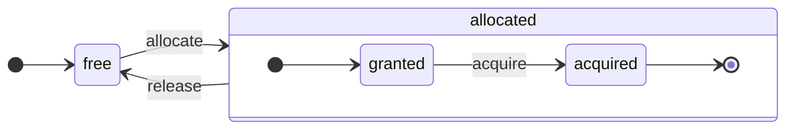

ClickHouse est un véritable SGBD orienté colonnes. Les données sont stockées par colonnes et, pendant l&#39;exécution, traitées sous forme de tableaux (vecteurs ou blocs de colonnes).
Chaque fois que possible, les opérations sont appliquées à des tableaux plutôt qu&#39;à des valeurs individuelles.
C&#39;est ce qu&#39;on appelle l&#39;« exécution vectorisée des requêtes », et cela permet de réduire le coût effectif du traitement des données.

Cette idée n&#39;est pas nouvelle.
Elle remonte à `APL` (un langage de programmation, 1957) et à ses descendants : `A +` (dialecte d&#39;APL), `J` (1990), `K` (1993) et `Q` (langage de programmation de Kx Systems, 2003).
La programmation par tableaux est utilisée dans le traitement des données scientifiques. Cette idée n&#39;est pas nouvelle non plus dans les bases de données relationnelles. Par exemple, elle est utilisée dans le système `VectorWise` (également connu sous le nom d&#39;Actian Vector Analytic Database par Actian Corporation).

Il existe deux approches différentes pour accélérer le traitement des requêtes : l&#39;exécution vectorisée des requêtes et la génération de code à l&#39;exécution. Cette dernière élimine toute indirection et toute liaison dynamique. Aucune de ces deux approches n&#39;est intrinsèquement meilleure que l&#39;autre. La génération de code à l&#39;exécution peut être plus efficace lorsqu&#39;elle fusionne de nombreuses opérations, exploitant ainsi pleinement les unités d&#39;exécution du CPU et le pipeline. L&#39;exécution vectorisée des requêtes peut être moins pratique, car elle implique des vecteurs temporaires qui doivent être écrits dans le cache puis relus. Si les données temporaires ne tiennent pas dans le cache L2, cela devient problématique. En revanche, l&#39;exécution vectorisée des requêtes exploite plus facilement les capacités SIMD du CPU. Un [article de recherche](http://15721.courses.cs.cmu.edu/spring2016/papers/p5-sompolski.pdf) rédigé par des collègues montre qu&#39;il est préférable de combiner les deux approches. ClickHouse utilise l&#39;exécution vectorisée des requêtes et offre une prise en charge initiale limitée de la génération de code à l&#39;exécution.

  ## Colonnes

L’interface `IColumn` sert à représenter les colonnes en mémoire (en réalité, des fragments de colonnes). Cette interface fournit des méthodes utilitaires pour implémenter divers opérateurs relationnels. Presque toutes les opérations sont immuables : elles ne modifient pas la colonne d’origine, mais en créent une nouvelle version modifiée. Par exemple, la méthode `IColumn :: filter` accepte un masque d’octets servant de filtre. Elle est utilisée pour les opérateurs relationnels `WHERE` et `HAVING`. Autres exemples : la méthode `IColumn :: permute` pour prendre en charge `ORDER BY`, et la méthode `IColumn :: cut` pour prendre en charge `LIMIT`.

Les différentes implémentations de `IColumn` (`ColumnUInt8`, `ColumnString`, etc.) définissent l’organisation en mémoire des colonnes. Cette organisation est généralement un tableau contigu. Pour les colonnes de type entier, il s’agit simplement d’un tableau contigu, comme `std :: vector`. Pour les colonnes `String` et `Array`, il y a deux vecteurs : un pour tous les éléments du tableau, stockés de façon contiguë, et un second pour les décalages vers le début de chaque tableau. Il existe également `ColumnConst`, qui ne stocke qu’une seule valeur en mémoire, tout en se comportant comme une colonne.

  ## Field

Néanmoins, il est également possible de travailler avec des valeurs individuelles. Pour représenter une valeur individuelle, on utilise `Field`. `Field` est simplement une union discriminée de `UInt64`, `Int64`, `Float64`, `String` et `Array`. `IColumn` possède la méthode `operator []` pour obtenir la n-ième valeur sous la forme d’un `Field`, ainsi que la méthode `insert` pour ajouter un `Field` à la fin d’une colonne. Ces méthodes ne sont pas très efficaces, car elles nécessitent de manipuler des objets `Field` temporaires représentant une valeur individuelle. Il existe des méthodes plus efficaces, telles que `insertFrom`, `insertRangeFrom`, etc.

`Field` ne contient pas suffisamment d’informations sur un type de données spécifique d’une table. Par exemple, `UInt8`, `UInt16`, `UInt32` et `UInt64` sont tous représentés sous la forme de `UInt64` dans un `Field`.

  ## Abstractions fuyantes

`IColumn` dispose de méthodes pour les transformations relationnelles courantes des données, mais elles ne couvrent pas tous les besoins. Par exemple, `ColumnUInt64` n&#39;a pas de méthode pour calculer la somme de deux colonnes, et `ColumnString` n&#39;a pas de méthode pour effectuer une recherche de sous-chaîne. Ces innombrables traitements sont implémentés en dehors de `IColumn`.

Diverses fonctions appliquées aux colonnes peuvent être implémentées de manière générique, mais peu efficace, à l&#39;aide des méthodes de `IColumn` pour extraire des valeurs `Field`, ou de manière spécialisée en s&#39;appuyant sur la connaissance de l&#39;organisation mémoire interne des données dans une implémentation spécifique de `IColumn`. Pour cela, on caste vers un type `IColumn` spécifique et on manipule directement la représentation interne. Par exemple, `ColumnUInt64` possède la méthode `getData`, qui renvoie une référence à un tableau interne ; une routine distincte lit alors ce tableau ou le remplit directement. Nous avons recours à des « abstractions fuyantes » pour permettre des spécialisations efficaces de diverses routines.

  ## Types de données

`IDataType` est responsable de la sérialisation et de la désérialisation : il lit et écrit des blocs de colonnes ou des valeurs individuelles sous forme binaire ou textuelle. `IDataType` correspond directement aux types de données des tables. Par exemple, il existe `DataTypeUInt32`, `DataTypeDateTime`, `DataTypeString`, etc.

`IDataType` et `IColumn` ne sont que faiblement liés. Différents types de données peuvent être représentés en mémoire par les mêmes implémentations de `IColumn`. Par exemple, `DataTypeUInt32` et `DataTypeDateTime` sont tous deux représentés par `ColumnUInt32` ou `ColumnConstUInt32`. De plus, un même type de données peut être représenté par différentes implémentations de `IColumn`. Par exemple, `DataTypeUInt8` peut être représenté par `ColumnUInt8` ou `ColumnConstUInt8`.

`IDataType` stocke uniquement des métadonnées. Par exemple, `DataTypeUInt8` ne stocke absolument rien (à part le pointeur virtuel `vptr`) et `DataTypeFixedString` stocke uniquement `N` (la taille des chaînes de longueur fixe).

`IDataType` dispose de méthodes utilitaires pour différents formats de données. Exemples : des méthodes permettant de sérialiser une valeur avec échappement si nécessaire, de sérialiser une valeur au format JSON, et de sérialiser une valeur dans le cadre du format XML. Il n’existe pas de correspondance directe avec les formats de données. Par exemple, les formats de données `Pretty` et `TabSeparated` peuvent utiliser la même méthode utilitaire `serializeTextEscaped` de l’interface `IDataType`.

  ## Bloc

Un `Block` est un conteneur qui représente un sous-ensemble (fragment) d&#39;une table en mémoire. Il s&#39;agit simplement d&#39;un ensemble de triplets : `(IColumn, IDataType, column name)`. Lors de l&#39;exécution d&#39;une requête, les données sont traitées par `Block`. Si nous avons un `Block`, nous avons des données (dans l&#39;objet `IColumn`), des informations sur leur type (dans `IDataType`) qui nous indiquent comment traiter cette colonne, ainsi que le nom de la colonne. Il peut s&#39;agir soit du nom de colonne d&#39;origine de la table, soit d&#39;un nom artificiel attribué pour obtenir des résultats de calcul temporaires.

Lorsque nous calculons une fonction sur des colonnes d&#39;un bloc, nous ajoutons au bloc une autre colonne contenant son résultat, et nous ne touchons pas aux colonnes correspondant aux arguments de la fonction, car les opérations sont immuables. Par la suite, les colonnes inutiles peuvent être supprimées du bloc, mais pas modifiées. Cela facilite l&#39;élimination des sous-expressions communes.

Des blocs sont créés pour chaque fragment de données traité. Notez que, pour un même type de calcul, les noms et les types des colonnes restent identiques d&#39;un bloc à l&#39;autre, et seules les données des colonnes changent. Il est préférable de séparer les données du bloc de son en-tête, car une petite taille de bloc entraîne un surcoût important dû aux chaînes temporaires utilisées pour copier les `shared_ptr` et les noms de colonnes.

  ## Processeurs

Consultez la description à l’adresse [https://github.com/ClickHouse/ClickHouse/blob/master/src/Processors/IProcessor.h](https://github.com/ClickHouse/ClickHouse/blob/master/src/Processors/IProcessor.h).

  ## Formats

Les formats de données s’appuient sur des processeurs.

  ## E/S

Pour les entrées/sorties orientées octets, il existe les classes abstraites `ReadBuffer` et `WriteBuffer`. Elles sont utilisées à la place des `iostream` de C++. Rassurez-vous : tout projet C++ mature utilise autre chose que les `iostream`, et ce pour de bonnes raisons.

`ReadBuffer` et `WriteBuffer` ne sont qu’un tampon contigu et un curseur pointant vers une position dans ce tampon. Les implémentations peuvent posséder ou non la mémoire du tampon. Il existe une méthode virtuelle pour remplir le tampon avec les données suivantes (pour `ReadBuffer`) ou pour vider le tampon vers une destination (pour `WriteBuffer`). Les méthodes virtuelles sont rarement appelées.

Les implémentations de `ReadBuffer`/`WriteBuffer` sont utilisées pour travailler avec des fichiers, des descripteurs de fichier et des sockets réseau, pour implémenter la compression (`CompressedWriteBuffer` est initialisé avec un autre `WriteBuffer` et effectue la compression avant d’y écrire les données), ainsi que pour d’autres usages — les noms `ConcatReadBuffer`, `LimitReadBuffer` et `HashingWriteBuffer` parlent d’eux-mêmes.

Les `ReadBuffer`/`WriteBuffer` ne manipulent que des octets. Des fonctions définies dans les fichiers d’en-tête `ReadHelpers` et `WriteHelpers` facilitent le formatage des entrées/sorties. Par exemple, il existe des helpers pour écrire un nombre au format décimal.

Voyons ce qui se passe lorsque vous voulez écrire un ensemble de résultats au format `JSON` dans stdout.
Vous disposez d’un ensemble de résultats prêt à être récupéré depuis un `QueryPipeline` en mode `pulling`.
Vous créez d’abord un `WriteBufferFromFileDescriptor(STDOUT_FILENO)` pour écrire des octets dans stdout.
Ensuite, vous connectez le résultat du pipeline de requête à `JSONRowOutputFormat`, initialisé avec ce `WriteBuffer`, afin d’écrire les lignes au format `JSON` dans stdout.
Cela peut se faire via la méthode `complete`, qui transforme un `QueryPipeline` en mode `pulling` en `QueryPipeline` terminé.
En interne, `JSONRowOutputFormat` écrit différents délimiteurs JSON et appelle la méthode `IDataType::serializeTextJSON` avec, comme arguments, une référence vers `IColumn` et le numéro de ligne. Par conséquent, `IDataType::serializeTextJSON` appellera une méthode de `WriteHelpers.h` : par exemple, `writeText` pour les types numériques et `writeJSONString` pour `DataTypeString`.

  ## Tables

L’interface `IStorage` représente les tables. Les différentes implémentations de cette interface correspondent à différents table engines. Parmi les exemples, on trouve `StorageMergeTree`, `StorageMemory`, etc. Les instances de ces classes sont tout simplement des tables.

Les méthodes clés de `IStorage` sont `read` et `write`, ainsi que d’autres comme `alter`, `rename` et `drop`. La méthode `read` accepte les arguments suivants : un ensemble de colonnes à lire dans une table, la query `AST` à prendre en compte et le nombre souhaité de streams. Elle renvoie un `Pipe`.

Dans la plupart des cas, la méthode `read` est uniquement chargée de lire les colonnes spécifiées d’une table, et non d’effectuer un traitement supplémentaire des données.
Tout le traitement ultérieur des données est pris en charge par une autre partie du pipeline, ce qui ne relève pas de la responsabilité de `IStorage`.

Mais il existe des exceptions notables :

* La query `AST` est transmise à la méthode `read`, et le table engine peut l’utiliser pour déterminer comment utiliser les index et lire moins de données dans une table.
* Parfois, le table engine peut lui-même traiter les données jusqu’à une étape donnée. Par exemple, `StorageDistributed` peut envoyer une query à des servers distants, leur demander de traiter les données jusqu’à une étape où les données de différents servers distants peuvent être fusionnées, puis renvoyer ces données prétraitées. L’interpréteur de query termine ensuite le traitement des données.

La méthode `read` de la table peut renvoyer un `Pipe` composé de plusieurs `Processors`. Ces `Processors` peuvent lire une table in parallel.
Vous pouvez ensuite connecter ces processeurs à diverses autres transformations (comme l’évaluation d’expressions ou le filtrage), qui peuvent être calculées indépendamment.
Puis créer un `QueryPipeline` au-dessus de ceux-ci et l’exécuter via `PipelineExecutor`.

Il existe également des `TableFunction`s. Ce sont des fonctions qui renvoient un objet `IStorage` temporaire à utiliser dans la clause `FROM` d’une query.

Pour vous faire rapidement une idée de la manière d’implémenter votre table engine, examinez quelque chose de simple, comme `StorageMemory` ou `StorageTinyLog`.

> En résultat de la méthode `read`, `IStorage` renvoie `QueryProcessingStage`, c’est-à-dire des informations sur les parties de la query déjà calculées dans le storage.

  ## Parseurs

Un parseur à descente récursive écrit à la main analyse une requête. Par exemple, `ParserSelectQuery` appelle simplement de façon récursive les parseurs sous-jacents pour les différentes parties de la requête. Les parseurs créent un `AST`. L&#39;`AST` est représenté sous forme de nœuds, qui sont des instances de `IAST`.

> Les générateurs de parseurs ne sont pas utilisés pour des raisons historiques.

  ## Interpréteurs

Les interpréteurs sont chargés de créer le pipeline d&#39;exécution des requêtes à partir d&#39;un AST. Il existe des interpréteurs simples, comme `InterpreterExistsQuery` et `InterpreterDropQuery`, ainsi que le plus sophistiqué `InterpreterSelectQuery`.

Le pipeline d&#39;exécution des requêtes est un ensemble de processeurs capables de consommer et de produire des blocs (ensembles de colonnes avec des types spécifiques).
Un processeur communique via des ports et peut avoir plusieurs ports d&#39;entrée et plusieurs ports de sortie.
Vous trouverez une description plus détaillée dans [src/Processors/IProcessor.h](https://github.com/ClickHouse/ClickHouse/blob/master/src/Processors/IProcessor.h).

Par exemple, le résultat de l&#39;interprétation de la requête `SELECT` est un `QueryPipeline` « pulling » qui possède un port de sortie spécial permettant de lire le jeu de résultats.
Le résultat de la requête `INSERT` est un `QueryPipeline` « pushing » avec un port d&#39;entrée pour écrire les données à insérer.
Et le résultat de l&#39;interprétation de la requête `INSERT SELECT` est un `QueryPipeline` « completed » qui n&#39;a ni entrée ni sortie, mais copie simultanément les données de `SELECT` vers `INSERT`.

`InterpreterSelectQuery` utilise l&#39;infrastructure `ExpressionAnalyzer` et `ExpressionActions` pour l&#39;analyse des requêtes et les transformations. C&#39;est là que sont effectuées la plupart des optimisations de requêtes basées sur des règles. `ExpressionAnalyzer` est assez désordonné et devrait être réécrit : diverses transformations et optimisations de requêtes devraient être extraites dans des classes distinctes afin de permettre des transformations modulaires de la requête.

Pour remédier aux problèmes présents dans les interpréteurs, un nouvel `InterpreterSelectQueryAnalyzer` a été développé. Il s&#39;agit d&#39;une nouvelle version de `InterpreterSelectQuery`, qui n&#39;utilise pas `ExpressionAnalyzer` et introduit une couche d&#39;abstraction supplémentaire entre `AST` et `QueryPipeline`, appelée `QueryTree`. Il est entièrement prêt à être utilisé en production, mais par précaution, il peut être désactivé en définissant la valeur du paramètre `enable_analyzer` sur `false`.

  ## Fonctions

Il existe des fonctions ordinaires et des fonctions d’agrégation. Pour les fonctions d’agrégation, voir la section suivante.

Les fonctions ordinaires ne modifient pas le nombre de lignes : elles fonctionnent comme si elles traitaient chaque ligne indépendamment. En réalité, les fonctions ne sont pas appelées pour chaque ligne individuellement, mais sur des `Block` de données afin de mettre en œuvre l’exécution vectorisée des requêtes.

Il existe aussi quelques fonctions diverses, comme [blockSize](/fr/sql-reference/functions/other-functions#blockSize), [rowNumberInBlock](/fr/sql-reference/functions/other-functions#rowNumberInBlock) et [runningAccumulate](/fr/sql-reference/functions/other-functions#runningAccumulate), qui exploitent le traitement par blocs et ne respectent pas l’indépendance des lignes.

ClickHouse est fortement typé ; il n’y a donc pas de conversion implicite de type. Si une fonction ne prend pas en charge une combinaison particulière de types, elle lève une exception. En revanche, les fonctions peuvent fonctionner (être surchargées) avec de nombreuses combinaisons de types différentes. Par exemple, la fonction `plus` (qui implémente l’opérateur `+`) fonctionne avec n’importe quelle combinaison de types numériques : `UInt8` + `Float32`, `UInt16` + `Int8`, etc. De plus, certaines fonctions variadiques peuvent accepter un nombre quelconque d’arguments, comme la fonction `concat`.

L’implémentation d’une fonction peut être un peu fastidieuse, car elle doit gérer explicitement les types de données pris en charge ainsi que les `IColumns` pris en charge. Par exemple, la fonction `plus` s’appuie sur du code généré par instanciation d’un template C++ pour chaque combinaison de types numériques, ainsi que pour les arguments gauche et droit constants ou non constants.

C’est un excellent cas d’usage pour implémenter la génération de code à l’exécution afin d’éviter l’explosion du code liée aux templates. Cela permet également d’ajouter des fonctions fusionnées comme fused multiply-add, ou d’effectuer plusieurs comparaisons en une seule itération de boucle.

En raison de l’exécution vectorisée des requêtes, les fonctions ne sont pas court-circuitées. Par exemple, si vous écrivez `WHERE f(x) AND g(y)`, les deux côtés sont calculés, même pour les lignes où `f(x)` vaut zéro (sauf lorsque `f(x)` est une expression constante nulle). Mais si la sélectivité de la condition `f(x)` est élevée et que le calcul de `f(x)` est bien moins coûteux que celui de `g(y)`, il est préférable d’implémenter un calcul en plusieurs passes. Il faudrait d’abord calculer `f(x)`, puis filtrer les colonnes en fonction du résultat, puis calculer `g(y)` uniquement sur des fragments de données plus petits et filtrés.

  ## Fonctions d’agrégation

Les fonctions d’agrégation sont des fonctions avec état. Elles accumulent les valeurs qui leur sont passées dans un état donné et permettent d’obtenir des résultats à partir de cet état. Elles sont gérées via l’interface `IAggregateFunction`. Les états peuvent être assez simples (l’état de `AggregateFunctionCount` n’est qu’une simple valeur `UInt64`) ou assez complexes (l’état de `AggregateFunctionUniqCombined` combine un tableau linéaire, une table de hachage et une structure de données probabiliste `HyperLogLog`).

Les états sont alloués dans `Arena` (un pool mémoire) afin de gérer plusieurs états lors de l’exécution d’une requête `GROUP BY` à haute cardinalité. Ils peuvent avoir un constructeur et un destructeur non triviaux : par exemple, des états d’agrégation complexes peuvent eux-mêmes allouer de la mémoire supplémentaire. Cela demande une attention particulière lors de la création et de la destruction des états, ainsi que pour le transfert correct de leur propriété et l’ordre de leur destruction.

Les états d’agrégation peuvent être sérialisés et désérialisés pour être transmis sur le réseau lors de l’exécution distribuée d’une requête ou pour être écrits sur le disque lorsqu’il n’y a pas assez de RAM. Ils peuvent même être stockés dans une table avec `DataTypeAggregateFunction` afin de permettre une agrégation incrémentielle des données.

> Le format de données sérialisé des états de fonctions d’agrégation n’est actuellement pas versionné. Cela convient si les états d’agrégation ne sont stockés que temporairement. Mais nous disposons du moteur de table `AggregatingMergeTree` pour l’agrégation incrémentielle, et il est déjà utilisé en production. C’est pourquoi la rétrocompatibilité est nécessaire si le format sérialisé d’une fonction d’agrégation doit être modifié à l’avenir.

  ## Serveur

Le serveur implémente plusieurs interfaces différentes :

* Une interface HTTP pour tous les clients tiers.
* Une interface TCP pour le client ClickHouse natif et pour la communication entre serveurs pendant l’exécution distribuée des requêtes.
* Une interface pour le transfert de données de réplication.

En interne, il s’agit simplement d’un serveur multithread rudimentaire, sans coroutines ni fibres. Le serveur n’est pas conçu pour traiter un volume élevé de requêtes simples, mais plutôt un volume relativement faible de requêtes complexes, chacune pouvant traiter une très grande quantité de données à des fins d’analyse.

Le serveur initialise la classe `Context` avec l’environnement nécessaire à l’exécution des requêtes : la liste des bases de données disponibles, les utilisateurs et leurs droits d’accès, les paramètres, les clusters, la liste des processus, le journal des requêtes, etc. Les Interpreters utilisent cet environnement.

Nous assurons une compatibilité complète, ascendante et descendante, pour le protocole TCP du serveur : les anciens clients peuvent communiquer avec les nouveaux serveurs, et les nouveaux clients peuvent communiquer avec les anciens serveurs. Mais nous ne souhaitons pas la maintenir indéfiniment et supprimons la prise en charge des anciennes versions après environ un an.

:::note
Pour la plupart des applications externes, nous recommandons d’utiliser l’interface HTTP, car elle est simple et facile à utiliser. Le protocole TCP est plus étroitement lié aux structures de données internes : il utilise un format interne pour transmettre des blocs de données, ainsi qu’un tramage personnalisé pour les données compressées.
:::

  ## Configuration

Le serveur ClickHouse repose sur les bibliothèques POCO C++ et utilise `Poco::Util::AbstractConfiguration` pour représenter sa configuration. La configuration est portée par la classe `Poco::Util::ServerApplication`, dont hérite la classe `DaemonBase`, elle-même étendue par la classe `DB::Server`, qui implémente `clickhouse-server`. La config est donc accessible via la méthode `ServerApplication::config()`.

La config est lue depuis plusieurs fichiers (au format XML ou YAML), puis fusionnée en une seule `AbstractConfiguration` par la classe `ConfigProcessor`. La configuration est chargée au démarrage du serveur et peut ensuite être rechargée si l’un des fichiers de config est mis à jour, supprimé ou ajouté. La classe `ConfigReloader` est également responsable de la surveillance périodique de ces changements ainsi que de la procédure de rechargement. La query `SYSTEM RELOAD CONFIG` déclenche également le rechargement de la config.

Pour les querys et les sous-systèmes autres que `Server`, la config est accessible via la méthode `Context::getConfigRef()`. Chaque sous-système capable de recharger sa config sans redémarrer le serveur doit s’enregistrer dans le callback de rechargement de la méthode `Server::main()`. Notez que si la nouvelle configuration contient une erreur, la plupart des sous-systèmes ignorent cette nouvelle config, consignent des messages d’avertissement et continuent de fonctionner avec la config précédemment chargée. En raison de la nature d’`AbstractConfiguration`, il n’est pas possible de passer une référence à une section spécifique ; on utilise donc généralement `String config_prefix` à la place.

  ### Context

ClickHouse gère les paramètres selon une hiérarchie de Context :

* **Context global** - paramètres définis à l’échelle du serveur via des fichiers de configuration
* **Context de session** - paramètres de la session utilisateur issus des profiles, de la configuration utilisateur et des commandes SET
* **Context de requête** - paramètres au niveau de la requête issus de la clause SETTINGS
* **Context d’arrière-plan** - paramètres à l’échelle du serveur pour les opérations d’arrière-plan (Mutate, Merge) définis via le profile &#39;background&#39;

Lors de la planification d’une opération (requêtes, mutations, etc.), le serveur construit le Context correspondant en fusionnant les paramètres dans l’ordre suivant (les sections suivantes remplacent les précédentes) :

1. Valeurs globales par défaut
2. Configuration globale
3. Paramètres du profile (section `<profiles>`)
4. Paramètres utilisateur (section `<users>`)
5. Paramètres de session (commande SET)
6. Paramètres de requête (clause SETTINGS)

:::note
Les opérations d’arrière-plan peuvent être configurées via les paramètres globaux et ceux du profile &#39;background&#39; ; dans ce cas, les paramètres de session et de requête n’ont aucun effet. Si aucune configuration explicite n’est fournie, la configuration héritera du Context global. Le nom de profile par défaut pour ces opérations est &#39;background&#39; et peut être remplacé via le server setting `background_profile`.
:::

  ## Threads et jobs

Pour exécuter les requêtes et effectuer des activités annexes, ClickHouse alloue des threads depuis l’un des thread pools afin d’éviter les créations et destructions fréquentes de threads. Il existe plusieurs thread pools, sélectionnés selon la finalité et la structure d’un job :

* Pool du serveur pour les sessions client entrantes.
* Global thread pool pour les jobs d’usage général, les activités en arrière-plan et les threads standalone.
* IO thread pool pour les jobs principalement bloqués sur des opérations d’IO et peu gourmands en CPU.
* Background pools pour les tâches périodiques.
* Pools pour les tâches préemptibles qui peuvent être découpées en étapes.

Le server pool est une instance de la classe `Poco::ThreadPool` définie dans la méthode `Server::main()`. Il peut contenir au maximum `max_connection` threads. Chaque thread est dédié à une seule connection active.

Le global thread pool est la classe singleton `GlobalThreadPool`. Pour y allouer un thread, on utilise `ThreadFromGlobalPool`. Son interface est similaire à `std::thread`, mais il récupère un thread depuis le global pool et effectue toute l’initialisation nécessaire. Il est configuré avec les settings suivants :

* `max_thread_pool_size` - limite du nombre de threads dans le pool.
* `max_thread_pool_free_size` - limite du nombre de threads inactifs en attente de nouveaux jobs.
* `thread_pool_queue_size` - limite du nombre de jobs planifiés.

Le global pool est universel et tous les pools décrits ci-dessous sont implémentés par-dessus lui. On peut y voir une hiérarchie de pools. Tout pool spécialisé obtient ses threads depuis le global pool à l’aide de la classe `ThreadPool`. Ainsi, l’objectif principal de tout pool spécialisé est d’imposer une limite au nombre de jobs simultanés et d’assurer leur planification. S’il y a plus de jobs planifiés que de threads dans un pool, `ThreadPool` accumule les jobs dans une queue avec priorités. Chaque job possède une priorité entière. La priorité par défaut est zéro. Tous les jobs ayant une priorité plus élevée démarrent avant ceux dont la priorité est plus faible. En revanche, il n’y a pas de différence entre les jobs déjà en cours d’exécution ; la priorité n’a donc d’importance que lorsque le pool est surchargé.

Le IO thread pool est implémenté comme un simple `ThreadPool` accessible via la méthode `IOThreadPool::get()`. Il est configuré de la même manière que le global pool avec les settings `max_io_thread_pool_size`, `max_io_thread_pool_free_size` et `io_thread_pool_queue_size`. Son objectif principal est d’éviter que des jobs d’IO n’épuisent le global pool, ce qui pourrait empêcher les requêtes d’utiliser pleinement le CPU. Backup vers S3 effectue un volume important d’opérations d’IO et, pour éviter d’impacter les requêtes interactives, il existe un `BackupsIOThreadPool` distinct configuré avec les settings `max_backups_io_thread_pool_size`, `max_backups_io_thread_pool_free_size` et `backups_io_thread_pool_queue_size`.

Pour l’exécution des tâches périodiques, il existe la classe `BackgroundSchedulePool`. Vous pouvez enregistrer des tâches à l’aide d’objets `BackgroundSchedulePool::TaskHolder`, et le pool garantit qu’aucune tâche n’exécute deux jobs en même temps. Il permet également de reporter l’exécution d’une tâche à un instant précis dans le futur ou de désactiver temporairement cette tâche. Le `Context` global fournit quelques instances de cette classe pour différents usages. Pour les tâches d’usage général, on utilise `Context::getSchedulePool()`.

Il existe également des thread pools spécialisés pour les tâches préemptibles. Une tâche `IExecutableTask` de ce type peut être découpée en une séquence ordonnée de jobs, appelés steps. Pour planifier ces tâches de manière à donner la priorité aux tâches courtes sur les longues, on utilise `MergeTreeBackgroundExecutor`. Comme son nom l’indique, il est utilisé pour les opérations en arrière-plan liées à MergeTree, comme les merges, mutations, fetches et déplacements. Les instances du pool sont disponibles via `Context::getCommonExecutor()` et d’autres méthodes similaires.

Quel que soit le pool utilisé pour un job, une instance de `ThreadStatus` est créée au démarrage pour ce job. Elle encapsule toutes les informations propres au thread : id du thread, id de la requête, counters de performance, consommation de ressources et de nombreuses autres données utiles. Le job peut y accéder via un pointeur local au thread avec l’appel `CurrentThread::get()`, ce qui évite de devoir le passer à chaque fonction.

Si le thread est lié à l’exécution d’une requête, alors l’élément le plus important attaché à `ThreadStatus` est le contexte de requête `ContextPtr`. Chaque requête a son master thread dans le server pool. Le master thread effectue cet attachement en conservant un objet `ThreadStatus::QueryScope query_scope(query_context)`. Le master thread crée également un groupe de threads représenté par l’objet `ThreadGroupStatus`. Chaque thread supplémentaire alloué pendant l’exécution de cette requête est attaché à son groupe de threads via l’appel `CurrentThread::attachTo(thread_group)`. Les groupes de threads sont utilisés pour agréger les counters d’événements de profil et suivre la consommation mémoire de tous les threads dédiés à une tâche unique (voir les classes `MemoryTracker` et `ProfileEvents::Counters` pour plus d’informations).

  ## Contrôle de la concurrence

Une requête qui peut être parallélisée utilise le paramètre `max_threads` pour limiter son parallélisme. La valeur par défaut de ce paramètre est choisie de façon à permettre à une seule requête d&#39;utiliser au mieux tous les cœurs CPU. Mais que se passe-t-il s&#39;il y a plusieurs requêtes concurrentes et que chacune d&#39;elles utilise la valeur par défaut de `max_threads` ? Les requêtes se partageront alors les ressources CPU. Le système d&#39;exploitation garantira l&#39;équité en basculant en permanence entre les threads, ce qui entraîne une certaine pénalité de performance. `ConcurrencyControl` permet d&#39;atténuer cette pénalité et d&#39;éviter d&#39;allouer un trop grand nombre de threads. Le paramètre de configuration `concurrent_threads_soft_limit_num` sert à limiter le nombre de threads concurrents pouvant être alloués avant d&#39;appliquer une forme de pression sur le CPU.

La notion de `slot` CPU est introduite. Un slot est une unité de concurrence : pour exécuter un thread, une requête doit d&#39;abord acquérir un slot, puis le libérer lorsque le thread s&#39;arrête. Le nombre de slots est limité globalement sur le serveur. Plusieurs requêtes concurrentes entrent en concurrence pour les slots CPU si la demande totale dépasse le nombre total de slots. `ConcurrencyControl` est chargé de résoudre cette concurrence en assurant un ordonnancement équitable des slots CPU.

Chaque slot peut être vu comme une machine à états indépendante avec les états suivants :

* `free` : le slot est disponible et peut être alloué à n&#39;importe quelle requête.
* `granted` : le slot est `allocated` à une requête spécifique, mais n&#39;a pas encore été acquis par un thread.
* `acquired` : le slot est `allocated` à une requête spécifique et acquis par un thread.

Notez qu&#39;un slot `allocated` peut se trouver dans deux états différents : `granted` et `acquired`. Le premier est un état transitoire, qui devrait en pratique être bref (entre le moment où un slot est alloué à une requête et celui où la procédure d&#39;augmentation est exécutée par l&#39;un des threads de cette requête).

L&#39;API de `ConcurrencyControl` se compose des fonctions suivantes :

1. Créer une allocation de ressources pour une requête : `auto slots = ConcurrencyControl::instance().allocate(1, max_threads);`. Elle alloue au moins 1 slot et au plus `max_threads` slots. Notez que le premier slot est accordé immédiatement, mais que les slots restants peuvent l&#39;être plus tard. La limite est donc souple, car chaque requête obtiendra au moins un thread.
2. Pour chaque thread, un slot doit être acquis à partir d&#39;une allocation : `while (auto slot = slots->tryAcquire()) spawnThread([slot = std::move(slot)] { ... });`.
3. Mettre à jour le nombre total de slots : `ConcurrencyControl::setMaxConcurrency(concurrent_threads_soft_limit_num)`. Cela peut être fait à l&#39;exécution, sans redémarrer le serveur.

Cette API permet aux requêtes de démarrer avec au moins un thread (en cas de pression sur le CPU), puis de monter en charge jusqu&#39;à `max_threads`.

  ## Exécution distribuée des requêtes

Les serveurs d&#39;un cluster sont, pour l&#39;essentiel, indépendants. Vous pouvez créer une table `Distributed` sur un ou sur tous les serveurs d&#39;un cluster. La table `Distributed` ne stocke pas elle-même les données : elle fournit uniquement une « vue » sur toutes les tables locales de plusieurs nœuds du cluster. Lorsque vous effectuez un SELECT sur une table `Distributed`, elle réécrit la query, choisit les nœuds distants selon les paramètres d&#39;équilibrage de charge, puis leur envoie la query. La table `Distributed` demande aux serveurs distants de traiter la query uniquement jusqu&#39;à l&#39;étape où les résultats intermédiaires de différents serveurs peuvent être fusionnés. Elle récupère ensuite ces résultats intermédiaires et les fusionne. La table distribuée tente de répartir autant de travail que possible sur les serveurs distants et n&#39;envoie que peu de données intermédiaires sur le réseau.

Les choses se compliquent lorsque vous avez des sous-requêtes dans des clauses IN ou JOIN, et que chacune d&#39;elles utilise une table `Distributed`. Nous avons différentes stratégies pour exécuter ces requêtes.

Il n&#39;existe pas de query plan global pour l&#39;exécution distribuée des requêtes. Chaque nœud dispose de son query plan local pour la part du job qui lui revient. Nous ne disposons que d&#39;une exécution distribuée simple, en un seul passage : nous envoyons des requêtes aux nœuds distants, puis nous fusionnons les résultats. Mais cela n&#39;est pas envisageable pour des requêtes complexes avec des `GROUP BY` à cardinalité élevée ou avec un grand volume de données temporaires pour JOIN. Dans ce cas, il faut « redistribuer » les données entre les serveurs, ce qui nécessite une coordination supplémentaire. ClickHouse ne prend pas en charge ce type d&#39;exécution des requêtes, et nous devons encore travailler sur ce point.

  ## Merge tree

`MergeTree` est une famille de moteurs de stockage qui prend en charge l’indexation par clé primaire. La clé primaire peut être un tuple arbitraire de colonnes ou d’expressions. Les données d’une table `MergeTree` sont stockées en « parts ». Chaque part stocke les données dans l’ordre de la clé primaire, de sorte qu’elles sont ordonnées lexicographiquement selon le tuple de clé primaire. Toutes les colonnes de la table sont stockées dans des fichiers `column.bin` distincts dans ces parts. Les fichiers sont constitués de blocs compressés. Chaque bloc contient généralement entre 64 KB et 1 MB de données non compressées, selon la taille moyenne des valeurs. Les blocs sont constitués de valeurs de colonne placées de façon contiguë les unes à la suite des autres. Les valeurs sont dans le même ordre pour chaque colonne (la clé primaire définit cet ordre), de sorte que lorsque vous parcourez plusieurs colonnes, vous obtenez les valeurs des lignes correspondantes.

La clé primaire elle-même est « clairsemée ». Elle ne référence pas chaque ligne individuellement, mais seulement certaines plages de données. Un fichier `primary.idx` distinct contient la valeur de la clé primaire pour chaque N-ième ligne, où N est appelé `index_granularity` (généralement, N = 8192). De plus, pour chaque colonne, il existe des fichiers `column.mrk` avec des « marks », c’est-à-dire des offsets vers chaque N-ième ligne dans le fichier de données. Chaque mark est une paire : l’offset dans le fichier vers le début du bloc compressé, et l’offset dans le bloc décompressé vers le début des données. En général, les blocs compressés sont alignés sur les marks, et l’offset dans le bloc décompressé est nul. Les données de `primary.idx` résident toujours en mémoire, et celles des fichiers `column.mrk` sont mises en cache.

Lorsque nous allons lire des données depuis une part dans `MergeTree`, nous examinons les données de `primary.idx` pour localiser les plages susceptibles de contenir les données demandées, puis nous examinons les données de `column.mrk` et calculons les offsets indiquant où commencer la lecture de ces plages. En raison de ce caractère clairsemé, des données superflues peuvent être lues. ClickHouse n’est pas adapté à une charge élevée de requêtes ponctuelles simples, car toute la plage de `index_granularity` lignes doit être lue pour chaque clé, et tout le bloc compressé doit être décompressé pour chaque colonne. Nous avons rendu l’index clairsemé parce que nous devons pouvoir gérer des milliers de milliards de lignes sur un seul server sans consommation mémoire notable pour l’index. De plus, comme la clé primaire est clairsemée, elle n’est pas unique : elle ne peut pas vérifier l’existence de la clé dans la table au moment de l’`INSERT`. Une table peut contenir de nombreuses lignes avec la même clé.

Lorsque vous `INSERT` un lot de données dans `MergeTree`, ce lot est trié selon l’ordre de la clé primaire et forme une nouvelle part. Des threads d’arrière-plan sélectionnent périodiquement certaines parts et les fusionnent en une seule part triée afin de maintenir un nombre de parts relativement faible. C’est pourquoi ce moteur s’appelle `MergeTree`. Bien sûr, la fusion entraîne une « write amplification ». Toutes les parts sont immuables : elles sont uniquement créées et supprimées, jamais modifiées. Lorsqu’un SELECT est exécuté, il conserve un snapshot de la table (un ensemble de parts). Après la fusion, nous conservons également les anciennes parts pendant un certain temps pour faciliter la recovery après une défaillance, de sorte que, si nous constatons qu’une merged part est probablement corrompue, nous pouvons la remplacer par ses parts sources.

`MergeTree` n’est pas un arbre LSM, car il ne contient ni MEMTABLE ni LOG : les données insérées sont écrites directement dans le filesystem. Ce comportement rend MergeTree bien plus adapté à l’insertion de données en batches. Par conséquent, insérer fréquemment de petites quantités de lignes n’est pas idéal pour MergeTree. Par exemple, quelques lignes par seconde conviennent, mais le faire mille fois par seconde n’est pas optimal pour MergeTree. Cependant, il existe un mode async insert pour les petits inserts afin de surmonter cette limitation. Nous l’avons conçu ainsi par souci de simplicité, et parce que nous insérons déjà les données en batches dans nos applications

Il existe des moteurs MergeTree qui effectuent un travail supplémentaire pendant les fusions en arrière-plan. `CollapsingMergeTree` et `AggregatingMergeTree` en sont des exemples. Cela peut être considéré comme une prise en charge particulière des mises à jour. Gardez à l’esprit qu’il ne s’agit pas de véritables mises à jour, car les utilisateurs n’ont généralement aucun contrôle sur le moment où les fusions en arrière-plan sont exécutées, et les données d’une table `MergeTree` sont presque toujours stockées dans plusieurs parts, et non sous une forme entièrement fusionnée.

  ## Réplication

La réplication dans ClickHouse peut être configurée table par table. Vous pouvez avoir à la fois des tables répliquées et des tables non répliquées sur le même serveur. Vous pouvez également avoir des tables répliquées de différentes façons, par exemple une table avec une réplication à deux facteurs et une autre à trois facteurs.

La réplication est implémentée dans le moteur de stockage `ReplicatedMergeTree`. Le chemin dans `ZooKeeper` est spécifié comme paramètre du moteur de stockage. Toutes les tables ayant le même chemin dans `ZooKeeper` deviennent des répliques les unes des autres : elles synchronisent leurs données et maintiennent la cohérence. Des répliques peuvent être ajoutées ou supprimées dynamiquement, simplement en créant ou en supprimant une table.

La réplication utilise un schéma multi-maître asynchrone. Vous pouvez insérer des données dans n’importe quelle réplique disposant d’une session avec `ZooKeeper`, et les données sont répliquées de manière asynchrone vers toutes les autres répliques. Comme ClickHouse ne prend pas en charge les UPDATE, la réplication est sans conflit. Comme il n’y a pas, par défaut, de confirmation par quorum des insertions, les données venant d’être insérées peuvent être perdues si un nœud tombe en panne. Le quorum d’insertion peut être activé à l’aide du paramètre `insert_quorum`.

Les métadonnées de réplication sont stockées dans ZooKeeper. Il existe un journal de réplication qui répertorie les actions à effectuer. Ces actions sont les suivantes : récupérer une part ; fusionner des parts ; supprimer une partition ; etc. Chaque réplique copie le journal de réplication dans sa file d’attente, puis exécute les actions de cette file. Par exemple, lors d’une insertion, l’action « récupérer la part » est créée dans le journal, et chaque réplique télécharge cette part. Les fusions sont coordonnées entre les répliques afin d’obtenir des résultats strictement identiques, octet pour octet. Toutes les parts sont fusionnées de la même manière sur toutes les répliques. L’un des leaders lance d’abord une nouvelle fusion et écrit les actions « fusionner des parts » dans le journal. Plusieurs répliques (ou toutes) peuvent être leaders en même temps. Il est possible d’empêcher une réplique de devenir leader à l’aide du paramètre `merge_tree` `replicated_can_become_leader`. Les leaders sont responsables de la planification des fusions en arrière-plan.

La réplication est physique : seules les parts compressées sont transférées entre les nœuds, pas les requêtes. Dans la plupart des cas, les fusions sont traitées indépendamment sur chaque réplique afin de réduire les coûts réseau en évitant l’amplification réseau. Les grandes parts fusionnées ne sont envoyées sur le réseau qu’en cas de retard de réplication important.

En outre, chaque réplique stocke son état dans ZooKeeper sous la forme de l’ensemble des parts et de leurs sommes de contrôle. Lorsque l’état sur le système de fichiers local diverge de l’état de référence dans ZooKeeper, la réplique rétablit la cohérence en téléchargeant les parts manquantes et corrompues depuis d’autres répliques. Lorsqu’il existe des données inattendues ou corrompues dans le système de fichiers local, ClickHouse ne les supprime pas, mais les déplace vers un répertoire distinct et les ignore.

:::note
Le cluster ClickHouse se compose de shards indépendants, et chaque shard se compose de répliques. Le cluster n’est **pas élastique** ; ainsi, après l’ajout d’un nouveau shard, les données ne sont pas rééquilibrées automatiquement entre les shards. Au lieu de cela, la charge du cluster est supposée être répartie de manière inégale. Cette implémentation vous donne davantage de contrôle, et elle convient à des clusters relativement petits, par exemple de quelques dizaines de nœuds. Mais pour les clusters de plusieurs centaines de nœuds que nous utilisons en production, cette approche devient un inconvénient majeur. Nous devrions implémenter un moteur de table couvrant l’ensemble du cluster, avec des régions répliquées dynamiquement qui pourraient être scindées et équilibrées automatiquement entre les clusters.
:::