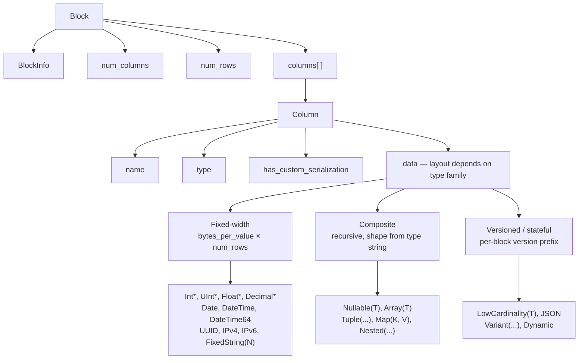
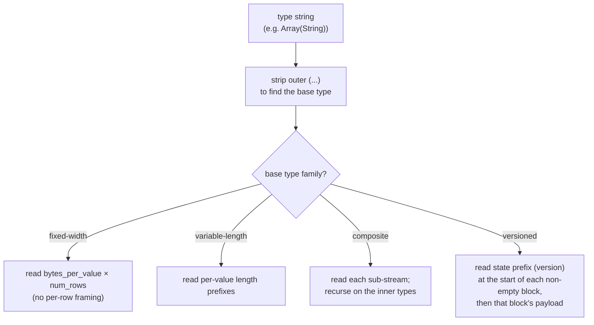
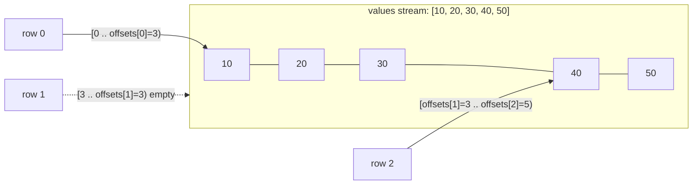
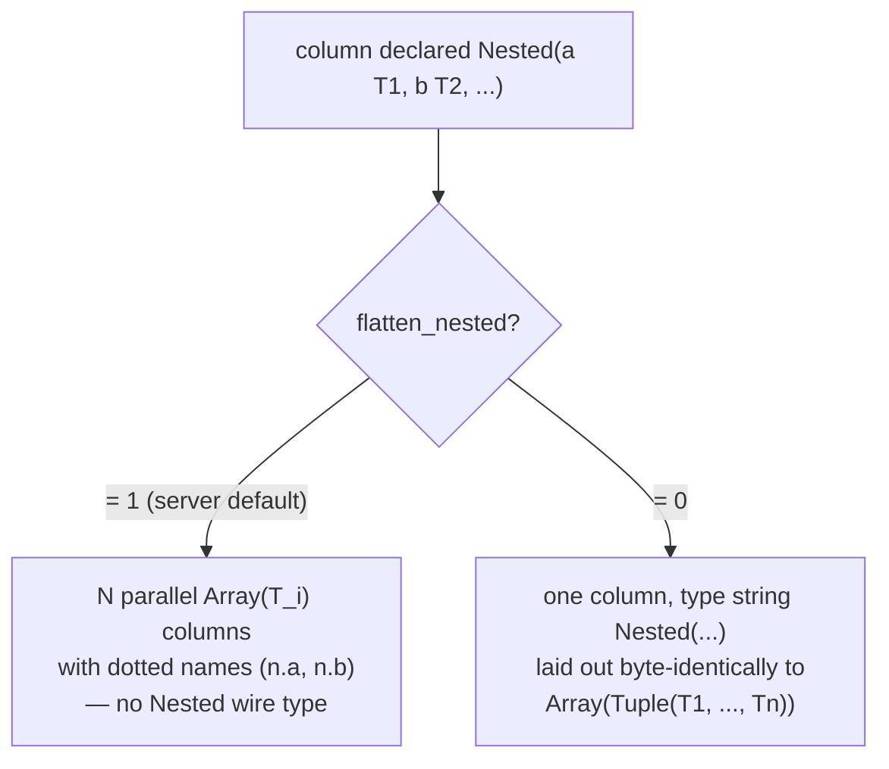
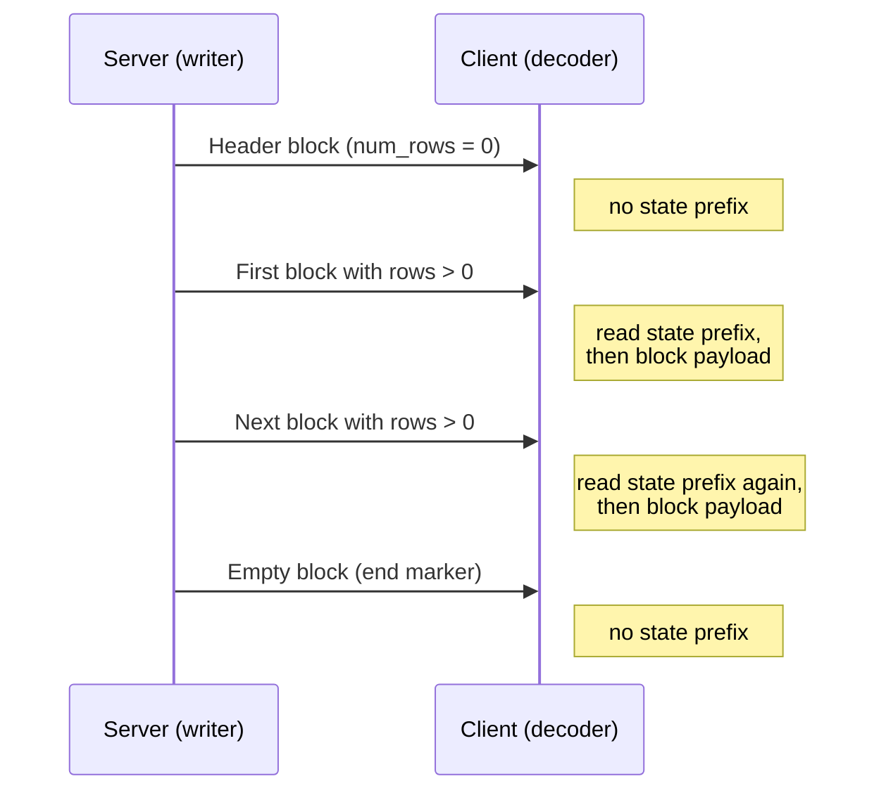
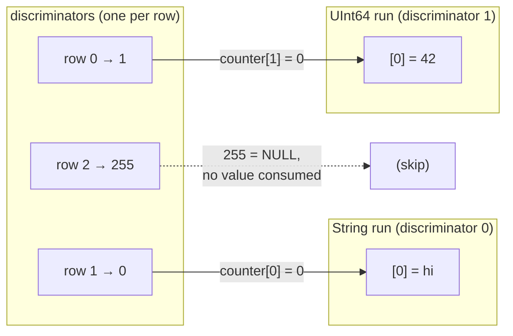
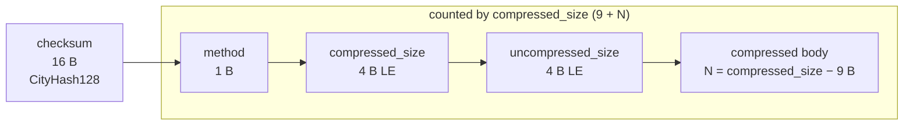

Le format Native est le format binaire colonnaire que ClickHouse utilise pour transporter des données tabulaires. Il apparaît à plusieurs endroits :

* dans le corps des paquets `Data`, `Totals`, `Extremes`, `Log` et `ProfileEvents` du [protocole TCP natif](/fr/interfaces/specs/NativeProtocol) (le paquet `TableColumns` n’est **pas** un bloc Native — il contient deux chaînes binaires ; sa structure relève donc de la [spécification du protocole TCP natif](/fr/interfaces/specs/NativeProtocol)) ;
* dans la sortie de `SELECT ... FORMAT Native` via HTTP ;
* dans les exportations de fichiers écrites avec `INTO OUTFILE ... FORMAT Native` ;
* dans les charges utiles de réplication inter-serveurs.

Cette page décrit les octets à l’intérieur d’un Block — la charge utile colonnaire — ainsi que les encodages de type par colonne qui le composent. Le tramage des paquets, l’état de la connexion et la négociation de version relèvent de la [spécification du protocole TCP natif](/fr/interfaces/specs/NativeProtocol).

Tous les champs entiers sur plusieurs octets utilisent l’ordre little-endian. Les entiers signés utilisent le complément à deux.

:::tip
Pour une introduction au format `Native` destinée aux utilisateurs (avec des exemples `curl`), consultez la [page du format Native](/fr/interfaces/formats/Native). Cette spécification est la référence de plus bas niveau sur le format binaire.
:::

<div id="overview">
  ## Vue d’ensemble
</div>

Tout ce qui transporte des lignes dans le format binaire est un **Block** : un bloc de lignes auto-descriptif stocké colonne par colonne. Toutes les valeurs de la colonne 1 viennent d’abord, puis toutes celles de la colonne 2, et ainsi de suite. Un Block ne transporte que les colonnes référencées par la requête, jamais la table entière.

Le `data` d’une colonne est organisé selon la *famille* à laquelle son type appartient. Les familles, par ordre croissant de complexité du décodeur, sont :



* Les types **à largeur fixe** disposent `data` sous forme de `bytes_per_value × num_rows` octets bruts, sans tramage par ligne.
* Les types **composés** (`Nullable`, `Array`, `Tuple`, `Map`, `Nested`) ont une forme récursive entièrement déductible de la chaîne de type, sans préfixe de version ni état inter-blocs.
* Les types **versionnés / avec état** (`LowCardinality`, `JSON`, `Variant`, `Dynamic`) commencent chaque bloc non vide par un préfixe de version/d&#39;état de sérialisation. Sur le fil `Native`, ce préfixe et tout dictionnaire sont **propres à chaque bloc** — le format ne transporte aucun état *d&#39;un bloc à l&#39;autre* (l&#39;émetteur crée un nouvel état de sérialisation pour chaque bloc et définit `low_cardinality_max_dictionary_size = 0`). L&#39;état inter-blocs concerne le stockage sur disque de MergeTree, et non la représentation `Native` sur le fil.

<div id="wire-primitives">
  ## Primitives du format binaire
</div>

Le Native format repose sur quatre encodages primitifs.

| Primitive             | Taille               | Description                                              |
| --------------------- | -------------------- | -------------------------------------------------------- |
| VarUInt               | 1–10 B               | Entier non signé à longueur variable LEB-128             |
| entier à largeur fixe | 1, 2, 4, 8, 16, 32 B | little-endian, complément à deux pour les entiers signés |
| String                | variable             | préfixe de longueur VarUInt + octets bruts               |
| Bool                  | 1 B                  | `0x00` = false, valeur non nulle = true                  |

<div id="varuint">
  ### VarUInt
</div>

Entier non signé de longueur variable utilisant l’encodage LEB-128. Chaque octet contient 7 bits de données aux positions 0–6 et 1 bit de continuation à la position 7. Le bit de continuation vaut `1` lorsque d’autres octets suivent, et `0` pour l’octet final.

| Plage de valeurs                     | Octets     |
| ------------------------------------ | ---------- |
| 0 – 127                              | 1          |
| 128 – 16383                          | 2          |
| 16384 – 2097151                      | 3          |
| jusqu’à la valeur maximale de UInt64 | jusqu’à 10 |

Encodage de la valeur `300` :

```text
300 = 0b100101100

Byte 0: 0xAC = 0b10101100   (data: 0101100, continuation: 1)
Byte 1: 0x02 = 0b00000010   (data: 0000010, continuation: 0)
```

Décodage des octets `0xAC 0x02` :

```text
Byte 0: data = 0x2C, continuation = 1 → accumulator = 0x2C, shift = 7
Byte 1: data = 0x02, continuation = 0 → accumulator = (0x02 << 7) | 0x2C = 300
```

<div id="fixed-width-integers">
  ### Entiers de largeur fixe
</div>

| Type    | Octets | Encodage                                 |
| ------- | ------ | ---------------------------------------- |
| UInt8   | 1      | Octet brut                               |
| UInt16  | 2      | Little-endian                            |
| UInt32  | 4      | Little-endian                            |
| UInt64  | 8      | Little-endian                            |
| UInt128 | 16     | Little-endian                            |
| UInt256 | 32     | Little-endian                            |
| Int8    | 1      | Octet brut, complément à deux            |
| Int16   | 2      | Little-endian, complément à deux         |
| Int32   | 4      | Little-endian, complément à deux         |
| Int64   | 8      | Little-endian, complément à deux         |
| Int128  | 16     | Little-endian, complément à deux         |
| Int256  | 32     | Little-endian, complément à deux         |
| Float32 | 4      | IEEE 754 simple précision, little-endian |
| Float64 | 8      | IEEE 754 double précision, little-endian |

Par exemple, la valeur UInt32 `1` est encodée sous la forme `01 00 00 00`, et la valeur Int32 `-1` sous la forme `FF FF FF FF`.

<div id="string">
  ### String
</div>

Une séquence d’octets précédée de sa longueur :

```text
[VarUInt: byte_length] [byte_length bytes: raw value]
```

La séquence d’octets n’a pas besoin d’être en UTF-8 valide. Une chaîne vide est encodée sous la forme d’un seul octet `0x00`, et les chaînes peuvent contenir n’importe quelle valeur d’octet, y compris un NUL intégré. La chaîne `"ab"` est encodée en `02 61 62` ; pour la décoder, lisez la longueur VarUInt (`2`), puis lisez ce nombre d’octets.

<div id="bool">
  ### Bool
</div>

Un octet. `0x00` correspond à false ; toute valeur non nulle correspond à true (canoniquement `0x01`).

<div id="block-and-column-structure">
  ## Structure des blocs et des colonnes
</div>

<div id="block-wire-layout">
  ### Disposition binaire d’un bloc
</div>

```text
[BlockInfo]               metadata (only on the TCP Data-packet path; see below)
[VarUInt: num_columns]    number of columns in this block
[VarUInt: num_rows]       number of rows in this block
[Column × num_columns]    column entries, omitted when num_columns = 0
```

La présence du préfixe `BlockInfo` dépend du canal, car le composant d’écriture est paramétré par une *révision* (voir [Révision du protocole et format Native](#protocol-revision) pour une explication complète, y compris le fait que `client_protocol_version` ne s’applique qu’à la sortie) :

* Sur le **protocole TCP natif**, le serveur écrit les blocs avec la révision négociée pour la connexion (une valeur élevée — `DBMS_TCP_PROTOCOL_VERSION`, voir `src/Core/ProtocolDefines.h`). `BlockInfo` est écrit chaque fois que cette révision est supérieure à zéro, ce qui est toujours le cas pour une vraie connexion. L’octet `has_custom_serialization` dans chaque colonne (voir [structure binaire d’une colonne](#column-wire-layout)) est écrit à partir de la révision `54454`.
* Le *format de sortie* `Native` — `SELECT ... FORMAT Native` sur HTTP, `INTO OUTFILE ... FORMAT Native`, et le format `Native` produit par `clickhouse-client` — sérialise avec la révision `0` *par défaut*. Avec la révision `0`, le préfixe `BlockInfo` et l’octet `has_custom_serialization` sont tous deux omis ; un bloc se compose donc simplement de `num_columns`, `num_rows` et des colonnes.

  Sur HTTP, cette révision n’est pas fixe : un client peut l’augmenter avec le paramètre de requête `?client_protocol_version=<n>`, et le serveur utilise cette valeur comme révision de sérialisation pour la réponse.

  Avec une valeur suffisamment élevée, la sortie HTTP inclut le préfixe `BlockInfo` (écrit dès que la révision est supérieure à `0`) et l’octet `has_custom_serialization` (écrit à partir de la révision `54454`), exactement comme sur le chemin TCP. Les clients ne doivent donc pas supposer que chaque charge utile HTTP `FORMAT Native` est en révision `0`.

Autrement dit, les exemples d’octets de cette section qui commencent par un préfixe `BlockInfo` décrivent la charge utile du paquet Data sur TCP. La même requête exécutée via `FORMAT Native` produit la forme plus courte affichée à côté.

<div id="blockinfo">
  ### BlockInfo
</div>

BlockInfo est une séquence de champs, chacun précédé d’un ID de champ VarUInt, terminée par un ID de champ égal à `0`. Le format binaire n’est **pas** auto-descriptif : un ID de champ n’encode ni la longueur ni le type de sa valeur, donc un lecteur doit déjà connaître le type de chaque ID de champ qu’il peut rencontrer. Le lecteur de ClickHouse lui-même considère qu’un ID de champ non reconnu indique une corruption et lève une exception (`UNKNOWN_BLOCK_INFO_FIELD`). La compatibilité ascendante est plutôt gérée par la révision du protocole : l’émetteur n’écrit un champ que si la révision négociée est au moins égale à la révision minimale de ce champ, de sorte qu’un récepteur plus ancien ne voit jamais un champ qu’il ne connaît pas.

| ID de champ | Champ                            | Type          | Révision min. | Description                                                                                                                      |
| ----------- | -------------------------------- | ------------- | ------------- | -------------------------------------------------------------------------------------------------------------------------------- |
| 1           | is&#95;overflows                 | UInt8         | 0             | Bloc de débordement issu de GROUP BY. `0` pour les blocs sans débordement.                                                       |
| 2           | bucket&#95;number                | Int32         | 0             | Bucket d’agrégation. `-1` pour les blocs sans bucket.                                                                            |
| 3           | out&#95;of&#95;order&#95;buckets | Liste d’Int32 | 54480         | Buckets retardés pendant l’agrégation distribuée. Encodés sous la forme d’un compteur VarUInt suivi d’autant de valeurs `Int32`. |
| 0           | (terminateur)                    | —             | —             | Fin de BlockInfo. Toujours requis.                                                                                               |

Les champs `1` et `2` ont une révision minimale de `0` ; ils sont donc présents dès qu’un `BlockInfo` est écrit. Le champ `3` n’est écrit qu’à partir de la révision `54480`. Format binaire pour le cas le plus courant (révision inférieure à `54480`) :

```text
[VarUInt: 1] [UInt8: is_overflows]
[VarUInt: 2] [Int32: bucket_number]
[VarUInt: 0]
```

<div id="column-wire-layout">
  ### Structure binaire d’une colonne
</div>

Une colonne apparaît `num_columns` fois dans un Block.

| # | Champ                            | Type                                 | Condition                               | Description                                                                                                                                                                                                                                                                                                                                                                           |
| - | -------------------------------- | ------------------------------------ | --------------------------------------- | ------------------------------------------------------------------------------------------------------------------------------------------------------------------------------------------------------------------------------------------------------------------------------------------------------------------------------------------------------------------------------------- |
| 1 | name                             | String                               | toujours                                | Nom de la colonne                                                                                                                                                                                                                                                                                                                                                                     |
| 2 | type                             | String *ou* encodage binaire du type | toujours                                | Chaîne de type ClickHouse (par ex. `"UInt64"`, `"Array(String)"`) par défaut ; encodage binaire du type lorsque `output_format_native_encode_types_in_binary_format = 1` (voir la note ci-dessous)                                                                                                                                                                                    |
| 3 | has&#95;custom&#95;serialization | UInt8                                | feature `CUSTOM_SERIALIZATION` (v54454) | `0` = par défaut, `1` = personnalisé (`kind&#95;stack` suit)                                                                                                                                                                                                                                                                                                                          |
| 4 | kind&#95;stack                   | octets                               | lorsque le champ 3 = `1`                | Un octet d’enum UInt8 (voir ci-dessous) décrivant une sérialisation autre que celle par défaut (sparse, etc.). Pour la valeur `COMBINATION`, il est suivi d’un compteur VarUInt puis d’autant d’octets kind supplémentaires. Pour un `Tuple` (et d’autres composites avec des informations de sérialisation au niveau des éléments), la charge utile est récursive — voir ci-dessous. |
| 5 | data                             | octets                               | toujours                                | Valeurs de la colonne pour les `num_rows` lignes. Structure selon le type — voir [types de données](#data-types). Pour les colonnes sparse, voir ci-dessous.                                                                                                                                                                                                                          |

Un décodeur s’appuie sur la chaîne `type`. Les chaînes de type contiennent souvent des paramètres entre parenthèses ; le décodeur retire le suffixe `(...)` pour trouver le type de base, puis analyse les paramètres afin de déterminer la taille, la scale ou le type interne. L’analyse d’une liste de paramètres avec des types imbriqués (un `Tuple` dans un `Array`, par exemple) nécessite un découpage des virgules sensible à la profondeur, qui suit l’imbrication des parenthèses, plutôt qu’un simple découpage naïf sur `,`.

:::note Encodage binaire du type
Le champ `type` n’est une `String` textuelle qu’en mode par défaut. Lorsque le paramètre de requête `output_format_native_encode_types_in_binary_format = 1` est défini, ce champ devient un **encodage binaire du type** — le même encodage à base de balises documenté dans [encodage binaire des types de données](/fr/sql-reference/data-types/data-types-binary-encoding) — et les listes de types `Dynamic` aplaties utilisent le même encodage binaire pour leurs noms de type individuels. Un décodeur qui lirait toujours le champ 2 comme une chaîne préfixée par sa longueur interpréterait la première balise binaire de type comme une longueur de chaîne et se désynchroniserait ; il doit donc savoir quel mode le flux utilise.
:::



<div id="kind-stack-and-sparse-encoding">
  #### kind_stack et encodage clairsemé
</div>

L’octet `kind_stack` indique une sérialisation par colonne autre que celle par défaut :

| Byte   | Nom                          | Signification                                                                              | Impact sur le format binaire de `data`                                                              |
| ------ | ---------------------------- | ------------------------------------------------------------------------------------------ | --------------------------------------------------------------------------------------------------- |
| `0x00` | DEFAULT                      | Sérialisation par défaut                                                                   | Identique à `has_custom = 0`                                                                        |
| `0x01` | SPARSE                       | Sérialisation clairsemée (v54465+)                                                         | Flux d’offset + valeurs non par défaut ; voir ci-dessous                                            |
| `0x02` | DETACHED                     | Colonne encapsulée dans un `ColumnBLOB` par la sérialisation parallèle des blocs (v54478+) | Blob présérialisé : `VarUInt size` + ce nombre d’octets ; voir ci-dessous                           |
| `0x03` | DETACHED&#95;OVER&#95;SPARSE | Colonne clairsemée encapsulée dans un `ColumnBLOB`                                         | Même charge utile de blob que `DETACHED` ; voir ci-dessous                                          |
| `0x04` | REPLICATED                   | Forme dictionnaire pour les valeurs répétées (v54482+)                                     | Flux d’index + valeurs d’éléments encodées densément ; voir ci-dessous                              |
| `0x05` | COMBINATION                  | Empilement multi-kind                                                                      | Suivi d’un `VarUInt` `count`, puis de `count` octets kind supplémentaires — voir la note ci-dessous |

**La charge utile `COMBINATION` utilise un enum différent.** Les cinq lignes ci-dessus sont des codes *compacts* sur un octet. `COMBINATION` (`0x05`) est la séquence d’échappement générique pour tout empilement non couvert par eux : il est suivi d’un `VarUInt` `count`, puis de `count` entrées sur un octet. Ces entrées ne sont **pas** les codes compacts du tableau — ce sont les valeurs brutes `ISerialization::Kind` :

| Byte   | `Kind` imbriqué |
| ------ | --------------- |
| `0x00` | DEFAULT         |
| `0x01` | SPARSE          |
| `0x02` | DETACHED        |
| `0x03` | REPLICATED      |

Les valeurs d’octet diffèrent des codes compacts : `REPLICATED` vaut `0x03` dans cet enum imbriqué, mais `0x04` comme code compact, et il n’existe pas d’entrée `DETACHED_OVER_SPARSE` — cette combinaison apparaît sous la forme des deux entrées consécutives `SPARSE`, `DETACHED`. Un décodeur qui continuerait à utiliser le tableau compact pour les octets imbriqués associerait mal `0x03`/`0x04` et se désynchroniserait.

Le `count` correspond à la longueur totale de l’empilement, **y compris l’entrée initiale `DEFAULT`** qui commence chaque empilement. Les codes compacts couvrent déjà tous les empilements à une et deux entrées, donc un `COMBINATION` a toujours un `count` d’au moins trois.

**`kind_stack` récursif pour les colonnes `Tuple`.** La charge utile `kind_stack` ci-dessus est l’octet (ou la séquence `COMBINATION`) correspondant aux informations de sérialisation propres à une colonne. Un `Tuple` transporte un `SerializationInfoTuple`, qui écrit d’abord la charge utile kind-stack *propre* au tuple, puis une charge utile kind-stack complète pour *chaque* élément, dans l’ordre ; un décodeur relit ensuite cette même structure récursive. Ainsi, pour `Tuple(A, B, C)`, les octets du champ 4 sont `[tuple_kind][A_kind][B_kind][C_kind]`, et la charge utile de chaque élément est elle-même récursive si cet élément est lui aussi un composite. L’octet `has_custom_serialization` (champ 3) est défini dès que les informations propres au tuple *ou celles de l’un de ses éléments* sont non par défaut ; ainsi, un `Tuple` dont le seul élément spécial est sparse, replicated ou detached déclenche quand même la charge utile kind-stack. Un décodeur qui ne lit que l’unique octet enum initial pour un `Tuple` s’arrêtera trop tôt et interprétera à tort les octets kind des éléments restants comme des données de colonne.

**Format binaire clairsemé.** Quand `kind_stack = 0x01`, la `data` de la colonne se compose de deux flux écrits l’un à la suite de l’autre dans l’unique flux TCP partagé :

1. **Flux d’offset** — une séquence de `VarUInt`. Chaque valeur `v` est soit :
   * `v` avec le bit de poids fort en position 62 à 0 : `(v & 0x3FFFFFFFFFFFFFFF)` = le nombre de positions par défaut avant la prochaine valeur explicite non par défaut. Cette position non par défaut est `cursor + group_size`, où `cursor` est la position courante ; ensuite, `cursor` avance de `group_size + 1`.
   * `v` avec le bit 62 défini (`END_OF_GRANULE_FLAG`) : la valeur une fois l’indicateur effacé = le nombre de positions par défaut finales après la dernière valeur non par défaut. Cela marque la fin du flux d’offset pour le bloc.
2. **Flux de valeurs** — `count` valeurs non par défaut encodées densément dans le type interne, où `count` est le nombre de `VarUInt` non-EOG lus ci-dessus.

Un décodeur reconstruit une colonne dense de `num_rows` entrées en remplissant chaque position non explicite avec la valeur par défaut du type interne (`0` pour les entiers et les flottants, `""` pour `String`, `0` jour pour `Date`, etc.).

Une colonne creuse `Nullable(T)` est un cas particulier, car la valeur par défaut de `Nullable(T)` est **NULL**. L&#39;encodage creux supprime entièrement le flux habituel de bitmap de nullité de `Nullable` : le flux d&#39;offset identifie les positions non par défaut — c&#39;est-à-dire non-NULL —, le flux de valeurs ne contient de façon dense dans `T` que ces valeurs non-NULL, et chaque position non explicite est reconstruite comme NULL. Un décodeur ne doit donc *pas* rechercher de bitmap de nullité dans le flux de valeurs, et ne doit *pas* combler les gaps avec un `0` présent ; il les remplit avec NULL.

**Wire format Replicated.** Lorsque `kind_stack = 0x04`, la colonne `data` est un dictionnaire : une liste de valeurs d&#39;élément distinctes, plus un index par ligne dans cette liste (le même schéma de lookup que `LowCardinality`). Lorsque le type interne est lui-même versionné — par exemple `LowCardinality(T)` —, son state prefix est écrit **en premier**, avant le flux d&#39;index : la sérialisation Replicated délègue la prefix phase au type interne avant d&#39;écrire `num_rows`. Les types internes dont le préfixe est vide (les types feuille et les composites simples) n&#39;ajoutent ici aucun octet.

```text
[inner type's state prefix]              empty for leaf inners; e.g. LowCardinality version (Int64 = 1)
[VarUInt num_rows]
[UInt8  size_of_indexes_type]            width of each index: 1, 2, 4, or 8 bytes
[indexes: num_rows × size_of_indexes_type bytes]
[VarUInt num_elements]
[elements: num_elements dense inner-type values]
```

Un décodeur reconstruit une colonne dense en sélectionnant `elements[indexes[i]]` pour chaque ligne de sortie `i`. Les types internes composites sont traités récursivement : la liste des éléments est matérialisée dans le type interne, puis indexée. Les types internes pris en charge incluent les types feuille, `Nullable(T)`, `Array(T)`, `Tuple(...)`, `Map(K, V)`, `Nested(...)` (chaque champ est développé comme un `Array`) et `LowCardinality(T)` (le dictionnaire partagé est conservé ; seules les clés de chaque élément sont indexées).

**Format binaire détaché.** `DETACHED` (`0x02`) et `DETACHED_OVER_SPARSE` (`0x03`) apparaissent bien sur le wire — ils ne sont pas purement internes. Sur le chemin TCP, lorsque la compression est activée et que la révision négociée est au moins `DBMS_MIN_REVISON_WITH_PARALLEL_BLOCK_MARSHALLING` (v54478), la colonne passe par trois étapes :

1. Chaque colonne éligible (ni `const`, ni `Tuple`, dans un bloc de plus d’une ligne) est encapsulée dans un `ColumnBLOB` qui contient la colonne déjà sérialisée et compressée hors du thread principal.
2. `DETACHED` est ajouté à la pile de kinds de la colonne encapsulée.
3. Le `data` de la colonne est écrit sous la forme d’une taille de blob `VarUInt`, suivie d’exactement ce nombre d’octets de blob.

Si la colonne encapsulée était creuse, sa pile est `{DEFAULT, SPARSE, DETACHED}`, ce qui est sérialisé comme `DETACHED_OVER_SPARSE`. Un client qui décode une telle colonne lit la longueur du blob et ses octets, puis décompresse le blob pour récupérer la charge utile de la colonne interne (voir la [note `ColumnBLOB`](#compression-negotiation) dans la section sur la compression).

<div id="block-variants">
  ### Variantes de bloc
</div>

Tous les paquets de la famille Data utilisent le même format binaire de Block. Les variantes ne diffèrent que par leur nombre de colonnes et de lignes :

| Variante         | num&#95;columns | num&#95;rows | Rôle                                                                              |
| ---------------- | --------------- | ------------ | --------------------------------------------------------------------------------- |
| Bloc d’en-tête   | N &gt; 0        | 0            | Annonce le schéma du résultat (noms de colonnes + types).                         |
| Bloc de résultat | N &gt; 0        | M &gt; 0     | Lignes de résultat proprement dites.                                              |
| Bloc vide        | 0               | 0            | Sentinelle — fin de l’entrée côté client ; marqueur de délimitation côté serveur. |

<div id="byte-level-examples">
  ### Exemples au niveau de l’octet
</div>

Tous les exemples de cette section sont tirés du **chemin du paquet Data sur TCP** ; ils incluent donc le préfixe `BlockInfo` et l’octet `has_custom_serialization`. Avec `FORMAT Native`, les mêmes blocks sont plus courts — la forme courte équivalente est indiquée lorsque cela est utile.

Un block vide (avec BlockInfo), 8 octets au total :

```text
01 00                   BlockInfo: field_id=1, is_overflows=0
02 FF FF FF FF          BlockInfo: field_id=2, bucket_number=-1
00                      BlockInfo terminator
00                      num_columns = 0
00                      num_rows = 0
```

Un bloc d’en-tête pour `SELECT 1` annonce une colonne nommée `"1"` de type `UInt8`, et zéro ligne. Dans le protocole ≥ 54454, l’octet `has_custom_serialization` est inclus :

```text
01 00                   BlockInfo: is_overflows = 0
02 FF FF FF FF          BlockInfo: bucket_number = -1
00                      BlockInfo terminator
01                      num_columns = 1
00                      num_rows = 0
01 "1"                  Column[0].name = "1"
05 "UInt8"              Column[0].type = "UInt8"
00                      Column[0].has_custom_serialization = 0
                        Column[0].data: no bytes (num_rows = 0)
```

Le bloc de résultat de la même requête, avec une ligne :

```text
01 00                   BlockInfo: is_overflows = 0
02 FF FF FF FF          BlockInfo: bucket_number = -1
00                      BlockInfo terminator
01                      num_columns = 1
01                      num_rows = 1
01 "1"                  Column[0].name = "1"
05 "UInt8"              Column[0].type = "UInt8"
00                      Column[0].has_custom_serialization = 0
01                      Column[0].data: one UInt8 byte = 1
```

Avec `FORMAT Native` (révision `0`), le même bloc de résultat ne contient ni `BlockInfo` ni l’octet `has_custom_serialization` — `SELECT 1 FORMAT Native` fait 11 octets :

```text
01                      num_columns = 1
01                      num_rows = 1
01 "1"                  Column[0].name = "1"
05 "UInt8"              Column[0].type = "UInt8"
01                      Column[0].data: one UInt8 byte = 1
```

(Un résultat sans aucune ligne, comme un bloc ne contenant que l’en-tête, ne produit aucun octet avec `FORMAT Native` : le format de sortie n’émet pas de blocs vides.)

<div id="protocol-revision">
  ## Révision du protocole et le format Native
</div>

Un flux d’octets Native est avant tout déterminé par la **révision du protocole** utilisée par son writer et son reader. La révision n’apparaît nulle part dans les octets eux-mêmes — il n’y a pas de champ de révision dans le format binaire — mais elle détermine tout de même si plusieurs fonctionnalités sont présentes ou non. C’est pourquoi un décodeur doit connaître la révision avec laquelle un payload a été écrit avant de pouvoir l’analyser. Comme la révision n’est pas incluse dans le flux, le reader et le writer doivent se mettre d’accord dessus d’une autre manière.

Il s’agit d’un simple `UInt64`, et `NativeWriter` comme `NativeReader` le prennent en argument du constructeur. Le writer l’appelle `client_revision` et le reader l’appelle `server_revision`, mais c’est le même nombre. La révision la plus récente connue de cette version est `DBMS_TCP_PROTOCOL_VERSION` (voir `src/Core/ProtocolDefines.h`).

<div id="what-the-revision-gates">
  ### Ce que contrôle la révision
</div>

Chaque fonctionnalité est conditionnée par un seuil `DBMS_MIN_REVISION_WITH_*`. L’émetteur n’écrit la fonctionnalité que lorsque sa révision atteint ce seuil, et le lecteur la recherche selon exactement la même règle, afin que les deux restent synchronisés — si la révision est erronée d’un côté ou de l’autre, ils se désynchronisent. Les seuils importants pour le Native format sont les suivants :

| Fonctionnalité                                  | Constante de seuil                                                 | Révision | Effet en dessous du seuil                                                                                                                                                                                                                                                                                 |
| ----------------------------------------------- | ------------------------------------------------------------------ | -------- | --------------------------------------------------------------------------------------------------------------------------------------------------------------------------------------------------------------------------------------------------------------------------------------------------------- |
| Préfixe `BlockInfo`                             | (toute valeur `> 0`)                                               | `1`      | Le préfixe [`BlockInfo`](#blockinfo) est entièrement omis ; un block se limite alors à `num_columns`, `num_rows`, colonnes.                                                                                                                                                                               |
| Octet `has_custom_serialization`                | `DBMS_MIN_REVISION_WITH_CUSTOM_SERIALIZATION`                      | `54454`  | L’octet [`has_custom_serialization`](#column-wire-layout) par colonne est omis ; chaque colonne utilise la sérialisation par défaut (aucune forme sparse, replicated ou detached).                                                                                                                        |
| `LowCardinality` dans le format binaire         | `DBMS_MIN_REVISION_WITH_LOW_CARDINALITY_TYPE`                      | `54405`  | Cas particulier — ne suit **pas** la règle simple « en dessous du seuil ». `LowCardinality(T)` est réduit au seul base type `T` uniquement lorsque la révision est *non nulle* et inférieure à `54405`, ou lorsque ce retrait est forcé séparément. La révision `0` le conserve. Voir la note ci-dessous. |
| Sérialisation V2 de `Dynamic` / `JSON`          | `DBMS_MIN_REVISION_WITH_V2_DYNAMIC_AND_JSON_SERIALIZATION`         | `54473`  | `Dynamic` et `JSON`/`Object` utilisent la sérialisation V1 (avec le paramètre `max_dynamic_*`) au lieu de V2.                                                                                                                                                                                             |
| Gestion des versions des fonctions d’agrégation | `DBMS_MIN_REVISION_WITH_AGGREGATE_FUNCTIONS_VERSIONING`            | `54452`  | L’état de `AggregateFunction` est écrit sans version intégrée.                                                                                                                                                                                                                                            |
| `out_of_order_buckets` dans `BlockInfo`         | `DBMS_MIN_REVISION_WITH_OUT_OF_ORDER_BUCKETS_IN_AGGREGATION`       | `54480`  | Le field `BlockInfo` d’ID `3` n’est pas écrit (voir [BlockInfo](#blockinfo)).                                                                                                                                                                                                                             |
| Marshalling parallèle des blocks (`DETACHED`)   | `DBMS_MIN_REVISON_WITH_PARALLEL_BLOCK_MARSHALLING`                 | `54478`  | Les colonnes ne sont jamais encapsulées dans un `ColumnBLOB` ; aucun type `DETACHED` / `DETACHED_OVER_SPARSE` n’apparaît (voir [kind&#95;stack](#kind-stack-and-sparse-encoding)).                                                                                                                        |
| Paramètre de type `DateTime(tz)`                | `DBMS_MIN_REVISION_WITH_TIME_ZONE_PARAMETER_IN_DATETIME_DATA_TYPE` | `54337`  | Le paramètre de timezone est retiré de la chaîne `type` — `DateTime('UTC')` est annoncé comme un simple `DateTime`.                                                                                                                                                                                       |

Cela fait de la révision `0` l’encodage le plus conservateur dans presque tous les cas : le stream ne contient ni `BlockInfo`, ni octet `has_custom_serialization`, utilise `Dynamic`/`JSON` V1, n’inclut aucune version de fonction d’agrégation et annonce un simple `DateTime` sans paramètre de timezone.

`LowCardinality` est la seule exception, et c’est un point important. La vérification effectuée par l’émetteur est `remove_low_cardinality || (client_revision && client_revision < DBMS_MIN_REVISION_WITH_LOW_CARDINALITY_TYPE)`. L’astuce vient du `client_revision &&` initial : lorsque la révision vaut exactement `0`, toute la condition est court-circuitée à false.

Ainsi, en révision `0` — la valeur par défaut pour `FORMAT Native` — `LowCardinality(T)` n’est **pas** supprimé. Sa chaîne de type et son state prefix par block restent dans le stream, et le lecteur en révision `0` les relit tels quels. Le retrait ne s’applique qu’avec une révision non nulle inférieure à `54405`, ou lorsqu’il est forcé indépendamment de la révision.

Ce forçage correspond au flag `remove_low_cardinality`. La sortie `FORMAT Native` ne l’active jamais, mais le chemin native TCP, lui, le fait lorsque `low_cardinality_allow_in_native_format = 0` (valeur par défaut : `1`). En d’autres termes, ce setting modifie la sortie native TCP mais ne change rien pour `FORMAT Native`.

En pratique, un stream `FORMAT Native` par défaut peut légitimement contenir `LowCardinality` ; ne le considérez donc pas comme une fonctionnalité absente en révision `0`.

<div id="revision-per-channel">
  ### D’où vient la révision, selon le chemin emprunté par les données
</div>

Les mêmes octets Native peuvent emprunter différents chemins : le protocole TCP natif, une requête HTTP ou un fichier sur le disque. Chaque chemin définit la révision à sa manière. Point à surveiller : la partie lecture et la partie écriture sont configurées séparément, elles peuvent donc se retrouver avec des révisions différentes.

<div id="revision-tcp">
  #### Protocole TCP natif — négocié, dans les deux sens
</div>

Dans le [protocole TCP natif](/fr/interfaces/specs/NativeProtocol), la révision est déterminée lors du handshake Hello. Le client envoie `DBMS_TCP_PROTOCOL_VERSION`, le serveur renvoie la sienne et, à partir de là, chaque côté sérialise avec la **révision annoncée par l’autre** : le serveur construit son `NativeReader`/`NativeWriter` à partir de `client_tcp_protocol_version`, tandis que le client utilise le `server_revision` reçu. Il n’y a pas de `min` explicite, mais aucune des deux parties ne peut émettre une fonctionnalité qu’elle n’a pas implémentée ; en pratique, chaque sens est donc plafonné par la plus ancienne des deux révisions.

Lorsque les deux parties utilisent le même build récent, les deux sens convergent vers la même révision (`DBMS_TCP_PROTOCOL_VERSION`, voir `src/Core/ProtocolDefines.h`) et toutes les conditions sont alors activées. C’est le cas le plus courant, mais ce n’est pas garanti. Avec des parties de versions différentes ou tierces, les deux sens peuvent se retrouver à des révisions distinctes ; les conditions doivent donc être interprétées séparément pour chaque sens : `BlockInfo` est présent pour toute révision non nulle, mais le reste — y compris `has_custom_serialization` — n’apparaît que lorsque la révision effective de ce sens atteint les seuils correspondants. Une partie annonçant une révision inférieure à `54454`, par exemple, n’envoie ni ne reçoit l’octet `has_custom_serialization`.

<div id="revision-output">
  #### sortie `FORMAT Native` — révision 0 par défaut, pouvant être augmentée via HTTP
</div>

Le format de *sortie* `Native` utilise par défaut la révision **`0`**. Cela couvre `SELECT ... FORMAT Native` via HTTP, `INTO OUTFILE ... FORMAT Native`, ainsi que la sortie `Native` écrite par `clickhouse-client` ; dans chaque cas, la fabrique de sortie transmet directement `FormatSettings::client_protocol_version` au `NativeWriter`.

Avec HTTP, toutefois, cette valeur par défaut n’est pas toute l’histoire. Un client peut l’augmenter avec le paramètre de requête `?client_protocol_version=<n>`, que le gestionnaire HTTP traite comme un paramètre réservé plutôt que comme un réglage SQL : il est placé dans le contexte de la requête, et la couche de format le copie dans `FormatSettings`. Si vous le définissez à une valeur suffisamment élevée, la sortie HTTP `FORMAT Native` commence à inclure le préfixe `BlockInfo` et l’octet `has_custom_serialization`, comme via TCP — ne supposez donc pas qu’une charge utile HTTP `FORMAT Native` est toujours en révision `0`. Les exportations de fichiers et la sortie locale de `clickhouse-client` n’offrent pas un tel mécanisme et restent à `0`.

<div id="revision-input">
  #### `FORMAT Native` en entrée — toujours révision 0
</div>

Le format `Native` en *entrée* fonctionne à l’inverse : il est **codé en dur sur la révision `0`** et ne tient absolument pas compte de `client_protocol_version`. Qu’il analyse le corps d’un `INSERT ... FORMAT Native` ou qu’il lise un fichier `Native`, il construit son `NativeReader` avec un `0` littéral ; il ne s’attend donc jamais à un préfixe `BlockInfo`, ne lit jamais l’octet `has_custom_serialization` et suppose toujours la sérialisation par défaut.

En d’autres termes, `client_protocol_version` ne s’applique qu’à la sortie. Indiquer une valeur élevée pour `?client_protocol_version=` (par exemple `DBMS_TCP_PROTOCOL_VERSION`) dans une requête `INSERT ... FORMAT Native` ne change rien à la façon dont le corps est lu : le corps doit toujours être en révision `0`. Si vous fournissez un corps qui contient un préfixe `BlockInfo` ou un octet `has_custom_serialization`, le lecteur perd la synchronisation, ce qui se traduit par une erreur d’analyse (`INCORRECT_DATA` ou `CANNOT_READ_ALL_DATA`) au lieu d’une insertion réussie.

<div id="revision-round-trip">
  ### Implications pour l’aller-retour
</div>

Pour `FORMAT Native`, le choix le plus sûr est d’utiliser la révision `0` aux deux extrémités, ce qui est le comportement par défaut. Les données écrites par `SELECT ... FORMAT Native` avec la révision `0` peuvent être relues directement dans `INSERT ... FORMAT Native`, sans surprise.

Les problèmes ne commencent que si vous augmentez volontairement la révision de sortie. Un `SELECT ... FORMAT Native` exécuté avec `?client_protocol_version=<large>` produit un flux qui contient les octets `BlockInfo` et `has_custom_serialization`, et le chemin de lecture en révision `0` ne peut pas les relire. Si vous avez besoin que ces données fassent l’aller-retour, soit n’indiquez pas `client_protocol_version` sur le `SELECT` qui les produit, soit transférez les données via le protocole TCP natif — où chaque sens utilise la révision négociée lors du handshake — plutôt que via `FORMAT Native`.

| Canal                                                          | Révision d’écriture                              | Révision de lecture                              | `BlockInfo` / sérialisation personnalisée                                                |
| -------------------------------------------------------------- | ------------------------------------------------ | ------------------------------------------------ | ---------------------------------------------------------------------------------------- |
| paquet Data sur TCP natif                                      | Révision annoncée par le pair (dans chaque sens) | Révision annoncée par le pair (dans chaque sens) | `BlockInfo` dès que la révision `> 0` ; `has_custom_serialization` à partir de `≥ 54454` |
| `SELECT ... FORMAT Native` sur HTTP                            | `client_protocol_version` (par défaut `0`)       | n/a                                              | Uniquement si `client_protocol_version` est augmenté                                     |
| `INSERT ... FORMAT Native` sur HTTP                            | n/a                                              | `0` (fixe, ignore `client_protocol_version`)     | Jamais lu                                                                                |
| `INTO OUTFILE` / fichier / `clickhouse-client` `FORMAT Native` | `0`                                              | `0`                                              | Absent (mais `LowCardinality` est conservé — voir la note ci-dessus)                     |

:::note Révision du protocole vs version de sérialisation
Ne confondez pas la révision du protocole avec la [version de sérialisation](#serialization-version-concept). La révision ici vaut pour l’ensemble de la connexion ou de la requête et n’apparaît jamais dans les octets. La version de sérialisation est propre à chaque colonne, portée par les [types versionnés](#versioned-types), et est écrite dans chaque bloc non vide. La révision détermine si une fonctionnalité est présente ; la version de sérialisation, une fois dans une colonne versionnée, choisit la variante de l’encodage de ce type qui suit.
:::

<div id="data-types">
  ## Types de données
</div>

Cette section décrit l&#39;encodage binaire sur le réseau des types que le format Native peut transporter dans le `data` d&#39;une colonne, regroupés en quatre familles selon une complexité croissante du décodeur. Deux types — `AggregateFunction(func, ...)` et `QBit(T, N[, stride])` — sont des types de colonne `Native` valides, mais leurs payloads sont spécifiques à la fonction ou au type et sortent du cadre de cette section ; ils sont signalés ci-dessous là où, sinon, ils pourraient être pris à tort pour des alias.

| Famille                 | Section                                             | Flux par colonne | État entre blocs                                                                            |
| ----------------------- | --------------------------------------------------- | ---------------- | ------------------------------------------------------------------------------------------- |
| À largeur fixe          | [Types à largeur fixe](#fixed-width-types)          | Un               | Aucun                                                                                       |
| À longueur variable     | [Types à longueur variable](#variable-length-types) | Un               | Aucun                                                                                       |
| Composites (forme fixe) | [Types composites](#composite-types)                | Multiples        | Aucun                                                                                       |
| Versionnés / avec état  | [Types versionnés](#versioned-types)                | Multiples        | Aucun sur le format binaire Native — préfixe d&#39;état par bloc, réinitialisé à chaque bloc |

<div id="fixed-width-types">
  ### Types à largeur fixe
</div>

Chaque valeur occupe un nombre constant d’octets. Une colonne de `M` lignes occupe exactement `bytes_per_row × M` octets dans le format binaire, concaténés sans séparateurs ni remplissage.

| Type string         | Octets par valeur | Valeur logique                                                                                                  | Encodage binaire                                                      |
| ------------------- | ----------------- | --------------------------------------------------------------------------------------------------------------- | --------------------------------------------------------------------- |
| `UInt8`             | 1                 | Entier non signé sur 8 bits                                                                                     | Octet brut                                                            |
| `UInt16`            | 2                 | Entier non signé sur 16 bits                                                                                    | Little-endian                                                         |
| `UInt32`            | 4                 | Entier non signé sur 32 bits                                                                                    | Little-endian                                                         |
| `UInt64`            | 8                 | Entier non signé sur 64 bits                                                                                    | Little-endian                                                         |
| `UInt128`           | 16                | Entier non signé sur 128 bits                                                                                   | Little-endian                                                         |
| `UInt256`           | 32                | Entier non signé sur 256 bits                                                                                   | Little-endian                                                         |
| `Int8`              | 1                 | Entier signé sur 8 bits, complément à deux                                                                      | Octet brut                                                            |
| `Int16`             | 2                 | Entier signé sur 16 bits, complément à deux                                                                     | Little-endian                                                         |
| `Int32`             | 4                 | Entier signé sur 32 bits, complément à deux                                                                     | Little-endian                                                         |
| `Int64`             | 8                 | Entier signé sur 64 bits, complément à deux                                                                     | Little-endian                                                         |
| `Int128`            | 16                | Entier signé sur 128 bits, complément à deux                                                                    | Little-endian                                                         |
| `Int256`            | 32                | Entier signé sur 256 bits, complément à deux                                                                    | Little-endian                                                         |
| `Float32`           | 4                 | IEEE 754 simple précision                                                                                       | Little-endian                                                         |
| `Float64`           | 8                 | IEEE 754 double précision                                                                                       | Little-endian                                                         |
| `BFloat16`          | 2                 | 16 bits de poids fort d’un `Float32` IEEE 754                                                                   | Little-endian                                                         |
| `Bool`              | 1                 | `0x00` = false, `0x01` = true                                                                                   | Octet brut                                                            |
| `Date`              | 2                 | Jours depuis `1970-01-01`                                                                                       | Little-endian UInt16                                                  |
| `Date32`            | 4                 | Jours depuis `1970-01-01` (signé ; dates antérieures à 1970 prises en charge)                                   | Little-endian Int32                                                   |
| `DateTime`          | 4                 | Unix timestamp en secondes                                                                                      | Little-endian UInt32                                                  |
| `DateTime(tz)`      | 4                 | Identique à `DateTime` ; le fuseau horaire est une métadonnée                                                   | Little-endian UInt32                                                  |
| `DateTime64(s)`     | 8                 | Ticks à l’échelle `s` (10^-s secondes depuis l’epoch)                                                           | Little-endian Int64                                                   |
| `DateTime64(s, tz)` | 8                 | Identique à `DateTime64(s)` ; le fuseau horaire est une métadonnée                                              | Little-endian Int64                                                   |
| `Time`              | 4                 | Durée signée en secondes                                                                                        | Little-endian Int32                                                   |
| `Time64(s)`         | 8                 | Durée signée en ticks à l’échelle `s`                                                                           | Little-endian Int64                                                   |
| `Interval<Unit>`    | 8                 | Nombre signé ; l’unité figure dans la chaîne de type                                                            | Little-endian Int64                                                   |
| `UUID`              | 16                | Identifiant sur 128 bits                                                                                        | Deux moitiés LE UInt64 avec permutation d’octets (voir [UUID](#uuid)) |
| `IPv4`              | 4                 | Adresse IPv4                                                                                                    | Little-endian UInt32                                                  |
| `IPv6`              | 16                | Adresse IPv6                                                                                                    | Ordre des octets réseau, sans permutation                             |
| `Enum8`             | 1                 | Entier signé sur 8 bits (indice de variante)                                                                    | Octet brut                                                            |
| `Enum16`            | 2                 | Entier signé sur 16 bits (indice de variante)                                                                   | Little-endian                                                         |
| `Decimal(P, S)`     | 4 / 8 / 16 / 32   | `value × 10^S` sous forme d’entier signé ; la largeur dépend de P (≤9 → 4 B, ≤18 → 8 B, ≤38 → 16 B, ≤76 → 32 B) | Entier signé little-endian                                            |

<div id="integer-types">
  #### Types entiers
</div>

`UInt8`–`UInt256` et `Int8`–`Int256` sont des encodages binaires directs de valeurs entières. Un décodeur lit `bytes_per_row × num_rows` octets et les interprète en fonction du type.

Une colonne `UInt32` contenant `[1, 256, 65536]` :

```text
01 00 00 00              row 0: 1
00 01 00 00              row 1: 256
00 00 01 00              row 2: 65536
```

Une colonne `Int32` contenant `[-1, 42]` :

```text
FF FF FF FF              row 0: -1
2A 00 00 00              row 1: 42
```

<div id="float32-and-float64">
  #### Float32 and Float64
</div>

Nombres à virgule flottante binaires IEEE 754 standard : 4 octets en simple précision (`binary32`) et 8 octets en double précision (`binary64`), tous deux en little-endian. NaN, ±Infinity, ±0.0 et les nombres sous-normaux effectuent tous un aller-retour sans normalisation.

Valeur `Float32` `1.5` (`0x3FC00000`) :

```text
00 00 C0 3F              little-endian IEEE 754
```

Valeur `Float64` `1.5` (`0x3FF8000000000000`) :

```text
00 00 00 00 00 00 F8 3F  little-endian IEEE 754
```

<div id="bfloat16">
  #### BFloat16
</div>

Le format en virgule flottante brain-float : les 16 bits de poids fort d’un `Float32` IEEE 754 — 1 bit de signe, 8 bits d’exposant, 7 bits de mantisse. Chaque valeur occupe 2 octets, en ordre little-endian, et contient le motif binaire brut sur 16 bits. Pour retrouver la valeur numérique, reconvertissez-la en `Float32` en plaçant le motif dans la moitié haute et en mettant à zéro la moitié basse (`bits << 16` réinterprété comme `Float32`) ; la valeur obtenue utilise alors le même formatage texte que `Float32`.

Valeur `BFloat16` `1.5` (motif `0x3FC0`, moitié haute du `Float32` `0x3FC00000`) :

```text
C0 3F                    little-endian, widens to Float32 1.5
```

<div id="bool-type">
  #### Bool
</div>

Compatible au format binaire avec `UInt8` : 1 octet par ligne, `0x00` = false, `0x01` = true. La chaîne de type dans le format binaire est littéralement `Bool` (et non `UInt8`) ; un décodeur qui effectue le dispatch en fonction de la chaîne de type doit donc la reconnaître séparément.

Une colonne `Bool` `[true, false, true]` :

```text
01 00 01
```

<div id="date-and-date32">
  #### Date et Date32
</div>

Tous deux encodent les dates sous forme de nombres entiers de jours relatifs à l’époque Unix `1970-01-01`. Aucun ne comporte de composante temporelle.

| Type     | Octets | Encodage             | Plage                                      |
| -------- | ------ | -------------------- | ------------------------------------------ |
| `Date`   | 2      | UInt16 little-endian | `1970-01-01` à `2149-06-06`                |
| `Date32` | 4      | Int32 little-endian  | plage signée étendue, y compris avant 1970 |

Valeur `Date` `1970-01-02` (1 jour) :

```text
01 00                    UInt16 LE = 1
```

`Date32` avec la valeur `1900-01-01` (-25567 jours) :

```text
21 9C FF FF              Int32 LE = -25567
```

<div id="datetime">
  #### DateTime
</div>

Compatible au format binaire avec `UInt32` : un timestamp Unix en secondes, sur 4 octets little-endian. Le type peut apparaître sous la forme `DateTime` ou `DateTime('Timezone')` ; le fuseau horaire n&#39;affecte que l&#39;affichage et ne fait pas partie de la valeur au format binaire. Deux colonnes `DateTime` avec des paramètres de fuseau horaire différents produisent des octets identiques pour le même instant. Un décodeur supprime le suffixe de paramètre `(...)` et traite la colonne comme `UInt32`.

Valeur `DateTime('UTC')` : `2024-03-15 14:30:00 UTC` (timestamp `1710513000`) :

```text
68 5B F4 65              UInt32 LE = 1710513000
```

<div id="datetime64">
  #### DateTime64(scale[, timezone])
</div>

8 octets, Int64 little-endian représentant des ticks à l’échelle `10^-scale` seconde depuis l’époque Unix. Le paramètre `scale` (0–9) figure dans la chaîne de type et définit l’unité de temps :

| Échelle | Taille du tick | Nom courant |
| ------- | -------------- | ----------- |
| 0       | 1 seconde      | secondes    |
| 3       | 1 milliseconde | ms          |
| 6       | 1 microseconde | µs          |
| 9       | 1 nanoseconde  | ns          |

Le type se présente sous la forme `DateTime64(s)` (fuseau horaire implicite par défaut du serveur) ou `DateTime64(s, 'TimezoneName')` (fuseau horaire explicite, pour l’affichage uniquement). Les valeurs négatives représentent des ticks antérieurs à l’époque.

Valeur `DateTime64(3, 'UTC')` : `2024-01-15 12:30:45.123 UTC` (1705321845123 ms)

```text
83 51 1A 0D 8D 01 00 00  Int64 LE = 1705321845123
```

`DateTime64(0)` valeur `2024-01-15 12:30:45 UTC` (1705321845 s) :

```text
75 25 A5 65 00 00 00 00  Int64 LE = 1705321845
```

<div id="time-and-time64">
  #### Time et Time64(scale)
</div>

Une durée d’horloge plutôt qu’un instant donné. `Time` est un nombre signé de secondes, un Int32 little-endian sur 4 octets ; `Time64(scale)` est un nombre signé de ticks à l’échelle décimale indiquée (0–9), un Int64 little-endian sur 8 octets — avec la même représentation sur le format binaire que `DateTime64`.

La forme textuelle est `[-]HH:MM:SS[.fraction]`, mais contrairement à `DateTime`, le champ des heures **n’est pas** ramené à une journée de 24 heures : il correspond au nombre total d’heures et peut dépasser 23. La valeur affichée est plafonnée à `999:59:59` (`3599999` secondes) ; une valeur plus grande s’affiche à cette limite avec une fraction ramenée à zéro (`999:59:59.000`). `CAST` borne également la valeur stockée à cette plage, même si les opérations arithmétiques peuvent produire des valeurs hors plage qui ne sont bornées qu’à l’affichage. Rien de tout cela n’affecte les octets du format binaire, qui ne sont que l’entier signé brut.

Valeur `Time` `45296` (`12:34:56`) :

```text
F0 B0 00 00              Int32 LE = 45296
```

`Time64(3)` avec une valeur de `45296789` ticks (`12:34:56.789`) :

```text
95 2C B3 02 00 00 00 00  Int64 LE = 45296789
```

:::note
`Time` et `Time64` sont expérimentaux et nécessitent `allow_experimental_time_time64_type = 1` sur le serveur.
:::

<div id="interval">
  #### Interval
</div>

`Interval<Unit>` — `IntervalSecond`, `IntervalMinute`, `IntervalHour`, `IntervalDay`, `IntervalWeek`, `IntervalMonth`, `IntervalQuarter`, `IntervalYear`, `IntervalNanosecond`, etc. Toutes les unités partagent un même encodage au format binaire : la valeur est stockée sous la forme d’un Int64 signé de 8 octets en little-endian. L’unité n’existe **que** dans la chaîne de type — elle ne modifie ni les octets du format binaire ni la représentation textuelle, qui est simplement l’entier brut. Un seul chemin de décodage traite toutes les unités.

Valeur `5` de `IntervalDay` :

```text
05 00 00 00 00 00 00 00  Int64 LE = 5
```

<div id="uuid">
  #### UUID
</div>

16 octets par valeur. L’encodage sur le format binaire **ne correspond pas** aux 16 octets canoniques en big-endian : chaque moitié de 8 octets voit l’ordre de ses octets inversé indépendamment.

Le modèle logique est un identifiant de 128 bits sous forme textuelle canonique `xxxxxxxx-xxxx-xxxx-xxxx-xxxxxxxxxxxx`, où les octets sont, par convention, écrits en big-endian. Le modèle de format binaire prend ces 16 octets canoniques, les divise en deux moitiés de 8 octets et écrit chaque moitié en little-endian :

* Les octets du format binaire 0..7 = les octets canoniques 0..7 inversés.
* Les octets du format binaire 8..15 = les octets canoniques 8..15 inversés.

UUID `550e8400-e29b-41d4-a716-446655440000` :

```text
Canonical bytes (16):    55 0E 84 00 E2 9B 41 D4  A7 16 44 66 55 44 00 00

Wire bytes:
D4 41 9B E2 00 84 0E 55  high half byte-reversed
00 00 44 55 66 44 16 A7  low half byte-reversed
```

L&#39;UUID nul (entièrement composé de zéros) apparaît à l&#39;identique dans les deux représentations.

<div id="ipv4-and-ipv6">
  #### IPv4 et IPv6
</div>

Deux types d’adresses apparentés, mais encodés différemment.

`IPv4` est codé sur 4 octets, sous la forme d’un UInt32 little-endian contenant l’adresse canonique sur 32 bits (la valeur `(a << 24) | (b << 16) | (c << 8) | d` pour `a.b.c.d`). Les octets transmis sont les octets en ordre réseau, mais inversés.

`192.168.1.10` (valeur canonique sur 32 bits `0xC0A8010A`) :

```text
0A 01 A8 C0              Little-endian UInt32
```

`IPv6` fait 16 octets, écrits **tels quels en ordre des octets réseau** sans permutation — dans le même ordre d’octets que `inet_pton(AF_INET6, ...)`.

`2001:db8::1` :

```text
20 01 0D B8 00 00 00 00  network bytes 0..7
00 00 00 00 00 00 00 01  network bytes 8..15
```

Cette asymétrie est délibérée : IPv4 est stocké sous forme de `u32` pour l’arithmétique et les requêtes sur des plages compactes, tandis qu’IPv6 conserve la représentation en ordre réseau utilisée par la plupart des API réseau.

<div id="enum8-and-enum16">
  #### Enum8 and Enum16
</div>

Compatibles au niveau de la représentation binaire avec `Int8` et `Int16` respectivement : 1 ou 2 octets par ligne, complément à deux en little-endian pour la variante 16 bits. La correspondance complète des variantes figure dans la chaîne de type :

```text
Enum8('active' = 1, 'inactive' = 2, 'banned' = -1)
Enum16('a' = 1, 'b' = 30000)
```

Un décodeur peut supprimer le suffixe de paramètre `(...)` et le traiter comme `Int8` / `Int16` — les octets transmis ne correspondent qu’à l’index entier. Un client qui expose le libellé analyse la map `'name' = value` à partir de la chaîne de type et la conserve avec la colonne : l’entier seul ne permet pas de retrouver le libellé. Une sortie orientée texte affiche le libellé (`active`) plutôt que l’index, entre apostrophes (`'active'`) lorsque l’enum est imbriqué dans un type composé. Comme la map ne peut pas être reconstituée à partir de la colonne d’entiers, elle doit être conservée pour les enums imbriqués tels que `Array(Enum8(...))` ou `Map(Enum16(...), V)`.

Une colonne `Enum8('active' = 1, 'inactive' = 2)` `[active, inactive, active]` :

```text
01 02 01
```

Une valeur `Enum16(...)` égale à `30000` :

```text
30 75                    Int16 LE = 30000
```

<div id="decimal">
  #### Decimal(P, S)
</div>

Un entier signé mis à l’échelle par une puissance de 10. La taille en octets de l’entier est implicite dans la **précision** `P` ; l’**échelle** `S` est l’exposant négatif (le nombre de chiffres après le séparateur décimal). Les deux figurent dans la chaîne de type.

| Précision (P) | Entier sous-jacent | Octets |
| ------------- | ------------------ | ------ |
| 1 ≤ P ≤ 9     | Int32              | 4      |
| 10 ≤ P ≤ 18   | Int64              | 8      |
| 19 ≤ P ≤ 38   | Int128             | 16     |
| 39 ≤ P ≤ 76   | Int256             | 32     |

L’encodage binaire correspond à l’entier sous-jacent en complément à deux, au format little-endian, et la valeur décimale logique est `wire_integer × 10^(-S)`.

ClickHouse émet toujours `Decimal(P, S)`, quelle que soit la façon dont le type a été déclaré. `Decimal32(S)`, `Decimal64(S)`, etc. sont tous normalisés en `Decimal(P, S)` dans le format binaire (avec `P` défini sur le maximum naturel pour cette taille : 9, 18, 38, 76). Un décodeur qui reconnaît uniquement `Decimal(P, S)` couvre toutes les variantes émises par le serveur.

`Decimal(9, 4)`, valeur `123.4567` → entier sous-jacent `1234567` :

```text
87 D6 12 00              Int32 LE = 1234567
```

Valeur `-1.5` de `Decimal(18, 1)` → entier sous-jacent `-15`:

```text
F1 FF FF FF FF FF FF FF  Int64 LE = -15
```

`Decimal(38, 4)` avec la valeur `123.4567` (16 octets au total) :

```text
87 D6 12 00 00 00 00 00 00 00 00 00 00 00 00 00
```

<div id="nothing">
  #### Nothing
</div>

Le type `Nothing` ne porte aucune valeur. En pratique, il n’apparaît que comme type interne de `Nullable(Nothing)` — c’est ce que le serveur renvoie pour une expression comme `SELECT NULL`, dont la seule valeur valide est l’absence de valeur. Conceptuellement, il s’agit d’un type unitaire.

Dans le format binaire, il occupe exactement **un octet de remplissage par ligne**. Le serveur émet le caractère ASCII `'0'` (`0x30`), mais le désérialiseur ignore ces octets — leur contenu est indéfini et les décodeurs ne doivent s’appuyer sur aucune valeur particulière. Le nombre d’octets écrits est `num_rows × 1`, donc le `num_rows` de l’en-tête de colonne détermine entièrement la quantité à lire.

Cet octet par ligne préserve l’invariant du Block : chaque colonne occupe une longueur déductible de `num_rows`, ce qui permet aux décodeurs d’avancer sans préfixes de longueur pour chaque cellule. Le `Nullable` englobant signale toujours chaque position comme NULL, donc les octets de remplissage ne sont jamais inspectés.

Une colonne `Nullable(Nothing)` avec 3 lignes (toutes NULL) :

```text
01 01 01                 null map: 1, 1, 1 (three NULLs)
30 30 30                 Nothing placeholder bytes (one per row)
```

Le préfixe de la null-map correspond au tramage standard de `Nullable` (voir [Nullable](#nullable)) ; les trois octets suivants constituent la charge utile `Nothing`, que le décodeur saute.

<div id="variable-length-types">
  ### Types de longueur variable
</div>

Chaque valeur inclut sa propre longueur dans le format binaire.

<div id="string-type">
  #### String
</div>

Chaîne de type : `String`. Une colonne `String` est une séquence de `num_rows` suites d’octets préfixées par leur longueur :

```text
[VarUInt: byte_length] [byte_length bytes: raw value]
[VarUInt: byte_length] [byte_length bytes: raw value]
...
```

Il n’y a pas de séparateurs entre les lignes au-delà des préfixes de longueur, ni d’état associé à chaque ligne. Une chaîne vide correspond à un seul octet `0x00`. Le type `String` de ClickHouse est orienté octets plutôt que texte : la validité UTF-8 n’est pas vérifiée, et une valeur peut contenir n’importe quels octets, y compris des NUL intégrés. Un décodeur qui cible un type de chaîne UTF-8 valide les données à la lecture ou expose les octets bruts à l’appelant. Le total des octets consommés par la colonne est `Σ (varuint_size(len_i) + len_i)` sur l’ensemble des lignes.

Une colonne de 3 chaînes `["ab", "", "c"]` (6 octets au total) :

```text
02 61 62                 row 0: length 2, "ab"
00                       row 1: length 0, empty
01 63                    row 2: length 1, "c"
```

<div id="fixedstring">
  #### FixedString(N)
</div>

Chaîne de type : `FixedString(N)`, où `N` est un entier positif (par exemple, `FixedString(16)`). La colonne contient exactement `N × num_rows` octets bruts, sans préfixe de longueur ni séparateur. Un décodeur extrait `N` de la chaîne de type et consomme ce nombre d’octets par ligne.

Lorsque SQL insère une valeur de moins de `N` octets (par exemple, `CAST('abc' AS FixedString(5))`), le serveur complète à droite avec des octets NUL (`0x00`) jusqu’à la longueur déclarée. Ces octets de remplissage font partie de la valeur stockée et sont envoyés tels quels dans le format binaire ; leur suppression relève du côté client. Comme `String`, `FixedString(N)` s’apparente davantage à un tableau d’octets qu’à du texte — il est généralement utilisé pour des identifiants à largeur fixe, des octets d’adresse ou des condensats de hachage.

Deux valeurs `FixedString(3)` `["abc", "de\0"]` (6 octets au total) :

```text
61 62 63                 row 0: 3 bytes, "abc"
64 65 00                 row 1: 3 bytes, "de" + NUL padding
```

Les deux types de chaînes comparés :

| Propriété                           | `String`                | `FixedString(N)`                    |
| ----------------------------------- | ----------------------- | ----------------------------------- |
| Préfixe de longueur par ligne       | Oui (VarUInt)           | Non                                 |
| Taille de ligne                     | Variable                | Exactement `N` octets               |
| Nombre total d’octets de la colonne | Variable                | `N × num_rows`                      |
| Remplissage par octets NUL          | n/a                     | Complété à droite par le serveur    |
| UTF-8 attendu                       | En général (non imposé) | Non (traité comme des octets bruts) |
| Paramètre de type                   | None                    | Entier `N` requis                   |

<div id="composite-types">
  ### Types composites
</div>

Les types composites encapsulent un ou plusieurs types internes et partagent un modèle commun sur le wire : **plusieurs flux par colonne**. Une même colonne logique est encodée sous forme de deux séquences d’octets ou plus, lues indépendamment, puis concaténées.

Ils partagent trois propriétés structurelles :

* **Forme fixe par schéma.** La structure est entièrement déterminée par la chaîne de type au moment du décodage. `Array(UInt32)` a toujours la même disposition de flux, d’un bloc à l’autre.
* **Pas de préfixe de version qui leur soit propre.** L’enveloppe composite elle-même n’ajoute aucun octet de version ; son tramage (`offsets`, null-map, flux d’éléments) reste stable d’une version de ClickHouse à l’autre. Cela s’applique uniquement au *wrapper* lui-même — voir la note ci-dessous sur la phase de préfixe pour les types internes versionnés.
* **Pas d’état inter-blocs qui leur soit propre.** Le tramage du wrapper est entièrement auto-descriptif pour chaque bloc ; toute problématique d’état inter-blocs provient d’un type interne versionné, pas du wrapper.

Les composites sont récursifs — un type interne peut lui-même être un composite.

**Phase de préfixe avant les flux de données.** La lecture d’une colonne se fait en deux phases, dans cet ordre : une **phase de préfixe d’état**, puis la **phase des flux de données**. Un wrapper composite n’a pas ses propres octets de préfixe, mais il *délègue* la phase de préfixe à sa sérialisation interne avant d’écrire le moindre de ses propres flux de données : `SerializationArray` exécute la phase de préfixe de son type interne avant l’écriture des offsets du tableau, et `Tuple`, `Map`, `Nested` et `Nullable` font de même via leurs sérialisations d’éléments (`Nullable` exécute le préfixe interne avant sa null map).

Ainsi, lorsqu’un composite encapsule un [type versionné/avec état](#versioned-types) (`LowCardinality`, `Variant`, `Dynamic`, `JSON`), le préfixe de version/d’état de ce type interne est émis *en premier*, avant les offsets du wrapper et la charge utile des éléments. Par exemple, `Array(LowCardinality(String))` est agencé ainsi : `[LowCardinality state prefix]` → `[array offsets]` → `[flattened LowCardinality element payload]`, et non avec les offsets en premier.

Un décodeur qui lit les offsets avant d’exécuter la phase de préfixe interne se désynchronisera sur tout composite contenant `LowCardinality`, `Variant`, `Dynamic` ou `JSON`. Lorsque tous les types internes sont un simple type feuille ou un autre composite non versionné, la phase de préfixe n’émet aucun octet et la description « offsets d’abord » ci-dessous s’applique telle quelle.

<div id="nullable">
  #### Nullable(T)
</div>

Chaîne de type : `Nullable(InnerType)`. Exemples : `Nullable(UInt32)`, `Nullable(String)`, `Nullable(FixedString(16))`, `Nullable(DateTime('UTC'))`.

Comme les autres types composés, `Nullable` délègue la [phase de préfixe](#composite-types) à sa sérialisation interne avant d’écrire la null-map : lorsque le type interne est versionné, le préfixe d’état du type interne est émis **en premier**. Ainsi, `Nullable(Tuple(LowCardinality(String)))` commence par le préfixe d’état de `LowCardinality`, et non par la null-map. Lorsque le type interne est un type feuille ou un autre type non versionné, la phase de préfixe n’émet aucun octet.

La représentation sur le fil correspond à la phase de préfixe interne (vide sauf si le type interne est versionné), suivie de deux flux concaténés, la null-map en premier :

```text
[inner type's state prefix]   empty for leaf/non-versioned inners; emitted first when the inner is versioned
[null-map stream]             num_rows × UInt8
[values stream]               inner type's encoding for num_rows values
```

La null-map contient exactement `num_rows` octets, un par ligne :

| Valeur d’octet               | Signification                                                                                   |
| ---------------------------- | ----------------------------------------------------------------------------------------------- |
| `0x00`                       | La valeur est présente sur cette ligne.                                                         |
| non nulle (canonique `0x01`) | La valeur est `NULL`. Les octets correspondants dans le flux de valeurs servent de remplissage. |

Le flux de valeurs contient l’encodage standard du type interne pour **toutes** les `num_rows` lignes, y compris aux positions nulles. Un décodeur doit quand même lire les octets de remplissage aux positions nulles pour faire avancer le flux, mais il doit consulter la null-map avant d’interpréter une valeur individuelle. Les émetteurs peuvent écrire n’importe quels octets aux positions nulles ; les décodeurs ne doivent donc pas s’appuyer sur une valeur de remplissage spécifique.

Valeurs de remplissage par famille de types internes :

| Famille de types internes                          | Remplissage à la position nulle                  |
| -------------------------------------------------- | ------------------------------------------------ |
| À largeur fixe (UInt/Int/Float/DateTime/UUID/etc.) | Octets initialisés à zéro sur la largeur du type |
| `String`                                           | Chaîne vide — un seul octet `0x00`               |
| `FixedString(N)`                                   | `N` octets à zéro                                |
| `Array(T)`                                         | Tableau vide — les offsets n’avancent pas        |
| `Tuple(T1, T2, ...)`                               | Chaque élément utilise son propre remplissage    |

`Nullable(T)` peut apparaître dans `Array`, `Tuple`, `Map` et `Nested` — `Array(Nullable(T))` et `Tuple(Nullable(T1), T2)` sont courants. La nullabilité ne se compose pas avec elle-même : `Nullable(Nullable(T))` est rejeté par le serveur.

Un `Nullable(UInt8)` avec trois lignes `[5, NULL, 9]` (6 octets au total) :

```text
00 01 00                 null-map: present, null, present
05 00 09                 values:   5, placeholder, 9
```

Un `Nullable(String)` contenant trois lignes `["hello", NULL, "world"]` (15 octets au total) :

```text
00 01 00                 null-map
05 'h' 'e' 'l' 'l' 'o'   row 0: "hello"
00                       row 1: placeholder (empty string)
05 'w' 'o' 'r' 'l' 'd'   row 2: "world"
```

<div id="array">
  #### Array(T)
</div>

Chaîne de type : `Array(InnerType)`. Exemples : `Array(UInt32)`, `Array(String)`, `Array(Nullable(UInt32))`, `Array(Array(UInt8))`.

La représentation sur le fil est la [phase de préfixe](#composite-types) interne (vide sauf si le type interne est versionné), suivie de deux flux concaténés, avec les offsets en premier :

```text
[inner type's state prefix]   empty for leaf/non-versioned inners; emitted first when the inner is versioned
[offsets stream]              num_rows × UInt64 LE
[values stream]               inner type's encoding for offsets[num_rows - 1] values
```

Le flux d&#39;offsets se compose exactement de `num_rows` valeurs UInt64 little-endian, chacune représentant la **position de fin cumulée** dans le flux de valeurs après les éléments de cette ligne :

* L&#39;index de début des éléments pour la ligne `N` = `offsets[N - 1]` (ou `0` lorsque `N == 0`).
* L&#39;index de fin des éléments (exclusif) pour la ligne `N` = `offsets[N]`.
* Le nombre d&#39;éléments de la ligne `N` = `offsets[N] - offsets[N - 1]`.

`offsets[num_rows - 1]` correspond donc au nombre total d&#39;éléments sur l&#39;ensemble des lignes, et le flux de valeurs contient ce même nombre de valeurs internes concaténées bout à bout.

Les offsets sont **monotones non décroissants** ; des offsets consécutifs égaux indiquent une ligne vide, et un décodeur doit rejeter des offsets non monotones, car ils signalent une corruption. Une colonne vide (`num_rows == 0`) écrit zéro octet — aucun flux d&#39;offsets ni flux de valeurs. Les types internes peuvent être de tout type, y compris d&#39;autres types composites : `Array(Array(T))`, `Array(Tuple(...))` et `Array(Nullable(T))` sont tous valides.

`Array(UInt32)` avec les lignes `[[10, 20, 30], [], [40, 50]]` (44 octets au total) :

```text
Offsets (3 × UInt64 LE = 24 bytes):
03 00 00 00 00 00 00 00      offsets[0] = 3
03 00 00 00 00 00 00 00      offsets[1] = 3 (empty row)
05 00 00 00 00 00 00 00      offsets[2] = 5

Values (5 × UInt32 LE = 20 bytes):
0A 00 00 00                  10
14 00 00 00                  20
1E 00 00 00                  30
28 00 00 00                  40
32 00 00 00                  50
```

Chaque offset correspond à la *fin* cumulée du segment d’une ligne dans le flux de valeurs partagé ; le début est l’offset précédent (ou `0` pour la ligne 0). Deux offsets consécutifs identiques correspondent à une ligne vide :



`Array(String)` contenant les lignes `[["a", "bb"], []]` (20 octets au total) :

```text
Offsets (2 × UInt64 LE = 16 bytes):
02 00 00 00 00 00 00 00      offsets[0] = 2
02 00 00 00 00 00 00 00      offsets[1] = 2 (empty row)

Values (2 strings, 4 bytes total):
01 'a'                       row's first string: "a"
02 'b' 'b'                   row's second string: "bb"
```

`Array(Array(UInt32))` avec les lignes `[[[1,2]], [], [[3], [4,5]]]` imbrique une structure identique :

* Offsets externes : `[1, 1, 3]` — la ligne 0 contient 1 tableau interne, la ligne 1 n’en contient aucun, la ligne 2 en contient 2.
* Le `Array(UInt32)` intermédiaire décode 3 lignes avec les offsets `[2, 3, 5]`.
* Le `UInt32` le plus interne décode 5 valeurs : `[1, 2, 3, 4, 5]`.

On obtient 24 (offsets externes) + 24 (offsets intermédiaires) + 20 (valeurs) = 68 octets.

<div id="tuple">
  #### Tuple(T1, T2, ...)
</div>

Chaîne de type : `Tuple(T1, T2, ..., Tn)`. Exemples : `Tuple(UInt32, String)`, `Tuple(Int32)`, `Tuple(Array(UInt32), String)`, `Tuple(UInt8, Tuple(Int32, String))`. ClickHouse prend également en charge les **tuples nommés** via `Tuple(a UInt32, b String)` ; les noms ne sont que des métadonnées et n’affectent pas le format de transmission.

La représentation sur le fil se compose de la [phase de préfixe](#composite-types) des éléments (chaque élément versionné apporte son préfixe d’état, dans l’ordre de déclaration ; vide pour les éléments non versionnés), suivie de *N* flux concaténés, un par type d’élément, dans l’ordre de déclaration :

```text
[element state prefixes]   in declaration order; empty unless an element type is versioned
[stream for T1]    inner T1's encoding for num_rows values
[stream for T2]    inner T2's encoding for num_rows values
 ...
[stream for Tn]    inner Tn's encoding for num_rows values
```

Chaque flux encode exactement `num_rows` valeurs. Il n’y a ni préfixe de longueur, ni flux d’offsets, ni séparateurs entre les flux. Une colonne vide (`num_rows == 0`) n’écrit aucun octet par flux. Les types d’éléments peuvent être quelconques, y compris d’autres types composites — `Tuple(Tuple(...), ...)`, `Tuple(Array(...), ...)` et `Tuple(Nullable(T1), T2)` sont tous valides.

Le tuple sans élément `Tuple()` est également valide — il résulte d’expressions comme `SELECT tuple()` ou `CAST(x AS Tuple())`. Comme il n’a aucun flux d’éléments, il se sérialise plutôt comme [Nothing](#nothing) : **un octet de remplissage (`0x30`, ASCII `'0'`) par ligne**, que le désérialiseur ignore. Le nombre de lignes provient de l’en-tête du bloc, exactement comme pour `Nothing`.

`Tuple(UInt8, UInt8)` avec 3 lignes `(1,4), (2,5), (3,6)`:

```text
Element 0 stream (3 × UInt8 = 3 bytes):
01 02 03

Element 1 stream (3 × UInt8 = 3 bytes):
04 05 06
```

La disposition n’est **pas** par ligne : la lecture des octets bruts renvoie `[1, 2, 3]` pour l’élément 0 et `[4, 5, 6]` pour l’élément 1.

`Tuple(UInt32, String)` avec 2 lignes `(10, "a")`, `(20, "bb")` (13 octets au total) :

```text
Element 0 stream (2 × UInt32 LE = 8 bytes):
0A 00 00 00                  10
14 00 00 00                  20

Element 1 stream (2 strings, 5 bytes total):
01 'a'                       "a"
02 'b' 'b'                   "bb"
```

<div id="map">
  #### Map(K, V)
</div>

Chaîne de type : `Map(KeyType, ValueType)`. Exemples : `Map(String, UInt32)`, `Map(String, Array(UInt32))`, `Map(UInt8, Tuple(Int32, String))`, `Map(Array(String), Int8)`. Le format de transmission n’impose de restriction à aucun des deux types : `K` comme `V` peuvent être n’importe quel type pris en charge, y compris des types composites. (Les règles SQL de ClickHouse concernant les types de clés acceptés ont varié selon les releases ; consultez la documentation SQL correspondant à la version cible du serveur.)

La représentation sur le fil est identique, octet pour octet, à `Array(Tuple(K, V))` ; elle commence donc par la [phase de préfixe](#composite-types) interne (vide sauf si `K` ou `V` est versionné) :

```text
[K/V state prefixes]   from the inner Tuple's prefix phase; empty unless K or V is versioned
[offsets stream]    num_rows × UInt64 LE                   ← from Array
[keys stream]       K's encoding for total_pairs values    ┐ from Tuple's
[values stream]     V's encoding for total_pairs values    ┘ per-element streams
```

où `total_pairs = offsets[num_rows - 1]` (ou `0` lorsque `num_rows == 0`). Le flux d’offsets a la même sémantique que [Array](#array). Les clés sont alignées par position avec les valeurs : la paire `i` est `(keys[i], values[i])`.

Dans ClickHouse, la représentation en mémoire d’une colonne Map est un tableau de tuples ; le système de types l’expose comme un type distinct pour plus d’ergonomie en SQL (`m['key']`, `mapKeys`, `mapValues`). Le format de transmission est une sérialisation directe de ce stockage, donc `Map` et `Array(Tuple(K, V))` sont interchangeables octet pour octet.

Les offsets sont monotones non décroissants, et les flux de clés et de valeurs contiennent tous deux exactement `total_pairs` valeurs. Une colonne vide n’écrit aucun octet. Dans une même ligne, les clés sont généralement uniques, mais il s’agit d’une règle sémantique, et non d’une contrainte imposée par le format de transmission : le format de transmission permet de conserver des clés dupliquées lors d’un aller-retour, et la sémantique côté serveur ne résout les doublons que lorsqu’une fonction prenant en charge Map consomme la ligne.

`Map(UInt8, UInt8)` avec 2 lignes `{1:10, 2:20}`, `{3:30}` (22 octets au total) :

```text
Offsets (2 × UInt64 LE = 16 bytes):
02 00 00 00 00 00 00 00      offsets[0] = 2
03 00 00 00 00 00 00 00      offsets[1] = 3

Keys (3 × UInt8 = 3 bytes):
01 02 03                     keys: 1, 2, 3

Values (3 × UInt8 = 3 bytes):
0A 14 1E                     values: 10, 20, 30
```

Les clés et les valeurs sont stockées dans des flux distincts et non entrelacés — la paire `i` est reconstruite en lisant ensemble `keys[i]` et `values[i]`.

`Map(String, UInt32)` avec 1 ligne `{'a':1, 'b':2}` (20 octets au total) :

```text
Offsets (1 × UInt64 LE = 8 bytes):
02 00 00 00 00 00 00 00      offsets[0] = 2

Keys (2 strings, 4 bytes total):
01 'a'                       "a"
01 'b'                       "b"

Values (2 × UInt32 LE = 8 bytes):
01 00 00 00                  1
02 00 00 00                  2
```

<div id="nested">
  #### Nested(name1 T1, name2 T2, ...)
</div>

La représentation sérialisée de `Nested` dépend du paramètre `flatten_nested` côté serveur, ce qui donne deux cas distincts.



**Cas A : `flatten_nested = 1` (valeur par défaut du serveur).** Lorsque la table a été créée avec les paramètres par défaut, `Nested` n’est **pas un type wire**. Le serveur stocke et expose la colonne sous forme de N colonnes parallèles `Array(T_i)` avec des **noms pointés** (`outer.field1`, `outer.field2`, etc.). Au niveau du format, rien ne change — chaque colonne pointée est un [Array](#array) ordinaire :

```text
DESCRIBE TABLE t   -- t has column n Nested(a UInt8, b String)
id     UInt8
n.a    Array(UInt8)
n.b    Array(String)
```

**Cas B : `flatten_nested = 0`.** Lorsque la table a été créée avec `flatten_nested = 0`, la colonne apparaît dans le format binaire comme une colonne unique avec la chaîne de type `Nested(name1 T1, name2 T2, ...)`, et sa structure après la chaîne de type est **strictement identique, octet pour octet, à `Array(Tuple(T1, T2, ..., Tn))`** — y compris la [phase de préfixe](#composite-types) interne ; ainsi, tout champ versionné `T_i` émet d’abord son préfixe d’état, avant les offsets. L’exemple ci-dessous utilise des champs non versionnés, la phase de préfixe est donc vide :

```text
Nested(a UInt8, b String) bytes (after type string):
  02 00 00 00 00 00 00 00       offsets[0] = 2
  03 00 00 00 00 00 00 00       offsets[1] = 3
  0A 14 1E                       UInt8 stream
  01 'x' 01 'y' 01 'z'           String stream

Array(Tuple(a UInt8, b String)) bytes (after type string):
  02 00 00 00 00 00 00 00       offsets[0] = 2
  03 00 00 00 00 00 00 00       offsets[1] = 3
  0A 14 1E                       UInt8 stream
  01 'x' 01 'y' 01 'z'           String stream
```

La seule différence réside dans la chaîne de type : `Nested` préserve les noms des champs (`a`, `b`), alors que `Array(Tuple)` ne les conserve pas comme emplacements nommés.

La chaîne de type du cas B est une liste de paires (nom, type) séparées par des virgules. Le premier espace sépare un nom de son type ; le type lui-même peut contenir d&#39;autres espaces, virgules et parenthèses. L&#39;analyse nécessite donc le même séparateur tenant compte de la profondeur que celui utilisé pour `Tuple`. La représentation sur le wire :

```text
[offsets stream]    num_rows × UInt64 LE                       ← from Array
[field1 stream]     T1's encoding for total_elements values    ┐ from Tuple's
[field2 stream]     T2's encoding for total_elements values    │ per-element
 ...                                                            │ streams
[fieldn stream]     Tn's encoding for total_elements values    ┘
```

où `total_elements = offsets[num_rows - 1]` (ou `0` lorsque `num_rows == 0`). Les offsets sont monotones et non décroissants, et chaque flux de champ contient exactement `total_elements` valeurs. Le serveur impose, au moment de l’INSERT, que dans une même ligne, tous les champs contiennent le même nombre d’éléments. Une colonne vide écrit zéro octet.

`Nested(a UInt8, b String)` avec 2 lignes `[(10,'x'),(20,'y')]` et `[(30,'z')]` (25 octets après la chaîne de type) :

```text
Offsets (2 × UInt64 LE = 16 bytes):
02 00 00 00 00 00 00 00      offsets[0] = 2
03 00 00 00 00 00 00 00      offsets[1] = 3

Field 'a' stream (3 × UInt8 = 3 bytes):
0A 14 1E                     10, 20, 30

Field 'b' stream (3 strings, 6 bytes):
01 'x' 01 'y' 01 'z'         "x", "y", "z"
```

<div id="type-aliases">
  ### Alias de types
</div>

Plusieurs types sont de purs alias : le serveur envoie le nom de l&#39;alias dans l&#39;en-tête de colonne, mais les octets qui suivent sont ceux d&#39;un type sous-jacent. Un décodeur mappe l&#39;alias vers ce type et réutilise son codec — aucun nouveau format de transmission n&#39;entre en jeu.

Les types géographiques sont des alias de tableaux imbriqués et de tuples :

| Chaîne de type               | Type wire sous-jacent     |
| ---------------------------- | ------------------------- |
| `Point`                      | `Tuple(Float64, Float64)` |
| `Ring`, `LineString`         | `Array(Point)`            |
| `Polygon`, `MultiLineString` | `Array(Ring)`             |
| `MultiPolygon`               | `Array(Polygon)`          |

Ainsi, une colonne `Point` est décodée exactement comme `Tuple(Float64, Float64)` (avec une représentation `(1,2)`), un `Ring` comme `Array(Tuple(Float64, Float64))` (`[(0,0),(1,1)]`), et ainsi de suite dans la hiérarchie.

`Geometry` est également un alias, mais d&#39;un [`Variant`](#variant) plutôt que d&#39;un tableau imbriqué : sa charge utile est le variant des six geo types ci-dessus. L&#39;en-tête de colonne ne contient que la chaîne de type `Geometry` — il ne développe **pas** le variant — le décodeur doit donc le faire lui-même. Comme pour tout `Variant`, les discriminateurs suivent l&#39;ordre canonique des alias geo triés par nom : `0` = `LineString`, `1` = `MultiLineString`, `2` = `MultiPolygon`, `3` = `Point`, `4` = `Polygon`, `5` = `Ring`. Chaque valeur sélectionnée est ensuite décodée via l&#39;alias geo correspondant ci-dessus (`NULL` utilise le discriminateur `NULL` de `Variant`, `255`).

`SimpleAggregateFunction(func, T)` est un alias de son type de valeur `T`. Il stocke une valeur agrégée déjà finalisée, donc sa forme sur le fil et sa représentation sont exactement celles de `T` (`SimpleAggregateFunction(sum, UInt64)` est décodé comme `UInt64`). Seule la forme à type de valeur unique est un alias de cette manière ; le type sous-jacent peut lui-même être composé.

:::note
Deux types apparentés ne sont **pas** des alias. Ce sont des types de colonnes `Native` valides — un client peut par exemple recevoir une colonne `AggregateFunction` issue d&#39;un combinator `-State` ou d&#39;une agrégation distribuée — mais chacun transporte sa propre charge utile spécialisée, qui sort du cadre de cette page :

* `AggregateFunction(func, ...)` contient un état d&#39;agrégation *intermédiaire* (et non une valeur finalisée) ; sa représentation binaire est spécifique à la fonction d&#39;agrégation et à la version.
* `QBit(T, N[, stride])` stocke un vecteur dont les bit planes sont transposés pour des workloads de recherche vectorielle ; l&#39;agencement de son flux on-wire (flux de bit planes `FixedString` en ordre group-major, au nombre de `element_size * (N / stride)`, avec un `stride` explicite) et son encodage binaire de type (tag `0x36`, ou `0x37` `QBitWithStride` lorsque `stride != N`) sont documentés sur la [page du type de données `QBit`](/fr/sql-reference/data-types/qbit) et dans la référence sur l&#39;[encodage binaire des types](/fr/sql-reference/data-types/data-types-binary-encoding), afin qu&#39;un lecteur `Native` n&#39;ait pas à les retrouver dans le code source C++.
  :::

<div id="versioned-types">
  ### Types versionnés
</div>

Les types versionnés comportent un préfixe de version de sérialisation on-wire qui indique quelle variante de l’encodage suit. Ils peuvent également utiliser plusieurs flux (comme les composites). Avec le wire `Native`, le préfixe et tout dictionnaire sont propres à chaque bloc — ces types ne conservent aucun état d’un bloc à l’autre (voir [la note sur le préfixe par bloc](#serialization-version-concept) ci-dessous) ; un état de sérialisation inter-blocs n’existe que dans le flux sur disque de MergeTree.

Ces types sont nettement plus complexes que les composites à forme fixe, et un client destiné à de simples requêtes analytiques peut en remettre la prise en charge à plus tard.

<div id="serialization-version-concept">
  #### Version de sérialisation : concept
</div>

Une **version de sérialisation** est un numéro de version on-wire, propre à chaque type et à chaque colonne, qui indique quelle variante de l’encodage d’un type l’expéditeur utilise. C’est le premier élément du préfixe d’état de la colonne ; le décodeur le lit donc et l’oriente vers le parseur approprié pour le reste de la colonne.

Elle est distincte de la version du protocole :

| Dimension           | Version du protocole                                       | Version de sérialisation (cette section)   |
| ------------------- | ---------------------------------------------------------- | ------------------------------------------ |
| Portée              | À l’échelle de la connexion                                | Par type, par colonne                      |
| Négociée            | Oui, lors du handshake                                     | Non — l’expéditeur écrit, le récepteur lit |
| Contrôle            | Quelles fonctionnalités au niveau des paquets sont actives | Quelle variante on-wire d’un type          |
| Lecture obligatoire | Oui                                                        | Oui, pour chaque colonne versionnée        |

La plupart des types versionnés écrivent la version sous la forme d’un UInt64 little-endian, immédiatement avant toute autre donnée du préfixe d’état ; quelques-uns utilisent VarUInt ou UInt8. Un décodeur lit d’abord la version et rejette les valeurs inconnues — une version plus élevée implique un format d’expéditeur plus récent que le décodeur ne comprend pas, et une mauvaise interprétation corrompt tous les octets suivants.

Le préfixe d’état est émis au début de **chaque bloc dont le nombre de lignes est supérieur à zéro**, immédiatement avant la payload de ce bloc.

Le Native writer et le reader ne conservent **pas** l’état de sérialisation d’un bloc à l’autre : `NativeWriter` crée un nouvel état de sérialisation et écrit un préfixe d’état pour chaque bloc de colonne non vide qu’il écrit, et `NativeReader` crée un nouvel état de désérialisation et le lit pour chaque bloc non vide qu’il lit (tous deux ignorent entièrement le préfixe lorsque `rows == 0`).

Les blocs d’en-tête (rows = 0) et les blocs vides n’émettent donc rien, et un décodeur doit relire le préfixe d’état au début de chaque bloc non vide. Un décodeur qui ne lit le préfixe qu’une seule fois et traite les blocs suivants comme ne contenant que la payload lira le préfixe du bloc suivant comme des données et se désynchronisera :



<div id="serialization-version-reference">
  #### Référence des versions de sérialisation
</div>

| Type                                                                                            | Largeur du champ | Valeur | Nom                                    | Signification                                                                                                                          |
| ----------------------------------------------------------------------------------------------- | ---------------- | ------ | -------------------------------------- | -------------------------------------------------------------------------------------------------------------------------------------- |
| **Object** (base de JSON)                                                                       | UInt64 LE        | `0`    | `V1`                                   | Encodage d&#39;origine. Inclut le paramètre `max_dynamic_paths` et une liste de chemins dynamiques.                                    |
|                                                                                                 |                  | `1`    | `STRING`                               | Mode de compatibilité du format natif — `Object` est transmis sous la forme d&#39;une seule colonne `String` contenant du texte JSON.  |
|                                                                                                 |                  | `2`    | `V2`                                   | layout V1 sans le paramètre `max_dynamic_paths`.                                                                                       |
|                                                                                                 |                  | `3`    | `FLATTENED`                            | Mode de compatibilité du format natif — représentation aplatie des chemins.                                                            |
|                                                                                                 |                  | `4`    | `V3`                                   | V2 plus un sous-champ de version de sérialisation pour les données partagées et un indicateur de statistiques.                         |
| **Données partagées d&#39;Object** (sous-flux utilisé dans `Object V3`)                         | VarUInt          | `0`    | `MAP`                                  | Données partagées encodées sous la forme de `Map(String, String)`.                                                                     |
|                                                                                                 |                  | `1`    | `MAP_WITH_BUCKETS`                     | Identique à `MAP`, mais réparti dans N buckets pour améliorer l&#39;efficacité du scan.                                                |
|                                                                                                 |                  | `2`    | `ADVANCED`                             | Format de granule compact avec des flux distincts pour les chemins / marks / métadonnées.                                              |
| **Dynamic**                                                                                     | UInt64 LE        | `1`    | `V1`                                   | Encodage d&#39;origine. Inclut `max_dynamic_types` et une liste de types Variant d&#39;exécution.                                      |
|                                                                                                 |                  | `2`    | `V2`                                   | V1 sans le paramètre `max_dynamic_types`.                                                                                              |
|                                                                                                 |                  | `3`    | `FLATTENED`                            | Mode de compatibilité du format natif.                                                                                                 |
|                                                                                                 |                  | `4`    | `V3`                                   | V2 plus des noms de types Variant encodés en binaire et la prise en charge de statistiques vides.                                      |
| **Variant** mode des discriminateurs                                                            | UInt64 LE        | `0`    | `BASIC`                                | Le discriminateur de chaque ligne est écrit littéralement.                                                                             |
|                                                                                                 |                  | `1`    | `COMPACT`                              | Si toutes les lignes d&#39;une granule partagent un seul discriminateur, seule une valeur unique + un marqueur de granule sont écrits. |
| **Variant** format de granule (quand le mode est `COMPACT`)                                     | UInt8            | `0`    | `PLAIN`                                | La granule a des discriminateurs hétérogènes.                                                                                          |
|                                                                                                 |                  | `1`    | `COMPACT`                              | La granule a un seul discriminateur pour toutes les lignes.                                                                            |
| **LowCardinality** sérialisation des clés                                                       | Int64            | `1`    | `sharedDictionariesWithAdditionalKeys` | Seule version actuellement définie.                                                                                                    |
| **JSON-as-String** mode de repli (quand `output_format_native_write_json_as_string` est activé) | UInt64 LE        | `1`    | `JSONStringSerializationVersion`       | La colonne JSON arrive sous la forme d&#39;une colonne `String` précédée de ce préfixe.                                                |

Voici quelques points importants à noter à propos du tableau :

* **Les valeurs ne sont pas contiguës.** `Dynamic` utilise `1`, `2`, `3`, `4`, avec `V3` à `4` et `FLATTENED` à `3`. Un nombre plus élevé n&#39;est pas nécessairement plus récent.
* **Certaines valeurs sont propres au format natif.** `Object::STRING`, `Object::FLATTENED` et `Dynamic::FLATTENED` existent pour assurer la compatibilité du protocole natif avec les clients qui n&#39;implémentent pas complètement Object/Dynamic. Ils n&#39;apparaissent pas dans le stockage sur disque de MergeTree.
* **`V3` est principalement utilisé sur disque.** Les clients qui utilisent le protocole TCP natif voient généralement `FLATTENED` (valeur `3`) plutôt que `V3` (valeur `4`).

<div id="lowcardinality">
  #### LowCardinality(T)
</div>

Le type versionné le plus simple. Il remplace une colonne de `N` valeurs sous-jacentes par un petit dictionnaire de valeurs uniques, ainsi que `N` indices vers ce dictionnaire.

Chaîne de type : `LowCardinality(InnerType)`. Exemples : `LowCardinality(String)`, `LowCardinality(FixedString(4))`, `LowCardinality(Nullable(String))`.

```text
[per block with rows > 0]:
  [8 bytes:  Int64 LE state prefix = 1]             ← repeated at the start of every non-empty block
  [8 bytes:  UInt64 LE metadata]                    ← key type code (low byte) + flag bits
  [8 bytes:  UInt64 LE dict_size]                   ← number of dict entries (incl. placeholder slot)
  [N bytes:  dict values]                           ← inner type's encoding for dict_size values
  [8 bytes:  UInt64 LE keys_count]                  ← number of values at this recursive level (see below)
  [K bytes:  keys]                                  ← (1 << key_type_code) bytes per key
```

Le préfixe d’état (Int64 LE = 1) est l’unique version définie, `sharedDictionariesWithAdditionalKeys` ; toutes les autres valeurs sont réservées.

Les métadonnées UInt64 par bloc constituent un champ de bits :

| Bit range    | Meaning                                                                                                                                                                                                                                                                                                                                                                                     |
| ------------ | ------------------------------------------------------------------------------------------------------------------------------------------------------------------------------------------------------------------------------------------------------------------------------------------------------------------------------------------------------------------------------------------- |
| 0..7         | Code du type de clé : `0` = UInt8, `1` = UInt16, `2` = UInt32, `3` = UInt64. Le plus petit type capable d’indexer `dict_size` entrées est choisi.                                                                                                                                                                                                                                           |
| 8 (`0x100`)  | `NeedGlobalDictionaryBit` — un dictionnaire unique partagé entre les blocs. **N’est jamais défini dans le format `Native`** : le Native writer utilise `low_cardinality_max_dictionary_size = 0`, et le Native reader rejette ce bit (`native_format` lève `INCORRECT_DATA` — &quot;cannot use global dictionary&quot;). Il appartient au flux MergeTree sur disque, pas au format binaire. |
| 9 (`0x200`)  | `HasAdditionalKeysBit` — défini lorsque le bloc contient des clés de dictionnaire supplémentaires (écrites avant les index). Toujours défini pour un bloc `Native` non vide.                                                                                                                                                                                                                |
| 10 (`0x400`) | `NeedUpdateDictionary` — défini lorsque le bloc contient une mise à jour du dictionnaire. Toujours défini pour un bloc `Native` non vide, puisque chaque bloc embarque son propre dictionnaire autonome.                                                                                                                                                                                    |

Pour une réponse à une requête typique avec un seul bloc de données par colonne, les métadonnées valent `0x600` (HasAdditionalKeys + NeedUpdateDictionary).

Les valeurs du dict sont `dict_size` valeurs encodées à l’aide du type interne T. Le dictionnaire réserve les premiers emplacements pour des valeurs spéciales : une colonne non Nullable en réserve un (`dict[0]` contient la valeur par défaut du type interne, par exemple `""` pour `String`), et les vraies valeurs distinctes commencent à `dict[1]`.

Pour `LowCardinality(Nullable(T))`, le dict est toujours encodé comme un T brut (sans flux de null-map), mais **deux** emplacements sont réservés : `dict[0]` est le marqueur NULL et `dict[1]` est la valeur par défaut du type interne (par exemple `""` pour `String`) ; les vraies valeurs distinctes commencent à `dict[2]`. La clé d’une ligne NULL pointe vers `dict[0]`, et cet emplacement est écrit dans le format binaire sous la forme des octets par défaut du type interne.

Les clés sont des index dans le dict ; chaque index occupe `1 << key_type_code` octets (1, 2, 4 ou 8), et la valeur `N` est reconstruite comme `dict[keys[N]]`.

`keys_count` est le nombre de valeurs `LowCardinality` au **niveau récursif courant**, pas nécessairement le nombre de lignes du bloc. Pour une colonne `LowCardinality` de premier niveau, les deux coïncident. Mais lorsque `LowCardinality` se trouve dans un type composite, ce nombre est le total de valeurs aplaties que le composite transmet au niveau inférieur : pour `Array(LowCardinality(String))` avec trois lignes contenant cinq éléments au total, `keys_count` vaut `5`, pas `3` ; pour `Map(K, LowCardinality(V))`, il s’agit du nombre total de paires, et ainsi de suite. Un décodeur doit lire `keys_count` dans ce champ plutôt que de supposer qu’il correspond au nombre de lignes du bloc. Lorsque ce total aplati est nul — par exemple pour un bloc dont les tableaux sont tous vides — la phase de données `LowCardinality` n’écrit **absolument rien** : seul le préfixe d’état (émis dans la [phase de préfixe des types composites](#composite-types)) est présent, sans métadonnées, dictionnaire ni `keys_count` à la suite.

Le préfixe d’état est lu au début de chaque bloc dont le nombre de lignes est supérieur à zéro — les blocs d’en-tête (rows = 0) et les blocs vides n’émettent rien. Dans un bloc, `keys_count` est égal au nombre de lignes, `dict_size` est égal au nombre de valeurs dans le flux du dictionnaire, et chaque clé tient sur `1 << key_type_code` octets.

:::note
Dans le format `Native`, chaque bloc transporte un **dictionnaire autonome, propre au bloc** — il n’existe aucun état de dictionnaire partagé entre les blocs. Le Native writer définit `low_cardinality_max_dictionary_size = 0`, donc `SerializationLowCardinality` ne construit jamais de dictionnaire partagé : chaque bloc non vide écrit ses clés comme clés supplémentaires locales au bloc avec `NeedGlobalDictionaryBit` non défini (métadonnées `0x600`), et le Native reader rejette `NeedGlobalDictionaryBit` lorsque `native_format` vaut true. Un decoder doit donc réinitialiser le dictionnaire à chaque bloc et lire les `dict_size` entrées présentes dans ce bloc ; conserver un dictionnaire d’un bloc précédent entraînerait une mauvaise lecture des clés du bloc suivant. (La persistance d’un dictionnaire LC entre les blocs relève du stockage sur disque de MergeTree, et non de la représentation binaire du format `Native`.)
:::

`LowCardinality(String)` avec les valeurs `['a', 'b', 'a', 'c', 'b']` :

```text
01 00 00 00 00 00 00 00      state prefix Int64 = 1
00 06 00 00 00 00 00 00      metadata UInt64 = 0x600
04 00 00 00 00 00 00 00      dict_size = 4
00                           dict[0] = "" (placeholder)
01 'a'                       dict[1] = "a"
01 'b'                       dict[2] = "b"
01 'c'                       dict[3] = "c"
05 00 00 00 00 00 00 00      keys_count = 5
01 02 01 03 02               keys (UInt8): 1, 2, 1, 3, 2
```

Reconstitution : `dict[1], dict[2], dict[1], dict[3], dict[2]` = `["a", "b", "a", "c", "b"]`.

`LowCardinality(Nullable(String))` avec les valeurs `['a', NULL, '', 'b']` fait apparaître les deux emplacements réservés — `dict[0]` pour NULL et `dict[1]` pour la chaîne vide par défaut :

```text
01 00 00 00 00 00 00 00      state prefix Int64 = 1
00 06 00 00 00 00 00 00      metadata UInt64 = 0x600
04 00 00 00 00 00 00 00      dict_size = 4
00                           dict[0] = "" → NULL marker
00                           dict[1] = "" → inner default value
01 'a'                       dict[2] = "a"
01 'b'                       dict[3] = "b"
04 00 00 00 00 00 00 00      keys_count = 4
02 00 01 03                  keys (UInt8): 2, 0, 1, 3
```

Reconstitué : `dict[2]` = `"a"`, `dict[0]` = `NULL`, `dict[1]` = `""`, `dict[3]` = `"b"`, c’est-à-dire `["a", NULL, "", "b"]`. `dict[0]` et `dict[1]` correspondent tous deux à des octets vides dans le format binaire ; la valeur NULL vient du fait que la clé pointe vers la position `0`, et non des octets eux-mêmes.

<div id="json-tier-1-string-fallback">
  #### JSON (Niveau 1 : String fallback)
</div>

Le type `JSON` de ClickHouse possède plusieurs encodages wire (voir [la référence sur les versions de sérialisation](#serialization-version-reference)). Le niveau 1 est le plus simple : lorsque le paramètre par requête `output_format_native_write_json_as_string = 1` est défini, le serveur convertit chaque valeur JSON en son texte sérialisé et émet la colonne sous forme de `String` avec un marqueur de préfixe d&#39;état.

Chaîne de type : `JSON`.

```text
[8 bytes:  Int64 LE state prefix = 1]        ← JSONStringSerializationVersion
[per block with rows > 0]:
  [N bytes: String column encoding for num_rows JSON text values]
```

La valeur du préfixe d’état est `1` pour ce mode de repli String. Les autres valeurs désignent différents encodages `JSON`/`Object` : `0` = V1, `2` = V2 (la valeur par défaut sur le protocole TCP natif), `3` = FLATTENED, `4` = V3 (voir [la référence de la version de sérialisation](#serialization-version-reference)). Un décodeur qui voit ici une valeur autre que `1` n’est pas en train de lire le mode de repli String. Le préfixe est lu au début de chaque bloc contenant des lignes &gt; 0, et le flux de valeurs est une colonne [String](#string-type) standard pour `num_rows` lignes.

Valeur `JSON` `'{"a":1}'` (une ligne) :

```text
01 00 00 00 00 00 00 00      state prefix Int64 = 1
07 7B 22 61 22 3A 31 7D      String: 7 bytes {"a":1}
```

La valeur est émise sous la forme de son texte JSON compact — `{"a":1}`, l’entier étant conservé en tant qu’entier. Le texte n’est qu’une valeur `String`, de sorte que le client reçoit le JSON comme un contenu opaque en transit, mais ne retrouve pas les chemins individuels ni leurs types ClickHouse ; pour préserver un typage fidèle chemin par chemin, l’encodage de niveau 2 ci-dessous est nécessaire.

<div id="variant">
  #### Variant(T1, T2, ...)
</div>

Une union discriminée : chaque ligne contient une valeur d’un seul des types variants, ou NULL. Chaque ligne porte un **discriminateur global** d’un octet qui sélectionne son type, puis les valeurs de chaque type sont stockées de manière compacte, en un bloc contigu par type variant.

Chaîne de type : `Variant(T1, T2, ...)`. Le serveur met l’ordre sous forme canonique (les types variants sont triés par nom), de sorte que la chaîne de type reçue répertorie déjà les types dans **l’ordre des discriminateurs globaux** : le discriminateur `0` sélectionne le premier type indiqué, `1` le deuxième, et ainsi de suite. `255` (`NULL_DISCRIMINATOR`) signifie que la ligne est NULL. Les éléments de Variant ne sont jamais `Nullable` — c’est le discriminateur qui gère NULL. Exemples : `Variant(String, UInt64)`, `Variant(Array(UInt8), String)`.

Le préfixe d’état contient un mode des discriminateurs `UInt64 LE` : `0` = BASIC (le discriminateur de chaque ligne est écrit littéralement), `1` = COMPACT (encodage des granules par longueurs de séquence). Par défaut, le serveur utilise BASIC sur le protocole natif (`use_compact_variant_discriminators_serialization = false`) ; seul BASIC est spécifié ici.

```text
[per block with rows > 0]:
  [8 bytes:  UInt64 LE discriminators mode = 0]    ← state prefix, repeated at the start of every non-empty block;
                                                     followed by each variant element's own state prefix
                                                     (empty for leaf types)
  [num_rows bytes: UInt8 discriminators]           ← one global discriminator per row; 255 = NULL
  [for each variant type i, in declared order]:
    [values for the rows whose discriminator == i] ← dense encoding in type i; count = #rows selecting i
```

Pour reconstruire, parcourez les discriminateurs de gauche à droite en maintenant un compteur par type. La ligne `r` avec le discriminateur `d` (≠ 255) prend la valeur à l’index `counter[d]` dans la séquence de valeurs du type Variant `d`, puis `counter[d]` est incrémenté. Les lignes dont le discriminateur vaut `255` sont NULL et ne consomment aucune valeur d’aucune séquence ; la somme des compteurs par type est donc égale au nombre de lignes non-NULL.

Le préfixe d’état (le mode `UInt64`) est lu au début de chaque bloc contenant des lignes (&gt; 0) ; l’en-tête et les blocs vides n’émettent rien. Chaque discriminateur non-NULL est inférieur au nombre de Variant Types, et le type Variant `i` est décodé pour exactement `count[i]` lignes.

:::note
Les éléments Variant qui sont eux-mêmes avec état (`LowCardinality`, `Variant`, `Dynamic`, `JSON`) émettent leur propre préfixe d’état dans la prefix phase du préfixe d’état par élément, après le mode `UInt64`. Les types leaf et les composites simples (`Array`, `Tuple`, `Map` de types leaf) ont des préfixes d’état vides et se composent librement.
:::

`Variant(String, UInt64)` avec les valeurs `[42, 'hi', NULL]` (l’ordre canonique place `String` avant `UInt64`, donc discriminateur 0 = String, 1 = UInt64) :

```text
00 00 00 00 00 00 00 00      state prefix: UInt64 discriminators mode = 0 (BASIC)
01 00 FF                     discriminators (3 rows): 1 (UInt64), 0 (String), 255 (NULL)
02 68 69                     String run (1 value): len=2 "hi"
2A 00 00 00 00 00 00 00      UInt64 run (1 value): 42
```

Reconstitué : ligne 0 = UInt64 run[0] = `42`; ligne 1 = String run[0] = `"hi"`; ligne 2 = NULL.

Le flux des discriminants sert d’index ; chaque discriminant non-NULL prélève la valeur suivante dans le run dense de son type, tandis que `255` (NULL) ne consomme rien. Ce même parcours permet de reconstruire [Dynamic](#dynamic), qui ne diffère que par la manière dont NULL est encodé :



<div id="dynamic">
  #### Dynamic
</div>

Une colonne dont le type de valeur est déterminé à l’exécution : chaque ligne contient une valeur appartenant à un ensemble de types déterminé à l’exécution, ou `NULL`. Contrairement à `Variant`, cet ensemble de types ne figure **pas** dans la chaîne de type de la colonne : il est transporté dans le préfixe d’état.

Chaîne de type : `Dynamic` ou `Dynamic(max_types=N)`. Le paramètre `max_types` borne le nombre de types distincts suivis par la colonne, mais n’affecte pas le format binaire ci-dessous.

`Dynamic` a quatre encodages : `V1 = 1`, `V2 = 2`, `FLATTENED = 3`, `V3 = 4`. Celui que le serveur émet dépend du canal et des paramètres de la requête :

* Avec `clickhouse-client` et HTTP `FORMAT Native`, la révision de l’émetteur est `0` (sauf si elle est augmentée avec `client_protocol_version`), donc la valeur par défaut est **V1**.
* Avec le native TCP protocol à la révision négociée, la valeur par défaut est **V2**. L’émetteur `Native` laisse les statistiques désactivées, donc une charge utile `V2` par défaut ne contient aucune statistique par variante : après la liste des types viennent directement le préfixe `Variant` imbriqué et les données. (Les statistiques par variante relèvent du stockage sur disque de MergeTree et ne font pas partie du format natif sur le fil.)
* Le paramètre de requête `output_format_native_use_flattened_dynamic_and_json_serialization = 1` prévaut sur les deux et émet **FLATTENED (version 3)** quelle que soit la révision.

:::note Portée
Cette page spécifie uniquement le layout **`FLATTENED`**. Les layouts binaires non aplatis `V1`/`V2`/`V3` correspondent à la représentation interne/sur disque (listes de types encodées en binaire, statistiques par variante) et ne sont **pas** spécifiés ici. Un client qui veut décoder `Dynamic` à l’aide de cette page doit demander `FLATTENED` en définissant `output_format_native_use_flattened_dynamic_and_json_serialization = 1` ; le layout ci-dessous suppose ce paramètre. Comme l’octet de version ouvre le préfixe, un décodeur peut détecter l’encodage réellement reçu et rejeter `V1`/`V2`/`V3` s’il n’implémente que `FLATTENED`.
:::

Le layout **FLATTENED (version 3)** sélectionné par ce paramètre :

```text
[per block with rows > 0]:
  [8 bytes:  UInt64 LE version = 3]                ← state prefix, repeated at the start of every non-empty block
  [VarUInt num_types]                              ← number of runtime types
  [num_types × type]                               ← type names, in wire order; each a String, or a binary
                                                     type encoding when output_format_native_encode_types_in_binary_format = 1
  [per type: its own state prefix]                 ← empty for leaf types; + indexes-type prefix (empty, integer)
  [num_rows × discriminator]                       ← width by num_types (UInt8 if ≤ 255, else UInt16/32/64);
                                                     NULL discriminator = num_types (one past the last type)
  [for each type i, in wire order]:
    [values for the rows whose discriminator == i] ← dense encoding in type i
```

La largeur du discriminateur est le plus petit entier non signé pouvant indexer `num_types` types, plus l&#39;emplacement réservé à NULL — `UInt8` pour `num_types ≤ 255`, puis `UInt16`, `UInt32`, `UInt64`. NULL correspond à la valeur de discriminateur `num_types` elle-même, ce qui diffère de `Variant`, où NULL a la valeur fixe `255`. La reconstruction suit le même parcours dense que `Variant` : conservez un compteur par type, et la ligne `r` avec le discriminateur `d` (≠ `num_types`) prend la valeur `counter[d]` dans la série du type `d`.

Le préfixe d&#39;état (version + liste de types) est lu au début de chaque bloc contenant des lignes &gt; 0 ; l&#39;en-tête et les blocs vides n&#39;émettent rien.

:::note
Les types d&#39;exécution dont la sérialisation est avec état (`LowCardinality`, `Variant`, `Dynamic`, `JSON`) incluent des préfixes d&#39;état imbriqués après la liste des noms de types.
:::

La liste des types à l’exécution suit normalement la canonicalisation de `Variant` — les emplacements ordinaires du variant sont écrits dans l’ordre `DataTypeVariant` (nom de type), de sorte que l’ordre de transmission ne suit pas l’ordre d’insertion. Elle n’est cependant **pas toujours** triée globalement : les types qui ont débordé vers le variant partagé (par exemple avec `Dynamic(max_types=N)`) sont ajoutés après les emplacements ordinaires, dans l’ordre de première apparition, de sorte que la fin de la liste peut ne plus respecter l’ordre des noms de type. Un décodeur doit donc traiter la liste de types transmise comme faisant autorité pour l’attribution des discriminateurs et ne doit pas la retrier lui-même. Pour les lignes `[42::UInt64, "hi", NULL]`, les deux types sont `String` et `UInt64`, et `"String"` est classé avant `"UInt64"` ; les discriminateurs sont donc `0` = String, `1` = UInt64, `2` = NULL:

```text
03 00 00 00 00 00 00 00      state prefix: UInt64 version = 3 (FLATTENED)
02                           VarUInt num_types = 2
06 53 74 72 69 6E 67         type[0] = "String"
06 55 49 6E 74 36 34         type[1] = "UInt64"
01 00 02                     discriminators (3 rows): 1 (UInt64), 0 (String), 2 (NULL)
02 68 69                     String run (type[0], 1 value): len=2 "hi"
2A 00 00 00 00 00 00 00      UInt64 run (type[1], 1 value): 42
```

Reconstitué : ligne 0 = UInt64 run[0] = `42`; ligne 1 = String run[0] = `"hi"`; ligne 2 = NULL. Les séquences par type suivent le même ordre de transmission que la liste des types (`String` avant `UInt64`).

<div id="json-tier-2-flattened-object">
  #### JSON (Tier 2 : objet FLATTENED)
</div>

L’encodage JSON le plus riche : au lieu d’aplatir chaque valeur en texte (Tier 1), la colonne est scindée en une sous-colonne par chemin JSON. Il est sélectionné en ne demandant **pas** le fallback de Tier 1 (`output_format_native_write_json_as_string = 0`), tout en activant l’indicateur de sérialisation aplatie (`output_format_native_use_flattened_dynamic_and_json_serialization = 1`) ; le server émet alors la **version 3** de la sérialisation.

Il existe deux types de chemins :

* Les **chemins typés** sont déclarés dans la chaîne de type, par exemple `JSON(a UInt32, b String)`, et décodés selon leur type déclaré. Un nom de chemin contenant des points est entouré d’accents graves dans la chaîne de type.
* Les **chemins dynamiques** sont découverts à l’exécution et chacun est décodé comme une colonne [Dynamic](#dynamic).

En mode FLATTENED, il n’y a **pas de colonne de données partagées** (cette zone de débordement appartient aux encodages Object V2/V3 non plats). Chaque chemin est une colonne complète de valeurs `num_rows`.

```text
[per block with rows > 0]:
  -- prefix phase (repeated at the start of every non-empty block):
  [8 bytes:  UInt64 LE version = 3]                ← state prefix
  [VarUInt num_dynamic_paths]
  [num_dynamic_paths × String]                     ← dynamic path names, in wire order
  [per typed path: its column's state prefix]      ← empty for leaf types
  [per dynamic path: a Dynamic state prefix]       ← version + type list (see Dynamic)
  -- data phase:
  [for each typed path:   its column's data]       ← num_rows values in the declared type
  [for each dynamic path: its Dynamic data]        ← num_rows values (discriminators + runs)
```

Notez la structure en deux phases : **tous** les préfixes d’état des chemins viennent d’abord, puis **toutes** les données des chemins. Le préfixe `Dynamic` d’un chemin dynamique (dans la phase des préfixes) est donc séparé de ses données (dans la phase des données). Le préfixe d’état est lu au début de chaque bloc contenant des lignes (`rows &gt; 0`), et chaque colonne de chemin (typée ou dynamique) contient exactement `num_rows` valeurs. L’objet de la ligne `r` est reconstitué en lisant la valeur de chaque chemin à l’index `r` ; un chemin dynamique dont le discriminateur `Dynamic` vaut NULL pour cette ligne n’apporte aucune clé.

Valeur `JSON` `{"a": 42, "b": "hi"}` (une ligne, les deux chemins étant dynamiques). Un entier JSON est inféré comme `Int64` :

```text
03 00 00 00 00 00 00 00      version = 3 (Object)
02                           num_dynamic_paths = 2
01 61                        path "a"
01 62                        path "b"
03 00 00 00 00 00 00 00 01 05 49 6E 74 36 34      "a" Dynamic prefix: version 3, 1 type, "Int64"
03 00 00 00 00 00 00 00 01 06 53 74 72 69 6E 67   "b" Dynamic prefix: version 3, 1 type, "String"
00 2A 00 00 00 00 00 00 00   "a" data: discriminator 0, Int64 42
00 02 68 69                  "b" data: discriminator 0, String "hi"
```

<div id="json-non-flat">
  #### JSON non aplati (V2/V3)
</div>

Les encodages `Object` non aplatis (`V1`/`V2`/`V3`) sont utilisés par le stockage sur disque de MergeTree et correspondent à ce que le serveur émet sur le wire lorsque l’indicateur flattened est désactivé — `V1` via `clickhouse-client` / HTTP `FORMAT Native` (revision `0`), `V2` via le protocole TCP natif. Ils contiennent une colonne de données partagées et ne sont **pas** décrits sur cette page. Notez qu’ils ne transportent **pas** de statistiques par chemin sur le wire Native : `NativeWriter` laisse les statistiques désactivées ; le préfixe de structure `Object` n’a donc pas de section de statistiques, et les octets qui suivent sont directement les préfixes et les données typed/dynamic/shared-data. Les statistiques n’apparaissent que sur les chemins sur disque de MergeTree qui les activent. Pour décoder une colonne `JSON` à l’aide de cette page, un client doit sélectionner l’un des niveaux documentés : définissez `output_format_native_write_json_as_string = 1` pour le [mode de secours String](#json-tier-1-string-fallback), ou `output_format_native_use_flattened_dynamic_and_json_serialization = 1` (avec `output_format_native_write_json_as_string = 0`) pour la disposition [Object FLATTENED](#json-tier-2-flattened-object).

<div id="compression-frame">
  ## Trame de compression
</div>

ClickHouse peut compresser les données de colonnes d’un flux `Native` à l’aide d’un format de trame interne. La [structure de la trame](#frame-format) ci-dessous est **indépendante du transport** — les mêmes trames apparaissent aussi bien avec le protocole TCP natif que sur HTTP — mais la manière de demander la compression, ainsi que ce qui entoure les trames, diffère selon le transport.

* **Protocole TCP natif.** La compression s’active, de manière optionnelle, requête par requête via le flag `compression` dans le [Query packet](/fr/interfaces/specs/NativeProtocol#query). Lorsqu’elle est active, le corps de chaque paquet `Data`, `Totals`, `Extremes`, `Log` et `ProfileEvents` — c’est-à-dire les octets qui suivent la chaîne `table_name` — est encapsulé dans le format de trame. L’enveloppe du paquet elle-même, le code du type de paquet et la chaîne `table_name` ne sont **pas** compressés ; le serveur les écrit dans le flux brut. Tout ce que `NativeWriter` émet est placé dans le flux compressé ; le préfixe `BlockInfo` est donc le premier élément à l’intérieur de la trame, avec les dimensions et les colonnes. Un client doit donc décompresser la trame avant de pouvoir lire `BlockInfo`.
* **HTTP.** `SELECT ... FORMAT Native&compress=1` encapsule l’intégralité du flux d’octets `FORMAT Native` dans les mêmes trames (le serveur utilise le même `CompressedWriteBuffer` interne), et `?decompress=1` attend ces mêmes trames dans un corps d’entrée `Native`, qu’il décode via le `CompressedReadBuffer` correspondant. Sur ce chemin, il n’y a ni type de paquet TCP, ni `table_name`, ni enveloppe de paquet : toute la charge utile compressée se compose simplement de blocs `Native` encadrés par des trames (un préfixe `BlockInfo` n’est présent que si la révision négociée est supérieure à `0`, exactement comme dans la structure non compressée ci-dessus). Ce tramage interne `compress`/`decompress` est distinct de la compression de transport HTTP (`Content-Encoding: gzip`/`zstd`, activée par `enable_http_compression`), qui encapsule la réponse au niveau HTTP et ne correspond pas au format de trame ci-dessous.

Ainsi, un client qui n’implémente que la structure non compressée de `FORMAT Native` doit tout de même ajouter cette couche de trame pour lire une réponse HTTP `Native` compressée ou pour envoyer un corps de requête `decompress=1`.

<div id="frame-format">
  ### Format de la trame
</div>

```text
[16 bytes: CityHash128 checksum over the 9-byte header + compressed body]
[1 byte:   method]                 ← 0x82 = LZ4, 0x90 = ZSTD, 0x02 = NONE
[4 bytes:  compressed_size LE u32] ← INCLUDES the 9-byte header, EXCLUDES the 16-byte checksum
[4 bytes:  uncompressed_size LE u32]
[N bytes:  compressed body]        ← N = compressed_size - 9
```

La taille totale de la trame est `16 + compressed_size` = `16 + 9 + body_size` = `25 + body_size`. Notez les deux zones couvertes : la somme de contrôle couvre l’en-tête de 9 octets ainsi que le corps, tandis que `compressed_size` inclut l’en-tête et le corps, mais **pas** la somme de contrôle elle-même :



<div id="method-byte-values">
  ### Valeurs d’octet de la méthode
</div>

| Octet  | Méthode | Encodage du corps                                                                                                                     |
| ------ | ------- | ------------------------------------------------------------------------------------------------------------------------------------- |
| `0x02` | NONE    | Le corps correspond aux octets bruts (sans compression). La trame est tout de même émise ; le récepteur vérifie la somme de contrôle. |
| `0x82` | LZ4     | Le corps est au **format de bloc LZ4** — *pas* au format de trame LZ4. Aucun nombre magique.                                          |
| `0x90` | ZSTD    | Le corps est un flux zstd brut à trame unique (le nombre magique zstd standard fait partie du corps).                                 |

<div id="checksum">
  ### Somme de contrôle
</div>

ClickHouse utilise CityHash v1.0.2 (la variante historique), **et non** le CityHash moderne de Google ; les deux produisent des résultats différents.

La somme de contrôle est calculée sur les 9 octets de l’en-tête (method + compressed&#95;size + uncompressed&#95;size), auxquels s’ajoutent les N octets du corps — autrement dit, tout ce qui se trouve entre la somme de contrôle et la fin de la trame. Les 8 premiers octets de la sortie CityHash128 de 16 octets correspondent à la moitié basse (LE), et les 8 octets suivants à la moitié haute (LE). Un décodeur recalcule le CityHash128 à partir de l’en-tête et du corps reçus, puis le compare aux 16 premiers octets ; toute non-correspondance indique une corruption, et le décodeur échoue.

<div id="per-block-boundaries">
  ### Frontières par bloc
</div>

La charge utile compressée d’un Block est un **flux d’une ou plusieurs trames**, et pas nécessairement d’une seule trame. L’émetteur écrit le block sérialisé via un `CompressedWriteBuffer`, qui émet une trame chaque fois que son tampon interne est plein (≈1 MB, `DBMS_DEFAULT_BUFFER_SIZE`), puis une trame finale lorsque le block est vidé. Ainsi, un petit block tient dans une seule trame ; un grand block s’étend sur plusieurs trames consécutives.

L’invariant ne vaut que dans un seul sens : comme l’émetteur vide le tampon compressé à la fin de chaque block, **chaque fin de block coïncide avec une frontière de trame** — mais la réciproque est fausse. Une frontière de trame intermédiaire, émise lorsque le tampon se remplit au milieu d’un block, tombe au *milieu* d’un block et ne marque donc pas une frontière de block. Un décodeur doit donc utiliser les dimensions propres au block (`num_columns`/`num_rows`) pour déterminer où il se termine ; il ne doit pas supposer que chaque trame contient un block complet.

Le récepteur traite les trames en flux : il lit 16 + 9 octets, puis lit exactement `compressed_size - 9` octets de corps, décompresse jusqu’à obtenir exactement `uncompressed_size` octets, puis fournit ces octets au décodeur de blocks ; lorsque le décodeur a besoin de plus de données que n’en contient la trame courante, il lit la trame suivante. Comme l’émetteur vide les données block par block, une fois un block entièrement décodé, le tampon de trame est vide et le block suivant commence sur une nouvelle trame.

Avec le native TCP protocol, l’enveloppe du paquet — le VarUInt de type de paquet et la chaîne `table_name` — est écrite dans le flux **brut**, en dehors de la charge utile compressée ; seul le corps du block (`BlockInfo` + colonnes) est découpé en trames. Avec HTTP `compress`/`decompress`, il n’y a pas d’enveloppe de ce type : l’ensemble du flux est constitué de blocks découpés en trames.

<div id="compression-negotiation">
  ### Négociation
</div>

Sur le protocole TCP natif, la compression s&#39;applique par requête, et non par connexion. Le champ `compression: bool` du paquet Query la demande pour cette requête uniquement. Le serveur honore cette demande et émet des corps `Data`/`Totals`/`Extremes`/`Log`/`ProfileEvents` compressés pendant toute la durée de la requête (`Log`/`ProfileEvents` uniquement à partir de v54481+). Il s&#39;attend également à ce que les Blocks Data *sortants* du client — tables externes, marqueur vide de fin de données et lignes INSERT — soient encapsulés de la même manière. Les requêtes suivantes sur la même connexion peuvent utiliser un format différent.

En HTTP, il n&#39;y a pas de paquet Query : le paramètre de requête `compress=1` sélectionne une sortie encapsulée pour cette requête, et `decompress=1` indique que le corps de la requête est encapsulé. La sortie `compress=1` est écrite avec le codec par défaut du serveur (`LZ4`) plutôt qu&#39;avec `network_compression_method` ; le lecteur `decompress=1` lit le codec à partir de l&#39;octet de méthode de chaque trame, de sorte que n&#39;importe quel codec est accepté en entrée.

:::note
Avec la compression activée, le serveur peut également acheminer les colonnes via le chemin parallèle de sérialisation de blocs / `ColumnBLOB` (`PARALLEL_BLOCK_MARSHALLING`, v54478) pour les Blocks de plus d&#39;une ligne. Une implémentation qui compresse les données INSERT doit être prête à gérer ce chemin (ou à le désactiver explicitement) afin d&#39;éviter une désynchronisation du flux.
:::

<div id="glossary">
  ## Glossaire
</div>

**Block** — l’unité d’échange de données dans le format Native. Un bloc auto-descriptif de lignes stockées au format colonnaire. Voir [structure des blocks et des columns](#block-and-column-structure).

**BlockInfo** — l’en-tête de métadonnées qui précède un Block sur le trajet du paquet TCP Data (écrit chaque fois que la révision de la connection est supérieure à zéro). Une séquence de fields conditionnés par la révision et balisés par des ID de field. Omis par le format de sortie `Native`, qui sérialise avec la révision `0`. Voir [BlockInfo](#blockinfo).

**Column corps** — les octets d’une Column qui contiennent les valeurs réelles, après l’en-tête de column (nom, type, octet has&#95;custom&#95;serialization). La structure dépend du type. Voir [structure on-wire des columns](#column-wire-layout).

**Composite type** — un type construit à partir d’un ou de plusieurs types internes, encodé sous forme de plusieurs streams par column. Le wire format est stable et non versionné. Voir [types composites](#composite-types).

**Dictionary (LowCardinality)** — le tableau de valeurs uniques auquel une column `LowCardinality(T)` fait référence via des indices entiers. Voir [LowCardinality](#lowcardinality).

**Empty block** — un Block avec `num_columns = 0` et `num_rows = 0`. Utilisé comme sentinelle : marqueur client-side de fin d’entrée et marqueur server-side de frontière de stream. Voir [variantes de block](#block-variants).

**Header block** — un Block avec `num_columns > 0` et `num_rows = 0`, envoyé par le server comme premier paquet Data d’une réponse à une query. Il annonce le schéma du résultat. Voir [variantes de block](#block-variants).

**Inner type** — le type qu’un type composite encapsule. `Array(UInt32)` a pour type interne `UInt32` ; le type interne de `Nullable(T)` est `T`.

**Offsets stream** — le tableau UInt64 des positions de fin cumulées que `Array`, `Map` et `Nested` utilisent pour délimiter les frontières des éléments par ligne. Voir [Array](#array).

**Placeholder value** — les octets écrits aux positions nulles dans le flux de values d’une column `Nullable(T)`. Le decoder les lit pour faire avancer le flux, mais en ignore le contenu. Voir [Nullable](#nullable).

**Result block** — un Block avec `num_rows > 0` contenant les rows réelles du résultat de la requête. Voir [variantes de block](#block-variants).

**Schema block** — un synonyme de header block, utilisé lors de la description de la phase INSERT, où le schema block indique au client les structures de columns attendues.

**Serialization version** — un numéro de version on-wire par type, que les types versioned utilisent pour indiquer quelle variante de l’encodage suit. À distinguer de la version du protocole. Voir [version de sérialisation : concept](#serialization-version-concept).

**State prefix** — les octets qui précèdent la payload par block d’un type versioned. Transporte la version de sérialisation et, pour LowCardinality, les métadonnées de Dictionary par block. Émis au début de chaque block avec `rows > 0` ; non conservé d’un block à l’autre.

**Stream** — une séquence contiguë d’octets dans un column corps, encodant un sous-composant logique (une null-map, un tableau d’offsets, un flux de values). Les types à plusieurs streams concatènent deux streams ou plus par column.