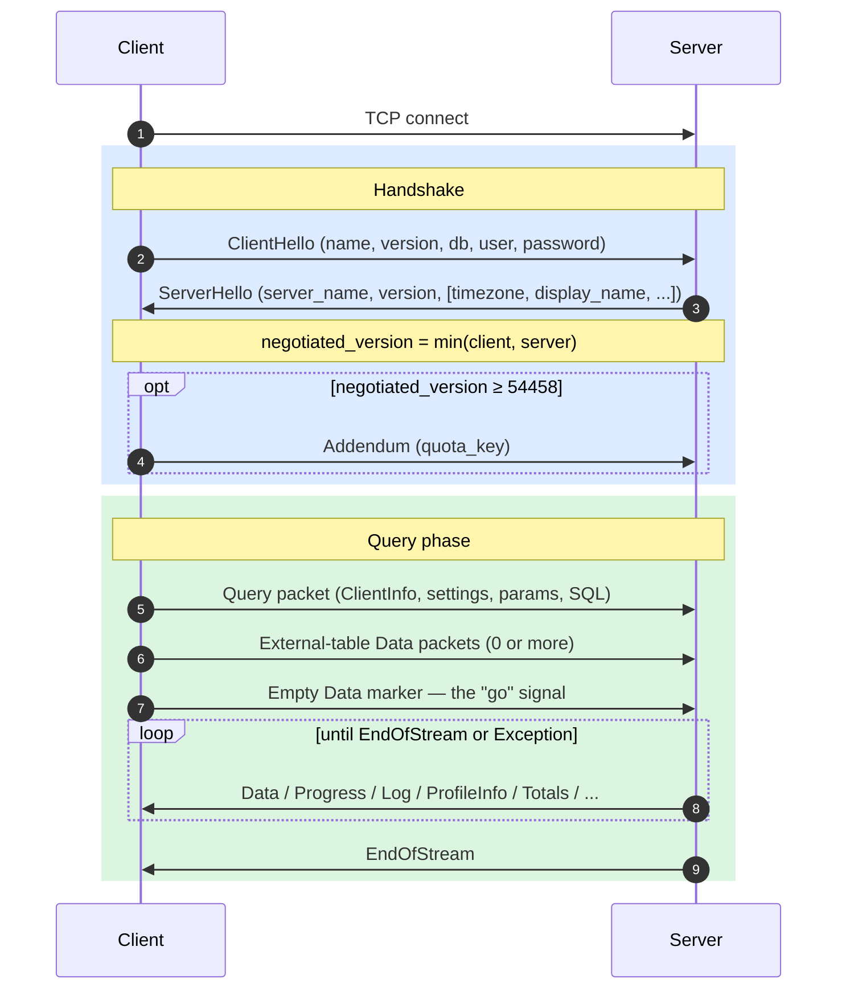
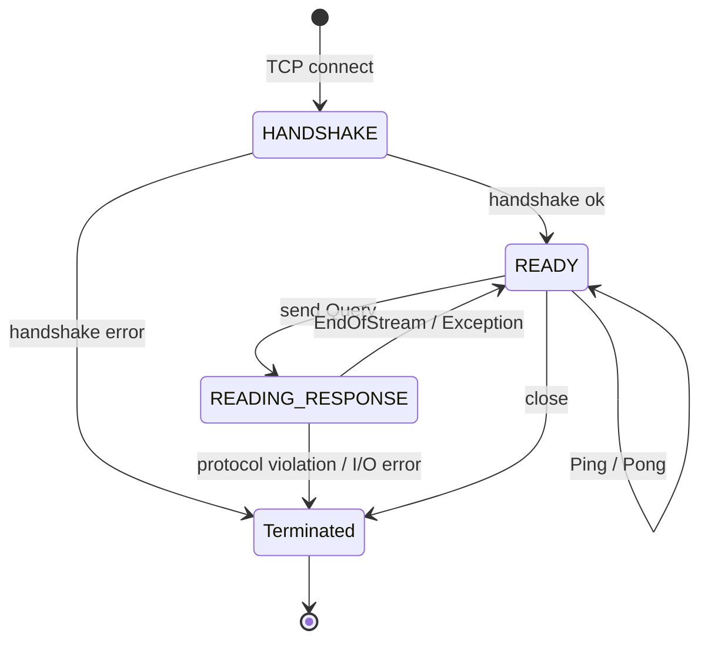
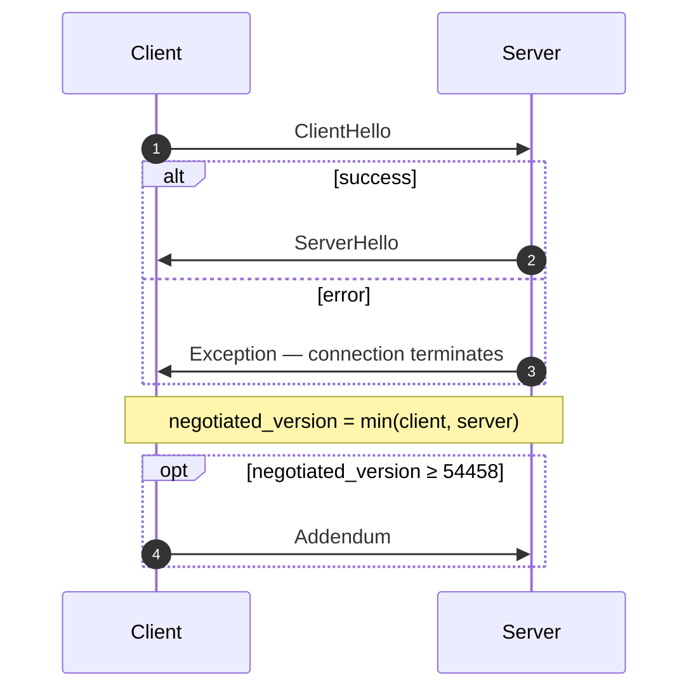
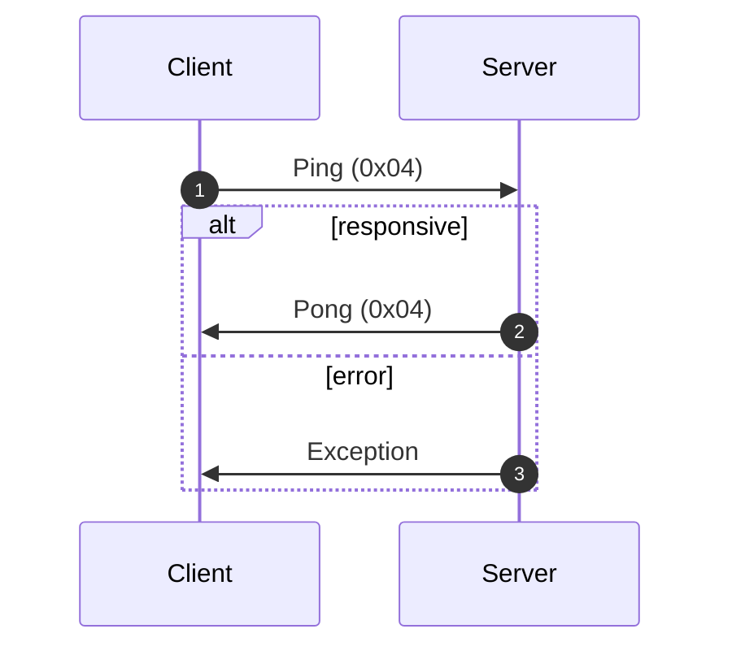
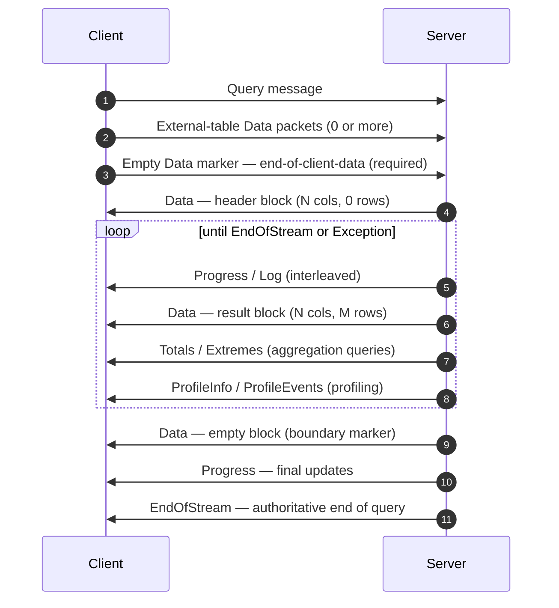
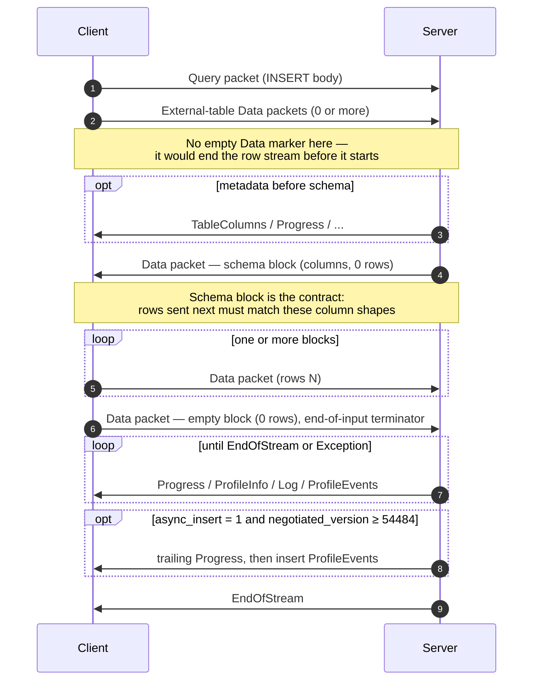
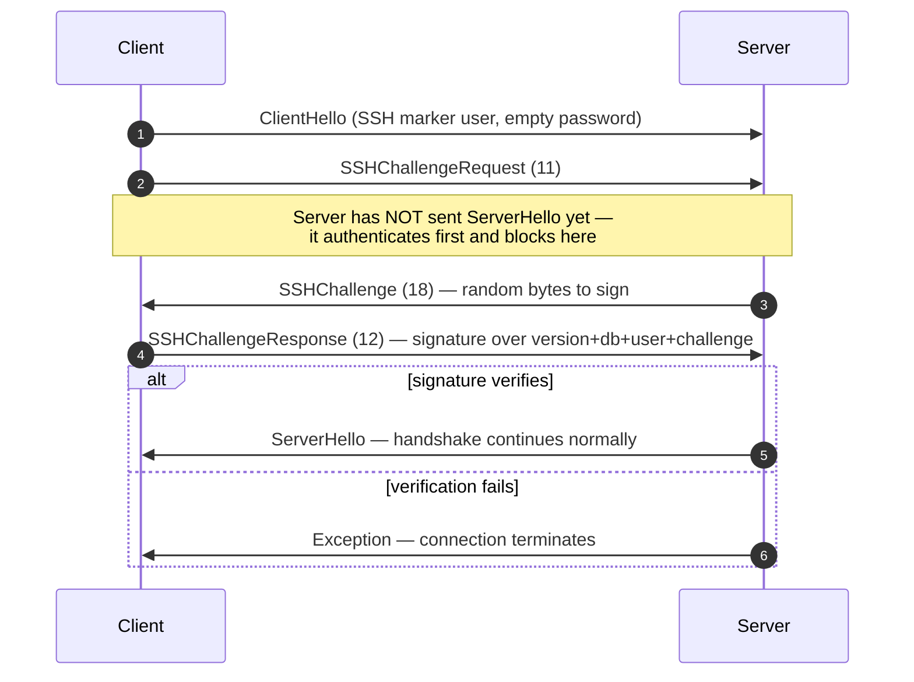

Le protocole natif est le protocole binaire orienté connexion que les clients et serveurs ClickHouse utilisent via TCP. Il transporte les requêtes SQL, les données de résultat, les payloads `INSERT`, la télémétrie d’exécution et les signaux d’erreur. C’est le protocole utilisé par le client en ligne de commande, par le pilote natif C++ et par la plupart des pilotes natifs tiers.

Cette page couvre le protocole lui-même : tramage des paquets, machine à états de la connexion, négociation de version et corps de chaque message autre que `Block`. Les octets à l’intérieur des paquets de la famille `Data` (le `Block`, ses colonnes et les encodages propres à chaque type) constituent un sujet distinct, documenté dans la spécification [Native Format](/fr/interfaces/specs/NativeFormat).

:::note Spécification complémentaire
Cette page fait partie d’un ensemble de deux spécifications et est publiée avec la spécification complémentaire [Native Format](/fr/interfaces/specs/NativeFormat). Les deux spécifications se répartissent clairement le travail : cette page couvre la couche des paquets et du transport ; la spécification Native Format couvre les octets à l’intérieur des paquets de la famille `Data`.
:::

Quelques propriétés s’appliquent à l’ensemble du protocole. Le protocole est binaire et positionnel : il n’y a pas de balises de champ, sauf dans `BlockInfo`, donc un seul octet mal placé désynchronise tout ce qui suit. Il est avec état, et chaque connexion TCP traite une requête à la fois — il n’y a pas de multiplexage. Les entiers de largeur fixe sont en little-endian.

<div id="overview">
  ## Vue d’ensemble
</div>

| Propriété            | Valeur                                                                                 |
| -------------------- | -------------------------------------------------------------------------------------- |
| Transport            | TCP, éventuellement encapsulé dans TLS                                                 |
| Ordre des octets     | Little-endian pour les entiers à largeur fixe                                          |
| Encodage             | Binaire et positionnel (sans balises de champ, sauf dans `BlockInfo`)                  |
| Modèle de connexion  | Avec état, une requête à la fois, sans multiplexage                                    |
| Gestion des versions | Négociée lors du handshake ; les fonctionnalités individuelles dépendent de la version |
| Format des données   | Le [Native Format](/fr/interfaces/specs/NativeFormat) pour toutes les données tabulaires  |

Chaque message dans le format binaire commence par un code de type de paquet `VarUInt`, suivi d’un corps dont la structure dépend de ce code et de la version du protocole négociée.

Une connexion se déroule en trois phases — un handshake initial, puis un nombre quelconque d’échanges `Ping` ou `Query`, puis la fermeture :



Le protocole TCP natif transporte toujours des données tabulaires au format Native, quelle que soit la clause `FORMAT` de la requête SQL. La conversion au format `RowBinary`, `CSV`, `JSON`, etc. relève du client et s’effectue une fois les blocs Native décodés. (L’interface HTTP emprunte un chemin de code différent qui, lui, respecte bien la clause `FORMAT` ; HTTP est hors du périmètre ici.)

<div id="security">
  ## Sécurité
</div>

<div id="transport-security">
  ### Sécurité de transport (TLS)
</div>

TLS fonctionne au niveau de la couche de transport, sous le protocole. Lorsqu&#39;il est activé, l&#39;ensemble du flux TCP est chiffré, et les messages du protocole sont identiques octet pour octet, que TLS soit utilisé ou non.

<div id="authentication">
  ### Authentification
</div>

L’authentification a lieu lors du handshake, dans le message [`ClientHello`](#clienthello). Les champs `user` et `password` circulent sous forme de chaînes en clair ; c’est donc le chiffrement de transport (TLS) qui protège les identifiants en transit.

L’authentification SSH par défi-réponse est disponible à partir de la version 54466 du protocole — voir [Authentification SSH par défi-réponse](#ssh-authentication).

<div id="inter-server-secret">
  ### Secret interserveur
</div>

Pour l’exécution distribuée des requêtes, les serveurs s’authentifient entre eux en prouvant qu’ils connaissent un secret partagé — sans exposer le secret dans le format binaire. Chaque requête contient un `auth_hash` SHA-256 de 32 octets dans le champ 4 de [`Query`](#query), calculé à partir d’un sel, d’un nonce, du secret configuré et de la requête, que le serveur de réception recalcule et compare. Ce mécanisme est conditionné par la fonctionnalité `INTERSERVER_SECRET` (v54441). Les clients externes envoient toujours ici une chaîne vide. Voir [Authentification interserveur](#inter-server-authentication).

<div id="versioning-and-feature-gates">
  ## Gestion des versions et feature gates
</div>

<div id="version-negotiation">
  ### Négociation de version
</div>

Le client et le serveur indiquent chacun la version maximale du protocole qu’ils prennent en charge lors du handshake. La **version négociée** est la plus petite des deux :

```text
negotiated_version = min(client_version, server_version)
```

Chaque message suivant utilise la version négociée pour déterminer quels champs sont présents dans le format binaire.

<div id="feature-gates">
  ### Feature gates
</div>

Une fonctionnalité est identifiée par la version du protocole qui l’a introduite et elle est **active** lorsque la version négociée est supérieure ou égale à ce numéro.

:::warning
Lorsqu’une fonctionnalité est active, ses champs **doivent** être présents dans le format binaire. Le protocole est strictement positionnel ; l’omission d’un champ conditionné par une feature gate corrompt donc le flux d’octets de tous les champs qui suivent.
:::

<div id="feature-table">
  ### Tableau des fonctionnalités
</div>

| Fonctionnalité                                          | Version | Affecte                          | Impact sur le format wire                                                                                                                                                                                                                                                                                                                                                                                                                                                                                                                                                                                                                                                                                                                                                                                                                                           |
| ------------------------------------------------------- | ------- | -------------------------------- | ------------------------------------------------------------------------------------------------------------------------------------------------------------------------------------------------------------------------------------------------------------------------------------------------------------------------------------------------------------------------------------------------------------------------------------------------------------------------------------------------------------------------------------------------------------------------------------------------------------------------------------------------------------------------------------------------------------------------------------------------------------------------------------------------------------------------------------------------------------------- |
| BLOCK&#95;INFO                                          | all     | Block                            | Ajoute le préfixe BlockInfo (`is_overflows`, `bucket_number`) à chaque Block.                                                                                                                                                                                                                                                                                                                                                                                                                                                                                                                                                                                                                                                                                                                                                                                       |
| CLIENT&#95;INFO                                         | 54032   | Query                            | Ajoute le bloc ClientInfo au corps de Query.                                                                                                                                                                                                                                                                                                                                                                                                                                                                                                                                                                                                                                                                                                                                                                                                                        |
| TIMEZONE                                                | 54058   | ServerHello                      | Ajoute le champ `timezone` à ServerHello.                                                                                                                                                                                                                                                                                                                                                                                                                                                                                                                                                                                                                                                                                                                                                                                                                           |
| QUOTA&#95;KEY&#95;IN&#95;CLIENT&#95;INFO                | 54060   | ClientInfo                       | Ajoute le champ `quota_key` à ClientInfo.                                                                                                                                                                                                                                                                                                                                                                                                                                                                                                                                                                                                                                                                                                                                                                                                                           |
| DISPLAY&#95;NAME                                        | 54372   | ServerHello                      | Ajoute le champ `display_name` à ServerHello.                                                                                                                                                                                                                                                                                                                                                                                                                                                                                                                                                                                                                                                                                                                                                                                                                       |
| VERSION&#95;PATCH                                       | 54401   | ServerHello, ClientInfo          | Ajoute le champ `version_patch` aux deux.                                                                                                                                                                                                                                                                                                                                                                                                                                                                                                                                                                                                                                                                                                                                                                                                                           |
| SERVER&#95;LOGS                                         | 54406   | Log                              | Le serveur émet des paquets Log lorsque `send_logs_level` est défini.                                                                                                                                                                                                                                                                                                                                                                                                                                                                                                                                                                                                                                                                                                                                                                                               |
| COLUMN&#95;DEFAULTS&#95;METADATA                        | 54410   | TableColumns                     | Le serveur peut envoyer le paquet [`TableColumns`](#tablecolumns) (type 11) avec les métadonnées des valeurs par défaut des colonnes avant le bloc de schéma INSERT/input. Il n’est envoyé que si la version négociée est ≥ 54410 **et** que `input_format_defaults_for_omitted_fields` est activé. En dessous de cette version, le paquet n’est jamais envoyé ; les clients ne doivent pas l’attendre.                                                                                                                                                                                                                                                                                                                                                                                                                                                             |
| WRITE&#95;CLIENT&#95;INFO                               | 54420   | Progress                         | Ajoute `wrote_rows` et `wrote_bytes` à Progress. (Malgré son nom, cela ne contrôle **pas** le bloc ClientInfo — c’est `CLIENT_INFO` (v54032).)                                                                                                                                                                                                                                                                                                                                                                                                                                                                                                                                                                                                                                                                                                                      |
| SETTINGS&#95;SERIALIZED&#95;AS&#95;STRINGS              | 54429   | Query (settings encoding)        | Modifie **la façon** dont la liste des settings, toujours présente, est encodée ; ne contrôle **pas** si les settings sont envoyés. v54429+ écrit chaque setting sous la forme `(name, flags, value-as-string)` ; les pairs plus anciens écrivent `(name, type-specific-binary-value)` sans flags. Voir [Setting](#setting).                                                                                                                                                                                                                                                                                                                                                                                                                                                                                                                                        |
| INTERSERVER&#95;SECRET                                  | 54441   | Query                            | Ajoute le champ interserveur `auth_hash` à Query — un SHA-256 salé calculé à partir du secret du cluster, et non le secret brut. Les clients externes envoient une chaîne vide. Voir [Inter-server authentication](#inter-server-authentication).                                                                                                                                                                                                                                                                                                                                                                                                                                                                                                                                                                                                                   |
| OPEN&#95;TELEMETRY                                      | 54442   | ClientInfo                       | Ajoute le contexte de trace OpenTelemetry à ClientInfo.                                                                                                                                                                                                                                                                                                                                                                                                                                                                                                                                                                                                                                                                                                                                                                                                             |
| DISTRIBUTED&#95;DEPTH                                   | 54448   | ClientInfo                       | Ajoute le champ `distributed_depth` à ClientInfo.                                                                                                                                                                                                                                                                                                                                                                                                                                                                                                                                                                                                                                                                                                                                                                                                                   |
| INITIAL&#95;QUERY&#95;START&#95;TIME                    | 54449   | ClientInfo                       | Ajoute le champ `initial_time` (Int64, largeur fixe).                                                                                                                                                                                                                                                                                                                                                                                                                                                                                                                                                                                                                                                                                                                                                                                                               |
| PROFILE&#95;EVENTS                                      | 54451   | ProfileEvents                    | Le serveur émet des paquets ProfileEvents pendant l’exécution de la requête.                                                                                                                                                                                                                                                                                                                                                                                                                                                                                                                                                                                                                                                                                                                                                                                        |
| PARALLEL&#95;REPLICAS                                   | 54453   | ClientInfo                       | Ajoute à ClientInfo les champs de coordination des réplicas parallèles.                                                                                                                                                                                                                                                                                                                                                                                                                                                                                                                                                                                                                                                                                                                                                                                             |
| CUSTOM&#95;SERIALIZATION                                | 54454   | Block (Column)                   | Ajoute l’octet `has_custom_serialization` après la chaîne de type de chaque colonne.                                                                                                                                                                                                                                                                                                                                                                                                                                                                                                                                                                                                                                                                                                                                                                                |
| ADDENDUM                                                | 54458   | Handshake                        | Le client envoie un addendum (`quota_key`) après l’échange de handshake.                                                                                                                                                                                                                                                                                                                                                                                                                                                                                                                                                                                                                                                                                                                                                                                            |
| PARAMETERS                                              | 54459   | Query                            | Ajoute la liste des paramètres au corps de Query.                                                                                                                                                                                                                                                                                                                                                                                                                                                                                                                                                                                                                                                                                                                                                                                                                   |
| SERVER&#95;QUERY&#95;TIME&#95;IN&#95;PROGRESS           | 54460   | Progress                         | Ajoute le champ `elapsed_ns` à Progress.                                                                                                                                                                                                                                                                                                                                                                                                                                                                                                                                                                                                                                                                                                                                                                                                                            |
| PASSWORD&#95;COMPLEXITY&#95;RULES                       | 54461   | ServerHello                      | Ajoute à ServerHello une liste de motifs regex de politique de mot de passe et de messages lisibles par des humains.                                                                                                                                                                                                                                                                                                                                                                                                                                                                                                                                                                                                                                                                                                                                                |
| INTERSERVER&#95;SECRET&#95;V2                           | 54462   | ServerHello                      | Ajoute un nonce `UInt64` de 8 octets à ServerHello. Utilisé pour la signature des requêtes interserveur ; les clients externes le décodent et l’ignorent.                                                                                                                                                                                                                                                                                                                                                                                                                                                                                                                                                                                                                                                                                                           |
| TOTAL&#95;BYTES&#95;IN&#95;PROGRESS                     | 54463   | Progress                         | Ajoute le champ `total_bytes_to_read` (VarUInt) à Progress, entre `total_rows` et `wrote_rows`.                                                                                                                                                                                                                                                                                                                                                                                                                                                                                                                                                                                                                                                                                                                                                                     |
| TIMEZONE&#95;UPDATES                                    | 54464   | TimezoneUpdate                   | Ajoute le paquet serveur `TimezoneUpdate` (type 17). Corps : un seul `String` contenant le fuseau horaire de la session. Envoyé uniquement par l’initialiseur de la table function `input`, juste après le bloc de schéma d’entrée, afin que le client analyse les lignes qu’il envoie avec le `session_timezone` du serveur. Voir [TimezoneUpdate](#timezoneupdate).                                                                                                                                                                                                                                                                                                                                                                                                                                                                                               |
| SPARSE&#95;SERIALIZATION                                | 54465   | Block (Column)                   | Le serveur peut définir `has_custom_serialization = 1` et émettre une colonne encodée de façon sparse. Format wire : type sur 1 octet (0x01 = SPARSE), puis flux de décalages VarUInt terminé par EOG, puis les valeurs non par défaut encodées de façon dense dans le type interne. Voir [kind&#95;stack and sparse encoding](/fr/interfaces/specs/NativeFormat#kind-stack-and-sparse-encoding).                                                                                                                                                                                                                                                                                                                                                                                                                                                                      |
| SSH&#95;AUTHENTICATION                                  | 54466   | Auth flow                        | Ajoute l’authentification SSH en défi-réponse. Opt-in : le client envoie un `user` de la forme `" SSH KEY AUTHENTICATION " + <real_user>` avec un mot de passe vide pour la déclencher. Voir [SSH challenge-response authentication](#ssh-authentication).                                                                                                                                                                                                                                                                                                                                                                                                                                                                                                                                                                                                          |
| TABLE&#95;READ&#95;ONLY&#95;CHECK                       | 54467   | TablesStatusResponse             | Ajoute un flag `is_readonly` à la ligne de chaque table dans TablesStatusResponse. Les clients externes qui n’émettent pas `TablesStatusRequest` ne voient aucun changement du format wire.                                                                                                                                                                                                                                                                                                                                                                                                                                                                                                                                                                                                                                                                         |
| SYSTEM&#95;KEYWORDS&#95;TABLE                           | 54468   | system tables                    | Le serveur renseigne `system.keywords` pour que le `clickhouse-client` canonique puisse autocompléter les mots-clés. Aucun changement du format wire du protocole natif.                                                                                                                                                                                                                                                                                                                                                                                                                                                                                                                                                                                                                                                                                            |
| ROWS&#95;BEFORE&#95;AGGREGATION                         | 54469   | ProfileInfo                      | Ajoute `applied_aggregation` (Bool) et `rows_before_aggregation` (VarUInt) à ProfileInfo, dans cet ordre en fin de structure.                                                                                                                                                                                                                                                                                                                                                                                                                                                                                                                                                                                                                                                                                                                                       |
| CHUNKED&#95;PROTOCOL                                    | 54470   | Connection framing               | Le tramage par fragments de chaque paquet encapsule chaque corps de paquet. Négocié dans Addendum. ServerHello transporte la préférence du serveur pour chaque direction ; Addendum transporte le choix final du client. Voir [chunked framing](#chunked-framing).                                                                                                                                                                                                                                                                                                                                                                                                                                                                                                                                                                                                  |
| VERSIONED&#95;PARALLEL&#95;REPLICAS&#95;PROTOCOL        | 54471   | ServerHello, Addendum            | Les deux parties échangent une version du protocole de coordination des répliques parallèles au format `VarUInt`. Le champ de ServerHello se trouve **immédiatement après `protocol_version`** (avant `timezone`). Celui d&#39;Addendum est ajouté après les chaînes du protocole segmenté. Valeur actuelle : `8` (`DBMS_PARALLEL_REPLICAS_PROTOCOL_VERSION`). La version `8` ajoute [`MergeTreeAllRangesAnnouncementResponse`](#mergetreeallrangesannouncementresponse) (paquet client `14`) : lorsque la version négociée des répliques parallèles est `≥ 8`, l&#39;initiateur répond à chaque announcement de follower en mode autre que `Default` avec la liste de parties faisant autorité pour ce stream, et le follower attend cette réponse avant d&#39;émettre des requêtes de lecture. En dessous de `8`, l&#39;announcement est de type fire-and-forget. |
| INTERSERVER&#95;EXTERNALLY&#95;GRANTED&#95;ROLES        | 54472   | Query                            | Ajoute un champ `String external_roles` au body de Query, entre le terminateur des settings et le hash du secret interserveur. Les clients externes envoient une liste de rôles vide (un seul octet `0x00`, c.-à-d. VarUInt 0 dans une enveloppe String).                                                                                                                                                                                                                                                                                                                                                                                                                                                                                                                                                                                                           |
| V2&#95;DYNAMIC&#95;AND&#95;JSON&#95;SERIALIZATION       | 54473   | Column body                      | Le serveur peut émettre la sérialisation V2 pour les types de colonne `Dynamic` et `JSON` — ce qui détermine la version de `state_prefix` utilisée. Voir [versioned types](/fr/interfaces/specs/NativeFormat#versioned-types).                                                                                                                                                                                                                                                                                                                                                                                                                                                                                                                                                                                                                                         |
| SERVER&#95;SETTINGS                                     | 54474   | ServerHello                      | Le serveur diffuse ses settings non par défaut sous forme de liste à la fin de ServerHello, après `nonce`. Format : triplets `(key, flags, value)` terminés par une clé vide — identiques à la liste de settings du paquet Query.                                                                                                                                                                                                                                                                                                                                                                                                                                                                                                                                                                                                                                   |
| QUERY&#95;AND&#95;LINE&#95;NUMBERS                      | 54475   | ClientInfo                       | Ajoute `script_query_number` (VarUInt) et `script_line_number` (VarUInt) à la fin de ClientInfo. Utilisé par clickhouse-client pour attribuer les erreurs dans les scripts multi-instructions ; les clients externes envoient `0, 0`.                                                                                                                                                                                                                                                                                                                                                                                                                                                                                                                                                                                                                               |
| JWT&#95;IN&#95;INTERSERVER                              | 54476   | ClientInfo                       | Ajoute un indicateur de présence de JWT en UInt8, plus un `String jwt` optionnel à la fin de ClientInfo. Les clients externes (sans JWT) envoient l&#39;octet `0x00`. (Orthographié `DBMS_MIN_REVISON_WITH_JWT_IN_INTERSERVER` en C++ — noter la faute de frappe dans le nom de la constante.)                                                                                                                                                                                                                                                                                                                                                                                                                                                                                                                                                                      |
| QUERY&#95;PLAN&#95;SERIALIZATION                        | 54477   | ServerHello, QueryPlan packet    | ServerHello ajoute `VarUInt query_plan_serialization_version` après les settings du serveur. Introduit également `ClientPacket::QueryPlan` (code `13`) pour la transmission interserveur de plans de requête préconstruits — jamais envoyé par des clients externes.                                                                                                                                                                                                                                                                                                                                                                                                                                                                                                                                                                                                |
| PARALLEL&#95;BLOCK&#95;MARSHALLING                      | 54478   | Block (Column)                   | Le serveur peut encapsuler les colonnes dans `ColumnBLOB` (compressé inline) pour le traitement parallèle. Cela s&#39;applique uniquement si la compression est activée pour la requête ET si `rows > 1` ; sinon, c&#39;est le format wire habituel des colonnes qui s&#39;applique. Les clients qui n&#39;activent jamais la compression sur les paquets Query sortants ne voient aucun changement du format wire.                                                                                                                                                                                                                                                                                                                                                                                                                                                 |
| VERSIONED&#95;CLUSTER&#95;FUNCTION&#95;PROTOCOL         | 54479   | ServerHello                      | Ajoute `VarUInt cluster_function_protocol_version` à la fin de ServerHello. Utilisé pour les fonctions de table `*Cluster` (`s3Cluster`, etc.). Valeur actuelle : `8` (`DBMS_CLUSTER_PROCESSING_PROTOCOL_VERSION`) ; la version `7` est réservée à une fonctionnalité d&#39;un dépôt privé (compaction Iceberg), et `8` ajoute un `read_source_index` optionnel à la charge utile interserveur des tâches de lecture de cluster (le body de `ReadTaskResponse`, qui reste non spécifié ici — voir ci-dessous). Les clients externes le décodent et l&#39;ignorent.                                                                                                                                                                                                                                                                                                  |
| OUT&#95;OF&#95;ORDER&#95;BUCKETS&#95;IN&#95;AGGREGATION | 54480   | BlockInfo                        | Ajoute le champ 3 (`out_of_order_buckets: Vec<Int32>`) au flux de BlockInfo balisé par champs. Décodé comme `[VarUInt count][Int32]*count`. Les clients externes ne l&#39;émettent pas eux-mêmes ; le décodeur lit toute liste non vide envoyée par le serveur.                                                                                                                                                                                                                                                                                                                                                                                                                                                                                                                                                                                                     |
| COMPRESSED&#95;LOGS&#95;PROFILE&#95;EVENTS&#95;COLUMNS  | 54481   | Log, ProfileEvents, TableColumns | Le serveur peut encapsuler les body des paquets [`Log`](#log), [`ProfileEvents`](#profileevents) et [`TableColumns`](#tablecolumns) dans la [trame de compression](/fr/interfaces/specs/NativeFormat#compression-frame). À cette version, les trois body empruntent le même chemin de sortie éventuellement compressé, qui ne devient une véritable trame de compression que lorsque la requête a `compression = true`. Les clients qui n&#39;activent jamais la compression sur les paquets Query sortants ne voient aucun changement du format wire.                                                                                                                                                                                                                                                                                                                 |
| REPLICATED&#95;SERIALIZATION                            | 54482   | Block (Column)                   | Le serveur peut émettre des colonnes avec le kind&#95;stack `0x04 = REPLICATED` — une forme compacte de type dictionnaire pour les valeurs répétées — voir [kind&#95;stack and sparse encoding](/fr/interfaces/specs/NativeFormat#kind-stack-and-sparse-encoding). En dessous de cette version, l&#39;émetteur développait ces colonnes avant l&#39;envoi. Décodé par recherche d&#39;index (`elements[indexes[i]]` par ligne) ; types feuille ainsi qu&#39;éléments internes `Nullable`/`Array`/`Tuple`/`Map`/`Nested`/`LowCardinality` pris en charge.                                                                                                                                                                                                                                                                                                               |
| NULLABLE&#95;SPARSE&#95;SERIALIZATION                   | 54483   | Block (Column)                   | Combine la sérialisation sparse avec `Nullable(T)`. En dessous de cette version, l&#39;émetteur développait sparse pour les colonnes Nullable avant l&#39;envoi ; à partir de v54483, les données wire sont sparse-over-Nullable. Voir [kind&#95;stack and sparse encoding](/fr/interfaces/specs/NativeFormat#kind-stack-and-sparse-encoding).                                                                                                                                                                                                                                                                                                                                                                                                                                                                                                                         |
| PROGRESS&#95;IN&#95;ASYNC&#95;INSERT                    | 54484   | Progress (INSERT)                | Lors d&#39;un INSERT **asynchrone** (`async_insert = 1`), une fois l&#39;insert flushé, le serveur envoie un paquet [`Progress`](#progress) supplémentaire, puis les `ProfileEvents` de l&#39;insert, avant `EndOfStream`. Dépend de la version *négociée* ≥ 54484 ; en dessous, le serveur omet ce Progress final. Le format wire de Progress est inchangé — seule son émission est nouvelle. En pratique, l&#39;incrément transporte le temps écoulé ; les compteurs de lignes écrites sont signalés via les ProfileEvents associés. Un client qui draine déjà les paquets Progress entrelacés n&#39;a besoin d&#39;aucun changement de format, seulement de tolérer un paquet supplémentaire.                                                                                                                                                                    |
| CLIENT&#95;AGENT&#95;IN&#95;CLIENT&#95;INFO             | 54485   | ClientInfo                       | Ajoute un `String` `client_agent` final à ClientInfo. Le client canonique détecte automatiquement un identifiant d&#39;agent dans son environnement (par exemple `claude-code`, `cursor`, `gemini-cli`, ou la valeur de la variable `AGENT`) ; un client externe sans identifiant détecté envoie une chaîne vide. Obligatoire dès lors que la version négociée est ≥ 54485 — l&#39;omettre désynchronise le reste du paquet Query.                                                                                                                                                                                                                                                                                                                                                                                                                                  |
| INTERNAL&#95;QUERY&#95;FLAG                             | 54486   | ClientInfo                       | Ajoute un `UInt8` final `is_internal` à ClientInfo. `1` pour une requête interne au serveur (non émise par un utilisateur), propagée aux requêtes distantes afin que leurs lignes `system.query_log` soient marquées comme internes ; les clients externes envoient `0`. Obligatoire dès lors que la version négociée est ≥ 54486 — l&#39;omettre désynchronise le reste du paquet Query.                                                                                                                                                                                                                                                                                                                                                                                                                                                                           |

<div id="packet-envelope">
  ## Enveloppe de paquet
</div>

Chaque message dans le format binaire suit la même structure externe, dans les deux sens :

```text
[VarUInt: packet_type_code]    always encoded as VarUInt
[message body]                 format depends on packet_type_code
```

Les tableaux complets des types de paquets figurent dans la [référence des types de paquets](#packet-type-reference).

Le type de paquet est un `VarUInt`, et non un octet à taille fixe. Pour les valeurs inférieures à 128, un `VarUInt` produit le même octet unique, mais les implémentations doivent utiliser l’encodage `VarUInt` pour rester compatibles si de futurs types de paquets atteignent 128 ou plus.

La [référence des messages](#message-reference) documente uniquement le **corps** de chaque paquet — les octets qui suivent le code du type de paquet. La numérotation des champs commence à 1 avec le premier champ du corps.

<div id="chunked-framing">
  ### Tramage par blocs (v54470+)
</div>

Lorsque la fonctionnalité `CHUNKED_PROTOCOL` est **négociée** (voir [le handshake](#handshake-phase)), chaque paquet dans le format binaire est encapsulé dans un tramage par blocs. Cet encapsulage se fait **par direction** : client→serveur et serveur→client sont négociés séparément et peuvent aboutir à des modes différents (tramage par blocs ou absence de tramage).

Format binaire de chaque paquet :

```text
<chunk>...   one or more chunks; their payloads concatenated form the whole packet
[u32 LE = 0] zero-size terminator marking end of packet
```

Organisation binaire sur le fil pour chaque chunk :

```text
[u32 LE: chunk_size]   chunk_size in [1, UINT32_MAX]
[chunk_size bytes]     packet bytes (see note below)
```

Le type de paquet `VarUInt` se trouve **à l’intérieur** du flux découpé en fragments : c’est le premier octet de la charge utile du paquet (le premier octet du premier fragment), et non un octet distinct envoyé avant le tramage. La charge utile fragmentée de chaque paquet correspond à l’intégralité de `[VarUInt packet_type_code][message body]` de l’[enveloppe de paquet](#packet-envelope). Un client qui laisse le type de paquet en dehors du flux découpé en fragments amène le pair à lire cet octet de type comme le premier octet de la taille de fragment `u32`, ce qui désynchronise la connexion.

Un même paquet peut être scindé sur plusieurs fragments si le buffer du writer se remplit en plein milieu du paquet ; une scission peut se produire n’importe où, y compris à l’intérieur du `VarUInt` du type de paquet. Le reader concatène les charges utiles des fragments et traite le zéro final sur 4 octets comme une limite de paquet transparente — il le consomme, mais ne l’expose pas à ce qui lit les corps de paquets.

Les paquets sans corps restent encapsulés : un paquet d’un seul octet comme `Ping` ou `Pong` devient `[u32 size = 1][0x04][u32 0]` une fois le découpage en fragments négocié. Toute mention ailleurs sur cette page d’un « single byte dans le format binaire » renvoie à la forme antérieure au découpage en fragments.

**Négociation.** ServerHello et Addendum transportent chacun deux champs `String`, un par direction, avec des valeurs tirées de `{"chunked", "notchunked", "chunked_optional", "notchunked_optional"}` :

* `chunked` / `notchunked` sont stricts : ce côté exige exactement ce mode.
* Les variantes en `_optional` sont flexibles : elles acceptent le mode choisi par l’autre côté.

La valeur convenue pour chaque direction est calculée par paire :

| Préférence du serveur | Préférence du client | Convenue                                                |
| --------------------- | -------------------- | ------------------------------------------------------- |
| `*_optional`          | anything             | suivre le CLIENT (son `starts_with("chunked")`)         |
| anything              | `*_optional`         | suivre le SERVEUR                                       |
| `chunked` strict      | `chunked` strict     | `chunked`                                               |
| `notchunked` strict   | `notchunked` strict  | `notchunked`                                            |
| strict mismatch       | strict mismatch      | **erreur de protocole** — la connexion DOIT être coupée |

Côté client, la préférence d’ENVOI du client est négociée avec la préférence de RÉCEPTION du serveur, et inversement.

**Temporalité.** Les chaînes de négociation transitent sur le wire non tramé : ClientHello → ServerHello (préférences du serveur) → Addendum (valeurs négociées du client). Le basculement du tramage s’applique à chaque octet envoyé *après* que l’Addendum a été flushed. L’Addendum lui-même, le ClientHello et le ServerHello ne sont jamais tramés.

<div id="connection-lifecycle">
  ## Cycle de vie de la connexion
</div>

À tout moment, une connexion se trouve dans exactement l’un des quatre états suivants : `HANDSHAKE`, `READY`, `READING_RESPONSE` ou terminée. Comme le protocole ne prend pas en charge le multiplexage, un client qui envoie une nouvelle requête avant d’avoir entièrement lu la réponse précédente entremêle les octets dans le format binaire et corrompt le flux.

<div id="states">
  ### États
</div>



Le parcours nominal suit une ligne droite — `HANDSHAKE → READY → READING_RESPONSE → READY` — avec la boucle `Ping`/`Pong` et toutes les transitions d’échec convergeant vers l’unique état terminal `Terminated`.

| État               | Description                                                                                                                                                                                                                                                |
| ------------------ | ---------------------------------------------------------------------------------------------------------------------------------------------------------------------------------------------------------------------------------------------------------- |
| `HANDSHAKE`        | État initial après l’ouverture de la connexion TCP. Seuls les messages de [handshake](#handshake-phase) sont valides. Passe à `READY` en cas de succès ou se termine en cas d’échec.                                                                     |
| `READY`            | Au repos. Le client peut envoyer [Ping](#ping-phase), [requête](#query-phase) ou fermer la connexion. La connexion peut rester dans `READY` indéfiniment (sous réserve de `idle_connection_timeout`, voir les [limites de connexion](#connection-limits)). |
| `READING_RESPONSE` | État atteint lorsque le client envoie une requête. Le client doit consommer intégralement le flux de réponse du serveur avant de revenir à `READY`. Le seul paquet client→server autorisé ici est Cancel (non spécifié sur cette page).                    |
| Terminated         | N’est plus utilisable. Le client doit ouvrir une nouvelle connexion TCP et reprendre le handshake.                                                                                                                                                       |

<div id="handshake-phase">
  ### Phase de handshake
</div>

Authentification et négociation de la version du protocole. Cette phase se produit exactement une fois par connexion, avant toute autre chose.

La connexion TCP vient juste d&#39;être ouverte et aucun message n&#39;a encore été échangé. Déroulement :



1. Le client envoie [`ClientHello`](#clienthello) avec la version maximale du protocole qu’il prend en charge.

2. Le client lit la réponse et la traite selon le type de paquet :

   | Type de paquet  | Action                                                                                                               |
   | --------------- | -------------------------------------------------------------------------------------------------------------------- |
   | `Hello` (0)     | Décode [`ServerHello`](#serverhello). Calcule `negotiated_version = min(client_ver, server_ver)`. Passe à l’étape 3. |
   | `Exception` (2) | Décode [`Exception`](#exception). La renvoie comme erreur et met fin à la connexion.                                 |
   | tout autre type | Violation du protocole. Met fin à la connexion.                                                                      |

3. Si `negotiated_version ≥ 54458` (la fonctionnalité `ADDENDUM`), le client envoie un [`Addendum`](#addendum). Cette décision est fondée sur la version **négociée**, et non sur la version déclarée du client.

En cas de succès, la connexion passe à l’état `READY` ; en cas d’erreur, elle est terminée.

<div id="ping-phase">
  ### Phase de Ping
</div>

Un contrôle de vivacité au niveau de l’application, indépendant du keepalive TCP. Un aller-retour Ping/Pong réussi confirme que la connexion TCP est active dans les deux sens et que le serveur répond. Ping est sans état et n’est corrélé à aucune requête ; plusieurs Pings successifs sont donc indépendants.

À partir de `READY`, le déroulement est :



1. Le client envoie [`Ping`](#ping).
2. Le client lit la réponse :

   | Type de paquet     | Action                                                         |
   | ------------------ | -------------------------------------------------------------- |
   | `Pong` (4)         | Liveness confirmée. Revenir à `READY`.                         |
   | `Exception` (2)    | Décoder [`Exception`](#exception) et la renvoyer comme erreur. |
   | toute autre valeur | Violation du protocole.                                        |

<div id="query-phase">
  ### Phase de requête
</div>

Le client soumet une instruction SQL ; le serveur renvoie en continu des blocs de résultats ainsi que les données de télémétrie d’exécution. La réponse est une séquence de paquets qui se termine par exactement un `EndOfStream` ou une `Exception`.

À partir de `READY`, le flux est le suivant :



En cas d&#39;erreur, à n&#39;importe quel moment, le serveur envoie une `Exception` au lieu de `EndOfStream`, ce qui met fin à la requête.

1. Le client envoie [`Query`](#query) avec un `query_id` unique (généralement un UUID).
2. Le client envoie toutes les tables externes, puis le marqueur Data vide. Le paquet Data vide a `table_name = ""`, `num_columns = 0`, `num_rows = 0`. Le serveur ne commence pas à exécuter la requête tant qu&#39;il n&#39;a pas reçu ce marqueur.
3. Le client passe à `READING_RESPONSE` et vide son tampon d&#39;écriture.
4. Le client lit les paquets de réponse en boucle, en les traitant selon leur type :

   | Packet type          | Action                                                                                                                                                                                                                      |
   | -------------------- | --------------------------------------------------------------------------------------------------------------------------------------------------------------------------------------------------------------------------- |
   | `Data` (1)           | Décode le bloc. Le premier Data est l&#39;en-tête du schéma ; les suivants sont des blocs de résultat (à accumuler) ; un bloc vide est un marqueur de délimitation. `num_rows == 0` n&#39;est **pas** une fin de requête. |
   | `Progress` (3)       | Métriques d&#39;exécution. Chaque paquet est un **incrément** depuis le précédent — à accumuler localement.                                                                                                                 |
   | `EndOfStream` (5)    | Requête terminée. Quittez la boucle et revenez à `READY`.                                                                                                                                                                   |
   | `ProfileInfo` (6)    | Données de profiling post-exécution.                                                                                                                                                                                        |
   | `Totals` (7)         | Bloc des totaux d&#39;agrégation (même format binaire que Data).                                                                                                                                                            |
   | `Extremes` (8)       | Bloc des valeurs min/max (même format binaire que Data).                                                                                                                                                                    |
   | `Log` (10)           | Ligne du journal du serveur.                                                                                                                                                                                                |
   | `TableColumns` (11)  | Métadonnées des valeurs par défaut des colonnes.                                                                                                                                                                            |
   | `ProfileEvents` (14) | Compteurs de performance.                                                                                                                                                                                                   |
   | `Exception` (2)      | Décode et renvoie comme erreur. Quittez la boucle et revenez à `READY`.                                                                                                                                                     |
   | anything else        | Inattendu pendant la phase de requête. Terminez la connexion.                                                                                                                                                               |

Sur `EndOfStream` ou une `Exception` gérée, la connexion revient à `READY`. Une violation du protocole ou une erreur d&#39;E/S y met fin.

:::note
Le cas `num_rows == 0` piège souvent les nouvelles implémentations. Un bloc de zéro row est un marqueur de délimitation ou un en-tête de schéma, pas un signal de fin de flux. Seuls `EndOfStream` ou `Exception` mettent fin à la réponse.
:::

<div id="insert-phase">
  ### Phase INSERT
</div>

La phase INSERT correspond à la [phase de requête](#query-phase) avec deux échanges supplémentaires. Le client envoie une instruction `INSERT` ; le serveur répond avec un **bloc de schéma** décrivant la table cible ; le client transmet des paquets Data contenant les lignes, puis le marqueur Data vide ; le serveur termine avec `EndOfStream` ou `Exception`.

À partir de `READY`, l’instruction SQL est un `INSERT` de la forme `INSERT INTO <table> [(<cols>)] VALUES` — sans littéral `VALUES (...)` intégré, puisque les données des lignes transitent via des paquets Data. Le flux :



1. Le client envoie [`Query`](#query) avec `body` défini sur le SQL INSERT.
2. Le client envoie les éventuelles tables externes (cas rare pour INSERT). Contrairement à la [phase de requête](#query-phase), il n’envoie **pas** ici de marqueur Data vide. Le paquet `Query` `INSERT` est envoyé avec des données en attente, donc le bloc vide de fin de données est reporté à l’étape 5 ; l’envoyer avant le bloc de schéma amènerait le serveur à l’interpréter comme la fin du flux de lignes, à terminer l’INSERT sans aucune ligne, puis à analyser le premier vrai paquet de lignes comme un paquet parasite de niveau supérieur.
3. Le client lit les paquets de métadonnées (TableColumns, Progress, ProfileInfo, Log, ProfileEvents) jusqu’à recevoir le paquet Data de schéma — un bloc avec 0 ligne mais une structure complète de colonnes (noms et types). Le bloc de schéma fait foi : les lignes que le client envoie ensuite doivent correspondre à cette structure de colonnes.
4. Le client envoie un ou plusieurs blocs de données. Pour chaque bloc, il écrit `VarUInt(ClientPacket::Data = 2)`, puis `String("")` pour le nom vide de la table externe, puis le bloc. Les types de colonnes doivent correspondre, par position, aux colonnes du bloc de schéma.
5. Le client envoie le terminateur de fin d’entrée : un paquet Data avec un Block vide (0 colonne, 0 ligne).
6. Le client lit le flux de réponse jusqu’à `EndOfStream` (succès) ou `Exception` (échec).

**INSERT asynchrone (v54484+).** Lorsque la requête contient `async_insert = 1`, le serveur met les lignes en file d’attente et les flush dans le cadre d’un batch. À partir de la version négociée ≥ 54484 (`PROGRESS_IN_ASYNC_INSERT`), une fois le flush terminé, le serveur émet un paquet [`Progress`](#progress) supplémentaire, immédiatement suivi des `ProfileEvents` de l’INSERT, puis de `EndOfStream`. En dessous de 54484, le serveur omet ce Progress final. Le paquet est un `Progress` ordinaire ; comme le serveur réinitialise le pipeline de requête avant d’y intégrer les compteurs d’écriture, l’incrément ne contient en pratique que le temps écoulé, et les statistiques sur les lignes et les octets écrits parviennent au client via les `ProfileEvents` qui l’accompagnent. Un client qui lit déjà les paquets Progress entrelacés à l’étape 6 n’a qu’à accepter un paquet supplémentaire.

La connexion revient à l’état `READY` sur `EndOfStream` ou sur une `Exception` gérée. Les violations du protocole et les erreurs d’E/S mettent fin à la connexion.

<div id="message-reference">
  ## Référence des messages
</div>

Les champs sont listés dans l’ordre de transmission. La colonne `Type` utilise :

* `VarUInt` — entier non signé de longueur variable (voir [VarUInt](/fr/interfaces/specs/NativeFormat#varuint)).
* `String` — octets préfixés par VarUInt (voir [String](/fr/interfaces/specs/NativeFormat#string)).
* `UInt8`, `Int32`, etc. — entiers little-endian de largeur fixe.
* `Bool` — un seul octet, `0x00` ou `0x01`.

La colonne `Role` indique qui utilise chaque champ :

* **client** — renseigné par les clients externes.
* **interserveur** — significatif uniquement pour la communication de serveur à serveur ; les clients externes écrivent la valeur par défaut.
* **universal** — utilisé par les deux.

Ces tableaux documentent uniquement le corps de chaque paquet, après le code de type de paquet.

<div id="clienthello">
  ### ClientHello (type de paquet 0)
</div>

Client → serveur. Premier message après l&#39;ouverture d&#39;une connexion TCP.

| # | Field                | Type    | Rôle      | Description                                                 |
| - | -------------------- | ------- | --------- | ----------------------------------------------------------- |
| 1 | client&#95;name      | String  | universel | Identifiant du client (p. ex., `"clickhouse-client"`)       |
| 2 | version&#95;major    | VarUInt | universel | Version majeure du client                                   |
| 3 | version&#95;minor    | VarUInt | universel | Version mineure du client                                   |
| 4 | protocol&#95;version | VarUInt | universel | Version maximale du protocole prise en charge par le client |
| 5 | database             | String  | universel | Nom de la base de données par défaut                        |
| 6 | user                 | String  | universel | Nom d’utilisateur pour l’authentification                   |
| 7 | password             | String  | universel | Mot de passe (en clair)                                     |

<div id="serverhello">
  ### ServerHello (type de paquet 0)
</div>

Server → Client. Réponse à ClientHello après une authentification réussie.

| #  | Champ                                          | Type      | Rôle         | Condition                                                 | Description                                                                                                                                                                                                                                                                                                                                                                                                                                                                                                    |
| -- | ---------------------------------------------- | --------- | ------------ | --------------------------------------------------------- | -------------------------------------------------------------------------------------------------------------------------------------------------------------------------------------------------------------------------------------------------------------------------------------------------------------------------------------------------------------------------------------------------------------------------------------------------------------------------------------------------------------- |
| 1  | server&#95;name                                | String    | universel    | toujours                                                  | Identifiant du serveur                                                                                                                                                                                                                                                                                                                                                                                                                                                                                         |
| 2  | version&#95;major                              | VarUInt   | universel    | toujours                                                  | Version majeure du serveur                                                                                                                                                                                                                                                                                                                                                                                                                                                                                     |
| 3  | version&#95;minor                              | VarUInt   | universel    | toujours                                                  | Version mineure du serveur                                                                                                                                                                                                                                                                                                                                                                                                                                                                                     |
| 4  | protocol&#95;version                           | VarUInt   | universel    | toujours                                                  | Version du protocole du serveur                                                                                                                                                                                                                                                                                                                                                                                                                                                                                |
| 4a | parallel&#95;replicas&#95;protocol&#95;version | VarUInt   | universel    | VERSIONED&#95;PARALLEL&#95;REPLICAS&#95;PROTOCOL (v54471) | Version du protocole de coordination des répliques parallèles du serveur. **Position dans le format binaire : immédiatement après `protocol_version`**, avant `timezone`. Valeur actuelle : `8`.                                                                                                                                                                                                                                                                                                               |
| 5  | timezone                                       | String    | universel    | TIMEZONE (v54058)                                         | Fuseau horaire du serveur (par ex. `"UTC"`)                                                                                                                                                                                                                                                                                                                                                                                                                                                                    |
| 6  | display&#95;name                               | String    | universel    | DISPLAY&#95;NAME (v54372)                                 | Nom du serveur lisible par l’humain                                                                                                                                                                                                                                                                                                                                                                                                                                                                            |
| 7  | version&#95;patch                              | VarUInt   | universel    | VERSION&#95;PATCH (v54401)                                | Version de patch du serveur                                                                                                                                                                                                                                                                                                                                                                                                                                                                                    |
| 8  | proto&#95;send&#95;chunked&#95;srv             | String    | universel    | CHUNKED&#95;PROTOCOL (v54470)                             | Préférence de chunking sortant du serveur. Une des valeurs suivantes : `"chunked"`, `"notchunked"`, `"chunked_optional"`, `"notchunked_optional"`. Voir [tramage par fragments](#chunked-framing). **Se trouve AVANT `password_complexity_rules` dans le format binaire, même si sa condition de version est plus élevée.**                                                                                                                                                                                          |
| 9  | proto&#95;recv&#95;chunked&#95;srv             | String    | universel    | CHUNKED&#95;PROTOCOL (v54470)                             | Préférence de chunking entrant du serveur. Même ensemble de valeurs que le champ 8.                                                                                                                                                                                                                                                                                                                                                                                                                            |
| 10 | password&#95;complexity&#95;rules              | Rule[]    | universel    | PASSWORD&#95;COMPLEXITY&#95;RULES (v54461)                | Politique de mot de passe du serveur. `VarUInt count` suivi de `count × Rule`. Voir ci-dessous.                                                                                                                                                                                                                                                                                                                                                                                                                |
| 11 | nonce                                          | UInt64    | interserveur | INTERSERVER&#95;SECRET&#95;V2 (v54462)                    | Nonce aléatoire LE sur 8 octets. Le mécanisme interserveur de signature de requête du serveur l’utilise. Les clients externes DOIVENT le décoder (pour conserver l’alignement du flux) et DEVRAIENT ignorer cette valeur.                                                                                                                                                                                                                                                                                      |
| 12 | server&#95;settings                            | Setting[] | universel    | SERVER&#95;SETTINGS (v54474)                              | Diffusion par le serveur des settings non `default`. Format : zéro ou plusieurs triplets `(String key, VarUInt flags, String value)`, terminés par une clé vide. Identique à la [settings list du Query packet](#setting).                                                                                                                                                                                                                                                                                     |
| 13 | query&#95;plan&#95;serialization&#95;version   | VarUInt   | universel    | QUERY&#95;PLAN&#95;SERIALIZATION (v54477)                 | Version de serialization du plan de requête prise en charge par le serveur. Les clients externes la décodent et l’ignorent.                                                                                                                                                                                                                                                                                                                                                                                    |
| 14 | cluster&#95;function&#95;protocol&#95;version  | VarUInt   | universel    | VERSIONED&#95;CLUSTER&#95;FUNCTION&#95;PROTOCOL (v54479)  | Version du protocole de la fonction de table `*Cluster` du serveur. Valeur actuelle : `8`. Cette valeur contrôle des champs additifs dans le payload interserveur de tâche de lecture de cluster (le corps `ReadTaskResponse`, non spécifié par ailleurs) ; la version `7` est réservée à une fonctionnalité de repository privé (compaction Iceberg), et `8` ajoute un `read_source_index` facultatif. Les clients externes ne participent pas aux lectures de cluster — ils décodent ce champ et l’ignorent. |

**Rule** — un élément de `password_complexity_rules` :

| # | Champ   | Type   | Description                                                                                   |
| - | ------- | ------ | --------------------------------------------------------------------------------------------- |
| 1 | pattern | String | Motif d’expression régulière auquel un mot de passe conforme doit correspondre.               |
| 2 | message | String | Explication lisible par l’humain affichée lorsqu’un mot de passe ne respecte pas cette règle. |

La liste reflète la configuration de politique de mot de passe de l’opérateur du serveur et est purement indicative — le serveur n’applique pas ces règles pendant le handshake. Un client qui expose une fonctionnalité de changement ou de définition de mot de passe peut utiliser ces règles pour signaler des erreurs avant d’envoyer au serveur un mot de passe non conforme.

:::note
Pour limiter l’utilisation des ressources face à un serveur hostile ou mal configuré, plafonnez le `count` décodé à 256 entrées et chaque String `pattern` et `message` à 4096 octets. Un `count` de `0` (aucune paire suivante) est le cas le plus courant pour les serveurs sans politique de mot de passe configurée.
:::

<div id="addendum">
  ### Addendum (sans type de paquet)
</div>

Client → serveur, activé par `ADDENDUM` (v54458). Envoyé immédiatement après la fin de l’échange de handshake. Il ne s’agit pas d’un type de paquet distinct — les champs sont envoyés bruts, sans octet de préfixe indiquant le type de paquet.

| # | Field                                          | Type    | Role      | Condition                                                 | Description                                                                                                                                                                                                                                                                                            |
| - | ---------------------------------------------- | ------- | --------- | --------------------------------------------------------- | ------------------------------------------------------------------------------------------------------------------------------------------------------------------------------------------------------------------------------------------------------------------------------------------------------ |
| 1 | quota&#95;key                                  | String  | universel | toujours                                                  | Clé de quota des ressources pour les quotas à clé côté serveur. Les clients qui n’utilisent pas de quota à clé envoient une chaîne vide.                                                                                                                                                               |
| 2 | proto&#95;send&#95;chunked                     | String  | universel | CHUNKED&#95;PROTOCOL (v54470)                             | Chunking sortant négocié du client : `"chunked"` ou `"notchunked"`. Calculé par rapport à `proto_recv_chunked_srv` depuis ServerHello.                                                                                                                                                                 |
| 3 | proto&#95;recv&#95;chunked                     | String  | universel | CHUNKED&#95;PROTOCOL (v54470)                             | Chunking entrant négocié du client. Calculé par rapport à `proto_send_chunked_srv`.                                                                                                                                                                                                                    |
| 4 | parallel&#95;replicas&#95;protocol&#95;version | VarUInt | universel | VERSIONED&#95;PARALLEL&#95;REPLICAS&#95;PROTOCOL (v54471) | Version du protocole de coordination des répliques parallèles prise en charge par le client. Les clients externes qui ne participent pas aux requêtes distribuées DEVRAIENT tout de même envoyer une version valide (actuellement `8`) afin que la vérification de compatibilité du serveur réussisse. |

Le basculement vers le tramage chunked s’applique *après* l’écriture de cet Addendum — l’Addendum lui-même n’est pas tramé.

<div id="ping">
  ### Ping (type de paquet 4)
</div>

Client → serveur. Aucun corps : le paquet se compose d’un seul octet `0x04` avant le tramage par fragments ; lorsque le découpage en fragments est négocié, cet octet devient la charge utile d’un fragment d’un octet (voir [tramage par fragments](#chunked-framing)).

<div id="pong">
  ### Pong (type de paquet 4)
</div>

Serveur → Client. Aucun corps : le paquet se compose d’un seul octet `0x04` avant le [tramage par fragments](#chunked-framing) ; lorsque le fractionnement est négocié, cet octet devient la charge utile d’un fragment d’un octet (voir [tramage par fragments](#chunked-framing)).

<div id="exception">
  ### Exception (type de paquet 2)
</div>

Serveur → Client. Envoyé lorsque le serveur rencontre une erreur à n’importe quelle phase.

| # | Field                     | Type   | Role      | Description                                                                          |
| - | ------------------------- | ------ | --------- | ------------------------------------------------------------------------------------ |
| 1 | code                      | Int32  | universel | Code d’erreur                                                                        |
| 2 | name                      | String | universel | Classe d’exception (p. ex., `"DB::Exception"`)                                       |
| 3 | message                   | String | universel | Message d’erreur lisible par l’utilisateur                                           |
| 4 | stack&#95;trace           | String | universel | Stack trace côté serveur                                                             |
| 5 | has&#95;nested (obsolète) | Bool   | universel | Octet de compatibilité obsolète. Toujours écrit sous la forme `false` par le serveur |

<div id="query">
  ### Query (type de paquet 1)
</div>

Client → serveur.

| #  | Field              | Type        | Role         | Condition                                                 | Description                                                                                                                                                                                                                                                                                                                                                                |
| -- | ------------------ | ----------- | ------------ | --------------------------------------------------------- | -------------------------------------------------------------------------------------------------------------------------------------------------------------------------------------------------------------------------------------------------------------------------------------------------------------------------------------------------------------------------- |
| 1  | query&#95;id       | String      | universal    | always                                                    | Identifiant unique de la requête (UUID)                                                                                                                                                                                                                                                                                                                                    |
| 2  | client&#95;info    | ClientInfo  | universal    | CLIENT&#95;INFO (v54032)                                  | Voir [ClientInfo](#clientinfo)                                                                                                                                                                                                                                                                                                                                             |
| 3  | settings           | Setting[]   | universal    | always                                                    | Voir [Setting](#setting). **Toujours présent** (terminé par une clé vide) ; seul l’*encodage* propre à chaque paramètre dépend de la version — voir la note sur l’encodage dans [Setting](#setting). Un client ne doit pas omettre ce champ pour les versions négociées inférieures à `54429`.                                                                             |
| 3a | external&#95;roles | String      | universal    | INTERSERVER&#95;EXTERNALLY&#95;GRANTED&#95;ROLES (v54472) | Liste sérialisée des noms de rôles attribués de manière externe. Liste vide = octet `0x00` (VarUInt 0) encapsulé dans une chaîne String (`[VarUInt 1][0x00]` dans le format binaire). Les clients externes envoient toujours une liste vide.                                                                                                                               |
| 4  | auth&#95;hash      | String      | inter-server | INTERSERVER&#95;SECRET (v54441)                           | Hachage d’authentification interserveur — **et non** le secret brut du cluster. Voir [Authentification interserveur](#inter-server-authentication) ci-dessous. Les clients externes (ainsi que toute `InitialQuery`) envoient une chaîne vide.                                                                                                                             |
| 5  | stage              | VarUInt     | universal    | always                                                    | Étape du traitement de la requête. `0` = FetchColumns, `1` = WithMergeableState, `2` = Complete, `3` = WithMergeableStateAfterAggregation, `4` = WithMergeableStateAfterAggregationAndLimit, `7` = QueryPlan. Les valeurs `3`/`4` apparaissent dans les requêtes distribuées ; `7` accompagne un plan de requête sérialisé. Les clients externes envoient normalement `2`. |
| 6  | compression        | VarUInt     | universal    | always                                                    | 0 = désactivé, 1 = activé                                                                                                                                                                                                                                                                                                                                                  |
| 7  | query&#95;body     | String      | universal    | always                                                    | Texte SQL                                                                                                                                                                                                                                                                                                                                                                  |
| 8  | parameters         | Parameter[] | client       | PARAMETERS (v54459)                                       | Voir [Parameter](#parameter). Se termine par une clé vide.                                                                                                                                                                                                                                                                                                                 |

<div id="clientinfo">
  ### ClientInfo (intégré à Query)
</div>

Client → Serveur, intégré dans le corps de Query (champ 2). Dépend de `CLIENT_INFO` (v54032). (Certains champs de ClientInfo dépendent de versions ultérieures, comme indiqué ci-dessous pour chaque champ.)

| #  | Champ                                 | Type              | Rôle           | Condition                                                 | Description                                                                                                                                                                                                                                                                                                                                                                                                                                                                                                                                                                                                                                                                                                                                                                                                                                                                                                                             |
| -- | ------------------------------------- | ----------------- | -------------- | --------------------------------------------------------- | --------------------------------------------------------------------------------------------------------------------------------------------------------------------------------------------------------------------------------------------------------------------------------------------------------------------------------------------------------------------------------------------------------------------------------------------------------------------------------------------------------------------------------------------------------------------------------------------------------------------------------------------------------------------------------------------------------------------------------------------------------------------------------------------------------------------------------------------------------------------------------------------------------------------------------------- |
| 1  | query&#95;kind                        | UInt8             | universel      | toujours                                                  | 0 = NoQuery, 1 = InitialQuery, 2 = SecondaryQuery. Les clients externes envoient `1`.                                                                                                                                                                                                                                                                                                                                                                                                                                                                                                                                                                                                                                                                                                                                                                                                                                                   |
| 2  | initial&#95;user                      | String            | universel      | toujours                                                  | Utilisateur ayant lancé la requête                                                                                                                                                                                                                                                                                                                                                                                                                                                                                                                                                                                                                                                                                                                                                                                                                                                                                                      |
| 3  | initial&#95;query&#95;id              | String            | universel      | toujours                                                  | Identifiant de la requête d’origine                                                                                                                                                                                                                                                                                                                                                                                                                                                                                                                                                                                                                                                                                                                                                                                                                                                                                                     |
| 4  | initial&#95;address                   | String            | universel      | toujours                                                  | Adresse du socket du client d&#39;origine. Le serveur ne résout jamais cette valeur (aucune résolution de nom d&#39;hôte ni de nom de service). Pour un `SECONDARY_QUERY` (où la valeur est conservée et utilisée, par ex. dans `system.query_log` et pour l&#39;authentification inter-serveurs), la syntaxe acceptée est IPv4 `a.b.c.d:port` ou IPv6 entre crochets `[addr]:port`, avec comme hôte un littéral IP et comme port un nombre décimal compris dans `0..65535` ; les autres formes (par exemple `localhost:9000`, `host:http`, `:9000` ou un chemin de socket UNIX tel que `/tmp/ch.sock`) sont rejetées avec `INCORRECT_DATA`. Pour un `INITIAL_QUERY`, le serveur remplace ce champ par l&#39;adresse réelle du pair ; toute valeur est donc acceptée (une valeur qui n&#39;est pas un simple `ip:port` est remplacée par la valeur par défaut `0.0.0.0:0`). Les clients externes doivent envoyer leur propre `ip:port`. |
| 5  | initial&#95;time                      | Int64             | client         | INITIAL&#95;QUERY&#95;START&#95;TIME (v54449)             | Heure de début de la requête (microsecondes). Largeur fixe : 8 octets, pas VarUInt                                                                                                                                                                                                                                                                                                                                                                                                                                                                                                                                                                                                                                                                                                                                                                                                                                                      |
| 6  | query&#95;interface                   | UInt8             | universel      | toujours                                                  | 1 = TCP, 2 = HTTP                                                                                                                                                                                                                                                                                                                                                                                                                                                                                                                                                                                                                                                                                                                                                                                                                                                                                                                       |
| 7  | os&#95;user                           | String            | client         | si l’interface = TCP                                      | nom d’utilisateur du système d’exploitation                                                                                                                                                                                                                                                                                                                                                                                                                                                                                                                                                                                                                                                                                                                                                                                                                                                                                             |
| 8  | client&#95;hostname                   | String            | client         | si interface = TCP                                        | Nom d’hôte de la machine cliente                                                                                                                                                                                                                                                                                                                                                                                                                                                                                                                                                                                                                                                                                                                                                                                                                                                                                                        |
| 9  | client&#95;name                       | String            | client         | si interface = TCP                                        | Nom de l’application cliente                                                                                                                                                                                                                                                                                                                                                                                                                                                                                                                                                                                                                                                                                                                                                                                                                                                                                                            |
| 10 | version&#95;major                     | VarUInt           | universel      | si l’interface = TCP                                      | Version majeure du client                                                                                                                                                                                                                                                                                                                                                                                                                                                                                                                                                                                                                                                                                                                                                                                                                                                                                                               |
| 11 | version&#95;minor                     | VarUInt           | universel      | si l’interface = TCP                                      | Version mineure du client                                                                                                                                                                                                                                                                                                                                                                                                                                                                                                                                                                                                                                                                                                                                                                                                                                                                                                               |
| 12 | protocol&#95;version                  | VarUInt           | universel      | si interface = TCP                                        | La version propre du protocole TCP du client d&#39;origine (`DBMS_TCP_PROTOCOL_VERSION`), **et non** la version négociée. La révision du pair détermine uniquement quels champs sont présents ; cette valeur correspond à la version intégrée à la compilation de l&#39;initiateur. Ainsi, lorsqu&#39;un client plus récent communique avec un serveur plus ancien, elle peut être supérieure à la révision négociée ou à celle du serveur.                                                                                                                                                                                                                                                                                                                                                                                                                                                                                             |
| 13 | quota&#95;key                         | String            | universel      | QUOTA&#95;KEY&#95;IN&#95;CLIENT&#95;INFO (v54060)         | Clé de quota des ressources pour les quotas à clé côté serveur. Les clients qui n’utilisent pas de quota à clé envoient une chaîne vide.                                                                                                                                                                                                                                                                                                                                                                                                                                                                                                                                                                                                                                                                                                                                                                                                |
| 14 | distributed&#95;depth                 | VarUInt           | inter-server   | DISTRIBUTED&#95;DEPTH (v54448)                            | Profondeur d’imbrication des requêtes distribuées. Les clients externes envoient `0`.                                                                                                                                                                                                                                                                                                                                                                                                                                                                                                                                                                                                                                                                                                                                                                                                                                                   |
| 15 | version&#95;patch                     | VarUInt           | universel      | VERSION&#95;PATCH (v54401), TCP uniquement                | Version de patch du client                                                                                                                                                                                                                                                                                                                                                                                                                                                                                                                                                                                                                                                                                                                                                                                                                                                                                                              |
| 16 | open&#95;telemetry                    | (voir ci-dessous) | client         | OPEN&#95;TELEMETRY (v54442)                               | Contexte de trace. Les clients qui n’utilisent pas le traçage envoient `0`.                                                                                                                                                                                                                                                                                                                                                                                                                                                                                                                                                                                                                                                                                                                                                                                                                                                             |
| 17 | collaborate&#95;with&#95;initiator    | VarUInt           | inter-serveur  | PARALLEL&#95;REPLICAS (v54453)                            | Bool sous forme de VarUInt. Les clients externes envoient `0`.                                                                                                                                                                                                                                                                                                                                                                                                                                                                                                                                                                                                                                                                                                                                                                                                                                                                          |
| 18 | count&#95;participating&#95;replicas  | VarUInt           | inter-serveurs | PARALLEL&#95;REPLICAS (v54453)                            | Les clients externes envoient `0`.                                                                                                                                                                                                                                                                                                                                                                                                                                                                                                                                                                                                                                                                                                                                                                                                                                                                                                      |
| 19 | number&#95;of&#95;current&#95;replica | VarUInt           | inter-serveur  | PARALLEL&#95;REPLICAS (v54453)                            | Les clients externes transmettent `0`.                                                                                                                                                                                                                                                                                                                                                                                                                                                                                                                                                                                                                                                                                                                                                                                                                                                                                                  |
| 20 | script&#95;query&#95;number           | VarUInt           | client         | QUERY&#95;AND&#95;LINE&#95;NUMBERS (v54475)               | Position de l’instruction, numérotée à partir de 1, dans un script contenant plusieurs instructions. Les clients externes envoient `0`.                                                                                                                                                                                                                                                                                                                                                                                                                                                                                                                                                                                                                                                                                                                                                                                                 |
| 21 | script&#95;line&#95;number            | VarUInt           | client         | QUERY&#95;AND&#95;LINE&#95;NUMBERS (v54475)               | Numéro de ligne dans le script source, indexé à partir de 1. Les clients externes envoient `0`.                                                                                                                                                                                                                                                                                                                                                                                                                                                                                                                                                                                                                                                                                                                                                                                                                                         |
| 22 | jwt&#95;present                       | UInt8             | inter-serveur  | JWT&#95;IN&#95;INTERSERVER (v54476)                       | `0` = pas de JWT ; `1` = JWT suit. Les clients externes sans authentification JWT envoient `0`.                                                                                                                                                                                                                                                                                                                                                                                                                                                                                                                                                                                                                                                                                                                                                                                                                                         |
| 23 | jwt                                   | String            | inter-serveur  | JWT&#95;IN&#95;INTERSERVER (v54476), si jwt&#95;present=1 | Jeton JWT de type Bearer, présent uniquement lorsque le champ 22 = `1`.                                                                                                                                                                                                                                                                                                                                                                                                                                                                                                                                                                                                                                                                                                                                                                                                                                                                 |
| 24 | client&#95;agent                      | String            | client         | CLIENT&#95;AGENT&#95;IN&#95;CLIENT&#95;INFO (v54485)      | Champ final. Identifiant de l’outil client ou de l’agent, détecté automatiquement à partir de l’environnement (par ex. `claude-code`, `cursor`, `gemini-cli` ou la variable d’environnement `AGENT`). Les clients externes pour lesquels aucun agent n’a été détecté envoient une chaîne vide. Présent sur le chemin Query standard une fois la version négociée ≥ 54485 (envoyé sur toutes les interfaces, pas seulement sur TCP).                                                                                                                                                                                                                                                                                                                                                                                                                                                                                                     |
| 25 | is&#95;internal                       | UInt8             | client         | INTERNAL&#95;QUERY&#95;FLAG (v54486)                      | Champ final. `1` pour une requête interne au serveur (non émise par l’utilisateur), propagée aux requêtes distantes afin de les marquer comme internes dans `system.query_log` ; indépendant de `query_kind` (champ 1). Les clients externes envoient `0`. Présent dès lors que la version négociée est ≥ 54486 (envoyé sur toutes les interfaces, pas seulement TCP).                                                                                                                                                                                                                                                                                                                                                                                                                                                                                                                                                                  |

:::note Structure dépendante de l’interface (champs 7–12)
Les champs 7 à 12 ci-dessus correspondent à la branche **TCP**. Lorsque `query_interface` (champ 6) n’est **pas** TCP, ces champs sont *remplacés* par une autre structure sur le wire — il ne s’agit pas de simples omissions facultatives ; un décodeur doit donc aiguiller son traitement en fonction du champ 6.

* `query_interface = 2` (**HTTP**) : les informations de la requête HTTP relayée par le serveur sont écrites à la place — `http_method` (`UInt8`), `http_user_agent` (`String`), puis `forwarded_for` (`String`, conditionné par `X_FORWARDED_FOR_IN_CLIENT_INFO` v54443) et `http_referer` (`String`, conditionné par `REFERER_IN_CLIENT_INFO` v54447). Aucun champ `os_user`/`client_hostname`/`client_name`/`version_*`/`protocol_version` n’est présent.
* Toute autre interface : aucun des champs TCP (7–12), ni aucun des champs HTTP, n’est écrit ; le flux continue directement avec `quota_key`.

Après cette branche, la structure redevient commune : `quota_key` (champ 13) et `distributed_depth` (champ 14) suivent pour toutes les interfaces, puis `version_patch` (champ 15) n’est écrit que pour TCP.

Cette branche est surtout importante pour le trafic inter-serveur, lorsque le serveur initiateur relaie une query arrivée initialement via HTTP. Un décodeur qui lit systématiquement les champs TCP interprétera mal ces paquets — en traitant `http_method` ou `http_user_agent` comme `quota_key`.
:::

Encodage OpenTelemetry (champ 16) :

```text
[UInt8: has_trace]              0 = no trace data follows, 1 = trace data follows
If has_trace == 1:
  [16 bytes: trace_id]          byte-swapped per-8-bytes
  [8 bytes:  span_id]           byte-swapped
  [String:   trace_state]       W3C trace state
  [UInt8:    trace_flags]       W3C trace flags
```

<div id="inter-server-authentication">
  ### Authentification interserveur
</div>

Le champ 4 de Query (`auth_hash`) n&#39;est **pas** le secret partagé du cluster dans le format binaire. Envoyer le secret brut ferait échouer l&#39;authentification et l&#39;exposerait. À la place, un serveur agissant comme client interserveur prouve qu&#39;il connaît le secret au moyen d&#39;un hash SHA-256 salé :

1. **Passer en mode interserveur.** Le serveur qui se connecte l&#39;indique dans `ClientHello` : le champ `user` est le marqueur interserveur et `password` est vide. Il ajoute ensuite deux chaînes supplémentaires — le nom du cluster et un `salt` de 32 octets fraîchement généré (`encodeSHA256` d&#39;une valeur aléatoire) — immédiatement après les champs `user`/`password`, dans le même paquet `ClientHello`. Le serveur lit ces deux chaînes **avant** d&#39;envoyer `ServerHello` ; le client doit donc les écrire d&#39;emblée. Attendre d&#39;abord `ServerHello` provoque un interblocage, car le serveur est bloqué en train de les lire.
2. **Obtenir le nonce.** `ServerHello` contient un nonce `UInt64` de 8 octets lorsque `INTERSERVER_SECRET_V2` (v54462) est négocié.
3. **Calculer le hash.** Pour chaque paquet Query autre que `InitialQuery`, le client écrit `encodeSHA256(salt + nonce + cluster_secret + query + query_id + initial_user + external_roles)` dans le champ 4 — un condensat de 32 octets. (`nonce` est sous forme de chaîne décimale, présente uniquement si la version négociée est ≥ v54462 ; `external_roles` est ajouté uniquement lorsque `INTERSERVER_EXTERNALLY_GRANTED_ROLES` (v54472) est négocié.) Pour un `InitialQuery`, ou lorsqu&#39;aucun secret de cluster n&#39;est configuré, le client écrit à la place une chaîne vide.
4. **Vérifier.** Le serveur lit le champ 4 avec une limite de 32 octets et recalcule la même concaténation à l&#39;aide de sa propre copie du secret de cluster ; la connexion est rejetée si les condensats diffèrent.

Les clients externes (non interserveur) n&#39;entrent jamais dans ce mode et envoient toujours un `auth_hash` vide.

<div id="setting">
  ### Paramètre
</div>

Encodé directement dans la liste des paramètres du corps de Query (le paquet [Query](#query), champ 3). La liste est **toujours présente**, quelle que soit la version négociée, et se termine par un Setting avec une clé vide — un unique `VarUInt 0`, sans indicateurs ni valeur ensuite. Seul l&#39;encodage de chaque paramètre dépend de la version négociée, sous le contrôle de `SETTINGS_SERIALIZED_AS_STRINGS` (v54429).

**v54429+ (`STRINGS_WITH_FLAGS`)** — chaque paramètre est le triplet présenté ici :

| # | Champ | Type    | Rôle      | Description                                            |
| - | ----- | ------- | --------- | ------------------------------------------------------ |
| 1 | key   | String  | universel | Nom du paramètre. Vide = fin de la liste.              |
| 2 | flags | VarUInt | universel | Indicateurs binaires de métadonnées ; voir ci-dessous. |
| 3 | value | String  | universel | Valeur du paramètre sous forme de chaîne               |

Les champs 2 et 3 sont absents lorsque `key` est vide.

**Avant v54429 (`BINARY`)** — chaque paramètre est `[String key][valeur binaire spécifique au type]` : le champ `flags` n&#39;est **pas** écrit, et la valeur est encodée dans la forme binaire native du paramètre (par exemple un entier de largeur fixe ou une chaîne préfixée par sa longueur), et non comme une chaîne décimale ou textuelle. La liste se termine toujours par un `key` vide. Un client qui cible une version négociée inférieure à `54429` doit lire et écrire cette forme binaire, et non le triplet ci-dessus. (Les paramètres personnalisés définis par l&#39;utilisateur font exception : ils incluent toujours `flags` et une valeur sous forme de chaîne, dans les deux encodages.)

Le champ `flags` regroupe :

* `0x01` — **Important** : le paramètre affecte le résultat de la requête et ne doit pas être ignoré silencieusement par des pairs plus anciens.
* `0x02` — **Personnalisé** : un paramètre personnalisé défini par l&#39;utilisateur.
* `0x0c` — un champ **tier** sur 2 bits, et non un indicateur indépendant : `0x00` = Production, `0x04` = Obsolete, `0x08` = Experimental, `0x0c` = Beta. Lisez bien les 2 bits (`flags & 0x0c`) — un test naïf `flags & 0x04` classerait à tort Beta (`0x0c`) comme Obsolete.
* `0x80` — **HotReload** (rechargement de la config sans redémarrage ; défini dans l&#39;enum des indicateurs, rencontré principalement pour les paramètres de coordination).

<div id="setting">
  ### Paramètre
</div>

Paramètres de requête, pour les requêtes paramétrées telles que `SELECT {x:UInt64}`. Ils sont encodés de la même manière qu’un [paramètre de configuration](#setting) avec l’indicateur `Custom` (`0x02`) activé, et se terminent de la même façon par une clé vide.

| # | Champ | Type    | Rôle   | Description                                                                                  |
| - | ----- | ------- | ------ | -------------------------------------------------------------------------------------------- |
| 1 | key   | String  | client | Nom du paramètre. Vide = fin de la liste.                                                    |
| 2 | flags | VarUInt | client | Toujours `0x02` (Custom)                                                                     |
| 3 | value | String  | client | Valeur du paramètre sous forme de chaîne. Voir la note ci-dessous concernant les guillemets. |

:::note
La valeur du paramètre est la représentation SQL de la valeur, et non un littéral brut. Les paramètres de type chaîne doivent être transmis déjà entourés d’apostrophes simples (par exemple, la valeur de `{name:String}` est `'Alice'`, et non `Alice`) ; sinon, l’analyseur de valeurs du serveur les rejette.
:::

<div id="data">
  ### Data (type de paquet 1 server→client, type de paquet 2 client→server)
</div>

Dans les deux sens. Transporte des blocs de résultats, des données d’INSERT, des tables externes et des marqueurs de fin de données.

Le wire format est symétrique — dans les deux sens, un préfixe `table_name` précède le bloc. Seul l’octet du type de paquet diffère.

```text
[VarUInt: packet_type]     1 (server→client) or 2 (client→server)
[String:  table_name]      External table name; empty in most cases
[Block]                    See the Native Format spec for the Block layout
```

| Champ          | Type   | Rôle      | Description                                                                                                                                                                                                                                                                                                     |
| -------------- | ------ | --------- | --------------------------------------------------------------------------------------------------------------------------------------------------------------------------------------------------------------------------------------------------------------------------------------------------------------- |
| table&#95;name | String | universel | Nom de la table externe. La valeur vide (`""`) est le cas le plus courant — pour la table principale, le résultat de la requête et le flux de lignes INSERT. `table_name` vide, à lui seul, n’est **pas** le marqueur de fin des données (les paquets de lignes INSERT ordinaires transportent eux aussi `""`). |
| Corps du bloc  | —      | —         | Voir [Structure des blocs et des colonnes](/fr/interfaces/specs/NativeFormat#block-and-column-structure).                                                                                                                                                                                                          |

Le **marqueur de fin des données** est un paquet dont le bloc est vide — `0` colonnes et `0` lignes — quelle que soit la valeur de `table_name`. Le serveur ne traite un paquet `Data` client comme terminateur que lorsque le bloc décodé est vide (`block.empty()`) ; un paquet avec `table_name = ""` et un bloc non vide est un paquet de lignes ordinaire, et non un terminateur. Ainsi, un flux de lignes INSERT est une séquence de blocs `Data` non vides suivie d’un bloc `Data` vide qui le termine.

Les variantes de blocs et leur signification sont documentées dans [Variantes de blocs](/fr/interfaces/specs/NativeFormat#block-variants).

<div id="progress">
  ### Progress (type de paquet 3)
</div>

Serveur → Client. Envoyé périodiquement pendant l’exécution d’une requête. Tous les champs sont des VarUInt, et chaque paquet contient **les incréments depuis le paquet `Progress` précédent**, et non des totaux cumulés. Avant l’envoi, le serveur lit ses compteurs et les réinitialise atomiquement à zéro, puis calcule `elapsed_ns` comme le delta de temps depuis le dernier envoi. Un client **doit donc accumuler** localement les paquets successifs pour obtenir des totaux cumulés — traiter un paquet comme une valeur absolue fait reculer l’affichage de la progression ou entraîne un sous-décompte dès que plus d’un paquet arrive.

| # | Champ           | Type    | Rôle      | Condition                                              | Description                                                                                                                          |
| - | --------------- | ------- | --------- | ------------------------------------------------------ | ------------------------------------------------------------------------------------------------------------------------------------ |
| 1 | rows            | VarUInt | universel | toujours                                               | Lignes lues depuis le paquet précédent (à ajouter au total cumulé)                                                                   |
| 2 | bytes           | VarUInt | universel | toujours                                               | Octets lus depuis le paquet précédent (à ajouter au total cumulé)                                                                    |
| 3 | total&#95;rows  | VarUInt | universel | toujours                                               | Incrément du nombre total estimé de lignes à lire ; à accumuler (peut être égal à 0 dans un paquet donné)                            |
| 4 | total&#95;bytes | VarUInt | universel | TOTAL&#95;BYTES&#95;IN&#95;PROGRESS (v54463)           | Incrément du nombre total estimé d’octets à lire ; à accumuler. Se trouve ENTRE `total_rows` et `wrote_rows` dans le format binaire. |
| 5 | wrote&#95;rows  | VarUInt | universel | WRITE&#95;CLIENT&#95;INFO (v54420)                     | Lignes écrites depuis le paquet précédent (pour INSERT) ; à accumuler                                                                |
| 6 | wrote&#95;bytes | VarUInt | universel | WRITE&#95;CLIENT&#95;INFO (v54420)                     | Octets écrits depuis le paquet précédent (pour INSERT) ; à accumuler                                                                 |
| 7 | elapsed&#95;ns  | VarUInt | universel | SERVER&#95;QUERY&#95;TIME&#95;IN&#95;PROGRESS (v54460) | Nanosecondes écoulées depuis le paquet précédent (un delta, et non la durée totale de la requête) ; à accumuler                      |

<div id="profileinfo">
  ### ProfileInfo (type de paquet 6)
</div>

Serveur → Client. Envoyé une fois par requête, vers la fin de l’exécution.

| # | Field                           | Type    | Rôle      | Condition                                | Description                                                                                                                                                                                                                                                                                                             |
| - | ------------------------------- | ------- | --------- | ---------------------------------------- | ----------------------------------------------------------------------------------------------------------------------------------------------------------------------------------------------------------------------------------------------------------------------------------------------------------------------- |
| 1 | rows                            | VarUInt | universal | always                                   | Nombre total de lignes traitées                                                                                                                                                                                                                                                                                         |
| 2 | blocks                          | VarUInt | universal | always                                   | Nombre total de blocs traités                                                                                                                                                                                                                                                                                           |
| 3 | bytes                           | VarUInt | universal | always                                   | Nombre total d’octets traités                                                                                                                                                                                                                                                                                           |
| 4 | applied&#95;limit               | Bool    | universal | always                                   | Indique si une clause LIMIT a été appliquée                                                                                                                                                                                                                                                                             |
| 5 | rows&#95;before&#95;limit       | VarUInt | universal | always                                   | Nombre de lignes avant LIMIT                                                                                                                                                                                                                                                                                            |
| 6 | *obsolete*                      | Bool    | universal | always                                   | Octet de compatibilité obsolète. Le serveur écrit toujours `true` ici et le client l’ignore à la lecture ; il ne s’agit **pas** d’un indicateur signifiant que « `rows_before_limit` a été calculé ». L’état significatif de la limite correspond au champ 4 (`applied_limit`) avec le champ 5. Lisez-le et ignorez-le. |
| 7 | applied&#95;aggregation         | Bool    | universal | ROWS&#95;BEFORE&#95;AGGREGATION (v54469) | Indique si GROUP BY a été appliqué                                                                                                                                                                                                                                                                                      |
| 8 | rows&#95;before&#95;aggregation | VarUInt | universal | ROWS&#95;BEFORE&#95;AGGREGATION (v54469) | Nombre de lignes avant l’agrégation                                                                                                                                                                                                                                                                                     |

<div id="totals">
  ### Totaux (type de paquet 7)
</div>

Serveur → Client. Envoyé pour les requêtes avec `WITH TOTALS`. Le format binaire est identique à [Data](#data) : une chaîne `table_name` (toujours vide), suivie d’un bloc. Seul l’octet du type de paquet diffère.

```text
[VarUInt: 7]                packet type
[String:  table_name]       always empty
[Block]                     see the Native Format spec
```

<div id="extremes">
  ### Extremes (type de paquet 8)
</div>

Serveur → Client. Envoyé lorsque le paramètre `extremes` est activé. Le format binaire sur le réseau est identique à [Data](#data). Le bloc contient exactement 2 lignes : la ligne 0 contient le minimum de chaque colonne, la ligne 1 le maximum.

```text
[VarUInt: 8]                packet type
[String:  table_name]       always empty
[Block]                     num_rows = 2
```

<div id="log">
  ### Log (type de paquet 10)
</div>

Serveur → client. Envoyé lorsqu’une file d’attente de logs est active pour la requête (paramètre `send_logs_level` ; voir [streaming des logs](#log-streaming)).

Le format de l’enveloppe et du corps est le même que pour [Data](#data). Le bloc a un `num_columns = 8` fixe et un schéma prédéfini. Chaque ligne de log occupe une ligne sur l’ensemble des 8 colonnes, et un paquet Log peut contenir de nombreuses lignes.

```text
[VarUInt: 10]               packet type
[String:  table_name]       always empty
[Block]                     num_columns = 8, num_rows = number of log lines
```

Les 8 colonnes, dans cet ordre exact :

| # | Nom                             | Type     | Description                                                       |
| - | ------------------------------- | -------- | ----------------------------------------------------------------- |
| 1 | event&#95;time                  | DateTime | Horodatage de l&#39;événement (secondes depuis l&#39;époque Unix) |
| 2 | event&#95;time&#95;microseconds | UInt32   | Composante en microsecondes                                       |
| 3 | host&#95;name                   | String   | Nom d&#39;hôte du serveur qui émet le log                         |
| 4 | query&#95;id                    | String   | ID de la requête à laquelle le log appartient                     |
| 5 | thread&#95;id                   | UInt64   | ID du thread du système d’exploitation                            |
| 6 | priority                        | Int8     | Niveau de log (priorité Poco : 1 = Fatal, … 8 = Trace)            |
| 7 | source                          | String   | Nom du logger                                                     |
| 8 | text                            | String   | Texte du message de log                                           |

<div id="profileevents">
  ### ProfileEvents (type de paquet 14)
</div>

Serveur → client. Contient des compteurs de performance par requête.

Même format d’enveloppe et de corps que [Data](#data). Le bloc a un `num_columns = 6` fixe et un schéma prédéfini. Chaque événement occupe une ligne.

```text
[VarUInt: 14]               packet type
[String:  table_name]       always empty
[Block]                     num_columns = 6, num_rows = number of events
```

Les 6 colonnes :

| # | Name             | Type     | Description                                                                                         |
| - | ---------------- | -------- | --------------------------------------------------------------------------------------------------- |
| 1 | host&#95;name    | String   | Nom d’hôte du serveur                                                                               |
| 2 | current&#95;time | DateTime | Horodatage de l’événement                                                                           |
| 3 | thread&#95;id    | UInt64   | ID du thread                                                                                        |
| 4 | type             | Enum8    | Type d’événement : 1 = Incrément (compteur), 2 = Gauge. Le stockage sous-jacent est un octet signé. |
| 5 | name             | String   | Nom de l’événement (par ex. : `"Query"`, `"NetworkReceiveBytes"`)                                   |
| 6 | value            | Int64    | Valeur du compteur ou mesure de Gauge                                                               |

:::note
Le type d’élément de la colonne `value` n’est pas fixe d’un paquet à l’autre : les anciens serveurs émettent `UInt64`, les plus récents `Int64`. Lisez la chaîne de type de la colonne dans l’en-tête du bloc au lieu de supposer une taille fixe.
:::

<div id="tablecolumns">
  ### TableColumns (type de paquet 11)
</div>

Serveur → Client, contrôlé par `COLUMN_DEFAULTS_METADATA` (v54410). Le serveur l’envoie avant le bloc de schéma `INSERT` pour transmettre les métadonnées des valeurs par défaut des colonnes, mais uniquement lorsque la version négociée est ≥ 54410 **et** que le paramètre `input_format_defaults_for_omitted_fields` est activé. En dessous de 54410, le paquet n’est jamais envoyé, donc un ancien client ne doit **pas** l’attendre — le bloc de schéma `Data` arrive directement. Un client v54410+ doit être prêt à l’un ou l’autre ordre : un `TableColumns` facultatif, puis le bloc de schéma.

| # | Champ                   | Type   | Rôle      | Description                                                                                                                       |
| - | ----------------------- | ------ | --------- | --------------------------------------------------------------------------------------------------------------------------------- |
| 1 | external&#95;table      | String | universel | Nom de la table externe. Vide = table principale.                                                                                 |
| 2 | columns&#95;description | String | universel | Définitions textuelles des colonnes, par exemple `"id Int32, name String DEFAULT ''"`. Texte libre — à analyser comme une chaîne. |

:::note Corps compressé à partir de v54481+
À partir de la version négociée 54481 (`COMPRESSED_LOGS_PROFILE_EVENTS_COLUMNS`), le serveur écrit **les deux** champs via le même chemin de sortie éventuellement compressé. Ainsi, lorsque la requête a `compression = true`, l’intégralité du corps `TableColumns` (`external_table` + `columns_description`) se trouve à l’intérieur de la [trame de compression](/fr/interfaces/specs/NativeFormat#compression-frame) ; le client le lit via le flux décompressé correspondant. Lorsque la requête n’utilise pas de compression, le corps est transmis non compressé exactement comme le montre le tableau ci-dessus. C’est important pour les réponses de schéma `INSERT` : un client qui adapte la gestion de la compression pour `Log` et `ProfileEvents`, mais pas pour `TableColumns`, lira mal la réponse lorsque la compression de la requête est activée.
:::

<div id="timezoneupdate">
  ### TimezoneUpdate (type de paquet 17)
</div>

Serveur → Client, conditionné par `TIMEZONE_UPDATES` (v54464). Envoyé à un seul endroit précis : l’initialiseur de la table function `input` (une requête de la forme `INSERT INTO <table> SELECT ... FROM input('<structure>')`, qui transmet en flux des lignes depuis le client). Juste après que le server a envoyé le bloc `Data` du schéma d’entrée (voir la [phase INSERT](#insert-phase)), il émet `TimezoneUpdate`, qui transporte la valeur actuelle de `session_timezone` du contexte de la requête, afin que le client analyse les lignes qu’il s’apprête à envoyer avec le même fuseau horaire. Le server **n’émet pas** ce paquet pour des modifications arbitraires de `SET session_timezone` en cours de requête, ni pour indiquer au client comment formater les blocs de résultats envoyés ensuite.

| # | Field    | Type   | Role      | Description                                                                                |
| - | -------- | ------ | --------- | ------------------------------------------------------------------------------------------ |
| 1 | timezone | String | universal | Le nouveau fuseau horaire par défaut de la session (par ex. : `"UTC"`, `"Europe/Berlin"`). |

Le paquet arrive une seule fois, immédiatement après le bloc de schéma d’entrée et avant que le client ne commence à envoyer des blocs de lignes. Un décodeur qui ignore `TimezoneUpdate` DOIT malgré tout consommer le `String` final pour conserver l’alignement sur le wire.

<div id="ssh-authentication">
  ### Authentification SSH par défi-réponse (types de paquets 11, 12, 18)
</div>

Contrôlée par `SSH_AUTHENTICATION` (v54466) et activée uniquement sur demande. Une connexion entre dans le flux SSH lorsque ClientHello envoie `user = " SSH KEY AUTHENTICATION " + <real_user>` (avec les espaces au début et à la fin) et `password = ""`. Le serveur lit le préfixe, le retire pour récupérer l’utilisateur réel, puis bascule en mode défi-réponse.

| Packet               | Code | Direction       | Body                                                                                                      |
| -------------------- | ---- | --------------- | --------------------------------------------------------------------------------------------------------- |
| SSHChallengeRequest  | 11   | Client → Server | (aucun corps)                                                                                             |
| SSHChallenge         | 18   | Server → Client | `String challenge` — octets aléatoires ; un composant de la chaîne signée (voir ci-dessous)               |
| SSHChallengeResponse | 12   | Client → Server | `String signature` — signature SSH sur la concaténation définie ci-dessous, **pas** sur le challenge brut |

Ce flux remplace l’authentification par mot de passe, et l’échange défi-réponse a lieu **avant** ServerHello — le serveur diffère sa réponse Hello jusqu’à ce que l’authentification réussisse :

1. Le client envoie ClientHello avec le préfixe marqueur SSH et un mot de passe vide.

2. Le client envoie `SSHChallengeRequest` (paquet 11). Le serveur n’a **pas encore** envoyé ServerHello — il traite d’abord l’authentification et attend ce paquet à cette étape.

3. Le serveur répond avec `SSHChallenge` contenant des octets aléatoires (paquet 18).

4. Le client construit la chaîne à signer et signe **celle-ci**, et non le challenge brut, puis envoie `SSHChallengeResponse` (paquet 12) avec la signature. Le message signé est la concaténation octet par octet, sans séparateurs, de quatre parties dans cet ordre exact :

   ```text
   to_sign = decimal(protocol_version) + default_database + user + challenge
   ```

   | Part                        | Source                                                                                                                                                                                                                                                                                       |
   | --------------------------- | -------------------------------------------------------------------------------------------------------------------------------------------------------------------------------------------------------------------------------------------------------------------------------------------- |
   | `decimal(protocol_version)` | La version du protocole du client sous forme de **chaîne ASCII décimale** (par ex. `"54466"`) — le numéro de version sous forme de chaîne, et non comme un VarUInt ou un entier à largeur fixe. Le serveur valide à l’aide de la même version du protocole qu’il a reçue dans `ClientHello`. |
   | `default_database`          | Le champ `database` de `ClientHello` (chaîne vide s’il n’y en a pas).                                                                                                                                                                                                                        |
   | `user`                      | Le nom d’utilisateur réel **sans le préfixe marqueur `" SSH KEY AUTHENTICATION "`** — le même nom que le serveur récupère après avoir retiré le préfixe.                                                                                                                                     |
   | `challenge`                 | Les octets bruts de `challenge` du paquet `SSHChallenge`.                                                                                                                                                                                                                                    |

5. Le serveur vérifie la signature à l’aide de la clé publique enregistrée de l’utilisateur, en reconstruisant la même chaîne `decimal(protocol_version) + default_database + user + challenge`. En cas de succès, il envoie `ServerHello` — la même réponse que dans le flux par mot de passe — et la négociation initiale se poursuit normalement (Addendum, etc.) ; en cas d’échec, il renvoie une `Exception` et met fin à la connexion. Un client qui signe uniquement les octets bruts du challenge échouera à l’authentification.



:::note
C’est l’inverse de la négociation initiale par mot de passe, où `ServerHello` suit immédiatement `ClientHello`. Avec l’authentification SSH, `ServerHello` est retenu jusqu’à la vérification de la signature, de sorte que le mécanisme de défi-réponse SSH s’intercale dans la négociation initiale avant qu’un `ServerHello` ne soit envoyé.
:::

Les clients externes qui n’utilisent pas l’authentification SSH ne voient jamais les paquets 11, 12 ou 18 — ils ne circulent pas sur le réseau, sauf si l’utilisateur choisit explicitement de les activer via le préfixe du nom d’utilisateur.

<div id="mergetreeallrangesannouncementresponse">
  ### MergeTreeAllRangesAnnouncementResponse (type de paquet 14)
</div>

Client → Serveur, inter-server uniquement. Conditionné par `parallel_replicas_protocol_version ≥ 8` (voir [VERSIONED&#95;PARALLEL&#95;REPLICAS&#95;PROTOCOL](#feature-table)). Les clients externes n’envoient jamais ce paquet.

Lorsque la version negotiated parallel-replicas est `≥ 8`, le cycle requête/réponse de l’initiateur pour le [`MergeTreeAllRangesAnnouncement`](#packet-type-reference) d’un follower (type de paquet `15`, direction server→client) change :

1. Un follower ouvre son pipeline de lecture et envoie `MergeTreeAllRangesAnnouncement` à l’initiateur.
2. **Seulement si le `mode` de l’annonce n’est pas `Default`** (`WithOrder = 1` ou `ReverseOrder = 2`, tous deux utilisés pour des lectures parallèles ordonnées), l’initiateur répond avec `MergeTreeAllRangesAnnouncementResponse`. Pour `mode = Default = 0`, l’initiateur reste silencieux et le follower n’attend pas — le mode `Default` attribue des plages avec chaque `MergeTreeReadTaskRequest` et n’a jamais besoin de la liste préalable des parts.
3. Le follower attend la réponse (lorsqu’elle est attendue) avant d’émettre sa première [`MergeTreeReadTaskRequest`](#packet-type-reference) (paquet server `16` — envoyé follower→initiator ; l’initiateur répond avec `MergeTreeReadTaskResponse`, paquet client `10`), en utilisant la liste des parts renvoyée pour filtrer la construction des sources afin de ne garder exactement que les parts appartenant à son flux `#split_i`.

En dessous de la version `8`, l’annonce est en mode fire-and-forget quel que soit le mode, et le follower construit des sources sur chaque part connue localement (legacy behaviour).

<div id="mergetreeallrangesannouncementresponse-body">
  #### Corps
</div>

| # | Champ         | Type                                                          | Description                                                                                                                                                                                                                                                                                                                                                                                                                                                   |
| - | ------------- | ------------------------------------------------------------- | ------------------------------------------------------------------------------------------------------------------------------------------------------------------------------------------------------------------------------------------------------------------------------------------------------------------------------------------------------------------------------------------------------------------------------------------------------------- |
| 1 | version       | Int64 (little-endian)                                         | Version du protocole des répliques parallèles de l&#39;expéditeur. Elle vaut `DBMS_PARALLEL_REPLICAS_PROTOCOL_VERSION` (actuellement `8`) lorsque la révision TCP du destinataire est `≥ DBMS_MIN_REVISION_WITH_VERSIONED_PARALLEL_REPLICAS_PROTOCOL` (`54471`) ; sinon, elle retombe à `DBMS_MIN_SUPPORTED_PARALLEL_REPLICAS_PROTOCOL_VERSION` (`3`). Le receiver rejette toute valeur inférieure à `DBMS_MIN_SUPPORTED_PARALLEL_REPLICAS_PROTOCOL_VERSION`. |
| 2 | parts         | [RangesInDataPartsDescription](#rangesindatapartsdescription) | Ensemble de parts de référence que le coordinateur a enregistrées pour le flux de l&#39;annonce. Une liste vide signifie que le flux n&#39;existe pas sur le coordinateur (par exemple, le follower a annoncé plus de splits que l&#39;initiator n&#39;en a créés) ; le pool du follower pour ce flux se considère alors immédiatement comme terminé.                                                                                                   |
| 3 | stream&#95;id | String                                                        | Reprend le `stream_id` de l&#39;annonce à laquelle répond cette réponse (nom de la table, plus le suffixe `#split_i` lorsqu&#39;une topologie split est utilisée).                                                                                                                                                                                                                                                                                            |

<div id="rangesindatapartsdescription">
  #### Corps de RangesInDataPartsDescription
</div>

| # | Champ | Type                                                                            | Description                                                                                                                     |
| - | ----- | ------------------------------------------------------------------------------- | ------------------------------------------------------------------------------------------------------------------------------- |
| 1 | count | VarUInt                                                                         | Nombre de descripteurs de parts qui suivent. Le décodeur rejette comme mal formées les valeurs supérieures à `100'000'000'000`. |
| 2 | parts | [RangesInDataPartDescription](#rangesindatapartdescription) répété `count` fois | Les descripteurs, dans l&#39;ordre d&#39;enregistrement du coordinateur.                                                        |

<div id="rangesindatapartdescription">
  #### Corps de RangesInDataPartDescription
</div>

| # | Champ                          | Type                                    | Condition                                                            | Description                                                                                                                                                             |
| - | ------------------------------ | --------------------------------------- | -------------------------------------------------------------------- | ----------------------------------------------------------------------------------------------------------------------------------------------------------------------- |
| 1 | info                           | [MergeTreePartInfo](#mergetreepartinfo) | universel                                                            | Identité de la part (partition, plage de blocs, niveau, mutation).                                                                                                      |
| 2 | ranges                         | [MarkRanges](#markranges)               | universel                                                            | Plages de marques dans `info` que ce flux peut servir. Une liste vide signifie que la part est enregistrée, mais qu&#39;aucun travail ne lui est actuellement attribué. |
| 3 | rows                           | VarUInt                                 | universel                                                            | Nombre total de lignes couvert par `ranges`.                                                                                                                            |
| 4 | projection&#95;name            | String                                  | `DBMS_PARALLEL_REPLICAS_MIN_VERSION_WITH_PROJECTION` (PR v5)         | Vide pour les lignes de la part primaire ; sinon, le nom de la projection.                                                                                              |
| 5 | min&#95;marks&#95;per&#95;task | VarUInt                                 | `DBMS_PARALLEL_REPLICAS_MIN_VERSION_WITH_MIN_MARKS_PER_TASK` (PR v6) | Nombre minimal de marques que le pool du follower doit regrouper dans une seule tâche de lecture pour cette part.                                                       |

<div id="mergetreepartinfo">
  #### Corps de MergeTreePartInfo
</div>

| # | Champ                            | Type                   | Description                                                                                                                                                                            |
| - | -------------------------------- | ---------------------- | -------------------------------------------------------------------------------------------------------------------------------------------------------------------------------------- |
| 1 | version                          | Int64 (little-endian)  | Toujours `DBMS_MERGE_TREE_PART_INFO_VERSION` (`1`). Le décodeur rejette toute autre valeur.                                                                                            |
| 2 | partition&#95;id                 | String                 | Identifiant de partition (par ex. `"all"` pour les tables non partitionnées, ou la représentation sous forme de chaîne de la valeur de l&#39;expression de tuple de clé de partition). |
| 3 | min&#95;block                    | Int64 (little-endian)  | Premier numéro de bloc dans la plage de blocs de la part.                                                                                                                              |
| 4 | max&#95;block                    | Int64 (little-endian)  | Dernier numéro de bloc dans la plage de blocs de la part (inclus).                                                                                                                     |
| 5 | level                            | UInt32 (little-endian) | Niveau de fusion.                                                                                                                                                                      |
| 6 | mutation                         | Int64 (little-endian)  | Version de mutation ayant produit cette part (`0` pour une part non mutée).                                                                                                            |
| 7 | use&#95;legacy&#95;max&#95;level | Bool (text)            | Encodé sous la forme d’un unique octet ASCII (`'1'` ou `'0'`) — indicateur de compatibilité historique pour le format de nom de part.                                                  |

<div id="markranges">
  #### Corps de MarkRanges
</div>

| # | Champ  | Type                                                                         | Description                                                                                                               |
| - | ------ | ---------------------------------------------------------------------------- | ------------------------------------------------------------------------------------------------------------------------- |
| 1 | size   | UInt64 (little-endian)                                                       | Nombre de paires d’intervalles de marques qui suivent. Remarque : encodage little-endian à largeur fixe, **pas** VarUInt. |
| 2 | ranges | `size` répétitions de `(UInt64 begin, UInt64 end)`, chacune en little-endian | Intervalles de marques semi-ouverts `[begin, end)`.                                                                       |

<div id="packet-type-reference">
  ## Référence des types de paquets
</div>

<div id="client-to-server">
  ### Client → Serveur
</div>

| Code | Nom                                    | Format du corps                                                                   | Description                                                                                                                                                                                                                                                                                                          |
| ---- | -------------------------------------- | --------------------------------------------------------------------------------- | -------------------------------------------------------------------------------------------------------------------------------------------------------------------------------------------------------------------------------------------------------------------------------------------------------------------- |
| 0    | Hello                                  | [ClientHello](#clienthello)                                                       | Initialisation du handshake                                                                                                                                                                                                                                                                                          |
| 1    | Query                                  | [Query](#query)                                                                   | Requête d&#39;exécution d&#39;une requête                                                                                                                                                                                                                                                                            |
| 2    | Data                                   | [Data](#data)                                                                     | Bloc de données (données d&#39;INSERT, tables externes, marqueur de fin des données)                                                                                                                                                                                                                                 |
| 3    | Cancel                                 | (pas de corps)                                                                    | Annuler la requête en cours                                                                                                                                                                                                                                                                                          |
| 4    | Ping                                   | [Ping](#ping)                                                                     | Contrôle de disponibilité                                                                                                                                                                                                                                                                                            |
| 5    | TablesStatusRequest                    | non spécifié                                                                      | Vérification du statut de la table                                                                                                                                                                                                                                                                                   |
| 6    | KeepAlive                              | non spécifié                                                                      | Maintien actif de la connexion                                                                                                                                                                                                                                                                                       |
| 7    | Scalar                                 | non spécifié                                                                      | Bloc de données scalaire                                                                                                                                                                                                                                                                                             |
| 8    | IgnoredPartUUIDs                       | non spécifié                                                                      | Parts à exclure de la requête                                                                                                                                                                                                                                                                                        |
| 9    | ReadTaskResponse                       | non spécifié                                                                      | Réponse de lecture du cluster S3                                                                                                                                                                                                                                                                                     |
| 10   | MergeTreeReadTaskResponse              | non spécifié                                                                      | Réponse de tâche de lecture parallèle                                                                                                                                                                                                                                                                                |
| 11   | SSHChallengeRequest                    | [authentification SSH](#ssh-authentication)                                       | Requête de challenge pour l&#39;authentification SSH                                                                                                                                                                                                                                                                 |
| 12   | SSHChallengeResponse                   | [authentification SSH](#ssh-authentication)                                       | Réponse au challenge d&#39;authentification SSH                                                                                                                                                                                                                                                                      |
| 13   | QueryPlan                              | non spécifié                                                                      | Plan d&#39;exécution de la requête                                                                                                                                                                                                                                                                                   |
| 14   | MergeTreeAllRangesAnnouncementResponse | [MergeTreeAllRangesAnnouncementResponse](#mergetreeallrangesannouncementresponse) | Réponse de l&#39;initiateur au [`MergeTreeAllRangesAnnouncement`](#packet-type-reference) d&#39;un follower (si `parallel_replicas_protocol_version ≥ 8` — voir [VERSIONED&#95;PARALLEL&#95;REPLICAS&#95;PROTOCOL](#feature-table)). Inter-server uniquement — les clients externes n&#39;envoient jamais ce paquet. |

<div id="server-to-client">
  ### Serveur → Client
</div>

| Code | Nom                            | Format du corps                             | Description                                          |
| ---- | ------------------------------ | ------------------------------------------- | ---------------------------------------------------- |
| 0    | Hello                          | [ServerHello](#serverhello)                 | Réponse de négociation initiale                      |
| 1    | Data                           | [Data](#data)                               | Bloc de données de résultat                          |
| 2    | Exception                      | [Exception](#exception)                     | Erreur                                               |
| 3    | Progress                       | [Progress](#progress)                       | Progression de l&#39;exécution de la requête         |
| 4    | Pong                           | [Pong](#pong)                               | Réponse de liveness                                  |
| 5    | EndOfStream                    | (pas de corps)                              | Requête terminée                                     |
| 6    | ProfileInfo                    | [ProfileInfo](#profileinfo)                 | Données de profilage après exécution                 |
| 7    | Totals                         | [Totals](#totals)                           | Ligne GROUP BY WITH TOTALS                           |
| 8    | Extremes                       | [Extremes](#extremes)                       | Valeurs min/max (bloc de 2 lignes)                   |
| 9    | TablesStatusResponse           | non spécifié                                | Réponse sur l&#39;état des tables                    |
| 10   | Log                            | [Log](#log)                                 | Entrées de journal d&#39;exécution de la requête     |
| 11   | TableColumns                   | [TableColumns](#tablecolumns)               | Descriptions de colonnes pour les valeurs par défaut |
| 12   | PartUUIDs                      | non spécifié                                | Identifiants uniques des parts                       |
| 13   | ReadTaskRequest                | non spécifié                                | Requête de tâche de lecture du cluster               |
| 14   | ProfileEvents                  | [ProfileEvents](#profileevents)             | Compteurs de performance                             |
| 15   | MergeTreeAllRangesAnnouncement | non spécifié                                | Initialisation de la lecture parallèle               |
| 16   | MergeTreeReadTaskRequest       | non spécifié                                | Attribution d&#39;une tâche de lecture parallèle     |
| 17   | TimezoneUpdate                 | [TimezoneUpdate](#timezoneupdate)           | Mise à jour du fuseau horaire du serveur             |
| 18   | SSHChallenge                   | [authentification SSH](#ssh-authentication) | Challenge d&#39;authentification SSH                 |

<div id="configuration">
  ## Configuration
</div>

Cette section présente les paramètres ajustables qui déterminent le comportement des connexions utilisant le protocole natif :

* [Paramètres de la couche transport](#transport-layer-settings) — options de socket TCP et dépassements de délai, qui influent sur le comportement de la connexion TCP elle-même.
* [Paramètres de la couche applicative](#application-layer-settings) — paramètres ajustables par requête véhiculés dans la [liste des paramètres du paquet Query](#setting), qui influent sur ce que le serveur envoie dans le format binaire ou sur la façon dont ces données sont structurées.
* [Paramètres hors périmètre](#settings-out-of-scope) — paramètres souvent confondus avec les paramètres du protocole, mais qui contrôlent en réalité l’exécution SQL ou le stockage.

Les valeurs par défaut ci-dessous correspondent à une version récente du serveur ; elles peuvent varier selon les versions et les déploiements.

<div id="transport-layer-settings">
  ### Paramètres de la couche de transport
</div>

<div id="socket-options">
  #### Options de socket
</div>

| Option                    | Par défaut                                           | Côté        | Description                                                                                                                                                                   |
| ------------------------- | ---------------------------------------------------- | ----------- | ----------------------------------------------------------------------------------------------------------------------------------------------------------------------------- |
| `TCP_NODELAY`             | activé                                               | les deux    | Algorithme de Nagle désactivé. Les petits paquets sont envoyés immédiatement.                                                                                                 |
| `SO_KEEPALIVE`            | activé (client), valeur par défaut de l’OS (serveur) | asymétrique | Sondes TCP keepalive au niveau du noyau. Le client active explicitement cette option lorsque `tcp_keep_alive_timeout > 0`. Le serveur hérite de la valeur par défaut de l’OS. |
| `SO_RCVBUF` / `SO_SNDBUF` | valeurs par défaut de l’OS                           | —           | Taille des tampons du socket. Non ajustée par le protocole.                                                                                                                   |

<div id="timeouts">
  #### Délais d’attente
</div>

| Setting                                   | Default | Unit          | Side     | Description                                                                                    |
| ----------------------------------------- | ------- | ------------- | -------- | ---------------------------------------------------------------------------------------------- |
| `connect_timeout`                         | 10      | secondes      | client   | Délai d’attente pour établir la connexion TCP initiale.                                        |
| `handshake_timeout_ms`                    | 10000   | millisecondes | client   | Délai d’attente pour recevoir `ServerHello` pendant la négociation initiale.                   |
| `send_timeout`                            | 300     | secondes      | les deux | Si aucun octet ne peut être écrit pendant cet intervalle, la connexion lève une exception.     |
| `receive_timeout`                         | 300     | secondes      | les deux | Si aucun octet ne peut être lu pendant cet intervalle, la connexion lève une exception.        |
| `tcp_keep_alive_timeout`                  | 290     | secondes      | client   | Durée d’inactivité avant que le système d’exploitation envoie la première sonde keepalive TCP. |
| `receive_data_timeout_ms`                 | 2000    | millisecondes | client   | Délai d’attente pour recevoir le premier paquet Data d’une réplique.                           |
| `connect_timeout_with_failover_ms`        | 1000    | millisecondes | client   | Délai d’attente de connexion par tentative lors du parcours des répliques.                     |
| `connect_timeout_with_failover_secure_ms` | 1000    | millisecondes | client   | Délai d’attente de connexion par tentative lors du parcours des répliques via TLS.             |
| `hedged_connection_timeout_ms`            | 50      | millisecondes | client   | Délai d’attente de connexion par tentative pour les requêtes hedged.                           |
| `poll_interval`                           | 10      | secondes      | serveur  | Intervalle de la boucle de vérification des connexions inactives et de l’arrêt du serveur.     |

Les délais d’attente s’imbriquent ainsi :

```text
tcp_keep_alive_timeout (290s)
      < receive_timeout (300s)
      < idle_connection_timeout (3600s)
      < tcp_close_connection_after_queries_seconds (0 = unlimited by default)
```

Le keepalive du système d’exploitation se déclenche en premier et peut détecter silencieusement les pairs défaillants au niveau du noyau. Le délai d’expiration de réception côté application constitue la ligne de défense suivante. Le délai d’inactivité est le dernier recours et supprime les connexions inutilisées depuis longtemps.

<div id="connection-limits">
  #### Limites de connexion
</div>

| Paramètre                                    | Par défaut   | Unité    | Côté    | Description                                                                     |
| -------------------------------------------- | ------------ | -------- | ------- | ------------------------------------------------------------------------------- |
| `max_connections`                            | 4096         | nombre   | serveur | Nombre maximal de connexions TCP simultanées.                                   |
| `idle_connection_timeout`                    | 3600         | secondes | serveur | Durée maximale pendant laquelle une connexion inactive peut rester ouverte.     |
| `tcp_close_connection_after_queries_num`     | 0 (illimité) | nombre   | serveur | Nombre maximal de requêtes par connexion avant fermeture forcée.                |
| `tcp_close_connection_after_queries_seconds` | 0 (illimité) | secondes | serveur | Durée de vie totale maximale d&#39;une connexion, quelle que soit son activité. |

Une connexion qui exécute régulièrement des requêtes peut rester ouverte indéfiniment. Seules les connexions inactives sont fermées après une heure, et aucune durée de vie maximale n&#39;est définie par défaut.

<div id="application-layer-settings">
  ### Paramètres de la couche applicative
</div>

Ces paramètres sont transmis pour chaque requête dans la [liste des paramètres du paquet Query](#setting). Ils modifient ce que le serveur envoie dans le format binaire, ou la façon dont ces données sont encapsulées.

<div id="compression-settings">
  #### Compression
</div>

| Paramètre                        | Par défaut | Unité  | Description                                                                                                                                   |
| -------------------------------- | ---------- | ------ | --------------------------------------------------------------------------------------------------------------------------------------------- |
| `network_compression_method`     | `"LZ4"`    | String | Codec de compression utilisé lorsque l’indicateur `compression` du paquet Query est activé. Valeurs : `"LZ4"`, `"LZ4HC"`, `"ZSTD"`, `"NONE"`. |
| `network_zstd_compression_level` | 1          | 1–15   | Niveau ZSTD lorsque `network_compression_method == "ZSTD"`.                                                                                   |

L’indicateur `compression` du [paquet Query](#query) (champ 6) active ou désactive la compression ; ces paramètres déterminent le codec utilisé lorsqu’elle est activée.

<div id="log-streaming">
  #### Transmission des logs
</div>

| Paramètre                 | Par défaut | Unité  | Description                                                                                                            |
| ------------------------- | ---------- | ------ | ---------------------------------------------------------------------------------------------------------------------- |
| `send_logs_level`         | `"fatal"`  | chaîne | Niveau minimal des logs. Valeurs : `"none"`, `"fatal"`, `"error"`, `"warning"`, `"information"`, `"debug"`, `"trace"`. |
| `send_logs_source_regexp` | `""`       | chaîne | Filtre Regex sur la source du logger. Vide = toutes les sources sont acceptées.                                        |

Lorsque `send_logs_level` est défini sur une valeur autre que `"none"`, le serveur émet des paquets [Log](#log) pendant l’exécution des requêtes.

<div id="progress-reporting">
  #### Rapport de progression
</div>

| Paramètre           | Par défaut | Unité         | Description                                                      |
| ------------------- | ---------- | ------------- | ---------------------------------------------------------------- |
| `interactive_delay` | 100000     | microsecondes | Intervalle minimal visé entre deux paquets Progress consécutifs. |

Il s’agit d’un minimum visé, et non d’un maximum strict : le serveur peut envoyer des paquets Progress moins fréquemment si la requête ne génère pas de travail assez rapidement.

<div id="result-envelope">
  #### Enveloppe du résultat
</div>

| Paramètre              | Par défaut   | Unité                 | Description                                                                                                                                   |
| ---------------------- | ------------ | --------------------- | --------------------------------------------------------------------------------------------------------------------------------------------- |
| `extremes`             | false        | booléen               | Lorsque cette valeur est définie sur true, le serveur envoie un paquet [Extremes](#extremes) contenant les valeurs min/max de chaque colonne. |
| `max_result_rows`      | 0 (illimité) | nombre                | Nombre maximal de lignes transmises. Le comportement est contrôlé par `result_overflow_mode`.                                                 |
| `max_result_bytes`     | 0 (illimité) | octets non compressés | Volume maximal d’octets non compressés. Le comportement est contrôlé par `result_overflow_mode`.                                              |
| `result_overflow_mode` | `"throw"`    | chaîne                | `"throw"` interrompt le flux avec Exception ; `"break"` envoie des résultats partiels suivis de EndOfStream.                                  |

<div id="async-insert">
  #### INSERT asynchrone
</div>

| Paramètre                       | Par défaut | Unité    | Description                                                                                                               |
| ------------------------------- | ---------- | -------- | ------------------------------------------------------------------------------------------------------------------------- |
| `async_insert`                  | true       | bool     | Lorsque `true`, les données INSERT sont mises en file d’attente côté serveur et regroupées par lots.                      |
| `wait_for_async_insert`         | true       | bool     | Lorsque `true` (avec `async_insert` activé), le serveur ne renvoie la réponse qu’une fois les données en attente écrites. |
| `wait_for_async_insert_timeout` | 120        | secondes | Durée maximale pendant laquelle le serveur attend l’écriture des données en attente avant de renvoyer la réponse.         |

<div id="distributed-tracing">
  #### Traçage distribué
</div>

| Paramètre                               | Par défaut | Unité           | Description                                                                                 |
| --------------------------------------- | ---------- | --------------- | ------------------------------------------------------------------------------------------- |
| `opentelemetry_start_trace_probability` | 0.0        | probabilité 0–1 | Probabilité, côté serveur, d’associer le contexte OpenTelemetry à la télémétrie de réponse. |

<div id="settings-out-of-scope">
  ### Paramètres hors du périmètre
</div>

Ces paramètres sont parfois confondus avec des paramètres de niveau protocole, mais ils contrôlent l’exécution SQL, le stockage ou l’utilisation du CPU plutôt que le comportement sur le wire. Une implémentation du protocole n’a pas besoin de les traiter de manière particulière.

* `max_threads` — parallélisme dans l’exécution des requêtes.
* `max_memory_usage` — limite mémoire par requête.
* `max_block_size`, `preferred_block_size_bytes` — dimensionnement interne des blocs pendant le traitement des requêtes ; les blocs sur le wire en sont indépendants.
* `compile_expressions` — compilation JIT ; CPU uniquement.
* `async_insert_max_data_size` — tampon de file d’attente côté serveur.
* Tous les paramètres `input_format_*` et `output_format_*` **sauf** la famille `input_format_native_*` / `output_format_native_*` — ceux qui ne sont pas `native` sélectionnent ou ajustent d’autres formats (par exemple via HTTP) et ne modifient pas les blocs `Data` du protocole natif.

Les paramètres `*_native_*` constituent l’exception : ils modifient les octets à l’intérieur des blocs `Data` du native TCP ; une implémentation du protocole doit donc en tenir compte. `output_format_native_encode_types_in_binary_format` fait passer le champ `type` de la colonne d’une chaîne textuelle à un encodage binaire du type, `output_format_native_write_json_as_string` émet les colonnes `JSON` sous forme de `String`, et `output_format_native_use_flattened_dynamic_and_json_serialization` sélectionne la disposition FLATTENED de `Dynamic`/`JSON`. Comme ces paramètres affectent le corps du bloc plutôt que la packet envelope, ils sont spécifiés dans la spécification [Native Format](/fr/interfaces/specs/NativeFormat) — voir [column wire layout](/fr/interfaces/specs/NativeFormat#column-wire-layout) et [types versionnés](/fr/interfaces/specs/NativeFormat#versioned-types).

<div id="glossary">
  ## Glossaire
</div>

**Cancel** — un paquet initié par le client (type 3) qui interrompt une requête en cours. Il n&#39;est pas décrit en détail sur cette page.

**Marqueur de fin des données du client** — un paquet Data vide (0 colonne, 0 ligne) que le client envoie pour fermer un flux d&#39;entrée. Sa position varie selon le type de requête :

* **Requête ordinaire (`SELECT`, etc.) :** envoyé après le paquet Query et les éventuels paquets Data de tables externes pour signaler « plus de données externes ». Le serveur commence alors l&#39;exécution.
* **`INSERT` :** le client n&#39;envoie **pas** de marqueur avant le schéma. Le serveur envoie d&#39;abord le bloc de schéma, le client transmet ensuite ses data blocks de lignes, puis envoie seulement le paquet Data vide pour terminer le flux de lignes. Envoyer un marqueur vide avant le bloc de schéma serait interprété comme une fin immédiate des lignes et entraînerait la perte des données.

**Feature** — une modification du format wire introduite dans une version spécifique du protocole. Elle est active lorsque la version négociée est égale ou supérieure à la version de la fonctionnalité. Voir [la gestion des versions et les feature gates](#versioning-and-feature-gates).

**Inter-server** — une étiquette de rôle pour un champ qui n&#39;a de sens que dans les distributed queries entre serveurs. Les clients externes écrivent une valeur par défaut (généralement une chaîne vide, 0 ou false).

**Version négociée** — `min(client_version, server_version)`, calculée pendant le handshake. Détermine quelles fonctionnalités sont actives pendant toute la durée de vie de la connexion.

**Packet** — un message wire : un code de type de paquet VarUInt suivi d&#39;un body dont le format dépend du type. Voir [l&#39;enveloppe de paquet](#packet-envelope).

**Code de type de paquet** — le VarUInt initial d&#39;un paquet qui identifie son format. Les valeurs 0–18 sont actuellement attribuées. Voir la [référence des types de paquets](#packet-type-reference).

**Flux de réponse** — la séquence de paquets que le serveur émet pendant une requête. Sa longueur n&#39;est pas prédéfinie et il se termine par exactement un `EndOfStream` (succès) ou `Exception` (échec). Voir la [phase de requête](#query-phase).

**Schema block** — le header block (un Block avec des colonnes mais 0 ligne) que le serveur envoie pendant la phase INSERT pour annoncer les structures de colonnes attendues avant que le client n&#39;envoie les données.

**Settings list** — une séquence de tuples `(key, flags, value)` dans le body de Query, terminée par une clé vide. Transporte une configuration de couche applicative propre à la requête. Voir [Setting](#setting).

**Stage** — un champ VarUInt dans le paquet [Query](#query) (champ 5) qui contrôle jusqu&#39;où le serveur exécute la requête. Les clients externes envoient généralement `2` (Complete) ; les distributed queries et les query plans sérialisés utilisent les valeurs supérieures. Voir le champ 5 de [Query](#query) pour l&#39;ensemble complet des valeurs wire.

**Terminator** — un paquet qui termine un flux. Le flux de réponse Query se termine par `EndOfStream` (succès) ou `Exception` (échec). Le flux d&#39;entrée du client se termine par le marqueur Data vide.