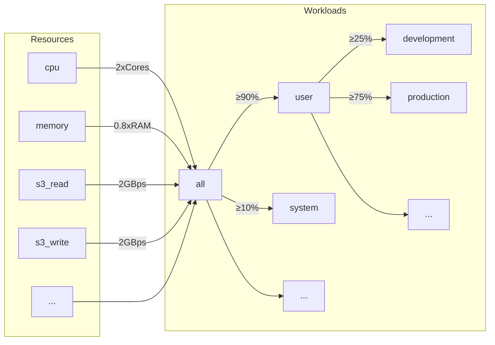
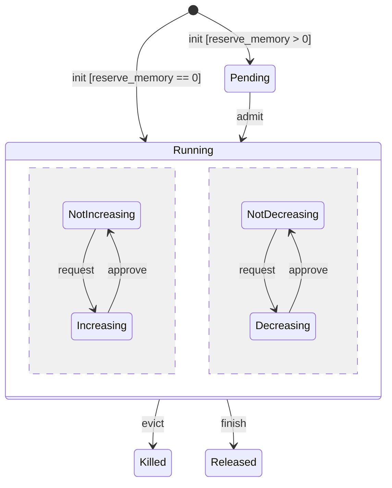
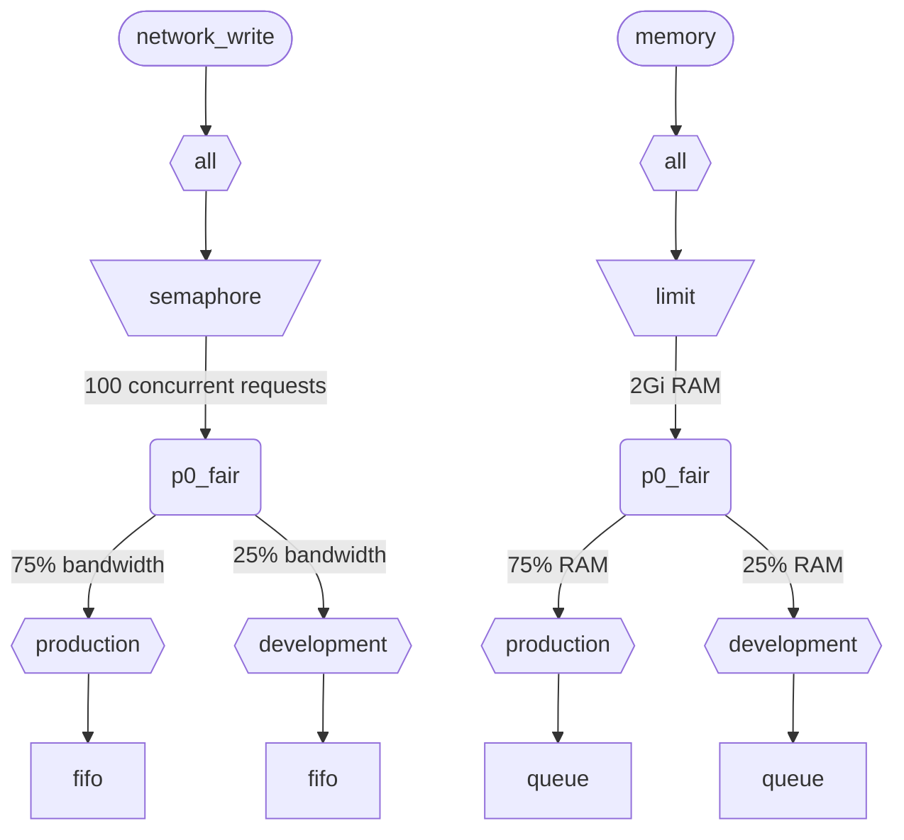

Lorsque ClickHouse exécute plusieurs requêtes simultanément, elles utilisent des ressources partagées (CPU, mémoire et IO). Des contraintes et des politiques d’ordonnancement peuvent être appliquées pour réguler la manière dont les ressources sont utilisées et partagées entre différentes charges de travail. Pour l’ensemble des ressources, il est possible de configurer une hiérarchie d’ordonnancement commune. La racine de cette hiérarchie représente les ressources partagées, tandis que les feuilles correspondent à des charges de travail spécifiques et contiennent les demandes de ressources et les allocations des requêtes concernées ainsi que des activités d’arrière-plan.

<div id="resources">
  ## Ressources
</div>

Par défaut, l’ordonnancement des workloads est désactivé. Pour l’activer, vous devez créer des ressources qui seront utilisées pour l’ordonnancement, ainsi qu’au moins un workload. Toutes les ressources sont indépendantes et peuvent être utilisées dans n’importe quelle combinaison.

Pour activer l’ordonnancement CPU, vous devez créer une ressource CPU pour les threads MASTER ou WORKER (voir [CPU scheduling](#cpu_scheduling) pour plus de détails) :

```sql
CREATE RESOURCE cpu (MASTER THREAD, WORKER THREAD)
```

Pour activer la réservation de mémoire pour les workloads, vous devez créer une ressource MEMORY (voir [Memory reservations](#memory-reservations) pour plus de détails) :

```sql
CREATE RESOURCE memory (MEMORY RESERVATION)
```

Pour activer la planification des slots de requête, vous devez créer la ressource QUERY (voir [Planification des slots de requête](#query_scheduling) pour en savoir plus) :

```sql
CREATE RESOURCE query (QUERY)
```

Pour activer l’ordonnancement des E/S pour un disque spécifique, vous devez créer des ressources de lecture et d’écriture pour les accès WRITE et READ :

```sql
CREATE RESOURCE resource_name (WRITE DISK disk_name, READ DISK disk_name)
-- or
CREATE RESOURCE read_resource_name (WRITE DISK write_disk_name)
CREATE RESOURCE write_resource_name (READ DISK read_disk_name)
```

Une ressource peut être utilisée avec n’importe quel nombre de disques, pour READ, WRITE ou les deux. Une syntaxe permet d’utiliser une ressource pour tous les disques :

```sql
CREATE RESOURCE all_io (READ ANY DISK, WRITE ANY DISK);
```

Les ressources sont classées par mode de partage :

* **Ressources à partage temporel** (CPU, IO, slots de requête) - gèrent les demandes de ressources placées en file d’attente dans les nœuds feuilles de la hiérarchie d’ordonnancement. Les demandes sont ordonnancées selon les politiques et les contraintes définies par la hiérarchie. Les demandes de ressources sont créées lorsqu’une requête accède à la ressource correspondante. Par exemple, lorsqu’une requête lit des données sur le disk ou utilise le CPU pour le traitement, des demandes de ressources sont créées pour chaque quantum de travail effectué, ou selon le nombre d’octets envoyés ou reçus via un socket.
* **Ressources à partage spatial** (mémoire) - gèrent les allocations de ressources dans les nœuds feuilles de la hiérarchie d’ordonnancement. Les allocations peuvent être actives ou en attente. Les allocations en attente sont bloquées jusqu’à ce que suffisamment d’espace soit libéré ou qu’une autre allocation soit évincée (arrêtée). Les décisions reposent sur les limites et les politiques définies par la hiérarchie. Il existe une correspondance directe entre les allocations et les requêtes (ou les activités en arrière-plan). Une allocation est créée lorsqu’une requête commence à s’exécuter et est libérée lorsqu’elle se termine. Les allocations actives peuvent augmenter ou diminuer leur taille dynamiquement.

<div id="workloads">
  ## Hiérarchie des workloads
</div>

ClickHouse fournit une syntaxe SQL pratique pour définir la hiérarchie d’ordonnancement. Toutes les ressources sont réparties au sein d’une hiérarchie WORKLOAD commune. Les règles de répartition peuvent être modifiées sur certains points pour des ressources particulières, mais la hiérarchie reste la même. Chaque WORKLOAD maintient les nœuds d’ordonnancement nécessaires pour chaque ressource. Un workload enfant peut être créé dans n’importe quel workload afin de construire la hiérarchie. ClickHouse n’impose aucune structure spécifique ou prédéfinie pour la hiérarchie des workloads.

Voici un exemple de hiérarchie qui répartit toutes les ressources entre les workloads &quot;user&quot; et &quot;system&quot;, avec une garantie respective de 90 % et 10 %. Notez que les poids définis pour les workloads sont utilisés pour la max-min fairness et ne fournissent donc qu’une garantie minimale en mode best effort (et non une limite ou un quota maximal). Tout l’ordonnancement est effectué indépendamment sur chaque hôte ; les limites définies par les paramètres `max_*` s’appliquent donc par hôte. Le workload &quot;user&quot; subdivise ses ressources entre les workloads &quot;development&quot; et &quot;production&quot;, &quot;production&quot; disposant de 3 fois plus de ressources que &quot;development&quot; :

```sql
CREATE RESOURCE cpu (MASTER THREAD, WORKER THREAD)
CREATE RESOURCE memory (MEMORY RESERVATION)
CREATE RESOURCE s3_read (READ DISK s3)
CREATE RESOURCE s3_write (WRITE DISK s3)
CREATE WORKLOAD all SETTINGS max_concurrent_threads_ratio_to_cores = 2, max_memory_ratio = 0.8, max_bytes_per_second = '2Gi'
CREATE WORKLOAD user IN all SETTINGS weight = 9
CREATE WORKLOAD system IN all
CREATE WORKLOAD development IN user
CREATE WORKLOAD production IN user SETTINGS weight = 3
```



Le nom d’un workload terminal sans enfants peut être utilisé dans les paramètres de requête `SETTINGS workload = 'name'`. Voir [Marquage des workloads](#workload-markup) pour plus de détails.

Pour personnaliser un workload, les paramètres suivants peuvent être utilisés :

* `priority` - (partage temporel uniquement) les workloads frères sont traités selon des valeurs statiques (une valeur plus faible signifie une priorité plus élevée). Détermine la préemption.
* `precedence` - (partage spatial uniquement) les workloads frères sont admis selon des valeurs statiques (une valeur plus faible signifie une préséance plus élevée). Détermine l’éviction et l’admission.
* `weight` - les workloads frères ayant la même priorité ou préséance statique se partagent les ressources de manière équitable en fonction de leurs poids. Affecte la préemption, l’éviction et l’admission.
* `max_io_requests` - la limite du nombre de requêtes IO simultanées dans ce workload.
* `max_bytes_inflight` - la limite du nombre total d’octets en cours de traitement pour les requêtes simultanées dans ce workload.
* `max_bytes_per_second` - la limite du débit en octets en lecture ou en écriture de ce workload.
* `max_burst_bytes` - le nombre maximal d’octets pouvant être traités par le workload sans être limité (pour chaque ressource indépendamment).
* `max_concurrent_threads` - la limite du nombre de threads pour les requêtes dans ce workload.
* `max_concurrent_threads_ratio_to_cores` - identique à `max_concurrent_threads`, mais normalisé au nombre de CPU cores disponibles.
* `max_cpus` - la limite du nombre de CPU cores alloués au traitement des requêtes dans ce workload.
* `max_cpu_share` - identique à `max_cpus`, mais normalisé au nombre de CPU cores disponibles.
* `max_burst_cpu_seconds` - le nombre maximal de secondes CPU pouvant être consommées par le workload sans être limité en raison de `max_cpus`.
* `max_memory` - la limite de la mémoire totale réservée à ce workload.

Toutes les limites spécifiées via les workload settings sont indépendantes pour chaque ressource. Par exemple, un workload avec `max_bytes_per_second = '10Mi'` aura une limite de débit de 10 MB/s pour chaque ressource de lecture et d’écriture, indépendamment. Si une limite commune pour la lecture et l’écriture est nécessaire, envisagez d’utiliser la même ressource pour l’accès READ et WRITE.

Il n’existe aucun moyen de spécifier différentes hiérarchies de workloads pour différentes ressources. Mais il est possible de spécifier une valeur de workload setting différente pour une ressource spécifique :

```sql
CREATE OR REPLACE WORKLOAD all SETTINGS max_io_requests = 100, max_bytes_per_second = '1Mi' FOR network_read, max_bytes_per_second = '2Mi' FOR network_write
```

Notez également qu’un workload ou une ressource ne peut pas être supprimé tant que cet élément est référencé par un autre workload. Pour mettre à jour la définition d’un workload, utilisez la requête `CREATE OR REPLACE WORKLOAD`.

:::note
Les paramètres de workload sont convertis en un ensemble approprié de nœuds d’ordonnancement. Pour plus de détails, consultez la description des [types et options](#hierarchy) des nœuds d’ordonnancement.
:::

<div id="workload-markup">
  ## Marquage des workloads
</div>

Les requêtes peuvent être marquées à l&#39;aide du paramètre `workload` afin de distinguer différents workloads. Si `workload` n&#39;est pas défini, la valeur &quot;default&quot; est utilisée. Notez que vous pouvez spécifier une autre valeur à l&#39;aide de profiles de paramètres. Des contraintes de paramètres peuvent être utilisées pour rendre `workload` constant si vous souhaitez que toutes les requêtes de l&#39;utilisateur soient marquées avec une valeur fixe du paramètre `workload`.

:::warning
Le paramètre de requête `workload` ne peut faire référence qu&#39;à des workloads feuille (c.-à-d. des workloads sans enfants).
:::

```sql
SELECT count() FROM my_table WHERE value = 42 SETTINGS workload = 'production'
SELECT count() FROM my_table WHERE value = 13 SETTINGS workload = 'development'
```

Il est possible d’attribuer un paramètre `workload` aux activités d’arrière-plan. Les fusions et les mutations utilisent respectivement les paramètres du serveur `merge_workload` et `mutation_workload`. Ces valeurs peuvent également être surchargées pour des tables spécifiques à l’aide des paramètres MergeTree `merge_workload` et `mutation_workload`.

<div id="cpu_scheduling">
  ## Ordonnancement CPU
</div>

Pour activer l’ordonnancement CPU pour les workloads, créez une ressource CPU et définissez une limite pour le nombre de threads concurrents :

```sql
CREATE RESOURCE cpu (MASTER THREAD, WORKER THREAD)
CREATE WORKLOAD all SETTINGS max_concurrent_threads = 100
```

Lorsque le ClickHouse server exécute de nombreuses requêtes concurrentes avec [plusieurs threads](/fr/operations/settings/settings.md#max_threads) et que tous les slots CPU sont utilisés, l’état de surcharge est atteint. Dans cet état, chaque slot CPU libéré est réattribué à la charge de travail appropriée conformément aux politiques d’ordonnancement. Pour les requêtes qui partagent la même charge de travail, les slots sont alloués selon un mécanisme de round-robin. Pour les requêtes appartenant à des charges de travail distinctes, les slots sont alloués en fonction des poids, des priorités et des limites spécifiés pour ces charges de travail.

Le temps CPU est consommé par les threads lorsqu’ils ne sont pas bloqués et exécutent des tâches gourmandes en CPU. À des fins d’ordonnancement, on distingue deux types de threads :

* Master thread — le premier thread qui commence à travailler sur une requête ou une activité en arrière-plan, comme une fusion ou une mutation.
* Worker thread — les threads supplémentaires que le master peut créer pour exécuter des tâches gourmandes en CPU.

Il peut être souhaitable d’utiliser des ressources distinctes pour les master threads et les worker threads afin d’améliorer la réactivité. Un grand nombre de worker threads peut facilement monopoliser les ressources CPU lorsque des valeurs élevées du paramètre de requête `max_threads` sont utilisées. Les requêtes entrantes doivent alors se bloquer et attendre un slot CPU afin que leurs master threads puissent commencer l’exécution. Pour éviter cela, la configuration suivante peut être utilisée :

```sql
CREATE RESOURCE worker_cpu (WORKER THREAD)
CREATE RESOURCE master_cpu (MASTER THREAD)
CREATE WORKLOAD all SETTINGS max_concurrent_threads = 100 FOR worker_cpu, max_concurrent_threads = 1000 FOR master_cpu
```

Cela créera des limites distinctes pour les threads master et worker. Même si les 100 slots CPU worker sont tous occupés, les nouvelles requêtes ne seront pas bloquées tant que des slots CPU master resteront disponibles. Elles commenceront à s&#39;exécuter avec un seul thread. Plus tard, si des slots CPU worker deviennent disponibles, ces requêtes pourront monter en charge et lancer leurs threads worker. En revanche, une telle approche ne lie pas le nombre total de slots au nombre de processeurs CPU, et l&#39;exécution d&#39;un trop grand nombre de threads concurrents nuira aux performances.

Limiter la concurrence des threads master ne limitera pas le nombre de requêtes concurrentes. Des slots CPU peuvent être libérés au milieu de l&#39;exécution d&#39;une requête, puis réattribués à d&#39;autres threads. Par exemple, 4 requêtes concurrentes avec une limite de 2 threads master concurrents peuvent toutes s&#39;exécuter en parallèle. Dans ce cas, chaque requête recevra 50 % d&#39;un processeur CPU. Une logique distincte doit être utilisée pour limiter le nombre de requêtes concurrentes, et cela n&#39;est actuellement pas pris en charge pour les workloads.

Des limites distinctes de concurrence des threads peuvent être utilisées pour les workloads :

```sql
CREATE RESOURCE cpu (MASTER THREAD, WORKER THREAD)
CREATE WORKLOAD all
CREATE WORKLOAD admin IN all SETTINGS max_concurrent_threads = 10
CREATE WORKLOAD production IN all SETTINGS max_concurrent_threads = 100
CREATE WORKLOAD analytics IN production SETTINGS max_concurrent_threads = 60, weight = 9
CREATE WORKLOAD ingestion IN production
```

Cet exemple de configuration fournit des pools de slots CPU distincts pour Admin et la production. Le pool de production est partagé entre l’analytique et l’ingestion. En outre, si le pool de production est surchargé, 9 slots libérés sur 10 seront réalloués à des requêtes analytiques si nécessaire. Les requêtes d’ingestion ne recevraient alors qu’1 slot sur 10 pendant les périodes de surcharge. Cela peut améliorer la latence des requêtes orientées utilisateur. L’analytique dispose de sa propre limite de 60 threads concurrents, laissant toujours au moins 40 threads pour l’ingestion. En l’absence de surcharge, l’ingestion peut utiliser les 100 threads.

Pour exclure une requête de l’ordonnancement CPU, définissez le paramètre de requête [use&#95;concurrency&#95;control](/fr/operations/settings/settings.md/#use_concurrency_control) sur 0.

L’ordonnancement CPU n’est pas encore pris en charge pour les fusions et les mutations.

Pour assurer une allocation équitable entre les charges de travail, il est nécessaire d’effectuer une préemption et une réduction des ressources pendant l’exécution des requêtes. La préemption est activée avec le paramètre du serveur `cpu_slot_preemption`. S’il est activé, chaque thread renouvelle périodiquement son slot CPU (conformément au paramètre du serveur `cpu_slot_quantum_ns`). Un tel renouvellement peut bloquer l’exécution si le CPU est surchargé. Lorsque l’exécution reste bloquée pendant une durée prolongée (voir le paramètre du serveur `cpu_slot_preemption_timeout_ms`), la requête réduit dynamiquement son niveau de parallélisme et le nombre de threads exécutés simultanément diminue. Notez que l’équité du temps CPU est garantie entre les charges de travail, mais qu’entre les requêtes au sein d’une même charge de travail, elle peut ne pas être respectée dans certains cas limites.

:::warning
L’ordonnancement par slots permet de contrôler la [concurrence des requêtes](/fr/operations/settings/settings.md#max_threads), mais ne garantit pas une allocation équitable du temps CPU à moins que le paramètre du serveur `cpu_slot_preemption` soit défini sur `true` ; sinon, l’équité est assurée sur la base du nombre d’allocations de slots CPU entre les charges de travail en concurrence. Cela n’implique pas une quantité égale de secondes CPU, car sans préemption, un slot CPU peut être conservé indéfiniment. Un thread acquiert un slot au début et le libère lorsque le travail est terminé.
:::

:::note
La déclaration d’une ressource CPU désactive l’effet des paramètres [`concurrent_threads_soft_limit_num`](server-configuration-parameters/settings.md#concurrent_threads_soft_limit_num) et [`concurrent_threads_soft_limit_ratio_to_cores`](server-configuration-parameters/settings.md#concurrent_threads_soft_limit_ratio_to_cores). À la place, le workload setting `max_concurrent_threads` est utilisé pour limiter le nombre de CPU alloués à un workload spécifique. Pour retrouver le comportement précédent, créez uniquement la ressource WORKER THREAD, définissez `max_concurrent_threads` pour le workload `all` sur la même valeur que `concurrent_threads_soft_limit_num`, puis utilisez le paramètre de query `workload = "all"`. Cette configuration correspond au paramètre [`concurrent_threads_scheduler`](server-configuration-parameters/settings.md#concurrent_threads_scheduler) défini avec la valeur &quot;fair&#95;round&#95;robin&quot;.
:::

<div id="threads_vs_cpus">
  ## Threads vs. CPU
</div>

Il existe deux façons de contrôler la consommation de CPU d’une charge de travail :

* Limite du nombre de threads : `max_concurrent_threads` et `max_concurrent_threads_ratio_to_cores`
* Bridage du CPU : `max_cpus`, `max_cpu_share` et `max_burst_cpu_seconds`

:::warning
Les paramètres de bridage du CPU ne sont actifs que si le paramètre de serveur `cpu_slot_preemption` est activé. Dans le cas contraire, ils sont ignorés.
:::

La première méthode permet de contrôler dynamiquement le nombre de threads lancés pour une requête, en fonction de la charge actuelle du serveur. En pratique, elle réduit la valeur imposée par le paramètre de requête `max_threads`. La seconde bride la consommation de CPU de la charge de travail à l’aide de l’algorithme du token bucket. Elle n’affecte pas directement le nombre de threads, mais bride la consommation totale de CPU de tous les threads de la charge de travail.

Le bridage par token bucket avec `max_cpus` et `max_burst_cpu_seconds` signifie ce qui suit. Sur tout intervalle de `delta` secondes, la consommation totale de CPU de toutes les requêtes de la charge de travail ne peut pas dépasser `max_cpus * delta + max_burst_cpu_seconds` secondes CPU. Cela limite la consommation moyenne à `max_cpus` sur le long terme, mais cette limite peut être dépassée à court terme. Par exemple, avec `max_burst_cpu_seconds = 60` et `max_cpus=0.001`, il est possible d’exécuter soit 1 thread pendant 60 secondes, soit 2 threads pendant 30 secondes, soit 60 threads pendant 1 seconde, sans être bridé. La valeur par défaut de `max_burst_cpu_seconds` est de 1 seconde. Des valeurs plus faibles peuvent entraîner une sous-utilisation des cœurs autorisés par `max_cpus` en présence d’un grand nombre de threads concurrents.

Lorsqu’un thread détient un slot CPU, il peut se trouver dans l’un des trois états principaux suivants :

* **Running:** consomme effectivement une ressource CPU. Le temps passé dans cet état est pris en compte par le bridage du CPU.
* **Ready:** attend qu’un CPU devienne disponible. Le temps passé dans cet état n’est pas pris en compte par le bridage du CPU.
* **Blocked:** effectue des opérations d’IO ou d’autres appels système bloquants (par ex. en attente sur un mutex). Le temps passé dans cet état n’est pas pris en compte par le bridage du CPU.

Considérons un exemple de configuration qui combine à la fois le bridage du CPU et les limites du nombre de threads :

```sql
CREATE RESOURCE cpu (MASTER THREAD, WORKER THREAD)
CREATE WORKLOAD all SETTINGS max_concurrent_threads_ratio_to_cores = 2
CREATE WORKLOAD admin IN all SETTINGS max_concurrent_threads = 2, priority = -1
CREATE WORKLOAD production IN all SETTINGS weight = 4
CREATE WORKLOAD analytics IN production SETTINGS max_cpu_share = 0.7, weight = 3
CREATE WORKLOAD ingestion IN production
CREATE WORKLOAD development IN all SETTINGS max_cpu_share = 0.3
```

Ici, nous limitons le nombre total de threads pour toutes les requêtes à 2x le nombre de CPU disponibles. La charge de travail Admin est limitée à deux threads maximum, quel que soit le nombre de CPU disponibles. Admin a une priorité de -1 (inférieure à `default`, qui vaut 0) et obtient en priorité tout slot CPU si nécessaire. Lorsque l’admin n’exécute pas de requêtes, les ressources CPU sont réparties entre les charges de travail production et development. Les parts garanties de temps CPU sont basées sur des poids (4 pour 1) : au moins 80 % vont à la production (si nécessaire), et au moins 20 % à development (si nécessaire). Alors que les poids constituent des garanties, le throttling CPU définit des limites : la production n’est pas limitée et peut consommer 100 %, tandis que development a une limite de 30 %, qui s’applique même en l’absence de requêtes provenant d’autres charges de travail. La charge de travail production n’est pas un nœud terminal ; ses ressources sont donc réparties entre analytics et l’ingestion selon des poids (3 pour 1). Cela signifie qu’analytics bénéficie d’une garantie d’au moins 0.8 * 0.75 = 60 % et, d’après `max_cpu_share`, d’une limite de 70 % des ressources CPU totales. Quant à l’ingestion, si elle conserve une garantie d’au moins 0.8 * 0.25 = 20 %, elle n’a pas de limite supérieure.

:::note
Si vous souhaitez maximiser l’utilisation du CPU sur votre ClickHouse server, évitez d’utiliser `max_cpus` et `max_cpu_share` pour la charge de travail racine `all`. À la place, définissez une valeur plus élevée pour `max_concurrent_threads`. Par exemple, sur un système avec 8 CPU, définissez `max_concurrent_threads = 16`. Cela permet à 8 threads d’exécuter des tâches CPU tandis que 8 autres threads peuvent gérer des opérations d’E/S. Des threads supplémentaires créeront une pression sur le CPU, ce qui garantit l’application des règles d’ordonnancement. En revanche, définir `max_cpus = 8` ne créera jamais de pression sur le CPU, car le server ne peut pas dépasser les 8 CPU disponibles.
:::

<div id="memory-reservations">
  ## Réservations de mémoire
</div>

:::note
L’ordonnancement des réservations de mémoire est expérimental. Il ne prend effet que lorsqu’une ressource `MEMORY RESERVATION` existe, et son interface SQL ainsi que son comportement peuvent changer dans les versions ultérieures. Il n’est pas encore pris en charge pour les merges et les mutations, et l’éviction d’une query en cours se fait au mieux : elle prend effet au prochain point de synchronisation mémoire de la query, et non instantanément.
:::

Pour activer les réservations de mémoire pour les workloads, créez une ressource MEMORY RESERVATION et définissez, à l’aide des paramètres de workload, au moins une limite sur la mémoire totale réservée :

```sql
CREATE RESOURCE memory (MEMORY RESERVATION)
CREATE WORKLOAD all SETTINGS max_memory = '2Gi'
```

ClickHouse suit les allocations mémoire de toutes les requêtes et activités en arrière-plan. Le nombre d’octets alloués est agrégé dans toute la hiérarchie d’ordonnancement jusqu’à la racine. Chaque requête a une allocation associée dans le workload feuille auquel elle appartient. Si une requête a le paramètre `reserve_memory` supérieur à zéro, l’allocation est alors créée dans un état d’attente. Une allocation en attente réserve la quantité de mémoire demandée dans la hiérarchie des workloads. S’il n’y a pas assez de mémoire disponible, l’allocation reste en attente jusqu’à ce qu’une quantité suffisante de mémoire soit libérée ou que d’autres allocations soient évincées (arrêtées). Lorsqu’une allocation est admise, elle passe à l’état d’exécution. Une allocation en cours d’exécution peut augmenter ou diminuer dynamiquement sa taille en fonction de la consommation mémoire de la requête. Le cycle de vie d’une allocation peut être représenté par le diagramme d’état suivant :



Les allocations en attente d’un workload feuille sont admises selon l’ordre FIFO. Lorsque plusieurs workloads ont des allocations en attente, elles sont admises selon les paramètres de préséance et de poids. Les workloads de préséance plus élevée sont servis en premier. Les workloads frères ayant la même préséance se partagent la mémoire selon les poids de manière équitable max-min, ce qui signifie que le workload dont l’utilisation mémoire normalisée est la plus faible (utilisation actuelle plus augmentation demandée, divisées par le poids) est servi en premier. La logique inverse est appliquée lors de l’éviction. Lorsqu’il faut libérer de la mémoire, les workloads ayant la préséance la plus faible et l’utilisation mémoire normalisée la plus élevée sont évincés en premier.

Notez que les ressources time-shared utilisent la priorité, tandis que les ressources space-shared utilisent la préséance. Ce sont des paramètres indépendants qui peuvent être définis sur des valeurs différentes. Une priorité plus élevée implique une préemption non destructive (retard ou throttling), tandis qu’une préséance plus élevée peut impliquer une éviction destructive (arrêt avec une erreur). Un workload peut avoir une priorité élevée pour l’ordonnancement CPU, mais la même préséance pour la réservation de mémoire afin d’éviter d’évincer d’autres workloads et de perdre le travail déjà effectué par ceux-ci.

Chaque workload doté d’une limite `max_memory` garantit que la mémoire totale allouée dans son sous-arbre ne dépasse pas cette limite. Si une allocation en attente ou en augmentation dépasse la limite, une procédure d’éviction est lancée pour libérer de la mémoire. La procédure d’éviction sélectionne une victime à tuer. Le workload ancêtre commun le plus proche du killer et de la victime empêche l’éviction dans les situations suivantes :

* Une allocation en attente ne peut pas évincer des allocations en cours d’exécution dans le même workload. (Les workloads du killer et de la victime coïncident).
* Une allocation en attente de préséance inférieure ne tue jamais un workload de préséance supérieure.
* Une allocation en attente ne peut pas tuer une allocation de même préséance. Notez que des allocations en cours d’exécution de même préséance peuvent s’évincer mutuellement en fonction de l’utilisation mémoire normalisée.
  Si l’éviction est empêchée ou ne libère pas assez de mémoire, la nouvelle allocation est bloquée jusqu’à ce qu’une quantité suffisante de mémoire soit libérée. Ces règles permettent la mise en file d’attente de requêtes excessives en fonction de la pression mémoire et offrent un moyen pratique d’éviter les erreurs MEMORY&#95;LIMIT&#95;EXCEEDED.

:::note
Les limites de workload sont indépendantes des autres moyens de limiter la consommation mémoire, comme le paramètre de requête [max&#95;memory&#95;usage](/fr/operations/settings/settings.md#max_memory_usage). Elles peuvent être utilisées ensemble pour mieux contrôler la consommation mémoire. Il est possible de définir des limites mémoire indépendantes selon les utilisateurs (et non les workloads). Cela est moins flexible et ne fournit pas des fonctionnalités comme la réservation de mémoire et la mise en file d’attente des requêtes en attente. Voir [Memory overcommit](settings/memory-overcommit.md)
:::

Le paramètre de workload `max_waiting_queries` limite le nombre d’allocations en attente pour le workload. Lorsque la limite est atteinte, le serveur renvoie une erreur `SERVER_OVERLOADED`. Notez que `max_waiting_queries` n’est pas hérité par les workloads enfants et n’a de sens que pour les workloads feuilles.

L’ordonnancement de la réservation de mémoire n’est pas encore pris en charge pour les merges et les mutations.

Seules les requêtes dont le paramètre `reserve_memory` est supérieur à zéro peuvent être bloquées dans l&#39;attente d&#39;une réservation de mémoire. Cependant, les requêtes pour lesquelles `reserve_memory` vaut zéro sont également prises en compte dans l&#39;empreinte mémoire de leur workload, et elles peuvent être évincées si nécessaire afin de libérer de la mémoire pour d&#39;autres allocations en attente ou en augmentation. Les requêtes sans marquage de workload approprié ne sont pas soumises à l&#39;ordonnancement de la réservation de mémoire et ne peuvent pas être évincées par l&#39;ordonnanceur.

Pour fournir une réservation de mémoire non élastique à une requête, définissez les paramètres de requête `reserve_memory` et `max_memory_usage` sur la même valeur. Dans ce cas, la requête réservera une quantité fixe de mémoire et ne pourra pas augmenter son allocation de manière dynamique. Notez qu&#39;une réservation de mémoire élastique peut être augmentée au-delà de `reserve_memory` jusqu&#39;à `max_memory_usage` sans être interrompue, sauf en cas de pression sur la mémoire. En revanche, elle ne peut pas être réduite en dessous de `reserve_memory`, même lorsque la consommation réelle est inférieure.

Considérons un exemple de configuration :

```sql
CREATE RESOURCE memory (MEMORY RESERVATION)
CREATE WORKLOAD all SETTINGS max_memory = '10Gi'
CREATE WORKLOAD system IN all SETTINGS weight = 1
CREATE WORKLOAD user IN all SETTINGS weight = 9
CREATE WORKLOAD production IN user SETTINGS precedence = 1, weight = 3
CREATE WORKLOAD staging IN user SETTINGS precedence = 1, weight = 1
CREATE WORKLOAD testing IN user SETTINGS precedence = 2
```

Dans cet exemple, la mémoire totale réservée par l&#39;ensemble des requêtes et des activités en arrière-plan ne peut pas dépasser 10 Gio. Le workload système dispose d&#39;une garantie d&#39;au moins 1 Gio (10 % de 10 Gio), tandis que le workload utilisateur dispose d&#39;une garantie d&#39;au moins 9 Gio (90 % de 10 Gio). Au sein du workload utilisateur, les workloads de production et de préproduction se partagent la mémoire selon des pondérations de 3 pour 1, avec une préséance identique de 1. Le workload de test a une préséance de 2, inférieure à celle des workloads de production et de préproduction. Par conséquent, le workload de test ne peut utiliser que la mémoire non utilisée par la production et la préproduction.

En cas de pression mémoire, les allocations du workload de test seront évincées en premier. Ensuite, s&#39;il faut libérer davantage de mémoire, les allocations du workload de préproduction seront évincées avant celles du workload de production si elles dépassent leurs garanties. Notez que les requêtes en attente en production et en préproduction peuvent évincer des allocations actives du workload de test afin de libérer de la mémoire, mais elles ne peuvent pas s&#39;évincer entre elles, car elles ont la même préséance. En cas de pression mémoire, elles attendront dans des files d&#39;attente, ce qui permet au système d&#39;éviter les erreurs MEMORY&#95;LIMIT&#95;EXCEEDED dues à un trop grand nombre de requêtes exécutées simultanément.

Notez que le workload système a une préséance de 0 (par défaut), supérieure à celle des workloads de production, de préproduction et de test, mais qu&#39;il ne s&#39;agit pas de workloads frères. Leur plus proche ancêtre commun est le workload all, dont les deux enfants ont la même préséance. Ainsi, un workload système en attente ne peut en évincer aucun, et inversement. Cela garantit que les activités système ne peuvent pas être facilement évincées.

<div id="query_scheduling">
  ## Planification des slots de requête
</div>

Pour activer la planification des slots de requête pour les charges de travail, créez une ressource QUERY et définissez une limite pour le nombre de requêtes simultanées ou de requêtes par seconde :

```sql
CREATE RESOURCE query (QUERY)
CREATE WORKLOAD all SETTINGS max_concurrent_queries = 100, max_queries_per_second = 10, max_burst_queries = 20
```

Le paramètre de charge de travail `max_concurrent_queries` limite le nombre de requêtes concurrentes pouvant s’exécuter en parallèle pour une charge de travail donnée. Il s’agit de l’équivalent du paramètre de requête [`max_concurrent_queries_for_all_users`](/fr/operations/settings/settings#max_concurrent_queries_for_all_users) et du paramètre de serveur [max&#95;concurrent&#95;queries](/fr/operations/server-configuration-parameters/settings#max_concurrent_queries). Les requêtes d’`async insert` et certaines requêtes spécifiques, comme KILL, ne sont pas prises en compte dans cette limite.

Les paramètres de charge de travail `max_queries_per_second` et `max_burst_queries` limitent le nombre de requêtes pour la charge de travail à l’aide d’un mécanisme de limitation de type token bucket. Cela garantit que, sur tout intervalle de temps `T`, il ne démarrera pas plus de `max_queries_per_second * T + max_burst_queries` nouvelles requêtes.

Le paramètre de charge de travail `max_waiting_queries` limite le nombre de requêtes en attente pour la charge de travail. Lorsque la limite est atteinte, le serveur renvoie une erreur `SERVER_OVERLOADED`. Notez que `max_waiting_queries` n’est pas hérité par les charges de travail enfants et n’a de sens que pour les charges de travail terminales.

:::note
Les requêtes bloquées attendront indéfiniment et n’apparaîtront pas dans `SHOW PROCESSLIST` tant que toutes les contraintes n’auront pas été satisfaites.
:::

<div id="workload_entity_storage">
  ## Stockage des workloads et des ressources
</div>

Les définitions de tous les workloads et de toutes les ressources, sous la forme de requêtes `CREATE WORKLOAD` et `CREATE RESOURCE`, sont stockées de façon persistante, soit sur le disque à l’emplacement `workload_path`, soit dans ZooKeeper à l’emplacement `workload_zookeeper_path`. Le stockage dans ZooKeeper est recommandé pour garantir la cohérence entre les nœuds. À défaut, la clause `ON CLUSTER` peut être utilisée avec le stockage sur disque.

<div id="config_based_workloads">
  ## Charges de travail et ressources définies par configuration
</div>

En plus des définitions basées sur SQL, les charges de travail et les ressources peuvent être prédéfinies dans le fichier de configuration du serveur. Cela est utile dans les environnements cloud, où certaines limitations sont imposées par l’infrastructure, tandis que d’autres peuvent être modifiées par les clients. Les entités définies par configuration ont priorité sur celles définies en SQL et ne peuvent pas être modifiées ni supprimées à l’aide de commandes SQL.

<div id="config_based_workloads_format">
  ### Format de configuration
</div>

```xml
<clickhouse>
    <resources_and_workloads>
        CREATE RESOURCE memory (MEMORY RESERVATION);
        CREATE RESOURCE s3disk_read (READ DISK s3);
        CREATE RESOURCE s3disk_write (WRITE DISK s3);
        CREATE WORKLOAD all SETTINGS max_memory = '2Gi', max_io_requests = 500 FOR s3disk_read, max_io_requests = 1000 FOR s3disk_write, max_bytes_per_second = '1280Mi' FOR s3disk_read, max_bytes_per_second = '3200Mi' FOR s3disk_write;
        CREATE WORKLOAD production IN all SETTINGS weight = 3;
    </resources_and_workloads>
</clickhouse>
```

La configuration utilise la même syntaxe SQL que les instructions `CREATE WORKLOAD` et `CREATE RESOURCE`. Toutes les requêtes doivent être valides.

<div id="config_based_workloads_usage_recommendations">
  ### Recommandations d’utilisation
</div>

Pour les environnements cloud, une configuration type peut inclure :

1. Définir le workload racine et les ressources d’E/S réseau dans la configuration afin de fixer les limites de l’infrastructure
2. Définir `throw_on_unknown_workload` pour faire respecter ces limites
3. Créer un `CREATE WORKLOAD default IN all` afin d’appliquer automatiquement ces limites à toutes les requêtes (puisque la valeur par défaut du paramètre de requête `workload` est &#39;default&#39;)
4. Autoriser les utilisateurs à créer des workloads supplémentaires dans la hiérarchie configurée

Cela garantit que toutes les activités en arrière-plan et les requêtes respectent les limites de l’infrastructure, tout en laissant une certaine flexibilité pour les politiques d’ordonnancement propres aux utilisateurs.

Un autre cas d’usage consiste à définir une configuration différente pour différents nœuds d’un cluster hétérogène.

<div id="strict_resource_access">
  ## Accès strict aux ressources
</div>

Pour obliger toutes les requêtes à respecter les politiques d’ordonnancement des ressources, il existe un paramètre du serveur `throw_on_unknown_workload`. S’il est défini sur `true`, chaque requête doit utiliser un paramètre de requête `workload` valide, faute de quoi l’exception `RESOURCE_ACCESS_DENIED` est levée. S’il est défini sur `false`, une telle requête n’utilise pas l’ordonnanceur de ressources, c’est-à-dire qu’elle bénéficie d’un accès illimité à toute `RESOURCE`. Le paramètre de requête &#39;use&#95;concurrency&#95;control = 0&#39; permet à une requête de contourner l’ordonnanceur CPU et d’obtenir un accès illimité au CPU. Pour imposer l’ordonnancement CPU, créez une contrainte sur le paramètre afin que &#39;use&#95;concurrency&#95;control&#39; conserve une valeur constante en lecture seule.

:::note
Ne définissez pas `throw_on_unknown_workload` sur `true` tant que `CREATE WORKLOAD default` n’a pas été exécuté. Cela pourrait provoquer des problèmes au démarrage du serveur si une requête sans paramètre `workload` explicite est exécutée pendant le démarrage.
:::

<div id="hierarchy">
  ### Hiérarchie des nœuds d’ordonnancement
</div>

Du point de vue du sous-système d’ordonnancement, chaque ressource correspond à une hiérarchie de nœuds d’ordonnancement. ClickHouse crée automatiquement tous les nœuds d’ordonnancement nécessaires à partir des définitions WORKLOAD et RESOURCE. Les nœuds d’ordonnancement sont des détails d’implémentation de bas niveau, accessibles via la table [system.scheduler](/fr/operations/system-tables/scheduler.md).

```sql
CREATE RESOURCE network_write (WRITE DISK s3)
CREATE RESOURCE memory (MEMORY RESERVATION)
CREATE WORKLOAD all SETTINGS max_io_requests = 100, max_memory = '2Gi'
CREATE WORKLOAD development IN all
CREATE WORKLOAD production IN all SETTINGS weight = 3
```



**Types de nœuds à partage temporel :**

* `inflight_limit` (contrainte) - bloque si le nombre de requêtes simultanées en cours dépasse `max_requests`, ou si leur coût total dépasse `max_cost` ; doit avoir un seul enfant.
* `bandwidth_limit` (contrainte) - bloque si le débit actuel dépasse `max_speed` (0 signifie illimité) ou si la rafale dépasse `max_burst` (égal par défaut à `max_speed`) ; doit avoir un seul enfant.
* `fair` (politique) - sélectionne la prochaine requête à traiter dans l’un de ses nœuds enfants selon l’équité max-min ; les nœuds enfants peuvent spécifier `weight` (valeur par défaut : 1).
* `priority` (politique) - sélectionne la prochaine requête à traiter dans l’un de ses nœuds enfants selon des priorités statiques (une valeur plus faible correspond à une priorité plus élevée) ; les nœuds enfants doivent spécifier `priority` (valeur par défaut : 0).
* `fifo` (file d’attente) - feuille de la hiérarchie capable de contenir des requêtes qui dépassent la capacité des ressources.

**Types de nœuds à partage spatial :**

* `limit` - garantit que l’allocation totale de l’enfant ne dépasse jamais une limite, et lance une procédure d’éviction dans un sous-arbre si nécessaire ; doit avoir un seul enfant.
* `fair_allocation` - applique l’éviction selon l’équité max-min ; une allocation en attente n’évince jamais une allocation en cours d’exécution ; les nœuds enfants peuvent spécifier `weight` (valeur par défaut : 1).
* `precedence_allocation` - applique l’éviction selon une préséance statique (une valeur plus faible correspond à une préséance plus élevée) ; une allocation en attente de préséance plus élevée évince les allocations de préséance plus faible ; les nœuds enfants doivent spécifier `precedence` (valeur par défaut : 0).
* `queue` - feuille de la hiérarchie capable de contenir des allocations en cours d’exécution et en attente.

<div id="deprecated-configuration">
  ## Configuration XML obsolète
</div>

Une autre manière d’indiquer quels disques sont utilisés par une ressource consiste à utiliser le `storage_configuration` du serveur :

Pour activer l’ordonnancement des E/S pour un disque donné, vous devez spécifier `read_resource` et/ou `write_resource` dans la configuration du stockage. Cela indique à ClickHouse quelle ressource utiliser pour chaque requête de lecture et d’écriture sur ce disque. Les ressources de lecture et d’écriture peuvent faire référence au même nom de ressource, ce qui est utile pour les SSD locaux ou les HDD. Plusieurs disques différents peuvent également faire référence à la même ressource, ce qui est utile pour les disques distants, par exemple si vous voulez permettre une répartition équitable du débit réseau entre les workloads de &quot;production&quot; et de &quot;développement&quot;.

Exemple :

```xml
<clickhouse>
    <storage_configuration>
        ...
        <disks>
            <s3>
                <type>s3</type>
                <endpoint>https://clickhouse-public-datasets.s3.amazonaws.com/my-bucket/root-path/</endpoint>
                <access_key_id>your_access_key_id</access_key_id>
                <secret_access_key>your_secret_access_key</secret_access_key>
                <read_resource>network_read</read_resource>
                <write_resource>network_write</write_resource>
            </s3>
        </disks>
        <policies>
            <s3_main>
                <volumes>
                    <main>
                        <disk>s3</disk>
                    </main>
                </volumes>
            </s3_main>
        </policies>
    </storage_configuration>
</clickhouse>
```

Notez que les options de configuration du serveur priment sur la méthode SQL de définition des ressources.

L’exemple suivant montre comment définir les hiérarchies d’ordonnancement des E/S représentées dans l’image ci-dessus :

```xml
<clickhouse>
    <resources>
        <network_read>
            <node path="/">
                <type>inflight_limit</type>
                <max_requests>100</max_requests>
            </node>
            <node path="/fair">
                <type>fair</type>
            </node>
            <node path="/fair/prod">
                <type>fifo</type>
                <weight>3</weight>
            </node>
            <node path="/fair/dev">
                <type>fifo</type>
            </node>
        </network_read>
        <network_write>
            <node path="/">
                <type>inflight_limit</type>
                <max_requests>100</max_requests>
            </node>
            <node path="/fair">
                <type>fair</type>
            </node>
            <node path="/fair/prod">
                <type>fifo</type>
                <weight>3</weight>
            </node>
            <node path="/fair/dev">
                <type>fifo</type>
            </node>
        </network_write>
    </resources>
</clickhouse>
```

Pour pouvoir exploiter toute la capacité de la ressource sous-jacente, vous devez utiliser `inflight_limit`. Notez qu&#39;une valeur trop faible de `max_requests` ou de `max_cost` peut empêcher une pleine utilisation des ressources, tandis que des valeurs trop élevées peuvent entraîner des files d&#39;attente vides dans l&#39;ordonnanceur, ce qui peut à son tour conduire à l&#39;ignorance des politiques (iniquité ou non-respect des priorités) dans le sous-arbre. En revanche, si vous voulez protéger les ressources contre une utilisation excessive, vous devez utiliser `bandwidth_limit`. Il limite le débit lorsque la quantité de ressources consommée en `duration` secondes dépasse `max_burst + max_speed * duration` octets. Deux nœuds `bandwidth_limit` sur la même ressource peuvent être utilisés pour limiter le débit de pointe sur de courts intervalles et le débit moyen sur des intervalles plus longs.

<div id="workload-classifiers">
  ### Classificateurs de workload obsolètes
</div>

Les classificateurs de workload servent à définir la correspondance entre le `workload` spécifié par une requête et les files d’attente terminales à utiliser pour des ressources données. Pour l’instant, la classification des workloads est simple : seule une correspondance statique est disponible.

Exemple :

```xml
<clickhouse>
    <workload_classifiers>
        <production>
            <network_read>/fair/prod</network_read>
            <network_write>/fair/prod</network_write>
        </production>
        <development>
            <network_read>/fair/dev</network_read>
            <network_write>/fair/dev</network_write>
        </development>
        <default>
            <network_read>/fair/dev</network_read>
            <network_write>/fair/dev</network_write>
        </default>
    </workload_classifiers>
</clickhouse>
```

<div id="see-also">
  ## Voir aussi
</div>

* [system.scheduler](/fr/operations/system-tables/scheduler.md)
* [system.workloads](/fr/operations/system-tables/workloads.md)
* [system.resources](/fr/operations/system-tables/resources.md)
* [merge&#95;workload](/fr/operations/settings/merge-tree-settings.md#merge_workload) paramètre du moteur MergeTree
* [merge&#95;workload](/fr/operations/server-configuration-parameters/settings.md#merge_workload) paramètre global du serveur
* [mutation&#95;workload](/fr/operations/settings/merge-tree-settings.md#mutation_workload) paramètre du moteur MergeTree
* [mutation&#95;workload](/fr/operations/server-configuration-parameters/settings.md#mutation_workload) paramètre global du serveur
* [workload&#95;path](/fr/operations/server-configuration-parameters/settings.md#workload_path) paramètre global du serveur
* [workload&#95;zookeeper&#95;path](/fr/operations/server-configuration-parameters/settings.md#workload_zookeeper_path) paramètre global du serveur
* [cpu&#95;slot&#95;preemption](/fr/operations/server-configuration-parameters/settings.md#cpu_slot_preemption) paramètre global du serveur
* [cpu&#95;slot&#95;quantum&#95;ns](/fr/operations/server-configuration-parameters/settings.md#cpu_slot_quantum_ns) paramètre global du serveur
* [cpu&#95;slot&#95;preemption&#95;timeout&#95;ms](/fr/operations/server-configuration-parameters/settings.md#cpu_slot_preemption_timeout_ms) paramètre global du serveur