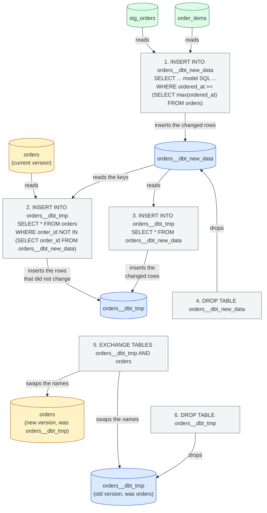
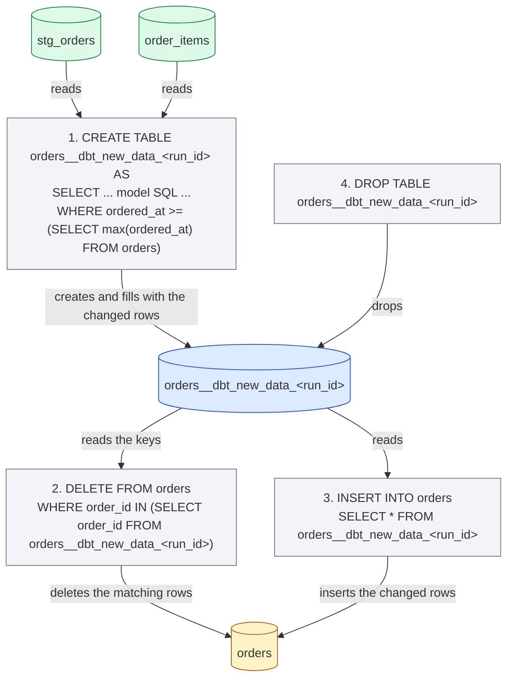
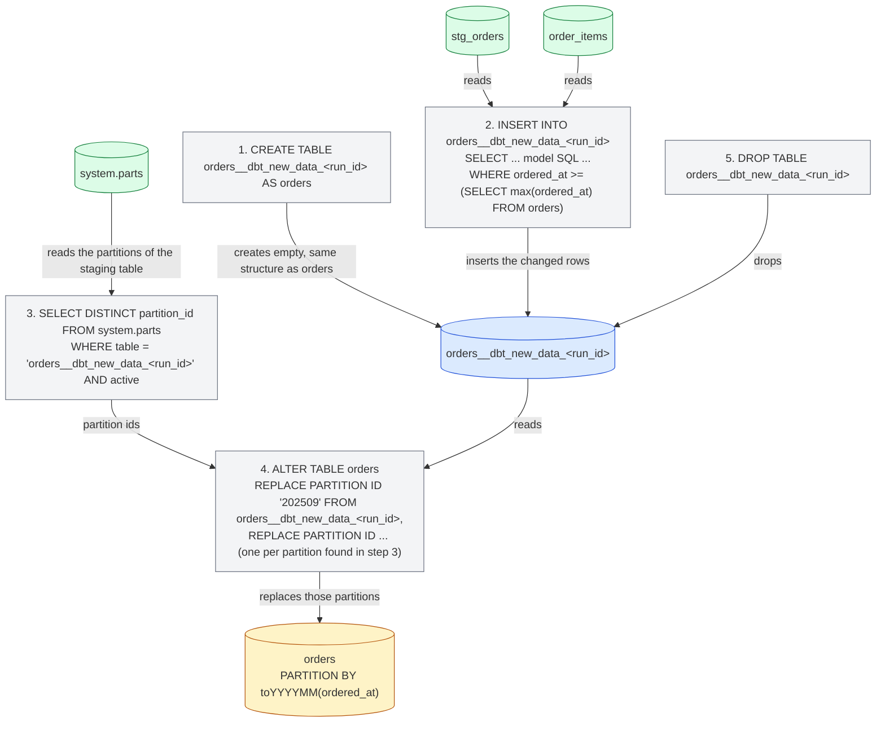

import { ClickHouseSupportedBadge } from "/snippets/fr/components/ClickHouseSupported/ClickHouseSupported.jsx";

<ClickHouseSupportedBadge />

Ce guide présente les aspects spécifiques à ClickHouse de dbt à travers le projet [Jaffle Shop for ClickHouse](https://github.com/ClickHouse/jaffle-shop-clickhouse), le portage ClickHouse du projet d&#39;exemple classique de dbt Labs. En partant d&#39;un projet qui se construit déjà, il montre comment :

1. Comprendre comment les vues et les tables du projet se matérialisent dans ClickHouse.
2. Charger des données avec des seeds et contrôler les types ClickHouse ainsi que la disposition des tables.
3. Configurer un model de type table avec un engine ClickHouse, une sorting key et un partitioning.
4. Transformer une table en model incremental et choisir une incremental strategy.
5. Créer un snapshot.
6. Utiliser les materialized views de ClickHouse.

Il est conçu pour être lu en complément du reste de la [documentation](/fr/integrations/connectors/data-ingestion/etl-tools/dbt/index), de la page [features and configurations](/fr/integrations/connectors/data-ingestion/etl-tools/dbt/features-and-configurations) et de la [référence des materializations](/fr/integrations/connectors/data-ingestion/etl-tools/dbt/materializations).

## Avant de commencer {#before-you-start}

Suivez d&#39;abord le README de [ClickHouse/jaffle-shop-clickhouse](https://github.com/ClickHouse/jaffle-shop-clickhouse). Il explique comment configurer le projet avec dbt Core 1.x, dbt OSS, dbt v2 ou la plateforme dbt, comment le faire pointer vers un ClickHouse local (docker) ou ClickHouse Cloud, comment charger les données d&#39;exemple avec `dbt seed`, et comment lancer le premier `dbt build`. Une fois que `dbt build` s&#39;est exécuté avec succès, revenez ici pour les exemples et configurations spécifiques à ClickHouse.

Après les étapes du README, vous devriez avoir deux bases de données dans ClickHouse :

* `raw` : les six tables sources chargées depuis des CSV files par `dbt seed` (`raw_customers`, `raw_orders`, `raw_items`, `raw_products`, `raw_stores`, `raw_supplies`).
* `jaffle_shop` (le `schema` de votre profile) : six vues de staging (`stg_*`) et sept tables de mart (`customers`, `orders`, `order_items`, `products`, `locations`, `supplies`, `metricflow_time_spine`).

Si votre profile utilise un `schema` différent, remplacez `jaffle_shop` par votre valeur dans les requêtes ci-dessous.

<Note>
  **dbt Core 1.x, dbt OSS, dbt v2 et la plateforme dbt.** Toutes les commandes et tous les modèles de ce guide sont identiques dans tous les cas. Les exemples ont été testés avec dbt Core 1.12 et `dbt-clickhouse` 1.10, ainsi qu&#39;avec dbt OSS 2.0 sur ClickHouse 26.8 ; dbt v2 s&#39;appuie sur le même adapter, et la plateforme dbt s&#39;appuie sur dbt v2. La sortie de console présentée provient de dbt Core 1.x, et les quelques cas où les moteurs se comportent différemment sont signalés. Consultez la [page dbt OSS, dbt v2 et plateforme dbt](/fr/integrations/connectors/data-ingestion/etl-tools/dbt/dbt-core-v2-fusion-and-platform) pour connaître l&#39;état actuel de l&#39;adapter v2, et [Connect ClickHouse](https://docs.getdbt.com/docs/platform/connect-data-platform/connect-clickhouse) dans la documentation dbt pour faire vos premier pas sur la plateforme dbt.
</Note>

Tous les SQL statements qui ne sont pas des commandes dbt sont destinés à être exécutés directement sur ClickHouse, par exemple avec `clickhouse client`, la SQL console de ClickHouse Cloud ou le client SQL de votre choix.

## Comment le projet est matérialisé {#views-and-tables}

Jaffle Shop configure ses materializations dans `dbt_project.yml` : les modèles de staging sont des vues et les marts sont des tables.

```yaml
models:
  jaffle_shop:
    staging:
      +materialized: view
    marts:
      +materialized: table
```

Un model **view** est reconstruit via une instruction `CREATE OR REPLACE VIEW` à chaque exécution. Il ne stocke aucune donnée, sa construction ne coûte donc rien, mais chaque requête portant sur ce model exécute le SQL du model sur les source tables. ClickHouse conserve le SQL compilé du model dans la view definition :

```sql
SHOW CREATE VIEW jaffle_shop.stg_orders;
```

```response
CREATE VIEW jaffle_shop.stg_orders
(
    `order_id` String,
    `location_id` String,
    `customer_id` String,
    ...
    `ordered_at` DateTime
)
AS WITH
    source AS
    (
        SELECT *
        FROM raw.raw_orders
    ),
    renamed AS
    (
        SELECT
            id AS order_id,
            store_id AS location_id,
            ...
            dateTrunc('day', ordered_at) AS ordered_at
        FROM source
    )
SELECT *
FROM renamed
```

Un model **table** est reconstruit de zéro à chaque exécution : l&#39;adapter crée une nouvelle table, exécute un `INSERT INTO ... SELECT` avec le SQL du model, puis l&#39;échange atomiquement avec la version précédente. Les performances des requêtes sont bien meilleures que celles d&#39;une view, au prix du stockage et d&#39;une reconstruction intégrale de la table à chaque fois. Examinez la table que dbt a créée pour le mart `orders` :

```sql
SHOW CREATE TABLE jaffle_shop.orders;
```

```response
CREATE TABLE jaffle_shop.orders
(
    `order_id` String,
    `location_id` String,
    `customer_id` String,
    ...
    `customer_order_number` UInt64
)
ENGINE = MergeTree
ORDER BY tuple()
SETTINGS replicated_deduplication_window = '0', index_granularity = 8192
```

Deux éléments sont ici propres à ClickHouse. Le model ne déclare pas de table engine : l&#39;adapter utilise donc `MergeTree`. Il ne déclare pas non plus de sorting key : l&#39;adapter utilise alors `ORDER BY tuple()`, ce qui signifie que les données ne sont pas triées du tout. Cela convient pour un projet d&#39;exemple, mais pour une table réelle, il vous faudra définir les deux, ce que font les sections suivantes. La [page materializations](/fr/integrations/connectors/data-ingestion/etl-tools/dbt/materializations) répertorie toutes les configurations de table prises en charge par l&#39;adapter.

## Chargement des données avec les seeds {#seeds}

Le projet Jaffle Shop utilise les [seeds](https://docs.getdbt.com/docs/build/seeds) dbt pour charger ses données brutes depuis les fichiers CSV du répertoire `seeds/jaffle-data`. Les seeds sont conçus pour de petits jeux de données de référence statiques (tables de codes, correspondances), et non pour alimenter un warehouse ; le projet y recourt par commodité, afin que vous puissiez démarrer sans outil d&#39;ingestion supplémentaire — d&#39;où le fait que les seeds soient désactivés, sauf si vous passez `--vars '{"load_source_data": true}'`.

Les seeds n&#39;en restent pas moins un bon moyen de comprendre comment dbt crée les tables ClickHouse. dbt infère un type de colonne pour chaque colonne du CSV, et les types inférés diffèrent selon les engines :

| Valeur CSV            | dbt v1     | engine v2       |
| --------------------- | ---------- | --------------- |
| `700`                 | `Int32`    | `Int64`         |
| `0.06`                | `Float32`  | `Float64`       |
| `2024-09-01T15:01:00` | `DateTime` | `DateTime64(6)` |
| `Philadelphia`        | `String`   | `String`        |

Lorsque le type importe, fixez-le avec `column_types`. Le projet le fait déjà pour la colonne `opened_at` du seed `raw_stores` dans `dbt_project.yml` :

```yaml
seeds:
  jaffle_shop:
    +schema: raw
    jaffle-data:
      +enabled: "{{ var('load_source_data', false) }}"
      raw_stores:
        +column_types:
          opened_at: DateTime64(3)
```

Les seeds acceptent également les configurations de table ClickHouse `engine`, `order_by` et `partition_by`. Par exemple, pour trier le seed `raw_orders` par date de commande et le partitionner par mois, ajoutez un fichier de propriétés à côté des fichiers CSV : `seeds/jaffle-data/_raw_orders.yml` :

```yaml
seeds:
  - name: raw_orders
    config:
      order_by: (ordered_at, id)
      partition_by: toYYYYMM(ordered_at)
```

<Note>
  Utilisez un fichier de propriétés pour ces configurations de seed ClickHouse plutôt que les clés `+order_by` ou `+engine` sous `seeds:` dans `dbt_project.yml`. dbt Core 1.x accepte les deux formes, mais dbt v2 ne les reconnaît que dans un fichier de propriétés et rejette les clés de `dbt_project.yml` avec l&#39;erreur `Unrecognized key ... Custom keys must go under +meta`.
</Note>

Rechargez ce seed et examinez la table ainsi produite :

```bash
dbt seed --select raw_orders --full-refresh --vars '{"load_source_data": true}'
```

```sql
SHOW CREATE TABLE raw.raw_orders;
```

```response
CREATE TABLE raw.raw_orders
(
    `id` String,
    `customer` String,
    `ordered_at` DateTime,
    `store_id` String,
    `subtotal` Int32,
    `tax_paid` Int32,
    `order_total` Int32
)
ENGINE = MergeTree
PARTITION BY toYYYYMM(ordered_at)
ORDER BY (ordered_at, id)
SETTINGS index_granularity = 8192
```

`dbt seed --full-refresh` supprime et recrée la table ; exécutez donc cette commande avant de construire quoi que ce soit qui dépende directement des données de cette table, comme la vue matérialisée présentée plus loin dans ce guide.

## Configurer une table pour ClickHouse {#table-configuration}

Le mart `orders` est le point de départ naturel : il est interrogé par le mart `customers` ainsi que par les metrics du projet, et il s&#39;agit d&#39;une table de type événementiel dotée d&#39;un timestamp. Ajoutez un bloc `config` en haut de `models/marts/orders.sql` pour choisir l&#39;engine, la sorting key et un schéma de partitioning :

```sql
{{
    config(
        materialized='table',
        engine='MergeTree()',
        order_by='(ordered_at, order_id)',
        partition_by='toYYYYMM(ordered_at)'
    )
}}

with

orders as (

    select * from {{ ref('stg_orders') }}

),
...
```

Le reste du model reste inchangé. `materialized='table'` reprend ce que `dbt_project.yml` définit déjà pour les marts, ce qui rend le model self-describing lorsque vous le basculerez plus tard en incremental. Reconstruisez uniquement ce model :

```bash
dbt run --select orders
```

```response
1 of 1 START sql table model `jaffle_shop`.`orders` ............................ [RUN]
1 of 1 OK created sql table model `jaffle_shop`.`orders` ....................... [OK in 0.44s]
```

La table possède désormais une sorting key appropriée et une partition par mois :

```sql
SHOW CREATE TABLE jaffle_shop.orders;
```

```response
CREATE TABLE jaffle_shop.orders
(
    ...
)
ENGINE = MergeTree
PARTITION BY toYYYYMM(ordered_at)
ORDER BY (ordered_at, order_id)
SETTINGS replicated_deduplication_window = '0', index_granularity = 8192
```

```sql
SELECT partition, sum(rows) AS rows
FROM system.parts
WHERE database = 'jaffle_shop' AND table = 'orders' AND active
GROUP BY partition
ORDER BY partition;
```

```response
┌─partition─┬─rows─┐
│ 202409    │ 1497 │
│ 202410    │ 1698 │
│ 202411    │ 2262 │
...
│ 202508    │ 9389 │
└───────────┴──────┘
```

Outre `engine`, `order_by` et `partition_by`, les modèles de table acceptent `primary_key`, `ttl`, `settings`, `query_settings`, `projections` et `indexes`, et les colonnes peuvent se voir attribuer `codec` et `ttl` via un contrat de modèle. Tous ces éléments sont décrits sur la [page des matérialisations](/fr/integrations/connectors/data-ingestion/etl-tools/dbt/materializations).

## Créer un modèle incrémental {#incremental}

Reconstruire `orders` intégralement à chaque exécution ne pose pas de problème pour 62 000 lignes, mais devient inadapté pour une table qui grossit de plusieurs millions de lignes par jour. La [materialization incrémentale](https://docs.getdbt.com/docs/build/incremental-models) de dbt ne traite que les lignes modifiées depuis la dernière exécution. Convertir le modèle `orders` nécessite deux ajouts :

1. **`unique_key`** : la colonne qui identifie une ligne, ici `order_id`. L&#39;adapter s&#39;en sert pour remplacer les lignes traitées à nouveau au lieu de les dupliquer.
2. **Un filtre incrémental** : une clause `where` encadrée par `` qui sélectionne uniquement les lignes à traiter. Elle s&#39;applique lors des exécutions incrémentales, mais pas lors de la première construction de la table (ni lors d&#39;une reconstruction avec `--full-refresh`). Les commandes portent un timestamp, si bien que le filtre compare `ordered_at` à la valeur la plus récente déjà présente dans la table, référencée via la variable `{{ this }}`.

Modifiez `models/marts/orders.sql` afin que le bloc `config` et la fin du modèle ressemblent à ceci :

```sql
{{
    config(
        materialized='incremental',
        unique_key='order_id',
        engine='MergeTree()',
        order_by='(ordered_at, order_id)',
        partition_by='toYYYYMM(ordered_at)'
    )
}}

with

orders as (

    select * from {{ ref('stg_orders') }}

),

...

select * from customer_order_count



-- this filter will only be applied on an incremental run
where ordered_at >= (select max(ordered_at) from {{ this }})


```

`stg_orders` tronque `ordered_at` au jour, le filter utilise donc `>=` : à chaque exécution, la journée la plus récente est intégralement retraitée et, grâce à `unique_key`, les rows déjà chargées sont replaced plutôt que dupliquées. C&#39;est ce qui rend l&#39;opération sûre pour les commandes qui arrivent plus tard dans la même journée.

Exécutez le model. La table existe déjà : cette première exécution est donc déjà une exécution incremental, seule la journée la plus récente est retraitée.

```bash
dbt run --select orders
```

```response
1 of 1 START sql incremental model `jaffle_shop`.`orders` ...................... [RUN]
1 of 1 OK created sql incremental model `jaffle_shop`.`orders` ................. [OK in 0.94s]
```

Ajoutons maintenant de nouvelles données. Les données de Jaffle Shop s&#39;arrêtent en août 2025 ; nous ajoutons donc un nouveau client, Clicky McClickHouse, qui a commandé un jaffle hier. Insérez un client, une commande et sa ligne de commande dans les tables brutes :

```sql
INSERT INTO raw.raw_customers VALUES ('clicky-0001', 'Clicky McClickHouse');

INSERT INTO raw.raw_orders VALUES
    ('clicky-order-0001', 'clicky-0001', now() - INTERVAL 1 DAY,
     '4b6c2304-2b9e-41e4-942a-cf11a1819378', 1100, 66, 1166);

INSERT INTO raw.raw_items VALUES ('clicky-item-0001', 'clicky-order-0001', 'JAF-001');
```

L&#39;identifiant du magasin correspond à Philadelphie, l&#39;article est un jaffle `nutellaphone who dis?` à 11,00 et la taxe correspond aux 6 % de Philadelphie : les tests de données du projet continuent donc de passer. Exécutez l&#39;ensemble du projet afin que les vues de staging et la table `order_items` voient les nouvelles rows avant `orders` :

```bash
dbt run
```

```response
...
10 of 13 OK created sql table model `jaffle_shop`.`order_items` ................ [OK in 0.30s]
...
12 of 13 START sql incremental model `jaffle_shop`.`orders` .................... [RUN]
12 of 13 OK created sql incremental model `jaffle_shop`.`orders` ............... [OK in 0.73s]
13 of 13 START sql table model `jaffle_shop`.`customers` ....................... [RUN]
13 of 13 OK created sql table model `jaffle_shop`.`customers` .................. [OK in 0.28s]
```

La nouvelle commande figure dans la table incremental et le mart `customers`, reconstruit à partir de celle-ci, connaît le nouveau client :

```sql
SELECT order_id, customer_id, ordered_at, order_total, customer_order_number
FROM jaffle_shop.orders
WHERE customer_id = 'clicky-0001';
```

```response
┌─order_id──────────┬─customer_id─┬──────────ordered_at─┬─order_total─┬─customer_order_number─┐
│ clicky-order-0001 │ clicky-0001 │ 2026-09-14 00:00:00 │       11.66 │                     1 │
└───────────────────┴─────────────┴─────────────────────┴─────────────┴───────────────────────┘
```

```sql
SELECT customer_name, count_lifetime_orders, lifetime_spend, customer_type
FROM jaffle_shop.customers
WHERE customer_id = 'clicky-0001';
```

```response
┌─customer_name───────┬─count_lifetime_orders─┬─lifetime_spend─┬─customer_type─┐
│ Clicky McClickHouse │                     1 │          11.66 │ new           │
└─────────────────────┴───────────────────────┴────────────────┴───────────────┘
```

### Internals {#internals}

Le query log de ClickHouse montre les statements exécutés par l&#39;adapter pour la mise à jour incrémentale :

```sql
SELECT event_time, written_rows, tables
FROM system.query_log
WHERE query_kind = 'Insert' AND type = 'QueryFinish'
  AND has(databases, 'jaffle_shop')
  AND event_time > now() - INTERVAL 15 MINUTE
ORDER BY event_time;
```

La stratégie incrémentale par défaut de l&#39;adapter fonctionne comme suit. Dans les schémas de cette section, une flèche allant d&#39;une table vers un statement signifie que le statement lit cette table ; une flèche allant d&#39;un statement vers une table signifie qu&#39;il y écrit, la mute, la renomme ou la supprime :

1. Une table `orders__dbt_new_data` est créée et le SQL du model, y compris le filter incrémental, y est inséré. Lors de l&#39;exécution ci-dessus, 378 rows ont été écrites : les 377 commandes du dernier jour déjà chargées, plus la nouvelle.
2. Une table `orders__dbt_tmp` est créée avec la même structure que `orders`, puis toutes les rows de `orders` dont l&#39;`order_id` n&#39;est pas présent dans `orders__dbt_new_data` y sont copiées.
3. Toutes les rows de `orders__dbt_new_data` sont insérées dans `orders__dbt_tmp`. Ce sont les étapes 2 et 3 qui remplacent les rows du dernier jour au lieu de les dupliquer.
4. `orders__dbt_new_data` est supprimée.
5. `orders__dbt_tmp` est échangée avec `orders` au moyen d&#39;un statement atomic `EXCHANGE TABLES` (via un renommage intermédiaire en `orders__dbt_backup`), de sorte que `orders` contient désormais la nouvelle version.
6. L&#39;ancienne version est supprimée.



L&#39;étape 2 copie la table entière : cette stratégie est donc aussi coûteuse qu&#39;une reconstruction complète de la table sur des modèles très volumineux ; voir les [limitations](/fr/integrations/connectors/data-ingestion/etl-tools/dbt/index#limitations). Les stratégies ci-dessous évitent cette copie.

### Append strategy {#append-strategy}

La stratégie `append` insère les rows sélectionnées par le model directement dans la target table. Aucune temporary table n&#39;est créée et rien n&#39;est copié : c&#39;est donc l&#39;exécution incremental la moins coûteuse possible. En contrepartie, rien n&#39;est dédupliqué : si le filter incremental sélectionne une row déjà présente dans la table, celle-ci se retrouve en double. Réservez cette stratégie à des données immuables, de type événement, et veillez à ce que le filter ne sélectionne que des rows réellement nouvelles.

Avec `ordered_at` tronqué au jour, cela revient à remplacer le filter par `>`. Modifiez le model :

```sql
{{
    config(
        materialized='incremental',
        incremental_strategy='append',
        unique_key='order_id',
        engine='MergeTree()',
        order_by='(ordered_at, order_id)',
        partition_by='toYYYYMM(ordered_at)'
    )
}}

...



-- this filter will only be applied on an incremental run
where ordered_at > (select max(ordered_at) from {{ this }})


```

Ajoutez un deuxième nouveau client, Danny DeBito, avec une commande passée aujourd&#39;hui à Brooklyn (4 % de taxe) contenant un jaffle et un café :

```sql
INSERT INTO raw.raw_customers VALUES ('danny-0001', 'Danny DeBito');

INSERT INTO raw.raw_orders VALUES
    ('danny-order-0001', 'danny-0001', now(),
     '40e6ddd6-b8f6-4e17-8bd6-5e53966809d2', 1900, 76, 1976);

INSERT INTO raw.raw_items VALUES
    ('danny-item-0001', 'danny-order-0001', 'JAF-003'),
    ('danny-item-0002', 'danny-order-0001', 'BEV-004');
```

```bash
dbt run
```

```response
...
12 of 13 START sql incremental model `jaffle_shop`.`orders` .................... [RUN]
12 of 13 OK created sql incremental model `jaffle_shop`.`orders` ............... [OK in 0.11s]
...
```

Le modèle incremental s&#39;est exécuté en une fraction du temps de l&#39;exécution précédente. Les deux nouveaux clients ont exactement une commande dans la table :

```sql
SELECT order_id, customer_id, ordered_at, order_total, is_food_order, is_drink_order
FROM jaffle_shop.orders
WHERE customer_id IN ('clicky-0001', 'danny-0001')
ORDER BY ordered_at;
```

```response
┌─order_id──────────┬─customer_id─┬──────────ordered_at─┬─order_total─┬─is_food_order─┬─is_drink_order─┐
│ clicky-order-0001 │ clicky-0001 │ 2026-09-14 00:00:00 │       11.66 │             1 │              0 │
│ danny-order-0001  │ danny-0001  │ 2026-09-15 00:00:00 │       19.76 │             1 │              1 │
└───────────────────┴─────────────┴─────────────────────┴─────────────┴───────────────┴────────────────┘
```

Le query log confirme la différence : cette fois, le seul statement portant sur `orders` est un unique `INSERT INTO jaffle_shop.orders ... SELECT ...` contenant le SQL du model et le filter incrémental, et il a écrit une seule row.

<Warning>
  Avec `>` et un timestamp tronqué au jour, une commande qui arrive plus tard dans la même journée que la dernière commande chargée ne sera jamais prise en compte. Dans un projet réel, filtrez sur un timestamp en pleine précision, ou sur un temps d&#39;ingestion croissant de façon monotone, lorsque vous utilisez la strategy `append`.
</Warning>

### Stratégie delete et insert {#delete-insert-strategy}

Historiquement, ClickHouse n&#39;a offert qu&#39;une prise en charge limitée des mises à jour et des suppressions, sous la forme de [mutations](/fr/reference/statements/alter/index) asynchrones. Celles-ci peuvent s&#39;avérer extrêmement coûteuses en IO et sont généralement à éviter. ClickHouse 22.8 a introduit les [suppressions légères](/fr/reference/statements/delete) et ClickHouse 25.7 les [mises à jour légères](/fr/reference/statements/update). Avec elles, l&#39;effet d&#39;une instruction de suppression ou de mise à jour est immédiatement visible du point de vue de l&#39;utilisateur, même si elle est matérialisée de manière asynchrone.

La stratégie `delete+insert` repose sur les suppressions légères et se configure via le paramètre `incremental_strategy` :

```sql
{{
    config(
        materialized='incremental',
        incremental_strategy='delete+insert',
        unique_key='order_id',
        engine='MergeTree()',
        order_by='(ordered_at, order_id)',
        partition_by='toYYYYMM(ordered_at)'
    )
}}
```

Cette stratégie opère directement sur la target table : si une étape échoue à mi-parcours, les données du modèle incremental risquent de se retrouver dans un état invalid, car il n&#39;y a pas de swap atomic. En résumé :

1. Une temporary table (`orders__dbt_new_data_<run_id>`) est créée, et les rows sélectionnées par le model y sont insérées.
2. Un `DELETE` est exécuté sur `orders` pour chaque `order_id` présent dans la temporary table.
3. Les rows de la temporary table sont insérées dans `orders`.
4. La temporary table est supprimée.



### Stratégie insert overwrite (expérimentale) {#insert-overwrite-strategy}

La stratégie `insert_overwrite` remplace des partitions entières : elle nécessite donc une configuration `partition_by`, comme la configuration mensuelle définie sur `orders`. Elle procède selon les étapes suivantes :

1. Créer une staging table (`orders__dbt_new_data_<run_id>`) ayant la même structure que `orders`.
2. Insérer dans la staging table uniquement les rows sélectionnées par le model.
3. Lister les partitions présentes dans la staging table à partir de `system.parts`.
4. Remplacer exactement ces partitions dans `orders` par `ALTER TABLE ... REPLACE PARTITION ... FROM` depuis la staging table.
5. Supprimer la staging table.

Cette approche présente les avantages suivants :

* Elle est plus rapide que la stratégie par défaut, car elle ne copie pas l&#39;intégralité de la table.
* Elle est plus sûre que les autres stratégies, car elle ne modifie pas la table d&#39;origine tant que l&#39;opération INSERT ne s&#39;est pas exécutée avec succès : en cas d&#39;échec intermédiaire, la table d&#39;origine reste inchangée.
* Elle applique la bonne pratique d&#39;ingénierie des données dite d&#39;&quot;immutabilité des partitions&quot;, qui simplifie le traitement incrémental et parallèle des données, les rollbacks, etc.



La [page des materializations](/fr/integrations/connectors/data-ingestion/etl-tools/dbt/materializations#materialization-incremental) décrit les autres options de la materialization incremental, notamment la strategy `microbatch` et `on_schema_change`.

## Créer un snapshot {#snapshot}

Les [snapshots](https://docs.getdbt.com/docs/build/snapshots) dbt enregistrent l&#39;évolution des rows d&#39;une table mutable au fil du temps, ce qui permet aux analystes de consulter l&#39;état des données à n&#39;importe quel moment du passé. Ils mettent en œuvre les [dimensions à évolution lente de type 2](https://en.wikipedia.org/wiki/Slowly_changing_dimension#Type_2:_add_new_row) : chaque version d&#39;une row est stockée avec l&#39;interval durant lequel elle était valide.

Le mart `customers` est un bon candidat : `count_lifetime_orders`, `lifetime_spend` et `customer_type` changent tous dès qu&#39;un client passe une nouvelle commande. Avant de poursuivre, rétablissez sur le modèle `orders` la stratégie incrémentale par défaut de la [section incrémentale](#incremental) (supprimez `incremental_strategy='append'` et remettez le filtre à `>=`), afin que les commandes passées plus tard dans la journée soient bien prises en compte.

Depuis dbt 1.9, les snapshots sont définis en YAML. Créez `snapshots/customers_snapshot.yml` :

```yaml
snapshots:
  - name: customers_snapshot
    relation: ref('customers')
    config:
      unique_key: customer_id
      strategy: check
      check_cols:
        - count_lifetime_orders
        - lifetime_spend
        - customer_type
```

La stratégie `check` compare les colonnes listées entre le snapshot courant et la source à chaque exécution et enregistre une nouvelle version dès que l&#39;une d&#39;elles change. Si votre modèle dispose d&#39;une colonne timestamp fiable de type &quot;dernière mise à jour&quot;, la stratégie `timestamp` est moins coûteuse : définissez `strategy: timestamp` et `updated_at: <column>`. Le champ `last_ordered_at` de Jaffle Shop est tronqué au jour : il ne détecterait donc pas une seconde commande passée le même jour, d&#39;où l&#39;utilisation de `check` dans cet exemple.

Prenez le premier snapshot :

```bash
dbt snapshot
```

```response
1 of 1 START snapshot `jaffle_shop`.`customers_snapshot` ....................... [RUN]
1 of 1 OK snapshotted `jaffle_shop`.`customers_snapshot` ....................... [OK in 0.17s]
```

La table du snapshot est créée à côté des modèles. La macro `generate_schema_name` du projet place chaque relation dans le schéma du target pour les targets hors production ; une config `schema` sur le snapshot ne prendrait donc effet qu&#39;avec le target `prod`. Elle contient une row par client, avec les columns de suivi dbt `dbt_valid_from` et `dbt_valid_to` ; cette dernière vaut `NULL` pour la version courante d&#39;une row :

```sql
SELECT customer_id, count_lifetime_orders, lifetime_spend, customer_type, dbt_valid_from, dbt_valid_to
FROM jaffle_shop.customers_snapshot
WHERE customer_id IN ('clicky-0001', 'danny-0001')
ORDER BY customer_id, dbt_valid_from;
```

```response
┌─customer_id─┬─count_lifetime_orders─┬─lifetime_spend─┬─customer_type─┬──────dbt_valid_from─┬─dbt_valid_to─┐
│ clicky-0001 │                     1 │          11.66 │ new           │ 2026-09-15 01:15:32 │         ᴺᵁᴸᴸ │
│ danny-0001  │                     1 │          19.76 │ new           │ 2026-09-15 01:15:32 │         ᴺᵁᴸᴸ │
└─────────────┴───────────────────────┴────────────────┴───────────────┴─────────────────────┴──────────────┘
```

Clicky revient prendre un café aujourd&#39;hui :

```sql
INSERT INTO raw.raw_orders VALUES
    ('clicky-order-0002', 'clicky-0001', now(),
     '4b6c2304-2b9e-41e4-942a-cf11a1819378', 600, 36, 636);

INSERT INTO raw.raw_items VALUES ('clicky-item-0002', 'clicky-order-0002', 'BEV-001');
```

Exécutez les modèles pour que `orders` et `customers` reflètent la nouvelle commande, puis créez un second snapshot :

```bash
dbt run
dbt snapshot
```

```response
1 of 1 START snapshot `jaffle_shop`.`customers_snapshot` ....................... [RUN]
1 of 1 OK snapshotted `jaffle_shop`.`customers_snapshot` ....................... [OK in 0.73s]
```

Clicky compte désormais deux rows dans le snapshot. La première version a été clôturée en renseignant son `dbt_valid_to`, tandis que la nouvelle version, correspondant à un client `returning` avec deux commandes, reste ouverte. Danny n&#39;a pas changé : sa row demeure donc intacte :

```sql
SELECT customer_id, count_lifetime_orders, lifetime_spend, customer_type, dbt_valid_from, dbt_valid_to
FROM jaffle_shop.customers_snapshot
WHERE customer_id IN ('clicky-0001', 'danny-0001')
ORDER BY customer_id, dbt_valid_from;
```

```response
┌─customer_id─┬─count_lifetime_orders─┬─lifetime_spend─┬─customer_type─┬──────dbt_valid_from─┬────────dbt_valid_to─┐
│ clicky-0001 │                     1 │          11.66 │ new           │ 2026-09-15 01:15:32 │ 2026-09-15 01:16:16 │
│ clicky-0001 │                     2 │          18.02 │ returning     │ 2026-09-15 01:16:16 │                ᴺᵁᴸᴸ │
│ danny-0001  │                     1 │          19.76 │ new           │ 2026-09-15 01:15:32 │                ᴺᵁᴸᴸ │
└─────────────┴───────────────────────┴────────────────┴───────────────┴─────────────────────┴─────────────────────┘
```

En coulisses, l&#39;adapter construit la nouvelle version du snapshot dans une table `customers_snapshot__snapshot_upsert`, puis la met en place avec `EXCHANGE TABLES` (ou via un drop suivi d&#39;un rename lorsque le serveur ne prend pas en charge l&#39;échange de tables) : les lecteurs voient ainsi soit la version précédente, soit la nouvelle version du snapshot. Consultez la [section snapshot de la page materializations](/fr/integrations/connectors/data-ingestion/etl-tools/dbt/materializations#snapshot) pour la référence de configuration.

## Utiliser les vues matérialisées {#materialized-views}

Jusqu&#39;ici, tout nécessite un `dbt run` pour intégrer de nouvelles données dans les modèles. Les [vues matérialisées](/fr/concepts/features/materialized-views/index) de ClickHouse fonctionnent différemment : ce sont des déclencheurs à l&#39;insertion. Chaque bloc de lignes inséré dans la table source est transformé par le `SELECT` de la vue, puis écrit dans une table cible, sans aucune planification. L&#39;adaptateur les expose via la matérialisation `materialized_view`.

Créez `models/marts/daily_store_revenue.sql` avec le nombre de commandes et le chiffre d&#39;affaires par magasin et par jour, en lisant directement dans la table des commandes brutes :

```sql
{{
    config(
        materialized='materialized_view',
        engine='SummingMergeTree()',
        order_by='(order_date, store_id)'
    )
}}

select
    toDate(ordered_at) as order_date,
    store_id,
    count() as orders,
    sum(order_total) as revenue_cents
from {{ source('ecom', 'raw_orders') }}
group by order_date, store_id
```

Les paramètres `engine` et `order_by` s&#39;appliquent à la table cible. `SummingMergeTree` additionne les colonnes numériques des lignes partageant la même clé de tri lorsqu&#39;il fusionne les parts, ce qui correspond exactement au besoin d&#39;une agrégation par jour et par magasin.

```bash
dbt run --select daily_store_revenue
```

```response
1 of 1 START sql materialized_view model `jaffle_shop`.`daily_store_revenue` ... [RUN]
1 of 1 OK created sql materialized_view model `jaffle_shop`.`daily_store_revenue`  [OK in 0.25s]
```

L&#39;adapter a créé deux objets : la target table, nommée d&#39;après le model, et la materialized view elle-même, avec le suffix `_mv`, qui pointe vers la target table via une clause `TO`. Par défaut (`catchup=True`), la target table a également été backfillée avec les commandes existantes :

```sql
SELECT name, engine
FROM system.tables
WHERE database = 'jaffle_shop' AND name LIKE 'daily_store_revenue%';
```

```response
┌─name───────────────────┬─engine───────────┐
│ daily_store_revenue    │ SummingMergeTree │
│ daily_store_revenue_mv │ MaterializedView │
└────────────────────────┴──────────────────┘
```

```sql
SHOW CREATE TABLE jaffle_shop.daily_store_revenue_mv;
```

```response
CREATE MATERIALIZED VIEW jaffle_shop.daily_store_revenue_mv TO jaffle_shop.daily_store_revenue
(
    `order_date` Date,
    `store_id` String,
    `orders` UInt64,
    `revenue_cents` Int64
)
AS SELECT
    toDate(ordered_at) AS order_date,
    store_id,
    count() AS orders,
    sum(order_total) AS revenue_cents
FROM raw.raw_orders
GROUP BY
    order_date,
    store_id
```

Insérez maintenant une autre commande brute pour Danny, sans exécuter dbt ensuite :

```sql
INSERT INTO raw.raw_orders VALUES
    ('danny-order-0002', 'danny-0001', now(),
     '40e6ddd6-b8f6-4e17-8bd6-5e53966809d2', 1400, 56, 1456);

INSERT INTO raw.raw_items VALUES ('danny-item-0003', 'danny-order-0002', 'JAF-004');
```

La table cible le reflète déjà. Brooklyn compte désormais deux commandes aujourd&#39;hui :

```sql
SELECT order_date, store_id, sum(orders) AS orders, sum(revenue_cents) AS revenue_cents
FROM jaffle_shop.daily_store_revenue
WHERE order_date >= yesterday()
GROUP BY order_date, store_id
ORDER BY order_date, store_id;
```

```response
┌─order_date─┬─store_id─────────────────────────────┬─orders─┬─revenue_cents─┐
│ 2026-09-14 │ 4b6c2304-2b9e-41e4-942a-cf11a1819378 │      1 │          1166 │
│ 2026-09-15 │ 40e6ddd6-b8f6-4e17-8bd6-5e53966809d2 │      2 │          3432 │
│ 2026-09-15 │ 4b6c2304-2b9e-41e4-942a-cf11a1819378 │      1 │           636 │
└────────────┴──────────────────────────────────────┴────────┴───────────────┘
```

La requête agrège volontairement avec `sum()` et `GROUP BY` : `SummingMergeTree` ne regroupe les lignes ayant la même clé qu&#39;au moment de la fusion des parts en arrière-plan ; jusque-là, les deux commandes de Brooklyn restent deux lignes distinctes dans la table. Agrégez toujours à la lecture (ou utilisez `FINAL`) avec les engines de type summing et aggregating. De son côté, le modèle incremental `orders` ne contient encore qu&#39;une seule commande pour Danny jusqu&#39;au prochain `dbt run`.

Les exécutions suivantes de `dbt run` conservent la target table et ses données et se contentent de mettre à jour la view definition, via `ALTER TABLE ... MODIFY QUERY` lorsque la modification le permet : on peut donc sans risque conserver le modèle dans le projet. `dbt run --full-refresh` reconstruit la target table et en refait le backfill (sauf si `catchup` vaut `False`). La [page sur les materialized views](/fr/integrations/connectors/data-ingestion/etl-tools/dbt/materialization-materialized-view) couvre le reste : les changements de schéma avec `on_schema_change`, la désactivation du backfill avec `catchup`, les refreshable materialized views, plusieurs views alimentant la même target et la définition de la target table comme modèle à part entière.

## Pour aller plus loin {#further-information}

Ce guide ne fait qu&#39;effleurer dbt. La [documentation dbt](https://docs.getdbt.com/docs/introduction) fait référence pour tout ce qui n&#39;est pas spécifique à ClickHouse. Concernant l&#39;adaptateur, consultez la page [features and configurations](/fr/integrations/connectors/data-ingestion/etl-tools/dbt/features-and-configurations) pour les paramètres de profil et les fonctionnalités globales, la [page materializations](/fr/integrations/connectors/data-ingestion/etl-tools/dbt/materializations) pour chacune des configurations utilisées ci-dessus, et la [page dbt OSS, dbt v2 et plateforme dbt](/fr/integrations/connectors/data-ingestion/etl-tools/dbt/dbt-core-v2-fusion-and-platform) si vous utilisez dbt OSS, dbt v2 ou la plateforme dbt. Les contributions de nouveaux exemples au projet [Jaffle Shop for ClickHouse](https://github.com/ClickHouse/jaffle-shop-clickhouse) sont les bienvenues.