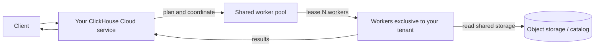
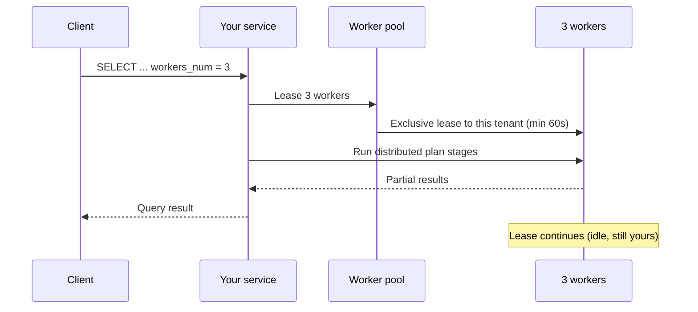
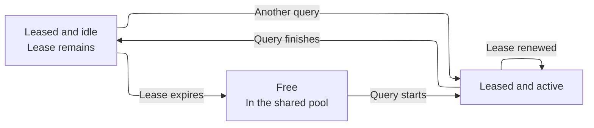
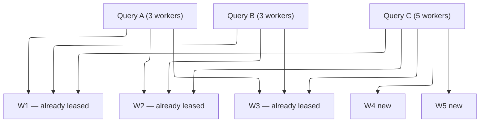

import { PrivatePreviewBadge } from "/snippets/fr/components/PrivatePreviewBadge/PrivatePreviewBadge.jsx";

<PrivatePreviewBadge />

<Note>
  On-Demand Compute est en private preview. Cette fonctionnalité n&#39;est couverte ni par les SLO ni par les SLA de ClickHouse Cloud, et des limitations connues comme inconnues peuvent s&#39;appliquer. Consultez [Limitations](#limitations).

  [Inscrivez-vous sur la liste d&#39;attente](https://clickhouse.com/cloud/on-demand-compute-waitlist).
</Note>

On-Demand Compute est une fonctionnalité de ClickHouse Cloud qui met à disposition d&#39;un service (un tenant) du compute supplémentaire pour les workloads pris en charge, sans avoir à redimensionner ni à provisionner un autre service. Ce travail s&#39;exécute sur des workers ClickHouse situés en dehors du compute propre au service. Les workers proviennent d&#39;un pool géré partagé entre les tenants, mais chaque worker n&#39;est affecté qu&#39;à un seul tenant à la fois.

Pendant la private preview, On-Demand Compute prend en charge les requêtes `SELECT` éligibles. Vous activez cette option pour une query au moyen de settings, et ClickHouse affecte des workers du pool pour l&#39;exécuter via votre service et votre endpoint existants. Les background operations font partie de la fonctionnalité au sens large, mais ne sont pas prises en charge durant la private preview.

Cela se distingue de la [compute-compute separation](/fr/products/cloud/features/infrastructure/warehouses). Un warehouse fournit du compute dédié et durable via plusieurs services qui partagent les mêmes données. On-Demand Compute fournit des workers temporaires issus d&#39;un pool partagé via votre service existant. Pendant la private preview, ce compute se demande au niveau de la query.

## Quand utiliser le compute à la demande {#when-to-use-on-demand-compute}

Pendant la private preview, utilisez le compute à la demande pour les requêtes `SELECT` éligibles et gourmandes en compute que vous souhaitez exécuter en dehors du compute du primary service :

* **Requêtes ad hoc et requêtes d&#39;analystes :** exécutez des requêtes `SELECT` gourmandes en compute sur des workers supplémentaires.
* **Charges de travail de lecture non critiques :** déportez certaines lectures hors du primary service.
* **Requêtes sur data lake :** interrogez des données Apache Iceberg, Delta Lake ou `SharedMergeTree` prises en charge sur des workers supplémentaires.
* **Compute supplémentaire temporaire :** demandez des workers pour les requêtes éligibles sans redimensionner le primary service.

La private preview prend en charge uniquement les requêtes `SELECT`. Les workers n&#39;exécutent pas de requêtes `INSERT`, de DDL, de mutations ni d&#39;opérations en arrière-plan.

## Fonctionnement {#how-it-works}



1. Vous envoyez une requête `SELECT` éligible à votre service ClickHouse Cloud. Votre endpoint, votre authentification et votre configuration RBAC restent inchangés.
2. Le service élabore un distributed query plan et demande au pool managé le nombre de workers spécifié.
3. ClickHouse affecte les workers disponibles à votre service.
4. Les workers exécutent les étapes du plan qui leur sont affectées par le distributed planner et lisent les données depuis le stockage pris en charge.
5. Votre service coordonne la requête et renvoie le résultat au client.

Pendant la private preview, chaque worker dispose de `8 vCPUs` et de `32 GiB` de mémoire. Utilisez `distributed_plan_workers_num` pour spécifier le nombre de workers demandés par la requête.

## Utilisation du compute à la demande {#using-on-demand-compute}

### Settings {#settings}

Ajoutez ces paramètres au niveau de la requête, de l&#39;utilisateur ou dans un settings profile.

| Setting                        | Valeur obligatoire | Objectif                                                                                                                                                           |
| ------------------------------ | ------------------ | ------------------------------------------------------------------------------------------------------------------------------------------------------------------ |
| `make_distributed_plan`        | Yes                | Active le distributed query plan expérimental. Obligatoire pour On-Demand Compute.                                                                                 |
| `distributed_plan_workers_num` | Yes                | Nombre de workers à louer pour cette requête. Si la valeur est `0` (valeur par défaut), la requête s&#39;exécute sur votre service, et non sur le pool de workers. |
| `enable_parallel_replicas`     | Yes (défini à `0`) | Les parallel replicas sont incompatibles avec le distributed plan.                                                                                                 |

<Tip>
  Pendant la préversion, définissez ces paramètres au niveau de la requête, ou créez un utilisateur distinct doté de paramètres différents. On voit ainsi immédiatement quels statements utilisent On-Demand Compute, et l&#39;on évite d&#39;hériter des default profiles de Cloud, qui activent les parallel replicas.
</Tip>

### Exemple {#example}

```sql
SELECT
    sum(l_extendedprice * l_discount) AS revenue
FROM lineitem
WHERE
    l_shipdate >= DATE '1994-01-01'
    AND l_shipdate < DATE '1994-01-01' + INTERVAL 1 YEAR
    AND l_discount BETWEEN 0.06 - 0.01 AND 0.06 + 0.01
    AND l_quantity < 24
SETTINGS
    make_distributed_plan = 1,
    distributed_plan_workers_num = 3,
    enable_parallel_replicas = 0
```

Cette query demande trois workers. Le nombre de workers alloués par ClickHouse dépend de la limite de la préversion privée et de la capacité disponible du pool.

### Location de workers {#worker-leasing}

La location d&#39;un worker dure au moins 60 secondes. ClickHouse renouvelle automatiquement la location tant qu&#39;une query est en cours d&#39;exécution.

Une fois la query terminée, les workers restent affectés au service jusqu&#39;à l&#39;expiration de la location. Une autre query éligible du même service peut réutiliser ces workers tant que la location reste active, ce qui évite à ClickHouse de devoir demander de nouveaux workers.

À l&#39;expiration de la location, ClickHouse libère les workers du service et les arrête.



Une fois la query terminée, les trois workers restent loués à votre tenant, mais demeurent idle jusqu&#39;à l&#39;expiration du lease.



Si vous envoyez une autre requête alors que ces workers sont toujours réservés, ils peuvent être réutilisés immédiatement (sans démarrage à froid).

Si le bail a expiré, ClickHouse restitue les workers au pool (ils sont arrêtés plutôt que laissés inactifs pour un autre tenant).

### Requêtes concurrentes {#concurrent-queries}

Les requêtes concurrentes provenant d&#39;un même service ClickHouse Cloud peuvent partager les workers affectés. ClickHouse ne demande des workers supplémentaires que lorsqu&#39;une requête en réclame davantage qu&#39;il n&#39;y en a déjà d&#39;affectés au service.

Par exemple, si deux requêtes concurrentes demandent chacune trois workers, elles peuvent partager ces mêmes trois workers. Si une autre requête en demande cinq, ClickHouse peut utiliser les trois workers déjà affectés et en demander deux de plus au pool.

Voir l&#39;exemple ci-dessous :

```sql
SELECT ... SETTINGS make_distributed_plan = 1, distributed_plan_workers_num = 3, ...;
SELECT ... SETTINGS make_distributed_plan = 1, distributed_plan_workers_num = 3, ...;
```

Elles partagent les trois mêmes workers.

Si une troisième query concurrente demande cinq workers :

```sql
SELECT ... SETTINGS make_distributed_plan = 1, distributed_plan_workers_num = 5, ...;
```

Cette requête s&#39;exécute sur les trois workers existants, auxquels s&#39;ajoutent deux workers nouvellement loués.



### Lorsque le pool ne peut pas satisfaire la demande {#pool-capacity}

La disponibilité des workers est assurée au mieux (best effort) pendant la private preview. Si le nombre de workers disponibles est inférieur au nombre demandé, la requête s&#39;exécute avec les workers que ClickHouse peut affecter. Par exemple, une demande de cinq workers peut s&#39;exécuter avec trois workers.

Si aucun worker ne peut être alloué, la requête échoue :

```text
No stateless workers available for tenant 'bronzeaws-cm-72': the discovery service leased none.
```

Relancez la query. Si le problème persiste, contactez votre account team ClickHouse — le pool de la préversion est peut-être épuisé ou mal dimensionné.

## Monitoring {#monitoring}

Utilisez `system.query_log` sur votre service pour savoir combien de workers ont été alloués à votre query.

### Nombre de workers alloués {#worker-provided}

```sql
SELECT
    ProfileEvents['StatelessWorkerRequested'],
    ProfileEvents['StatelessWorkerProvided']
FROM clusterAllReplicas(default, system.query_log)
WHERE query_id = '<YOUR_QUERY_ID>'
  AND type != 'QueryStart';
```

<Tip>
  Définissez `log_comment = 'on-demand'` (ou un nom de workload) sur les requêtes On-Demand afin de pouvoir les filtrer sans avoir à analyser `Settings`.
</Tip>

## Régions disponibles {#available-regions}

Les workers de calcul à la demande s&#39;exécutent dans la même région que votre service ClickHouse Cloud. Pendant la private preview, la feature ne sera d&#39;abord disponible que chez certains providers cloud et dans certaines régions. Lors de votre inscription sur la liste d&#39;attente, vous pouvez indiquer le provider et la région de votre choix afin que ClickHouse évalue votre éligibilité.

## Tarification {#pricing}

Pendant la private preview, le compute à la demande est gratuit, dans la limite d&#39;un plafond d&#39;utilisation (voir [Limitations](#limitations)). Contactez votre account team ClickHouse si vous avez besoin d&#39;un plafond plus élevé.

Une tarification sera introduite à la fin de la preview. Les participants à la preview en seront informés avant que la fonctionnalité ne passe en beta et avant le début de toute facturation.

Le modèle envisagé est le même que celui du compute ClickHouse Cloud : vous payez le compute que vous consommez (le temps de worker loué), et non les données parcourues ou les rows read.

## Limitations {#limitations}

Les limitations suivantes s&#39;appliquent pendant la private preview. D&#39;autres limitations peuvent s&#39;appliquer. Signalez tout comportement inattendu à ClickHouse Support ou à votre account team.

* **Requêtes `SELECT` uniquement.** Les workers n&#39;exécutent ni requêtes `INSERT`, ni mutations, ni DDL, ni opérations en arrière-plan.
* **Données prises en charge.** La private preview prend en charge Apache Iceberg, Delta Lake et `SharedMergeTree`.
* **Répliques parallèles.** Les répliques parallèles doivent être désactivées.
* **Taille des workers.** Chaque worker dispose de `8 vCPUs` et de `32 GiB` de mémoire.
* **Limite de workers.** Chaque requête peut demander jusqu&#39;à cinq workers pendant la private preview.
* **Capacité du pool.** La disponibilité des workers est assurée au mieux. Une requête peut obtenir moins de workers que demandé. Si aucun worker n&#39;est disponible, la requête échoue.
* **Performance.** La performance varie selon la requête. L&#39;attribution des workers, la planification distribuée et le transfert des étapes du plan peuvent ajouter de la latence. Certaines formes de requêtes peuvent être moins performantes qu&#39;une exécution sur le primary service.
* **Compatibilité des requêtes.** Le distributed planner ne peut pas exécuter tous les query plans à distance. Les requêtes non prises en charge peuvent renvoyer une exception `SUPPORT_IS_DISABLED`.

Les échecs les plus courants sont les suivants :

| Domaine                                                                                 | Ce qui se passe                                                                               |
| --------------------------------------------------------------------------------------- | --------------------------------------------------------------------------------------------- |
| Répliques parallèles                                                                    | Rejetées ; désactivez les settings ci-dessus.                                                 |
| Window functions avec `PARTITION BY`                                                    | Souvent rejetées tant que le planner ne peut pas effectuer de shuffle selon la partition key. |
| Lectures des tables `system`                                                            | Elles ne reposent pas sur du stockage partagé.                                                |
| Sous-requêtes corrélées sous certaines formes                                           | Peuvent être rejetées ou réécrites de manière moins efficace.                                 |
| Projections, skip indexes lors de la lecture des données et compilation des expressions | Désactivés pour la requête, sans renvoi d&#39;exception.                                      |

## Roadmap {#roadmap}

L&#39;On-Demand Compute constitue une base. Travaux en cours ou à venir :

* Combler les limitations connues (gaps `SUPPORT_IS_DISABLED`).
* Pools de workers de tailles différentes.
* Stabiliser les query performance par rapport à l&#39;exécution stateful.
* Prise en charge des background merge.
* Pricing.
* Calibrage de l&#39;autoscaler des pools de workers.
* Metrics et monitoring dans la Console.
* Permissions dédiées pour l&#39;On-Demand Compute.

## Security {#security}

On-Demand Compute ne modifie pas la manière dont vous vous connectez à ClickHouse Cloud. Les clients continuent de s&#39;authentifier auprès de votre service. Les workers n&#39;exposent jamais de query endpoint public.

Les roles et permissions dédiés à On-Demand ne sont pas inclus dans la version préliminaire (voir [Roadmap](#roadmap)). D&#39;ici là, toute personne pouvant exécuter `SELECT` avec les Settings ci-dessus sur votre service peut utiliser les workers, dans la limite du QUOTA de la version préliminaire.

## FAQ {#faq}

<AccordionGroup>
  <Accordion title="On-Demand Compute est-il open source ?">
    Non. Il s&#39;agit d&#39;une architecture ClickHouse Cloud : ClickHouse server (distributed plan), data plane (pool de workers et leases) et control plane. Le paramètre expérimental `make_distributed_plan` existe dans ClickHouse, mais le pool de workers partagé et l&#39;exécution stateless sont réservés à Cloud.
  </Accordion>

  <Accordion title="Ai-je besoin d'une version spécifique pour rejoindre la private preview ?">
    Oui. L&#39;équipe ClickHouse vous confirmera si votre service doit faire l&#39;objet d&#39;un upgrade avant de rejoindre la private preview. D&#39;autres upgrades peuvent s&#39;avérer nécessaires pendant la preview.
  </Accordion>

  <Accordion title="À quoi ressemblera le pricing ?">
    Aucun frais supplémentaire n&#39;est facturé pendant la private preview, dans les limites prévues pour celle-ci. Le pricing des étapes de publication ultérieures sera communiqué avant toute facturation. Cela étant, le pricing repose sur la même philosophie que ClickHouse Cloud : facturer le compute consommé, et non les données analysées ou les lignes lues. Les tarifs exacts seront publiés avant la GA ou le début du billing de la bêta.
  </Accordion>

  <Accordion title="Puis-je l'utiliser en production ?">
    Vous pouvez exécuter de véritables workloads, mais il s&#39;agit d&#39;une private preview : elle comporte des limitations connues et inconnues, et aucun SLO/SLA ne couvre l&#39;availability du pool de workers. ClickHouse s&#39;engage à accompagner les utilisateurs précoces ; considérez-la comme une preview, et non comme une garantie de production.
  </Accordion>

  <Accordion title="En quoi cela diffère-t-il de l'autoscaling de mon service ?">
    L&#39;autoscaling modifie le compute assigné à votre primary service. Pendant la private preview, On-Demand Compute donne aux requêtes SELECT éligibles un accès temporaire à des workers issus d&#39;un pool managé, sans modifier la taille du primary service. L&#39;autoscaling gère la capacité permanente du service, tandis qu&#39;On-Demand Compute fournit du compute temporaire pour des workloads spécifiques.
  </Accordion>

  <Accordion title="En quoi cela diffère-t-il d'un warehouse ou de la compute-compute separation ?">
    La compute-compute separation fournit du compute dédié via plusieurs ClickHouse Cloud services partageant les mêmes données. On-Demand Compute fournit du compute temporaire issu d&#39;un pool managé, via votre service existant. Pendant la private preview, ce compute est demandé au niveau de la query. À terme, cette capability est conçue pour prendre en charge aussi bien la query execution que les background operations.
  </Accordion>

  <Accordion title="Où puis-je poser mes questions ?">
    Adressez-vous à votre account team ; elle vous mettra en relation avec le product manager d&#39;On-Demand Compute.
  </Accordion>

  <Accordion title="Où puis-je signaler des bugs ?">
    Ouvrez un ticket de Support (sévérité 3) ou signalez-le au product manager. Indiquez le `query_id` et l&#39;exception complète.
  </Accordion>

  <Accordion title="Est-ce disponible dans ClickHouse BYOC ou ClickHouse Private ?">
    Non. La private preview n&#39;est disponible ni dans ClickHouse BYOC ni dans ClickHouse Private.
  </Accordion>
</AccordionGroup>