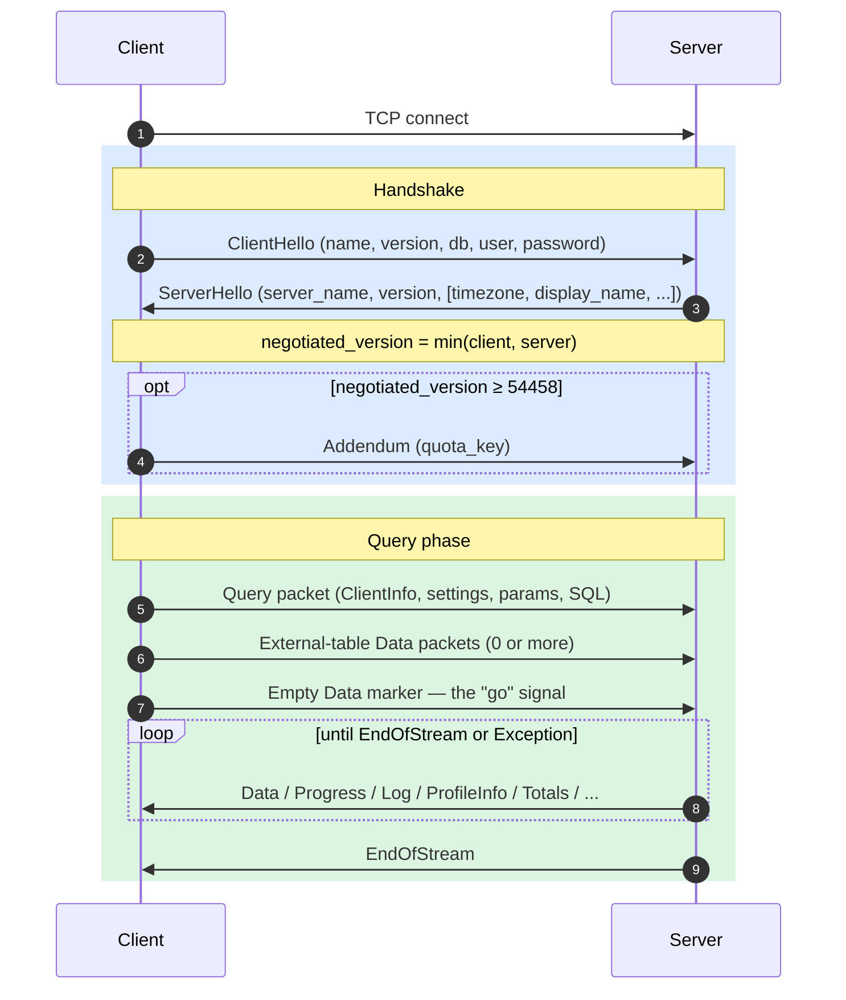
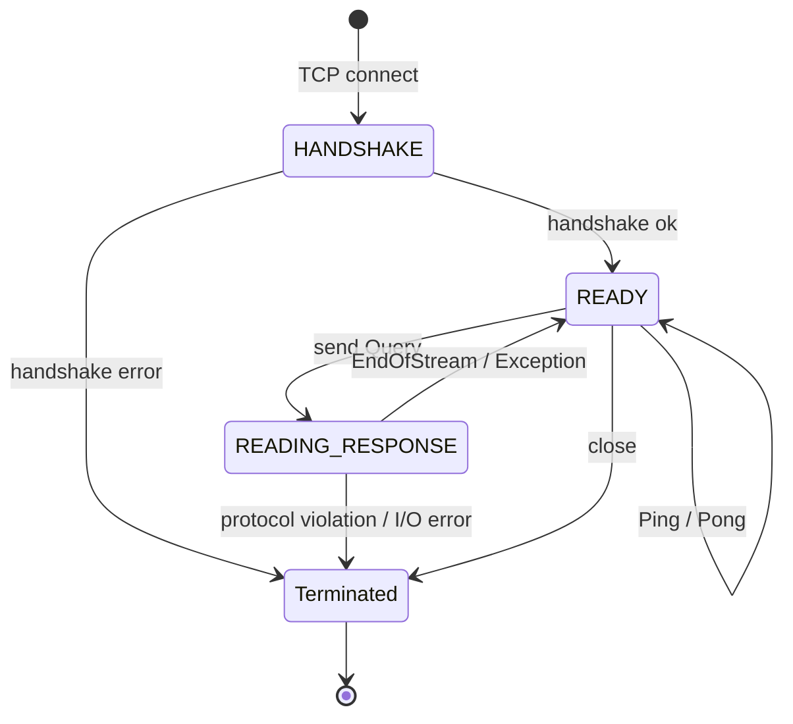
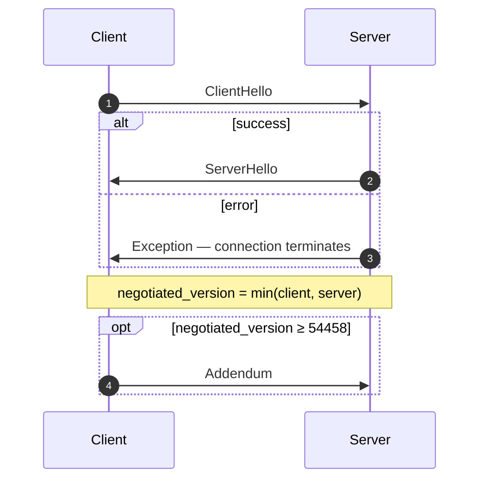
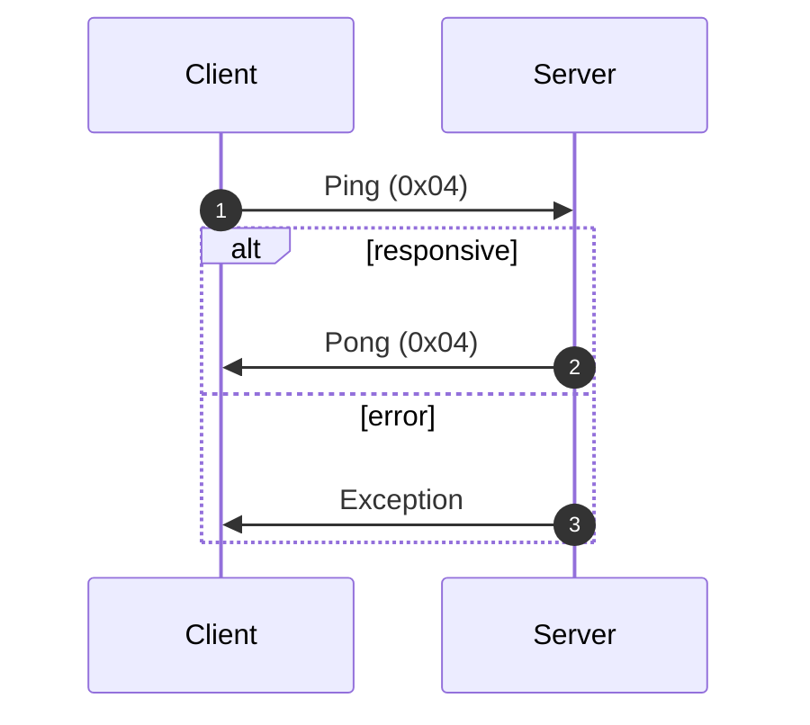
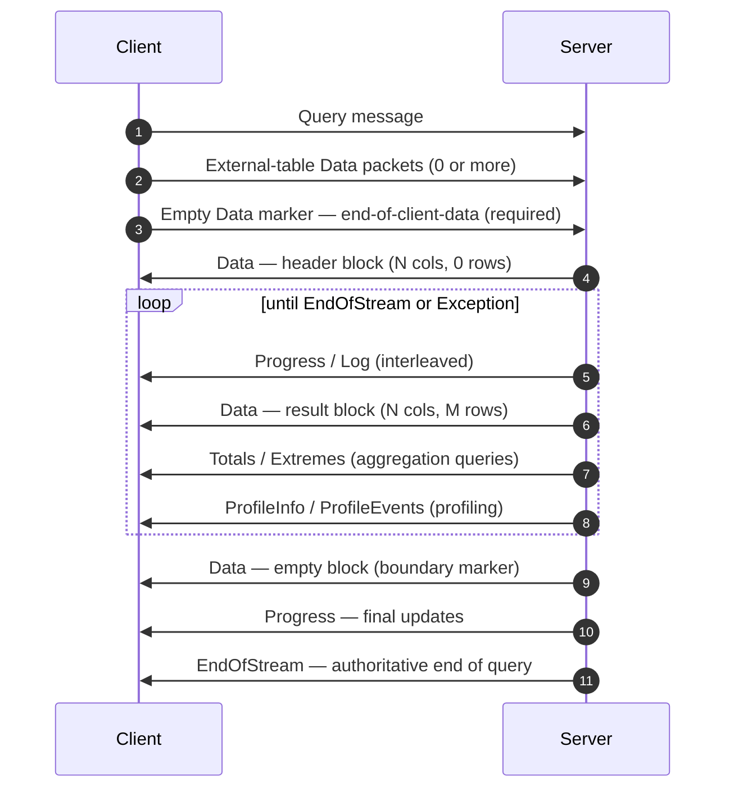
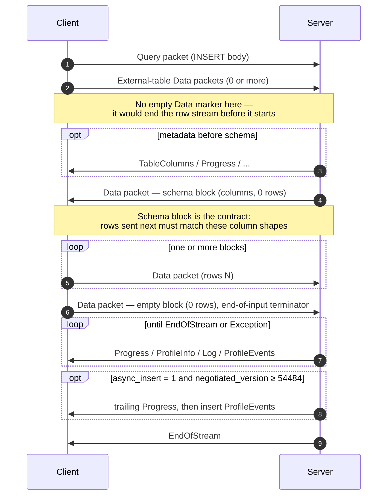
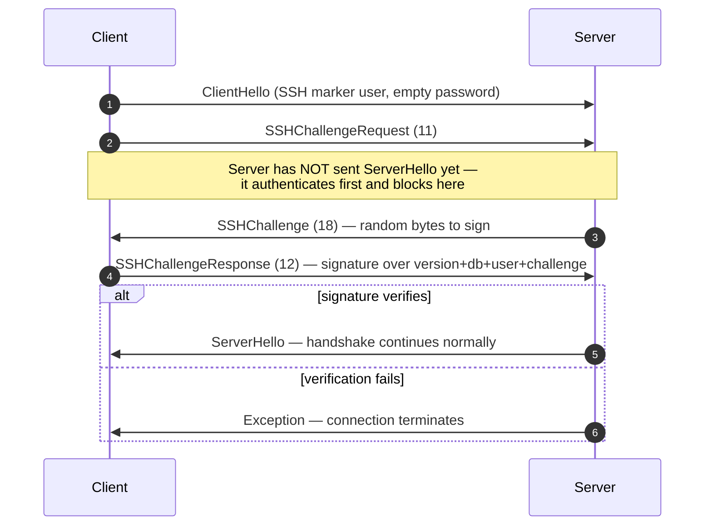

Le protocole natif est le protocole binaire, orienté connexion, que les clients et serveurs ClickHouse utilisent pour communiquer via TCP. Il transporte les requêtes SQL, les données de résultat, les charges utiles d&#39;`INSERT`, la télémétrie d&#39;exécution et les signaux d&#39;erreur. C&#39;est sur ce protocole que reposent le client en ligne de commande, le driver C++ et la plupart des drivers natifs tiers.

Cette page décrit le protocole lui-même : le tramage des paquets, la machine à états de la connexion, la négociation de version et le corps de chaque message autre que `Block`. Les octets contenus dans les paquets de la famille `Data` (le `Block`, ses colonnes et les encodages propres à chaque type) relèvent d&#39;un autre sujet, documenté dans la spécification du [format Native](/fr/resources/develop-contribute/native-protocol/format).

<Info>
  **Spécification complémentaire**

  Cette page forme un ensemble avec la spécification du [format Native](/fr/resources/develop-contribute/native-protocol/format), publiée conjointement. Les deux spécifications se répartissent clairement les rôles : cette page couvre la couche des paquets et la couche de transport, tandis que la spécification du format Native couvre les octets contenus dans les paquets de la famille `Data`.
</Info>

Quelques propriétés valent dans tous les cas. Le protocole est binaire et positionnel : il n&#39;existe aucune balise de champ, sauf dans `BlockInfo`, si bien qu&#39;un seul octet mal placé désynchronise tout ce qui suit. Il est avec état, et chaque connexion TCP traite une seule requête à la fois — il n&#39;y a pas de multiplexage. Les entiers de taille fixe sont encodés en little-endian.

## Vue d&#39;ensemble {#overview}

| Propriété            | Valeur                                                                                                      |
| -------------------- | ----------------------------------------------------------------------------------------------------------- |
| Transport            | TCP, éventuellement encapsulé dans TLS                                                                      |
| Ordre des octets     | Little-endian pour les entiers de taille fixe                                                               |
| Encodage             | Binaire et positionnel (aucune balise de champ, sauf dans `BlockInfo`)                                   |
| Modèle de connexion  | Avec état (stateful), une seule requête à la fois, sans multiplexage                                        |
| Gestion des versions | Négociée lors du handshake ; certaines fonctionnalités sont conditionnées par la version                    |
| Format de données    | Le [format Native](/fr/resources/develop-contribute/native-protocol/format) pour toutes les données tabulaires |

Dans le format binaire, chaque message commence par un code de type de paquet `VarUInt`, suivi d&#39;un corps dont la structure dépend de ce code et de la version de protocole négociée.

Une connexion se déroule en trois phases : un handshake initial unique, puis un nombre quelconque d&#39;échanges `Ping` ou `Query`, et enfin la fermeture :



Le protocole TCP natif transporte toujours les données tabulaires au format Native, quelle que soit la clause `FORMAT` de la requête SQL. La conversion vers `RowBinary`, `CSV`, `JSON`, etc. incombe au client, qui l&#39;effectue après avoir décodé les blocs Native. (L&#39;interface HTTP emprunte un chemin de code distinct qui, lui, *respecte* la clause `FORMAT` ; HTTP n&#39;est pas traité ici.)

## Sécurité {#security}

### Sécurité du transport (TLS) {#transport-security}

TLS opère au niveau de la couche transport, en dessous du protocole. Lorsqu&#39;il est activé, l&#39;intégralité du flux TCP est chiffrée, et les messages du protocole restent identiques octet pour octet, que TLS soit utilisé ou non.

### Authentification {#authentication}

L&#39;authentification a lieu pendant le handshake, dans le message [`ClientHello`](#clienthello). Les champs `user` et `password` transitent sous forme de chaînes de caractères en clair : c&#39;est donc le chiffrement au niveau de la couche transport (TLS) qui protège les identifiants en transit.

Lorsque le champ `user` est vide, le serveur utilise l&#39;utilisateur de session par défaut configuré, défini par le paramètre serveur `default_session_user` (dont la valeur par défaut est `default`), qui peut être surchargé pour chaque listener dans la section `protocols`. Si le serveur est configuré avec un utilisateur de session par défaut vide, ou si sa version est antérieure à 26.8, un champ `user` vide est rejeté et une exception est levée. Notez que `clickhouse-client` n&#39;envoie jamais de nom d&#39;utilisateur vide : il le remplace par `default` côté client.

L&#39;authentification SSH par défi-réponse est disponible à partir de la version de protocole 54466. Voir [Authentification SSH par défi-réponse](#ssh-authentication).

### Secret interserveur {#inter-server-secret}

Pour l&#39;exécution de requêtes distribuées, les serveurs s&#39;authentifient mutuellement en prouvant qu&#39;ils connaissent un secret partagé, sans jamais faire transiter ce secret sur le réseau. Chaque paquet Query contient un `auth_hash` SHA-256 de 32 octets dans le champ 4 de [`Query`](#query), calculé à partir d&#39;un sel, d&#39;un nonce, du secret configuré et de la requête ; le serveur destinataire le recalcule, puis compare les deux valeurs. Ce mécanisme dépend de la fonctionnalité `INTERSERVER_SECRET` (v54441). Les clients externes envoient toujours une chaîne vide dans ce champ. Voir [Authentification inter-serveur](#inter-server-authentication).

## Gestion des versions et activation conditionnelle des fonctionnalités {#versioning-and-feature-gates}

### Négociation de version {#version-negotiation}

Lors du handshake, le client et le serveur déclarent chacun la version de protocole maximale qu&#39;ils prennent en charge. La **version négociée** correspond à la plus basse des deux :

```text
negotiated_version = min(client_version, server_version)
```

Chaque message échangé par la suite s&#39;appuie sur la version négociée pour déterminer quels champs figurent dans le format binaire.

### Activation conditionnelle des fonctionnalités {#feature-gates}

Une fonctionnalité est identifiée par la version du protocole qui l&#39;a introduite ; elle est **active** dès lors que la version négociée est supérieure ou égale à ce numéro.

<Warning>
  Lorsqu&#39;une fonctionnalité est active, ses champs **doivent** figurer dans le format binaire. Le protocole étant strictement positionnel, omettre un champ soumis à une activation conditionnelle des fonctionnalités corrompt le flux d&#39;octets pour tous les champs suivants.
</Warning>

### Tableau des fonctionnalités {#feature-table}

| Fonctionnalité                                               | Version | Concerne                            | Impact sur le format wire                                                                                                                                                                                                                                                                                                                                                                                                                                                                                                                                                                                                                                                                                                                                                                                                                                               |
| ------------------------------------------------------------ | ------- | ----------------------------------- | ----------------------------------------------------------------------------------------------------------------------------------------------------------------------------------------------------------------------------------------------------------------------------------------------------------------------------------------------------------------------------------------------------------------------------------------------------------------------------------------------------------------------------------------------------------------------------------------------------------------------------------------------------------------------------------------------------------------------------------------------------------------------------------------------------------------------------------------------------------------------- |
| BLOCK&#95;INFO                                               | toutes  | Block                               | Ajoute le préfixe BlockInfo (`is_overflows`, `bucket_number`) à chaque Block.                                                                                                                                                                                                                                                                                                                                                                                                                                                                                                                                                                                                                                                                                                                                                                                           |
| CLIENT&#95;INFO                                              | 54032   | Query                               | Ajoute le bloc ClientInfo au corps de Query.                                                                                                                                                                                                                                                                                                                                                                                                                                                                                                                                                                                                                                                                                                                                                                                                                            |
| TIMEZONE                                                     | 54058   | ServerHello                         | Ajoute le champ `timezone` à ServerHello.                                                                                                                                                                                                                                                                                                                                                                                                                                                                                                                                                                                                                                                                                                                                                                                                                               |
| QUOTA&#95;KEY&#95;IN&#95;CLIENT&#95;INFO                     | 54060   | ClientInfo                          | Ajoute le champ `quota_key` à ClientInfo.                                                                                                                                                                                                                                                                                                                                                                                                                                                                                                                                                                                                                                                                                                                                                                                                                               |
| DISPLAY&#95;NAME                                             | 54372   | ServerHello                         | Ajoute le champ `display_name` à ServerHello.                                                                                                                                                                                                                                                                                                                                                                                                                                                                                                                                                                                                                                                                                                                                                                                                                           |
| VERSION&#95;PATCH                                            | 54401   | ServerHello, ClientInfo             | Ajoute le champ `version_patch` aux deux.                                                                                                                                                                                                                                                                                                                                                                                                                                                                                                                                                                                                                                                                                                                                                                                                                               |
| SERVER&#95;LOGS                                              | 54406   | Log                                 | Le serveur émet des paquets Log lorsque `send_logs_level` est défini.                                                                                                                                                                                                                                                                                                                                                                                                                                                                                                                                                                                                                                                                                                                                                                                                   |
| COLUMN&#95;DEFAULTS&#95;METADATA                             | 54410   | TableColumns                        | Le serveur peut envoyer le paquet [`TableColumns`](#tablecolumns) (type 11), qui contient les métadonnées des valeurs par défaut des colonnes, avant le bloc de schéma INSERT/input. Envoyé uniquement lorsque la version négociée est ≥ 54410 **et** que `input_format_defaults_for_omitted_fields` est activé. En deçà de cette version, le paquet n&#39;est jamais envoyé ; les clients ne doivent pas l&#39;attendre.                                                                                                                                                                                                                                                                                                                                                                                                                                               |
| WRITE&#95;CLIENT&#95;INFO                                    | 54420   | Progress                            | Ajoute `wrote_rows` et `wrote_bytes` à Progress. (Malgré son nom, cette fonctionnalité ne conditionne **pas** le bloc ClientInfo — c&#39;est le rôle de `CLIENT_INFO` (v54032).)                                                                                                                                                                                                                                                                                                                                                                                                                                                                                                                                                                                                                                                                                        |
| SETTINGS&#95;SERIALIZED&#95;AS&#95;STRINGS                   | 54429   | Query (encodage des paramètres)     | Modifie la **manière** dont est encodée la liste de paramètres, toujours présente ; ne détermine **pas** si les paramètres sont envoyés. À partir de v54429, chaque paramètre est écrit sous la forme `(name, flags, value-as-string)` ; les pairs plus anciens écrivent `(name, type-specific-binary-value)` sans flags. Voir [Setting](#setting).                                                                                                                                                                                                                                                                                                                                                                                                                                                                                                                     |
| INTERSERVER&#95;SECRET                                       | 54441   | Query                               | Ajoute le champ interserveur `auth_hash` à Query — un SHA-256 salé calculé sur le secret du cluster, et non le secret brut. Les clients externes envoient une chaîne vide. Voir [Authentification interserveur](#inter-server-authentication).                                                                                                                                                                                                                                                                                                                                                                                                                                                                                                                                                                                                                          |
| OPEN&#95;TELEMETRY                                           | 54442   | ClientInfo                          | Ajoute le contexte de trace OpenTelemetry à ClientInfo.                                                                                                                                                                                                                                                                                                                                                                                                                                                                                                                                                                                                                                                                                                                                                                                                                 |
| DISTRIBUTED&#95;DEPTH                                        | 54448   | ClientInfo                          | Ajoute le champ `distributed_depth` à ClientInfo.                                                                                                                                                                                                                                                                                                                                                                                                                                                                                                                                                                                                                                                                                                                                                                                                                       |
| INITIAL&#95;QUERY&#95;START&#95;TIME                         | 54449   | ClientInfo                          | Ajoute le champ `initial_time` (Int64, largeur fixe).                                                                                                                                                                                                                                                                                                                                                                                                                                                                                                                                                                                                                                                                                                                                                                                                                   |
| PROFILE&#95;EVENTS                                           | 54451   | ProfileEvents                       | Le serveur émet des paquets ProfileEvents pendant l&#39;exécution de la requête.                                                                                                                                                                                                                                                                                                                                                                                                                                                                                                                                                                                                                                                                                                                                                                                        |
| PARALLEL&#95;REPLICAS                                        | 54453   | ClientInfo                          | Ajoute à ClientInfo les champs de coordination des réplicas parallèles.                                                                                                                                                                                                                                                                                                                                                                                                                                                                                                                                                                                                                                                                                                                                                                                                 |
| CUSTOM&#95;SERIALIZATION                                     | 54454   | Block (Column)                      | Ajoute l&#39;octet `has_custom_serialization` après la chaîne de type de chaque colonne.                                                                                                                                                                                                                                                                                                                                                                                                                                                                                                                                                                                                                                                                                                                                                                                |
| ADDENDUM                                                     | 54458   | Handshake                           | Le client envoie un addendum (`quota_key`) à l&#39;issue du handshake.                                                                                                                                                                                                                                                                                                                                                                                                                                                                                                                                                                                                                                                                                                                                                                                                  |
| PARAMETERS                                                   | 54459   | Query                               | Ajoute la liste des paramètres au corps de Query.                                                                                                                                                                                                                                                                                                                                                                                                                                                                                                                                                                                                                                                                                                                                                                                                                       |
| SERVER&#95;QUERY&#95;TIME&#95;IN&#95;PROGRESS                | 54460   | Progress                            | Ajoute le champ `elapsed_ns` à Progress.                                                                                                                                                                                                                                                                                                                                                                                                                                                                                                                                                                                                                                                                                                                                                                                                                                |
| PASSWORD&#95;COMPLEXITY&#95;RULES                            | 54461   | ServerHello                         | Ajoute à ServerHello une liste de motifs regex de politique de mot de passe, accompagnés de messages lisibles.                                                                                                                                                                                                                                                                                                                                                                                                                                                                                                                                                                                                                                                                                                                                                          |
| INTERSERVER&#95;SECRET&#95;V2                                | 54462   | ServerHello                         | Ajoute à ServerHello un nonce `UInt64` de 8 octets. Utilisé pour la signature des requêtes interserveurs ; les clients externes le décodent et l&#39;ignorent.                                                                                                                                                                                                                                                                                                                                                                                                                                                                                                                                                                                                                                                                                                          |
| TOTAL&#95;BYTES&#95;IN&#95;PROGRESS                          | 54463   | Progress                            | Ajoute le champ `total_bytes_to_read` (VarUInt) à Progress, entre `total_rows` et `wrote_rows`.                                                                                                                                                                                                                                                                                                                                                                                                                                                                                                                                                                                                                                                                                                                                                                         |
| TIMEZONE&#95;UPDATES                                         | 54464   | TimezoneUpdate                      | Ajoute le paquet serveur `TimezoneUpdate` (type 17). Corps : un unique `String` contenant le fuseau horaire de la session. Envoyé uniquement par l&#39;initialiseur de la fonction de table `input`, juste après le bloc de schéma d&#39;entrée, afin que le client analyse les lignes qu&#39;il envoie selon le `session_timezone` du serveur. Voir [TimezoneUpdate](#timezoneupdate).                                                                                                                                                                                                                                                                                                                                                                                                                                                                                 |
| SPARSE&#95;SERIALIZATION                                     | 54465   | Block (Column)                      | Le serveur peut définir `has_custom_serialization = 1` et émettre une colonne à encodage sparse. Format wire : un octet de kind (0x01 = SPARSE), puis un flux d&#39;offsets VarUInt terminé par EOG, puis les valeurs non par défaut, encodées de manière dense dans le type interne. Voir [kind&#95;stack et encodage sparse](/fr/resources/develop-contribute/native-protocol/format#kind-stack-and-sparse-encoding).                                                                                                                                                                                                                                                                                                                                                                                                                                                    |
| SSH&#95;AUTHENTICATION                                       | 54466   | Flux d&#39;authentification         | Ajoute l&#39;authentification SSH par défi-réponse. Facultative : pour la déclencher, le client envoie un `user` de la forme `" SSH KEY AUTHENTICATION " + <real_user>` avec un mot de passe vide. Voir [Authentification SSH par défi-réponse](#ssh-authentication).                                                                                                                                                                                                                                                                                                                                                                                                                                                                                                                                                                                                   |
| TABLE&#95;READ&#95;ONLY&#95;CHECK                            | 54467   | TablesStatusResponse                | Ajoute un flag `is_readonly` à la ligne de chaque table dans TablesStatusResponse. Pour les clients externes qui n&#39;émettent pas de `TablesStatusRequest`, le format wire reste inchangé.                                                                                                                                                                                                                                                                                                                                                                                                                                                                                                                                                                                                                                                                            |
| SYSTEM&#95;KEYWORDS&#95;TABLE                                | 54468   | tables système                      | Le serveur alimente `system.keywords` afin que le `clickhouse-client` officiel puisse proposer l&#39;autocomplétion des mots-clés. Aucun changement du format wire du protocole natif.                                                                                                                                                                                                                                                                                                                                                                                                                                                                                                                                                                                                                                                                                  |
| ROWS&#95;BEFORE&#95;AGGREGATION                              | 54469   | ProfileInfo                         | Ajoute `applied_aggregation` (Bool) et `rows_before_aggregation` (VarUInt) à la fin de ProfileInfo, dans cet ordre.                                                                                                                                                                                                                                                                                                                                                                                                                                                                                                                                                                                                                                                                                                                                                     |
| CHUNKED&#95;PROTOCOL                                         | 54470   | Tramage de la connexion             | Le corps de chaque paquet est encapsulé dans un tramage par fragments. Négocié dans l&#39;Addendum : ServerHello transmet la préférence du serveur pour chaque sens de communication, et l&#39;Addendum transmet le choix final du client. Voir [tramage par fragments](#chunked-framing).                                                                                                                                                                                                                                                                                                                                                                                                                                                                                                                                                                              |
| VERSIONED&#95;PARALLEL&#95;REPLICAS&#95;PROTOCOL             | 54471   | ServerHello, Addendum               | Les deux parties échangent un `VarUInt` indiquant la version du protocole de coordination des répliques parallèles. Le champ de ServerHello est placé **immédiatement après `protocol_version`** (avant `timezone`). Le champ d&#39;Addendum est ajouté après les strings du protocole par blocs (chunked). Valeur actuelle : `8` (`DBMS_PARALLEL_REPLICAS_PROTOCOL_VERSION`). La version `8` ajoute [`MergeTreeAllRangesAnnouncementResponse`](#mergetreeallrangesannouncementresponse) (paquet client `14`) : lorsque la version négociée des répliques parallèles est `≥ 8`, l&#39;initiateur répond à chaque annonce d&#39;un suiveur en mode autre que `Default` avec la liste de référence des parts pour ce flux, et le suiveur l&#39;attend avant d&#39;émettre des requêtes de lecture. En dessous de `8`, l&#39;annonce est envoyée sans attendre de réponse. |
| INTERSERVER&#95;EXTERNALLY&#95;GRANTED&#95;ROLES             | 54472   | Query                               | Ajoute un champ `String external_roles` au corps de Query, entre le terminateur des paramètres et le hachage du secret interserveur. Les clients externes envoient une liste de rôles vide (un seul octet `0x00`, c.-à-d. VarUInt 0 dans une enveloppe String).                                                                                                                                                                                                                                                                                                                                                                                                                                                                                                                                                                                                         |
| V2&#95;DYNAMIC&#95;AND&#95;JSON&#95;SERIALIZATION            | 54473   | Corps de colonne                    | Le serveur peut émettre une sérialisation V2 pour les types de colonne `Dynamic` et `JSON` — ce qui détermine la version de `state_prefix` utilisée. Voir [types versionnés](/fr/resources/develop-contribute/native-protocol/format#versioned-types).                                                                                                                                                                                                                                                                                                                                                                                                                                                                                                                                                                                                                     |
| SERVER&#95;SETTINGS                                          | 54474   | ServerHello                         | Le serveur diffuse ses paramètres modifiés par rapport aux valeurs par défaut sous forme de liste à la fin de ServerHello, après `nonce`. Format : triplets `(key, flags, value)` terminés par une clé vide — identique à la liste des paramètres du paquet Query.                                                                                                                                                                                                                                                                                                                                                                                                                                                                                                                                                                                                      |
| QUERY&#95;AND&#95;LINE&#95;NUMBERS                           | 54475   | ClientInfo                          | Ajoute `script_query_number` (VarUInt) et `script_line_number` (VarUInt) à la fin de ClientInfo. Utilisé par clickhouse-client pour localiser les erreurs dans les scripts à plusieurs instructions ; les clients externes envoient `0, 0`.                                                                                                                                                                                                                                                                                                                                                                                                                                                                                                                                                                                                                             |
| JWT&#95;IN&#95;INTERSERVER                                   | 54476   | ClientInfo                          | Ajoute un UInt8 de présence du JWT + un `String jwt` facultatif à la fin de ClientInfo. Les clients externes (sans JWT) envoient l&#39;octet `0x00`. (Orthographié `DBMS_MIN_REVISON_WITH_JWT_IN_INTERSERVER` en C++ — notez la coquille dans le nom de la constante.)                                                                                                                                                                                                                                                                                                                                                                                                                                                                                                                                                                                                  |
| QUERY&#95;PLAN&#95;SERIALIZATION                             | 54477   | ServerHello, paquet QueryPlan       | ServerHello ajoute `VarUInt query_plan_serialization_version` après les paramètres du serveur. Introduit également `ClientPacket::QueryPlan` (code `13`) pour la transmission interserveur de plans de requête préconstruits — les clients externes ne l&#39;envoient jamais. La version `10` de sérialisation du plan de requête préfixe le plan sérialisé par `VarUInt max_threads` et `Bool concurrency_control` ; lorsque l&#39;un ou l&#39;autre n&#39;a pas sa valeur par défaut, les initiateurs transmettent le SQL aux pairs de version inférieure à `10`, afin que ceux-ci construisent leur plan à partir des paramètres de requête transmis.                                                                                                                                                                                                                |
| PARALLEL&#95;BLOCK&#95;MARSHALLING                           | 54478   | Block (Column)                      | Le serveur peut encapsuler les colonnes dans `ColumnBLOB` (compressées en ligne) pour un traitement parallèle. Conditionné à l&#39;activation de la compression pour la requête ET à `rows > 1` ; sinon, le format wire habituel des colonnes s&#39;applique. Les clients qui n&#39;activent jamais la compression sur les paquets Query sortants ne constatent aucun changement du format wire.                                                                                                                                                                                                                                                                                                                                                                                                                                                                        |
| VERSIONED&#95;CLUSTER&#95;FUNCTION&#95;PROTOCOL              | 54479   | ServerHello                         | Ajoute `VarUInt cluster_function_protocol_version` à la fin de ServerHello. Utilisé pour les fonctions de table `*Cluster` (`s3Cluster`, etc.). Valeur actuelle : `8` (`DBMS_CLUSTER_PROCESSING_PROTOCOL_VERSION`) ; la version `7` est réservée à une fonctionnalité d&#39;un dépôt privé (compaction Iceberg), et la version `8` ajoute un `read_source_index` facultatif à la charge utile interserveur des tâches de lecture du cluster (le corps de `ReadTaskResponse`, qui n&#39;est pas spécifié ici — voir ci-dessous). Les clients externes le décodent et l&#39;ignorent.                                                                                                                                                                                                                                                                                     |
| OUT&#95;OF&#95;ORDER&#95;BUCKETS&#95;IN&#95;AGGREGATION      | 54480   | BlockInfo                           | Ajoute le champ 3 (`out_of_order_buckets: Vec<Int32>`) au flux à champs étiquetés de BlockInfo. Décodé sous la forme `[VarUInt count][Int32]*count`. Les clients externes ne l&#39;émettent pas eux-mêmes ; le décodeur lit toute liste non vide envoyée par le serveur.                                                                                                                                                                                                                                                                                                                                                                                                                                                                                                                                                                                                |
| COMPRESSED&#95;LOGS&#95;PROFILE&#95;EVENTS&#95;COLUMNS       | 54481   | Log, ProfileEvents, TableColumns    | Le serveur peut encapsuler les corps des paquets [`Log`](#log), [`ProfileEvents`](#profileevents) et [`TableColumns`](#tablecolumns) dans la [trame de compression](/fr/resources/develop-contribute/native-protocol/format#compression-frame). À partir de cette version, ces trois corps transitent par le même chemin de sortie éventuellement compressé, qui ne devient une véritable trame de compression que lorsque la requête a `compression = true`. Les clients qui n&#39;activent jamais la compression sur les paquets Query sortants ne constatent aucun changement du format wire.                                                                                                                                                                                                                                                                           |
| REPLICATED&#95;SERIALIZATION                                 | 54482   | Block (Column)                      | Le serveur peut émettre des colonnes avec kind&#95;stack `0x04 = REPLICATED` — une forme compacte de type dictionnaire pour les valeurs répétées — voir [kind&#95;stack et encodage sparse](/fr/resources/develop-contribute/native-protocol/format#kind-stack-and-sparse-encoding). En dessous de cette version, l&#39;émetteur développait ces colonnes avant l&#39;envoi. Décodé par recherche d&#39;index (`elements[indexes[i]]` par ligne) ; les types feuilles ainsi que les types internes `Nullable`/`Array`/`Tuple`/`Map`/`Nested`/`LowCardinality` sont pris en charge.                                                                                                                                                                                                                                                                                         |
| NULLABLE&#95;SPARSE&#95;SERIALIZATION                        | 54483   | Block (Column)                      | Combine la sérialisation sparse avec `Nullable(T)`. En dessous de cette version, l&#39;émetteur développait le format sparse des colonnes Nullable avant l&#39;envoi ; à partir de v54483, les données wire sont au format sparse sur Nullable. Voir [kind&#95;stack et encodage sparse](/fr/resources/develop-contribute/native-protocol/format#kind-stack-and-sparse-encoding).                                                                                                                                                                                                                                                                                                                                                                                                                                                                                          |
| PROGRESS&#95;IN&#95;ASYNC&#95;INSERT                         | 54484   | Progress (INSERT)                   | Lors d&#39;un INSERT **asynchrone** (`async_insert = 1`), une fois l&#39;insertion vidée, le serveur envoie un paquet [`Progress`](#progress) supplémentaire, puis les `ProfileEvents` de l&#39;insertion, avant `EndOfStream`. Conditionné à une version *négociée* ≥ 54484 ; en dessous, le serveur omet ce Progress final. Le format wire de Progress est inchangé — seule son émission est nouvelle. En pratique, l&#39;incrément contient le temps écoulé ; les compteurs de lignes écrites sont transmis via les ProfileEvents associés. Un client qui consomme déjà les Progress entrelacés n&#39;a besoin d&#39;aucun changement de format : il doit simplement tolérer un paquet de plus.                                                                                                                                                                      |
| CLIENT&#95;AGENT&#95;IN&#95;CLIENT&#95;INFO                  | 54485   | ClientInfo                          | Ajoute un `String` `client_agent` final à ClientInfo. Le client de référence détecte automatiquement un identifiant d&#39;agent à partir de son environnement (par exemple `claude-code`, `cursor`, `gemini-cli` ou la valeur de la variable `AGENT`) ; un client externe n&#39;ayant rien détecté envoie une string vide. Obligatoire dès que la version négociée est ≥ 54485 — son omission désynchronise le reste du paquet Query.                                                                                                                                                                                                                                                                                                                                                                                                                                   |
| INTERNAL&#95;QUERY&#95;FLAG                                  | 54486   | ClientInfo                          | Ajoute un `UInt8` `is_internal` final à ClientInfo. `1` pour une requête interne au serveur (non émise par l&#39;utilisateur), propagé aux requêtes distantes afin que leurs lignes dans `system.query_log` soient marquées comme internes ; les clients externes envoient `0`. Obligatoire dès que la version négociée est ≥ 54486 — son omission désynchronise le reste du paquet Query.                                                                                                                                                                                                                                                                                                                                                                                                                                                                              |
| INTERSERVER&#95;CURRENT&#95;ROLES                            | 54488   | ClientInfo                          | Ajoute une liste de String facultative `current_roles` à la fin de ClientInfo (`[UInt8 present]` puis, si `1`, `[VarUInt count][String]*count`) et, pour les requêtes interserveur, étend `auth_hash` à la liste sérialisée. Transporte les noms des rôles actifs (activés) de l&#39;initiateur afin qu&#39;un nœud secondaire applique les politiques de lignes de la même manière, au lieu de se rabattre sur les rôles par défaut de l&#39;utilisateur. Renseigné uniquement pour les requêtes interserveur et seulement lorsque `push_external_roles_in_interserver_queries = 1` ; les clients externes envoient `0` (absent). Obligatoire dès que la version négociée est ≥ 54488 — l&#39;omission de l&#39;octet de présence désynchronise le reste du paquet Query.                                                                                              |
| CURRENT&#95;AGGREGATION&#95;VARIANT&#95;SELECTION&#95;METHOD | 54489   | Agrégation (buckets à deux niveaux) | La méthode d&#39;agrégation pour une clé `String` unique dépend de `enable_packed_string_keys_in_aggregation`. Un pair de révision inférieure utilise toujours la méthode compactée et ne connaît pas ce paramètre ; échanger des buckets à deux niveaux avec lui placerait donc la même clé dans des buckets différents. Face à un tel pair, l&#39;initiateur adopte un comportement sûr par défaut : il met à zéro les seuils à deux niveaux pour celui-ci et répartit lui-même ses blocs à un niveau dans les buckets. La comparaison porte sur la révision du pair plutôt que sur sa version, car la méthode peut changer au sein d&#39;une même release. Aucun changement du format wire du protocole natif.                                                                                                                                                       |
| HTTP&#95;HANDLER&#95;IN&#95;CLIENT&#95;INFO                  | 54490   | ClientInfo                          | Ajoute `http_handler_name` et `http_request_url` (tous deux `String`) à la branche **HTTP** de ClientInfo, immédiatement après `http_referer`. Ils transportent le nom du handler HTTP défini en SQL correspondant et l&#39;URL de la requête, afin que `currentHandler`/`currentRequestURL` et les colonnes `http_handler_name`/`http_request_url` de `system.query_log` restent renseignés sur les shards distants pour les requêtes de handler distribuées. Écrits uniquement lorsque `query_interface = HTTP` (strings vides pour une requête HTTP sans handler) ; obligatoires dès que la version négociée est ≥ 54490 — leur omission désynchronise le reste du paquet Query.                                                                                                                                                                                     |
| QUANTILE&#95;DETERMINISTIC&#95;SKIP&#95;DEGREE               | 54491   | Block (Column)                      | Fait passer la version d&#39;état de `AggregateFunction(quantileDeterministic, ...)` (et de ses variantes `quantiles`/`median`) de `0` à `1`, ce qui ajoute un `UInt8 skip_degree` final à chaque état sérialisé. Seule la charge utile d&#39;état de cette fonction d&#39;agrégation change ; le cadrage des colonnes est inchangé et toutes les autres fonctions d&#39;agrégation conservent leur propre version. En dessous de cette révision, l&#39;émetteur produit des états de version `0`, de sorte qu&#39;un pair plus ancien n&#39;est pas affecté.                                                                                                                                                                                                                                                                                                           |
| STRING&#95;WITH&#95;SIZE&#95;STREAM&#95;SERIALIZATION        | 54492   | Block (Column)                      | Les colonnes `String` passent d&#39;une disposition avec préfixe de longueur par valeur à un flux séparé d&#39;offsets d&#39;octets cumulés (la même disposition d&#39;offsets qu&#39;un `Array`), envoyé tel quel : `[UInt64 × num_rows offsets][data blob]`. Conditionné à la révision négociée ; en dessous de 54492, l&#39;émetteur utilise les préfixes de longueur par valeur. Le format wire ne comporte aucun marqueur par colonne à cet effet — les deux pairs le déduisent uniquement de la révision. Voir [Disposition des colonnes String](/fr/resources/develop-contribute/native-protocol/format#string-type).                                                                                                                                                                                                                                               |

## Enveloppe de paquet {#packet-envelope}

Chaque message transmis dans le format binaire présente la même structure externe, dans les deux sens :

```text
[VarUInt: packet_type_code]    always encoded as VarUInt
[message body]                 format depends on packet_type_code
```

Les tableaux complets des types de paquets figurent dans la [référence des types de paquets](#packet-type-reference).

Le type de paquet est un `VarUInt`, et non un octet de taille fixe. Pour les valeurs inférieures à 128, un `VarUInt` produit le même octet unique, mais les implémentations doivent utiliser l&#39;encodage `VarUInt` afin de rester compatibles si de futurs types de paquets atteignent ou dépassent 128.

La [référence des messages](#message-reference) décrit uniquement le **corps** de chaque paquet, c&#39;est-à-dire les octets qui suivent le code du type de paquet. La numérotation des champs commence à 1, avec le premier champ du corps.

### Tramage par fragments (v54470+) {#chunked-framing}

Lorsque la fonctionnalité `CHUNKED_PROTOCOL` est **négociée** (voir [le handshake](#handshake-phase)), chaque paquet transmis est enveloppé dans un tramage par fragments. Cet enveloppement s&#39;applique **par sens de communication** : les sens client→serveur et serveur→client sont négociés séparément et peuvent aboutir à des modes différents (par fragments ou sans tramage).

Disposition wire de chaque paquet :

```text
<chunk>...   one or more chunks; their payloads concatenated form the whole packet
[u32 LE = 0] zero-size terminator marking end of packet
```

Disposition wire par fragment :

```text
[u32 LE: chunk_size]   chunk_size in [1, UINT32_MAX]
[chunk_size bytes]     packet bytes (see note below)
```

Le `VarUInt` du type de paquet se trouve **à l&#39;intérieur** du flux fragmenté : il constitue le premier octet de la charge utile du paquet (le premier octet du premier fragment), et non un octet distinct envoyé avant le tramage. La charge utile des fragments de chaque paquet correspond à l&#39;intégralité de `[VarUInt packet_type_code][message body]` issu de l&#39;[enveloppe de paquet](#packet-envelope). Si un client laisse le type de paquet en dehors du flux fragmenté, le pair lit cet octet de type comme le premier octet de la taille de fragment `u32`, ce qui désynchronise la connexion.

Un même paquet peut être réparti sur plusieurs fragments si le tampon du rédacteur se remplit en cours de paquet ; la coupure peut intervenir n&#39;importe où, y compris à l&#39;intérieur du `VarUInt` du type de paquet. Le lecteur concatène les charges utiles des fragments et traite le zéro final de 4 octets comme une frontière de paquet transparente : il le consomme, mais ne le transmet pas au composant qui lit les corps de paquets.

Les paquets sans corps sont malgré tout encapsulés : un paquet d&#39;un seul octet tel que `Ping` ou `Pong` devient `[u32 size = 1][0x04][u32 0]` une fois la fragmentation négociée. Toute mention d&#39;« un seul octet dans le format binaire » ailleurs sur cette page désigne la forme antérieure à la fragmentation.

**Négociation.** ServerHello et Addendum transportent chacun deux champs `String`, un par direction, dont les valeurs sont choisies parmi `{"chunked", "notchunked", "chunked_optional", "notchunked_optional"}` :

* `chunked` / `notchunked` sont stricts : le côté concerné exige exactement ce mode.
* Les variantes `_optional` sont souples : elles acceptent le mode choisi par l&#39;autre côté.

La valeur convenue pour chaque direction est déterminée par paire :

| Préférence du serveur   | Préférence du client    | Valeur convenue                                         |
| ----------------------- | ----------------------- | ------------------------------------------------------- |
| `*_optional`            | quelconque              | suivre le CLIENT (son `starts_with("chunked")`)         |
| quelconque              | `*_optional`            | suivre le SERVEUR                                       |
| `chunked` strict        | `chunked` strict        | `chunked`                                               |
| `notchunked` strict     | `notchunked` strict     | `notchunked`                                            |
| incompatibilité stricte | incompatibilité stricte | **erreur de protocole** — la connexion DOIT être fermée |

Côté client, la préférence d&#39;ENVOI du client est négociée avec la préférence de RÉCEPTION du serveur, et inversement.

**Chronologie.** Les chaînes de négociation transitent sans tramage : ClientHello → ServerHello (préférences du serveur) → Addendum (valeurs négociées par le client). Le passage au tramage s&#39;applique à chaque octet envoyé *après* le vidage de l&#39;Addendum. L&#39;Addendum lui-même, le ClientHello et le ServerHello sont toujours transmis sans tramage.

## Cycle de vie de la connexion {#connection-lifecycle}

À tout instant, une connexion se trouve dans un seul des quatre états suivants : `HANDSHAKE`, `READY`, `READING_RESPONSE` ou terminée. Le protocole ne gérant pas le multiplexage, un client qui envoie une nouvelle requête avant d&#39;avoir entièrement lu la réponse précédente entremêle les octets transmis et corrompt le flux.

### États {#states}



Le chemin nominal descend en ligne droite — `HANDSHAKE → READY → READING_RESPONSE → READY` — avec la boucle `Ping`/`Pong` sur elle-même, tandis que toutes les transitions d&#39;échec convergent vers l&#39;unique état final `Terminated`.

| État               | Description                                                                                                                                                                                                                                                                                                                                                                                                                                                                                                                                                                                                             |
| ------------------ | ----------------------------------------------------------------------------------------------------------------------------------------------------------------------------------------------------------------------------------------------------------------------------------------------------------------------------------------------------------------------------------------------------------------------------------------------------------------------------------------------------------------------------------------------------------------------------------------------------------------------- |
| `HANDSHAKE`        | État initial après l&#39;ouverture de la connexion TCP. Seuls les messages de [handshake](#handshake-phase) sont valides. Passe à `READY` en cas de succès ; la connexion est interrompue en cas d&#39;échec.                                                                                                                                                                                                                                                                                                                                                                                                           |
| `READY`            | Inactif. Le client peut envoyer un [Ping](#ping-phase), une [Query](#query-phase), ou fermer la connexion. La connexion peut rester indéfiniment dans l&#39;état `READY` (sous réserve de `idle_connection_timeout`, voir [limites de connexion](#connection-limits)). Un paquet `Data` (2) ou `Scalar` (7) reçu dans cet état constitue une violation de protocole : le serveur met fin à la connexion sans décoder le corps du paquet, et sans envoyer au préalable de paquet `Exception`. Le corps n&#39;étant pas lu, le client peut constater une réinitialisation TCP (reset) plutôt qu&#39;une fermeture propre. |
| `READING_RESPONSE` | État atteint lorsque le client envoie une Query. Le client doit consommer entièrement le flux de réponse du serveur avant de revenir à `READY`. Le seul paquet client→serveur autorisé dans cet état est Cancel (non décrit sur cette page).                                                                                                                                                                                                                                                                                                                                                                            |
| Terminated         | La connexion n&#39;est plus utilisable. Le client doit ouvrir une nouvelle connexion TCP et recommencer le handshake.                                                                                                                                                                                                                                                                                                                                                                                                                                                                                                   |

### Phase de handshake {#handshake-phase}

Authentifie le client et négocie la version du protocole. Cette phase a lieu une seule fois par connexion, avant toute autre opération.

La connexion TCP vient d&#39;être ouverte et aucun message n&#39;a encore été échangé. Le déroulement est le suivant :



1. Le client envoie [`ClientHello`](#clienthello) avec la version maximale du protocole qu&#39;il prend en charge.

2. Le client lit la réponse et la traite selon le type de paquet :

   | Type de paquet  | Action                                                                                                                      |
   | --------------- | --------------------------------------------------------------------------------------------------------------------------- |
   | `Hello` (0)     | Décoder [`ServerHello`](#serverhello). Calculer `negotiated_version = min(client_ver, server_ver)`. Passer à l&#39;étape 3. |
   | `Exception` (2) | Décoder [`Exception`](#exception). La renvoyer comme erreur et mettre fin à la connexion.                                   |
   | tout autre type | Violation du protocole. Mettre fin à la connexion.                                                                          |

3. Si `negotiated_version ≥ 54458` (fonctionnalité `ADDENDUM`), le client envoie un [`Addendum`](#addendum). Cette décision repose sur la version **négociée**, et non sur la version déclarée par le client.

En cas de succès, la connexion passe à l&#39;état `READY` ; en cas d&#39;erreur, elle est interrompue.

### Phase Ping {#ping-phase}

Vérification de disponibilité au niveau applicatif, indépendante du keepalive TCP. Un aller-retour Ping/Pong réussi confirme que la connexion TCP est active dans les deux sens et que le serveur répond. Le Ping est sans état et n&#39;est lié à aucune requête : plusieurs Pings successifs sont donc indépendants les uns des autres.

À partir de l&#39;état `READY`, le déroulement est le suivant :



1. Le client envoie [`Ping`](#ping).
2. Le client lit la réponse :

   | Type de paquet  | Action                                                                   |
   | --------------- | ------------------------------------------------------------------------ |
   | `Pong` (4)      | Connexion active confirmée. Retour à l&#39;état `READY`.                 |
   | `Exception` (2) | Décoder le paquet [`Exception`](#exception) et le renvoyer comme erreur. |
   | tout autre type | Violation de protocole.                                                  |

### Phase de requête {#query-phase}

Le client soumet un statement SQL ; le serveur renvoie en continu des blocs de résultats ainsi que la télémétrie d&#39;exécution. La réponse est une séquence de paquets se terminant par exactement un `EndOfStream` ou un `Exception`.

À partir de l&#39;état `READY`, le déroulement est le suivant :



Si une erreur survient à n&#39;importe quel moment, le serveur envoie un paquet `Exception` au lieu de `EndOfStream`, ce qui met fin à la requête.

1. Le client envoie [`Query`](#query) avec un `query_id` unique (généralement un UUID).
2. Le client envoie les éventuelles tables externes, puis le marqueur Data vide. Le paquet Data vide a `table_name = ""`, `num_columns = 0`, `num_rows = 0`. Le serveur ne commence à exécuter la requête qu&#39;après avoir reçu ce marqueur. Une table externe peut être répartie sur plusieurs paquets `Data` portant le même `table_name` ; le premier d&#39;entre eux fixe le schéma de la table, et chaque paquet ultérieur pour ce nom doit contenir les mêmes noms et types de colonnes, dans le même ordre, faute de quoi le serveur rejette la requête avec `INCORRECT_DATA` (voir [Data](#data)).
3. Le client passe à l&#39;état `READING_RESPONSE` et vide son tampon d&#39;écriture.
4. Le client lit les paquets de réponse en boucle et les traite selon leur type :

   | Type de paquet       | Action                                                                                                                                                                                                                   |
   | -------------------- | ------------------------------------------------------------------------------------------------------------------------------------------------------------------------------------------------------------------------ |
   | `Data` (1)           | Décoder le bloc. Le premier Data est l&#39;en-tête de schéma ; les suivants sont des blocs de résultat (à accumuler) ; un bloc vide est un marqueur de limite. `num_rows == 0` ne signifie **pas** la fin de la requête. |
   | `Progress` (3)       | Métriques d&#39;exécution. Chaque paquet est un **incrément** par rapport au précédent — à cumuler localement.                                                                                                           |
   | `EndOfStream` (5)    | Requête terminée. Sortir de la boucle et revenir à l&#39;état `READY`.                                                                                                                                                   |
   | `ProfileInfo` (6)    | Données de profilage post-exécution.                                                                                                                                                                                     |
   | `Totals` (7)         | Bloc des totaux d&#39;agrégation (même format wire que Data).                                                                                                                                                            |
   | `Extremes` (8)       | Bloc des valeurs min/max (même format wire que Data).                                                                                                                                                                    |
   | `Log` (10)           | Ligne de journal du serveur.                                                                                                                                                                                             |
   | `TableColumns` (11)  | Métadonnées des valeurs par défaut des colonnes.                                                                                                                                                                         |
   | `ProfileEvents` (14) | Compteurs de performance.                                                                                                                                                                                                |
   | `Exception` (2)      | Décoder et renvoyer sous forme d&#39;erreur. Sortir de la boucle et revenir à l&#39;état `READY`.                                                                                                                        |
   | tout autre type      | Inattendu pendant la phase de requête. Mettre fin à la connexion.                                                                                                                                                        |

À la réception de `EndOfStream` ou d&#39;un `Exception` traité, la connexion revient à l&#39;état `READY`. Une violation de protocole ou une erreur d&#39;E/S y met fin.

<Note>
  Le cas `num_rows == 0` piège souvent les nouvelles implémentations. Un bloc sans ligne est un marqueur de limite ou un en-tête de schéma, et non un signal de fin de flux. Seuls `EndOfStream` ou `Exception` mettent fin à la réponse.
</Note>

### Phase INSERT {#insert-phase}

La phase INSERT correspond à la [phase de requête](#query-phase), avec deux échanges supplémentaires. Le client soumet un statement `INSERT`, puis le serveur répond par un **bloc de schéma** décrivant la table cible. Le client envoie ensuite en flux des paquets Data contenant les lignes, suivis du marqueur Data vide. Enfin, le serveur termine par `EndOfStream` ou `Exception`.

À partir de l&#39;état `READY`, la requête SQL est un `INSERT` de la forme `INSERT INTO <table> [(<cols>)] VALUES`, sans littéral `VALUES (...)` intégré, puisque les données des lignes transitent par les paquets Data. Le déroulement est le suivant :



1. Le client envoie [`Query`](#query) avec `body` défini sur la requête SQL INSERT.
2. Le client envoie les éventuelles tables externes (rare pour un INSERT). Contrairement à la [phase de requête](#query-phase), il n&#39;envoie **pas** de marqueur Data vide à ce stade. Le paquet `Query` de l&#39;`INSERT` est envoyé avec des données en attente : le bloc vide de fin de données est donc reporté à l&#39;étape 5. S&#39;il était envoyé avant le bloc de schéma, le serveur l&#39;interpréterait comme la fin du flux de lignes, terminerait l&#39;INSERT sans aucune ligne, puis analyserait le premier véritable paquet de lignes comme un paquet de premier niveau orphelin.
3. Le client consomme les paquets de métadonnées (TableColumns, Progress, ProfileInfo, Log, ProfileEvents) jusqu&#39;à recevoir le paquet Data de schéma — un bloc avec 0 ligne mais une structure de colonnes complète (noms et types). Le bloc de schéma fait office de contrat : les lignes que le client envoie ensuite doivent respecter la forme de ces colonnes.
4. Le client envoie le ou les blocs de données. Pour chaque bloc, il écrit `VarUInt(ClientPacket::Data = 2)`, puis `String("")` pour le nom vide de table externe, puis le bloc. Les types de colonnes doivent correspondre, position par position, aux colonnes du bloc de schéma.
5. Le client envoie le marqueur de fin d&#39;entrée : un paquet Data contenant un bloc vide (0 colonne, 0 ligne).
6. Le client consomme le flux de réponse jusqu&#39;à `EndOfStream` (succès) ou `Exception` (échec).

**INSERT asynchrone (v54484+).** Lorsque la requête comporte `async_insert = 1`, le serveur place les lignes en file d&#39;attente et les vide par lots. À partir de la version négociée ≥ 54484 (`PROGRESS_IN_ASYNC_INSERT`), une fois le vidage terminé, le serveur émet un paquet [`Progress`](#progress) supplémentaire, immédiatement suivi des `ProfileEvents` de l&#39;insertion, puis de `EndOfStream`. En dessous de 54484, le serveur n&#39;envoie pas ce Progress final. Il s&#39;agit d&#39;un paquet `Progress` ordinaire ; comme le serveur réinitialise le pipeline de requête avant d&#39;y intégrer les compteurs d&#39;écriture, l&#39;incrément ne contient en pratique que le temps écoulé, et les statistiques de lignes et d&#39;octets écrits parviennent au client via les `ProfileEvents` qui l&#39;accompagnent. Un client qui consomme déjà les Progress entrelacés à l&#39;étape 6 n&#39;a qu&#39;à accepter un paquet supplémentaire.

La connexion revient à l&#39;état `READY` à la réception de `EndOfStream` ou d&#39;une `Exception` gérée. Les violations de protocole et les erreurs d&#39;E/S y mettent fin.

## Référence des messages {#message-reference}

Les champs sont présentés dans l&#39;ordre de transmission. La colonne `Type` utilise les valeurs suivantes :

* `VarUInt` — entier non signé de longueur variable (voir [VarUInt](/fr/resources/develop-contribute/native-protocol/format#varuint)).
* `String` — octets préfixés par un VarUInt (voir [String](/fr/resources/develop-contribute/native-protocol/format#string)).
* `UInt8`, `Int32`, etc. — entiers little-endian de largeur fixe.
* `Bool` — un seul octet, `0x00` ou `0x01`.

La colonne `Role` indique qui utilise chaque champ :

* **client** — défini par les clients externes.
* **interserveur** — pertinent uniquement pour la communication entre serveurs ; les clients externes y écrivent une valeur par défaut.
* **universal** — utilisé par les deux.

Ces tableaux ne décrivent que le corps de chaque paquet, situé après le code du type de paquet.

### ClientHello (type de paquet 0) {#clienthello}

Client → Serveur. Premier message envoyé après l&#39;ouverture de la connexion TCP.

| # | Champ                | Type    | Rôle      | Description                                                                                                                                                                                                                                                                           |
| - | -------------------- | ------- | --------- | ------------------------------------------------------------------------------------------------------------------------------------------------------------------------------------------------------------------------------------------------------------------------------------- |
| 1 | client&#95;name      | String  | universal | Identifiant du client (par exemple, `"clickhouse-client"`)                                                                                                                                                                                                                            |
| 2 | version&#95;major    | VarUInt | universal | Version majeure du client                                                                                                                                                                                                                                                             |
| 3 | version&#95;minor    | VarUInt | universal | Version mineure du client                                                                                                                                                                                                                                                             |
| 4 | protocol&#95;version | VarUInt | universal | Version maximale du protocole prise en charge par le client                                                                                                                                                                                                                           |
| 5 | database             | String  | universal | Nom de la base de données par défaut                                                                                                                                                                                                                                                  |
| 6 | user                 | String  | universal | Nom d&#39;utilisateur pour l&#39;authentification. Si la valeur est vide, l&#39;utilisateur de session par défaut du serveur est utilisé (paramètre serveur `default_session_user` ; rejeté par les serveurs antérieurs à la version 26.8). Voir [Authentification](#authentication). |
| 7 | password             | String  | universal | Mot de passe (en clair)                                                                                                                                                                                                                                                               |

### ServerHello (type de paquet 0) {#serverhello}

Serveur → Client. Réponse à ClientHello lorsque l&#39;authentification réussit.

| #  | Champ                                          | Type      | Rôle         | Condition                                                 | Description                                                                                                                                                                                                                                                                                                                                                                                                                                                                                                                                                      |
| -- | ---------------------------------------------- | --------- | ------------ | --------------------------------------------------------- | ---------------------------------------------------------------------------------------------------------------------------------------------------------------------------------------------------------------------------------------------------------------------------------------------------------------------------------------------------------------------------------------------------------------------------------------------------------------------------------------------------------------------------------------------------------------- |
| 1  | server&#95;name                                | String    | universal    | always                                                    | Identifiant du serveur                                                                                                                                                                                                                                                                                                                                                                                                                                                                                                                                           |
| 2  | version&#95;major                              | VarUInt   | universal    | always                                                    | Version majeure du serveur                                                                                                                                                                                                                                                                                                                                                                                                                                                                                                                                       |
| 3  | version&#95;minor                              | VarUInt   | universal    | always                                                    | Version mineure du serveur                                                                                                                                                                                                                                                                                                                                                                                                                                                                                                                                       |
| 4  | protocol&#95;version                           | VarUInt   | universal    | always                                                    | Version du protocole du serveur                                                                                                                                                                                                                                                                                                                                                                                                                                                                                                                                  |
| 4a | parallel&#95;replicas&#95;protocol&#95;version | VarUInt   | universal    | VERSIONED&#95;PARALLEL&#95;REPLICAS&#95;PROTOCOL (v54471) | Version du protocole de coordination des répliques parallèles du serveur. **Position dans le format binaire : immédiatement après `protocol_version`**, avant `timezone`. Valeur actuelle : `8`.                                                                                                                                                                                                                                                                                                                                                                           |
| 5  | timezone                                       | String    | universal    | TIMEZONE (v54058)                                         | Fuseau horaire du serveur (p. ex. `"UTC"`)                                                                                                                                                                                                                                                                                                                                                                                                                                                                                                                       |
| 6  | display&#95;name                               | String    | universal    | DISPLAY&#95;NAME (v54372)                                 | Nom du serveur lisible par un humain                                                                                                                                                                                                                                                                                                                                                                                                                                                                                                                             |
| 7  | version&#95;patch                              | VarUInt   | universal    | VERSION&#95;PATCH (v54401)                                | Version de correctif du serveur                                                                                                                                                                                                                                                                                                                                                                                                                                                                                                                                  |
| 8  | proto&#95;send&#95;chunked&#95;srv             | String    | universal    | CHUNKED&#95;PROTOCOL (v54470)                             | Mode de fragmentation sortante préféré par le serveur. L&#39;une des valeurs `"chunked"`, `"notchunked"`, `"chunked_optional"`, `"notchunked_optional"`. Voir [tramage fragmenté](#chunked-framing). **Se place AVANT `password_complexity_rules` dans le format binaire, bien que sa version de condition soit plus élevée.**                                                                                                                                                                                                                                             |
| 9  | proto&#95;recv&#95;chunked&#95;srv             | String    | universal    | CHUNKED&#95;PROTOCOL (v54470)                             | Mode de fragmentation entrante préféré par le serveur. Mêmes valeurs possibles que pour le champ 8.                                                                                                                                                                                                                                                                                                                                                                                                                                                              |
| 10 | password&#95;complexity&#95;rules              | Rule[]    | universal    | PASSWORD&#95;COMPLEXITY&#95;RULES (v54461)                | Politique de mots de passe du serveur. `VarUInt count` suivi de `count × Rule`. Voir ci-dessous.                                                                                                                                                                                                                                                                                                                                                                                                                                                                 |
| 11 | nonce                                          | UInt64    | interserveur | INTERSERVER&#95;SECRET&#95;V2 (v54462)                    | Nonce aléatoire de 8 octets en LE. Utilisé par le serveur pour son mécanisme de signature des requêtes interserveur. Les clients externes DOIVENT le décoder (afin de maintenir l&#39;alignement du flux) et DEVRAIENT ignorer sa valeur.                                                                                                                                                                                                                                                                                                                        |
| 12 | server&#95;settings                            | Setting[] | universal    | SERVER&#95;SETTINGS (v54474)                              | Diffusion des paramètres du serveur dont la valeur diffère de celle par défaut. Format : zéro ou plusieurs triplets `(String key, VarUInt flags, String value)`, terminés par une clé vide. Identique à la [liste des paramètres du paquet Query](#setting).                                                                                                                                                                                                                                                                                                     |
| 13 | query&#95;plan&#95;serialization&#95;version   | VarUInt   | universal    | QUERY&#95;PLAN&#95;SERIALIZATION (v54477)                 | Version de sérialisation des plans de requête prise en charge par le serveur. Les clients externes la décodent puis l&#39;ignorent.                                                                                                                                                                                                                                                                                                                                                                                                                              |
| 14 | cluster&#95;function&#95;protocol&#95;version  | VarUInt   | universal    | VERSIONED&#95;CLUSTER&#95;FUNCTION&#95;PROTOCOL (v54479)  | Version du protocole des fonctions de table `*Cluster` du serveur. Valeur actuelle : `8`. Cette valeur conditionne la présence de champs supplémentaires dans la charge utile interserveur des tâches de lecture de cluster (le corps `ReadTaskResponse`, non spécifié par ailleurs) ; la version `7` est réservée à une fonctionnalité d&#39;un dépôt privé (Iceberg compaction), et la version `8` ajoute un champ optionnel `read_source_index`. Les clients externes ne participent pas aux lectures de cluster : ils décodent ce champ puis l&#39;ignorent. |

**Rule** — élément de `password_complexity_rules` :

| # | Champ   | Type   | Description                                                                                  |
| - | ------- | ------ | -------------------------------------------------------------------------------------------- |
| 1 | pattern | String | Motif d&#39;expression régulière auquel un mot de passe conforme doit correspondre.          |
| 2 | message | String | Explication lisible par un humain, affichée lorsqu&#39;un mot de passe enfreint cette règle. |

Cette liste reflète la politique de mots de passe configurée par l&#39;opérateur du serveur et n&#39;a qu&#39;une valeur indicative : le serveur n&#39;applique pas ces règles pendant la poignée de main. Un client qui permet de modifier ou de définir un mot de passe peut s&#39;appuyer sur ces règles pour signaler les erreurs avant d&#39;envoyer au serveur un mot de passe non conforme.

<Note>
  Pour limiter la consommation de ressources face à un serveur malveillant ou mal configuré, plafonnez la valeur décodée de `count` à 256 entrées, et chaque String `pattern` et `message` à 4096 octets. Un `count` égal à `0` (aucune paire ne suit) est le cas habituel pour les serveurs sur lesquels aucune politique de mots de passe n&#39;est configurée.
</Note>

### Addendum (sans type de paquet) {#addendum}

Client → Serveur, conditionné par `ADDENDUM` (v54458). Envoyé immédiatement après la fin de la poignée de main. Il ne s&#39;agit pas d&#39;un type de paquet distinct : les champs sont transmis bruts dans le format binaire, sans octet de type de paquet en préfixe.

| # | Champ                                          | Type    | Rôle      | Condition                                                 | Description                                                                                                                                                                                                                                                                                              |
| - | ---------------------------------------------- | ------- | --------- | --------------------------------------------------------- | -------------------------------------------------------------------------------------------------------------------------------------------------------------------------------------------------------------------------------------------------------------------------------------------------------- |
| 1 | quota&#95;key                                  | String  | universal | toujours                                                  | Clé de quota de ressources pour les quotas à clé côté serveur. Les clients qui n&#39;utilisent pas de quota à clé envoient une chaîne vide.                                                                                                                                                              |
| 2 | proto&#95;send&#95;chunked                     | String  | universal | CHUNKED&#95;PROTOCOL (v54470)                             | Fragmentation sortante négociée par le client : `"chunked"` ou `"notchunked"`. Déterminée en fonction de `proto_recv_chunked_srv` reçu dans ServerHello.                                                                                                                                                 |
| 3 | proto&#95;recv&#95;chunked                     | String  | universal | CHUNKED&#95;PROTOCOL (v54470)                             | Fragmentation entrante négociée par le client. Déterminée en fonction de `proto_send_chunked_srv`.                                                                                                                                                                                                       |
| 4 | parallel&#95;replicas&#95;protocol&#95;version | VarUInt | universal | VERSIONED&#95;PARALLEL&#95;REPLICAS&#95;PROTOCOL (v54471) | Version du protocole de coordination des répliques parallèles prise en charge par le client. Les clients externes qui ne participent pas aux requêtes distribuées DEVRAIENT tout de même envoyer une version valide (actuellement `8`) pour que la vérification de compatibilité côté serveur réussisse. |

Le passage au tramage fragmenté n&#39;intervient qu&#39;*après* le vidage de cet Addendum ; l&#39;Addendum lui-même n&#39;est pas tramé.

### Ping (type de paquet 4) {#ping}

Client → Serveur. Aucun corps — avant le tramage fragmenté, le paquet se compose d&#39;un seul octet `0x04` ; lorsque la fragmentation est négociée, cet octet devient la charge utile, d&#39;un seul octet, d&#39;un fragment (voir [tramage fragmenté](#chunked-framing)).

### Pong (type de paquet 4) {#pong}

Serveur → Client. Aucun corps — le paquet se résume à un seul octet `0x04` avant le tramage fragmenté ; lorsque la fragmentation est négociée, cet octet constitue la charge utile, longue d&#39;un octet, d&#39;un fragment (voir [tramage fragmenté](#chunked-framing)).

### Exception (type de paquet 2) {#exception}

Serveur → Client. Envoyé lorsque le serveur rencontre une erreur, quelle que soit la phase.

| # | Champ                     | Type   | Rôle      | Description                                                                           |
| - | ------------------------- | ------ | --------- | ------------------------------------------------------------------------------------- |
| 1 | code                      | Int32  | universal | Code d&#39;erreur                                                                     |
| 2 | name                      | String | universal | Classe de l&#39;exception (par ex. `"DB::Exception"`)                                 |
| 3 | message                   | String | universal | Message d&#39;erreur lisible par un humain                                            |
| 4 | stack&#95;trace           | String | universal | Trace de pile côté serveur                                                            |
| 5 | has&#95;nested (obsolète) | Bool   | universal | Octet de compatibilité obsolète. Toujours écrit avec la valeur `false` par le serveur |

### Query (type de paquet 1) {#query}

Client → Serveur.

| #  | Champ              | Type        | Rôle         | Condition                                                 | Description                                                                                                                                                                                                                                                                                                                                                                |
| -- | ------------------ | ----------- | ------------ | --------------------------------------------------------- | -------------------------------------------------------------------------------------------------------------------------------------------------------------------------------------------------------------------------------------------------------------------------------------------------------------------------------------------------------------------------- |
| 1  | query&#95;id       | String      | universel    | toujours                                                  | Identifiant unique de la requête (UUID)                                                                                                                                                                                                                                                                                                                                    |
| 2  | client&#95;info    | ClientInfo  | universel    | CLIENT&#95;INFO (v54032)                                  | Voir [ClientInfo](#clientinfo)                                                                                                                                                                                                                                                                                                                                             |
| 3  | settings           | Setting[]   | universel    | toujours                                                  | Voir [Setting](#setting). **Toujours présent** (terminé par une clé vide) ; seul l&#39;*encodage* de chaque paramètre dépend de la version — voir la note sur l&#39;encodage dans [Setting](#setting). Un client ne doit pas omettre ce champ lorsque la version négociée est inférieure à `54429`.                                                                        |
| 3a | external&#95;roles | String      | universel    | INTERSERVER&#95;EXTERNALLY&#95;GRANTED&#95;ROLES (v54472) | Liste sérialisée des noms de rôles accordés de manière externe. Liste vide = octet `0x00` (VarUInt 0) encapsulé dans une enveloppe String (`[VarUInt 1][0x00]` dans le format binaire). Les clients externes envoient toujours une liste vide.                                                                                                                             |
| 4  | auth&#95;hash      | String      | interserveur | INTERSERVER&#95;SECRET (v54441)                           | Hash d&#39;authentification interserveur — **et non** le secret de cluster brut. Voir [Authentification inter-serveur](#inter-server-authentication) ci-dessous. Les clients externes (ainsi que toute `InitialQuery`) envoient une chaîne vide.                                                                                                                           |
| 5  | stage              | VarUInt     | universel    | toujours                                                  | Étape de traitement de la requête. `0` = FetchColumns, `1` = WithMergeableState, `2` = Complete, `3` = WithMergeableStateAfterAggregation, `4` = WithMergeableStateAfterAggregationAndLimit, `7` = QueryPlan. Les valeurs `3`/`4` apparaissent dans les requêtes distribuées ; `7` accompagne un plan de requête sérialisé. Les clients externes envoient normalement `2`. |
| 6  | compression        | VarUInt     | universel    | toujours                                                  | 0 = désactivée, 1 = activée                                                                                                                                                                                                                                                                                                                                                |
| 7  | query&#95;body     | String      | universel    | toujours                                                  | Texte SQL                                                                                                                                                                                                                                                                                                                                                                  |
| 8  | parameters         | Parameter[] | client       | PARAMETERS (v54459)                                       | Voir [Parameter](#parameter). Terminé par une clé vide.                                                                                                                                                                                                                                                                                                                    |

### ClientInfo (intégré dans Query) {#clientinfo}

Client → Serveur, intégré dans le corps de Query (champ 2). Conditionné par `CLIENT_INFO` (v54032). (Certains champs de ClientInfo dépendent de versions ultérieures, comme indiqué ci-dessous pour chaque champ.)

| #  | Champ                                 | Type                      | Rôle         | Condition                                                 | Description                                                                                                                                                                                                                                                                                                                                                                                                                                                                                                                                                                                                                                                                                                                                                                                                                                                                                                                           |
| -- | ------------------------------------- | ------------------------- | ------------ | --------------------------------------------------------- | ------------------------------------------------------------------------------------------------------------------------------------------------------------------------------------------------------------------------------------------------------------------------------------------------------------------------------------------------------------------------------------------------------------------------------------------------------------------------------------------------------------------------------------------------------------------------------------------------------------------------------------------------------------------------------------------------------------------------------------------------------------------------------------------------------------------------------------------------------------------------------------------------------------------------------------- |
| 1  | query&#95;kind                        | UInt8                     | universal    | toujours                                                  | 0 = NoQuery, 1 = InitialQuery, 2 = SecondaryQuery. Les clients externes envoient `1`.                                                                                                                                                                                                                                                                                                                                                                                                                                                                                                                                                                                                                                                                                                                                                                                                                                                 |
| 2  | initial&#95;user                      | String                    | universal    | toujours                                                  | Utilisateur ayant lancé la requête                                                                                                                                                                                                                                                                                                                                                                                                                                                                                                                                                                                                                                                                                                                                                                                                                                                                                                    |
| 3  | initial&#95;query&#95;id              | String                    | universal    | toujours                                                  | Identifiant de la requête d’origine                                                                                                                                                                                                                                                                                                                                                                                                                                                                                                                                                                                                                                                                                                                                                                                                                                                                                                   |
| 4  | initial&#95;address                   | String                    | universel    | toujours                                                  | Adresse du socket du client d’origine. Le serveur ne résout jamais cette valeur (aucune résolution de nom d’hôte ni de nom de service). Pour une `SECONDARY_QUERY` (où la valeur est conservée et utilisée, par exemple dans `system.query_log` et pour l’authentification interserveur), la syntaxe acceptée est IPv4 `a.b.c.d:port` ou IPv6 entre crochets `[addr]:port`, l’hôte devant être une adresse IP littérale et le port un nombre décimal compris dans `0..65535` ; les autres formes (par exemple `localhost:9000`, `host:http`, `:9000` ou un path de socket UNIX tel que `/tmp/ch.sock`) sont rejetées avec `INCORRECT_DATA`. Pour une `INITIAL_QUERY`, le serveur remplace ce champ par l’adresse réelle du pair, si bien que toute valeur est acceptée (une valeur qui n’est pas un simple `ip:port` est remplacée par la valeur par défaut `0.0.0.0:0`). Les clients externes doivent envoyer leur propre `ip:port`. |
| 5  | initial&#95;time                      | Int64                     | client       | INITIAL&#95;QUERY&#95;START&#95;TIME (v54449)             | Horodatage de début de la requête (en microsecondes). Encodage de taille fixe sur 8 octets, et non en VarUInt                                                                                                                                                                                                                                                                                                                                                                                                                                                                                                                                                                                                                                                                                                                                                                                                                         |
| 6  | query&#95;interface                   | UInt8                     | universel    | toujours                                                  | 1 = TCP, 2 = HTTP                                                                                                                                                                                                                                                                                                                                                                                                                                                                                                                                                                                                                                                                                                                                                                                                                                                                                                                     |
| 7  | os&#95;user                           | String                    | client       | si interface = TCP                                        | Nom d’utilisateur de l’OS                                                                                                                                                                                                                                                                                                                                                                                                                                                                                                                                                                                                                                                                                                                                                                                                                                                                                                             |
| 8  | client&#95;hostname                   | String                    | client       | si interface = TCP                                        | Nom d’hôte de la machine cliente                                                                                                                                                                                                                                                                                                                                                                                                                                                                                                                                                                                                                                                                                                                                                                                                                                                                                                      |
| 9  | client&#95;name                       | String                    | client       | si interface = TCP                                        | Nom de l’application cliente                                                                                                                                                                                                                                                                                                                                                                                                                                                                                                                                                                                                                                                                                                                                                                                                                                                                                                          |
| 10 | version&#95;major                     | VarUInt                   | universal    | si interface = TCP                                        | Version majeure du client                                                                                                                                                                                                                                                                                                                                                                                                                                                                                                                                                                                                                                                                                                                                                                                                                                                                                                             |
| 11 | version&#95;minor                     | VarUInt                   | universal    | si interface = TCP                                        | Version mineure du client                                                                                                                                                                                                                                                                                                                                                                                                                                                                                                                                                                                                                                                                                                                                                                                                                                                                                                             |
| 12 | protocol&#95;version                  | VarUInt                   | universel    | si interface = TCP                                        | La version du protocole TCP propre au client d&#39;origine (`DBMS_TCP_PROTOCOL_VERSION`), et **non** la version négociée. La révision du pair détermine uniquement les champs présents ; cette valeur correspond à la version intégrée à la compilation de l&#39;initiateur. Ainsi, lorsqu&#39;un client plus récent communique avec un serveur plus ancien, elle peut être supérieure à la révision négociée ou à celle du serveur.                                                                                                                                                                                                                                                                                                                                                                                                                                                                                                  |
| 13 | quota&#95;key                         | String                    | universal    | QUOTA&#95;KEY&#95;IN&#95;CLIENT&#95;INFO (v54060)         | Clé de quota de ressources pour les quotas par clé côté serveur. Les clients qui n’utilisent pas de quota par clé envoient une string vide.                                                                                                                                                                                                                                                                                                                                                                                                                                                                                                                                                                                                                                                                                                                                                                                           |
| 14 | distributed&#95;depth                 | VarUInt                   | interserveur | DISTRIBUTED&#95;DEPTH (v54448)                            | Profondeur d&#39;imbrication des requêtes distribuées. Les clients externes envoient `0`.                                                                                                                                                                                                                                                                                                                                                                                                                                                                                                                                                                                                                                                                                                                                                                                                                                             |
| 15 | version&#95;patch                     | VarUInt                   | universal    | VERSION&#95;PATCH (v54401), TCP uniquement                | Version corrective du client                                                                                                                                                                                                                                                                                                                                                                                                                                                                                                                                                                                                                                                                                                                                                                                                                                                                                                          |
| 16 | open&#95;telemetry                    | (ci-dessous)              | client       | OPEN&#95;TELEMETRY (v54442)                               | Contexte de trace. Les clients qui n&#39;utilisent pas le traçage envoient `0`.                                                                                                                                                                                                                                                                                                                                                                                                                                                                                                                                                                                                                                                                                                                                                                                                                                                       |
| 17 | collaborate&#95;with&#95;initiator    | VarUInt                   | interserveur | PARALLEL&#95;REPLICAS (v54453)                            | Bool encodé en VarUInt. Les clients externes envoient `0`.                                                                                                                                                                                                                                                                                                                                                                                                                                                                                                                                                                                                                                                                                                                                                                                                                                                                            |
| 18 | count&#95;participating&#95;replicas  | VarUInt                   | interserveur | PARALLEL&#95;REPLICAS (v54453)                            | Les clients externes envoient `0`.                                                                                                                                                                                                                                                                                                                                                                                                                                                                                                                                                                                                                                                                                                                                                                                                                                                                                                    |
| 19 | number&#95;of&#95;current&#95;replica | VarUInt                   | interserveur | PARALLEL&#95;REPLICAS (v54453)                            | Les clients externes envoient `0`.                                                                                                                                                                                                                                                                                                                                                                                                                                                                                                                                                                                                                                                                                                                                                                                                                                                                                                    |
| 20 | script&#95;query&#95;number           | VarUInt                   | client       | QUERY&#95;AND&#95;LINE&#95;NUMBERS (v54475)               | Position du statement (indexée à partir de 1) dans un script comportant plusieurs statements. Les clients externes envoient `0`.                                                                                                                                                                                                                                                                                                                                                                                                                                                                                                                                                                                                                                                                                                                                                                                                      |
| 21 | script&#95;line&#95;number            | VarUInt                   | client       | QUERY&#95;AND&#95;LINE&#95;NUMBERS (v54475)               | Numéro de ligne (à partir de 1) dans le script source. Les clients externes envoient `0`.                                                                                                                                                                                                                                                                                                                                                                                                                                                                                                                                                                                                                                                                                                                                                                                                                                             |
| 22 | jwt&#95;present                       | UInt8                     | interserveur | JWT&#95;IN&#95;INTERSERVER (v54476)                       | `0` = pas de JWT ; `1` = un JWT suit. Les clients externes n&#39;utilisant pas l&#39;authentification JWT envoient `0`.                                                                                                                                                                                                                                                                                                                                                                                                                                                                                                                                                                                                                                                                                                                                                                                                               |
| 23 | jwt                                   | String                    | interserveur | JWT&#95;IN&#95;INTERSERVER (v54476), si jwt&#95;present=1 | Jeton JWT de type bearer, présent uniquement lorsque le champ 22 = `1`.                                                                                                                                                                                                                                                                                                                                                                                                                                                                                                                                                                                                                                                                                                                                                                                                                                                               |
| 24 | client&#95;agent                      | String                    | client       | CLIENT&#95;AGENT&#95;IN&#95;CLIENT&#95;INFO (v54485)      | Champ final. Identifiant de l&#39;outil ou de l&#39;agent client, détecté automatiquement à partir de l&#39;environnement (par exemple `claude-code`, `cursor`, `gemini-cli` ou la variable d&#39;environnement `AGENT`). Les clients externes pour lesquels aucun agent n&#39;est détecté envoient une chaîne vide. Présent dans le chemin Query ordinaire dès que la version négociée est ≥ 54485 (envoyé sur toutes les interfaces, et pas seulement en TCP).                                                                                                                                                                                                                                                                                                                                                                                                                                                                      |
| 25 | is&#95;internal                       | UInt8                     | client       | INTERNAL&#95;QUERY&#95;FLAG (v54486)                      | Champ final. `1` pour une requête interne au serveur (non émise par l&#39;utilisateur), transmis aux requêtes distantes afin de les signaler comme internes dans `system.query_log` ; indépendant de `query_kind` (champ 1). Les clients externes envoient `0`. Présent dès que la version négociée est ≥ 54486 (envoyé sur toutes les interfaces, pas seulement TCP).                                                                                                                                                                                                                                                                                                                                                                                                                                                                                                                                                                |
| 26 | current&#95;roles                     | UInt8 [+ liste de String] | interserveur | INTERSERVER&#95;CURRENT&#95;ROLES (v54488)                | Champ final. `[UInt8 present]`, puis, lorsque `present = 1`, une liste `[VarUInt count][String]*count` contenant les noms des rôles actifs (activés) de l&#39;initiateur. Permet à un nœud secondaire de restreindre les politiques de ligne aux rôles de l&#39;initiateur plutôt qu&#39;aux rôles par défaut de l&#39;utilisateur. Renseigné uniquement pour les requêtes interserveur, et seulement lorsque `push_external_roles_in_interserver_queries = 1` ; dans les autres cas, ainsi que pour les clients externes, `present = 0`. L&#39;octet de présence est obligatoire dès que la version négociée est ≥ 54488 (envoyé sur toutes les interfaces, pas seulement TCP). Pour les requêtes interserveur, la liste sérialisée est également intégrée à `auth_hash` (voir [Authentification inter-serveur](#inter-server-authentication)).                                                                                      |

<Info>
  **Disposition dépendante de l&#39;interface (champs 7–12)**

  Les champs 7–12 ci-dessus correspondent à la branche **TCP**. Lorsque `query_interface` (champ 6) n&#39;est **pas** TCP, ces champs sont *remplacés* par une disposition wire différente — il ne s&#39;agit pas de simples omissions facultatives : un décodeur doit donc bifurquer en fonction du champ 6.

  * `query_interface = 2` (**HTTP**) : ce sont les informations de la requête HTTP transmise par le serveur qui sont écrites à la place — `http_method` (`UInt8`), `http_user_agent` (`String`), puis `forwarded_for` (`String`, conditionné par `X_FORWARDED_FOR_IN_CLIENT_INFO` v54443), `http_referer` (`String`, conditionné par `REFERER_IN_CLIENT_INFO` v54447), et enfin `http_handler_name` (`String`) et `http_request_url` (`String`) (tous deux conditionnés par `HTTP_HANDLER_IN_CLIENT_INFO` v54490, dans cet ordre). Aucun des champs `os_user`/`client_hostname`/`client_name`/`version_*`/`protocol_version` n&#39;est présent. Les deux derniers contiennent le nom du gestionnaire HTTP défini en SQL qui a été sélectionné ainsi que l&#39;URL de la requête, afin qu&#39;ils soient propagés jusqu&#39;aux partitionnés distants (ils sont vides pour une requête HTTP ne passant pas par un gestionnaire).
  * Toute autre interface : aucun des champs TCP (7–12) ni aucun des champs HTTP n&#39;est écrit ; le flux se poursuit directement avec `quota_key`.

  À l&#39;issue de cette branche, la disposition redevient commune : `quota_key` (champ 13) et `distributed_depth` (champ 14) suivent pour toutes les interfaces, puis `version_patch` (champ 15) n&#39;est écrit que pour TCP.

  Cette branche concerne principalement le trafic interserveur, lorsque le serveur initiateur transmet une requête arrivée à l&#39;origine via HTTP. Un décodeur qui lit systématiquement les champs TCP interprétera mal ces paquets, en prenant `http_method` ou `http_user_agent` pour `quota_key`.
</Info>

Encodage OpenTelemetry (champ 16) :

```text
[UInt8: has_trace]              0 = no trace data follows, 1 = trace data follows
If has_trace == 1:
  [16 bytes: trace_id]          byte-swapped per-8-bytes
  [8 bytes:  span_id]           byte-swapped
  [String:   trace_state]       W3C trace state
  [UInt8:    trace_flags]       W3C trace flags
```

### Authentification inter-serveur {#inter-server-authentication}

Le champ 4 du paquet Query (`auth_hash`) ne contient **pas**, dans le format binaire, le secret de cluster partagé. Envoyer le secret brut ferait échouer l&#39;authentification tout en le divulguant. Un serveur agissant en tant que client interserveur prouve plutôt qu&#39;il connaît le secret au moyen d&#39;un hash SHA-256 salé :

1. **Passer en mode interserveur.** Le serveur qui se connecte le signale dans `ClientHello` : le champ `user` contient le marqueur interserveur et `password` est vide. Il ajoute ensuite deux autres chaînes de caractères — le nom du cluster et un `salt` de 32 octets nouvellement généré (`encodeSHA256` d&#39;une valeur aléatoire) — immédiatement après les champs `user`/`password`, au sein du même paquet `ClientHello`. Le serveur lit ces deux chaînes **avant** d&#39;envoyer `ServerHello` ; un client doit donc les écrire d&#39;emblée. Attendre d&#39;abord `ServerHello` provoque un interblocage, car le serveur reste bloqué dans l&#39;attente de ces chaînes.
2. **Obtenir le nonce.** `ServerHello` transporte un nonce `UInt64` de 8 octets lorsque `INTERSERVER_SECRET_V2` (v54462) est négocié.
3. **Calculer le hash.** Pour chaque paquet Query qui n&#39;est pas une `InitialQuery`, le client écrit `encodeSHA256(salt + nonce + cluster_secret + query + query_id + initial_user + external_roles + current_roles)` dans le champ 4, soit un digest de 32 octets. (`nonce` est représenté sous forme de chaîne décimale, présente uniquement si la version négociée est ≥ v54462 ; `external_roles` n&#39;est ajouté que lorsque `INTERSERVER_EXTERNALLY_GRANTED_ROLES` (v54472) est négocié ; `current_roles` est la liste sérialisée des noms de rôles — `[VarUInt count][String]*count`, sans l&#39;octet de présence — ajoutée uniquement lorsque `INTERSERVER_CURRENT_ROLES` (v54488) est négocié et que la liste est présente.) Pour une `InitialQuery`, ou lorsqu&#39;aucun secret de cluster n&#39;est configuré, le client écrit à la place une chaîne vide.
4. **Vérifier.** Le serveur lit le champ 4 avec une limite de 32 octets et recalcule la même concaténation à partir de sa propre copie du secret de cluster ; la connexion est rejetée si les digests diffèrent.

Les clients externes (non interserveur) n&#39;entrent jamais dans ce mode et envoient toujours un `auth_hash` vide.

### Setting {#setting}

Encodé directement dans la liste de paramètres du corps de Query (le paquet [Query](#query), champ 3). La liste est **toujours présente**, quelle que soit la version négociée, et se termine par un Setting dont la clé est vide — un unique `VarUInt 0`, sans indicateurs ni valeur à la suite. Seul l&#39;encodage de chaque paramètre dépend de la version négociée, selon `SETTINGS_SERIALIZED_AS_STRINGS` (v54429).

**v54429+ (`STRINGS_WITH_FLAGS`)** — chaque paramètre est représenté par le triplet suivant :

| # | Champ | Type    | Rôle      | Description                                            |
| - | ----- | ------- | --------- | ------------------------------------------------------ |
| 1 | key   | String  | universal | Nom du paramètre. Vide = fin de la liste.              |
| 2 | flags | VarUInt | universal | Indicateurs binaires de métadonnées ; voir ci-dessous. |
| 3 | value | String  | universal | Valeur du paramètre sous forme de string               |

Les champs 2 et 3 sont absents lorsque `key` est vide.

**Avant 54429 (`BINARY`)** — chaque paramètre est de la forme `[String key][type-specific binary value]` : le champ `flags` n&#39;est **pas** écrit, et la valeur est encodée sous la forme binaire native du paramètre (par exemple un integer de largeur fixe ou une string préfixée par sa longueur) plutôt que sous forme de string décimale ou textuelle. La liste se termine toujours par une `key` vide. Un client ciblant une version négociée inférieure à `54429` doit lire et écrire cette forme binaire, et non le triplet ci-dessus. (Les paramètres personnalisés définis par l&#39;utilisateur font exception : ils comportent toujours `flags` et une valeur de type string, quel que soit l&#39;encodage.)

Le champ `flags` regroupe :

* `0x01` — **Important** : le paramètre affecte le résultat de la requête et ne doit pas être ignoré silencieusement par les pairs plus anciens.
* `0x02` — **Custom** : un paramètre personnalisé défini par l&#39;utilisateur.
* `0x0c` — un **champ de niveau sur 2 bits**, et non un indicateur indépendant : `0x00` = Production, `0x04` = Obsolete, `0x08` = Experimental, `0x0c` = Beta. Lisez les 2 bits (`flags & 0x0c`) — un test naïf `flags & 0x04` classerait à tort Beta (`0x0c`) comme Obsolete.
* `0x80` — **HotReload** (rechargement de la configuration sans redémarrage ; défini dans l&#39;enum des indicateurs, présent principalement pour les paramètres de coordination).

### Paramètre {#parameter}

Paramètres de requête, pour les requêtes paramétrées telles que `SELECT {x:UInt64}`. Ils sont encodés de la même manière qu&#39;un [Setting](#setting) dont l&#39;indicateur `Custom` (`0x02`) est activé, et se terminent de la même façon par une clé vide.

| # | Champ | Type    | Rôle   | Description                                                                                  |
| - | ----- | ------- | ------ | -------------------------------------------------------------------------------------------- |
| 1 | key   | String  | client | Nom du paramètre. Vide = fin de la liste.                                                    |
| 2 | flags | VarUInt | client | Toujours `0x02` (Custom)                                                                     |
| 3 | value | String  | client | Valeur du paramètre sous forme de string. Voir la note ci-dessous concernant les guillemets. |

<Note>
  La valeur du paramètre correspond à la représentation SQL de la valeur, et non à un littéral brut. Les paramètres de type String doivent être transmis déjà entourés de guillemets simples (par exemple, la valeur de `{name:String}` est `'Alice'`, et non `Alice`) ; sinon, le parseur de valeurs du serveur les rejette.
</Note>

### Data (type de paquet 1 serveur→client, type de paquet 2 client→serveur) {#data}

Dans les deux sens. Transporte les blocs de résultats, les données d&#39;INSERT, les tables externes et les marqueurs de fin de données.

Le format wire est symétrique : dans les deux sens, un préfixe `table_name` précède le bloc. Seul l&#39;octet du type de paquet diffère.

```text
[VarUInt: packet_type]     1 (server→client) or 2 (client→server)
[String:  table_name]      External table name; empty in most cases
[Block]                    See the Native Format spec for the Block layout
```

| Champ          | Type   | Rôle      | Description                                                                                                                                                                                                                                                                                                                                                                                                                                                                                                                                                                                                                                                                                                                                                                                                                                |
| -------------- | ------ | --------- | ------------------------------------------------------------------------------------------------------------------------------------------------------------------------------------------------------------------------------------------------------------------------------------------------------------------------------------------------------------------------------------------------------------------------------------------------------------------------------------------------------------------------------------------------------------------------------------------------------------------------------------------------------------------------------------------------------------------------------------------------------------------------------------------------------------------------------------------ |
| table&#95;name | String | universal | Nom de la table externe. La valeur vide (`""`) est le cas le plus courant : table principale, résultat de la requête et flux de lignes d&#39;INSERT. Un `table_name` vide ne constitue **pas** à lui seul le marqueur de fin de données (les paquets de lignes d&#39;INSERT ordinaires portent également `""`). Un même nom non vide peut apparaître dans plusieurs paquets `Data` envoyés par le client au cours d&#39;une même requête : le premier paquet portant ce nom crée la table externe et fixe son schéma (un paquet comportant des colonnes mais avec `num_rows = 0` suffit), et chaque paquet suivant portant ce nom doit déclarer les mêmes noms et types de colonnes, dans le même ordre. Le serveur compare l&#39;en-tête du bloc au schéma enregistré et renvoie une `Exception` (`INCORRECT_DATA`) en cas de divergence. |
| Corps du bloc  | —      | —         | Voir [Structure des blocs et des colonnes](/fr/resources/develop-contribute/native-protocol/format#block-and-column-structure).                                                                                                                                                                                                                                                                                                                                                                                                                                                                                                                                                                                                                                                                                                               |

Le **marqueur de fin de données** est un paquet dont le bloc est vide (`0` colonne et `0` ligne), quelle que soit la valeur de `table_name`. Le serveur ne considère un paquet `Data` client comme marqueur de fin que si le bloc décodé est vide (`block.empty()`) ; un paquet avec `table_name = ""` et un bloc non vide est un paquet de lignes ordinaire, et non un marqueur de fin. Un flux de lignes d&#39;INSERT se compose donc d&#39;une suite de blocs `Data` non vides, clôturée par un unique bloc `Data` vide.

Les variantes de blocs et leur signification sont décrites dans [Variantes de blocs](/fr/resources/develop-contribute/native-protocol/format#block-variants).

### Progress (type de paquet 3) {#progress}

Serveur → Client. Envoyé périodiquement pendant l&#39;exécution de la requête. Tous les champs sont de type VarUInt, et chaque paquet contient des **incréments depuis le paquet `Progress` précédent**, et non des totaux cumulés. Avant l&#39;envoi, le serveur lit ses compteurs, les remet atomiquement à zéro, puis calcule `elapsed_ns` comme le temps écoulé depuis le dernier envoi. Un client **doit donc cumuler** localement les paquets successifs pour obtenir des totaux courants : traiter un paquet comme une valeur absolue fait reculer l&#39;affichage de la progression ou fausse le décompte à la baisse dès que plus d&#39;un paquet est reçu.

| # | Champ           | Type    | Rôle      | Condition                                              | Description                                                                                                                           |
| - | --------------- | ------- | --------- | ------------------------------------------------------ | ------------------------------------------------------------------------------------------------------------------------------------- |
| 1 | rows            | VarUInt | universal | toujours                                               | Lignes lues depuis le paquet précédent (à ajouter au total courant)                                                                   |
| 2 | bytes           | VarUInt | universal | toujours                                               | Octets lus depuis le paquet précédent (à ajouter au total courant)                                                                    |
| 3 | total&#95;rows  | VarUInt | universal | toujours                                               | Incrément du nombre total estimé de lignes à lire ; à cumuler (peut valoir 0 dans un paquet donné)                                    |
| 4 | total&#95;bytes | VarUInt | universal | TOTAL&#95;BYTES&#95;IN&#95;PROGRESS (v54463)           | Incrément du nombre total estimé d&#39;octets à lire ; à cumuler. Se situe ENTRE `total_rows` et `wrote_rows` dans le format binaire. |
| 5 | wrote&#95;rows  | VarUInt | universal | WRITE&#95;CLIENT&#95;INFO (v54420)                     | Lignes écrites depuis le paquet précédent (pour INSERT) ; à cumuler                                                                   |
| 6 | wrote&#95;bytes | VarUInt | universal | WRITE&#95;CLIENT&#95;INFO (v54420)                     | Octets écrits depuis le paquet précédent (pour INSERT) ; à cumuler                                                                    |
| 7 | elapsed&#95;ns  | VarUInt | universal | SERVER&#95;QUERY&#95;TIME&#95;IN&#95;PROGRESS (v54460) | Nanosecondes écoulées depuis le paquet précédent (un delta, et non la durée totale de la requête) ; à cumuler                         |

### ProfileInfo (type de paquet 6) {#profileinfo}

Serveur → Client. Envoyé une seule fois par requête, vers la fin de l&#39;exécution.

| # | Champ                           | Type    | Rôle      | Condition                                | Description                                                                                                                                                                                                                                                                                                                          |
| - | ------------------------------- | ------- | --------- | ---------------------------------------- | ------------------------------------------------------------------------------------------------------------------------------------------------------------------------------------------------------------------------------------------------------------------------------------------------------------------------------------ |
| 1 | rows                            | VarUInt | universal | toujours                                 | Nombre total de lignes traitées                                                                                                                                                                                                                                                                                                      |
| 2 | blocks                          | VarUInt | universal | toujours                                 | Nombre total de blocs traités                                                                                                                                                                                                                                                                                                        |
| 3 | bytes                           | VarUInt | universal | toujours                                 | Nombre total d&#39;octets traités                                                                                                                                                                                                                                                                                                    |
| 4 | applied&#95;limit               | Bool    | universal | toujours                                 | Indique si une clause LIMIT a été appliquée                                                                                                                                                                                                                                                                                          |
| 5 | rows&#95;before&#95;limit       | VarUInt | universal | toujours                                 | Nombre de lignes avant LIMIT                                                                                                                                                                                                                                                                                                         |
| 6 | *obsolete*                      | Bool    | universal | toujours                                 | Octet de compatibilité obsolète. Le serveur y écrit toujours `true` et le client l&#39;ignore à la lecture ; il ne s&#39;agit **pas** d&#39;un indicateur signalant que `rows_before_limit` a été calculé. L&#39;état pertinent de la limite est fourni par le champ 4 (`applied_limit`) combiné au champ 5. À lire, puis à ignorer. |
| 7 | applied&#95;aggregation         | Bool    | universal | ROWS&#95;BEFORE&#95;AGGREGATION (v54469) | Indique si GROUP BY a été appliqué                                                                                                                                                                                                                                                                                                   |
| 8 | rows&#95;before&#95;aggregation | VarUInt | universal | ROWS&#95;BEFORE&#95;AGGREGATION (v54469) | Nombre de lignes avant l&#39;agrégation                                                                                                                                                                                                                                                                                              |

### Totals (type de paquet 7) {#totals}

Serveur → Client. Envoyé pour les requêtes contenant `WITH TOTALS`. Le format wire est identique à celui de [Data](#data) : une string `table_name` (toujours vide) suivie d&#39;un bloc. Seul l&#39;octet de type de paquet diffère.

```text
[VarUInt: 7]                packet type
[String:  table_name]       always empty
[Block]                     see the Native Format spec
```

### Extremes (type de paquet 8) {#extremes}

Serveur → Client. Envoyé lorsque le paramètre `extremes` est activé. Le format wire est identique à celui de [Data](#data). Le bloc contient exactement 2 lignes : la ligne 0 contient le minimum de chaque colonne et la ligne 1, le maximum.

```text
[VarUInt: 8]                packet type
[String:  table_name]       always empty
[Block]                     num_rows = 2
```

### Log (type de paquet 10) {#log}

Serveur → Client. Envoyé lorsque la requête dispose d’une file d’attente de logs active (paramètre `send_logs_level` ; voir [streaming des logs](#log-streaming)).

Même enveloppe et même format de corps que [Data](#data). Le bloc a une valeur fixe `num_columns = 8` et un schéma prédéfini. Chaque ligne de log correspond à une ligne sur l’ensemble des 8 colonnes, et un même paquet Log peut contenir de nombreuses lignes.

```text
[VarUInt: 10]               packet type
[String:  table_name]       always empty
[Block]                     num_columns = 8, num_rows = number of log lines
```

Les 8 colonnes, dans cet ordre précis :

| # | Nom                             | Type     | Description                                                                 |
| - | ------------------------------- | -------- | --------------------------------------------------------------------------- |
| 1 | event&#95;time                  | DateTime | Timestamp de l’événement (secondes depuis l’epoch)                          |
| 2 | event&#95;time&#95;microseconds | UInt32   | Composant microsecondes                                                     |
| 3 | host&#95;name                   | String   | Nom d’hôte du serveur qui émet le journal                                   |
| 4 | query&#95;id                    | String   | Identifiant de la requête associée au journal                               |
| 5 | thread&#95;id                   | UInt64   | Identifiant du thread de l’OS                                               |
| 6 | priority                        | Int8     | Niveau de journalisation (priorité Poco : 1 = Fatal, … 8 = Trace, 9 = Test) |
| 7 | source                          | String   | Nom du logger                                                               |
| 8 | text                            | String   | Texte du message de journal                                                 |

### ProfileEvents (type de paquet 14) {#profileevents}

Serveur → Client. Transmet les compteurs de performance de chaque requête.

Enveloppe et format de corps identiques à ceux de [Data](#data). Le bloc comporte un nombre fixe de colonnes (`num_columns = 6`) et un schéma prédéfini. Chaque événement correspond à une ligne.

```text
[VarUInt: 14]               packet type
[String:  table_name]       always empty
[Block]                     num_columns = 6, num_rows = number of events
```

Les 6 colonnes :

| # | Nom              | Type     | Description                                                                               |
| - | ---------------- | -------- | ----------------------------------------------------------------------------------------- |
| 1 | host&#95;name    | String   | Nom d’hôte du serveur                                                                     |
| 2 | current&#95;time | DateTime | Timestamp de l’événement                                                                  |
| 3 | thread&#95;id    | UInt64   | ID du thread                                                                              |
| 4 | type             | Enum8    | Type d’événement : 1 = Increment (compteur), 2 = Gauge. Il est stocké sur un octet signé. |
| 5 | name             | String   | Nom de l’événement (par ex. `"Query"`, `"NetworkReceiveBytes"`)                           |
| 6 | value            | Int64    | Valeur du compteur ou de la jauge                                                         |

<Note>
  Le type des éléments de la colonne `value` varie d&#39;un paquet à l&#39;autre : les serveurs plus anciens émettent du `UInt64`, les plus récents du `Int64`. Lisez la string de type de la colonne dans l&#39;en-tête du bloc plutôt que de présupposer une largeur donnée.
</Note>

### TableColumns (type de paquet 11) {#tablecolumns}

Serveur → Client, conditionné par `COLUMN_DEFAULTS_METADATA` (v54410). Le serveur l&#39;envoie avant le bloc de schéma de l&#39;INSERT afin de transmettre les métadonnées des valeurs par défaut des colonnes, mais uniquement lorsque la version négociée est ≥ 54410 **et** que le paramètre `input_format_defaults_for_omitted_fields` est activé. En dessous de 54410, ce paquet n&#39;est jamais envoyé ; un client plus ancien ne doit donc **pas** l&#39;attendre, car le bloc `Data` de schéma arrive directement. Un client v54410+ doit être capable de gérer les deux cas : un `TableColumns` facultatif, suivi du bloc de schéma.

| # | Champ                   | Type   | Rôle      | Description                                                                                                                      |
| - | ----------------------- | ------ | --------- | -------------------------------------------------------------------------------------------------------------------------------- |
| 1 | external&#95;table      | String | universal | Nom de la table externe. Vide = table principale.                                                                                |
| 2 | columns&#95;description | String | universal | Définitions textuelles des colonnes, par exemple `"id Int32, name String DEFAULT ''"`. Texte libre, à analyser comme une string. |

<Info>
  **Corps compressé à partir de v54481**

  À partir de la version négociée 54481 (`COMPRESSED_LOGS_PROFILE_EVENTS_COLUMNS`), le serveur écrit **les deux** champs via le même chemin de sortie, éventuellement compressé. Ainsi, lorsque la requête a `compression = true`, l&#39;intégralité du corps de `TableColumns` (`external_table` + `columns_description`) se trouve dans la [trame de compression](/fr/resources/develop-contribute/native-protocol/format#compression-frame), et le client le lit via le flux décompressé correspondant. Lorsque la requête n&#39;utilise pas de compression, le corps est transmis non compressé dans le format binaire, exactement comme l&#39;indique le tableau ci-dessus. Ce point est important pour les réponses de schéma d&#39;`INSERT` : un client qui adapte la gestion de la compression pour `Log` et `ProfileEvents`, mais pas pour `TableColumns`, interprétera mal la réponse lorsque la compression de la requête est activée.
</Info>

### TimezoneUpdate (type de paquet 17) {#timezoneupdate}

Serveur → Client, conditionné par `TIMEZONE_UPDATES` (v54464). Envoyé à un seul endroit : l&#39;initialiseur de la fonction de table `input` (une requête de la forme `INSERT INTO <table> SELECT ... FROM input('<structure>')`, qui reçoit en flux des lignes envoyées par le client). Juste après avoir envoyé le bloc `Data` contenant le schéma d&#39;entrée (voir la [phase INSERT](#insert-phase)), le serveur émet `TimezoneUpdate` avec la valeur actuelle de `session_timezone` dans le contexte de la requête, afin que le client analyse les lignes qu&#39;il s&#39;apprête à envoyer selon le même fuseau horaire. Le serveur n&#39;émet **pas** ce paquet lors de modifications arbitraires via `SET session_timezone` en cours de requête, ni pour indiquer au client comment formater les blocs de résultats ultérieurs.

| # | Champ    | Type   | Rôle      | Description                                                                                   |
| - | -------- | ------ | --------- | --------------------------------------------------------------------------------------------- |
| 1 | timezone | String | universal | Le nouveau fuseau horaire par défaut de la session (par exemple, `"UTC"`, `"Europe/Berlin"`). |

Le paquet arrive une seule fois, immédiatement après le bloc de schéma d&#39;entrée et avant que le client ne commence à envoyer les blocs de lignes. Un décodeur qui ignore `TimezoneUpdate` DOIT tout de même consommer la `String` qui suit afin de préserver l&#39;alignement du wire.

### Authentification SSH par challenge-réponse (types de paquet 11, 12, 18) {#ssh-authentication}

Conditionnée par `SSH_AUTHENTICATION` (v54466), et uniquement sur activation explicite. Une connexion entre dans le flux SSH lorsque ClientHello envoie `user = " SSH KEY AUTHENTICATION " + <real_user>` (avec les espaces de début et de fin) et `password = ""`. Le serveur lit le préfixe, le supprime pour retrouver l&#39;utilisateur réel et bascule en mode challenge-réponse.

| Paquet               | Code | Direction        | Corps                                                                                                            |
| -------------------- | ---- | ---------------- | ---------------------------------------------------------------------------------------------------------------- |
| SSHChallengeRequest  | 11   | Client → Serveur | (aucun corps)                                                                                                    |
| SSHChallenge         | 18   | Serveur → Client | `String challenge` — octets aléatoires ; l&#39;un des composants de la string à signer (voir ci-dessous)         |
| SSHChallengeResponse | 12   | Client → Serveur | `String signature` — signature SSH calculée sur la concaténation définie ci-dessous, **et non** sur le challenge brut |

Ce flux remplace l&#39;authentification par mot de passe, et l&#39;échange challenge-réponse a lieu **avant** ServerHello : le serveur diffère sa réponse Hello jusqu&#39;à ce que l&#39;authentification réussisse.

1. Le client envoie ClientHello avec le préfixe marqueur SSH et un mot de passe vide.

2. Le client envoie `SSHChallengeRequest` (paquet 11). Le serveur n&#39;a **pas encore** envoyé ServerHello : il traite d&#39;abord l&#39;authentification et reste bloqué à cette étape en attendant ce paquet.

3. Le serveur répond par un `SSHChallenge` contenant des octets aléatoires (paquet 18).

4. Le client construit la string à signer et signe **celle-ci**, et non le challenge brut, puis envoie `SSHChallengeResponse` (paquet 12) avec la signature. Le message signé est la concaténation octet par octet, sans séparateur, de quatre parties dans cet ordre exact :

   ```text
   to_sign = decimal(protocol_version) + default_database + user + challenge
   ```

   | Partie                      | Source                                                                                                                                                                                                                                                                                            |
   | --------------------------- | ------------------------------------------------------------------------------------------------------------------------------------------------------------------------------------------------------------------------------------------------------------------------------------------------- |
   | `decimal(protocol_version)` | La version de protocole du client sous forme de **string ASCII décimale** (par ex. `"54466"`) — le numéro de version sous forme de string, et non un VarUInt ou un entier à largeur fixe. Pour la validation, le serveur utilise la même version de protocole que celle reçue dans `ClientHello`. |
   | `default_database`          | Le champ `database` de `ClientHello` (string vide s&#39;il est absent).                                                                                                                                                                                                                           |
   | `user`                      | Le nom d&#39;utilisateur réel **sans le préfixe marqueur `" SSH KEY AUTHENTICATION "`** — le même nom que celui que le serveur retrouve après suppression du préfixe.                                                                                                                             |
   | `challenge`                 | Les octets bruts de `challenge` issus du paquet `SSHChallenge`.                                                                                                                                                                                                                                   |

5. Le serveur vérifie la signature à l&#39;aide de la clé publique enregistrée pour l&#39;utilisateur, en reconstruisant la même string `decimal(protocol_version) + default_database + user + challenge`. En cas de succès, il envoie `ServerHello` (la même réponse que dans le flux par mot de passe) et le handshake se poursuit normalement (Addendum, etc.) ; en cas d&#39;échec, il renvoie une `Exception` et ferme la connexion. L&#39;authentification échouera pour tout client qui ne signe que les octets bruts du challenge.



<Note>
  Il s&#39;agit de l&#39;inverse du handshake par mot de passe, dans lequel ServerHello suit immédiatement ClientHello. Avec l&#39;authentification SSH auth, ServerHello n&#39;est envoyé qu&#39;une fois la signature vérifiée ; le challenge-réponse SSH s&#39;intercale donc dans le handshake avant la réception de tout ServerHello.
</Note>

Les clients externes qui n&#39;utilisent pas SSH auth ne voient jamais les paquets 11, 12 ou 18 : ceux-ci ne transitent jamais sur le wire, sauf si l&#39;utilisateur active explicitement ce mode via le préfixe du nom d&#39;utilisateur.

### MergeTreeAllRangesAnnouncementResponse (type de paquet 14) {#mergetreeallrangesannouncementresponse}

Client → Serveur, interserveur uniquement. Conditionné par `parallel_replicas_protocol_version ≥ 8` (voir [VERSIONED&#95;PARALLEL&#95;REPLICAS&#95;PROTOCOL](#feature-table)). Les clients externes n&#39;envoient jamais ce paquet.

Lorsque la version de parallel-replicas négociée est `≥ 8`, le cycle requête/réponse de l&#39;initiateur pour un [`MergeTreeAllRangesAnnouncement`](#packet-type-reference) envoyé par un follower (type de paquet `15`, sens serveur→client) est modifié comme suit :

1. Un follower ouvre son pipeline de lecture et envoie `MergeTreeAllRangesAnnouncement` à l&#39;initiateur.
2. **Uniquement lorsque le `mode` de l&#39;annonce est différent de `Default`** (`WithOrder = 1` ou `ReverseOrder = 2`, tous deux utilisés pour les lectures parallèles ordonnées), l&#39;initiateur répond avec `MergeTreeAllRangesAnnouncementResponse`. Pour `mode = Default = 0`, l&#39;initiateur ne répond pas et le follower n&#39;attend pas : en mode `Default`, les plages sont distribuées avec chaque `MergeTreeReadTaskRequest`, si bien que la liste des parties de données n&#39;est jamais nécessaire en amont.
3. Le follower attend la réponse de manière bloquante (lorsqu&#39;elle est attendue) avant d&#39;émettre son premier [`MergeTreeReadTaskRequest`](#packet-type-reference) (paquet serveur `16`, envoyé follower→initiateur ; l&#39;initiateur répond avec `MergeTreeReadTaskResponse`, paquet client `10`), et s&#39;appuie sur la liste des parties de données renvoyée pour restreindre la construction des sources aux seules parties de données dont son flux `#split_i` est propriétaire.

En dessous de la version `8`, l&#39;annonce fonctionne en mode fire-and-forget quel que soit le mode, et le follower construit des sources sur toutes les parties de données connues localement (comportement legacy).

#### Corps {#mergetreeallrangesannouncementresponse-body}

| # | Champ         | Type                                                          | Description                                                                                                                                                                                                                                                                                                                                                                                                                                       |
| - | ------------- | ------------------------------------------------------------- | ------------------------------------------------------------------------------------------------------------------------------------------------------------------------------------------------------------------------------------------------------------------------------------------------------------------------------------------------------------------------------------------------------------------------------------------------- |
| 1 | version       | Int64 (little-endian)                                         | Version du protocole parallel-replicas de l&#39;émetteur. Égale à `DBMS_PARALLEL_REPLICAS_PROTOCOL_VERSION` (actuellement `8`) lorsque la révision TCP du destinataire est `≥ DBMS_MIN_REVISION_WITH_VERSIONED_PARALLEL_REPLICAS_PROTOCOL` (`54471`) ; sinon, se rabat sur `DBMS_MIN_SUPPORTED_PARALLEL_REPLICAS_PROTOCOL_VERSION` (`3`). Le récepteur rejette toute valeur inférieure à `DBMS_MIN_SUPPORTED_PARALLEL_REPLICAS_PROTOCOL_VERSION`. |
| 2 | parts         | [RangesInDataPartsDescription](#rangesindatapartsdescription) | Ensemble de référence des parties de données que le coordinateur a enregistrées pour le flux visé par l&#39;annonce. Une liste vide signifie que ce flux n&#39;existe pas sur le coordinateur (par exemple, lorsque le follower a annoncé plus de splits que l&#39;initiateur n&#39;en a créé) ; le pool du follower associé à ce flux se marque alors immédiatement comme terminé.                                                                         |
| 3 | stream&#95;id | String                                                        | Reprend le `stream_id` de l&#39;annonce à laquelle répond ce message (nom de la table suivi du suffixe `#split_i` lorsqu&#39;une topologie de split est en place).                                                                                                                                                                                                                                                                           |

#### Corps de RangesInDataPartsDescription {#rangesindatapartsdescription}

| # | Champ | Type                                                                            | Description                                                                                                                    |
| - | ----- | ------------------------------------------------------------------------------- | ------------------------------------------------------------------------------------------------------------------------------ |
| 1 | count | VarUInt                                                                         | Nombre de descripteurs de partie de données qui suivent. Le décodeur rejette comme mal formées les valeurs supérieures à `100'000'000'000`. |
| 2 | parts | [RangesInDataPartDescription](#rangesindatapartdescription) répété `count` fois | Les descripteurs, dans l&#39;ordre dans lequel le coordinateur les a enregistrés.                                              |

#### Corps RangesInDataPartDescription {#rangesindatapartdescription}

| # | Champ                          | Type                                    | Gate                                                                 | Description                                                                                                                                                                                |
| - | ------------------------------ | --------------------------------------- | -------------------------------------------------------------------- | ------------------------------------------------------------------------------------------------------------------------------------------------------------------------------------------ |
| 1 | info                           | [MergeTreePartInfo](#mergetreepartinfo) | universal                                                            | Identité de la partie de données (partition, plage de blocs, niveau, mutation).                                                                                                            |
| 2 | ranges                         | [MarkRanges](#markranges)               | universal                                                            | Plages de marques au sein de `info` que ce flux peut traiter. Une liste vide signifie que la partie de données est enregistrée, mais qu&#39;aucun travail ne lui est actuellement assigné. |
| 3 | rows                           | VarUInt                                 | universal                                                            | Nombre total de lignes couvertes par `ranges`.                                                                                                                                             |
| 4 | projection&#95;name            | String                                  | `DBMS_PARALLEL_REPLICAS_MIN_VERSION_WITH_PROJECTION` (PR v5)         | Vide pour les lignes de la partie de données principale ; sinon, nom de la projection.                                                                                                     |
| 5 | min&#95;marks&#95;per&#95;task | VarUInt                                 | `DBMS_PARALLEL_REPLICAS_MIN_VERSION_WITH_MIN_MARKS_PER_TASK` (PR v6) | Nombre minimal de marques que le pool du follower doit regrouper dans une même tâche de lecture pour cette partie de données.                                                              |

#### Corps de MergeTreePartInfo {#mergetreepartinfo}

| # | Champ                            | Type                   | Description                                                                                                                                                             |
| - | -------------------------------- | ---------------------- | ----------------------------------------------------------------------------------------------------------------------------------------------------------------------- |
| 1 | version                          | Int64 (little-endian)  | Toujours `DBMS_MERGE_TREE_PART_INFO_VERSION` (`1`). Le décodeur rejette toute autre valeur.                                                                             |
| 2 | partition&#95;id                 | String                 | Identifiant de partition (par ex. `"all"` pour les tables non partitionnées, ou la valeur sous forme de chaîne de l&#39;expression tuple de la clé de partitionnement). |
| 3 | min&#95;block                    | Int64 (little-endian)  | Premier numéro de bloc de la plage de blocs de la partie de données.                                                                                                    |
| 4 | max&#95;block                    | Int64 (little-endian)  | Dernier numéro de bloc de la plage de blocs de la partie de données (inclus).                                                                                           |
| 5 | level                            | UInt32 (little-endian) | Niveau de fusion.                                                                                                                                                       |
| 6 | mutation                         | Int64 (little-endian)  | Version de la mutation ayant produit cette partie de données (`0` si elle n&#39;a subi aucune mutation).                                                                |
| 7 | use&#95;legacy&#95;max&#95;level | Bool (text)            | Encodé sur un seul octet ASCII (`'1'` ou `'0'`) — indicateur de compatibilité historique pour le format du nom de la partie de données.                                 |

#### Corps MarkRanges {#markranges}

| # | Champ  | Type                                                                        | Description                                                                                                            |
| - | ------ | --------------------------------------------------------------------------- | ---------------------------------------------------------------------------------------------------------------------- |
| 1 | size   | UInt64 (little-endian)                                                      | Nombre de paires de plages de marques qui suivent. Remarque : entier little-endian à largeur fixe, **et non** VarUInt. |
| 2 | ranges | `size` répétitions de `(UInt64 begin, UInt64 end)`, chacun en little-endian | Intervalles de marques semi-ouverts `[begin, end)`.                                                                    |

## Référence des types de paquets {#packet-type-reference}

### Client → Serveur {#client-to-server}

| Code | Nom                                    | Format du corps                                                                   | Description                                                                                                                                                                                                                                                                                                                         |
| ---- | -------------------------------------- | --------------------------------------------------------------------------------- | ----------------------------------------------------------------------------------------------------------------------------------------------------------------------------------------------------------------------------------------------------------------------------------------------------------------------------------- |
| 0    | Hello                                  | [ClientHello](#clienthello)                                                       | Initiation du handshake                                                                                                                                                                                                                                                                                                             |
| 1    | Query                                  | [Query](#query)                                                                   | Demande d&#39;exécution d&#39;une requête                                                                                                                                                                                                                                                                                           |
| 2    | Data                                   | [Data](#data)                                                                     | Bloc de données (données d&#39;INSERT, tables externes, marqueur de fin de données)                                                                                                                                                                                                                                                 |
| 3    | Cancel                                 | (pas de corps)                                                                    | Annulation de la requête en cours                                                                                                                                                                                                                                                                                                   |
| 4    | Ping                                   | [Ping](#ping)                                                                     | Vérification de disponibilité (liveness)                                                                                                                                                                                                                                                                                            |
| 5    | TablesStatusRequest                    | non spécifié                                                                      | Vérification du statut des tables                                                                                                                                                                                                                                                                                                   |
| 6    | KeepAlive                              | non spécifié                                                                      | Maintien de la connexion (keepalive)                                                                                                                                                                                                                                                                                                |
| 7    | Scalar                                 | non spécifié                                                                      | Bloc de données scalaires                                                                                                                                                                                                                                                                                                           |
| 8    | IgnoredPartUUIDs                       | non spécifié                                                                      | Parties de données à exclure de la requête                                                                                                                                                                                                                                                                                                       |
| 9    | ReadTaskResponse                       | non spécifié                                                                      | Réponse de lecture pour un cluster S3                                                                                                                                                                                                                                                                                               |
| 10   | MergeTreeReadTaskResponse              | non spécifié                                                                      | Réponse à une tâche de lecture parallèle                                                                                                                                                                                                                                                                                            |
| 11   | SSHChallengeRequest                    | [Authentification SSH](#ssh-authentication)                                       | Demande de challenge d&#39;authentification SSH                                                                                                                                                                                                                                                                                     |
| 12   | SSHChallengeResponse                   | [Authentification SSH](#ssh-authentication)                                       | Réponse au challenge d&#39;authentification SSH                                                                                                                                                                                                                                                                                     |
| 13   | QueryPlan                              | [QueryPlan](#queryplan)                                                           | Plan de requête                                                                                                                                                                                                                                                                                                                     |
| 14   | MergeTreeAllRangesAnnouncementResponse | [MergeTreeAllRangesAnnouncementResponse](#mergetreeallrangesannouncementresponse) | Réponse de l&#39;initiateur à un [`MergeTreeAllRangesAnnouncement`](#packet-type-reference) envoyé par un follower (disponible uniquement si `parallel_replicas_protocol_version ≥ 8` — voir [VERSIONED&#95;PARALLEL&#95;REPLICAS&#95;PROTOCOL](#feature-table)). Interserveur uniquement — jamais envoyé par les clients externes. |

### Serveur → Client {#server-to-client}

| Code | Nom                            | Format du corps                             | Description                                           |
| ---- | ------------------------------ | ------------------------------------------- | ----------------------------------------------------- |
| 0    | Hello                          | [ServerHello](#serverhello)                 | Réponse au handshake                                  |
| 1    | Data                           | [Data](#data)                               | Bloc de données de résultat                           |
| 2    | Exception                      | [Exception](#exception)                     | Erreur                                                |
| 3    | Progress                       | [Progress](#progress)                       | Progression de l&#39;exécution de la requête          |
| 4    | Pong                           | [Pong](#pong)                               | Réponse de vérification de disponibilité (liveness)   |
| 5    | EndOfStream                    | (pas de corps)                              | Requête terminée                                      |
| 6    | ProfileInfo                    | [ProfileInfo](#profileinfo)                 | Données de profilage après exécution                  |
| 7    | Totals                         | [Totals](#totals)                           | Ligne GROUP BY WITH TOTALS                            |
| 8    | Extremes                       | [Extremes](#extremes)                       | Valeurs min/max (bloc de 2 lignes)                    |
| 9    | TablesStatusResponse           | non spécifié                                | Réponse sur le statut des tables                      |
| 10   | Log                            | [Log](#log)                                 | Lignes de log de l&#39;exécution de la requête        |
| 11   | TableColumns                   | [TableColumns](#tablecolumns)               | Descriptions des colonnes pour les valeurs par défaut |
| 12   | PartUUIDs                      | non spécifié                                | Identifiants uniques des parties de données           |
| 13   | ReadTaskRequest                | non spécifié                                | Demande de tâche de lecture du cluster                |
| 14   | ProfileEvents                  | [ProfileEvents](#profileevents)             | Compteurs de performance                              |
| 15   | MergeTreeAllRangesAnnouncement | non spécifié                                | Initialisation de la lecture parallèle                |
| 16   | MergeTreeReadTaskRequest       | non spécifié                                | Attribution des tâches de lecture parallèle           |
| 17   | TimezoneUpdate                 | [TimezoneUpdate](#timezoneupdate)           | Mise à jour du fuseau horaire du serveur              |
| 18   | SSHChallenge                   | [Authentification SSH](#ssh-authentication) | Challenge d&#39;authentification SSH                  |

### QueryPlan {#queryplan}

`QueryPlan` est un paquet client réservé aux communications interserveurs. Il suit un paquet [`Query`](#query) dont le `stage` vaut `QueryPlan` (`7`) et contient un unique flux de plan sérialisé.

| # | Champ                     | Type                              | Condition                       | Description                                                                                                                                                      |
| - | ------------------------- | --------------------------------- | ------------------------------- | ---------------------------------------------------------------------------------------------------------------------------------------------------------------- |
| 1 | serialization&#95;version | VarUInt                           | universal                       | Version de sérialisation du plan de requête, inférieure ou égale à la valeur `query_plan_serialization_version` annoncée par le destinataire dans `ServerHello`. |
| 2 | max&#95;threads           | VarUInt                           | version de sérialisation ≥ `10` | Limite de threads au niveau du plan. `0` signifie qu&#39;aucune limite propre au plan n&#39;est appliquée.                                                       |
| 3 | concurrency&#95;control   | Bool                              | version de sérialisation ≥ `10` | Indique si le plan participe au contrôle de la concurrence.                                                                                                      |
| 4 | plan                      | flux de plan de requête versionné | universal                       | Arbre du plan sérialisé, paramètres des étapes, en-têtes et sets préparés. Sa disposition interne est régie par la version de sérialisation du plan de requête.  |

Avant la version `10`, les champs 2 et 3 sont absents. Un initiateur dont l&#39;une des limites d&#39;exécution diffère de la valeur par défaut ne doit pas envoyer cette ancienne disposition : il transmet à la place la requête SQL d&#39;origine, ce qui permet à l&#39;ancien destinataire de reconstituer les limites à partir des paramètres de la requête.

## Configuration {#configuration}

Cette section présente les paramètres ajustables qui régissent les connexions du protocole natif :

* [Paramètres de la couche transport](#transport-layer-settings) — options de socket TCP et délais d&#39;expiration, qui agissent sur le comportement de la connexion TCP elle-même.
* [Paramètres de la couche applicative](#application-layer-settings) — paramètres ajustables propres à chaque requête, transmis dans la [liste des paramètres du paquet Query](#setting), qui déterminent ce que le serveur envoie dans le format binaire ou la manière dont les données sont découpées en trames.
* [Paramètres hors périmètre](#settings-out-of-scope) — paramètres souvent confondus avec les paramètres du protocole, mais qui contrôlent en réalité l&#39;exécution SQL ou le stockage.

Les valeurs par défaut indiquées ci-dessous correspondent à une version récente du serveur ; elles peuvent varier selon les versions et les déploiements.

### Paramètres de la couche transport {#transport-layer-settings}

#### Options de socket {#socket-options}

| Option                    | Valeur par défaut                                        | Côté        | Description                                                                                                                                                                       |
| ------------------------- | -------------------------------------------------------- | ----------- | --------------------------------------------------------------------------------------------------------------------------------------------------------------------------------- |
| `TCP_NODELAY`             | activé                                                   | les deux    | Algorithme de Nagle désactivé. Les petits paquets sont envoyés immédiatement.                                                                                                     |
| `SO_KEEPALIVE`            | activé (client), valeur par défaut de l&#39;OS (serveur) | asymétrique | Sondes TCP keepalive au niveau du noyau. Le client active explicitement cette option lorsque `tcp_keep_alive_timeout > 0`. Le serveur hérite de la valeur par défaut de l&#39;OS. |
| `SO_RCVBUF` / `SO_SNDBUF` | valeurs par défaut de l&#39;OS                           | —           | Tailles des tampons de socket. Non ajustées par le protocole.                                                                                                                     |

#### Délais d&#39;expiration {#timeouts}

| Paramètre                                 | Valeur par défaut | Unité         | Côté     | Description                                                                                        |
| ----------------------------------------- | ----------------- | ------------- | -------- | -------------------------------------------------------------------------------------------------- |
| `connect_timeout`                         | 10                | secondes      | client   | Délai d&#39;expiration pour l&#39;établissement de la connexion TCP initiale.                      |
| `handshake_timeout_ms`                    | 10000             | millisecondes | client   | Délai d&#39;expiration pour la réception de ServerHello pendant le handshake.                      |
| `send_timeout`                            | 300               | secondes      | les deux | Si aucun octet ne peut être écrit dans cet intervalle, la connexion lève une exception.            |
| `receive_timeout`                         | 300               | secondes      | les deux | Si aucun octet ne peut être lu dans cet intervalle, la connexion lève une exception.               |
| `tcp_keep_alive_timeout`                  | 290               | secondes      | client   | Durée d&#39;inactivité avant que l&#39;OS n&#39;envoie la première sonde TCP keepalive.            |
| `receive_data_timeout_ms`                 | 2000              | millisecondes | client   | Délai d&#39;expiration pour la réception du premier paquet Data en provenance d&#39;une réplique.  |
| `connect_timeout_with_failover_ms`        | 1000              | millisecondes | client   | Délai d&#39;expiration de connexion par tentative lors du parcours des répliques.                  |
| `connect_timeout_with_failover_secure_ms` | 1000              | millisecondes | client   | Délai d&#39;expiration de connexion par tentative lors du parcours des répliques via TLS.          |
| `hedged_connection_timeout_ms`            | 50                | millisecondes | client   | Délai d&#39;expiration de connexion par tentative pour les requêtes redondantes (hedged requests). |
| `poll_interval`                           | 10                | secondes      | serveur  | Granularité de la boucle du serveur qui vérifie les connexions inactives et l&#39;arrêt.           |

Les délais d&#39;expiration s&#39;imbriquent comme suit :

```text
tcp_keep_alive_timeout (290s)
      < receive_timeout (300s)
      < idle_connection_timeout (3600s)
      < tcp_close_connection_after_queries_seconds (0 = unlimited by default)
```

Le keepalive de l&#39;OS se déclenche en premier et peut détecter silencieusement les pairs injoignables au niveau du kernel. Le délai d&#39;expiration de réception (timeout) de l&#39;application constitue la ligne de défense suivante. Enfin, le délai d&#39;inactivité (idle timeout) intervient en dernier recours pour libérer les connexions restées longtemps inutilisées.

#### Limites de connexion {#connection-limits}

| Paramètre                                    | Par défaut   | Unité    | Côté    | Description                                                                     |
| -------------------------------------------- | ------------ | -------- | ------- | ------------------------------------------------------------------------------- |
| `max_connections`                            | 4096         | nombre   | serveur | Nombre maximal de connexions TCP simultanées.                                   |
| `idle_connection_timeout`                    | 3600         | secondes | serveur | Durée maximale pendant laquelle une connexion inactive peut rester ouverte.     |
| `tcp_close_connection_after_queries_num`     | 0 (illimité) | nombre   | serveur | Nombre maximal de requêtes par connexion avant sa fermeture forcée.             |
| `tcp_close_connection_after_queries_seconds` | 0 (illimité) | secondes | serveur | Durée de vie totale maximale d&#39;une connexion, quelle que soit son activité. |

Une connexion qui envoie régulièrement des requêtes peut rester ouverte indéfiniment : seules les connexions inactives sont fermées au bout d&#39;une heure, et aucune durée de vie maximale n&#39;est définie par défaut.

### Paramètres de la couche applicative {#application-layer-settings}

Ces paramètres sont transmis avec chaque requête dans la [liste des paramètres du paquet Query](#setting). Ils modifient ce que le serveur envoie dans le format binaire, ou la façon dont ces données sont découpées en trames.

#### Compression {#compression-settings}

| Paramètre                        | Par défaut | Unité  | Description                                                                                                                                       |
| -------------------------------- | ---------- | ------ | ------------------------------------------------------------------------------------------------------------------------------------------------- |
| `network_compression_method`     | `"ZSTD"`   | string | Codec de compression utilisé lorsque l&#39;indicateur `compression` du paquet Query est activé. Valeurs : `"LZ4"`, `"LZ4HC"`, `"ZSTD"`, `"NONE"`. |
| `network_zstd_compression_level` | 3          | 1–15   | Niveau de compression ZSTD lorsque `network_compression_method == "ZSTD"`.                                                                        |

L&#39;indicateur `compression` du [paquet Query](#query) (champ 6) active ou désactive la compression ; ces paramètres déterminent quel codec est utilisé lorsqu&#39;elle est activée.

#### Streaming des logs {#log-streaming}

| Paramètre                 | Valeur par défaut | Unité  | Description                                                                                                                               |
| ------------------------- | ----------------- | ------ | ----------------------------------------------------------------------------------------------------------------------------------------- |
| `send_logs_level`         | `"fatal"`         | string | Niveau de journalisation minimal. Valeurs : `"none"`, `"fatal"`, `"error"`, `"warning"`, `"information"`, `"debug"`, `"trace"`, `"test"`. |
| `send_logs_source_regexp` | `""`              | string | Filtre regex appliqué à la source du logger. Vide = toutes les sources sont acceptées.                                                    |

Lorsque `send_logs_level` est défini sur une valeur autre que `"none"`, le serveur émet des paquets [Log](#log) pendant l&#39;exécution de la requête.

#### Rapport de progression {#progress-reporting}

| Paramètre           | Valeur par défaut | Unité         | Description                                                      |
| ------------------- | ----------------- | ------------- | ---------------------------------------------------------------- |
| `interactive_delay` | 100000            | microsecondes | Intervalle minimal visé entre deux paquets Progress consécutifs. |

Il s&#39;agit d&#39;un minimum visé, et non d&#39;un maximum strict : le serveur peut envoyer des paquets Progress moins souvent lorsque la requête ne progresse pas assez vite.

#### Enveloppe de résultat {#result-envelope}

| Paramètre              | Par défaut   | Unité                 | Description                                                                                                               |
| ---------------------- | ------------ | --------------------- | ------------------------------------------------------------------------------------------------------------------------- |
| `extremes`             | false        | bool                  | Si la valeur est true, le serveur envoie un paquet [Extremes](#extremes) contenant les valeurs min/max de chaque colonne. |
| `max_result_rows`      | 0 (illimité) | nombre                | Nombre maximal de lignes transmises. Le comportement est déterminé par `result_overflow_mode`.                            |
| `max_result_bytes`     | 0 (illimité) | octets non compressés | Volume maximal d&#39;octets non compressés. Le comportement est déterminé par `result_overflow_mode`.                     |
| `result_overflow_mode` | `"throw"`    | string                | `"throw"` termine le flux par une Exception ; `"break"` envoie des résultats partiels suivis d&#39;un EndOfStream.        |

#### INSERT asynchrone {#async-insert}

| Paramètre                       | Valeur par défaut | Unité    | Description                                                                                                                          |
| ------------------------------- | ----------------- | -------- | ------------------------------------------------------------------------------------------------------------------------------------ |
| `async_insert`                  | true              | bool     | Si true, les données INSERT sont placées dans une file d’attente côté serveur et regroupées par lots.                                |
| `wait_for_async_insert`         | true              | bool     | Si true (avec `async_insert` activé), le serveur ne renvoie sa réponse qu’une fois les données en file d’attente écrites sur disque. |
| `wait_for_async_insert_timeout` | 120               | secondes | Durée maximale pendant laquelle le serveur attend le vidage avant de répondre.                                                       |

#### Traçage distribué {#distributed-tracing}

| Paramètre                               | Valeur par défaut | Unité                | Description                                                                                       |
| --------------------------------------- | ----------------- | -------------------- | ------------------------------------------------------------------------------------------------- |
| `opentelemetry_start_trace_probability` | 0.0               | probabilité de 0 à 1 | Probabilité, côté serveur, d&#39;associer un contexte OpenTelemetry à la télémétrie des réponses. |

### Paramètres hors périmètre {#settings-out-of-scope}

Ces paramètres sont parfois pris à tort pour des paramètres de niveau protocole, mais ils contrôlent l&#39;exécution SQL, le stockage ou l&#39;utilisation du CPU, et non le comportement wire. Une implémentation du protocole n&#39;a pas besoin de les traiter de manière particulière.

* `max_threads` — parallélisme lors de l&#39;exécution des requêtes.
* `max_memory_usage` — plafond de mémoire par requête.
* `max_block_size`, `preferred_block_size_bytes` — dimensionnement interne des blocs lors du traitement des requêtes ; les blocs au format wire en sont indépendants.
* `compile_expressions` — compilation JIT ; concerne uniquement le CPU.
* `async_insert_max_data_size` — tampon de file d&#39;attente côté serveur.
* Tous les paramètres `input_format_*` et `output_format_*`, **à l&#39;exception** de la famille `input_format_native_*` / `output_format_native_*` — les paramètres autres que `native` sélectionnent ou ajustent d&#39;autres formats (par exemple via HTTP) et ne modifient pas les blocs `Data` du protocole natif.

Les paramètres `*_native_*` font exception : ils modifient les octets contenus dans les blocs `Data` transmis en TCP natif, et une implémentation du protocole doit donc les prendre en compte. `output_format_native_encode_types_in_binary_format` remplace, dans le champ `type` de la colonne, la string textuelle par un encodage binaire du type ; `output_format_native_write_json_as_string` émet les colonnes `JSON` sous forme de `String` ; et `output_format_native_use_flattened_dynamic_and_json_serialization` sélectionne la disposition FLATTENED pour `Dynamic`/`JSON`. Comme ils portent sur le corps du bloc et non sur l&#39;enveloppe du paquet, ils sont décrits dans la spécification du [Native Format](/fr/resources/develop-contribute/native-protocol/format) — voir [disposition wire des colonnes](/fr/resources/develop-contribute/native-protocol/format#column-wire-layout) et [types versionnés](/fr/resources/develop-contribute/native-protocol/format#versioned-types).

## Glossaire {#glossary}

**Cancel** — un paquet initié par le client (type 3) qui interrompt une requête en cours d&#39;exécution. Non détaillé sur cette page.

**Marqueur de fin de données client** — un paquet Data vide (0 colonne, 0 ligne) que le client envoie pour clore un flux d&#39;entrée. Sa position varie selon le type de requête :

* **Requête normale (`SELECT`, etc.) :** envoyé après le paquet Query et les éventuels paquets Data de tables externes pour signaler qu&#39;il n&#39;y a « plus de données externes ». Le serveur commence alors l&#39;exécution.
* **`INSERT` :** le client n&#39;envoie **pas** de marqueur avant le schéma. Le serveur envoie d&#39;abord le bloc de schéma, le client transmet ses blocs Data de lignes, et c&#39;est seulement ensuite qu&#39;il envoie le paquet Data vide pour terminer le flux de lignes. Un marqueur vide envoyé avant le bloc de schéma serait interprété comme une fin immédiate des lignes, et les données seraient perdues.

**Feature** — une modification du format wire introduite dans une version spécifique du protocole. Active lorsque la version négociée est supérieure ou égale à la version de la feature. Voir [versionnement et feature gates](#versioning-and-feature-gates).

**Interserveur** — une étiquette de rôle désignant un champ qui n&#39;a de sens que dans les requêtes distribuées entre serveurs. Les clients externes y écrivent une valeur par défaut (généralement une string vide, 0 ou false).

**Version négociée** — `min(client_version, server_version)`, calculée lors du handshake. Détermine quelles features sont actives pendant toute la durée de vie de la connexion.

**Paquet** — un message wire : un code de type de paquet VarUInt suivi d&#39;un corps dont le format dépend du type. Voir [enveloppe de paquet](#packet-envelope).

**Code de type de paquet** — le VarUInt placé en tête d&#39;un paquet, qui identifie son format. Les valeurs 0 à 18 sont actuellement attribuées. Voir la [référence des types de paquets](#packet-type-reference).

**Flux de réponse** — la séquence de paquets émis par le serveur pendant une requête. De longueur indéterminée, il se termine par exactement un `EndOfStream` (succès) ou un `Exception` (échec). Voir la [phase de requête](#query-phase).

**Bloc de schéma** — le bloc d&#39;en-tête (un bloc avec des colonnes mais 0 ligne) que le serveur envoie pendant la phase INSERT pour annoncer la structure des colonnes attendue avant que le client n&#39;envoie les données.

**Liste de paramètres** — une séquence de tuples `(key, flags, value)` dans le corps de Query, terminée par une clé vide. Transporte la configuration de la couche applicative propre à chaque requête. Voir [Setting](#setting).

**Stage** — un champ VarUInt du paquet [Query](#query) (champ 5) qui détermine jusqu&#39;où le serveur exécute la requête. Les clients externes envoient généralement `2` (Complete) ; les requêtes distribuées et les plans de requête sérialisés utilisent les valeurs supérieures. Voir le champ 5 de [Query](#query) pour l&#39;ensemble complet des valeurs wire.

**Terminateur** — un paquet qui met fin à un flux. La réponse à Query se termine par `EndOfStream` (succès) ou `Exception` (échec). Le flux d&#39;entrée du client se termine par le marqueur Data vide.