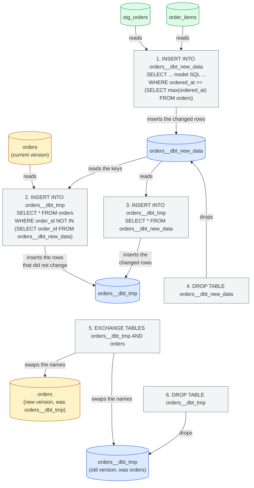
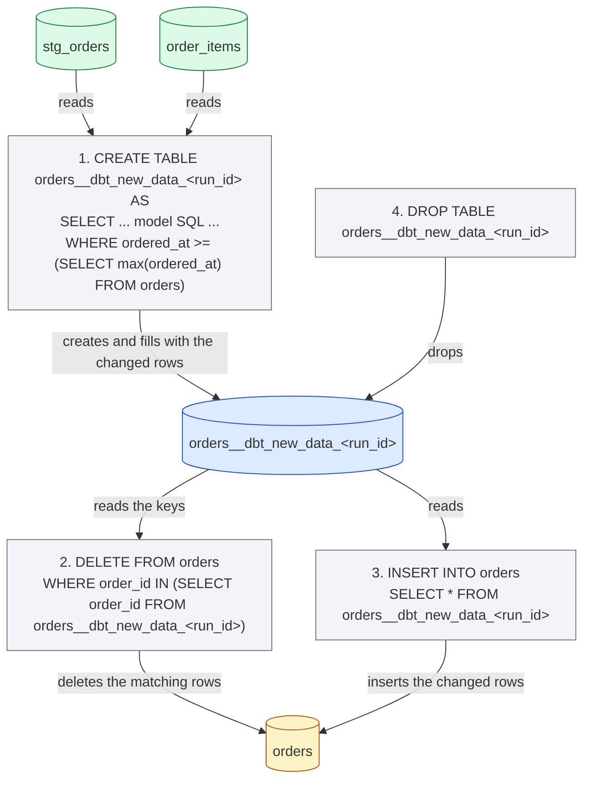
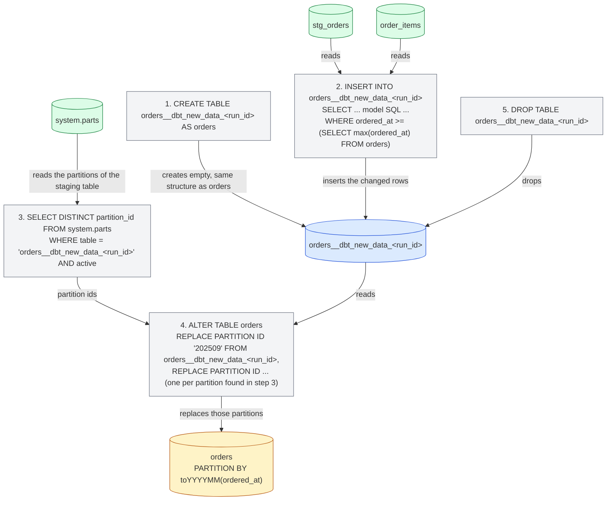

import { ClickHouseSupportedBadge } from "/snippets/components/ClickHouseSupported/ClickHouseSupported.jsx";

<ClickHouseSupportedBadge/>

This guide walks through the ClickHouse-specific side of dbt using the [Jaffle Shop for ClickHouse](https://github.com/ClickHouse/jaffle-shop-clickhouse) project, the ClickHouse port of dbt Labs' classic sample project. Starting from a project that already builds, it shows how to:

1. Understand how the project's views and tables land in ClickHouse.
2. Load data with seeds and control the ClickHouse types and table layout.
3. Configure a table model with a ClickHouse engine, sorting key and partitioning.
4. Turn a table into an incremental model and pick an incremental strategy.
5. Create a snapshot.
6. Use ClickHouse materialized views.

It's designed to be read alongside the rest of the [documentation](/integrations/connectors/data-ingestion/etl-tools/dbt/index), the [features and configurations](/integrations/connectors/data-ingestion/etl-tools/dbt/features-and-configurations) page and the [materializations reference](/integrations/connectors/data-ingestion/etl-tools/dbt/materializations).

## Before you start {#before-you-start}

Follow the README of [ClickHouse/jaffle-shop-clickhouse](https://github.com/ClickHouse/jaffle-shop-clickhouse) first. It explains how to set the project up with dbt Core 1.x, dbt Core v2 or the dbt platform, how to point it at a local ClickHouse (docker) or ClickHouse Cloud, how to load the sample data with `dbt seed`, and how to run the first `dbt build`. Once `dbt build` completes successfully, come back here for the ClickHouse-specific examples and configurations.

After the README steps you should have two databases in ClickHouse:

- `raw`: the six source tables loaded from CSV files by `dbt seed` (`raw_customers`, `raw_orders`, `raw_items`, `raw_products`, `raw_stores`, `raw_supplies`).
- `jaffle_shop` (the `schema` of your profile): six staging views (`stg_*`) and seven mart tables (`customers`, `orders`, `order_items`, `products`, `locations`, `supplies`, `metricflow_time_spine`).

If your profile uses a different `schema`, replace `jaffle_shop` in the queries below with your value.

<Note>
**dbt Core 1.x, dbt Core v2 and the dbt platform.** Every command and model in this guide is the same on all three. The examples were tested with dbt Core 1.12 with `dbt-clickhouse` 1.10 and with dbt Core v2 2.0 against ClickHouse 26.8; the dbt platform runs the dbt Core v2 engine. The console output shown is from dbt Core 1.x, and the few places where the engines behave differently are called out. See the [dbt Core v2 page](/integrations/connectors/data-ingestion/etl-tools/dbt/dbt-core-v2-fusion-and-platform) for the current status of the v2 adapter, and [Connect ClickHouse](https://docs.getdbt.com/docs/platform/connect-data-platform/connect-clickhouse) in the dbt documentation to get started on the dbt platform.
</Note>

All SQL statements that aren't dbt commands are meant to be run directly against ClickHouse, for example with `clickhouse client`, the ClickHouse Cloud SQL console or the SQL client of your choice.

## How the project is materialized {#views-and-tables}

The Jaffle Shop configures its materializations in `dbt_project.yml`: staging models are views and marts are tables.

```yaml
models:
  jaffle_shop:
    staging:
      +materialized: view
    marts:
      +materialized: table
```

A **view** model is rebuilt with a `CREATE OR REPLACE VIEW` statement on every run. It stores no data, so it costs nothing to build, but every query against it runs the model's SQL against the source tables. ClickHouse keeps the compiled SQL of the model in the view definition:

```sql
SHOW CREATE VIEW jaffle_shop.stg_orders;
```

```response
CREATE VIEW jaffle_shop.stg_orders
(
    `order_id` String,
    `location_id` String,
    `customer_id` String,
    ...
    `ordered_at` DateTime
)
AS WITH
    source AS
    (
        SELECT *
        FROM raw.raw_orders
    ),
    renamed AS
    (
        SELECT
            id AS order_id,
            store_id AS location_id,
            ...
            dateTrunc('day', ordered_at) AS ordered_at
        FROM source
    )
SELECT *
FROM renamed
```

A **table** model is rebuilt from scratch on every run: the adapter creates a new table, runs an `INSERT INTO ... SELECT` with the model's SQL and atomically exchanges it with the previous version. Query performance is much better than a view, at the cost of storage and of rebuilding the whole table every time. Look at the table dbt created for the `orders` mart:

```sql
SHOW CREATE TABLE jaffle_shop.orders;
```

```response
CREATE TABLE jaffle_shop.orders
(
    `order_id` String,
    `location_id` String,
    `customer_id` String,
    ...
    `customer_order_number` UInt64
)
ENGINE = MergeTree
ORDER BY tuple()
SETTINGS replicated_deduplication_window = '0', index_granularity = 8192
```

Two things are ClickHouse-specific here. The model doesn't declare a table engine, so the adapter uses `MergeTree`, and it doesn't declare a sorting key, so the adapter uses `ORDER BY tuple()`, meaning the data isn't sorted at all. This is fine for a sample project, but for a real table you'll want to choose both, which is what the next sections do. The [materializations page](/integrations/connectors/data-ingestion/etl-tools/dbt/materializations) lists every table configuration the adapter supports.

## Loading data with seeds {#seeds}

The Jaffle Shop uses dbt [seeds](https://docs.getdbt.com/docs/build/seeds) to load its raw data from the CSV files in `seeds/jaffle-data`. Seeds are meant for small, static reference data (code tables, mappings), not for loading a warehouse; the project uses them for convenience so you can get going without another ingestion tool, which is why the seeds are disabled unless you pass `--vars '{"load_source_data": true}'`.

Seeds are still a good place to learn how dbt creates ClickHouse tables. dbt infers a column type for each CSV column, and the inferred types differ between engines:

| CSV value | dbt Core 1.x | dbt Core v2 |
|-----------|--------------|-------------|
| `700` | `Int32` | `Int64` |
| `0.06` | `Float32` | `Float64` |
| `2024-09-01T15:01:00` | `DateTime` | `DateTime64(6)` |
| `Philadelphia` | `String` | `String` |

When the type matters, pin it with `column_types`. The project already does this for the `opened_at` column of the `raw_stores` seed in `dbt_project.yml`:

```yaml
seeds:
  jaffle_shop:
    +schema: raw
    jaffle-data:
      +enabled: "{{ var('load_source_data', false) }}"
      raw_stores:
        +column_types:
          opened_at: DateTime64(3)
```

Seeds also accept the ClickHouse table configurations `engine`, `order_by` and `partition_by`. For example, to sort the `raw_orders` seed by order time and partition it by month, add a properties file next to the CSVs, `seeds/jaffle-data/_raw_orders.yml`:

```yaml
seeds:
  - name: raw_orders
    config:
      order_by: (ordered_at, id)
      partition_by: toYYYYMM(ordered_at)
```

<Note>
Use a properties file for these ClickHouse seed configurations rather than `+order_by` or `+engine` keys under `seeds:` in `dbt_project.yml`. dbt Core 1.x accepts both forms, but dbt Core v2 only recognizes them in a properties file and rejects the `dbt_project.yml` keys with `Unrecognized key ... Custom keys must go under +meta`.
</Note>

Re-load that seed and check the table it produced:

```bash
dbt seed --select raw_orders --full-refresh --vars '{"load_source_data": true}'
```

```sql
SHOW CREATE TABLE raw.raw_orders;
```

```response
CREATE TABLE raw.raw_orders
(
    `id` String,
    `customer` String,
    `ordered_at` DateTime,
    `store_id` String,
    `subtotal` Int32,
    `tax_paid` Int32,
    `order_total` Int32
)
ENGINE = MergeTree
PARTITION BY toYYYYMM(ordered_at)
ORDER BY (ordered_at, id)
SETTINGS index_granularity = 8192
```

`dbt seed --full-refresh` drops and recreates the table, so run it before you build anything that depends on the table's data directly, such as the materialized view later in this guide.

## Configuring a table for ClickHouse {#table-configuration}

The `orders` mart is the natural place to start: it's queried by the `customers` mart and by the project's metrics, and it's an event-style table with a timestamp. Add a `config` block at the top of `models/marts/orders.sql` to choose the engine, the sorting key and a partitioning scheme:

```sql
{{
    config(
        materialized='table',
        engine='MergeTree()',
        order_by='(ordered_at, order_id)',
        partition_by='toYYYYMM(ordered_at)'
    )
}}

with

orders as (

    select * from {{ ref('stg_orders') }}

),
...
```

The rest of the model stays as it is. `materialized='table'` repeats what `dbt_project.yml` already says for marts, which keeps the model self-describing when you switch it to incremental later. Rebuild only this model:

```bash
dbt run --select orders
```

```response
1 of 1 START sql table model `jaffle_shop`.`orders` ............................ [RUN]
1 of 1 OK created sql table model `jaffle_shop`.`orders` ....................... [OK in 0.44s]
```

The table now has a proper sorting key and one partition per month:

```sql
SHOW CREATE TABLE jaffle_shop.orders;
```

```response
CREATE TABLE jaffle_shop.orders
(
    ...
)
ENGINE = MergeTree
PARTITION BY toYYYYMM(ordered_at)
ORDER BY (ordered_at, order_id)
SETTINGS replicated_deduplication_window = '0', index_granularity = 8192
```

```sql
SELECT partition, sum(rows) AS rows
FROM system.parts
WHERE database = 'jaffle_shop' AND table = 'orders' AND active
GROUP BY partition
ORDER BY partition;
```

```response
┌─partition─┬─rows─┐
│ 202409    │ 1497 │
│ 202410    │ 1698 │
│ 202411    │ 2262 │
...
│ 202508    │ 9389 │
└───────────┴──────┘
```

Besides `engine`, `order_by` and `partition_by`, table models accept `primary_key`, `ttl`, `settings`, `query_settings`, `projections` and `indexes`, and columns can carry `codec` and `ttl` through a model contract. They're all described in the [materializations page](/integrations/connectors/data-ingestion/etl-tools/dbt/materializations).

## Creating an incremental model {#incremental}

Rebuilding `orders` from scratch on every run is fine for 62,000 rows, but not for a table that grows by millions of rows a day. dbt's [incremental materialization](https://docs.getdbt.com/docs/build/incremental-models) only processes the rows that changed since the last run. Converting the `orders` model requires two additions:

1. **`unique_key`**: the column that identifies a row, `order_id` here. The adapter uses it to replace rows that are processed again instead of duplicating them.
2. **An incremental filter**: a `where` clause wrapped in `` that selects only the rows to process. It's applied on incremental runs but not when the table is first built (or rebuilt with `--full-refresh`). Orders carry a timestamp, so the filter compares `ordered_at` against the latest value already in the table, referenced through the `{{ this }}` variable.

Update `models/marts/orders.sql` so the `config` block and the end of the model look like this:

```sql
{{
    config(
        materialized='incremental',
        unique_key='order_id',
        engine='MergeTree()',
        order_by='(ordered_at, order_id)',
        partition_by='toYYYYMM(ordered_at)'
    )
}}

with

orders as (

    select * from {{ ref('stg_orders') }}

),

...

select * from customer_order_count



-- this filter will only be applied on an incremental run
where ordered_at >= (select max(ordered_at) from {{ this }})


```

`stg_orders` truncates `ordered_at` to the day, so the filter uses `>=`: on every run the whole latest day is processed again and, thanks to `unique_key`, the rows already loaded are replaced rather than duplicated. That's what makes it safe for orders that arrive later on the same day.

Run the model. The table already exists, so this first run is already an incremental one: only the latest day is re-processed.

```bash
dbt run --select orders
```

```response
1 of 1 START sql incremental model `jaffle_shop`.`orders` ...................... [RUN]
1 of 1 OK created sql incremental model `jaffle_shop`.`orders` ................. [OK in 0.94s]
```

Now add some new data. The Jaffle Shop data ends in August 2025, so we introduce a new customer, Clicky McClickHouse, who ordered a jaffle yesterday. Insert a customer, an order and its order item in the raw tables:

```sql
INSERT INTO raw.raw_customers VALUES ('clicky-0001', 'Clicky McClickHouse');

INSERT INTO raw.raw_orders VALUES
    ('clicky-order-0001', 'clicky-0001', now() - INTERVAL 1 DAY,
     '4b6c2304-2b9e-41e4-942a-cf11a1819378', 1100, 66, 1166);

INSERT INTO raw.raw_items VALUES ('clicky-item-0001', 'clicky-order-0001', 'JAF-001');
```

The store id is Philadelphia, the item is a `nutellaphone who dis?` jaffle at 11.00 and the tax is Philadelphia's 6%, so the project's data tests still pass. Run the whole project so the staging views and the `order_items` table see the new rows before `orders` does:

```bash
dbt run
```

```response
...
10 of 13 OK created sql table model `jaffle_shop`.`order_items` ................ [OK in 0.30s]
...
12 of 13 START sql incremental model `jaffle_shop`.`orders` .................... [RUN]
12 of 13 OK created sql incremental model `jaffle_shop`.`orders` ............... [OK in 0.73s]
13 of 13 START sql table model `jaffle_shop`.`customers` ....................... [RUN]
13 of 13 OK created sql table model `jaffle_shop`.`customers` .................. [OK in 0.28s]
```

The new order is in the incremental table and the `customers` mart, rebuilt from it, knows about the new customer:

```sql
SELECT order_id, customer_id, ordered_at, order_total, customer_order_number
FROM jaffle_shop.orders
WHERE customer_id = 'clicky-0001';
```

```response
┌─order_id──────────┬─customer_id─┬──────────ordered_at─┬─order_total─┬─customer_order_number─┐
│ clicky-order-0001 │ clicky-0001 │ 2026-09-14 00:00:00 │       11.66 │                     1 │
└───────────────────┴─────────────┴─────────────────────┴─────────────┴───────────────────────┘
```

```sql
SELECT customer_name, count_lifetime_orders, lifetime_spend, customer_type
FROM jaffle_shop.customers
WHERE customer_id = 'clicky-0001';
```

```response
┌─customer_name───────┬─count_lifetime_orders─┬─lifetime_spend─┬─customer_type─┐
│ Clicky McClickHouse │                     1 │          11.66 │ new           │
└─────────────────────┴───────────────────────┴────────────────┴───────────────┘
```

### Internals {#internals}

ClickHouse's query log shows the statements the adapter ran for the incremental update:

```sql
SELECT event_time, written_rows, tables
FROM system.query_log
WHERE query_kind = 'Insert' AND type = 'QueryFinish'
  AND has(databases, 'jaffle_shop')
  AND event_time > now() - INTERVAL 15 MINUTE
ORDER BY event_time;
```

The default incremental strategy of the adapter works as follows. In the diagrams of this section, an arrow from a table to a statement means the statement reads that table; an arrow from a statement to a table means it writes to, mutates, renames or drops it:

1. A table `orders__dbt_new_data` is created and the model's SQL, including the incremental filter, is inserted into it. In the run above, 378 rows were written: the 377 orders of the latest day already loaded plus the new one.
2. A table `orders__dbt_tmp` is created with the same structure as `orders`, and all rows of `orders` whose `order_id` isn't in `orders__dbt_new_data` are copied into it.
3. All rows of `orders__dbt_new_data` are inserted into `orders__dbt_tmp`. Steps 2 and 3 are what replaces the rows of the latest day instead of duplicating them.
4. `orders__dbt_new_data` is dropped.
5. `orders__dbt_tmp` is swapped with `orders` using an atomic `EXCHANGE TABLES` statement (through an intermediate rename to `orders__dbt_backup`), so `orders` now holds the new version.
6. The old version is dropped.



Step 2 copies the whole table, so this strategy is as expensive as a table rebuild on very large models; see the [limitations](/integrations/connectors/data-ingestion/etl-tools/dbt/index#limitations). The strategies below avoid the copy.

### Append strategy {#append-strategy}

The `append` strategy inserts the rows selected by the model straight into the target table. No temporary tables are created and nothing is copied, so it's as cheap as an incremental run can be. The price is that nothing is deduplicated either: if the incremental filter selects a row that's already in the table, you get it twice. Use it for immutable, event-style data, and make sure the filter only selects genuinely new rows.

With the day-truncated `ordered_at`, that means switching the filter to `>`. Change the model:

```sql
{{
    config(
        materialized='incremental',
        incremental_strategy='append',
        unique_key='order_id',
        engine='MergeTree()',
        order_by='(ordered_at, order_id)',
        partition_by='toYYYYMM(ordered_at)'
    )
}}

...



-- this filter will only be applied on an incremental run
where ordered_at > (select max(ordered_at) from {{ this }})


```

Add a second new customer, Danny DeBito, with an order placed today in Brooklyn (4% tax) containing a jaffle and a coffee:

```sql
INSERT INTO raw.raw_customers VALUES ('danny-0001', 'Danny DeBito');

INSERT INTO raw.raw_orders VALUES
    ('danny-order-0001', 'danny-0001', now(),
     '40e6ddd6-b8f6-4e17-8bd6-5e53966809d2', 1900, 76, 1976);

INSERT INTO raw.raw_items VALUES
    ('danny-item-0001', 'danny-order-0001', 'JAF-003'),
    ('danny-item-0002', 'danny-order-0001', 'BEV-004');
```

```bash
dbt run
```

```response
...
12 of 13 START sql incremental model `jaffle_shop`.`orders` .................... [RUN]
12 of 13 OK created sql incremental model `jaffle_shop`.`orders` ............... [OK in 0.11s]
...
```

The incremental model ran in a fraction of the time of the previous run. Both new customers have exactly one order in the table:

```sql
SELECT order_id, customer_id, ordered_at, order_total, is_food_order, is_drink_order
FROM jaffle_shop.orders
WHERE customer_id IN ('clicky-0001', 'danny-0001')
ORDER BY ordered_at;
```

```response
┌─order_id──────────┬─customer_id─┬──────────ordered_at─┬─order_total─┬─is_food_order─┬─is_drink_order─┐
│ clicky-order-0001 │ clicky-0001 │ 2026-09-14 00:00:00 │       11.66 │             1 │              0 │
│ danny-order-0001  │ danny-0001  │ 2026-09-15 00:00:00 │       19.76 │             1 │              1 │
└───────────────────┴─────────────┴─────────────────────┴─────────────┴───────────────┴────────────────┘
```

The query log confirms the difference: this time the only statement touching `orders` is a single `INSERT INTO jaffle_shop.orders ... SELECT ...` with the model's SQL and the incremental filter, and it wrote one row.

<Warning>
With `>` and a day-truncated timestamp, an order that arrives later on the same day as the latest loaded order is never picked up. In a real project, filter on a timestamp with full precision, or on a monotonically increasing ingestion time, when you use the `append` strategy.
</Warning>

### Delete and insert strategy {#delete-insert-strategy}

Historically ClickHouse has had only limited support for updates and deletes, in the form of asynchronous [mutations](/reference/statements/alter/index). These can be extremely IO-intensive and should generally be avoided. ClickHouse 22.8 introduced [lightweight deletes](/reference/statements/delete) and ClickHouse 25.7 introduced [lightweight updates](/reference/statements/update). With these, the effect of a single delete or update statement is visible immediately from the user's perspective even though it's materialized asynchronously.

The `delete+insert` strategy relies on lightweight deletes and is configured through the `incremental_strategy` parameter:

```sql
{{
    config(
        materialized='incremental',
        incremental_strategy='delete+insert',
        unique_key='order_id',
        engine='MergeTree()',
        order_by='(ordered_at, order_id)',
        partition_by='toYYYYMM(ordered_at)'
    )
}}
```

It operates directly on the target table, so if something fails halfway the data in the incremental model is likely to be in an invalid state: there is no atomic swap. In summary:

1. A temporary table (`orders__dbt_new_data_<run_id>`) is created and the rows selected by the model are inserted into it.
2. A `DELETE` is issued against `orders` for every `order_id` present in the temporary table.
3. The rows of the temporary table are inserted into `orders`.
4. The temporary table is dropped.



### Insert overwrite strategy (experimental) {#insert-overwrite-strategy}

The `insert_overwrite` strategy replaces whole partitions, so it needs a `partition_by` configuration like the monthly one on `orders`. It performs the following steps:

1. Create a staging table (`orders__dbt_new_data_<run_id>`) with the same structure as `orders`.
2. Insert only the rows selected by the model into the staging table.
3. List the partitions present in the staging table from `system.parts`.
4. Replace exactly those partitions in `orders` with `ALTER TABLE ... REPLACE PARTITION ... FROM` the staging table.
5. Drop the staging table.

This approach has the following advantages:

* It's faster than the default strategy because it doesn't copy the entire table.
* It's safer than the other strategies because it doesn't modify the original table until the INSERT operation completes successfully: in case of an intermediate failure, the original table isn't modified.
* It implements the "partition immutability" data engineering best practice, which simplifies incremental and parallel data processing, rollbacks, etc.



The [materializations page](/integrations/connectors/data-ingestion/etl-tools/dbt/materializations#materialization-incremental) covers the remaining options of the incremental materialization, including the `microbatch` strategy and `on_schema_change`.

## Creating a snapshot {#snapshot}

dbt [snapshots](https://docs.getdbt.com/docs/build/snapshots) record how the rows of a mutable table change over time, so analysts can look back at the state of the data at any point in the past. They implement [type-2 slowly changing dimensions](https://en.wikipedia.org/wiki/Slowly_changing_dimension#Type_2:_add_new_row): each version of a row is stored with the interval during which it was valid.

The `customers` mart is a good candidate: `count_lifetime_orders`, `lifetime_spend` and `customer_type` all change every time a customer orders again. Before continuing, set the `orders` model back to the default incremental strategy from the [incremental section](#incremental) (remove `incremental_strategy='append'` and change the filter back to `>=`), so orders placed later today are picked up.

Snapshots are defined in YAML since dbt 1.9. Create `snapshots/customers_snapshot.yml`:

```yaml
snapshots:
  - name: customers_snapshot
    relation: ref('customers')
    config:
      unique_key: customer_id
      strategy: check
      check_cols:
        - count_lifetime_orders
        - lifetime_spend
        - customer_type
```

The `check` strategy compares the listed columns between the current snapshot and the source on every run and records a new version whenever any of them changed. If your model has a reliable "last updated" timestamp column, the `timestamp` strategy is cheaper: set `strategy: timestamp` and `updated_at: <column>`. The Jaffle Shop's `last_ordered_at` is truncated to the day, so it wouldn't catch a second order on the same day, which is why this example uses `check`.

Take the first snapshot:

```bash
dbt snapshot
```

```response
1 of 1 START snapshot `jaffle_shop`.`customers_snapshot` ....................... [RUN]
1 of 1 OK snapshotted `jaffle_shop`.`customers_snapshot` ....................... [OK in 0.17s]
```

The snapshot table is created next to the models. The project's `generate_schema_name` macro puts every relation in the target schema for non-production targets, so a `schema` config on the snapshot would only take effect with the `prod` target. It contains one row per customer, with the dbt bookkeeping columns `dbt_valid_from` and `dbt_valid_to`; the latter is `NULL` for the current version of a row:

```sql
SELECT customer_id, count_lifetime_orders, lifetime_spend, customer_type, dbt_valid_from, dbt_valid_to
FROM jaffle_shop.customers_snapshot
WHERE customer_id IN ('clicky-0001', 'danny-0001')
ORDER BY customer_id, dbt_valid_from;
```

```response
┌─customer_id─┬─count_lifetime_orders─┬─lifetime_spend─┬─customer_type─┬──────dbt_valid_from─┬─dbt_valid_to─┐
│ clicky-0001 │                     1 │          11.66 │ new           │ 2026-09-15 01:15:32 │         ᴺᵁᴸᴸ │
│ danny-0001  │                     1 │          19.76 │ new           │ 2026-09-15 01:15:32 │         ᴺᵁᴸᴸ │
└─────────────┴───────────────────────┴────────────────┴───────────────┴─────────────────────┴──────────────┘
```

Clicky comes back for a coffee today:

```sql
INSERT INTO raw.raw_orders VALUES
    ('clicky-order-0002', 'clicky-0001', now(),
     '4b6c2304-2b9e-41e4-942a-cf11a1819378', 600, 36, 636);

INSERT INTO raw.raw_items VALUES ('clicky-item-0002', 'clicky-order-0002', 'BEV-001');
```

Run the models so `orders` and `customers` reflect the new order, then take a second snapshot:

```bash
dbt run
dbt snapshot
```

```response
1 of 1 START snapshot `jaffle_shop`.`customers_snapshot` ....................... [RUN]
1 of 1 OK snapshotted `jaffle_shop`.`customers_snapshot` ....................... [OK in 0.73s]
```

Clicky now has two rows in the snapshot. The first version was closed by setting its `dbt_valid_to`, and the new version, now a `returning` customer with two orders, is open. Danny didn't change, so his row is untouched:

```sql
SELECT customer_id, count_lifetime_orders, lifetime_spend, customer_type, dbt_valid_from, dbt_valid_to
FROM jaffle_shop.customers_snapshot
WHERE customer_id IN ('clicky-0001', 'danny-0001')
ORDER BY customer_id, dbt_valid_from;
```

```response
┌─customer_id─┬─count_lifetime_orders─┬─lifetime_spend─┬─customer_type─┬──────dbt_valid_from─┬────────dbt_valid_to─┐
│ clicky-0001 │                     1 │          11.66 │ new           │ 2026-09-15 01:15:32 │ 2026-09-15 01:16:16 │
│ clicky-0001 │                     2 │          18.02 │ returning     │ 2026-09-15 01:16:16 │                ᴺᵁᴸᴸ │
│ danny-0001  │                     1 │          19.76 │ new           │ 2026-09-15 01:15:32 │                ᴺᵁᴸᴸ │
└─────────────┴───────────────────────┴────────────────┴───────────────┴─────────────────────┴─────────────────────┘
```

Under the hood the adapter builds the new version of the snapshot in a table `customers_snapshot__snapshot_upsert` and swaps it in with `EXCHANGE TABLES` (or a drop and rename where the server can't exchange tables), so readers see either the previous or the new version of the snapshot. See the [snapshot section of the materializations page](/integrations/connectors/data-ingestion/etl-tools/dbt/materializations#snapshot) for the configuration reference.

## Using materialized views {#materialized-views}

Everything so far needs a `dbt run` to bring new data into the models. ClickHouse [materialized views](/concepts/features/materialized-views/index) work differently: they're insert triggers. Every block of rows inserted into the source table is transformed by the view's `SELECT` and written into a target table, with no scheduling involved. The adapter exposes them through the `materialized_view` materialization.

Create `models/marts/daily_store_revenue.sql` with the number of orders and the revenue per store and day, reading directly from the raw orders table:

```sql
{{
    config(
        materialized='materialized_view',
        engine='SummingMergeTree()',
        order_by='(order_date, store_id)'
    )
}}

select
    toDate(ordered_at) as order_date,
    store_id,
    count() as orders,
    sum(order_total) as revenue_cents
from {{ source('ecom', 'raw_orders') }}
group by order_date, store_id
```

The `engine` and `order_by` apply to the target table. `SummingMergeTree` adds up the numeric columns of rows that share the same sorting key when it merges parts, which is exactly what a per-day, per-store aggregate needs.

```bash
dbt run --select daily_store_revenue
```

```response
1 of 1 START sql materialized_view model `jaffle_shop`.`daily_store_revenue` ... [RUN]
1 of 1 OK created sql materialized_view model `jaffle_shop`.`daily_store_revenue`  [OK in 0.25s]
```

The adapter created two objects: the target table, named after the model, and the materialized view itself with the `_mv` suffix, pointing at the target table with a `TO` clause. By default (`catchup=True`) the target table was also backfilled with the existing orders:

```sql
SELECT name, engine
FROM system.tables
WHERE database = 'jaffle_shop' AND name LIKE 'daily_store_revenue%';
```

```response
┌─name───────────────────┬─engine───────────┐
│ daily_store_revenue    │ SummingMergeTree │
│ daily_store_revenue_mv │ MaterializedView │
└────────────────────────┴──────────────────┘
```

```sql
SHOW CREATE TABLE jaffle_shop.daily_store_revenue_mv;
```

```response
CREATE MATERIALIZED VIEW jaffle_shop.daily_store_revenue_mv TO jaffle_shop.daily_store_revenue
(
    `order_date` Date,
    `store_id` String,
    `orders` UInt64,
    `revenue_cents` Int64
)
AS SELECT
    toDate(ordered_at) AS order_date,
    store_id,
    count() AS orders,
    sum(order_total) AS revenue_cents
FROM raw.raw_orders
GROUP BY
    order_date,
    store_id
```

Now insert another raw order for Danny, without running dbt afterwards:

```sql
INSERT INTO raw.raw_orders VALUES
    ('danny-order-0002', 'danny-0001', now(),
     '40e6ddd6-b8f6-4e17-8bd6-5e53966809d2', 1400, 56, 1456);

INSERT INTO raw.raw_items VALUES ('danny-item-0003', 'danny-order-0002', 'JAF-004');
```

The target table already reflects it. Brooklyn now has two orders today:

```sql
SELECT order_date, store_id, sum(orders) AS orders, sum(revenue_cents) AS revenue_cents
FROM jaffle_shop.daily_store_revenue
WHERE order_date >= yesterday()
GROUP BY order_date, store_id
ORDER BY order_date, store_id;
```

```response
┌─order_date─┬─store_id─────────────────────────────┬─orders─┬─revenue_cents─┐
│ 2026-09-14 │ 4b6c2304-2b9e-41e4-942a-cf11a1819378 │      1 │          1166 │
│ 2026-09-15 │ 40e6ddd6-b8f6-4e17-8bd6-5e53966809d2 │      2 │          3432 │
│ 2026-09-15 │ 4b6c2304-2b9e-41e4-942a-cf11a1819378 │      1 │           636 │
└────────────┴──────────────────────────────────────┴────────┴───────────────┘
```

The query aggregates with `sum()` and `GROUP BY` on purpose: `SummingMergeTree` only collapses rows with the same key when parts are merged in the background, so until then the two Brooklyn orders are two rows in the table. Always aggregate on read (or use `FINAL`) with summing and aggregating engines. Meanwhile the `orders` incremental model still has a single order for Danny until the next `dbt run`.

Later runs of `dbt run` keep the target table and its data and only update the view definition, with `ALTER TABLE ... MODIFY QUERY` when the change allows it, so it's safe to keep the model in the project. `dbt run --full-refresh` rebuilds the target table and backfills it again (unless `catchup` is `False`). The [materialized views page](/integrations/connectors/data-ingestion/etl-tools/dbt/materialization-materialized-view) covers the rest: schema changes with `on_schema_change`, disabling the backfill with `catchup`, refreshable materialized views, several views feeding the same target and defining the target table as its own model.

## Further information {#further-information}

This guide only touches the surface of dbt. The [dbt documentation](https://docs.getdbt.com/docs/introduction) is the reference for everything that isn't ClickHouse-specific. For the adapter, see the [features and configurations](/integrations/connectors/data-ingestion/etl-tools/dbt/features-and-configurations) page for profile settings and global features, the [materializations page](/integrations/connectors/data-ingestion/etl-tools/dbt/materializations) for every configuration used above, and the [dbt Core v2 page](/integrations/connectors/data-ingestion/etl-tools/dbt/dbt-core-v2-fusion-and-platform) if you run the new engine or the dbt platform. Contributions of new examples to the [Jaffle Shop for ClickHouse](https://github.com/ClickHouse/jaffle-shop-clickhouse) are welcome.
