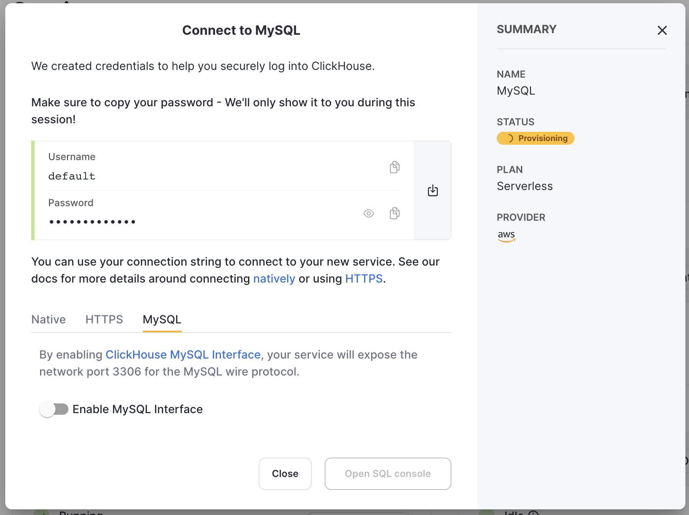
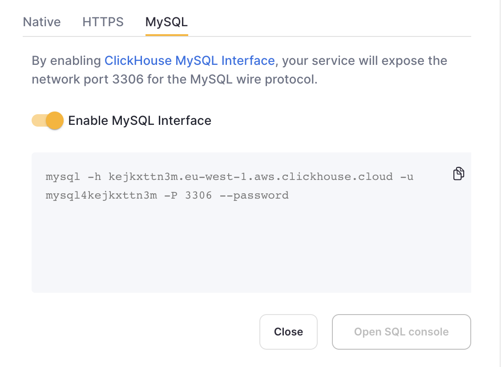
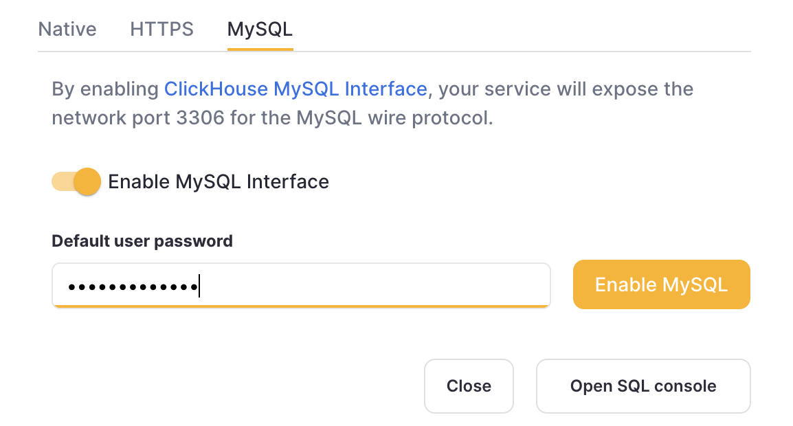
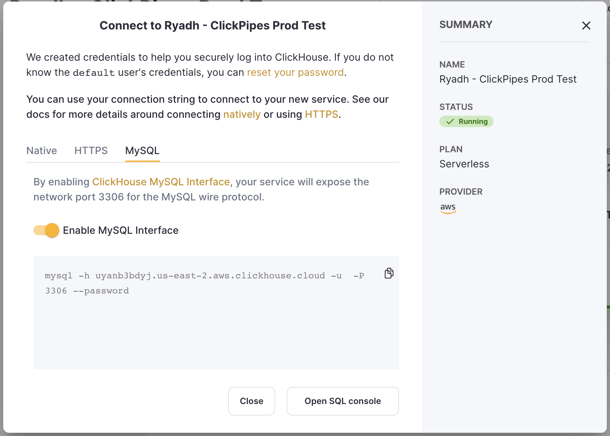

1. ClickHouse Cloud Serviceを作成した後、認証情報画面でMySQLタブを選択します。  
  
2. この特定のサービスに対してMySQLインターフェースを有効にするためにスイッチを切り替えます。これにより、そのサービスでポート`3306`が公開され、ユニークなMySQLユーザー名を含むMySQL接続画面が表示されます。パスワードはサービスのデフォルトユーザーのパスワードと同じになります。  
  
代わりに、既存のサービスに対してMySQLインターフェースを有効にするには:  
3. サービスが`Running`状態であることを確認し、MySQLインターフェースを有効にするサービスの「接続文字列を表示」ボタンをクリックします。  
  
4. この特定のサービスに対してMySQLインターフェースを有効にするためにスイッチを切り替えます。これにより、デフォルトのパスワードを入力するよう求められます。  
  
5. パスワードを入力すると、このサービスのMySQL接続文字列が表示されます。  
  

## ClickHouse Cloudで複数のMySQLユーザーを作成する

デフォルトでは、`mysql4<subdomain>`という組み込みユーザーがあり、これは`default`ユーザーと同じパスワードを使用します。`<subdomain>`部分はあなたのClickHouse Cloudホスト名の最初のセグメントです。このフォーマットは、安全な接続を実装しているが[TLSハンドシェイクでSNI情報を提供しない](https://www.cloudflare.com/learning/ssl/what-is-sni)ツール（MySQLコンソールクライアントがその一例）で作業するために必要です。この場合、ユーザー名に追加のヒントを含めずには内部ルーティングを行うことができません。

これにより、MySQLインターフェースで使用する新しいユーザーを作成する際には、`mysql4<subdomain>_<username>`のフォーマットを使用することを_強くお勧めします_。ここで、`<subdomain>`はあなたのCloudサービスを識別するためのヒントであり、`<username>`は選択した任意のサフィックスです。

:::tip
ClickHouse Cloudホスト名が`foobar.us-east1.aws.clickhouse.cloud`の場合、`<subdomain>`部分は`foobar`に相当し、カスタムMySQLユーザー名は`mysql4foobar_team1`のようになります。
:::

MySQLインターフェースを使用するために追加のユーザーを作成することができます。例えば、追加の設定を適用する必要がある場合などです。

1. オプション - カスタムユーザーに適用する[設定プロフィール](https://clickhouse.com/docs/ja/sql-reference/statements/create/settings-profile)を作成します。たとえば、後で作成するユーザーで接続するときにデフォルトで適用される追加設定を持つ`my_custom_profile`:

    ```sql
    CREATE SETTINGS PROFILE my_custom_profile SETTINGS prefer_column_name_to_alias=1;
    ```

    `prefer_column_name_to_alias`は単なる例として使用されます。ここに他の設定を使用することもできます。
2. 以下のフォーマットを使用して[ユーザーを作成](https://clickhouse.com/docs/ja/sql-reference/statements/create/user)します: `mysql4<subdomain>_<username>` ([上記参照](#creating-multiple-mysql-users-in-clickhouse-cloud))。パスワードはダブルSHA1形式である必要があります。例:

    ```sql
    CREATE USER mysql4foobar_team1 IDENTIFIED WITH double_sha1_password BY 'YourPassword42$';
    ```

    または、このユーザーにカスタムプロフィールを使用したい場合:

    ```sql
    CREATE USER mysql4foobar_team1 IDENTIFIED WITH double_sha1_password BY 'YourPassword42$' SETTINGS PROFILE 'my_custom_profile';
    ```

    ここで、`my_custom_profile`は前に作成したプロフィールの名前です。
3. 新しいユーザーに必要なアクセス権を付与して、目的のテーブルまたはデータベースと対話できるようにします。[権限を付与](https://clickhouse.com/docs/ja/sql-reference/statements/grant)する例として、たとえば`system.query_log`のみのアクセスを付与したい場合:

    ```sql
    GRANT SELECT ON system.query_log TO mysql4foobar_team1;
    ```

4. 作成したユーザーを使用して、MySQLインターフェースでClickHouse Cloudサービスに接続します。

### ClickHouse Cloudでの複数のMySQLユーザーのトラブルシューティング

新しいMySQLユーザーを作成し、MySQL CLIクライアントで接続しているときに以下のエラーが表示された場合：

```
ERROR 2013 (HY000): Lost connection to MySQL server at 'reading authorization packet', system error: 54
```

この場合、ユーザー名が`mysql4<subdomain>_<username>`形式に従っていることを確認してください。[上記](#creating-multiple-mysql-users-in-clickhouse-cloud)で説明されています。
