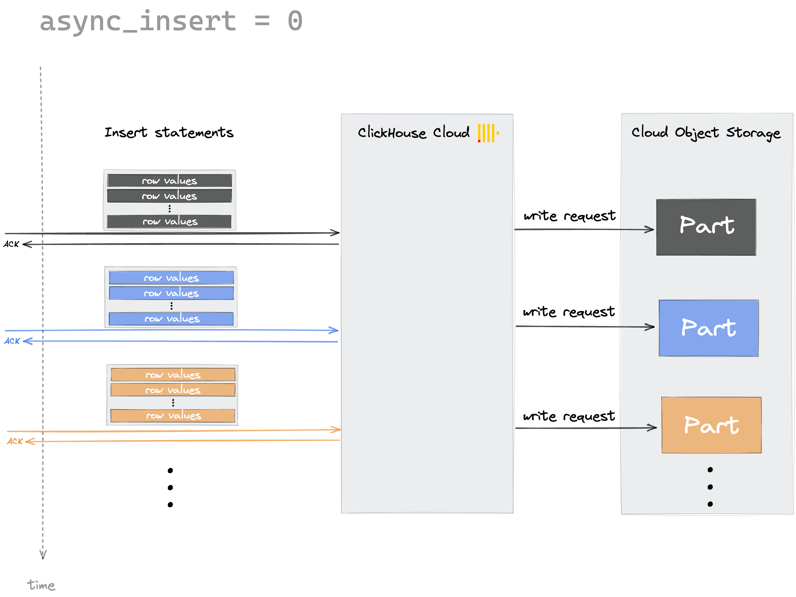
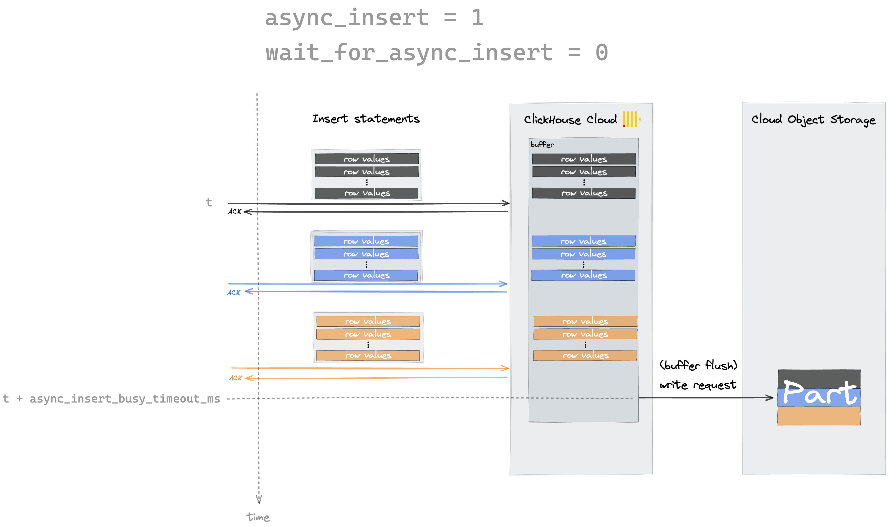
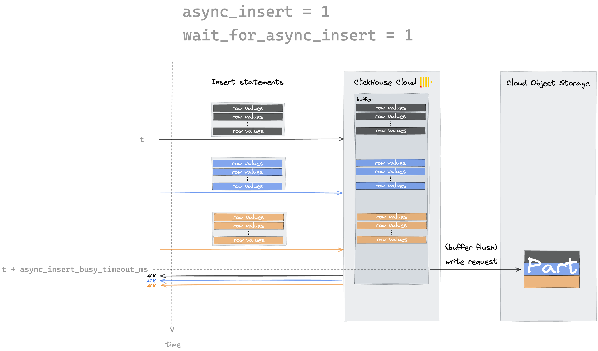

ClickHouseにデータを大規模なバッチで挿入することはベストプラクティスです。これによりコンピュータの演算サイクルとディスクI/Oが節約され、結果的にコストも削減されます。ClickHouse外部でバッチ処理を行うことが可能であれば、それも一つの選択肢ですが、ClickHouseにバッチを作成させたい場合は、ここで説明する非同期INSERTモードを使用できます。

非同期インサートは、クライアント側でデータをバッチ処理し、挿入率を毎秒一つのインサートクエリ程度に維持する代替手段として、[async_insert](/docs/ja/operations/settings/settings.md/#async_insert)設定を有効にして使用します。これにより、ClickHouseがサーバー側でバッチ処理を行います。

デフォルトでは、ClickHouseはデータを同期的に書き込んでいます。ClickHouseに送信された各インサートは、即座にそのデータを含むパートを作成します。これは、async_insert設定がデフォルト値の0に設定されているときのデフォルトの動作です:



async_insertを1に設定すると、ClickHouseはまず受信したインサートをメモリ内バッファに保存し、それを定期的にディスクにフラッシュします。

ClickHouseがバッファをディスクにフラッシュする原因となる可能性がある条件は次の二つです:
- バッファサイズがNバイトに達した（Nは[async_insert_max_data_size](/docs/ja/operations/settings/settings.md/#async-insert-max-data-size)で設定可能）
- 最後のバッファフラッシュからNミリ秒以上が経過した（Nは[async_insert_busy_timeout_ms](/docs/ja/operations/settings/settings.md/#async-insert-busy-timeout-ms)で設定可能）

上記の条件が満たされるたびに、ClickHouseはメモリ内バッファをディスクにフラッシュします。

:::note
データが記憶装置のパートに書き込まれると、読み取りクエリのためにデータが利用可能になります。このことは、`async_insert_busy_timeout_ms`（デフォルトでは1秒に設定）や`async_insert_max_data_size`（デフォルトでは10 MiBに設定）設定を変更する際に考慮してください。
:::

[wait_for_async_insert](/docs/ja/operations/settings/settings.md/#wait-for-async-insert)設定を使うことで、インサートステートメントがバッファにデータを挿入後すぐに応答を返すか（wait_for_async_insert = 0）、あるいは、デフォルトで、バッファからフラッシュしてパートにデータが書き込まれた後で応答を返すか（wait_for_async_insert = 1）を設定できます。

以下の二つの図は、async_insertとwait_for_async_insertの二つの設定を示しています:






### 非同期インサートの有効化

非同期インサートは特定のユーザー、または特定のクエリに対して有効化できます:

- ユーザーレベルでの非同期インサートの有効化。この例ではユーザー`default`を使用していますが、別のユーザーを作成した場合はそのユーザー名に置き換えてください:
  ```sql
  ALTER USER default SETTINGS async_insert = 1
  ```
- インサートクエリのSETTINGS句を使用して非同期インサートの設定を指定できます:
  ```sql
  INSERT INTO YourTable SETTINGS async_insert=1, wait_for_async_insert=1 VALUES (...)
  ```
- また、ClickHouseプログラミング言語クライアントを使用する際に接続パラメータとして非同期インサートの設定を指定することも可能です。

  例として、ClickHouse Cloudに接続するためにClickHouse Java JDBCドライバーを使用する場合、JDBC接続文字列内で次のように指定できます:
  ```bash
  "jdbc:ch://HOST.clickhouse.cloud:8443/?user=default&password=PASSWORD&ssl=true&custom_http_params=async_insert=1,wait_for_async_insert=1"
  ```
非同期インサートを使用する場合、async_insert=1,wait_for_async_insert=1を使用することを強く推奨します。wait_for_async_insert=0を使用することは非常にリスクが高く、INSERTクライアントがエラーを認識できない可能性があり、また、ClickHouseサーバーが書き込み速度を減速させてバックプレッシャーを作成する必要がある状況で、クライアントが高速で書き込みを続けると潜在的なオーバーロードが発生する可能性があるためです。

:::note 非同期インサートを使用する場合、自動重複排除はデフォルトで無効になっています。
手動のバッチ処理（[上記セクション](#ingest-data-in-bulk)参照）は、（正確に）同じインサートステートメントが一時的なネットワーク接続問題によるクライアントソフトウェアでの自動再試行のためClickHouse Cloudに複数回送信される場合に、テーブルデータの[built-in automatic deduplication](/docs/ja/engines/table-engines/mergetree-family/replication.md)をサポートする利点があります。
:::
