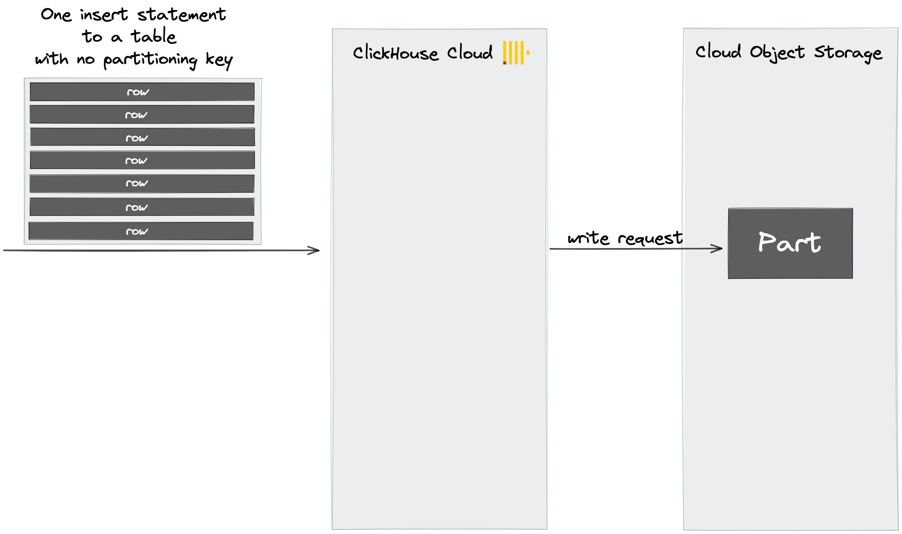
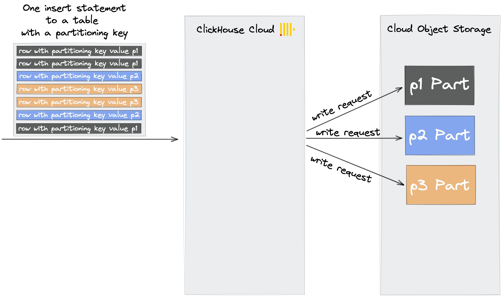

大量の行を含むべき[前のセクション](#ingest-data-in-bulk)で述べたインサートステートメントをClickHouse Cloudのテーブルに送信し、そのテーブルが[パーティションキー](/docs/ja/engines/table-engines/mergetree-family/custom-partitioning-key.md)を使用していない場合、そのインサートからのすべての行データはストレージの新しいパートに書き込まれます。

しかし、ClickHouse Cloudのテーブルにインサートステートメントを送信し、そのテーブルがパーティションキーを持っている場合、ClickHouseは次の処理を行います：
- インサートに含まれる行のパーティションキーの値を確認します
- 異なるパーティションキーの値ごとにストレージに新しいパートを作成します
- パーティションキーの値によって対応するパートに行を配置します

したがって、ClickHouse Cloudオブジェクトストレージへの書き込み要求の数を最小限に抑えるためには、低カーディナリティのパーティションキーを使用するか、テーブルにパーティションキーを使用しないようにすることをお勧めします。
