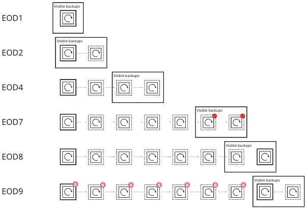
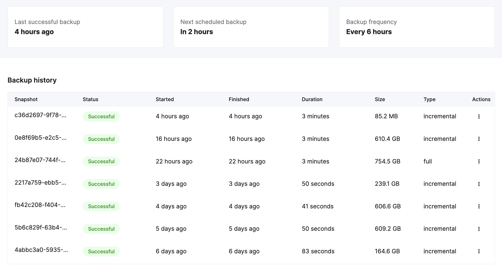
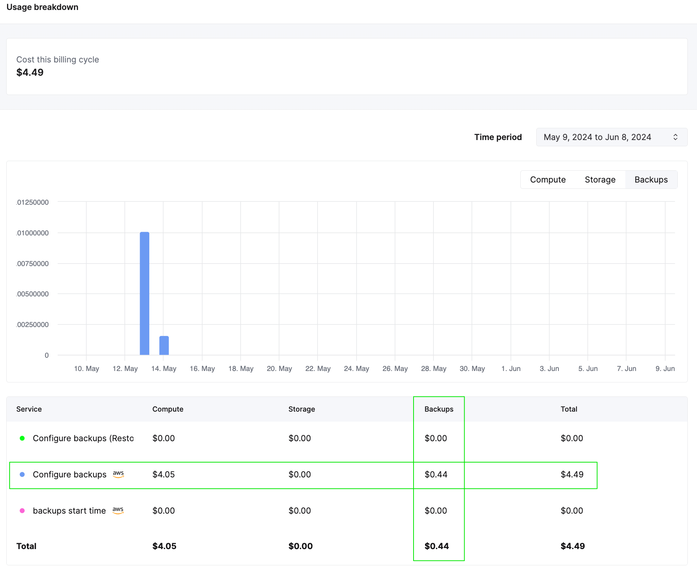
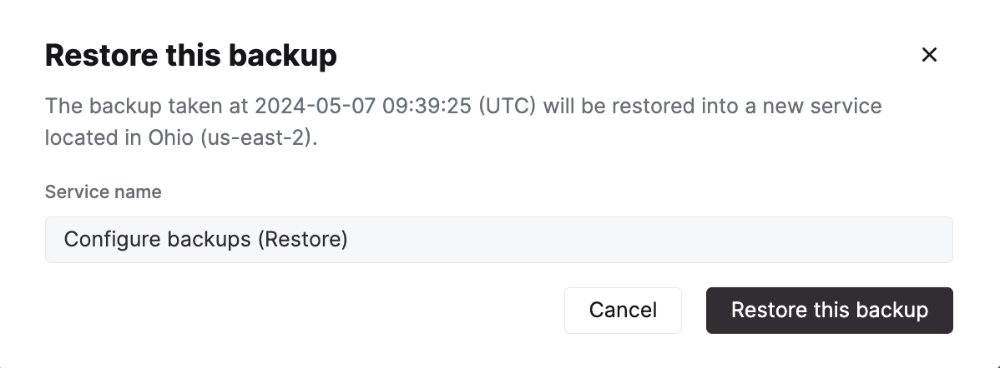

# バックアップ

:::note
ClickHouse Cloudのサービスで`BACKUP`と`RESTORE`コマンドを使用しないでください。クラウドバックアップはUIから管理する必要があります。
:::

データベースのバックアップは、安全な方法を提供し、予期しない理由でデータが失われた場合でも、サービスを以前の正常なバックアップ状態に復元することができます。これにより、ダウンタイムを最小限に抑え、ビジネスに重要なデータが永久に失われることを防ぎます。このガイドでは、ClickHouse Cloudでのバックアップの動作、サービスのバックアップを構成するためのオプション、およびバックアップからの復元方法について説明します。

## ClickHouse Cloudでのバックアップの動作

ClickHouse Cloudのバックアップは、バックアップチェーンを構成する「フル」と「増分」のバックアップの組み合わせです。チェーンはフルバックアップから始まり、その後のスケジュールされた時間に増分バックアップが行われ、バックアップのシーケンスが作成されます。バックアップチェーンが一定の長さに達すると、新しいチェーンが開始されます。このバックアップの全体のチェーンは、必要に応じて新しいサービスにデータを復元するために利用されます。サービスの保持期間（後述）を過ぎると、特定のチェーンに含まれるすべてのバックアップは破棄されます。

以下のスクリーンショットでは、実線の四角形がフルバックアップを示し、点線の四角形が増分バックアップを示しています。実線の四角形で囲まれた領域は保持期間を示し、エンドユーザーに表示されるバックアップを示します。以下のシナリオでは、バックアップは24時間ごとに実行され、2日間保持されます。

Day 1にはバックアップチェーンを開始するためにフルバックアップが行われます。Day 2には増分バックアップが行われ、現在復元可能なフルバックアップと増分バックアップが存在します。Day 7までには、チェーン内に1つのフルバックアップと6つの増分バックアップがあります。ユーザーには最新の2つの増分バックアップが表示されます。Day 8には新しいフルバックアップが行われ、Day 9には新しいチェーンに2つのバックアップがある時点で、以前のチェーンは破棄されます。



*ClickHouse Cloudの**Production**層のデフォルトバックアップポリシーと保持*

## デフォルトバックアップポリシー

ClickHouse Cloudは、サービスのバックアップを毎24時間ごとに作成します。**Production**サービスのバックアップは2日間保持され、**Development**サービスのバックアップは1日間保持されます。以下で説明するようにバックアップスケジュールをカスタマイズしない場合、これがサービスのバックアップスケジュールと保持ポリシーです。ClickHouse Cloudでのデフォルトバックアップには費用はかかりません。

## カスタマイズ可能なバックアップ

ClickHouse Cloudでは、**Production**および**Dedicated**層サービスのバックアップスケジュールを構成することができます。バックアップはビジネスニーズに基づいて次のディメンションに沿って構成できます。

- **保持**: 各バックアップが保持される日数。保持期間は最小で1日から、最大で30日まで指定可能です。
- **頻度**: 次回のバックアップまでの時間を指定することができます。「12時間ごと」の頻度の場合、バックアップは12時間ごとに行われます。頻度は「6時間ごと」から「48時間ごと」まで、次の時間単位で指定できます: 6, 8, 12, 16, 20, 24, 36, 48。
- **開始時刻**: 毎日バックアップをスケジュールしたい開始時刻を指定します。開始時刻を指定すると、バックアップの「頻度」は24時間ごとに1回にデフォルト設定されます。ClickHouse Cloudは指定された開始時刻の1時間以内にバックアップを開始します。

:::note
カスタムスケジュールは、指定されたサービスに対するClickHouse Cloudのデフォルトバックアップポリシーを上書きします。 
:::

サービスのバックアップスケジュールを構成するには、コンソールの**設定**タブに移動し、**バックアップ構成の変更**をクリックします。


これにより、保持期間、頻度、および開始時刻の値を選択できる別のウィンドウが開きます。選択した設定を保存する必要があります。


:::note
開始時刻と頻度は互いに排他的です。開始時刻が優先されます。 
:::

:::note
バックアップスケジュールの変更は、サービスのデフォルトバックアップにカバーされないバックアップがある場合、ストレージに対する月次料金が上昇する可能性があります。「バックアップコストの理解」セクションを参照してください。
:::

## バックアップステータスリスト

サービスの設定したスケジュールに基づいてバックアップが行われます。これはデフォルトの日次スケジュールか、または自分で選んだカスタムスケジュールのいずれかです。利用可能なすべてのバックアップは、サービスの**バックアップ**タブで表示することができます。ここから、バックアップのステータス、期間、サイズを確認できます。また、**操作**列から特定のバックアップを復元することもできます。



## バックアップコストの理解

ClickHouse Cloudは無料で2つのバックアップが含まれていますが、より多くのデータの保持やより頻繁なバックアップを必要とするスケジュールを選択すると、バックアップのストレージに対して追加の料金が発生する可能性があります。デフォルト設定を変更しなければ、バックアップコストは発生しません。

バックアップコストを理解するためには、使用画面からサービスごとのバックアップコストを確認できます（以下に示すように）。カスタマイズしたスケジュールで数日間バックアップが実行された後、コストの見積もりを得て、月次コストを推測することができます。



バックアップの総コストを推定するには、スケジュールを設定する必要があります。また、スケジュールを設定する前に[料金計算機](https://clickhouse.com/pricing)を更新し、月次のコストの見積もりを得るための作業も行っています。コストを見積もるには、以下の入力が必要です:
- フルバックアップと増分バックアップのサイズ
- 希望する頻度
- 希望する保持
- クラウドプロバイダーと地域

:::note
バックアップの推定コストは、サービス内のデータサイズが時間とともに変化（増加）するにつれて変わることを念頭に置いてください。
:::


## バックアップを復元する

バックアップは、元のサービスからバックアップが取られた既存のサービスではなく、新しいClickHouse Cloudサービスに復元されます。

**復元**のバックアップアイコンをクリックした後、新しく作成されるサービスのサービス名を指定し、このバックアップを復元できます：



新しいサービスは`Provisioning`というステータスでサービスリストに表示されます。準備が整うまで：


## 復元されたサービスの利用

バックアップが復元されると、現在の**元のサービス**と、バックアップから復元された新しい**復元されたサービス**の2つの類似したサービスが表示されます。

バックアップの復元が完了したら、次のいずれかを行うべきです：
- 新しい復元されたサービスを使用し、元のサービスを削除します。
- 新しい復元されたサービスから元のサービスにデータを移行し、新しい復元されたサービスを削除します。

### **新しい復元されたサービス**を使用する

新しいサービスを使用するには、次の手順を実行します：

1. 新しいサービスが、利用ケースに必要なIPアクセスリストのエントリを持っていることを確認します。
1. 新しいサービスが必要なデータを含んでいることを確認します。
1. 元のサービスを削除します。

### **新しい復元されたサービス**から**元のサービス**へデータを移行する

新しく復元されたサービスを使用できない理由がある場合（たとえば、既存のサービスに接続するユーザーやアプリケーションがある場合）、新しく復元されたデータを元のサービスに移行することを選択するかもしれません。この移行は次の手順で行うことができます：

**新しく復元されたサービスへのリモートアクセスを許可する**

新しいサービスは通常、元のサービスと同じIPアクセスリストからのバックアップとして復元されます。他のClickHouse Cloudサービスへの接続は許可されていない、またはアクセスが**Anywhere**として許可されていない限り、接続は許可されません。一時的にどこからでもアクセスを許可するために許可リストを変更します。詳細は[IPアクセスリスト](/docs/ja/cloud/security/setting-ip-filters)のドキュメントを参照してください。

**新しく復元されたClickHouseサービスで（復元されたデータをホストしているシステム）**

:::note
新しいサービスにアクセスするためには、パスワードをリセットする必要があります。サービスリストの**設定**タブから行えます。
:::

ソーステーブル（この例では`db.table`）を読み取り可能なユーザーを追加します：

  ```sql
  CREATE USER exporter
  IDENTIFIED WITH SHA256_PASSWORD BY 'password-here'
  SETTINGS readonly = 1;
  ```

  ```sql
  GRANT SELECT ON db.table TO exporter;
  ```

テーブル定義をコピーします：

  ```sql
  select create_table_query
  from system.tables
  where database = 'db' and table = 'table'
  ```

**送信先のClickHouse Cloudシステム上で（破損したテーブルがある所）**

送信先データベースを作成します：
  ```sql
  CREATE DATABASE db
  ```

ソースからの`CREATE TABLE`ステートメントを使用し、送信先を作成します：

:::tip
`CREATE`ステートメントを実行した際に、`ENGINE`を`ReplicatedMergeTree`に変更し、パラメータを省略します。ClickHouse Cloudは常にテーブルを複数コピーし、正しいパラメータを提供します。
:::

  ```sql
  CREATE TABLE db.table ...
  # highlight-next-line
  ENGINE = ReplicatedMergeTree
  ORDER BY ...
  ```

`remoteSecure`関数を使用して、新しく復元されたClickHouse Cloudサービスからデータを元のサービスに取り込みます：

  ```sql
  INSERT INTO db.table SELECT * FROM
  remoteSecure('source-hostname', db, table, 'exporter', 'password-here')
  ```

データを元のサービスに正常に挿入した後、サービス内のデータを確認してください。データが確認後、新しいサービスは削除するべきです。

## テーブルの削除解除または削除取り消し

ClickHouse Cloudは`UNDROP`コマンドをサポートしていません。テーブルを誤って`DROP`した場合、最適な対策は最後のバックアップから復元し、そのバックアップからテーブルを再作成することです。

ユーザーがテーブルを誤って削除することを防ぐために、[`GRANT`文](/docs/ja/sql-reference/statements/grant)を使用して、特定のユーザーまたはロールの[`DROP TABLE`コマンド](/docs/ja/sql-reference/statements/drop#drop-table)の権限を取り消すことができます。

さらに、データの誤削除を防ぐために、ClickHouse Cloudでは>`1TB`を超えるテーブルを削除することはできません。テーブルをこの閾値を超えて削除したい場合は、support@clickhouse.comにお問い合わせください。
