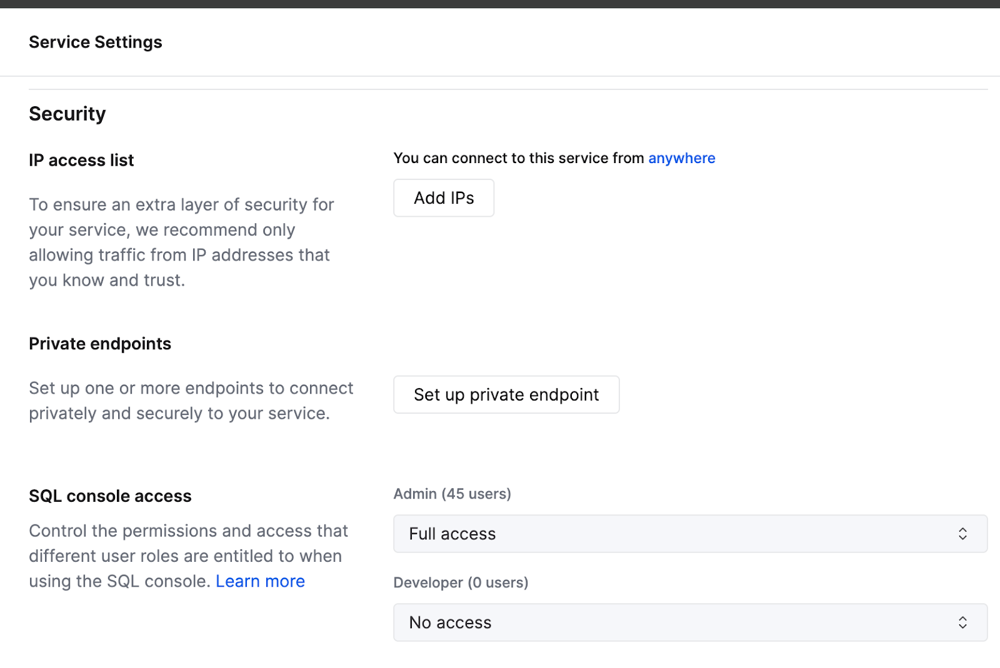
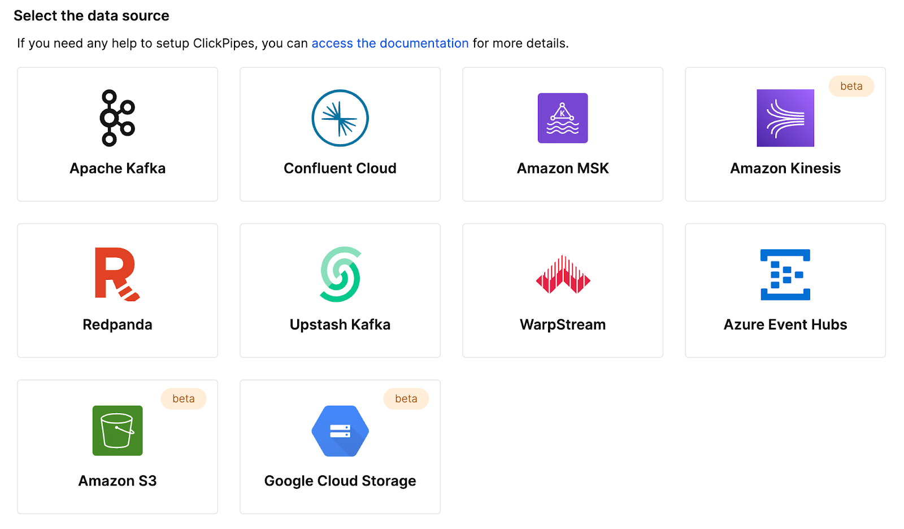
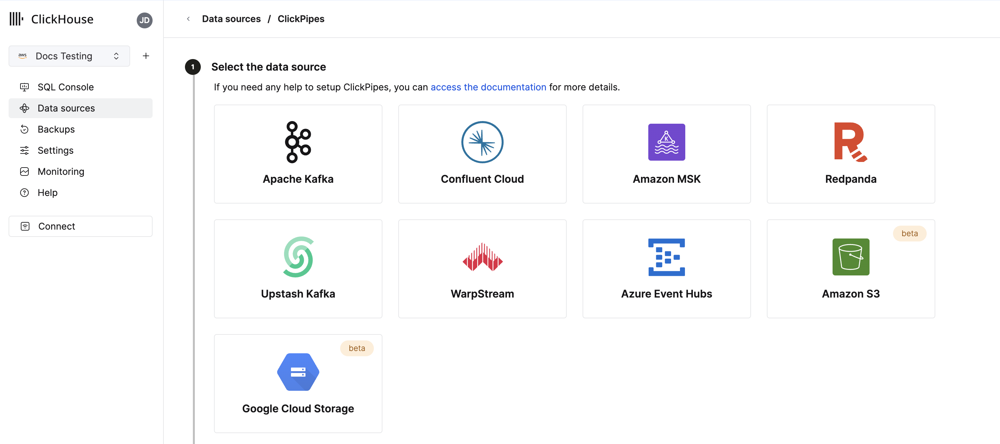
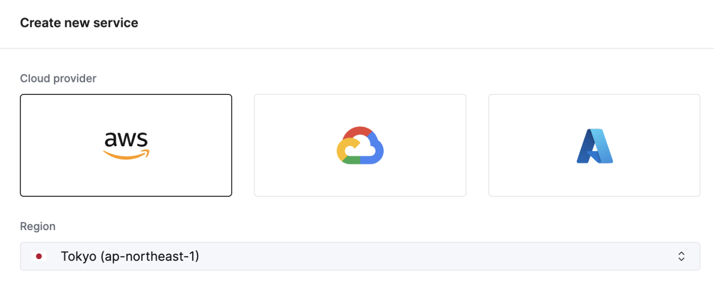

---

slug: /ja/whats-new/cloud
sidebar_label: Cloud Changelog
title: Cloud Changelog

---

このClickHouse Cloudの変更ログに加え、[Cloud Compatibility](/docs/ja/cloud/reference/cloud-compatibility.md)のページもご覧ください。

## 2024年10月4日

### ClickHouse Cloud が GCPでのベータ版HIPAA対応サービスを提供開始

保護された健康情報（PHI）のセキュリティを強化したいと考えているお客様は、[Google Cloud Platform (GCP)](https://cloud.google.com/)上でClickHouse Cloudにオンボードできます。ClickHouseは[HIPAAセキュリティルール](https://www.hhs.gov/hipaa/for-professionals/security/index.html)に基づく管理的、物理的、および技術的な保護策を実施し、用途やワークロードに応じて実装可能なセキュリティ設定が用意されています。利用可能なセキュリティ設定についての詳細は、[Security Shared Responsibility Model](/docs/ja/cloud/security/shared-responsibility-model)をご参照ください。

サービスはGCPの`us-central-1`で、**Dedicated**サービスタイプのお客様向けに提供され、業務協力契約（BAA）が必要です。この機能へのアクセスをリクエストするか、追加のGCP、AWS、Azureのリージョンの待機リストに参加するには、[sales](mailto:sales@clickhouse.com)または[support](https://clickhouse.com/support/program)までお問い合わせください。

### Compute-Compute分離がGCPとAzureでプライベートプレビュー開始

最近、AWSでのCompute-Compute分離のプライベートプレビューを発表しましたが、今回、GCPとAzureでも利用可能になりました。

Compute-Compute分離は、特定のサービスを読み書きまたは読み取り専用のサービスとして指定することができ、アプリケーションに最適なコンピュート構成を設計してコストとパフォーマンスを最適化します。詳細については[ドキュメントをお読みください](/docs/ja/cloud/reference/compute-compute-separation)。

### セルフサービスによるMFAリカバリーコード

多要素認証を使用しているお客様は、携帯電話を紛失した場合やトークンを誤って削除した場合に使用できるリカバリーコードを取得できるようになりました。初めてMFAに登録するお客様には設定時にコードが提供されます。既存のMFAを持つお客様は、既存のMFAトークンを削除して新しいものを追加することでリカバリーコードを取得できます。

### ClickPipesのアップデート: カスタム証明書、レイテンシーインサイトなど！

ClickPipesの最新アップデートをご紹介できることを嬉しく思います。ClickPipesは、ClickHouseサービスにデータを取り込む最も簡単な方法です！これらの新機能は、データ取り込みの制御を強化し、パフォーマンスメトリクスへの可視性を高めるように設計されています。

*Kafka用カスタム認証証明書*

ClickPipes for Kafkaは、SASL＆公開のSSL/TLSを使用するKafkaブローカー用のカスタム認証証明書をサポートします。ClickPipeの設定中にSSL証明書セクションに簡単に自分自身の証明書をアップロードし、Kafkaへのより安全な接続を確保できます。

*KafkaおよびKinesisのレイテンシーメトリクス導入*

パフォーマンスの可視性は重要です。ClickPipesは現在、メッセージプロダクション（KafkaトピックまたはKinesisストリームから）からClickHouse Cloudへの取り込みまでの時間に関するインサイトを提供するレイテンシーグラフを特徴としています。この新しいメトリクスを使用して、データパイプラインのパフォーマンスをより注意深く監視し、それに応じて最適化できます。

 

*KafkaおよびKinesisのスケーリングコントロール(プライベートベータ)*

高スループットは、データ量とレイテンシーのニーズを満たすために追加のリソースを要求することがあります。クリックだけでスケーリングリソースをより効果的に調整できる水平スケーリングをClickPipesで紹介しています。この機能は現在プライベートベータで、要件に基づいてリソースを拡張できます。[support](https://clickhouse.com/support/program)に連絡してベータ版に参加してください。

*KafkaおよびKinesisの生メッセージ取り込み*

KafkaまたはKinesisのメッセージ全体をパースせずに取り込むことが可能になりました。ClickPipesは、完全なメッセージを単一のStringカラムにマッピングできる`_raw_message`[仮想カラム](/docs/ja/integrations/clickpipes/kafka#kafka-virtual-columns)のサポートを提供しており、生データを必要に応じて操作する柔軟性を提供します。

## 2024年8月29日

### 新しいTerraformプロバイダー バージョン - v1.0.0

Terrafromを使用すると、ClickHouse Cloudサービスをプログラムで制御し、構成をコードとして保存できます。私たちのTerraformプロバイダーは20万以上のダウンロードがあり、公式にバージョンv1.0.0になりました！この新しいバージョンは、リトライロジックの改善や、ClickHouse Cloudサービスにプライベートエンドポイントを追加する新しいリソースなどの改良を含んでいます。 [Terraform provider here](https://registry.terraform.io/providers/ClickHouse/clickhouse/latest)および[完全な変更ログはこちら](https://github.com/ClickHouse/terraform-provider-clickhouse/releases/tag/v1.0.0)ダウンロードできます。

### 2024年のSOC 2 Type IIレポートと更新されたISO 27001認証書

Azureで新たに開始されたサービスだけでなく、AWSとGCPでのサービスを含む、2024年のSOC 2 Type IIレポートと更新されたISO 27001認証書の利用開始の発表を誇らしく思います。

SOC 2 Type IIは、ClickHouseユーザーに提供するサービスのセキュリティ、可用性、処理の完全性、および機密性の確保に向けた継続的な取り組みを示しています。詳細については、アメリカ公認会計士協会（AICPA）が発行する[SOC 2 - サービス組織用SOC: 信頼サービス基準](https://www.aicpa-cima.com/resources/landing/system-and-organization-controls-soc-suite-of-services)および国際標準化機構（ISO）の[ISO/IEC 27001について](https://www.iso.org/standard/27001)をご確認ください。

また、当社のセキュリティおよびコンプライアンス文書とレポートについては、当社の [Trust Center](https://trust.clickhouse.com/) もご覧ください。

## 2024年8月15日

### Compute-compute分離がAWSでプライベートプレビュー開始

既存のClickHouse Cloudサービスでは、レプリカが読み取りと書き込みの両方を処理し、特定のレプリカが特定の操作のみを処理するように設定する方法がありませんでした。読み書き可能または読み取り専用のサービスとして特定のサービスを指定でき、アプリケーションの最適なコンピュート構成を設計して、コストとパフォーマンスを最適化する新しい機能であるCompute-compute分離が登場します。

新しいCompute-compute分離機能を使用すると、複数のオブジェクトストレージフォルダと、同じテーブル、ビューなどを使用している各々のエンドポイントを持つ複数のコンピュートノードグループを作成できます。[Compute-compute分離の詳細はこちら](/ja/cloud/reference/compute-compute-separation)。この機能にプライベートプレビューでアクセスしたい場合は、[サポートへの連絡](https://clickhouse.com/support/program)をしてください。

### ClickPipes for S3とGCSがGA（一般提供）に移行、継続モードのサポート

ClickPipesは、ClickHouse Cloudへのデータ取り込みを最も簡単に行う方法です。[ClickPipes](https://clickhouse.com/cloud/clickpipes)がS3およびGCS用として**一般提供**されることを嬉しく思います。ClickPipesは一度限りのバッチ導入と「継続モード」の両方をサポートしています。取り込みタスクは特定のリモートバケットからパターンに一致するすべてのファイルをClickHouse宛先テーブルにロードします。「継続モード」では、ClickPipesジョブは常に実行され、リモートオブジェクトストレージバケットに追加されるマッチするファイルを取り込んでいきます。これにより、任意のオブジェクトストレージ バケットをClickHouse Cloudへのデータ取り込み用の完全なステージングエリアに変えることができます。[関連ドキュメント](/ja/integrations/clickpipes)をお読みください。

## 2024年7月18日

### Prometheusのメトリクスエンドポイントが一般提供に

前回のクラウド変更ログで、ClickHouse Cloudから[Prometheus](https://prometheus.io/)メトリクスをエクスポートするためのプライベートプレビューを発表しました。この機能により、[Grafana](https://grafana.com/)や[Datadog](https://www.datadoghq.com/)などのツールで可視化するために、[ClickHouse Cloud API](/ja/cloud/manage/api/api-overview)からメトリクスを取得することができます。この機能が**一般提供**されることを嬉しく思います。この機能の詳細は[ドキュメント](/ja/integrations/prometheus)をご参照ください。

### クラウドコンソールのテーブルインスペクター

ClickHouseには、テーブルを調査してスキーマを確認するために[`DESCRIBE`](/ja/sql-reference/statements/describe-table)などのコマンドがあります。これらのコマンドはコンソールに出力されますが、テーブルとカラムに関するすべての関連データを取得するためには複数のクエリを組み合わせる必要があるため、しばしば便利ではありません。

クラウドコンソールに**テーブル インスペクター**を新たに導入しました。これにより、SQLを書く必要なくUI上で重要なテーブルとカラム情報を取得できます。クラウドコンソールでテーブルインスペクターを試してみてください。スキーマ、ストレージ、圧縮、その他の情報を一つの統一されたインターフェースで提供します。

### 新しいJavaクライアントAPI

[Java Client](https://github.com/ClickHouse/clickhouse-java)は、ClickHouseに接続するために最も人気のあるクライアントの一つです。これをさらに簡単で直感的に使用できるようにしたいと考えており、新しいAPI設計とさまざまなパフォーマンス最適化を含む変更を行いました。これにより、JavaアプリケーションからClickHouseへの接続が大幅に容易になります。[こちらのブログ投稿](https://clickhouse.com/blog/java-client-sequel)で、更新されたJavaクライアントの使用方法について詳しくお読みいただけます。

### 新しいアナライザーがデフォルトで有効化

過去数年にわたり、クエリアナリシスと最適化のための新しいアナライザーに取り組んでいます。このアナライザーはクエリ性能を向上させ、さらなる最適化を可能にします。これには、より高速かつ効率的な`JOIN`を含みます。以前は、この機能を有効にするために新しいユーザーは`allow_experimental_analyzer`設定を使用する必要がありました。この改良されたアナライザーは新しいClickHouse Cloudサービスでデフォルトで利用できます。

さらなる最適化を計画しており、アナライザーの改善が続くことをお楽しみください！

## 2024年6月28日

### ClickHouse CloudがMicrosoft Azureで一般提供開始！

[今年の5月](https://clickhouse.com/blog/clickhouse-cloud-is-now-on-azure-in-public-beta)にベータ版でMicrosoft Azureサポートを最初に発表しました。最新のクラウドリリースでは、Azureのサポートがベータから一般提供へ移行します。ClickHouse CloudはAWS、Google Cloud Platform、そしてMicrosoft Azureという三大クラウドプラットフォームのすべてで利用可能です。

このリリースには、[Microsoft Azure Marketplace](https://azuremarketplace.microsoft.com/en-us/marketplace/apps/clickhouse.clickhouse_cloud)を通じてサブスクリプションをサポートすることも含まれています。このサービスは最初に以下のリージョンでサポートされます：
- 米国：West US 3（アリゾナ）
- 米国：East US 2（バージニア）
- ヨーロッパ：Germany West Central（フランクフルト）

特定のリージョンでのサポートをご希望の場合は、[こちらからご連絡ください](https://clickhouse.com/support/program)。

### クエリログインサイト

新しいクエリインサイトUI in ClickHouse Cloudのコンソールは、ClickHouse内蔵のクエリログの使用を大幅に簡単にします。ClickHouseの`system.query_log`テーブルは、クエリ最適化、デバッグ、およびクラスタ全体の健全性と性能の監視にとって重要な情報源です。ただし、70以上のフィールドとクエリごとに複数のレコードがあるため、クエリログを理解することは急な学習曲線を伴います。クエリインサイトのこの初期バージョンは、クエリデバッグと最適化パターンの簡素化のためのブループリントを提供します。この機能をさらに発展させていく中でのフィードバックをお待ちしています、ぜひご意見をお寄せください！

### Prometheusのメトリクスエンドポイント（プライベートプレビュー）

おそらく最も求められている機能の一つ：ClickHouse Cloudから[Prometheus](https://prometheus.io/)メトリクスを[Grafana](https://grafana.com/)や[Datadog](https://www.datadoghq.com/)にエクスポートして可視化できるようになりました。Prometheusは、ClickHouseを監視し、カスタムアラートを設定するためのオープンソースソリューションを提供します。ClickHouse Cloudサービス用のPrometheusメトリクスへのアクセスは[ClickHouse Cloud API](https://clickhouse.com/docs/ja/integrations/prometheus)を介して利用可能です。この機能は現在プライベートプレビューです。組織用にこの機能を有効にするには、[サポートチーム](https://clickhouse.com/support/program)までご連絡ください。

### その他の機能：
- [カスタマイズ可能なバックアップ](/ja/cloud/manage/backups#configurable-backups)で、頻度、保持、スケジュールなどのカスタムバックアップポリシーを設定可能です。

## 2024年6月13日

### Kafka ClickPipesコネクタ用のオフセットの設定可能性（ベータ版）

これまで、新しい[Kafkaコネクタ用ClickPipes](/docs/ja/integrations/clickpipes/kafka)をセットアップするたびに、常にKafkaトピックの最初からデータを消費していました。この状況では、歴史的データの再処理が必要な場合、または新しい着信データを監視する場合、または特定のポイントから再開する場合に特定のユースケースに十分に柔軟ではない可能性があります。

ClickPipes for Kafkaには、Kafkaトピックからのデータ消費に対する柔軟性と制御を強化する新機能が追加されました。データの消費を開始するオフセットを設定できます。

選択可能なオプションは以下の通りです：
- 最初から: Kafkaトピックの非常に開始からデータの消費を開始します。このオプションは、すべての歴史的データを再処理する必要があるユーザーに理想的です。
- 最新から: 最新のオフセットからデータの消費を始めます。これは、新しいメッセージにのみ関心のあるユーザーにとって便利です。
- タイムスタンプから: 特定のタイムスタンプで生成されたまたはその後のメッセージからデータの消費を開始します。この機能により、より正確な制御が可能となり、ユーザーは正確な時点からの処理再開が可能になります。

### 高速リリースチャンネルへのサービス登録

高速リリースチャンネルにより、従来のリリーススケジュールよりも早くサービスの更新を受け取ることが可能になります。この機能を有効にするためにはサポートチームの支援が必要でしたが、現在ではClickHouse Cloudコンソールを使用してこの機能をサービスに直接有効化できます。**設定**に移動し、**高速リリースに登録**をクリックするだけです。これで、更新ができ次第その都度受け取ります！

### Terraformによる水平スケーリングのサポート

ClickHouse Cloudは[水平スケーリング](/docs/ja/manage/scaling#vertical-and-horizontal-scaling)、すなわち同じサイズのレプリカをサービスに追加する能力をサポートしています。水平スケーリングは、パフォーマンスと並行性を向上させて並行クエリをサポートします。以前は、ClickHouse CloudコンソールやAPIを使用して他のレプリカを追加する必要がありましたが、現在ではTerraformを使用してサービスからレプリカを追加または削除でき、必要に応じてClickHouseサービスをプログラムでスケーリングできます。

詳細については、[ClickHouse Terraformプロバイダ](https://registry.terraform.io/providers/ClickHouse/clickhouse/latest/docs)をご覧ください。

## 2024年5月30日

### チームメイトとクエリを共有

SQLクエリを書いた場合、そのクエリがあなたのチームの他のメンバーにも役立つ可能性があります。以前は、クエリをSlackやメールで送信する必要があり、あなたが変更を加えた場合に自動でそのクエリを受け取る方法がありませんでした。

ClickHouse Cloudコンソールを通じてクエリを簡単に共有できることをうれしく思います。クエリエディタから、クエリをチーム全体または特定のメンバーと直接共有できます。また、読み取りまたは書き込み専用アクセスとして指定することもできます。クエリエディタの**共有**ボタンをクリックして、新しい共有クエリ機能をお試しください。

### ClickHouse CloudがMicrosoft Azureでベータ版提供開始

Microsoft AzureでClickHouse Cloudサービスを作成する機能をついに開始しました！すでに多くの顧客がプライベートプレビュー プログラムの一環としてAzure上でClickHouse Cloudを本番で使用しています。今後、任意のユーザーがAzureに自身のサービスを作成できます。AWSおよびGCPでサポートされているすべてのClickHouse機能はAzureでも動作します。

ClickHouse Cloud for Azureは次の数週間以内に一般提供に向けた準備を進めています。[このブログ投稿をお読みください](https://clickhouse.com/blog/clickhouse-cloud-is-now-on-azure-in-public-beta) またはClickHouse Cloudコンソールを通じてAzureを使用して新しいサービスを作成してください。

注意: 現時点ではAzureの**開発**サービスはサポートされていません。

### クラウドコンソールによるプライベートリンクのセットアップ

私たちのプライベートリンク機能は、ClickHouse Cloudサービスを自分のクラウドプロバイダアカウント内の内部サービスに接続し、パブリックインターネットにトラフィックを送信することなくコスト削減とセキュリティを強化します。以前は、設定が難しく、ClickHouse Cloud APIの使用が必要でした。

現在では、ClickHouse Cloudコンソールからボタンを数回クリックするだけでプライベートエンドポイントを設定できます。サービスの **設定** に移動し、**セキュリティ** セクションで **プライベートエンドポイントの設定** をクリックするだけです。

## 2024年5月17日

### Amazon Kinesisを使用したClickPipesによるデータ取り込み（Beta）

ClickPipesはクリックハウスクラウドによるコード不要のデータ取り込み独自サービスです。Amazon KinesisはAWSのフルマネージドストリーミングサービスで、データストリームを受信し保存し、処理するために用いられます。最もリクエストのある統合の一つであるAmazon KinesisのClickPipes betaを開始しました。私たちはClickPipesにさらに多くの統合を追加していく予定ですので、どのデータソースをサポートしてほしいか教えてください！この機能の詳細については[こちら](https://clickhouse.com/blog/clickpipes-amazon-kinesis)をお読みください。

クラウドコンソールで新しいAmazon Kinesis統合をClickPipesで試してみてください：

### カスタマイズ可能なバックアップ (プライベート プレビュー)

バックアップは任意のデータベース（こむ論じることなく）にとって重要です。ClickHouse Cloudのデータベースバックアップは初日から非常に重視しています。今週、より多くの柔軟性を持たせるためのサービスのバックアップを可能にするカスタマイズ可能なバックアップを開始しました。開始時刻、保持、および頻度の制御が可能になりました。この機能は**本番用**および**専用**サービス向けに提供されており、**開発**サービスには対応していません。この機能はプライベートプレビューであるため、この機能をサービス用に有効にするにはsupport@clickhouse.comまでお問い合わせください。[カスタマイズ可能なバックアップの詳細はこちら](https://clickhouse.com/blog/configurable-backups-in-clickhouse-cloud).

### SQLクエリからAPIを作成（ベータ版）

ClickHouse用にSQLクエリを書くと、アプリケーションへのクエリ公開のためにClickHouseに接続するためのドライバーが必要です。これにより、**クエリエンドポイント**機能を使って、任意の設定を行わずにAPIからSQLクエリを直接実行できます。クエリエンドポイントはJSON、CSV、またはTSVを返すことができます。クラウドコンソール内の **共有** ボタンをクリックして、この新しいクエリ機能を試してみてください。[クエリエンドポイントの詳細はこちら](https://clickhouse.com/blog/automatic-query-endpoints).

### 公式ClickHouse認定が利用可能に

ClickHouse Developトレーニングコースには12の無料トレーニングモジュールがあります。今週まで、ClickHouseの公式の習熟度を証明する方法がありませんでした。現在、**ClickHouse認定開発者**となるための公式試験を開始しました。この試験を完了することで、現在および将来の雇用主に対して、データ取り込み、モデリング、分析、パフォーマンス最適化などのトピックにおけるClickHouseの習熟度を共有することができます。[こちらで試験を受ける](https://clickhouse.com/learn/certification)ことができ、ClickHouse認定について[ブログ投稿を読む](https://clickhouse.com/blog/first-official-clickhouse-certification)こともできます。

## 2024年4月25日

### S3およびGCSからClickPipesを使用してデータをロード

新しくリリースされたクラウドコンソールでは、”データソース”と呼ばれる新しいセクションがあります。この”データソース”ページは、ClickPipesによって動作し、ClickHouse Cloudにさまざまなソースから簡単にデータを挿入できます。

最新のClickPipesの更新では、Amazon S3およびGoogle Cloud Storageからデータを直接アップロードする機能が追加されました。組み込みのテーブル関数を引き続き使用できますが、ClickPipesはUIを通じた完全に管理されたサービスで、S3およびGCSから数クリックでデータを取り込むことができます。この機能はまだプライベートプレビューですが、クラウドコンソールで試してみることができます。

### Fivetranを使用して500以上のソースからClickHouse Cloudにデータをロード

ClickHouseは大規模データセットを迅速にクエリできますが、もちろん最初にデータをClickHouseに挿入する必要があります。Fivetranの包括的なコネクタ範囲を利用すれば、ZendeskやSlackなどのお気に入りのアプリケーションからデータを素早くロードできるようになります。Fivetranの新しいClickHouse宛先を使用して、アプリケーションデータのターゲットデータベースとしてClickHouseを指定できるようになります。

これは私たちのインテグレーションチームが多くの努力を重ねて構築したオープンソースの統合です。私たちの[リリースブログ投稿](https://clickhouse.com/blog/fivetran-destination-clickhouse-cloud)および[GitHubリポジトリ](https://github.com/ClickHouse/clickhouse-fivetran-destination)を確認できます。

### その他の変更

**コンソールの変更**
- SQLコンソールでの出力フォーマットサポート

**インテグレーションの変更**
- ClickPipes Kafkaコネクタは複数のブローカー設定をサポートします
- ODBCドライバーの構成オプションを指定するPowerBIコネクタのサポート

## 2024年4月18日

### AWS東京リージョンがClickHouse Cloudに対応

このリリースで、ClickHouse Cloud用の新しいAWS東京リージョン（`ap-northeast-1`）を導入しました。ClickHouseを最速のデータベースにしたいと考えているため、レイテンシーを可能な限り短くするために全てのクラウドにおけるリージョンの追加を続けています。更新されたクラウドコンソールで東京に新しいサービスを作成することができます。

その他の変更：

### コンソールの変更
- ClickPipes用KafkaへのAvroフォーマットサポートが一般提供
- Terraformプロバイダのサービスとプライベートエンドポイントのリソースインポートの完全なサポートを実装

### インテグレーションの変更
- NodeJSクライアントの主要な安定リリース：query + ResultSet用のアドバンストTypeScriptサポート、URL構成
- Kafkaコネクタの修正：DLQに書き込む際の例外を無視する問題、Avro Enumタイプのサポートを追加、[MSK](https://www.youtube.com/watch?v=6lKI_WlQ3-s)および[Confluent Cloud](https://www.youtube.com/watch?v=SQAiPVbd3gg)でのコネクタの使用ガイドを公開
- Grafanaの修正：UIでのNullableタイプサポート、動的OTELトレーステーブル名のサポート
- DBTの修正：カスタムマテリアライゼーション用のモデル設定
- Javaクライアントの修正：エラーコードの解析の不備
- Pythonクライアントの修正：数値タイプのパラメータバインディング、クエリバインディングの際のナンバーリストに関するバグ修正、SQLAlchemyポイントサポートを追加

## 2024年4月4日

### 新しいClickHouse Cloud Consoleのご紹介

このリリースでは、新しいクラウドコンソールのプライベートプレビューを導入しています。

ClickHouseでは、開発者エクスペリエンスの向上について常に考えています。私たちは、最速のリアルタイムデータウェアハウスを提供するだけでなく、使いやすく管理しやすいものにする必要があることを認識しています。

ClickHouse Cloudの何千人ものユーザーが毎月数十億のクエリをSQLコンソールで実行し続けています。そのため、ClickHouse Cloudサービスと相互作用することをさらに簡単にするために、一流のコンソールにさらに投資することを決断しました。今回の新しいクラウドコンソール体験は、スタンドアロンSQLエディタと管理コンソールを一つの直感的なUIに組み合わせています。

選ばれた顧客が新しいクラウドコンソール体験のプレビューを受けます - ClickHouseでデータを探索し、管理するための統一された没入的な方法です。優先アクセスを希望する方は、support@clickhouse.comまでご連絡ください。

## 2024年3月28日

このリリースでは、Microsoft Azureのサポート、APIを介した水平スケーリング、プライベートプレビューでのリリースチャネルが導入されています。

### 一般的な更新
- プライベートプレビューでのMicrosoft Azureのサポートを導入。アクセスを得るには、アカウント管理またはサポートにお問い合わせください、または[待機リスト](https://clickhouse.com/cloud/azure-waitlist)に参加してください。
- リリースチャネルの導入 - 環境タイプに基づいたアップグレードタイミングの指定機能。このリリースでは、非本番環境を本番環境の前にアップグレードするための「快速」リリースチャネルを追加しました（有効にするにはサポートにご連絡ください）。

### 管理変更
- APIを利用した水平スケーリング構成をサポート（プライベートプレビュー、有効化にはサポートへの連絡が必要）
- 起動時にメモリ不足エラーに直面しているサービスのスケールアップを改善
- AWSのCMEKのTerraformプロバイダーでのサポートを追加

### コンソールの変更
- Microsoftソーシャルログインのサポートを追加
- SQLコンソールでのクエリ共有機能を追加
- クエリエディタのパフォーマンスを大幅に改善（EU地域の一部で5秒から1.5秒のレイテンシー）

### インテグレーションの変更
- ClickHouse OpenTelemetryエクスポーター：ClickHouseのレプリケーションテーブルエンジンに対する[サポートを追加](https://github.com/open-telemetry/opentelemetry-collector-contrib/pull/31920)し[統合テストを追加](https://github.com/open-telemetry/opentelemetry-collector-contrib/pull/31896)
- ClickHouse DBTアダプタ：TTL表現サポートに関する[テスト](https://github.com/ClickHouse/dbt-clickhouse/pull/254)と[Dictionaryのマテリアライゼーションマクロサポート](https://github.com/ClickHouse/dbt-clickhouse/pull/255)を追加
- ClickHouse Kafka Connect Sink：[Kafkaプラグイン検出](https://github.com/ClickHouse/clickhouse-kafka-connect/issues/350)と互換性があります（コミュニティの貢献）
- ClickHouse Javaクライアント：[新しいクライアントAPIパッケージ](https://github.com/ClickHouse/clickhouse-java/pull/1574)を導入し、[クラウドテスト用のテストカバレッジを追加](https://github.com/ClickHouse/clickhouse-java/pull/1575)
- ClickHouse NodeJSクライアント：新しいHTTPキープアライブ動作のテストとドキュメントを拡張。v0.3.0リリース以降利用可能
- ClickHouse Golangクライアント：MapのキーとしてのEnumに[バグを修正](https://github.com/ClickHouse/clickhouse-go/pull/1236); エラー接続が接続プールに残される[バグを修正](https://github.com/ClickHouse/clickhouse-go/pull/1237)（コミュニティの貢献）
- ClickHouse Pythonクライアント：PyArrow経由でのクエリストリーミングを[サポート](https://github.com/ClickHouse/clickhouse-connect/issues/155) （コミュニティの貢献）

### セキュリティ更新
- [「クエリキャッシングが有効な場合、役割ベースのアクセス制御がバイパスされる」](https://github.com/ClickHouse/ClickHouse/security/advisories/GHSA-45h5-f7g3-gr8r)（CVE-2024-22412）を防ぐためにClickHouse Cloudを更新しました。

## 2024年3月14日

このリリースは、新しいクラウドコンソール体験、S3およびGCSからのClickPipesのデータ一括ローディングのプレビュー版、およびClickPipesでのKafka用Avroフォーマットのサポートをもたらします。また、ClickHouseデータベースバージョンを24.1にアップグレードし、新しい関数、パフォーマンス、およびリソース使用最適化をサポートします。

### コンソールの変更
- 早期アクセスでの新しいクラウドコンソール体験が利用可能（参加に興味がある方はサポートにお問い合わせください）。
- S3およびGCSからの一括ローディングのためのClickPipesが早期アクセスで利用可能（参加に興味がある方はサポートにお問い合わせください）。
- KafkaのClickPipesでのAvroフォーマットサポートが早期アクセスで利用可能（参加に興味がある方はサポートにお問い合わせください）。

### ClickHouseバージョンアップグレード
- FINALの最適化、ベクトル化の設計改善、より速い集計 - [23.12リリースブログ](https://clickhouse.com/blog/clickhouse-release-23-12#optimizations-for-final)で詳細を参照
- Punycode処理、文字列類似性、外れ値検出のための新しい関数、そしてKeeperのメモリー最適化 - [24.1リリースブログ](https://clickhouse.com/blog/clickhouse-release-24-01)および[プレゼンテーション](https://presentations.clickhouse.com/release_24.1/)で詳細情報を参照
- このClickHouse cloudバージョンは24.1に基づいており、数十の新機能、性能改善、およびバグ修正が含まれています。詳細は[コアデータベース変更ログ](/docs/ja/whats-new/changelog/2023#2312)を参照してください。

### インテグレーションの変更
- Grafana：v4向けのダッシュボード移行修正、アドホックフィルタリングの論理補正
- Tableau Connector：DATENAME関数と「real」引数の四捨五入処理を修正
- Kafka Connector：接続初期化時のNPE修正、JDBCドライバーオプション指定機能追加
- Golang クライアント：レスポンスハンドリングのメモリ使用量削減、Date32極値修正、圧縮が有効な場合のエラー報告改善
- Python Client：datetimeパラメータのタイムゾーンサポート改善、Pandas DataFrameのパフォーマンス改善

## 2024年2月29日

このリリースは、SQLコンソールアプリケーションの読み込み時間を改善し、ClickPipesでSCRAM-SHA-256認証のサポートを追加し、Kafka Connectでネストされた構造体のサポートを拡張します。

### コンソールの変更
- SQLコンソールアプリケーションの初期読み込み時間を最適化
- 'authentication failed'エラーを引き起こすSQLコンソール競合状態を修正
- 監視ページで最新のメモリアロケーション値が時々不正確であった振る舞いを修正
- SQLコンソールが時々重複したKILLクエリコマンドを発行する問題を修正
- SCRAM-SHA-256認証メソッドを使用するKafkaベースのデータソース用ClickPipesのサポートを追加

### インテグレーションの変更
- Kafka Connector：複雑なネストされた構造体（Array、Map）のサポートを拡張；FixedStringタイプのサポートを追加；複数のデータベースへの取り込みサポートを追加
- Metabase：ClickHouseバージョン23.8より低い場合の非互換性を修正
- DBT：モデル作成への設定を渡す能力を追加
- Node.jsクライアント：長時間のクエリ (>1時間) のサポートを追加、空の値を正常に処理する

## 2024年2月15日

このリリースはコアデータベースバージョンの更新、Terraformを使用したプライベートリンクの設定機能を追加し、Kafka Connectを介した非同期挿入に対する正確な一度のセマンティクスをサポートします。

### ClickHouseバージョンアップグレード
- S3Queueテーブルエンジンは、S3からの連続かつスケジュールされたデータロードのためのプロダクション対応となります。 - [23.11リリースブログ](https://clickhouse.com/blog/clickhouse-release-23-11) で詳細をご確認ください。
- FINALの重要なパフォーマンス向上と、SIMD命令用のベクトル化向上の結果としての高速なクエリ - [23.12リリースブログ](https://clickhouse.com/blog/clickhouse-release-23-12#optimizations-for-final) で詳細をご覧ください。
- このClickHouseクラウドバージョンは23.12に基づいていて、多数の新機能、性能向上、およびバグ修正が行われています。詳細は[コアデータベースの変更ログ](https://clickhouse.com/docs/ja/whats-new/changelog/2023#2312)を参照してください。

### コンソールの変更
- AWS Private LinkとGCP Private Service ConnectをTerraformプロバイダーを通じて設定する機能を追加
- リモートファイルデータインポートの回復力向上
- インポートステータスの詳細をすべてのデータインポートへ追加
- S3データインポートへのキー/秘密鍵資格情報サポートを追加

### インテグレーションの変更
* Kafka Connect
    * `async_insert` の正確な一度のサポートが追加されました（デフォルトでは無効）
* Golangクライアント
    * DateTimeバインディングを修正
    * バッチ挿入性能を改善
* Javaクライアント
    * リクエスト圧縮の問題を修正

### 設定変更
* `use_mysql_types_in_show_columns` はもはや必須ではありません。MySQLインターフェースを介して接続する際に自動的に有効になります。
* `async_insert_max_data_size` はデフォルト値が `10 MiB` になりました

## 2024年2月2日

このリリースはClickPipes for Azure Event Hubの利用可能性をもたらし、v4 ClickHouse Grafanaコネクターを用いてログとトレースナビゲーションのワークフローを劇的に改善し、FlywayおよびAtlasデータベーススキーマ管理ツールのサポートを公開しました。

### コンソールの変更
* Azure Event Hubに対するClickPipesのサポートを追加
* 新しいサービスのデフォルトアイドリング時間は15分です

### インテグレーションの変更
* [ClickHouseデータソース for Grafana](https://grafana.com/grafana/plugins/grafana-clickhouse-datasource/) v4リリース
  * Table、Logs、Time Series、およびTraces用の専用エディタを備えた完全に再構築されたクエリビルダー
  * より複雑で動的なクエリをサポートするための完全に再構築されたSQLジェネレータ
  * OpenTelemetryへの優れたサポートをLogとTraceビューに追加
  * LogsとTracesのデフォルトのテーブルと列を指定するための拡張設定
  * カスタムHTTPヘッダを指定する能力を追加
  * その他多くの改善 - 完全な[変更ログ](https://github.com/grafana/clickhouse-datasource/blob/main/CHANGELOG.md#400)を確認してください
* データベーススキーマ管理ツール
  * [FlywayがClickHouseサポートを追加](https://github.com/flyway/flyway-community-db-support/packages/2037428)
  * [Ariga AtlasがClickHouseサポートを追加](https://atlasgo.io/blog/2023/12/19/atlas-v-0-16#clickhouse-beta-program)
* Kafkaコネクタシンク
  * デフォルト値を持つテーブルへの取り込みを最適化
  * DateTime64での文字列ベースの日付をサポート
* Metabase
  * 複数データベースへの接続をサポート

## 2024年1月18日

このリリースはAWSの新しい地域（ロンドン / eu-west-2）をもたらし、RedPanda、Upstash、Warpstreamに対するClickPipesのサポートを追加し、[is_deleted](https://clickhouse.com/docs/ja/engines/table-engines/mergetree-family/replacingmergetree#is_deleted)コアデータベース機能の信頼性を改善しました。

### 一般的な変更
- 新しいAWS地域：ロンドン (eu-west-2)

### コンソールの変更
- RedPanda、Upstash、Warpstreamに対するClickPipesのサポートを追加
- ClickPipesの認証機構をUIにおいて設定可能に

### インテグレーションの変更
- Javaクライアント：
  - 破壊的変更：ランダムURLハンドルのコールでの指定を削除しました。この機能はClickHouseから削除されました
  - 廃止予定機能：Java CLIクライアントとGRPCパッケージ
  - エクサビームの要求により、ClickHouseインスタンスのワークロードを減少させるためのRowBinaryWithDefaultsフォーマットのサポートを追加
  - ClickHouseとの互換性のためのDate32とDateTime64範囲境界、Spark Array文字列タイプとの互換性、ノード選択メカニズム
- Kafkaコネクタ：Grafana用のJMXモニタリングダッシュボードを追加
- PowerBI：ODBCドライバーの設定をUIで指定可能に
- JavaScriptクライアント：クエリの概要情報を公開し、挿入の際の特定列を指定可能に、webクライアント用にkeep_aliveを設定可能に
- Pythonクライアント：SQLAlchemyのNothingタイプサポートを追加

### 信頼性の変更
- ユーザー向けの後方互換性の無い変更：以前、ある条件下で二つの機能（[is_deleted](https://clickhouse.com/docs/ja/engines/table-engines/mergetree-family/replacingmergetree#is_deleted)と``OPTIMIZE CLEANUP``）がClickHouse内のデータの破損を引き起こす可能性がありました。ユーザーのデータの整合性を保持するためにコア機能を維持しながら、これがどのように動作するかを調整しました。具体的には、MergeTree設定``clean_deleted_rows``は非推奨となり、もはや効果を持ちません。``CLEANUP``キーワードはデフォルトでは許可されていません（これを使用するには``allow_experimental_replacing_merge_with_cleanup``を有効にする必要があります）。``CLEANUP``を使用する場合、``OPTIMIZE FINAL CLEANUP``を実行した後で古いバージョンの行が挿入されないことを保証する必要があります。

## 2023年12月18日

このリリースはGCPの新しい地域（us-east1）、セキュアエンドポイント接続のセルフサービス機能、DBT 1.7を含む追加統合のサポート、数多くのバグ修正とセキュリティ強化をもたらします。

### 一般的な変更
- ClickHouse CloudはGCP us-east1 (サウスカロライナ)地域でご利用いただけます
- AWS Private LinkおよびGCP Private Service Connectの設定能力をOpenAPIで導入

### コンソールの変更
- 開発者ロールのユーザー向けにSQLコンソールへのシームレスログインを有効化
- オンボーディング中のアイドリングコントロール設定ワークフローを簡素化

### インテグレーションの変更
- DBT コネクタ：DBT v1.7までのサポートを追加
- Metabase：Metabase v0.48へのサポートを追加
- PowerBI Connector：PowerBI Cloud 上での実行が可能になりました
- ClickPipes 内部ユーザー設定を設定可能に
- Kafka Connect
  - 重複排除ロジックとNullable型の取り込みを改善
  - テキストベースフォーマットの追加サポート (CSV, TSV)
- Apache Beam: BooleanとLowCardinality型をサポート
- Nodejs クライアント: Parquetフォーマットのサポートを追加

### セキュリティ発表
- 3つのセキュリティ脆弱性をパッチ - 詳細は[セキュリティ変更ログ](https://clickhouse.com/docs/ja/whats-new/security-changelog)をご参照ください：
  - CVE 2023-47118 (CVSS 7.0) - デフォルトでポート9000/tcpで動作しているネイティブインターフェースに影響を与えるヒープバッファーオーバーフロー脆弱性
  - CVE-2023-48704 (CVSS 7.0) - デフォルトでポート9000/tcpで動作しているネイティブインターフェースに影響を与えるヒープバッファーオーバーフロー脆弱性
  - CVE 2023-48298 (CVSS 5.9) - FPC圧縮コーデックにおける整数アンダーフロー脆弱性

## 2023年11月22日

このリリースはコアデータベースバージョンをアップグレードし、ログインおよび認証フローの改善、Kafka Connect Sinkにプロキシサポートを追加します。

### ClickHouseバージョンアップグレード

- Parquetファイルの読み取りのパフォーマンスが劇的に改善されました。詳細は[23.8リリースブログ](https://clickhouse.com/blog/clickhouse-release-23-08)をご覧ください。
- JSON用の型推論サポートを追加しました。詳細は[23.9リリースブログ](https://clickhouse.com/blog/clickhouse-release-23-09)をご覧ください。
- `ArrayFold`のような強力なアナリスト向け関数を導入しました。詳細は[23.10リリースブログ](https://clickhouse.com/blog/clickhouse-release-23-10)をご覧ください。
- **ユーザー向け後方互換性ない変更**：サンプルデータが数字に似ている文字列を含む場合の解析エラーを可能性があるため、JSONフォーマットで文字列から数値推論を避けるために、デフォルトで設定`input_format_json_try_infer_numbers_from_strings`を無効化。
- 新機能、パフォーマンス向上、バグ修正が多数。詳細は[コアデータベースの変更ログ](https://clickhouse.com/docs/ja/whats-new/changelog)をご覧ください。

### コンソールの変更

- ログインと認証フローを改善しました。
- 大規模なスキーマをよりよくサポートするためにAIベースのクエリ提案を改善しました。

### インテグレーションの変更

- Kafka Connect Sink：プロキシサポート、`topic-tablename`マッピング、およびKeeper _exactly-once_ 配信プロパティの設定可能性を追加。
- Node.js クライアント：Parquetフォーマットのサポートを追加。
- Metabase：`datetimeDiff`関数のサポートを追加。
- Pythonクライアント：カラム名に特殊文字のサポートを追加。タイムゾーンパラメータバインディングを修正。

## 2023年11月2日

このリリースは、アジアでの開発サービスに対する地域サポートを拡張し、顧客管理の暗号化キーに対するキー回転機能、請求コンソールの税設定の詳細度を向上させ、サポートされている言語クライアントのバグ修正を提供します。

### 一般的な更新
- 開発サービスがAWSの`ap-south-1`(ムンバイ) と `ap-southeast-1`(シンガポール) で利用可能になりました
- 顧客管理の暗号化キー (CMEK) にキー回転のサポートを追加

### コンソールの変更
- クレジットカード追加時に細かな税設定を構成する能力を追加

### インテグレーションの変更
- MySQL
  - MySQLを介してTableau OnlineとQuickSightのサポートを改善しました
- Kafka コネクタ
  - テキストベースフォーマット（CSV、TSV）をサポートする新しいStringConverterを導入
  - バイト数及び小数点数データ型をサポート
  - エラー.トレランス=すべての場合でも、再試行可能例外を常に再試行するように調整
- Node.js クライアント
  - 大規模なデータセットのストリームで提供する破損した結果に関する問題を修正
- Python クライアント
  - 大量挿入時のタイムアウトを修正
  - Numpy/PandasのDate32に関する問題を修正
​​- Golang クライアント
  - 空のマップをJSONカラムに挿入する際の問題を修正、圧縮バッファクリーンアップ、クエリエスケープ、IPv4及びIPv6のゼロ/ nilでのパニック
  - キャンセルされた挿入を監視するウォッチドッグを追加
- DBT
  - 分散テーブルのサポートをテストで改善

## 2023年10月19日

このリリースは、SQLコンソールの使いやすさとパフォーマンスの向上、MetabaseコネクタのIPデータタイプ処理の改善、およびJavaとNode.jsクライアントでの新機能をもたらします。

### コンソールの変更
- SQLコンソールの使いやすさを改善（例えば、クエリ実行間の列幅を維持する）
- SQLコンソールのパフォーマンスを改善

### インテグレーションの変更
- Java クライアント：
  - オープンコネクションを再利用するためにデフォルトのネットワークライブラリを切り替え、パフォーマンスを向上
  - プロキシサポートを追加
  - Trust Storeを使用した安全な接続のサポートを追加
- Node.jsクライアント：挿入クエリのkeep-alive動作を修正
- Metabase：IPv4/IPv6カラムのシリアル化を修正

## 2023年9月28日

このリリースはKafka、Confluent Cloud、Amazon MSKおよびKafka Connect ClickHouse Sink用のClickPipesの一般提供を可能にし、AWS S3への安全なアクセスの自己サービスワークフロー、およびAI支援クエリ提案（プライベートプレビュー）を提供します。

### コンソールの変更
- [AWS S3への安全なアクセス](/docs/ja/cloud/security/secure-s3)の自己サービスワークフローを追加
- プライベートプレビューでAI支援によるクエリ提案を導入（試してみたい方は[ClickHouse Cloudサポート](https://clickhouse.cloud/support)までお問い合わせください）

### インテグレーションの変更
- Kafka、Confluent Cloud、Amazon MSK用のClickPipesの一般提供を発表（[リリースブログ](https://clickhouse.com/blog/clickpipes-is-generally-available)をご参照ください）
- Kafka Connect ClickHouse Sinkの一般提供に到達
  - `clickhouse.settings`プロパティを使用したカスタマイズされたClickHouse設定サポートを拡張
  - 動的フィールドを考慮した重複排除動作を改善
  - ClickHouseからのテーブル変更取得用に`tableRefreshInterval`を追加
- [PowerBI](/docs/ja/integrations/powerbi)および ClickHouse データ型との間のSSL接続問題と型マッピングを修正

## 2023年9月7日

このリリースはPowerBI Desktopの公式コネクタのベータリリース、インドでのクレジットカード決済処理の改善、サポートされている言語クライアントでの複数の改善を提供します。

### コンソールの変更
- インドからの請求をサポートするために残高と支払い再試行を追加

### インテグレーションの変更
- Kafka コネクタ: ClickHouse設定を構成するサポートを追加、エラー.tolerance構成オプションを追加
- PowerBI Desktop: 公式コネクターのベータ版をリリース
- Grafana: ポイントジオタイプのサポートを追加、Data Analystダッシュボードのパネルを修正、timeIntervalマクロを修正
- Pythonクライアント: Pandas 2.1.0との互換性, Python 3.7のサポートを終了し、nullable JSON型のサポートを追加
- Node.js クライアント: default_format 設定のサポートを追加
- Golang クライアント: bool型の取り扱いを修正、文字列の制限を解除

## 2023年8月24日

このリリースはClickHouseデータベースへのMySQLインターフェースサポート、新しい公式PowerBIコネクタ、クラウドコンソールでの「実行中のクエリ」ビュー、ClickHouseバージョン23.7への更新を追加します。

### 一般的な更新
- [MySQLプロトコル](https://clickhouse.com/docs/ja/interfaces/mysql)へのサポートを追加しました。このサポートにより、多くの既存のBIツールとの互換性が可能です。会社に対するこの機能を有効にするにはサポートまでお問い合わせください。
- 新しい公式PowerBIコネクタを導入しました

### コンソールの変更
- SQLコンソールでの「実行中のクエリ」ビューサポートを追加

### ClickHouse 23.7 バージョンアップグレード
- Azureテーブル関数のサポートを追加し、プロダクション対応のジオデータタイプ、ジョインパフォーマンスを改善 - 23.5リリース [ブログ](https://clickhouse.com/blog/clickhouse-release-23-05) で詳細を参照
- MongoDBの統合をバージョン6.0まで拡張 - 23.6リリース [ブログ](https://clickhouse.com/blog/clickhouse-release-23-06) で詳細を参照
- Parquet形式への書き込みパフォーマンスを6倍に向上し、PRQLクエリ言語のサポートを追加し、SQL互換性を向上 - 23.7リリース [デック](https://presentations.clickhouse.com/release_23.7/)で詳細を参照
- 新機能、パフォーマンス向上、およびバグ修正が多数 - 23.5、23.6、23.7の詳細な[変更ログ](https://clickhouse.com/docs/ja/whats-new/changelog)をご参照ください

### インテグレーションの変更
- Kafkaコネクタ： Avro日付および時間タイプのサポートを追加
- JavaScriptクライアント： ウェブベースの環境用に安定版をリリース
- Grafana： フィルターロジック、データベース名処理を改善し、サブ秒精度のTimeIntevalをサポート
- Golangクライアント：複数のバッチおよび非同期データローディングの問題を修正
- Metabase：v0.47をサポートし、接続に疑似化を追加、データ型マッピングを修正

## 2023年7月27日

このリリースは、Kafka、ClickHouse用のClickPipesのプライベートプレビュー、新しいデータローディング体験、およびクラウドコンソールを使用してURLからファイルをロードする能力を導入します。

### インテグレーションの変更
- ClickPipes for Kafkaのプライベートプレビューを導入し、カフカとConfluent Cloudからの大規模データを数クリックで取り込むクラウドネイティブの統合エンジン。参加をご希望の方はこちらの[待機リスト](https://clickhouse.com/cloud/clickpipes#joinwaitlist)にサインアップしてください。
- JavaScriptクライアント：ウェブベースの環境（ブラウザ、Cloudflareワーカー）のサポートをリリース。コミュニティによるカスタム環境向けコネクタ作成を許可するためにコードをリファクタリング。
- Kafkaコネクタ：Timestamp とTime Kafkaタイプでのインラインスキーマサポートを追加
- Pythonクライアント：挿入圧縮およびLowCardinality読み取りの問題を修正

### コンソールの変更
- 変更時のテーブル作成設定オプションを多数揃えた新しいデータローディング体験を追加
- クラウドコンソールを使用したURLからのファイルロード機能を導入
- 参加フローを改善し、別の組織に参加するための追加オプションと、すべての保留中の参加を表示

## 2023年7月14日

このリリースは、専用サービスを立ち上げる能力、新しいAWSリージョンオーストラリア、およびディスク上の暗号化データに対する独自のキー持ち込み能力を導入します。

### 一般的な更新
- 新しいAWSオーストラリア地域：シドニー (ap-southeast-2)
- レイテンシーを厳しく監視したワークロード用の専用階層サービス（セットアップには[サポート](https://clickhouse.cloud/support)に連絡してください）
- 磁気ディスク上の暗号化データのための独自のキー持ち込み能力 (設置には[サポート](https://clickhouse.cloud/support)に連絡してください)

### コンソールの変更
- 非同期挿入用の観測性メトリクスダッシュボードへの改善
- サポートとの統合のためのチャットボットの振る舞いを改善

### インテグレーションの変更
- NodeJSクライアント：ソケットタイムアウトによる接続失敗の修正
- Pythonクライアント：挿入クエリに対するQuerySummaryの追加、データベース名での特殊文字サポート
- Metabase：JDBCドライバーバージョン、DateTime64サポート、パフォーマンス改善を更新

### コアデータベースの変更
- [クエリキャッシュ](https://clickhouse.com/docs/ja/operations/query-cache)はClickHouse Cloudで利用可能です。有効にすると、成功したクエリはデフォルトで1分間キャッシュされ、以降のクエリはキャッシュされた結果を使用します。

## 2023年6月20日

このリリースはClickHouse Cloud on GCPを一般提供し、Cloud API用のTerraformプロバイダーを提供し、ClickHouseバージョン23.4へ更新します。

### 一般的な更新
- ClickHouse Cloud on GCPはGAで、GCPマーケットプレースの統合、プライベートサービス接続のサポート、および自動バックアップ (詳細は[ブログ](https://clickhouse.com/blog/clickhouse-cloud-on-google-cloud-platform-gcp-is-generally-available)と[プレスリリース](https://clickhouse.com/blog/clickhouse-cloud-expands-choice-with-launch-on-google-cloud-platform)を参照) をもたらします。
- [Terraformプロバイダー](https://registry.terraform.io/providers/ClickHouse/clickhouse/latest/docs)がCloud APIで利用可能になりました

### コンソールの変更
- サービスのための新しい統合設定ページを追加
- ストレージと計算のためのメータリング精度を調整

### インテグレーションの変更
- Pythonクライアント：挿入パフォーマンスを改善し、内部依存をリファクタリングしてマルチプロセッシングをサポート
- Kafkaコネクタ： Confluent Cloudにアップロードおよびインストールでき、臨時の接続問題を再試行、無効なコネクタステートを自動リセット

### ClickHouse 23.4 バージョンアップグレード
- 並列レプリカのJOINサポートを追加 (設置には[サポート](https://clickhouse.cloud/support)までご連絡ください)
- 論理削除のパフォーマンスを改善
- 大規模挿入の処理中にキャッシュを改善

### 管理変更
- 非「デフォルト」ユーザーのためのローカルDictionary作成を拡張

## 2023年5月30日
このリリースでは、ClickHouse Cloudの管理プレーン操作向けプログラムAPIの一般公開（詳細は[ブログ](https://clickhouse.com/blog/using-the-new-clickhouse-cloud-api-to-automate-deployments)を参照）、IAMロールを用いたS3アクセス、および追加のスケーリングオプションを提供します。

### 一般的な変更
- ClickHouse Cloud用APIサポート。新しいCloud APIを使用すると、既存のCI/CDパイプラインに管理サービスをシームレスに統合し、サービスをプログラムで管理できます。
- IAMロールを使用したS3アクセス。IAMロールを活用して、プライベートなAmazon Simple Storage Service (S3) バケットに安全にアクセスできるようになりました（設定するにはサポートにお問い合わせください）。

### スケーリングの変更
- [水平スケーリング](/docs/ja/manage/scaling#adding-more-nodes-horizontal-scaling)。より多くの並列化が必要なワークロードは、最大10のレプリカで構成できるようになりました（設定するにはサポートにお問い合わせください）。
- [CPUベースの自動スケーリング](/docs/ja/manage/scaling)。CPU負荷の高いワークロードは、自動スケーリングポリシーに追加のトリガーを利用できます。

### コンソールの変更
- DevサービスからProductionサービスへの移行（有効にするにはサポートにお問い合わせください）。
- インスタンス作成フロー中のスケーリング設定コントロールの追加
- デフォルトのパスワードがメモリに存在しないときの接続文字列の修正

### 統合の変更
- Golangクライアント：ネイティブプロトコルでの不均衡な接続を引き起こす問題を修正し、ネイティブプロトコルでのカスタム設定のサポートを追加
- Nodejsクライアント：nodejs v14のサポートを中止し、v20のサポートを追加
- Kafka Connector：LowCardinality型のサポートを追加
- Metabase：タイムレンジでのグループ化を修正し、Metabaseに組み込まれた質問での整数サポートを修正

### パフォーマンスと信頼性
- 書き込み負荷の高いワークロードの効率とパフォーマンスを改善
- バックアップの速度と効率を上げるための増分バックアップ戦略を展開

## 2023年5月11日

このリリースでは、ClickHouse Cloud on GCPの~~パブリックベータ~~ (現在GA、詳しくは6月20日の項目を参照) を提供し、管理者権限の拡張によりクエリの終了権限を付与し、CloudコンソールでMFAユーザーのステータスの可視性を向上させます。

### ClickHouse Cloud on GCP ~~(パブリックベータ)~~ (現在GA、詳しくは6月20日の項目を参照)
- Google ComputeとGoogle Cloud Storage上で動作する、完全に管理されたストレージとコンピュートの分離されたClickHouseオファリングを開始
- 米国アイオワ(us-central1)、オランダ(ヨーロッパ西部4)、シンガポール(アジア南東部1)のリージョンで利用可能
- すべての初期リージョンで開発および本番サービスをサポート
- デフォルトで強力なセキュリティを提供：転送中のエンドツーエンド暗号化、静止中のデータ暗号化、IP許可リスト

### 統合の変更
- Golangクライアント：プロキシ環境変数のサポートを追加
- Grafana：GrafanaデータソースセットアップでClickHouseカスタム設定とプロキシ環境変数を指定する機能を追加
- Kafka Connector：空のレコードの処理を改善

### コンソールの変更
- ユーザーリストに多要素認証(MFA)使用のインジケーターを追加

### パフォーマンスと信頼性
- 管理者向けにクエリ終了権限のより細かい制御を追加

## 2023年5月4日

このリリースでは、新しいヒートマップチャートタイプを導入し、課金使用ページを改善し、サービスの起動時間を改善します。

### コンソールの変更
- SQLコンソールにヒートマップチャートタイプを追加
- 各課金ディメンション内で消費されたクレジットを表示するように課金使用ページを改善

### 統合の変更
- Kafkaコネクタ：一時的な接続エラーの再試行メカニズムを追加
- Pythonクライアント：http接続が永遠に再利用されないようにするmax_connection_age設定を追加。これにより、特定のロードバランシングの問題を解決するのに役立ちます
- Node.jsクライアント：Node.js v20のサポートを追加
- Javaクライアント：クライアント証明書認証のサポートを改善し、ネストされたタプル、マップ、ネストされたタイプのサポートを追加

### パフォーマンスと信頼性
- 大量のパーツが存在する際のサービスの起動時間を改善
- SQLコンソールのロングランニングクエリキャンセルのロジックを最適化

### バグ修正
- ‘Cell Towers’サンプルデータセットのインポートが失敗するバグを修正

## 2023年4月20日

このリリースではClickHouseのバージョンを23.3に更新し、コールドリードの速度を大幅に改善し、サポートとのリアルタイムチャットを提供します。

### コンソールの変更
- サポートとのリアルタイムチャットオプションを追加

### 統合の変更
- Kafka コネクタ：Nullable 型のサポートを追加
- Golang クライアント：外部テーブルのサポートを追加、ブールとポインタ型のパラメータバインディングをサポート

### 設定の変更
- `max_table_size_to_drop` と `max_partition_size_to_drop` の設定をオーバーライドして大きなテーブルを削除する能力を追加

### パフォーマンスと信頼性
- S3 プリフェッチを通じてコールドリードの速度を改善する `allow_prefetched_read_pool_for_remote_filesystem` 設定を導入

### ClickHouse 23.3 バージョンアップグレード
- 論理削除が本番対応となり、詳細は23.3リリース[ブログ](https://clickhouse.com/blog/clickhouse-release-23-03)を参照
- 複数ステージのPREWHEREをサポートに追加、23.2リリース[ブログ](https://clickhouse.com/blog/clickhouse-release-23-03)を参照
- 新機能、パフォーマンス改善、バグ修正多数 - 詳細な[変更ログ](/docs/ja/whats-new/changelog/index.md)を参照ください

## 2023年4月6日

このリリースでは、クラウドエンドポイントを取得するためのAPI、最小アイドルタイムアウトのための高度なスケーリング制御、およびPythonクライアントクエリメソッドでの外部データのサポートを提供します。

### APIの変更
* [Cloud Endpoints API](/docs/ja/cloud/security/cloud-endpoints-api.md)経由でClickHouse Cloudエンドポイントをプログラムでクエリする能力を追加

### コンソールの変更
- 高度なスケーリング設定に「最小アイドルタイムアウト」設定を追加
- データロードモーダルでのスキーマ推論に最善努力の日付時刻検出を追加

### 統合の変更
- [Metabase](/docs/ja/integrations/data-visualization/metabase-and-clickhouse.md)：複数のスキーマサポートを追加
- [Go client](/docs/ja/integrations/language-clients/go/index.md)：TLS接続のアイドル接続ライブネスチェックを修正
- [Python client](/docs/ja/integrations/language-clients/python/index.md)
  - クエリメソッドでの外部データのサポートを追加
  - クエリ結果のタイムゾーンサポートを追加
  - `no_proxy` / `NO_PROXY` 環境変数のサポートを追加
  - Nullable型のNULL値のサーバー側パラメータバインディングを修正

### バグ修正
* SQLコンソールからの `INSERT INTO … SELECT …` 実行時に選択クエリと同じ行制限が誤って適用される問題を修正

## 2023年3月23日

このリリースでは、データベースのパスワードの複雑さルールを導入し、大規模なバックアップの復元速度を大幅に向上させ、Grafana Trace Viewでのトレース表示サポートを追加します。

### セキュリティと信頼性
- 基幹データベースエンドポイントはパスワードの複雑さルールを施行
- 大規模バックアップの復元時間を改善

### コンソールの変更
- オンボーディングワークフローを合理化し、新しいデフォルトとよりコンパクトなビューを導入
- サインアップおよびサインイン遅延を削減

### 統合の変更
- Grafana：
  - ClickHouseに保存されたトレースデータのTrace View表示サポートを追加
  - 時間範囲フィルタを改善し、テーブル名に特殊文字サポートを追加
- Superset：ネイティブClickHouseサポートを追加
- Kafka Connect Sink：自動日付変換とNullカラム処理を追加
- Metabase：v0.46との互換性を実装
- Pythonクライアント：一時テーブルへの挿入を修正し、Pandas Nullサポートを追加
- Golangクライアント：タイムゾーンでDate型を正規化
- Javaクライアント
  - 圧縮、インファイル、アウトファイルキーワードのSQLパーサーサポートを追加
  - 資格情報の負荷を追加
  - `ON CLUSTER`でのバッチサポートを修正
- Node.jsクライアント
  - JSONStrings, JSONCompact, JSONCompactStrings, JSONColumnsWithMetadata形式のサポートを追加
  - すべての主要なクライアントメソッドに `query_id` を提供可能

### バグ修正
- 新しいサービスの初期プロビジョニングと起動時間の遅延を引き起こすバグを修正
- キャッシュの誤設定によるクエリ性能の低下を引き起こすバグを修正

## 2023年3月9日

このリリースでは監視ダッシュボードを改善し、大規模バックアップの作成時間を最適化し、大規模なテーブルやパーティションを削除するために必要な設定を追加します。

### コンソールの変更
- 高度な監視ダッシュボードの追加（プレビュー）
- 監視ダッシュボードにメモリアロケーションチャートを導入
- SQLコンソールのスプレッドシートビューでのスペースと改行処理を改善

### 信頼性とパフォーマンス
- データが変更された場合のみバックアップが実行されるようにバックアップスケジュールを最適化
- 大規模バックアップの完了時間を改善

### 設定の変更
- クエリまたは接続レベルで設定 `max_table_size_to_drop` と `max_partition_size_to_drop` をオーバーライドすることでテーブルとパーティションを削除するための制限を増やす能力を追加
- クエリログにソースIPを追加し、ソースIPに基づいたクォータとアクセス制御の施行を可能に

### 統合
- [Python client](/docs/ja/integrations/language-clients/python/index.md)：Pandasサポートを改善し、タイムゾーン関連の問題を修正
- [Metabase](/docs/ja/integrations/data-visualization/metabase-and-clickhouse.md)：Metabase 0.46.xの互換性とSimpleAggregateFunctionのサポート
- [Kafka-Connect](/docs/ja/integrations/data-ingestion/kafka/index.md)：暗黙的な日付変換とnullカラムのより良い取り扱い
- [Java Client](https://github.com/ClickHouse/clickhouse-java)：Javaマップへのネストされた変換

## 2023年2月23日

このリリースでは、ClickHouse 23.1コアリリースの機能の一部を有効化し、Amazon Managed Streaming for Apache Kafka（MSK）との相互運用性を提供し、アクティビティログでの高度なスケーリングとアイドリングの調整を公開します。

### ClickHouse 23.1 バージョンアップグレード

ClickHouse 23.1の機能の一部を追加。例：
- Map型とのARRAY JOIN
- SQL標準の16進数とバイナリリテラル
- 新しい関数、`age()`、`quantileInterpolatedWeighted()`、`quantilesInterpolatedWeighted()`など
- `generateRandom` で引数なしで挿入テーブルの構造を使用する能力
- 過去の名前の再利用を可能にするデータベース作成と名前変更ロジックの改善
- 詳細は23.1リリース[ウェビナースライド](https://presentations.clickhouse.com/release_23.1/#cover)および[23.1リリース変更ログ](/docs/ja/whats-new/changelog/index.md/#clickhouse-release-231)を参照ください

### 統合の変更
- [Kafka-Connect](/docs/ja/integrations/data-ingestion/kafka/index.md)：Amazon MSKのサポートを追加
- [Metabase](/docs/ja/integrations/data-visualization/metabase-and-clickhouse.md)：1.0.0の初期安定リリース
  - 接続が[Metabase Cloud](https://www.metabase.com/start/)で利用可能
  - 利用可能なデータベースをすべて探索する機能を追加
  - AggregationFunction型のデータベースとの同期を修正
- [DBT-clickhouse](/docs/ja/integrations/data-ingestion/etl-tools/dbt/index.md)：最新のDBTバージョンv1.4.1のサポートを追加
- [Python client](/docs/ja/integrations/language-clients/python/index.md)：プロキシとSSHトンネリングのサポートを改善。Pandasデータフレームのためのいくつかの修正とパフォーマンス最適化を追加
- [Nodejs client](/docs/ja/integrations/language-clients/js.md)：`system.query_log`からクエリメトリクスを取得するために使用可能な`query_id`をクエリ結果に添付する機能をリリース
- [Golang client](/docs/ja/integrations/language-clients/go/index.md)：ClickHouse Cloudとのネットワーク接続を最適化

### コンソールの変更
- アクティビティログに高度なスケーリングおよびアイドリング設定の調整を追加
- パスワードリセットメールにユーザーエージェントとIP情報を追加
- Google OAuthのサインアップフローメカニクスを改善

### 信頼性とパフォーマンス
- 大規模サービスのリジューム時間をスピードアップ
- 大規模なテーブルとパーティションを持つサービスのリード遅延を改善

### バグ修正
- サービスパスワードのリセットがパスワードポリシーに従っていなかった動作を修正
- 組織招待メールの検証を大文字小文字を区別しないように変更

## 2023年2月2日

このリリースでは、公式にサポートされたMetabase統合、主要なJavaクライアント/JDBCドライバリリース、およびSQLコンソールでのビューとMaterialized Viewサポートを提供します。

### 統合の変更
- [Metabase](/docs/ja/integrations/data-visualization/metabase-and-clickhouse.md) プラグイン: ClickHouseが保守する公式ソリューションとしての提供
- [dbt](/docs/ja/integrations/data-ingestion/etl-tools/dbt/index.md) プラグイン: [複数スレッド](https://github.com/ClickHouse/dbt-clickhouse/blob/main/CHANGELOG.md)のサポートを追加 
- [Grafana](/docs/ja/integrations/data-visualization/grafana/index.md) プラグイン: 接続エラーのより良い処理
- [Python](/docs/ja/integrations/language-clients/python/index.md) クライアント: 挿入操作の[ストリーミングサポート](/docs/ja/integrations/language-clients/python/index.md#streaming-queries)
- [Go](/docs/ja/integrations/language-clients/go/index.md) クライアント: [バグ修正](https://github.com/ClickHouse/clickhouse-go/blob/main/CHANGELOG.md): キャンセルされた接続のクローズを修正、接続エラーのより良い処理
- [JS](/docs/ja/integrations/language-clients/js.md) クライアント: [exec/insertの破壊的な変更](https://github.com/ClickHouse/clickhouse-js/releases/tag/0.0.12); 返戻タイプでquery_idを公開
- [Java](https://github.com/ClickHouse/clickhouse-java#readme) クライアント/JDBCドライバーの大幅なリリース
  - [破壊的な変更](https://github.com/ClickHouse/clickhouse-java/releases): 廃止されたメソッド、クラス、およびパッケージが削除
  - R2DBCドライバーとファイル挿入サポートを追加

### コンソールの変更
- SQLコンソールでのビューとMaterialized Viewのサポートを追加

### パフォーマンスと信頼性
- 停止中/アイドリング中のインスタンスのパスワードリセットを高速化
- より正確なアクティビティトラッキングによるスケールダウン動作の改善
- SQLコンソールでのCSVエクスポートが切り捨てられたバグを修正
- サンプルデータのアップロードに断続的な障害が発生するバグを修正

## 2023年1月12日

このリリースでは、ClickHouseのバージョンを22.12に更新し、多くの新しいソースでDictionaryを有効にし、クエリのパフォーマンスを改善します。

### 一般的な変更
- 外部ClickHouse、Cassandra、MongoDB、MySQL、PostgreSQL、Redisを含む追加のソースのためDictionaryを有効化

### ClickHouse 22.12 バージョンアップグレード
- Grace Hash Joinを含むJOINサポートを拡張
- ファイルを読み取るためのバイナリJSON（BSON）サポートを追加
- GROUP BY ALLの標準SQL構文をサポート
- 固定精度での小数演算のための新しい数学関数を追加
- 完全な変更のリストは[22.12 リリースブログ](https://clickhouse.com/blog/clickhouse-release-22-12)と[詳細な 22.12 changelog](/docs/ja/whats-new/changelog/2022.md/#-clickhouse-release-2212-2022-12-15)を参照

### コンソールの変更
- SQLコンソールでの自動補完機能を改善
- デフォルトリージョンが大陸のローカリティを考慮するように
- 課金使用ページを改善し、課金単位とウェブサイト単位の両方を表示

### 統合の変更
- DBTリリース[v1.3.2](https://github.com/ClickHouse/dbt-clickhouse/blob/main/CHANGELOG.md#release-132-2022-12-23)
  - delete+insertインクリメンタルストラテジーのエクスペリメンタルサポートを追加
  - 新しいs3sourceマクロ
- Pythonクライアント[v0.4.8](https://github.com/ClickHouse/clickhouse-connect/blob/main/CHANGELOG.md#048-2023-01-02)
  - ファイル挿入サポート
  - サーバーサイドクエリ[パラメータバインド](/docs/ja/interfaces/cli.md/#cli-queries-with-parameters)
- Goクライアント[v2.5.0](https://github.com/ClickHouse/clickhouse-go/releases/tag/v2.5.0)
  - 圧縮のメモリ使用量削減
  - サーバーサイドクエリ[パラメータバインド](/docs/ja/interfaces/cli.md/#cli-queries-with-parameters)

### 信頼性とパフォーマンス
- オブジェクトストア上で小さなファイルを大量に取得するクエリのリードパフォーマンスを改善
- 新しく起動されたサービスのデフォルトのClickHouseリリース設定をもとにサービスを起動するときの[互換性](/docs/ja/cloud/manage/upgrades.md/#use-the-default-settings-of-a-clickhouse-release)設定を設定

### バグ修正
高度なスケーリングスライダーを使用してリソースを予約すると、すぐに効果を発揮するようになりました。

## 2022年12月20日

このリリースでは、管理者がSQLコンソールにシームレスにログインできるようになり、コールドリードの読み取りパフォーマンスを改善し、ClickHouse Cloud用のMetabaseコネクタを改善します。

### コンソールの変更
- 管理者ユーザー向けにSQLコンソールへのシームレスアクセスを有効に
- 新しい招待者のデフォルトロールを「管理者」に変更
- オンボーディングサーベイを追加

### 信頼性とパフォーマンス
- ネットワーク障害時にリカバリするための長時間実行する挿入クエリの再試行ロジックを追加
- コールドリードのリードパフォーマンスを改善

### 統合の変更
- [Metabaseプラグイン](/docs/ja/integrations/data-visualization/metabase-and-clickhouse.md)は、待望のv0.9.1メジャーアップデートを受けました。これにより、最新のMetabaseバージョンとの互換性があり、ClickHouse Cloudに対して徹底的にテストされました。

## 2022年12月6日 - 一般提供

ClickHouse CloudがSOC2 Type II準拠、稼働率SLA、公共のステータスページを備えた、一般提供対応となりました。このリリースには、AWS Marketplace統合、ClickHouseユーザーのためのデータ探索ワークベンチであるSQLコンソール、ClickHouse Cloudでの自己学習のためのClickHouse Academyといった新たな主要機能が含まれています。詳細はこの[ブログ](https://clickhouse.com/blog/clickhouse-cloud-generally-available)をご覧ください。

### 生産準備完了
- SOC2 Type II準拠（詳細は[ブログ](https://clickhouse.com/blog/clickhouse-cloud-is-now-soc-2-type-ii-compliant)および[Trust Center](https://trust.clickhouse.com/)を参照）
- ClickHouse Cloudの公開[ステータスページ](https://status.clickhouse.com/)
- 稼働率SLAが生産用途に利用可能
- [AWS Marketplace](https://aws.amazon.com/marketplace/pp/prodview-jettukeanwrfc)上での利用可能

### 主要な新機能
- SQLコンソールの導入、ClickHouseユーザー向けのデータ探索のためのワークベンチ
- 自己学習のための[ClickHouse Academy](https://learn.clickhouse.com/visitor_class_catalog)の開始、ClickHouse Cloudでの学習

### 価格とメータリングの変更
- 試用期間を30日間に延長
- 初心者向けプロジェクトと開発/ステージング環境に適した固定容量で低月額の開発サービスを導入
- ClickHouse Cloudの運用とスケーリングを改善するために継続して、新しい生産サービスの低価格を導入
- コンピュートの計測における粒度と忠実度を改善

### 統合の変更
- ClickHouse Postgres / MySQL統合エンジンのサポートを有効化
- SQLユーザー定義関数（UDF）のサポートを追加
- Kafka Connectシンクをベータステータスに昇格
- 統合UIを改善し、バージョンに関するリッチメタデータ、更新状況などを導入

### コンソールの変更
- クラウドコンソールでの多要素認証サポート
- モバイルデバイス向けにクラウドコンソールナビゲーションを改善

### ドキュメントの変更
- ClickHouse Cloudに専用の[ドキュメント](https://clickhouse.com/docs/ja/cloud/overview)セクションを導入

### バグ修正
- バックアップからの復元が依存関係の解決により常に動作しないことがあるという既知の問題を修正

## 2022年11月29日

このリリースはSOC2 Type II準拠、ClickHouseのバージョンを22.11に更新し、多数のClickHouseクライアントと統合を改善します。

### 一般的な変更
- SOC2 Type II準拠に達（詳細は[ブログ](https://clickhouse.com/blog/clickhouse-cloud-is-now-soc-2-type-ii-compliant)および[Trust Center](https://trust.clickhouse.com)を参照）

### コンソールの変更
- サービスが自動的に一時停止されていることを示す「アイドル」ステータスインジケータを追加

### ClickHouse 22.11 バージョンアップグレード

- HudiとDeltaLakeテーブルエンジンとテーブル関数のサポートを追加
- S3の再帰的なディレクトリトラバーサルを改善
- 複合時間間隔構文のサポートを追加
- 挿入時の信頼性を向上し、挿入時に再試行を行う
- 完全な変更のリストは[detailed 22.11 changelog](/docs/ja/whats-new/changelog/2022.md/#-clickhouse-release-2211-2022-11-17)を参照

### 統合
- Pythonクライアント：v3.11のサポート、挿入パフォーマンスを改善
- Goクライアント：DateTimeおよびInt64 のサポートを修正
- JSクライアント：相互SSL認証のサポート
- dbt-clickhouse：DBT v1.3のサポート

### バグ修正
- アップグレード後に古いClickHouseバージョンを表示するバグを修正
- "default" アカウントの権限を変更してもセッションが中断されなくなりました
- 新しく作成された非管理アカウントはデフォルトでシステムテーブルへのアクセスを持たなくなりました

### このリリースの既知の問題
- バックアップからの復元が依存関係の解決により動作しない可能性がある

## 2022年11月17日

このリリースでは、ローカルClickHouseテーブルおよびHTTPソースからのDictionaryを有効化し、ムンバイリージョンのサポートを導入し、クラウドコンソールのユーザーエクスペリエンスを改善します。

### 一般的な変更
- ローカルClickHouseテーブルおよびHTTPソースからの[Dictionary](/docs/ja/sql-reference/dictionaries/index.md)のサポートを追加
- ムンバイ[リージョン](/docs/ja/cloud/reference/supported-regions.md)のサポートを導入

### コンソールの変更
- 請求書のフォーマットを改善
- 支払い方法キャプチャのユーザーインターフェースを合理化
- バックアップのより細かいアクティビティログを追加
- ファイルアップロード中のエラーハンドリングを改善

### バグ修正
- 一部パーツ内に単一の大きなファイルが存在する場合にバックアップが失敗するバグを修正
- アクセスリストの変更が同時に適用された場合にバックアップからの復元が成功しないバグを修正

### 既知の問題
- バックアップからの復元が依存関係の解決により動作しない可能性がある

## 2022年11月3日

このリリースでは、料金から読み取り・書き込み単位を削除し（詳細は[料金ページ](https://clickhouse.com/pricing)を参照）、ClickHouseのバージョンを22.10に更新し、セルフサービスのお客様向けにより高い垂直スケーリングをサポートし、より良いデフォルトを通じて信頼性を向上させます。

### 一般的な変更
- 読み取り/書き込み単位を料金モデルから削除

### 設定の変更
- `allow_suspicious_low_cardinality_types`、`allow_suspicious_fixed_string_types`、および`allow_suspicious_codecs`（デフォルトはfalse）の設定は、安定性のためにユーザーによって変更できなくなりました。

### コンソールの変更
- 有料顧客のために垂直スケーリングのセルフサービス最大を720GBのメモリに引き上げ
- バックアップからの復元ワークフローを改善し、IPアクセスリストルールとパスワードを設定
- サービス作成ダイアログにGCPとAzureのウェイトリストを導入
- ファイルアップロード中のエラーハンドリングを改善
- 課金管理のためのワークフローを改善

### ClickHouse 22.10 バージョンアップグレード
- 多くの大きなパーツ（少なくとも10 GiB）が存在する場合、"多すぎるパーツ"のしきい値を緩和することで、オブジェクトストア上での結合を改善。これにより、単一テーブルの単一パーティションで最大ペタバイトのデータを有効に。
- 一定の時間しきい値を超えた後にマージするための`min_age_to_force_merge_seconds`設定を改善。
- 設定をリセットするためのMySQL互換の構文を追加`SET setting_name = DEFAULT`。
- Morton曲線エンコーディング、Java整数ハッシュ、およびランダム数生成のための関数を追加。
- 完全な変更のリストは[detailed 22.10 changelog](/docs/ja/whats-new/changelog/2022.md/#-clickhouse-release-2210-2022-10-25)を参照ください。

## 2022年10月25日

このリリースでは、小規模なワークロードの計算消費を大幅に削減し、計算料金を引き下げ（詳細は[料金ページ](https://clickhouse.com/pricing)を参照）、より良いデフォルトを通じて安定性を向上させ、ClickHouse Cloudコンソールの課金と使用ビューを強化します。

### 一般的な変更
- 最小サービスメモリアロケーションを24Gに削減
- サービスアイドルタイムアウトを30分から5分に短縮

### 設定の変更
- max_parts_in_totalを100kから10kに削減。MergeTreeテーブルの`max_parts_in_total`設定のデフォルト値は100,000から10,000に下げられました。この変更の理由は、クラウドでのサービス起動時間が遅くなる可能性があるためです。データパーツの多さは、多くの場合、非常に粒度の細かいパーティションキーの選択を示しており、これは通常誤って行われ、避けるべきです。このデフォルトの変更は、これらのケースをより早く検出することを可能にします。

### コンソールの変更
- トライアルユーザー向けの課金ビューでのクレジット使用の詳細を強化
- ツールチップとヘルプテキストを改善し、使用ビューに料金ページへのリンクを追加
- IPフィルタリングのオプションを切り替える際のワークフローを改善
- クラウドコンソールに再送メール確認ボタンを追加

## 2022年10月4日 - Beta

ClickHouse Cloudは2022年10月4日にパブリックベータを開始しました。詳細はこの[ブログ](https://clickhouse.com/blog/clickhouse-cloud-public-beta)をご覧ください。

ClickHouse CloudバージョンはClickHouseコアv22.10に基づいています。互換性のある機能のリストは[Cloud Compatibility](/docs/ja/cloud/reference/cloud-compatibility.md)ガイドを参照ください。
