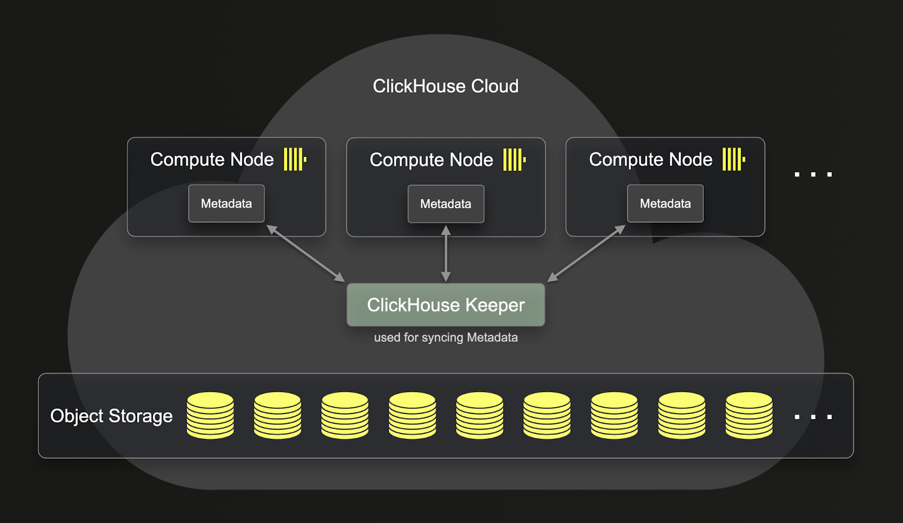
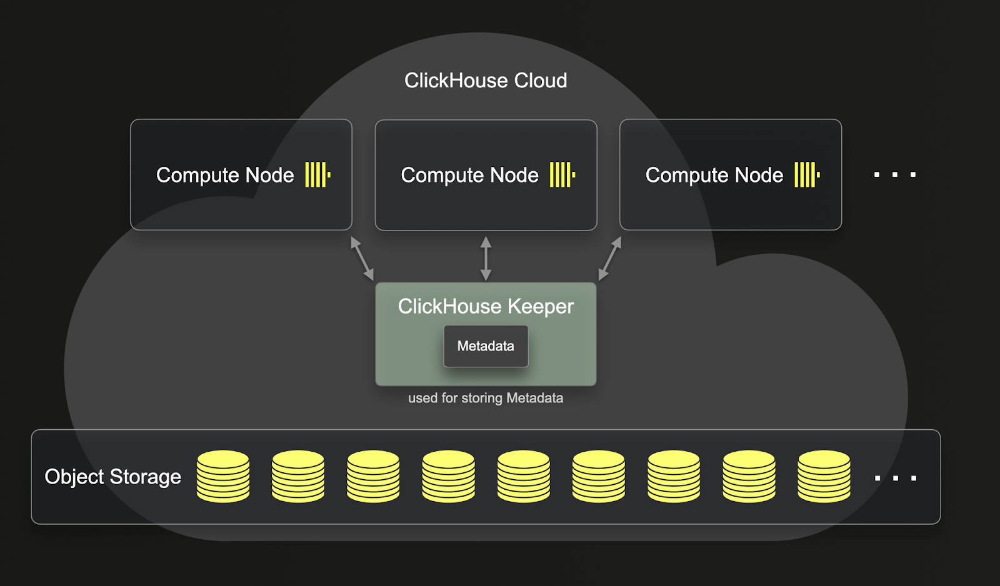

# SharedMergeTree テーブルエンジン

*\* ClickHouse Cloud（および一部のパートナークラウドサービス）でのみ利用可能*

SharedMergeTree テーブルエンジンファミリーは、ReplicatedMergeTree エンジンのクラウドネイティブな代替品であり、共有ストレージ（例：Amazon S3、Google Cloud Storage、MinIO、Azure Blob Storage）上での動作に最適化されています。特定の MergeTree エンジンタイプごとに SharedMergeTree アナログが存在し、つまり ReplacingSharedMergeTree は ReplacingReplicatedMergeTree を置き換えます。

SharedMergeTree テーブルエンジンファミリーは、ClickHouse Cloud の基盤です。エンドユーザーにとって、ReplicatedMergeTree ベースのエンジンを使用する代わりに SharedMergeTree エンジンファミリーを使い始めるために何かを変更する必要はありません。以下の追加の利点を提供します：

- 高い挿入スループット
- バックグラウンドマージのスループットの向上
- ミューテーションのスループットの向上
- スケールアップおよびスケールダウン操作の高速化
- 選択クエリのより軽量な強整合性

SharedMergeTree がもたらす重要な改善点は、ReplicatedMergeTree に比べて計算とストレージのより深い分離を提供することです。以下で ReplicatedMergeTree が計算とストレージをどのように分離するかを確認できます：



ご覧のとおり、ReplicatedMergeTree に保存されたデータはオブジェクトストレージにありますが、メタデータは依然として各 clickhouse-server に存在します。つまり、すべてのレプリケーション操作のために、メタデータもすべてのレプリカにレプリケートされる必要があります。



ReplicatedMergeTree とは異なり、SharedMergeTree はレプリカ同士の通信を必要としません。代わりに、すべての通信は共有ストレージと clickhouse-keeper を通じて行われます。SharedMergeTree は非同期のリーダーレスレプリケーションを実装し、clickhouse-keeper を調整およびメタデータストレージに使用します。これは、サービスのスケールアップおよびスケールダウンに伴ってメタデータをレプリケートする必要がないことを意味します。これにより、レプリケーション、ミューテーション、マージおよびスケールアップの操作が高速化されます。SharedMergeTree は各テーブルに対して何百ものレプリカを可能にし、シャードなしで動的にスケールすることができます。ClickHouse Cloud では、分散クエリ実行アプローチが採用され、より多くのコンピュートリソースがクエリに利用されます。

## 内部監視

ReplicatedMergeTree の内部監視に使用されるほとんどのシステムテーブルは、SharedMergeTree にも存在しますが、データとメタデータのレプリケーションが発生しないため、`system.replication_queue` と `system.replicated_fetches` は含まれていません。しかし、SharedMergeTree にはこれら2つのテーブルに対応する代替案があります。

**system.virtual_parts**

このテーブルは `system.replication_queue` に対する SharedMergeTree の代替として機能します。現在のパーツの最新セット、ならびにマージ、ミューテーション、および削除されたパーティションなどの進行中の将来のパーツに関する情報を格納します。

**system.shared_merge_tree_fetches**

このテーブルは `system.replicated_fetches` に対する SharedMergeTree の代替です。メモリに読み込まれる主キーとチェックサムの進行中のフェッチに関する情報を含みます。

## SharedMergeTree の有効化

`SharedMergeTree` はデフォルトで有効になっています。

SharedMergeTree テーブルエンジンをサポートするサービスでは、手動で何かを有効にする必要はありません。以前と同様にテーブルを作成すると、CREATE TABLE クエリで指定されたエンジンに対応する SharedMergeTree ベースのテーブルエンジンが自動的に使用されます。

```sql
CREATE TABLE my_table(
 key UInt64,
 value String
)
ENGINE = MergeTree
ORDER BY key 
```

これにより、SharedMergeTree テーブルエンジンを使用して `my_table` テーブルが作成されます。

ClickHouse Cloud では `default_table_engine=MergeTree` として設定されているため、`ENGINE=MergeTree` を指定する必要はありません。以下のクエリは、上記のクエリと同一です。

```sql
CREATE TABLE my_table(
 key UInt64,
 value String
)
ORDER BY key 
```

もし Replacing, Collapsing, Aggregating, Summing, VersionedCollapsing, または Graphite MergeTree テーブルを使用すると、それに対応する SharedMergeTree ベースのテーブルエンジンに自動的に変換されます。

```sql
CREATE TABLE myFirstReplacingMT
(
    `key` Int64,
    `someCol` String,
    `eventTime` DateTime
)
ENGINE = ReplacingMergeTree
ORDER BY key;
```

特定のテーブルについて、`CREATE TABLE` ステートメントで使用されたテーブルエンジンを確認するには、`SHOW CREATE TABLE` を使用します。
``` sql
SHOW CREATE TABLE myFirstReplacingMT;
```

```sql
CREATE TABLE default.myFirstReplacingMT 
( `key` Int64, `someCol` String, `eventTime` DateTime ) 
ENGINE = SharedReplacingMergeTree('/clickhouse/tables/{uuid}/{shard}', '{replica}') 
ORDER BY key 
SETTINGS index_granularity = 8192
```

## 設定

いくつかの設定の挙動が大幅に変更されています：

- `insert_quorum` -- すべての SharedMergeTree への挿入はクオーラム挿入（共有ストレージに書き込まれる）ですので、この設定は SharedMergeTree テーブルエンジンを使用する際には必要ありません。
- `insert_quorum_parallel` -- すべての SharedMergeTree への挿入はクオーラム挿入（共有ストレージに書き込まれる）ですので、この設定は SharedMergeTree テーブルエンジンを使用する際には必要ありません。
- `select_sequential_consistency` -- クオーラム挿入を必要とせず、`SELECT` クエリに追加の負荷を clickhouse-keeper にかけます。

## 一貫性

SharedMergeTree は、ReplicatedMergeTree よりも軽量な一貫性を提供します。SharedMergeTree に挿入する際には、`insert_quorum` や `insert_quorum_parallel` のような設定を提供する必要はありません。挿入はクオーラム挿入であり、メタデータは ClickHouse-Keeper に保存され、メタデータは少なくとも ClickHouse-keepers のクオーラムに複製されます。クラスター内の各レプリカは、非同期に ClickHouse-Keeper から新しい情報をフェッチします。

通常、`select_sequential_consistency` や `SYSTEM SYNC REPLICA LIGHTWEIGHT` を使用する必要はありません。非同期レプリケーションはほとんどのシナリオをカバーし、非常に低いレイテンシーを持っています。どうしても古いデータを読みたくない場合には、以下の推奨事項を優先順位に従って実行してください：

1. クエリを同じセッションまたは同じノードで読み書きしている場合、`select_sequential_consistency` は必要ありません。すでにレプリカが最新のメタデータを持っているからです。

2. 一方のレプリカに書き込み、別のレプリカから読み取る場合、`SYSTEM SYNC REPLICA LIGHTWEIGHT` を使用して、レプリカが ClickHouse-Keeper からメタデータを取得するように強制できます。

3. クエリの一部として `select_sequential_consistency` という設定を使用します。

## 関連コンテンツ

- [ClickHouse Cloud が SharedMergeTree と軽量アップデートでパフォーマンスを向上](https://clickhouse.com/blog/clickhouse-cloud-boosts-performance-with-sharedmergetree-and-lightweight-updates)
