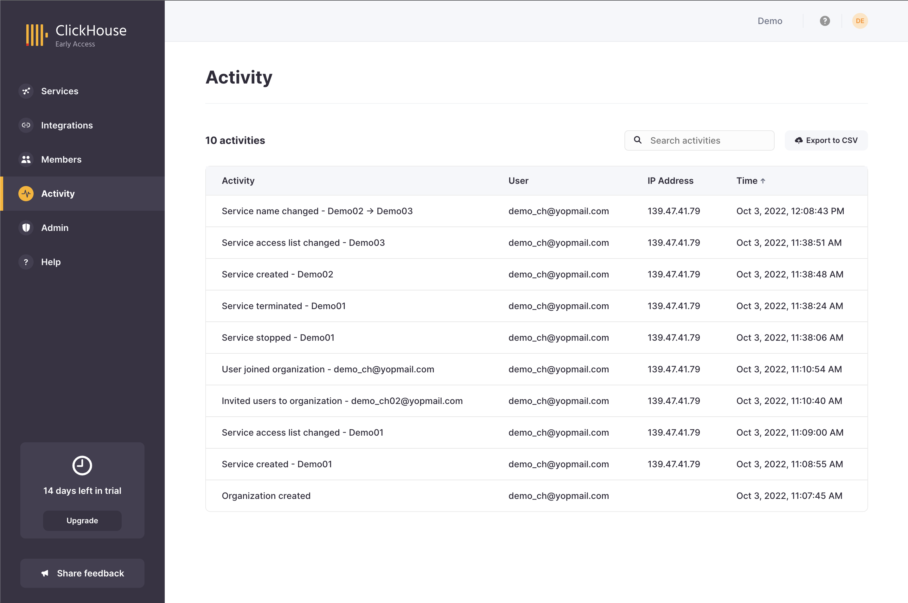
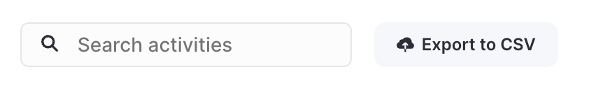

ClickHouse Cloud では、左側のメニューにある**アクティビティ**タブを使って、あなたの ClickHouse Cloud オーガニゼーションに対してどのような変更が行われたか、誰が変更を行ったのか、いつ行われたのかを確認することができます。

 

**アクティビティ**ページでは、オーガニゼーションに関するイベントのリストがログに記録されたテーブルを表示します。デフォルトでは、このリストは逆時系列（最新のイベントが上部）でソートされています。テーブルの順序は、各カラムのヘッダーをクリックすることで変更できます。テーブルの各項目には以下のフィールドが含まれています:

- **アクティビティ:** イベントを説明するテキストスニペット
- **ユーザー:** イベントを開始したユーザー
- **IP アドレス:** 該当する場合、イベントを開始したユーザーの IP アドレス
- **時間:** イベントのタイムスタンプ

 

提供されている検索バーを使用して、サービス名や IP アドレスなどの基準に基づいてイベントを絞り込むことができます。また、この情報を CSV 形式でエクスポートして、外部ツールで配布や分析に使用することもできます。

## ログ記録されたイベントの一覧

オーガニゼーション用にキャプチャされたさまざまな種類のイベントは、**サービス**、**オーガニゼーション**、および **ユーザー**の3つのカテゴリにグループ化されています。ログ記録されたイベントのリストには次のものが含まれます:

### サービス

- サービスが作成されました
- サービスが削除されました
- サービスが停止されました
- サービスが開始されました
- サービス名が変更されました
- サービス IP アクセスリストが変更されました
- サービスのパスワードがリセットされました

### オーガニゼーション

- オーガニゼーションが作成されました
- オーガニゼーションが削除されました
- オーガニゼーション名が変更されました

### ユーザー

- ユーザーの役割が変更されました
- ユーザーがオーガニゼーションから削除されました
- ユーザーがオーガニゼーションに招待されました
- ユーザーがオーガニゼーションに参加しました
- ユーザー招待が削除されました
- ユーザーがオーガニゼーションから退出しました
